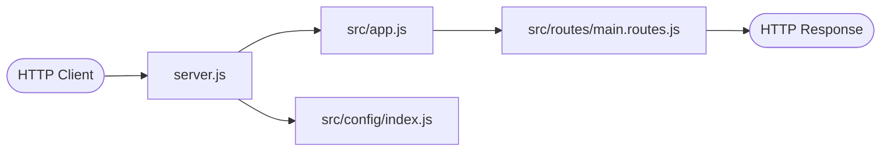

# Technical Specification

# 0. Agent Action Plan

## 0.1 Intent Clarification


### 0.1.1 Core Documentation Objective

Based on the provided requirements, the Blitzy platform understands that the documentation objective is to **enhance and consolidate documentation for the `hello_world` Express.js tutorial server** by accomplishing three complementary goals: enriching `server.js` with comprehensive JSDoc annotations and inline explanatory comments, upgrading the project-level `README.md` into a definitive developer guide (covering setup, API reference, and deployment), and embedding instructional inline code explanations throughout the entry-point module.

**Documentation Request Category:** Update existing documentation | Improve documentation coverage

**Documentation Type:** API docs (JSDoc) | README file (comprehensive guide) | Deployment guide | Inline code explanations

The user's requirements decompose into the following discrete documentation objectives:

| # | User Requirement | Enhanced Interpretation |
|---|---|---|
| DOC-001 | "Add JSDoc comments to server.js functions" | Enhance `server.js` with JSDoc annotations for every exported symbol, function parameter, callback, return type, thrown error, and module-level documentation. Existing JSDoc (`@module server`, `@type` annotations on `app` and `config` constants, and a description for `app.listen`) must be audited for completeness and enhanced where gaps exist — specifically the anonymous callback passed to `app.listen()` and the startup logging behaviour. |
| DOC-002 | "Create a comprehensive README" | Update the existing `README.md` (currently 338 lines covering prerequisites, installation, API, project structure, architecture, testing, and troubleshooting) into a fully comprehensive project guide. The word "create" implies the user expects a substantially expanded document rather than a net-new file. |
| DOC-003 | "Setup instructions" | Ensure the README includes complete environment setup, prerequisites verification, dependency installation, and first-run instructions with expected outputs. The current README already contains these sections but they should be reviewed for completeness and enhanced with deployment-context awareness. |
| DOC-004 | "API documentation" | Provide exhaustive HTTP API reference within the README covering every endpoint (`GET /`, `GET /evening`), request/response contracts, Content-Type headers, status codes, response body semantics (including trailing newline distinctions), error behaviour for unknown routes, and curl examples. |
| DOC-005 | "Deployment guide" | Add a new **Deployment Guide** section to the README. This section is currently absent from the existing documentation and must cover production environment variables, binding to network interfaces (`0.0.0.0`), process management recommendations, reverse proxy considerations, and security notes. |
| DOC-006 | "Inline code explanations" | Add clear, instructional inline comments within `server.js` that explain the purpose and rationale behind each code block — dependency imports, configuration loading, server binding, and the startup callback. These complement JSDoc by providing human-readable narrative alongside formal API annotations. |

**Inferred Documentation Needs:**

Based on repository analysis, the following implicit documentation needs are surfaced:

- `server.js` already contains module-level JSDoc (`@module server`) and `@type` annotations for `app` and `config` constants (Source: `server.js:1-37`). The `app.listen()` call at line 49 has a description block but lacks `@param` and `@returns` tags for the callback. The anonymous arrow function `() => { console.log(...) }` on line 49 has no dedicated JSDoc. These are the primary JSDoc gaps.
- The existing README at `README.md` is already substantial (338 lines). However, it lacks a dedicated **Deployment Guide** section, and could benefit from consolidated inline code walkthroughs.
- Source files `src/app.js`, `src/config/index.js`, `src/routes/index.js`, and `src/routes/main.routes.js` already possess complete JSDoc annotations including `@module`, `@type`, `@route`, and `@returns` tags. These files are NOT in scope for JSDoc modifications unless the README references them for architectural context.

### 0.1.2 Special Instructions and Constraints

- No specific directives regarding documentation style, templates, or minimal changes were provided by the user.
- No templates or examples were supplied.
- No design system or Figma attachments are referenced.
- The project follows existing conventions: CommonJS module system, `'use strict'` directive, JSDoc annotations using `/** ... */` multi-line blocks with standard tags (`@module`, `@type`, `@param`, `@returns`, `@route`, `@default`).
- The existing README uses GitHub-Flavored Markdown (GFM) with tables, fenced code blocks, and hierarchical heading structure.

### 0.1.3 Technical Interpretation

These documentation requirements translate to the following technical documentation strategy:

- To **enrich server.js JSDoc** (DOC-001), we will update `server.js` by adding formal `@param` and `@callback` annotations to the `app.listen()` invocation, documenting the anonymous startup callback with `@fires` or `@see` references, and ensuring every constant and function-expression has complete type annotations including `@example` usage.
- To **create a comprehensive README** (DOC-002), we will update `README.md` to consolidate and expand existing sections, ensuring a complete developer-facing guide with progressive disclosure from quick-start to deep-dive architecture.
- To **document setup instructions** (DOC-003), we will review and enhance the existing Prerequisites, Installation, and Usage sections in `README.md` with verification commands and expected outputs.
- To **provide API documentation** (DOC-004), we will expand the existing API Reference section in `README.md` with complete request/response contracts, error handling documentation, and additional curl examples.
- To **create a deployment guide** (DOC-005), we will add a new `## Deployment` section to `README.md` covering production configuration, process management, and network binding.
- To **add inline code explanations** (DOC-006), we will update `server.js` with descriptive inline comments (`//`) explaining each functional block's purpose and design rationale alongside the existing section-separator comments.


## 0.2 Documentation Discovery and Analysis


### 0.2.1 Existing Documentation Infrastructure Assessment

Repository analysis reveals a well-documented Node.js Express.js tutorial server with inline JSDoc annotations already present across all source files, multiple sub-directory READMEs, and a comprehensive root-level README. No external documentation generator (JSDoc CLI, MkDocs, Docusaurus, Sphinx, etc.) is configured.

**Documentation Files Discovered:**

| File Path | Type | Lines | Coverage Status |
|---|---|---|---|
| `README.md` | Project README | 338 | Comprehensive — covers prerequisites, install, API, structure, arch, testing, troubleshooting. Missing deployment guide. |
| `src/README.md` | Architecture Documentation | — | Covers factory pattern, module relationships for the `src/` layer |
| `src/config/README.md` | Module Documentation | — | Documents Twelve-Factor config, environment variables, usage examples |
| `src/routes/README.md` | Module Documentation | — | Documents route definitions, barrel pattern, how to add new routes |
| `tests/README.md` | Test Documentation | — | Documents test categories (unit/integration/lifecycle), running tests, coverage requirements |
| `blitzy/documentation/Project Guide.md` | Project Guide | — | Auto-generated project guide summarizing architecture and implementation |
| `blitzy/documentation/Technical Specifications.md` | Technical Specification | — | Full technical spec with architecture, dependencies, flows, deployment |

**Documentation Framework:** None. No `jsdoc.json`, `mkdocs.yml`, `docusaurus.config.js`, `.readthedocs.yml`, or `sphinx/conf.py` was found. The project relies exclusively on inline JSDoc annotations and manually authored Markdown files.

**API Documentation Tools in Use:** JSDoc annotation syntax (`/** ... */`) is used inline across all source modules. No HTML generation tool is installed (verified via `grep -r "jsdoc\|typedoc" package.json` — no results).

**Diagram Tools Detected:** The existing `README.md` uses ASCII architecture diagrams. No Mermaid, PlantUML, or D2 configuration files are present.

**Documentation Hosting/Deployment:** None. Documentation is consumed directly from the repository as Markdown files.

### 0.2.2 Repository Code Analysis for Documentation

**Search patterns used for code to document:**

| Pattern | Directory | Findings |
|---|---|---|
| Server entry point | `server.js` | Entry module — 53 lines, has `@module server`, `@type` annotations on `app` and `config` imports, JSDoc on `app.listen()`. Missing: `@param`/`@callback` on listen callback, `@example` blocks, inline narrative comments. |
| Express app factory | `src/app.js` | Application factory — 28 lines, has `@module src/app`, documents Express app creation and route mounting. Fully documented. |
| Configuration module | `src/config/index.js` | Config exports — 42 lines, has `@module src/config`, each property (`host`, `port`, `env`) has `@type` and `@default`. Fully documented. |
| Route barrel | `src/routes/index.js` | Re-export barrel — 20 lines, has `@module src/routes`, describes barrel pattern. Fully documented. |
| Route handlers | `src/routes/main.routes.js` | GET handlers — 42 lines, has `@module src/routes/main.routes`, `@route` and `@returns` on both GET `/` and GET `/evening`. Fully documented. |
| Project configuration | `package.json` | Package metadata — name `hao-backprop-test`, version `1.0.0`, MIT license, author `hxu`, scripts: `start`, `test`, `test:coverage` |
| Test configuration | `jest.config.js` | Jest config — node environment, coverage thresholds: 75% branches, 90% functions, 80% lines/statements |
| Git ignore | `.gitignore` | Standard Node.js ignores — `node_modules/`, `coverage/`, `.env` |

**Key directories examined:**
- Root (`/`) — `server.js`, `package.json`, `README.md`, `jest.config.js`, `.gitignore`
- `src/` — `app.js`, `config/index.js`, `routes/index.js`, `routes/main.routes.js`
- `tests/` — `integration/`, `lifecycle/`, `unit/` folders with 41 total tests
- `blitzy/` — `documentation/` with Project Guide and Technical Specifications

**Existing JSDoc Gap Analysis in `server.js`:**

| Line Range | Element | Current JSDoc | Gap |
|---|---|---|---|
| 1–17 | Module header | `@module server` with Architecture and Usage sections | None — complete |
| 25–30 | `const app` | `@type {import('express').Application}` | None — complete |
| 32–37 | `const config` | `@type {{ host: string, port: number, env: string }}` | None — complete |
| 43–52 | `app.listen()` | Description block only — "Starts the Express.js HTTP server..." | Missing `@param`, `@callback`, `@returns`, `@example`, and `@fires` tags. The anonymous callback function has no standalone documentation. |
| 49 | Callback `() => { console.log(...) }` | No JSDoc | Missing — needs `@callback` or inline documentation |
| General | Inline explanations | Only section-separator comments exist | Missing — needs narrative inline comments explaining each block |

### 0.2.3 Web Search Research Conducted

- **JSDoc best practices for Node.js/Express:** Research confirmed that JSDoc 4.0.5 is the latest stable version. Standard practice includes `@module` for CommonJS modules, `@type` for variable annotations, `@param` and `@returns` for functions, `@callback` for anonymous function documentation, and `@example` blocks for usage illustrations. Comments must use `/** ... */` blocks to be parsed.
- **Documentation structure conventions:** For small Express.js projects, a single comprehensive README with setup, API reference, and deployment sections is considered best practice, with JSDoc annotations embedded directly in source files for API-level documentation.
- **Express.js API documentation patterns:** Recommended practice includes documenting endpoints with `@route`, request/response types, status codes, and curl examples.


## 0.3 Documentation Scope Analysis


### 0.3.1 Code-to-Documentation Mapping

**Modules requiring documentation changes:**

- **Module: `server.js` (Entry Point)**
  - Public APIs: `app.listen(port, host, callback)` invocation, module-scoped constants `app`, `config`
  - Current documentation: Partial — module header and `@type` annotations exist; `app.listen()` lacks formal parameter and callback JSDoc; inline explanations are absent
  - Documentation needed: Enhanced JSDoc with `@param`, `@callback`, `@example`, `@see` tags on the listen call; comprehensive inline comments explaining each block's purpose and design rationale; expanded module-level description with architectural context

- **Module: `src/app.js` (Application Factory)**
  - Public APIs: Default export of configured Express `app` instance
  - Current documentation: Complete — `@module src/app` with full description
  - Documentation needed: None (already fully documented). Referenced in README for architectural context only.

- **Module: `src/config/index.js` (Configuration)**
  - Public APIs: Exports `{ host, port, env }`
  - Current documentation: Complete — `@module src/config`, `@type` and `@default` on each property
  - Documentation needed: None (already fully documented). Referenced in README environment variable section.

- **Module: `src/routes/index.js` (Route Barrel)**
  - Public APIs: Re-exports `{ mainRoutes }`
  - Current documentation: Complete — `@module src/routes` with barrel pattern description
  - Documentation needed: None.

- **Module: `src/routes/main.routes.js` (Route Handlers)**
  - Public APIs: `GET /` and `GET /evening` handlers, `mainRoutes` Router export
  - Current documentation: Complete — `@module`, `@route`, `@returns` on each handler
  - Documentation needed: None. Referenced in README API documentation section.

**Configuration options requiring documentation in README:**

| Config Property | Source | Current README Coverage | Gap |
|---|---|---|---|
| `PORT` | `src/config/index.js:21` | Documented in Environment Variables table | None |
| `HOST` | `src/config/index.js:14` | Documented in Environment Variables table | None |
| `NODE_ENV` | `src/config/index.js:28` | Documented in Environment Variables table | None |
| Production deployment config | N/A | Not documented | Missing — needs deployment guide section |

**Features requiring documentation:**

| Feature | Current Coverage | Gaps |
|---|---|---|
| Server startup/shutdown | Basic in README Usage section | Needs deployment guide with process management |
| GET `/` endpoint | Documented with curl example | Needs enhanced response schema and error docs |
| GET `/evening` endpoint | Documented with curl example | Needs enhanced response schema and error docs |
| Error handling (404) | Not documented in README | Missing — Express default 404 behaviour |
| Testing | Covered in README Testing section | Adequate |
| Architecture | Covered in README with ASCII diagram | Adequate — could enhance with Mermaid |

### 0.3.2 Documentation Gap Analysis

Given the requirements and repository analysis, the documentation gaps include:

**Undocumented or under-documented areas:**

- **`server.js` JSDoc completeness**: The `app.listen()` call (line 43–52) lacks `@param` tags for `config.port`, `config.host`, and the anonymous callback. The anonymous startup callback (`() => { console.log(...) }`) has no `@callback` or `@function` documentation. No `@example` blocks exist anywhere in the file.
- **`server.js` inline explanations**: The file uses only minimal `// ---` section separators. There are no narrative comments explaining *why* the strict mode is used, why the app factory pattern is employed, why the config is destructured as an object import, or what the listen callback achieves beyond its implementation.
- **Deployment documentation**: The existing README has zero coverage of deployment topics — no production configuration, no process management (PM2, systemd), no reverse proxy setup, no Docker considerations, no security hardening notes.
- **Error behaviour documentation**: The README documents happy-path API responses but does not document what happens when the user hits an undefined route (Express default 404 JSON or HTML response) or when the server fails to bind.
- **README Deployment Guide**: Entirely absent — must be created from scratch within the README to cover production environment variables, bind address (`0.0.0.0` vs `127.0.0.1`), process supervision, and graceful shutdown.

**Already-complete documentation (no changes needed):**

- `src/app.js` — JSDoc is comprehensive
- `src/config/index.js` — JSDoc is comprehensive with `@type` and `@default`
- `src/routes/index.js` — JSDoc is comprehensive
- `src/routes/main.routes.js` — JSDoc is comprehensive with `@route` and `@returns`
- `src/README.md` — Architecture documentation complete
- `src/config/README.md` — Configuration documentation complete
- `src/routes/README.md` — Route documentation complete
- `tests/README.md` — Test documentation complete


## 0.4 Documentation Implementation Design


### 0.4.1 Documentation Structure Planning

The project's documentation footprint remains file-based Markdown and inline JSDoc. No documentation site generator will be introduced, consistent with the project's minimal tutorial-server nature. The documentation structure after implementation will be:

```
/ (repository root)
├── README.md                      (UPDATE — comprehensive project guide)
│   ├── Overview / Introduction
│   ├── Prerequisites
│   ├── Installation & Setup
│   ├── Usage & Custom Configuration
│   ├── API Reference (GET /, GET /evening, error behaviour)
│   ├── Project Structure
│   ├── Architecture & Design Patterns
│   ├── Deployment Guide (NEW section)
│   │   ├── Production Configuration
│   │   ├── Process Management
│   │   ├── Reverse Proxy
│   │   └── Security Considerations
│   ├── Environment Variables
│   ├── Dependencies
│   ├── Scripts Reference
│   ├── Testing
│   ├── Troubleshooting
│   └── License & Author
├── server.js                      (UPDATE — enhanced JSDoc + inline explanations)
├── src/
│   ├── README.md                  (NO CHANGE — already complete)
│   ├── app.js                     (NO CHANGE — JSDoc already complete)
│   ├── config/
│   │   ├── README.md              (NO CHANGE — already complete)
│   │   └── index.js               (NO CHANGE — JSDoc already complete)
│   └── routes/
│       ├── README.md              (NO CHANGE — already complete)
│       ├── index.js               (NO CHANGE — JSDoc already complete)
│       └── main.routes.js         (NO CHANGE — JSDoc already complete)
└── tests/
    └── README.md                  (NO CHANGE — already complete)
```

### 0.4.2 Content Generation Strategy

**Information Extraction Approach:**

- "Extract function signatures and type information from `server.js` (Source: `server.js:25-52`) for JSDoc parameter, return, and callback annotations"
- "Extract API endpoint definitions from `src/routes/main.routes.js` (Source: `src/routes/main.routes.js:18-42`) for README API reference enhancement"
- "Extract environment variable defaults from `src/config/index.js` (Source: `src/config/index.js:14-28`) for deployment guide configuration section"
- "Generate deployment guidance by analyzing server binding logic in `server.js:49` and config module patterns in `src/config/index.js`"
- "Create inline code explanations by analyzing each block in `server.js` against architecture documentation in the tech spec Section 5.1 (High-Level Architecture)"

**Documentation Standards:**

- Markdown formatting with proper heading hierarchy (`#` through `####`)
- Mermaid diagram integration for architecture visualization using fenced code blocks
- Code examples using language-annotated fenced blocks (`javascript`, `bash`)
- Source citations as inline references: `Source: /path/to/file.js:LineNumber`
- Tables for parameter descriptions, environment variables, and API response fields
- Consistent use of existing README terminology and style conventions

### 0.4.3 Diagram and Visual Strategy

**Mermaid diagrams to create within the README:**

- **Request-Response Flow Diagram**: A sequence diagram showing the client → `server.js` → `src/app.js` → `src/routes/main.routes.js` → HTTP response flow. This replaces or supplements the existing ASCII architecture diagram in the README.

- **Module Dependency Diagram**: A graph diagram showing the `require()` dependency tree: `server.js` → `src/app` and `src/config`, `src/app` → `src/routes/index` → `src/routes/main.routes`, with Express as an external dependency.

- **Server Lifecycle Diagram**: A state diagram depicting startup → listening → request handling → shutdown lifecycle for the deployment guide section.

**Diagram specifications:**


```mermaid
graph LR
    Client([HTTP Client]) --> Server[server.js]
    Server --> App[src/app.js]
    App --> Routes[src/routes/main.routes.js]
    Routes --> Response([HTTP Response])
    Server --> Config[src/config/index.js]
```

### 0.4.4 JSDoc Enhancement Strategy for server.js

The JSDoc enhancement for `server.js` follows a structured approach targeting three categories of documentation gaps:

**Category 1 — Formal Tag Completion:**
- Add `@listens` tag to the `app.listen()` call to document the binding address
- Add `@see` references linking to `src/app.js` and `src/config/index.js`
- Add `@example` blocks showing how to start the server and expected console output
- Add `@requires` tags for the `./src/app` and `./src/config` module dependencies

**Category 2 — Callback Documentation:**
- Document the anonymous arrow function callback with a `@callback` definition or inline JSDoc block describing its purpose (console logging on successful bind), its relationship to the listen event, and the absence of error handling in the callback signature

**Category 3 — Inline Narrative Comments:**
- Add explanatory comments for the `'use strict'` directive: why strict mode is enforced
- Add comments for the module imports: factory pattern rationale, Twelve-Factor config loading
- Add comments for the `app.listen()` call: binding semantics, callback purpose
- Add comments for the `console.log()` output: operational visibility, structured startup message format


## 0.5 Documentation File Transformation Mapping


### 0.5.1 File-by-File Documentation Plan

| Target Documentation File | Transformation | Source Code/Docs | Content/Changes |
|---|---|---|---|
| `server.js` | UPDATE | `server.js` | Enhance existing JSDoc annotations: add `@listens`, `@requires`, `@see`, `@example`, and `@callback` tags to `app.listen()` block; add inline narrative comments explaining strict mode, factory pattern import, Twelve-Factor config import, server binding semantics, and startup callback purpose |
| `README.md` | UPDATE | `README.md`, `src/routes/main.routes.js`, `src/config/index.js`, `server.js` | Expand API Reference with response schemas and error behaviour; add new Deployment Guide section covering production config, process management, reverse proxy, and security; add Mermaid architecture diagram; enhance setup instructions with verification steps |

### 0.5.2 Source Files to Update — Detail

**File: `server.js` — Enhanced JSDoc and Inline Code Explanations**

```
File: server.js
Type: Source Code with JSDoc and Inline Comments
Source Code: server.js (self — updating existing content)
Changes by Section:
    - Module Header (lines 1–17): Add @requires tags for ./src/app and ./src/config
    - Strict Mode (line 19): Add inline comment explaining strict mode enforcement
    - App Import (lines 25–30): Add @see tag referencing src/app.js; add inline comment
      explaining factory pattern import rationale
    - Config Import (lines 32–37): Add @see tag referencing src/config/index.js; add
      inline comment explaining Twelve-Factor configuration loading
    - app.listen() Block (lines 43–52): Add @listens tag, @example block showing
      startup command and expected output, enhance description with error handling notes
    - Callback Function (line 49): Add @callback ServerStartCallback typedef or
      inline JSDoc block documenting the startup logging callback
    - Console.log (line 50): Add inline comment explaining startup message format
Key Citations: server.js, src/app.js, src/config/index.js
```

Specific JSDoc additions for `server.js`:

- `@requires module:src/app` — documents the app.js dependency
- `@requires module:src/config` — documents the config dependency
- `@see module:src/app` — cross-references the application factory
- `@see module:src/config` — cross-references the configuration module
- `@listens {number} config.port` — documents the port binding
- `@example` block — shows `node server.js` with expected console output
- `@callback ServerStartCallback` — defines the startup callback type

Inline comments to add:

- Line 19 (`'use strict'`): Explain that strict mode prevents silent errors and enforces safer JavaScript parsing
- Lines 25–30 (app import): Explain that the Express application is imported as a fully configured instance from the factory module
- Lines 32–37 (config import): Explain that configuration is externalized following Twelve-Factor methodology, loaded from environment variables with sensible defaults
- Lines 43–52 (app.listen): Explain that this binds the Express application to the configured host and port, initiating the HTTP server event loop
- Line 49 (callback): Explain that the callback executes once the server has successfully bound, providing operational visibility via console output

**File: `README.md` — Comprehensive README Enhancement**

```
File: README.md
Type: Project README (Markdown)
Source Code: README.md (existing), src/routes/main.routes.js, src/config/index.js, server.js
Changes by Section:
    - API Reference: Expand with response Content-Type headers, status codes for
      success and error paths, response body details (newline in GET /, no newline
      in GET /evening), add 404 behaviour documentation, enhance curl examples
    - Deployment Guide (NEW): Create complete section covering:
      - Production environment variables (HOST=0.0.0.0, NODE_ENV=production)
      - Process management with PM2 or systemd
      - Reverse proxy configuration with nginx
      - Security considerations (Helmet.js, rate limiting)
      - Health check endpoint recommendations
      - Graceful shutdown patterns
    - Architecture Diagram: Add Mermaid request-response flow diagram
      supplementing existing ASCII diagram
    - Setup Instructions: Add verification commands (node --version, npm --version)
      with expected output ranges
Diagrams:
    - Mermaid request-response flow diagram
    - Mermaid module dependency graph
    - Mermaid server lifecycle state diagram (in deployment section)
Key Citations: server.js, src/app.js, src/config/index.js, src/routes/main.routes.js
```

### 0.5.3 Documentation Files Requiring No Changes

The following files were evaluated and require no modifications:

| File Path | Reason |
|---|---|
| `src/README.md` | Architecture documentation is complete — covers factory pattern and module relationships |
| `src/config/README.md` | Configuration documentation is complete — covers Twelve-Factor config, env vars, usage examples |
| `src/routes/README.md` | Route documentation is complete — covers route definitions, barrel pattern, extension guide |
| `tests/README.md` | Test documentation is complete — covers test categories, running tests, coverage requirements |
| `src/app.js` | JSDoc annotations are comprehensive — `@module`, description, middleware, exports |
| `src/config/index.js` | JSDoc annotations are comprehensive — `@module`, `@type`, `@default` on all exports |
| `src/routes/index.js` | JSDoc annotations are comprehensive — `@module`, barrel pattern documentation |
| `src/routes/main.routes.js` | JSDoc annotations are comprehensive — `@module`, `@route`, `@returns` on all handlers |
| `jest.config.js` | Configuration file — no documentation changes needed |
| `package.json` | Package manifest — no documentation changes needed |
| `.gitignore` | Git configuration — no documentation changes needed |

### 0.5.4 Documentation Configuration Updates

No documentation configuration files need to be created or updated. The project does not use a documentation site generator. All documentation is authored directly in Markdown and JSDoc. No `mkdocs.yml`, `docusaurus.config.js`, `.readthedocs.yml`, `jsdoc.json`, or similar configuration files exist or are required.

If the team elects to add JSDoc HTML generation in the future, a `jsdoc.json` configuration file would need to be created with source paths pointing to `server.js` and `src/` with recursive scanning enabled.

### 0.5.5 Cross-Documentation Dependencies

- **Internal cross-references in README**: The Deployment Guide section will reference the Environment Variables table already present in the README. The API Reference section references route implementations in `src/routes/main.routes.js`.
- **JSDoc cross-references in server.js**: New `@see` tags will link to `module:src/app` and `module:src/config`. New `@requires` tags will declare module dependencies.
- **Navigation**: No table of contents update is needed — the existing README does not use an auto-generated TOC. If one is present, it should be updated to include the new Deployment Guide section.
- **No shared content/includes**: The project does not use documentation includes, partials, or templating systems.


## 0.6 Dependency Inventory


### 0.6.1 Documentation Dependencies

The documentation task — adding JSDoc inline annotations and enhancing the Markdown README — does not require any new runtime or devDependency packages. JSDoc comments are authored directly in JavaScript source files and parsed by IDEs and editors natively. The README is standard GitHub-Flavored Markdown rendered by repository hosting platforms without tooling.

**Current project dependencies relevant to the documentation context:**

| Registry | Package Name | Version | Purpose |
|---|---|---|---|
| npm | express | 5.1.0 | Production dependency — HTTP framework whose API is documented in JSDoc and README |
| npm | jest | 30.2.0 | Dev dependency — test framework referenced in README testing section |
| npm | supertest | 7.1.4 | Dev dependency — HTTP assertion library referenced in README testing section |

**Optional documentation tooling (not currently installed, not required for this task):**

| Registry | Package Name | Version | Purpose |
|---|---|---|---|
| npm | jsdoc | 4.0.5 | JSDoc HTML documentation generator — could generate an HTML doc site from the JSDoc comments being added. Not required for the current task scope (inline annotation only). |

No new dependencies need to be added to `package.json` for this documentation task. The JSDoc annotations are pure comment syntax within JavaScript files and require no build-time or runtime tooling. Mermaid diagrams embedded in the README are rendered by GitHub's Markdown renderer natively.

### 0.6.2 Documentation Reference Updates

**Documentation files requiring internal link verification:**

- `README.md` — The existing README contains relative links to project files and sections. After adding the new Deployment Guide section, the table of contents (if present) must be updated to include the new heading. Internal anchor links to the Environment Variables section from the Deployment Guide must be verified.

**No link transformation rules apply** — no URLs or paths are being renamed or relocated. All changes are content additions/enhancements within existing file locations.


## 0.7 Coverage and Quality Targets


### 0.7.1 Documentation Coverage Metrics

**Current coverage analysis:**

| Category | Documented | Total | Current Coverage | Target |
|---|---|---|---|---|
| Public APIs (JSDoc) in `server.js` | 3 of 5 elements | 5 (module header, `app` const, `config` const, `app.listen()`, startup callback) | 60% | 100% |
| Public APIs (JSDoc) in `src/` modules | 4 of 4 modules | 4 (`app.js`, `config/index.js`, `routes/index.js`, `routes/main.routes.js`) | 100% | 100% (no change) |
| README sections | 11 of 12 needed | 12 (Overview, Prerequisites, Install, Usage, API, Structure, Architecture, Env Vars, Dependencies, Scripts, Testing, Troubleshooting, **Deployment**) | 92% | 100% |
| API endpoints documented in README | 2 of 2 endpoints | 2 (`GET /`, `GET /evening`) | 100% (basic) | 100% (enhanced with schemas/errors) |
| Inline code explanations in `server.js` | 0 of 5 blocks | 5 (strict mode, app import, config import, listen call, callback) | 0% | 100% |
| Environment variables documented | 3 of 3 | 3 (`PORT`, `HOST`, `NODE_ENV`) | 100% | 100% (no change) |
| Error behaviour documented | 0 of 2 scenarios | 2 (404 unknown route, server bind failure) | 0% | 100% |
| Deployment coverage | 0 of 5 topics | 5 (prod config, process mgmt, reverse proxy, security, health check) | 0% | 100% |

**Coverage gaps to address:**

- `server.js` JSDoc: Currently 60% annotated — the `app.listen()` invocation and its anonymous callback lack formal JSDoc tags. Target 100% with `@listens`, `@requires`, `@see`, `@example`, and `@callback` additions.
- `server.js` inline explanations: Currently 0% — no narrative inline comments exist beyond section separators. Target 100% with explanatory comments on every functional block.
- README Deployment Guide: Currently 0% — section does not exist. Target 100% with complete production deployment coverage.
- README Error Behaviour: Currently 0% — only happy-path responses documented. Target 100% with 404 and server error documentation.

### 0.7.2 Documentation Quality Criteria

**Completeness requirements:**

- All `server.js` constants and function expressions have complete JSDoc including description, `@type` or `@param`, and cross-references (`@see`)
- The `app.listen()` call has `@listens`, `@example`, and callback documentation
- Every code block in `server.js` has an accompanying inline comment explaining its purpose and design rationale
- The README API Reference includes request method, path, response body, Content-Type, status codes, and curl examples for every endpoint
- The README Deployment Guide includes production environment variables, process management, reverse proxy, security, and health check sections
- All README sections have consistent formatting with proper heading hierarchy

**Accuracy validation:**

- JSDoc `@type` annotations must match the actual types exported by `src/config/index.js` and returned by `src/app.js`
- Code examples in `@example` blocks must be executable: `node server.js` must produce the documented console output
- API curl examples must match actual server responses (verified against `src/routes/main.routes.js` handler implementations)
- Environment variable defaults documented in the Deployment Guide must match the defaults in `src/config/index.js` (host: `'localhost'`, port: `3000`, env: `'development'`)

**Clarity standards:**

- Technical accuracy maintained with accessible, tutorial-friendly language appropriate for a learning project
- Progressive disclosure: README moves from quick-start through detailed API to advanced deployment
- Consistent terminology throughout: "server" (not "application"), "endpoint" (not "route" in user-facing docs), "environment variable" (not "config param")

**Maintainability:**

- Source citations embedded in JSDoc via `@see` cross-references
- README sections reference source files by path for traceability
- Deployment guide recommendations are generic (not tied to specific cloud providers) for longevity

### 0.7.3 Example and Diagram Requirements

| Requirement | Target Count | Format |
|---|---|---|
| JSDoc `@example` blocks in `server.js` | 1 minimum | JavaScript code block showing startup command and expected output |
| Mermaid diagrams in README | 2–3 | Request-response flow, module dependency graph, server lifecycle |
| API curl examples in README | 2 minimum (one per endpoint) | Bash code blocks with `curl` commands and expected responses |
| Deployment code examples in README | 3–4 | Bash/config blocks for PM2, systemd, nginx, env setup |
| Inline comment explanations in `server.js` | 5 minimum (one per block) | Single-line `//` comments preceding each code block |


## 0.8 Scope Boundaries


### 0.8.1 Exhaustively In Scope

**Source file documentation updates (JSDoc + inline comments):**
- `server.js` — Enhanced JSDoc annotations (`@listens`, `@requires`, `@see`, `@example`, `@callback`) and narrative inline code explanation comments

**README documentation updates:**
- `README.md` — API Reference enhancement (response schemas, error behaviour, Content-Type headers, status codes) and new Deployment Guide section (production config, process management, reverse proxy, security, health checks)

**Documentation assets (diagrams):**
- Mermaid request-response flow diagram (embedded in `README.md`)
- Mermaid module dependency graph (embedded in `README.md`)
- Mermaid server lifecycle diagram (embedded in `README.md` Deployment Guide section)

### 0.8.2 Explicitly Out of Scope

- **Source code modifications to `src/` modules**: `src/app.js`, `src/config/index.js`, `src/routes/index.js`, and `src/routes/main.routes.js` already have complete JSDoc annotations and require no changes. Only `server.js` (the entry point explicitly named in the user's request) receives documentation updates.
- **Test file modifications**: No test files in `tests/` will be created, updated, or modified. Test documentation in `tests/README.md` is already complete.
- **New documentation files**: No new standalone documentation files (e.g., `docs/` directory, `DEPLOYMENT.md`, `API.md`) will be created. All documentation changes are made within existing files (`server.js`, `README.md`).
- **Sub-directory README updates**: `src/README.md`, `src/config/README.md`, and `src/routes/README.md` are out of scope — they are already comprehensive.
- **Feature additions or code refactoring**: No server functionality, middleware, error handlers, or endpoints will be added, modified, or removed.
- **Documentation tooling installation**: No `jsdoc`, `typedoc`, `mkdocs`, `docusaurus`, or other documentation generators will be added to `package.json` or configured. The task scope is inline annotation and Markdown authoring only.
- **Deployment configuration changes**: No `Dockerfile`, `docker-compose.yml`, `PM2` ecosystem file, `nginx.conf`, or CI/CD pipeline files will be created. The Deployment Guide in the README provides guidance only.
- **Package.json script additions**: No new npm scripts (e.g., `docs`, `jsdoc`) will be added.
- **Blitzy documentation**: Files in `blitzy/documentation/` are auto-generated reference documents and will not be modified.


## 0.9 Execution Parameters


### 0.9.1 Documentation-Specific Instructions

| Parameter | Value |
|---|---|
| Documentation build command | N/A — no documentation site generator configured |
| Documentation preview command | N/A — Markdown is previewed via editor or `npx markdown-preview README.md` |
| Diagram generation command | N/A — Mermaid diagrams are embedded inline and rendered by GitHub/GitLab |
| Documentation deployment command | N/A — documentation is served directly from the repository |
| Default format | GitHub-Flavored Markdown (GFM) for README; JSDoc `/** ... */` blocks for source annotations |
| Citation requirement | Every JSDoc cross-reference uses `@see module:path` format; README sections reference source files by relative path |
| Style guide | Match existing conventions: GFM tables, fenced code blocks with language specifiers, hierarchical heading structure (`#` through `####`), CommonJS JSDoc patterns (`@module`, `@type`, `@param`, `@returns`) |
| Documentation validation | Visual inspection of Markdown rendering; JSDoc annotation syntax validation via IDE integration (VS Code IntelliSense) |

### 0.9.2 Build and Test Verification

The documentation changes do not affect the project's build or test suite. Verification that documentation changes have not introduced regressions:

- **Test suite**: `cd /tmp/blitzy/test-spec/0101 && CI=true npx jest --watchAll=false` — all 41 tests must continue to pass
- **Server startup**: `cd /tmp/blitzy/test-spec/0101 && timeout 5 node server.js` — must produce the expected startup message and exit cleanly on timeout
- **JSDoc syntax**: JSDoc comments must use `/** ... */` format (not `/* ... */` or `// ...`) to be parseable by JSDoc tools and IDE IntelliSense


## 0.10 Rules for Documentation


The following documentation rules govern all changes in this implementation. These are derived from the project's existing conventions and documentation best practices:

- **Preserve existing JSDoc style**: All new JSDoc annotations in `server.js` must follow the existing pattern used throughout the `src/` modules — multi-line `/** ... */` blocks with `@tag` annotations, consistent indentation, and descriptive prose preceding formal tags. Source reference: `src/config/index.js:1-12`, `src/routes/main.routes.js:1-15`.

- **Maintain existing README structure and tone**: The updated `README.md` must preserve the existing section ordering, heading hierarchy, table formatting, and professional tutorial-style tone. New sections (Deployment Guide) are appended in logical position after the Architecture section and before the Dependencies section.

- **No source code logic changes**: Documentation updates to `server.js` are limited to comment additions. No executable JavaScript code may be added, removed, or modified. The `server.js` file's functional behaviour must remain identical before and after documentation changes.

- **JSDoc annotations must use standard tags only**: Only well-established JSDoc tags are permitted: `@module`, `@type`, `@param`, `@returns`, `@callback`, `@see`, `@requires`, `@listens`, `@example`, `@default`, `@description`. No custom or experimental tags.

- **Inline comments use single-line format**: Inline code explanations in `server.js` must use single-line `//` comment syntax, placed on the line immediately preceding the code they describe. Multi-line inline explanations use consecutive `//` lines. JSDoc block comments (`/** ... */`) are reserved for formal API annotations.

- **Mermaid diagrams must be self-contained**: Each Mermaid diagram in the README must render correctly as a standalone block within GitHub-Flavored Markdown. No external files or dependencies. Use `graph`, `sequenceDiagram`, or `stateDiagram-v2` syntax.

- **API documentation must match actual implementation**: All HTTP endpoint documentation (methods, paths, response bodies, status codes) must be verified against the actual handler implementations in `src/routes/main.routes.js`. The GET `/` handler returns `'Hello, World!\n'` (with trailing newline); the GET `/evening` handler returns `'Good evening'` (without trailing newline).

- **Environment variable documentation must match source defaults**: All environment variable defaults documented in the README and Deployment Guide must match the defaults defined in `src/config/index.js`: `HOST` defaults to `'localhost'`, `PORT` defaults to `3000`, `NODE_ENV` defaults to `'development'`.

- **All tests must pass after documentation changes**: Since only comments are being added to `server.js`, the existing 41-test suite must pass without modification. Any failure indicates an accidental code change.


## 0.11 References


### 0.11.1 Repository Files and Folders Searched

The following files and folders were comprehensively searched and analyzed to derive the conclusions in this Agent Action Plan:

**Source Files (read in full):**

| File Path | Purpose | Key Findings |
|---|---|---|
| `server.js` | Server entry point | 53 lines; has `@module server`, `@type` annotations on constants, JSDoc on `app.listen()`; missing `@param`/`@callback` on listen callback, missing inline explanations |
| `src/app.js` | Express application factory | 28 lines; complete JSDoc with `@module src/app` |
| `src/config/index.js` | Configuration module | 42 lines; complete JSDoc with `@module src/config`, `@type` and `@default` on all exports |
| `src/routes/index.js` | Route barrel pattern | 20 lines; complete JSDoc with `@module src/routes` |
| `src/routes/main.routes.js` | HTTP route handlers | 42 lines; complete JSDoc with `@module`, `@route`, `@returns` on GET `/` and GET `/evening` |
| `package.json` | Package manifest | name: `hao-backprop-test`, version: 1.0.0, express ^5.1.0, jest ^30.2.0, supertest ^7.1.4, MIT license |
| `jest.config.js` | Jest configuration | Node test environment; coverage thresholds: 75% branches, 90% functions, 80% lines/statements |
| `.gitignore` | Git ignore patterns | Standard Node.js: node_modules/, coverage/, .env |

**Documentation Files (read in full):**

| File Path | Purpose | Key Findings |
|---|---|---|
| `README.md` | Project README | 338 lines; covers prerequisites, installation, usage, API reference, project structure, architecture, env vars, dependencies, scripts, testing, troubleshooting, license. Missing: Deployment Guide section. |
| `src/README.md` | Source architecture docs | Covers factory pattern, module relationships |
| `src/config/README.md` | Config module docs | Covers Twelve-Factor config, environment variables, usage examples |
| `src/routes/README.md` | Routes module docs | Covers route definitions, barrel pattern, extension guide |
| `tests/README.md` | Test suite docs | Covers test categories, running tests, coverage requirements |

**Folders Explored:**

| Folder Path | Contents |
|---|---|
| `/` (repository root) | `server.js`, `README.md`, `package.json`, `package-lock.json`, `jest.config.js`, `.gitignore`, `src/`, `tests/`, `blitzy/` |
| `src/` | `README.md`, `app.js`, `config/`, `routes/` |
| `src/config/` | `README.md`, `index.js` |
| `src/routes/` | `README.md`, `index.js`, `main.routes.js` |
| `tests/` | `README.md`, `integration/`, `lifecycle/`, `unit/` |
| `blitzy/` | `documentation/` |
| `blitzy/documentation/` | `Project Guide.md`, `Technical Specifications.md` |

**Technical Specification Sections Retrieved:**

| Section | Key Information Used |
|---|---|
| 1.1 Executive Summary | Project overview, REQ-001 and REQ-002 requirements, stakeholder context |
| 3.1 Programming Languages | JavaScript/CommonJS, Node.js runtime |
| Node.js Runtime Versions | Minimum ≥18.x, recommended 20.19.x LTS, tested 20.20.0 |
| 3.3 Open Source Dependencies | Express 5.1.0 (production), Jest 30.2.0 + Supertest 7.1.4 (dev), 405 resolved packages |
| 5.1 High-Level Architecture | Layered architecture (Entry → Application → Routing → Configuration), factory pattern, barrel pattern, Twelve-Factor config, request-response flow |

**Bash Commands Executed:**

| Command | Purpose | Result |
|---|---|---|
| `find / -name ".blitzyignore" 2>/dev/null` | Check for ignore files | None found |
| `cd /tmp/blitzy/test-spec/0101 && npm ci` | Install dependencies | 65 packages installed, 1 high severity vulnerability |
| `node -e "console.log(require('express/package.json').version)"` | Verify Express version | 5.1.0 confirmed |
| `node -e "console.log(require('jest/package.json').version)"` | Verify Jest version | 30.2.0 confirmed |
| `node -e "console.log(require('supertest/package.json').version)"` | Verify Supertest version | 7.1.4 confirmed |
| `grep -r "jsdoc\|typedoc" package.json` | Check for doc generators | None found |

### 0.11.2 External Research

| Search Query | Key Finding |
|---|---|
| "JSDoc best practices Node.js Express 2025" | JSDoc uses `/** ... */` blocks with standard tags; CommonJS modules documented via `@module`; callbacks via `@callback` |
| "jsdoc npm latest version 2025" | JSDoc latest stable version is 4.0.5 on npm |

### 0.11.3 Attachments

No attachments were provided by the user. No Figma URLs or external design references are associated with this task.


