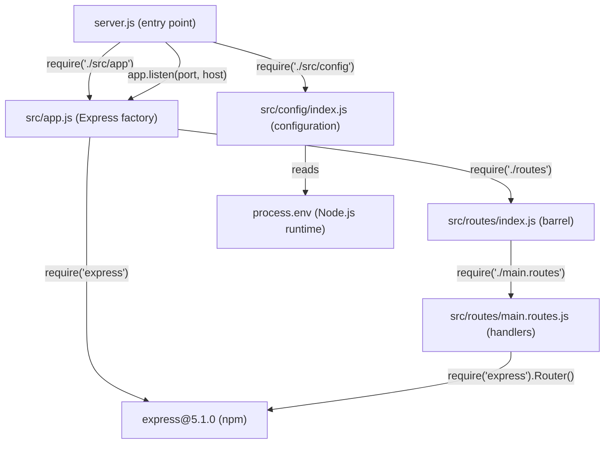

# Technical Specification

# 0. Agent Action Plan

## 0.1 Intent Clarification


### 0.1.1 Core Feature Objective

Based on the prompt, the Blitzy platform understands that the new feature requirement is to integrate the Express.js web framework into an existing bare-bones Node.js tutorial server and extend its HTTP API surface with an additional greeting endpoint. Specifically:

- **Integrate Express.js framework**: The existing project is described by the user as a Node.js server that hosts a single endpoint returning `"Hello world"`. The platform interprets this as a requirement to adopt Express.js as the HTTP framework, replacing or wrapping any native `http.createServer()` usage with the Express application factory pattern (`express()`) and Express Router (`express.Router()`).
- **Add a new `GET /evening` endpoint**: A second HTTP GET endpoint must be created that responds with the exact string `"Good evening"` when accessed. This endpoint must coexist with the original root endpoint without altering its existing behavior.
- **Preserve existing behavior**: The original `GET /` endpoint must continue to return its `"Hello, World!\n"` response with byte-level fidelity, including the trailing newline character. The integration of Express.js and the addition of the new endpoint must not break backward compatibility.
- **Implicit requirement — Modular architecture**: Adopting Express.js implies transitioning from a monolithic single-file server to a modular architecture that separates concerns: application configuration, server binding, routing, and environment configuration.
- **Implicit requirement — Testability**: The Express.js factory pattern enables unit testing the application without starting an HTTP server, which is an inherent benefit of the migration.

### 0.1.2 Special Instructions and Constraints

- **No explicit architectural directives provided**: The user did not specify a particular design pattern. The platform follows established Express.js conventions: factory pattern for the app, barrel pattern for route aggregation, and Twelve-Factor App methodology for configuration.
- **No backward compatibility constraints stated**: However, the platform infers that the original `GET /` response (`"Hello, World!\n"`) must remain unchanged since the user only requested an *addition*.
- **Module system**: The existing project uses CommonJS (`require`/`module.exports`). All new and modified files must maintain CommonJS compatibility.
- **User Example — Original endpoint**: `GET /` → `"Hello, World!\n"` (with trailing newline, 14 bytes)
- **User Example — New endpoint**: `GET /evening` → `"Good evening"` (no trailing newline, 12 bytes)

### 0.1.3 Technical Interpretation

These feature requirements translate to the following technical implementation strategy:

- To **integrate Express.js**, we will add `express@^5.1.0` as a runtime dependency in `package.json`, create an application factory module (`src/app.js`) that constructs and exports a configured Express application, and refactor `server.js` to import and bind this application instead of using native `http.createServer()`.
- To **add the `/evening` endpoint**, we will create a dedicated route handler module (`src/routes/main.routes.js`) using `express.Router()` that registers both `GET /` and `GET /evening` handlers, and aggregate route exports through a barrel module (`src/routes/index.js`).
- To **externalize configuration**, we will create a configuration module (`src/config/index.js`) that reads `HOST`, `PORT`, and `NODE_ENV` from environment variables with sensible defaults (`127.0.0.1`, `3000`, `development`), following Twelve-Factor App principles.
- To **maintain the project structure**, we will organize source code under a `src/` directory with clear separation: `src/app.js` (Express factory), `src/config/` (configuration), and `src/routes/` (routing surface).


## 0.2 Repository Scope Discovery


### 0.2.1 Comprehensive File Analysis

The repository is a minimal Node.js project with a flat structure. Every file in the repository has been inspected to determine its relevance to the Express.js integration and new endpoint feature. The following table catalogs each existing file and its role in the change:

| File Path | Status | Purpose in Feature Addition |
|-----------|--------|-----------------------------|
| `server.js` | **MODIFY** | Refactor from native `http.createServer()` to import Express app from `src/app.js` and config from `src/config`; call `app.listen(config.port, config.host, callback)` for server binding |
| `package.json` | **MODIFY** | Add `express@^5.1.0` to `dependencies`; entry point remains `server.js` |
| `package-lock.json` | **REGENERATE** | Auto-regenerated by `npm install` when Express.js dependency is added; locks Express 5.1.0 and its 28 transitive dependencies |
| `README.md` | **MODIFY** | Update documentation to reflect Express.js architecture, new `/evening` endpoint, project structure diagram, and environment variable configuration |
| `.gitignore` | **NO CHANGE** | Already excludes `node_modules/`, `.env`, logs, OS files, and IDE config — no updates needed |

**Integration Point Discovery:**

- **API endpoints**: Two GET endpoints must be registered — `GET /` (existing behavior preserved) and `GET /evening` (new feature).
- **Server binding**: `server.js` must transition from `http.createServer(handler).listen(...)` to `app.listen(port, host, callback)` using the Express application instance.
- **Route registration**: Routes are mounted via `app.use('/', mainRoutes)` in the application factory, connecting the Express app to the router module.
- **Configuration injection**: `server.js` consumes `config.host` and `config.port` from the configuration module for server binding parameters.

### 0.2.2 Web Search Research Conducted

- **Express.js 5.1.0 release status**: Confirmed as the current default on npm (tagged `latest` as of March 31, 2025). Express 5.x requires Node.js ≥18, which aligns with the project's documented requirement of Node.js 20.19.x LTS.
- **Express.js 5.x best practices**: Factory pattern (exporting `app` without calling `listen()`), `express.Router()` for modular route handling, and `res.send()` for string responses are the canonical approaches.
- **Security considerations**: Express 5.x includes ReDoS mitigation via `path-to-regexp@8.x` and improved promise rejection handling in middleware. The `npm audit` state reports zero actionable vulnerabilities for the locked dependency tree.

### 0.2.3 New File Requirements

**New source files to create:**

| File Path | Purpose |
|-----------|---------|
| `src/app.js` | Express application factory — creates and exports a configured Express app instance with mounted routes; does not call `listen()` |
| `src/config/index.js` | Configuration module — exports `{ host, port, env }` from environment variables with defaults (`127.0.0.1`, `3000`, `development`) |
| `src/routes/index.js` | Route aggregator (barrel pattern) — re-exports `mainRoutes` from `main.routes.js` for clean single-import usage |
| `src/routes/main.routes.js` | Route handlers — defines `GET /` and `GET /evening` endpoints using `express.Router()` with `res.send()` responses |

**New directory structure to create:**

| Directory Path | Purpose |
|----------------|---------|
| `src/` | Application source root, separating business logic from the entry point |
| `src/config/` | Configuration module directory |
| `src/routes/` | Routing surface directory |

No new test files or configuration files (e.g., `.env`, YAML) are required by the user's request, though the architecture supports future addition of test harnesses (e.g., Jest + Supertest).


## 0.3 Dependency Inventory


### 0.3.1 Private and Public Packages

The feature addition introduces a single new public runtime dependency. There are no private packages involved.

| Registry | Package Name | Version | Type | Purpose |
|----------|-------------|---------|------|---------|
| npm (public) | `express` | `^5.1.0` (resolved: `5.1.0`) | Runtime dependency | Web framework providing application factory, HTTP routing via `express.Router()`, response handling via `res.send()`, middleware mounting via `app.use()`, and server binding via `app.listen()` |

**Transitive dependencies** automatically resolved by Express 5.1.0 (locked in `package-lock.json`):

| Package | Resolved Version | Role |
|---------|-----------------|------|
| `body-parser` | 2.2.1 | Request body parsing middleware |
| `router` | 2.2.0 | Core route-matching engine |
| `qs` | 6.14.0 | Query string parser |
| `debug` | 4.4.3 | Debug logging utility |
| `send` | 1.2.0 | Static file streaming |
| `serve-static` | 2.2.0 | Static file serving middleware |
| `finalhandler` | 2.1.0 | Final response handler |
| `http-errors` | 2.0.0 | HTTP error creation utilities |
| `accepts` | 2.0.0 | Content negotiation |
| `content-type` | 1.0.5 | Content-Type header parsing |
| `cookie` | 0.7.2 | Cookie parsing/serialization |
| `cookie-signature` | 1.2.2 | Signed cookie support |
| `etag` | 1.8.1 | ETag generation |
| `fresh` | 2.0.0 | HTTP cache freshness |
| `merge-descriptors` | 2.0.0 | Object descriptor merging |
| `mime-types` | 3.0.1 | MIME type resolution |
| `on-finished` | 2.4.1 | Request/response lifecycle hooks |
| `parseurl` | 1.3.3 | URL parsing |
| `proxy-addr` | 2.0.7 | Proxy trust resolution |
| `range-parser` | 1.2.1 | Range header parsing |
| `statuses` | 2.0.2 | HTTP status code utilities |
| `type-is` | 2.0.1 | Content-Type checking |
| `vary` | 1.1.2 | Vary header management |
| `escape-html` | 1.0.3 | HTML entity escaping |
| `encodeurl` | 2.0.0 | URL encoding |
| `once` | 1.4.0 | One-time callback wrapper |
| `content-disposition` | 1.0.0 | Content-Disposition header |

### 0.3.2 Dependency Updates

**Import Updates:**

The following files require new or modified `require()` statements to incorporate Express.js:

| File | Import Change | Purpose |
|------|--------------|---------|
| `server.js` | Remove `require('http')`, add `require('./src/app')` and `require('./src/config')` | Transition from native HTTP to Express app instance |
| `src/app.js` *(new)* | Add `require('express')` and `require('./routes')` | Create Express application and mount routes |
| `src/routes/main.routes.js` *(new)* | Add `require('express')` | Access `express.Router()` factory |
| `src/routes/index.js` *(new)* | Add `require('./main.routes')` | Aggregate route module exports |
| `src/config/index.js` *(new)* | Uses only `process.env` (Node.js built-in) | No external imports needed |

**External Reference Updates:**

| File | Update Required |
|------|----------------|
| `package.json` | Add `"express": "^5.1.0"` to `dependencies` object |
| `package-lock.json` | Regenerated automatically via `npm install` |
| `README.md` | Document Express.js dependency, version, and installation steps |


## 0.4 Integration Analysis


### 0.4.1 Existing Code Touchpoints

**Direct modifications required:**

| File | Modification | Integration Detail |
|------|-------------|-------------------|
| `server.js` | **Full rewrite** of request handling logic | Replace `http.createServer()` with `const app = require('./src/app')` and `const config = require('./src/config')`. Replace native `.listen()` call with `app.listen(config.port, config.host, callback)`. Preserve startup console log output. |
| `package.json` | **Add dependency** | Insert `"express": "^5.1.0"` into the `dependencies` block. No changes to `scripts.start` (`node server.js` remains correct). |
| `README.md` | **Expand documentation** | Add project structure diagram, `/evening` endpoint documentation, environment variable reference table, Express.js dependency listing, and architecture description. |

**New module wiring:**

The following diagram illustrates how the new Express.js modules integrate with the existing entry point:


```mermaid
flowchart TD
    ServerJS["server.js (entry point)"]
    AppJS["src/app.js (Express factory)"]
    ConfigJS["src/config/index.js (configuration)"]
    RoutesIndex["src/routes/index.js (barrel)"]
    MainRoutes["src/routes/main.routes.js (handlers)"]
    Express["express@5.1.0 (npm)"]
    ProcessEnv["process.env (Node.js runtime)"]

    ServerJS -->|"require('./src/app')"| AppJS
    ServerJS -->|"require('./src/config')"| ConfigJS
    AppJS -->|"require('express')"| Express
    AppJS -->|"require('./routes')"| RoutesIndex
    RoutesIndex -->|"require('./main.routes')"| MainRoutes
    MainRoutes -->|"require('express').Router()"| Express
    ConfigJS -->|"reads"| ProcessEnv
    ServerJS -->|"app.listen(port, host)"| AppJS
```

**Configuration integration:**

| Configuration Key | Source | Default Value | Consumer |
|-------------------|--------|---------------|----------|
| `host` | `process.env.HOST` | `'127.0.0.1'` | `server.js` → `app.listen()` |
| `port` | `process.env.PORT` | `3000` | `server.js` → `app.listen()` |
| `env` | `process.env.NODE_ENV` | `'development'` | Available for future middleware branching |

**Route mounting chain:**

- `server.js` imports the fully-configured Express app from `src/app.js`
- `src/app.js` creates `express()` instance and calls `app.use('/', mainRoutes)`
- `src/routes/index.js` exports `{ mainRoutes }` by requiring `./main.routes`
- `src/routes/main.routes.js` creates `express.Router()` and registers `GET /` and `GET /evening`

No database, schema, or migration changes are required for this feature. The project is stateless with no persistence layer.


## 0.5 Technical Implementation


### 0.5.1 File-by-File Execution Plan

Every file listed below MUST be created or modified. Files are grouped by functional role.

**Group 1 — Core Feature Files (Express.js Integration + New Endpoint):**

| Action | File Path | Purpose |
|--------|-----------|---------|
| **CREATE** | `src/routes/main.routes.js` | Implement `GET /` handler returning `'Hello, World!\n'` and `GET /evening` handler returning `'Good evening'` using `express.Router()` |
| **CREATE** | `src/routes/index.js` | Barrel module — aggregate and re-export `mainRoutes` for clean single-import consumption |
| **CREATE** | `src/app.js` | Express application factory — call `express()`, mount `mainRoutes` at root path via `app.use('/', mainRoutes)`, export `app` without calling `listen()` |

**Group 2 — Supporting Infrastructure:**

| Action | File Path | Purpose |
|--------|-----------|---------|
| **CREATE** | `src/config/index.js` | Configuration module exporting `{ host, port, env }` from environment variables with defaults |
| **MODIFY** | `server.js` | Replace native HTTP server logic with Express app import and `app.listen()` binding using config values |
| **MODIFY** | `package.json` | Add `express@^5.1.0` to `dependencies` |
| **REGENERATE** | `package-lock.json` | Auto-generated by `npm install` to lock Express 5.1.0 and its dependency tree |

**Group 3 — Documentation:**

| Action | File Path | Purpose |
|--------|-----------|---------|
| **MODIFY** | `README.md` | Document Express.js integration, new `/evening` endpoint API reference, updated project structure, environment variables, and dependency table |

### 0.5.2 Implementation Approach per File

**Step 1 — Establish route handlers (`src/routes/main.routes.js`):**

Create the Express Router with both endpoint handlers. This is the core of the new feature:

```javascript
const router = require('express').Router();
router.get('/', (req, res) => res.send('Hello, World!\n'));
router.get('/evening', (req, res) => res.send('Good evening'));
```

**Step 2 — Create route barrel (`src/routes/index.js`):**

Aggregate route exports for clean import by the application factory:

```javascript
const mainRoutes = require('./main.routes');
module.exports = { mainRoutes };
```

**Step 3 — Create application factory (`src/app.js`):**

Instantiate Express and mount routes. The factory pattern keeps `listen()` out of this module for testability:

```javascript
const app = require('express')();
app.use('/', require('./routes').mainRoutes);
```

**Step 4 — Create configuration module (`src/config/index.js`):**

Externalize host, port, and environment to follow Twelve-Factor methodology:

```javascript
module.exports = {
  host: process.env.HOST || '127.0.0.1',
  port: parseInt(process.env.PORT, 10) || 3000
};
```

**Step 5 — Refactor server entry point (`server.js`):**

Replace native `http` usage with Express app import and config-driven binding:

```javascript
const app = require('./src/app');
const config = require('./src/config');
app.listen(config.port, config.host, () => { /* log */ });
```

**Step 6 — Update `package.json`:**

Add Express.js as the sole runtime dependency with semver range `^5.1.0`.

**Step 7 — Update `README.md`:**

Expand documentation to cover the Express.js architecture, both endpoints, environment variables, project structure diagram, and troubleshooting guidance.

### 0.5.3 User Interface Design

No user interface or Figma screens are applicable to this feature. The project is a headless HTTP API server with no frontend, browser-based UI, or visual components. All interaction occurs through HTTP clients (e.g., `curl`, Postman) against the two GET endpoints.


## 0.6 Scope Boundaries


### 0.6.1 Exhaustively In Scope

The following is a complete, definitive list of every file and directory within the scope of this feature addition. Trailing wildcards indicate pattern-matched groups.

**Source files (new):**

| Pattern / Path | Scope Detail |
|---------------|--------------|
| `src/app.js` | Express application factory with route mounting |
| `src/config/index.js` | Environment-driven configuration module |
| `src/routes/index.js` | Route aggregator barrel module |
| `src/routes/main.routes.js` | Route handlers for `GET /` and `GET /evening` |

**Source files (modified):**

| Pattern / Path | Scope Detail |
|---------------|--------------|
| `server.js` | Entry point refactored to use Express app and config imports |

**Dependency manifests:**

| Pattern / Path | Scope Detail |
|---------------|--------------|
| `package.json` | Add `express@^5.1.0` dependency |
| `package-lock.json` | Regenerated lockfile for Express 5.1.0 dependency tree |

**Documentation:**

| Pattern / Path | Scope Detail |
|---------------|--------------|
| `README.md` | Updated with Express.js architecture, `/evening` endpoint, env vars, and project structure |

**Directories (new):**

| Pattern / Path | Scope Detail |
|---------------|--------------|
| `src/` | Application source root |
| `src/config/` | Configuration module directory |
| `src/routes/` | Routing surface directory |

**Total scope: 4 new files, 3 modified files, 3 new directories.**

### 0.6.2 Explicitly Out of Scope

The following items are NOT included in this feature addition:

- **Test files and test infrastructure**: No unit tests, integration tests, or test frameworks (Jest, Mocha, Supertest) are being added. The project's `scripts.test` remains a placeholder (`exit 1`).
- **Middleware additions**: No custom middleware (logging, authentication, CORS, rate limiting, error handling) beyond the default Express.js stack is being introduced.
- **Database or persistence layer**: No database, ORM, or data storage is being added or modified.
- **CI/CD pipeline**: No GitHub Actions workflows, Docker configurations, or deployment scripts are being created.
- **TypeScript migration**: The project remains in JavaScript with CommonJS modules. No TypeScript configuration or type definitions are in scope.
- **Additional endpoints**: Only `GET /evening` is being added. No other HTTP methods or paths are in scope.
- **Environment files**: No `.env`, `.env.example`, or dotenv integration is being created. Configuration uses direct `process.env` access.
- **Performance optimization**: No caching, compression middleware, or performance tuning beyond Express.js defaults.
- **Blitzy documentation folder**: The `blitzy/documentation/` directory and its contents (`Project Guide.md`, `Technical Specifications.md`) are reference materials and are not modified by this feature addition.
- **`.gitignore`**: Already correctly configured; no changes needed.


## 0.7 Rules for Feature Addition


### 0.7.1 Feature-Specific Rules and Requirements

The user did not specify explicit rules or constraints beyond the feature request itself. The following rules are derived from the project's established conventions and the implicit requirements of the Express.js integration:

**Behavioral Parity Rules:**

- The `GET /` endpoint MUST return the exact string `Hello, World!\n` (14 bytes, including the trailing newline character). Any deviation breaks the original contract.
- The `GET /evening` endpoint MUST return the exact string `Good evening` (12 bytes, no trailing newline). This matches the user's explicit request.
- Both endpoints MUST respond with HTTP status `200 OK` and Express.js default `Content-Type: text/html; charset=utf-8`.

**Architectural Convention Rules:**

- All source files MUST use CommonJS module syntax (`require()` / `module.exports`). No ESM (`import`/`export`) syntax is permitted.
- The application factory (`src/app.js`) MUST NOT call `app.listen()`. Server binding is the sole responsibility of `server.js`.
- The route aggregator (`src/routes/index.js`) MUST export routes using named properties (e.g., `{ mainRoutes }`) to support destructured imports.
- The configuration module (`src/config/index.js`) MUST be synchronous with no async initialization, I/O, or side effects beyond reading `process.env`.

**Dependency Rules:**

- Express.js MUST be pinned to semver range `^5.1.0` (allowing patch and minor updates within the 5.x line).
- No additional npm packages beyond `express` may be added as direct dependencies.
- The `package-lock.json` MUST be committed to ensure deterministic installs via `npm ci`.

**Runtime Compatibility Rules:**

- The project MUST run on Node.js ≥18.x, with Node.js 20.19.x LTS as the recommended version.
- Default server binding MUST be `127.0.0.1:3000` when no environment variables are set.
- Environment variable overrides (`HOST`, `PORT`, `NODE_ENV`) MUST be supported without code changes.


## 0.8 References


### 0.8.1 Repository Files and Folders Searched

The following files and folders were comprehensively inspected during the analysis to derive all conclusions documented in this Agent Action Plan:

**Files read (full content retrieved):**

| File Path | Relevance |
|-----------|-----------|
| `server.js` | Entry point — analyzed for refactoring from native HTTP to Express.js app binding |
| `src/app.js` | Application factory — analyzed for Express initialization and route mounting pattern |
| `src/config/index.js` | Configuration module — analyzed for environment variable handling and defaults |
| `src/routes/index.js` | Route aggregator — analyzed for barrel export pattern |
| `src/routes/main.routes.js` | Route handlers — analyzed for endpoint implementation and response contracts |
| `package.json` | Project manifest — analyzed for dependency declarations, scripts, and metadata |
| `package-lock.json` | Lockfile — analyzed for resolved Express 5.1.0 version and transitive dependency tree |
| `README.md` | Documentation — analyzed for existing content, Node.js version requirements, and API reference |
| `.gitignore` | Git exclusions — analyzed for completeness (no changes needed) |

**Folders explored:**

| Folder Path | Depth Reached | Contents |
|-------------|---------------|----------|
| `/` (root) | Level 0 | 5 files + 2 directories |
| `src/` | Level 1 | `app.js` + 2 subdirectories |
| `src/config/` | Level 2 | `index.js` |
| `src/routes/` | Level 2 | `index.js`, `main.routes.js` |
| `blitzy/` | Level 1 | `documentation/` (reference only) |
| `blitzy/documentation/` | Level 2 | `Project Guide.md`, `Technical Specifications.md` (reference only) |

**Tech spec sections consulted for context:**

| Section Heading | Information Gathered |
|----------------|---------------------|
| 1.1 Executive Summary | Project overview, migration context, and stakeholder information |
| 2.1 Feature Catalog | Feature IDs (F-001 through F-006), dependencies, and completion status |
| 3.2 Programming Languages | Node.js version requirements, CommonJS module system constraints |
| 3.3 Frameworks & Libraries | Express.js 5.1.0 feature usage matrix and API method inventory |
| 3.8 Version Compatibility Matrix | Node.js, npm, and Express version compatibility constraints |
| 5.2 Component Details | Detailed component specifications, interfaces, and interaction diagrams |
| 9.5 File and Folder Inventory | Complete repository file listing with line counts |

### 0.8.2 External Research

| Topic | Source | Key Finding |
|-------|--------|-------------|
| Express.js 5.1.0 release status | expressjs.com (official blog, March 31, 2025) | Express 5.1.0 confirmed as the default `latest` on npm; requires Node.js ≥18 |
| Express.js 5.x changelog | github.com/expressjs/express/releases | Version 5.1.0 includes ReDoS mitigation, promise rejection handling, and updated body-parser |
| Express.js npm metadata | npmjs.com/package/express | Latest version 5.1.0 confirmed; 95,245+ dependent packages in the npm registry |

### 0.8.3 Attachments and Figma Screens

No attachments, uploaded files, or Figma screens were provided for this feature addition. All analysis was performed against the repository source code and existing technical specification sections.


