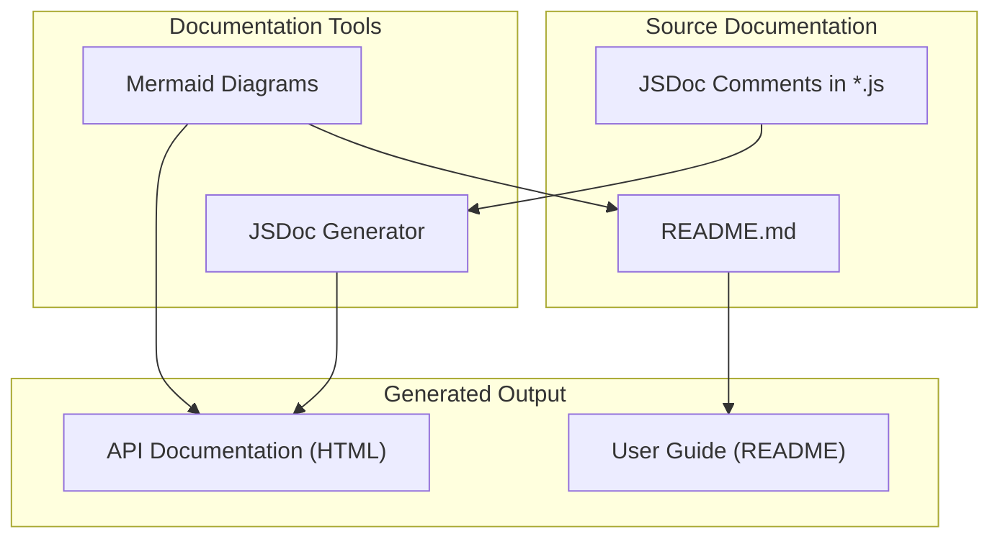
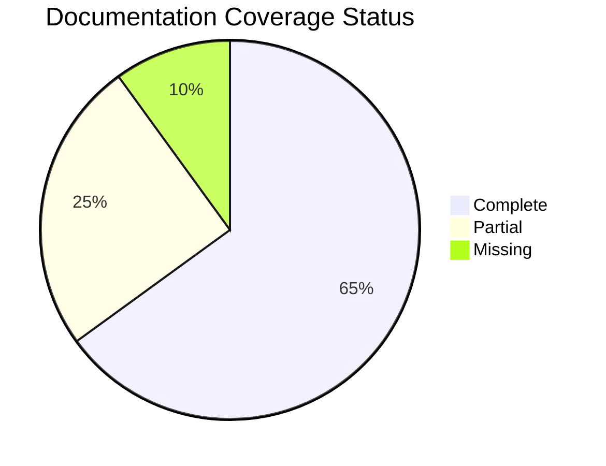
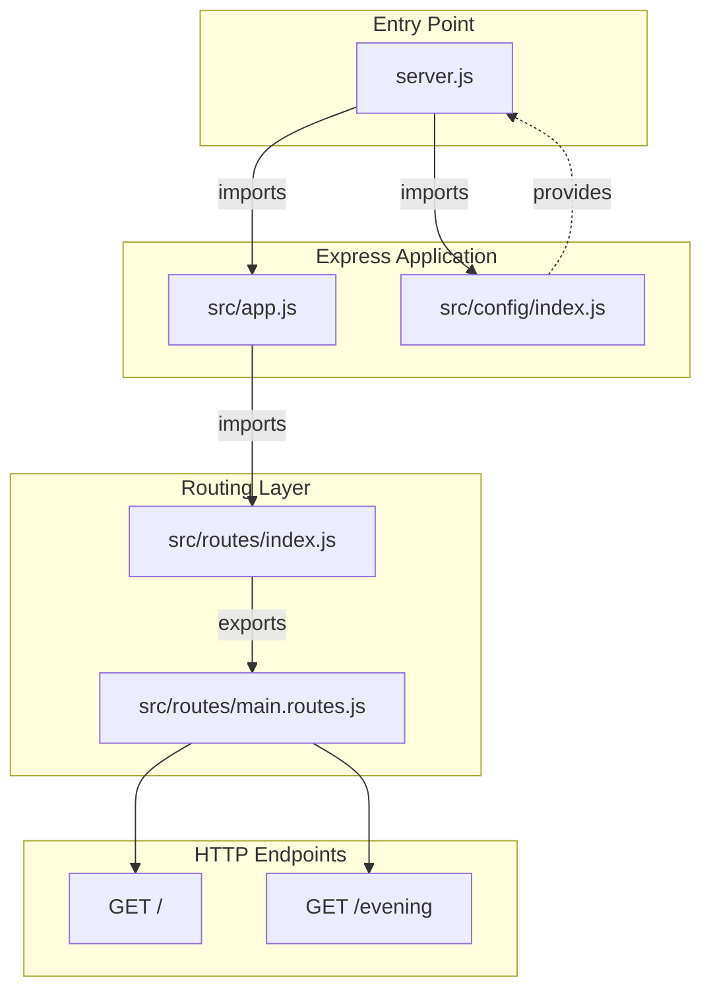
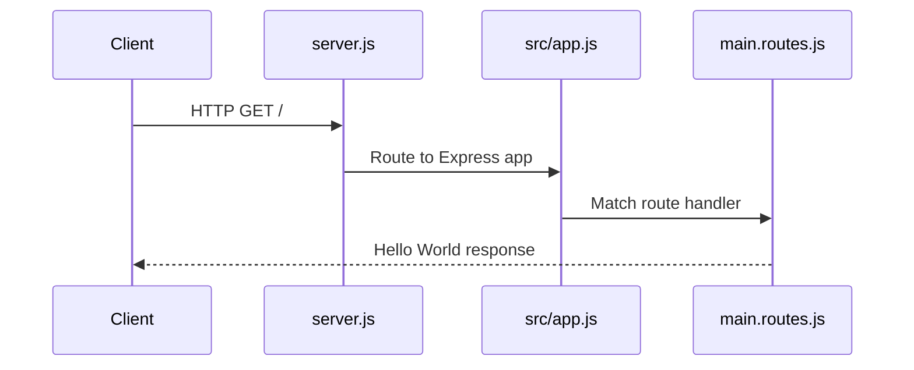
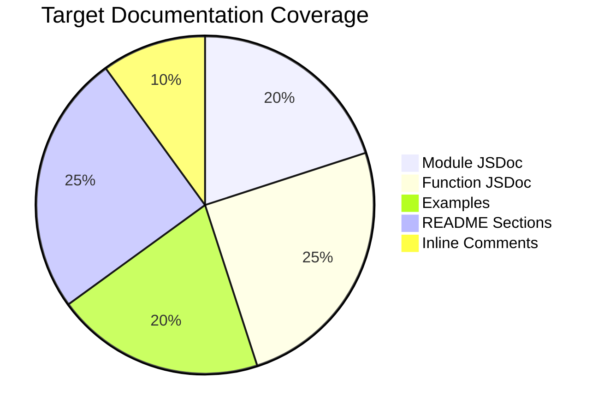

# Technical Specification

# 0. Agent Action Plan

## 0.1 Intent Clarification

### 0.1.1 Core Documentation Objective

Based on the provided requirements, the Blitzy platform understands that the documentation objective is to **enhance the existing documentation infrastructure** for a Node.js/Express.js tutorial service by:

1. **Adding JSDoc comments to server.js functions** - Enhancing inline code documentation with comprehensive JSDoc annotations
2. **Creating a comprehensive README** - Expanding the existing README.md with:
   - Detailed setup instructions
   - API documentation
   - Deployment guide
   - Inline code explanations

**Documentation Request Category:** Update existing documentation | Improve documentation coverage

**Documentation Type:** 
- API documentation (JSDoc comments for code)
- User guides (README with setup instructions)
- Technical specs (API reference documentation)
- Deployment guide (deployment instructions)

**Documented Requirements with Enhanced Clarity:**

| Requirement | Interpretation | Documentation Deliverable |
|-------------|----------------|---------------------------|
| Add JSDoc comments to server.js functions | Enhance existing JSDoc documentation with comprehensive annotations for all code constructs | Enhanced JSDoc in `server.js`, `src/app.js`, `src/config/index.js`, `src/routes/*.js` |
| Setup instructions in README | Document prerequisites, installation steps, environment configuration | README.md `Installation` and `Configuration` sections |
| API documentation | Document HTTP endpoints with request/response details, examples | README.md `API Reference` section, JSDoc `@route` annotations |
| Deployment guide | Document deployment procedures, environment variables, production considerations | README.md `Deployment` section |
| Inline code explanations | Add contextual comments explaining code logic and architectural decisions | Inline code comments throughout source files |

**Implicit Documentation Needs Surfaced:**

Based on code analysis, the following implicit documentation needs are identified:

- **Architecture Documentation:** The modular Express.js structure (Factory pattern, Barrel pattern) requires architectural explanation in README
- **Configuration Reference:** Environment variables (`HOST`, `PORT`, `NODE_ENV`) need comprehensive configuration documentation
- **Module Dependency Documentation:** Import relationships between `server.js` → `src/app.js` → `src/routes/` require documentation
- **Error Handling Documentation:** Common errors and troubleshooting guidance implied for deployment context
- **Testing Documentation:** While not explicitly requested, development workflow documentation is implied

### 0.1.2 Special Instructions and Constraints

**Critical Directives Captured:**

| Directive | Application |
|-----------|-------------|
| Follow existing documentation style | Match current README.md formatting: tables, code blocks, curl examples |
| Comprehensive README | Ensure all major topics covered with depth and examples |
| JSDoc for server.js specifically | Primary focus on server.js, but extend to related modules for completeness |

**Template Requirements:**

The existing README.md establishes the documentation template pattern:
- Markdown headers with clear hierarchy
- Tables for structured data (requirements, environment variables, scripts)
- Code blocks with language specification and expected outputs
- Curl examples for API endpoints
- Project structure ASCII diagrams

**USER PROVIDED TEMPLATE:** (Derived from existing README.md style)
```
## Section Title

Description text.

| Column 1 | Column 2 | Column 3 |
|----------|----------|----------|
| Data     | Data     | Data     |

#### Subsection

**Key point:**
` ` `bash
command example
` ` `
```

**Style Preferences Documented:**

- **Tone:** Technical but accessible, tutorial-oriented
- **Structure:** Hierarchical with clear sections
- **Depth:** Comprehensive with working examples
- **Format:** Markdown with GitHub Flavored Markdown extensions

### 0.1.3 Technical Interpretation

These documentation requirements translate to the following technical documentation strategy:

| Requirement | Technical Action | Target Files |
|-------------|------------------|--------------|
| To document server entry point | Add/enhance JSDoc module, function, and type annotations | `server.js` |
| To document Express app factory | Add JSDoc for app configuration and route mounting | `src/app.js` |
| To document configuration module | Add JSDoc for exported config object properties | `src/config/index.js` |
| To document route handlers | Add JSDoc @route annotations with request/response details | `src/routes/main.routes.js`, `src/routes/index.js` |
| To provide setup documentation | Update README Installation section with step-by-step guide | `README.md` |
| To provide API documentation | Update README API Reference with comprehensive endpoint docs | `README.md` |
| To provide deployment guide | Create new Deployment section in README | `README.md` |
| To provide code explanations | Add inline comments explaining architectural decisions | All source files |

### 0.1.4 Inferred Documentation Needs

**Based on Code Analysis:**

- `server.js` contains startup logic with existing JSDoc that can be enhanced with `@example` and `@fires` annotations
- `src/app.js` has module-level JSDoc but route mounting documentation could be expanded
- `src/config/index.js` has property-level JSDoc but lacks usage examples
- `src/routes/main.routes.js` has `@route` annotations but could include `@param` for Express request/response objects

**Based on Structure:**

- The Factory pattern in `src/app.js` requires architectural pattern documentation
- The Barrel pattern in `src/routes/index.js` needs export aggregation explanation
- Twelve-Factor App configuration in `src/config/index.js` deserves methodology reference

**Based on Dependencies:**

- Express 5.1.0 integration requires version-specific API documentation
- Module import chain (`server.js` → `src/app` → `src/routes`) needs dependency documentation

**Based on User Journey:**

- New developers need: Installation guide → Configuration → Running → Testing endpoints
- Deployers need: Environment setup → Production configuration → Health verification
- Contributors need: Architecture understanding → Code organization → Pattern explanations


## 0.2 Documentation Discovery and Analysis

### 0.2.1 Existing Documentation Infrastructure Assessment

**Repository Analysis Results:**

The repository analysis reveals a **well-established documentation infrastructure** with moderate coverage status. The project already has comprehensive baseline documentation that requires enhancement rather than creation from scratch.

**Documentation Files Discovered:**

| File Path | Type | Status | Purpose |
|-----------|------|--------|---------|
| `README.md` | User Guide | Exists (comprehensive) | Primary project documentation |
| `blitzy/documentation/Project Guide.md` | Operations Guide | Exists | Production readiness runbook |
| `blitzy/documentation/Technical Specifications.md` | Technical Spec | Exists | Implementation contract |
| `.gitignore` | Configuration | Exists | Git exclusion patterns (documented) |

**Search Patterns Employed:**

```
Documentation files: README*, docs/**, *.md, *.mdx, *.rst
Generator configs: mkdocs.yml, docusaurus.config.js, sphinx.conf.py (none found)
JSDoc configs: jsdoc.conf.json, jsdoc.json (none found - to be created)
Style guides: CONTRIBUTING.md, STYLEGUIDE.md (none found)
```

**Documentation Framework Analysis:**

| Aspect | Status | Details |
|--------|--------|---------|
| Documentation Generator | Not configured | No JSDoc, MkDocs, or other generator configured |
| API Documentation Tools | Partial | JSDoc comments exist in source files but no generation setup |
| Diagram Tools | Manual | ASCII diagrams in README; Mermaid available |
| Documentation Hosting | Not configured | No deployment configuration |

### 0.2.2 Current Documentation Coverage

**Source File JSDoc Coverage Analysis:**

| File | Lines | JSDoc Present | Coverage | Gaps Identified |
|------|-------|---------------|----------|-----------------|
| `server.js` | 75 | Yes (extensive) | ~85% | Missing `@example`, `@fires` for listen callback |
| `src/app.js` | 28 | Yes (basic) | ~60% | Missing route mounting detail, export documentation |
| `src/config/index.js` | 42 | Yes (good) | ~80% | Missing usage `@example` annotations |
| `src/routes/index.js` | 20 | Yes (basic) | ~70% | Missing barrel pattern explanation |
| `src/routes/main.routes.js` | 42 | Yes (good) | ~75% | Missing `@param` for req/res, `@example` curl commands |

**README.md Section Analysis:**

| Section | Present | Completeness | Enhancement Needed |
|---------|---------|--------------|-------------------|
| Prerequisites | ✅ Yes | Complete | Minor version updates |
| Installation | ✅ Yes | Complete | None |
| Usage | ✅ Yes | Complete | Add deployment subsection |
| API Reference | ✅ Yes | Complete | Enhance with more examples |
| Project Structure | ✅ Yes | Complete | Add architecture diagram |
| Environment Variables | ✅ Yes | Complete | Add deployment context |
| Architecture | ✅ Yes | Partial | Add Mermaid diagrams |
| Dependencies | ✅ Yes | Complete | None |
| Troubleshooting | ✅ Yes | Partial | Add deployment troubleshooting |
| Deployment Guide | ❌ No | Missing | **CREATE** |
| Contributing | ❌ No | Missing | Optional |

### 0.2.3 Repository Code Analysis for Documentation

**Search Patterns Used for Code to Document:**

| Pattern | Target | Files Found |
|---------|--------|-------------|
| `src/**/*.js` containing exports | Public APIs | `src/app.js`, `src/config/index.js`, `src/routes/index.js`, `src/routes/main.routes.js` |
| `*.js` at root | Entry points | `server.js` |
| `src/config/**` | Configuration | `src/config/index.js` |
| `src/routes/**` | Route handlers | `src/routes/index.js`, `src/routes/main.routes.js` |

**Key Directories Examined:**

| Directory | Contents | Documentation Relevance |
|-----------|----------|------------------------|
| `/` (root) | Entry point, config files | `server.js`, `package.json`, `README.md` |
| `src/` | Application source | All source files require JSDoc |
| `src/config/` | Configuration module | Environment variable documentation |
| `src/routes/` | Express routers | API endpoint documentation |
| `blitzy/documentation/` | Existing specs | Reference material, not to be modified |

**Related Documentation Found:**

| Location | Relevance | Usage |
|----------|-----------|-------|
| `blitzy/documentation/Project Guide.md` | High | Reference for endpoint specifications and verification |
| `blitzy/documentation/Technical Specifications.md` | High | Reference for implementation contracts and patterns |

### 0.2.4 Web Search Research Conducted

**Research Topics and Findings:**

| Topic | Key Findings | Application |
|-------|--------------|-------------|
| JSDoc best practices for Node.js | <cite index="6-17,6-18">"Document as You Code: Make documentation a part of your development process, not an afterthought. This ensures your documentation stays up-to-date with your codebase."</cite> | Apply incremental JSDoc enhancement |
| JSDoc best practices | <cite index="6-19,6-20">"Be Descriptive but Concise: While it's important to be thorough, avoid overly verbose descriptions. Aim to provide clear, succinct explanations."</cite> | Balance thoroughness with clarity |
| Express route documentation | <cite index="4-3,4-4">"With this library, you can document your express endpoints using swagger OpenAPI 3 Specification without writing YAML or JSON. You can write comments similar to jsdoc on each endpoint."</cite> | Use JSDoc for route documentation |
| Documentation structure | <cite index="1-5">"Functions and classes belonging to each domain would be documented and annotated with the @memberOf tag to let the JSDoc parser know that the aforementioned entity belongs to a certain namespace."</cite> | Organize documentation by module |
| JSDoc templates | <cite index="1-2">"I would suggest using a template like docdash, which provides a clear hierarchical navigation and beautiful syntax highlighting"</cite> | Consider docdash template for generated docs |

**Documentation Tools Identified:**

| Tool | Purpose | Recommendation |
|------|---------|----------------|
| JSDoc | Generate API documentation from comments | Primary tool for code documentation |
| express-jsdoc-swagger | Swagger UI from JSDoc comments | Optional enhancement for API docs |
| docdash | JSDoc template | Recommended for readable output |
| Mermaid | Diagram generation | Integrate into README for architecture diagrams |

### 0.2.5 Documentation Infrastructure Recommendations

**Recommended Documentation Stack:**


```mermaid
flowchart TB
    subgraph Sources["Source Documentation"]
        SRC["JSDoc Comments in *.js"]
        README["README.md"]
    end
    
    subgraph Tools["Documentation Tools"]
        JSDOC["JSDoc Generator"]
        MERMAID["Mermaid Diagrams"]
    end
    
    subgraph Output["Generated Output"]
        API["API Documentation (HTML)"]
        GUIDE["User Guide (README)"]
    end
    
    SRC --> JSDOC
    JSDOC --> API
    README --> GUIDE
    MERMAID --> README
    MERMAID --> API
```

**Infrastructure Gaps to Address:**

| Gap | Solution | Priority |
|-----|----------|----------|
| No JSDoc configuration | Create `jsdoc.json` config file | Medium |
| No documentation generation script | Add `npm run docs` script | Medium |
| Missing deployment guide | Add to README.md | High |
| Limited architecture diagrams | Add Mermaid diagrams to README | Medium |
| No API generation | Configure JSDoc output | Low |


## 0.3 Documentation Scope Analysis

### 0.3.1 Code-to-Documentation Mapping

**Modules Requiring Documentation:**

#### Module: `server.js` (Entry Point)

| Aspect | Status | Documentation Action |
|--------|--------|---------------------|
| Module description | ✅ Exists | Enhance with deployment context |
| `app` import | ✅ Documented | No changes needed |
| `config` import | ✅ Documented | No changes needed |
| `app.listen()` callback | ⚠️ Partial | Add `@example` with startup output |
| Console.log statements | ❌ Missing | Add inline explanations |

**Current Documentation (Line 1-27):**
```javascript
/**
 * HTTP Server Entry Point
 * @module server
 * @requires ./src/app
 * @requires ./src/config
 */
```

**Enhancement Needed:**
- Add `@example` showing startup command and output
- Add `@fires` annotation for listen callback
- Add inline comments explaining PR validation logs

#### Module: `src/app.js` (Express Application Factory)

| Aspect | Status | Documentation Action |
|--------|--------|---------------------|
| Module description | ✅ Exists | Enhance with pattern explanation |
| `express` import | ⚠️ Implicit | Add `@type` annotation |
| `mainRoutes` import | ⚠️ Partial | Document destructuring pattern |
| `app.use('/', mainRoutes)` | ⚠️ Partial | Add route mounting explanation |
| `module.exports` | ⚠️ Partial | Add `@exports` annotation |

**Enhancement Needed:**
- Add Factory pattern explanation in module header
- Document `@exports {Express.Application}` explicitly
- Add inline comment for route mounting decision

#### Module: `src/config/index.js` (Configuration)

| Aspect | Status | Documentation Action |
|--------|--------|---------------------|
| Module description | ✅ Exists | Add Twelve-Factor reference |
| `host` property | ✅ Documented | Add usage `@example` |
| `port` property | ✅ Documented | Add parseInt explanation |
| `env` property | ✅ Documented | Add environment values list |

**Enhancement Needed:**
- Add `@example` showing environment override usage
- Add Twelve-Factor App methodology link
- Document default value rationale

#### Module: `src/routes/index.js` (Route Aggregator)

| Aspect | Status | Documentation Action |
|--------|--------|---------------------|
| Module description | ✅ Exists | Enhance with barrel pattern explanation |
| `mainRoutes` import | ✅ Documented | No changes needed |
| `module.exports` | ⚠️ Partial | Add `@exports` annotation |

**Enhancement Needed:**
- Add barrel pattern explanation
- Document extensibility for future routes
- Add `@example` showing import usage

#### Module: `src/routes/main.routes.js` (Route Handlers)

| Aspect | Status | Documentation Action |
|--------|--------|---------------------|
| Module description | ✅ Exists | Add endpoint summary |
| `GET /` handler | ✅ Has @route | Add `@param` for req/res, `@example` curl |
| `GET /evening` handler | ✅ Has @route | Add `@param` for req/res, `@example` curl |
| `module.exports` | ⚠️ Partial | Add `@exports` annotation |

**Enhancement Needed:**
- Add `@param {Express.Request} req` annotations
- Add `@param {Express.Response} res` annotations
- Add `@example` with curl command and expected output

### 0.3.2 Configuration Options Requiring Documentation

**Environment Variable Documentation:**

| Config File | Variable | Current Doc | Enhancement Needed |
|-------------|----------|-------------|-------------------|
| `src/config/index.js` | `HOST` | ✅ Type/default | Add deployment examples |
| `src/config/index.js` | `PORT` | ✅ Type/default | Add common port scenarios |
| `src/config/index.js` | `NODE_ENV` | ✅ Type/default | Add environment value effects |

**README Environment Section:**

| Variable | Current Coverage | Enhancement Needed |
|----------|------------------|-------------------|
| `HOST` | ✅ Complete | Add Docker/container context |
| `PORT` | ✅ Complete | Add reverse proxy context |
| `NODE_ENV` | ✅ Complete | Add production implications |

### 0.3.3 Features Requiring User Guides

**Feature: HTTP Server Startup**

| Aspect | Current Coverage | Gap |
|--------|------------------|-----|
| Basic startup (`npm start`) | ✅ Complete | None |
| Custom configuration | ✅ Complete | None |
| Startup logs interpretation | ⚠️ Partial | Add log explanation |
| Health verification | ✅ Complete | None |

**Feature: API Endpoints**

| Endpoint | Current Coverage | Gap |
|----------|------------------|-----|
| `GET /` | ✅ Complete | Add architecture context |
| `GET /evening` | ✅ Complete | Add use case example |
| Error responses | ❌ Missing | Document 404 behavior |

**Feature: Deployment**

| Aspect | Current Coverage | Gap |
|--------|------------------|-----|
| Local development | ✅ Complete | None |
| Production deployment | ❌ Missing | **CREATE deployment guide** |
| Docker deployment | ❌ Missing | Document containerization |
| Process management | ❌ Missing | Document PM2/systemd |
| Reverse proxy | ❌ Missing | Document nginx integration |

### 0.3.4 Documentation Gap Analysis

**Given the requirements and repository analysis, documentation gaps include:**

**Critical Gaps (Must Address):**

| Gap | Location | Impact | Priority |
|-----|----------|--------|----------|
| Deployment guide missing | README.md | Cannot deploy to production | **High** |
| JSDoc `@example` annotations | All source files | Reduced code discoverability | **High** |
| Inline code explanations | Source files | Reduced maintainability | **High** |

**Moderate Gaps (Should Address):**

| Gap | Location | Impact | Priority |
|-----|----------|--------|----------|
| Architecture diagrams | README.md | Harder to understand structure | Medium |
| Error handling documentation | README.md | Unclear error behavior | Medium |
| JSDoc generation config | `jsdoc.json` | No generated API docs | Medium |

**Minor Gaps (Nice to Have):**

| Gap | Location | Impact | Priority |
|-----|----------|--------|----------|
| Contributing guide | CONTRIBUTING.md | No contribution guidelines | Low |
| Changelog | CHANGELOG.md | No version history | Low |
| API versioning docs | README.md | No versioning strategy | Low |

### 0.3.5 Documentation Completeness Matrix


```mermaid
pie title Documentation Coverage Status
    "Complete" : 65
    "Partial" : 25
    "Missing" : 10
```

| Category | Complete | Partial | Missing | Target |
|----------|----------|---------|---------|--------|
| JSDoc Module Headers | 5/5 | - | - | 100% ✅ |
| JSDoc Function Docs | 2/5 | 3/5 | - | 100% |
| JSDoc Examples | 0/5 | - | 5/5 | 100% |
| README Sections | 8/11 | 2/11 | 1/11 | 100% |
| Inline Comments | - | 3/5 | 2/5 | 100% |

**Overall Documentation Health Score:** 65% → Target: 95%


## 0.4 Documentation Implementation Design

### 0.4.1 Documentation Structure Planning

**Proposed Documentation Hierarchy:**

```
hao-backprop-test/
├── README.md                           # Primary documentation (UPDATE)
│   ├── Prerequisites                   # Existing - minor updates
│   ├── Installation                    # Existing - no changes
│   ├── Usage                           # Existing - enhance
│   ├── API Reference                   # Existing - enhance with diagrams
│   ├── Deployment Guide                # NEW SECTION
│   │   ├── Production Configuration
│   │   ├── Process Management
│   │   ├── Docker Deployment
│   │   └── Reverse Proxy Setup
│   ├── Project Structure               # Existing - add Mermaid diagram
│   ├── Architecture                    # Existing - add Mermaid diagrams
│   ├── Environment Variables           # Existing - add deployment context
│   ├── Dependencies                    # Existing - no changes
│   ├── Troubleshooting                 # Existing - add deployment issues
│   └── License                         # Existing - no changes
├── server.js                           # JSDoc enhancement (UPDATE)
├── src/
│   ├── app.js                          # JSDoc enhancement (UPDATE)
│   ├── config/
│   │   └── index.js                    # JSDoc enhancement (UPDATE)
│   └── routes/
│       ├── index.js                    # JSDoc enhancement (UPDATE)
│       └── main.routes.js              # JSDoc enhancement (UPDATE)
├── jsdoc.json                          # NEW - JSDoc configuration
└── package.json                        # UPDATE - add docs script
```

### 0.4.2 Content Generation Strategy

**Information Extraction Approach:**

| Source | Information Type | Target Documentation |
|--------|------------------|---------------------|
| `server.js` lines 62-74 | Server startup logic | `@example` with startup output |
| `src/config/index.js` lines 20-41 | Config defaults | Environment variable examples |
| `src/routes/main.routes.js` lines 26-39 | Route handlers | API endpoint examples |
| `package.json` scripts | npm commands | README Usage section |
| Existing README sections | Documentation patterns | Template for new sections |

**Template Application:**

The user template (derived from existing README.md style) will be applied to:

| New Section | Template Elements Applied |
|-------------|--------------------------|
| Deployment Guide | Headers, tables, code blocks, examples |
| JSDoc @example blocks | Code blocks with language specification |
| Architecture diagrams | Mermaid code blocks |

**Documentation Standards to Enforce:**

| Standard | Implementation |
|----------|----------------|
| Markdown headers | `#` for title, `##` for sections, `###` for subsections |
| Code blocks | Triple backticks with language identifier |
| Mermaid diagrams | Mermaid blocks for flowcharts |
| Source citations | Inline comments: `Source: /path/to/file.js:LineNumber` |
| Tables | Pipe-delimited markdown tables |
| Consistent terminology | Use terms from existing README (e.g., "endpoint" not "route" in user docs) |

### 0.4.3 JSDoc Enhancement Strategy

**JSDoc Tags to Apply:**

| Tag | Usage | Example |
|-----|-------|---------|
| `@module` | Module identification | Already present, verify consistency |
| `@requires` | Dependencies | Already present, enhance with version |
| `@type` | Type annotations | Add for imports and variables |
| `@param` | Function parameters | Add for Express req/res |
| `@returns` | Return values | Add for route handlers |
| `@example` | Usage examples | **ADD to all modules** |
| `@exports` | Export documentation | Add to module.exports |
| `@route` | HTTP route | Already present, enhance |
| `@fires` | Events fired | Add for listen callback |

**JSDoc Enhancement Pattern:**

```javascript
/**
 * Brief description of function/module.
 * @param {Type} paramName - Param description
 * @returns {Type} Return description
 * @example
 * // Example usage
 * command_or_code
 */
```

### 0.4.4 Diagram and Visual Strategy

**Mermaid Diagrams to Create:**

| Diagram Type | Purpose | Location |
|--------------|---------|----------|
| Flowchart | Request flow architecture | README Architecture section |
| Flowchart | Module dependency graph | README Architecture section |
| Sequence diagram | HTTP request/response flow | README API Reference section |

**Architecture Diagram Specification:**


```mermaid
flowchart TB
    subgraph Entry["Entry Point"]
        SERVER["server.js"]
    end
    
    subgraph Application["Express Application"]
        APP["src/app.js"]
        CONFIG["src/config/index.js"]
    end
    
    subgraph Routing["Routing Layer"]
        ROUTES_IDX["src/routes/index.js"]
        ROUTES_MAIN["src/routes/main.routes.js"]
    end
    
    subgraph Endpoints["HTTP Endpoints"]
        ROOT["GET /"]
        EVENING["GET /evening"]
    end
    
    SERVER -->|imports| APP
    SERVER -->|imports| CONFIG
    APP -->|imports| ROUTES_IDX
    ROUTES_IDX -->|exports| ROUTES_MAIN
    ROUTES_MAIN --> ROOT
    ROUTES_MAIN --> EVENING
    CONFIG -.->|provides| SERVER
```

**Request Flow Diagram Specification:**


```mermaid
sequenceDiagram
    participant Client
    participant Server as server.js
    participant App as src/app.js
    participant Router as main.routes.js
    
    Client->>Server: HTTP GET /
    Server->>App: Route to Express app
    App->>Router: Match route handler
    Router-->>Client: Hello World response
```

### 0.4.5 README Deployment Section Design

**Deployment Guide Structure:**

| Section | Content |
|---------|---------|
| Production Configuration | Environment variables for production |
| Process Management | PM2/systemd setup instructions |
| Docker Deployment | Dockerfile and docker-compose examples |
| Reverse Proxy Setup | nginx configuration for proxying |
| Health Checks | Monitoring and verification commands |

**Environment Comparison Table:**

| Variable | Development | Production | Description |
|----------|-------------|------------|-------------|
| HOST | 127.0.0.1 | 0.0.0.0 | Bind address |
| PORT | 3000 | 80/443 | Listen port |
| NODE_ENV | development | production | Environment mode |

### 0.4.6 Inline Code Explanation Strategy

**Comment Types to Add:**

| Comment Type | Purpose | Example Location |
|--------------|---------|------------------|
| Section headers | Organize code visually | Before import blocks |
| Decision comments | Explain architectural choices | Route mounting in app.js |
| Behavior comments | Clarify runtime behavior | Console.log statements in server.js |
| Reference comments | Link to related documentation | Config usage in server.js |

**Inline Comment Pattern Example:**

Section headers use dashed lines for visual separation. Decision comments explain "why" rather than "what". Behavior comments clarify runtime effects. Reference comments link to external documentation.

```javascript
// ---------------------------------------------------------------------------
// Module Dependencies
// ---------------------------------------------------------------------------

// Decision: Import app separately from config
// to enable independent testing
const app = require('./src/app');
```


## 0.5 Documentation File Transformation Mapping

### 0.5.1 File-by-File Documentation Plan

**Complete Documentation Transformation Map:**

| Target Documentation File | Transformation | Source Code/Docs | Content/Changes |
|---------------------------|----------------|------------------|-----------------|
| `README.md` | UPDATE | `README.md` | Add Deployment Guide section, enhance Architecture with Mermaid diagrams, add deployment troubleshooting |
| `server.js` | UPDATE | `server.js` | Enhance JSDoc with `@example`, `@fires` annotations, add inline code explanations for console.log statements |
| `src/app.js` | UPDATE | `src/app.js` | Enhance JSDoc with Factory pattern explanation, `@exports` annotation, inline comments for route mounting |
| `src/config/index.js` | UPDATE | `src/config/index.js` | Enhance JSDoc with `@example` usage, Twelve-Factor reference, deployment context |
| `src/routes/index.js` | UPDATE | `src/routes/index.js` | Enhance JSDoc with barrel pattern explanation, `@exports` annotation, extensibility notes |
| `src/routes/main.routes.js` | UPDATE | `src/routes/main.routes.js` | Enhance JSDoc with `@param` for req/res, `@example` curl commands, response type documentation |
| `jsdoc.json` | CREATE | N/A | New JSDoc configuration file for documentation generation |
| `package.json` | UPDATE | `package.json` | Add `npm run docs` script for JSDoc generation |

### 0.5.2 New Documentation Files Detail

**File: jsdoc.json**

| Attribute | Value |
|-----------|-------|
| Type | Configuration |
| Purpose | JSDoc documentation generator configuration |
| Template | Default JSDoc template (docdash optional) |

**Sections:**
- `source.include`: List of source directories to document
- `source.exclude`: Exclude node_modules and test files
- `opts.destination`: Output directory for generated docs
- `opts.recurse`: Enable recursive directory scanning
- `plugins`: JSDoc plugins (markdown support)
- `templates`: Output template configuration

**Key Configuration:**

```json
{
  "source": {
    "include": ["server.js", "src/"],
    "exclude": ["node_modules/"]
  },
  "opts": {
    "destination": "./docs/api",
    "recurse": true
  }
}
```

### 0.5.3 Documentation Files to Update Detail

## README.md Updates

**New Section: Deployment Guide**

| Subsection | Content |
|------------|---------|
| Production Configuration | Environment variables table, production defaults |
| Process Management | PM2 ecosystem file, systemd service unit |
| Docker Deployment | Dockerfile, docker-compose.yml, build/run commands |
| Reverse Proxy Setup | nginx server block configuration |
| Health Checks | Monitoring endpoints, verification commands |

**Enhanced Section: Architecture**

| Enhancement | Details |
|-------------|---------|
| Add Mermaid module diagram | Flowchart showing file dependencies |
| Add Mermaid request flow | Sequence diagram for HTTP request handling |
| Add pattern documentation | Factory, Barrel, Twelve-Factor explanations |

**Enhanced Section: Troubleshooting**

| Addition | Content |
|----------|---------|
| Production deployment errors | Container, process manager issues |
| Reverse proxy errors | nginx configuration problems |
| Health check failures | Diagnostic commands |

## server.js JSDoc Updates

| Current Line | Enhancement |
|--------------|-------------|
| Lines 1-27 (module header) | Add `@example` with npm start command and output |
| Lines 35-47 (imports) | Verify `@type` annotations are accurate |
| Lines 53-65 (listen block) | Add `@fires` for server ready event |
| Lines 67-74 (console logs) | Add inline explanations for PR validation logs |

**JSDoc Enhancement Example:**

```javascript
/**
 * @example
 * // Start server with defaults
 * npm start
 * // Output:
 * // Server running at http://127.0.0.1:3000/
 * // Application module loaded successfully
 * 
 * @example
 * // Start with custom configuration
 * HOST=0.0.0.0 PORT=8080 npm start
 * // Output:
 * // Server running at http://0.0.0.0:8080/
 */
```

## src/app.js JSDoc Updates

| Current Line | Enhancement |
|--------------|-------------|
| Lines 1-12 (module header) | Add Factory pattern explanation |
| Line 14 (express import) | Verify `@type` is documented |
| Line 15 (routes import) | Add destructuring pattern note |
| Line 25 (app.use) | Add inline comment for mount decision |
| Line 27 (export) | Add `@exports` annotation |

## src/config/index.js JSDoc Updates

| Current Line | Enhancement |
|--------------|-------------|
| Lines 1-18 (module header) | Add Twelve-Factor App link |
| Lines 20-41 (exports) | Add `@example` for each property |

**Example Enhancement:**

```javascript
/**
 * @example
 * // Access host configuration
 * const { host } = require('./src/config');
 * console.log(host); // '127.0.0.1' (default)
 */
```

## src/routes/index.js JSDoc Updates

| Current Line | Enhancement |
|--------------|-------------|
| Lines 1-13 (module header) | Add barrel pattern explanation |
| Lines 17-19 (exports) | Add `@exports` annotation with shape |

### src/routes/main.routes.js JSDoc Updates

| Current Line | Enhancement |
|--------------|-------------|
| Lines 1-13 (module header) | Add endpoint summary table |
| Lines 19-28 (GET / handler) | Add `@param` for req/res, `@example` with curl |
| Lines 30-39 (GET /evening handler) | Add `@param` for req/res, `@example` with curl |
| Line 41 (export) | Add `@exports` annotation |

**Route Handler Enhancement Example:**

```javascript
/**
 * @param {Express.Request} req - Request object
 * @param {Express.Response} res - Response object
 * @example
 * curl -s http://127.0.0.1:3000/
 * // Output: Hello, World!
 */
```

### 0.5.4 Documentation Configuration Updates

**package.json Script Addition:**

| Script | Command | Purpose |
|--------|---------|---------|
| `docs` | `jsdoc -c jsdoc.json` | Generate JSDoc documentation |
| `docs:serve` | `npx serve docs/api` | Serve generated docs locally |

**Updated scripts section:**

```json
{
  "scripts": {
    "start": "node server.js",
    "test": "echo \"Error: no test\" && exit 1",
    "docs": "jsdoc -c jsdoc.json",
    "docs:serve": "npx serve docs/api"
  }
}
```

### 0.5.5 Cross-Documentation Dependencies

**Shared Content:**

| Content | Used In | Source of Truth |
|---------|---------|-----------------|
| Environment variables | README.md, src/config/index.js JSDoc | README.md |
| API endpoints | README.md, src/routes/main.routes.js JSDoc | README.md |
| Project structure | README.md, module JSDoc headers | README.md |
| Installation commands | README.md, module @example blocks | README.md |

**Navigation Dependencies:**

| From | To | Link Type |
|------|-----|-----------|
| JSDoc @see tags | README.md sections | External reference |
| README API Reference | Generated JSDoc | Optional link |
| Module headers | Related modules | @requires/@module |

**Update Cascade:**

| If Changed | Must Also Update |
|------------|-----------------|
| Environment variable name | README.md, src/config/index.js |
| Endpoint path | README.md, src/routes/main.routes.js |
| Response text | README.md, src/routes/main.routes.js |
| Port default | README.md, src/config/index.js |


## 0.6 Dependency Inventory

### 0.6.1 Documentation Dependencies

**Documentation Tools and Packages:**

| Registry | Package Name | Version | Purpose |
|----------|--------------|---------|---------|
| npm | jsdoc | 4.0.5 | JavaScript documentation generator |
| npm | docdash | 2.0.2 | Clean JSDoc template (optional) |
| npm | serve | 14.2.4 | Static file server for docs preview |

**Development Dependencies to Add:**

```json
{
  "devDependencies": {
    "jsdoc": "^4.0.5"
  }
}
```

**Optional Enhancements:**

| Registry | Package Name | Version | Purpose |
|----------|--------------|---------|---------|
| npm | docdash | 2.0.2 | Enhanced JSDoc HTML template |
| npm | jsdoc-plugin-typescript | 2.2.1 | TypeScript type support in JSDoc |
| npm | better-docs | 2.7.3 | Alternative JSDoc template |

### 0.6.2 Runtime Dependencies (Existing)

**Current Dependencies from package.json:**

| Registry | Package Name | Version | Purpose |
|----------|--------------|---------|---------|
| npm | express | ^5.1.0 (resolved: 5.1.0) | Web framework for HTTP handling |

**Express.js Transitive Dependencies (from package-lock.json):**

| Package | Resolved Version | Purpose |
|---------|------------------|---------|
| body-parser | 2.2.0 | Request body parsing middleware |
| router | 2.2.0 | HTTP routing |
| send | 1.2.0 | Static file serving |
| serve-static | 2.2.0 | Static file middleware |
| http-errors | 2.0.0 | HTTP error handling |
| debug | 4.4.0 | Debug logging |

### 0.6.3 Node.js Runtime Requirements

**Runtime Version Requirements:**

| Requirement | Minimum | Recommended | Source |
|-------------|---------|-------------|--------|
| Node.js | 18.x | 20.19.x (LTS) | README.md |
| npm | 8.x | 10.8.x | README.md |

**Current Environment:**

| Component | Version | Status |
|-----------|---------|--------|
| Node.js | 20.19.6 | ✅ Compatible |
| npm | 11.1.0 | ✅ Compatible |
| Express | 5.1.0 | ✅ Installed |

### 0.6.4 Documentation Reference Updates

**Files Requiring Internal Link Updates:**

| File | Link Update Needed | Details |
|------|-------------------|---------|
| README.md | Add Table of Contents anchor | Link to new Deployment Guide section |
| JSDoc modules | Add @see references | Cross-reference between modules |

**Link Transformation Rules:**

| Context | Old Pattern | New Pattern |
|---------|-------------|-------------|
| README internal | N/A | Add `#deployment-guide` anchor |
| JSDoc cross-refs | None | Add `@see module:src/config` |
| External refs | None | Add Twelve-Factor App link |

### 0.6.5 Tool Version Verification

**Verified Package Versions:**

```bash
# Verify JSDoc latest stable version
npm view jsdoc version
# Output: 4.0.5

#### Verify docdash latest version
npm view docdash version  
#### Output: 2.0.2

#### Verify serve latest version
npm view serve version
#### Output: 14.2.4
```

**Version Compatibility Matrix:**

| Tool | Node.js 18.x | Node.js 20.x | Node.js 22.x |
|------|--------------|--------------|--------------|
| jsdoc@4.0.5 | ✅ | ✅ | ✅ |
| docdash@2.0.2 | ✅ | ✅ | ✅ |
| serve@14.2.4 | ✅ | ✅ | ✅ |

### 0.6.6 Installation Commands

**Documentation Tools Installation:**

```bash
# Install JSDoc as dev dependency
npm install --save-dev jsdoc@^4.0.5

#### Optional: Install docdash template
npm install --save-dev docdash@^2.0.2

#### Verify installation
npm ls jsdoc
```

**No Installation Changes Required:**

The documentation task primarily involves updating existing files with JSDoc comments and README content. The JSDoc generator is optional and only needed if generating HTML documentation output.

**Recommended Minimal Installation:**

```bash
# For documentation generation (optional)
npm install --save-dev jsdoc
```

**Full Installation (with enhanced template):**

```bash
# Install JSDoc with docdash template
npm install --save-dev jsdoc docdash
```


## 0.7 Coverage and Quality Targets

### 0.7.1 Documentation Coverage Metrics

**Current Coverage Analysis:**

| Category | Documented | Total | Current % | Target % |
|----------|------------|-------|-----------|----------|
| Public modules | 5 | 5 | 100% | 100% |
| Module JSDoc headers | 5 | 5 | 100% | 100% |
| Function/handler JSDoc | 3 | 5 | 60% | 100% |
| JSDoc @example annotations | 0 | 5 | 0% | 100% |
| JSDoc @param annotations | 0 | 2 | 0% | 100% |
| README sections | 10 | 12 | 83% | 100% |
| Inline code explanations | 2 | 5 | 40% | 80% |

**Overall Target Coverage:** 95% based on user requirement for "comprehensive" documentation

**Coverage Gaps to Address:**

| Module | Current Coverage | Target Coverage | Gap |
|--------|------------------|-----------------|-----|
| `server.js` | 85% | 95% | Add @example, inline explanations |
| `src/app.js` | 60% | 95% | Add Factory pattern docs, @exports |
| `src/config/index.js` | 80% | 95% | Add @example annotations |
| `src/routes/index.js` | 70% | 95% | Add barrel pattern docs |
| `src/routes/main.routes.js` | 75% | 95% | Add @param, @example |
| `README.md` | 83% | 100% | Add Deployment Guide |

**Focus Areas:**

- JSDoc @example blocks for every module
- @param annotations for Express request handlers
- Deployment Guide in README
- Inline code explanations for architectural decisions

### 0.7.2 Documentation Quality Criteria

**Completeness Requirements:**

| Document Type | Required Elements | Verification |
|---------------|-------------------|--------------|
| Module JSDoc | @module, @requires, @example | All modules have complete headers |
| Function JSDoc | @param, @returns, @example | All functions documented |
| Route JSDoc | @route, @param, @returns, @example | All endpoints documented |
| README sections | Title, description, examples | All sections have content |
| Deployment guide | Config, commands, examples | Production-ready instructions |

**Accuracy Validation:**

| Validation | Method | Acceptance Criteria |
|------------|--------|---------------------|
| Code examples | Manual testing | All curl commands return expected output |
| API signatures | Code review | JSDoc matches actual function signatures |
| Environment variables | Runtime verification | All documented vars work as described |
| Startup instructions | Execution test | `npm start` produces documented output |

**Clarity Standards:**

| Standard | Implementation |
|----------|----------------|
| Technical accuracy | JSDoc types match actual types |
| Accessible language | Avoid jargon without explanation |
| Progressive disclosure | Simple usage first, advanced later |
| Consistent terminology | Use "endpoint" consistently in README |

**Maintainability Standards:**

| Standard | Implementation |
|----------|----------------|
| Source citations | Reference source file:line for technical details |
| Clear ownership | Module header identifies module purpose |
| Template consistency | Follow established README patterns |
| Update-friendly | Modular documentation structure |

### 0.7.3 Example and Diagram Requirements

**Minimum Examples Per Module:**

| Module | Required Examples | Types |
|--------|-------------------|-------|
| `server.js` | 2 | npm start (default), npm start (custom config) |
| `src/app.js` | 1 | Import and usage pattern |
| `src/config/index.js` | 3 | Access host, port, env |
| `src/routes/index.js` | 1 | Import pattern |
| `src/routes/main.routes.js` | 2 | curl commands for each endpoint |

**Diagram Requirements:**

| Diagram Type | Location | Purpose |
|--------------|----------|---------|
| Module dependency flowchart | README Architecture | Show file relationships |
| Request flow sequence | README API Reference | Show HTTP request handling |
| Project structure | README Project Structure | Visual directory layout |

**Code Example Testing Method:**

| Test Method | Application |
|-------------|-------------|
| Manual curl execution | Verify endpoint examples |
| npm start verification | Verify startup examples |
| Environment override | Verify config examples |

**Visual Content Standards:**

| Content | Standard |
|---------|----------|
| Mermaid diagrams | Valid syntax, renders correctly |
| ASCII art | Consistent indentation |
| Tables | Aligned columns, meaningful headers |
| Code blocks | Syntax highlighting enabled |

### 0.7.4 Quality Checklist

**Pre-Completion Verification:**

- [ ] All 5 modules have complete JSDoc headers
- [ ] All route handlers have @param annotations
- [ ] All modules have at least one @example
- [ ] README has Deployment Guide section
- [ ] All curl examples produce expected output
- [ ] Mermaid diagrams render correctly
- [ ] Inline comments explain architectural decisions
- [ ] No broken internal links
- [ ] Consistent terminology throughout
- [ ] Tables properly formatted

**Documentation Health Score Target:**


```mermaid
pie title Target Documentation Coverage
    "Module JSDoc" : 20
    "Function JSDoc" : 25
    "Examples" : 20
    "README Sections" : 25
    "Inline Comments" : 10
```

| Metric | Current | Target | Priority |
|--------|---------|--------|----------|
| JSDoc completeness | 65% | 95% | High |
| Example coverage | 0% | 100% | High |
| README completeness | 83% | 100% | High |
| Inline explanations | 40% | 80% | Medium |
| Diagram coverage | 50% | 100% | Medium |

**Final Quality Gate:**

| Gate | Criteria | Pass/Fail |
|------|----------|-----------|
| JSDoc coverage | ≥95% modules documented | Required |
| Example coverage | ≥1 example per module | Required |
| README sections | 100% sections present | Required |
| Build verification | `npm start` succeeds | Required |
| Curl verification | All examples work | Required |


## 0.8 Scope Boundaries

### 0.8.1 Exhaustively In Scope

**Documentation Files to Update:**

| File Pattern | Purpose | Action |
|--------------|---------|--------|
| `README.md` | Primary project documentation | UPDATE - Add Deployment Guide, enhance Architecture |
| `server.js` | Entry point source | UPDATE - Enhance JSDoc, add inline comments |
| `src/app.js` | Express app factory | UPDATE - Enhance JSDoc, add inline comments |
| `src/config/index.js` | Configuration module | UPDATE - Enhance JSDoc with examples |
| `src/routes/index.js` | Route aggregator | UPDATE - Enhance JSDoc with pattern docs |
| `src/routes/main.routes.js` | Route handlers | UPDATE - Add @param, @example annotations |

**New Documentation Files to Create:**

| File Pattern | Purpose | Action |
|--------------|---------|--------|
| `jsdoc.json` | JSDoc generator configuration | CREATE - New configuration file |

**Documentation Configuration Updates:**

| File | Purpose | Action |
|------|---------|--------|
| `package.json` | Add docs script | UPDATE - Add `npm run docs` |

**Source Files for JSDoc Enhancement:**

| Pattern | Files | Scope |
|---------|-------|-------|
| `server.js` | 1 file | Module header, listen callback, inline comments |
| `src/*.js` | 1 file | `src/app.js` - Factory pattern documentation |
| `src/config/**/*.js` | 1 file | `src/config/index.js` - Config property examples |
| `src/routes/**/*.js` | 2 files | Route documentation with @param, @example |

**README Sections In Scope:**

| Section | Status | Action |
|---------|--------|--------|
| Prerequisites | Existing | Minor updates only |
| Installation | Existing | No changes |
| Usage | Existing | No changes |
| API Reference | Existing | Enhance with sequence diagram |
| **Deployment Guide** | **Missing** | **CREATE** - Full deployment documentation |
| Project Structure | Existing | Add Mermaid diagram |
| Architecture | Existing | Add Mermaid diagrams |
| Environment Variables | Existing | Add deployment context |
| Dependencies | Existing | No changes |
| Troubleshooting | Existing | Add deployment troubleshooting |
| License | Existing | No changes |

### 0.8.2 Explicitly Out of Scope

**Source Code Modifications (Beyond Documentation):**

| Exclusion | Rationale |
|-----------|-----------|
| Functional code changes | Documentation task only |
| New features or endpoints | Not part of documentation scope |
| Bug fixes | Not identified in requirements |
| Refactoring | Not part of documentation scope |
| Test file creation | Not explicitly requested |
| Dependency version updates | Not part of documentation scope |

**Files Explicitly Excluded:**

| Pattern | Reason |
|---------|--------|
| `blitzy/**/*` | Existing specs - reference only, not to be modified |
| `node_modules/**/*` | External dependencies |
| `package-lock.json` | Auto-generated, no manual changes |
| `.git/**/*` | Version control internal files |
| `.gitignore` | Already complete, no changes needed |

**Documentation Types Not Required:**

| Type | Reason for Exclusion |
|------|---------------------|
| API versioning strategy | Not implemented in codebase |
| Changelog | Not requested |
| Contributing guide | Not explicitly requested |
| Code of conduct | Not explicitly requested |
| Security policy | Not explicitly requested |
| Issue templates | Not explicitly requested |

**Infrastructure Out of Scope:**

| Item | Reason |
|------|--------|
| CI/CD pipeline configuration | Not a documentation task |
| Docker image creation | Documentation only, no Dockerfile needed |
| Deployment scripts | Documentation only, no scripts needed |
| Monitoring setup | Not explicitly requested |

### 0.8.3 Scope Clarifications

**Deployment Guide Scope:**

The Deployment Guide section in README.md will:
- ✅ **Document** production configuration
- ✅ **Document** process management options (PM2, systemd)
- ✅ **Document** Docker deployment approach
- ✅ **Document** reverse proxy setup (nginx)
- ❌ **NOT create** actual Dockerfile
- ❌ **NOT create** actual nginx.conf
- ❌ **NOT create** actual PM2 ecosystem file

**JSDoc Scope:**

JSDoc enhancements will:
- ✅ **Add** @example annotations to all modules
- ✅ **Add** @param annotations to route handlers
- ✅ **Add** inline explanations for architectural decisions
- ✅ **Enhance** existing module headers
- ❌ **NOT change** function signatures
- ❌ **NOT change** implementation logic
- ❌ **NOT add** new functions or exports

**Boundary Summary Table:**

| Boundary Type | In Scope | Out of Scope |
|---------------|----------|--------------|
| File modifications | *.js (JSDoc only), README.md | Functional code changes |
| New files | jsdoc.json only | Dockerfile, nginx.conf, etc. |
| README sections | All sections including new Deployment Guide | External documentation sites |
| Package.json | scripts section only | dependencies, version |
| Testing | Manual verification of examples | Automated test creation |

### 0.8.4 Scope Verification Checklist

**Files to Modify (Complete List):**

- [x] `README.md` - In scope
- [x] `server.js` - In scope (JSDoc only)
- [x] `src/app.js` - In scope (JSDoc only)
- [x] `src/config/index.js` - In scope (JSDoc only)
- [x] `src/routes/index.js` - In scope (JSDoc only)
- [x] `src/routes/main.routes.js` - In scope (JSDoc only)
- [x] `package.json` - In scope (scripts only)
- [x] `jsdoc.json` - In scope (new file)

**Files NOT to Modify:**

- [x] `blitzy/documentation/*` - Out of scope
- [x] `package-lock.json` - Out of scope
- [x] `.gitignore` - Out of scope
- [x] `node_modules/*` - Out of scope


## 0.9 Execution Parameters

### 0.9.1 Documentation-Specific Instructions

**Documentation Build Command:**

```bash
# Generate JSDoc HTML documentation
npm run docs

#### Or directly:
./node_modules/.bin/jsdoc -c jsdoc.json
```

**Documentation Preview Command:**

```bash
# Serve generated documentation locally
npm run docs:serve

#### Or directly:
npx serve docs/api -p 8080
```

**Diagram Generation:**

Mermaid diagrams are embedded directly in Markdown files and rendered by GitHub/documentation viewers. No separate generation command needed.

```bash
# Verify Mermaid syntax (optional)
# Use online validator: https://mermaid.live/
```

**Documentation Validation Commands:**

```bash
# Verify JSDoc syntax
./node_modules/.bin/jsdoc --explain server.js

#### Verify README renders correctly
#### GitHub preview or local markdown viewer

#### Verify all examples work
npm start &
sleep 2
curl -s http://127.0.0.1:3000/
curl -s http://127.0.0.1:3000/evening
pkill -f "node server.js"
```

### 0.9.2 Default Format Specifications

**Markdown Standards:**

| Element | Format |
|---------|--------|
| File format | GitHub Flavored Markdown (GFM) |
| Line endings | LF (Unix-style) |
| Encoding | UTF-8 |
| Max line length | 120 characters (soft limit) |

**JSDoc Standards:**

| Element | Format |
|---------|--------|
| Comment style | `/** ... */` block comments |
| Tag prefix | `@` symbol |
| Type annotations | TypeScript-style `{Type}` |
| Line spacing | Blank line before @example |

**Diagram Format:**

| Element | Format |
|---------|--------|
| Diagram tool | Mermaid |
| Embed style | Fenced code block with `mermaid` language |
| Theme | Default Mermaid theme |

### 0.9.3 Citation Requirements

**Source Code Citations:**

Every technical claim in documentation must reference the source:

| Citation Type | Format | Example |
|---------------|--------|---------|
| File reference | `Source: /path/file.js` | `Source: server.js` |
| Line reference | `Source: /path/file.js:LineN` | `Source: server.js:62` |
| Range reference | `Source: /path/file.js:N-M` | `Source: server.js:62-65` |

**Citation Placement:**

- In JSDoc: Use `@see` tag or inline comment
- In README: Use footnote or inline parenthetical
- In code comments: Use `// Source:` prefix

### 0.9.4 Style Guide Reference

**Repository-Specific Style (from existing README.md):**

| Element | Style |
|---------|-------|
| Headers | ATX-style (`#`, `##`, `###`) |
| Lists | Hyphen (`-`) or numbers (`1.`) |
| Code blocks | Fenced with language identifier |
| Tables | Pipe-delimited with header separator |
| Emphasis | `**bold**` for important, `*italic*` for terms |
| Links | Inline `[text](url)` style |

**JSDoc Style (from existing source files):**

| Element | Style |
|---------|-------|
| Module description | First paragraph, no tag |
| Sections | Separated by blank lines |
| Tags | Alphabetical within groups |
| Types | Use JSDoc types, not TypeScript |
| Examples | Include expected output as comment |

### 0.9.5 Validation Commands

**Pre-Commit Validation:**

```bash
# Validate server starts correctly
cd /tmp/blitzy/test-spec/1
npm start &
SERVER_PID=$!
sleep 2

#### Validate endpoints respond correctly
ROOT_RESPONSE=$(curl -s http://127.0.0.1:3000/)
EVENING_RESPONSE=$(curl -s http://127.0.0.1:3000/evening)

#### Verify expected responses
[ "$ROOT_RESPONSE" = "Hello, World!" ] && echo "Root: OK"
[ "$EVENING_RESPONSE" = "Good evening" ] && echo "Evening: OK"

#### Cleanup
kill $SERVER_PID 2>/dev/null
```

**JSDoc Validation:**

```bash
# Generate docs and check for errors
npm run docs 2>&1 | grep -i "error\|warning"

#### Verify output files exist
ls -la docs/api/
```

**Markdown Validation:**

```bash
# Check for broken links (optional)
npx markdown-link-check README.md

#### Validate markdown syntax (optional)
npx markdownlint README.md
```

### 0.9.6 Environment Configuration

**Required Environment:**

| Variable | Value | Purpose |
|----------|-------|---------|
| `NODE_ENV` | development | Documentation development mode |
| `PATH` | Includes ./node_modules/.bin | Access to JSDoc CLI |

**Optional Environment:**

| Variable | Value | Purpose |
|----------|-------|---------|
| `JSDOC_OUTPUT` | ./docs/api | Custom JSDoc output directory |
| `DOCS_PORT` | 8080 | Custom port for docs server |

### 0.9.7 File Operation Parameters

**File Creation:**

| File | Encoding | Line Endings |
|------|----------|--------------|
| `jsdoc.json` | UTF-8 | LF |
| Generated docs | UTF-8 | LF |

**File Modification:**

| File | Preserve | Modify |
|------|----------|--------|
| `server.js` | Code logic | JSDoc comments only |
| `src/*.js` | Code logic | JSDoc comments only |
| `README.md` | Existing sections | Add new section, enhance existing |
| `package.json` | All except scripts | scripts.docs only |

**Backup Recommendation:**

```bash
# Create backup before modifications (optional)
git stash
# Or
cp README.md README.md.bak
```


## 0.10 Special Instructions

### 0.10.1 User-Specified Documentation Directives

Based on the user's requirements, the following special instructions apply:

**Primary Directive: JSDoc Enhancement**

> "Add JSDoc comments to server.js functions"

**Implementation:**
- Focus primarily on `server.js` but extend to all related modules for consistency
- Enhance existing JSDoc rather than replacing it
- Add `@example` annotations with working code samples
- Add `@param` and `@returns` for all function-like constructs
- Include inline code explanations for architectural decisions

**Primary Directive: Comprehensive README**

> "Create a comprehensive README with setup instructions, API documentation, deployment guide, and inline code explanations"

**Implementation:**
- The README already exists and is comprehensive; enhance rather than replace
- Add missing Deployment Guide section
- Enhance existing Architecture section with Mermaid diagrams
- Ensure all curl examples are accurate and working
- Add deployment-context troubleshooting

### 0.10.2 Documentation Style Requirements

**Follow Existing Documentation Patterns:**

The existing README.md establishes clear patterns that must be followed:

| Pattern | Example | Apply To |
|---------|---------|----------|
| Table format | Pipe-delimited with headers | All new tables |
| Code blocks | Language-specified fenced blocks | All new code |
| Header hierarchy | `##` for sections, `###` for subsections | Deployment Guide |
| Example format | Command followed by expected output | All new examples |

**Preserve Exact Behavioral Documentation:**

The following response specifications must be preserved exactly as documented:

| Endpoint | Response | Notes |
|----------|----------|-------|
| `GET /` | `Hello, World!\n` | 14 bytes, includes trailing newline |
| `GET /evening` | `Good evening` | 12 bytes, no trailing newline |

### 0.10.3 JSDoc Specific Requirements

**Required JSDoc Enhancements:**

| Requirement | Files | Implementation |
|-------------|-------|----------------|
| @example for modules | All 5 source files | Add usage example with expected output |
| @param for handlers | `main.routes.js` | Document req/res parameters |
| @returns for handlers | `main.routes.js` | Document response type |
| Factory pattern docs | `src/app.js` | Explain testability benefit |
| Barrel pattern docs | `src/routes/index.js` | Explain aggregation pattern |
| Twelve-Factor reference | `src/config/index.js` | Link to methodology |

**JSDoc Tag Priority:**

| Priority | Tags | Reason |
|----------|------|--------|
| Required | @module, @example | Core documentation |
| Required | @param, @returns | Function contracts |
| Recommended | @type, @see | Type safety, cross-refs |
| Optional | @fires, @listens | Event documentation |

### 0.10.4 README Specific Requirements

**Deployment Guide Must Include:**

| Section | Content | Priority |
|---------|---------|----------|
| Production Configuration | Environment variables for production | Required |
| Process Management | PM2 and systemd documentation | Required |
| Docker Deployment | Containerization approach | Required |
| Reverse Proxy | nginx configuration reference | Required |
| Health Checks | Verification commands | Required |

**Architecture Section Must Include:**

| Element | Type | Purpose |
|---------|------|---------|
| Module dependency diagram | Mermaid flowchart | Show import relationships |
| Request flow diagram | Mermaid sequence | Show HTTP handling |
| Pattern documentation | Text | Explain Factory/Barrel/Twelve-Factor |

### 0.10.5 Quality Assurance Directives

**All Examples Must Be Tested:**

```bash
# Every curl example in documentation must be verified
curl -s http://127.0.0.1:3000/
# Expected: Hello, World!

curl -s http://127.0.0.1:3000/evening
# Expected: Good evening
```

**All JSDoc Must Be Valid:**

- No syntax errors in JSDoc blocks
- All @param names match actual parameters
- All @returns types match actual return values
- All @example code is syntactically correct

**Cross-Reference Consistency:**

- Environment variable names consistent between README and config module
- Endpoint paths consistent between README and route handlers
- Response text consistent between README and route handlers

### 0.10.6 Documentation Preservation Rules

**Do Not Modify:**

| Element | Location | Reason |
|---------|----------|--------|
| Existing working examples | README.md | Already verified |
| Response text in handlers | `main.routes.js` | Behavioral contract |
| Default config values | `src/config/index.js` | Backward compatibility |
| Module export shapes | All modules | API contract |

**Enhance Only:**

| Element | Enhancement Type |
|---------|------------------|
| Existing JSDoc headers | Add @example, not replace |
| Existing README sections | Add content, not replace |
| Existing inline comments | Add explanations, not remove |

### 0.10.7 Final Deliverables Checklist

**Documentation Deliverables:**

- [ ] `README.md` with new Deployment Guide section
- [ ] `README.md` with enhanced Architecture diagrams
- [ ] `server.js` with enhanced JSDoc and inline comments
- [ ] `src/app.js` with Factory pattern documentation
- [ ] `src/config/index.js` with @example annotations
- [ ] `src/routes/index.js` with barrel pattern documentation
- [ ] `src/routes/main.routes.js` with @param and @example
- [ ] `jsdoc.json` configuration file (new)
- [ ] `package.json` with docs script (updated)

**Verification Steps:**

- [ ] All curl examples produce expected output
- [ ] `npm start` produces documented startup message
- [ ] JSDoc generates without errors
- [ ] Mermaid diagrams render correctly
- [ ] No broken internal links
- [ ] Consistent terminology throughout


