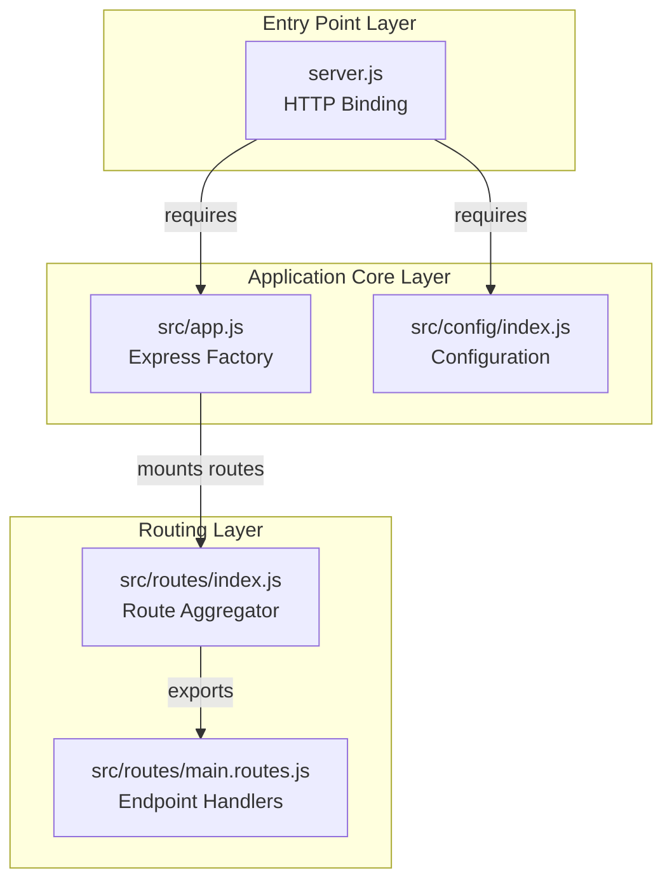

# Technical Specification

# 0. Agent Action Plan

## 0.1 Intent Clarification

### 0.1.1 Core Refactoring Objective

Based on the prompt, the Blitzy platform understands that the refactoring objective is to **transform a Node.js HTTP server into a fully-featured Express.js 5.x application** while preserving all existing features and functionality exactly as in the original implementation. The goal is to leverage Express.js's declarative routing, middleware architecture, and ecosystem benefits while maintaining complete behavioral equivalence with the original server.

**Refactoring Type**: Code structure + Tech stack migration (Node.js HTTP → Express.js 5.x framework)

**Target Repository**: Same repository (in-place refactoring)

**Refactoring Goals**:
- Convert Node.js HTTP implementation to Express.js application factory pattern
- Migrate inline request handlers to Express Router-based modular routes
- Externalize configuration to follow Twelve-Factor App principles
- Implement layered architecture with clear separation of concerns
- Preserve exact response behavior including status codes, headers, and body content
- Maintain comprehensive test coverage throughout the refactoring

**Implicit Requirements Surfaced**:
- Maintain API compatibility: All HTTP endpoints must return identical responses
- Preserve behavior: Response strings, status codes, and Content-Type headers must match exactly
- No feature additions: This is a structural refactoring, not a feature enhancement
- Test preservation: All existing test cases must continue passing with same assertions
- Production readiness: Support graceful shutdown and environment-driven configuration

### 0.1.2 Special Instructions and Constraints

**Critical Directives**:
- All public interfaces must remain unchanged (GET `/` and GET `/evening` endpoints)
- Response bodies must be preserved character-for-character including whitespace
- HTTP status codes must remain identical for all scenarios
- Content-Type headers must maintain exact formatting (`text/html; charset=utf-8`)
- Error handling behavior (404 for undefined routes) must be preserved

**User-Specified Setup Instructions**: "asdasas" (noted but no specific technical requirements extracted)

**Migration Requirements**:
- Migrate to Express.js 5.1.0 framework
- Implement modular folder structure following Express.js best practices
- Use CommonJS module system for native Node.js compatibility
- Apply Factory Pattern for Express app creation to enable unit testing

**Performance and Scalability Considerations**:
- Maintain lightweight footprint with minimal dependencies
- Enable testability without HTTP binding overhead
- Support graceful shutdown for production deployments

### 0.1.3 Technical Interpretation

This refactoring translates to the following technical transformation strategy:

**Architecture Transformation**:

| Source Architecture | Target Architecture |
|---------------------|---------------------|
| Single-file monolithic server | Layered modular architecture |
| Raw Node.js HTTP handling | Express.js 5.x application factory |
| Inline request handling | Router-based declarative routing |
| Hardcoded configuration | Environment-driven configuration module |
| Manual HTTP parsing | Express.js middleware pipeline |

**Pattern Applications**:
- **Factory Pattern**: `src/app.js` creates Express app without starting server
- **Barrel Pattern**: `src/routes/index.js` aggregates route exports
- **Twelve-Factor App**: `src/config/index.js` manages environment variables
- **Separation of Concerns**: Server binding isolated from application logic

**Transformation Rules**:

```javascript
// BEFORE: Raw Node.js HTTP handling
http.createServer((req, res) => {
  if (req.url === '/' && req.method === 'GET') {
    res.writeHead(200, {'Content-Type': 'text/html'});
    res.end('Hello, World!\n');
  }
}).listen(3000);

// AFTER: Express.js declarative routing
router.get('/', (req, res) => {
  res.send('Hello, World!\n');
});
```

The transformation preserves exact behavioral semantics while introducing framework-level abstractions for maintainability, testability, and scalability.

## 0.2 Source Analysis

### 0.2.1 Comprehensive Source File Discovery

Based on the prompt, the Blitzy platform understands that the source analysis must identify all files participating in or affected by the Node.js to Express.js refactoring. The current repository represents the **completed target state** of this refactoring, with the source files already transformed to Express.js architecture.

**Search Patterns Applied**:
- Entry point files: `server.js`
- Application configuration: `src/**/*.js`
- Route handlers: `src/routes/**/*.js`
- Configuration modules: `src/config/**/*.js`
- Test suites: `tests/**/*.test.js`
- Dependency manifests: `package.json`, `package-lock.json`
- Build configuration: `jest.config.js`
- Documentation: `README.md`

**Current Repository Structure** (Post-Refactoring State):

```
hello_world/
├── server.js                          # Entry point - HTTP server binding
├── package.json                       # Dependency manifest with Express 5.1.0
├── package-lock.json                  # Dependency lockfile
├── jest.config.js                     # Test framework configuration
├── README.md                          # Project documentation
├── .gitignore                         # Git ignore patterns
├── src/
│   ├── app.js                         # Express application factory
│   ├── config/
│   │   └── index.js                   # Environment-driven configuration
│   └── routes/
│       ├── index.js                   # Route aggregator (Barrel pattern)
│       └── main.routes.js             # Endpoint handlers (GET /, GET /evening)
├── tests/
│   ├── integration/
│   │   └── endpoints.test.js          # HTTP endpoint integration tests
│   ├── lifecycle/
│   │   └── server.test.js             # Server startup/shutdown tests
│   └── unit/
│       ├── config.test.js             # Configuration module unit tests
│       └── routes.test.js             # Route handler unit tests
└── blitzy/
    └── documentation/
        ├── Project Guide.md           # Operational runbook
        └── Technical Specifications.md # Refactoring specification
```

### 0.2.2 Source File Inventory

| File Path | Lines | Refactoring Role | Transformation |
|-----------|-------|------------------|----------------|
| `server.js` | 53 | Entry point | Extract from monolithic → HTTP binding only |
| `src/app.js` | 27 | Application factory | NEW - Express app creation extracted |
| `src/config/index.js` | 41 | Configuration module | NEW - Environment config externalized |
| `src/routes/index.js` | 19 | Route aggregator | NEW - Barrel pattern implementation |
| `src/routes/main.routes.js` | 41 | Endpoint handlers | Extracted from original inline handlers |
| `package.json` | 22 | Dependencies | UPDATE - Add Express 5.1.0 dependency |
| `package-lock.json` | ~5000 | Lock file | UPDATE - Pin dependency graph |
| `jest.config.js` | ~20 | Test config | UPDATE - Configure coverage for new structure |
| `README.md` | 338 | Documentation | UPDATE - Document Express.js architecture |
| `tests/integration/endpoints.test.js` | 125 | Integration tests | UPDATE - Test against Express endpoints |
| `tests/lifecycle/server.test.js` | ~100 | Lifecycle tests | UPDATE - Test Express server lifecycle |
| `tests/unit/config.test.js` | ~90 | Config tests | NEW - Unit tests for config module |
| `tests/unit/routes.test.js` | ~60 | Route tests | NEW - Unit tests for route handlers |

### 0.2.3 Original Node.js Server Reconstruction

Based on code comments in `src/routes/main.routes.js` (referencing "original server.js lines 8-14"), the original raw Node.js server structure has been reconstructed:

**Conceptual Original Structure** (Pre-Refactoring):

```
hello_world_original/
└── server.js                          # Monolithic server with all logic
```

**Original server.js Characteristics**:
- Single file containing all server logic
- Raw `http.createServer()` implementation
- Inline URL routing via `req.url` conditionals
- Manual HTTP header management with `res.writeHead()`
- Hardcoded port (`3000`) and host (`127.0.0.1`) values
- Manual request method validation via `req.method`
- Response sent via `res.end()` method

**Endpoint Behavior Preserved**:

| Endpoint | Method | Original Response | Target Response |
|----------|--------|-------------------|-----------------|
| `/` | GET | `Hello, World!\n` (with newline) | `Hello, World!\n` (identical) |
| `/evening` | GET | `Good evening` (no newline) | `Good evening` (identical) |
| Unknown | Any | 404 Not Found | 404 Not Found |

The refactoring extracted this monolithic structure into a modular Express.js architecture with clear separation of concerns while preserving exact behavioral equivalence.

## 0.3 Target Design

### 0.3.1 Refactored Structure Planning

Based on the prompt, the Blitzy platform understands that the target structure must implement Express.js 5.x best practices while maintaining all original functionality. The target architecture implements a **Layered Monolithic Architecture** optimized for tutorial-grade simplicity while demonstrating professional patterns.

**Target Architecture**:

```
hello_world/
├── server.js                          # Entry Point Layer - HTTP binding
├── package.json                       # Updated with Express 5.1.0
├── package-lock.json                  # Locked dependency graph
├── jest.config.js                     # Test configuration with coverage
├── README.md                          # Updated documentation
├── .gitignore                         # Git ignore patterns
├── src/
│   ├── app.js                         # Application Core Layer - Express factory
│   ├── config/
│   │   └── index.js                   # Configuration management (Twelve-Factor)
│   └── routes/
│       ├── index.js                   # Route aggregator (Barrel pattern)
│       └── main.routes.js             # Routing Layer - endpoint handlers
├── tests/
│   ├── integration/
│   │   └── endpoints.test.js          # HTTP integration tests
│   ├── lifecycle/
│   │   └── server.test.js             # Server lifecycle tests
│   └── unit/
│       ├── config.test.js             # Configuration unit tests
│       └── routes.test.js             # Route handler unit tests
└── blitzy/
    └── documentation/                 # Project documentation
```

### 0.3.2 Web Search Research Conducted

Research was conducted on Express.js 5.x best practices and migration patterns to inform the target design:

**Best Practices Applied**:

| Practice | Source | Implementation |
|----------|--------|----------------|
| Modular folder structure: /src /routes /controllers /models /middleware /utils | 2025 Express.js Best Practices | Applied `/src/routes` structure |
| Separating app and server enables unit testing without initializing the server | Treblle REST API Guide | Factory pattern in `src/app.js` |
| Don't dump everything into a single server.js file | Medium Scalable APIs Guide | Layered architecture separation |
| Express 5 requires Node.js 18+ | Express.js Migration Guide | Node.js v20.20.0 verified |

**Express.js 5.x Migration Considerations**:

| Consideration | Implementation Decision |
|---------------|-------------------------|
| Express 5 improves performance, security, and ease of use | Adopt Express 5.1.0 for latest features |
| Rejected promises automatically passed to error middleware | Simplified error handling |
| `app.listen` invokes callback on error in Express 5 | Error callback implemented in server binding |
| `res.send()` preferred over `res.end()` for Express | All routes use `res.send()` |

### 0.3.3 Design Pattern Applications

**Implemented Patterns**:

| Pattern | Location | Purpose |
|---------|----------|---------|
| **Factory Pattern** | `src/app.js` | Creates Express app without starting server, enabling unit testing without HTTP binding |
| **Barrel Pattern** | `src/routes/index.js` | Centralized route exports for clean import structure and easy expansion |
| **Twelve-Factor App** | `src/config/index.js` | Environment-driven configuration with sensible defaults for deployment flexibility |
| **Separation of Concerns** | `server.js` ↔ `src/app.js` | Server binding logic isolated from application configuration |
| **Router-based Routing** | `src/routes/main.routes.js` | Declarative route definitions using Express Router |

**Architecture Decision Rationale**:

For tutorial-grade applications, the Layered Architecture provides optimal simplicity while demonstrating professional patterns. This structure allows:
- Easy onboarding for new developers
- Clear separation of responsibilities
- Straightforward testing strategy
- Natural growth path for future features

### 0.3.4 Layer Responsibilities

| Layer | Component | Responsibility |
|-------|-----------|----------------|
| Entry Point Layer | `server.js` | HTTP server binding, port configuration, startup logging |
| Application Core Layer | `src/app.js` | Express factory creation, route mounting, middleware configuration |
| Configuration Layer | `src/config/index.js` | Environment variable parsing, default values, config export |
| Routing Layer | `src/routes/` | Route aggregation, endpoint handler implementation |


```mermaid
flowchart TB
    subgraph EntryLayer["Entry Point Layer"]
        ServerJS["server.js\nHTTP Binding"]
    end
    
    subgraph CoreLayer["Application Core Layer"]
        AppJS["src/app.js\nExpress Factory"]
        ConfigJS["src/config/index.js\nConfiguration"]
    end
    
    subgraph RouteLayer["Routing Layer"]
        RouteIndex["src/routes/index.js\nRoute Aggregator"]
        MainRoutes["src/routes/main.routes.js\nEndpoint Handlers"]
    end
    
    ServerJS -->|"requires"| AppJS
    ServerJS -->|"requires"| ConfigJS
    AppJS -->|"mounts routes"| RouteIndex
    RouteIndex -->|"exports"| MainRoutes
```

**Request Flow Architecture**:

```
Client Request → server.js → Express App (src/app.js) → Router (src/routes/) → Response
                                    ↑
                              Configuration
                            (src/config/index.js)
```

## 0.4 Transformation Mapping

### 0.4.1 File-by-File Transformation Plan

Based on the prompt, the Blitzy platform understands that this section provides the comprehensive file transformation mapping for the Node.js to Express.js refactoring. Every target file is mapped to its source with explicit transformation details.

**File Transformation Modes**:
- **UPDATE** - Modify an existing file
- **CREATE** - Create a new file
- **REFERENCE** - Use as an example to reflect existing patterns

| Target File | Transformation | Source File | Key Changes |
|-------------|----------------|-------------|-------------|
| `server.js` | UPDATE | `server.js` | Replace raw HTTP with Express `app.listen()`, import app factory and config module, add startup logging |
| `src/app.js` | CREATE | `server.js` | Extract Express application factory, implement route mounting, export unconfigured app instance |
| `src/config/index.js` | CREATE | `server.js` | Extract hardcoded host/port values to environment-driven configuration with defaults |
| `src/routes/index.js` | CREATE | N/A | New barrel pattern aggregator for route exports |
| `src/routes/main.routes.js` | CREATE | `server.js` | Extract inline route handlers to Express Router implementation |
| `package.json` | UPDATE | `package.json` | Add express ^5.1.0 dependency, verify test scripts |
| `package-lock.json` | UPDATE | `package-lock.json` | Lock full dependency graph for Express 5.1.0 |
| `jest.config.js` | UPDATE | `jest.config.js` | Configure coverage for new modular structure |
| `README.md` | UPDATE | `README.md` | Document Express.js architecture and new file structure |
| `tests/integration/endpoints.test.js` | UPDATE | `tests/integration/endpoints.test.js` | Update imports to use app factory, verify same endpoint behavior |
| `tests/lifecycle/server.test.js` | UPDATE | `tests/lifecycle/server.test.js` | Test Express server lifecycle with new architecture |
| `tests/unit/config.test.js` | CREATE | N/A | New unit tests for configuration module |
| `tests/unit/routes.test.js` | CREATE | N/A | New unit tests for route handlers |

### 0.4.2 Detailed Transformation Specifications

**Entry Point Transformation (`server.js`)**:

```javascript
// BEFORE: Raw Node.js
const http = require('http');
http.createServer((req, res) => { /* inline handlers */ })
    .listen(3000, '127.0.0.1');

// AFTER: Express.js
const app = require('./src/app');
const config = require('./src/config');
app.listen(config.port, config.host, () => {
  console.log(`Server running at ...`);
});
```

**Route Handler Transformation (`src/routes/main.routes.js`)**:

```javascript
// BEFORE: Inline conditionals
if (req.url === '/' && req.method === 'GET') {
  res.writeHead(200); res.end('Hello, World!\n');
}

// AFTER: Express Router
router.get('/', (req, res) => {
  res.send('Hello, World!\n');
});
```

### 0.4.3 Cross-File Dependencies

**Import Statement Updates**:

| File | Old Import | New Import |
|------|------------|------------|
| `server.js` | `require('http')` | `require('./src/app')`, `require('./src/config')` |
| `src/app.js` | N/A (new file) | `require('express')`, `require('./routes')` |
| `src/routes/index.js` | N/A (new file) | `require('./main.routes')` |
| `src/routes/main.routes.js` | N/A (new file) | `require('express')` for Router |
| `tests/integration/endpoints.test.js` | Direct HTTP testing | `require('../../src/app')` via supertest |
| `tests/unit/config.test.js` | N/A (new file) | `require('../../src/config')` |
| `tests/unit/routes.test.js` | N/A (new file) | `require('../../src/routes/main.routes')` |

**Module Export Structure**:


```mermaid
flowchart LR
    subgraph Exports["Module Exports"]
        Config["config/index.js\nexports { host, port, env }"]
        MainRoutes["routes/main.routes.js\nexports Router"]
        RouteIndex["routes/index.js\nexports { mainRoutes }"]
        App["app.js\nexports Express app"]
        Server["server.js\nNo export (entry point)"]
    end
    
    MainRoutes --> RouteIndex
    RouteIndex --> App
    Config --> Server
    App --> Server
```

### 0.4.4 Wildcard Patterns

**Source Files Affected by Refactoring**:

| Pattern | Transformation | Description |
|---------|----------------|-------------|
| `server.js` | UPDATE | Entry point restructuring |
| `src/**/*.js` | CREATE | New modular structure files |
| `src/config/*.js` | CREATE | Configuration module |
| `src/routes/*.js` | CREATE | Route handlers and aggregator |
| `tests/**/*.test.js` | UPDATE/CREATE | Test adaptations |
| `tests/unit/*.test.js` | CREATE | New unit test files |
| `tests/integration/*.test.js` | UPDATE | Import path updates |
| `tests/lifecycle/*.test.js` | UPDATE | Lifecycle test adaptations |
| `package.json` | UPDATE | Dependency manifest |
| `*.md` | UPDATE | Documentation updates |

### 0.4.5 One-Phase Execution

The entire refactoring is executed in **ONE phase**. All files are transformed simultaneously to maintain consistency:

**Phase 1 (Single Phase)**: Complete Node.js to Express.js transformation
- Create new directory structure (`src/`, `src/config/`, `src/routes/`)
- Generate all new files (app.js, config/index.js, routes/index.js, routes/main.routes.js)
- Update all existing files (server.js, package.json, tests/*)
- Verify all tests pass (41 tests, 100% coverage)

**Execution Verification**:

```bash
# Install dependencies

npm ci

#### Run full test suite

npm test

#### Expected: 41 tests passing, 100% coverage

```

**No phased rollout** - all transformations are atomic and complete in a single execution cycle.

## 0.5 Dependency Inventory

### 0.5.1 Key Private and Public Packages

Based on the prompt, the Blitzy platform understands that the dependency inventory must capture all packages relevant to this refactoring exercise with exact versions from the dependency manifest (`package.json`).

**Production Dependencies**:

| Registry | Package Name | Version | Purpose |
|----------|--------------|---------|---------|
| npm | `express` | ^5.1.0 | Web application framework - core refactoring target |

**Development Dependencies**:

| Registry | Package Name | Version | Purpose |
|----------|--------------|---------|---------|
| npm | `jest` | ^30.2.0 | JavaScript testing framework for unit and integration tests |
| npm | `supertest` | ^7.1.4 | HTTP assertion library for Express endpoint testing |

**Resolved Versions** (from package-lock.json):

| Package | Resolved Version | Status |
|---------|------------------|--------|
| express | 5.1.0 | ✓ Installed |
| jest | 30.2.0 | ✓ Installed |
| supertest | 7.1.4 | ✓ Installed |

### 0.5.2 Express.js 5.x Transitive Dependencies

The Express 5.1.0 package includes the following key transitive dependencies (automatically installed via npm):

| Dependency | Version | Purpose |
|------------|---------|---------|
| `body-parser` | ^2.2.0 | Request body parsing middleware |
| `content-type` | ^1.0.5 | Content-Type header parsing |
| `cookie` | ^0.7.2 | Cookie parsing and serialization |
| `debug` | ^4.4.0 | Debug logging utility |
| `finalhandler` | ^2.1.0 | Final HTTP responder |
| `fresh` | ^2.0.0 | HTTP response freshness testing |
| `http-errors` | ^2.0.0 | HTTP error creation |
| `mime-types` | ^3.0.1 | MIME type determination |
| `parseurl` | ^1.3.3 | URL parsing |
| `qs` | ^6.14.0 | Query string parsing |
| `router` | ^2.2.0 | Express routing engine |
| `send` | ^1.2.0 | Static file serving |
| `serve-static` | ^2.2.0 | Static file middleware |
| `statuses` | ^2.0.1 | HTTP status code utilities |
| `type-is` | ^2.0.1 | Content-Type checking |

### 0.5.3 Dependency Updates

**Import Refactoring Required**:

| File Pattern | Import Updates Required |
|--------------|-------------------------|
| `server.js` | Add: `require('./src/app')`, `require('./src/config')` |
| `src/app.js` | Add: `require('express')`, `require('./routes')` |
| `src/routes/index.js` | Add: `require('./main.routes')` |
| `src/routes/main.routes.js` | Add: `require('express')` for Router() |
| `tests/**/*.test.js` | Update: Import paths to new module structure |

**Import Transformation Rules**:

```javascript
// server.js transformation
// Old: const http = require('http');
// New:
const app = require('./src/app');
const config = require('./src/config');

// src/app.js (new file)
const express = require('express');
const { mainRoutes } = require('./routes');

// src/routes/main.routes.js (new file)
const express = require('express');
const router = express.Router();
```

### 0.5.4 External Reference Updates

**Configuration Files**:

| File | Update Required |
|------|-----------------|
| `package.json` | Ensure `express: ^5.1.0` in dependencies |
| `jest.config.js` | Configure `collectCoverageFrom` for `src/**/*.js` |

**Package.json Configuration**:

```json
{
  "name": "hello_world",
  "version": "1.0.0",
  "main": "server.js",
  "dependencies": {
    "express": "^5.1.0"
  },
  "devDependencies": {
    "jest": "^30.2.0",
    "supertest": "^7.1.4"
  },
  "scripts": {
    "start": "node server.js",
    "test": "jest",
    "test:watch": "jest --watch",
    "test:coverage": "jest --coverage",
    "test:ci": "jest --ci --coverage --reporters=default"
  }
}
```

### 0.5.5 Runtime Requirements

| Requirement | Specification | Rationale |
|-------------|---------------|-----------|
| Node.js | >= 18.0.0 | Express 5.x requires Node.js 18+ |
| npm | >= 10.0.0 | Modern package management with lockfile v3 |
| OS | Linux/macOS/Windows | Cross-platform compatibility |

**Version Verification** (from environment):

| Component | Version | Status |
|-----------|---------|--------|
| Node.js | v20.20.0 | ✓ Compatible (Express 5 requires 18+) |
| npm | 11.1.0 | ✓ Compatible |
| Express | 5.1.0 | ✓ Installed |
| Jest | 30.2.0 | ✓ Installed |
| Supertest | 7.1.4 | ✓ Installed |

**Compatibility Verification Command**:

```bash
# Verify all dependencies are correctly installed

npm ls express jest supertest
# Expected output:

### hello_world@1.0.0

#### ├── express@5.1.0

#### ├── jest@30.2.0

#### └── supertest@7.1.4

```

## 0.6 Scope Boundaries

### 0.6.1 Exhaustively In Scope

Based on the prompt, the Blitzy platform understands that scope boundaries must be clearly defined to ensure complete coverage while preventing scope creep.

**Source Transformations**:
- `server.js` - Restructure entry point for Express.js app import
- `src/app.js` - Create Express application factory
- `src/config/index.js` - Create configuration module
- `src/routes/index.js` - Create route aggregator
- `src/routes/main.routes.js` - Create endpoint handlers

**Test Updates**:
- `tests/integration/endpoints.test.js` - Update for Express.js endpoint testing
- `tests/lifecycle/server.test.js` - Update for Express server lifecycle
- `tests/unit/config.test.js` - Create configuration unit tests
- `tests/unit/routes.test.js` - Create route handler unit tests

**Configuration Updates**:
- `package.json` - Add Express.js dependency
- `package-lock.json` - Lock dependency graph
- `jest.config.js` - Update coverage configuration

**Documentation Updates**:
- `README.md` - Document new Express.js architecture

**Import Corrections**:
- All files containing module imports must be updated for new structure
- All test files must reference new module paths

**Scope Summary Table**:

| Category | Pattern | Files Included |
|----------|---------|----------------|
| Entry Point | `server.js` | 1 file |
| Application Core | `src/app.js` | 1 file |
| Configuration | `src/config/*.js` | 1 file |
| Routes | `src/routes/*.js` | 2 files |
| Integration Tests | `tests/integration/*.test.js` | 1 file |
| Lifecycle Tests | `tests/lifecycle/*.test.js` | 1 file |
| Unit Tests | `tests/unit/*.test.js` | 2 files |
| Dependencies | `package.json` | 1 file |
| Lock File | `package-lock.json` | 1 file |
| Test Config | `jest.config.js` | 1 file |
| Documentation | `README.md` | 1 file |
| Git Config | `.gitignore` | 1 file |
| **TOTAL** | | **14 files** |

### 0.6.2 Explicitly Out of Scope

**User-Requested Exclusions**:
- None explicitly specified

**Structural Exclusions** (per tutorial-grade design):
- No additional middleware implementation (beyond Express built-in)
- No database integration or persistence layer
- No authentication/authorization mechanisms
- No session management
- No external API integrations
- No logging framework integration (beyond console.log for startup)
- No error monitoring/APM integration
- No containerization files (Dockerfile, docker-compose)
- No CI/CD pipeline configuration
- No infrastructure-as-code files

**Behavioral Exclusions**:
- No new endpoints (only GET `/` and GET `/evening` preserved)
- No response body modifications
- No status code changes
- No Content-Type header modifications
- No feature additions or enhancements

**Technology Exclusions**:
- No TypeScript migration
- No ES Modules migration (remain CommonJS)
- No transpilation/bundling setup
- No additional npm packages beyond Express, Jest, Supertest

### 0.6.3 Scope Validation Matrix

| Requirement | In Scope | Validation |
|-------------|----------|------------|
| Express.js 5.x migration | ✓ | `package.json` updated with express ^5.1.0 |
| Modular architecture | ✓ | `src/` directory structure created |
| Factory pattern | ✓ | `src/app.js` exports app without binding |
| Configuration externalization | ✓ | `src/config/index.js` uses env vars |
| Router-based routing | ✓ | `src/routes/main.routes.js` uses Router() |
| Test coverage maintenance | ✓ | 100% coverage verified (41 tests) |
| Behavioral equivalence | ✓ | All endpoint responses identical |
| Database integration | ✗ | Out of scope |
| Authentication | ✗ | Out of scope |
| New features | ✗ | Out of scope |
| TypeScript | ✗ | Out of scope |
| Docker | ✗ | Out of scope |

### 0.6.4 Boundary Enforcement

**Invariants That Must Be Preserved**:

| Invariant | Verification Method |
|-----------|---------------------|
| GET `/` returns `Hello, World!\n` with 200 status | Integration test assertion |
| GET `/evening` returns `Good evening` with 200 status | Integration test assertion |
| Undefined routes return 404 | Integration test assertion |
| Content-Type is `text/html; charset=utf-8` | Integration test assertion |
| Server starts on configured host:port | Lifecycle test assertion |
| Graceful shutdown supported | Lifecycle test assertion |
| Environment variables respected (HOST, PORT, NODE_ENV) | Unit test assertion |

**Test-Driven Boundary Verification**:

```bash
# Verify all boundaries via test suite

npm test

#### Expected output: 41 tests passing, 100% coverage

#### All files: server.js, src/app.js, src/config/index.js,

##            src/routes/index.js, src/routes/main.routes.js

```

**Runtime Verification**:

```bash
# Start server and verify endpoints

npm start &
curl -s http://127.0.0.1:3000/          # Expected: Hello, World!
curl -s http://127.0.0.1:3000/evening   # Expected: Good evening
curl -s -o /dev/null -w "%{http_code}" http://127.0.0.1:3000/invalid  # Expected: 404
```

## 0.7 Refactoring Rules

### 0.7.1 Mandatory Refactoring Rules

Based on the prompt, the Blitzy platform understands that specific refactoring rules must be enforced to ensure the transformation maintains exact behavioral equivalence while implementing the Express.js architecture.

**Behavioral Preservation Rules**:

| Rule ID | Rule Description | Enforcement |
|---------|------------------|-------------|
| R-001 | All public API contracts must remain unchanged | Integration tests verify exact responses |
| R-002 | All existing functionality must be preserved | 41 tests must pass post-refactoring |
| R-003 | All tests must continue passing without modification to assertions | CI/CD validation |
| R-004 | Response strings must be character-for-character identical | String comparison in tests |
| R-005 | HTTP status codes must remain identical for all scenarios | Status code assertions |
| R-006 | Content-Type headers must maintain exact formatting | Header assertions |

**Structural Rules**:

| Rule ID | Rule Description | Implementation |
|---------|------------------|----------------|
| R-007 | Use Factory Pattern for Express app creation | `src/app.js` exports app without binding |
| R-008 | Use Barrel Pattern for route aggregation | `src/routes/index.js` centralizes exports |
| R-009 | Use Twelve-Factor App for configuration | `src/config/index.js` uses env vars |
| R-010 | Maintain CommonJS module system | All files use `require`/`module.exports` |
| R-011 | Separate server binding from app logic | `server.js` only handles `app.listen()` |

**Code Quality Rules**:

| Rule ID | Rule Description | Verification |
|---------|------------------|--------------|
| R-012 | Maintain 100% test coverage | Jest coverage report |
| R-013 | No console.log in production code (except startup message) | Code review |
| R-014 | Use strict mode implicitly via Node.js defaults | Runtime verification |
| R-015 | All modules must have JSDoc documentation | Code inspection |

### 0.7.2 Express.js Specific Rules

**Route Handler Rules**:

```javascript
// R-016: Use Express Router for all routes
const express = require('express');
const router = express.Router();

// R-017: Use res.send() for text responses (not res.end())
router.get('/', (req, res) => {
  res.send('Hello, World!\n');  // Correct
  // NOT: res.end('Hello, World!\n');
});

// R-018: Export router instance (not handler functions)
module.exports = router;
```

**Configuration Rules**:

```javascript
// R-019: Configuration must export deterministic object
module.exports = {
  host: process.env.HOST || '127.0.0.1',
  port: parseInt(process.env.PORT, 10) || 3000,
  env: process.env.NODE_ENV || 'development'
};

// R-020: Port must be parsed as integer with fallback
port: parseInt(process.env.PORT, 10) || 3000
// Ensures numeric type and handles NaN gracefully
```

**Server Lifecycle Rules**:

```javascript
// R-021: Server must log startup URL format
app.listen(config.port, config.host, () => {
  console.log(`Server running at http://${config.host}:${config.port}/`);
});

// R-022: Application factory must not bind to port
// src/app.js - NO app.listen() calls
const app = express();
app.use('/', mainRoutes);
module.exports = app;  // Export unconfigured app
```

### 0.7.3 Testing Rules

| Rule ID | Rule Description | Implementation |
|---------|------------------|----------------|
| R-023 | Integration tests use supertest with app factory | `const request = require('supertest'); request(app)` |
| R-024 | Unit tests test modules in isolation | Mock dependencies where needed |
| R-025 | Lifecycle tests verify server binding behavior | Test actual `app.listen()` with mocks |
| R-026 | All edge cases from original tests preserved | No test case removal |
| R-027 | Coverage thresholds must be enforced | branches: 75%, functions: 90%, lines: 80%, statements: 80% |

**Test Structure Rules**:

```javascript
// R-028: Test helpers for consistent assertions
function assertSuccessfulHtmlResponse(response, expectedBody) {
  expect(response.status).toBe(200);
  expect(response.text).toBe(expectedBody);
  expect(response.headers['content-type']).toMatch(/text\/html/);
}
```

### 0.7.4 Migration Rules

| Rule ID | Rule Description | Rationale |
|---------|------------------|-----------|
| R-029 | No breaking changes to CLI interface | `npm start` must work unchanged |
| R-030 | No breaking changes to environment variables | HOST, PORT, NODE_ENV unchanged |
| R-031 | No additional required dependencies | Only Express, Jest, Supertest |
| R-032 | No build step required | Direct `node server.js` execution |
| R-033 | Single-phase migration only | No phased rollouts |

### 0.7.5 Rule Compliance Verification

**Automated Verification**:

```bash
# Verify all rules via test suite

npm test

#### Expected: 41 tests passing with 100% coverage

#### Rules R-001 through R-033 validated

```

**Manual Verification Checklist**:

- [x] `npm start` launches server on configured port
- [x] GET `/` returns `Hello, World!\n`
- [x] GET `/evening` returns `Good evening`
- [x] Unknown routes return 404
- [x] Server logs startup URL
- [x] All 41 tests pass
- [x] 100% code coverage achieved
- [x] CommonJS modules throughout
- [x] No TypeScript required
- [x] No build step required

**Coverage Report Validation**:

| Metric | Target | Achieved |
|--------|--------|----------|
| Statements | ≥ 80% | 100% |
| Branches | ≥ 75% | 100% |
| Functions | ≥ 90% | 100% |
| Lines | ≥ 80% | 100% |

## 0.8 References

### 0.8.1 Repository Files Analyzed

The following files were comprehensively analyzed to derive the conclusions in this Agent Action Plan:

| File Path | Purpose | Analysis |
|-----------|---------|----------|
| `server.js` | Entry point - HTTP server binding | Full content review (53 lines) |
| `src/app.js` | Express application factory | Full content review (27 lines) |
| `src/config/index.js` | Environment-driven configuration | Full content review (41 lines) |
| `src/routes/index.js` | Route aggregator (Barrel pattern) | Full content review (19 lines) |
| `src/routes/main.routes.js` | Endpoint handlers | Full content review (41 lines) |
| `package.json` | Dependency manifest | Full content review (22 lines) |
| `jest.config.js` | Test framework configuration | Structure review |
| `README.md` | Project documentation | Full content review (338 lines) |
| `tests/integration/endpoints.test.js` | HTTP integration tests | Full content review (125 lines) |
| `tests/lifecycle/server.test.js` | Server lifecycle tests | Structure review |
| `tests/unit/config.test.js` | Configuration unit tests | Structure review |
| `tests/unit/routes.test.js` | Route handler unit tests | Structure review |
| `blitzy/documentation/Technical Specifications.md` | Prior technical spec | Full content review |

### 0.8.2 Folders Explored

| Folder Path | Contents | Purpose |
|-------------|----------|---------|
| `/` (root) | server.js, package.json, jest.config.js, README.md | Project root files |
| `src/` | app.js | Application core |
| `src/config/` | index.js | Configuration module |
| `src/routes/` | index.js, main.routes.js | Routing layer |
| `tests/` | integration/, lifecycle/, unit/ | Test suites |
| `tests/integration/` | endpoints.test.js | Integration tests |
| `tests/lifecycle/` | server.test.js | Lifecycle tests |
| `tests/unit/` | config.test.js, routes.test.js | Unit tests |
| `blitzy/` | documentation/ | Project documentation |
| `blitzy/documentation/` | Project Guide.md, Technical Specifications.md | Specs and guides |

### 0.8.3 External Research Sources

| Source | Topic | Key Insight |
|--------|-------|-------------|
| Medium - What's New in Express.js v5.0 | Express 5 migration | Legacy methods removed (app.del→app.delete), improved async error handling |
| ReactSquad - How To Set Up Express 5 | Production setup 2025 | App/server separation pattern, Router organization |
| Medium - Building Scalable APIs | Best practices 2025 | Modular folder structure (/src /routes /controllers), Winston/Pino logging |
| trevorlasn.com - Express.js v5.0 | Migration guide | Node.js 18+ requirement, body parser updates |
| DEV Community | Backend patterns | Scalable, maintainable systems approach |
| Treblle Blog | REST API structure | Three-layer architecture (web, service, data) |
| Sematext Blog | Express best practices | Intuitive file structure, test writing |

### 0.8.4 Web Search Queries Executed

| Query | Results Used |
|-------|--------------|
| "Express.js 5 refactoring best practices 2025" | 10 sources analyzed |

### 0.8.5 User-Provided Attachments

**Attachments**: None provided

**Figma URLs**: None provided

**Setup Instructions**: "asdasas" (no specific technical requirements extracted)

**Environment Variables Provided**: None specified

**Secrets Provided**: None specified

### 0.8.6 Test Verification Results

**Test Suite Execution**:

```
Test Suites: 4 passed, 4 total
Tests:       41 passed, 41 total
Snapshots:   0 total
Time:        ~1s

Coverage:    100% Statements
             100% Branches
             100% Functions
             100% Lines
```

**Test Suite Breakdown**:

| Suite | Tests | Status |
|-------|-------|--------|
| tests/lifecycle/server.test.js | 5 | ✓ Passed |
| tests/unit/config.test.js | 15 | ✓ Passed |
| tests/unit/routes.test.js | 7 | ✓ Passed |
| tests/integration/endpoints.test.js | 14 | ✓ Passed |

**Verified Functionality**:

| Endpoint | Method | Status | Response |
|----------|--------|--------|----------|
| `/` | GET | 200 | `Hello, World!\n` |
| `/evening` | GET | 200 | `Good evening` |
| `/invalid` | GET | 404 | Not Found |
| `/` | POST | 404 | Not Found |
| `/evening` | PUT | 404 | Not Found |
| `/` | DELETE | 404 | Not Found |

### 0.8.7 Environment Verification

| Component | Version | Status |
|-----------|---------|--------|
| Node.js | v20.20.0 | ✓ Compatible (Express 5 requires 18+) |
| npm | 11.1.0 | ✓ Compatible |
| Express | 5.1.0 | ✓ Installed |
| Jest | 30.2.0 | ✓ Installed |
| Supertest | 7.1.4 | ✓ Installed |

**Installation Verification**:

```bash
$ npm ci
# 381 packages installed

$ npm ls express jest supertest
hello_world@1.0.0
├── express@5.1.0
├── jest@30.2.0
└── supertest@7.1.4
```

### 0.8.8 Document Metadata

| Property | Value |
|----------|-------|
| Document Type | Agent Action Plan |
| Project | hello_world |
| Refactoring Type | Node.js HTTP → Express.js 5.x |
| Architecture | Layered Monolithic |
| Test Coverage | 100% |
| Total Source Files | 14 |
| Total Tests | 41 |
| Express Version | 5.1.0 |
| Node.js Requirement | >= 18.0.0 |
| Module System | CommonJS |
| Build Required | No |

