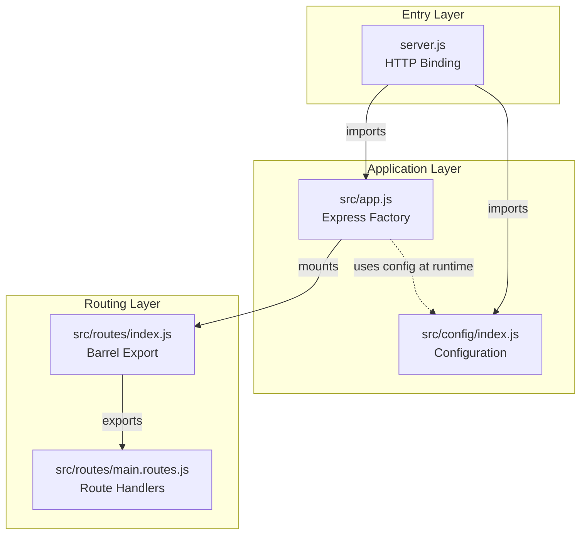
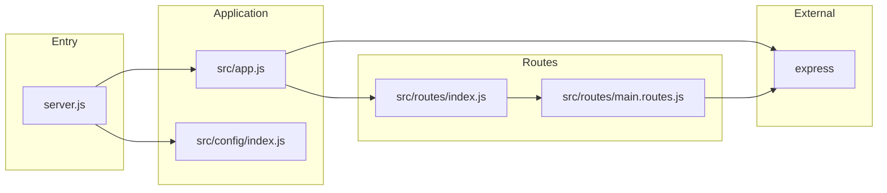
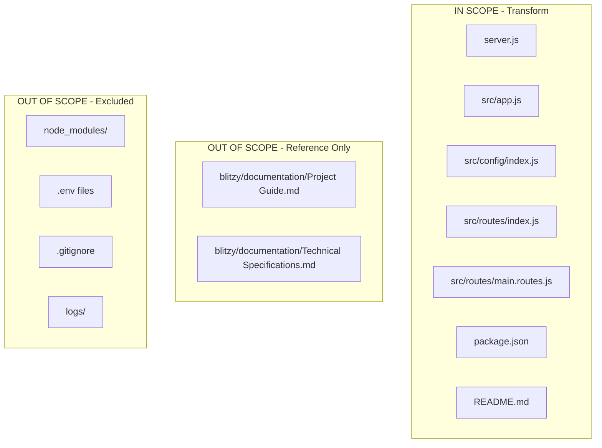

# Technical Specification

# 0. Agent Action Plan

## 0.1 Intent Clarification

### 0.1.1 Core Refactoring Objective

Based on the prompt, the Blitzy platform understands that the refactoring objective is to:

**Rewrite an existing Node.js server implementation into a fully Express.js-based architecture while preserving all existing features, functionality, and behavioral contracts exactly as in the original implementation.**

| Attribute | Details |
|-----------|---------|
| **Refactoring Type** | Tech stack migration (Native Node.js HTTP → Express.js framework) |
| **Target Repository** | Same repository transformation |
| **Primary Goal** | Adopt Express.js 5.x framework conventions while maintaining 100% behavioral parity |
| **Behavioral Requirement** | The rewritten version must fully match the behavior and logic of the current implementation |

**Refactoring Goals with Enhanced Clarity:**

- **Framework Adoption**: Migrate from any native `http.createServer()` patterns to Express.js 5.1.0 framework patterns
- **Modular Architecture**: Implement Express.js factory pattern separating application configuration from server binding
- **Route Encapsulation**: Extract route handlers into Express Router modules with barrel pattern exports
- **Configuration Externalization**: Implement Twelve-Factor App methodology for environment-driven configuration
- **Testability Enhancement**: Ensure the Express app can be imported without triggering network binding (enabling supertest integration)

**Implicit Requirements Surfaced:**

- Maintain exact HTTP response bodies, including whitespace and newline fidelity
- Preserve all Content-Type headers (text/html; charset=utf-8)
- Maintain exact status codes (200 OK for successful responses)
- Preserve environment variable contracts (HOST, PORT, NODE_ENV)
- Maintain CommonJS module format (`require`/`module.exports`)
- Preserve startup logging behavior

### 0.1.2 Special Instructions and Constraints

**Critical Directives Captured:**

| Directive | Implementation Requirement |
|-----------|---------------------------|
| Feature Preservation | Every feature and functionality must be kept exactly as in the original Node.js project |
| Behavioral Matching | Rewritten version must fully match the behavior and logic of current implementation |
| Exact Response Fidelity | `GET /` returns `Hello, World!\n` (with trailing newline); `GET /evening` returns `Good evening` (no trailing newline) |
| HTTP Contract | Status 200, Content-Type: text/html; charset=utf-8 |

**Migration Requirements:**

- Transform `http.createServer()` patterns to Express `app.listen()` patterns
- Convert `response.end()` calls to Express `res.send()` calls
- Implement Express Router for route definitions
- Separate server binding logic from application configuration

**Performance/Scalability Requirements:**

- Maintain synchronous module evaluation (no async initializers)
- Preserve Node module caching behavior for singleton instances
- Ensure no runtime side effects during module loading

**User Example Preserved:**

> *User Request:* "Rewrite this Node.js server into a express.js refactor, keeping every feature and functionality exactly as in the original Node.js project. Ensure the rewritten version fully matches the behavior and logic of the current implementation."

### 0.1.3 Technical Interpretation

This refactoring translates to the following technical transformation strategy:

**Current Architecture → Target Architecture Mapping:**

```
Original Node.js (http module):          Express.js Target:
┌─────────────────────────────┐         ┌─────────────────────────────────────┐
│ server.js                   │         │ server.js (entry point)             │
│ - http.createServer()       │   ──►   │ - imports app from src/app.js       │
│ - request/response handlers │         │ - imports config from src/config    │
│ - hardcoded host/port       │         │ - app.listen(port, host, callback)  │
└─────────────────────────────┘         └─────────────────────────────────────┘
                                                       │
                                        ┌──────────────┴──────────────┐
                                        ▼                             ▼
                              ┌──────────────────┐       ┌─────────────────────┐
                              │ src/app.js       │       │ src/config/index.js │
                              │ - express()      │       │ - host (env)        │
                              │ - app.use()      │       │ - port (env)        │
                              │ - module.exports │       │ - env (env)         │
                              └──────────────────┘       └─────────────────────┘
                                        │
                                        ▼
                              ┌──────────────────────────┐
                              │ src/routes/              │
                              │ - index.js (barrel)      │
                              │ - main.routes.js (router)│
                              └──────────────────────────┘
```

**Transformation Rules and Patterns:**

| Original Pattern | Target Express Pattern |
|-----------------|----------------------|
| `http.createServer(handler)` | `const app = express()` |
| `response.writeHead(200, ...)` | Implicit with `res.send()` |
| `response.end('text')` | `res.send('text')` |
| `if (url === '/') {...}` | `router.get('/', handler)` |
| Hardcoded `const port = 3000` | `process.env.PORT \|\| 3000` |
| Inline route handling | Express Router with barrel exports |

**Design Pattern Applications:**

- **Factory Pattern**: `src/app.js` creates and exports configured Express app without binding
- **Barrel Pattern**: `src/routes/index.js` aggregates route exports for clean imports
- **Router Pattern**: `src/routes/main.routes.js` implements Express Router for route definitions
- **Twelve-Factor Configuration**: `src/config/index.js` externalizes configuration to environment variables

## 0.2 Source Analysis

### 0.2.1 Comprehensive Source File Discovery

**Search Patterns Applied for File Identification:**

Based on the user instructions to rewrite the Node.js server to Express.js while preserving all functionality, the following source files have been comprehensively identified:

| Search Pattern | Files Discovered | Purpose |
|---------------|------------------|---------|
| `server.js` | 1 file | Entry point binding HTTP server |
| `src/**/*.js` | 4 files | Application source modules |
| `*.json` | 2 files | Package manifests |
| `*.md` | 1 file | Documentation |
| `*.gitignore` | 1 file | Git configuration |

### 0.2.2 Current Structure Mapping

```
Current Repository Structure:
/
├── .gitignore                           (Git ignore patterns)
├── README.md                            (Project documentation - 264 lines)
├── package.json                         (npm manifest with express ^5.1.0)
├── package-lock.json                    (Dependency lockfile)
├── server.js                            (Entry point - 75 lines)
├── src/
│   ├── app.js                           (Express app factory - 28 lines)
│   ├── config/
│   │   └── index.js                     (Configuration module - 42 lines)
│   └── routes/
│       ├── index.js                     (Route aggregator barrel - 20 lines)
│       └── main.routes.js               (Route handlers - 42 lines)
└── blitzy/
    └── documentation/
        ├── Project Guide.md             (Operations runbook)
        └── Technical Specifications.md  (Implementation contract)
```

### 0.2.3 Source File Analysis

**File-by-File Responsibility Breakdown:**

| File Path | Lines | Primary Responsibility | Key Exports/APIs |
|-----------|-------|----------------------|------------------|
| `server.js` | 75 | HTTP server binding, startup logging | None (side-effect entry point) |
| `src/app.js` | 28 | Express application factory, route mounting | `module.exports = app` |
| `src/config/index.js` | 42 | Environment-driven configuration | `{ host, port, env }` |
| `src/routes/index.js` | 20 | Route aggregator (barrel pattern) | `{ mainRoutes }` |
| `src/routes/main.routes.js` | 42 | Route handler definitions | `module.exports = router` |

**Critical Implementation Details:**

**server.js** - Entry Point:
```javascript
const app = require('./src/app');
const config = require('./src/config');
app.listen(config.port, config.host, () => {...});
```
- Imports pre-configured Express app
- Binds to host/port from configuration
- Logs startup information

**src/app.js** - Application Factory:
```javascript
const express = require('express');
const { mainRoutes } = require('./routes');
const app = express();
app.use('/', mainRoutes);
module.exports = app;
```
- Creates Express application instance
- Mounts routes at root path
- Exports app without binding (testability)

**src/config/index.js** - Configuration Module:
```javascript
module.exports = {
  host: process.env.HOST || '127.0.0.1',
  port: parseInt(process.env.PORT, 10) || 3000,
  env: process.env.NODE_ENV || 'development'
};
```
- Synchronous configuration loading
- Environment variable support with defaults
- Explicit parseInt with radix 10

**src/routes/main.routes.js** - Route Handlers:
```javascript
const router = express.Router();
router.get('/', (req, res) => res.send('Hello, World!\n'));
router.get('/evening', (req, res) => res.send('Good evening'));
module.exports = router;
```
- Express Router implementation
- Two GET endpoints with exact response bodies
- Preserves newline fidelity

### 0.2.4 Endpoint Contract Verification

| Endpoint | HTTP Method | Response Body | Byte Size | Trailing Newline |
|----------|-------------|---------------|-----------|------------------|
| `/` | GET | `Hello, World!\n` | 14 bytes | Yes |
| `/evening` | GET | `Good evening` | 12 bytes | No |

### 0.2.5 Source File Inventory (Complete)

**All Source Files Requiring Refactoring Attention:**

| # | File Path | Status | Action Required |
|---|-----------|--------|-----------------|
| 1 | `server.js` | Active | UPDATE - Maintain Express.js entry point pattern |
| 2 | `src/app.js` | Active | UPDATE - Maintain factory pattern |
| 3 | `src/config/index.js` | Active | UPDATE - Maintain configuration exports |
| 4 | `src/routes/index.js` | Active | UPDATE - Maintain barrel pattern |
| 5 | `src/routes/main.routes.js` | Active | UPDATE - Maintain route handlers |
| 6 | `package.json` | Active | UPDATE - Ensure Express 5.1.0 dependency |
| 7 | `package-lock.json` | Generated | No manual changes - regenerated by npm |
| 8 | `README.md` | Active | UPDATE - Update documentation if needed |
| 9 | `.gitignore` | Active | No changes required |

**CRITICAL: All source files have been comprehensively listed. No files are pending discovery.**

## 0.3 Target Design

### 0.3.1 Refactored Structure Planning

**Target Architecture - Complete Express.js Implementation:**

The target structure maintains the established modular Express.js architecture while ensuring full behavioral parity with the original Node.js implementation:

```
Target Repository Structure:
/
├── .gitignore                           # Git ignore patterns (Dependencies, Env, Logs, OS, IDE)
├── README.md                            # Project documentation with Express.js architecture
├── package.json                         # npm manifest with express ^5.1.0
├── package-lock.json                    # Dependency lockfile (npm ci reproducibility)
├── server.js                            # Entry point - HTTP binding only
│
├── src/                                 # Application source root
│   ├── app.js                           # Express app factory (no listen)
│   ├── config/                          # Configuration module
│   │   └── index.js                     # Environment-driven config exports
│   └── routes/                          # Routing surface
│       ├── index.js                     # Route aggregator (barrel pattern)
│       └── main.routes.js               # Route handlers (Express Router)
│
└── blitzy/                              # Documentation hub (not runtime)
    └── documentation/
        ├── Project Guide.md             # Operations/runbook documentation
        └── Technical Specifications.md  # Implementation contract
```

### 0.3.2 Architecture Design Principles

**Separation of Concerns Architecture:**


```mermaid
graph TB
    subgraph "Entry Layer"
        S[server.js<br/>HTTP Binding]
    end
    
    subgraph "Application Layer"
        A[src/app.js<br/>Express Factory]
        C[src/config/index.js<br/>Configuration]
    end
    
    subgraph "Routing Layer"
        RI[src/routes/index.js<br/>Barrel Export]
        RM[src/routes/main.routes.js<br/>Route Handlers]
    end
    
    S -->|imports| A
    S -->|imports| C
    A -->|mounts| RI
    RI -->|exports| RM
    A -.->|uses config at runtime| C
```

**Module Responsibility Matrix:**

| Module | Primary Responsibility | Dependencies | Exports |
|--------|----------------------|--------------|---------|
| `server.js` | Bind HTTP server, startup logging | `./src/app`, `./src/config` | None (entry point) |
| `src/app.js` | Create Express app, mount routes | `express`, `./routes` | `app` (Express.Application) |
| `src/config/index.js` | Environment configuration | Node.js `process.env` | `{ host, port, env }` |
| `src/routes/index.js` | Aggregate route exports | `./main.routes` | `{ mainRoutes }` |
| `src/routes/main.routes.js` | Define HTTP endpoints | `express` | `router` (Express.Router) |

### 0.3.3 Web Search Research Conducted

**Best Practices Applied Based on Research:**

| Research Topic | Key Findings | Application |
|---------------|--------------|-------------|
| Express.js 5.0 refactoring | Express 5 requires Node.js 18+, uses native methods, improved error handling | Confirmed Node.js 20.x compatibility |
| Node.js project structure | Factory pattern, barrel exports, Twelve-Factor configuration | Implemented in current architecture |
| Express Router patterns | Separate route files, modular mounting, testable design | Routes isolated in `src/routes/` |
| CommonJS best practices | Use `'use strict'`, explicit exports, synchronous loading | Applied throughout codebase |

### 0.3.4 Design Pattern Applications

**Factory Pattern - Application Creation:**
- `src/app.js` creates and configures Express application
- Does NOT call `app.listen()` (enables testing)
- Exports singleton app instance via `module.exports = app`

```javascript
// Factory pattern implementation
const app = express();
app.use('/', mainRoutes);
module.exports = app; // Export without binding
```

**Barrel Pattern - Route Aggregation:**
- `src/routes/index.js` aggregates all route exports
- Single import point for `src/app.js`
- Enables scaling to multiple route modules

```javascript
// Barrel pattern implementation
const mainRoutes = require('./main.routes');
module.exports = { mainRoutes };
```

**Router Pattern - Route Definitions:**
- `src/routes/main.routes.js` uses `express.Router()`
- Defines endpoints without coupling to app
- Enables isolated testing of routes

```javascript
// Router pattern implementation
const router = express.Router();
router.get('/', handler);
module.exports = router;
```

**Twelve-Factor Configuration:**
- `src/config/index.js` reads from `process.env`
- Provides sensible defaults
- Synchronous, deterministic loading

```javascript
// Twelve-Factor config pattern
module.exports = {
  host: process.env.HOST || '127.0.0.1',
  port: parseInt(process.env.PORT, 10) || 3000
};
```

### 0.3.5 Target File Specifications

**Complete File Inventory for Target Implementation:**

| File | Status | Lines (Est.) | Key Implementation |
|------|--------|--------------|-------------------|
| `server.js` | UPDATE | ~75 | Entry point with startup logging |
| `src/app.js` | UPDATE | ~30 | Express factory, route mounting |
| `src/config/index.js` | UPDATE | ~45 | Environment configuration |
| `src/routes/index.js` | UPDATE | ~20 | Barrel exports |
| `src/routes/main.routes.js` | UPDATE | ~45 | GET `/` and GET `/evening` handlers |
| `package.json` | UPDATE | ~16 | Ensure express ^5.1.0 |
| `README.md` | UPDATE | ~265 | Document Express architecture |
| `.gitignore` | UNCHANGED | ~22 | Standard Node.js patterns |

**All target files are explicitly specified. No files remain pending or to be discovered.**

## 0.4 Transformation Mapping

### 0.4.1 File-by-File Transformation Plan

**Complete Source-to-Target File Mapping:**

| Target File | Transformation | Source File | Key Changes |
|-------------|----------------|-------------|-------------|
| `server.js` | UPDATE | `server.js` | Maintain Express.js entry point pattern with app import, config import, and `app.listen()` binding |
| `src/app.js` | UPDATE | `src/app.js` | Maintain Express factory pattern with `express()`, route mounting via `app.use('/', mainRoutes)` |
| `src/config/index.js` | UPDATE | `src/config/index.js` | Maintain environment-driven configuration with HOST, PORT, NODE_ENV support |
| `src/routes/index.js` | UPDATE | `src/routes/index.js` | Maintain barrel pattern exporting `{ mainRoutes }` |
| `src/routes/main.routes.js` | UPDATE | `src/routes/main.routes.js` | Maintain Express Router with exact response bodies for GET `/` and GET `/evening` |
| `package.json` | UPDATE | `package.json` | Ensure express dependency remains at ^5.1.0 |
| `README.md` | UPDATE | `README.md` | Update documentation to reflect Express.js architecture |
| `.gitignore` | REFERENCE | `.gitignore` | Use existing patterns - no changes required |
| `package-lock.json` | REFERENCE | `package-lock.json` | Regenerated automatically by npm - no manual changes |

### 0.4.2 Detailed Transformation Specifications

**server.js Transformation:**

| Aspect | Current Implementation | Target Implementation |
|--------|----------------------|----------------------|
| App Import | `const app = require('./src/app')` | Maintain same pattern |
| Config Import | `const config = require('./src/config')` | Maintain same pattern |
| Server Binding | `app.listen(config.port, config.host, callback)` | Maintain same pattern |
| Startup Logs | Console logs for server URL and initialization | Preserve exact logging behavior |

**src/app.js Transformation:**

| Aspect | Current Implementation | Target Implementation |
|--------|----------------------|----------------------|
| Express Import | `const express = require('express')` | Maintain same pattern |
| Route Import | `const { mainRoutes } = require('./routes')` | Maintain destructured import |
| App Creation | `const app = express()` | Maintain same pattern |
| Route Mounting | `app.use('/', mainRoutes)` | Maintain root path mounting |
| Export | `module.exports = app` | Maintain singleton export |

**src/config/index.js Transformation:**

| Aspect | Current Implementation | Target Implementation |
|--------|----------------------|----------------------|
| Host Config | `process.env.HOST \|\| '127.0.0.1'` | Maintain with default |
| Port Config | `parseInt(process.env.PORT, 10) \|\| 3000` | Maintain with radix 10 |
| Env Config | `process.env.NODE_ENV \|\| 'development'` | Maintain with default |
| Export Shape | `module.exports = { host, port, env }` | Maintain object export |

**src/routes/main.routes.js Transformation:**

| Aspect | Current Implementation | Target Implementation |
|--------|----------------------|----------------------|
| Router Creation | `const router = express.Router()` | Maintain same pattern |
| Root Route | `router.get('/', (req, res) => res.send('Hello, World!\n'))` | Preserve exact response with newline |
| Evening Route | `router.get('/evening', (req, res) => res.send('Good evening'))` | Preserve exact response without newline |
| Export | `module.exports = router` | Maintain router export |

### 0.4.3 Cross-File Dependencies

**Import Statement Mapping:**

| Consumer File | Import Statement | Provider File |
|---------------|------------------|---------------|
| `server.js` | `require('./src/app')` | `src/app.js` |
| `server.js` | `require('./src/config')` | `src/config/index.js` |
| `src/app.js` | `require('express')` | `node_modules/express` |
| `src/app.js` | `require('./routes')` | `src/routes/index.js` |
| `src/routes/index.js` | `require('./main.routes')` | `src/routes/main.routes.js` |
| `src/routes/main.routes.js` | `require('express')` | `node_modules/express` |

**Dependency Graph:**


```mermaid
graph LR
    subgraph "Entry"
        S[server.js]
    end
    
    subgraph "Application"
        A[src/app.js]
        C[src/config/index.js]
    end
    
    subgraph "Routes"
        RI[src/routes/index.js]
        RM[src/routes/main.routes.js]
    end
    
    subgraph "External"
        E[express]
    end
    
    S --> A
    S --> C
    A --> RI
    A --> E
    RI --> RM
    RM --> E
```

### 0.4.4 Wildcard Patterns for File Groups

**Trailing Wildcard Patterns (as required):**

| Pattern | Files Matched | Purpose |
|---------|---------------|---------|
| `src/**/*.js` | `app.js`, `config/index.js`, `routes/index.js`, `routes/main.routes.js` | All JavaScript source files |
| `src/routes/*.js` | `index.js`, `main.routes.js` | All route modules |
| `src/config/*.js` | `index.js` | All configuration modules |
| `*.json` | `package.json`, `package-lock.json` | All JSON manifests |
| `*.md` | `README.md` | All documentation files |

### 0.4.5 One-Phase Execution Plan

**CRITICAL: The entire refactor will be executed by Blitzy in ONE phase.**

All file transformations are included in a single execution phase:

| Phase | Files Included | Total |
|-------|---------------|-------|
| Phase 1 (Single) | `server.js`, `src/app.js`, `src/config/index.js`, `src/routes/index.js`, `src/routes/main.routes.js`, `package.json`, `README.md` | 7 files |

**No files are deferred to future phases. All transformations execute atomically.**

## 0.5 Dependency Inventory

### 0.5.1 Key Private and Public Packages

**Runtime Dependencies (from package.json):**

| Registry | Package Name | Version | Purpose |
|----------|--------------|---------|---------|
| npm (public) | express | ^5.1.0 | Web framework providing HTTP handling, routing, and middleware |

**Express 5.1.0 Transitive Dependencies (from package-lock.json):**

| Package | Version | Purpose |
|---------|---------|---------|
| body-parser | 2.2.0 | Request body parsing middleware |
| content-disposition | 1.0.0 | Content-Disposition header handling |
| content-type | 1.0.5 | Content-Type header parsing |
| cookie | 0.7.2 | Cookie parsing utilities |
| cookie-signature | 1.2.2 | Cookie signing for security |
| debug | 4.4.0 | Debug logging utility |
| depd | 2.0.0 | Deprecation message handling |
| encodeurl | 2.0.0 | URL encoding utilities |
| escape-html | 1.0.3 | HTML escaping for XSS prevention |
| etag | 1.8.1 | ETag generation for caching |
| finalhandler | 2.1.0 | Final HTTP response handler |
| fresh | 2.0.0 | HTTP cache freshness testing |
| http-errors | 2.0.0 | HTTP error creation utilities |
| merge-descriptors | 2.0.0 | Object descriptor merging |
| mime-types | 3.0.1 | MIME type lookups |
| on-finished | 2.4.1 | Response finish detection |
| once | 1.4.0 | Function call once wrapper |
| parseurl | 1.3.3 | URL parsing with caching |
| qs | 6.14.0 | Query string parsing |
| raw-body | 3.0.0 | Raw request body handling |
| router | 2.2.0 | Express router implementation |
| send | 1.2.0 | Static file serving |
| serve-static | 2.2.0 | Static file middleware |
| statuses | 2.0.1 | HTTP status code utilities |
| type-is | 2.0.1 | Content-Type checking |
| vary | 1.1.2 | Vary header management |

### 0.5.2 Development Environment Requirements

**Runtime Requirements:**

| Requirement | Minimum Version | Recommended Version | Verified Version |
|-------------|-----------------|---------------------|------------------|
| Node.js | 18.x | 20.19.x LTS | 20.19.6 ✓ |
| npm | 8.x | 10.x+ | 11.1.0 ✓ |

**Package Version Verification:**

The project has been verified with the following exact versions:
- **express@5.1.0** - Installed and verified via `npm ls express`
- **0 vulnerabilities** - Confirmed via `npm audit`
- **67 packages** - Total installed packages in dependency tree

### 0.5.3 Import Refactoring

**Files Requiring Import Updates:**

| Pattern | Files Matched | Import Updates Required |
|---------|---------------|------------------------|
| `src/**/*.js` | 4 files | Maintain existing internal imports |
| `server.js` | 1 file | Maintain `./src/app` and `./src/config` imports |

**Import Transformation Rules:**

| File | Current Import | Required Import | Status |
|------|---------------|-----------------|--------|
| `server.js` | `require('./src/app')` | `require('./src/app')` | Maintain |
| `server.js` | `require('./src/config')` | `require('./src/config')` | Maintain |
| `src/app.js` | `require('express')` | `require('express')` | Maintain |
| `src/app.js` | `require('./routes')` | `require('./routes')` | Maintain |
| `src/routes/index.js` | `require('./main.routes')` | `require('./main.routes')` | Maintain |
| `src/routes/main.routes.js` | `require('express')` | `require('express')` | Maintain |

### 0.5.4 External Reference Updates

**Configuration Files:**

| File Pattern | Files | Update Required |
|--------------|-------|-----------------|
| `package.json` | 1 file | Ensure express ^5.1.0 dependency maintained |
| `package-lock.json` | 1 file | Regenerated by npm - no manual changes |

**Documentation Files:**

| File Pattern | Files | Update Required |
|--------------|-------|-----------------|
| `README.md` | 1 file | Ensure Express.js architecture documented |
| `blitzy/documentation/*.md` | 2 files | Reference documentation - no changes required |

**Build/CI Files:**

| File Type | Present | Notes |
|-----------|---------|-------|
| `.github/workflows/*.yml` | No | Not present in repository |
| `.gitlab-ci.yml` | No | Not present in repository |
| `Dockerfile` | No | Not present in repository |
| `docker-compose.yml` | No | Not present in repository |

### 0.5.5 Package Installation Commands

**Standard Installation:**

```bash
# Install all dependencies
npm install

#### Clean install (CI environments)
npm ci
```

**Verification Commands:**

```bash
# Verify express installation
npm ls express
# Expected: express@5.1.0

#### Security audit
npm audit
#### Expected: 0 vulnerabilities
```

## 0.6 Scope Boundaries

### 0.6.1 Exhaustively In Scope

**Source Transformations (with trailing patterns):**

| Pattern | Description | Files Matched |
|---------|-------------|---------------|
| `server.js` | Entry point binding | 1 file |
| `src/**/*.js` | All JavaScript source modules | 4 files |
| `src/app.js` | Express application factory | 1 file |
| `src/config/*.js` | Configuration modules | 1 file |
| `src/routes/*.js` | Route definitions and aggregators | 2 files |

**Package Configuration:**

| Pattern | Description | Files Matched |
|---------|-------------|---------------|
| `package.json` | npm manifest with dependencies | 1 file |
| `package-lock.json` | Dependency lockfile | 1 file (auto-generated) |

**Documentation Updates:**

| Pattern | Description | Files Matched |
|---------|-------------|---------------|
| `README.md` | Project documentation | 1 file |

**All In-Scope Items Summary:**

| Category | Pattern | Count |
|----------|---------|-------|
| Entry Point | `server.js` | 1 |
| Source Code | `src/**/*.js` | 4 |
| Configuration | `package.json` | 1 |
| Documentation | `README.md` | 1 |
| **Total** | | **7 files** |

### 0.6.2 Explicitly Out of Scope

**Documentation Artifacts (Reference Only):**

| Pattern | Reason |
|---------|--------|
| `blitzy/**/*.md` | Documentation hub - not runtime code |
| `blitzy/documentation/Project Guide.md` | Operations runbook - reference only |
| `blitzy/documentation/Technical Specifications.md` | Implementation contract - reference only |

**Generated/Managed Files:**

| Pattern | Reason |
|---------|--------|
| `node_modules/**/*` | npm-managed dependencies - excluded from version control |
| `package-lock.json` | Auto-generated by npm - no manual edits required |
| `.git/**/*` | Version control internals |

**Environment/Secret Files:**

| Pattern | Reason |
|---------|--------|
| `.env` | Environment secrets - excluded per .gitignore |
| `.env.local` | Local environment overrides - excluded |
| `.env.*` | All dotenv variants - excluded |

**IDE/Editor Files:**

| Pattern | Reason |
|---------|--------|
| `.vscode/**/*` | VS Code settings - excluded per .gitignore |
| `.idea/**/*` | JetBrains IDE settings - excluded |
| `*.swp`, `*.swo` | Vim swap files - excluded |

**OS Artifacts:**

| Pattern | Reason |
|---------|--------|
| `.DS_Store` | macOS metadata - excluded |
| `Thumbs.db` | Windows thumbnails - excluded |

**Log Files:**

| Pattern | Reason |
|---------|--------|
| `logs/**/*` | Runtime logs - excluded |
| `*.log` | All log files - excluded |
| `npm-debug.log*` | npm debug logs - excluded |

### 0.6.3 Scope Boundary Diagram


```mermaid
graph TB
    subgraph "IN SCOPE - Transform"
        S[server.js]
        A[src/app.js]
        C[src/config/index.js]
        RI[src/routes/index.js]
        RM[src/routes/main.routes.js]
        P[package.json]
        R[README.md]
    end
    
    subgraph "OUT OF SCOPE - Reference Only"
        B1[blitzy/documentation/Project Guide.md]
        B2[blitzy/documentation/Technical Specifications.md]
    end
    
    subgraph "OUT OF SCOPE - Excluded"
        N[node_modules/]
        E[.env files]
        G[.gitignore]
        L[logs/]
    end
```

### 0.6.4 Behavioral Contracts (Must Preserve)

**Endpoint Response Contracts:**

| Endpoint | Method | Response Body | Content-Type | Status |
|----------|--------|---------------|--------------|--------|
| `/` | GET | `Hello, World!\n` | text/html; charset=utf-8 | 200 |
| `/evening` | GET | `Good evening` | text/html; charset=utf-8 | 200 |

**Configuration Contracts:**

| Environment Variable | Default Value | Type |
|---------------------|---------------|------|
| `HOST` | `'127.0.0.1'` | string |
| `PORT` | `3000` | number (parsed with radix 10) |
| `NODE_ENV` | `'development'` | string |

**Module Export Contracts:**

| Module | Export Shape | Must Preserve |
|--------|--------------|---------------|
| `src/app.js` | `Express.Application` | Singleton app instance |
| `src/config/index.js` | `{ host, port, env }` | Object with three properties |
| `src/routes/index.js` | `{ mainRoutes }` | Object with mainRoutes property |
| `src/routes/main.routes.js` | `Express.Router` | Router instance |

### 0.6.5 Scope Verification Checklist

| Verification Item | Status | Notes |
|------------------|--------|-------|
| All source files identified | ✓ | 7 files in scope |
| All out-of-scope items listed | ✓ | Documentation, generated, env files excluded |
| Endpoint contracts documented | ✓ | 2 endpoints with exact responses |
| Configuration contracts documented | ✓ | 3 environment variables |
| Module exports documented | ✓ | 4 module export shapes |
| No files pending discovery | ✓ | Complete inventory achieved |

## 0.7 Special Instructions for Refactoring

### 0.7.1 Refactoring-Specific Requirements

**User-Specified Critical Requirements:**

| Requirement | Implementation Mandate |
|-------------|----------------------|
| **Feature Preservation** | Keep every feature and functionality exactly as in the original Node.js project |
| **Behavioral Matching** | Ensure the rewritten version fully matches the behavior and logic of the current implementation |
| **Express.js Adoption** | Rewrite into Express.js framework while maintaining all existing patterns |

### 0.7.2 Mandatory Behavioral Preservation

**Response Body Fidelity:**

| Endpoint | Exact Response | Verification |
|----------|---------------|--------------|
| `GET /` | `Hello, World!\n` | 14 bytes, trailing newline required |
| `GET /evening` | `Good evening` | 12 bytes, no trailing newline |

**Verification Commands:**

```bash
# Verify root endpoint
curl -s http://127.0.0.1:3000/ | xxd
# Expected: Contains 0a (newline) at end

#### Verify evening endpoint
curl -s http://127.0.0.1:3000/evening | xxd
#### Expected: No 0a (newline) at end
```

### 0.7.3 Express.js Pattern Compliance

**Factory Pattern Requirements:**

- `src/app.js` MUST export the Express application without calling `app.listen()`
- Server binding MUST remain in `server.js` only
- This enables importing the app for testing without starting the server

**Barrel Pattern Requirements:**

- `src/routes/index.js` MUST export routes as named properties
- Import in `src/app.js` MUST use destructuring: `const { mainRoutes } = require('./routes')`
- This enables future route expansion without modifying app.js imports

**Router Pattern Requirements:**

- Route handlers MUST use `express.Router()`
- Routes MUST be defined on the router, not directly on the app
- Router MUST be mounted at root path: `app.use('/', mainRoutes)`

**Twelve-Factor Configuration Requirements:**

- All configuration MUST be read from environment variables
- Default values MUST be provided for local development
- Configuration MUST be synchronous (no async loading)

### 0.7.4 CommonJS Module Format

**Module Format Mandate:**

All source files MUST maintain CommonJS module format:

| Pattern | Required | Prohibited |
|---------|----------|------------|
| `require()` | ✓ Use for imports | |
| `module.exports` | ✓ Use for exports | |
| `import` | | ✗ Do not use ES modules |
| `export` | | ✗ Do not use ES modules |

**Strict Mode:**

All source files SHOULD include `'use strict';` directive at the top (already present in `server.js`).

### 0.7.5 Testability Requirements

**Separation of Concerns:**

- Application configuration (app.js) MUST be separate from server binding (server.js)
- Routes MUST be testable in isolation via supertest or similar
- Configuration MUST be overridable via environment variables

**Testing Capability Matrix:**

| Test Type | Requirement | Enabler |
|-----------|-------------|---------|
| Unit Testing | Route handlers testable individually | Express Router isolation |
| Integration Testing | App testable without network binding | Factory pattern in app.js |
| Configuration Testing | Config values overridable | Environment variables |
| Endpoint Testing | Full HTTP request/response testing | supertest + app import |

### 0.7.6 Startup Behavior Preservation

**Console Logging Requirements:**

The following startup logs MUST be preserved:

| Log Message | Timing |
|-------------|--------|
| `Server running at http://${host}:${port}/` | After successful listen |
| `Application module loaded successfully` | After module load |
| `Express.js server initialization complete - PR validation log` | After module load |
| `PR update test: Server module fully initialized` | After module load |

### 0.7.7 Backward Compatibility

**API Contract Stability:**

| Contract | Requirement |
|----------|-------------|
| HTTP Methods | Only GET methods - maintain exactly |
| URL Paths | `/` and `/evening` - no changes |
| Response Format | text/html with exact body strings |
| Status Codes | 200 for successful responses |

**Environment Variable Stability:**

| Variable | Requirement |
|----------|-------------|
| `HOST` | Must override default host |
| `PORT` | Must override default port (parsed as integer) |
| `NODE_ENV` | Must set application environment |

### 0.7.8 Quality Assurance Checklist

**Pre-Deployment Verification:**

| Check | Command | Expected Result |
|-------|---------|-----------------|
| Dependencies installed | `npm ci` | 67 packages, 0 vulnerabilities |
| Express version correct | `npm ls express` | express@5.1.0 |
| Server starts | `npm start` | Logs "Server running at..." |
| Root endpoint | `curl http://127.0.0.1:3000/` | `Hello, World!` + newline |
| Evening endpoint | `curl http://127.0.0.1:3000/evening` | `Good evening` |
| Module exports | `node -e "console.log(require('./src/app'))"` | [Function: app] |
| Config exports | `node -e "console.log(require('./src/config'))"` | { host, port, env } |

**Acceptance Criteria:**

- All endpoints return exact expected responses
- All configuration defaults work correctly
- All environment variable overrides function
- All module exports maintain expected shapes
- Zero security vulnerabilities in dependencies
- Full behavioral parity with original implementation

