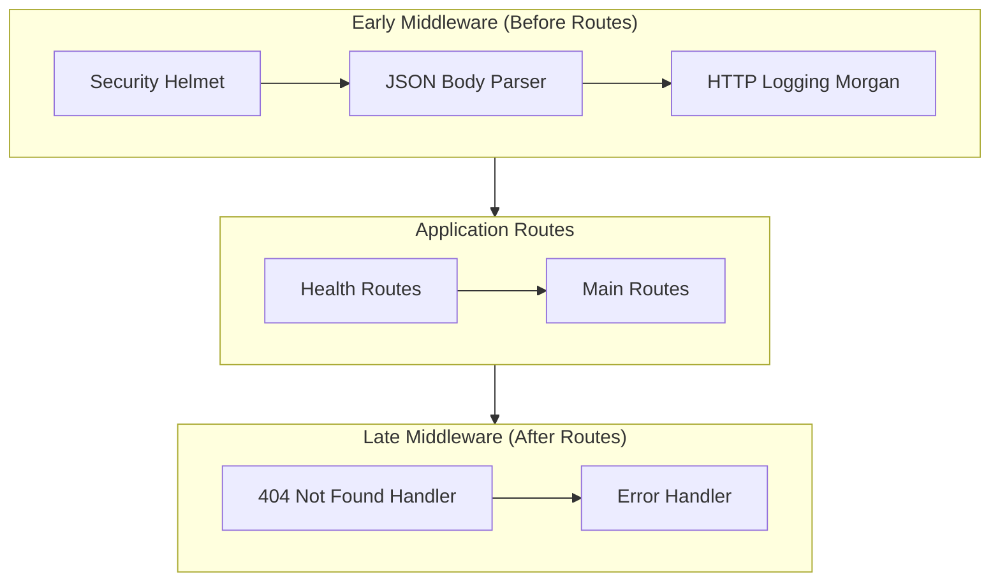
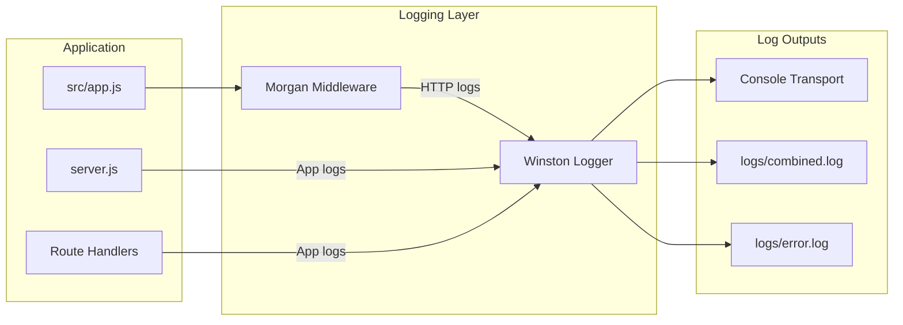

# Technical Specification

# 0. Agent Action Plan

## 0.1 Intent Clarification

### 0.1.1 Core Objective

Based on the provided requirements, the Blitzy platform understands that the objective is to **enhance the existing basic HTTP server with production-ready Express.js features**. The user's instruction:

> "Enhance this basic HTTP server with Express.js framework, add routing, middleware, environment config, logging, and prepare for production deployment with PM2."

This translates to the following enhanced technical objectives:

- **Framework Enhancement**: Expand the existing Express 5.x application with additional middleware capabilities
- **Routing Expansion**: Add structured routing patterns beyond the current two endpoints (`/` and `/evening`)
- **Middleware Integration**: Implement application-level middleware for cross-cutting concerns (logging, security, error handling)
- **Environment Configuration**: Extend the existing `src/config/index.js` module to support multi-environment configuration using dotenv
- **Logging Infrastructure**: Implement structured HTTP request logging and application logging using Morgan and Winston
- **Production Readiness**: Configure PM2 process manager for production deployment with cluster mode, auto-restart, and monitoring

### 0.1.2 Implicit Requirements Detected

The platform has identified the following implicit technical requirements not explicitly stated:

| Implicit Requirement | Rationale | Impact |
|---------------------|-----------|--------|
| Error handling middleware | Production apps require centralized error handling | New middleware file required |
| Security middleware (Helmet) | Best practice for Express production apps | New dependency and configuration |
| JSON body parsing middleware | Standard requirement for API development | Built-in Express middleware configuration |
| Request validation foundation | Prerequisite for robust API endpoints | Middleware infrastructure |
| Health check endpoint | Essential for PM2 monitoring and load balancers | New route handler |
| Graceful shutdown handling | Required for PM2 zero-downtime reloads | Server lifecycle enhancement |
| Logs directory structure | Winston file transports require output directory | New directory and gitignore entries |

### 0.1.3 Task Categorization

| Classification | Value |
|---------------|-------|
| **Primary Task Type** | Feature Enhancement / Configuration |
| **Secondary Aspects** | Infrastructure setup, Dependency integration, Production hardening |
| **Scope Classification** | Cross-cutting change |
| **Complexity Level** | Moderate - Multiple file additions with coordinated integration |

### 0.1.4 Special Instructions and Constraints

The following directives apply to this implementation:

- **Preserve Existing Functionality**: The current endpoints (`GET /`, `GET /evening`) must continue to work identically
- **Maintain Test Suite**: All 41 existing tests must continue to pass
- **Follow Existing Patterns**: New code must follow the established Factory pattern and modular structure
- **12-Factor App Principles**: Configuration must remain externalized via environment variables
- **Backward Compatibility**: The application must start and function without PM2 for development workflows

### 0.1.5 Technical Interpretation

These requirements translate to the following technical implementation strategy:

| Requirement | Technical Action | Component(s) Affected |
|-------------|------------------|----------------------|
| Add routing | Create route modules for new endpoints; implement API versioning pattern | `src/routes/`, `src/app.js` |
| Add middleware | Install and configure Morgan, Winston, Helmet, express.json, error handlers | `src/middleware/`, `src/app.js` |
| Environment config | Extend config module with dotenv; add `.env` template | `src/config/`, `.env.example` |
| Logging | Create Winston logger service; integrate Morgan for HTTP logs | `src/utils/logger.js`, `src/middleware/` |
| PM2 deployment | Create ecosystem config file; add npm scripts for PM2 | `ecosystem.config.js`, `package.json` |

To achieve **comprehensive middleware integration**, we will create a dedicated `src/middleware/` directory containing:
- `logging.middleware.js` - Morgan HTTP logging configured to stream to Winston
- `error.middleware.js` - Centralized error handling with environment-aware responses
- `security.middleware.js` - Helmet security headers configuration
- `index.js` - Middleware barrel export and registration order

To achieve **production-ready logging**, we will create a logger service at `src/utils/logger.js` using Winston with:
- Console transport with colorized output for development
- File transports for production (`logs/combined.log`, `logs/error.log`)
- Environment-aware log levels (`debug` in development, `info` in production)

To achieve **PM2 production deployment**, we will create `ecosystem.config.js` with:
- Cluster mode utilizing all available CPUs
- Environment variable injection
- Log file configuration
- Auto-restart policies


## 0.2 Repository Scope Discovery

### 0.2.1 Comprehensive File Analysis

The repository has been thoroughly analyzed to identify all files relevant to this enhancement. The following file inventory was discovered:

**Current Project Structure:**

```
hello_world/
├── server.js              # HTTP server entry point (31 lines)
├── package.json           # npm manifest with scripts
├── package-lock.json      # Dependency lockfile
├── jest.config.js         # Jest test configuration
├── README.md              # Project documentation
├── .gitignore             # Git ignore patterns
├── src/
│   ├── app.js             # Express application factory (17 lines)
│   ├── config/
│   │   └── index.js       # Environment configuration (15 lines)
│   └── routes/
│       ├── index.js       # Route aggregator barrel (8 lines)
│       └── main.routes.js # Route handlers (17 lines)
└── tests/
    ├── unit/
    │   └── config.test.js
    ├── integration/
    │   └── endpoints.test.js
    └── lifecycle/
        ├── server.lifecycle.test.js
        └── app.test.js
```

**Files Requiring Modification:**

| File Path | Current State | Modification Scope |
|-----------|--------------|-------------------|
| `server.js` | Basic HTTP binding | Add graceful shutdown handling |
| `src/app.js` | Minimal middleware | Add middleware registration chain |
| `src/config/index.js` | Basic env vars | Extend with dotenv and new variables |
| `package.json` | Basic scripts | Add PM2 scripts and new dependencies |
| `.gitignore` | Standard patterns | Add logs/ and .env exclusions |
| `README.md` | Basic documentation | Update with new features and usage |

**New Files to Create:**

| File Path | Purpose |
|-----------|---------|
| `ecosystem.config.js` | PM2 process manager configuration |
| `.env.example` | Environment variable template |
| `src/middleware/index.js` | Middleware barrel export |
| `src/middleware/logging.middleware.js` | Morgan HTTP logging setup |
| `src/middleware/error.middleware.js` | Centralized error handling |
| `src/middleware/security.middleware.js` | Helmet security configuration |
| `src/utils/logger.js` | Winston logger service |
| `src/routes/health.routes.js` | Health check endpoint |
| `logs/.gitkeep` | Ensure logs directory exists |

### 0.2.2 Web Search Research Conducted

Best practices research was conducted for:

- **Express.js 5 middleware best practices (2025)**: <cite index="1-2">Starting with Express 5, middleware functions that return a Promise will call next(value) when they reject or throw an error.</cite> <cite index="4-9,4-10">Optimizing the order of middleware functions in Express.js not only enhances performance but also improves the readability and maintainability of your application code. By adhering to best practices—placing lightweight middleware first, grouping related middleware, deferring heavy middleware, using conditional loading, leveraging route-specific middleware, and properly positioning error-handling middleware—you can minimize processing overhead and ensure quicker response times.</cite>

- **Express.js project structure**: <cite index="9-8">A commonly used Express.js project structure includes: src/config for configuration files, src/controllers for business logic, src/routes for API route definitions, src/middlewares for custom middleware, src/utils for helper functions, app.js for Express app setup, and server.js for server initialization.</cite>

- **PM2 production deployment**: <cite index="14-5,14-6">PM2 provides automatic crash recovery, startup script generation, and process monitoring to keep applications reliably online. PM2's cluster mode (pm2 start app.js -i max) runs multiple instances across all available cores and load-balances traffic between them, dramatically improving throughput.</cite> <cite index="14-10,14-11">The ecosystem.config.js file replaces unwieldy command-line flags with a clean JavaScript configuration. It manages multiple apps, environment variables, cluster settings, and deployment environments in one maintainable location.</cite>

- **Winston and Morgan logging**: <cite index="21-15,21-16,21-17">Morgan is an HTTP request logger middleware for Express that automatically logs the details of incoming requests to the server (such as the remote IP Address, request method, HTTP version, response status, user agent, etc.), and generate the logs in the specified format. The main advantage of using Morgan is that it saves you the trouble of writing a custom middleware for this purpose.</cite> <cite index="23-2">Many production applications actually combine multiple logging frameworks—for instance, using Morgan for HTTP request logging alongside Winston or Pino for application-level logging.</cite>

- **dotenv configuration management**: <cite index="31-4,31-6">Load configuration from a .env file to keep sensitive keys safe, work with multiple environments, and simplify project setup without exposing credentials in your code. npm dotenv solves this by loading environment variables from .env file, keeping sensitive data separate from your application code.</cite>

### 0.2.3 Existing Infrastructure Assessment

| Aspect | Current State | Enhancement Plan |
|--------|--------------|------------------|
| **Project Structure** | Well-organized with `src/` separation | Extend with `middleware/` and `utils/` directories |
| **Patterns & Conventions** | Factory pattern in `app.js`; barrel exports in routes | Maintain patterns in new modules |
| **Build Configuration** | No build step required; direct Node.js execution | No changes needed |
| **Testing Infrastructure** | Jest with 100% coverage; Supertest for HTTP tests | Add tests for new middleware and routes |
| **Documentation System** | README.md with basic usage | Expand with new feature documentation |
| **Dependency Management** | package-lock.json v3 format | Add new dependencies via npm |

### 0.2.4 Affected File Discovery

Files that import or depend on modified components:

| Modified Component | Dependent Files | Required Updates |
|-------------------|-----------------|------------------|
| `src/app.js` | `server.js`, all integration tests | None - exports unchanged |
| `src/config/index.js` | `server.js`, config.test.js | Update tests for new variables |
| `package.json` | CI/CD processes, npm scripts | Update documentation |
| `server.js` | Entry point for all execution | Ensure backward compatibility |

### 0.2.5 File Pattern Mapping

The following file patterns are relevant to this task:

| Pattern | Files Matched | Purpose |
|---------|--------------|---------|
| `src/**/*.js` | 4 files | Application source code |
| `src/middleware/**/*.js` | 0 → 4 files | New middleware modules |
| `src/utils/**/*.js` | 0 → 1 file | New utility modules |
| `src/routes/**/*.js` | 2 → 3 files | Route handlers |
| `tests/**/*.test.js` | 4 files | Test suites |
| `*.config.js` | 1 → 2 files | Configuration files |
| `.env*` | 0 → 1 file | Environment template |


## 0.3 File Transformation Mapping

### 0.3.1 File-by-File Execution Plan

The following table provides a comprehensive mapping of all files to be created, updated, or deleted:

| Target File | Transformation | Source/Reference | Purpose/Changes |
|-------------|----------------|------------------|-----------------|
| `ecosystem.config.js` | CREATE | PM2 documentation | PM2 process manager configuration with cluster mode, environment variables, and restart policies |
| `.env.example` | CREATE | `src/config/index.js` | Environment variable template documenting all required variables |
| `src/middleware/index.js` | CREATE | Express best practices | Middleware barrel export with ordered registration |
| `src/middleware/logging.middleware.js` | CREATE | Morgan/Winston docs | Morgan HTTP logging middleware with Winston integration |
| `src/middleware/error.middleware.js` | CREATE | Express error handling patterns | Centralized 404 and error handlers with environment-aware responses |
| `src/middleware/security.middleware.js` | CREATE | Helmet documentation | Security headers configuration using Helmet |
| `src/utils/logger.js` | CREATE | Winston documentation | Winston logger service with console and file transports |
| `src/routes/health.routes.js` | CREATE | `src/routes/main.routes.js` | Health check endpoint for monitoring and load balancers |
| `logs/.gitkeep` | CREATE | N/A | Placeholder to ensure logs directory exists in git |
| `src/app.js` | UPDATE | Current implementation | Add middleware imports and registration chain |
| `src/config/index.js` | UPDATE | Current implementation | Add dotenv loading and new configuration variables |
| `src/routes/index.js` | UPDATE | Current implementation | Add health routes export |
| `server.js` | UPDATE | Current implementation | Add graceful shutdown handling for PM2 |
| `package.json` | UPDATE | Current implementation | Add new dependencies and PM2 scripts |
| `.gitignore` | UPDATE | Current implementation | Add logs/, .env, and coverage exclusions |
| `README.md` | UPDATE | Current implementation | Document new features, middleware, and PM2 usage |
| `tests/unit/middleware.test.js` | CREATE | `tests/unit/config.test.js` | Unit tests for middleware modules |
| `tests/integration/health.test.js` | CREATE | `tests/integration/endpoints.test.js` | Integration tests for health endpoint |

### 0.3.2 New Files Detail

**`ecosystem.config.js`** - PM2 Process Manager Configuration
- Content type: Configuration
- Key sections: apps array with name, script, instances, exec_mode, env configurations
- Based on: PM2 ecosystem file best practices

**`src/middleware/logging.middleware.js`** - HTTP Request Logging
- Content type: Middleware
- Key exports: `morganMiddleware` configured with 'combined' format
- Based on: Morgan + Winston integration pattern

**`src/middleware/error.middleware.js`** - Error Handling
- Content type: Middleware
- Key exports: `notFoundHandler`, `errorHandler`
- Based on: Express 5 error handling conventions

**`src/middleware/security.middleware.js`** - Security Headers
- Content type: Middleware
- Key exports: `securityMiddleware` (Helmet configuration)
- Based on: Helmet default configuration

**`src/utils/logger.js`** - Application Logger
- Content type: Utility service
- Key exports: Default Winston logger instance
- Based on: Winston with Console and File transports

**`src/routes/health.routes.js`** - Health Check Endpoint
- Content type: Route module
- Key routes: `GET /health` returning status, timestamp, uptime
- Based on: Existing route handler patterns

### 0.3.3 Files to Modify Detail

**`src/app.js`** - Express Application Factory
- Sections to update: Imports section, middleware registration block
- New content to add:
  - Import statements for new middleware modules
  - `app.use(express.json())` for JSON body parsing
  - Security middleware registration
  - Logging middleware registration
  - Health route registration
  - Error middleware registration (must be last)
- Refactoring needed: None - additive changes only

**`src/config/index.js`** - Environment Configuration
- Sections to update: Top of file, exports object
- New content to add:
  - `require('dotenv').config()` at the very top
  - New exported variables: `logLevel`, `logFormat`
- Content to remove: None

**`server.js`** - HTTP Server Entry Point
- Sections to update: After server.listen callback
- New content to add:
  - Graceful shutdown handler for SIGTERM and SIGINT signals
  - Server close logic with proper cleanup

**`package.json`** - npm Manifest
- Sections to update: dependencies, devDependencies, scripts
- New content to add:
  - Dependencies: `dotenv`, `morgan`, `winston`, `helmet`
  - Scripts: `start:pm2`, `stop:pm2`, `restart:pm2`, `logs:pm2`

**`.gitignore`** - Git Ignore Patterns
- New content to add:
  - `logs/` directory
  - `.env` file (but not `.env.example`)
  - Additional coverage patterns

### 0.3.4 Configuration and Documentation Updates

**Configuration Changes:**

| Config File | Settings to Update | Impact |
|-------------|-------------------|--------|
| `package.json` | Add 4 new dependencies | Runtime and dev dependency tree |
| `package.json` | Add PM2 npm scripts | New CLI commands available |
| `ecosystem.config.js` | New file with PM2 settings | Production deployment capability |
| `.env.example` | Document all environment variables | Developer onboarding |

**Documentation Updates:**

| Document | Sections to Add/Update |
|----------|----------------------|
| `README.md` | Prerequisites (Node.js version), Installation (npm install), Configuration (environment variables), Running with PM2, Middleware documentation, API endpoints (health check) |

### 0.3.5 Cross-File Dependencies

| Source Change | Dependent Updates Required |
|--------------|---------------------------|
| New middleware modules | `src/app.js` must import and register |
| New logger utility | Middleware modules must import logger |
| New health routes | `src/routes/index.js` must export |
| dotenv in config | Must be imported before any config access |
| New dependencies | `package-lock.json` auto-updates |
| New environment variables | `.env.example` must document |
| logs/ directory | `.gitignore` must exclude |

### 0.3.6 Test File Mapping

| New/Modified File | Required Test File | Test Type |
|-------------------|-------------------|-----------|
| `src/middleware/logging.middleware.js` | `tests/unit/middleware.test.js` | Unit |
| `src/middleware/error.middleware.js` | `tests/unit/middleware.test.js` | Unit |
| `src/utils/logger.js` | `tests/unit/logger.test.js` | Unit |
| `src/routes/health.routes.js` | `tests/integration/health.test.js` | Integration |
| `server.js` graceful shutdown | `tests/lifecycle/server.lifecycle.test.js` | Lifecycle |


## 0.4 Dependency Inventory

### 0.4.1 Key Private and Public Packages

The following packages are required for this enhancement:

| Registry | Package Name | Version | Purpose |
|----------|--------------|---------|---------|
| npm | express | ^5.1.0 | HTTP server framework (existing) |
| npm | dotenv | ^16.4.7 | Environment variable loading from .env files |
| npm | morgan | ^1.10.0 | HTTP request logging middleware |
| npm | winston | ^3.17.0 | Application logging with multiple transports |
| npm | helmet | ^8.0.0 | Security headers middleware |
| npm | jest | ^30.2.0 | Testing framework (existing) |
| npm | supertest | ^7.1.4 | HTTP testing library (existing) |
| npm (global) | pm2 | ^6.0.0 | Production process manager |

### 0.4.2 New Dependencies to Add

**Runtime Dependencies:**

| Package | Version | Rationale |
|---------|---------|-----------|
| `dotenv` | ^16.4.7 | Industry standard for loading environment variables; zero-dependency module following 12-factor app principles |
| `morgan` | ^1.10.0 | Most popular HTTP request logger for Express; seamless integration with Winston streams |
| `winston` | ^3.17.0 | Most comprehensive Node.js logging library; supports multiple transports, log levels, and formatters |
| `helmet` | ^8.0.0 | Security middleware wrapping 15 smaller middlewares; recommended in Express.js security best practices |

**Global/DevOps Dependencies:**

| Package | Version | Rationale |
|---------|---------|-----------|
| `pm2` | ^6.0.0 | Production process manager with clustering, monitoring, and zero-downtime reloads; install globally or via npx |

### 0.4.3 Dependency Version Selection Rationale

| Package | Selected Version | Rationale |
|---------|-----------------|-----------|
| `dotenv` | ^16.4.7 | Latest stable release with ESM support; compatible with Node.js 20.x |
| `morgan` | ^1.10.0 | Latest stable release; well-maintained with Express 5 compatibility |
| `winston` | ^3.17.0 | Latest v3 stable release; includes security patches and performance improvements |
| `helmet` | ^8.0.0 | Latest major version with updated security defaults; Express 5 compatible |
| `pm2` | ^6.0.0 | Latest major version with improved TypeScript support and Node.js 20.x compatibility |

### 0.4.4 Import/Reference Updates

Files requiring import updates:

| File | Old Imports | New Imports |
|------|-------------|-------------|
| `src/config/index.js` | None | `require('dotenv').config()` at top |
| `src/app.js` | `express`, `routes` | Add `middleware` import |
| `src/middleware/logging.middleware.js` | N/A (new file) | `morgan`, `logger` |
| `src/middleware/error.middleware.js` | N/A (new file) | `logger` |
| `src/middleware/security.middleware.js` | N/A (new file) | `helmet` |
| `src/utils/logger.js` | N/A (new file) | `winston`, `config` |

### 0.4.5 package.json Updates

**Dependencies Section Changes:**

```json
"dependencies": {
  "express": "^5.1.0",
  "dotenv": "^16.4.7",
  "morgan": "^1.10.0",
  "winston": "^3.17.0",
  "helmet": "^8.0.0"
}
```

**Scripts Section Additions:**

```json
"scripts": {
  "start": "node server.js",
  "start:pm2": "pm2 start ecosystem.config.js",
  "stop:pm2": "pm2 stop ecosystem.config.js",
  "restart:pm2": "pm2 restart ecosystem.config.js",
  "reload:pm2": "pm2 reload ecosystem.config.js",
  "logs:pm2": "pm2 logs",
  "monit:pm2": "pm2 monit"
}
```

### 0.4.6 Installation Commands

**Development Environment:**

```bash
# Install new runtime dependencies

npm install dotenv@^16.4.7 morgan@^1.10.0 winston@^3.17.0 helmet@^8.0.0

#### Install PM2 globally (or use npx)

npm install -g pm2@^6.0.0
```

**Production Environment:**

```bash
# Install all dependencies (production)

npm ci --production

#### PM2 should be pre-installed on production servers

pm2 startup  # Generate startup script
pm2 save     # Save process list
```

### 0.4.7 Dependency Size Impact

| Package | Approximate Size | Impact Assessment |
|---------|-----------------|-------------------|
| `dotenv` | ~30 KB | Minimal - zero dependencies |
| `morgan` | ~50 KB | Minimal - 4 dependencies |
| `winston` | ~500 KB | Moderate - includes multiple formatters |
| `helmet` | ~100 KB | Minimal - wraps security middlewares |
| **Total Addition** | ~680 KB | Acceptable for production features |

### 0.4.8 Compatibility Matrix

| Package | Node.js 18.x | Node.js 20.x | Express 5.x |
|---------|--------------|--------------|-------------|
| `dotenv ^16.4.7` | ✅ | ✅ | ✅ |
| `morgan ^1.10.0` | ✅ | ✅ | ✅ |
| `winston ^3.17.0` | ✅ | ✅ | ✅ |
| `helmet ^8.0.0` | ✅ | ✅ | ✅ |
| `pm2 ^6.0.0` | ✅ | ✅ | N/A |


## 0.5 Implementation Design

### 0.5.1 Technical Approach

**Primary Objectives with Implementation Approach:**

| Objective | Implementation Strategy |
|-----------|------------------------|
| Achieve **middleware integration** | Create modular middleware in `src/middleware/` with barrel export; register in correct order in `src/app.js` |
| Achieve **structured logging** | Create Winston logger service in `src/utils/logger.js`; configure Morgan to stream to Winston |
| Achieve **environment configuration** | Extend `src/config/index.js` with dotenv; create `.env.example` template |
| Achieve **production deployment** | Create `ecosystem.config.js` with PM2 cluster configuration |
| Achieve **graceful shutdown** | Add SIGTERM/SIGINT handlers in `server.js` for PM2 zero-downtime reloads |

**Logical Implementation Flow:**

1. **First**, establish the logging foundation by creating `src/utils/logger.js` with Winston configuration, enabling all subsequent modules to import and use consistent logging
2. **Next**, create individual middleware modules in `src/middleware/` that depend on the logger service
3. **Then**, update `src/config/index.js` to load dotenv and export new configuration variables needed by logger and middleware
4. **Subsequently**, integrate all middleware into `src/app.js` following the correct registration order
5. **Afterward**, add the health check route for PM2 and load balancer monitoring
6. **Finally**, create the PM2 ecosystem configuration and update server.js for graceful shutdown

### 0.5.2 Component Impact Analysis

**Direct Modifications Required:**

| Component | Modification | Technical Details |
|-----------|-------------|-------------------|
| `src/app.js` | Add middleware chain | Import middleware barrel; register in order: security → JSON parsing → logging → routes → error handlers |
| `src/config/index.js` | Extend configuration | Add dotenv require at top; export `logLevel`, `logFormat` |
| `server.js` | Add shutdown handlers | Register SIGTERM/SIGINT listeners; implement graceful server.close() |
| `package.json` | Add dependencies/scripts | 4 new runtime dependencies; 6 new PM2-related scripts |

**Indirect Impacts and Dependencies:**

| Component | Impact | Reason |
|-----------|--------|--------|
| All integration tests | Must continue passing | Middleware should be transparent to existing endpoints |
| Coverage thresholds | New code needs tests | Maintain ≥80% coverage requirement |
| `package-lock.json` | Auto-regenerated | New dependencies resolve and lock |
| Documentation | Requires updates | New features need usage documentation |

**New Components Introduction:**

| Component | Type | Responsibility |
|-----------|------|----------------|
| `src/utils/logger.js` | Utility Service | Centralized Winston logger instance with environment-aware configuration |
| `src/middleware/logging.middleware.js` | Middleware | Morgan HTTP request logging piped to Winston |
| `src/middleware/error.middleware.js` | Middleware | 404 handler and centralized error handler |
| `src/middleware/security.middleware.js` | Middleware | Helmet security headers configuration |
| `src/routes/health.routes.js` | Route Module | Health check endpoint for monitoring |
| `ecosystem.config.js` | Configuration | PM2 process manager settings |

### 0.5.3 Middleware Registration Order

The middleware must be registered in a specific order for correct behavior:


```mermaid
flowchart TD
    subgraph Early["Early Middleware (Before Routes)"]
        A[Security Helmet] --> B[JSON Body Parser]
        B --> C[HTTP Logging Morgan]
    end
    
    subgraph Routes["Application Routes"]
        D[Health Routes] --> E[Main Routes]
    end
    
    subgraph Late["Late Middleware (After Routes)"]
        F[404 Not Found Handler] --> G[Error Handler]
    end
    
    Early --> Routes
    Routes --> Late
```

**Order Rationale:**
1. **Security headers first**: Must set headers before any response
2. **Body parsing**: Required for JSON request processing
3. **HTTP logging**: Log all incoming requests including those that fail
4. **Routes**: Handle application endpoints
5. **404 handler**: Catch unmatched routes
6. **Error handler**: Must be last to catch all errors

### 0.5.4 Logger Architecture


```mermaid
flowchart LR
    subgraph Application
        App[src/app.js]
        Server[server.js]
        Routes[Route Handlers]
    end
    
    subgraph LoggingLayer["Logging Layer"]
        Morgan[Morgan Middleware]
        Logger[Winston Logger]
    end
    
    subgraph Outputs["Log Outputs"]
        Console[Console Transport]
        CombinedLog[logs/combined.log]
        ErrorLog[logs/error.log]
    end
    
    App --> Morgan
    Morgan -->|HTTP logs| Logger
    Server -->|App logs| Logger
    Routes -->|App logs| Logger
    Logger --> Console
    Logger --> CombinedLog
    Logger --> ErrorLog
```

### 0.5.5 PM2 Deployment Architecture

```mermaid
flowchart TD
    subgraph PM2["PM2 Process Manager"]
        Master[PM2 Master]
        Worker1[Worker 1<br/>server.js]
        Worker2[Worker 2<br/>server.js]
        WorkerN[Worker N<br/>server.js]
    end
    
    subgraph Config["Configuration"]
        Ecosystem[ecosystem.config.js]
        EnvVars[Environment Variables]
    end
    
    subgraph Monitoring["Monitoring"]
        HealthCheck[/health endpoint]
        PM2Logs[PM2 Logs]
        PM2Monit[PM2 Monit]
    end
    
    Ecosystem --> Master
    EnvVars --> Master
    Master -->|Cluster Mode| Worker1
    Master -->|Cluster Mode| Worker2
    Master -->|Cluster Mode| WorkerN
    Worker1 --> HealthCheck
    Worker2 --> HealthCheck
    WorkerN --> HealthCheck
    Master --> PM2Logs
    Master --> PM2Monit
```

### 0.5.6 Critical Implementation Details

**Design Patterns to Employ:**

| Pattern | Application | Rationale |
|---------|-------------|-----------|
| Factory Pattern | `src/app.js` (existing) | Maintains testability; middleware registered within factory |
| Singleton Pattern | `src/utils/logger.js` | Single logger instance shared across application |
| Barrel Export | `src/middleware/index.js` | Clean imports; centralized middleware registration |
| Middleware Chain | Express middleware | Standard Express pattern for request processing |

**Integration Strategies:**

| Integration Point | Strategy |
|-------------------|----------|
| Morgan → Winston | Use Winston stream interface as Morgan's stream option |
| Config → Logger | Logger imports config for log level and environment |
| Middleware → App | Barrel export provides ordered middleware array |
| Health → Routes | Health routes exported alongside main routes |

**Error Handling Considerations:**

| Scenario | Handling Strategy |
|----------|-------------------|
| Unhandled route | 404 handler returns JSON `{ error: 'Not Found' }` |
| Synchronous error | Error handler catches via Express |
| Async error (Express 5) | Automatic promise rejection forwarding to error handler |
| Production errors | No stack traces exposed; generic message returned |
| Development errors | Full stack trace included for debugging |

**Performance Considerations:**

| Aspect | Implementation |
|--------|---------------|
| Middleware order | Lightweight security headers before expensive logging |
| Log format | Structured JSON in production for efficient parsing |
| File logging | Asynchronous writes via Winston; separate error log |
| PM2 cluster mode | Utilize all CPU cores for horizontal scaling |


## 0.6 Scope Boundaries

### 0.6.1 Exhaustively In Scope

**Source Code Changes:**

| Pattern | Files Affected | Description |
|---------|----------------|-------------|
| `src/app.js` | 1 file | Express application factory - middleware registration |
| `src/config/index.js` | 1 file | Environment configuration - dotenv integration |
| `src/middleware/**/*.js` | 4 new files | New middleware modules (index, logging, error, security) |
| `src/utils/**/*.js` | 1 new file | Logger utility service |
| `src/routes/**/*.js` | 2 files | Route aggregator update + new health routes |
| `server.js` | 1 file | HTTP server - graceful shutdown |

**Configuration Updates:**

| Pattern | Files Affected | Description |
|---------|----------------|-------------|
| `package.json` | 1 file | Dependencies, scripts |
| `ecosystem.config.js` | 1 new file | PM2 configuration |
| `.env.example` | 1 new file | Environment template |
| `jest.config.js` | 0 files | No changes required |

**Documentation Updates:**

| Pattern | Files Affected | Description |
|---------|----------------|-------------|
| `README.md` | 1 file | Feature documentation, usage guide |
| `.gitignore` | 1 file | Add logs/, .env patterns |

**Test Updates:**

| Pattern | Files Affected | Description |
|---------|----------------|-------------|
| `tests/unit/middleware.test.js` | 1 new file | Unit tests for middleware modules |
| `tests/unit/logger.test.js` | 1 new file | Unit tests for logger utility |
| `tests/integration/health.test.js` | 1 new file | Integration tests for health endpoint |
| `tests/lifecycle/server.lifecycle.test.js` | 1 file | Update for graceful shutdown tests |

**Directory Structure Changes:**

| Path | Action | Description |
|------|--------|-------------|
| `src/middleware/` | CREATE | New middleware directory |
| `src/utils/` | CREATE | New utilities directory |
| `logs/` | CREATE | Log output directory |

### 0.6.2 Explicitly Out of Scope

The following items are **NOT** part of this implementation:

| Category | Exclusion | Rationale |
|----------|-----------|-----------|
| **Database Integration** | No database connections or ORM | Not requested; out of scope for HTTP server enhancement |
| **Authentication/Authorization** | No JWT, sessions, or auth middleware | Not requested; would be separate feature |
| **API Versioning** | No `/api/v1/` prefix restructuring | Not requested; current routes sufficient |
| **TypeScript Migration** | No TypeScript conversion | Project uses JavaScript; maintain consistency |
| **Docker Containerization** | No Dockerfile or docker-compose | PM2 deployment specified instead |
| **CI/CD Pipeline** | No GitHub Actions or GitLab CI | Existing `test:ci` script sufficient |
| **Rate Limiting** | No `express-rate-limit` integration | Not requested; can be future enhancement |
| **Caching Layer** | No Redis or memory caching | Not requested; out of scope |
| **API Documentation** | No Swagger/OpenAPI setup | Not requested; can be future enhancement |
| **CORS Configuration** | No CORS middleware | Not requested; localhost-only server |
| **Compression** | No response compression middleware | Not requested; PM2/nginx can handle |
| **Request Validation** | No schema validation libraries | Not requested; can be future enhancement |
| **WebSocket Support** | No Socket.io or WebSocket server | Not requested; HTTP only |
| **Load Testing** | No performance benchmarking | Not requested; separate concern |
| **SSL/TLS Configuration** | No HTTPS setup | Typically handled by reverse proxy |

### 0.6.3 Boundary Conditions

**What Changes:**

| Before | After |
|--------|-------|
| Basic Express app with 2 routes | Enhanced app with middleware stack, logging, and health check |
| Console-only output | Structured logging to console and files |
| Manual `node server.js` start | PM2 cluster deployment option |
| Inline configuration | Externalized via .env files |
| No graceful shutdown | SIGTERM/SIGINT handling for zero-downtime reloads |

**What Stays the Same:**

| Aspect | Preserved Behavior |
|--------|-------------------|
| Existing endpoints | `GET /` and `GET /evening` work identically |
| Test suite | All 41 tests continue to pass |
| Entry point | `npm start` / `node server.js` still works |
| Factory pattern | `src/app.js` exports remain unchanged |
| Environment variables | Existing `HOST`, `PORT`, `NODE_ENV` still work |
| Development workflow | No changes to local development process |

### 0.6.4 Feature Flag Considerations

No feature flags are required for this implementation. All new features are:
- Additive (don't break existing functionality)
- Always-on (middleware always active)
- Environment-aware (behave differently based on `NODE_ENV`)

### 0.6.5 Rollback Strategy

If issues arise, the following rollback approach applies:

| Scenario | Rollback Action |
|----------|-----------------|
| Dependency issues | Remove new dependencies from `package.json`; run `npm install` |
| Middleware breaking tests | Remove middleware imports from `src/app.js` |
| PM2 issues | Continue using `npm start` without PM2 |
| Logger issues | Comment out logging middleware; app continues without logs |

### 0.6.6 Scope Summary

| Metric | Count |
|--------|-------|
| Files to create | 11 |
| Files to update | 7 |
| Files to delete | 0 |
| New dependencies | 4 (+ 1 global) |
| New npm scripts | 6 |
| New directories | 3 |
| New routes | 1 (`/health`) |
| New middleware | 3 (security, logging, error) |


## 0.7 Execution Parameters

### 0.7.1 Special Execution Instructions

**Process-Specific Requirements:**

| Requirement | Description |
|-------------|-------------|
| **Backward Compatibility** | Application must start without PM2; `npm start` must continue working |
| **Test Compatibility** | Logging middleware must not pollute test output; use conditional Morgan skip |
| **Environment Awareness** | All new code must respect `NODE_ENV` for behavior switching |
| **No Build Step** | Continue using native JavaScript; no transpilation required |

**Tools and Platforms:**

| Tool | Usage Context | Notes |
|------|---------------|-------|
| **Node.js 20.x** | Runtime environment | Required for Express 5 and dependency compatibility |
| **npm** | Package management | Use `npm ci` in production for reproducible installs |
| **PM2** | Production deployment | Optional; development can use `node server.js` |
| **Jest** | Testing | Existing test framework; no changes to test runner |

### 0.7.2 Quality and Style Requirements

| Aspect | Requirement |
|--------|-------------|
| **Code Style** | Follow existing patterns in repository (CommonJS, 'use strict', JSDoc) |
| **File Naming** | Use `*.middleware.js`, `*.routes.js` patterns for new modules |
| **Export Style** | Use CommonJS `module.exports` to match existing codebase |
| **Documentation** | JSDoc comments for all exported functions |
| **Error Messages** | Clear, actionable messages; no stack traces in production |

### 0.7.3 Constraints and Boundaries

**Technical Constraints:**

| Constraint | Specification |
|------------|---------------|
| **Node.js Version** | ≥18.x required; 20.x recommended |
| **Express Version** | ^5.1.0 (existing constraint) |
| **JavaScript Syntax** | ES6+ features supported by Node.js 20.x |
| **Module System** | CommonJS (require/module.exports) |

**Process Constraints:**

| Constraint | Description |
|------------|-------------|
| **No Breaking Changes** | Existing API contracts must be preserved |
| **Test Coverage** | Maintain ≥80% line coverage after changes |
| **Dependencies** | Only production-grade, well-maintained packages |
| **Security** | No secrets in source code; all via environment variables |

### 0.7.4 Environment Variable Requirements

The following environment variables will be supported after implementation:

| Variable | Required | Default | Description |
|----------|----------|---------|-------------|
| `HOST` | No | `localhost` | Server bind address |
| `PORT` | No | `3000` | Server port number |
| `NODE_ENV` | No | `development` | Environment mode |
| `LOG_LEVEL` | No | `info` (prod) / `debug` (dev) | Winston logging level |
| `LOG_FORMAT` | No | `combined` | Morgan log format |

### 0.7.5 Deployment Configurations

**Development Deployment:**

```bash
# Copy environment template

cp .env.example .env

#### Install dependencies

npm install

#### Start development server

npm start
# or with file watching (requires nodemon)

#### npm run dev

```

**Production Deployment (PM2):**

```bash
# Install dependencies (production only)

npm ci --production

#### Set environment variables (or use .env)

export NODE_ENV=production
export PORT=3000

#### Start with PM2

npm run start:pm2
# or directly

pm2 start ecosystem.config.js

#### Monitor

pm2 monit

#### View logs

npm run logs:pm2

#### Zero-downtime reload

npm run reload:pm2

#### Stop

npm run stop:pm2
```

### 0.7.6 PM2 Ecosystem Configuration

The `ecosystem.config.js` will be configured with:

| Setting | Value | Rationale |
|---------|-------|-----------|
| `name` | `hello-world` | Application identifier in PM2 |
| `script` | `server.js` | Entry point file |
| `instances` | `max` | Use all available CPU cores |
| `exec_mode` | `cluster` | Enable cluster mode for load balancing |
| `watch` | `false` | Disable file watching in production |
| `max_memory_restart` | `500M` | Auto-restart if memory exceeds threshold |
| `env` | `{ NODE_ENV: 'development' }` | Default environment |
| `env_production` | `{ NODE_ENV: 'production' }` | Production environment |
| `log_date_format` | `YYYY-MM-DD HH:mm:ss Z` | Timestamp format for PM2 logs |
| `error_file` | `logs/pm2-error.log` | PM2 error log location |
| `out_file` | `logs/pm2-out.log` | PM2 output log location |
| `merge_logs` | `true` | Merge logs from all cluster instances |

### 0.7.7 Testing Execution

**Running Tests:**

```bash
# Run all tests

npm test

#### Run with coverage

npm run test:coverage

#### Run in CI mode

npm run test:ci

#### Run in watch mode (development)

npm run test:watch
```

**Test Environment Considerations:**

| Consideration | Implementation |
|---------------|----------------|
| Morgan in tests | Skip logging when `NODE_ENV=test` to avoid polluting test output |
| Logger in tests | Mock or use silent transport in test environment |
| File logging | Disable file transports during tests |
| Integration tests | Continue using Supertest with app export |


## 0.8 Rules

### 0.8.1 Derived Rules from Existing Codebase

The following rules are derived from patterns observed in the existing codebase and must be followed:

| Rule | Source | Application |
|------|--------|-------------|
| **Use 'use strict' directive** | All existing `.js` files | Include at top of all new JavaScript files |
| **CommonJS module system** | Existing `require`/`module.exports` usage | No ES6 `import`/`export` statements |
| **JSDoc documentation** | Existing route and test files | Document all exported functions with JSDoc |
| **Factory pattern for app** | `src/app.js` | Do not instantiate app at module level |
| **Barrel exports for routes** | `src/routes/index.js` | Create barrel export for middleware |
| **Environment via process.env** | `src/config/index.js` | All configuration from environment variables |
| **Separation of concerns** | `server.js` vs `src/app.js` | Server binding separate from app definition |

### 0.8.2 Middleware Implementation Rules

| Rule | Description |
|------|-------------|
| **Order matters** | Security → Parsing → Logging → Routes → Errors |
| **Error handlers last** | Error middleware must have 4 parameters `(err, req, res, next)` |
| **Export functions not instances** | Middleware factories should be exported, configured in app.js |
| **No side effects on require** | Middleware modules should not execute code on import |

### 0.8.3 Logging Rules

| Rule | Description |
|------|-------------|
| **Environment-aware levels** | Debug in development, info in production |
| **No console.log** | Use Winston logger exclusively for application logs |
| **Structured logging** | JSON format in production for parsing |
| **Sensitive data redaction** | Never log passwords, tokens, or PII |

### 0.8.4 Configuration Rules

| Rule | Description |
|------|-------------|
| **dotenv at entry point** | Load dotenv before any config access |
| **Defaults for all variables** | Every environment variable must have a sensible default |
| **No hardcoded secrets** | All sensitive values via environment variables |
| **Document in .env.example** | Every supported variable must be documented |

### 0.8.5 Testing Rules

| Rule | Description |
|------|-------------|
| **Maintain coverage thresholds** | ≥80% lines, ≥75% branches, ≥90% functions |
| **Silent logging in tests** | Suppress Morgan and Winston output during tests |
| **Test new endpoints** | All new routes must have integration tests |
| **Test middleware independently** | Unit tests for error handling logic |

### 0.8.6 PM2 Deployment Rules

| Rule | Description |
|------|-------------|
| **Cluster mode for production** | Use all available CPUs |
| **Graceful shutdown** | Handle SIGTERM for zero-downtime reloads |
| **Log rotation** | Use PM2 log management or external rotation |
| **Health checks** | Expose `/health` endpoint for monitoring |

### 0.8.7 Code Style Rules

| Rule | Description |
|------|-------------|
| **File naming convention** | `*.middleware.js`, `*.routes.js`, `*.test.js` |
| **No trailing semicolons** | Follow existing codebase style |
| **Single quotes for strings** | Follow existing codebase style |
| **2-space indentation** | Follow existing codebase style |


## 0.9 References

### 0.9.1 Repository Files Analyzed

The following files and folders were searched and analyzed to derive conclusions for this Agent Action Plan:

**Root Level Files:**

| File | Path | Analysis Purpose |
|------|------|------------------|
| `package.json` | `/package.json` | Dependencies, scripts, project configuration |
| `package-lock.json` | `/package-lock.json` | Locked dependency versions |
| `server.js` | `/server.js` | Entry point, server lifecycle |
| `jest.config.js` | `/jest.config.js` | Test configuration, coverage thresholds |
| `.gitignore` | `/.gitignore` | Current ignore patterns |
| `README.md` | `/README.md` | Documentation structure |

**Source Files:**

| File | Path | Analysis Purpose |
|------|------|------------------|
| `src/app.js` | `/src/app.js` | Application factory, middleware registration point |
| `src/config/index.js` | `/src/config/index.js` | Configuration pattern, environment variables |
| `src/routes/index.js` | `/src/routes/index.js` | Barrel export pattern |
| `src/routes/main.routes.js` | `/src/routes/main.routes.js` | Route handler patterns |

**Test Files:**

| File | Path | Analysis Purpose |
|------|------|------------------|
| `tests/integration/endpoints.test.js` | `/tests/integration/endpoints.test.js` | Integration test patterns |
| `tests/lifecycle/server.lifecycle.test.js` | `/tests/lifecycle/server.lifecycle.test.js` | Server lifecycle testing |
| `tests/unit/config.test.js` | `/tests/unit/config.test.js` | Unit test patterns |

**Folders Explored:**

| Folder | Path | Contents Analyzed |
|--------|------|-------------------|
| Root | `/` | Project structure overview |
| Source | `/src/` | Application code organization |
| Config | `/src/config/` | Configuration module |
| Routes | `/src/routes/` | Route modules |
| Tests | `/tests/` | Test organization |

### 0.9.2 Technical Specification Sections Referenced

The following sections from the existing Technical Specification were retrieved and analyzed:

| Section | Heading | Purpose |
|---------|---------|---------|
| 3.2 | Express.js 5.x Feature Utilization | Current Express usage patterns |
| 8.3 | Environment Configuration | Existing environment variable handling |
| 8.4 | Deployment Workflow | Current deployment process |
| 8.5 | CI/CD Pipeline Status | Available npm scripts and quality gates |
| 8.2 | Node.js Runtime Requirements | Version requirements and project structure |

### 0.9.3 External Sources Consulted

**Official Documentation:**

| Source | URL | Topics Referenced |
|--------|-----|-------------------|
| Express.js | https://expressjs.com/en/guide/writing-middleware.html | Middleware patterns, Express 5 features |
| PM2 | https://pm2.keymetrics.io/docs/usage/deployment/ | Ecosystem config, cluster mode |
| Winston | https://github.com/winstonjs/winston | Logger configuration, transports |
| Morgan | https://github.com/expressjs/morgan | HTTP logging middleware |
| Helmet | https://helmetjs.github.io/ | Security headers configuration |
| dotenv | https://github.com/motdotla/dotenv | Environment variable loading |

**Best Practices Articles:**

| Source | Topic | Key Insight |
|--------|-------|-------------|
| DEV Community | Express.js project structure | Modular folder organization with MVC pattern |
| Better Stack | Winston and Morgan integration | Stream Morgan output to Winston |
| DigitalOcean | PM2 production setup | Cluster mode, startup scripts, graceful shutdown |
| Medium | Express 5 middleware | Promise-based error handling in Express 5 |

### 0.9.4 Attachments

No attachments were provided with this request.

### 0.9.5 User-Provided URLs

No external URLs were provided with this request.

### 0.9.6 Environment Setup Verification

| Check | Status | Details |
|-------|--------|---------|
| Node.js version | ✅ v20.20.0 | Meets ≥20.x recommendation |
| npm version | ✅ v11.1.0 | Meets ≥10.x recommendation |
| Dependencies installed | ✅ | `npm ci` completed successfully |
| Tests passing | ✅ | 41/41 tests pass |
| Coverage thresholds | ✅ | 100% coverage achieved |

### 0.9.7 Search Queries Executed

| Query | Purpose | Results Used |
|-------|---------|--------------|
| "Express.js 5 middleware best practices 2025" | Middleware patterns | Order, Promise handling |
| "PM2 Node.js production deployment configuration 2025" | PM2 setup | Cluster mode, ecosystem config |
| "Morgan Winston logging Express.js Node.js 2025" | Logging integration | Stream integration pattern |
| "dotenv Node.js configuration best practices 2025" | Environment config | Loading patterns, security |

### 0.9.8 File System Searches

| Search | Tool | Files Found |
|--------|------|-------------|
| `.blitzyignore` | bash find | None (no exclusions) |
| `package.json` | bash find | 1 file at project root |
| Source structure | get_source_folder_contents | 6 source files identified |
| Test structure | get_source_folder_contents | 4 test files identified |


