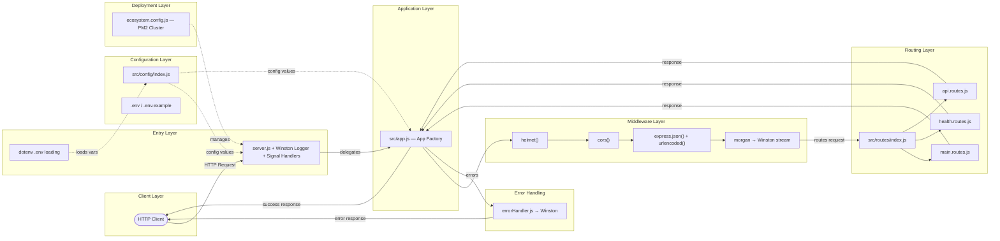

# Technical Specification

# 0. Agent Action Plan

## 0.1 Intent Clarification

### 0.1.1 Core Objective

Based on the provided requirements, the Blitzy platform understands that the objective is to **evolve a minimal "Hello, World" Express.js HTTP server into a production-grade application** by layering in essential middleware, structured logging, robust environment configuration, expanded routing capabilities, and PM2 process management for production deployment readiness.

The user's requirement — *"Enhance this basic HTTP server with Express.js framework, add routing, middleware, environment config, logging, and prepare for production deployment with PM2"* — translates into the following discrete objectives:

- **Middleware Layer Addition:** Introduce an organized middleware pipeline encompassing request body parsing (`express.json()`, `express.urlencoded()`), security hardening (`helmet`), cross-origin resource sharing (`cors`), and HTTP request logging (`morgan`), applied before route handlers in `src/app.js`.
- **Enhanced Routing Architecture:** Expand the existing two-endpoint routing structure (`GET /`, `GET /evening`) with a health-check endpoint (`GET /health`) for production liveness probes and an API route namespace (`/api`) to establish a scalable routing hierarchy.
- **Structured Logging System:** Replace implicit `console.log` calls with a dedicated Winston-based logger offering severity levels, timestamped output, dual transports (console + file), and integration with Morgan for unified HTTP request logging.
- **Environment Configuration Enhancement:** Introduce `dotenv` for `.env` file support, extend `src/config/index.js` with new configuration properties (log level, CORS origin), and add `.env.example` as a development on-boarding template.
- **PM2 Production Deployment Preparation:** Create an `ecosystem.config.js` file enabling cluster-mode deployment, environment-specific configuration, graceful shutdown, and log management through PM2's process manager.

Implicit requirements surfaced through analysis:

- Existing 41 tests (100% coverage) must remain passing; new functionality requires corresponding test coverage.
- The App Factory pattern in `src/app.js` must be preserved — middleware is registered inside the factory, not in `server.js`.
- CommonJS module syntax (`require`/`module.exports`) is the established convention and must be maintained.
- The `.gitignore` must be updated to exclude `.env` files and `logs/` directory.

### 0.1.2 Task Categorization

- **Primary task type:** Mixed (Feature Enhancement + Configuration + Production Readiness)
- **Secondary aspects:** Security hardening (Helmet headers), Observability (logging), Infrastructure tooling (PM2)
- **Scope classification:** Cross-cutting change — impacts the application layer, configuration layer, entry layer, and build/deployment layer simultaneously

### 0.1.3 Special Instructions and Constraints

No explicit user constraints were provided beyond the core enhancement directive. The following implicit constraints are derived from the existing codebase and technical specification:

- **Maintain backward compatibility:** Existing `GET /` and `GET /evening` endpoint behavior must not change (exact response bodies verified by 41 tests).
- **Preserve architecture patterns:** App Factory (`src/app.js`), Barrel exports (`src/routes/index.js`), 12-Factor config (`src/config/index.js`), and separation between `server.js` (binding) and `src/app.js` (logic).
- **100% coverage enforcement:** `jest.config.js` mandates 100% branch, function, line, and statement coverage — all new code paths must be tested.
- **Express 5.x compatibility:** The project uses Express `^5.1.0`, so all middleware must be compatible with Express 5.

### 0.1.4 Technical Interpretation

These requirements translate to the following technical implementation strategy:

- To **add middleware**, we will create `src/middleware/index.js` as a middleware pipeline aggregator and register it in `src/app.js` before route mounting, applying `helmet()`, `cors()`, `express.json()`, `express.urlencoded()`, and Morgan HTTP logging in the correct order.
- To **enhance routing**, we will create `src/routes/health.routes.js` for the `GET /health` endpoint and `src/routes/api.routes.js` for the `/api` namespace, then register both through the existing barrel pattern in `src/routes/index.js`.
- To **implement structured logging**, we will create `src/utils/logger.js` configuring a Winston logger with console and file transports, create `src/middleware/requestLogger.js` integrating Morgan with Winston's stream interface, and replace `console.log` in `server.js` with the Winston logger.
- To **enhance environment configuration**, we will add `dotenv` as a production dependency loaded at the top of `server.js`, extend `src/config/index.js` with `logLevel` and `corsOrigin` properties, create `.env.example` documenting all variables, and update `.gitignore` to exclude `.env` and `logs/`.
- To **prepare PM2 deployment**, we will create `ecosystem.config.js` at the project root with cluster-mode settings, environment-specific blocks, log file paths, and graceful shutdown parameters, and add PM2-related npm scripts to `package.json`.

## 0.2 Repository Scope Discovery

### 0.2.1 Comprehensive File Analysis

A thorough repository exploration was conducted across all layers of the existing project. The complete file inventory of the current codebase is as follows:

**Application Source Files:**

| File Path | Purpose | Impact Assessment |
|-----------|---------|-------------------|
| `server.js` | Entry point — binds Express app to host:port, handles `EADDRINUSE` errors | UPDATE: Add `dotenv` loading, replace `console.log` with Winston logger, add graceful SIGTERM/SIGINT handling for PM2 |
| `src/app.js` | App Factory — creates Express instance, mounts routes | UPDATE: Register middleware pipeline (helmet, cors, body parsers, morgan) before route mounting; add error-handling middleware after routes |
| `src/config/index.js` | 12-Factor config — reads `HOST`, `PORT`, `NODE_ENV` from `process.env` | UPDATE: Extend with `logLevel`, `corsOrigin` properties |
| `src/routes/index.js` | Barrel export — aggregates and re-exports `mainRoutes` | UPDATE: Add exports for `healthRoutes` and `apiRoutes` |
| `src/routes/main.routes.js` | Route handlers — `GET /` and `GET /evening` | REFERENCE: Preserve as-is; use as pattern for new route modules |

**Test Files:**

| File Path | Purpose | Impact Assessment |
|-----------|---------|-------------------|
| `tests/unit/config.test.js` | Unit tests for config module (17 tests) | UPDATE: Add tests for new `logLevel` and `corsOrigin` config properties |
| `tests/unit/routes.test.js` | Unit tests for route handlers (8 tests) | UPDATE: Add tests for health and API route definitions |
| `tests/integration/endpoints.test.js` | Integration tests via Supertest (12 tests) | UPDATE: Add integration tests for `/health`, `/api` endpoints and middleware behavior |
| `tests/lifecycle/server.test.js` | Server lifecycle tests (4 tests) | UPDATE: Add tests for graceful shutdown signal handling and Winston logger usage |

**Configuration and Documentation Files:**

| File Path | Purpose | Impact Assessment |
|-----------|---------|-------------------|
| `package.json` | Project manifest, dependencies, scripts | UPDATE: Add new dependencies, PM2 scripts |
| `jest.config.js` | Test configuration with 100% coverage thresholds | UPDATE: Add `logs/` to `coveragePathIgnorePatterns`; add `src/utils/` to `collectCoverageFrom` |
| `.gitignore` | Git exclusion patterns | UPDATE: Add `.env`, `logs/`, `ecosystem.config.js` patterns |
| `README.md` | Project documentation | UPDATE: Document middleware, logging, environment config, PM2 usage |

### 0.2.2 Web Search Research Conducted

The following research was performed to validate implementation approaches:

- **Express.js middleware best practices:** Confirmed the correct middleware ordering pattern — security headers first, then body parsers, then logging, then routes, then error handlers. Express 5 supports Promise-based middleware with automatic `next(error)` on rejection.
- **PM2 production deployment:** PM2 v6.0.14 is the current stable release, supporting cluster mode, `ecosystem.config.js`, zero-downtime reload, log management, and startup script generation. The `ecosystem.config.js` format supports `env` and `env_production` blocks.
- **Winston + Morgan logging integration:** Winston v3.19.0 is the current version, supporting custom severity levels, multiple transports, and log formatting. Morgan can pipe its HTTP request logs into Winston via the `stream` option, creating a unified logging pipeline.
- **dotenv environment configuration:** dotenv v17.2.4 is the current version. Note that Node.js v20.6.0+ offers a native `--env-file` flag, but `dotenv` provides broader compatibility and programmatic `.config()` invocation required for the existing config module pattern.
- **Helmet security headers:** helmet v8.1.0 sets headers including Content-Security-Policy, Cross-Origin-Opener-Policy, X-Content-Type-Options, and disables X-Powered-By.
- **CORS middleware:** cors v2.8.6 is the standard Express CORS middleware, supporting configurable origin, methods, and headers.

### 0.2.3 Existing Infrastructure Assessment

**Current Project Structure:**
```
/ (project root)
├── server.js              (Entry Layer)
├── package.json           (Manifest)
├── jest.config.js         (Test config)
├── .gitignore             (Git exclusions)
├── README.md              (Documentation)
├── src/
│   ├── app.js             (Application Layer)
│   ├── config/
│   │   └── index.js       (Configuration Layer)
│   └── routes/
│       ├── index.js        (Barrel export)
│       └── main.routes.js  (Routing Layer)
└── tests/
    ├── unit/
    │   ├── config.test.js
    │   └── routes.test.js
    ├── integration/
    │   └── endpoints.test.js
    └── lifecycle/
        └── server.test.js
```

**Existing Patterns and Conventions:**

- **Module System:** CommonJS (`require` / `module.exports`)
- **App Pattern:** Factory pattern — `src/app.js` creates and exports Express app without binding
- **Route Pattern:** Barrel exports through `src/routes/index.js`; individual route files use `express.Router()`
- **Config Pattern:** 12-Factor app — `process.env` with `||` defaults, `parseInt` for numeric values
- **Test Pattern:** Jest with `describe`/`test` blocks, helper functions for repeated assertions, `jest.resetModules()` for config isolation, Supertest for HTTP integration tests
- **Documentation Pattern:** JSDoc annotations with `@fileoverview`, `@typedef`, and `@param` tags
- **Code Style:** `'use strict'` directive, semicolons, single quotes

**Build and Deployment:** No build step exists. The application runs directly via `node server.js`. No CI/CD pipeline is configured. No Docker or containerization files are present.

**Testing Infrastructure:** Jest with 100% coverage thresholds enforced. Three test categories: unit, integration, lifecycle. Supertest is the HTTP testing library. Test timeout is 10,000ms.

## 0.3 File Transformation Mapping

### 0.3.1 File-by-File Execution Plan

| Target File | Transformation | Source File/Reference | Purpose/Changes |
|-------------|----------------|----------------------|-----------------|
| `src/middleware/index.js` | CREATE | `src/app.js` | Middleware pipeline aggregator — registers helmet, cors, body parsers, and request logger in correct order; exports a function that applies all middleware to an Express app |
| `src/middleware/requestLogger.js` | CREATE | `src/routes/main.routes.js` | Morgan HTTP request logging middleware configured with Winston stream integration |
| `src/middleware/errorHandler.js` | CREATE | `src/routes/main.routes.js` | Centralized Express error-handling middleware (4-argument signature) with structured error logging via Winston |
| `src/utils/logger.js` | CREATE | `src/config/index.js` | Winston logger configuration with console and file transports, severity levels, timestamp formatting, and environment-aware verbosity |
| `src/routes/health.routes.js` | CREATE | `src/routes/main.routes.js` | Health-check endpoint (`GET /health`) returning JSON status for production liveness probes |
| `src/routes/api.routes.js` | CREATE | `src/routes/main.routes.js` | API route namespace (`/api`) with a status endpoint, following existing Router pattern |
| `ecosystem.config.js` | CREATE | — | PM2 process manager configuration with cluster mode, environment blocks, log paths, and graceful shutdown settings |
| `.env.example` | CREATE | `src/config/index.js` | Template documenting all environment variables with placeholder values for developer on-boarding |
| `src/app.js` | UPDATE | `src/app.js` | Register middleware pipeline before routes; add error-handling middleware after routes; add health and API route mounting |
| `src/config/index.js` | UPDATE | `src/config/index.js` | Extend configuration object with `logLevel` and `corsOrigin` properties from `process.env` |
| `src/routes/index.js` | UPDATE | `src/routes/index.js` | Add barrel exports for `healthRoutes` and `apiRoutes` |
| `server.js` | UPDATE | `server.js` | Add `require('dotenv').config()` at top; replace `console.log`/`console.error` with Winston logger; add SIGTERM/SIGINT graceful shutdown handlers |
| `package.json` | UPDATE | `package.json` | Add production dependencies (winston, morgan, helmet, cors, dotenv); add PM2 as dev dependency; add `start:prod`, `start:dev`, `pm2:start`, `pm2:stop` scripts |
| `jest.config.js` | UPDATE | `jest.config.js` | Add `logs/` to `coveragePathIgnorePatterns`; extend `collectCoverageFrom` to include `src/utils/**` and `src/middleware/**` |
| `.gitignore` | UPDATE | `.gitignore` | Add patterns: `.env`, `.env.local`, `logs/`, `*.log` |
| `README.md` | UPDATE | `README.md` | Add sections for middleware documentation, logging configuration, environment variables, PM2 deployment instructions |
| `tests/unit/logger.test.js` | CREATE | `tests/unit/config.test.js` | Unit tests for Winston logger configuration, transports, log levels, and format |
| `tests/unit/middleware.test.js` | CREATE | `tests/unit/routes.test.js` | Unit tests for middleware pipeline registration, ordering, and error handler signature |
| `tests/unit/health-routes.test.js` | CREATE | `tests/unit/routes.test.js` | Unit tests for health route handler definitions |
| `tests/unit/api-routes.test.js` | CREATE | `tests/unit/routes.test.js` | Unit tests for API route handler definitions |
| `tests/integration/endpoints.test.js` | UPDATE | `tests/integration/endpoints.test.js` | Add integration tests for `GET /health`, `GET /api/status`, middleware headers (helmet, cors), JSON body parsing, and error handler |
| `tests/unit/config.test.js` | UPDATE | `tests/unit/config.test.js` | Add tests for new `logLevel` and `corsOrigin` config properties and defaults |
| `tests/unit/routes.test.js` | UPDATE | `tests/unit/routes.test.js` | Adjust route count assertions if barrel export structure changes |
| `tests/lifecycle/server.test.js` | UPDATE | `tests/lifecycle/server.test.js` | Add tests for SIGTERM/SIGINT handlers, Winston logger usage in startup messages, dotenv loading |

### 0.3.2 New Files Detail

- **`src/middleware/index.js`** — Middleware pipeline orchestrator
  - Content type: source
  - Based on: Express middleware best practices pattern
  - Key functions: `applyMiddleware(app)` — accepts Express app, applies helmet, cors, express.json, express.urlencoded, and Morgan request logger in sequence

- **`src/middleware/requestLogger.js`** — HTTP request logging middleware
  - Content type: source
  - Based on: Morgan + Winston stream integration pattern
  - Key exports: Configured Morgan middleware instance using `'combined'` format with Winston stream

- **`src/middleware/errorHandler.js`** — Centralized error handler
  - Content type: source
  - Based on: Express 5 error-handling pattern (4-arg middleware)
  - Key functions: `errorHandler(err, req, res, next)` — logs errors via Winston, returns structured JSON error response

- **`src/utils/logger.js`** — Structured Winston logger
  - Content type: source
  - Based on: Winston best practices with environment-aware transports
  - Key exports: Configured Winston logger instance with console transport (always) and file transports (`logs/error.log`, `logs/combined.log`) for production

- **`src/routes/health.routes.js`** — Health-check route
  - Content type: source
  - Based on: `src/routes/main.routes.js` pattern
  - Key endpoints: `GET /health` returning `{ status: 'ok', uptime: process.uptime() }`

- **`src/routes/api.routes.js`** — API namespace route
  - Content type: source
  - Based on: `src/routes/main.routes.js` pattern
  - Key endpoints: `GET /api/status` returning `{ status: 'running', environment: config.env }`

- **`ecosystem.config.js`** — PM2 process configuration
  - Content type: config
  - Based on: PM2 ecosystem file documentation
  - Key sections: `apps` array with name, script, instances, exec_mode, env, env_production, log configuration

- **`.env.example`** — Environment variable template
  - Content type: config
  - Based on: `src/config/index.js` property list
  - Key variables: `HOST`, `PORT`, `NODE_ENV`, `LOG_LEVEL`, `CORS_ORIGIN`

### 0.3.3 Files to Modify Detail

- **`src/app.js`** — Add middleware and route registration
  - Sections to update: After `const app = express()` — add middleware imports and `applyMiddleware(app)` call; after existing route mounting — add health and API routes; at end — add error-handling middleware
  - New content to add: `require('./middleware')`, `require('./routes').healthRoutes`, `require('./routes').apiRoutes` imports and `app.use()` calls
  - Refactoring needed: None — additive changes only

- **`src/config/index.js`** — Extend configuration properties
  - Sections to update: Module exports object
  - New content to add: `logLevel: process.env.LOG_LEVEL || 'info'` and `corsOrigin: process.env.CORS_ORIGIN || '*'`
  - Content to remove: None

- **`src/routes/index.js`** — Expand barrel exports
  - Sections to update: Entire file
  - New content to add: Imports and exports for `healthRoutes` and `apiRoutes`

- **`server.js`** — Add dotenv, logger, and graceful shutdown
  - Sections to update: Top of file (add dotenv), startup log (replace `console.log` with logger), end of file (add signal handlers)
  - New content to add: `require('dotenv').config()`, Winston logger import, `process.on('SIGTERM')` and `process.on('SIGINT')` handlers
  - Content to remove: Direct `console.log` and `console.error` calls (replaced by logger)

- **`package.json`** — Dependencies and scripts
  - Sections to update: `dependencies`, `devDependencies`, `scripts`
  - New content to add: `winston`, `morgan`, `helmet`, `cors`, `dotenv` as dependencies; `pm2` as devDependency; PM2-related scripts

### 0.3.4 Configuration and Documentation Updates

**Configuration changes:**
- `package.json`: New dependencies and scripts impact how the application is installed and run
- `ecosystem.config.js`: Defines PM2 deployment behavior — cluster mode, environment-specific settings
- `.env.example`: Documents all configurable variables for new developers
- `jest.config.js`: Ensures new source directories are included in coverage and log files are excluded

**Documentation updates:**
- `README.md`: Requires new sections for Middleware, Logging, Environment Variables, and PM2 Deployment
- Cross-references to update: Installation instructions (new deps), usage instructions (new scripts), architecture section (new layers)

### 0.3.5 Cross-File Dependencies

- `src/middleware/requestLogger.js` depends on `src/utils/logger.js` (Winston stream)
- `src/middleware/errorHandler.js` depends on `src/utils/logger.js` (error logging)
- `src/middleware/index.js` depends on `src/middleware/requestLogger.js` and `src/config/index.js` (CORS origin)
- `src/app.js` depends on `src/middleware/index.js` and new route modules
- `server.js` depends on `src/utils/logger.js` (startup logging) and `dotenv` (env loading)
- `ecosystem.config.js` references `server.js` as the application entry point
- All test files reference their corresponding source modules

## 0.4 Dependency Inventory

### 0.4.1 Key Private and Public Packages

| Registry | Package Name | Version | Purpose |
|----------|-------------|---------|---------|
| npm | express | ^5.1.0 | HTTP framework (existing — no change) |
| npm | winston | ^3.19.0 | Structured application logging with multiple transports |
| npm | morgan | ^1.10.1 | HTTP request logger middleware for Express |
| npm | helmet | ^8.1.0 | Security middleware — sets protective HTTP headers |
| npm | cors | ^2.8.6 | CORS middleware — enables cross-origin resource sharing |
| npm | dotenv | ^17.2.4 | Loads environment variables from `.env` file into `process.env` |
| npm | jest | ^30.0.0-alpha.6 | Test framework (existing dev dependency — no change) |
| npm | supertest | ^7.1.0 | HTTP integration testing library (existing dev dependency — no change) |
| npm | pm2 | ^6.0.14 | Production process manager with cluster mode and monitoring |

### 0.4.2 Dependency Updates

**New dependencies to add (production):**

- `winston`: ^3.19.0 — Structured logging library with configurable transports, log levels, and formatting. Required for replacing `console.log` with production-grade logging.
- `morgan`: ^1.10.1 — HTTP request logger middleware for Express. Generates access logs for incoming requests, integrates with Winston via the `stream` option.
- `helmet`: ^8.1.0 — Security middleware that sets protective HTTP response headers (CSP, CORP, COOP, X-Content-Type-Options, etc.) with a single `app.use(helmet())` call.
- `cors`: ^2.8.6 — CORS middleware enabling configurable cross-origin request handling. Required for API consumers on different domains.
- `dotenv`: ^17.2.4 — Zero-dependency module for loading `.env` files into `process.env`. Implements the 12-Factor App methodology for environment-specific configuration.

**New dependencies to add (development):**

- `pm2`: ^6.0.14 — Production process manager for Node.js with built-in cluster mode, load balancing, log management, and zero-downtime reload. Listed as devDependency since production environments typically install PM2 globally.

**Dependencies to update:** None — all existing dependencies remain at their current versions.

**Dependencies to remove:** None — no dependencies are being replaced or deprecated.

### 0.4.3 Import/Reference Updates

Files requiring import updates:

- `server.js` — Add imports:
  - `require('dotenv').config()` (first line)
  - `const logger = require('./src/utils/logger')`

- `src/app.js` — Add imports:
  - `const { applyMiddleware } = require('./middleware')`
  - `const { healthRoutes, apiRoutes } = require('./routes')`
  - `const { errorHandler } = require('./middleware/errorHandler')`

- `src/middleware/index.js` — Add imports:
  - `const helmet = require('helmet')`
  - `const cors = require('cors')`
  - `const config = require('../config')`
  - `const { requestLogger } = require('./requestLogger')`

- `src/middleware/requestLogger.js` — Add imports:
  - `const morgan = require('morgan')`
  - `const logger = require('../utils/logger')`

- `src/middleware/errorHandler.js` — Add imports:
  - `const logger = require('../utils/logger')`

- `src/utils/logger.js` — Add imports:
  - `const winston = require('winston')`
  - `const config = require('../config')`

## 0.5 Implementation Design

### 0.5.1 Technical Approach

**Primary objectives with implementation approach:**

- Achieve **structured logging** by creating `src/utils/logger.js` as a Winston logger factory with environment-aware transports, then integrating Morgan for HTTP request logging via the Winston stream interface
- Achieve **middleware hardening** by creating `src/middleware/index.js` as a pipeline orchestrator that applies security, parsing, and logging middleware in the correct order before any route handlers execute
- Achieve **enhanced routing** by creating `src/routes/health.routes.js` and `src/routes/api.routes.js` following the existing Router pattern, then exporting them through the barrel in `src/routes/index.js`
- Achieve **environment configuration** by adding `dotenv` loading at the application entry point and extending the config module with new properties for log level and CORS origin
- Achieve **PM2 production readiness** by creating `ecosystem.config.js` with cluster-mode settings and adding graceful shutdown signal handlers to `server.js`

**Logical implementation flow:**

- First, establish the **logging foundation** by creating `src/utils/logger.js` — this module has no dependencies on other new code and is consumed by all subsequent additions
- Next, create the **middleware layer** by building `src/middleware/requestLogger.js` (depends on logger), `src/middleware/errorHandler.js` (depends on logger), and `src/middleware/index.js` (orchestrates all middleware)
- Then, expand the **routing layer** by creating `src/routes/health.routes.js` and `src/routes/api.routes.js` and updating `src/routes/index.js` barrel exports
- Then, integrate **all new modules** by updating `src/app.js` to wire middleware before routes and error handler after routes
- Then, enhance the **entry point** by updating `server.js` with dotenv loading, Winston logger usage, and graceful shutdown handlers
- Then, create **deployment configuration** by writing `ecosystem.config.js` and updating `package.json` with new dependencies and scripts
- Finally, ensure **quality** by updating existing tests and creating new test files for all new modules

### 0.5.2 Component Impact Analysis

**Direct modifications required:**

- `src/app.js`: Modify the Express app creation sequence to inject middleware before route mounting and error handling after route mounting
- `src/config/index.js`: Extend the exported configuration object with two new properties (`logLevel`, `corsOrigin`)
- `src/routes/index.js`: Add import and re-export statements for new route modules
- `server.js`: Add dotenv initialization, replace console logging with Winston, add process signal handlers

**Indirect impacts and dependencies:**

- `jest.config.js`: Must include new source directories (`src/utils/`, `src/middleware/`) in coverage collection to maintain 100% threshold
- `.gitignore`: Must exclude `.env` files and `logs/` directory to prevent secrets and runtime artifacts from entering version control
- All existing tests: The middleware addition (helmet, cors) will add headers to HTTP responses — integration tests must account for new headers in assertions
- `README.md`: Must reflect the expanded architecture, new installation steps, and deployment instructions

**New components introduction:**

- `src/utils/logger.js`: Singleton Winston logger — provides the `logger` instance used across the entire application for structured logging
- `src/middleware/` directory: New architectural layer between the application factory and route handlers, implementing the middleware pipeline pattern
- `ecosystem.config.js`: PM2 deployment descriptor — defines how the application runs in production (cluster mode, environment variables, log management)

### 0.5.3 Enhanced Architecture Diagram


```mermaid
flowchart LR
    subgraph ClientLayer["Client Layer"]
        HC(["HTTP Client"])
    end

    subgraph EntryLayer["Entry Layer"]
        DOT["dotenv .env loading"]
        SRV["server.js + Winston Logger + Signal Handlers"]
    end

    subgraph MiddlewareLayer["Middleware Layer"]
        HLM["helmet()"]
        CRS["cors()"]
        BP["express.json() + urlencoded()"]
        MRG["morgan → Winston stream"]
    end

    subgraph ApplicationLayer["Application Layer"]
        APPJS["src/app.js — App Factory"]
    end

    subgraph RoutingLayer["Routing Layer"]
        BARREL["src/routes/index.js"]
        MAIN["main.routes.js"]
        HLTH["health.routes.js"]
        API["api.routes.js"]
    end

    subgraph ErrorLayer["Error Handling"]
        ERR["errorHandler.js → Winston"]
    end

    subgraph ConfigLayer["Configuration Layer"]
        CFG["src/config/index.js"]
        ENV[".env / .env.example"]
    end

    subgraph DeployLayer["Deployment Layer"]
        PM2["ecosystem.config.js — PM2 Cluster"]
    end

    HC -->|"HTTP Request"| SRV
    DOT -.->|"loads vars"| CFG
    SRV -->|"delegates"| APPJS
    APPJS --> HLM --> CRS --> BP --> MRG
    MRG -->|"routes request"| BARREL
    BARREL --> MAIN
    BARREL --> HLTH
    BARREL --> API
    MAIN & HLTH & API -->|"response"| APPJS
    APPJS -->|"errors"| ERR
    ERR -->|"error response"| HC
    APPJS -->|"success response"| HC
    CFG -.->|"config values"| SRV
    CFG -.->|"config values"| APPJS
    PM2 -.->|"manages"| SRV
```

### 0.5.4 Critical Implementation Details

**Middleware ordering (critical for security and correctness):**

The middleware pipeline must follow this exact order in `src/middleware/index.js`:
1. `helmet()` — Security headers applied first to protect all responses
2. `cors({ origin: config.corsOrigin })` — CORS policy applied early for preflight handling
3. `express.json()` — JSON body parsing for POST/PUT/PATCH requests
4. `express.urlencoded({ extended: true })` — URL-encoded body parsing
5. Morgan request logger — Logs all incoming requests after body parsing

Error-handling middleware (`errorHandler`) is registered **after** all routes in `src/app.js`.

**Winston logger configuration design:**

```js
// Severity levels: error=0, warn=1, info=2, http=3, debug=4
const logger = winston.createLogger({
  level: config.logLevel,
  transports: [consoleTransport, ...fileTransports]
});
```

- Console transport: Always active, colorized in development
- File transports: `logs/error.log` (error level only) and `logs/combined.log` (all levels) — active in non-test environments
- Test environment: Console-only transport at `warn` level to keep test output clean

**PM2 ecosystem configuration design:**

- `exec_mode: 'cluster'` — leverages multi-core CPUs
- `instances: 'max'` — spawns one worker per CPU core
- `env_production` block — sets `NODE_ENV=production`, configurable port
- `max_memory_restart: '256M'` — automatic restart on memory threshold
- `kill_timeout: 5000` — allows 5 seconds for graceful shutdown

**Graceful shutdown pattern:**

Signal handlers (`SIGTERM`, `SIGINT`) in `server.js` call `server.close()` to drain active connections before process exit, enabling zero-downtime reload with PM2.

**Error handling strategy:**

The centralized error handler in `src/middleware/errorHandler.js` catches unhandled errors from route handlers, logs them via Winston with full stack trace, and returns a structured JSON response with appropriate HTTP status codes. In production, error details are sanitized to prevent information leakage.

## 0.6 Scope Boundaries

### 0.6.1 Exhaustively In Scope

**Source code changes:**
- `src/app.js` — Middleware registration, new route mounting, error handler attachment
- `src/config/index.js` — Extended configuration properties (`logLevel`, `corsOrigin`)
- `src/routes/index.js` — Barrel export expansion
- `src/routes/health.routes.js` — Health-check endpoint (new)
- `src/routes/api.routes.js` — API namespace routes (new)
- `src/middleware/index.js` — Middleware pipeline orchestrator (new)
- `src/middleware/requestLogger.js` — Morgan/Winston integration middleware (new)
- `src/middleware/errorHandler.js` — Centralized error handler middleware (new)
- `src/utils/logger.js` — Winston logger configuration (new)
- `server.js` — dotenv loading, Winston integration, graceful shutdown handlers

**Configuration updates:**
- `package.json` — New dependencies and scripts
- `ecosystem.config.js` — PM2 process management configuration (new)
- `jest.config.js` — Coverage path updates for new directories
- `.env.example` — Environment variable documentation template (new)

**Documentation updates:**
- `README.md` — Middleware, logging, environment, and deployment sections

**Build/deployment:**
- `ecosystem.config.js` — PM2 cluster mode deployment configuration

**Test updates:**
- `tests/unit/logger.test.js` — Winston logger unit tests (new)
- `tests/unit/middleware.test.js` — Middleware pipeline unit tests (new)
- `tests/unit/health-routes.test.js` — Health route unit tests (new)
- `tests/unit/api-routes.test.js` — API route unit tests (new)
- `tests/unit/config.test.js` — Extended config property tests
- `tests/unit/routes.test.js` — Updated assertions for expanded routing
- `tests/integration/endpoints.test.js` — New endpoint and middleware integration tests
- `tests/lifecycle/server.test.js` — Graceful shutdown and logger integration tests

**Git configuration:**
- `.gitignore` — New exclusion patterns for `.env`, `logs/`, `*.log`

### 0.6.2 Explicitly Out of Scope

- **Authentication and authorization** — No user authentication, JWT, session management, or role-based access control. The system remains publicly accessible with static responses.
- **Database integration** — No database connections, ORMs, or data persistence layers. The health check returns process uptime only.
- **Docker containerization** — No Dockerfile, docker-compose, or container orchestration. PM2 is the deployment strategy per user requirements.
- **CI/CD pipeline** — No GitHub Actions, GitLab CI, or other pipeline configurations. Build automation is not part of this enhancement.
- **HTTPS/TLS configuration** — No SSL certificate management or HTTPS server setup. TLS termination is assumed at the reverse proxy level in production.
- **Rate limiting** — While `express-rate-limit` is a common production middleware, it was not requested and is excluded from this scope.
- **API versioning** — The `/api` namespace is introduced as a flat structure. Version prefixing (e.g., `/api/v1`) is not implemented.
- **External monitoring integration** — No APM, Datadog, New Relic, or similar integrations. Winston file logging and PM2's built-in monitoring are the observability boundaries.
- **Module system migration** — No conversion from CommonJS to ES Modules. The existing `require`/`module.exports` convention is retained throughout.
- **Performance profiling or load testing** — No benchmarking, load test scripts, or performance baselines beyond what PM2 provides natively.
- **Refactoring of existing route handlers** — The `GET /` and `GET /evening` handlers remain unchanged. Their response bodies and status codes are preserved exactly.

## 0.7 Execution Parameters

### 0.7.1 Special Execution Instructions

- **Dependency installation order:** Production dependencies (`winston`, `morgan`, `helmet`, `cors`, `dotenv`) must be installed with `npm install --save`, and PM2 with `npm install --save-dev pm2` to ensure correct `package.json` placement.
- **Test execution:** All 41 existing tests must continue to pass after changes. New tests must bring coverage to 100% for all new source files under `src/middleware/`, `src/utils/`, and new route files.
- **dotenv loading:** The `require('dotenv').config()` call must be the **first executable statement** in `server.js` (before any other module imports that read `process.env`) to ensure environment variables are available during module initialization.
- **Log directory:** The `logs/` directory does not need to be committed; Winston's file transport should create it automatically, or the logger should handle the `ENOENT` gracefully if the directory does not exist.
- **PM2 scripts:** The `pm2:start` script should use `pm2 start ecosystem.config.js`, and `pm2:stop` should use `pm2 stop ecosystem.config.js`. These are convenience wrappers and assume PM2 is installed globally or available via `npx`.
- **Test isolation:** Winston file transports must be disabled during test execution (when `NODE_ENV=test`) to prevent test runner interference with log file creation and to maintain test determinism.

### 0.7.2 Constraints and Boundaries

**Technical constraints:**
- Node.js >= 18.x runtime requirement (established in project specification)
- Express ^5.1.0 compatibility required for all middleware — confirmed that `helmet` v8.x, `cors` v2.8.x, and `morgan` v1.10.x are all Express 5 compatible
- CommonJS module system enforced — no ES Module (`import`/`export`) syntax
- Jest 30 alpha as the test runner — test files must follow the existing `describe`/`test` pattern with `'use strict'` directives

**Process constraints:**
- The App Factory pattern must be maintained: `src/app.js` exports a configured app instance without calling `listen()`
- Route registration order: middleware → routes → error handler (Express convention)
- File transports should use relative paths (`logs/`) rather than absolute paths for portability
- All new modules must include `@fileoverview` JSDoc annotations following the existing documentation convention

**Output constraints:**
- Existing endpoint responses (`"Hello, World!\n"` and `"Good evening"`) must be byte-identical after enhancement
- Health-check endpoint must return `application/json` Content-Type
- Error handler must return JSON responses with `{ error: message }` structure
- Winston console output in development should be human-readable; in production it should be JSON-structured for log aggregation

**Compatibility requirements:**
- Backward compatibility with the existing `npm start` command (`node server.js`)
- Backward compatibility with the existing `npm test` command — no existing test should require modification to its assertions (only additive changes to test files)
- `.env` file is optional — the application must start successfully without it, using the defaults already defined in `src/config/index.js`

## 0.8 Rules

The following rules are derived from the existing codebase conventions and the user's enhancement objectives:

- **Follow existing patterns:** All new route files must use `express.Router()` with `module.exports` following the pattern established in `src/routes/main.routes.js`. All new modules must include `'use strict'` as the first statement.
- **Maintain backward compatibility:** The response bodies of `GET /` (`"Hello, World!\n"`) and `GET /evening` (`"Good evening"`) must not change. The existing `npm start` and `npm test` commands must continue to function identically.
- **Preserve the App Factory pattern:** `src/app.js` must export the configured Express app without calling `app.listen()`. Server binding remains exclusively in `server.js`.
- **Maintain 100% test coverage:** The `jest.config.js` coverage thresholds (100% branches, functions, lines, statements) apply to all source code under `src/`. Every new module must have corresponding tests.
- **Use CommonJS module syntax:** All new files must use `require()` and `module.exports`. No ES Module syntax (`import`/`export`).
- **Maintain JSDoc annotations:** All new files must include `@fileoverview` tags. All exported functions must have `@param` and `@returns` documentation.
- **Follow 12-Factor configuration:** New configuration properties must read from `process.env` with sensible defaults. No hardcoded secrets or environment-specific values in source code.
- **Register middleware before routes:** In `src/app.js`, all middleware (`helmet`, `cors`, parsers, morgan) must be applied via `app.use()` before any route handlers are mounted. The error-handling middleware must be registered after all routes.
- **Ensure graceful degradation:** If `dotenv` cannot find a `.env` file, the application must start normally using existing environment variable defaults. If the `logs/` directory does not exist, the logger must handle it gracefully without crashing.

## 0.9 References

### 0.9.1 Repository Files and Folders Searched

The following files and folders were systematically explored to derive the conclusions in this Agent Action Plan:

| Path | Type | Purpose of Inspection |
|------|------|----------------------|
| `""` (root) | Folder | Initial repository structure discovery |
| `package.json` | File | Dependency versions, scripts, project metadata |
| `server.js` | File | Entry point pattern, binding logic, error handling |
| `src/` | Folder | Application source structure |
| `src/app.js` | File | App Factory pattern, route mounting |
| `src/config/index.js` | File | 12-Factor configuration pattern, existing env vars |
| `src/routes/` | Folder | Routing layer structure |
| `src/routes/index.js` | File | Barrel export pattern |
| `src/routes/main.routes.js` | File | Route handler implementation pattern |
| `tests/` | Folder | Test suite organization |
| `tests/unit/` | Folder | Unit test structure |
| `tests/unit/config.test.js` | File | Config test patterns, `loadConfigWithEnv` helper |
| `tests/unit/routes.test.js` | File | Route test patterns, `getRouteLayers` helper |
| `tests/integration/` | Folder | Integration test structure |
| `tests/integration/endpoints.test.js` | File | Supertest patterns, assertion helpers |
| `tests/lifecycle/` | Folder | Lifecycle test structure |
| `tests/lifecycle/server.test.js` | File | Server mock patterns, mock factory functions |
| `jest.config.js` | File | Coverage thresholds, test configuration |
| `.gitignore` | File | Current exclusion patterns |
| `README.md` | File | Current documentation scope and format |

### 0.9.2 Technical Specification Sections Referenced

| Section Heading | Relevance |
|----------------|-----------|
| 1.1 Executive Summary | Project scope and business context |
| 2.1 Feature Catalog | Complete feature inventory (F-001 through F-008) |
| 2.2 Functional Requirements | Detailed acceptance criteria for each feature |
| 3.1 Programming Languages | JavaScript/Node.js stack confirmation |
| Node.js Runtime Versions | Node >= 18.x requirement |
| 3.3 Open Source Dependencies | Current dependency footprint |
| 4.1 High-Level System Workflow | Architecture flow and process catalog |
| 5.1 High-Level Architecture | Layered architecture and data flow |

### 0.9.3 External Research Sources

| Topic | Source | Key Finding |
|-------|--------|-------------|
| Express.js middleware | expressjs.com (official docs) | Middleware functions access req, res, next; must call `next()` or end cycle |
| Express middleware ordering | loadforge.com, w3schools.com | Lightweight middleware first, error handlers last, use built-in parsers |
| Scalable Express API patterns | Medium (Thisharika Rangani, Aug 2025) | Modular `/src` folder structure with separate middleware, routes, utils |
| PM2 process management | pm2.keymetrics.io, npmjs.com/package/pm2 | PM2 v6.0.14 — cluster mode, ecosystem.config.js, zero-downtime reload |
| PM2 ecosystem configuration | oneuptime.com (Jan 2026), betterstack.com | `ecosystem.config.js` with env blocks, log configuration, kill_timeout |
| Winston + Morgan logging | betterstack.com, lioncoding.com | Morgan streams into Winston for unified logging; Winston v3.19.0 |
| Winston logger setup | npmjs.com/package/express-winston | Request/error logger integration with Express and Winston transports |
| Morgan HTTP logging | npmjs.com/package/morgan, betterstack.com | Supports `combined`/`dev` formats; stream option for Winston integration |
| dotenv configuration | npmjs.com/package/dotenv | dotenv v17.2.4 — zero-dependency, loads `.env` into `process.env` |
| dotenv vs native Node.js | infisical.com (Feb 2025) | Node.js v20.6.0+ has native `--env-file` but dotenv remains standard |
| Helmet security headers | npmjs.com/package/helmet | helmet v8.1.0 — sets CSP, COOP, CORP, disables X-Powered-By |
| CORS middleware | snyk.io, geeksforgeeks.org | cors v2.8.6 — configurable origin, methods, headers; no known vulnerabilities |

### 0.9.4 Attachments

No attachments were provided for this project. No Figma screens or external design files are associated with this task.

