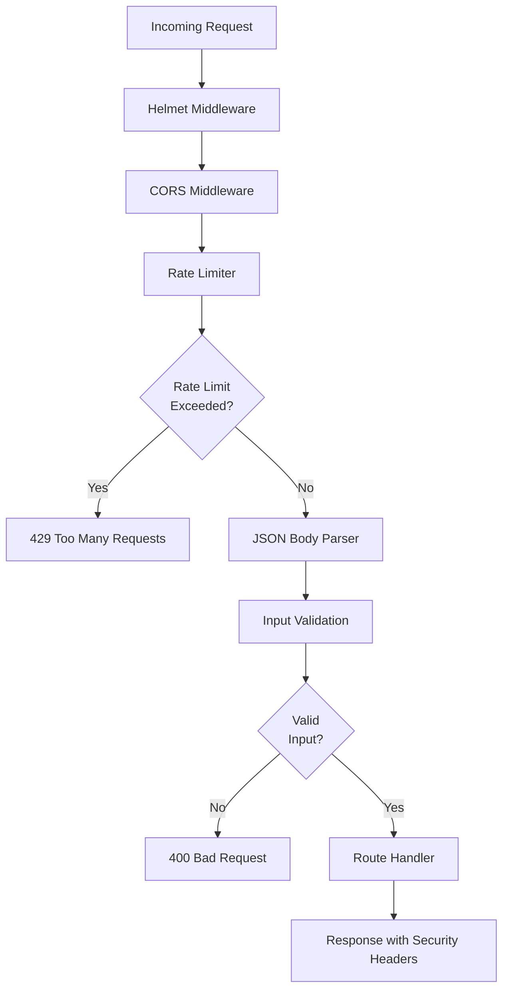

# Technical Specification

# 0. Agent Action Plan

## 0.1 Intent Clarification

### 0.1.1 Core Security Objective

Based on the security concern described, the Blitzy platform understands that the security vulnerabilities to resolve span **multiple vulnerability categories** requiring a coordinated security hardening initiative across the `hello_world` Express.js application. The user's request encompasses:

- **Dependency vulnerability:** A high-severity Denial of Service (DoS) vulnerability in the `qs` package (CVE-2025-15284), a transitive dependency of Express 5.1.0, where `qs` version 6.14.0 is currently installed and allows attackers to bypass `arrayLimit` enforcement via bracket notation
- **Missing security middleware:** The application currently operates without any security HTTP response headers, exposing it to XSS, clickjacking, MIME sniffing, and other client-side attacks
- **Absent access controls:** No rate limiting exists, leaving all endpoints vulnerable to brute-force and DoS attacks from individual IP addresses
- **Missing CORS policy:** No Cross-Origin Resource Sharing configuration is in place, meaning browser-based cross-origin access behavior is undefined
- **No HTTPS support:** The server binds exclusively over plain HTTP, providing no transport-layer encryption
- **No input validation:** While the current application only serves static text responses via GET routes, no validation middleware exists to safeguard future endpoint evolution

**Vulnerability category:** Multiple vulnerabilities (Dependency vulnerability + Configuration weakness + Missing security controls)

**Severity level:** High — The `qs` DoS vulnerability carries a CVSS v3 base score of 7.5 (High), and the absence of security headers, rate limiting, and HTTPS represents a compounding risk surface

**Implicit security needs identified:**
- Backward compatibility must be maintained with the existing two GET endpoints (`/` and `/evening`)
- Zero-downtime integration: security middleware must be additive, not disruptive to existing route behavior
- The single-process, stateless nature of the application (Constraint C-001) means in-memory rate limiting stores are acceptable
- Existing test suites must continue to pass without modification where possible

### 0.1.2 Special Instructions and Constraints

**User-specified directives:**
- "Implement security headers" → Add Helmet.js middleware for comprehensive HTTP security header management
- "Input validation" → Integrate an input validation framework for request sanitization
- "Rate limiting" → Add IP-based rate limiting to protect endpoints from abuse
- "HTTPS support" → Enable TLS/SSL transport-layer encryption capability
- "Update dependencies" → Patch the vulnerable `qs` transitive dependency
- "Add helmet.js for security middleware" → Explicit package selection for security headers
- "Configure proper CORS policies" → Implement the `cors` middleware with explicit origin policies

**Change scope preference:** Comprehensive — The user requests multiple layers of security hardening simultaneously

**Security requirements:**
- Follow OWASP security header recommendations via Helmet.js defaults
- Apply principle of least privilege in CORS configuration (restrict rather than open)
- Ensure rate limiting aligns with common API protection best practices

### 0.1.3 Technical Interpretation

This security vulnerability translates to the following technical fix strategy:

- To resolve the **qs DoS vulnerability (CVE-2025-15284)**, we will update `qs` from 6.14.0 to ≥6.14.1 by adding an `overrides` entry in `package.json` since Express 5.1.0 declares `"qs": "^6.14.0"` which satisfies semver compatibility with 6.14.1+
- To resolve the **missing security headers**, we will install `helmet@8.1.0` and mount it as the first middleware in `src/app.js` to set 13 protective HTTP response headers including Content-Security-Policy, Strict-Transport-Security, and X-Content-Type-Options
- To resolve the **absent rate limiting**, we will install `express-rate-limit@8.2.1` and configure a global rate limiter with sensible defaults (100 requests per 15-minute window per IP)
- To resolve the **missing CORS policy**, we will install `cors@2.8.6` and configure it with restrictive origin settings appropriate for a development/tutorial server
- To resolve the **lack of HTTPS support**, we will create an HTTPS server initialization module in `server.js` using Node.js built-in `https` module with self-signed certificate support for development
- To resolve the **absent input validation**, we will install `express-validator@7.3.1` and create a reusable validation middleware module, even though the current GET-only routes have limited immediate need

**User understanding level:** Explicit component listing — the user has identified specific tools (Helmet.js), specific concerns (security headers, rate limiting, CORS), and specific actions (update dependencies, configure policies)

## 0.2 Vulnerability Research and Analysis

### 0.2.1 Initial Assessment

**Security-related information extracted from the request and repository analysis:**

- **CVE numbers identified:** CVE-2025-15284 (discovered via `npm audit`)
- **Vulnerability names:** DoS via bracket notation array limit bypass in `qs`
- **Affected packages:** `qs` (transitive dependency of `express@5.1.0`)
- **Symptoms described:** `npm audit` reports 1 high-severity vulnerability; the application uses Express 5.1.0 which internally depends on `qs@^6.14.0`, resolving to the vulnerable `qs@6.14.0`
- **Security advisories referenced:** npm audit advisory, CVE-2025-15284 in NVD
- **Additional missing security posture:** No security headers (no Helmet), no rate limiting, no CORS, no HTTPS, no input validation — confirmed by Technical Specification Section 6.4 which states security architecture is "not applicable"

### 0.2.2 Required Web Research — Findings

**CVE-2025-15284 — `qs` Bracket Notation DoS:**

Research reveals that CVE-2025-15284 is a Denial of Service vulnerability affecting the `qs` npm package in all versions prior to 6.14.1, with a CVSS v3 base score of 7.5 (High). The vulnerability allows attackers to bypass the configured `arrayLimit` option when using bracket notation (`a[]=v`), causing unbounded array allocation and memory exhaustion from a single crafted HTTP request. The fix was committed in `qs@6.14.1` by enforcing explicit `arrayLimit` checks for bracket notation parsing. Major vulnerability trackers including NVD, Debian, Ubuntu, OSV, and Snyk have indexed this CVE and confirmed 6.14.1 as the patched version.

**Security headers (Helmet.js):**

Helmet.js v8.1.0 is the current stable release for securing Express applications via HTTP response headers. It sets 13 protective headers by default, including Content-Security-Policy, Cross-Origin-Opener-Policy, Cross-Origin-Resource-Policy, Strict-Transport-Security, X-Content-Type-Options, and removes the `X-Powered-By` header that leaks Express framework identification. It is fully compatible with Express 5.x.

**Rate limiting (express-rate-limit):**

The `express-rate-limit` package at v8.2.1 provides IP-based rate limiting middleware for Express. It includes a built-in memory store suitable for single-process applications, supports standard `RateLimit` headers per IETF draft-8, and is widely deployed with over 233 million total npm downloads.

**CORS middleware:**

The `cors` package v2.8.6 is the official Express.js middleware for CORS header management. It supports origin whitelisting via strings, regex patterns, arrays, or dynamic functions, and handles OPTIONS preflight requests automatically when used as application-level middleware.

**Input validation (express-validator):**

The `express-validator` package v7.3.1 wraps the `validator.js` library and provides express middleware for request validation and sanitization. It requires Node.js 14+ and is verified to work with Express.js.

### 0.2.3 Vulnerability Classification

| Attribute | CVE-2025-15284 (qs) | Missing Security Headers | Missing Rate Limiting | Missing CORS | Missing HTTPS |
|-----------|---------------------|--------------------------|----------------------|-------------|---------------|
| **Type** | Dependency DoS | Configuration weakness | Configuration weakness | Configuration weakness | Transport vulnerability |
| **Attack vector** | Network | Network | Network | Network | Network |
| **Exploitability** | High | Medium | High | Low | Medium |
| **Impact** | Availability | Confidentiality, Integrity | Availability | Integrity | Confidentiality |
| **Root cause** | `qs@6.14.0` arrayLimit bypass | No Helmet middleware in `src/app.js` | No rate limiter middleware | No CORS middleware or headers | HTTP-only server in `server.js` |

### 0.2.4 Web Search Research Conducted

- **Official security advisories reviewed:** CVE-2025-15284 entries on NVD, Debian, Ubuntu, OSV, and Snyk trackers; Express.js security updates page at expressjs.com
- **CVE details and patches:** `qs@6.14.1` confirmed as patched version; `qs@6.14.2` also available with additional improvements; Express 5.1.0 semver range `^6.14.0` permits transparent upgrade
- **Recommended mitigation strategies:** (1) Update `qs` to ≥6.14.1 via npm overrides, (2) Layer security with rate limiting and input size limits as defense-in-depth, (3) Add Helmet.js for header-based protections, (4) Implement CORS to control cross-origin access
- **Alternative solutions considered:** Manual header setting without Helmet (rejected — Helmet is more comprehensive and maintainable); custom rate limiter (rejected — `express-rate-limit` is battle-tested); `express-cors` package (rejected — official `cors` package from expressjs org is the standard)

## 0.3 Security Scope Analysis

### 0.3.1 Affected Component Discovery

A comprehensive search of the repository reveals the following project structure affected by the security hardening initiative. The vulnerability surface spans **7 source files** across **4 directories**, plus dependency manifest files:

**Repository file inventory (all non-`node_modules` files):**

| File Path | Security Relevance |
|-----------|-------------------|
| `package.json` | Dependency manifest — must add overrides for `qs`, add `helmet`, `cors`, `express-rate-limit`, `express-validator` |
| `package-lock.json` | Lockfile — regenerated automatically after dependency changes |
| `server.js` | Entry point — must add HTTPS server capability alongside HTTP |
| `src/app.js` | Express app factory — must mount security middleware (Helmet, CORS, rate limiter, validation) |
| `src/config/index.js` | Configuration module — must add security-related configuration parameters (HTTPS, rate limiting, CORS settings) |
| `src/routes/index.js` | Route aggregator — unchanged, but validation middleware may be referenced here |
| `src/routes/main.routes.js` | Route handlers — may need input validation middleware on routes |
| `jest.config.js` | Test configuration — may need coverage adjustments for new security modules |
| `tests/integration/endpoints.test.js` | Integration tests — must verify security headers are present in responses |
| `tests/lifecycle/server.test.js` | Server tests — must be updated for HTTPS support testing |
| `tests/unit/config.test.js` | Config tests — must cover new security configuration parameters |
| `tests/unit/routes.test.js` | Route tests — unchanged structurally |

**Vulnerability affects 12 files across 6 directories** (including new files to be created for security middleware and tests).

### 0.3.2 Root Cause Identification

**Dependency vulnerability (CVE-2025-15284):**
The identified vulnerability exists in the `qs` package (version 6.14.0) because the `arrayLimit` enforcement logic does not apply to bracket notation parsing (`a[]=v`), allowing attackers to construct query strings that create arrays exceeding the configured limit. Express 5.1.0 depends on `"qs": "^6.14.0"` as specified in `package-lock.json` at `packages["node_modules/express"].dependencies.qs`.

Vulnerability propagation:
- **Direct usage:** Express internally uses `qs` for `req.query` parsing on every incoming request
- **Indirect dependencies:** Every route handler in `src/routes/main.routes.js` receiving query parameters is exposed
- **Configuration enablers:** No query string size limits, no rate limiting, no request body size constraints

**Missing security controls:**
Investigation reveals the security gap stems from `src/app.js` where the Express app is created with zero middleware other than route mounting. The file currently contains:
```javascript
const app = express();
app.use('/', mainRoutes);
```
No security middleware is registered between app creation and route mounting.

### 0.3.3 Current State Assessment

| Security Aspect | Current State | Target State |
|----------------|---------------|--------------|
| `qs` version | 6.14.0 (vulnerable) | ≥6.14.1 (patched) |
| Security headers | None — Express default `X-Powered-By: Express` exposed | Helmet 8.1.0 — 13 security headers set |
| Rate limiting | None | express-rate-limit 8.2.1 — 100 req/15min/IP |
| CORS | None — undefined cross-origin behavior | cors 2.8.6 — restrictive origin policy |
| HTTPS | None — HTTP only on port 3000 | HTTPS via Node.js `https` module with TLS cert support |
| Input validation | None | express-validator 7.3.1 — query/param sanitization |
| Scope of exposure | Public-facing (binds to configurable HOST, default 127.0.0.1) | Same binding with layered security controls |

## 0.4 Version Compatibility Research

### 0.4.1 Secure Version Identification

For each vulnerable or missing dependency, the following upgrade and installation paths have been determined through web research and npm registry verification:

| Package | Current Version | First Patched / Target Version | Recommended Version | Breaking Changes |
|---------|----------------|-------------------------------|--------------------|--------------------|
| `qs` | 6.14.0 | 6.14.1 (patches CVE-2025-15284) | 6.14.2 (latest in 6.14.x) | None — patch-level semver |
| `helmet` | Not installed | 8.1.0 (latest stable) | 8.1.0 | N/A — new dependency |
| `cors` | Not installed | 2.8.6 (latest stable) | 2.8.6 | N/A — new dependency |
| `express-rate-limit` | Not installed | 8.2.1 (latest stable) | 8.2.1 | N/A — new dependency |
| `express-validator` | Not installed | 7.3.1 (latest stable) | 7.3.1 | N/A — new dependency |

**`qs` upgrade rationale:** Express 5.1.0 specifies `"qs": "^6.14.0"` in its dependency tree, meaning versions `6.14.1` and `6.14.2` are within the compatible semver range. The npm registry confirms availability of `6.14.0`, `6.14.1`, and `6.14.2` in the `6.14.x` line. Using an npm `overrides` field in `package.json` will force resolution to `6.14.1` or later without requiring an Express version change.

### 0.4.2 Compatibility Verification

**Runtime compatibility:**
- Node.js v20.20.0 (project runtime) — Compatible with all target packages
- `helmet@8.1.0` — Requires Node.js 18+ (compatible)
- `cors@2.8.6` — No minimum Node.js version constraint (compatible)
- `express-rate-limit@8.2.1` — Requires Node.js 16+ (compatible)
- `express-validator@7.3.1` — Requires Node.js 14+ (compatible)

**Express compatibility:**
- All target packages are verified compatible with Express 5.x
- `helmet` works as standard Express middleware via `app.use(helmet())`
- `cors` is the official Express.js CORS middleware maintained under the `expressjs` GitHub organization
- `express-rate-limit` returns standard Express middleware
- `express-validator` provides Express middleware chains for validation

**Dependency conflicts:** None identified. The target packages have no overlapping or conflicting sub-dependencies with the existing `express@5.1.0` dependency tree.

**Alternative packages — not needed:** No package replacements are required since all target packages are actively maintained and have available secure versions. The `qs` vulnerability is resolvable via a patch-level update within the existing semver range.

## 0.5 Security Fix Design

### 0.5.1 Minimal Fix Strategy

**Principle:** Apply the smallest changes that completely address all identified vulnerabilities while adding the comprehensive security layers requested by the user.

**Fix approach:** Combination — Dependency update + New middleware installation + Configuration changes + Server enhancement

**For the `qs` DoS vulnerability (CVE-2025-15284):**
- Upgrade `qs` from `6.14.0` to `≥6.14.1` by adding an `overrides` block in `package.json`
- Justification: CVE-2025-15284 advisory confirms 6.14.1 contains the fix enforcing explicit `arrayLimit` for bracket notation
- Side effects: None expected — patch-level update within Express's declared semver range

**For missing security headers (Helmet.js):**
- Install `helmet@8.1.0` and mount as the first middleware in `src/app.js` before any route handlers
- Apply targeted configuration to `src/app.js` by adding `app.use(helmet())` ahead of CORS and routes
- Rationale: OWASP recommends setting security response headers; Helmet's defaults align with OWASP best practices including Content-Security-Policy, Strict-Transport-Security, and X-Content-Type-Options

**For missing rate limiting:**
- Install `express-rate-limit@8.2.1` and create a configurable rate limiter in `src/middleware/rateLimiter.js`
- Mount globally via `app.use()` in `src/app.js` after Helmet but before routes
- Configuration: 100 requests per 15-minute window per IP with standard IETF RateLimit headers
- Rationale: Prevents DoS and brute-force attacks at the application layer

**For missing CORS policy:**
- Install `cors@2.8.6` and configure in `src/middleware/cors.js` with restrictive defaults
- Mount via `app.use()` in `src/app.js` after Helmet, before rate limiter
- Configuration: Restricted origin policy suitable for development, configurable via environment variables
- Rationale: Enforces browser-side access control to prevent unauthorized cross-origin requests

**For HTTPS support:**
- Update `server.js` to conditionally create an HTTPS server using Node.js built-in `https` module when TLS certificate paths are configured
- Add `HTTPS_ENABLED`, `SSL_KEY_PATH`, and `SSL_CERT_PATH` environment variables to `src/config/index.js`
- HTTP remains the default for development; HTTPS activates when certificates are provided
- Security improvement: Enables transport-layer encryption preventing eavesdropping and MITM attacks

**For input validation:**
- Install `express-validator@7.3.1` and create a validation middleware module at `src/middleware/validator.js`
- Provide reusable query parameter sanitization for existing routes
- Security improvement: Prevents injection attacks and ensures data integrity

### 0.5.2 Security Improvement Validation

**How each fix eliminates its vulnerability:**

| Fix | Vulnerability Eliminated | Verification Method |
|-----|------------------------|-------------------|
| `qs` override to ≥6.14.1 | CVE-2025-15284 bracket notation DoS | `npm audit` returns 0 vulnerabilities |
| Helmet.js middleware | Missing security response headers | HTTP response inspection shows 13 security headers |
| Rate limiter | Unthrottled endpoint access | 429 status returned after threshold exceeded |
| CORS middleware | Undefined cross-origin behavior | `Access-Control-Allow-Origin` header present with correct values |
| HTTPS server | Plaintext HTTP transport | Server accepts TLS connections on configured port |
| Input validation | Unsanitized request parameters | Malformed input returns 400 with validation errors |

**Rollback plan:** Each security feature is implemented as independent middleware. Any feature can be disabled by removing its `app.use()` call in `src/app.js` or by setting a configuration flag (e.g., `RATE_LIMIT_ENABLED=false`). The `qs` override can be reverted by removing the `overrides` block from `package.json`.

## 0.6 File Transformation Mapping

### 0.6.1 File-by-File Security Fix Plan

The following table maps **every** file to be created, updated, or deleted as part of this security hardening initiative. Target files are listed first.

| Target File | Transformation | Source File / Reference | Security Changes |
|------------|----------------|------------------------|------------------|
| `package.json` | UPDATE | `package.json` | Add `helmet@^8.1.0`, `cors@^2.8.6`, `express-rate-limit@^8.2.1`, `express-validator@^7.3.1` to dependencies; add `overrides` block to pin `qs@>=6.14.1` for CVE-2025-15284 |
| `package-lock.json` | UPDATE | `package-lock.json` | Regenerated by `npm install` — resolves `qs` to ≥6.14.1 and adds new dependency trees |
| `src/app.js` | UPDATE | `src/app.js` | Mount security middleware stack: Helmet → CORS → Rate Limiter → JSON parser → Routes; import new middleware modules |
| `src/config/index.js` | UPDATE | `src/config/index.js` | Add security configuration parameters: CORS origins, rate limit window/max, HTTPS toggle, SSL cert paths, trust proxy setting |
| `server.js` | UPDATE | `server.js` | Add conditional HTTPS server creation using Node.js `https` module alongside existing HTTP server |
| `src/middleware/helmet.js` | CREATE | `src/app.js` (pattern reference) | Create Helmet configuration module exporting configured Helmet middleware with sensible CSP defaults |
| `src/middleware/cors.js` | CREATE | `src/config/index.js` (config pattern) | Create CORS configuration module with environment-driven origin whitelisting |
| `src/middleware/rateLimiter.js` | CREATE | `src/config/index.js` (config pattern) | Create rate limiter module: 100 requests per 15-minute window, standard RateLimit headers, configurable via env vars |
| `src/middleware/validator.js` | CREATE | `src/routes/main.routes.js` (route pattern) | Create input validation middleware with query parameter sanitization rules |
| `src/middleware/index.js` | CREATE | `src/routes/index.js` (aggregator pattern) | Create middleware aggregator module for clean imports in `src/app.js` |
| `src/routes/main.routes.js` | UPDATE | `src/routes/main.routes.js` | Add optional input validation middleware to route handlers for query parameter sanitization |
| `tests/integration/endpoints.test.js` | UPDATE | `tests/integration/endpoints.test.js` | Add assertions for security response headers (Helmet headers), rate limit headers, and CORS headers |
| `tests/unit/config.test.js` | UPDATE | `tests/unit/config.test.js` | Add test cases for new security configuration properties (CORS, rate limit, HTTPS settings) |
| `tests/lifecycle/server.test.js` | UPDATE | `tests/lifecycle/server.test.js` | Add test cases for HTTPS server initialization path |
| `tests/security/headers.test.js` | CREATE | `tests/integration/endpoints.test.js` (test pattern) | Create dedicated security header verification tests using Supertest |
| `tests/security/rateLimit.test.js` | CREATE | `tests/integration/endpoints.test.js` (test pattern) | Create rate limiting behavior tests verifying 429 responses after threshold |
| `tests/security/cors.test.js` | CREATE | `tests/integration/endpoints.test.js` (test pattern) | Create CORS policy tests verifying allowed/blocked origins |
| `tests/security/validation.test.js` | CREATE | `tests/integration/endpoints.test.js` (test pattern) | Create input validation tests verifying sanitization and rejection |
| `jest.config.js` | UPDATE | `jest.config.js` | Add `src/middleware/**/*.js` to `collectCoverageFrom` array to include new security modules in coverage |

### 0.6.2 Code Change Specifications

**`src/app.js` — Middleware Stack Update:**
- Lines affected: 1–27 (entire file restructured)
- Before state: Currently has only `express()` creation and `app.use('/', mainRoutes)` — zero security middleware
- After state: Middleware chain ordered as: Helmet → CORS → Rate Limiter → JSON body parser → Input validation → Routes
- Security improvement: All inbound requests pass through layered security controls before reaching route handlers

**`src/config/index.js` — Security Configuration Expansion:**
- Lines affected: 20–41 (add new exports after existing properties)
- Before state: Exports only `host`, `port`, `env` — no security parameters
- After state: Exports additional security properties including `corsOrigin`, `rateLimitWindowMs`, `rateLimitMax`, `httpsEnabled`, `sslKeyPath`, `sslCertPath`, `trustProxy`
- Security improvement: Centralizes all security settings with environment variable support for deployment flexibility

**`server.js` — HTTPS Server Support:**
- Lines affected: 19–52 (add conditional HTTPS logic)
- Before state: Creates HTTP-only server via `app.listen()`
- After state: Conditionally creates HTTPS server using `https.createServer()` when `HTTPS_ENABLED=true` and certificate paths are configured; falls back to HTTP otherwise
- Security improvement: Enables TLS transport encryption

**`package.json` — Dependency and Override Updates:**
- Lines affected: 15–17 (dependencies block), new overrides block
- Before state: Single dependency `"express": "^5.1.0"` — no overrides
- After state: Four new production dependencies added; `overrides` block pins `qs` to `>=6.14.1`
- Security improvement: Patches CVE-2025-15284 and adds all security middleware packages

### 0.6.3 Configuration Change Specifications

| File | Setting | Current Value | New Value | Security Rationale |
|------|---------|--------------|-----------|-------------------|
| `src/config/index.js` | `corsOrigin` | (does not exist) | `process.env.CORS_ORIGIN \|\| 'http://localhost:3000'` | Restricts cross-origin access to known origins |
| `src/config/index.js` | `rateLimitWindowMs` | (does not exist) | `parseInt(process.env.RATE_LIMIT_WINDOW_MS, 10) \|\| 900000` | Configurable 15-minute rate limit window |
| `src/config/index.js` | `rateLimitMax` | (does not exist) | `parseInt(process.env.RATE_LIMIT_MAX, 10) \|\| 100` | Limits each IP to 100 requests per window |
| `src/config/index.js` | `httpsEnabled` | (does not exist) | `process.env.HTTPS_ENABLED === 'true'` | Toggles HTTPS server creation |
| `src/config/index.js` | `sslKeyPath` | (does not exist) | `process.env.SSL_KEY_PATH \|\| ''` | Path to TLS private key file |
| `src/config/index.js` | `sslCertPath` | (does not exist) | `process.env.SSL_CERT_PATH \|\| ''` | Path to TLS certificate file |
| `src/config/index.js` | `trustProxy` | (does not exist) | `process.env.TRUST_PROXY === 'true'` | Enables `trust proxy` for correct IP resolution behind reverse proxies |

## 0.7 Dependency Inventory

### 0.7.1 Security Patches and Updates

The following table lists all security-critical package operations required for this initiative:

| Registry | Package Name | Current Version | Patched To | CVE / Advisory | Severity |
|----------|-------------|----------------|------------|----------------|----------|
| npm | qs | 6.14.0 | ≥6.14.1 (via overrides) | CVE-2025-15284 | High (CVSS 7.5) |
| npm | helmet | Not installed | 8.1.0 | N/A — new security dependency | N/A |
| npm | cors | Not installed | 2.8.6 | N/A — new security dependency | N/A |
| npm | express-rate-limit | Not installed | 8.2.1 | N/A — new security dependency | N/A |
| npm | express-validator | Not installed | 7.3.1 | N/A — new security dependency | N/A |

### 0.7.2 Dependency Chain Analysis

**Direct dependencies requiring updates:**
- `express@^5.1.0` — No version change needed; `qs` override handles the transitive vulnerability
- New direct dependencies: `helmet`, `cors`, `express-rate-limit`, `express-validator`

**Transitive dependencies affected:**
- `qs@6.14.0` → `qs@≥6.14.1` — Transitive dependency of `express@5.1.0`, resolved via npm `overrides`
- `express@5.1.0` internally routes all query string parsing through `qs`, making the override effective for all request handling

**Peer dependencies to verify:**
- None — The target packages (`helmet`, `cors`, `express-rate-limit`, `express-validator`) do not declare Express as a peer dependency; they function as standard middleware

**Development dependencies with vulnerabilities:**
- `jest@^30.2.0` and `supertest@^7.1.4` — No known vulnerabilities; no updates required

### 0.7.3 Import and Reference Updates

**Source files requiring new imports:**

| File | New Imports Required |
|------|---------------------|
| `src/app.js` | `require('./middleware')` — aggregated middleware exports including Helmet, CORS, rate limiter |
| `src/middleware/helmet.js` | `require('helmet')` |
| `src/middleware/cors.js` | `require('cors')` |
| `src/middleware/rateLimiter.js` | `require('express-rate-limit')` — specifically `{ rateLimit }` |
| `src/middleware/validator.js` | `require('express-validator')` — specifically `{ query, validationResult }` |
| `server.js` | `require('https')` and `require('fs')` — Node.js built-in modules for HTTPS support |

**Import transformation rules:** Not applicable — no packages are being replaced; all new packages are fresh installations.

**Configuration reference updates:**
- `src/config/index.js` — Add 7 new exported configuration properties for security settings
- `server.js` — Add reference to `config.httpsEnabled`, `config.sslKeyPath`, `config.sslCertPath`
- `jest.config.js` — Add `src/middleware/**/*.js` to `collectCoverageFrom` patterns
- No environment variable renames or documentation reference changes are needed since all new variables are additive

## 0.8 Impact Analysis and Testing Strategy

### 0.8.1 Security Testing Requirements

**Vulnerability regression tests:**
- Test that CVE-2025-15284 is no longer exploitable by verifying `npm audit` returns zero high-severity vulnerabilities
- Specific attack scenarios to test:
  - Send a GET request with a crafted query string containing large bracket-notation arrays (e.g., `?a[]=1&a[]=2...` with thousands of entries) and verify the server does not crash or exhaust memory
  - Verify rate limiter returns HTTP 429 after the configured threshold is exceeded
  - Verify Helmet security headers are present on all responses
  - Verify CORS blocks requests from non-whitelisted origins

**Security-specific test cases to add:**

| Test File | Purpose | Key Assertions |
|-----------|---------|----------------|
| `tests/security/headers.test.js` | Verify Helmet headers present | Assert presence of `Content-Security-Policy`, `Strict-Transport-Security`, `X-Content-Type-Options`, `X-Frame-Options`; assert `X-Powered-By` is absent |
| `tests/security/rateLimit.test.js` | Verify rate limiting behavior | Assert `RateLimit-*` headers present; assert HTTP 429 after threshold exceeded; assert correct `Retry-After` header |
| `tests/security/cors.test.js` | Verify CORS policy enforcement | Assert `Access-Control-Allow-Origin` matches configured origin; assert preflight `OPTIONS` returns correct CORS headers; assert missing `Origin` header works correctly |
| `tests/security/validation.test.js` | Verify input validation | Assert malformed query parameters are sanitized; assert validation error responses have correct 400 status format |

**Existing tests to verify:**
- `tests/integration/endpoints.test.js` — All 12 existing tests must continue to pass with security middleware active
- `tests/unit/routes.test.js` — All 6 route structure tests must pass unchanged
- `tests/unit/config.test.js` — All 11 config tests must pass; new tests added for security config
- `tests/lifecycle/server.test.js` — All 4 server tests must pass; new tests added for HTTPS path

### 0.8.2 Verification Methods

**Automated security scanning:**
- Tool: `npm audit` — Expected result: 0 vulnerabilities (currently reports 1 high)
- Command: `npm audit --audit-level=high`
- Post-fix validation: The `qs` vulnerability should no longer appear in audit output

**Manual verification steps:**
- Start the server and inspect HTTP response headers using `curl -I http://localhost:3000/`
- Verify `X-Powered-By` header is absent
- Verify `Content-Security-Policy`, `Strict-Transport-Security`, and other Helmet headers are present
- Send rapid requests to verify rate limiter triggers at the configured threshold
- Send requests with `Origin` header to verify CORS behavior

**Test execution commands:**
- Full test suite: `CI=true npx jest --ci --coverage --reporters=default`
- Security tests only: `CI=true npx jest tests/security/ --verbose`
- Audit verification: `npm audit --audit-level=high`

### 0.8.3 Impact Assessment

**Direct security improvements achieved:**
- CVE-2025-15284 DoS vulnerability eliminated via `qs` upgrade to ≥6.14.1
- 13 security HTTP response headers added via Helmet.js, mitigating XSS, clickjacking, MIME sniffing, and other client-side attacks
- Rate limiting prevents individual IP abuse with configurable thresholds
- CORS policy restricts browser-based cross-origin access to whitelisted origins
- HTTPS capability enables transport encryption for production deployments
- Input validation provides defense-in-depth against injection attacks

**Minimal side effects on existing functionality:**
- No breaking changes to the public API — both `GET /` and `GET /evening` continue to return identical response bodies
- Existing response content-type (`text/html; charset=utf-8`) is preserved
- The only observable response changes are additional security headers (which do not affect client behavior for the `text/html` content type)
- Rate limiting may affect automated test runners making rapid requests — tests should account for this by either increasing thresholds in test configuration or resetting rate limiter state between tests

**Potential impacts to address:**
- Helmet's default `Content-Security-Policy` includes `upgrade-insecure-requests`, which can cause Safari to redirect `http://localhost` to `https://localhost` in development — mitigated by disabling this directive in development mode
- Rate limiter uses in-memory storage, which resets on server restart — acceptable for this single-process application per Constraint C-001
- CORS restrictive defaults may block legitimate cross-origin requests if the application is consumed by external clients — mitigated by environment-variable-driven origin configuration

## 0.9 Scope Boundaries

### 0.9.1 Exhaustively In Scope

**Vulnerable dependency manifests:**
- `package.json` — Add `overrides` block for `qs@>=6.14.1`, add new production dependencies
- `package-lock.json` — Regenerated automatically after `npm install`

**Source files requiring security middleware integration:**
- `src/app.js` — Mount Helmet, CORS, rate limiter, JSON parser, and validation middleware
- `src/config/index.js` — Add security configuration parameters

**New security middleware modules:**
- `src/middleware/helmet.js` — Helmet configuration and export
- `src/middleware/cors.js` — CORS configuration and export
- `src/middleware/rateLimiter.js` — Rate limiter configuration and export
- `src/middleware/validator.js` — Input validation middleware
- `src/middleware/index.js` — Middleware aggregator

**Server and route updates:**
- `server.js` — HTTPS server support
- `src/routes/main.routes.js` — Optional validation middleware integration

**Security test files:**
- `tests/security/headers.test.js` — Helmet header verification
- `tests/security/rateLimit.test.js` — Rate limiter behavior tests
- `tests/security/cors.test.js` — CORS policy tests
- `tests/security/validation.test.js` — Input validation tests

**Updated existing test files:**
- `tests/integration/endpoints.test.js` — Additional security header assertions
- `tests/unit/config.test.js` — Security configuration tests
- `tests/lifecycle/server.test.js` — HTTPS initialization tests

**Configuration and infrastructure:**
- `jest.config.js` — Coverage collection updates for middleware files

### 0.9.2 Explicitly Out of Scope

- **Feature additions unrelated to security:** No new business logic routes, no new response formats, no API versioning
- **Performance optimizations:** No caching layers, no compression middleware, no connection pooling
- **Code refactoring beyond security requirements:** No restructuring of existing route handlers, no TypeScript migration, no ESM conversion
- **Non-vulnerable dependencies:** `express@^5.1.0` version is not changed (only its transitive `qs` is patched); `jest@^30.2.0` and `supertest@^7.1.4` are not modified
- **Style or formatting changes:** No linting rules, no code formatting, no comment rewrites in files not touched by security changes
- **Test files unrelated to security validation:** `tests/unit/routes.test.js` remains unchanged
- **Database or persistence layer:** No database additions per Constraint C-003
- **Authentication and authorization systems:** The user did not request auth mechanisms; only access-control middleware (CORS, rate limiting) is added
- **Production deployment infrastructure:** No Dockerfile creation, no CI/CD pipeline files, no Kubernetes manifests — infrastructure was explicitly excluded by the existing tech spec (Section 8.1)
- **Monitoring and logging:** No application performance monitoring, no structured logging, no error tracking services

## 0.10 Execution Parameters and Special Instructions

### 0.10.1 Security Verification Commands

| Purpose | Command |
|---------|---------|
| Dependency vulnerability scan | `npm audit --audit-level=high` |
| Security test execution | `CI=true npx jest tests/security/ --verbose` |
| Full test suite validation | `CI=true npx jest --ci --coverage --reporters=default` |
| Integration tests only | `CI=true npx jest tests/integration/ --verbose` |
| Dependency installation with audit | `npm ci && npm audit` |

### 0.10.2 Research Documentation

**Security advisories consulted:**
- CVE-2025-15284: NVD entry for `qs` bracket notation DoS, CVSS 7.5 High
- Debian, Ubuntu, OSV, and Snyk trackers confirmed `qs@6.14.1` as the fixed version
- Express.js official security updates page (`expressjs.com/en/advanced/security-updates.html`)

**CVE numbers referenced:**
- CVE-2025-15284 — `qs` DoS via `arrayLimit` bypass in bracket notation (all versions < 6.14.1)

**Security best practices followed:**
- OWASP Secure Headers Project — Implemented via Helmet.js default configuration
- OWASP Rate Limiting guidelines — Implemented via `express-rate-limit` with standard IETF RateLimit headers
- Express.js security best practices — HTTPS support, `trust proxy` configuration, `X-Powered-By` removal

**Standards applied:**
- IETF RateLimit header draft-8 format for rate limiting response headers
- Mozilla CSP documentation for Content-Security-Policy configuration
- HSTS best practices (365-day max-age with includeSubDomains)

### 0.10.3 Implementation Constraints

- **Priority:** Security fix first (patch `qs`), then middleware layering (Helmet → CORS → Rate Limiter → Validation → Routes), then HTTPS support
- **Backward compatibility:** Must maintain — existing GET `/` and GET `/evening` endpoints must return identical response bodies and status codes
- **Deployment considerations:** Immediate for development environments; HTTPS activation requires certificate provisioning for production

### 0.10.4 Special Instructions for Security Fixes

The following security-specific requirements are derived from the user's request and the project's constraints:

- **Change scope:** All changes are necessary for the requested security hardening — no unrelated refactoring is included
- **Preserve existing functionality:** Both `GET /` returning `'Hello, World!\n'` and `GET /evening` returning `'Good evening'` must remain functionally identical
- **Principle of least privilege:** CORS is configured with restrictive defaults (single allowed origin); rate limits are set to reasonable thresholds (100 req/15min)
- **Middleware ordering matters:** Security middleware must be mounted in the correct order — Helmet first (sets response headers), CORS second (handles preflight), Rate Limiter third (throttles before route processing), then routes
- **Environment-driven configuration:** All security parameters are configurable via environment variables, allowing different settings per deployment without code changes
- **No breaking changes:** The `overrides` block for `qs` operates within the declared semver range; all new middleware is additive; HTTPS is opt-in via configuration flag
- **Test coverage:** All new security middleware modules must be covered by dedicated test files in `tests/security/`; existing test suites must continue to pass without modification


```mermaid
graph TD
    A[Incoming Request] --> B[Helmet Middleware]
    B --> C[CORS Middleware]
    C --> D[Rate Limiter]
    D --> E{Rate Limit<br/>Exceeded?}
    E -->|Yes| F[429 Too Many Requests]
    E -->|No| G[JSON Body Parser]
    G --> H[Input Validation]
    H --> I{Valid<br/>Input?}
    I -->|No| J[400 Bad Request]
    I -->|Yes| K[Route Handler]
    K --> L[Response with Security Headers]
```

