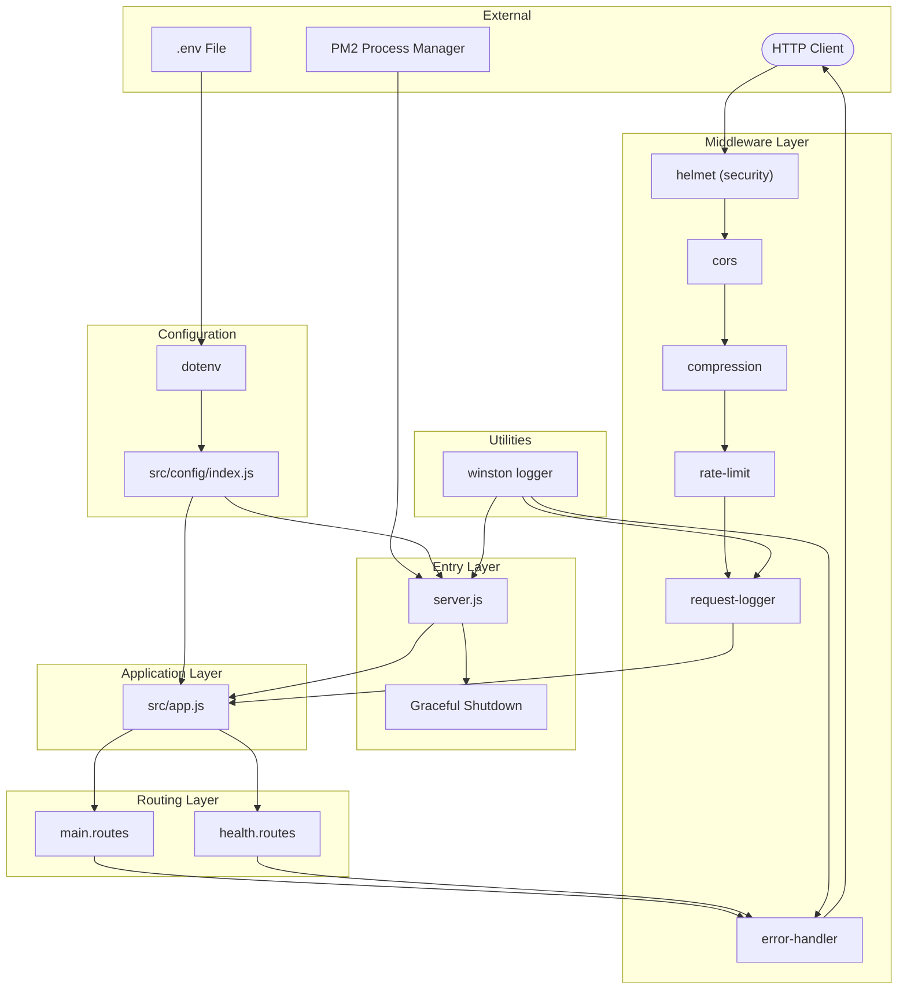
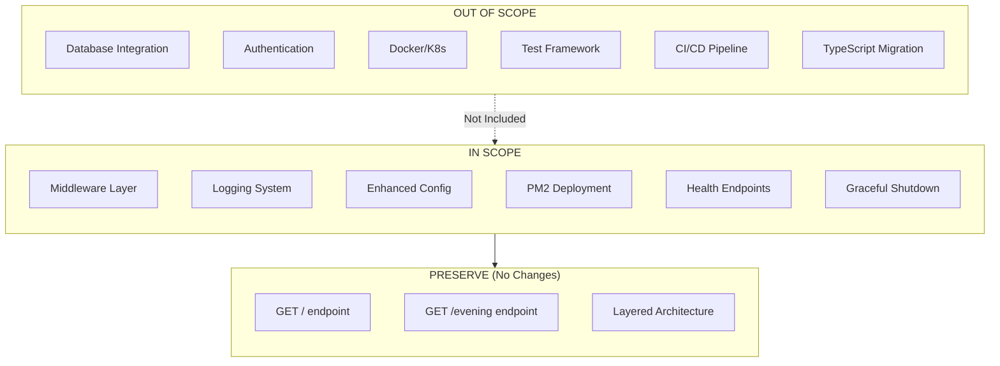

# Technical Specification

# 0. Agent Action Plan

## 0.1 Intent Clarification

### 0.1.1 Core Objective

Based on the provided requirements, the Blitzy platform understands that the objective is to transform the existing minimal Node.js + Express.js tutorial server into a **production-ready application** with enhanced routing, middleware architecture, environment configuration management, structured logging, and process management for deployment.

**Explicit Requirements Interpreted:**

| Requirement | Technical Interpretation |
|-------------|-------------------------|
| "Enhance this basic HTTP server" | Evolve the existing modular architecture at `server.js`, `src/app.js`, and `src/routes/` |
| "Express.js framework" | Framework already present (v5.1.0) - focus on leveraging additional Express capabilities |
| "Add routing" | Expand the route structure with additional endpoints, route organization, and RESTful patterns |
| "Middleware" | Implement middleware pipeline including body parsing, CORS, security headers, request logging |
| "Environment config" | Enhance `src/config/index.js` with `dotenv` integration and environment-specific configuration |
| "Logging" | Integrate structured logging library (Winston or Pino) with configurable log levels and output |
| "Prepare for production deployment with PM2" | Create `ecosystem.config.js`, add startup scripts, implement graceful shutdown |

**Implicit Requirements Detected:**

- Error handling middleware for centralized exception management
- Health check endpoint for production monitoring
- Request validation middleware for API robustness
- Security headers middleware (helmet) for OWASP compliance
- Rate limiting for DoS protection in production
- Graceful shutdown handling for zero-downtime deployments

### 0.1.2 Task Categorization

| Category | Classification |
|----------|---------------|
| **Primary task type** | Mixed (Configuration + Infrastructure + Feature Enhancement) |
| **Secondary aspects** | Security enhancement, Operational tooling, Development workflow |
| **Scope classification** | Cross-cutting change affecting multiple layers |

### 0.1.3 Special Instructions and Constraints

**Critical Directives:**

- Preserve existing functionality of `GET /` ("Hello, World!") and `GET /evening` ("Good evening") endpoints
- Maintain the current layered architecture pattern (Entry Layer → Application Layer → Routing Layer)
- Use Express.js 5.x best practices including async error handling patterns
- Follow Twelve-Factor App methodology for configuration management
- Ensure backward compatibility with existing environment variables (`HOST`, `PORT`, `NODE_ENV`)

**Methodological Requirements:**

- Leverage existing modular structure in `src/` directory
- Implement middleware in dedicated `src/middleware/` directory
- Maintain separation of concerns established in current codebase

### 0.1.4 Technical Interpretation

These requirements translate to the following technical implementation strategy:

| Goal | Technical Actions |
|------|-------------------|
| **Enhanced routing** | Create additional route modules in `src/routes/`, implement route parameter handling, add health check endpoint |
| **Middleware architecture** | Create `src/middleware/` directory with individual middleware modules for logging, error handling, security, validation |
| **Environment configuration** | Install `dotenv`, create `.env` and `.env.example` files, enhance `src/config/index.js` with validation and typed configuration |
| **Structured logging** | Install `winston` or `pino`, create logger service in `src/utils/logger.js`, integrate with middleware |
| **PM2 production deployment** | Create `ecosystem.config.js` at project root, add npm scripts for PM2 management, implement graceful shutdown in `server.js` |

**Technical Approach Summary:**

- "To achieve enhanced routing, we will expand `src/routes/` with organized route modules and add RESTful endpoint patterns"
- "To implement middleware architecture, we will create `src/middleware/` directory with modular, single-responsibility middleware functions"
- "To enable environment configuration, we will integrate `dotenv` at application bootstrap and enhance the config module with validation"
- "To add logging, we will create a centralized logger utility with environment-aware configuration and request logging middleware"
- "To prepare for PM2 deployment, we will create ecosystem configuration, add cluster mode support, and implement graceful shutdown handling"

## 0.2 Repository Scope Discovery

### 0.2.1 Comprehensive File Analysis

The repository search revealed a minimal but well-structured Node.js application following Express.js best practices with clear separation of concerns.

**Source Code Files:**

| File Path | Purpose | Lines | Impact Level |
|-----------|---------|-------|--------------|
| `server.js` | HTTP server bootstrap and network binding | 23 | High - Add graceful shutdown |
| `src/app.js` | Express application factory and route mounting | 27 | High - Add middleware stack |
| `src/config/index.js` | Environment-based configuration management | 41 | High - Integrate dotenv |
| `src/routes/index.js` | Route module aggregation (barrel pattern) | 19 | Medium - Add new routes |
| `src/routes/main.routes.js` | Endpoint handler implementations | 41 | Medium - Reference for new routes |

**Configuration Files:**

| File Path | Purpose | Impact Level |
|-----------|---------|--------------|
| `package.json` | npm manifest with dependencies | High - Add new dependencies |
| `package-lock.json` | Deterministic lockfile | Auto-updated |
| `.gitignore` | Git ignore patterns | Medium - Add env files |

**Documentation Files:**

| File Path | Purpose | Impact Level |
|-----------|---------|--------------|
| `README.md` | Project description | Low - Update with new features |
| `blitzy/documentation/Project Guide.md` | Development guide | Low - Reference only |
| `blitzy/documentation/Technical Specifications.md` | Tech specs | Low - Reference only |

**Files to Create:**

| Target Path | Purpose |
|-------------|---------|
| `src/middleware/logger.js` | Request logging middleware |
| `src/middleware/errorHandler.js` | Centralized error handling |
| `src/middleware/security.js` | Security headers middleware |
| `src/middleware/index.js` | Middleware barrel export |
| `src/utils/logger.js` | Centralized logger configuration |
| `src/routes/health.routes.js` | Health check endpoint |
| `ecosystem.config.js` | PM2 configuration |
| `.env` | Environment variables |
| `.env.example` | Environment template |

### 0.2.2 Web Search Research Conducted

**Research Areas Explored:**

| Topic | Key Findings |
|-------|--------------|
| Express.js middleware best practices 2024 | <cite index="2-19,2-20,2-21">Keeping middleware functions small and focused is essential for maintainable and efficient code. A single responsibility principle should be applied to each middleware function, meaning it should perform only one specific task. This approach makes it easier to test, debug, and reuse middleware functions across different routes and applications.</cite> |
| PM2 production deployment | <cite index="11-3,11-5">PM2 is a popular process manager for Node.js applications that helps you keep your app running 24/7 in production environments. By following these steps, you'll have a robust Node.js deployment using PM2 in production mode.</cite> |
| Winston vs Pino logging | <cite index="21-4,21-5,21-6">Winston is a highly configurable and modular logging library that supports multiple transports. Multi-Transport Support – Easily log to different outputs (files, databases, cloud services, etc.). Highly Customizable – It offers rich formatting, custom log levels, and flexible configurations.</cite> |
| dotenv configuration | <cite index="38-1,38-2">Dotenv is a zero-dependency module that loads environment variables from a .env file into process.env. Storing configuration in the environment separate from code is based on The Twelve-Factor App methodology.</cite> |

**Best Practices Adopted:**

- <cite index="7-9,7-10">Optimizing the order of middleware functions in Express.js not only enhances performance but also improves the readability and maintainability of your application code. By adhering to these best practices—placing lightweight middleware first, grouping related middleware, deferring heavy middleware, using conditional loading, leveraging route-specific middleware, and properly positioning error-handling middleware—you can minimize processing overhead and ensure quicker response times.</cite>
- <cite index="15-5,15-6">PM2 provides automatic crash recovery, startup script generation, and process monitoring to keep applications reliably online. PM2's cluster mode runs multiple instances across all available cores and load-balances traffic between them, dramatically improving throughput.</cite>

### 0.2.3 Existing Infrastructure Assessment

**Current Project Structure:**

```
/
├── server.js                    # Entry point (23 lines)
├── package.json                 # npm manifest
├── package-lock.json            # Lock file
├── README.md                    # Basic description
├── .gitignore                   # Git rules
├── src/
│   ├── app.js                   # Express factory (27 lines)
│   ├── config/
│   │   └── index.js             # Config module (41 lines)
│   └── routes/
│       ├── index.js             # Route aggregator (19 lines)
│       └── main.routes.js       # Route handlers (41 lines)
└── blitzy/
    └── documentation/           # Docs
```

**Current Patterns and Conventions:**

| Pattern | Location | Observation |
|---------|----------|-------------|
| CommonJS modules | All files | `require()` / `module.exports` pattern |
| Factory pattern | `src/app.js` | Express app exported without listening |
| Barrel exports | `src/routes/index.js` | Aggregates route modules |
| Environment defaults | `src/config/index.js` | Fallback values for HOST, PORT, NODE_ENV |
| Layered architecture | Project structure | Entry → Application → Routes |

**Build and Deployment Configuration:**

| Aspect | Current State | Enhancement Needed |
|--------|--------------|-------------------|
| npm scripts | `start`, `test` (placeholder) | Add `dev`, `prod`, `pm2:start`, `pm2:stop` |
| Environment management | Direct `process.env` access | Add dotenv integration |
| Process management | None | Add PM2 ecosystem config |
| Logging | Console only | Add structured logger |

**Testing Infrastructure:**

| Aspect | Current State |
|--------|--------------|
| Test framework | Placeholder script (`"test": "echo ..."`) |
| Test files | None present |
| Coverage | Not configured |

**Documentation System:**

| File | Purpose |
|------|---------|
| `README.md` | Basic project description |
| `blitzy/documentation/` | Technical specifications and project guide |

## 0.3 File Transformation Mapping

### 0.3.1 File-by-File Execution Plan

| Target File | Transformation | Source File/Reference | Purpose/Changes |
|-------------|----------------|----------------------|-----------------|
| `package.json` | UPDATE | `package.json` | Add dependencies (dotenv, winston, helmet, cors, compression, express-rate-limit), add npm scripts for PM2 |
| `server.js` | UPDATE | `server.js` | Add graceful shutdown handling, signal listeners (SIGTERM, SIGINT), PM2 integration |
| `src/app.js` | UPDATE | `src/app.js` | Mount middleware stack (logger, security, body-parser, compression, rate-limit), error handler |
| `src/config/index.js` | UPDATE | `src/config/index.js` | Integrate dotenv, add validation, expand configuration options for logging and PM2 |
| `src/routes/index.js` | UPDATE | `src/routes/index.js` | Add health routes export |
| `src/middleware/index.js` | CREATE | `src/routes/index.js` | Create middleware barrel export following existing route aggregator pattern |
| `src/middleware/logger.js` | CREATE | N/A | Create request logging middleware using winston/morgan |
| `src/middleware/errorHandler.js` | CREATE | N/A | Create centralized error handling middleware |
| `src/middleware/security.js` | CREATE | N/A | Create security middleware aggregating helmet, cors |
| `src/utils/logger.js` | CREATE | N/A | Create winston logger configuration with environment-aware transports |
| `src/routes/health.routes.js` | CREATE | `src/routes/main.routes.js` | Create health check endpoint following existing route patterns |
| `ecosystem.config.js` | CREATE | N/A | Create PM2 ecosystem configuration for cluster mode and deployment |
| `.env` | CREATE | N/A | Create environment variables file for local development |
| `.env.example` | CREATE | N/A | Create environment template for documentation |
| `.gitignore` | UPDATE | `.gitignore` | Add `.env` pattern, logs directory |
| `README.md` | UPDATE | `README.md` | Add documentation for new features, environment setup, PM2 commands |

### 0.3.2 New Files Detail

**`src/middleware/index.js`** - Middleware barrel export
- Content type: source/module
- Based on: `src/routes/index.js` barrel pattern
- Key exports: `{ loggerMiddleware, errorHandler, securityMiddleware }`

**`src/middleware/logger.js`** - Request logging middleware
- Content type: source/middleware
- Based on: morgan/winston patterns
- Key functions: `requestLogger(req, res, next)`, configurable log format

**`src/middleware/errorHandler.js`** - Error handling middleware
- Content type: source/middleware
- Based on: Express.js 5.x error handling patterns
- Key functions: `errorHandler(err, req, res, next)`, async error wrapper

**`src/middleware/security.js`** - Security middleware configuration
- Content type: source/middleware
- Based on: helmet/cors best practices
- Key functions: Security header configuration, CORS policy

**`src/utils/logger.js`** - Winston logger service
- Content type: source/utility
- Based on: winston configuration patterns
- Key exports: `logger` instance with `info()`, `error()`, `warn()`, `debug()` methods

**`src/routes/health.routes.js`** - Health check routes
- Content type: source/routes
- Based on: `src/routes/main.routes.js`
- Key endpoints: `GET /health`, `GET /health/live`, `GET /health/ready`

**`ecosystem.config.js`** - PM2 configuration
- Content type: configuration
- Based on: PM2 documentation
- Key sections: apps array, cluster mode, environment variables

**`.env`** - Local environment variables
- Content type: configuration
- Based on: existing config defaults
- Key variables: `HOST`, `PORT`, `NODE_ENV`, `LOG_LEVEL`

**`.env.example`** - Environment template
- Content type: documentation/configuration
- Based on: `.env` structure
- Key sections: Commented template with all variables

### 0.3.3 Files to Modify Detail

**`package.json`** - Dependency and scripts update
- Sections to update: `dependencies`, `scripts`, `devDependencies`
- New content to add:
  - Dependencies: `dotenv`, `winston`, `helmet`, `cors`, `compression`, `express-rate-limit`
  - Scripts: `dev`, `prod`, `pm2:start`, `pm2:stop`, `pm2:restart`, `pm2:logs`
- Refactoring needed: None

**`server.js`** - Graceful shutdown integration
- Sections to update: Server startup section, add shutdown handlers
- New content to add:
  - Process signal handlers for SIGTERM, SIGINT
  - Server close logic with timeout
  - Logger integration for startup/shutdown messages
- Content to remove: None

**`src/app.js`** - Middleware stack integration
- Sections to update: Express app configuration
- New content to add:
  - Import middleware modules
  - Mount middleware in correct order (security → logger → body-parser → routes → errorHandler)
  - Built-in middleware configuration (express.json(), express.urlencoded())
- Refactoring needed: Reorganize route mounting after middleware

**`src/config/index.js`** - Enhanced configuration
- Sections to update: Configuration object structure
- New content to add:
  - `require('dotenv').config()` at top
  - Additional config properties (LOG_LEVEL, LOG_FORMAT, etc.)
  - Configuration validation function
- Refactoring needed: Structure config into nested objects (server, logging, security)

**`src/routes/index.js`** - Route expansion
- Sections to update: Exports object
- New content to add: `healthRoutes` export
- Content to remove: None

**`.gitignore`** - Pattern updates
- Sections to update: Environment files section
- New content to add: `.env`, `.env.local`, `logs/`, `*.log`

**`README.md`** - Documentation update
- Sections to update: All sections
- New content to add: Environment setup, PM2 commands, middleware documentation

### 0.3.4 Configuration and Documentation Updates

**Configuration Changes:**

| Config File | Specific Settings | Impact |
|-------------|-------------------|--------|
| `package.json` | Add `pm2` to devDependencies | Enables PM2 CLI locally |
| `package.json` | Add scripts for PM2 lifecycle | Simplifies deployment commands |
| `ecosystem.config.js` | Cluster mode with `max` instances | Utilizes all CPU cores |
| `.env` | `LOG_LEVEL=info` | Controls verbosity |

**Documentation Updates:**

| Doc File | Sections | Cross-references |
|----------|----------|------------------|
| `README.md` | Environment Setup | Links to `.env.example` |
| `README.md` | Production Deployment | Links to PM2 docs |
| `README.md` | API Reference | Links to health endpoints |

### 0.3.5 Cross-File Dependencies

**Import/Reference Updates Required:**

| Source File | Import Change | Reason |
|-------------|--------------|--------|
| `src/app.js` | Add `require('./middleware')` | Mount middleware stack |
| `src/app.js` | Add `require('./utils/logger')` | Application logging |
| `server.js` | Add `require('./src/utils/logger')` | Startup logging |
| `src/routes/index.js` | Add `healthRoutes` export | New route module |

**Configuration Sync Requirements:**

| Config Source | Consumers | Sync Requirement |
|---------------|-----------|------------------|
| `.env` | `src/config/index.js` | dotenv loads before config |
| `src/config/index.js` | All modules | Centralized configuration |
| `ecosystem.config.js` | PM2 runtime | Mirrors `.env` variables |

**Documentation Consistency:**

| Update Source | Affected Docs |
|---------------|---------------|
| New environment variables | `.env.example`, `README.md` |
| New npm scripts | `README.md`, `package.json` |
| New endpoints | `README.md` |

## 0.4 Dependency Inventory

### 0.4.1 Key Private and Public Packages

**Existing Dependencies:**

| Registry | Package Name | Version | Purpose |
|----------|--------------|---------|---------|
| npm | express | ^5.1.0 | Web application framework |

**New Dependencies to Add:**

| Registry | Package Name | Version | Purpose |
|----------|--------------|---------|---------|
| npm | dotenv | ^16.4.7 | Environment variable management |
| npm | winston | ^3.17.0 | Structured logging library |
| npm | helmet | ^8.0.0 | Security headers middleware |
| npm | cors | ^2.8.5 | Cross-origin resource sharing |
| npm | compression | ^1.7.5 | Response compression middleware |
| npm | express-rate-limit | ^7.5.0 | Rate limiting middleware |

**New Development Dependencies:**

| Registry | Package Name | Version | Purpose |
|----------|--------------|---------|---------|
| npm | pm2 | ^5.4.3 | Process manager for production |

### 0.4.2 Dependency Updates

**New Dependencies to Add:**

| Package | Version | Reason for Addition |
|---------|---------|---------------------|
| `dotenv` | ^16.4.7 | Load environment variables from `.env` file following Twelve-Factor App methodology |
| `winston` | ^3.17.0 | Structured logging with multiple transports, log levels, and formatting options |
| `helmet` | ^8.0.0 | Set security HTTP headers to protect against common web vulnerabilities |
| `cors` | ^2.8.5 | Enable Cross-Origin Resource Sharing for API access from different domains |
| `compression` | ^1.7.5 | Gzip compression for HTTP responses to reduce bandwidth |
| `express-rate-limit` | ^7.5.0 | Protect endpoints from brute-force attacks and DoS |
| `pm2` | ^5.4.3 (dev) | Production process management with cluster mode, monitoring, and auto-restart |

**Dependencies to Update:**

| Package | Current | Target | Reason |
|---------|---------|--------|--------|
| N/A | - | - | No existing dependencies require updates |

**Dependencies to Remove:**

| Package | Reason |
|---------|--------|
| N/A | No dependencies to remove |

### 0.4.3 Import/Reference Updates

**Files Requiring Import Updates:**

| File Pattern | Update Reason |
|--------------|---------------|
| `src/config/index.js` | Add `require('dotenv').config()` at top |
| `src/app.js` | Import middleware modules, logger utility |
| `server.js` | Import logger for startup messages |

**Import Transformation Rules:**

**Rule 1: dotenv configuration in config module**
```javascript
// Old: (none)
// New: Add at top of file
require('dotenv').config();
// Apply to: src/config/index.js
```

**Rule 2: Middleware imports in app factory**
```javascript
// Old: const { mainRoutes } = require('./routes');
// New: Add middleware imports
const helmet = require('helmet');
const cors = require('cors');
const compression = require('compression');
// Apply to: src/app.js
```

**Rule 3: Logger utility import**
```javascript
// Old: (none)
// New: const logger = require('./utils/logger');
// Apply to: src/app.js, server.js
```

### 0.4.4 Package Installation Commands

**Installation Command:**

```bash
npm install dotenv@^16.4.7 winston@^3.17.0 helmet@^8.0.0 cors@^2.8.5 compression@^1.7.5 express-rate-limit@^7.5.0
npm install --save-dev pm2@^5.4.3
```

**Post-Installation Verification:**

```bash
npm ls dotenv winston helmet cors compression express-rate-limit pm2
```

### 0.4.5 Dependency Compatibility Matrix

| Package | Node.js Requirement | Express.js Compatibility |
|---------|---------------------|-------------------------|
| dotenv@16.x | >= 12.0.0 | Any |
| winston@3.x | >= 12.0.0 | Any |
| helmet@8.x | >= 18.0.0 | >= 4.x |
| cors@2.x | >= 0.10.0 | >= 4.x |
| compression@1.x | >= 0.8.0 | >= 4.x |
| express-rate-limit@7.x | >= 16.0.0 | >= 4.x |
| pm2@5.x | >= 16.0.0 | Any |

All dependencies are compatible with:
- Node.js >= 20.19.x (project requirement)
- Express.js 5.1.0 (current version)

## 0.5 Implementation Design

### 0.5.1 Technical Approach

**Primary Objectives with Implementation Approach:**

| Objective | Approach | Rationale |
|-----------|----------|-----------|
| "Achieve enhanced routing by creating organized route modules with RESTful patterns" | Add `src/routes/health.routes.js` with health check endpoints | Health endpoints are standard for production monitoring |
| "Achieve middleware architecture by implementing single-responsibility middleware modules" | Create `src/middleware/` with logger, errorHandler, security modules | Follows Express.js best practices for maintainability |
| "Achieve environment configuration by integrating dotenv and enhancing config module" | Add dotenv at bootstrap, expand config with validation | Twelve-Factor App compliance |
| "Achieve structured logging by creating centralized winston logger" | Create `src/utils/logger.js` with environment-aware transports | Production observability |
| "Achieve PM2 deployment by creating ecosystem config and graceful shutdown" | Add `ecosystem.config.js`, modify `server.js` for signal handling | Zero-downtime deployments |

**Logical Implementation Flow:**

1. **First, establish configuration foundation** by integrating dotenv in `src/config/index.js` and creating `.env` files
2. **Next, create logging infrastructure** by implementing `src/utils/logger.js` with winston
3. **Then, implement middleware layer** by creating `src/middleware/` modules for security, logging, and error handling
4. **Then, enhance application factory** by mounting middleware in `src/app.js` in correct order
5. **Next, add health endpoints** by creating `src/routes/health.routes.js`
6. **Then, prepare production deployment** by creating `ecosystem.config.js` for PM2
7. **Finally, implement graceful shutdown** by adding signal handlers in `server.js`

### 0.5.2 Component Impact Analysis

**Direct Modifications Required:**

| Component | Specific Changes | Capability Enabled |
|-----------|-----------------|-------------------|
| `src/config/index.js` | Add dotenv, expand config object | Environment-aware configuration |
| `src/app.js` | Mount middleware stack | Request processing pipeline |
| `server.js` | Add shutdown handlers | Graceful process termination |
| `package.json` | Add dependencies and scripts | New capabilities and workflows |

**Indirect Impacts and Dependencies:**

| Component | Impact | Reason |
|-----------|--------|--------|
| `src/routes/main.routes.js` | No change required | Routes work with enhanced middleware |
| `.gitignore` | Update required | Exclude new `.env` file |
| `README.md` | Update required | Document new features |

**New Components Introduction:**

| Component | Type | Responsibility | Rationale |
|-----------|------|----------------|-----------|
| `src/middleware/` | Directory | Middleware modules | Organized middleware architecture |
| `src/utils/` | Directory | Utility modules | Centralized utilities |
| `src/utils/logger.js` | Module | Logging service | Single logger instance |
| `src/middleware/logger.js` | Middleware | Request logging | HTTP request tracking |
| `src/middleware/errorHandler.js` | Middleware | Error handling | Centralized error responses |
| `src/middleware/security.js` | Middleware | Security headers | OWASP compliance |
| `ecosystem.config.js` | Config | PM2 configuration | Production deployment |

### 0.5.3 Architecture Diagram


```mermaid
flowchart TB
    subgraph External["External"]
        CLIENT([HTTP Client])
        ENV[".env File"]
        PM2[PM2 Process Manager]
    end
    
    subgraph Entry["Entry Layer"]
        SERVER["server.js"]
        SHUTDOWN["Graceful Shutdown"]
    end
    
    subgraph Config["Configuration"]
        DOTENV["dotenv"]
        CONFIGMOD["src/config/index.js"]
    end
    
    subgraph Middleware["Middleware Layer"]
        HELMET["helmet (security)"]
        CORS["cors"]
        COMPRESS["compression"]
        RATELIMIT["rate-limit"]
        REQLOG["request-logger"]
        ERRHANDLER["error-handler"]
    end
    
    subgraph Utils["Utilities"]
        LOGGER["winston logger"]
    end
    
    subgraph App["Application Layer"]
        APPJS["src/app.js"]
    end
    
    subgraph Routes["Routing Layer"]
        MAINROUTES["main.routes"]
        HEALTHROUTES["health.routes"]
    end
    
    ENV --> DOTENV
    DOTENV --> CONFIGMOD
    PM2 --> SERVER
    SERVER --> SHUTDOWN
    SERVER --> APPJS
    CONFIGMOD --> SERVER
    CONFIGMOD --> APPJS
    
    CLIENT --> HELMET
    HELMET --> CORS
    CORS --> COMPRESS
    COMPRESS --> RATELIMIT
    RATELIMIT --> REQLOG
    REQLOG --> APPJS
    APPJS --> MAINROUTES
    APPJS --> HEALTHROUTES
    MAINROUTES --> ERRHANDLER
    HEALTHROUTES --> ERRHANDLER
    ERRHANDLER --> CLIENT
    
    LOGGER --> REQLOG
    LOGGER --> ERRHANDLER
    LOGGER --> SERVER
```

### 0.5.4 Critical Implementation Details

**Middleware Order (Critical):**

```javascript
// src/app.js - Correct middleware order
app.use(helmet());           // 1. Security headers first
app.use(cors());             // 2. CORS before other processing
app.use(compression());      // 3. Compression for responses
app.use(rateLimit());        // 4. Rate limiting early
app.use(requestLogger);      // 5. Log after security checks
app.use(express.json());     // 6. Body parsing
app.use(express.urlencoded());
app.use('/', routes);        // 7. Routes
app.use(errorHandler);       // 8. Error handler LAST
```

**Winston Logger Configuration:**

```javascript
// src/utils/logger.js - Key structure
const winston = require('winston');
const config = require('../config');

const logger = winston.createLogger({
  level: config.logging.level,
  format: winston.format.combine(
    winston.format.timestamp(),
    winston.format.json()
  ),
  transports: [/* environment-based */]
});
```

**Graceful Shutdown Pattern:**

```javascript
// server.js - Signal handling
process.on('SIGTERM', gracefulShutdown);
process.on('SIGINT', gracefulShutdown);

function gracefulShutdown(signal) {
  logger.info(`${signal} received, shutting down`);
  server.close(() => process.exit(0));
}
```

**PM2 Ecosystem Configuration:**

```javascript
// ecosystem.config.js - Cluster mode
module.exports = {
  apps: [{
    name: 'hello-world',
    script: 'server.js',
    instances: 'max',
    exec_mode: 'cluster',
    env_production: { NODE_ENV: 'production' }
  }]
};
```

### 0.5.5 Data Flow Modifications

**Configuration Flow (Enhanced):**

1. PM2 starts Node.js process
2. `dotenv.config()` loads `.env` file
3. `src/config/index.js` reads `process.env` with validation
4. Configuration object available to all modules
5. Logger initialized with config values
6. Server binds to configured host:port

**Request Flow (New):**

1. Request received by Express
2. `helmet` sets security headers
3. `cors` handles cross-origin
4. `compression` prepares response compression
5. `rateLimit` checks request limits
6. `requestLogger` logs request details
7. Route handler processes request
8. `errorHandler` catches any errors
9. Response sent to client

### 0.5.6 Error Handling Strategy

**Error Handling Layers:**

| Layer | Handler | Behavior |
|-------|---------|----------|
| Route handlers | try-catch or async wrapper | Pass errors to next() |
| Middleware | Express.js 5.x auto-catch | Promise rejections forwarded |
| Error middleware | errorHandler.js | Format and log error response |
| Uncaught exceptions | process handlers | Log and graceful shutdown |

**Error Response Format:**

```json
{
  "error": {
    "message": "Error description",
    "status": 500,
    "timestamp": "ISO8601"
  }
}
```

## 0.6 Scope Boundaries

### 0.6.1 Exhaustively In Scope

**Source Code Changes:**

| Pattern | Description |
|---------|-------------|
| `server.js` | Add graceful shutdown, logger integration |
| `src/app.js` | Mount middleware stack, import utilities |
| `src/config/index.js` | Integrate dotenv, expand configuration |
| `src/routes/index.js` | Add health routes export |
| `src/routes/health.routes.js` | New health check endpoints |
| `src/middleware/*.js` | New middleware modules (logger, error, security) |
| `src/utils/logger.js` | New winston logger configuration |

**Configuration Updates:**

| Pattern | Description |
|---------|-------------|
| `package.json` | Dependencies and scripts |
| `ecosystem.config.js` | PM2 configuration file |
| `.env` | Environment variables for development |
| `.env.example` | Environment template documentation |
| `.gitignore` | Add .env patterns |

**Documentation Updates:**

| Pattern | Description |
|---------|-------------|
| `README.md` | Update with new features, setup, commands |

**New Directories:**

| Path | Purpose |
|------|---------|
| `src/middleware/` | Middleware modules |
| `src/utils/` | Utility modules |

### 0.6.2 Explicitly Out of Scope

**Related Features Not Specified:**

- Database integration (MongoDB, PostgreSQL, etc.)
- User authentication/authorization (JWT, sessions)
- API versioning (v1/, v2/ routes)
- WebSocket support
- File upload handling
- Caching layer (Redis integration)
- Email/notification services

**Performance Optimizations Beyond Requirements:**

- Load balancing configuration (Nginx, HAProxy)
- CDN integration
- Database connection pooling
- Memory caching strategies
- Response caching headers

**Refactoring Unrelated to Core Objectives:**

- Converting to TypeScript
- Migrating to ES modules (`import`/`export`)
- Restructuring to monorepo
- Adding GraphQL support
- Implementing microservices architecture

**Additional Tooling Not Mentioned:**

- Docker containerization
- Kubernetes manifests
- CI/CD pipeline configuration
- Code quality tools (ESLint, Prettier)
- Pre-commit hooks

**Future Enhancements Not Part of Request:**

- API documentation (Swagger/OpenAPI)
- Test framework implementation
- Code coverage reporting
- Performance monitoring (APM)
- Distributed tracing

**Explicitly Excluded by Design:**

- Modification of existing endpoint responses (`GET /`, `GET /evening`)
- Changes to existing route handler logic
- Removal of any existing functionality
- Breaking changes to current configuration defaults

### 0.6.3 Scope Boundary Diagram


```mermaid
flowchart TB
    subgraph InScope["IN SCOPE"]
        direction TB
        MW["Middleware Layer"]
        LOG["Logging System"]
        CFG["Enhanced Config"]
        PM2["PM2 Deployment"]
        HEALTH["Health Endpoints"]
        SHUTDOWN["Graceful Shutdown"]
    end
    
    subgraph OutOfScope["OUT OF SCOPE"]
        direction TB
        DB["Database Integration"]
        AUTH["Authentication"]
        DOCKER["Docker/K8s"]
        TEST["Test Framework"]
        CICD["CI/CD Pipeline"]
        TS["TypeScript Migration"]
    end
    
    subgraph Existing["PRESERVE (No Changes)"]
        direction TB
        HELLO["GET / endpoint"]
        EVENING["GET /evening endpoint"]
        ARCH["Layered Architecture"]
    end
    
    InScope --> Existing
    OutOfScope -.->|"Not Included"| InScope
```

### 0.6.4 Change Impact Summary

| Area | Files Affected | Change Type |
|------|---------------|-------------|
| Entry Layer | 1 (`server.js`) | Modification |
| Application Layer | 1 (`src/app.js`) | Modification |
| Configuration | 1 (`src/config/index.js`) | Modification |
| Routing | 2 (`src/routes/index.js`, `health.routes.js`) | Modification + Creation |
| Middleware | 4 (new directory + 3 files) | Creation |
| Utilities | 2 (new directory + logger) | Creation |
| Configuration Files | 3 (`package.json`, `.gitignore`, `ecosystem.config.js`) | Modification + Creation |
| Environment Files | 2 (`.env`, `.env.example`) | Creation |
| Documentation | 1 (`README.md`) | Modification |

**Total Files:**

| Category | Count |
|----------|-------|
| Files to Create | 9 |
| Files to Modify | 7 |
| Files to Delete | 0 |
| **Total Affected** | **16** |

## 0.7 Execution Parameters

### 0.7.1 Special Execution Instructions

**Process-Specific Requirements:**

| Requirement | Description |
|-------------|-------------|
| Preserve existing endpoints | Do not modify responses from `GET /` and `GET /evening` |
| Maintain CommonJS | Continue using `require()`/`module.exports` pattern |
| Non-breaking changes | Existing functionality must remain operational |
| Production-ready defaults | Configuration should work without `.env` file |

**Tools and Platforms:**

| Tool | Usage |
|------|-------|
| Node.js | Runtime (>= 20.19.x required) |
| npm | Package management |
| PM2 | Process management for production |
| Winston | Logging framework |

**Quality Requirements:**

| Aspect | Requirement |
|--------|-------------|
| Code style | Follow existing patterns in codebase |
| Error handling | All async operations must handle errors |
| Logging | All significant operations logged |
| Security | OWASP headers applied by default |

**Code Review Considerations:**

- Middleware order is critical for security
- Rate limiting configuration appropriate for use case
- Logger levels appropriate for each environment
- Graceful shutdown timeout adequate (default: 10 seconds)

**Deployment Considerations:**

| Environment | Configuration |
|-------------|---------------|
| Development | Single process, debug logging, pretty console output |
| Production | Cluster mode, info logging, JSON output |

### 0.7.2 Constraints and Boundaries

**Technical Constraints:**

| Constraint | Specification |
|------------|---------------|
| Node.js version | >= 20.19.x (per package.json engines) |
| Express.js version | 5.1.0 (existing, do not change) |
| Module system | CommonJS (existing pattern) |
| Configuration defaults | Must work without `.env` file |

**Process Constraints:**

| Constraint | Description |
|------------|-------------|
| No breaking changes | Existing API must continue working |
| Backward compatibility | Existing env vars (`HOST`, `PORT`, `NODE_ENV`) must work |
| Minimal dependencies | Add only necessary packages |
| Documentation | All new features must be documented |

**Output Constraints:**

| Constraint | Description |
|------------|-------------|
| Response format | Existing endpoints return plain text |
| Error responses | JSON format for API errors |
| Log format | JSON in production, pretty in development |
| Health endpoints | JSON responses |

**Timeline/Dependency Constraints:**

| Constraint | Description |
|------------|-------------|
| dotenv first | Must load before any config access |
| Logger before middleware | Logger must be available for middleware |
| Middleware order | Security → Logging → Routes → Errors |

**Compatibility Requirements:**

| Requirement | Specification |
|-------------|---------------|
| Existing tests | Placeholder test must still pass |
| npm scripts | Existing `start` and `test` must work |
| Environment | Must work on Linux, macOS, Windows |

### 0.7.3 npm Scripts to Add

**New Scripts:**

| Script | Command | Purpose |
|--------|---------|---------|
| `dev` | `node server.js` | Development mode (alias for start) |
| `prod` | `NODE_ENV=production node server.js` | Production mode without PM2 |
| `pm2:start` | `pm2 start ecosystem.config.js` | Start with PM2 |
| `pm2:stop` | `pm2 stop ecosystem.config.js` | Stop PM2 processes |
| `pm2:restart` | `pm2 restart ecosystem.config.js` | Restart PM2 processes |
| `pm2:reload` | `pm2 reload ecosystem.config.js` | Zero-downtime reload |
| `pm2:logs` | `pm2 logs` | View PM2 logs |
| `pm2:status` | `pm2 status` | View PM2 process status |

### 0.7.4 Environment Variables

**Required Environment Variables:**

| Variable | Default | Description |
|----------|---------|-------------|
| `HOST` | `127.0.0.1` | Server bind address |
| `PORT` | `3000` | Server port |
| `NODE_ENV` | `development` | Environment mode |

**New Environment Variables:**

| Variable | Default | Description |
|----------|---------|-------------|
| `LOG_LEVEL` | `info` | Logging level (error, warn, info, debug) |
| `LOG_FORMAT` | `combined` | Request log format |
| `RATE_LIMIT_WINDOW_MS` | `900000` | Rate limit window (15 min) |
| `RATE_LIMIT_MAX` | `100` | Max requests per window |
| `CORS_ORIGIN` | `*` | Allowed CORS origins |

### 0.7.5 Verification Checklist

**Post-Implementation Verification:**

| Check | Command | Expected Result |
|-------|---------|-----------------|
| Dependencies installed | `npm ls` | All packages present |
| Server starts | `npm start` | No errors, log message |
| Existing endpoints work | `curl localhost:3000/` | "Hello, World!" |
| Evening endpoint works | `curl localhost:3000/evening` | "Good evening" |
| Health endpoint works | `curl localhost:3000/health` | JSON health response |
| PM2 starts | `npm run pm2:start` | Process running |
| Graceful shutdown | `kill -SIGTERM <pid>` | Clean shutdown log |
| Logs appear | Check console/file | Structured log entries |

## 0.8 Special Instructions

### 0.8.1 Task-Specific Requirements

**Explicitly Emphasized by Requirements:**

| Directive | Implementation |
|-----------|----------------|
| "Enhance this basic HTTP server" | Build upon existing architecture, do not replace |
| "with Express.js framework" | Leverage Express.js 5.x features already present |
| "add routing" | Create additional route modules, expand patterns |
| "middleware" | Implement comprehensive middleware stack |
| "environment config" | Integrate dotenv with validation |
| "logging" | Add winston with environment-aware configuration |
| "prepare for production deployment with PM2" | Create ecosystem.config.js, implement graceful shutdown |

### 0.8.2 Implementation Patterns to Follow

**Pattern: Follow Existing Code Style**

The existing codebase uses specific patterns that must be continued:

```javascript
// Pattern: Module exports style
module.exports = { namedExport };

// Pattern: Express router creation
const router = express.Router();

// Pattern: Configuration access
const config = require('./config');
```

**Pattern: Maintain Layered Architecture**

```
Entry Layer (server.js)
    ↓
Application Layer (src/app.js)
    ↓
Middleware Layer (src/middleware/)
    ↓
Routing Layer (src/routes/)
```

**Pattern: Barrel Exports**

```javascript
// src/middleware/index.js - follow src/routes/index.js pattern
const { loggerMiddleware } = require('./logger');
const { errorHandler } = require('./errorHandler');
const { securityMiddleware } = require('./security');

module.exports = {
  loggerMiddleware,
  errorHandler,
  securityMiddleware
};
```

### 0.8.3 Critical Do's and Don'ts

**DO:**

- Preserve existing `GET /` response: "Hello, World!\n"
- Preserve existing `GET /evening` response: "Good evening"
- Use existing configuration defaults as fallbacks
- Follow Express.js 5.x async error handling patterns
- Add security middleware at the start of the pipeline
- Place error handler middleware at the end
- Log startup and shutdown events
- Support zero-downtime reloads in cluster mode

**DON'T:**

- Remove or modify existing route handlers
- Change the existing module system (stay with CommonJS)
- Add unnecessary dependencies
- Hard-code configuration values
- Skip error handling in async middleware
- Forget to export new modules
- Break backward compatibility with existing env vars

### 0.8.4 Quality Criteria

**Code Quality:**

| Criteria | Requirement |
|----------|-------------|
| No linting errors | Code passes standard Node.js patterns |
| Consistent formatting | Match existing file style |
| Complete exports | All public functions exported |
| Error handling | All async code wrapped |

**Documentation Quality:**

| Criteria | Requirement |
|----------|-------------|
| README updated | New features documented |
| .env.example complete | All variables with comments |
| Inline comments | Complex logic explained |

**Functionality Quality:**

| Criteria | Requirement |
|----------|-------------|
| All endpoints work | Existing + new endpoints respond |
| Graceful shutdown | Clean exit on signals |
| Logging works | Entries appear in expected format |
| PM2 cluster mode | Multiple instances start |

### 0.8.5 Reference Materials

**Best Practices Sources:**

- <cite index="1-2">Middleware functions are functions that have access to the request object (req), the response object (res), and the next function in the application's request-response cycle.</cite>
- <cite index="9-8">Best Practices: Define application-level middleware before defining routes to ensure they run in the correct order.</cite>
- <cite index="17-9,17-10">PM2 is a production process manager for Node.js/Bun applications with a built-in load balancer. It allows you to keep applications alive forever, to reload them without downtime and to facilitate common system admin tasks.</cite>

**Security Guidelines:**

- Apply helmet for HTTP security headers
- Enable CORS with appropriate origins
- Implement rate limiting for public endpoints
- Never log sensitive information (passwords, tokens)

**Logging Guidelines:**

- Use appropriate log levels:
  - `error`: System errors, exceptions
  - `warn`: Degraded service, recoverable issues
  - `info`: Normal operations, startup/shutdown
  - `debug`: Detailed debugging information
- Include request ID for tracing
- Use JSON format in production for parsing

### 0.8.6 Success Criteria

**Implementation Complete When:**

| Checkpoint | Verification |
|------------|--------------|
| All dependencies installed | `npm ls` shows no missing packages |
| Server starts without errors | `npm start` logs startup message |
| Existing endpoints unchanged | Curl returns expected responses |
| Health endpoint responds | `GET /health` returns JSON |
| Middleware executes | Request logs appear |
| Security headers present | Response includes helmet headers |
| PM2 starts cluster | `npm run pm2:start` shows instances |
| Graceful shutdown works | SIGTERM causes clean exit |
| Documentation complete | README has new sections |
| Environment template exists | `.env.example` has all variables |

