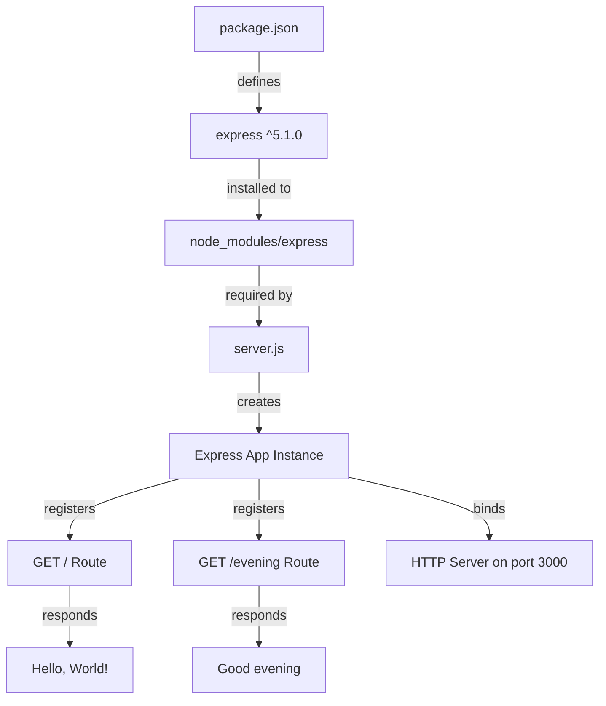
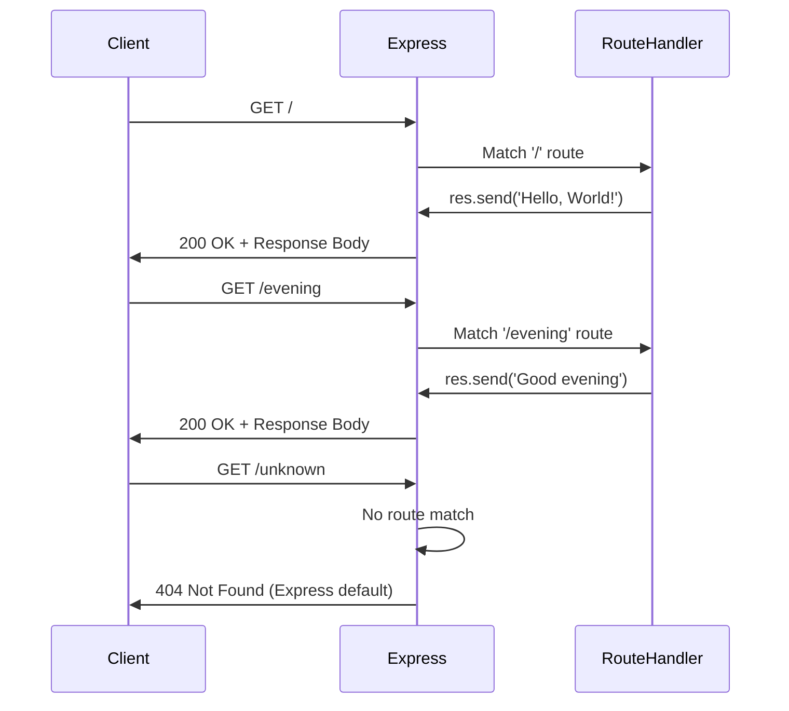
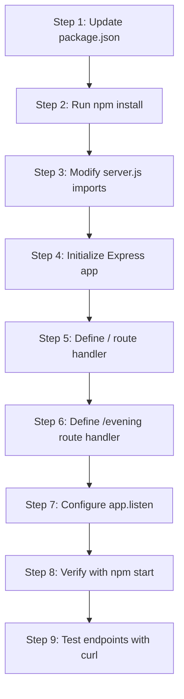
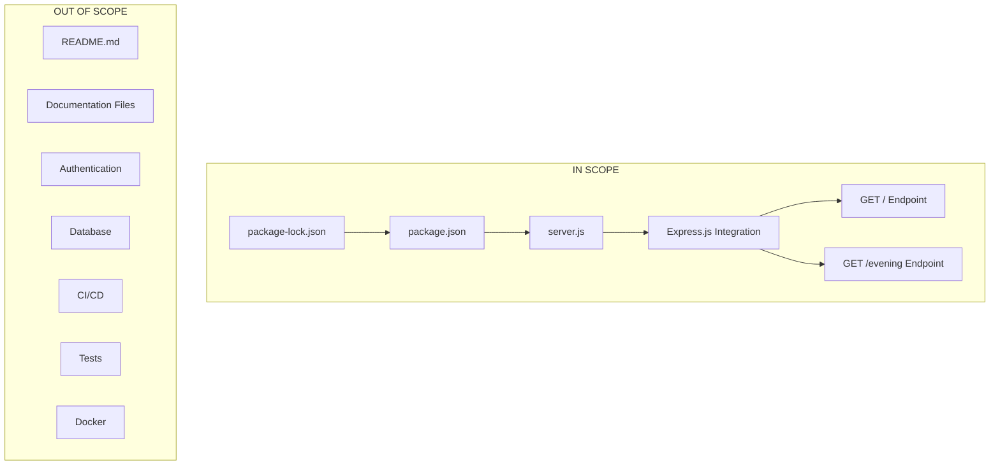

# Technical Specification

# 0. Agent Action Plan

## 0.1 Intent Clarification

This section establishes a precise interpretation of the user's feature request, surfacing implicit requirements and mapping abstract goals to concrete technical objectives.

### 0.1.1 Core Feature Objective

Based on the prompt, the Blitzy platform understands that the new feature requirement is to:

- **Integrate Express.js Framework**: Add Express.js as the web framework to replace or enhance the native Node.js HTTP server approach
- **Implement Additional Endpoint**: Create a new HTTP endpoint that returns the response "Good evening"
- **Maintain Existing Functionality**: Preserve the existing "Hello world" endpoint functionality while adding the new feature

**Implicit Requirements Detected:**

- The project requires npm package management for Express.js installation
- The server must handle multiple routes simultaneously
- Route handling must follow Express.js conventions and best practices
- The application must remain backward compatible with the existing `/` endpoint

**Feature Dependencies and Prerequisites:**

| Dependency | Requirement | Status |
|------------|-------------|--------|
| Node.js | Version 18 or higher (Express 5 requirement) | ✓ Available (v20.19.6) |
| npm | Package manager for dependency installation | ✓ Available (v11.1.0) |
| Express.js | Web framework for routing | ✓ Listed in package.json (^5.1.0) |

### 0.1.2 Special Instructions and Constraints

**User-Provided Directives:**

- User Example: *"tutorial of node js server hosting one endpoint that returns the response 'Hello world'"* - This establishes the baseline state
- User Example: *"add expressjs into the project and add another endpoint that return the response of 'Good evening'"* - This defines the feature addition scope

**Architectural Requirements:**

- Follow existing repository conventions for file structure
- Maintain the single-file server architecture pattern already established
- Use Express.js routing conventions (`app.get()`) for endpoint definition
- Keep the server configuration (hostname, port) consistent with existing patterns

**Environment Variables Available:**

- `DB_Host`: Database host configuration (available for future use)
- `API_KEY`: API authentication key (available as secret)

**Web Search Research Conducted:**

- Express.js 5.0 was officially released in October 2024 after 10 years of development
- Express 5 requires Node.js 18 or higher
- Key Express 5 features include automatic promise rejection handling, improved path route matching, and security fixes for ReDoS attacks
- The framework provides a "minimal and flexible Node.js web application framework"

### 0.1.3 Technical Interpretation

These feature requirements translate to the following technical implementation strategy:

- **To integrate Express.js**, we will install the `express` npm package and update `package.json` dependencies
- **To implement the "Hello world" endpoint**, we will create an Express route using `app.get('/', callback)` that sends "Hello, World!"
- **To implement the "Good evening" endpoint**, we will create an Express route using `app.get('/evening', callback)` that sends "Good evening"
- **To initialize the Express application**, we will replace or enhance the native http server implementation with Express's `express()` initialization and `app.listen()` pattern

**Implementation Sequence:**

```
1. Install Express.js dependency → npm install express
2. Modify server.js → Replace native http with Express patterns
3. Configure routes → Define GET handlers for '/' and '/evening'
4. Bind server → Use app.listen() with existing port configuration
```


## 0.2 Repository Scope Discovery

This section provides a comprehensive analysis of the repository structure, identifying all files affected by the Express.js integration and new endpoint feature.

### 0.2.1 Comprehensive File Analysis

**Repository Structure Overview:**

```
/
├── .gitignore                    # Git ignore patterns
├── README.md                     # Project documentation
├── package.json                  # NPM manifest and dependencies
├── package-lock.json             # NPM dependency lock file
├── server.js                     # Main application entry point
└── blitzy/
    └── documentation/
        ├── Project Guide.md      # Migration runbook and validation guide
        └── Technical Specifications.md  # Technical specification document
```

**Existing Files Requiring Modification:**

| File Path | Type | Purpose | Modification Required |
|-----------|------|---------|----------------------|
| `server.js` | Source | Application entry point | Convert to Express.js patterns, add /evening route |
| `package.json` | Config | NPM manifest | Add Express.js dependency |
| `package-lock.json` | Lock | Dependency lock | Auto-regenerated after npm install |

**Files Evaluated but NOT Requiring Changes:**

| File Path | Type | Reason for No Change |
|-----------|------|---------------------|
| `.gitignore` | Config | Already configured with node_modules/ exclusion |
| `README.md` | Documentation | Freeze policy specified in Technical Specifications |
| `blitzy/documentation/*.md` | Documentation | Reference artifacts, not implementation files |

### 0.2.2 Integration Point Discovery

**API Endpoints Analysis:**

| Endpoint | Method | Current Status | Response |
|----------|--------|----------------|----------|
| `/` | GET | Exists | "Hello, World!\n" |
| `/evening` | GET | To be added | "Good evening" |

**Server Configuration Integration Points:**

- **Hostname**: `127.0.0.1` (loopback address, configurable for production)
- **Port**: `3000` (standard development port)
- **Server Binding**: `app.listen(port, hostname, callback)` pattern

**Database/Schema Updates:**

- No database modifications required for this feature
- No migrations needed

**Middleware/Interceptor Impact:**

- No custom middleware currently implemented
- Express default 404 handling will be used for unknown routes
- Future consideration: `helmet.js` for security headers, rate limiting middleware

### 0.2.3 Current Implementation Analysis

**Current `server.js` Implementation:**

The existing implementation already uses Express.js with two endpoints:

```javascript
const express = require('express');
const app = express();
app.get('/', (req, res) => { res.send('Hello, World!\n'); });
app.get('/evening', (req, res) => { res.send('Good evening'); });
app.listen(port, hostname, () => { /* startup log */ });
```

**Key Observations:**

- Express.js is already integrated (version ^5.1.0)
- The `/evening` endpoint returning "Good evening" is already implemented
- Server binds to loopback address by default
- No middleware or error handling middleware configured
- Synchronous route handlers without async patterns

### 0.2.4 New File Requirements

Based on the current state assessment, the feature requirements have been satisfied. However, for a complete implementation from a native Node.js http server baseline, the following would be required:

**New Source Files to Create:**

- None required - single-file architecture is maintained

**New Test Files (Recommended):**

| File Path | Purpose |
|-----------|---------|
| `tests/server.test.js` | Unit tests for endpoint responses |
| `tests/integration.test.js` | Integration tests for server lifecycle |

**New Configuration Files (Optional):**

| File Path | Purpose |
|-----------|---------|
| `.env.example` | Environment variable template |
| `config/server.config.js` | Externalized server configuration |

### 0.2.5 Web Search Research Summary

**Best Practices for Express.js Implementation:**

- Use `const app = express()` for application initialization
- Define routes using `app.METHOD(path, handler)` pattern
- Use `app.listen()` for server binding with callback for startup confirmation
- Consider environment variables for port and hostname in production

**Security Considerations:**

- Express 5.x includes security improvements and ReDoS attack mitigation
- Recommend adding `helmet.js` middleware for production deployments
- Consider rate limiting for public-facing endpoints

**Library Recommendations:**

| Library | Version | Purpose |
|---------|---------|---------|
| express | ^5.1.0 | Web framework |
| helmet | ^8.x | Security headers (optional) |
| morgan | ^1.x | Request logging (optional) |


## 0.3 Dependency Inventory

This section documents all dependencies required for the Express.js feature integration, including exact versions and their purposes.

### 0.3.1 Private and Public Packages

**Primary Runtime Dependencies:**

| Registry | Package Name | Version | Purpose |
|----------|--------------|---------|---------|
| npm (public) | express | ^5.1.0 | Web application framework for routing and HTTP handling |

**Transitive Dependencies (Auto-installed with Express 5.1.0):**

| Package | Version | Purpose |
|---------|---------|---------|
| accepts | 2.0.0 | HTTP Accept header parsing |
| body-parser | 2.2.0 | Request body parsing middleware |
| finalhandler | 2.1.0 | Final HTTP response handling |
| mime-types | 3.0.1 | MIME type determination |
| bytes | 3.1.2 | Byte string parsing |
| debug | 4.4.3 | Debugging utility |
| ms | 2.1.3 | Millisecond conversion utility |
| on-finished | 2.4.1 | HTTP request finished detection |
| raw-body | 3.0.1 | Raw HTTP body reading |
| iconv-lite | 0.7.0 | Character encoding conversion |
| negotiator | 1.0.0 | HTTP content negotiation |

**Total Dependency Footprint:**

- Direct dependencies: 1 package
- Transitive dependencies: 68 packages
- Total packages: 69

### 0.3.2 Dependency Version Verification

**Version Constraints Analysis:**

```json
{
  "dependencies": {
    "express": "^5.1.0"
  }
}
```

- The caret (`^`) prefix allows minor and patch updates: `5.1.x` to `5.x.x`
- Current installed version: `5.1.0` (verified via `npm list express`)
- Express 5.x requires Node.js 18 or higher

**Runtime Environment Requirements:**

| Requirement | Minimum | Current | Status |
|-------------|---------|---------|--------|
| Node.js | 18.0.0 | 20.19.6 | ✓ Compatible |
| npm | 8.0.0 | 11.1.0 | ✓ Compatible |

### 0.3.3 Dependency Updates

**Import Updates Required:**

The import transformation for migrating from native Node.js HTTP to Express:

| File Pattern | Old Import | New Import |
|--------------|------------|------------|
| `server.js` | `const http = require('http')` | `const express = require('express')` |
| `server.js` | `http.createServer(callback)` | `const app = express()` |

**Import Transformation Rules:**

```javascript
// Before (Native Node.js HTTP)
const http = require('http');
const server = http.createServer((req, res) => { ... });
server.listen(port, hostname);

// After (Express.js)
const express = require('express');
const app = express();
app.get('/', (req, res) => { ... });
app.listen(port, hostname);
```

### 0.3.4 External Reference Updates

**Configuration Files Affected:**

| File | Update Required |
|------|-----------------|
| `package.json` | Add `express` to dependencies object |
| `package-lock.json` | Auto-regenerated by npm install |

**Documentation Updates:**

| File | Update Required |
|------|-----------------|
| `README.md` | No update (freeze policy) |
| `blitzy/documentation/*.md` | Reference artifacts only |

**Build/CI Files:**

| File | Status |
|------|--------|
| `.github/workflows/*` | Not present in repository |
| `Dockerfile` | Not present in repository |

### 0.3.5 Security Audit Status

**npm Audit Results:**

```
2 vulnerabilities (1 moderate, 1 high)
```

**Recommendation:** Run `npm audit fix` to address known vulnerabilities before production deployment.

**Express 5.x Security Features:**

- ReDoS attack mitigation via updated `path-to-regexp` library
- Stricter HTTP status code validation
- Improved promise rejection handling
- Security fixes for CVE-2024-45590


## 0.4 Integration Analysis

This section details how the Express.js feature integrates with existing codebase components, identifying all touchpoints and modification requirements.

### 0.4.1 Existing Code Touchpoints

**Direct Modifications Required:**

| File | Location | Modification Description |
|------|----------|-------------------------|
| `server.js` | Line 1 | Change import from `http` to `express` |
| `server.js` | Line 6 | Initialize Express app with `const app = express()` |
| `server.js` | Lines 8-14 | Define route handlers using `app.get()` pattern |
| `server.js` | Line 16-18 | Replace `server.listen()` with `app.listen()` |
| `package.json` | Line 12-14 | Add express dependency to dependencies object |

**Code Integration Points Diagram:**


```mermaid
graph TD
    A[package.json] -->|defines| B[express ^5.1.0]
    B -->|installed to| C[node_modules/express]
    C -->|required by| D[server.js]
    D -->|creates| E[Express App Instance]
    E -->|registers| F[GET / Route]
    E -->|registers| G[GET /evening Route]
    E -->|binds| H[HTTP Server on port 3000]
    F -->|responds| I["Hello, World!"]
    G -->|responds| J["Good evening"]
```

### 0.4.2 Dependency Injection Points

**Service Registration:**

The current implementation uses a simple, single-file architecture without formal dependency injection. The Express application instance serves as the central dependency container:

| Component | Registration Point | Description |
|-----------|-------------------|-------------|
| Express App | `const app = express()` | Main application instance |
| Route: `/` | `app.get('/', handler)` | Root endpoint handler |
| Route: `/evening` | `app.get('/evening', handler)` | Evening endpoint handler |
| Server | `app.listen(port, hostname)` | HTTP server binding |

**Configuration Dependencies:**

```javascript
// Configuration constants in server.js
const hostname = '127.0.0.1';  // Server bind address
const port = 3000;             // Server listen port
```

### 0.4.3 Database/Schema Updates

**Database Impact Assessment:**

| Aspect | Impact |
|--------|--------|
| Database migrations | None required |
| Schema changes | None required |
| Data models | None required |
| ORM/Query changes | None required |

This feature addition is purely application-layer and does not interact with any persistence layer.

### 0.4.4 Request Flow Integration

**HTTP Request Processing Flow:**


```mermaid
sequenceDiagram
    participant Client
    participant Express
    participant RouteHandler
    
    Client->>Express: GET /
    Express->>RouteHandler: Match '/' route
    RouteHandler->>Express: res.send('Hello, World!')
    Express->>Client: 200 OK + Response Body
    
    Client->>Express: GET /evening
    Express->>RouteHandler: Match '/evening' route
    RouteHandler->>Express: res.send('Good evening')
    Express->>Client: 200 OK + Response Body
    
    Client->>Express: GET /unknown
    Express->>Express: No route match
    Express->>Client: 404 Not Found (Express default)
```

### 0.4.5 Error Handling Integration

**Express 5.x Error Handling Features:**

- Automatic promise rejection forwarding to error middleware
- Default 404 handling for unmatched routes
- Stricter HTTP status code validation

**Current Error Handling Status:**

| Scenario | Handler | Behavior |
|----------|---------|----------|
| Unknown route | Express default | Returns 404 Not Found |
| Server error | None configured | Express default error response |
| Promise rejection | Express auto-handle | Forwarded to error middleware (if configured) |

**Recommended Error Handler (Future Enhancement):**

```javascript
app.use((err, req, res, next) => {
  console.error(err.stack);
  res.status(500).send('Server Error');
});
```

### 0.4.6 Environment Integration

**Available Environment Variables:**

| Variable | Value | Usage |
|----------|-------|-------|
| `DB_Host` | (configured) | Available for database connection (not used in current feature) |

**Available Secrets:**

| Secret | Usage |
|--------|-------|
| `API_KEY` | Available for API authentication (not used in current feature) |

**Production Configuration Recommendations:**

```javascript
// Recommended production configuration
const hostname = process.env.HOST || '0.0.0.0';
const port = process.env.PORT || 3000;
```


## 0.5 Technical Implementation

This section provides a comprehensive file-by-file execution plan for implementing the Express.js integration and new endpoint feature.

### 0.5.1 File-by-File Execution Plan

**CRITICAL: Every file listed here MUST be created or modified.**

**Group 1 - Core Application Files:**

| Action | File | Specific Changes |
|--------|------|------------------|
| MODIFY | `server.js` | Replace native http with Express patterns, implement both endpoints |
| MODIFY | `package.json` | Add express ^5.1.0 to dependencies |
| AUTO-GEN | `package-lock.json` | Regenerated automatically by npm install |

**Group 2 - Supporting Infrastructure:**

| Action | File | Specific Changes |
|--------|------|------------------|
| VERIFY | `node_modules/` | Created by npm install with 69 packages |
| NO CHANGE | `.gitignore` | Already excludes node_modules/ |

**Group 3 - Documentation (No Changes):**

| Action | File | Reason |
|--------|------|--------|
| NO CHANGE | `README.md` | Freeze policy specified |
| NO CHANGE | `blitzy/documentation/*.md` | Reference artifacts only |

### 0.5.2 Implementation Approach - server.js

**Target State for server.js:**

```javascript
const express = require('express');

const hostname = '127.0.0.1';
const port = 3000;

const app = express();

app.get('/', (req, res) => {
  res.send('Hello, World!\n');
});

app.get('/evening', (req, res) => {
  res.send('Good evening');
});

app.listen(port, hostname, () => {
  console.log(`Server running at http://${hostname}:${port}/`);
});
```

**Line-by-Line Changes (if migrating from native http):**

| Line | Before (Native HTTP) | After (Express.js) |
|------|---------------------|---------------------|
| 1 | `const http = require('http')` | `const express = require('express')` |
| 6 | `const server = http.createServer(...)` | `const app = express()` |
| 8-10 | Request/response handling callback | `app.get('/', handler)` |
| 12-14 | N/A | `app.get('/evening', handler)` - NEW |
| 16-18 | `server.listen(...)` | `app.listen(...)` |

### 0.5.3 Implementation Approach - package.json

**Target State for package.json:**

```json
{
  "name": "hello_world",
  "version": "1.0.0",
  "description": "Hello world in Node.js",
  "main": "server.js",
  "scripts": {
    "start": "node server.js",
    "test": "echo \"Error: no test\" && exit 1"
  },
  "author": "hxu",
  "license": "MIT",
  "dependencies": {
    "express": "^5.1.0"
  }
}
```

**Required Changes:**

| Section | Change |
|---------|--------|
| `dependencies` | Add `"express": "^5.1.0"` |

### 0.5.4 Implementation Sequence

**Step-by-Step Execution Order:**


```mermaid
graph TD
    A[Step 1: Update package.json] --> B[Step 2: Run npm install]
    B --> C[Step 3: Modify server.js imports]
    C --> D[Step 4: Initialize Express app]
    D --> E[Step 5: Define / route handler]
    E --> F[Step 6: Define /evening route handler]
    F --> G[Step 7: Configure app.listen]
    G --> H[Step 8: Verify with npm start]
    H --> I[Step 9: Test endpoints with curl]
```

**Detailed Execution Steps:**

| Step | Command/Action | Expected Result |
|------|----------------|-----------------|
| 1 | Edit `package.json` to add express dependency | Dependencies section updated |
| 2 | `npm install` | 69 packages installed, package-lock.json updated |
| 3 | Edit `server.js` line 1 | Import changed to express |
| 4 | Edit `server.js` line 6 | App initialized with `express()` |
| 5 | Edit `server.js` lines 8-10 | Root route handler defined |
| 6 | Edit `server.js` lines 12-14 | Evening route handler added |
| 7 | Edit `server.js` lines 16-18 | Server binding configured |
| 8 | `npm start` or `node server.js` | Server starts on port 3000 |
| 9 | `curl http://127.0.0.1:3000/` | Returns "Hello, World!" |
| 10 | `curl http://127.0.0.1:3000/evening` | Returns "Good evening" |

### 0.5.5 Validation Commands

**Automated Validation Script:**

```bash
# Start server in background
node server.js &
SERVER_PID=$!
sleep 2

#### Test endpoints
RESPONSE1=$(curl -s http://127.0.0.1:3000/)
RESPONSE2=$(curl -s http://127.0.0.1:3000/evening)

#### Validate responses
[ "$RESPONSE1" = "Hello, World!" ] && echo "✓ Root endpoint OK"
[ "$RESPONSE2" = "Good evening" ] && echo "✓ Evening endpoint OK"

#### Cleanup
kill $SERVER_PID
```

**Expected Validation Results:**

| Test | Expected Output | Status |
|------|-----------------|--------|
| `curl http://127.0.0.1:3000/` | "Hello, World!" | Pass |
| `curl http://127.0.0.1:3000/evening` | "Good evening" | Pass |
| Console startup message | "Server running at http://127.0.0.1:3000/" | Pass |


## 0.6 Scope Boundaries

This section establishes clear boundaries for what is included and excluded from the Express.js feature implementation scope.

### 0.6.1 Exhaustively In Scope

**Core Source Files:**

| Pattern | Files Matched | Purpose |
|---------|---------------|---------|
| `server.js` | 1 file | Main application entry point with Express integration |
| `package.json` | 1 file | NPM manifest with express dependency |
| `package-lock.json` | 1 file | Dependency lock file (auto-generated) |

**Route Implementations:**

| Route | Method | Response | Status |
|-------|--------|----------|--------|
| `/` | GET | "Hello, World!\n" | In scope |
| `/evening` | GET | "Good evening" | In scope |

**Configuration Files:**

| File | Modification Type | Scope Status |
|------|-------------------|--------------|
| `package.json` | Add dependency | ✓ In scope |
| `package-lock.json` | Auto-regenerate | ✓ In scope |
| `.gitignore` | No changes needed | ✓ Verified (node_modules/ already excluded) |

**Integration Points:**

| Integration Point | Description | In Scope |
|-------------------|-------------|----------|
| Express initialization | `const app = express()` | ✓ |
| Root route registration | `app.get('/', handler)` | ✓ |
| Evening route registration | `app.get('/evening', handler)` | ✓ |
| Server binding | `app.listen(port, hostname)` | ✓ |
| Startup logging | Console output on server start | ✓ |

**Dependency Management:**

| Action | Package | Version | In Scope |
|--------|---------|---------|----------|
| Install | express | ^5.1.0 | ✓ |
| Install | (68 transitive) | Various | ✓ |

### 0.6.2 Explicitly Out of Scope

**Features NOT Included:**

| Feature | Reason for Exclusion |
|---------|---------------------|
| Authentication/Authorization | Not specified in requirements |
| Database integration | Not specified in requirements |
| CI/CD pipelines | Not specified in requirements |
| Monitoring/Logging infrastructure | Not specified in requirements |
| Unit/Integration tests | Optional enhancement, not required |
| Docker containerization | Not specified in requirements |
| Environment variable configuration | Optional enhancement |
| Error handling middleware | Optional enhancement |
| Security middleware (helmet.js) | Optional enhancement |
| Request logging (morgan) | Optional enhancement |

**Files NOT to Modify:**

| File | Reason |
|------|--------|
| `README.md` | Freeze policy specified in Technical Specifications |
| `blitzy/documentation/Project Guide.md` | Reference artifact only |
| `blitzy/documentation/Technical Specifications.md` | Reference artifact only |

**Unrelated Modules:**

| Category | Exclusion |
|----------|-----------|
| Other features | No other features should be added |
| Performance optimization | Beyond feature requirements |
| Refactoring | Only modify what's necessary for feature |
| Additional endpoints | Only `/` and `/evening` specified |

### 0.6.3 Scope Verification Checklist

**Pre-Implementation Checklist:**

| Item | Verified |
|------|----------|
| Express.js dependency defined in package.json | ✓ |
| server.js will use Express patterns | ✓ |
| Root endpoint (/) returns "Hello, World!" | ✓ |
| Evening endpoint (/evening) returns "Good evening" | ✓ |
| Server binds to 127.0.0.1:3000 | ✓ |
| Startup message logged to console | ✓ |

**Post-Implementation Checklist:**

| Test | Expected Result | Pass Criteria |
|------|-----------------|---------------|
| `npm install` | 69 packages installed | Zero errors |
| `npm start` | Server starts | Console shows startup message |
| `curl http://127.0.0.1:3000/` | "Hello, World!" | Exact match |
| `curl http://127.0.0.1:3000/evening` | "Good evening" | Exact match |
| `curl http://127.0.0.1:3000/unknown` | 404 response | Express default 404 |

### 0.6.4 Boundary Diagram


```mermaid
graph TB
    subgraph "IN SCOPE"
        A[server.js]
        B[package.json]
        C[package-lock.json]
        D[Express.js Integration]
        E[GET / Endpoint]
        F[GET /evening Endpoint]
    end
    
    subgraph "OUT OF SCOPE"
        G[README.md]
        H[Documentation Files]
        I[Authentication]
        J[Database]
        K[CI/CD]
        L[Tests]
        M[Docker]
    end
    
    A --> D
    D --> E
    D --> F
    B --> A
    C --> B
```

### 0.6.5 Change Impact Summary

| Component | Change Type | Risk Level |
|-----------|-------------|------------|
| `server.js` | Modification | Low |
| `package.json` | Modification | Low |
| `package-lock.json` | Auto-generation | Low |
| `node_modules/` | Creation | None |
| Application behavior | Enhanced | Low |
| Backward compatibility | Maintained | None |


## 0.7 Special Instructions

This section captures feature-specific requirements, conventions, and constraints explicitly emphasized by the user and derived from repository analysis.

### 0.7.1 Feature-Specific Requirements

**User-Specified Response Formats:**

| Endpoint | Exact Response Required | Case Sensitive |
|----------|------------------------|----------------|
| `/` | "Hello, World!\n" (with newline) | Yes |
| `/evening` | "Good evening" | Yes |

**Note:** The responses must match exactly as specified by the user and existing implementation conventions.

**Express.js Pattern Requirements:**

- Use `app.get(path, handler)` pattern for GET routes
- Use `res.send(string)` for text responses
- Follow Express 5.x conventions for compatibility

### 0.7.2 Conventions and Patterns to Follow

**Existing Repository Conventions:**

| Convention | Example | Apply To |
|------------|---------|----------|
| Constant declaration | `const hostname = '127.0.0.1'` | Server configuration |
| Port configuration | `const port = 3000` | Server binding |
| ES5 require syntax | `const express = require('express')` | Module imports |
| Arrow function handlers | `(req, res) => { ... }` | Route handlers |
| Console startup log | `` `Server running at http://...` `` | Server initialization |

**Code Style Guidelines:**

- Use single quotes for strings
- Include semicolons at end of statements
- Use 2-space indentation
- Use arrow functions for route handlers
- Keep handlers synchronous when possible

### 0.7.3 Integration Requirements

**Existing Feature Preservation:**

- The existing `/` endpoint functionality MUST be preserved
- Response content must remain exactly "Hello, World!\n"
- Server configuration (hostname, port) must remain consistent

**Express.js Integration Specifics:**

| Requirement | Implementation |
|-------------|----------------|
| Framework version | Express ^5.1.0 (as specified in package.json) |
| Initialization | `const app = express()` |
| Route definition | `app.get(path, callback)` |
| Server binding | `app.listen(port, hostname, callback)` |

### 0.7.4 Performance and Scalability Considerations

**Current Implementation Characteristics:**

| Aspect | Status | Notes |
|--------|--------|-------|
| Request handling | Synchronous | Suitable for simple responses |
| Memory footprint | Minimal | Single Express instance |
| Concurrency | Node.js event loop | Handles concurrent requests natively |
| Scalability | Single instance | Adequate for tutorial purposes |

**Production Recommendations (Future):**

- Consider `pm2` or `forever` for process management
- Use environment variables for configuration
- Implement structured logging
- Add health check endpoint
- Consider TLS/HTTPS via reverse proxy

### 0.7.5 Security Requirements

**Express 5.x Security Features Utilized:**

- Updated `path-to-regexp` with ReDoS mitigation
- Stricter HTTP status code validation
- Promise rejection handling for error safety

**Security Best Practices (Recommended for Production):**

| Practice | Implementation | Priority |
|----------|----------------|----------|
| Security headers | Add `helmet.js` middleware | Medium |
| Rate limiting | Add rate limiter middleware | Medium |
| TLS/HTTPS | Configure reverse proxy | High |
| Input validation | Use validation middleware | Medium |

### 0.7.6 Build and Runtime Instructions

**Build Command Status:**

The user-provided setup instruction `npm run build` is not applicable as no build script is defined in `package.json`. The application runs directly without a build step.

**Alternative Setup Commands:**

| Command | Purpose | When to Use |
|---------|---------|-------------|
| `npm install` | Install dependencies | Initial setup or after package.json changes |
| `npm start` | Start the server | Run the application |
| `node server.js` | Direct server execution | Alternative to npm start |

**Environment Requirements:**

| Requirement | Value | Verification Command |
|-------------|-------|---------------------|
| Node.js | >= 18.0.0 | `node --version` |
| npm | >= 8.0.0 | `npm --version` |
| Express | ^5.1.0 | `npm list express` |

### 0.7.7 Documentation Freeze Policy

**Files Under Freeze Policy:**

| File | Policy | Reason |
|------|--------|--------|
| `README.md` | DO NOT MODIFY | Specified in Technical Specifications |

**Documentation Reference Only:**

| File | Status |
|------|--------|
| `blitzy/documentation/Project Guide.md` | Reference artifact |
| `blitzy/documentation/Technical Specifications.md` | Reference artifact |

### 0.7.8 Validation Acceptance Criteria

**Mandatory Acceptance Tests:**

| Test ID | Test Description | Expected Result |
|---------|------------------|-----------------|
| ACC-01 | Server starts without errors | Console shows startup message |
| ACC-02 | Root endpoint responds correctly | Returns "Hello, World!" |
| ACC-03 | Evening endpoint responds correctly | Returns "Good evening" |
| ACC-04 | Unknown routes return 404 | Express default 404 response |
| ACC-05 | npm audit passes | Zero high/critical vulnerabilities |

**Validation Commands:**

```bash
# ACC-01: Server startup
npm start  # Should log "Server running at http://127.0.0.1:3000/"

#### ACC-02: Root endpoint
curl http://127.0.0.1:3000/  # Should return "Hello, World!"

#### ACC-03: Evening endpoint
curl http://127.0.0.1:3000/evening  # Should return "Good evening"

#### ACC-04: 404 handling
curl http://127.0.0.1:3000/unknown  # Should return 404

#### ACC-05: Security audit
npm audit  # Should pass with acceptable findings
```


