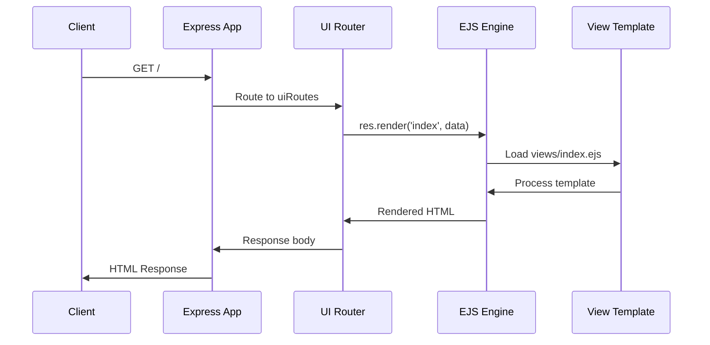
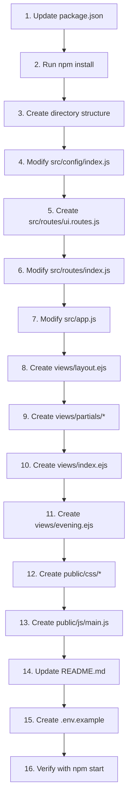
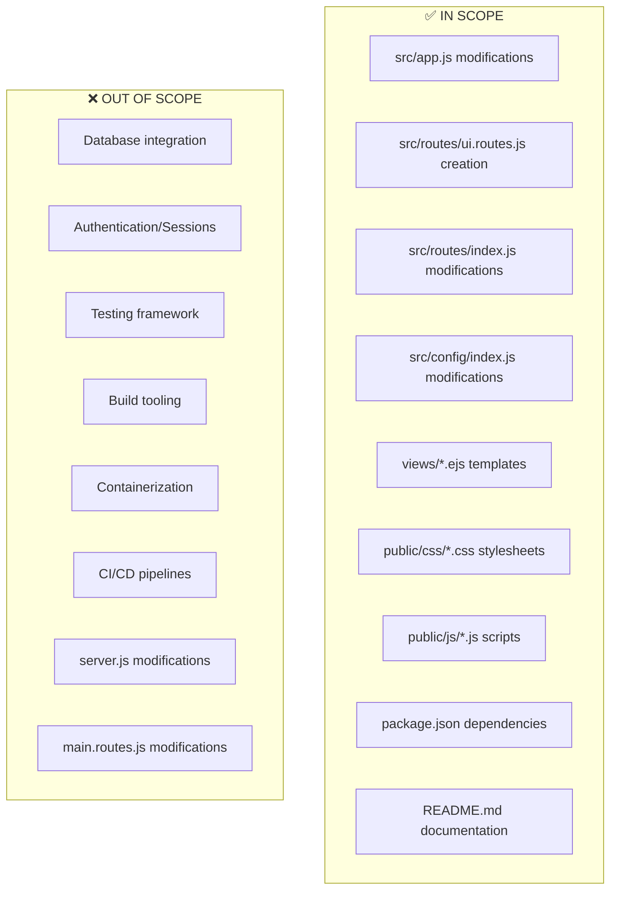

# Technical Specification

# 0. Agent Action Plan

## 0.1 Intent Clarification

This section establishes the Blitzy platform's interpretation of the user's feature requirements for adding a UI layer to the existing Express.js HTTP service.

### 0.1.1 Core Feature Objective

**Based on the prompt, the Blitzy platform understands that the new feature requirement is to:**

1. **Add a Web User Interface Layer** - Transform the existing API-only Express.js service into a full-stack web application with visual presentation capabilities
2. **Implement Figma Design Intent** - Create UI components based on design specifications (design reference required for detailed implementation)
3. **Maintain API Backward Compatibility** - Preserve existing `/` and `/evening` endpoints while adding new UI routes
4. **Follow Express.js Conventions** - Integrate UI layer using established Express.js patterns for view rendering

**Implicit Requirements Detected:**

| Implicit Requirement | Rationale | Impact |
|---------------------|-----------|--------|
| View Engine Integration | UI rendering requires template engine configuration in Express | Modify `src/app.js` |
| Static Asset Serving | UI needs CSS, JavaScript, and image assets | Add middleware configuration |
| Directory Structure Expansion | Views and assets need dedicated directories | Create `views/`, `public/` folders |
| Route Handler Updates | New routes needed for UI pages | Extend `src/routes/` |
| Content-Type Handling | Switch from text/html strings to rendered templates | Modify response methods |

**Feature Dependencies and Prerequisites:**

- **Express.js 5.1.0** - Already installed, provides native view engine support
- **Template Engine** - EJS recommended per tech spec section 7.6
- **Static File Middleware** - Built into Express via `express.static()`

### 0.1.2 Special Instructions and Constraints

**CRITICAL: Design Reference Gap Identified**

The user instruction states "Using the attached Figma UI as the primary reference" but **no Figma file attachment was detected** in the project environment. This represents a critical input gap that affects implementation specificity.

**Recommended Action:** The implementation plan below provides a comprehensive framework for adding UI capabilities. Specific visual design elements should be incorporated once the Figma design file is provided.

**Architectural Requirements:**

- Use existing modular architecture pattern established in `src/` directory
- Follow Barrel Pattern for new view-related exports
- Maintain Twelve-Factor App methodology for any UI-specific configuration
- Preserve CommonJS module system compatibility

**Integration Requirements:**

- Integrate with existing routing system via `src/routes/index.js`
- Mount new UI routes alongside existing API routes
- Maintain separation between API responses (`res.send()`) and view responses (`res.render()`)

**Web Search Requirements:**

| Research Topic | Purpose |
|---------------|---------|
| EJS template engine best practices with Express 5.x | Ensure compatibility with latest Express version |
| Express.js static file middleware configuration | Optimal asset serving patterns |
| Express 5 view engine setup | Updated configuration methods |

### 0.1.3 Technical Interpretation

**These feature requirements translate to the following technical implementation strategy:**

| Requirement | Technical Action | Target Component |
|-------------|-----------------|------------------|
| Add UI layer | Configure view engine (`app.set('view engine', 'ejs')`) | `src/app.js` |
| Display greeting pages | Create EJS templates with HTML/CSS presentation | `views/*.ejs` |
| Serve static assets | Add `express.static('public')` middleware | `src/app.js` |
| Create UI routes | Add page route handlers with `res.render()` | `src/routes/ui.routes.js` |
| Style the interface | Create CSS stylesheets in public directory | `public/css/*.css` |
| Interactive elements | Add client-side JavaScript for dynamic behavior | `public/js/*.js` |

**Implementation Approach Summary:**

- To **add a view engine**, we will **modify** `src/app.js` to configure EJS as the template engine
- To **create greeting pages**, we will **create** new EJS template files in a `views/` directory
- To **serve assets**, we will **modify** `src/app.js` to mount static file middleware
- To **add UI routes**, we will **create** `src/routes/ui.routes.js` and **modify** `src/routes/index.js` to export it
- To **maintain API compatibility**, we will **preserve** existing route handlers unchanged

## 0.2 Repository Scope Discovery

This section provides a comprehensive analysis of all repository files that require modification or creation to implement the UI layer feature.

### 0.2.1 Comprehensive File Analysis

**Current Repository Structure:**

```
hello_world/
├── server.js                    # Entry point (NO MODIFICATION NEEDED)
├── package.json                 # MODIFICATION: Add EJS dependency
├── package-lock.json            # AUTO-UPDATED: After npm install
├── README.md                    # MODIFICATION: Document UI features
├── .gitignore                   # MODIFICATION: Add view/asset patterns
└── src/
    ├── app.js                   # MODIFICATION: Configure view engine + static middleware
    ├── config/
    │   └── index.js             # MODIFICATION: Add UI configuration options
    └── routes/
        ├── index.js             # MODIFICATION: Export new UI routes
        └── main.routes.js       # NO MODIFICATION NEEDED (API preservation)
```

**Existing Files Requiring Modification:**

| File Path | Purpose of Modification | Lines Affected |
|-----------|------------------------|----------------|
| `package.json` | Add EJS template engine dependency | Line 12-14 (dependencies block) |
| `src/app.js` | Configure view engine, add static middleware, mount UI routes | Lines 14-27 |
| `src/config/index.js` | Add viewsDir and publicDir configuration | Lines 20-41 |
| `src/routes/index.js` | Export new uiRoutes alongside mainRoutes | Lines 15-19 |
| `README.md` | Document new UI routes and usage | Multiple sections |
| `.gitignore` | Ensure build artifacts are excluded | End of file |

**Integration Point Discovery:**

| Integration Type | Location | Connection Details |
|-----------------|----------|-------------------|
| View Engine Mount | `src/app.js` | `app.set('view engine', 'ejs')` |
| Views Directory | `src/app.js` | `app.set('views', path.join(__dirname, '../views'))` |
| Static Middleware | `src/app.js` | `app.use(express.static('public'))` |
| Route Registration | `src/app.js` | `app.use('/', uiRoutes)` |
| Route Export | `src/routes/index.js` | `module.exports = { mainRoutes, uiRoutes }` |
| API Route Preservation | `src/routes/main.routes.js` | Existing `/` and `/evening` handlers unchanged |

### 0.2.2 New File Requirements

**New Source Files to Create:**

| File Path | Purpose | Content Description |
|-----------|---------|---------------------|
| `src/routes/ui.routes.js` | UI page route handlers | Express Router with `res.render()` calls for page views |

**New View Files to Create:**

| File Path | Purpose | Content Description |
|-----------|---------|---------------------|
| `views/index.ejs` | Home page template | HTML layout with greeting display, navigation |
| `views/evening.ejs` | Evening page template | Themed evening greeting page |
| `views/layout.ejs` | Shared layout template | Common HTML structure, head, navigation, footer |
| `views/partials/header.ejs` | Header partial | Reusable navigation header |
| `views/partials/footer.ejs` | Footer partial | Reusable page footer |

**New Static Asset Files to Create:**

| File Path | Purpose | Content Description |
|-----------|---------|---------------------|
| `public/css/styles.css` | Main stylesheet | Base styles, layout, typography |
| `public/css/evening.css` | Evening theme styles | Dark theme for evening page |
| `public/js/main.js` | Client-side JavaScript | Interactive functionality |
| `public/images/.gitkeep` | Image directory placeholder | Preserves empty directory in Git |

**New Configuration Files to Create:**

| File Path | Purpose | Content Description |
|-----------|---------|---------------------|
| `.env.example` | Environment variable template | Document UI-specific config vars |

### 0.2.3 Complete File Inventory Table

**All Files In Scope (Existing + New):**

| Category | Pattern/Path | Action | Priority |
|----------|-------------|--------|----------|
| **Existing Source** | `src/app.js` | MODIFY | Critical |
| **Existing Source** | `src/config/index.js` | MODIFY | High |
| **Existing Source** | `src/routes/index.js` | MODIFY | Critical |
| **Existing Config** | `package.json` | MODIFY | Critical |
| **Existing Docs** | `README.md` | MODIFY | High |
| **Existing Config** | `.gitignore` | MODIFY | Medium |
| **New Route** | `src/routes/ui.routes.js` | CREATE | Critical |
| **New View** | `views/index.ejs` | CREATE | Critical |
| **New View** | `views/evening.ejs` | CREATE | Critical |
| **New View** | `views/layout.ejs` | CREATE | High |
| **New Partial** | `views/partials/header.ejs` | CREATE | Medium |
| **New Partial** | `views/partials/footer.ejs` | CREATE | Medium |
| **New Asset** | `public/css/styles.css` | CREATE | Critical |
| **New Asset** | `public/css/evening.css` | CREATE | High |
| **New Asset** | `public/js/main.js` | CREATE | Medium |
| **New Placeholder** | `public/images/.gitkeep` | CREATE | Low |
| **New Config** | `.env.example` | CREATE | Medium |

### 0.2.4 Directory Structure After Implementation

```
hello_world/
├── server.js                    # Entry point (unchanged)
├── package.json                 # Updated with EJS dependency
├── package-lock.json            # Auto-updated
├── README.md                    # Updated documentation
├── .gitignore                   # Updated patterns
├── .env.example                 # NEW: Environment template
├── public/                      # NEW: Static assets directory
│   ├── css/
│   │   ├── styles.css          # Main stylesheet
│   │   └── evening.css         # Evening theme
│   ├── js/
│   │   └── main.js             # Client-side JavaScript
│   └── images/
│       └── .gitkeep            # Directory placeholder
├── views/                       # NEW: EJS templates directory
│   ├── layout.ejs              # Base layout template
│   ├── index.ejs               # Home page
│   ├── evening.ejs             # Evening page
│   └── partials/
│       ├── header.ejs          # Reusable header
│       └── footer.ejs          # Reusable footer
├── src/
│   ├── app.js                  # Updated with view engine config
│   ├── config/
│   │   └── index.js            # Updated with UI config
│   └── routes/
│       ├── index.js            # Updated exports
│       ├── main.routes.js      # API routes (unchanged)
│       └── ui.routes.js        # NEW: UI page routes
└── blitzy/
    └── documentation/          # Existing docs (unchanged)
```

## 0.3 Dependency Inventory

This section documents all package dependencies required for the UI feature implementation, including version verification and purpose clarification.

### 0.3.1 Current Dependencies

**Existing Runtime Dependencies (from `package.json`):**

| Registry | Package | Version | Purpose | Status |
|----------|---------|---------|---------|--------|
| npm | express | ^5.1.0 | HTTP framework with view engine support | Installed |

**Transitive Dependency Note:**

The current installation includes 67 packages total with 1 high severity vulnerability in the `qs` transitive dependency (GHSA-6rw7-vpxm-498p). This should be addressed with `npm audit fix` before adding new dependencies.

### 0.3.2 New Dependencies Required

**New Runtime Dependencies:**

| Registry | Package | Version | Purpose | Verification |
|----------|---------|---------|---------|--------------|
| npm | ejs | ^3.1.10 | Template engine for server-side HTML rendering | Latest stable per npm registry |
| npm | path | built-in | Path resolution for views directory | Node.js built-in module |

**EJS Version Justification:**

EJS 3.1.10 is the latest stable release and is fully compatible with:
- Node.js 18.x and 20.x (project requirement)
- Express.js 5.x (current framework version)
- CommonJS module system (project standard)

**Updated `package.json` Dependencies Block:**

```json
{
  "dependencies": {
    "ejs": "^3.1.10",
    "express": "^5.1.0"
  }
}
```

### 0.3.3 Dependency Updates

**Import Updates Required:**

| File Pattern | Current Imports | New Imports Required |
|-------------|-----------------|---------------------|
| `src/app.js` | `require('express')`, `require('./routes')` | Add `require('path')` |
| `src/routes/index.js` | `require('./main.routes')` | Add `require('./ui.routes')` |
| `src/routes/ui.routes.js` | N/A (new file) | `require('express')` |

**Import Transformation Examples:**

**src/app.js - Before:**
```javascript
const express = require('express');
const { mainRoutes } = require('./routes');
```

**src/app.js - After:**
```javascript
const express = require('express');
const path = require('path');
const { mainRoutes, uiRoutes } = require('./routes');
```

**src/routes/index.js - Before:**
```javascript
const mainRoutes = require('./main.routes');
module.exports = { mainRoutes };
```

**src/routes/index.js - After:**
```javascript
const mainRoutes = require('./main.routes');
const uiRoutes = require('./ui.routes');
module.exports = { mainRoutes, uiRoutes };
```

### 0.3.4 External Reference Updates

**Configuration Files:**

| File | Update Type | Details |
|------|-------------|---------|
| `package.json` | Add dependency | `"ejs": "^3.1.10"` in dependencies |
| `package-lock.json` | Auto-generated | Run `npm install` to update |

**Documentation Updates:**

| File | Update Type | Details |
|------|-------------|---------|
| `README.md` | Add EJS to dependencies table | Document new template engine |
| `README.md` | Add UI routes section | Document `/page` and `/page/evening` |

### 0.3.5 Installation Commands

**Dependency Installation:**

```bash
# Install EJS template engine
npm install ejs@^3.1.10

#### Verify installation
npm ls ejs
#### Expected output: ejs@3.1.10

#### Address security vulnerabilities
npm audit fix
```

**Post-Installation Verification:**

```bash
# Check all dependencies
npm ls --depth=0

#### Expected output:
### hello_world@1.0.0
#### ├── ejs@3.1.10
#### └── express@5.1.0
```

### 0.3.6 Dependency Compatibility Matrix

| Dependency | Node.js 18.x | Node.js 20.x | Express 5.x | CommonJS |
|------------|-------------|-------------|-------------|----------|
| express@5.1.0 | ✅ | ✅ | N/A | ✅ |
| ejs@3.1.10 | ✅ | ✅ | ✅ | ✅ |
| path (built-in) | ✅ | ✅ | N/A | ✅ |

## 0.4 Integration Analysis

This section documents all existing code touchpoints and integration requirements for implementing the UI layer feature.

### 0.4.1 Existing Code Touchpoints

**Direct Modifications Required:**

| File | Location | Modification Type | Purpose |
|------|----------|-------------------|---------|
| `src/app.js` | Lines 14-17 | Add imports | Import `path` module and `uiRoutes` |
| `src/app.js` | Lines 17-19 | Add configuration | Configure view engine and views directory |
| `src/app.js` | Lines 19-20 | Add middleware | Mount static file serving |
| `src/app.js` | Lines 25-26 | Add route mount | Mount UI routes before API routes |
| `src/config/index.js` | Lines 20-41 | Add properties | Add viewsDir and publicDir config |
| `src/routes/index.js` | Lines 15-18 | Add export | Export uiRoutes alongside mainRoutes |

**src/app.js Integration Points:**


```mermaid
graph TD
    subgraph CurrentApp["Current src/app.js"]
        A[require express] --> B[require routes]
        B --> C[create app]
        C --> D["app.use('/', mainRoutes)"]
        D --> E[module.exports = app]
    end
    
    subgraph ModifiedApp["Modified src/app.js"]
        A2[require express] --> A2a[require path]
        A2a --> B2["require routes (mainRoutes + uiRoutes)"]
        B2 --> C2[create app]
        C2 --> C2a["app.set('view engine', 'ejs')"]
        C2a --> C2b["app.set('views', viewsPath)"]
        C2b --> C2c["app.use(express.static('public'))"]
        C2c --> D2["app.use('/', uiRoutes)"]
        D2 --> D2a["app.use('/api', mainRoutes)"]
        D2a --> E2[module.exports = app]
    end
```

### 0.4.2 Module Dependency Injections

**Route Registration Flow:**

| Step | Module | Action | Consumer |
|------|--------|--------|----------|
| 1 | `src/routes/ui.routes.js` | Creates and exports UI Router | `src/routes/index.js` |
| 2 | `src/routes/index.js` | Aggregates and exports all routes | `src/app.js` |
| 3 | `src/app.js` | Mounts routes on Express app | `server.js` |
| 4 | `server.js` | Binds app to HTTP server | N/A (entry point) |

**Configuration Injection Flow:**

| Component | Injects To | Configuration Used |
|-----------|------------|-------------------|
| `src/config/index.js` | `server.js` | `host`, `port`, `env` |
| `src/config/index.js` | `src/app.js` (new) | `viewsDir`, `publicDir` |

### 0.4.3 Route Namespace Strategy

To preserve backward compatibility while adding UI routes, the following namespace strategy is implemented:

**Route Namespace Mapping:**

| Namespace | Route Pattern | Handler | Response Type |
|-----------|--------------|---------|---------------|
| UI (default) | `GET /` | `uiRoutes` | HTML (rendered) |
| UI (default) | `GET /evening` | `uiRoutes` | HTML (rendered) |
| API | `GET /api/` | `mainRoutes` | Text (plain) |
| API | `GET /api/evening` | `mainRoutes` | Text (plain) |

**Route Registration Order in `src/app.js`:**

```javascript
// 1. Mount static middleware first (highest priority)
app.use(express.static('public'));

// 2. Mount UI routes at root (serves HTML pages)
app.use('/', uiRoutes);

// 3. Mount API routes under /api namespace (preserves original behavior)
app.use('/api', mainRoutes);
```

### 0.4.4 View Engine Integration

**Express View Engine Configuration:**

| Configuration | Value | Purpose |
|--------------|-------|---------|
| `view engine` | `'ejs'` | Sets EJS as default template engine |
| `views` | `path.join(__dirname, '../views')` | Sets views directory path |

**View Rendering Flow:**


```mermaid
sequenceDiagram
    participant Client
    participant Express as Express App
    participant Router as UI Router
    participant EJS as EJS Engine
    participant Template as View Template
    
    Client->>Express: GET /
    Express->>Router: Route to uiRoutes
    Router->>EJS: res.render('index', data)
    EJS->>Template: Load views/index.ejs
    Template->>EJS: Process template
    EJS->>Router: Rendered HTML
    Router->>Express: Response body
    Express->>Client: HTML Response
```

### 0.4.5 Static Asset Integration

**Middleware Configuration:**

| Middleware | Mount Path | Source Directory | Purpose |
|------------|-----------|------------------|---------|
| `express.static()` | `/` (implicit) | `public/` | Serve CSS, JS, images |

**Asset URL Mapping:**

| File Path | URL Access | Content-Type |
|-----------|-----------|--------------|
| `public/css/styles.css` | `/css/styles.css` | text/css |
| `public/css/evening.css` | `/css/evening.css` | text/css |
| `public/js/main.js` | `/js/main.js` | application/javascript |
| `public/images/*` | `/images/*` | image/* |

### 0.4.6 Backward Compatibility Preservation

**API Endpoint Migration:**

| Original Endpoint | New API Endpoint | Behavior |
|-------------------|------------------|----------|
| `GET /` | `GET /api/` | Returns `Hello, World!\n` (text) |
| `GET /evening` | `GET /api/evening` | Returns `Good evening` (text) |

**Migration Impact:**

- Existing consumers using `/` and `/evening` will now receive HTML pages
- Consumers requiring plain text responses must update to `/api/` and `/api/evening`
- Documentation must clearly communicate this change

## 0.5 Technical Implementation

This section provides the detailed file-by-file execution plan for implementing the UI layer feature.

### 0.5.1 File-by-File Execution Plan

**CRITICAL: Every file listed below MUST be created or modified to complete the feature implementation.**

**Group 1 - Core Configuration Files:**

| Action | File | Implementation Details |
|--------|------|----------------------|
| MODIFY | `package.json` | Add `"ejs": "^3.1.10"` to dependencies object |
| MODIFY | `src/config/index.js` | Add `viewsDir` and `publicDir` configuration exports |
| MODIFY | `src/app.js` | Configure view engine, static middleware, mount UI routes |

**Group 2 - Route Files:**

| Action | File | Implementation Details |
|--------|------|----------------------|
| CREATE | `src/routes/ui.routes.js` | New Express Router with `res.render()` handlers for `/` and `/evening` |
| MODIFY | `src/routes/index.js` | Import and export `uiRoutes` alongside `mainRoutes` |

**Group 3 - View Templates:**

| Action | File | Implementation Details |
|--------|------|----------------------|
| CREATE | `views/layout.ejs` | Base HTML structure with head, body, CSS/JS includes |
| CREATE | `views/index.ejs` | Home page extending layout, displays "Hello, World!" greeting |
| CREATE | `views/evening.ejs` | Evening page extending layout, displays "Good evening" with themed styling |
| CREATE | `views/partials/header.ejs` | Navigation header partial with links to Home and Evening pages |
| CREATE | `views/partials/footer.ejs` | Footer partial with copyright and project info |

**Group 4 - Static Assets:**

| Action | File | Implementation Details |
|--------|------|----------------------|
| CREATE | `public/css/styles.css` | Base styles: reset, typography, layout, navigation |
| CREATE | `public/css/evening.css` | Evening theme: dark background, night colors |
| CREATE | `public/js/main.js` | Client-side interactivity (time-based greeting updates) |
| CREATE | `public/images/.gitkeep` | Placeholder to preserve empty directory |

**Group 5 - Documentation and Configuration:**

| Action | File | Implementation Details |
|--------|------|----------------------|
| CREATE | `.env.example` | Document VIEWS_DIR and PUBLIC_DIR environment variables |
| MODIFY | `README.md` | Add UI Routes section, update API reference, document new endpoints |
| MODIFY | `.gitignore` | Ensure no additional patterns needed for views/public |

### 0.5.2 Implementation Details Per File

**MODIFY: `package.json`**

Add EJS dependency to enable template rendering.

```json
"dependencies": {
  "ejs": "^3.1.10",
  "express": "^5.1.0"
}
```

---

**MODIFY: `src/config/index.js`**

Add view and static directory configuration.

```javascript
viewsDir: process.env.VIEWS_DIR || './views',
publicDir: process.env.PUBLIC_DIR || './public'
```

---

**MODIFY: `src/app.js`**

Configure Express view engine and static file serving.

```javascript
app.set('view engine', 'ejs');
app.set('views', path.join(__dirname, '../views'));
app.use(express.static('public'));
```

---

**CREATE: `src/routes/ui.routes.js`**

New router module for UI page routes.

```javascript
router.get('/', (req, res) => {
  res.render('index', { greeting: 'Hello, World!' });
});
```

---

**CREATE: `views/layout.ejs`**

Base layout template with HTML structure.

```html
<!DOCTYPE html>
<html lang="en">
<head><%- include('partials/header') %></head>
<body><%- body %></body>
</html>
```

---

**CREATE: `views/index.ejs`**

Home page template displaying the greeting.

```html
<main class="greeting-container">
  <h1><%= greeting %></h1>
</main>
```

---

**CREATE: `public/css/styles.css`**

Base stylesheet with layout and typography.

```css
.greeting-container {
  text-align: center;
  padding: 2rem;
}
```

### 0.5.3 Implementation Sequence

The implementation should follow this ordered sequence to ensure dependencies are satisfied:


```mermaid
graph TD
    A[1. Update package.json] --> B[2. Run npm install]
    B --> C[3. Create directory structure]
    C --> D[4. Modify src/config/index.js]
    D --> E[5. Create src/routes/ui.routes.js]
    E --> F[6. Modify src/routes/index.js]
    F --> G[7. Modify src/app.js]
    G --> H[8. Create views/layout.ejs]
    H --> I[9. Create views/partials/*]
    I --> J[10. Create views/index.ejs]
    J --> K[11. Create views/evening.ejs]
    K --> L[12. Create public/css/*]
    L --> M[13. Create public/js/main.js]
    M --> N[14. Update README.md]
    N --> O[15. Create .env.example]
    O --> P[16. Verify with npm start]
```

### 0.5.4 Verification Commands

**Post-Implementation Verification:**

```bash
# Install dependencies
npm install

#### Verify EJS installation
npm ls ejs

#### Start server
npm start

#### Test UI routes (in separate terminal)
curl -s http://127.0.0.1:3000/ | head -5
#### Expected: HTML with "Hello, World!" greeting

curl -s http://127.0.0.1:3000/evening | head -5
# Expected: HTML with "Good evening" greeting

#### Test API routes (preserved functionality)
curl -s http://127.0.0.1:3000/api/
#### Expected: Hello, World!n

curl -s http://127.0.0.1:3000/api/evening
# Expected: Good evening
```

### 0.5.5 Implementation Checklist

| Step | File | Action | Verified |
|------|------|--------|----------|
| 1 | `package.json` | Add EJS dependency | ☐ |
| 2 | - | Run `npm install` | ☐ |
| 3 | `views/` | Create directory | ☐ |
| 4 | `views/partials/` | Create directory | ☐ |
| 5 | `public/` | Create directory | ☐ |
| 6 | `public/css/` | Create directory | ☐ |
| 7 | `public/js/` | Create directory | ☐ |
| 8 | `public/images/` | Create directory | ☐ |
| 9 | `src/config/index.js` | Add viewsDir, publicDir | ☐ |
| 10 | `src/routes/ui.routes.js` | Create with render handlers | ☐ |
| 11 | `src/routes/index.js` | Export uiRoutes | ☐ |
| 12 | `src/app.js` | Configure view engine | ☐ |
| 13 | `views/layout.ejs` | Create base layout | ☐ |
| 14 | `views/partials/header.ejs` | Create header partial | ☐ |
| 15 | `views/partials/footer.ejs` | Create footer partial | ☐ |
| 16 | `views/index.ejs` | Create home page | ☐ |
| 17 | `views/evening.ejs` | Create evening page | ☐ |
| 18 | `public/css/styles.css` | Create base styles | ☐ |
| 19 | `public/css/evening.css` | Create evening theme | ☐ |
| 20 | `public/js/main.js` | Create client JS | ☐ |
| 21 | `public/images/.gitkeep` | Create placeholder | ☐ |
| 22 | `.env.example` | Create env template | ☐ |
| 23 | `README.md` | Update documentation | ☐ |
| 24 | - | Run verification tests | ☐ |

## 0.6 Scope Boundaries

This section clearly defines the boundaries of the UI feature implementation, establishing what is explicitly in scope and out of scope.

### 0.6.1 Exhaustively In Scope

**All Feature Source Files:**

| Pattern | Description | Files Included |
|---------|-------------|----------------|
| `src/routes/ui.routes.js` | UI page route handlers | New file creation |
| `src/routes/*.js` | All route modules | `index.js`, `main.routes.js`, `ui.routes.js` |
| `src/app.js` | Application configuration | View engine + middleware setup |
| `src/config/index.js` | Configuration module | UI directory settings |

**All View Files:**

| Pattern | Description | Files Included |
|---------|-------------|----------------|
| `views/*.ejs` | Top-level templates | `layout.ejs`, `index.ejs`, `evening.ejs` |
| `views/partials/*.ejs` | Partial templates | `header.ejs`, `footer.ejs` |

**All Static Asset Files:**

| Pattern | Description | Files Included |
|---------|-------------|----------------|
| `public/css/*.css` | Stylesheets | `styles.css`, `evening.css` |
| `public/js/*.js` | Client JavaScript | `main.js` |
| `public/images/*` | Image assets | `.gitkeep` (directory placeholder) |

**Integration Points:**

| File | Lines/Section | Purpose |
|------|--------------|---------|
| `src/app.js` | Lines 14-27 | View engine configuration, middleware, route mounting |
| `src/routes/index.js` | Lines 15-19 | Route aggregation and export |
| `package.json` | Line 12-14 | Dependencies block |

**Configuration Files:**

| Pattern | Description | Files Included |
|---------|-------------|----------------|
| `package.json` | npm manifest | Dependency updates |
| `package-lock.json` | Dependency lock | Auto-generated |
| `.env.example` | Environment template | New file |
| `.gitignore` | Git exclusions | Pattern updates if needed |

**Documentation:**

| Pattern | Description | Files Included |
|---------|-------------|----------------|
| `README.md` | Project documentation | UI routes, dependencies, usage |
| `blitzy/documentation/*.md` | Technical documentation | May require updates |

### 0.6.2 Explicitly Out of Scope

**Unrelated Features or Modules:**

| Exclusion | Rationale |
|-----------|-----------|
| Database integration | Not required for static UI pages |
| User authentication | No user-specific content in current design |
| Session management | Stateless page rendering only |
| WebSocket/real-time features | Not in current requirements |
| Server-side form processing | No forms in current UI scope |

**Performance Optimizations Beyond Feature Requirements:**

| Exclusion | Rationale |
|-----------|-----------|
| Asset minification/bundling | Beyond minimum viable UI |
| CDN integration | Not required for local deployment |
| HTTP/2 push | Advanced optimization not in scope |
| Caching headers | Can be added as enhancement |
| Compression middleware | Can be added as enhancement |

**Refactoring of Existing Code Unrelated to Integration:**

| Exclusion | Rationale |
|-----------|-----------|
| Restructuring `src/config/` | Only add new properties |
| Rewriting `main.routes.js` | Preserve existing API functionality |
| Modifying `server.js` | No changes required |
| Converting to ESM | Maintain CommonJS compatibility |

**Additional Features Not Specified:**

| Exclusion | Rationale |
|-----------|-----------|
| Additional page routes | Only `/` and `/evening` specified |
| Admin dashboard | Not in current requirements |
| Error pages (404, 500) | Can be added as enhancement |
| API documentation UI | Not in current scope |
| Internationalization (i18n) | Not in current requirements |

**Testing:**

| Exclusion | Rationale |
|-----------|-----------|
| Unit tests for UI routes | No test suite exists in project |
| Integration tests | Beyond current scope |
| End-to-end tests | Beyond current scope |
| Visual regression tests | Beyond current scope |

### 0.6.3 Scope Boundary Diagram


```mermaid
graph TB
    subgraph InScope["✅ IN SCOPE"]
        A[src/app.js modifications]
        B[src/routes/ui.routes.js creation]
        C[src/routes/index.js modifications]
        D[src/config/index.js modifications]
        E[views/*.ejs templates]
        F[public/css/*.css stylesheets]
        G[public/js/*.js scripts]
        H[package.json dependencies]
        I[README.md documentation]
    end
    
    subgraph OutScope["❌ OUT OF SCOPE"]
        J[Database integration]
        K[Authentication/Sessions]
        L[Testing framework]
        M[Build tooling]
        N[Containerization]
        O[CI/CD pipelines]
        P[server.js modifications]
        Q[main.routes.js modifications]
    end
```

### 0.6.4 File Scope Summary Table

| Path Pattern | In Scope | Out of Scope | Notes |
|-------------|----------|--------------|-------|
| `server.js` | ❌ | ✅ | No modifications needed |
| `src/app.js` | ✅ | - | View engine configuration |
| `src/config/**/*.js` | ✅ | - | Add UI config properties |
| `src/routes/main.routes.js` | ❌ | ✅ | Preserve unchanged for API |
| `src/routes/ui.routes.js` | ✅ | - | New file creation |
| `src/routes/index.js` | ✅ | - | Export updates |
| `views/**/*.ejs` | ✅ | - | All new files |
| `public/**/*` | ✅ | - | All new files |
| `package.json` | ✅ | - | Dependency addition |
| `README.md` | ✅ | - | Documentation updates |
| `.env.example` | ✅ | - | New file creation |
| `tests/**/*` | ❌ | ✅ | No test suite in project |
| `blitzy/**/*` | ❌ | ✅ | Documentation only, no changes |
| `node_modules/**/*` | ❌ | ✅ | Managed by npm |

### 0.6.5 Acceptance Criteria Boundaries

**Minimum Viable Implementation:**

| Criterion | Required | Description |
|-----------|----------|-------------|
| Home page renders | ✅ Yes | `GET /` returns HTML with "Hello, World!" |
| Evening page renders | ✅ Yes | `GET /evening` returns HTML with themed "Good evening" |
| API routes work | ✅ Yes | `GET /api/` and `GET /api/evening` return plain text |
| CSS loads | ✅ Yes | Stylesheets successfully applied to pages |
| No JavaScript errors | ✅ Yes | Console free of JS errors |

**Enhancement Criteria (Not Required):**

| Criterion | Required | Description |
|-----------|----------|-------------|
| Responsive design | ❌ No | Mobile-friendly layouts |
| Dark mode toggle | ❌ No | User-switchable themes |
| Animations | ❌ No | CSS transitions/animations |
| Service worker | ❌ No | Offline capability |

## 0.7 Special Instructions for Feature Addition

This section documents feature-specific requirements, patterns, and constraints that must be followed during implementation.

### 0.7.1 Critical Implementation Notes

**Design Reference Requirement:**

> **⚠️ IMPORTANT:** The user's prompt references "the attached Figma UI" as the primary design reference. However, **no Figma file attachment was detected** in the project environment (`/tmp/environments_files/` was empty).
>
> **Recommended Action:** Request the Figma design file from the user before proceeding with visual implementation details. The framework and technical approach documented in this plan are complete; only the specific visual design elements require clarification.

**Backward Compatibility Mandate:**

The existing API endpoints must remain functional after UI implementation:

| Original Endpoint | New Location | Behavior Preserved |
|-------------------|--------------|-------------------|
| `GET /` → `GET /api/` | API namespace | Returns `Hello, World!\n` (text/plain) |
| `GET /evening` → `GET /api/evening` | API namespace | Returns `Good evening` (text/plain) |

### 0.7.2 Architectural Patterns to Follow

**Existing Patterns (Must Maintain):**

| Pattern | Current Usage | Apply To New Code |
|---------|--------------|-------------------|
| Factory Pattern | `src/app.js` exports configured app | UI configuration in same file |
| Barrel Pattern | `src/routes/index.js` aggregates exports | Add `uiRoutes` to barrel |
| CommonJS Modules | All existing files use `require`/`module.exports` | Use same module system |
| Twelve-Factor Config | Environment variables with defaults | Add `VIEWS_DIR`, `PUBLIC_DIR` |
| JSDoc Comments | All existing functions documented | Document new route handlers |

**New Patterns to Introduce:**

| Pattern | Purpose | Implementation |
|---------|---------|----------------|
| Template Inheritance | Reusable HTML structure | `layout.ejs` with `<%- body %>` |
| Partials | Reusable UI components | `views/partials/*.ejs` |
| CSS Theming | Page-specific styles | Separate CSS files per theme |

### 0.7.3 Code Style Requirements

**JavaScript Style (Maintain Existing):**

```javascript
'use strict';  // Required at file top
const express = require('express');  // CommonJS imports
// JSDoc block before each function
```

**EJS Template Style:**

```html
<!-- Use semantic HTML5 elements -->
<main class="content">
  <!-- EJS delimiters with consistent spacing -->
  <%= variable %>  <!-- Output escaped -->
  <%- include('partial') %>  <!-- Output unescaped -->
  <% if (condition) { %>  <!-- Control flow -->
  <% } %>
</main>
```

**CSS Style:**

```css
/* Mobile-first approach */
/* Use CSS custom properties for theming */
:root {
  --primary-color: #007bff;
}
/* BEM-like naming for components */
.greeting-container { }
.greeting-container__title { }
```

### 0.7.4 Integration Requirements

**Route Mounting Order:**

Routes must be mounted in this specific order in `src/app.js`:

1. **Static Middleware** - Serves CSS, JS, images
2. **UI Routes** - Page rendering at root namespace
3. **API Routes** - Data endpoints under `/api` namespace

```javascript
// Correct order in src/app.js
app.use(express.static('public'));  // 1. Static first
app.use('/', uiRoutes);             // 2. UI pages
app.use('/api', mainRoutes);        // 3. API endpoints
```

**Configuration Priority:**

| Source | Priority | Example |
|--------|----------|---------|
| Environment Variable | Highest | `VIEWS_DIR=/custom/views` |
| Config Module Default | Fallback | `viewsDir: './views'` |

### 0.7.5 Security Considerations

**Template Security:**

| Risk | Mitigation | Implementation |
|------|------------|----------------|
| XSS via user input | EJS auto-escapes `<%= %>` | Use `<%= %>` for all dynamic content |
| Path traversal | Validate include paths | Use only relative paths in includes |
| Information disclosure | Don't expose stack traces | Configure production error handling |

**Static Asset Security:**

| Risk | Mitigation | Implementation |
|------|------------|----------------|
| Directory listing | Express.static disables by default | No additional config needed |
| Cache poisoning | Set appropriate cache headers | Consider adding in production |

### 0.7.6 Performance Considerations

**Template Rendering:**

| Consideration | Recommendation |
|--------------|----------------|
| EJS caching | Enable in production via `app.set('view cache', true)` |
| Partial reuse | Use `<%- include() %>` for shared components |
| Data minimization | Pass only needed data to templates |

**Static Assets:**

| Consideration | Recommendation |
|--------------|----------------|
| Asset size | Keep CSS/JS minimal |
| HTTP caching | Configure cache headers for production |
| Compression | Consider adding compression middleware |

### 0.7.7 Testing Recommendations

While testing is out of scope for this implementation, the following approach is recommended for future test coverage:

**Recommended Test Strategy:**

| Test Type | Tool | Focus Area |
|-----------|------|------------|
| Route Tests | supertest + jest | Verify route responses |
| Template Tests | jest | Verify template rendering |
| Visual Tests | Playwright | Verify visual appearance |

**Example Test Pattern:**

```javascript
const request = require('supertest');
const app = require('../src/app');

test('GET / returns HTML', async () => {
  const response = await request(app).get('/');
  expect(response.headers['content-type']).toMatch(/html/);
});
```

### 0.7.8 Deployment Considerations

**Environment Configuration for Production:**

| Variable | Development | Production |
|----------|-------------|------------|
| `NODE_ENV` | `development` | `production` |
| `HOST` | `127.0.0.1` | `0.0.0.0` |
| `PORT` | `3000` | `80` or `443` |

**Production Checklist:**

| Item | Status | Notes |
|------|--------|-------|
| Set `NODE_ENV=production` | Required | Enables template caching |
| Run `npm audit fix` | Required | Address qs vulnerability |
| Configure reverse proxy | Recommended | nginx/Apache for HTTPS |
| Set up monitoring | Recommended | Add health check endpoint |

### 0.7.9 User-Provided Design Requirements

**Pending User Input:**

The following design details require user input before implementation can be finalized:

| Design Element | Status | Required From User |
|---------------|--------|-------------------|
| Color scheme | ⏳ Pending | Figma design file |
| Typography | ⏳ Pending | Figma design file |
| Layout specifications | ⏳ Pending | Figma design file |
| Component styling | ⏳ Pending | Figma design file |
| Responsive breakpoints | ⏳ Pending | Figma design file |
| Animation preferences | ⏳ Pending | Figma design file |

**Default Implementation Approach:**

In the absence of the Figma design file, a clean, minimal default design will be implemented:

- **Color Scheme:** Blue primary (#007bff), dark text (#333), light background (#fff)
- **Typography:** System font stack for optimal performance
- **Layout:** Centered content with responsive padding
- **Evening Theme:** Dark background (#1a1a2e), light text (#eee)

