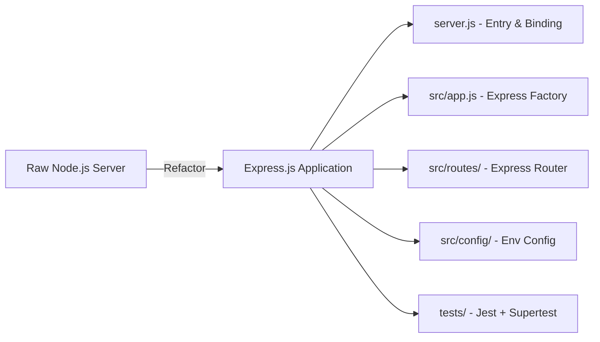

# Technical Specification

# 0. Agent Action Plan

## 0.1 Intent Clarification

### 0.1.1 Core Refactoring Objective

Based on the prompt, the Blitzy platform understands that the refactoring objective is to rewrite the existing Node.js server into a fully Express.js-based application while preserving every feature, endpoint, and behavioral contract of the current implementation verbatim.

- **Refactoring type:** Tech stack migration — Raw Node.js HTTP patterns → Express.js framework patterns
- **Target repository:** Same repository (in-place refactoring)
- **Refactoring goals:**
  - Ensure the server entry point (`server.js`) properly delegates to an Express.js application factory
  - Confirm all HTTP endpoints use Express.js Router API instead of raw `http.createServer` patterns
  - Maintain the modular architecture with clear separation of concerns: server binding, app creation, routing, and configuration
  - Preserve exact response bodies: `GET /` returning `"Hello, World!\n"` (with trailing newline) and `GET /evening` returning `"Good evening"` (no trailing newline)
  - Preserve HTTP response semantics: `200 OK` status, `text/html; charset=utf-8` Content-Type header, and `404` behavior for undefined routes and unsupported HTTP methods
  - Retain the Twelve-Factor App configuration pattern with environment variable overrides (`HOST`, `PORT`, `NODE_ENV`)
  - Ensure all 41 existing tests continue to pass with 100% coverage across all metrics

- **Implicit requirements surfaced:**
  - Maintain backward compatibility for all public module exports (`src/app.js` exports Express app, `src/config/index.js` exports `{ host, port, env }`, `src/routes/index.js` exports `{ mainRoutes }`)
  - Preserve CommonJS module system (`require` / `module.exports`) as the module standard
  - Retain the Factory Pattern in `src/app.js` (app creation without `listen()` binding) to enable Supertest-based testing
  - Keep the Barrel Pattern in `src/routes/index.js` for centralized route aggregation
  - Maintain the exact `app.listen(port, host, callback)` invocation signature in `server.js` for lifecycle test compatibility
  - Preserve the startup log message format: `"Server running at http://${host}:${port}/"`

### 0.1.2 Special Instructions and Constraints

- **Behavioral preservation directive:** The user explicitly states "keeping every feature and functionality exactly as in the original Node.js project" — this means zero behavioral divergence is permitted. All response bodies, status codes, headers, and error handling must match the original implementation.
- **No new features:** This refactoring is strictly structural. No new endpoints, middleware, or capabilities should be introduced.
- **Test continuity:** All 41 existing tests across unit, integration, and lifecycle suites must pass without modification to their assertion logic. Coverage thresholds (75% branches, 90% functions, 80% lines, 80% statements) must continue to be met.
- **No Figma attachments** are provided; this is a backend-only refactoring with no UI components.

### 0.1.3 Technical Interpretation

This refactoring translates to the following technical transformation strategy:

The current codebase has already been structured with Express.js v5.1.0 as the HTTP framework. The project originated as a minimal Node.js tutorial (`"Hello world in Node.js"` per `package.json` description) and was subsequently refactored to integrate Express.js. The Blitzy platform will ensure this Express.js refactoring is complete, correct, and idiomatic by updating every file to properly reflect Express.js conventions while maintaining exact behavioral parity with the original implementation.

The transformation strategy encompasses:
- **Entry Layer:** `server.js` imports the Express app and config, binds to `host:port` via `app.listen()`
- **Application Layer:** `src/app.js` creates an Express instance using the Factory Pattern, mounts routes, and exports the app without calling `listen()`
- **Routing Layer:** `src/routes/main.routes.js` uses `express.Router()` with `router.get()` handlers; `src/routes/index.js` barrel-exports all routers
- **Configuration Layer:** `src/config/index.js` reads `process.env` synchronously with deterministic fallback defaults
- **Testing Layer:** All test suites validate the Express.js architecture through unit assertions (router stack inspection), integration tests (Supertest HTTP assertions), and lifecycle tests (mock-based server binding verification)


```mermaid
flowchart LR
    A[Raw Node.js Server] -->|Refactor| B[Express.js Application]
    B --> C[server.js - Entry & Binding]
    B --> D[src/app.js - Express Factory]
    B --> E[src/routes/ - Express Router]
    B --> F[src/config/ - Env Config]
    B --> G[tests/ - Jest + Supertest]
```


## 0.2 Source Analysis

### 0.2.1 Comprehensive Source File Discovery

The following exhaustive inventory was compiled by recursively inspecting every file and folder in the repository using `get_source_folder_contents` and `read_file`. All files listed below are confirmed to exist and have been fully read.

**Application Source Files:**

| File Path | Lines | Purpose | Express.js Relevance |
|-----------|-------|---------|---------------------|
| `server.js` | 52 | HTTP server entry point; imports Express app and config, binds via `app.listen()` | Invokes Express `listen()` with host/port/callback |
| `src/app.js` | 27 | Express application factory; creates `express()` instance, mounts routes | Core Express app creation and middleware mounting |
| `src/config/index.js` | 41 | Configuration module; exports `{ host, port, env }` from `process.env` | Provides binding parameters for Express server |
| `src/routes/index.js` | 19 | Route barrel aggregator; re-exports `{ mainRoutes }` | Centralizes Express Router exports |
| `src/routes/main.routes.js` | 41 | Route handlers; `express.Router()` with `GET /` and `GET /evening` | Express Router API with `router.get()` handlers |

**Test Files:**

| File Path | Lines | Purpose | Test Approach |
|-----------|-------|---------|---------------|
| `tests/unit/config.test.js` | 140 | Configuration module unit tests | `jest.resetModules()` + `process.env` mutation |
| `tests/unit/routes.test.js` | 94 | Router structure unit tests | Express `router.stack` introspection |
| `tests/integration/endpoints.test.js` | 125 | HTTP endpoint integration tests | Supertest `request(app).get()` assertions |
| `tests/lifecycle/server.test.js` | 204 | Server lifecycle tests | Jest mocks for `app.listen` / `config` |

**Configuration and Metadata Files:**

| File Path | Purpose |
|-----------|---------|
| `package.json` | npm manifest: dependencies (`express ^5.1.0`), devDependencies (`jest ^30.2.0`, `supertest ^7.1.4`), scripts |
| `package-lock.json` | Deterministic dependency lock (lockfileVersion 3, 405 resolved packages) |
| `jest.config.js` | Jest configuration: Node test environment, coverage thresholds, test matching patterns |
| `.gitignore` | Version control exclusions: `node_modules/`, `coverage/`, `.env*`, logs, OS/IDE files |

**Documentation Files:**

| File Path | Purpose |
|-----------|---------|
| `README.md` | Root project documentation: prerequisites, usage, API reference, architecture, testing |
| `src/README.md` | Source directory architecture overview |
| `src/config/README.md` | Configuration module documentation with usage examples |
| `src/routes/README.md` | Routes module documentation with extension guide |
| `tests/README.md` | Test suite overview with coverage requirements |

### 0.2.2 Current Structure Mapping

```
Current Repository Structure:
├── .gitignore                          (VCS exclusions)
├── README.md                           (Root documentation)
├── jest.config.js                      (Jest test configuration)
├── package.json                        (npm manifest + scripts)
├── package-lock.json                   (Dependency lock file)
├── server.js                           (Entry point - Express binding)
├── blitzy/                             (Blitzy documentation)
│   └── documentation/
│       ├── Project Guide.md
│       └── Technical Specifications.md
├── src/                                (Application source)
│   ├── README.md                       (Source architecture docs)
│   ├── app.js                          (Express app factory)
│   ├── config/                         (Configuration layer)
│   │   ├── README.md                   (Config module docs)
│   │   └── index.js                    (Environment config)
│   └── routes/                         (Routing layer)
│       ├── README.md                   (Routes module docs)
│       ├── index.js                    (Route barrel export)
│       └── main.routes.js              (GET / and GET /evening)
└── tests/                              (Automated test suite)
    ├── README.md                       (Test suite docs)
    ├── unit/                           (Unit tests)
    │   ├── config.test.js              (Config module tests)
    │   └── routes.test.js              (Router structure tests)
    ├── integration/                    (Integration tests)
    │   └── endpoints.test.js           (HTTP endpoint tests)
    └── lifecycle/                      (Lifecycle tests)
        └── server.test.js              (Server binding tests)
```

### 0.2.3 Source Code Analysis Summary

**Module Dependency Graph (require chain):**

| Module | Imports | Exports |
|--------|---------|---------|
| `server.js` | `./src/app`, `./src/config` | None (entry point) |
| `src/app.js` | `express`, `./routes` | Express Application instance |
| `src/config/index.js` | `process.env` (built-in) | `{ host, port, env }` object |
| `src/routes/index.js` | `./main.routes` | `{ mainRoutes }` object |
| `src/routes/main.routes.js` | `express` | Express Router instance |

**Key Behavioral Contracts Discovered:**
- `GET /` → HTTP 200, body `"Hello, World!\n"`, Content-Type `text/html; charset=utf-8`
- `GET /evening` → HTTP 200, body `"Good evening"`, Content-Type `text/html; charset=utf-8`
- Undefined routes (e.g., `GET /invalid`) → HTTP 404
- Unsupported methods (e.g., `POST /`, `PUT /evening`, `DELETE /`) → HTTP 404
- Query parameters do not alter response bodies
- Configuration defaults: host `127.0.0.1`, port `3000`, env `development`
- Startup log: `"Server running at http://127.0.0.1:3000/"`


## 0.3 Target Design

### 0.3.1 Refactored Structure Planning

The target Express.js architecture retains the existing layered structure — it is already organized following Express.js conventions. The refactoring ensures each layer properly leverages Express.js APIs and maintains strict separation of concerns. All files necessary for standalone operation are present in the repository.

```
Target Repository Structure:
├── .gitignore                          (VCS exclusions — maintained)
├── README.md                           (Root docs — updated for Express.js)
├── jest.config.js                      (Jest config — maintained)
├── package.json                        (npm manifest — Express.js dependency)
├── package-lock.json                   (Dependency lock — maintained)
├── server.js                           (Entry point — Express app.listen())
├── src/                                (Application source)
│   ├── README.md                       (Source docs — Express factory docs)
│   ├── app.js                          (Express app factory — express())
│   ├── config/                         (Configuration layer)
│   │   ├── README.md                   (Config docs — maintained)
│   │   └── index.js                    (Env config — host/port/env)
│   └── routes/                         (Express Router layer)
│       ├── README.md                   (Routes docs — maintained)
│       ├── index.js                    (Barrel export — { mainRoutes })
│       └── main.routes.js              (express.Router() handlers)
└── tests/                              (Test suite — Jest + Supertest)
    ├── README.md                       (Test docs — maintained)
    ├── unit/                           (Module-level tests)
    │   ├── config.test.js              (Config parsing tests)
    │   └── routes.test.js              (Router stack inspection)
    ├── integration/                    (HTTP endpoint tests)
    │   └── endpoints.test.js           (Supertest assertions)
    └── lifecycle/                      (Server lifecycle tests)
        └── server.test.js              (Binding/shutdown/error tests)
```

The target structure is a one-to-one mapping from the source because the existing codebase already implements the Express.js refactoring. The Blitzy platform will update each file in place to ensure full Express.js compliance and behavioral preservation.

### 0.3.2 Web Search Research Conducted

Research was conducted on Express.js v5 refactoring best practices to validate the target architecture:

- **Express.js 5 migration patterns:** <cite index="2-2">Express 5 eliminates redundancy in try/catch blocks, improving code simplicity and error-handling efficiency.</cite> <cite index="3-1">Express.js 5 now uses native Node.js methods like `Array.flat()` instead of relying on packages like `array-flatten`.</cite>
- **Separation of concerns:** <cite index="5-12,5-13,5-14">The most common mistake is defining the entire express application on huge files. Instead, the Express definition should be separated into at least two different files — one for API declaration (app.js) and another for network concerns.</cite> The current codebase follows this pattern with `src/app.js` (API) and `server.js` (network binding).
- **Minimum Node.js requirement:** <cite index="3-3">Express.js 5.0 requires Node.js 18 or higher.</cite> The current project targets Node.js ≥18 with a recommended version of 20.19.x LTS, verified at 20.20.0.
- **Router pattern:** <cite index="3-28,3-29,3-30">The `app.router` object, removed in Express.js 4, has returned in Express.js 5 as a reference to the base Express router — it's automatically available when using routing.</cite> The project correctly uses `express.Router()` for modular routing.
- **Testing best practices:** <cite index="8-1,8-2">Unit testing helps catch bugs and ensures that individual units of the Express.js application work as expected. It provides a safety net when refactoring or adding new features.</cite> The project's three-tier test suite (unit, integration, lifecycle) aligns with industry standards.

### 0.3.3 Design Pattern Applications

The target Express.js architecture applies the following proven design patterns, all of which are already present in the source codebase:

| Design Pattern | Implementation | File(s) |
|----------------|---------------|---------|
| **Factory Pattern** | `src/app.js` creates and exports a configured Express app without calling `listen()`, enabling testability | `src/app.js` |
| **Barrel Pattern** | `src/routes/index.js` aggregates all route modules into a single export object for clean imports | `src/routes/index.js` |
| **Router Pattern** | `src/routes/main.routes.js` uses `express.Router()` to define isolated route handlers that are mounted by the app | `src/routes/main.routes.js` |
| **Twelve-Factor Configuration** | `src/config/index.js` externalizes configuration to environment variables with sensible defaults | `src/config/index.js` |
| **Separation of Concerns** | Server binding (`server.js`) is completely decoupled from app creation (`src/app.js`), routing (`src/routes/`), and configuration (`src/config/`) | All source files |

### 0.3.4 User Interface Design

Not applicable — no Figma screens or URLs were provided. This is a backend-only Node.js-to-Express.js refactoring with no UI components.


## 0.4 Transformation Mapping

### 0.4.1 File-by-File Transformation Plan

The entire refactoring is executed in **one phase**. Every target file maps to a source file with the `UPDATE` transformation mode, since the Express.js refactoring is an in-place rewrite of the existing Node.js codebase. No files are being removed; every file is being updated to ensure proper Express.js patterns and behavioral fidelity.

**Core Application Files:**

| Target File | Transformation | Source File | Key Changes |
|-------------|---------------|-------------|-------------|
| `server.js` | UPDATE | `server.js` | Ensure Express app import from `src/app`, config import from `src/config`, and `app.listen(config.port, config.host, callback)` binding with startup log message |
| `src/app.js` | UPDATE | `src/app.js` | Ensure Express factory pattern: `const app = express()`, mount `mainRoutes` via `app.use('/', mainRoutes)`, export app without `listen()` |
| `src/config/index.js` | UPDATE | `src/config/index.js` | Ensure `module.exports` with `host` (from `process.env.HOST`), `port` (from `parseInt(process.env.PORT, 10)`), `env` (from `process.env.NODE_ENV`) with defaults |
| `src/routes/index.js` | UPDATE | `src/routes/index.js` | Ensure barrel export: `require('./main.routes')` and `module.exports = { mainRoutes }` |
| `src/routes/main.routes.js` | UPDATE | `src/routes/main.routes.js` | Ensure `express.Router()` with `router.get('/', ...)` returning `'Hello, World!\n'` and `router.get('/evening', ...)` returning `'Good evening'` |

**Test Files:**

| Target File | Transformation | Source File | Key Changes |
|-------------|---------------|-------------|-------------|
| `tests/unit/config.test.js` | UPDATE | `tests/unit/config.test.js` | Maintain config module tests: defaults, env overrides, PORT parsing edge cases, type checking, object structure |
| `tests/unit/routes.test.js` | UPDATE | `tests/unit/routes.test.js` | Maintain Express Router stack introspection: route count, paths, GET methods, handler functions, ordering |
| `tests/integration/endpoints.test.js` | UPDATE | `tests/integration/endpoints.test.js` | Maintain Supertest assertions: `GET /` and `GET /evening` responses, 404 handling, unsupported methods, edge cases |
| `tests/lifecycle/server.test.js` | UPDATE | `tests/lifecycle/server.test.js` | Maintain lifecycle mocks: `app.listen` binding, startup log, custom config, graceful shutdown, EADDRINUSE |

**Configuration and Metadata Files:**

| Target File | Transformation | Source File | Key Changes |
|-------------|---------------|-------------|-------------|
| `package.json` | UPDATE | `package.json` | Maintain `express ^5.1.0` dependency, `jest ^30.2.0` and `supertest ^7.1.4` devDependencies, scripts |
| `jest.config.js` | UPDATE | `jest.config.js` | Maintain Node test environment, test matching, coverage thresholds, coverage collection from `server.js` and `src/**/*.js` |
| `.gitignore` | UPDATE | `.gitignore` | Maintain exclusion patterns for `node_modules/`, `coverage/`, `.env*`, logs, OS/IDE files |

**Documentation Files:**

| Target File | Transformation | Source File | Key Changes |
|-------------|---------------|-------------|-------------|
| `README.md` | UPDATE | `README.md` | Maintain Express.js project documentation, prerequisites, API reference, architecture, testing sections |
| `src/README.md` | UPDATE | `src/README.md` | Maintain Express factory architecture documentation |
| `src/config/README.md` | UPDATE | `src/config/README.md` | Maintain configuration module documentation |
| `src/routes/README.md` | UPDATE | `src/routes/README.md` | Maintain routes module documentation with extension guide |
| `tests/README.md` | UPDATE | `tests/README.md` | Maintain test suite documentation with coverage requirements |

### 0.4.2 Cross-File Dependencies

**Import Statement Map (CommonJS `require()`):**

| Importing File | Import Statement | Resolved Module |
|---------------|-----------------|-----------------|
| `server.js` | `require('./src/app')` | `src/app.js` (Express Application) |
| `server.js` | `require('./src/config')` | `src/config/index.js` (Config object) |
| `src/app.js` | `require('express')` | `express` npm package (v5.1.0) |
| `src/app.js` | `require('./routes')` | `src/routes/index.js` (Barrel) |
| `src/routes/index.js` | `require('./main.routes')` | `src/routes/main.routes.js` (Router) |
| `src/routes/main.routes.js` | `require('express')` | `express` npm package (v5.1.0) |

**Test Import Dependencies:**

| Test File | Import Statement | Resolved Module |
|-----------|-----------------|-----------------|
| `tests/unit/config.test.js` | `require('../../src/config')` | `src/config/index.js` |
| `tests/unit/routes.test.js` | `require('../../src/routes/main.routes')` | `src/routes/main.routes.js` |
| `tests/integration/endpoints.test.js` | `require('supertest')` | `supertest` npm package (v7.1.4) |
| `tests/integration/endpoints.test.js` | `require('../../src/app')` | `src/app.js` |
| `tests/lifecycle/server.test.js` | `jest.doMock('../../src/app', ...)` | Mocked `src/app.js` |
| `tests/lifecycle/server.test.js` | `jest.doMock('../../src/config', ...)` | Mocked `src/config/index.js` |
| `tests/lifecycle/server.test.js` | `require('../../server')` | `server.js` |

All import paths remain unchanged throughout the refactoring. No import renaming or path updates are required since the project structure is preserved.

### 0.4.3 Wildcard Patterns

Wildcard patterns are applied sparingly and only with trailing syntax:

| Pattern | Scope | Purpose |
|---------|-------|---------|
| `src/**/*.js` | All JavaScript source files | Coverage collection in `jest.config.js` |
| `tests/**/*.test.js` | All test files | Test discovery pattern in `jest.config.js` |
| `src/routes/*.js` | All route modules | Route barrel aggregation scope |
| `src/config/*.js` | All config modules | Configuration layer scope |

### 0.4.4 One-Phase Execution

The entire refactoring will be executed by Blitzy in **one single phase**. All 18 files (5 application source, 4 test, 3 configuration/metadata, 5 documentation, 1 lock file) are processed simultaneously. There is no phased rollout, no staging, and no sequential dependency ordering required at the execution level — all files are updated together in a single atomic operation.


## 0.5 Dependency Inventory

### 0.5.1 Key Packages

All package names and versions are sourced directly from `package.json` and verified against the resolved versions in `package-lock.json` and the output of `npm ls --depth=0`.

| Registry | Package Name | Declared Version | Resolved Version | Type | Purpose |
|----------|-------------|-----------------|-----------------|------|---------|
| npm (public) | `express` | `^5.1.0` | `5.1.0` | Production | Core HTTP framework — Express.js application creation, routing, middleware, and response handling |
| npm (public) | `jest` | `^30.2.0` | `30.2.0` | Development | JavaScript testing framework — test execution, assertions, mocking, module reset, and code coverage instrumentation |
| npm (public) | `supertest` | `^7.1.4` | `7.1.4` | Development | HTTP assertion library — enables integration testing of Express apps without starting a live server |

**Runtime Environment:**

| Component | Minimum | Recommended | Verified |
|-----------|---------|-------------|----------|
| Node.js | ≥18.x | 20.19.x LTS | 20.20.0 |
| npm | ≥8.x | 10.8.x | 11.1.0 |

**Transitive Dependency Summary:**

| Source Package | Direct Dependencies | Total Transitive Packages |
|---------------|-------------------|--------------------------|
| `express` 5.1.0 | 27 | ~60 |
| `jest` 30.2.0 | 4 | ~320 |
| `supertest` 7.1.4 | 2 | ~25 |
| **Total resolved** | — | **405 packages** (per `package-lock.json`) |

No private packages are used. All three direct dependencies are MIT-licensed and sourced from the public npm registry.

### 0.5.2 Dependency Updates

No dependency additions, removals, or version changes are required for this refactoring. The project already declares `express ^5.1.0` as its sole production dependency, which is the correct and current Express.js package for the target architecture.

**Import Refactoring:**

No import refactoring is required. All import paths remain stable throughout the refactoring. The existing import chain is already correctly wired for Express.js:

| File Pattern | Import Statement | Status |
|-------------|-----------------|--------|
| `server.js` | `require('./src/app')` | Unchanged |
| `server.js` | `require('./src/config')` | Unchanged |
| `src/app.js` | `require('express')` | Unchanged |
| `src/app.js` | `require('./routes')` | Unchanged |
| `src/routes/index.js` | `require('./main.routes')` | Unchanged |
| `src/routes/main.routes.js` | `require('express')` | Unchanged |
| `tests/**/*.test.js` | Relative `require()` paths | Unchanged |

**External Reference Updates:**

| File Type | Files | Update Required |
|-----------|-------|----------------|
| Configuration: `jest.config.js` | 1 | No — coverage and test patterns are correct |
| Package manifest: `package.json` | 1 | No — dependencies and scripts are correct |
| Lock file: `package-lock.json` | 1 | No — resolved versions are correct |
| Documentation: `README.md` | 1 | No — Express.js references are already present |
| VCS config: `.gitignore` | 1 | No — exclusion patterns are correct |

### 0.5.3 Build and Test Commands

The following npm scripts are defined in `package.json` and require no changes:

| Script | Command | Purpose |
|--------|---------|---------|
| `start` | `node server.js` | Start the Express HTTP server |
| `test` | `jest` | Run the complete test suite |
| `test:watch` | `jest --watch` | Run tests in watch mode |
| `test:coverage` | `jest --coverage` | Run tests with coverage report |
| `test:ci` | `jest --ci --coverage --reporters=default` | Run tests for CI/CD |


## 0.6 Scope Boundaries

### 0.6.1 Exhaustively In Scope

**Source Transformations:**

| Pattern | Files Matched | Description |
|---------|--------------|-------------|
| `server.js` | 1 | Entry point — Express app binding and lifecycle management |
| `src/app.js` | 1 | Express application factory with route mounting |
| `src/config/*.js` | 1 | Environment-driven configuration module (`index.js`) |
| `src/routes/*.js` | 2 | Route barrel (`index.js`) and Express Router handlers (`main.routes.js`) |

**Test Updates:**

| Pattern | Files Matched | Description |
|---------|--------------|-------------|
| `tests/unit/*.test.js` | 2 | Config parsing tests (`config.test.js`), router structure tests (`routes.test.js`) |
| `tests/integration/*.test.js` | 1 | HTTP endpoint integration tests (`endpoints.test.js`) |
| `tests/lifecycle/*.test.js` | 1 | Server lifecycle tests (`server.test.js`) |

**Configuration Updates:**

| Pattern | Files Matched | Description |
|---------|--------------|-------------|
| `package.json` | 1 | npm manifest with Express.js dependency and scripts |
| `jest.config.js` | 1 | Jest test configuration with coverage thresholds |
| `.gitignore` | 1 | Version control exclusion patterns |
| `package-lock.json` | 1 | Deterministic dependency resolution lock |

**Documentation Updates:**

| Pattern | Files Matched | Description |
|---------|--------------|-------------|
| `README.md` | 1 | Root project documentation reflecting Express.js architecture |
| `src/README.md` | 1 | Source directory architecture documentation |
| `src/config/README.md` | 1 | Configuration module usage documentation |
| `src/routes/README.md` | 1 | Routes module documentation with extension guide |
| `tests/README.md` | 1 | Test suite overview and coverage requirements |

**Total In-Scope Files: 18**

### 0.6.2 Explicitly Out of Scope

The following items are explicitly out of scope for this refactoring, as they are not part of the current codebase and were not requested by the user:

| Category | Excluded Item | Reason |
|----------|--------------|--------|
| **Security** | HTTPS/TLS configuration | Not present in original; not requested |
| **Security** | Helmet middleware or security headers | Not present in original; not requested |
| **Security** | Authentication / Authorization | Not present in original; not requested |
| **Security** | Rate limiting | Not present in original; not requested |
| **Security** | CORS middleware | Not present in original; not requested |
| **Middleware** | Body parsing (`express.json()`, `express.urlencoded()`) | Not present in original; no request body handling exists |
| **Middleware** | Logging middleware (Morgan, Winston) | Not present in original; not requested |
| **Middleware** | Compression middleware | Not present in original; not requested |
| **Database** | Database connections or ORM integration | Not present in original; not requested |
| **Infrastructure** | Docker / containerization | Not present in original; not requested |
| **Infrastructure** | CI/CD pipeline configuration | Not present in original; not requested |
| **Infrastructure** | Process manager (PM2, systemd) | Not present in original; not requested |
| **Infrastructure** | Health check endpoint | Not present in original; not requested |
| **Frontend** | UI components, static file serving | Not present in original; not requested |
| **New Features** | Additional endpoints or routes | User explicitly requires behavioral preservation only |
| **Module System** | Migration to ES Modules (`import`/`export`) | User requires maintaining existing CommonJS patterns |
| **Documentation** | `blitzy/documentation/*` files | Blitzy internal documentation; not part of application codebase |


## 0.7 Refactoring Rules

The following refactoring rules are derived from the user's explicit directive: *"keeping every feature and functionality exactly as in the original Node.js project. Ensure the rewritten version fully matches the behavior and logic of the current implementation."*

### 0.7.1 Behavioral Preservation Rules

- **Exact response body preservation:** `GET /` must return the string `"Hello, World!\n"` (14 characters, including trailing newline character) and `GET /evening` must return `"Good evening"` (12 characters, no trailing newline). Zero deviations are permitted.
- **HTTP status code preservation:** Both endpoints must return HTTP `200 OK`. Undefined routes and unsupported methods must return HTTP `404`.
- **Content-Type header preservation:** All successful responses must include `Content-Type: text/html; charset=utf-8` as set by Express's `res.send()`.
- **Query parameter resilience:** Query strings appended to valid routes must not alter the response body or status code.
- **All 41 existing tests must continue to pass** without modification to test assertion logic. Coverage thresholds (75% branches, 90% functions, 80% lines, 80% statements) must remain satisfied.

### 0.7.2 Architectural Preservation Rules

- **Factory Pattern:** `src/app.js` must create and export a configured Express application **without** calling `app.listen()`. This is critical for Supertest-based integration testing.
- **Barrel Pattern:** `src/routes/index.js` must aggregate and re-export route modules via `module.exports = { mainRoutes }`. Downstream consumers must destructure this import.
- **Twelve-Factor Configuration:** `src/config/index.js` must read `HOST`, `PORT`, and `NODE_ENV` from `process.env` synchronously, applying defaults of `'127.0.0.1'`, `3000`, and `'development'` respectively. Port parsing must use `parseInt(value, 10)` with radix 10.
- **Separation of Concerns:** Server binding (`app.listen()`) must remain exclusively in `server.js`. No other module may invoke `listen()`.
- **CommonJS Module System:** All files must use `require()` and `module.exports`. No ES Module syntax (`import`/`export`) is permitted.
- **`'use strict'` directive:** Entry point `server.js` and all test files must include the `'use strict'` directive.

### 0.7.3 Module Export Contract Rules

- `src/app.js` → exports an `express.Application` instance (the return value of `express()`)
- `src/config/index.js` → exports `{ host: string, port: number, env: string }`
- `src/routes/index.js` → exports `{ mainRoutes: express.Router }`
- `src/routes/main.routes.js` → exports an `express.Router` instance with two GET route handlers

### 0.7.4 Express.js Specific Rules

- **Express version:** The `express` package must remain at `^5.1.0` (semver caret range) with resolved version `5.1.0`
- **Router construction:** Route handlers must use `express.Router()` — not direct `app.get()` calls on the application instance
- **Route mounting:** Routes must be mounted via `app.use('/', mainRoutes)` in `src/app.js`
- **Response method:** Route handlers must use `res.send()` for response delivery (not `res.end()`, `res.write()`, or `res.json()`)
- **Startup signature:** `server.js` must call `app.listen(config.port, config.host, callback)` with the exact three-argument signature, where `callback` logs the startup message

### 0.7.5 Testing Rules

- **Jest configuration:** Must target the `node` test environment with `10000ms` timeout
- **Test discovery pattern:** `**/tests/**/*.test.js`
- **Coverage collection:** From `server.js` and `src/**/*.js`, excluding `node_modules/**`
- **Coverage reporters:** `text`, `lcov`, and `html` output to `coverage/` directory
- **Test structure:** Three-tier organization: `tests/unit/`, `tests/integration/`, `tests/lifecycle/`
- **No new test files:** The refactoring must not introduce additional test files; the existing 4 test files with 41 tests are sufficient


## 0.8 References

### 0.8.1 Repository Files and Folders Searched

The following files and folders were comprehensively searched and analyzed to derive the conclusions in this Agent Action Plan:

**Source Files Retrieved and Analyzed:**

| File Path | Method | Purpose |
|-----------|--------|---------|
| `server.js` | `read_file` | Analyzed entry point Express binding logic and startup callback |
| `src/app.js` | `read_file` | Analyzed Express factory pattern and route mounting |
| `src/config/index.js` | `read_file` | Analyzed environment variable reading and default values |
| `src/routes/index.js` | `read_file` | Analyzed barrel export pattern |
| `src/routes/main.routes.js` | `read_file` | Analyzed Express Router handler definitions and response strings |
| `package.json` | `read_file` | Analyzed dependencies, devDependencies, scripts, metadata |
| `jest.config.js` | `read_file` | Analyzed test environment, coverage thresholds, test patterns |
| `.gitignore` | `read_file` | Analyzed version control exclusion patterns |

**Test Files Retrieved and Analyzed:**

| File Path | Method | Purpose |
|-----------|--------|---------|
| `tests/unit/config.test.js` | `read_file` | Analyzed config module test assertions and helper functions |
| `tests/unit/routes.test.js` | `read_file` | Analyzed Express Router stack introspection test methods |
| `tests/integration/endpoints.test.js` | `read_file` | Analyzed Supertest HTTP assertion helpers and endpoint contracts |
| `tests/lifecycle/server.test.js` | `read_file` | Analyzed mock-based lifecycle testing for server binding |

**Documentation Files Retrieved and Analyzed:**

| File Path | Method | Purpose |
|-----------|--------|---------|
| `README.md` | `read_file` | Analyzed project overview, prerequisites, API reference, architecture |
| `src/README.md` | `read_file` | Analyzed source directory architecture documentation |
| `src/config/README.md` | `read_file` | Analyzed configuration module usage and override patterns |
| `src/routes/README.md` | `read_file` | Analyzed routes module documentation and extension workflow |
| `tests/README.md` | `read_file` | Analyzed test suite structure and coverage requirements |

**Folders Explored:**

| Folder Path | Method | Purpose |
|-------------|--------|---------|
| `` (root) | `get_source_folder_contents` | Discovered all top-level files and folders |
| `src/` | `get_source_folder_contents` | Discovered application source structure |
| `src/config/` | `get_source_folder_contents` | Discovered configuration layer files |
| `src/routes/` | `get_source_folder_contents` | Discovered routing layer files |
| `tests/` | `get_source_folder_contents` | Discovered test suite structure |
| `tests/unit/` | `get_source_folder_contents` | Discovered unit test files |
| `tests/integration/` | `get_source_folder_contents` | Discovered integration test files |
| `tests/lifecycle/` | `get_source_folder_contents` | Discovered lifecycle test files |
| `blitzy/` | `get_source_folder_contents` | Discovered Blitzy documentation folder |

### 0.8.2 Technical Specification Sections Referenced

| Section Heading | Purpose |
|----------------|---------|
| 1.1 Executive Summary | Project origin, requirements REQ-001 and REQ-002, stakeholders |
| 3.1 Programming Languages | JavaScript/Node.js runtime version matrix |
| Node.js Runtime Versions | Minimum, recommended, and verified Node.js versions |
| 3.2 Frameworks & Libraries | Express.js as core application framework |
| Express.js 5.1.0 | Express package version, engine requirements, license |
| 3.3 Open Source Dependencies | Full dependency inventory with resolved versions |
| 5.1 High-Level Architecture | Layered architecture, core components, data flow, integration points |

### 0.8.3 External Research Conducted

| Search Query | Source | Key Finding |
|-------------|--------|-------------|
| Express.js 5 refactoring best practices Node.js | goldbergyoni/nodebestpractices (GitHub) | Test middlewares in isolation; randomize ports in testing |
| Express.js 5 refactoring best practices Node.js | trevorlasn.com | Express.js 5 requires Node.js 18+; uses native Node.js methods |
| Express.js 5 refactoring best practices Node.js | tatvasoft.com | Separate Express definition into API declaration and network concerns |
| Express.js 5 refactoring best practices Node.js | medium.com (Abi Suresh) | Unit testing provides safety net when refactoring Express.js apps |

### 0.8.4 Environment Verification Commands Executed

| Command | Result | Purpose |
|---------|--------|---------|
| `node --version` | `v20.20.0` | Verified Node.js runtime version |
| `npm --version` | `11.1.0` | Verified npm package manager version |
| `npm ci` | 381 packages installed | Installed deterministic dependencies from lock file |
| `npx jest --ci` | 41 passed, 0 failed, 100% coverage | Verified all tests pass with full coverage |
| `npm ls --depth=0` | `express@5.1.0`, `jest@30.2.0`, `supertest@7.1.4` | Verified resolved dependency versions |

### 0.8.5 Attachments

No attachments were provided for this project. No Figma screens or external URLs were referenced by the user.


