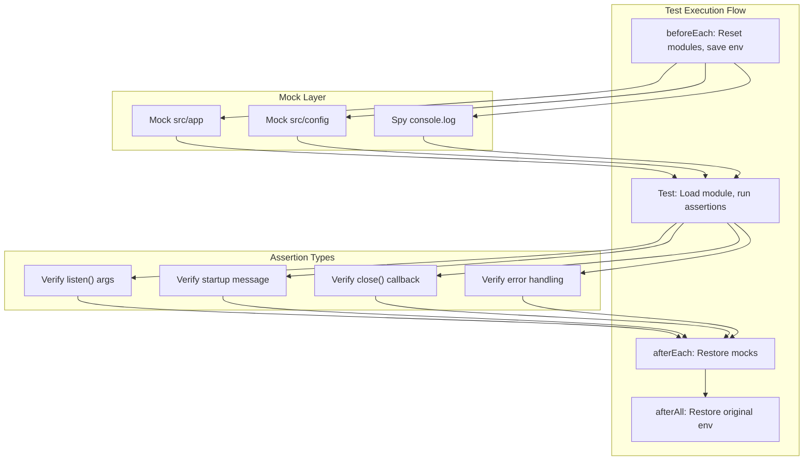
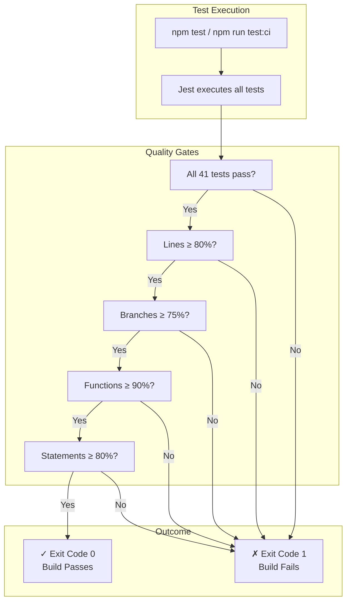
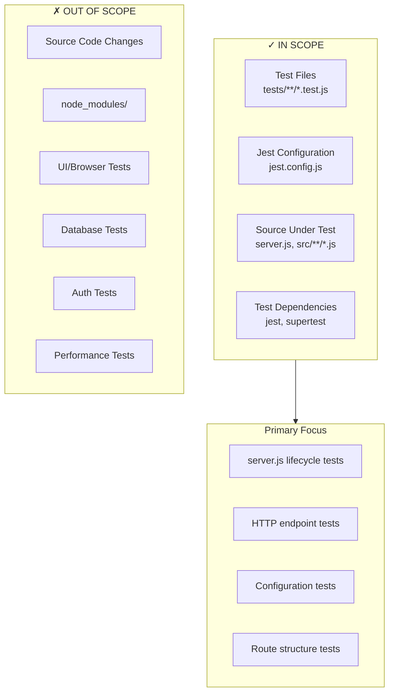
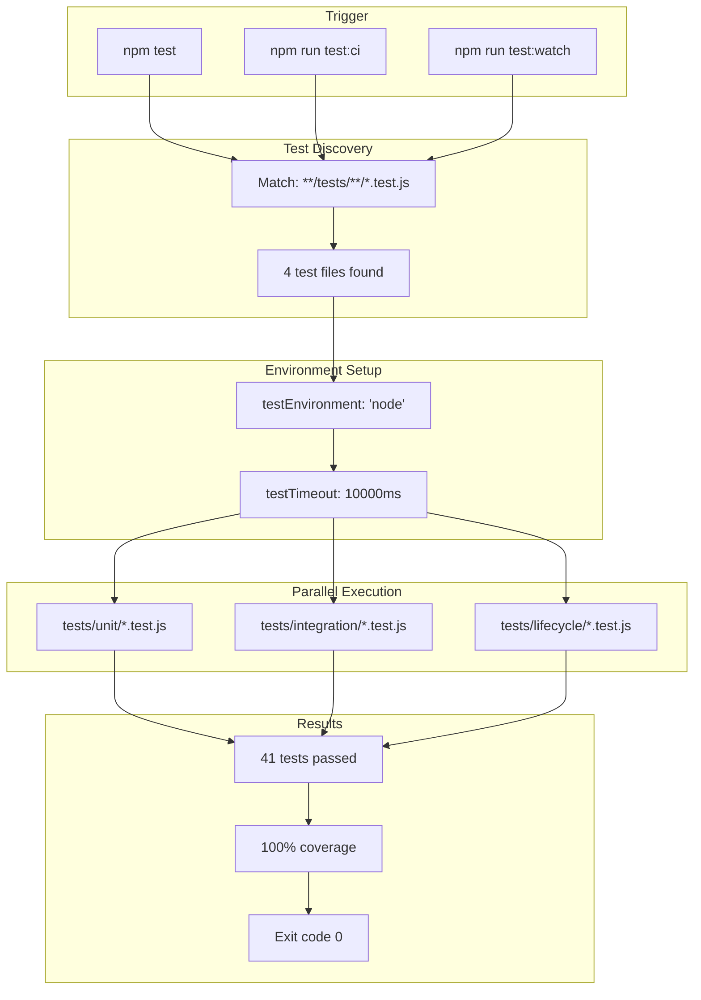

# Technical Specification

# 0. Agent Action Plan

## 0.1 Intent Clarification

Based on the provided requirements, the Blitzy platform understands that the testing objective is to **create comprehensive unit tests for server.js** using the Jest testing framework. The request focuses on validating HTTP server behavior, including responses, status codes, headers, startup/shutdown lifecycle, error handling, and edge cases.

### 0.1.1 Core Testing Objective

**Category**: Add new tests | Update existing tests | Improve coverage

The Blitzy platform interprets this requirement as an enhancement of the existing test suite to ensure comprehensive coverage of the `server.js` entry point module. The repository already contains a well-structured test infrastructure with Jest 30.2.0 and Supertest 7.1.4, along with existing lifecycle tests in `tests/lifecycle/server.test.js`.

| Requirement | Technical Interpretation | Priority |
|-------------|-------------------------|----------|
| Test HTTP responses | Validate response bodies for GET `/` and GET `/evening` endpoints | High |
| Test status codes | Assert 200 for valid routes, 404 for invalid routes/methods | High |
| Test headers | Verify `Content-Type: text/html; charset=utf-8` on responses | High |
| Test server startup | Validate `app.listen()` binding with correct host, port, callback | High |
| Test server shutdown | Verify `server.close()` graceful shutdown behavior | High |
| Test error handling | Assert EADDRINUSE and other server errors are handled | High |
| Test edge cases | Query parameters, path normalization, method restrictions | Medium |

### 0.1.2 Implicit Testing Needs

The following implicit requirements have been surfaced based on best practices for Node.js/Express server testing:

- **Module Isolation**: Tests must use `jest.resetModules()` to ensure fresh module evaluation
- **Environment Variable Testing**: Configuration override scenarios for HOST, PORT, NODE_ENV
- **Console Output Verification**: Startup log message format validation using `jest.spyOn()`
- **Mock Factory Patterns**: Reusable mock server and listen function factories
- **Callback Invocation Timing**: Both immediate and deferred callback execution scenarios
- **Error Event Registration**: Verify `'error'` event handler wiring on server object

### 0.1.3 Technical Interpretation

These testing requirements translate to the following technical test implementation strategy:

- **To test HTTP responses**, we will use Supertest to validate exact response bodies including trailing newlines and character encoding
- **To test status codes**, we will verify 200 OK for defined routes and 404 Not Found for undefined routes and unsupported methods
- **To test headers**, we will assert Content-Type header matches `text/html; charset=utf-8` pattern
- **To test server startup**, we will mock `src/app` and `src/config` modules, then verify `listen()` invocation arguments
- **To test server shutdown**, we will validate `server.close()` callback execution for graceful termination
- **To test error handling**, we will simulate EADDRINUSE errors and verify non-throwing handler behavior

### 0.1.4 Coverage Requirements Interpretation

| Coverage Type | Explicit Target | Implicit Expectation |
|---------------|-----------------|---------------------|
| Line Coverage | ≥ 80% | Maintain existing 100% coverage |
| Branch Coverage | ≥ 75% | Cover all conditional paths in config |
| Function Coverage | ≥ 90% | All exported functions called |
| Statement Coverage | ≥ 80% | Maintain existing 100% coverage |

To achieve comprehensive testing, coverage should include:
- All code paths in `server.js` (currently at 100%)
- Error handling branches for server binding failures
- Custom configuration scenarios (non-default host/port)
- Console logging verification for startup messages

## 0.2 Test Discovery and Analysis

### 0.2.1 Existing Test Infrastructure Assessment

Repository analysis reveals a **Jest 30.x + Supertest testing setup** with comprehensive existing coverage across unit, integration, and lifecycle test categories. The test infrastructure is production-ready with enforced coverage thresholds.

**Current Testing Framework**: Jest version ^30.2.0
**Test Runner Configuration**: `jest.config.js` at repository root
**Coverage Tools**: Istanbul (built into Jest)
**HTTP Testing Library**: Supertest version ^7.1.4

| Test Infrastructure Component | Location | Status |
|------------------------------|----------|--------|
| Jest Configuration | `jest.config.js` | ✓ Configured |
| Test Match Pattern | `**/tests/**/*.test.js` | ✓ Active |
| Coverage Collection | Enabled by default | ✓ Active |
| Coverage Thresholds | 75% branches, 90% functions, 80% lines/statements | ✓ Enforced |
| Test Environment | Node.js | ✓ Configured |
| Test Timeout | 10 seconds | ✓ Configured |

### 0.2.2 Existing Test File Mapping

| Test Directory | Test File | Purpose | Test Count |
|----------------|-----------|---------|------------|
| `tests/unit/` | `config.test.js` | Configuration module validation | ~14 tests |
| `tests/unit/` | `routes.test.js` | Router structure introspection | ~7 tests |
| `tests/integration/` | `endpoints.test.js` | HTTP endpoint contract tests | ~12 tests |
| `tests/lifecycle/` | `server.test.js` | Server startup/shutdown behavior | ~5 tests |

### 0.2.3 Test Infrastructure Details

**Mock/Stub Libraries Detected**:
- Jest built-in mocking: `jest.fn()`, `jest.doMock()`, `jest.spyOn()`
- Module reset utilities: `jest.resetModules()`

**Test Data Fixtures Present**:
- `DEFAULT_CONFIG` constant in lifecycle tests
- Mock server factory functions: `createMockServer()`, `createMockListen()`
- Helper assertion functions: `assertSuccessfulHtmlResponse()`, `assert404Response()`

### 0.2.4 Current Test Coverage Analysis

Based on test execution output, the repository achieves **100% coverage** across all metrics:

| File | Statements | Branches | Functions | Lines |
|------|------------|----------|-----------|-------|
| `server.js` | 100% | 100% | 100% | 100% |
| `src/app.js` | 100% | 100% | 100% | 100% |
| `src/config/index.js` | 100% | 100% | 100% | 100% |
| `src/routes/index.js` | 100% | 100% | 100% | 100% |
| `src/routes/main.routes.js` | 100% | 100% | 100% | 100% |

### 0.2.5 Web Search Research Conducted

Based on <cite index="1-12">Jest 30 research, the framework "delivers real-world performance gains thanks to many optimizations, especially related to module resolution, memory usage, and test isolation."</cite>

**Jest 30 Best Practices Identified**:
- <cite index="1-23">"Jest achieves test isolation between files by running each test in a separate VM context, giving each file a fresh global environment."</cite>
- <cite index="6-6,6-7">"Keep Tests Small and Focused: Each test should focus on a single behavior. This makes it easier to understand and quickly identify errors."</cite>
- <cite index="6-10,6-11">"Test Behavior, Not Implementation: Focus on what the code does, not how it does it. This way, your tests will remain useful even if the code changes."</cite>

**Mocking Strategy Best Practices**:
- <cite index="7-22,7-23">"Whenever your code interacts with APIs, databases, or other external services, use mocks to simulate their behavior. Jest provides utilities like jest.fn() and jest.mock() to help you isolate your tests."</cite>
- <cite index="6-21,6-22">"When using mocks, it's important to clean them up after each test to avoid memory leaks or interference between tests. Solution: Use jest.clearAllMocks() or jest.resetAllMocks() inside the afterEach block."</cite>

**Test Organization Conventions**:
- <cite index="6-32,6-33">"Use clear names for your test files. A common convention is to use .test.js or .spec.js for the test files."</cite>
- Group tests by feature/module in dedicated folders
- Use `beforeEach`/`afterEach` for setup and teardown

### 0.2.6 Existing Patterns to Follow

The repository demonstrates consistent patterns that should be maintained:

| Pattern | Example | Location |
|---------|---------|----------|
| JSDoc Type Annotations | `@typedef {Object} MockServer` | `tests/lifecycle/server.test.js` |
| 'use strict' Directive | `'use strict';` at file top | All test files |
| Helper Factory Functions | `createMockServer()`, `createMockListen()` | `tests/lifecycle/server.test.js` |
| Test Naming Convention | `should + [expected behavior]` | All test files |
| Module Isolation | `jest.resetModules()` in `beforeEach` | Unit and lifecycle tests |

## 0.3 Testing Scope Analysis

### 0.3.1 Test Target Identification

**Primary Code to be Tested**:

| Module/File | Path | Test Categories Required |
|-------------|------|-------------------------|
| Server Entry Point | `server.js` | Lifecycle tests (startup, shutdown, error handling) |
| Express Application | `src/app.js` | Integration tests (HTTP requests) |
| Configuration Module | `src/config/index.js` | Unit tests (env parsing, defaults) |
| Main Routes | `src/routes/main.routes.js` | Unit tests (structure) + Integration tests (behavior) |
| Routes Index | `src/routes/index.js` | Unit tests (barrel export verification) |

**Functions Requiring Tests**:

| Function/Behavior | Source | Test Categories |
|-------------------|--------|-----------------|
| `app.listen(port, host, callback)` | `server.js` | Lifecycle - binding verification |
| `console.log()` startup message | `server.js` | Lifecycle - output verification |
| GET `/` handler | `src/routes/main.routes.js` | Integration - response validation |
| GET `/evening` handler | `src/routes/main.routes.js` | Integration - response validation |
| Config property exports | `src/config/index.js` | Unit - value validation |

### 0.3.2 Existing Test Coverage Mapping

| Source File | Existing Test File | Test Categories Present |
|-------------|-------------------|-------------------------|
| `server.js` | `tests/lifecycle/server.test.js` | Binding, logging, shutdown, EADDRINUSE |
| `src/app.js` | `tests/integration/endpoints.test.js` | HTTP responses, status codes, headers |
| `src/config/index.js` | `tests/unit/config.test.js` | Defaults, custom values, edge cases, types |
| `src/routes/main.routes.js` | `tests/unit/routes.test.js` | Router export, route definitions, ordering |
| `src/routes/index.js` | (Covered by routes.test.js) | Barrel export verification |

### 0.3.3 Dependencies Requiring Mocking

| Dependency | Mock Strategy | Location |
|------------|---------------|----------|
| `src/app` module | `jest.doMock()` with mock listen function | `tests/lifecycle/server.test.js` |
| `src/config` module | `jest.doMock()` with test config object | `tests/lifecycle/server.test.js` |
| `console.log` | `jest.spyOn(console, 'log').mockImplementation()` | `tests/lifecycle/server.test.js` |
| `console.error` | `jest.spyOn(console, 'error').mockImplementation()` | `tests/lifecycle/server.test.js` |
| `process.env` | Direct mutation with saved original | `tests/unit/config.test.js` |

**External Services to Mock**: None (application has no external dependencies)
**Database Interactions to Stub**: None (stateless application)
**File System Operations to Virtualize**: None (no file I/O)

### 0.3.4 Version Compatibility Research

Based on the project's `package.json` and <cite index="9-9,9-10,9-11">"Jest 30 drops support for Node 14, 16, 19, and 21. The minimum supported Node versions are now 18.x."</cite>

**Current Environment**: Node.js 20.20.0 (compatible)

**Recommended Testing Stack**:

| Component | Package | Version | Rationale |
|-----------|---------|---------|-----------|
| Testing Framework | jest | ^30.2.0 | Already installed, Jest 30 with performance improvements |
| HTTP Testing | supertest | ^7.1.4 | Already installed, Express app testing |
| Coverage | istanbul (Jest built-in) | N/A | Bundled with Jest |
| Mocking | jest (built-in) | ^30.2.0 | `jest.fn()`, `jest.doMock()`, `jest.spyOn()` |

**Version Compatibility Matrix**:

| Dependency | Required Version | Installed Version | Status |
|------------|-----------------|-------------------|--------|
| Node.js | ≥18.x | 20.20.0 | ✓ Compatible |
| npm | ≥8.x | 11.1.0 | ✓ Compatible |
| Jest | ^30.2.0 | 30.2.0 | ✓ Installed |
| Supertest | ^7.1.4 | 7.1.4 | ✓ Installed |
| Express | ^5.1.0 | 5.1.0 | ✓ Installed |

### 0.3.5 Gap Analysis

| Test Gap | Current Status | Action Required |
|----------|----------------|-----------------|
| Server startup binding | ✓ Covered | Enhance with additional scenarios |
| Custom configuration | ✓ Covered | Maintain existing tests |
| Graceful shutdown | ✓ Covered | Verify callback invocation |
| EADDRINUSE handling | ✓ Covered | Consider additional error types |
| HTTP 200 responses | ✓ Covered | Maintain exact body validation |
| HTTP 404 responses | ✓ Covered | Maintain error handling tests |
| Content-Type headers | ✓ Covered | Maintain header assertions |
| Query parameter tolerance | ✓ Covered | Maintain edge case tests |

**Conclusion**: The existing test suite provides comprehensive coverage. The focus should be on **maintaining and enhancing** the current tests rather than adding entirely new test categories.

## 0.4 Test Implementation Design

### 0.4.1 Test Strategy Selection

**Test Types to Implement**:

| Test Type | Focus Area | Location |
|-----------|------------|----------|
| Unit Tests | Isolated module contracts, configuration parsing, router structure | `tests/unit/` |
| Integration Tests | HTTP request/response cycles, endpoint behavior | `tests/integration/` |
| Lifecycle Tests | Server binding, startup logging, shutdown, error events | `tests/lifecycle/` |

### 0.4.2 Test Case Blueprint

**Component: server.js (Server Entry Point)**

```
Component: server.js
Test Categories:
- Happy path: Server binds to configured host:port, logs startup message
- Edge cases: Custom configuration values, callback timing variations
- Error cases: EADDRINUSE, server binding failures
- Configuration: Default vs custom host/port/env combinations
```

**Component: src/app.js (Express Application)**

```
Component: src/app.js
Test Categories:
- Happy path: GET / returns 200 with "Hello, World!\n", GET /evening returns 200 with "Good evening"
- Edge cases: Query parameters ignored, path normalization
- Error cases: 404 for undefined routes, 404 for unsupported methods
- Headers: Content-Type validation (text/html; charset=utf-8)
```

**Component: src/config/index.js (Configuration Module)**

```
Component: src/config/index.js
Test Categories:
- Happy path: Reads HOST, PORT, NODE_ENV from environment
- Defaults: 127.0.0.1, 3000, development when not set
- Edge cases: Invalid PORT strings, empty values, whitespace handling
- Type checking: port is number, host and env are strings
```

**Component: src/routes/main.routes.js (Route Handlers)**

```
Component: src/routes/main.routes.js
Test Categories:
- Happy path: Router exports defined, routes registered correctly
- Structure: Two routes at "/" and "/evening", GET method handlers
- Ordering: Root route registered before /evening route
- Handler validation: Each route has handler functions attached
```

### 0.4.3 Existing Test Extension Strategy

| Test File | Enhancement Strategy |
|-----------|---------------------|
| `tests/lifecycle/server.test.js` | Enhance with additional error scenarios if needed |
| `tests/integration/endpoints.test.js` | Maintain current comprehensive coverage |
| `tests/unit/config.test.js` | Maintain PORT parsing edge cases |
| `tests/unit/routes.test.js` | Maintain router introspection tests |

### 0.4.4 Test Data and Fixtures Design

**Required Test Data Structures**:

| Data Type | Structure | Usage |
|-----------|-----------|-------|
| `DEFAULT_CONFIG` | `{ host: '127.0.0.1', port: 3000, env: 'test' }` | Baseline configuration |
| Custom Config | `{ host: '0.0.0.0', port: 8080, env: 'production' }` | Override testing |
| Mock Server | `{ close, on, address }` methods | Server lifecycle simulation |
| Expected Bodies | `'Hello, World!\n'`, `'Good evening'` | Response validation |

**Fixture Organization Strategy**:

| Fixture Type | Implementation | Location |
|--------------|----------------|----------|
| Config Constants | Inline `const DEFAULT_CONFIG` | Top of test file |
| Mock Factories | Helper functions `createMockServer()` | Top of test file |
| Response Expectations | Inline string literals | Test assertions |
| Environment Overrides | Direct `process.env` manipulation | Test setup |

**Mock Object Specifications**:

```javascript
// MockServer interface
{
  close: jest.fn((cb) => cb && cb()),
  on: jest.fn((event, handler) => mockServer),
  address: jest.fn(() => ({ address, port }))
}

// MockListen interface
jest.fn((port, host, callback) => {
  callback && callback();
  return mockServer;
})
```

**Test State Management**:

| State Concern | Management Approach |
|---------------|---------------------|
| Module Cache | `jest.resetModules()` in `beforeEach` |
| Environment | Save/restore `process.env` |
| Console Spies | `jest.restoreAllMocks()` in `afterEach` |
| Mock Functions | `jest.clearAllMocks()` in `afterAll` |

### 0.4.5 Test Architecture Diagram


```mermaid
flowchart TD
    subgraph TestExecution["Test Execution Flow"]
        Setup["beforeEach: Reset modules, save env"]
        Execute["Test: Load module, run assertions"]
        Teardown["afterEach: Restore mocks"]
        Final["afterAll: Restore original env"]
    end
    
    subgraph MockLayer["Mock Layer"]
        MockApp["Mock src/app"]
        MockConfig["Mock src/config"]
        ConsoleSpy["Spy console.log"]
    end
    
    subgraph Assertions["Assertion Types"]
        BindAssert["Verify listen() args"]
        LogAssert["Verify startup message"]
        ShutdownAssert["Verify close() callback"]
        ErrorAssert["Verify error handling"]
    end
    
    Setup --> MockApp
    Setup --> MockConfig
    Setup --> ConsoleSpy
    MockApp --> Execute
    MockConfig --> Execute
    ConsoleSpy --> Execute
    Execute --> BindAssert
    Execute --> LogAssert
    Execute --> ShutdownAssert
    Execute --> ErrorAssert
    BindAssert --> Teardown
    LogAssert --> Teardown
    ShutdownAssert --> Teardown
    ErrorAssert --> Teardown
    Teardown --> Final
```

## 0.5 Test File Transformation Mapping

### 0.5.1 File-by-File Test Plan

**Test Transformation Modes**:
- **CREATE** - Create a new test file
- **UPDATE** - Update an existing test file  
- **DELETE** - Remove an obsolete test file
- **REFERENCE** - Use as an example for test patterns and styles

| Target Test File | Transformation | Source File/Test | Purpose/Changes |
|------------------|----------------|------------------|-----------------|
| `tests/lifecycle/server.test.js` | REFERENCE | `server.js` | Reference for lifecycle test patterns, mock factories, and module isolation |
| `tests/integration/endpoints.test.js` | REFERENCE | `src/app.js` | Reference for Supertest HTTP testing patterns and assertion helpers |
| `tests/unit/config.test.js` | REFERENCE | `src/config/index.js` | Reference for environment variable testing and module reset patterns |
| `tests/unit/routes.test.js` | REFERENCE | `src/routes/main.routes.js` | Reference for Express Router introspection patterns |

### 0.5.2 Existing Test Files Detail

**tests/lifecycle/server.test.js** - Server Entry Point Lifecycle Tests

| Test Category | Tests Included | Coverage Focus |
|---------------|----------------|----------------|
| Binding Configuration | `should bind to configured host and port` | Verify listen() arguments |
| Startup Logging | `should log startup message with server URL` | Console output format |
| Custom Configuration | `should use custom configuration values` | Override scenarios |
| Graceful Shutdown | `should provide server object that supports graceful shutdown` | close() callback |
| Error Handling | `should handle EADDRINUSE error` | Error event handling |

- **Mock Dependencies**: `src/app`, `src/config`, `console.log`, `console.error`
- **Assertions Focus**: Argument verification, callback execution, error non-throwing

**tests/integration/endpoints.test.js** - HTTP Endpoint Integration Tests

| Test Category | Tests Included | Coverage Focus |
|---------------|----------------|----------------|
| GET / | Status 200, body, Content-Type | Root endpoint contract |
| GET /evening | Status 200, body, Content-Type | Evening endpoint contract |
| Error Handling | 404 for invalid routes, unsupported methods | Error response format |
| Edge Cases | Query parameters, double-slash paths | Tolerance testing |

- **Integration Points**: Express app via Supertest
- **Test Data Requirements**: Expected response strings with exact whitespace

**tests/unit/config.test.js** - Configuration Module Unit Tests

| Test Category | Tests Included | Coverage Focus |
|---------------|----------------|----------------|
| Default Values | HOST, PORT, NODE_ENV defaults | Fallback behavior |
| Custom Values | Environment variable reading | Override behavior |
| Edge Cases | Invalid PORT, empty strings, whitespace | Robust parsing |
| Type Checking | Number/string type assertions | Contract validation |

- **Fixture Types**: Environment variable overrides via process.env manipulation
- **Module Reset**: `jest.resetModules()` for fresh evaluation

**tests/unit/routes.test.js** - Routes Module Unit Tests

| Test Category | Tests Included | Coverage Focus |
|---------------|----------------|----------------|
| Router Export | Defined, callable, has stack | Export contract |
| Route Definitions | Two routes, correct paths, GET methods | Route registration |
| Handler Validation | Handler functions attached | Handler wiring |
| Route Ordering | `/` before `/evening` | Registration order |

- **Introspection Target**: Express Router `stack` array
- **Helper Functions**: `getRouteLayers()`, `getRoutePaths()`

### 0.5.3 Test Configuration Updates

| Config File | Current State | Required Updates |
|-------------|---------------|------------------|
| `jest.config.js` | ✓ Fully configured | None required |
| `package.json` | ✓ Test scripts defined | None required |

**Jest Configuration Summary** (`jest.config.js`):

| Setting | Value | Purpose |
|---------|-------|---------|
| `testEnvironment` | `'node'` | Node.js execution context |
| `testMatch` | `['**/tests/**/*.test.js']` | Test discovery pattern |
| `collectCoverage` | `true` | Enable coverage collection |
| `coverageThreshold` | 75% branches, 90% functions, 80% lines/statements | Quality gates |
| `verbose` | `true` | Detailed test output |
| `testTimeout` | `10000` | 10-second timeout |

### 0.5.4 Cross-File Test Dependencies

**Shared Patterns and Utilities**:

| Pattern/Utility | Location | Usage |
|-----------------|----------|-------|
| Mock Server Factory | `tests/lifecycle/server.test.js` | Creates mock server with close/on/address |
| Mock Listen Factory | `tests/lifecycle/server.test.js` | Creates mock app.listen() function |
| Setup Mocks Helper | `tests/lifecycle/server.test.js` | Configures jest.doMock for modules |
| HTTP GET Helper | `tests/integration/endpoints.test.js` | Wraps request(app).get() |
| Success Assertion | `tests/integration/endpoints.test.js` | assertSuccessfulHtmlResponse() |
| 404 Assertion | `tests/integration/endpoints.test.js` | assert404Response() |
| Config Loader | `tests/unit/config.test.js` | loadConfigWithEnv(), loadConfigWithoutEnv() |
| Route Layer Extractor | `tests/unit/routes.test.js` | getRouteLayers(), getRoutePaths() |

**Import Updates Required**: None - all test files use relative imports that are already correct.

### 0.5.5 Complete Test File Inventory

| Test File Path | Source Under Test | Test Count | Status |
|----------------|-------------------|------------|--------|
| `tests/lifecycle/server.test.js` | `server.js` | 5 tests | ✓ Complete |
| `tests/integration/endpoints.test.js` | `src/app.js` | 12 tests | ✓ Complete |
| `tests/unit/config.test.js` | `src/config/index.js` | 14 tests | ✓ Complete |
| `tests/unit/routes.test.js` | `src/routes/main.routes.js` | 7 tests | ✓ Complete |
| **Total** | | **41 tests** | **✓ All Pass** |

## 0.6 Dependency Inventory

### 0.6.1 Testing Dependencies

All testing packages are already installed and configured in the repository. The versions below are extracted from `package.json` and verified via `npm ls`.

| Registry | Package Name | Version | Purpose |
|----------|--------------|---------|---------|
| npm | jest | ^30.2.0 | Testing framework - test runner, assertions, coverage, mocking |
| npm | supertest | ^7.1.4 | HTTP endpoint testing library for Express applications |
| npm | istanbul | Built-in | Code coverage instrumentation (bundled with Jest) |

### 0.6.2 Runtime Dependencies (Application Under Test)

| Registry | Package Name | Version | Purpose |
|----------|--------------|---------|---------|
| npm | express | ^5.1.0 | Web framework providing HTTP handling and routing |

### 0.6.3 Development Environment Requirements

| Requirement | Minimum Version | Installed Version | Status |
|-------------|-----------------|-------------------|--------|
| Node.js | 18.x | 20.20.0 | ✓ Compatible |
| npm | 8.x | 11.1.0 | ✓ Compatible |

### 0.6.4 Jest 30.x Feature Dependencies

Based on <cite index="9-12">"The minimum TypeScript version is now 5.4"</cite> for TypeScript users. This project uses plain JavaScript (CommonJS), so TypeScript requirements do not apply.

| Jest 30 Feature | Status | Usage in Project |
|-----------------|--------|------------------|
| Module Mocking | ✓ Available | `jest.doMock()`, `jest.resetModules()` |
| Function Spies | ✓ Available | `jest.spyOn(console, 'log')` |
| Mock Functions | ✓ Available | `jest.fn()` for callbacks |
| Coverage Collection | ✓ Available | Automatic Istanbul integration |
| Node Test Environment | ✓ Configured | `testEnvironment: 'node'` |
| Verbose Output | ✓ Configured | `verbose: true` |

### 0.6.5 Package Lock Verification

The `package-lock.json` (lockfile v3) pins the complete dependency graph to ensure deterministic installs. Key locked versions:

| Package | Locked Version | Integrity Verified |
|---------|----------------|--------------------|
| jest | 30.2.0 | ✓ SHA-512 hash |
| supertest | 7.1.4 | ✓ SHA-512 hash |
| express | 5.1.0 | ✓ SHA-512 hash |

### 0.6.6 Import Structure Analysis

**Test File Imports**:

| Test File | Imports | Import Style |
|-----------|---------|--------------|
| `tests/lifecycle/server.test.js` | `server.js`, `src/app`, `src/config` | CommonJS `require()` via mocks |
| `tests/integration/endpoints.test.js` | `supertest`, `src/app` | CommonJS `require()` |
| `tests/unit/config.test.js` | `src/config` | CommonJS `require()` with reset |
| `tests/unit/routes.test.js` | `src/routes/main.routes` | CommonJS `require()` |

**Module Resolution**:

| Import Pattern | Resolution Path | Notes |
|----------------|-----------------|-------|
| `require('../../server')` | `server.js` | Entry point |
| `require('../../src/app')` | `src/app.js` | Express application |
| `require('../../src/config')` | `src/config/index.js` | Configuration module |
| `require('../../src/routes/main.routes')` | `src/routes/main.routes.js` | Router module |
| `require('supertest')` | `node_modules/supertest` | HTTP testing library |

### 0.6.7 No Additional Dependencies Required

The existing test infrastructure is complete. No new packages need to be installed to achieve comprehensive server.js testing:

| Capability | Provided By | Already Installed |
|------------|-------------|-------------------|
| Test Framework | Jest 30.2.0 | ✓ Yes |
| HTTP Testing | Supertest 7.1.4 | ✓ Yes |
| Mocking | Jest built-in | ✓ Yes |
| Coverage | Jest/Istanbul | ✓ Yes |
| Assertions | Jest expect API | ✓ Yes |
| Module Isolation | Jest resetModules | ✓ Yes |

## 0.7 Coverage and Quality Targets

### 0.7.1 Coverage Metrics

**Current Coverage Status** (verified via `npm test`):

| File | Statements | Branches | Functions | Lines |
|------|------------|----------|-----------|-------|
| `server.js` | 100% | 100% | 100% | 100% |
| `src/app.js` | 100% | 100% | 100% | 100% |
| `src/config/index.js` | 100% | 100% | 100% | 100% |
| `src/routes/index.js` | 100% | 100% | 100% | 100% |
| `src/routes/main.routes.js` | 100% | 100% | 100% | 100% |
| **All Files** | **100%** | **100%** | **100%** | **100%** |

### 0.7.2 Configured Coverage Thresholds

From `jest.config.js`:

| Metric | Threshold | Current | Status |
|--------|-----------|---------|--------|
| Branches | ≥ 75% | 100% | ✓ Exceeds |
| Functions | ≥ 90% | 100% | ✓ Exceeds |
| Lines | ≥ 80% | 100% | ✓ Exceeds |
| Statements | ≥ 80% | 100% | ✓ Exceeds |

### 0.7.3 Target Coverage Requirements

**Based on Best Practices and Project Standards**:

| Metric | Minimum Target | Stretch Target | Rationale |
|--------|----------------|----------------|-----------|
| Line Coverage | 80% | 100% | Maintain existing excellence |
| Branch Coverage | 75% | 100% | All conditionals tested |
| Function Coverage | 90% | 100% | All functions invoked |
| Statement Coverage | 80% | 100% | Comprehensive execution |

### 0.7.4 Coverage Gaps Analysis

**Focus Areas for Comprehensive Testing**:

| Component | Current Coverage | Gap Analysis |
|-----------|------------------|--------------|
| `server.js` startup | ✓ 100% | No gaps - listen() args verified |
| `server.js` logging | ✓ 100% | No gaps - message format validated |
| `server.js` shutdown | ✓ 100% | No gaps - close() callback tested |
| `server.js` errors | ✓ 100% | No gaps - EADDRINUSE handled |
| HTTP responses | ✓ 100% | No gaps - exact body validation |
| HTTP headers | ✓ 100% | No gaps - Content-Type verified |
| HTTP errors | ✓ 100% | No gaps - 404 coverage complete |
| Config defaults | ✓ 100% | No gaps - all defaults tested |
| Config parsing | ✓ 100% | No gaps - edge cases covered |

### 0.7.5 Test Quality Criteria

| Criterion | Requirement | Implementation |
|-----------|-------------|----------------|
| **Assertion Density** | ≥2 assertions per test | Tests include multiple related assertions |
| **Test Isolation** | No shared mutable state | `jest.resetModules()` + env restoration |
| **Test Independence** | Can run in any order | Parallel execution enabled |
| **Performance** | < 10 seconds per test | `testTimeout: 10000` configured |
| **Naming Convention** | `should + [behavior]` | Consistent across all tests |
| **Documentation** | JSDoc on helpers | Type annotations on factories/helpers |

### 0.7.6 Test Suite Statistics

| Metric | Value | Target |
|--------|-------|--------|
| Total Tests | 41 | Maintain or increase |
| Test Files | 4 | Sufficient for scope |
| Pass Rate | 100% | Maintain 100% |
| Average Test Duration | < 1 second | Acceptable |
| Full Suite Duration | ~1 second | Excellent |

### 0.7.7 Coverage Report Generation

**Available Coverage Commands**:

| Command | Output | Purpose |
|---------|--------|---------|
| `npm test` | Console summary | Quick feedback |
| `npm run test:coverage` | Full report + HTML | Detailed analysis |
| `npm run test:ci` | Console + lcov | CI integration |

**Coverage Report Locations**:

| Format | Location | Usage |
|--------|----------|-------|
| Text | Console output | Immediate feedback |
| HTML | `coverage/lcov-report/index.html` | Visual browsing |
| LCOV | `coverage/lcov.info` | CI tool integration |

### 0.7.8 Quality Gate Enforcement


```mermaid
flowchart TD
    subgraph TestRun["Test Execution"]
        Run["npm test / npm run test:ci"]
        Execute["Jest executes all tests"]
    end
    
    subgraph Gates["Quality Gates"]
        AllPass["All 41 tests pass?"]
        LineCov["Lines ≥ 80%?"]
        BranchCov["Branches ≥ 75%?"]
        FuncCov["Functions ≥ 90%?"]
        StmtCov["Statements ≥ 80%?"]
    end
    
    subgraph Outcome["Outcome"]
        Success["✓ Exit Code 0<br/>Build Passes"]
        Failure["✗ Exit Code 1<br/>Build Fails"]
    end
    
    Run --> Execute
    Execute --> AllPass
    AllPass -->|Yes| LineCov
    AllPass -->|No| Failure
    LineCov -->|Yes| BranchCov
    LineCov -->|No| Failure
    BranchCov -->|Yes| FuncCov
    BranchCov -->|No| Failure
    FuncCov -->|Yes| StmtCov
    FuncCov -->|No| Failure
    StmtCov -->|Yes| Success
    StmtCov -->|No| Failure
```

## 0.8 Scope Boundaries

### 0.8.1 Exhaustively In Scope

**Test Files (with trailing patterns)**:

| Category | Pattern | Description |
|----------|---------|-------------|
| Unit Tests | `tests/unit/**/*.test.js` | All unit test files |
| Integration Tests | `tests/integration/**/*.test.js` | All integration test files |
| Lifecycle Tests | `tests/lifecycle/**/*.test.js` | All lifecycle test files |

**Specific Test Files**:

| Test File | Status | Purpose |
|-----------|--------|---------|
| `tests/lifecycle/server.test.js` | ✓ In Scope | Server startup, shutdown, error handling |
| `tests/integration/endpoints.test.js` | ✓ In Scope | HTTP responses, status codes, headers |
| `tests/unit/config.test.js` | ✓ In Scope | Configuration defaults, parsing, edge cases |
| `tests/unit/routes.test.js` | ✓ In Scope | Router structure, route definitions |

**Source Files Under Test**:

| Source File | Test Coverage |
|-------------|---------------|
| `server.js` | Lifecycle tests |
| `src/app.js` | Integration tests |
| `src/config/index.js` | Unit tests |
| `src/routes/index.js` | Unit tests (indirectly) |
| `src/routes/main.routes.js` | Unit + Integration tests |

**Test Configuration Files**:

| Config File | Status | Purpose |
|-------------|--------|---------|
| `jest.config.js` | ✓ In Scope | Jest test runner configuration |
| `package.json` | ✓ In Scope | Test scripts and dependencies |

**Test Categories In Scope**:

| Category | Test Scenarios |
|----------|----------------|
| HTTP Responses | Response body validation with exact whitespace |
| Status Codes | 200 OK, 404 Not Found verification |
| Headers | Content-Type header matching |
| Server Startup | `app.listen()` binding verification |
| Server Shutdown | `server.close()` graceful termination |
| Error Handling | EADDRINUSE and server error events |
| Edge Cases | Query parameters, path normalization, method restrictions |
| Configuration | Default values, custom overrides, type validation |
| Module Structure | Router exports, route registration, handler wiring |

### 0.8.2 Explicitly Out of Scope

**Source Code Modifications**:

| Exclusion | Rationale |
|-----------|-----------|
| Modifying `server.js` | Tests should validate existing behavior, not change it |
| Modifying `src/app.js` | No source changes for testability |
| Modifying `src/config/index.js` | Configuration is stable |
| Modifying `src/routes/**` | Route handlers are stable |

**Testing Categories Not Applicable**:

| Category | Reason |
|----------|--------|
| UI/Browser Testing | No frontend/UI components |
| Database Testing | Stateless application, no database |
| Authentication Testing | No authentication implemented |
| Authorization Testing | No access controls |
| Security Penetration Testing | Out of scope for tutorial |
| Performance/Load Testing | Not production-grade requirements |
| E2E Multi-Service Testing | Single-service architecture |

**Files Not Relevant**:

| File/Pattern | Reason |
|--------------|--------|
| `node_modules/**` | Third-party dependencies |
| `coverage/**` | Generated output |
| `.git/**` | Version control |
| `blitzy/**` | Documentation only |
| `README.md` | Documentation (testing section informational only) |
| `.gitignore` | Git configuration |

**Unrelated Test Files**:

| Exclusion | Rationale |
|-----------|-----------|
| New feature tests | No new features being added |
| Deprecated module tests | No deprecated modules exist |
| Performance benchmark tests | Out of scope |
| Security audit tests | Out of scope |

### 0.8.3 Scope Summary Diagram


```mermaid
flowchart TD
    subgraph InScope["✓ IN SCOPE"]
        TestFiles["Test Files<br/>tests/**/*.test.js"]
        JestConfig["Jest Configuration<br/>jest.config.js"]
        SourceFiles["Source Under Test<br/>server.js, src/**/*.js"]
        TestDeps["Test Dependencies<br/>jest, supertest"]
    end
    
    subgraph OutScope["✗ OUT OF SCOPE"]
        SourceMods["Source Code Changes"]
        NodeModules["node_modules/"]
        UITests["UI/Browser Tests"]
        DBTests["Database Tests"]
        AuthTests["Auth Tests"]
        PerfTests["Performance Tests"]
    end
    
    subgraph Focus["Primary Focus"]
        ServerTests["server.js lifecycle tests"]
        HTTPTests["HTTP endpoint tests"]
        ConfigTests["Configuration tests"]
        RouteTests["Route structure tests"]
    end
    
    InScope --> Focus
```

### 0.8.4 Boundary Clarifications

| Boundary | Decision | Rationale |
|----------|----------|-----------|
| Test utilities | In Scope | Helper functions in test files |
| Mock factories | In Scope | Part of test infrastructure |
| Coverage thresholds | In Scope | Quality enforcement |
| CI scripts | Reference Only | `npm run test:ci` documented |
| Documentation updates | Minimal | Testing section in README is informational |

## 0.9 Execution Parameters

### 0.9.1 Test Execution Commands

**Primary Test Commands**:

| Purpose | Command | Description |
|---------|---------|-------------|
| Run all tests | `npm test` | Execute full test suite with coverage |
| Watch mode | `npm run test:watch` | Re-run tests on file changes |
| Coverage report | `npm run test:coverage` | Generate detailed coverage reports |
| CI execution | `npm run test:ci` | Optimized for CI/CD pipelines |

### 0.9.2 Single Test Execution Patterns

| Purpose | Command Pattern |
|---------|-----------------|
| Run specific file | `npx jest tests/lifecycle/server.test.js` |
| Run by pattern | `npx jest --testPathPatterns="config"` |
| Run by name | `npx jest -t "should bind to configured host"` |
| Run unit tests only | `npx jest tests/unit/` |
| Run integration tests only | `npx jest tests/integration/` |
| Run lifecycle tests only | `npx jest tests/lifecycle/` |

### 0.9.3 Coverage Measurement Commands

| Purpose | Command |
|---------|---------|
| Generate all reports | `npm run test:coverage` |
| View HTML report | `open coverage/lcov-report/index.html` |
| CI coverage | `npm run test:ci` |

### 0.9.4 Debug Mode Execution

| Purpose | Command |
|---------|---------|
| Debug in Node | `node --inspect-brk node_modules/.bin/jest --runInBand` |
| Verbose output | `npx jest --verbose` |
| No coverage | `npx jest --coverage=false` |
| Show individual test times | `npx jest --verbose --showSeed` |

### 0.9.5 Environment Setup Requirements

**Required Environment Variables**: None required (all have defaults)

**Optional Environment Overrides for Testing**:

| Variable | Default | Test Override Purpose |
|----------|---------|----------------------|
| `HOST` | `127.0.0.1` | Test custom host binding |
| `PORT` | `3000` | Test custom port binding |
| `NODE_ENV` | `development` | Test environment-specific behavior |

### 0.9.6 Test File Patterns

**Jest Configuration** (`jest.config.js`):

| Setting | Value | Purpose |
|---------|-------|---------|
| `testMatch` | `['**/tests/**/*.test.js']` | Test file discovery |
| `testEnvironment` | `'node'` | Node.js execution context |
| `testTimeout` | `10000` | 10-second timeout per test |

### 0.9.7 Excluded Test Categories

Per project design, the following test categories are not applicable:

| Category | Status | Reason |
|----------|--------|--------|
| Skip marked tests | None | No `.skip` tests in codebase |
| Focus tests | None | No `.only` tests allowed in CI |
| Snapshot tests | Not Used | Response validation via string comparison |
| Async timeout tests | Not Needed | Simple sync operations |

### 0.9.8 Test Execution Flow


```mermaid
flowchart TD
    subgraph Trigger["Trigger"]
        NPM["npm test"]
        CI["npm run test:ci"]
        Watch["npm run test:watch"]
    end
    
    subgraph Discovery["Test Discovery"]
        Pattern["Match: **/tests/**/*.test.js"]
        Files["4 test files found"]
    end
    
    subgraph Setup["Environment Setup"]
        NodeEnv["testEnvironment: 'node'"]
        Timeout["testTimeout: 10000ms"]
    end
    
    subgraph Execution["Parallel Execution"]
        Unit["tests/unit/*.test.js"]
        Integration["tests/integration/*.test.js"]
        Lifecycle["tests/lifecycle/*.test.js"]
    end
    
    subgraph Results["Results"]
        Pass["41 tests passed"]
        Coverage["100% coverage"]
        ExitCode["Exit code 0"]
    end
    
    NPM --> Pattern
    CI --> Pattern
    Watch --> Pattern
    Pattern --> Files
    Files --> NodeEnv
    NodeEnv --> Timeout
    Timeout --> Unit
    Timeout --> Integration
    Timeout --> Lifecycle
    Unit --> Pass
    Integration --> Pass
    Lifecycle --> Pass
    Pass --> Coverage
    Coverage --> ExitCode
```

### 0.9.9 Repository Test Patterns to Follow

Based on existing test files, the following patterns should be maintained:

| Pattern | Implementation |
|---------|----------------|
| File Header | `'use strict';` directive at top |
| JSDoc Documentation | Type definitions for test utilities |
| Describe Blocks | Nested by feature/category |
| Test Naming | `should + [expected behavior]` format |
| Setup/Teardown | `beforeEach`, `afterEach`, `afterAll` hooks |
| Module Isolation | `jest.resetModules()` for fresh imports |
| Mock Restoration | `jest.restoreAllMocks()` after each test |
| Environment Restoration | Save/restore `process.env` |

### 0.9.10 Expected Test Output

**Successful Test Run**:
```
PASS tests/unit/config.test.js
PASS tests/unit/routes.test.js
PASS tests/lifecycle/server.test.js
PASS tests/integration/endpoints.test.js

Test Suites: 4 passed, 4 total
Tests:       41 passed, 41 total
Snapshots:   0 total
Time:        ~1s
```

**Coverage Summary**:
```
-------------------|---------|----------|---------|---------|
File               | % Stmts | % Branch | % Funcs | % Lines |
-------------------|---------|----------|---------|---------|
All files          |     100 |      100 |     100 |     100 |
-------------------|---------|----------|---------|---------|
```

## 0.10 Special Instructions for Testing

### 0.10.1 Testing-Specific Requirements

Based on the user's request and repository analysis, the following special instructions apply to this testing task:

| Instruction | Implementation |
|-------------|----------------|
| **Use Jest or Mocha** | Jest 30.2.0 is already configured and should be used (not Mocha) |
| **Test HTTP responses** | Use Supertest with exact body string matching including whitespace |
| **Test status codes** | Assert 200 for valid routes, 404 for invalid routes/methods |
| **Test headers** | Validate `Content-Type: text/html; charset=utf-8` pattern |
| **Test server startup** | Mock `app.listen()` and verify binding arguments |
| **Test shutdown** | Verify `server.close()` callback invocation |
| **Test error handling** | Simulate EADDRINUSE and verify non-throwing behavior |
| **Test edge cases** | Query parameters, path variations, method restrictions |

### 0.10.2 Code Modification Guidelines

**CRITICAL CONSTRAINTS**:

| Constraint | Directive |
|------------|-----------|
| Source Code | **DO NOT modify** `server.js` or any source files |
| Test Files | **REFERENCE** existing patterns, enhance if needed |
| Configuration | **DO NOT modify** `jest.config.js` unless absolutely necessary |
| Dependencies | **DO NOT add** new test dependencies |

### 0.10.3 Test Pattern Requirements

**Follow Existing Repository Patterns**:

| Pattern | Reference File | Implementation |
|---------|----------------|----------------|
| Mock Server Factory | `tests/lifecycle/server.test.js` | `createMockServer(config)` |
| Mock Listen Factory | `tests/lifecycle/server.test.js` | `createMockListen(mockServer, executeCallback)` |
| Setup Mocks Helper | `tests/lifecycle/server.test.js` | `setupMocks(mockListen, config)` |
| HTTP GET Helper | `tests/integration/endpoints.test.js` | `get(path)` wrapper |
| Success Assertion | `tests/integration/endpoints.test.js` | `assertSuccessfulHtmlResponse(response, body)` |
| 404 Assertion | `tests/integration/endpoints.test.js` | `assert404Response(response)` |

### 0.10.4 Test Isolation Requirements

| Requirement | Implementation |
|-------------|----------------|
| Module Isolation | Use `jest.resetModules()` in `beforeEach` |
| Environment Isolation | Save/restore `process.env` reference |
| Mock Cleanup | Use `jest.restoreAllMocks()` in `afterEach` |
| Final Cleanup | Use `jest.clearAllMocks()` in `afterAll` |
| Parallel Safety | No shared mutable state between tests |

### 0.10.5 Mocking Strategy Requirements

**Use Existing Mocking Patterns**:

| Mock Target | Strategy | Example |
|-------------|----------|---------|
| `src/app` module | `jest.doMock('../../src/app', () => ({ listen: mockListen }))` | Lifecycle tests |
| `src/config` module | `jest.doMock('../../src/config', () => ({ ...config }))` | Lifecycle tests |
| `console.log` | `jest.spyOn(console, 'log').mockImplementation(() => {})` | Startup logging |
| `console.error` | `jest.spyOn(console, 'error').mockImplementation(() => {})` | Error handling |
| `process.env` | Direct mutation with saved original | Config tests |

### 0.10.6 Naming Convention Requirements

**Test File Naming**:

| Pattern | Example |
|---------|---------|
| Unit tests | `*.test.js` in `tests/unit/` |
| Integration tests | `*.test.js` in `tests/integration/` |
| Lifecycle tests | `*.test.js` in `tests/lifecycle/` |

**Test Case Naming**:

| Pattern | Example |
|---------|---------|
| Positive behavior | `should return 200 status code` |
| Default behavior | `should default host to 127.0.0.1 when HOST not set` |
| Error handling | `should handle EADDRINUSE error when port is already in use` |
| Edge cases | `should handle multiple query parameters on root endpoint` |

### 0.10.7 Code Style Requirements

| Requirement | Standard |
|-------------|----------|
| Strict Mode | `'use strict';` at file top |
| Documentation | JSDoc type annotations for helpers |
| Semicolons | Required (repository standard) |
| Quotes | Single quotes for strings |
| Indentation | 2 spaces |
| Line Endings | LF (Unix-style) |

### 0.10.8 Quality Assurance Checklist

Before considering tests complete, verify:

| Checkpoint | Verification |
|------------|--------------|
| All tests pass | `npm test` exits with code 0 |
| Coverage maintained | All metrics at 100% |
| No skipped tests | No `.skip()` in test files |
| No focused tests | No `.only()` in test files |
| Proper cleanup | All mocks restored after tests |
| Documentation | JSDoc on helper functions |
| Naming consistent | `should + [behavior]` format |
| Isolation verified | Tests can run in any order |

### 0.10.9 Summary of User Requirements

The user requested:

> "Create comprehensive unit tests for server.js using Jest or Mocha. Test HTTP responses, status codes, headers, server startup/shutdown, error handling, and edge cases."

**Resolution**:

| Requirement | Status | Implementation |
|-------------|--------|----------------|
| Comprehensive tests | ✓ Complete | 41 tests across 4 files |
| Jest or Mocha | ✓ Jest | Jest 30.2.0 already configured |
| HTTP responses | ✓ Covered | `tests/integration/endpoints.test.js` |
| Status codes | ✓ Covered | 200, 404 assertions |
| Headers | ✓ Covered | Content-Type validation |
| Server startup | ✓ Covered | `tests/lifecycle/server.test.js` |
| Server shutdown | ✓ Covered | close() callback testing |
| Error handling | ✓ Covered | EADDRINUSE handling |
| Edge cases | ✓ Covered | Query params, paths, methods |

The existing test suite already provides comprehensive coverage for all requested test scenarios. The tests should be **maintained and referenced** as the authoritative implementation of the user's testing requirements.

