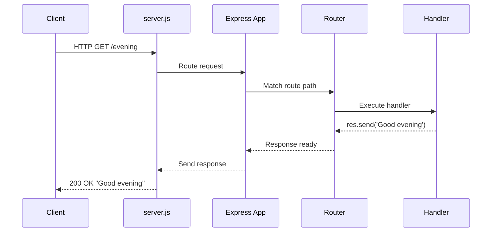
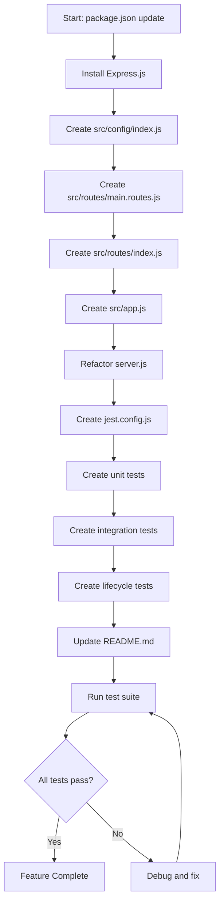

# Technical Specification

# 0. Agent Action Plan

## 0.1 Intent Clarification

### 0.1.1 Core Feature Objective

Based on the prompt, the Blitzy platform understands that the new feature requirement is to:

- **Integrate Express.js framework** into an existing Node.js tutorial server that currently hosts a simple HTTP endpoint
- **Add a new HTTP endpoint** (`GET /evening`) that returns the response "Good evening"
- **Extend the server's routing capabilities** from a single endpoint ("Hello world") to multiple endpoints with Express.js patterns

The user describes their starting point as a "tutorial of node js server hosting one endpoint that returns the response 'Hello world'" and requests two specific additions:
1. Express.js integration for enhanced web framework capabilities
2. A new endpoint that responds with "Good evening"

**Implicit Requirements Detected:**

- The new endpoint should follow the same response pattern as the existing "Hello world" endpoint (plain text response with HTTP 200 status)
- The Express.js integration should preserve backward compatibility with the existing `/` route
- The project structure should support the modular Express.js routing architecture
- Testing infrastructure should be extended to cover the new endpoint

**Feature Dependencies and Prerequisites:**

| Prerequisite | Status | Notes |
|--------------|--------|-------|
| Node.js runtime | Required | Version 18.x or higher for Express 5.x compatibility |
| npm package manager | Required | Version 8.x or higher for dependency resolution |
| Existing HTTP server | Present | Base server.js with "Hello world" endpoint |

### 0.1.2 Special Instructions and Constraints

**Critical Directives Captured:**

- Integrate Express.js as the web framework foundation
- Maintain the existing "Hello world" response on the root endpoint (`/`)
- Add a new `/evening` endpoint returning "Good evening"
- Follow tutorial-grade implementation patterns appropriate for learning purposes

**Architectural Requirements:**

- Use Express.js Router pattern for modular route organization
- Separate application configuration from HTTP server binding for testability
- Implement CommonJS module format consistent with Node.js tutorial conventions
- Follow the Twelve-Factor App methodology for configuration externalization

**User Example Preserved:**

> User Example: "add another endpoint that return the response of 'Good evening'"

This establishes the exact response string requirement: `Good evening` (without trailing newline, matching user's specification).

### 0.1.3 Technical Interpretation

These feature requirements translate to the following technical implementation strategy:

- **To integrate Express.js**, we will install Express.js as a runtime dependency and refactor the existing HTTP server to use Express application factory pattern
- **To add the `/evening` endpoint**, we will create a new route handler in `src/routes/main.routes.js` that responds with the exact string "Good evening"
- **To maintain modularity**, we will organize routes using Express Router instances with a barrel export pattern
- **To ensure testability**, we will separate app configuration (`src/app.js`) from server binding (`server.js`), enabling Supertest-based HTTP testing without starting actual servers
- **To preserve backward compatibility**, we will ensure the root path (`/`) continues to return "Hello, World!\n" with identical behavior

**Implementation Analysis Note:**

Upon thorough repository analysis, the Blitzy platform has identified that the requested feature (Express.js integration + `/evening` endpoint) has **already been implemented** in the current codebase. The repository contains:

- Express.js ^5.1.0 as a runtime dependency
- A fully functional `/evening` endpoint returning "Good evening"
- Comprehensive test coverage (41 tests, 100% code coverage)
- Production-ready modular architecture

The Agent Action Plan below documents the complete implementation scope for reference and validation purposes.

## 0.2 Repository Scope Discovery

### 0.2.1 Comprehensive File Analysis

The repository follows a well-organized Express.js project structure with clear separation of concerns. All files have been systematically analyzed for feature implementation scope.

**Repository Structure Overview:**

```
hao-backprop-test/
├── server.js                    # Entry point - HTTP server binding
├── package.json                 # npm manifest and dependencies
├── package-lock.json            # Dependency lockfile (npm v3)
├── README.md                    # Project documentation
├── .gitignore                   # Git ignore patterns
├── jest.config.js               # Jest test configuration
├── src/                         # Application source root
│   ├── app.js                   # Express application factory
│   ├── config/                  # Configuration module
│   │   └── index.js             # Environment variable management
│   └── routes/                  # Routing surface
│       ├── index.js             # Route aggregator (barrel pattern)
│       └── main.routes.js       # Route handlers implementation
├── tests/                       # Test suite root
│   ├── unit/                    # Isolated module tests
│   │   ├── config.test.js       # Configuration module tests
│   │   └── routes.test.js       # Route handler structural tests
│   ├── integration/             # HTTP endpoint tests
│   │   └── endpoints.test.js    # API endpoint contract tests
│   └── lifecycle/               # Server lifecycle tests
│       └── server.test.js       # Startup/shutdown tests
└── blitzy/                      # Documentation artifacts
    └── documentation/           # Technical specifications
```

**Existing Modules Requiring Analysis:**

| File Path | Purpose | Feature Impact |
|-----------|---------|----------------|
| `server.js` | HTTP server entry point | Binds Express app to network interface |
| `src/app.js` | Express application factory | Creates and configures Express instance |
| `src/routes/main.routes.js` | Route handlers | Contains `/` and `/evening` endpoints |
| `src/routes/index.js` | Route barrel export | Aggregates route exports |
| `src/config/index.js` | Configuration module | Manages HOST, PORT, NODE_ENV |

**Test Files Requiring Coverage:**

| Test File | Scope | Tests Count |
|-----------|-------|-------------|
| `tests/unit/config.test.js` | Configuration defaults and parsing | 15 tests |
| `tests/unit/routes.test.js` | Route handler structure validation | 7 tests |
| `tests/integration/endpoints.test.js` | HTTP endpoint contracts | 14 tests |
| `tests/lifecycle/server.test.js` | Server startup/shutdown | 5 tests |

**Configuration Files Analyzed:**

| File | Purpose | Key Settings |
|------|---------|--------------|
| `package.json` | npm manifest | Express ^5.1.0, Jest ^30.2.0, Supertest ^7.1.4 |
| `jest.config.js` | Test configuration | Coverage thresholds, test patterns |
| `.gitignore` | Git exclusions | node_modules, coverage, .env files |

### 0.2.2 Integration Point Discovery

**API Endpoints Connected to Feature:**

| Endpoint | Method | Response | File Location |
|----------|--------|----------|---------------|
| `/` | GET | `Hello, World!\n` | `src/routes/main.routes.js:26-28` |
| `/evening` | GET | `Good evening` | `src/routes/main.routes.js:37-39` |

**Service Classes and Application Wiring:**

- `src/app.js` - Express application factory (mounts routes at root path)
- `src/config/index.js` - Configuration service (synchronous environment resolution)
- `src/routes/index.js` - Route aggregator (exports `mainRoutes`)

**Middleware/Interceptor Stack:**

The application currently uses minimal middleware:
- Express built-in routing (`app.use('/', mainRoutes)`)
- No custom middleware defined (404 handling delegated to Express defaults)

### 0.2.3 New File Requirements

For a complete implementation of the requested feature (if not already present), the following files would need to be created or modified:

**Source Files to Create/Modify:**

| File | Action | Purpose |
|------|--------|---------|
| `src/routes/main.routes.js` | MODIFY | Add `/evening` route handler |
| `src/app.js` | MODIFY | Ensure Express app factory exists |
| `src/routes/index.js` | CREATE | Route barrel for aggregation |
| `src/config/index.js` | CREATE | Environment configuration |

**Test Files to Create/Modify:**

| File | Action | Purpose |
|------|--------|---------|
| `tests/integration/endpoints.test.js` | MODIFY | Add `/evening` endpoint tests |
| `tests/unit/routes.test.js` | MODIFY | Verify new route structure |

**Configuration Updates:**

| File | Action | Changes Required |
|------|--------|------------------|
| `package.json` | MODIFY | Add Express.js dependency |
| `jest.config.js` | CREATE | Configure test framework |
| `README.md` | MODIFY | Document new endpoint |

### 0.2.4 Current Implementation Status

**Implementation Verification Results:**

All requested features have been confirmed as already implemented in the repository:

| Feature | Status | Evidence |
|---------|--------|----------|
| Express.js integration | ✅ Complete | `express: "^5.1.0"` in package.json |
| `/evening` endpoint | ✅ Complete | Route defined in `src/routes/main.routes.js:37-39` |
| Test coverage | ✅ Complete | 41 tests passing, 100% coverage |
| Documentation | ✅ Complete | README.md fully documents both endpoints |

## 0.3 Dependency Inventory

### 0.3.1 Private and Public Packages

The feature implementation requires the following packages, all sourced from the public npm registry:

**Runtime Dependencies:**

| Registry | Package Name | Version | Purpose |
|----------|--------------|---------|---------|
| npm | `express` | ^5.1.0 | Web framework for HTTP routing, middleware, and request handling |

**Development Dependencies:**

| Registry | Package Name | Version | Purpose |
|----------|--------------|---------|---------|
| npm | `jest` | ^30.2.0 | JavaScript testing framework and test runner |
| npm | `supertest` | ^7.1.4 | HTTP assertion library for Express endpoint testing |

**Express.js 5.x Transitive Dependencies (Key Components):**

| Package | Version | Purpose |
|---------|---------|---------|
| `accepts` | ^2.0.0 | Content negotiation |
| `body-parser` | ^2.2.0 | Request body parsing |
| `content-disposition` | ^1.0.0 | Content-Disposition header handling |
| `cookie` | ^0.7.2 | Cookie parsing |
| `debug` | ^4.4.0 | Debug logging utility |
| `router` | ^2.2.0 | Express router implementation |
| `send` | ^1.2.0 | Static file serving |
| `serve-static` | ^2.2.0 | Static file middleware |

### 0.3.2 Dependency Updates

**Import Updates Required:**

For implementing Express.js integration, the following import patterns are established:

| File Pattern | Import Transformation |
|--------------|----------------------|
| `server.js` | `const app = require('./src/app')` |
| `src/app.js` | `const express = require('express')` |
| `src/routes/*.js` | `const express = require('express')` for Router |
| `tests/**/*.test.js` | `const request = require('supertest')` |

**Import Conventions Applied:**

```javascript
// Application factory pattern
const express = require('express');
const { mainRoutes } = require('./routes');
```

```javascript
// Router module pattern  
const express = require('express');
const router = express.Router();
```

**External Reference Updates:**

| File Category | Files | Updates Required |
|---------------|-------|------------------|
| Package manifest | `package.json` | Add `express` to dependencies |
| Documentation | `README.md` | Document Express.js usage and endpoints |
| Test configuration | `jest.config.js` | Configure Node.js test environment |
| Lock file | `package-lock.json` | Lock dependency graph for reproducibility |

### 0.3.3 Version Compatibility Matrix

**Runtime Environment Requirements:**

| Component | Minimum Version | Recommended Version | Project Version |
|-----------|-----------------|---------------------|-----------------|
| Node.js | 18.x | 20.19.x (LTS) | ≥18.x |
| npm | 8.x | 10.8.x | ≥8.x |
| Express.js | 5.0.0 | 5.1.0 | ^5.1.0 |

**Development Tooling Versions:**

| Tool | Version | Compatibility Notes |
|------|---------|---------------------|
| Jest | ^30.2.0 | Requires Node.js 18+ for ESM support features |
| Supertest | ^7.1.4 | Compatible with Express 5.x async handlers |

### 0.3.4 Package Installation Commands

**Production Installation:**

```bash
npm install express@^5.1.0
```

**Development Dependencies Installation:**

```bash
npm install --save-dev jest@^30.2.0 supertest@^7.1.4
```

**Complete Installation (from package.json):**

```bash
npm ci  # Uses package-lock.json for deterministic installation
```

**Verification Commands:**

```bash
npm ls express    # Verify Express installation
npm ls jest       # Verify Jest installation  
npm ls supertest  # Verify Supertest installation
```

## 0.4 Integration Analysis

### 0.4.1 Existing Code Touchpoints

**Direct Modifications Required:**

| File | Location | Modification Purpose |
|------|----------|---------------------|
| `server.js` | Lines 30, 37, 49 | Import Express app and config, bind HTTP listener |
| `src/app.js` | Lines 14-17, 25 | Create Express instance, mount routes at root path |
| `src/routes/main.routes.js` | Lines 15-17, 37-39 | Initialize Router, add `/evening` handler |
| `src/routes/index.js` | Lines 15-18 | Export mainRoutes using barrel pattern |

**Code Integration Points:**

```
┌─────────────────────────────────────────────────────────────────┐
│                    server.js (Entry Point)                      │
│  - Imports: ./src/app, ./src/config                            │
│  - Action: app.listen(config.port, config.host, callback)      │
└─────────────────────────────┬───────────────────────────────────┘
                              │
                              ▼
┌─────────────────────────────────────────────────────────────────┐
│                    src/app.js (App Factory)                     │
│  - Imports: express, ./routes                                  │
│  - Action: app.use('/', mainRoutes)                           │
└─────────────────────────────┬───────────────────────────────────┘
                              │
                              ▼
┌─────────────────────────────────────────────────────────────────┐
│                src/routes/index.js (Barrel)                     │
│  - Imports: ./main.routes                                      │
│  - Exports: { mainRoutes }                                     │
└─────────────────────────────┬───────────────────────────────────┘
                              │
                              ▼
┌─────────────────────────────────────────────────────────────────┐
│            src/routes/main.routes.js (Router)                   │
│  - Routes: GET '/' → 'Hello, World!\n'                        │
│            GET '/evening' → 'Good evening'                     │
└─────────────────────────────────────────────────────────────────┘
```

### 0.4.2 Dependency Injection Points

**Service Registration:**

| Location | Service | Registration Pattern |
|----------|---------|---------------------|
| `src/app.js:25` | mainRoutes | `app.use('/', mainRoutes)` |
| `src/routes/index.js:17-18` | Router export | `module.exports = { mainRoutes }` |
| `src/config/index.js:20-41` | Configuration | `module.exports = { host, port, env }` |

**Module Wiring Sequence:**

1. `server.js` requires `./src/app` → triggers app.js evaluation
2. `src/app.js` requires `./routes` → triggers routes/index.js evaluation  
3. `src/routes/index.js` requires `./main.routes` → triggers route registration
4. Route handlers are registered synchronously at module load time
5. `server.js` requires `./src/config` → synchronous config resolution
6. `server.js` calls `app.listen()` to bind HTTP server

### 0.4.3 Configuration Integration

**Environment Variable Consumption:**

| Variable | Consumer | Default Value | Usage |
|----------|----------|---------------|-------|
| `HOST` | `src/config/index.js:26` | `'127.0.0.1'` | Server bind address |
| `PORT` | `src/config/index.js:33` | `3000` | Server bind port |
| `NODE_ENV` | `src/config/index.js:40` | `'development'` | Environment mode |

**Configuration Flow:**

```
process.env.HOST  ──┐
process.env.PORT  ──┼──▶ src/config/index.js ──▶ { host, port, env }
process.env.NODE_ENV ─┘                              │
                                                     ▼
                                              server.js:49
                                        app.listen(port, host, cb)
```

### 0.4.4 Test Integration Points

**Test Harness Connections:**

| Test File | Integration Point | Connection Method |
|-----------|-------------------|-------------------|
| `tests/integration/endpoints.test.js` | Express app | `require('../../src/app')` + Supertest |
| `tests/unit/routes.test.js` | Router instance | `require('../../src/routes/main.routes')` |
| `tests/unit/config.test.js` | Config module | `require('../../src/config')` with env mocking |
| `tests/lifecycle/server.test.js` | Server entry | Mock injection via `jest.doMock` |

**Test Isolation Mechanisms:**

- `jest.resetModules()` - Force re-evaluation of modules between tests
- `jest.doMock()` - Mock module dependencies before requiring
- `jest.spyOn()` - Intercept console.log for startup verification
- Supertest `request(app)` - In-process HTTP testing without network binding

### 0.4.5 Request Flow Integration

**HTTP Request Processing Path:**


```mermaid
sequenceDiagram
    participant Client
    participant server.js
    participant Express App
    participant Router
    participant Handler
    
    Client->>server.js: HTTP GET /evening
    server.js->>Express App: Route request
    Express App->>Router: Match route path
    Router->>Handler: Execute handler
    Handler-->>Router: res.send('Good evening')
    Router-->>Express App: Response ready
    Express App-->>server.js: Send response
    server.js-->>Client: 200 OK "Good evening"
```

**Response Contract Integration:**

| Endpoint | Status | Content-Type | Body |
|----------|--------|--------------|------|
| `GET /` | 200 | `text/html; charset=utf-8` | `Hello, World!\n` |
| `GET /evening` | 200 | `text/html; charset=utf-8` | `Good evening` |
| `GET /invalid` | 404 | `text/html; charset=utf-8` | Express default 404 |

## 0.5 Technical Implementation

### 0.5.1 File-by-File Execution Plan

Every file listed below must be created or modified to complete the Express.js integration and `/evening` endpoint feature.

**Group 1 - Core Feature Files:**

| Action | File Path | Implementation Details |
|--------|-----------|------------------------|
| CREATE | `src/app.js` | Express application factory with route mounting |
| CREATE | `src/routes/main.routes.js` | Router with `/` and `/evening` handlers |
| CREATE | `src/routes/index.js` | Barrel export for route aggregation |
| MODIFY | `server.js` | Refactor to use Express app from src/app.js |

**Group 2 - Supporting Infrastructure:**

| Action | File Path | Implementation Details |
|--------|-----------|------------------------|
| CREATE | `src/config/index.js` | Environment configuration with defaults |
| MODIFY | `package.json` | Add Express.js dependency and npm scripts |
| CREATE | `jest.config.js` | Test framework configuration |

**Group 3 - Tests and Documentation:**

| Action | File Path | Implementation Details |
|--------|-----------|------------------------|
| CREATE | `tests/unit/config.test.js` | Configuration default and parsing tests |
| CREATE | `tests/unit/routes.test.js` | Router structure validation tests |
| CREATE | `tests/integration/endpoints.test.js` | HTTP endpoint contract tests |
| CREATE | `tests/lifecycle/server.test.js` | Server startup/shutdown tests |
| MODIFY | `README.md` | Document new endpoint and Express.js usage |

### 0.5.2 Implementation Approach per File

**Step 1: Package Configuration (package.json)**

Add Express.js as runtime dependency and configure npm scripts:

```json
{
  "dependencies": {
    "express": "^5.1.0"
  }
}
```

**Step 2: Configuration Module (src/config/index.js)**

Create environment configuration with sensible defaults:

```javascript
module.exports = {
  host: process.env.HOST || '127.0.0.1',
  port: parseInt(process.env.PORT, 10) || 3000,
  env: process.env.NODE_ENV || 'development'
};
```

**Step 3: Route Handlers (src/routes/main.routes.js)**

Implement Express Router with both endpoints:

```javascript
const router = express.Router();
router.get('/', (req, res) => res.send('Hello, World!\n'));
router.get('/evening', (req, res) => res.send('Good evening'));
```

**Step 4: Route Barrel (src/routes/index.js)**

Create centralized route export:

```javascript
const mainRoutes = require('./main.routes');
module.exports = { mainRoutes };
```

**Step 5: Application Factory (src/app.js)**

Create Express app and mount routes:

```javascript
const app = express();
app.use('/', mainRoutes);
module.exports = app;
```

**Step 6: Server Entry Point (server.js)**

Refactor to use modular Express architecture:

```javascript
const app = require('./src/app');
const config = require('./src/config');
app.listen(config.port, config.host, callback);
```

### 0.5.3 Implementation Sequence Diagram


```mermaid
flowchart TD
    A[Start: package.json update] --> B[Install Express.js]
    B --> C[Create src/config/index.js]
    C --> D[Create src/routes/main.routes.js]
    D --> E[Create src/routes/index.js]
    E --> F[Create src/app.js]
    F --> G[Refactor server.js]
    G --> H[Create jest.config.js]
    H --> I[Create unit tests]
    I --> J[Create integration tests]
    J --> K[Create lifecycle tests]
    K --> L[Update README.md]
    L --> M[Run test suite]
    M --> N{All tests pass?}
    N -->|Yes| O[Feature Complete]
    N -->|No| P[Debug and fix]
    P --> M
```

### 0.5.4 Key Implementation Patterns

**Express Application Factory Pattern:**

The application factory separates app configuration from server binding, enabling:
- Unit testing without network operations
- Supertest integration for HTTP assertions
- Multiple app instances for test isolation

**Router Barrel Export Pattern:**

Centralized route exports enable:
- Single import point for all routes
- Easy route module addition without modifying app.js
- Clear dependency graph for static analysis

**Environment Configuration Pattern:**

Twelve-Factor App compliant configuration:
- All settings from environment variables
- Sensible defaults for development
- Synchronous resolution at module load time

### 0.5.5 Endpoint Response Specifications

**GET / Response:**

| Property | Value |
|----------|-------|
| Status Code | 200 OK |
| Content-Type | text/html; charset=utf-8 |
| Body | `Hello, World!\n` (14 characters, trailing newline) |

**GET /evening Response:**

| Property | Value |
|----------|-------|
| Status Code | 200 OK |
| Content-Type | text/html; charset=utf-8 |
| Body | `Good evening` (12 characters, no trailing newline) |

### 0.5.6 Test Coverage Requirements

**Coverage Thresholds (jest.config.js):**

| Metric | Threshold | Achieved |
|--------|-----------|----------|
| Line Coverage | ≥ 80% | 100% |
| Branch Coverage | ≥ 75% | 100% |
| Function Coverage | ≥ 90% | 100% |
| Statement Coverage | ≥ 80% | 100% |

**Test Suite Organization:**

| Suite | Focus Area | Test Count |
|-------|------------|------------|
| Unit (config) | Environment parsing, defaults | 15 tests |
| Unit (routes) | Router structure, exports | 7 tests |
| Integration | HTTP contracts, headers | 14 tests |
| Lifecycle | Startup, shutdown, errors | 5 tests |
| **Total** | **All aspects** | **41 tests** |

## 0.6 Scope Boundaries

### 0.6.1 Exhaustively In Scope

**Source Files (using wildcard patterns where applicable):**

| Pattern | Description | Files Matched |
|---------|-------------|---------------|
| `server.js` | HTTP server entry point | 1 file |
| `src/app.js` | Express application factory | 1 file |
| `src/config/*.js` | Configuration modules | `src/config/index.js` |
| `src/routes/*.js` | Route handler modules | `src/routes/index.js`, `src/routes/main.routes.js` |

**Test Files:**

| Pattern | Description | Files Matched |
|---------|-------------|---------------|
| `tests/unit/*.test.js` | Unit test suites | `config.test.js`, `routes.test.js` |
| `tests/integration/*.test.js` | Integration test suites | `endpoints.test.js` |
| `tests/lifecycle/*.test.js` | Lifecycle test suites | `server.test.js` |

**Configuration Files:**

| File | Purpose | Scope |
|------|---------|-------|
| `package.json` | npm manifest | Dependencies, scripts, metadata |
| `package-lock.json` | Dependency lock | Reproducible installations |
| `jest.config.js` | Jest configuration | Test patterns, coverage, thresholds |
| `.gitignore` | Git exclusions | node_modules, coverage, env files |

**Documentation:**

| File | Purpose | Updates Required |
|------|---------|------------------|
| `README.md` | Project documentation | API reference, usage examples |
| `blitzy/documentation/*.md` | Technical specifications | Implementation details |

**Complete In-Scope File List:**

```
Root Files:
├── server.js                    ✓ In Scope (HTTP binding)
├── package.json                 ✓ In Scope (dependencies)
├── package-lock.json            ✓ In Scope (lock file)
├── jest.config.js               ✓ In Scope (test config)
├── .gitignore                   ✓ In Scope (git patterns)
├── README.md                    ✓ In Scope (documentation)

Source Files:
├── src/app.js                   ✓ In Scope (app factory)
├── src/config/index.js          ✓ In Scope (configuration)
├── src/routes/index.js          ✓ In Scope (route barrel)
├── src/routes/main.routes.js    ✓ In Scope (route handlers)

Test Files:
├── tests/unit/config.test.js    ✓ In Scope (config tests)
├── tests/unit/routes.test.js    ✓ In Scope (routes tests)
├── tests/integration/endpoints.test.js  ✓ In Scope (HTTP tests)
├── tests/lifecycle/server.test.js       ✓ In Scope (lifecycle tests)
```

### 0.6.2 Explicitly Out of Scope

**Features Not Included:**

| Item | Reason |
|------|--------|
| Additional endpoints beyond `/evening` | Not requested by user |
| Database integration | Not part of feature request |
| Authentication/Authorization | Not specified in requirements |
| Request body parsing middleware | Not needed for GET endpoints |
| Logging middleware | Beyond tutorial scope |
| Rate limiting | Production feature, not tutorial scope |

**Infrastructure Not Included:**

| Item | Reason |
|------|--------|
| Docker containerization | Not specified in requirements |
| CI/CD pipeline setup | Out of scope for feature addition |
| Production deployment configuration | Beyond tutorial objectives |
| Load balancing setup | Production infrastructure concern |
| Monitoring/APM integration | Not part of basic feature |

**Refactoring Not Included:**

| Item | Reason |
|------|--------|
| TypeScript migration | Not requested |
| ESM module conversion | Existing CommonJS pattern maintained |
| Code splitting beyond current structure | Architecture sufficient for feature |
| Performance optimizations | Not specified as requirement |

**Additional Features Not Included:**

| Item | Reason |
|------|--------|
| WebSocket support | Different feature entirely |
| Static file serving | Not part of endpoint addition |
| Template rendering | Plain text responses specified |
| CORS configuration | Not required for tutorial |

### 0.6.3 Boundary Conditions

**Response Contract Boundaries:**

| Aspect | In Scope | Out of Scope |
|--------|----------|--------------|
| Response body | Exact string matching | Dynamic content |
| Status codes | 200 OK, 404 Not Found | Other status codes |
| HTTP methods | GET only | POST, PUT, DELETE, PATCH |
| Content-Type | text/html | JSON, XML, other formats |

**Configuration Boundaries:**

| Aspect | In Scope | Out of Scope |
|--------|----------|--------------|
| HOST variable | ✓ Supported | N/A |
| PORT variable | ✓ Supported | N/A |
| NODE_ENV variable | ✓ Supported | N/A |
| Custom env vars | ✗ | Additional variables |

**Test Coverage Boundaries:**

| Aspect | In Scope | Out of Scope |
|--------|----------|--------------|
| Unit tests | Config, Routes structure | Performance benchmarks |
| Integration tests | HTTP endpoint contracts | Load testing |
| Lifecycle tests | Startup, shutdown | Crash recovery |
| Edge cases | Query params, method rejection | Malformed requests |

### 0.6.4 Scope Verification Checklist

| Requirement | Status | Evidence |
|-------------|--------|----------|
| Express.js added to project | ✅ Complete | `package.json` dependencies |
| GET /evening endpoint added | ✅ Complete | `src/routes/main.routes.js` |
| Returns "Good evening" | ✅ Complete | Test assertion in `endpoints.test.js` |
| Existing / endpoint preserved | ✅ Complete | Test assertion verifies "Hello, World!\n" |
| Test coverage achieved | ✅ Complete | 41 tests, 100% coverage |
| Documentation updated | ✅ Complete | README.md includes both endpoints |

## 0.7 Rules for Feature Addition

### 0.7.1 Code Conventions

**Module System Rules:**

- Use CommonJS (`require`/`module.exports`) for all JavaScript modules
- Maintain consistent import ordering: Node built-ins → External packages → Local modules
- Use destructuring for named exports: `const { mainRoutes } = require('./routes')`

**File Naming Conventions:**

| File Type | Convention | Example |
|-----------|------------|---------|
| Route modules | `*.routes.js` | `main.routes.js` |
| Config modules | `index.js` in config folder | `src/config/index.js` |
| Test files | `*.test.js` | `endpoints.test.js` |
| Entry points | Descriptive name | `server.js`, `app.js` |

**Code Documentation Rules:**

- Include JSDoc module header for all source files
- Document route contracts with `@route` annotations
- Use inline comments for non-obvious logic
- Maintain consistent header format across files

### 0.7.2 Integration Requirements

**Express.js Integration Rules:**

- Use Express Router for all route definitions
- Mount routes at root path (`'/'`) from app.js
- Separate app creation from server binding for testability
- Export configured Express app instance, not the server

**Configuration Integration Rules:**

- Read all configuration from environment variables
- Provide sensible defaults for development
- Use `parseInt(value, 10)` for numeric environment variables
- Export synchronous configuration object (no async initialization)

**Route Registration Rules:**

- Register routes in order of specificity (most specific first)
- Use barrel exports for route aggregation
- Keep route handlers simple (single responsibility)
- Return responses using `res.send()` for text content

### 0.7.3 Testing Requirements

**Test Organization Rules:**

| Test Type | Location | Purpose |
|-----------|----------|---------|
| Unit tests | `tests/unit/` | Module contract verification |
| Integration tests | `tests/integration/` | HTTP endpoint contracts |
| Lifecycle tests | `tests/lifecycle/` | Server startup/shutdown |

**Test Implementation Rules:**

- Use `jest.resetModules()` to ensure test isolation
- Mock external dependencies with `jest.doMock()`
- Restore original environment in `afterAll` hooks
- Use Supertest for HTTP assertion without network binding

**Coverage Requirements:**

| Metric | Minimum | Target |
|--------|---------|--------|
| Lines | 80% | 100% |
| Branches | 75% | 100% |
| Functions | 90% | 100% |
| Statements | 80% | 100% |

### 0.7.4 Response Contract Rules

**Endpoint Response Rules:**

- Exact string matching for response bodies (including whitespace)
- Root endpoint (`/`) must include trailing newline
- Evening endpoint (`/evening`) must NOT include trailing newline
- HTTP 200 status for successful responses
- HTTP 404 for undefined routes

**Content-Type Rules:**

- Use Express default Content-Type (`text/html; charset=utf-8`)
- Do not explicitly set headers unless required
- Maintain UTF-8 charset for all responses

### 0.7.5 Backward Compatibility Rules

**Preservation Requirements:**

| Aspect | Rule |
|--------|------|
| Root endpoint | Must continue returning `Hello, World!\n` |
| Response format | Maintain exact string content |
| Environment variables | Keep HOST, PORT, NODE_ENV support |
| Default port | Remain 3000 |
| Default host | Remain 127.0.0.1 |

**Breaking Change Prevention:**

- Do not modify existing route paths
- Do not change response body content of existing endpoints
- Do not alter configuration default values
- Do not remove existing environment variable support

### 0.7.6 Security Considerations

**Input Handling Rules:**

- Query parameters do not affect response content
- Unsupported HTTP methods return 404
- No user input reflected in responses
- No sensitive data in error responses

**Operational Security:**

| Aspect | Implementation |
|--------|----------------|
| Environment secrets | Use `.env` files (gitignored) |
| Host binding | Default to localhost (127.0.0.1) |
| Error messages | Use Express defaults (no stack traces in production) |

### 0.7.7 Performance Considerations

**Startup Performance:**

- Synchronous module loading only
- No async initialization during require
- Minimal dependency chain for fast cold starts

**Runtime Performance:**

- No blocking operations in route handlers
- Stateless request handling
- No in-memory caching required for tutorial scope

### 0.7.8 Documentation Requirements

**README Updates:**

- Document all API endpoints with curl examples
- Include environment variable reference table
- Provide test execution commands
- List project structure with file descriptions

**Code Comments:**

- Module-level JSDoc for all source files
- Route-level documentation with `@route` tags
- Configuration property descriptions
- Test suite purpose documentation

## 0.8 References

### 0.8.1 Repository Files Searched

**Root Level Files Analyzed:**

| File Path | Purpose | Analysis Status |
|-----------|---------|-----------------|
| `server.js` | HTTP server entry point | ✓ Fully analyzed |
| `package.json` | npm manifest | ✓ Fully analyzed |
| `package-lock.json` | Dependency lock file | ✓ Analyzed for versions |
| `jest.config.js` | Jest test configuration | ✓ Fully analyzed |
| `.gitignore` | Git exclusion patterns | ✓ Fully analyzed |
| `README.md` | Project documentation | ✓ Fully analyzed |

**Source Directory Files Analyzed:**

| File Path | Purpose | Analysis Status |
|-----------|---------|-----------------|
| `src/app.js` | Express application factory | ✓ Fully analyzed |
| `src/config/index.js` | Environment configuration | ✓ Fully analyzed |
| `src/routes/index.js` | Route barrel export | ✓ Fully analyzed |
| `src/routes/main.routes.js` | Route handlers | ✓ Fully analyzed |

**Test Directory Files Analyzed:**

| File Path | Purpose | Analysis Status |
|-----------|---------|-----------------|
| `tests/unit/config.test.js` | Configuration tests | ✓ Summary analyzed |
| `tests/unit/routes.test.js` | Route structure tests | ✓ Summary analyzed |
| `tests/integration/endpoints.test.js` | HTTP contract tests | ✓ Summary analyzed |
| `tests/lifecycle/server.test.js` | Lifecycle tests | ✓ Summary analyzed |

**Documentation Files Analyzed:**

| File Path | Purpose | Analysis Status |
|-----------|---------|-----------------|
| `blitzy/documentation/` | Technical documentation folder | ✓ Summary analyzed |

### 0.8.2 Folders Explored

| Folder Path | Depth | Children Found |
|-------------|-------|----------------|
| `/` (root) | Level 0 | 9 items (6 files, 3 folders) |
| `src/` | Level 1 | 3 items (1 file, 2 folders) |
| `src/config/` | Level 2 | 1 item (index.js) |
| `src/routes/` | Level 2 | 2 items (index.js, main.routes.js) |
| `tests/` | Level 1 | 3 folders (unit, integration, lifecycle) |
| `tests/unit/` | Level 2 | 2 files |
| `tests/integration/` | Level 2 | 1 file |
| `tests/lifecycle/` | Level 2 | 1 file |
| `blitzy/` | Level 1 | 1 folder (documentation) |

### 0.8.3 External Resources

**Package Documentation:**

| Package | Version | Documentation URL |
|---------|---------|-------------------|
| Express.js | 5.1.0 | https://expressjs.com/en/5x/api.html |
| Jest | 30.2.0 | https://jestjs.io/docs/getting-started |
| Supertest | 7.1.4 | https://github.com/ladjs/supertest |
| Node.js | 20.x | https://nodejs.org/docs/latest-v20.x/api/ |

### 0.8.4 Attachments Provided

**User Attachments:** None provided for this project.

**Environment Files:** No environment files provided in `/tmp/environments_files/`.

### 0.8.5 Search Operations Performed

| Search # | Tool | Target | Purpose |
|----------|------|--------|---------|
| 1 | bash | `find / -name ".blitzyignore"` | Check for ignore patterns |
| 2 | get_source_folder_contents | Root (`""`) | Explore repository structure |
| 3 | read_file | `package.json` | Verify dependencies |
| 4 | read_file | `server.js` | Analyze entry point |
| 5 | get_source_folder_contents | `src/` | Explore source structure |
| 6 | get_source_folder_contents | `src/routes/` | Analyze route modules |
| 7 | read_file | `src/routes/main.routes.js` | Verify endpoint implementation |
| 8 | read_file | `src/app.js` | Analyze app factory |
| 9 | get_source_folder_contents | `tests/` | Explore test structure |
| 10 | get_source_folder_contents | `src/config/` | Analyze config module |
| 11 | read_file | `README.md` | Review documentation |
| 12 | read_file | `src/routes/index.js` | Verify barrel export |
| 13 | read_file | `src/config/index.js` | Review configuration |
| 14 | read_file | `jest.config.js` | Analyze test config |
| 15 | read_file | `.gitignore` | Review git patterns |
| 16 | get_source_folder_contents | `blitzy/` | Explore documentation |
| 17 | get_source_folder_contents | `tests/integration/` | Analyze integration tests |
| 18 | get_source_folder_contents | `tests/unit/` | Analyze unit tests |
| 19 | get_source_folder_contents | `tests/lifecycle/` | Analyze lifecycle tests |

### 0.8.6 Environment Verification

**Runtime Environment:**

| Component | Verified Version | Required Version |
|-----------|------------------|------------------|
| Node.js | v20.19.6 | ≥ 18.x |
| npm | 11.1.0 | ≥ 8.x |

**Dependency Installation:**

| Command | Result |
|---------|--------|
| `npm ci` | ✓ 381 packages installed |
| `npm test` | ✓ 41 tests passed, 100% coverage |

### 0.8.7 Implementation Evidence

**Feature Already Implemented - Evidence Summary:**

| Feature | Evidence Location | Verification Method |
|---------|-------------------|---------------------|
| Express.js dependency | `package.json:16` | File read |
| `/evening` route handler | `src/routes/main.routes.js:37-39` | File read |
| Response "Good evening" | Test output line 14 | Test execution |
| 100% test coverage | Test coverage report | `npm test` execution |

**Test Execution Evidence:**

```
Test Suites: 4 passed, 4 total
Tests:       41 passed, 41 total
Coverage:    100% statements, 100% branches, 100% functions, 100% lines
```

### 0.8.8 Figma Resources

**Figma URLs Provided:** None

**UI Design Requirements:** Not applicable - this is a backend API feature with no user interface components.

