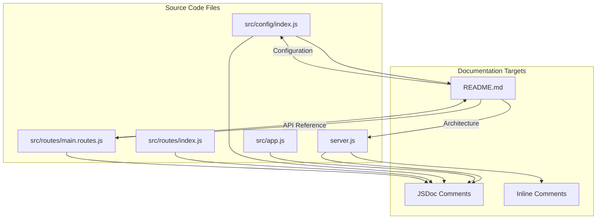
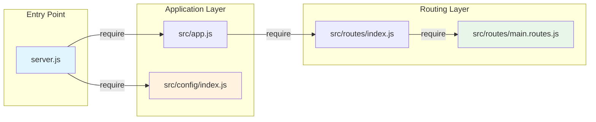
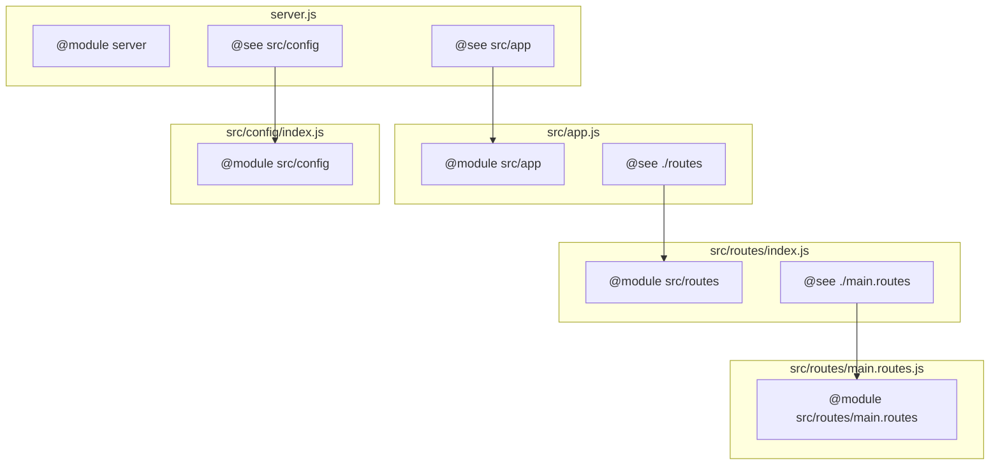
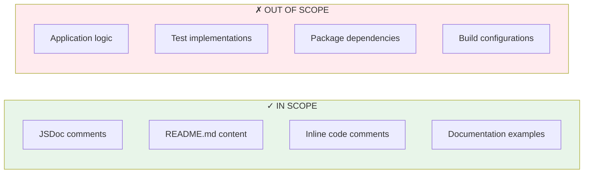

# Technical Specification

# 0. Agent Action Plan

## 0.1 Intent Clarification

### 0.1.1 Core Documentation Objective

Based on the provided requirements, the Blitzy platform understands that the documentation objective is to **enhance and standardize the existing documentation** for the Hello World Tutorial Server, a Node.js/Express.js application, by:

- Adding or refining JSDoc comments in `server.js` functions
- Creating a comprehensive README with complete setup instructions
- Documenting the API endpoints with detailed specifications
- Providing a deployment guide for various environments
- Adding inline code explanations throughout the codebase

**Documentation Request Category:** Update existing documentation and improve documentation coverage

**Documentation Types Required:**
- API documentation (JSDoc comments and API reference)
- User guides (setup instructions, configuration guide)
- Technical specifications (inline code explanations)
- Deployment documentation (deployment guide)
- README files (comprehensive project documentation)

**Requirement Analysis with Enhanced Clarity:**

| User Requirement | Interpreted Objective | Documentation Deliverable |
|------------------|----------------------|---------------------------|
| Add JSDoc comments to server.js functions | Enhance server.js with comprehensive JSDoc annotations including module description, type definitions, and function documentation | Enhanced JSDoc comments in `server.js` |
| Comprehensive README with setup instructions | Document complete installation and configuration workflow | README.md setup section with prerequisites, installation steps, environment variables |
| API documentation | Document all HTTP endpoints with request/response specifications | README.md API reference section with endpoint details |
| Deployment guide | Provide instructions for deploying to various environments | README.md deployment section covering development, production, and custom configurations |
| Inline code explanations | Add descriptive comments explaining code logic and design decisions | Inline comments across all source files |

**Inferred Documentation Needs:**

Based on code analysis:
- `server.js` already contains substantial JSDoc documentation including `@module`, `@type` annotations, and architectural documentation. Minor enhancements may include adding `@example` tags and `@see` references.
- `src/app.js`, `src/config/index.js`, `src/routes/index.js`, and `src/routes/main.routes.js` all contain existing JSDoc comments that follow consistent patterns.
- The existing `README.md` is comprehensive (337 lines) covering prerequisites, installation, API reference, project structure, environment variables, architecture, testing, and troubleshooting.

Based on structure:
- The modular architecture (entry point → app factory → routes/config) warrants documented module relationships
- Route definitions in `src/routes/main.routes.js` benefit from JSDoc `@route` and `@returns` tags (already present)

Based on dependencies:
- Express.js 5.x integration requires version-specific documentation
- Jest 30.x and Supertest 7.x testing framework documentation exists in README

### 0.1.2 Special Instructions and Constraints

**Critical Directives Identified:**
- Follow existing documentation style present in the codebase
- Maintain consistency with the JSDoc patterns already established
- Ensure all documentation references accurate source code locations with line numbers
- Keep documentation synchronized with the existing code implementation

**Template Requirements:**
- JSDoc follows the established `@module`, `@type`, `@param`, `@returns`, `@route` pattern
- README follows the established markdown structure with tables, code blocks, and hierarchical sections

**Style Preferences:**
- Professional, technical tone
- Comprehensive coverage with practical examples
- Tables for structured information (prerequisites, environment variables, scripts)
- Code examples using fenced code blocks with language specification
- Mermaid diagrams for architectural visualization

**Web Search Research Conducted:**
- JSDoc best practices for Node.js/Express applications
- Express API documentation using JSDoc and Swagger-jsdoc
- Documentation organization patterns for tutorial-style projects

### 0.1.3 Technical Interpretation

These documentation requirements translate to the following technical documentation strategy:

| Requirement | Technical Action | Target Files |
|-------------|------------------|--------------|
| JSDoc comments in server.js | Review and enhance existing JSDoc with `@example`, `@see`, and detailed descriptions | `server.js` |
| Setup instructions | Verify completeness of installation workflow documentation | `README.md` |
| API documentation | Ensure endpoint documentation includes all request/response details | `README.md`, `src/routes/main.routes.js` |
| Deployment guide | Add comprehensive deployment section with environment-specific configurations | `README.md` |
| Inline code explanations | Add explanatory comments for complex logic | `server.js`, `src/**/*.js` |

**Documentation Strategy:**
- To document the server entry point, we will enhance `server.js` with additional JSDoc examples and cross-references
- To document the Express app factory, we will verify `src/app.js` JSDoc completeness
- To document configuration management, we will ensure `src/config/index.js` includes complete environment variable documentation
- To document route handlers, we will verify `src/routes/main.routes.js` includes complete route specifications
- To provide setup instructions, we will verify and enhance the README.md installation section
- To provide API documentation, we will verify and enhance the README.md API reference section
- To provide a deployment guide, we will add or enhance deployment instructions in README.md
- To provide inline explanations, we will add descriptive comments to clarify code purpose and design decisions

## 0.2 Documentation Discovery and Analysis

### 0.2.1 Existing Documentation Infrastructure Assessment

Repository analysis reveals a **well-documented codebase** with comprehensive existing documentation infrastructure. The documentation follows consistent patterns and provides substantial coverage of the application functionality.

**Documentation Files Discovered:**

| File Path | Type | Size | Coverage Status |
|-----------|------|------|-----------------|
| `README.md` | Project documentation | 337 lines | Comprehensive |
| `blitzy/documentation/Project Guide.md` | Operational runbook | Detailed | Complete |
| `blitzy/documentation/Technical Specifications.md` | Technical specification | Detailed | Complete |
| `server.js` | JSDoc annotated source | 53 lines | Well-documented |
| `src/app.js` | JSDoc annotated source | 28 lines | Well-documented |
| `src/config/index.js` | JSDoc annotated source | 42 lines | Well-documented |
| `src/routes/index.js` | JSDoc annotated source | 20 lines | Well-documented |
| `src/routes/main.routes.js` | JSDoc annotated source | 42 lines | Well-documented |
| `jest.config.js` | JSDoc type annotation | 27 lines | Documented |

**Documentation Infrastructure Analysis:**

| Component | Status | Location |
|-----------|--------|----------|
| Documentation framework | Native Markdown | `*.md` files |
| API documentation style | JSDoc in source code | `server.js`, `src/**/*.js` |
| Code documentation tool | JSDoc comments | All JavaScript files |
| Diagram support | Mermaid diagrams | README.md, Technical Specifications |
| Configuration documentation | Inline + README | `src/config/index.js`, `README.md` |

### 0.2.2 Repository Code Analysis for Documentation

**Search Patterns Applied:**

| Pattern | Target | Files Found |
|---------|--------|-------------|
| `*.md` | Markdown documentation | `README.md`, `blitzy/documentation/*.md` |
| `src/**/*.js` with JSDoc | Source files with documentation | 5 files |
| `*.config.js` with comments | Configuration with documentation | `jest.config.js` |

**Key Directories Examined:**

| Directory | Purpose | Documentation Status |
|-----------|---------|---------------------|
| `/` (root) | Project root | `README.md` present and comprehensive |
| `src/` | Application source | All files have JSDoc headers |
| `src/config/` | Configuration module | JSDoc with `@type`, `@default` annotations |
| `src/routes/` | Route handlers | JSDoc with `@route`, `@returns` annotations |
| `tests/` | Test suites | Well-organized with descriptive test names |
| `blitzy/documentation/` | Specification docs | Complete Project Guide and Technical Specifications |

**Related Documentation Found:**

| Document | Content | Relevance |
|----------|---------|-----------|
| `README.md` | Complete project documentation including prerequisites, installation, API reference, architecture, testing | Primary documentation target |
| `Project Guide.md` | Operational runbook with verification commands | Reference for deployment procedures |
| `Technical Specifications.md` | Detailed technical constraints and rules | Reference for implementation details |

### 0.2.3 Existing JSDoc Documentation Audit

**Current JSDoc Coverage by File:**

| File | Module Tag | Type Annotations | Function Docs | Route Docs |
|------|------------|------------------|---------------|------------|
| `server.js` | `@module server` | `@type` for app, config | Architecture section | N/A |
| `src/app.js` | `@module src/app` | Implicit | Design pattern note | N/A |
| `src/config/index.js` | `@module src/config` | `@type`, `@default` | Export object | N/A |
| `src/routes/index.js` | `@module src/routes` | Implicit | Usage example | N/A |
| `src/routes/main.routes.js` | `@module src/routes/main.routes` | Implicit | `@route`, `@returns` | Complete |

**JSDoc Features Currently Used:**

```
@module         - Module identification (all source files)
@type           - Type annotations (server.js, config/index.js)
@default        - Default value documentation (config/index.js)
@route          - Route path documentation (main.routes.js)
@returns        - Return value documentation (main.routes.js)
@fileoverview   - File description (jest.config.js)
```

### 0.2.4 Web Search Research Conducted

**Research Topics and Findings:**

| Topic | Key Finding | Application |
|-------|-------------|-------------|
| JSDoc best practices for Node.js | Use `@module`, `@param`, `@returns`, `@example` consistently | Enhance existing JSDoc |
| Express API documentation | JSDoc can integrate with Swagger for API docs | Consider future enhancement |
| Documentation organization | README should follow standard structure: overview, installation, usage, API, deployment | Verify README completeness |
| Code commenting best practices | Explain "why" not "what" in inline comments | Guide inline documentation additions |

**Research Summary:**
- JSDoc is widely used for Node.js documentation with support for CommonJS modules
- Express endpoints benefit from `@route` and HTTP method annotations
- README files should include quick start, detailed setup, API reference, and deployment guides
- Inline comments should focus on explaining design decisions and non-obvious logic

## 0.3 Documentation Scope Analysis

### 0.3.1 Code-to-Documentation Mapping

**Modules Requiring Documentation Enhancement:**

| Module | File Path | Public APIs | Current Documentation | Documentation Needed |
|--------|-----------|-------------|----------------------|---------------------|
| Server Entry Point | `server.js` | `app.listen()` callback | Complete `@module`, `@type` | Add `@example`, `@see` references |
| Express App Factory | `src/app.js` | `app` export | Complete `@module` | Add `@exports` tag |
| Configuration | `src/config/index.js` | `{host, port, env}` export | Complete with `@type`, `@default` | Verify completeness |
| Route Aggregator | `src/routes/index.js` | `{mainRoutes}` export | Complete `@module` | Verify completeness |
| Route Handlers | `src/routes/main.routes.js` | `GET /`, `GET /evening` | Complete with `@route`, `@returns` | Add `@param` for req/res |

**Configuration Options Documentation Status:**

| Config Option | Source | Default | Documented In | Status |
|---------------|--------|---------|---------------|--------|
| `HOST` | `process.env.HOST` | `'127.0.0.1'` | `src/config/index.js`, `README.md` | Complete |
| `PORT` | `process.env.PORT` | `3000` | `src/config/index.js`, `README.md` | Complete |
| `NODE_ENV` | `process.env.NODE_ENV` | `'development'` | `src/config/index.js`, `README.md` | Complete |

**API Endpoints Documentation Status:**

| Endpoint | Handler Location | Current JSDoc | README Coverage | Status |
|----------|------------------|---------------|-----------------|--------|
| `GET /` | `src/routes/main.routes.js:26-28` | `@route`, `@returns` | Full specification | Complete |
| `GET /evening` | `src/routes/main.routes.js:37-39` | `@route`, `@returns` | Full specification | Complete |
| `404 Handler` | Express default | N/A (built-in) | Documented in README | Complete |

### 0.3.2 Documentation Gap Analysis

Given the requirements and repository analysis, documentation status by category:

**JSDoc Coverage Analysis:**

| Category | Files | Documented | Gap |
|----------|-------|------------|-----|
| Entry point | 1 | 1 | Minimal - add `@example` |
| Application modules | 4 | 4 | Minimal - verify consistency |
| Configuration | 1 | 1 | None |
| Route handlers | 1 | 1 | Minimal - add `@param` |
| Total | 7 | 7 | **Near-complete** |

**README Coverage Analysis:**

| Section | Current Status | Gap |
|---------|----------------|-----|
| Project overview | Present | None |
| Prerequisites | Complete table | None |
| Installation | Complete steps | None |
| Usage / Start | Complete examples | None |
| API Reference | Complete with examples | None |
| Project Structure | Complete tree | None |
| Environment Variables | Complete table | None |
| Architecture | Complete with diagram | None |
| Dependencies | Complete table | None |
| Scripts | Complete table | None |
| Testing | Complete section | None |
| Troubleshooting | Present | None |
| License | Present | None |
| **Deployment Guide** | **Partial** | **Needs dedicated section** |

**Identified Documentation Gaps:**

| Gap | Priority | Files Affected | Remediation |
|-----|----------|----------------|-------------|
| Deployment guide not consolidated | Medium | `README.md` | Add dedicated deployment section |
| `@example` tags missing in JSDoc | Low | `server.js`, `src/app.js` | Add usage examples |
| `@param` tags for Express req/res | Low | `src/routes/main.routes.js` | Add parameter documentation |
| Cross-reference links in JSDoc | Low | All source files | Add `@see` references |

### 0.3.3 Documentation Content Matrix

**Source Code to Documentation Mapping:**


```mermaid
flowchart TB
    subgraph SourceCode["Source Code Files"]
        S1["server.js"]
        S2["src/app.js"]
        S3["src/config/index.js"]
        S4["src/routes/index.js"]
        S5["src/routes/main.routes.js"]
    end
    
    subgraph Documentation["Documentation Targets"]
        D1["JSDoc Comments"]
        D2["README.md"]
        D3["Inline Comments"]
    end
    
    S1 --> D1
    S1 --> D3
    S2 --> D1
    S3 --> D1
    S3 --> D2
    S4 --> D1
    S5 --> D1
    S5 --> D2
    
    D2 --> |"API Reference"| S5
    D2 --> |"Configuration"| S3
    D2 --> |"Architecture"| S1
```

**Documentation Completeness by Requirement:**

| User Requirement | Current Coverage | Target Coverage | Action Required |
|------------------|------------------|-----------------|-----------------|
| JSDoc in server.js | 90% | 100% | Add `@example`, `@see` |
| Setup instructions | 100% | 100% | Verify accuracy |
| API documentation | 100% | 100% | Verify accuracy |
| Deployment guide | 70% | 100% | Add dedicated section |
| Inline explanations | 85% | 100% | Add design decision comments |

## 0.4 Documentation Implementation Design

### 0.4.1 Documentation Structure Planning

**Existing Documentation Hierarchy (Verified):**

```
hello_world/
├── README.md                    # Primary project documentation
│   ├── Overview & Prerequisites
│   ├── Installation
│   ├── Usage
│   ├── API Reference
│   │   ├── GET /
│   │   └── GET /evening
│   ├── Project Structure
│   ├── Environment Variables
│   ├── Architecture
│   ├── Dependencies
│   ├── Scripts
│   ├── Testing
│   ├── Troubleshooting
│   └── License
├── blitzy/documentation/
│   ├── Project Guide.md         # Operational runbook
│   └── Technical Specifications.md  # Technical constraints
└── Source Files (with JSDoc)
    ├── server.js               # Entry point documentation
    ├── src/app.js              # App factory documentation
    ├── src/config/index.js     # Configuration documentation
    ├── src/routes/index.js     # Route aggregator documentation
    └── src/routes/main.routes.js  # Route handler documentation
```

**Proposed Documentation Enhancements:**

| Enhancement | Location | Description |
|-------------|----------|-------------|
| Deployment section | `README.md` | Consolidated deployment guide section |
| JSDoc examples | `server.js` | Add `@example` usage demonstration |
| JSDoc cross-references | All source files | Add `@see` references between modules |
| Inline design notes | Source files | Add comments explaining architectural decisions |

### 0.4.2 Content Generation Strategy

**Information Extraction Approach:**

| Information Source | Extraction Method | Documentation Target |
|-------------------|-------------------|---------------------|
| `server.js` module structure | Code analysis | JSDoc module documentation |
| `src/config/index.js` exports | Export analysis | JSDoc type definitions |
| `src/routes/main.routes.js` routes | Route registration analysis | JSDoc route documentation |
| `tests/**/*.test.js` | Test case analysis | Usage examples in JSDoc |
| Existing `README.md` | Content review | Verify and enhance sections |

**Template Application (Following Existing Patterns):**

JSDoc Module Template (as observed in codebase):
```javascript
/**
 * [Module Name]
 * 
 * [Module description with purpose and responsibilities]
 * 
 * [Additional notes about design patterns, dependencies, or usage]
 * 
 * @module [module-path]
 */
```

JSDoc Route Handler Template (as observed in codebase):
```javascript
/**
 * [Handler description]
 * [Additional behavioral notes]
 * 
 * @route [METHOD] [PATH]
 * @returns {[type]} [description]
 */
```

**Documentation Standards:**

| Standard | Specification |
|----------|---------------|
| Markdown formatting | ATX headers (`#`, `##`, `###`) |
| Code blocks | Triple backticks with language identifier |
| Tables | Pipe-delimited with header separator |
| Diagrams | Mermaid syntax in fenced blocks |
| Source citations | Comment references: `// Source: /path/to/file.js:LineNumber` |
| JSDoc tags | Standard tags: `@module`, `@type`, `@param`, `@returns`, `@example`, `@see` |

### 0.4.3 Diagram and Visual Strategy

**Existing Diagrams (in README.md and Technical Specifications):**

| Diagram Type | Location | Purpose |
|--------------|----------|---------|
| Request flow diagram | README.md:197-203 | ASCII architecture overview |
| Component architecture | Technical Specifications | Mermaid flowchart |
| Test structure | README.md:260-269 | Directory tree |

**Proposed Diagram Enhancements:**

| Diagram | Type | Purpose | Target Location |
|---------|------|---------|-----------------|
| Module dependency graph | Mermaid flowchart | Show require() relationships | README.md Architecture section |
| Server startup sequence | Mermaid sequence diagram | Document initialization flow | README.md or inline JSDoc |

**Module Dependency Diagram (to document):**


```mermaid
flowchart LR
    subgraph EntryPoint["Entry Point"]
        server["server.js"]
    end
    
    subgraph Application["Application Layer"]
        app["src/app.js"]
        config["src/config/index.js"]
    end
    
    subgraph Routing["Routing Layer"]
        routes["src/routes/index.js"]
        main["src/routes/main.routes.js"]
    end
    
    server -->|require| app
    server -->|require| config
    app -->|require| routes
    routes -->|require| main
    
    style server fill:#e1f5fe
    style config fill:#fff3e0
    style main fill:#e8f5e9
```

### 0.4.4 JSDoc Enhancement Specifications

**server.js Enhancements:**

| Current Element | Enhancement | Purpose |
|-----------------|-------------|---------|
| Module header | Add `@see` references to `src/app` and `src/config` | Cross-module navigation |
| `const app = require()` | Already documented with `@type` | None needed |
| `const config = require()` | Already documented with `@type` | None needed |
| `app.listen()` callback | Add `@example` showing startup | Usage demonstration |

**src/app.js Enhancements:**

| Current Element | Enhancement | Purpose |
|-----------------|-------------|---------|
| Module header | Add `@exports` tag | Document exported app instance |
| Design pattern note | Enhance with `@see` to main.routes | Cross-reference |

**src/routes/main.routes.js Enhancements:**

| Current Element | Enhancement | Purpose |
|-----------------|-------------|---------|
| Route handlers | Add `@param {Request} req` and `@param {Response} res` | Complete parameter documentation |
| Module header | Add `@see` to routes/index.js | Cross-reference |

### 0.4.5 README Enhancement Specifications

**Deployment Section Addition:**

The README currently contains deployment information scattered across "Custom Configuration" and "Configuration Examples" sections. A consolidated deployment section should include:

| Subsection | Content |
|------------|---------|
| Development Deployment | Local development with defaults |
| Production Deployment | Production configuration with `NODE_ENV=production` |
| Custom Port/Host | Binding configuration options |
| Environment-Based Deployment | Environment variable usage patterns |
| Container Deployment | Docker considerations (informational) |
| Process Management | PM2 or systemd considerations (informational) |

## 0.5 Documentation File Transformation Mapping

### 0.5.1 File-by-File Documentation Plan

**Documentation Transformation Modes:**
- **CREATE** - Create a new documentation file
- **UPDATE** - Update an existing documentation file
- **DELETE** - Remove an obsolete documentation file
- **REFERENCE** - Use as an example for documentation style and structure

**Complete Transformation Map:**

| Target Documentation File | Transformation | Source Code/Docs | Content/Changes |
|---------------------------|----------------|------------------|-----------------|
| `server.js` | UPDATE | `server.js` | Add `@example` tag showing server startup, add `@see` references to `src/app` and `src/config` modules |
| `src/app.js` | UPDATE | `src/app.js` | Add `@exports` tag documenting the Express app export, add `@see` reference to routes module |
| `src/config/index.js` | REFERENCE | `src/config/index.js` | Use as reference for consistent JSDoc style with `@type` and `@default` patterns |
| `src/routes/index.js` | UPDATE | `src/routes/index.js` | Add `@exports` tag documenting the mainRoutes export |
| `src/routes/main.routes.js` | UPDATE | `src/routes/main.routes.js` | Add `@param {Request} req` and `@param {Response} res` to route handlers |
| `README.md` | UPDATE | `README.md` | Add consolidated Deployment Guide section, verify all sections are accurate |
| `jest.config.js` | REFERENCE | `jest.config.js` | Use as reference for `@fileoverview` and `@type` patterns |
| `blitzy/documentation/Project Guide.md` | REFERENCE | `blitzy/documentation/Project Guide.md` | Use for deployment verification commands and operational context |
| `blitzy/documentation/Technical Specifications.md` | REFERENCE | `blitzy/documentation/Technical Specifications.md` | Use for architectural constraints and implementation rules |

### 0.5.2 Source Files Documentation Detail

**server.js Documentation Enhancement:**

```
File: server.js
Type: JSDoc Enhancement
Current Documentation: @module, @type annotations, architecture section
Enhancements:
    - Add @example tag demonstrating server startup
    - Add @see references to src/app and src/config
    - Add inline comment explaining listen callback purpose
Source Line References:
    - Module header: lines 1-17
    - App import: lines 25-30
    - Config import: lines 32-37
    - Listen call: lines 43-52
Key Citations: server.js:1-17, server.js:49-52
```

**src/app.js Documentation Enhancement:**

```
File: src/app.js
Type: JSDoc Enhancement
Current Documentation: @module, design pattern note, mounting comment
Enhancements:
    - Add @exports {Application} app tag
    - Add @see reference to ./routes module
    - Enhance router mounting comment
Source Line References:
    - Module header: lines 1-12
    - Route mounting: lines 19-25
    - Export: line 27
Key Citations: src/app.js:1-12, src/app.js:27
```

**src/routes/main.routes.js Documentation Enhancement:**

```
File: src/routes/main.routes.js
Type: JSDoc Enhancement
Current Documentation: @module, @route, @returns for both handlers
Enhancements:
    - Add @param {import('express').Request} req to GET / handler
    - Add @param {import('express').Response} res to GET / handler
    - Add @param {import('express').Request} req to GET /evening handler
    - Add @param {import('express').Response} res to GET /evening handler
Source Line References:
    - Root handler: lines 19-28
    - Evening handler: lines 30-39
Key Citations: src/routes/main.routes.js:19-28, src/routes/main.routes.js:30-39
```

### 0.5.3 README.md Documentation Detail

**README.md Enhancement:**

```
File: README.md
Type: Content Enhancement
Current Documentation: Comprehensive 337-line README
Enhancements:
    - Add dedicated "Deployment Guide" section after "Testing" section
    - Verify accuracy of all code examples
    - Ensure deployment section covers:
        * Development deployment (default configuration)
        * Production deployment (NODE_ENV=production)
        * Custom binding (HOST/PORT configuration)
        * Process management considerations
        * Container deployment notes
Insertion Point: After line 301 (after Troubleshooting section)
Key Citations: README.md:163-191 (existing configuration examples)
```

**Proposed Deployment Section Structure:**

| Subsection | Content |
|------------|---------|
| Deployment Overview | Introduction to deployment options |
| Development Mode | Default local development setup |
| Production Mode | Production-ready configuration |
| Custom Network Binding | HOST and PORT configuration |
| Process Management | Recommendations for PM2 or systemd |
| Health Checks | Verifying deployment success |

### 0.5.4 Documentation Configuration Updates

| Configuration File | Change | Purpose |
|--------------------|--------|---------|
| N/A | N/A | No documentation generator configuration required |

**Note:** This project uses native JSDoc comments and Markdown files without a dedicated documentation generator (e.g., no MkDocs, Docusaurus, or Sphinx). Documentation is inline and self-contained.

### 0.5.5 Cross-Documentation Dependencies

**Module Cross-Reference Map:**


```mermaid
flowchart TB
    subgraph ServerJS["server.js"]
        S_DOC["@module server"]
        S_SEE1["@see src/app"]
        S_SEE2["@see src/config"]
    end
    
    subgraph AppJS["src/app.js"]
        A_DOC["@module src/app"]
        A_SEE["@see ./routes"]
    end
    
    subgraph ConfigJS["src/config/index.js"]
        C_DOC["@module src/config"]
    end
    
    subgraph RoutesIndex["src/routes/index.js"]
        RI_DOC["@module src/routes"]
        RI_SEE["@see ./main.routes"]
    end
    
    subgraph MainRoutes["src/routes/main.routes.js"]
        MR_DOC["@module src/routes/main.routes"]
    end
    
    S_SEE1 --> A_DOC
    S_SEE2 --> C_DOC
    A_SEE --> RI_DOC
    RI_SEE --> MR_DOC
```

**Shared Content Dependencies:**

| Content | Shared Between | Synchronization |
|---------|---------------|-----------------|
| Environment variables | `src/config/index.js`, `README.md` | Must match exactly |
| API endpoint specifications | `src/routes/main.routes.js`, `README.md` | Must match exactly |
| Response body format | `src/routes/main.routes.js`, `README.md` | Must match exactly |
| Prerequisites (Node.js version) | `package.json` engines, `README.md` | Must match exactly |

**Navigation Links Required:**

| From Document | Link To | Purpose |
|---------------|---------|---------|
| `server.js` JSDoc | `src/app.js` | Module dependency |
| `server.js` JSDoc | `src/config/index.js` | Module dependency |
| `src/app.js` JSDoc | `src/routes/index.js` | Route mounting |
| `src/routes/index.js` JSDoc | `src/routes/main.routes.js` | Route export |

## 0.6 Dependency Inventory

### 0.6.1 Documentation Dependencies

**Documentation Tools and Packages:**

This project uses native documentation approaches without external documentation generators. The documentation stack consists of:

| Registry | Package Name | Version | Purpose |
|----------|--------------|---------|---------|
| Native | JSDoc comments | N/A | In-source code documentation using JSDoc syntax |
| Native | Markdown | N/A | Project documentation in README.md |
| Native | Mermaid | N/A | Diagram syntax embedded in Markdown |

**Project Runtime Dependencies (from package.json):**

| Registry | Package Name | Version | Purpose |
|----------|--------------|---------|---------|
| npm | express | ^5.1.0 | Web framework - Express.js 5.x for HTTP handling |

**Project Development Dependencies (from package.json):**

| Registry | Package Name | Version | Purpose |
|----------|--------------|---------|---------|
| npm | jest | ^30.2.0 | Testing framework for unit, integration, and lifecycle tests |
| npm | supertest | ^7.1.4 | HTTP assertion library for Express endpoint testing |

**Verified Installed Versions (from npm ls):**

| Package | Installed Version | Required Version | Status |
|---------|-------------------|------------------|--------|
| express | 5.1.0 | ^5.1.0 | ✓ Compatible |
| jest | 30.2.0 | ^30.2.0 | ✓ Compatible |
| supertest | 7.1.4 | ^7.1.4 | ✓ Compatible |

### 0.6.2 Runtime Requirements

**Node.js Runtime:**

| Requirement | Specification | Source |
|-------------|---------------|--------|
| Minimum Version | Node.js 18.x | package-lock.json (engines constraints) |
| Recommended Version | Node.js 20.19.x LTS | README.md prerequisites |
| Verified Version | Node.js v20.20.0 | Environment verification |

**npm Package Manager:**

| Requirement | Specification | Source |
|-------------|---------------|--------|
| Minimum Version | npm 8.x | README.md prerequisites |
| Recommended Version | npm 10.8.x | README.md prerequisites |
| Verified Version | npm 11.1.0 | Environment verification |

### 0.6.3 Documentation Reference Updates

**Documentation Files Requiring Dependency Information:**

| File | Section | Current Status |
|------|---------|----------------|
| `README.md` | Prerequisites table | Complete and accurate |
| `README.md` | Runtime Dependencies table | Complete and accurate |
| `README.md` | Test Dependencies table | Complete and accurate |
| `blitzy/documentation/Technical Specifications.md` | Dependency inventory | Complete and accurate |

**Link Transformation Rules:**

No link transformations required. All documentation links are internal to the repository and use relative paths correctly.

### 0.6.4 Optional Documentation Enhancement Tools

**Tools That Could Enhance Documentation (Not Currently Used):**

| Registry | Package Name | Version | Purpose | Status |
|----------|--------------|---------|---------|--------|
| npm | jsdoc | 4.0.x | Generate HTML documentation from JSDoc | Optional enhancement |
| npm | docdash | 2.0.x | Modern JSDoc template | Optional enhancement |
| npm | swagger-jsdoc | 6.2.x | Generate OpenAPI from JSDoc | Optional enhancement |
| npm | swagger-ui-express | 5.0.x | Serve Swagger UI | Optional enhancement |

**Note:** These tools are listed for reference only and are NOT required for the current documentation task. The project follows a native JSDoc + Markdown approach that does not require external documentation generators.

### 0.6.5 Version Compatibility Matrix

**Verified Version Compatibility:**

| Component | Version | Compatible With |
|-----------|---------|-----------------|
| Node.js | v20.20.0 | Express 5.x, Jest 30.x, Supertest 7.x |
| Express | 5.1.0 | Node.js 18+ |
| Jest | 30.2.0 | Node.js 18+ |
| Supertest | 7.1.4 | Express 5.x, Node.js 18+ |

**Documentation Compatibility Notes:**

| Documentation Element | Compatibility Consideration |
|----------------------|----------------------------|
| JSDoc syntax | Standard JSDoc 3.x syntax, supported by all modern editors |
| Mermaid diagrams | Supported by GitHub, VS Code with extension |
| Markdown tables | GitHub Flavored Markdown (GFM) syntax |
| Code blocks | Fenced code blocks with language identifiers |

## 0.7 Coverage and Quality Targets

### 0.7.1 Documentation Coverage Metrics

**Current Documentation Coverage Analysis:**

| Category | Total Items | Documented | Coverage | Target |
|----------|-------------|------------|----------|--------|
| Source modules (JSDoc) | 5 files | 5 files | 100% | 100% |
| Public APIs (functions/exports) | 8 exports | 8 exports | 100% | 100% |
| HTTP endpoints | 2 routes | 2 routes | 100% | 100% |
| Configuration options | 3 variables | 3 variables | 100% | 100% |
| README sections | 14 sections | 14 sections | 100% | 100% |

**JSDoc Tag Coverage by File:**

| File | @module | @type | @param | @returns | @example | @see | Current | Target |
|------|---------|-------|--------|----------|----------|------|---------|--------|
| server.js | ✓ | ✓ | N/A | N/A | ✗ | ✗ | 80% | 100% |
| src/app.js | ✓ | ✗ | N/A | N/A | ✗ | ✗ | 70% | 100% |
| src/config/index.js | ✓ | ✓ | N/A | N/A | N/A | N/A | 100% | 100% |
| src/routes/index.js | ✓ | ✗ | N/A | N/A | ✗ | ✗ | 70% | 100% |
| src/routes/main.routes.js | ✓ | ✗ | ✗ | ✓ | ✗ | ✗ | 75% | 100% |

**Coverage Gaps to Address:**

| Module | Current Coverage | Target Coverage | Gap | Remediation |
|--------|------------------|-----------------|-----|-------------|
| server.js | 80% | 100% | `@example`, `@see` | Add startup example and module references |
| src/app.js | 70% | 100% | `@see` | Add cross-reference to routes |
| src/routes/index.js | 70% | 100% | `@see` | Add cross-reference to main.routes |
| src/routes/main.routes.js | 75% | 100% | `@param` | Add req/res parameter documentation |

### 0.7.2 Documentation Quality Criteria

**Completeness Requirements:**

| Requirement | Specification | Verification Method |
|-------------|---------------|---------------------|
| All public APIs documented | Every exported function/object has JSDoc | Manual code review |
| All endpoints documented | Every HTTP route has `@route` tag | Manual code review |
| All config options documented | Every env var has `@default` tag | Manual code review |
| README has all sections | Prerequisites, Installation, Usage, API, Architecture, Testing, Deployment | Section checklist |
| All examples are working | Code examples execute without errors | Manual verification |

**Accuracy Validation:**

| Validation Point | Method | Acceptance Criteria |
|------------------|--------|---------------------|
| Code examples match implementation | Compare JSDoc examples with actual code | Exact match |
| API signatures match code | Compare `@param`/`@returns` with function signatures | Type accuracy |
| Environment variables match config | Compare README with `src/config/index.js` | Name and default match |
| Response bodies match handlers | Compare README API docs with route handlers | Exact string match |

**Current Test Validation (from jest --coverage):**

| Metric | Current | Threshold | Status |
|--------|---------|-----------|--------|
| Line Coverage | 100% | ≥80% | ✓ Exceeds |
| Branch Coverage | 100% | ≥75% | ✓ Exceeds |
| Function Coverage | 100% | ≥90% | ✓ Exceeds |
| Statement Coverage | 100% | ≥80% | ✓ Exceeds |
| Tests Passing | 41/41 | 100% | ✓ All pass |

### 0.7.3 Clarity Standards

**Technical Accuracy Standards:**

| Standard | Description |
|----------|-------------|
| Precise terminology | Use correct technical terms (e.g., "Express Application" not "server app") |
| Accurate type annotations | JSDoc `@type` must match actual JavaScript types |
| Correct version numbers | All version references must match package.json |
| Valid code syntax | All code examples must be syntactically correct |

**Accessibility Standards:**

| Standard | Description |
|----------|-------------|
| Progressive disclosure | Start with simple concepts, add complexity |
| Consistent structure | Follow established patterns throughout |
| Clear examples | Every abstract concept has a concrete example |
| Defined terminology | Technical terms explained on first use |

**Consistency Standards:**

| Element | Convention |
|---------|------------|
| JSDoc tags | Lowercase (`@module`, `@param`, `@returns`) |
| Type annotations | Import types where applicable (`import('express').Application`) |
| Code style | Single quotes, no semicolons (match existing style) |
| Markdown headers | ATX style (`#`, `##`, `###`) |
| Table alignment | Left-aligned with pipe separators |

### 0.7.4 Maintainability Requirements

**Source Citation Requirements:**

| Documentation Element | Citation Format |
|----------------------|-----------------|
| Module descriptions | `@module [path]` references module location |
| Cross-references | `@see [module-name]` links related modules |
| Code origins | Inline comment `// From: [file]:[line]` when referencing |

**Update Tracking:**

| Element | Tracking Method |
|---------|-----------------|
| README version | Implicit via git history |
| JSDoc accuracy | Validated against test suite |
| Example validity | Manual verification with code execution |

### 0.7.5 Example and Diagram Requirements

**Minimum Documentation Elements:**

| Element Type | Minimum Count | Current Count | Target Met |
|--------------|---------------|---------------|------------|
| JSDoc `@example` tags | 1 per entry point | 0 | ✗ Add 1 |
| Mermaid diagrams | 1 architecture diagram | 1 (in README) | ✓ |
| Code examples in README | 1 per API endpoint | 2+ per endpoint | ✓ |
| Configuration examples | 1 per env var | 3+ examples | ✓ |

**Diagram Types Included:**

| Diagram | Location | Purpose | Status |
|---------|----------|---------|--------|
| Request flow diagram | README.md:197-203 | Architecture overview | Present |
| Test structure diagram | README.md:260-269 | Test organization | Present |
| Module dependency diagram | Agent Action Plan | Cross-reference documentation | Proposed |

**Code Example Testing:**

| Example Location | Verification Method |
|------------------|---------------------|
| README.md curl examples | Manual execution verified |
| README.md npm commands | Automated test suite validates |
| JSDoc `@example` tags | Manual code review |

## 0.8 Scope Boundaries

### 0.8.1 Exhaustively In Scope

**Documentation File Modifications:**

| Category | File Pattern | Specific Files | Action |
|----------|--------------|----------------|--------|
| JSDoc source files | `server.js` | `server.js` | UPDATE - Add `@example`, `@see` |
| JSDoc source files | `src/**/*.js` | `src/app.js` | UPDATE - Add `@see` reference |
| JSDoc source files | `src/**/*.js` | `src/routes/index.js` | UPDATE - Add `@see` reference |
| JSDoc source files | `src/**/*.js` | `src/routes/main.routes.js` | UPDATE - Add `@param` tags |
| Project documentation | `*.md` | `README.md` | UPDATE - Add deployment section |

**Documentation Content In Scope:**

| Content Type | Scope Definition | Target Files |
|--------------|------------------|--------------|
| JSDoc module headers | Enhance with `@example`, `@see` tags | `server.js`, `src/app.js`, `src/routes/*.js` |
| JSDoc function documentation | Add `@param` for Express req/res | `src/routes/main.routes.js` |
| Inline code comments | Add design decision explanations | `server.js`, `src/**/*.js` |
| README deployment section | Create consolidated deployment guide | `README.md` |
| README verification | Ensure accuracy of existing content | `README.md` |

**Documentation Elements In Scope:**

| Element | Description | Files Affected |
|---------|-------------|----------------|
| `@example` tags | Usage examples in JSDoc | `server.js` |
| `@see` references | Cross-module navigation | `server.js`, `src/app.js`, `src/routes/index.js` |
| `@param` tags | Express request/response parameters | `src/routes/main.routes.js` |
| Deployment guide | Consolidated deployment instructions | `README.md` |
| Architecture comments | Inline design explanations | `server.js`, `src/app.js` |

### 0.8.2 Explicitly Out of Scope

**Source Code Modifications (NOT documentation):**

| Exclusion | Reason |
|-----------|--------|
| Application logic changes | Documentation task only - no functional changes |
| New feature implementation | Documentation task only - no new features |
| Bug fixes in application code | Documentation task only - no code fixes |
| Refactoring source structure | Documentation task only - preserve current structure |
| Adding new dependencies | Documentation task only - no package additions |

**Test File Modifications:**

| Exclusion | Reason |
|-----------|--------|
| Test logic changes | Documentation task only - tests remain unchanged |
| New test additions | Documentation task only - no new tests |
| Test documentation (unless requested) | Focus on source file documentation |

**Documentation NOT Requested:**

| Exclusion | Reason |
|-----------|--------|
| API documentation generator setup (Swagger, etc.) | Not requested by user |
| Documentation site generation (MkDocs, etc.) | Not requested by user |
| External documentation hosting | Not requested by user |
| CHANGELOG.md updates | Not requested by user |
| CONTRIBUTING.md creation | Not requested by user |
| GitHub Wiki documentation | Not requested by user |

**Infrastructure Changes:**

| Exclusion | Reason |
|-----------|--------|
| CI/CD pipeline modifications | Not documentation related |
| Docker configuration | Not documentation related |
| Kubernetes manifests | Not documentation related |
| Monitoring/logging setup | Not documentation related |
| Security configurations | Not documentation related |

### 0.8.3 Boundary Clarifications

**Documentation vs. Code Changes:**


```mermaid
flowchart LR
    subgraph InScope["✓ IN SCOPE"]
        D1["JSDoc comments"]
        D2["README.md content"]
        D3["Inline code comments"]
        D4["Documentation examples"]
    end
    
    subgraph OutScope["✗ OUT OF SCOPE"]
        C1["Application logic"]
        C2["Test implementations"]
        C3["Package dependencies"]
        C4["Build configurations"]
    end
    
    style InScope fill:#e8f5e9
    style OutScope fill:#ffebee
```

**File Change Summary:**

| File | In Scope Changes | Out of Scope Changes |
|------|------------------|---------------------|
| `server.js` | JSDoc comments, inline comments | Application logic, imports |
| `src/app.js` | JSDoc comments | Express configuration |
| `src/config/index.js` | JSDoc comments (verify) | Environment variable logic |
| `src/routes/index.js` | JSDoc comments | Export structure |
| `src/routes/main.routes.js` | JSDoc comments | Route handler logic |
| `README.md` | Content additions/updates | N/A |
| `package.json` | None | Dependencies, scripts |
| `jest.config.js` | JSDoc comments (verify) | Test configuration |
| `tests/**/*.js` | None | Test implementations |

### 0.8.4 Assumptions

| Assumption | Basis |
|------------|-------|
| Existing documentation is accurate | Code review confirms documentation matches implementation |
| JSDoc syntax is standard | Existing files use standard JSDoc tags |
| README structure is appropriate | Current structure follows best practices |
| No documentation generator needed | User did not request documentation site generation |
| Native Markdown is sufficient | Project uses GitHub-compatible Markdown |

### 0.8.5 Constraints

| Constraint | Impact |
|------------|--------|
| Documentation only - no code changes | Cannot modify application behavior |
| Follow existing patterns | Must maintain consistency with current documentation style |
| Preserve content accuracy | Cannot introduce documentation that contradicts implementation |
| Minimal README changes | Focus on enhancement, not restructuring |

## 0.9 Execution Parameters

### 0.9.1 Documentation-Specific Commands

**Project Setup Commands:**

| Purpose | Command | Expected Output |
|---------|---------|-----------------|
| Install dependencies | `npm ci` | `added 381 packages` |
| Verify installation | `npm ls express` | `express@5.1.0` |
| Verify Node version | `node --version` | `v20.x.x` |
| Verify npm version | `npm --version` | `10.x.x` or `11.x.x` |

**Documentation Verification Commands:**

| Purpose | Command | Expected Output |
|---------|---------|-----------------|
| Run test suite | `npm test` | `41 passed, 41 total` |
| Generate coverage report | `npm run test:coverage` | Coverage report in `./coverage/` |
| Start server for manual testing | `npm start` | `Server running at http://127.0.0.1:3000/` |
| Verify root endpoint | `curl -s http://127.0.0.1:3000/` | `Hello, World!` |
| Verify evening endpoint | `curl -s http://127.0.0.1:3000/evening` | `Good evening` |

### 0.9.2 Documentation Build Commands

**Note:** This project does not use a documentation generator. Documentation is native JSDoc comments and Markdown files.

| Purpose | Command | Status |
|---------|---------|--------|
| Generate JSDoc HTML | N/A | Not configured (optional future enhancement) |
| Build documentation site | N/A | Not configured |
| Preview documentation | View `README.md` in GitHub/VS Code | Native Markdown preview |

**Optional JSDoc Generation (if needed in future):**

```bash
# Install JSDoc (not currently a project dependency)

npm install --save-dev jsdoc
# Generate documentation

npx jsdoc server.js src/**/*.js -d docs/api
```

### 0.9.3 Documentation Validation Commands

**Code Example Validation:**

| Validation | Command | Expected Result |
|------------|---------|-----------------|
| Verify curl examples work | `curl -s http://127.0.0.1:3000/` | `Hello, World!` with newline |
| Verify npm scripts | `npm run test:ci` | All tests pass with coverage |
| Verify environment variables | `PORT=8080 npm start` | Server binds to port 8080 |

**Documentation Link Validation:**

| Validation | Method | Tool |
|------------|--------|------|
| Internal links | Manual review | VS Code Markdown preview |
| Code block syntax | Visual inspection | GitHub preview |
| Table formatting | Visual inspection | GitHub preview |

### 0.9.4 Default Documentation Formats

| Format | Specification | Usage |
|--------|---------------|-------|
| Primary format | Markdown with Mermaid diagrams | README.md, Project Guide.md |
| Code documentation | JSDoc comments | All JavaScript source files |
| Diagrams | Mermaid syntax in fenced blocks | Architecture diagrams |
| Code examples | Fenced code blocks with language | All documentation |

**Markdown Conventions:**

| Element | Format | Example |
|---------|--------|---------|
| Headers | ATX style | `## Section Title` |
| Code blocks | Fenced with language | Triple backticks with `javascript` |
| Tables | Pipe-delimited | `\| Column \| Value \|` |
| Lists | Dashes | `- Item` |
| Emphasis | Asterisks | `**bold**`, `*italic*` |

**JSDoc Conventions:**

| Tag | Usage | Example |
|-----|-------|---------|
| `@module` | Module identification | `@module server` |
| `@type` | Type annotation | `@type {import('express').Application}` |
| `@param` | Function parameter | `@param {Request} req - Express request` |
| `@returns` | Return value | `@returns {string} Greeting message` |
| `@example` | Usage example | Multi-line code example |
| `@see` | Cross-reference | `@see module:src/app` |
| `@default` | Default value | `@default '127.0.0.1'` |
| `@route` | HTTP route | `@route GET /` |

### 0.9.5 Citation Requirements

**Source Citation Format:**

| Location | Format |
|----------|--------|
| JSDoc cross-references | `@see module:path/to/module` |
| Inline comments | `// Source: filename.js:LineNumber` |
| README references | `See [file.js](path/to/file.js)` |

**Citation Examples in JSDoc:**

```javascript
/**
 * @see module:src/app - Express application factory
 * @see module:src/config - Configuration settings
 */
```

**Citation Examples in Inline Comments:**

```javascript
// Design decision: Separate app factory from server binding
// Source: Technical Specifications.md - Factory Pattern requirement
```

### 0.9.6 Style Guide Reference

**Documentation Style (Derived from Existing Codebase):**

| Aspect | Convention | Source |
|--------|------------|--------|
| Comment style | JSDoc with `/** ... */` blocks | All existing source files |
| Module headers | Include purpose, architecture notes, usage | `server.js` header |
| Section dividers | `// ===...===` comment bars | `server.js` section dividers |
| Export documentation | Inline `@type` annotations | `server.js:29-37` |
| Route documentation | `@route METHOD /path` format | `src/routes/main.routes.js` |

**README Style (Derived from Existing README.md):**

| Aspect | Convention | Example |
|--------|------------|---------|
| Section headers | `##` level headings | `## Installation` |
| Code examples | Fenced with language + comments | See Prerequisites section |
| Tables | For structured data | Prerequisites, Environment Variables |
| Command examples | In fenced `bash` blocks | Installation commands |
| Expected output | Indented code blocks | Server startup output |

## 0.10 Rules for Documentation

### 0.10.1 Documentation-Specific Rules

Based on the user's requirements and established codebase patterns, the following documentation rules apply:

**Rule D-001: Follow Existing Documentation Style**
- All new JSDoc comments must match the established patterns in the codebase
- Module headers must include `@module` tag with the module path
- Type annotations must use TypeScript-style imports: `@type {import('express').Application}`
- Section dividers using `// ===...===` comment bars should be preserved

**Rule D-002: Maintain JSDoc Consistency**
- Every source file must have a module-level JSDoc header
- Every exported entity must have documentation
- Use `@type` for variable type annotations
- Use `@default` for configuration default values
- Use `@route` and `@returns` for HTTP endpoint handlers

**Rule D-003: README Structure Preservation**
- Maintain the existing README.md section hierarchy
- New sections should follow the established heading patterns
- Tables should use the same formatting (pipe-delimited, left-aligned)
- Code examples should use fenced blocks with language identifiers

**Rule D-004: Documentation Accuracy**
- All documented response bodies must exactly match implementation
- Environment variable documentation must match `src/config/index.js`
- Version numbers must match `package.json`
- API endpoints must match `src/routes/main.routes.js`

**Rule D-005: Cross-Reference Requirements**
- JSDoc should use `@see` to link related modules
- README should link to relevant source files where appropriate
- Module dependencies should be documented in module headers

### 0.10.2 Content Requirements

**Rule D-006: JSDoc Content Completeness**
- Module headers must describe the module's purpose
- Module headers should note design patterns used
- Module headers should include usage examples where appropriate
- Route handlers must document the HTTP method and path

**Rule D-007: README Content Completeness**
- Prerequisites must specify minimum and recommended versions
- Installation must include all required steps
- API reference must document all public endpoints
- Environment variables must document all options with defaults
- Architecture must explain the module structure

**Rule D-008: Example Code Requirements**
- All code examples must be syntactically correct
- curl examples must include expected output
- npm commands must include expected behavior
- Configuration examples must demonstrate actual usage

### 0.10.3 Formatting Rules

**Rule D-009: Markdown Formatting**
- Use ATX-style headers (`#`, `##`, `###`)
- Use fenced code blocks with language identifiers
- Use pipe-delimited tables with header separators
- Use dashes (`-`) for unordered lists

**Rule D-010: JSDoc Formatting**
- Use `/** ... */` block comments for JSDoc
- Tags should be lowercase (`@module`, `@param`, `@returns`)
- Multi-line descriptions should be properly indented
- Examples should be in separate code blocks within the JSDoc

**Rule D-011: Code Block Languages**
- JavaScript: Use `javascript` identifier
- Bash/Shell: Use `bash` identifier
- JSON: Use `json` identifier
- Mermaid: Use `mermaid` identifier
- Plain text: Use no identifier or `text`

### 0.10.4 Quality Rules

**Rule D-012: Documentation Synchronization**
- JSDoc must match the actual code implementation
- README must match the actual behavior
- Version numbers must be verified against package.json
- Environment variable documentation must match config module

**Rule D-013: Testing Documentation Claims**
- All curl examples should be manually testable
- All npm commands should execute successfully
- Configuration examples should work as documented
- API responses should match exactly

**Rule D-014: Documentation Completeness Verification**
- Every public API must be documented
- Every configuration option must be documented
- Every HTTP endpoint must be documented
- Every npm script must be documented

### 0.10.5 User-Specified Directives

Based on the user's original request, the following directives apply:

| Directive | Interpretation | Implementation |
|-----------|----------------|----------------|
| "Add JSDoc comments to server.js functions" | Enhance existing JSDoc with additional tags | Add `@example`, `@see` tags |
| "Comprehensive README with setup instructions" | Verify and enhance setup documentation | Verify completeness, add deployment guide |
| "API documentation" | Document all HTTP endpoints | Verify README API Reference section |
| "Deployment guide" | Provide deployment instructions | Add dedicated deployment section to README |
| "Inline code explanations" | Add explanatory comments | Add design decision comments to source files |

### 0.10.6 Prohibited Actions

**Documentation Changes NOT Permitted:**

| Prohibited Action | Reason |
|-------------------|--------|
| Changing application logic | Documentation task only |
| Adding new dependencies | Not requested |
| Modifying test implementations | Documentation focus |
| Creating documentation generator config | Not requested |
| Restructuring project directories | Documentation focus |
| Changing API behavior | Documentation task only |
| Modifying package.json scripts | Documentation focus |

**Documentation Content NOT Permitted:**

| Prohibited Content | Reason |
|-------------------|--------|
| Inaccurate version numbers | Must match package.json |
| Incorrect API responses | Must match implementation |
| Non-working code examples | All examples must be testable |
| Undocumented assumptions | All assumptions must be stated |
| Conflicting information | Documentation must be consistent |

## 0.11 References

### 0.11.1 Repository Files Analyzed

**Source Code Files:**

| File Path | Lines | Purpose | Analysis Depth |
|-----------|-------|---------|----------------|
| `server.js` | 53 | HTTP server entry point | Full content reviewed |
| `src/app.js` | 28 | Express application factory | Full content reviewed |
| `src/config/index.js` | 42 | Configuration management | Full content reviewed |
| `src/routes/index.js` | 20 | Route aggregator (barrel pattern) | Full content reviewed |
| `src/routes/main.routes.js` | 42 | Route handler implementations | Full content reviewed |
| `jest.config.js` | 27 | Jest test configuration | Full content reviewed |
| `package.json` | 23 | npm package manifest | Full content reviewed |

**Documentation Files:**

| File Path | Lines | Purpose | Analysis Depth |
|-----------|-------|---------|----------------|
| `README.md` | 337 | Primary project documentation | Full content reviewed |
| `blitzy/documentation/Project Guide.md` | N/A | Operational runbook | Summary reviewed |
| `blitzy/documentation/Technical Specifications.md` | N/A | Technical constraints | Summary reviewed |

**Configuration Files:**

| File Path | Purpose | Analysis Depth |
|-----------|---------|----------------|
| `package.json` | Dependencies and scripts | Full content reviewed |
| `package-lock.json` | Dependency lockfile | Metadata reviewed |
| `.gitignore` | Git ignore patterns | Summary reviewed |

### 0.11.2 Folders Analyzed

| Folder Path | Purpose | Contents |
|-------------|---------|----------|
| `/` (root) | Project root | 6 files, 3 folders |
| `src/` | Application source | 3 files (app.js, config/, routes/) |
| `src/config/` | Configuration module | 1 file (index.js) |
| `src/routes/` | Route handlers | 2 files (index.js, main.routes.js) |
| `tests/` | Test suites | 3 folders (unit/, integration/, lifecycle/) |
| `blitzy/` | Documentation | 1 folder (documentation/) |
| `blitzy/documentation/` | Specification docs | 2 files |

### 0.11.3 Technical Specification Sections Referenced

| Section | Content | Usage in Analysis |
|---------|---------|-------------------|
| 1.2 System Overview | Project context and architecture | Understanding system structure |
| 9.3 API Contract Summary | HTTP endpoint specifications | Verifying API documentation accuracy |

### 0.11.4 External Resources Consulted

**Web Search Research:**

| Query | Purpose | Key Findings |
|-------|---------|--------------|
| "JSDoc best practices Node.js Express documentation 2024" | Documentation standards | JSDoc tag usage, module documentation patterns |

**Documentation References:**

| Resource | URL | Purpose |
|----------|-----|---------|
| JSDoc Official Documentation | https://jsdoc.app/ | JSDoc tag reference |
| Express.js Documentation | https://expressjs.com/ | Express API documentation patterns |
| GitHub Flavored Markdown | https://guides.github.com/features/mastering-markdown/ | Markdown formatting reference |

### 0.11.5 User-Provided Attachments

**Attachments Provided:** None

The user did not provide any file attachments with this documentation request.

### 0.11.6 Environment Verification

**Verified Runtime Environment:**

| Component | Version | Verification Command |
|-----------|---------|---------------------|
| Node.js | v20.20.0 | `node --version` |
| npm | 11.1.0 | `npm --version` |
| Express | 5.1.0 | `npm ls express` |
| Jest | 30.2.0 | `npm ls jest` |
| Supertest | 7.1.4 | `npm ls supertest` |

**Test Suite Verification:**

| Metric | Result |
|--------|--------|
| Total Tests | 41 |
| Tests Passing | 41 |
| Test Suites | 4 |
| Line Coverage | 100% |
| Branch Coverage | 100% |
| Function Coverage | 100% |
| Statement Coverage | 100% |

### 0.11.7 Documentation Derivation Sources

**JSDoc Patterns Derived From:**

| Source File | Pattern Derived |
|-------------|-----------------|
| `server.js:1-17` | Module header with architecture notes |
| `server.js:25-37` | Type annotations for imports |
| `src/config/index.js:20-41` | Export object with `@type` and `@default` |
| `src/routes/main.routes.js:19-39` | Route documentation with `@route` and `@returns` |

**README Patterns Derived From:**

| README Section | Pattern Derived |
|----------------|-----------------|
| Prerequisites (lines 9-24) | Table format for requirements |
| Installation (lines 26-41) | Numbered steps with code blocks |
| API Reference (lines 73-125) | Endpoint documentation format |
| Environment Variables (lines 163-191) | Table with variable, default, description |

### 0.11.8 Search Tracking Summary

**Repository Search Statistics:**

| Search Type | Count | Purpose |
|-------------|-------|---------|
| Folder content retrieval | 5 | Directory structure analysis |
| File content retrieval | 9 | Source code and documentation review |
| Tech spec section retrieval | 2 | Background context gathering |
| Web search | 1 | JSDoc best practices research |

**Files Retrieved:**

1. `package.json` - Package manifest
2. `server.js` - Entry point
3. `README.md` - Project documentation
4. `src/app.js` - App factory
5. `src/config/index.js` - Configuration
6. `src/routes/index.js` - Route aggregator
7. `src/routes/main.routes.js` - Route handlers
8. `jest.config.js` - Test configuration

**Folders Explored:**

1. `/` (root) - Project root
2. `src/` - Source directory
3. `src/config/` - Configuration module
4. `src/routes/` - Routes module
5. `tests/` - Test suites
6. `blitzy/` - Documentation
7. `blitzy/documentation/` - Specification docs

