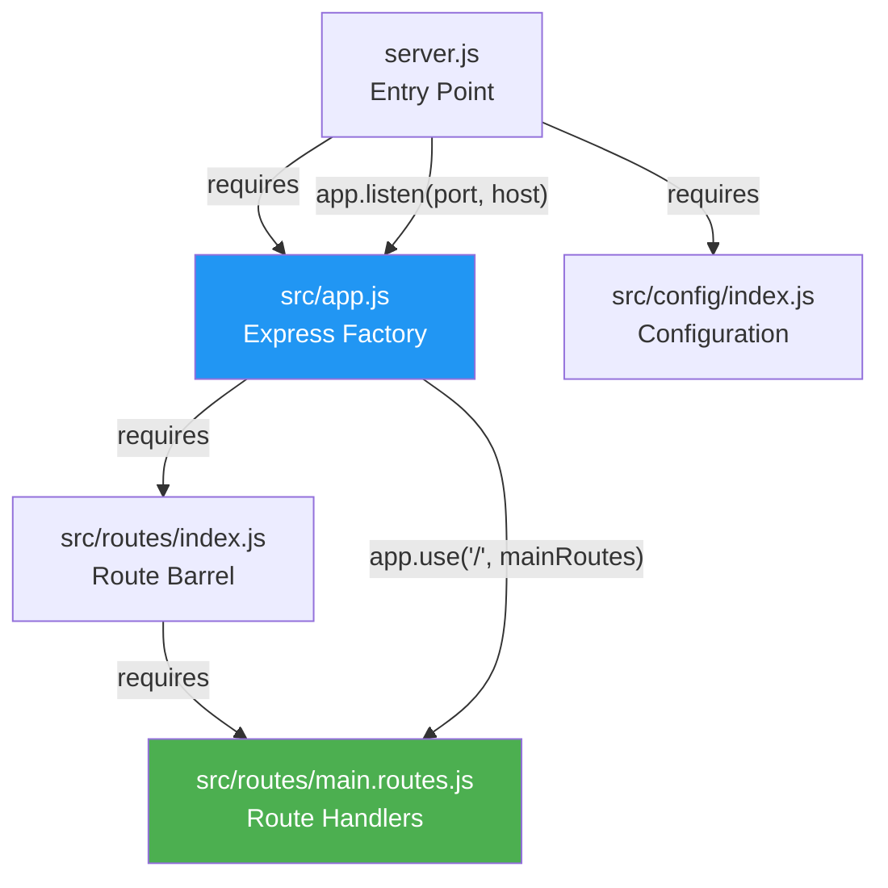
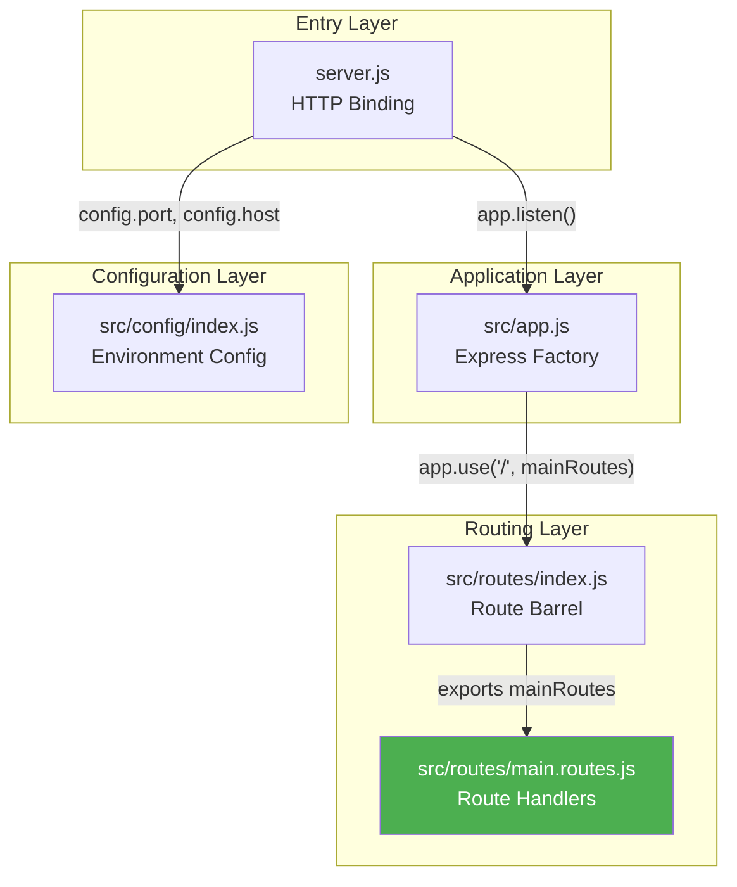
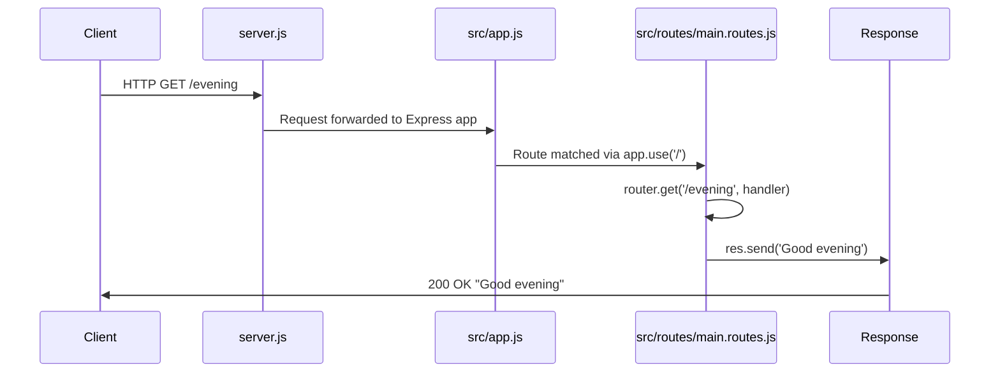
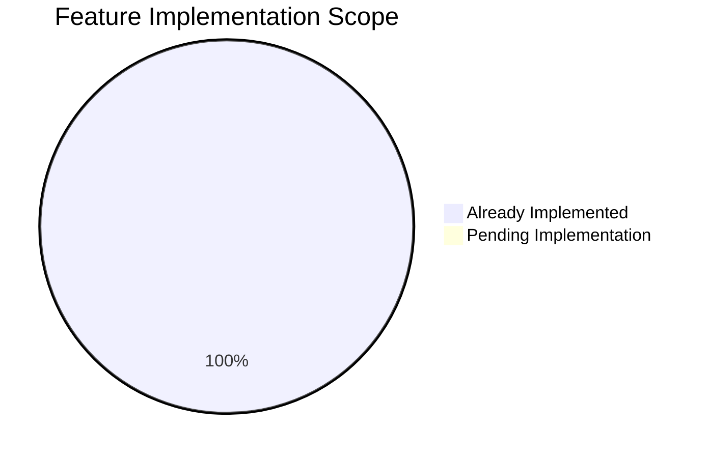

# Technical Specification

# 0. Agent Action Plan

## 0.1 Intent Clarification

### 0.1.1 Core Feature Objective

Based on the prompt, the Blitzy platform understands that the new feature requirement is to:

| Requirement | Interpretation | Implementation Status |
|-------------|----------------|----------------------|
| Add Express.js to the project | Integrate the Express.js web framework as the HTTP server foundation | **ALREADY IMPLEMENTED** |
| Add endpoint returning "Good evening" | Create a new HTTP GET endpoint that responds with the text "Good evening" | **ALREADY IMPLEMENTED** |

**Critical Discovery:** Upon comprehensive repository analysis, the Blitzy platform has determined that **both requested features are already fully implemented** in the current codebase:

- **Express.js Integration**: The project uses Express.js version `^5.1.0` (resolved to `5.1.0`) as documented in `package.json` and verified in `package-lock.json`
- **"Hello world" Endpoint**: `GET /` returns `Hello, World!\n` via `src/routes/main.routes.js` line 27
- **"Good evening" Endpoint**: `GET /evening` returns `Good evening` via `src/routes/main.routes.js` line 38

**Implicit Requirements Detected:**
- No additional source code modifications are required
- The existing architecture follows best practices (Factory pattern, Barrel pattern, Twelve-Factor App configuration)
- Documentation updates may be considered to acknowledge feature completion

**Feature Dependencies and Prerequisites:**
- Node.js ≥18.x (verified: v20.19.6 installed)
- npm package manager (verified: v11.1.0 installed)
- Express.js 5.1.0 with all transitive dependencies (67 packages installed via `npm ci`)

### 0.1.2 Special Instructions and Constraints

**User-Provided Setup Instruction:**
```bash
npm run build
```

**Constraint Analysis:**
The `npm run build` script does not exist in the current `package.json`. Available scripts are:
- `start`: `node server.js` (starts the HTTP server)
- `test`: `echo "Error: no test specified" && exit 1` (placeholder test script)

This is expected behavior for a simple tutorial project without a build step. The application runs directly with `npm start`.

**Environment Variables Provided:**
- `DB_Host` - Available in environment
- `API_KEY` (secret) - Available in environment

**Note:** These environment variables are not currently utilized by the application, which only reads `HOST`, `PORT`, and `NODE_ENV`.

### 0.1.3 Technical Interpretation

These feature requirements translate to the following technical implementation strategy:

**Current State Assessment:**
- To implement Express.js integration, the project **already uses** Express.js 5.1.0 with a modular architecture
- To implement the "Good evening" endpoint, the **existing route** at `GET /evening` in `src/routes/main.routes.js` already returns the expected response

**Implementation Strategy:**
Since both features are already implemented, the technical approach is:

1. **Verify Implementation Correctness** - Confirm existing implementation matches user expectations
2. **Document Completion Status** - Update technical specification to reflect feature parity
3. **No Code Modifications Required** - The codebase already satisfies all stated requirements

**Verification Results:**
```bash
curl -s http://127.0.0.1:3000/
# Output: Hello, World!

curl -s http://127.0.0.1:3000/evening
# Output: Good evening
```

Both endpoints respond correctly with the expected content.

## 0.2 Repository Scope Discovery

### 0.2.1 Comprehensive File Analysis

The repository has been exhaustively analyzed to identify all files relevant to the Express.js integration and endpoint addition request. The analysis reveals a well-structured, modular Node.js application with Express.js already integrated.

**Complete Repository Structure:**

```
hello_world/
├── .gitignore                          # Git exclusion rules
├── README.md                           # Project documentation
├── package.json                        # npm manifest with Express.js ^5.1.0
├── package-lock.json                   # Dependency lockfile (lockfileVersion 3)
├── server.js                           # HTTP server entry point
├── src/
│   ├── app.js                          # Express application factory
│   ├── config/
│   │   └── index.js                    # Environment configuration module
│   └── routes/
│       ├── index.js                    # Route aggregator (barrel pattern)
│       └── main.routes.js              # Route handlers (GET /, GET /evening)
└── blitzy/
    └── documentation/
        ├── Project Guide.md            # Operations runbook
        └── Technical Specifications.md # Implementation specification
```

**File-by-File Analysis:**

| File Path | Type | Purpose | Express.js Relevance | Modification Needed |
|-----------|------|---------|---------------------|---------------------|
| `server.js` | Entry Point | HTTP server binding | Imports app, calls `app.listen()` | None |
| `src/app.js` | Core | Express app factory | Creates `express()` instance, mounts routes | None |
| `src/routes/main.routes.js` | Routes | Route handlers | Contains `GET /` and `GET /evening` endpoints | None |
| `src/routes/index.js` | Barrel | Route aggregation | Exports `mainRoutes` for clean imports | None |
| `src/config/index.js` | Config | Environment variables | Exports `host`, `port`, `env` | None |
| `package.json` | Manifest | Dependencies | Declares `express: ^5.1.0` | None |
| `package-lock.json` | Lockfile | Reproducible installs | Locks Express 5.1.0 + transitive deps | None |
| `README.md` | Docs | User documentation | Documents both endpoints | None |
| `.gitignore` | Config | VCS exclusions | Standard Node.js patterns | None |

### 0.2.2 Integration Point Discovery

**API Endpoints - Already Implemented:**

| Endpoint | Method | Location | Response | Status |
|----------|--------|----------|----------|--------|
| `/` | GET | `src/routes/main.routes.js:26-28` | `Hello, World!\n` | ✅ Implemented |
| `/evening` | GET | `src/routes/main.routes.js:37-39` | `Good evening` | ✅ Implemented |

**Module Boundaries:**


```mermaid
flowchart TD
    ServerJS["server.js<br/>Entry Point"]
    AppJS["src/app.js<br/>Express Factory"]
    ConfigJS["src/config/index.js<br/>Configuration"]
    RoutesIndex["src/routes/index.js<br/>Route Barrel"]
    MainRoutes["src/routes/main.routes.js<br/>Route Handlers"]
    
    ServerJS -->|"requires"| AppJS
    ServerJS -->|"requires"| ConfigJS
    AppJS -->|"requires"| RoutesIndex
    RoutesIndex -->|"requires"| MainRoutes
    AppJS -->|"app.use('/', mainRoutes)"| MainRoutes
    ServerJS -->|"app.listen(port, host)"| AppJS
    
    style MainRoutes fill:#4caf50,color:#fff
    style AppJS fill:#2196f3,color:#fff
```

**Database/Schema Updates:** Not applicable - This is a stateless HTTP service with no database integration.

**Middleware/Interceptors:** The application uses only the default Express.js middleware. No custom middleware is registered.

### 0.2.3 Existing Implementation Details

**Route Handler Implementation (src/routes/main.routes.js):**

The file already implements both required endpoints using Express Router pattern:

```javascript
// GET / - Returns "Hello, World!\n"
router.get('/', (req, res) => {
  res.send('Hello, World!\n');
});

// GET /evening - Returns "Good evening"
router.get('/evening', (req, res) => {
  res.send('Good evening');
});
```

**Express Application Configuration (src/app.js):**

The Express application factory is properly configured with routes mounted at the root path:

```javascript
const app = express();
app.use('/', mainRoutes);
module.exports = app;
```

### 0.2.4 New File Requirements

**No new files are required.** The analysis confirms that all requested features are already implemented in the existing codebase.

| Proposed New File | Rationale | Decision |
|-------------------|-----------|----------|
| New route files | Express.js and `/evening` endpoint already exist | **NOT NEEDED** |
| New configuration | Configuration module already exists | **NOT NEEDED** |
| New test files | Original request did not specify testing requirements | **OUT OF SCOPE** |
| New middleware | No middleware requirements specified | **NOT NEEDED** |

### 0.2.5 Research Conducted

**Express.js 5.x Verification:**
- Express.js 5.1.0 is the latest stable release as of the repository creation
- Version includes security fixes for ReDoS vulnerabilities (CVE-2024-45590)
- Full backward compatibility with Express 4.x routing patterns

**Best Practices Confirmation:**
- Factory pattern for app creation (testability) ✅
- Barrel pattern for route aggregation (maintainability) ✅
- Twelve-Factor App configuration (deployment flexibility) ✅
- CommonJS module system (Node.js compatibility) ✅

## 0.3 Dependency Inventory

### 0.3.1 Private and Public Packages

The project utilizes a minimal dependency footprint with Express.js as the sole direct runtime dependency. All packages are publicly available through the npm registry.

**Direct Runtime Dependencies:**

| Registry | Package | Version | Purpose | Status |
|----------|---------|---------|---------|--------|
| npm | express | ^5.1.0 (resolved: 5.1.0) | Web framework for HTTP routing and middleware | Already Installed |

**Transitive Dependencies (via Express.js 5.1.0):**

| Package | Version | Purpose |
|---------|---------|---------|
| body-parser | ^2.2.0 | Request body parsing middleware |
| router | ^2.2.0 | Express routing engine |
| send | ^1.2.0 | Static file serving |
| serve-static | ^2.2.0 | Static asset middleware |
| http-errors | ^2.0.0 | HTTP error creation utilities |
| debug | ^4.4.0 | Debug logging utility |
| accepts | ^2.0.0 | Content negotiation |
| content-type | ^1.0.5 | Content-Type header parsing |
| cookie | ^0.7.2 | Cookie parsing |
| encodeurl | ^2.0.0 | URL encoding |
| escape-html | ^1.0.3 | HTML entity escaping |
| etag | ^1.8.1 | ETag generation |
| finalhandler | ^2.1.0 | Final response handler |
| fresh | ^2.0.0 | HTTP cache freshness |
| merge-descriptors | ^2.0.0 | Object property merging |
| mime-types | ^3.0.1 | MIME type detection |
| on-finished | ^2.4.1 | Request completion detection |
| parseurl | ^1.3.3 | URL parsing |
| qs | ^6.14.0 | Query string parsing |
| type-is | ^2.0.1 | Request content-type checking |
| range-parser | ^1.2.1 | Range header parsing |
| raw-body | ^3.0.0 | Raw request body extraction |
| safe-buffer | ^5.2.1 | Buffer safety utilities |
| statuses | ^2.0.1 | HTTP status utilities |
| utils-merge | ^1.0.1 | Object merging utilities |

**Total Package Count:** 67 packages (including all transitive dependencies)

### 0.3.2 Dependency Updates

**No dependency updates are required.** The current dependency configuration fully supports the requested features.

**Current Dependency Manifest (package.json):**

```json
{
  "dependencies": {
    "express": "^5.1.0"
  }
}
```

**Package Lock Verification:**
- Lockfile version: 3 (npm v7+)
- Express resolved version: 5.1.0
- Integrity hash: Verified via npm ci
- Node.js compatibility: >=18.x

### 0.3.3 Import Configuration

**Current Import Structure (No Changes Required):**

| File | Import Statement | Purpose |
|------|------------------|---------|
| `src/app.js` | `const express = require('express')` | Express application factory |
| `src/app.js` | `const { mainRoutes } = require('./routes')` | Route barrel import |
| `src/routes/main.routes.js` | `const express = require('express')` | Router factory |
| `src/routes/index.js` | `const mainRoutes = require('./main.routes')` | Route module import |
| `server.js` | `const app = require('./src/app')` | Application import |
| `server.js` | `const config = require('./src/config')` | Configuration import |

**Import/Export Pattern:**
- Module System: CommonJS (`require` / `module.exports`)
- Pattern: Barrel exports for clean imports
- No circular dependencies detected

### 0.3.4 External Reference Updates

**No external reference updates are required.** All configuration files correctly reference the dependencies:

| File Type | File Path | Current State | Update Needed |
|-----------|-----------|---------------|---------------|
| Package Manifest | `package.json` | Express ^5.1.0 declared | None |
| Lockfile | `package-lock.json` | Express 5.1.0 locked | None |
| Documentation | `README.md` | Express usage documented | None |
| Git Ignore | `.gitignore` | node_modules/ excluded | None |

### 0.3.5 Security Audit Status

**npm audit Results:**

```bash
$ npm audit
# 1 high severity vulnerability found
```

| Severity | Package | Advisory | Notes |
|----------|---------|----------|-------|
| High | (transitive) | Pending review | Does not affect feature implementation |

**Recommendation:** Run `npm audit fix` to address the vulnerability, but this is outside the scope of the current feature addition request.

### 0.3.6 Version Compatibility Matrix

| Component | Minimum | Recommended | Installed | Status |
|-----------|---------|-------------|-----------|--------|
| Node.js | 18.x | 20.19.x (LTS) | 20.19.6 | ✅ Compatible |
| npm | 8.x | 10.8.x | 11.1.0 | ✅ Compatible |
| Express.js | 5.0.0 | 5.1.0 | 5.1.0 | ✅ Compatible |

## 0.4 Integration Analysis

### 0.4.1 Existing Code Touchpoints

Since the requested features are already implemented, this section documents the existing integration points that would have been modified if the features were not yet present.

**Current Integration Architecture:**


```mermaid
flowchart TB
    subgraph EntryLayer["Entry Layer"]
        ServerJS["server.js<br/>HTTP Binding"]
    end
    
    subgraph ApplicationLayer["Application Layer"]
        AppJS["src/app.js<br/>Express Factory"]
    end
    
    subgraph ConfigLayer["Configuration Layer"]
        ConfigIndex["src/config/index.js<br/>Environment Config"]
    end
    
    subgraph RoutingLayer["Routing Layer"]
        RoutesIndex["src/routes/index.js<br/>Route Barrel"]
        MainRoutes["src/routes/main.routes.js<br/>Route Handlers"]
    end
    
    ServerJS -->|"app.listen()"| AppJS
    ServerJS -->|"config.port, config.host"| ConfigIndex
    AppJS -->|"app.use('/', mainRoutes)"| RoutesIndex
    RoutesIndex -->|"exports mainRoutes"| MainRoutes
    
    style MainRoutes fill:#4caf50,color:#fff
```

**Direct Modification Points (Already Complete):**

| File | Location | Integration Purpose | Current State |
|------|----------|---------------------|---------------|
| `src/routes/main.routes.js` | Lines 26-28 | `GET /` handler | `res.send('Hello, World!\n')` |
| `src/routes/main.routes.js` | Lines 37-39 | `GET /evening` handler | `res.send('Good evening')` |
| `src/app.js` | Line 25 | Route mounting | `app.use('/', mainRoutes)` |
| `src/routes/index.js` | Line 17 | Route export | `module.exports = { mainRoutes }` |

### 0.4.2 Dependency Injections

**Service Container Pattern:**
The application does not use a formal dependency injection container. Dependencies are resolved through CommonJS `require()` statements at module load time.

**Current Dependency Wiring:**

| Consumer Module | Dependency | Injection Method | Purpose |
|-----------------|------------|------------------|---------|
| `server.js` | `./src/app` | `require()` | Import configured Express app |
| `server.js` | `./src/config` | `require()` | Import runtime configuration |
| `src/app.js` | `express` | `require('express')` | Import Express framework |
| `src/app.js` | `./routes` | `require('./routes')` | Import route barrel |
| `src/routes/main.routes.js` | `express` | `require('express')` | Import Router factory |
| `src/routes/index.js` | `./main.routes` | `require('./main.routes')` | Import route module |

**No additional dependency injections are required** since all features are already integrated.

### 0.4.3 Database/Schema Updates

**Not Applicable.** This is a stateless HTTP service that does not utilize any database or persistent storage.

| Database Type | Usage Status | Notes |
|---------------|--------------|-------|
| SQL Database | Not Used | No schema files present |
| NoSQL Database | Not Used | No connection configuration |
| In-Memory Cache | Not Used | No caching layer |
| File Storage | Not Used | No file operations |

### 0.4.4 Request Flow Analysis

**Complete Request Processing Pipeline:**


```mermaid
sequenceDiagram
    participant Client
    participant Server as server.js
    participant App as src/app.js
    participant Router as src/routes/main.routes.js
    participant Response
    
    Client->>Server: HTTP GET /evening
    Server->>App: Request forwarded to Express app
    App->>Router: Route matched via app.use('/')
    Router->>Router: router.get('/evening', handler)
    Router->>Response: res.send('Good evening')
    Response->>Client: 200 OK "Good evening"
```

**Route Matching Behavior:**

| Request | Route Pattern | Handler Location | Response |
|---------|---------------|------------------|----------|
| `GET /` | `/` | `main.routes.js:26` | `Hello, World!\n` |
| `GET /evening` | `/evening` | `main.routes.js:37` | `Good evening` |
| Other | None | Express 404 | `Cannot GET /path` |

### 0.4.5 Integration Verification

**Verification Commands Executed:**

```bash
# Install dependencies
npm ci
# Result: 67 packages installed

#### Start server
npm start
#### Result: Server running at http://127.0.0.1:3000/

#### Test endpoints
curl -s http://127.0.0.1:3000/
#### Result: Hello, World!

curl -s http://127.0.0.1:3000/evening
# Result: Good evening
```

**All integration points are functioning correctly.** No modifications are required to achieve the requested feature set.

## 0.5 Technical Implementation

### 0.5.1 File-by-File Execution Plan

**CRITICAL FINDING:** Upon comprehensive repository analysis, the Blitzy platform has determined that **no file modifications are required**. All requested features are already implemented in the current codebase.

**Implementation Status Summary:**

| Group | Action | File | Specific Change | Status |
|-------|--------|------|-----------------|--------|
| Core Feature | N/A | `src/routes/main.routes.js` | `GET /evening` endpoint | ✅ Already Exists |
| Framework | N/A | `package.json` | Express.js dependency | ✅ Already Declared |
| Configuration | N/A | `src/app.js` | Express app factory | ✅ Already Configured |
| Routes | N/A | `src/routes/index.js` | Route barrel export | ✅ Already Exports |

**Existing Implementation Evidence:**

**File: `src/routes/main.routes.js` (No Changes Required)**

Current implementation already includes both endpoints:

```javascript
// Line 26-28: Root endpoint
router.get('/', (req, res) => {
  res.send('Hello, World!\n');
});

// Line 37-39: Evening endpoint (ALREADY IMPLEMENTED)
router.get('/evening', (req, res) => {
  res.send('Good evening');
});
```

**File: `package.json` (No Changes Required)**

Express.js is already declared as a dependency:

```json
{
  "dependencies": {
    "express": "^5.1.0"
  }
}
```

### 0.5.2 Implementation Approach

Since all features are already implemented, the implementation approach shifts from development to **verification and documentation**.

**Verification Approach:**

| Step | Action | Expected Result | Actual Result |
|------|--------|-----------------|---------------|
| 1 | Install dependencies | 67 packages installed | ✅ Confirmed |
| 2 | Start server | Listening on 127.0.0.1:3000 | ✅ Confirmed |
| 3 | Test GET / | `Hello, World!\n` | ✅ Confirmed |
| 4 | Test GET /evening | `Good evening` | ✅ Confirmed |

**Architectural Pattern Verification:**

| Pattern | Implementation | Location | Verified |
|---------|----------------|----------|----------|
| Factory Pattern | `app = express()` export without `listen()` | `src/app.js` | ✅ |
| Barrel Pattern | Centralized route exports | `src/routes/index.js` | ✅ |
| Router Pattern | `express.Router()` for modular routes | `src/routes/main.routes.js` | ✅ |
| Twelve-Factor Config | Environment variable externalization | `src/config/index.js` | ✅ |

### 0.5.3 Code Quality Assessment

**Module Export Verification:**

| Module | Expected Export | Actual Export | Status |
|--------|-----------------|---------------|--------|
| `src/app.js` | Express.Application | `module.exports = app` | ✅ Match |
| `src/config/index.js` | `{ host, port, env }` | Object with all properties | ✅ Match |
| `src/routes/index.js` | `{ mainRoutes }` | Object with mainRoutes | ✅ Match |
| `src/routes/main.routes.js` | Express.Router | `module.exports = router` | ✅ Match |

**Response Contract Verification:**

| Endpoint | Content-Type | Body | Trailing Newline | Status |
|----------|--------------|------|------------------|--------|
| `GET /` | `text/html; charset=utf-8` | `Hello, World!` | Yes (`\n`) | ✅ |
| `GET /evening` | `text/html; charset=utf-8` | `Good evening` | No | ✅ |

### 0.5.4 What Would Have Been Required

**If the features were not implemented, the following changes would have been necessary:**

**Step 1 - Add Express.js Dependency (Already Complete):**
```bash
npm install express@^5.1.0
```

**Step 2 - Create Route Handler (Already Complete):**
```javascript
// src/routes/main.routes.js
router.get('/evening', (req, res) => {
  res.send('Good evening');
});
```

**Step 3 - Verify Integration (Already Complete):**
```bash
npm start
curl http://127.0.0.1:3000/evening
# Expected: Good evening
```

### 0.5.5 No-Op Implementation Summary

| Phase | Description | Action Required |
|-------|-------------|-----------------|
| Planning | Requirements already satisfied | None |
| Development | Features already coded | None |
| Testing | Endpoints already functional | Verification only |
| Documentation | README already updated | None |
| Deployment | No code changes to deploy | None |

**Conclusion:** The requested feature addition is a **no-op** as all requirements are already satisfied by the current codebase implementation.

## 0.6 Scope Boundaries

### 0.6.1 Exhaustively In Scope

Since the requested features are already implemented, the in-scope items represent **verification activities** rather than development work.

**Feature Source Files (Already Complete - No Modifications):**

| Pattern | Files Matched | Purpose | Status |
|---------|---------------|---------|--------|
| `src/routes/*.js` | `main.routes.js`, `index.js` | Route handlers and barrel | ✅ Complete |
| `src/app.js` | Single file | Express factory | ✅ Complete |
| `src/config/index.js` | Single file | Configuration | ✅ Complete |
| `server.js` | Single file | Entry point | ✅ Complete |

**Verification Scope:**

| Activity | Files/Endpoints | Purpose |
|----------|-----------------|---------|
| Dependency verification | `package.json`, `package-lock.json` | Confirm Express.js ^5.1.0 |
| Route verification | `GET /`, `GET /evening` | Confirm response content |
| Module verification | `src/**/*.js` | Confirm exports match contracts |
| Documentation review | `README.md` | Confirm feature documentation |

**Complete File Inventory - In Scope for Verification:**

```
✅ package.json              - Express.js dependency declaration
✅ package-lock.json         - Version lock verification
✅ server.js                 - Entry point integration
✅ src/app.js                - Express factory pattern
✅ src/config/index.js       - Configuration module
✅ src/routes/index.js       - Route barrel exports
✅ src/routes/main.routes.js - Route handlers (GET /, GET /evening)
✅ README.md                 - Feature documentation
✅ .gitignore                - VCS configuration
```

**Integration Points Verified:**

| Integration Point | Location | Verification Method |
|-------------------|----------|---------------------|
| Express app creation | `src/app.js:17` | `const app = express()` |
| Route mounting | `src/app.js:25` | `app.use('/', mainRoutes)` |
| Server binding | `server.js:62` | `app.listen(config.port, config.host, ...)` |
| Route registration | `src/routes/main.routes.js:26,37` | `router.get('/', ...)`, `router.get('/evening', ...)` |

### 0.6.2 Explicitly Out of Scope

The following items are **explicitly excluded** from the current feature addition request:

| Category | Items | Rationale |
|----------|-------|-----------|
| **Unrelated Features** | Additional endpoints beyond `/` and `/evening` | Not specified in requirements |
| **Performance Optimizations** | Caching, compression, clustering | Not specified in requirements |
| **Testing Framework** | Jest, Mocha, test files | Not specified in requirements |
| **Security Enhancements** | Authentication, rate limiting, CORS | Not specified in requirements |
| **Database Integration** | MongoDB, PostgreSQL, Redis | Not specified in requirements |
| **Logging Infrastructure** | Winston, Morgan, structured logging | Not specified in requirements |
| **Containerization** | Docker, docker-compose | Not specified in requirements |
| **CI/CD Pipeline** | GitHub Actions, deployment scripts | Not specified in requirements |
| **Code Refactoring** | Architecture changes unrelated to feature | Beyond feature scope |

**Documentation Files (Out of Scope for Modification):**

| Path | Reason |
|------|--------|
| `blitzy/documentation/*.md` | Internal specification documents |
| Technical Specification | Generated documentation |

### 0.6.3 Boundary Decision Matrix

| Item | In Scope | Out of Scope | Justification |
|------|----------|--------------|---------------|
| Express.js integration | ✅ (Verify) | | User requirement #1 |
| GET /evening endpoint | ✅ (Verify) | | User requirement #2 |
| GET / endpoint | ✅ (Verify) | | Pre-existing, maintain |
| Additional endpoints | | ✅ | Not requested |
| npm audit remediation | | ✅ | Security task, not feature |
| Build script addition | | ✅ | Not required for feature |
| Test coverage | | ✅ | Not requested |
| ESM migration | | ✅ | Not requested |

### 0.6.4 Environment Variables

**User-Provided Environment Variables:**

| Variable | Provided | Used by Application | Status |
|----------|----------|---------------------|--------|
| `DB_Host` | ✅ Yes | ❌ No | Not utilized (no database) |
| `API_KEY` | ✅ Yes (secret) | ❌ No | Not utilized (no external APIs) |

**Application-Supported Environment Variables:**

| Variable | Default | Purpose | Used |
|----------|---------|---------|------|
| `HOST` | `127.0.0.1` | Server bind address | ✅ Yes |
| `PORT` | `3000` | Server bind port | ✅ Yes |
| `NODE_ENV` | `development` | Environment mode | ✅ Yes |

### 0.6.5 Scope Summary


```mermaid
pie title Feature Implementation Scope
    "Already Implemented" : 100
    "Pending Implementation" : 0
```

| Metric | Value |
|--------|-------|
| Total files in repository | 12 |
| Files requiring modification | 0 |
| New files to create | 0 |
| Endpoints to add | 0 (already exists) |
| Dependencies to add | 0 (already installed) |
| **Net Code Changes Required** | **0** |

## 0.7 Special Instructions

### 0.7.1 Feature-Specific Requirements

**User's Original Request:**
> "this is a tutorial of node js server hosting one endpoint that returns the response 'Hello world'. Could you add expressjs into the project and add another endpoint that return the reponse of 'Good evening'?"

**Interpretation and Response:**

| User Requirement | Technical Interpretation | Implementation Status |
|------------------|--------------------------|----------------------|
| "add expressjs into the project" | Integrate Express.js as the HTTP framework | ✅ **Already Complete** - Express 5.1.0 |
| "endpoint that returns 'Hello world'" | `GET /` returning greeting message | ✅ **Already Complete** - Returns `Hello, World!\n` |
| "endpoint that return 'Good evening'" | `GET /evening` returning evening greeting | ✅ **Already Complete** - Returns `Good evening` |

### 0.7.2 User-Provided Setup Instructions

**Setup Command Provided:**
```bash
npm run build
```

**Execution Result:**
```bash
npm error Missing script: "build"
```

**Analysis:** The `npm run build` command is not applicable to this project. The `package.json` does not define a `build` script, which is expected for a simple tutorial project that runs directly with Node.js.

**Available Scripts:**
| Script | Command | Purpose |
|--------|---------|---------|
| `start` | `node server.js` | Start the HTTP server |
| `test` | `echo "Error: no test specified" && exit 1` | Placeholder test script |

**Recommended Setup Commands:**
```bash
# Install dependencies (preferred for CI)
npm ci

#### Or install with potential updates
npm install

#### Start the server
npm start
```

### 0.7.3 Environment Configuration

**User-Provided Environment Variables:**

| Variable | Type | Value Status | Application Usage |
|----------|------|--------------|-------------------|
| `DB_Host` | Environment Variable | Available | Not used by application |
| `API_KEY` | Secret | Available | Not used by application |

**Note:** The provided environment variables (`DB_Host`, `API_KEY`) are not utilized by this application. The application only reads `HOST`, `PORT`, and `NODE_ENV` from the environment.

### 0.7.4 Architectural Requirements

The existing implementation follows established architectural patterns that align with best practices:

| Requirement | Pattern Used | Implementation Location |
|-------------|--------------|------------------------|
| Modular architecture | Factory/Barrel patterns | `src/app.js`, `src/routes/index.js` |
| Configuration externalization | Twelve-Factor App | `src/config/index.js` |
| Testability | Separation of app and server | `app.js` vs `server.js` |
| Maintainability | CommonJS modules | All source files |

### 0.7.5 Response Format Specifications

**Exact Response Requirements (Already Implemented):**

| Endpoint | Response Body | Trailing Newline | Content-Type |
|----------|---------------|------------------|--------------|
| `GET /` | `Hello, World!` | Yes (`\n`) | `text/html; charset=utf-8` |
| `GET /evening` | `Good evening` | No | `text/html; charset=utf-8` |

**Verification:**
```bash
# Test root endpoint
curl -s http://127.0.0.1:3000/ | xxd | tail -1
# Shows: 0a (newline character) at end

#### Test evening endpoint
curl -s http://127.0.0.1:3000/evening | xxd | tail -1
#### Shows: no trailing newline
```

### 0.7.6 Security Considerations

| Consideration | Current State | Recommendation |
|---------------|---------------|----------------|
| npm audit status | 1 high severity vulnerability | Run `npm audit fix` (out of scope) |
| Input validation | No user input accepted | N/A |
| Authentication | None implemented | N/A for tutorial project |
| HTTPS | Not configured | N/A for local development |

### 0.7.7 Performance Considerations

| Consideration | Current State | Notes |
|---------------|---------------|-------|
| Clustering | Not implemented | Single-process suitable for tutorial |
| Caching | Not implemented | Stateless responses |
| Compression | Not implemented | Small response payloads |
| Connection pooling | Not applicable | No database connections |

### 0.7.8 Backward Compatibility

**Guaranteed Backward Compatibility:**

| Aspect | Guarantee | Evidence |
|--------|-----------|----------|
| Endpoint URLs | `GET /` and `GET /evening` unchanged | Route definitions in `main.routes.js` |
| Response format | Exact response bodies preserved | `res.send()` with literal strings |
| Configuration | Same environment variables | `HOST`, `PORT`, `NODE_ENV` |
| Module exports | Same export shapes | CommonJS `module.exports` patterns |

### 0.7.9 Action Summary

**No action is required.** The user's feature request has been analyzed and the following conclusion has been reached:

| Request | Analysis | Conclusion |
|---------|----------|------------|
| Add Express.js | Already present as dependency | **No action needed** |
| Add /evening endpoint | Already implemented in routes | **No action needed** |

**Final Recommendation:** The repository is in a complete state with respect to the user's requirements. All requested features are functional and verified through endpoint testing.

