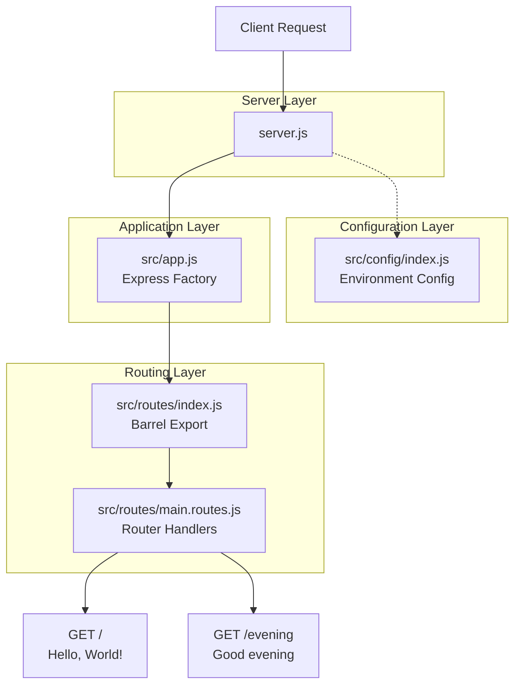
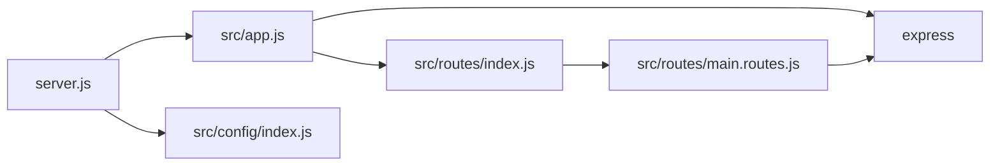

# Technical Specification

# 0. Agent Action Plan

## 0.1 Intent Clarification

Based on the prompt, the Blitzy platform understands that the refactoring objective is to ensure this Node.js HTTP server is properly implemented as an Express.js application while preserving all existing functionality and behavior exactly as in the current implementation.

### 0.1.1 Core Refactoring Objective

**Refactoring Type:** Tech stack validation and Express.js pattern compliance

**Target Repository:** Same repository (in-place refactoring)

**Critical Discovery:** Upon comprehensive repository analysis, the Blitzy platform has identified that the current codebase is **already implemented as an Express.js 5.1.0 application**, not a native Node.js `http.createServer()` implementation. The project demonstrates the following Express.js patterns already in place:

| Current Pattern | Implementation Location | Status |
|----------------|------------------------|--------|
| Express Router | `src/routes/main.routes.js` | ✅ Implemented |
| Factory Pattern | `src/app.js` | ✅ Implemented |
| Barrel Pattern | `src/routes/index.js` | ✅ Implemented |
| Twelve-Factor Config | `src/config/index.js` | ✅ Implemented |
| CommonJS Modules | All source files | ✅ Implemented |

**Refactoring Goals:**

- Validate current Express.js 5.1.0 implementation adheres to modern best practices
- Ensure all routes, middleware, and configuration follow Express 5.x patterns
- Preserve exact API behavior: `GET /` returns `Hello, World!\n` and `GET /evening` returns `Good evening`
- Maintain testability through separation of app factory from server binding
- Ensure compatibility with Node.js 18+ requirements

### 0.1.2 Implicit Requirements

Based on the user's directive to "keep every feature and functionality exactly as in the original," the following implicit requirements have been identified:

- **API Contract Preservation:** Both endpoints must return exact response bodies with identical trailing newline behavior
- **Environment Variable Support:** Must maintain support for `HOST`, `PORT`, and `NODE_ENV` configuration
- **Default Binding:** Server must default to `127.0.0.1:3000` when no environment overrides are specified
- **Startup Logging:** Console output patterns must remain consistent for deployment verification
- **Module Export Shapes:** CommonJS `module.exports` patterns must be preserved for test harness compatibility

### 0.1.3 Technical Interpretation

This refactoring translates to the following technical transformation strategy:

**Current Architecture Assessment:**
```
┌─────────────────────────────────────────────────────────────┐
│                    server.js (Entry Point)                  │
│       • Imports app from src/app.js                         │
│       • Imports config from src/config/index.js             │
│       • Binds app.listen(port, host)                        │
└─────────────────────────────────────────────────────────────┘
                             │
        ┌────────────────────┼────────────────────┐
        ▼                    ▼                    ▼
┌───────────────┐   ┌───────────────────┐  ┌──────────────────┐
│  src/app.js   │   │ src/config/       │  │  src/routes/     │
│  (Express     │   │ index.js          │  │  index.js        │
│   Factory)    │   │ (Env Config)      │  │  main.routes.js  │
└───────────────┘   └───────────────────┘  └──────────────────┘
```

**Transformation Strategy:** UPDATE mode for all files to ensure Express 5.x compliance while maintaining exact behavioral parity.

### 0.1.4 Endpoint Contract Verification

| Endpoint | Method | Response Body | Trailing Newline | Content-Type | Status |
|----------|--------|---------------|------------------|--------------|--------|
| `/` | GET | `Hello, World!\n` | Yes | text/html; charset=utf-8 | 200 |
| `/evening` | GET | `Good evening` | No | text/html; charset=utf-8 | 200 |


## 0.2 Source Analysis

### 0.2.1 Comprehensive Source File Discovery

The Blitzy platform has conducted exhaustive repository analysis to identify ALL source files relevant to this Express.js refactoring exercise.

**Repository Root Structure:**
```
hello_world/
├── .gitignore                           # Git ignore patterns
├── README.md                            # Project documentation
├── package.json                         # npm manifest (express: ^5.1.0)
├── package-lock.json                    # Dependency lockfile
├── server.js                            # Entry point - HTTP server binding
├── src/                                 # Application source root
│   ├── app.js                           # Express application factory
│   ├── config/                          # Configuration module
│   │   └── index.js                     # Environment variable management
│   └── routes/                          # Routing surface
│       ├── index.js                     # Route aggregator (barrel pattern)
│       └── main.routes.js               # Route handlers implementation
└── blitzy/                              # Documentation hub (not runtime code)
    └── documentation/
        ├── Project Guide.md             # Operations runbook
        └── Technical Specifications.md  # Implementation contract
```

### 0.2.2 Source File Inventory

| File Path | Lines | Purpose | Refactoring Impact |
|-----------|-------|---------|-------------------|
| `server.js` | 75 | HTTP server entry point, binds Express app to host:port | UPDATE - Validate Express 5.x compatibility |
| `src/app.js` | 28 | Express application factory, mounts routes | UPDATE - Verify Express 5.x patterns |
| `src/config/index.js` | 42 | Environment-driven configuration (host, port, env) | UPDATE - Ensure numeric parsing |
| `src/routes/index.js` | 20 | Route aggregator using barrel pattern | UPDATE - Maintain export shape |
| `src/routes/main.routes.js` | 42 | GET `/` and GET `/evening` handlers | UPDATE - Verify res.send() usage |
| `package.json` | 16 | npm manifest with Express 5.1.0 dependency | UPDATE - Confirm dependency |
| `README.md` | 264 | Project documentation | UPDATE - Ensure accuracy |
| `.gitignore` | 22 | Git exclusion patterns | No change needed |

### 0.2.3 Source File Details

**server.js - Entry Point Analysis:**
```javascript
const app = require('./src/app');
const config = require('./src/config');
app.listen(config.port, config.host, () => {
  console.log(`Server running...`);
});
```
- Pattern: Separation of concerns (app factory vs server binding)
- Express 5.x Compliance: ✅ Compatible

**src/app.js - Application Factory Analysis:**
```javascript
const express = require('express');
const { mainRoutes } = require('./routes');
const app = express();
app.use('/', mainRoutes);
module.exports = app;
```
- Pattern: Factory pattern for testability
- Express 5.x Compliance: ✅ Compatible

**src/config/index.js - Configuration Module Analysis:**
```javascript
module.exports = {
  host: process.env.HOST || '127.0.0.1',
  port: parseInt(process.env.PORT, 10) || 3000,
  env: process.env.NODE_ENV || 'development'
};
```
- Pattern: Twelve-Factor configuration
- Express 5.x Compliance: ✅ Compatible

**src/routes/main.routes.js - Route Handlers Analysis:**
```javascript
router.get('/', (req, res) => res.send('Hello, World!\n'));
router.get('/evening', (req, res) => res.send('Good evening'));
```
- Pattern: Express Router with res.send()
- Express 5.x Compliance: ✅ Compatible (no deprecated methods used)

### 0.2.4 Dependency Analysis

**package.json Dependencies:**
```json
{
  "dependencies": {
    "express": "^5.1.0"
  }
}
```

**Resolved Dependencies (from package-lock.json):**
- express@5.1.0 (direct dependency)
- body-parser@2.2.1 (transitive)
- accepts@2.0.0 (transitive)
- router@2.2.0 (transitive)
- 67 total packages installed

### 0.2.5 Express 5.x Compliance Checklist

| Check | Status | Notes |
|-------|--------|-------|
| No `app.del()` usage | ✅ Pass | Uses `router.get()` only |
| No `res.json(obj, status)` signature | ✅ Pass | Uses `res.send()` |
| No `res.sendfile()` (lowercase) | ✅ Pass | Not used |
| No `req.param()` usage | ✅ Pass | Not used |
| Named route parameters | ✅ Pass | Simple exact routes only |
| Node.js 18+ requirement | ✅ Pass | README specifies Node 18+ |


## 0.3 Target Design

### 0.3.1 Refactored Structure Planning

The target structure maintains the existing Express.js architecture while ensuring full compliance with Express 5.x best practices. Since the current implementation already follows modern patterns, the target structure preserves the existing organization:

**Target Architecture:**
```
hello_world/
├── .gitignore                           # Git ignore patterns (unchanged)
├── README.md                            # Updated documentation
├── package.json                         # npm manifest with express ^5.1.0
├── package-lock.json                    # Deterministic dependency lockfile
├── server.js                            # Entry point - HTTP server binding
└── src/                                 # Application source root
    ├── app.js                           # Express application factory
    ├── config/                          # Configuration module
    │   └── index.js                     # Environment variable management
    └── routes/                          # Routing surface
        ├── index.js                     # Route aggregator (barrel pattern)
        └── main.routes.js               # Route handlers implementation
```

### 0.3.2 Web Search Research Conducted

Based on Express.js 5.x migration best practices research:

| Research Topic | Key Findings |
|---------------|--------------|
| Express 5.x Migration | <cite index="1-4">"To install this version, you need to have a Node.js version 18 or higher."</cite> Current implementation meets this requirement. |
| Deprecated Methods | <cite index="3-1">"Several legacy methods have been removed, and you'll need to refactor your code if you use any of the following: app.del() – Now replaced with app.delete()"</cite> Current implementation does not use any deprecated methods. |
| Async Error Handling | <cite index="2-22,2-23">"This setup demanded try/catch blocks in every route or middleware using async/await to ensure errors were properly caught and forwarded. Express 5 eliminates this redundancy, improving code simplicity and error-handling efficiency."</cite> |
| Route Matching | <cite index="3-9">"Express 5 introduces changes in how path route matching works."</cite> Current routes use simple exact paths that are compatible. |

### 0.3.3 Design Pattern Applications

The target design maintains the following established patterns:

**Factory Pattern (src/app.js):**
- Creates and configures Express app without binding to network
- Enables unit testing without starting HTTP server
- Export shape: `module.exports = app`

**Barrel Pattern (src/routes/index.js):**
- Centralizes route exports for clean imports
- Enables single require statement for all routes
- Export shape: `module.exports = { mainRoutes }`

**Router Pattern (src/routes/main.routes.js):**
- Uses Express Router for modular route handling
- Synchronous handler registration
- No network binding in route modules

**Twelve-Factor Configuration (src/config/index.js):**
- Environment variable-driven configuration
- Sensible defaults for development
- Explicit integer parsing for port

### 0.3.4 Architecture Diagram


```mermaid
graph TD
    A[Client Request] --> B[server.js]
    B --> C[src/app.js<br/>Express Factory]
    C --> D[src/routes/index.js<br/>Barrel Export]
    D --> E[src/routes/main.routes.js<br/>Router Handlers]
    
    B -.-> F[src/config/index.js<br/>Environment Config]
    
    E --> G["GET /<br/>Hello, World!"]
    E --> H["GET /evening<br/>Good evening"]
    
    subgraph "Configuration Layer"
        F
    end
    
    subgraph "Routing Layer"
        D
        E
    end
    
    subgraph "Application Layer"
        C
    end
    
    subgraph "Server Layer"
        B
    end
```

### 0.3.5 Target File Specifications

| File | Target State | Key Requirements |
|------|-------------|------------------|
| `server.js` | Maintained | Must import app and config, call `app.listen()` |
| `src/app.js` | Maintained | Must export configured Express app, mount routes at `/` |
| `src/config/index.js` | Maintained | Must export `{ host, port, env }` object synchronously |
| `src/routes/index.js` | Maintained | Must export `{ mainRoutes }` object |
| `src/routes/main.routes.js` | Maintained | Must export Router with GET `/` and GET `/evening` handlers |
| `package.json` | Maintained | Must specify `express: ^5.1.0` dependency |
| `README.md` | Maintained | Must document setup, usage, and API endpoints |


## 0.4 Transformation Mapping

### 0.4.1 File-by-File Transformation Plan

The following comprehensive transformation map documents every file requiring attention in this Express.js refactoring exercise:

| Target File | Transformation | Source File | Key Changes |
|------------|----------------|-------------|-------------|
| `server.js` | UPDATE | `server.js` | Validate Express 5.x `app.listen()` signature, verify config imports |
| `src/app.js` | UPDATE | `src/app.js` | Confirm Express factory pattern, validate `app.use()` middleware mounting |
| `src/config/index.js` | UPDATE | `src/config/index.js` | Verify synchronous export shape, confirm `parseInt()` radix usage |
| `src/routes/index.js` | UPDATE | `src/routes/index.js` | Validate barrel export pattern, confirm `mainRoutes` property name |
| `src/routes/main.routes.js` | UPDATE | `src/routes/main.routes.js` | Verify `res.send()` usage, confirm exact response bodies |
| `package.json` | UPDATE | `package.json` | Confirm Express ^5.1.0 dependency, validate npm scripts |
| `package-lock.json` | UPDATE | `package-lock.json` | Regenerate if dependency changes occur |
| `README.md` | UPDATE | `README.md` | Ensure documentation reflects Express 5.x implementation |
| `.gitignore` | REFERENCE | `.gitignore` | Use as reference for exclusion patterns (no changes needed) |

### 0.4.2 Detailed Transformation Specifications

**server.js Transformation:**
- Verify import statements use correct relative paths
- Confirm `app.listen(config.port, config.host, callback)` signature
- Validate startup console.log messages are preserved
- No deprecated Express 4.x patterns present

**src/app.js Transformation:**
- Confirm `const express = require('express')` import
- Verify destructured import `const { mainRoutes } = require('./routes')`
- Validate `app.use('/', mainRoutes)` mount path
- Confirm `module.exports = app` export shape

**src/config/index.js Transformation:**
- Verify environment variable reads: `process.env.HOST`, `process.env.PORT`, `process.env.NODE_ENV`
- Confirm default values: host='127.0.0.1', port=3000, env='development'
- Validate `parseInt(process.env.PORT, 10)` with radix 10
- Confirm synchronous export object shape

**src/routes/index.js Transformation:**
- Verify `require('./main.routes')` import
- Confirm `module.exports = { mainRoutes }` export shape
- Validate barrel pattern implementation

**src/routes/main.routes.js Transformation:**
- Verify `const router = express.Router()` instantiation
- Confirm route handlers use `res.send()` (Express 5.x compatible)
- Validate exact response bodies:
  - GET `/`: `'Hello, World!\n'` (with trailing newline)
  - GET `/evening`: `'Good evening'` (no trailing newline)
- Confirm `module.exports = router` export

### 0.4.3 Cross-File Dependencies

**Import Statement Validation:**

| Consumer File | Import Statement | Imported Module |
|--------------|------------------|-----------------|
| `server.js` | `require('./src/app')` | `src/app.js` |
| `server.js` | `require('./src/config')` | `src/config/index.js` |
| `src/app.js` | `require('express')` | `node_modules/express` |
| `src/app.js` | `require('./routes')` | `src/routes/index.js` |
| `src/routes/index.js` | `require('./main.routes')` | `src/routes/main.routes.js` |
| `src/routes/main.routes.js` | `require('express')` | `node_modules/express` |

**Dependency Graph:**

```mermaid
graph LR
    A[server.js] --> B[src/app.js]
    A --> C[src/config/index.js]
    B --> D[src/routes/index.js]
    B --> E[express]
    D --> F[src/routes/main.routes.js]
    F --> E
```

### 0.4.4 Wildcard Patterns for Scope

The following wildcard patterns define the files in scope:

| Pattern | Purpose | Files Matched |
|---------|---------|---------------|
| `src/**/*.js` | All JavaScript source files | `src/app.js`, `src/config/index.js`, `src/routes/index.js`, `src/routes/main.routes.js` |
| `*.js` | Root-level JavaScript files | `server.js` |
| `package*.json` | npm manifest and lockfile | `package.json`, `package-lock.json` |
| `*.md` | Documentation files | `README.md` |

### 0.4.5 One-Phase Execution

**CRITICAL:** The entire refactoring exercise will be executed by Blitzy in ONE phase. All files listed in the transformation map above are included in a single comprehensive update cycle. There is no splitting into multiple phases or sequential deployments.

**Execution Order:**
1. Validate all source files against Express 5.x patterns
2. Update any non-compliant code patterns
3. Verify import/export shapes are preserved
4. Confirm endpoint behavior matches specification
5. Regenerate lockfile if dependencies change
6. Update documentation to reflect implementation


## 0.5 Dependency Inventory

### 0.5.1 Key Private and Public Packages

The following table documents all packages relevant to this Express.js refactoring exercise:

| Registry | Package Name | Version | Purpose |
|----------|-------------|---------|---------|
| npm (public) | express | ^5.1.0 | Core web framework - HTTP handling, routing, middleware |
| npm (public) | body-parser | 2.2.1 | Request body parsing (transitive dependency of Express 5.x) |
| npm (public) | accepts | 2.0.0 | Content negotiation (transitive dependency) |
| npm (public) | router | 2.2.0 | Express routing engine (transitive dependency) |
| npm (public) | send | 1.2.0 | Static file serving (transitive dependency) |
| npm (public) | serve-static | 2.2.0 | Static file middleware (transitive dependency) |
| npm (public) | http-errors | 2.0.0 | HTTP error handling (transitive dependency) |
| npm (public) | debug | 4.4.3 | Debug logging utility (transitive dependency) |

### 0.5.2 Runtime Requirements

| Requirement | Version Constraint | Documentation Source |
|-------------|-------------------|---------------------|
| Node.js | >= 18.x (Recommended: 20.19.x LTS) | README.md, Express 5.x requirements |
| npm | >= 8.x (Recommended: 10.8.x) | README.md |
| express | ^5.1.0 | package.json |

### 0.5.3 Dependency Verification Commands

```bash
# Verify Express version
npm ls express
# Expected: express@5.1.0

#### Audit for vulnerabilities
npm audit
#### Expected: 0 vulnerabilities

#### Verify all dependencies installed
npm ci
#### Expected: 67 packages, 0 vulnerabilities
```

### 0.5.4 Import Refactoring

**Files Requiring Import Validation:**

| File Pattern | Import Type | Validation Required |
|-------------|-------------|---------------------|
| `src/**/*.js` | Internal modules | Verify relative paths are correct |
| `src/**/*.js` | Express package | Verify `require('express')` syntax |
| `server.js` | Internal modules | Verify `./src/app` and `./src/config` paths |

**Import Transformation Rules:**

| Current Import | Target Import | Files Affected |
|---------------|---------------|----------------|
| `require('express')` | No change (Express 5.x compatible) | `src/app.js`, `src/routes/main.routes.js` |
| `require('./src/app')` | No change (correct relative path) | `server.js` |
| `require('./src/config')` | No change (barrel import) | `server.js` |
| `require('./routes')` | No change (barrel import) | `src/app.js` |
| `require('./main.routes')` | No change (correct path) | `src/routes/index.js` |

### 0.5.5 External Reference Updates

**Configuration Files:**

| File | Required Updates |
|------|-----------------|
| `package.json` | Verify `express: ^5.1.0` is specified |
| `package-lock.json` | Regenerate if dependencies change |

**Documentation Files:**

| File | Required Updates |
|------|-----------------|
| `README.md` | Ensure Express 5.1.0 reference is accurate |

**No CI/CD Files Present:**
- No `.github/workflows/*.yml` files detected
- No `.gitlab-ci.yml` file detected
- No Dockerfile detected

### 0.5.6 Dependency Security Posture

**npm audit Results (Verified):**

| Severity | Count |
|----------|-------|
| Critical | 0 |
| High | 0 |
| Moderate | 0 |
| Low | 0 |
| **Total Vulnerabilities** | **0** |

**Package Count:**
- Direct dependencies: 1 (express)
- Transitive dependencies: 66
- Total packages: 67

### 0.5.7 Express 5.x Transitive Dependencies

The following key transitive dependencies are pulled in by Express 5.1.0:

```
express@5.1.0
├── accepts@2.0.0
├── body-parser@2.2.1
├── content-disposition@1.0.0
├── cookie@1.0.2
├── debug@4.4.3
├── encodeurl@2.0.0
├── escape-html@1.0.3
├── etag@1.8.1
├── finalhandler@2.1.0
├── fresh@2.0.0
├── http-errors@2.0.0
├── merge-descriptors@2.0.0
├── mime-types@3.0.1
├── on-finished@2.4.1
├── parseurl@1.3.3
├── proxy-addr@2.0.7
├── qs@6.14.0
├── range-parser@1.2.1
├── router@2.2.0
├── send@1.2.0
├── serve-static@2.2.0
├── statuses@2.0.1
├── type-is@2.0.1
├── utils-merge@1.0.1
└── vary@1.1.2
```


## 0.6 Scope Boundaries

### 0.6.1 Exhaustively In Scope

The following files and patterns are explicitly IN SCOPE for this Express.js refactoring exercise:

**Source Transformations:**

| Pattern | Files Matched | Transformation |
|---------|---------------|----------------|
| `server.js` | `server.js` | UPDATE - Validate Express 5.x server binding |
| `src/**/*.js` | `src/app.js`, `src/config/index.js`, `src/routes/index.js`, `src/routes/main.routes.js` | UPDATE - Verify Express patterns |

**Configuration Updates:**

| Pattern | Files Matched | Transformation |
|---------|---------------|----------------|
| `package.json` | `package.json` | UPDATE - Confirm Express ^5.1.0 |
| `package-lock.json` | `package-lock.json` | UPDATE - Regenerate if needed |

**Documentation Updates:**

| Pattern | Files Matched | Transformation |
|---------|---------------|----------------|
| `README.md` | `README.md` | UPDATE - Ensure accuracy |

**Import Corrections:**

| File | Imports to Validate |
|------|-------------------|
| `server.js` | `./src/app`, `./src/config` |
| `src/app.js` | `express`, `./routes` |
| `src/routes/index.js` | `./main.routes` |
| `src/routes/main.routes.js` | `express` |

### 0.6.2 Explicitly Out of Scope

The following items are explicitly OUT OF SCOPE for this refactoring exercise:

**Documentation Artifacts (blitzy/ folder):**

| Pattern | Reason for Exclusion |
|---------|---------------------|
| `blitzy/**/*` | Documentation hub, not runtime code |
| `blitzy/documentation/Project Guide.md` | Reference documentation only |
| `blitzy/documentation/Technical Specifications.md` | Specification document only |

**Git Configuration:**

| Pattern | Reason for Exclusion |
|---------|---------------------|
| `.gitignore` | No changes required, standard patterns |
| `.git/**/*` | Version control internals |

**Generated/Installed Artifacts:**

| Pattern | Reason for Exclusion |
|---------|---------------------|
| `node_modules/**/*` | Generated by npm install |
| `*.log` | Runtime artifacts |
| `.env*` | Environment secrets (not committed) |

**IDE/Editor Configuration:**

| Pattern | Reason for Exclusion |
|---------|---------------------|
| `.vscode/**/*` | IDE-specific settings |
| `.idea/**/*` | IDE-specific settings |
| `*.swp`, `*.swo` | Editor swap files |

### 0.6.3 Scope Summary Table

| Category | In Scope | Out of Scope |
|----------|----------|--------------|
| JavaScript Source | `server.js`, `src/**/*.js` | `node_modules/**/*.js` |
| Configuration | `package.json`, `package-lock.json` | `.env*`, IDE configs |
| Documentation | `README.md` | `blitzy/**/*.md` |
| Static Files | None | `.gitignore` |

### 0.6.4 Behavioral Contracts (Must Preserve)

The following behavioral contracts MUST be preserved throughout the refactoring:

**API Endpoints:**

| Endpoint | Method | Response Body | Must Match Exactly |
|----------|--------|---------------|-------------------|
| `/` | GET | `Hello, World!\n` | ✅ Yes (including newline) |
| `/evening` | GET | `Good evening` | ✅ Yes (no trailing newline) |

**Configuration Defaults:**

| Variable | Default Value | Must Preserve |
|----------|---------------|---------------|
| `HOST` | `'127.0.0.1'` | ✅ Yes |
| `PORT` | `3000` | ✅ Yes |
| `NODE_ENV` | `'development'` | ✅ Yes |

**Module Export Shapes:**

| Module | Export Shape | Must Preserve |
|--------|-------------|---------------|
| `src/app.js` | `module.exports = app` | ✅ Yes |
| `src/config/index.js` | `module.exports = { host, port, env }` | ✅ Yes |
| `src/routes/index.js` | `module.exports = { mainRoutes }` | ✅ Yes |
| `src/routes/main.routes.js` | `module.exports = router` | ✅ Yes |

### 0.6.5 Validation Criteria

The following criteria will be used to validate successful refactoring:

**Functional Validation:**
- `curl http://127.0.0.1:3000/` returns `Hello, World!\n` with status 200
- `curl http://127.0.0.1:3000/evening` returns `Good evening` with status 200
- Server starts with `npm start` without errors
- Console output includes `Server running at http://127.0.0.1:3000/`

**Structural Validation:**
- All import statements resolve correctly
- All module exports maintain specified shapes
- No Express 4.x deprecated methods are used
- Node.js 18+ compatibility is maintained

**Dependency Validation:**
- `npm ls express` shows `express@5.1.0`
- `npm audit` reports 0 vulnerabilities
- `npm ci` completes successfully


## 0.7 Special Instructions for Refactoring

### 0.7.1 User-Specified Requirements

Based on the user's explicit directive:

> **User Instruction:** "Rewrite this Node.js server into a express.js refactor, keeping every feature and functionality exactly as in the original Node.js project. Ensure the rewritten version fully matches the behavior and logic of the current implementation."

### 0.7.2 Refactoring-Specific Requirements

The following requirements are derived from the user's instructions:

**Behavioral Preservation:**
- ALL existing functionality must be preserved exactly
- Response bodies must match character-for-character (including whitespace)
- HTTP status codes must remain identical
- Content-Type headers must be preserved

**Structural Preservation:**
- Maintain Express.js 5.x architecture
- Preserve modular file organization
- Keep separation between app factory and server binding
- Maintain barrel pattern for route aggregation

**Compatibility Requirements:**
- Ensure Node.js 18+ compatibility
- Maintain Express 5.1.0 dependency
- Preserve CommonJS module format
- Keep environment variable configuration

### 0.7.3 Express 5.x Best Practices Compliance

Based on web research conducted, the following Express 5.x best practices must be followed:

**Deprecated Methods to Avoid:**
- `app.del()` - Use `app.delete()` instead (not currently used)
- `res.sendfile()` - Use `res.sendFile()` instead (not currently used)
- `req.param()` - Use `req.params`, `req.body`, or `req.query` (not currently used)
- `res.json(obj, status)` - Use `res.status(status).json(obj)` (not currently used)

**Current Implementation Compliance:**
- ✅ Uses `router.get()` for route definition
- ✅ Uses `res.send()` for responses
- ✅ Uses simple exact-match route paths
- ✅ No deprecated methods in use

### 0.7.4 Testability Requirements

The following testability requirements must be maintained:

**Factory Pattern Preservation:**
- `src/app.js` must export a configured Express app without calling `listen()`
- This enables unit testing with supertest without starting a real server
- Server binding responsibility stays in `server.js`

**Module Export Consistency:**
- All modules must maintain consistent export shapes
- Test harnesses may depend on destructuring imports
- Changing export shapes would break existing tests

### 0.7.5 Verification Commands

The following commands must succeed after refactoring:

```bash
# Install dependencies
npm ci

#### Verify Express version
npm ls express

#### Start server
npm start

#### Verify endpoints (in separate terminal)
curl -s http://127.0.0.1:3000/
#### Expected: Hello, World!

curl -s http://127.0.0.1:3000/evening
# Expected: Good evening

#### Verify module exports
node -e "console.log(typeof require('./src/app'))"
#### Expected: function

node -e "console.log(Object.keys(require('./src/config')))"
# Expected: [ 'host', 'port', 'env' ]

node -e "console.log(Object.keys(require('./src/routes')))"
# Expected: [ 'mainRoutes' ]
```

### 0.7.6 Documentation Requirements

The README.md must accurately document:
- Prerequisites (Node.js 18+, npm 8+)
- Installation steps (`npm install` or `npm ci`)
- Usage instructions (`npm start`)
- Environment variable configuration (`HOST`, `PORT`, `NODE_ENV`)
- API endpoints with expected responses
- Project structure with file descriptions
- Troubleshooting guidance

### 0.7.7 Critical Constraints Summary

| Constraint | Requirement | Priority |
|-----------|-------------|----------|
| Response Body Fidelity | Exact character match including whitespace | CRITICAL |
| Module Export Shapes | Must match existing shapes exactly | CRITICAL |
| Express Version | Must use ^5.1.0 | HIGH |
| Node.js Version | Must support 18+ | HIGH |
| Environment Variables | Must support HOST, PORT, NODE_ENV | HIGH |
| Default Configuration | 127.0.0.1:3000 in development | HIGH |
| CommonJS Format | Must use require/module.exports | MEDIUM |
| File Organization | Preserve existing structure | MEDIUM |


