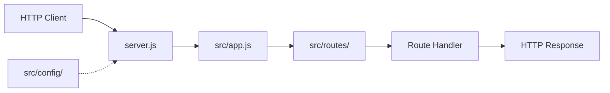
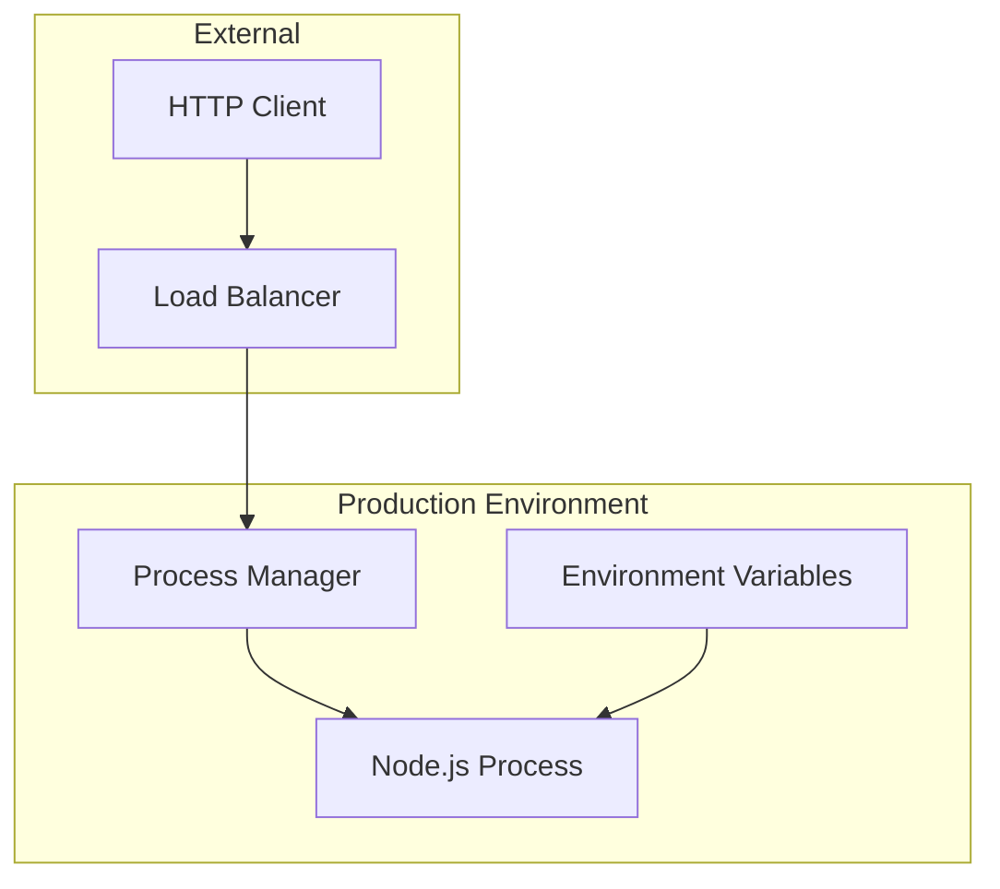

# Technical Specification

# 0. Agent Action Plan

## 0.1 Intent Clarification

### 0.1.1 Core Documentation Objective

Based on the provided requirements, the Blitzy platform understands that the documentation objective is to **enhance existing documentation and add comprehensive code-level documentation** for a Node.js/Express.js tutorial server project.

**Documentation Request Categorization:**

| Category | Classification |
|----------|----------------|
| Primary Task | Update existing documentation |
| Secondary Task | Improve documentation coverage |
| Documentation Types | JSDoc comments, README enhancements, Deployment guides, Inline code explanations |

**Documentation Requirements Identified:**

| Requirement ID | Description | Documentation Type | Priority |
|----------------|-------------|-------------------|----------|
| DOC-001 | Add JSDoc comments to server.js functions | Code documentation (JSDoc) | High |
| DOC-002 | Create comprehensive README | Project documentation (Markdown) | High |
| DOC-003 | Include setup instructions in README | User guide (Markdown) | High |
| DOC-004 | Include API documentation in README | API reference (Markdown) | High |
| DOC-005 | Include deployment guide in README | Operations documentation (Markdown) | High |
| DOC-006 | Add inline code explanations | Code documentation (Comments) | High |

**Implicit Documentation Needs Surfaced:**

Based on the request to add JSDoc and inline explanations, the Blitzy platform has identified these implicit documentation needs:

- JSDoc comments should extend to ALL JavaScript modules, not just server.js (src/app.js, src/config/index.js, src/routes/*.js)
- Inline code explanations should clarify architectural decisions and patterns used
- The deployment guide should cover Docker-less deployment, environment configuration, and production considerations
- API documentation should include request/response examples with curl commands
- Setup instructions should cover prerequisites, installation, and verification steps

**Important Discovery:**

Upon repository analysis, the Blitzy platform has determined that the codebase **already contains substantial JSDoc documentation** in all modules:

| Module | Current JSDoc Coverage | Gap Assessment |
|--------|------------------------|----------------|
| `server.js` | Module-level JSDoc, dependency annotations, initialization block | Minor enhancements needed |
| `src/app.js` | Module-level JSDoc, mount point comments | Function-level JSDoc gaps |
| `src/config/index.js` | Module-level JSDoc, property-level type annotations | Well documented |
| `src/routes/index.js` | Module-level JSDoc with usage example | Complete |
| `src/routes/main.routes.js` | Module-level JSDoc, route-level annotations | Enhanced examples needed |

The existing README.md is comprehensive but lacks:
- Dedicated deployment guide section
- Inline code explanations within the README
- Architecture decision rationale

### 0.1.2 Special Instructions and Constraints

**User-Specified Directives (Preserved Exactly):**

> "Add JSDoc comments to server.js functions, create a comprehensive README with setup instructions, API documentation, deployment guide, and inline code explanations."

**CRITICAL Documentation Requirements:**

- Focus on server.js as the primary JSDoc enhancement target
- README must contain ALL four specified sections: setup instructions, API documentation, deployment guide, inline code explanations
- Documentation should be comprehensive enough for new developers to understand and run the project

**Documentation Style Requirements:**

- Follow existing JSDoc patterns already established in the codebase
- Use @module, @type, @param, @returns tags consistently
- Include @example tags where applicable for API documentation
- Maintain existing code structure - documentation changes only

**Template Requirements Observed:**

The existing codebase establishes these documentation patterns:

```javascript
/**
 * [Module Title]
 * 
 * [Description of module purpose]
 * 
 * [Additional context: Architecture, Usage, etc.]
 * 
 * @module [module-name]
 */
```

**Web Search Research Conducted:**

Research on JSDoc best practices for Node.js/Express.js revealed:
- <cite index="4-1">"How to add JSDoc comments to CommonJS and Node.js modules"</cite> is a primary documentation concern
- <cite index="10-10,10-11">"Document as You Code: Make documentation a part of your development process, not an afterthought. This ensures your documentation stays up-to-date with your codebase."</cite>
- <cite index="10-12,10-13">"Be Descriptive but Concise: While it's important to be thorough, avoid overly verbose descriptions. Aim to provide clear, succinct explanations."</cite>
- <cite index="10-6,10-7">"JSDoc is a documentation syntax for JavaScript, similar to JavaDoc for Java or PyDoc for Python, enabling developers to annotate their code with comments that can later be transformed into a detailed documentation website."</cite>

### 0.1.3 Technical Interpretation

These documentation requirements translate to the following technical documentation strategy:

- **To add JSDoc comments to server.js**, we will enhance existing JSDoc blocks with comprehensive @param, @returns, @example, and @fires annotations for all documented elements
- **To create comprehensive README setup instructions**, we will consolidate and expand the existing prerequisites, installation, and verification sections
- **To include API documentation**, we will enhance the existing API Reference section with detailed parameter descriptions, response schemas, and additional curl examples
- **To include deployment guide**, we will CREATE a new dedicated section covering production deployment, environment configuration, process management, and scaling considerations
- **To add inline code explanations**, we will supplement JSDoc blocks with detailed inline comments explaining implementation decisions and architectural patterns

**Documentation Approach Matrix:**

| Requirement | Source Files | Target Documentation | Action |
|-------------|--------------|---------------------|--------|
| JSDoc for server.js | `server.js` | In-file JSDoc comments | UPDATE |
| Setup instructions | `README.md` | Prerequisites, Installation sections | UPDATE |
| API documentation | `README.md`, `src/routes/main.routes.js` | API Reference section | UPDATE |
| Deployment guide | `README.md` | New Deployment section | CREATE |
| Inline explanations | All `.js` files | In-file comments | UPDATE |

### 0.1.4 Inferred Documentation Needs

**Based on Code Analysis:**

- Module `server.js` has initialization code but lacks detailed inline explanation of the startup sequence
- Module `src/app.js` uses Factory pattern but lacks JSDoc explaining why this pattern was chosen
- Route handlers in `src/routes/main.routes.js` would benefit from @example tags showing expected responses

**Based on Structure:**

- The modular architecture (server → app → routes → config) requires documentation explaining module relationships
- The barrel pattern in `src/routes/index.js` should be documented as a design choice

**Based on Dependencies:**

- Express.js 5.1.0 introduces new features (async error handling) that should be mentioned in documentation
- Environment variables (HOST, PORT, NODE_ENV) are documented but deployment implications need expansion

**Based on User Journey:**

- New developer onboarding requires: Prerequisites → Installation → Verification → Understanding Architecture → Making Changes
- Production deployment requires: Environment configuration → Process management → Health checks → Troubleshooting

## 0.2 Documentation Discovery and Analysis

### 0.2.1 Existing Documentation Infrastructure Assessment

**Repository Documentation Structure Analysis:**

The repository was thoroughly analyzed for existing documentation infrastructure. Based on comprehensive search, the following documentation assets were discovered:

| Documentation Asset | Path | Type | Status | Coverage |
|---------------------|------|------|--------|----------|
| Project README | `README.md` | Markdown | Exists | Comprehensive |
| Technical Specifications | `blitzy/documentation/Technical Specifications.md` | Markdown | Exists | Complete |
| Project Guide | `blitzy/documentation/Project Guide.md` | Markdown | Exists | Complete |
| Git Ignore Rules | `.gitignore` | Config | Exists | Standard |
| Package Manifest | `package.json` | JSON | Exists | Minimal description |

**Documentation Files Matching Search Patterns:**

| Pattern | Files Found | Details |
|---------|-------------|---------|
| `README*` | 1 file | `README.md` (264 lines, comprehensive) |
| `docs/**` | 0 files | No dedicated docs folder |
| `*.md` | 3 files | `README.md`, `blitzy/documentation/*.md` |
| `*.mdx` | 0 files | None |
| `*.rst` | 0 files | None |
| `wiki/**` | 0 files | None |

**Documentation Generator Configuration:**

| Tool | Config File | Status |
|------|-------------|--------|
| MkDocs | `mkdocs.yml` | Not Present |
| Docusaurus | `docusaurus.config.js` | Not Present |
| Sphinx | `sphinx.conf.py` | Not Present |
| JSDoc | `jsdoc.json` / `jsdoc.config.js` | Not Present |

**Current Documentation Framework:**

- **Primary Format**: Native Markdown (no documentation generator)
- **Inline Documentation**: JSDoc comments in JavaScript source files
- **Diagram Tools**: Mermaid diagrams embedded in Markdown
- **API Documentation**: Manual markdown in README.md
- **Hosting/Deployment**: GitHub-native README rendering

**Repository Analysis Finding:**

"Repository analysis reveals a documentation structure consisting of a comprehensive root README.md with embedded API reference, plus supplementary technical documentation in the blitzy/documentation/ folder. JSDoc comments exist in all JavaScript modules but without a JSDoc HTML generator configured."

### 0.2.2 Repository Code Analysis for Documentation

**Search Patterns Used for Code to Document:**

| Pattern | Target | Files Found |
|---------|--------|-------------|
| `*.js` | JavaScript source files | 5 files |
| `server.js` | Entry point | 1 file (53 lines) |
| `src/**/*.js` | Application modules | 4 files |
| `src/config/**` | Configuration modules | 1 file |
| `src/routes/**` | Route handlers | 2 files |

**Key Directories Examined:**

| Directory | Purpose | Files | Documentation Status |
|-----------|---------|-------|---------------------|
| `/` (root) | Entry point and config | `server.js`, `package.json` | JSDoc present |
| `src/` | Application source | `app.js` | JSDoc present |
| `src/config/` | Configuration | `index.js` | JSDoc complete |
| `src/routes/` | HTTP routes | `index.js`, `main.routes.js` | JSDoc present |
| `blitzy/documentation/` | Technical docs | 2 Markdown files | Complete |

**Existing Documentation Found:**

| Documentation | Location | Coverage | Gaps Identified |
|---------------|----------|----------|-----------------|
| Module-level JSDoc | All `.js` files | 100% | Inline explanations sparse |
| Function-level JSDoc | `src/routes/main.routes.js` | Partial | @example tags needed |
| Type annotations | `server.js`, `src/config/index.js` | Good | Express types could be expanded |
| API reference | `README.md` | Complete | Response examples inline |
| Prerequisites | `README.md` | Complete | Version table present |
| Installation | `README.md` | Complete | npm commands documented |
| Troubleshooting | `README.md` | Present | 4 common issues covered |
| Deployment guide | `README.md` | Missing | **Major gap** |

### 0.2.3 JSDoc Coverage Analysis

**Current JSDoc Implementation by File:**

**server.js (53 lines):**
```
Source: /server.js
```

| JSDoc Element | Line Range | Status | Enhancement Needed |
|---------------|------------|--------|-------------------|
| Module header | 1-17 | ✅ Complete | Add @author, @version |
| Dependency: app | 25-30 | ✅ Complete | None |
| Dependency: config | 32-37 | ✅ Complete | None |
| Server initialization | 43-48 | ✅ Present | Add @fires tag for startup event |
| Inline comments | 50-51 | ✅ Present | Expand explanation |

**src/app.js (27 lines):**
```
Source: /src/app.js
```

| JSDoc Element | Line Range | Status | Enhancement Needed |
|---------------|------------|--------|-------------------|
| Module header | 1-12 | ✅ Complete | Add @requires tag |
| Route mounting | 19-25 | ⚠️ Partial | Add detailed explanation |
| Export statement | 27 | ❌ Missing | Add @exports annotation |

**src/config/index.js (41 lines):**
```
Source: /src/config/index.js
```

| JSDoc Element | Status | Assessment |
|---------------|--------|------------|
| Module header | ✅ Complete | Comprehensive with methodology reference |
| host property | ✅ Complete | @type and @default present |
| port property | ✅ Complete | @type and @default present |
| env property | ✅ Complete | @type and @default present |

**src/routes/index.js (19 lines):**
```
Source: /src/routes/index.js
```

| JSDoc Element | Status | Assessment |
|---------------|--------|------------|
| Module header | ✅ Complete | Includes usage example |
| Export object | ❌ Missing | Add @exports annotation |

**src/routes/main.routes.js (41 lines):**
```
Source: /src/routes/main.routes.js
```

| JSDoc Element | Status | Enhancement Needed |
|---------------|--------|-------------------|
| Module header | ✅ Complete | Add @requires express |
| GET / handler | ✅ Present | Add @example with curl |
| GET /evening handler | ✅ Present | Add @example with curl |
| Router export | ❌ Missing | Add @exports annotation |

### 0.2.4 Web Search Research Conducted

**Research Topics and Findings:**

| Topic | Key Finding | Application |
|-------|-------------|-------------|
| JSDoc best practices | Use @module, @param, @returns, @example, @type consistently | Standardize annotations across all modules |
| Node.js documentation patterns | CommonJS modules support JSDoc via @module tag | Already implemented |
| Express.js API documentation | Swagger/OpenAPI integration via JSDoc possible | Out of scope for this request |
| README best practices | Include badges, table of contents, contributing guide | Consider adding badges |
| Deployment documentation | Cover environment config, process managers, health checks | New section required |

**Documentation Best Practices Applied:**

- Module-level JSDoc blocks at file start
- Type annotations using @type for all exported values
- @default tags for configuration with defaults
- @example tags for API usage demonstration
- Inline comments for non-obvious implementation details

## 0.3 Documentation Scope Analysis

### 0.3.1 Code-to-Documentation Mapping

**Modules Requiring Documentation Enhancement:**

**Module: server.js**
```
Source: /server.js (53 lines)
```

| Element | Type | Current Documentation | Documentation Needed |
|---------|------|----------------------|---------------------|
| Module declaration | JSDoc header | Complete (lines 1-17) | Add @author, @version, @since |
| `app` import | Const declaration | Complete (lines 25-30) | None |
| `config` import | Const declaration | Complete (lines 32-37) | None |
| `app.listen()` callback | Arrow function | Partial (lines 43-48) | Add @fires, @callback annotation |
| Console.log statement | Inline code | Single comment (line 50) | Expand inline explanation |

**Module: src/app.js**
```
Source: /src/app.js (27 lines)
```

| Element | Type | Current Documentation | Documentation Needed |
|---------|------|----------------------|---------------------|
| Module declaration | JSDoc header | Complete (lines 1-12) | Add @requires tags |
| `express` require | Import | None | Add inline explanation |
| `mainRoutes` destructure | Import | None | Add inline explanation of barrel pattern |
| `app` creation | Factory call | None | Add inline explanation |
| `app.use()` | Router mount | Partial (lines 19-24) | Expand architectural rationale |
| `module.exports` | Export | None | Add @exports JSDoc |

**Module: src/config/index.js**
```
Source: /src/config/index.js (41 lines)
```

| Element | Type | Current Documentation | Documentation Needed |
|---------|------|----------------------|---------------------|
| Module declaration | JSDoc header | Complete (lines 1-18) | None - well documented |
| `host` property | String | Complete (lines 21-26) | None |
| `port` property | Number | Complete (lines 28-33) | None |
| `env` property | String | Complete (lines 35-40) | None |

**Module: src/routes/index.js**
```
Source: /src/routes/index.js (19 lines)
```

| Element | Type | Current Documentation | Documentation Needed |
|---------|------|----------------------|---------------------|
| Module declaration | JSDoc header | Complete (lines 1-13) | None |
| `mainRoutes` require | Import | None | Add inline explanation |
| `module.exports` | Export object | None | Add @exports JSDoc |

**Module: src/routes/main.routes.js**
```
Source: /src/routes/main.routes.js (41 lines)
```

| Element | Type | Current Documentation | Documentation Needed |
|---------|------|----------------------|---------------------|
| Module declaration | JSDoc header | Complete (lines 1-13) | Add @requires express |
| `express` require | Import | None | Add inline explanation |
| `router` creation | Router instance | None | Add inline explanation |
| GET `/` handler | Route handler | Present (lines 19-25) | Add @example tag |
| GET `/evening` handler | Route handler | Present (lines 30-36) | Add @example tag |
| `module.exports` | Export | None | Add @exports JSDoc |

### 0.3.2 Configuration Options Requiring Documentation

**Environment Variables (Already Documented in src/config/index.js):**

| Variable | Type | Default | README Status | Enhancement Needed |
|----------|------|---------|---------------|-------------------|
| `HOST` | string | `'127.0.0.1'` | ✅ Documented | Add deployment context |
| `PORT` | number | `3000` | ✅ Documented | Add port selection guidance |
| `NODE_ENV` | string | `'development'` | ✅ Documented | Explain production implications |

### 0.3.3 README Sections Analysis

**Current README.md Structure (264 lines):**

| Section | Lines | Status | Enhancement Needed |
|---------|-------|--------|-------------------|
| Title and Description | 1-6 | ✅ Present | Add badges |
| Prerequisites | 7-24 | ✅ Complete | None |
| Installation | 26-41 | ✅ Complete | None |
| Usage | 43-71 | ✅ Complete | None |
| API Reference | 73-125 | ✅ Complete | Add more examples |
| Project Structure | 127-153 | ✅ Complete | Add inline code explanations |
| Environment Variables | 154-183 | ✅ Complete | Add deployment context |
| Architecture | 184-202 | ✅ Present | Add diagrams |
| Dependencies | 203-221 | ✅ Present | None |
| Scripts | 222-227 | ✅ Present | None |
| Troubleshooting | 228-252 | ✅ Present | Expand scenarios |
| License | 253-255 | ✅ Present | None |
| Author | 257-259 | ✅ Present | None |
| **Deployment Guide** | N/A | ❌ MISSING | **CREATE NEW SECTION** |
| **Inline Code Explanations** | N/A | ❌ MISSING | **ADD TO README** |

### 0.3.4 Documentation Gap Analysis

**Given the requirements and repository analysis, documentation gaps include:**

**Critical Gaps (Required by User):**

| Gap ID | Description | Location | Priority |
|--------|-------------|----------|----------|
| GAP-001 | Missing deployment guide | README.md | **HIGH** |
| GAP-002 | Missing inline code explanations in README | README.md | **HIGH** |
| GAP-003 | Incomplete JSDoc @example tags | main.routes.js | **HIGH** |
| GAP-004 | Missing @exports JSDoc annotations | Multiple files | MEDIUM |

**JSDoc Enhancement Gaps:**

| File | Missing Element | Impact |
|------|----------------|--------|
| `server.js` | @author, @version, @since tags | Low - metadata |
| `server.js` | @fires tag for server ready event | Medium - event documentation |
| `src/app.js` | @requires tags for dependencies | Medium - dependency tracking |
| `src/app.js` | @exports annotation | Medium - API documentation |
| `src/routes/main.routes.js` | @example tags with curl commands | High - usability |
| `src/routes/main.routes.js` | @exports annotation | Medium - API documentation |
| `src/routes/index.js` | @exports annotation | Medium - API documentation |

**README Enhancement Gaps:**

| Section | Gap | Required Content |
|---------|-----|------------------|
| Deployment | Missing entirely | Production setup, environment config, process management, health checks |
| Inline Explanations | Missing entirely | Code snippets with explanatory annotations |
| Architecture | Incomplete | Add decision rationale |

### 0.3.5 Features Requiring User Guides

**Current Feature Documentation Status:**

| Feature | User Guide Status | Location | Enhancement |
|---------|------------------|----------|-------------|
| Installation | ✅ Complete | README.md | None |
| Configuration | ✅ Complete | README.md | Add deployment context |
| API Usage | ✅ Complete | README.md | Add more examples |
| Troubleshooting | ✅ Present | README.md | Add deployment issues |
| **Deployment** | ❌ Missing | README.md | **CREATE** |
| **Code Walkthrough** | ❌ Missing | README.md | **CREATE** |

## 0.4 Documentation Implementation Design

### 0.4.1 Documentation Structure Planning

**Target Documentation Hierarchy:**

```
hao-backprop-test/
├── README.md                              # Enhanced project documentation
│   ├── Prerequisites                       # Already exists
│   ├── Installation                        # Already exists
│   ├── Usage                               # Already exists
│   ├── API Reference                       # Already exists - enhance
│   ├── Project Structure                   # Already exists
│   ├── Code Walkthrough (NEW)              # Inline code explanations
│   ├── Environment Variables               # Already exists
│   ├── Architecture                        # Already exists - enhance
│   ├── Deployment Guide (NEW)              # Production deployment
│   ├── Dependencies                        # Already exists
│   ├── Scripts                             # Already exists
│   ├── Troubleshooting                     # Already exists - enhance
│   └── License                             # Already exists
├── server.js                              # Enhanced JSDoc comments
└── src/
    ├── app.js                             # Enhanced JSDoc + inline comments
    ├── config/
    │   └── index.js                       # Already well documented
    └── routes/
        ├── index.js                       # Add @exports JSDoc
        └── main.routes.js                 # Add @example tags
```

### 0.4.2 Content Generation Strategy

**Information Extraction Approach:**

| Source | Information to Extract | Target Documentation |
|--------|----------------------|---------------------|
| `server.js` lines 43-52 | Server startup sequence | JSDoc @fires annotation, inline comments |
| `src/app.js` lines 14-27 | Factory pattern implementation | JSDoc @requires, inline explanation |
| `src/routes/main.routes.js` | Route handlers with responses | @example tags with curl commands |
| `package.json` | Version info, scripts | README badges, deployment scripts |
| Existing README.md | Current content structure | Preserve and enhance |

**Template Application:**

The existing codebase establishes JSDoc patterns to follow. Module headers should include @module tag at minimum, with optional @requires, @author, and @version tags for the main entry point.

**Route Handler JSDoc Template (NEW):**

Route handlers should include @route tag with METHOD and PATH, @returns tag with response description, and @example tag with curl command and expected response.

### 0.4.3 Documentation Standards

**JSDoc Formatting Requirements:**

| Tag | Usage | Required In |
|-----|-------|-------------|
| `@module` | Module identification | All module headers |
| `@requires` | Dependency declaration | app.js, main.routes.js |
| `@type` | Type annotation | All exported constants |
| `@param` | Function parameters | All functions with parameters |
| `@returns` | Return values | All functions with returns |
| `@example` | Usage examples | Route handlers |
| `@exports` | Export documentation | All module.exports statements |
| `@fires` | Event emission | server.js startup |
| `@author` | Authorship | server.js |
| `@version` | Version tracking | server.js |

**README Markdown Standards:**

| Element | Format | Example |
|---------|--------|---------|
| Headers | Hash hierarchy | `## Deployment Guide` |
| Code blocks | Triple backticks with language | javascript, bash |
| Inline code | Single backticks | `server.js` |
| Tables | Pipe-separated | Column-Value format |
| Links | Markdown syntax | `[text](url)` |
| Emphasis | Asterisks | bold, italic |

**Inline Comment Standards:**

- Single-line comments: Brief explanation of what the next line does
- Multi-line comments: Longer explanation of code block purpose including non-obvious behavior or design decisions

### 0.4.4 Diagram and Visual Strategy

**Mermaid Diagrams to Enhance in README.md:**

| Diagram Type | Purpose | Location |
|--------------|---------|----------|
| Request Flow | Show HTTP request lifecycle | Architecture section |
| Module Dependencies | Show import relationships | Code Walkthrough section |
| Deployment Topology | Show production setup | Deployment Guide section |

**Request Flow Diagram (Architecture Section):**


```mermaid
flowchart LR
    Client[HTTP Client] --> Server[server.js]
    Server --> App[src/app.js]
    App --> Routes[src/routes/]
    Routes --> Handler[Route Handler]
    Handler --> Response[HTTP Response]
    Config[src/config/] -.-> Server
```

**Deployment Topology Diagram (Deployment Guide):**


```mermaid
flowchart TB
    subgraph Production[Production Environment]
        PM[Process Manager]
        Node[Node.js Process]
        ENV[Environment Variables]
    end
    
    subgraph Client[External]
        LB[Load Balancer]
        HTTP[HTTP Client]
    end
    
    HTTP --> LB
    LB --> PM
    PM --> Node
    ENV --> Node
```

### 0.4.5 Inline Code Explanation Strategy

**Code Walkthrough Section Structure:**

The README Code Walkthrough section will include annotated code snippets from each module explaining key implementation decisions and patterns.

**server.js Walkthrough Elements:**

| Code Block | Explanation Focus |
|------------|-------------------|
| Imports section | Dependency injection pattern |
| Config usage | Environment-driven configuration |
| app.listen() | HTTP server binding with callback |
| Console.log | Startup confirmation pattern |

**src/app.js Walkthrough Elements:**

| Code Block | Explanation Focus |
|------------|-------------------|
| express() call | Factory pattern - app creation |
| Route destructuring | Barrel pattern import |
| app.use() | Middleware/router mounting |
| module.exports | Export pattern for testing |

**Annotation Style:**

Code snippets in the README will include inline comments explaining:
- Why the code is structured this way
- What pattern or methodology it follows
- What the expected behavior is
- Any non-obvious implementation details

## 0.5 Documentation File Transformation Mapping

### 0.5.1 File-by-File Documentation Plan

**CRITICAL: Complete mapping of EVERY documentation file to be created, updated, or deleted:**

**Documentation Transformation Modes:**
- **CREATE** - Create a new documentation file or section
- **UPDATE** - Update an existing documentation file
- **DELETE** - Remove an obsolete documentation file
- **REFERENCE** - Use as an example for documentation style and structure

| Target Documentation File | Transformation | Source Code/Docs | Content/Changes |
|---------------------------|----------------|------------------|-----------------|
| `README.md` | UPDATE | `README.md` | Add Deployment Guide section, Code Walkthrough section with inline explanations |
| `server.js` | UPDATE | `server.js` | Enhance JSDoc with @author, @version, @since, @fires tags; add inline comments |
| `src/app.js` | UPDATE | `src/app.js` | Add @requires tags, @exports annotation, inline explanations |
| `src/config/index.js` | REFERENCE | `src/config/index.js` | Use as template for JSDoc style - no changes needed |
| `src/routes/index.js` | UPDATE | `src/routes/index.js` | Add @exports JSDoc annotation, inline explanation |
| `src/routes/main.routes.js` | UPDATE | `src/routes/main.routes.js` | Add @requires tag, @example tags with curl commands, @exports annotation |
| `blitzy/documentation/*.md` | REFERENCE | `blitzy/documentation/` | Existing technical docs - no changes needed |

### 0.5.2 New Documentation Sections Detail

**README.md - New Deployment Guide Section:**

```
Target: README.md (INSERT after Architecture section, before Dependencies)
Type: Operations Documentation
Source References: src/config/index.js (environment config), package.json (scripts)
```

**Sections to Create:**

| Section | Content Description |
|---------|-------------------|
| Deployment Guide Header | Introduction to production deployment |
| Production Environment Setup | NODE_ENV=production, host binding, port configuration |
| Process Management | Using pm2 or systemd for process supervision |
| Health Checks | Verification endpoints and monitoring |
| Scaling Considerations | Horizontal scaling, load balancing, stateless design |
| Security Considerations | Non-root execution, environment variables security |

**README.md - New Code Walkthrough Section:**

```
Target: README.md (INSERT after Project Structure section)
Type: Developer Guide
Source References: server.js, src/app.js, src/routes/main.routes.js
```

**Content Structure:**

| Subsection | Purpose | Source File |
|------------|---------|-------------|
| Entry Point Walkthrough | Explain server startup flow | server.js |
| App Factory Walkthrough | Explain Express configuration | src/app.js |
| Route Handler Walkthrough | Explain HTTP endpoint handling | src/routes/main.routes.js |
| Configuration Walkthrough | Explain environment config | src/config/index.js |

### 0.5.3 Documentation Files to Update Detail

**server.js - JSDoc Enhancement:**

| Enhancement | Current State | Target State |
|-------------|---------------|--------------|
| Module header | Lines 1-17 complete | Add @author, @version, @since tags |
| Dependencies section | Lines 21-37 complete | Add section divider comment |
| Initialization section | Lines 39-52 | Add @fires tag for ready event |
| app.listen callback | Inline comment present | Expand with architectural context |

**JSDoc Additions for server.js:**

- `@author hxu` - from package.json author field
- `@version 1.0.0` - from package.json version field
- `@since 1.0.0` - initial release
- `@fires server:ready` - startup event documentation

**src/app.js - JSDoc Enhancement:**

| Enhancement | Current State | Target State |
|-------------|---------------|--------------|
| Module header | Lines 1-12 complete | Add @requires express, @requires ./routes |
| Express import | Line 14, no comment | Add inline explanation |
| Routes import | Line 15, no comment | Add inline explanation of barrel pattern |
| app creation | Line 17, no comment | Add inline explanation of factory pattern |
| app.use | Lines 19-25 partial | Expand mounting explanation |
| module.exports | Line 27, no comment | Add @exports annotation |

**src/routes/index.js - JSDoc Enhancement:**

| Enhancement | Current State | Target State |
|-------------|---------------|--------------|
| Module header | Lines 1-13 complete | No changes needed |
| mainRoutes require | Line 15, no comment | Add inline explanation |
| module.exports | Lines 17-19, no comment | Add @exports JSDoc block |

**src/routes/main.routes.js - JSDoc Enhancement:**

| Enhancement | Current State | Target State |
|-------------|---------------|--------------|
| Module header | Lines 1-13 complete | Add @requires express |
| express import | Line 15, no comment | Add inline explanation |
| router creation | Line 17, no comment | Add inline explanation |
| GET / handler | Lines 19-28 present | Add @example with curl command |
| GET /evening handler | Lines 30-39 present | Add @example with curl command |
| module.exports | Line 41, no comment | Add @exports annotation |

### 0.5.4 README.md Section Transformation Map

**Current README.md Structure vs. Target:**

| Section | Current Status | Target Action | Line Range |
|---------|----------------|---------------|------------|
| Title | Present | Keep | 1-6 |
| Prerequisites | Complete | Keep | 7-24 |
| Installation | Complete | Keep | 26-41 |
| Usage | Complete | Keep | 43-71 |
| API Reference | Complete | Enhance examples | 73-125 |
| Project Structure | Complete | Keep | 127-153 |
| **Code Walkthrough** | **MISSING** | **CREATE** | INSERT after 153 |
| Environment Variables | Complete | Keep | 154-183 |
| Architecture | Present | Enhance diagrams | 184-202 |
| **Deployment Guide** | **MISSING** | **CREATE** | INSERT after 202 |
| Dependencies | Present | Keep | 203-221 |
| Scripts | Present | Keep | 222-227 |
| Troubleshooting | Present | Add deployment issues | 228-252 |
| License | Present | Keep | 253-255 |
| Author | Present | Keep | 257-259 |

### 0.5.5 Documentation Configuration Updates

**No configuration file updates required:**

| Tool | Config File | Status | Action |
|------|-------------|--------|--------|
| JSDoc | `jsdoc.json` | Not present | Not required - inline JSDoc only |
| MkDocs | `mkdocs.yml` | Not present | Not required - README-based docs |
| npm scripts | `package.json` | Present | No documentation script needed |

### 0.5.6 Cross-Documentation Dependencies

**Shared Content and References:**

| Source | Used By | Content Type |
|--------|---------|--------------|
| `package.json` version | `server.js` @version tag | Version string |
| `package.json` author | `server.js` @author tag | Author name |
| `src/config/index.js` | README Environment Variables | Config documentation |
| `src/routes/main.routes.js` | README API Reference | Endpoint behavior |

**Navigation Links Between Documents:**

| From | To | Link Purpose |
|------|-----|--------------|
| README.md | None (self-contained) | N/A |
| server.js JSDoc | src/app.js | @see reference |
| server.js JSDoc | src/config | @see reference |

**No Table of Contents updates required** - README.md does not have explicit TOC

## 0.6 Dependency Inventory

### 0.6.1 Documentation Dependencies

**Documentation Tools and Packages:**

This documentation task does not require any additional npm packages. All documentation is created using:

| Registry | Package Name | Version | Purpose | Status |
|----------|--------------|---------|---------|--------|
| npm | express | 5.1.0 | Runtime dependency (documented) | Already installed |
| N/A | JSDoc (inline) | N/A | Code comments only, no generator | No installation needed |
| N/A | Markdown | N/A | Native GitHub rendering | No installation needed |
| N/A | Mermaid | N/A | GitHub-native diagram support | No installation needed |

**Verification of Installed Dependencies:**

```
Source: /package.json and npm ls output
```

| Dependency | Declared Version | Resolved Version | Verified |
|------------|------------------|------------------|----------|
| express | ^5.1.0 | 5.1.0 | ✅ Yes |

**Optional Documentation Tools (NOT Required for This Task):**

| Registry | Package Name | Version | Purpose | Recommendation |
|----------|--------------|---------|---------|----------------|
| npm | jsdoc | 4.0.4 | Generate HTML from JSDoc | Not needed - inline JSDoc sufficient |
| npm | docdash | 2.0.2 | JSDoc template | Not needed |
| npm | swagger-jsdoc | 6.2.8 | OpenAPI from JSDoc | Out of scope |
| npm | swagger-ui-express | 5.0.1 | Swagger UI | Out of scope |

### 0.6.2 Runtime Environment Dependencies

**Node.js and npm Requirements (From README.md):**

| Requirement | Minimum Version | Recommended Version | Current Environment |
|-------------|-----------------|---------------------|---------------------|
| Node.js | 18.x | 20.19.x (LTS) | v20.19.6 ✅ |
| npm | 8.x | 10.8.x | 11.1.0 ✅ |

### 0.6.3 Documentation Reference Updates

**Files Requiring Internal Link Updates:**

| Documentation File | Update Type | Details |
|--------------------|-------------|---------|
| README.md | Section links | Add links to new Deployment Guide and Code Walkthrough sections |
| server.js JSDoc | @see references | Add references to src/app.js and src/config |
| src/app.js JSDoc | @see references | Add references to src/routes |

**Link Transformation Rules:**

No external link transformations required. All documentation is self-contained within the repository.

**Internal Reference Pattern:**

| Reference Type | Format | Example |
|----------------|--------|---------|
| File reference | `@see module:path` | `@see module:src/app` |
| Section reference | `## Section Name` | `## Deployment Guide` |
| Code reference | Inline backticks | `` `server.js` `` |

### 0.6.4 Documentation Asset Dependencies

**Diagrams and Visual Assets:**

| Asset Type | Format | Dependency | Storage Location |
|------------|--------|------------|------------------|
| Architecture diagrams | Mermaid | GitHub native | Inline in README.md |
| Request flow diagrams | Mermaid | GitHub native | Inline in README.md |
| Deployment diagrams | Mermaid | GitHub native | Inline in README.md |

**No external image dependencies required** - all diagrams rendered via Mermaid syntax.

### 0.6.5 Version Compatibility Matrix

**Documentation Tool Compatibility:**

| Tool | Minimum Node.js | Notes |
|------|-----------------|-------|
| GitHub Markdown | Any | Native rendering |
| GitHub Mermaid | Any | Native rendering |
| JSDoc comments | Any | IDE support varies |

**Express.js Documentation Compatibility:**

| Express Version | JSDoc Support | Notes |
|-----------------|---------------|-------|
| 5.1.0 | Full | Async error handling documented |

### 0.6.6 External Documentation References

**Referenced External Documentation:**

| Resource | URL | Purpose |
|----------|-----|---------|
| Express.js Docs | https://expressjs.com/ | API reference for Express methods |
| Node.js Docs | https://nodejs.org/docs/ | Node.js runtime documentation |
| JSDoc Reference | https://jsdoc.app/ | JSDoc tag reference |
| Twelve-Factor App | https://12factor.net/ | Configuration methodology |

**These external references may be cited in documentation but are not dependencies.**

## 0.7 Coverage and Quality Targets

### 0.7.1 Documentation Coverage Metrics

**Current Coverage Analysis:**

| Category | Items Documented | Total Items | Coverage | Target |
|----------|------------------|-------------|----------|--------|
| JavaScript modules | 5/5 | 5 | 100% | 100% |
| Module-level JSDoc | 5/5 | 5 | 100% | 100% |
| Function-level JSDoc | 3/5 | 5 | 60% | 100% |
| @example tags | 0/2 | 2 | 0% | 100% |
| @exports annotations | 0/4 | 4 | 0% | 100% |
| README sections | 12/14 | 14 | 86% | 100% |
| API endpoints documented | 2/2 | 2 | 100% | 100% |
| Environment variables | 3/3 | 3 | 100% | 100% |

**Coverage Gaps to Address:**

| Gap | Current | Target | Action Required |
|-----|---------|--------|-----------------|
| Route handler @example tags | 0% | 100% | Add @example to GET / and GET /evening |
| Module @exports annotations | 0% | 100% | Add @exports to 4 module.exports statements |
| Deployment guide | 0% | 100% | Create new README section |
| Code walkthrough | 0% | 100% | Create new README section |
| Inline code explanations | Sparse | Comprehensive | Add comments to all modules |

### 0.7.2 JSDoc Coverage Targets

**Per-Module Coverage Requirements:**

**server.js:**

| Element | Current | Target | Priority |
|---------|---------|--------|----------|
| Module header | ✅ Complete | Add @author, @version, @since | Medium |
| @fires tag | ❌ Missing | Add for startup event | Medium |
| Inline comments | Partial | Expand explanations | High |

**src/app.js:**

| Element | Current | Target | Priority |
|---------|---------|--------|----------|
| @requires tags | ❌ Missing | Add for express, ./routes | Medium |
| @exports annotation | ❌ Missing | Add for module.exports | Medium |
| Inline comments | ❌ Missing | Add for all major statements | High |

**src/routes/main.routes.js:**

| Element | Current | Target | Priority |
|---------|---------|--------|----------|
| @requires express | ❌ Missing | Add to module header | Medium |
| @example (GET /) | ❌ Missing | Add curl example | High |
| @example (GET /evening) | ❌ Missing | Add curl example | High |
| @exports annotation | ❌ Missing | Add for module.exports | Medium |

**src/routes/index.js:**

| Element | Current | Target | Priority |
|---------|---------|--------|----------|
| @exports annotation | ❌ Missing | Add for module.exports | Medium |

### 0.7.3 Documentation Quality Criteria

**Completeness Requirements:**

| Requirement | Validation Criteria |
|-------------|---------------------|
| All public APIs have descriptions | Every exported function/object has JSDoc @description |
| All parameters documented | Every function parameter has @param tag with type |
| All return values documented | Every function has @returns tag with type |
| All examples are executable | curl commands return expected responses |
| Setup guide is complete | New developer can run server following only README |
| Deployment guide is actionable | Production deployment achievable following guide |

**Accuracy Validation:**

| Validation Type | Method | Acceptance Criteria |
|-----------------|--------|---------------------|
| JSDoc syntax | IDE validation | No JSDoc errors in VS Code |
| Code examples | Manual execution | All curl commands return expected output |
| API documentation | Server testing | Documented responses match actual responses |
| Environment variables | Runtime verification | All documented env vars work as described |

**Clarity Standards:**

| Standard | Description | Measurement |
|----------|-------------|-------------|
| Technical accuracy | Code behavior matches documentation | 100% match |
| Accessible language | Understandable by junior developers | Peer review |
| Progressive disclosure | Simple concepts before complex | Section ordering |
| Consistent terminology | Same terms throughout | Term glossary |

**Maintainability Standards:**

| Standard | Implementation |
|----------|----------------|
| Source citations | JSDoc @see references to source files |
| Version tracking | @version and @since tags |
| Clear ownership | @author tag in main entry point |
| Template consistency | Follow established JSDoc patterns |

### 0.7.4 Example and Diagram Requirements

**Example Requirements:**

| Example Type | Minimum Count | Target Files |
|--------------|---------------|--------------|
| curl commands for endpoints | 2 | main.routes.js, README.md |
| Configuration examples | 3 | README.md (already present) |
| Environment variable examples | 3 | README.md (already present) |
| Code snippets with explanation | 4 | README.md Code Walkthrough |

**Diagram Requirements:**

| Diagram Type | Count | Location | Status |
|--------------|-------|----------|--------|
| Request flow | 1 | README.md Architecture | Present - enhance |
| Module dependency | 1 | README.md Code Walkthrough | Create |
| Deployment topology | 1 | README.md Deployment Guide | Create |

**Code Example Testing:**

| Example | Test Method | Expected Result |
|---------|-------------|-----------------|
| curl http://127.0.0.1:3000/ | Server + curl | "Hello, World!\n" |
| curl http://127.0.0.1:3000/evening | Server + curl | "Good evening" |
| npm start | Terminal | "Server running at..." message |
| HOST=0.0.0.0 PORT=8080 npm start | Terminal | Server on custom host:port |

### 0.7.5 Quality Checklist

**Pre-Completion Validation:**

| Check | Criteria | Required |
|-------|----------|----------|
| All JSDoc blocks valid | No syntax errors | ✅ Required |
| All @example tags executable | curl commands work | ✅ Required |
| README renders correctly | GitHub preview | ✅ Required |
| Mermaid diagrams render | GitHub preview | ✅ Required |
| No broken internal references | All @see tags valid | ✅ Required |
| Code snippets syntax highlighted | Language specified | ✅ Required |
| Tables properly formatted | Markdown valid | ✅ Required |
| All TODO items addressed | No placeholders | ✅ Required |

## 0.8 Scope Boundaries

### 0.8.1 Exhaustively In Scope

**Documentation Files to Create/Update:**

| Category | Files/Patterns | Action |
|----------|----------------|--------|
| **Project README** | `README.md` | UPDATE - Add Deployment Guide, Code Walkthrough |
| **Entry Point** | `server.js` | UPDATE - Enhance JSDoc, add inline comments |
| **Application Factory** | `src/app.js` | UPDATE - Add @requires, @exports, inline comments |
| **Route Aggregator** | `src/routes/index.js` | UPDATE - Add @exports JSDoc |
| **Route Handlers** | `src/routes/main.routes.js` | UPDATE - Add @example, @requires, @exports |

**Specific Documentation Elements In Scope:**

| Element Type | Target Files | Description |
|--------------|--------------|-------------|
| JSDoc @author tag | `server.js` | Add author from package.json |
| JSDoc @version tag | `server.js` | Add version from package.json |
| JSDoc @since tag | `server.js` | Add initial version tag |
| JSDoc @fires tag | `server.js` | Document server ready event |
| JSDoc @requires tags | `src/app.js`, `src/routes/main.routes.js` | Document module dependencies |
| JSDoc @exports tags | `src/app.js`, `src/routes/*.js` | Document module exports |
| JSDoc @example tags | `src/routes/main.routes.js` | Add curl command examples |
| Inline comments | All `.js` files | Explain code behavior |
| README Deployment Guide | `README.md` | New section |
| README Code Walkthrough | `README.md` | New section with inline explanations |
| Mermaid diagrams | `README.md` | Enhance/add diagrams |

**README Sections Explicitly In Scope:**

| Section | Status | Action |
|---------|--------|--------|
| Deployment Guide | Missing | CREATE |
| Code Walkthrough | Missing | CREATE |
| Architecture | Present | ENHANCE with diagrams |
| Troubleshooting | Present | ADD deployment troubleshooting |

### 0.8.2 Explicitly Out of Scope

**Source Code Modifications (Beyond Documentation):**

| Category | Exclusion | Rationale |
|----------|-----------|-----------|
| Feature additions | No new endpoints or functionality | Documentation task only |
| Code refactoring | No structural changes to source | Documentation task only |
| Bug fixes | No behavior modifications | Documentation task only |
| Dependency updates | No package.json changes | Documentation task only |
| Test implementations | No new test files | Not requested |

**Documentation Out of Scope:**

| Item | Rationale |
|------|-----------|
| JSDoc HTML generation | Not requested - inline JSDoc sufficient |
| Swagger/OpenAPI documentation | Not requested |
| TypeDoc generation | Project uses JavaScript, not TypeScript |
| External documentation hosting | Not requested |
| Changelog updates | Not requested |
| Contributing guidelines | Not requested |
| Code of conduct | Not requested |

**Configuration Files Out of Scope:**

| File | Rationale |
|------|-----------|
| `jsdoc.json` | Not creating JSDoc HTML output |
| `mkdocs.yml` | Not using MkDocs |
| `.readthedocs.yml` | Not using ReadTheDocs |
| `docusaurus.config.js` | Not using Docusaurus |

**Files Explicitly Excluded:**

| File | Rationale |
|------|-----------|
| `src/config/index.js` | Already well documented - reference only |
| `package.json` | No documentation script needed |
| `package-lock.json` | Auto-generated, no documentation |
| `.gitignore` | Configuration file, no documentation needed |
| `blitzy/documentation/*.md` | Existing technical docs - no changes needed |

### 0.8.3 Boundary Clarifications

**JSDoc Scope Definition:**

| In Scope | Out of Scope |
|----------|--------------|
| Module-level JSDoc headers | JSDoc HTML generation |
| @param, @returns, @type annotations | TypeScript type definition files |
| @example tags with working examples | Automated example testing |
| @requires, @exports annotations | Complex @typedef blocks |
| @author, @version metadata | @license blocks (MIT stated in package.json) |

**README Scope Definition:**

| In Scope | Out of Scope |
|----------|--------------|
| Deployment guide section | Docker/containerization guide |
| Code walkthrough section | Video tutorials |
| Enhanced architecture diagrams | External diagram files |
| Troubleshooting expansion | Issue template creation |
| Inline code explanations | API specification (OpenAPI) |

**Inline Comments Scope:**

| In Scope | Out of Scope |
|----------|--------------|
| Architectural decision explanations | Line-by-line verbose comments |
| Pattern identification comments | Comments restating obvious code |
| Non-obvious behavior documentation | Comments in test files |
| Section divider comments | Comments in config files (already documented) |

### 0.8.4 Scope Validation Checklist

**Validation that all requirements are addressed:**

| User Requirement | In Scope | Implementation |
|------------------|----------|----------------|
| "Add JSDoc comments to server.js functions" | ✅ Yes | Enhanced JSDoc in server.js |
| "Create a comprehensive README" | ✅ Yes | UPDATE existing README.md |
| "Setup instructions" | ✅ Yes | Already present, verify completeness |
| "API documentation" | ✅ Yes | Already present, add examples |
| "Deployment guide" | ✅ Yes | CREATE new section |
| "Inline code explanations" | ✅ Yes | Add to Code Walkthrough section + JSDoc |

**Boundary Enforcement:**

| Principle | Enforcement |
|-----------|-------------|
| Documentation changes only | No .js file logic modifications |
| Preserve existing behavior | All curl commands must continue working |
| Maintain existing style | Follow established JSDoc patterns |
| Minimal disruption | Update existing files, don't restructure |

## 0.9 Execution Parameters

### 0.9.1 Documentation-Specific Instructions

**Documentation Build Commands:**

| Command | Purpose | Usage |
|---------|---------|-------|
| `npm start` | Start server for API documentation verification | Verify curl examples work |
| N/A | No JSDoc HTML build | Inline JSDoc only |
| N/A | No documentation site build | GitHub README rendering |

**Documentation Preview Commands:**

| Command | Purpose | Notes |
|---------|---------|-------|
| GitHub Preview | View README.md rendering | Push to repository or use GitHub preview |
| VS Code Preview | Local markdown preview | Built-in markdown preview |
| Mermaid Preview | Diagram verification | Use Mermaid Live Editor or GitHub |

**Diagram Generation:**

No external diagram generation required. All diagrams use Mermaid syntax rendered natively by GitHub.

**Documentation Validation Commands:**

| Validation | Command | Expected Result |
|------------|---------|-----------------|
| JSDoc syntax | IDE (VS Code) | No JSDoc errors highlighted |
| Markdown syntax | Markdown linter | Valid markdown |
| Link checking | Manual review | All internal references valid |
| Example verification | `npm start` + `curl` | Expected responses |

### 0.9.2 Default Formats and Standards

**Document Formats:**

| Document Type | Format | Renderer |
|---------------|--------|----------|
| Project README | Markdown | GitHub |
| Code comments | JSDoc | IDE |
| Architecture diagrams | Mermaid | GitHub |
| Code examples | Markdown code blocks | GitHub |

**Citation Requirements:**

| Citation Type | Format | Example |
|---------------|--------|---------|
| Source file reference | `Source: /path/to/file.js` | `Source: /server.js` |
| Line reference | `Source: /path/to/file.js:LineNumber` | `Source: /server.js:49` |
| JSDoc @see reference | `@see module:path` | `@see module:src/app` |

**Style Guide Compliance:**

| Aspect | Standard | Reference |
|--------|----------|-----------|
| JSDoc format | JSDoc 3.x syntax | https://jsdoc.app/ |
| Markdown format | GitHub Flavored Markdown | https://github.github.com/gfm/ |
| Mermaid syntax | Mermaid 10.x | https://mermaid.js.org/ |
| Code style | Existing repository patterns | server.js, src/app.js |

### 0.9.3 Verification Steps

**Post-Documentation Verification:**

| Step | Action | Success Criteria |
|------|--------|------------------|
| 1 | Verify JSDoc renders in IDE | Hover over functions shows documentation |
| 2 | Verify README renders on GitHub | All sections display correctly |
| 3 | Verify Mermaid diagrams render | Diagrams visible in GitHub preview |
| 4 | Test all curl examples | Commands return documented responses |
| 5 | Verify no broken links | All internal references resolve |

**API Documentation Verification:**

```bash
# Start server
npm start

#### Verify GET / endpoint
curl -s http://127.0.0.1:3000/
#### Expected: Hello, World!
#### (with trailing newline)

#### Verify GET /evening endpoint
curl -s http://127.0.0.1:3000/evening
#### Expected: Good evening
#### (no trailing newline)
```

### 0.9.4 Quality Assurance Checks

**Documentation Quality Checklist:**

| Check | Method | Pass Criteria |
|-------|--------|---------------|
| JSDoc completeness | Manual review | All modules have JSDoc headers |
| @example validity | Execute curl commands | All examples work |
| README completeness | Section count | All 14 sections present |
| Diagram accuracy | Visual inspection | Diagrams match architecture |
| Code snippet accuracy | Compare to source | Snippets match actual code |
| Terminology consistency | Manual review | Same terms throughout |

**Automated Validation (Optional):**

| Tool | Purpose | Installation |
|------|---------|--------------|
| markdownlint | Validate markdown | `npm install -g markdownlint-cli` |
| jsdoc | Validate JSDoc syntax | `npm install -g jsdoc` |

### 0.9.5 Environment Setup Verification

**Pre-Documentation Environment:**

| Check | Command | Expected |
|-------|---------|----------|
| Node.js version | `node --version` | v18.x or higher |
| npm version | `npm --version` | 8.x or higher |
| Dependencies installed | `npm ls express` | express@5.1.0 |
| Server starts | `npm start` | "Server running at..." |

**Current Environment Status:**

| Component | Version | Status |
|-----------|---------|--------|
| Node.js | v20.19.6 | ✅ Meets requirements |
| npm | 11.1.0 | ✅ Meets requirements |
| express | 5.1.0 | ✅ Installed |
| Server | Runnable | ✅ Verified |

## 0.10 Special Instructions for Documentation

### 0.10.1 User-Specified Documentation Requirements

**Primary Requirements (From User Input):**

The user has explicitly specified the following documentation requirements:

> "Add JSDoc comments to server.js functions, create a comprehensive README with setup instructions, API documentation, deployment guide, and inline code explanations."

**Requirement Breakdown:**

| Requirement | Priority | Implementation |
|-------------|----------|----------------|
| JSDoc comments to server.js | HIGH | Enhance existing JSDoc, add @author, @version, @fires |
| Comprehensive README | HIGH | Expand existing README with new sections |
| Setup instructions | HIGH | Already present - verify completeness |
| API documentation | HIGH | Already present - enhance with examples |
| Deployment guide | HIGH | CREATE new section in README |
| Inline code explanations | HIGH | Add Code Walkthrough section + JSDoc comments |

### 0.10.2 Documentation Style Directives

**Follow Existing Documentation Patterns:**

The repository establishes these patterns that must be maintained:

| Pattern | Example | Files Using Pattern |
|---------|---------|---------------------|
| Module-level JSDoc | Lines 1-17 in server.js | All .js files |
| @type annotations | Lines 28-30 in server.js | server.js, config/index.js |
| Section dividers | Lines 21-23 in server.js | server.js |
| Route documentation | Lines 19-25 in main.routes.js | main.routes.js |

**Maintain Minimal Changes:**

- Do NOT restructure existing code
- Do NOT modify code logic
- Only ADD or ENHANCE documentation
- Preserve existing formatting style

### 0.10.3 Content Requirements

**Deployment Guide Must Include:**

| Section | Content |
|---------|---------|
| Production Environment Setup | NODE_ENV, HOST binding, PORT configuration |
| Process Management | pm2 or systemd recommendations |
| Health Checks | How to verify server is running |
| Scaling Considerations | Stateless design, load balancing |
| Security Notes | Non-root execution, env var security |

**Code Walkthrough Must Include:**

| Component | Content |
|-----------|---------|
| server.js | Entry point explanation, startup flow |
| src/app.js | Factory pattern explanation |
| src/routes | Router mounting, endpoint handling |
| src/config | Environment configuration |

**JSDoc Enhancements Must Include:**

| File | Required Additions |
|------|-------------------|
| server.js | @author, @version, @since, @fires tags |
| src/app.js | @requires tags, @exports annotation |
| src/routes/main.routes.js | @example tags, @requires tag, @exports |
| src/routes/index.js | @exports annotation |

### 0.10.4 Documentation Preservation Rules

**User Example Preserved:**

> "Add JSDoc comments to server.js functions, create a comprehensive README with setup instructions, API documentation, deployment guide, and inline code explanations."

**Key Preservation Directives:**

| Directive | Application |
|-----------|-------------|
| Preserve existing README structure | New sections added at appropriate locations |
| Preserve existing JSDoc | Enhance, don't replace |
| Preserve curl examples | Ensure all existing examples still work |
| Preserve architectural decisions | Document existing patterns, don't change them |

### 0.10.5 Terminology and Naming Conventions

**Consistent Terminology:**

| Term | Usage | Context |
|------|-------|---------|
| Entry point | server.js | File that starts the server |
| Application factory | src/app.js | Factory pattern implementation |
| Route handler | Functions in main.routes.js | HTTP endpoint handlers |
| Barrel pattern | src/routes/index.js | Centralized exports |
| Twelve-Factor | Configuration methodology | Environment variables |

**File Naming References:**

| Reference Style | Example | Context |
|-----------------|---------|---------|
| Full path | `src/routes/main.routes.js` | Documentation references |
| Relative path | `./routes` | Code imports |
| Module name | `src/app` | @module tags |

### 0.10.6 Diagram Standards

**Mermaid Diagram Requirements:**

| Diagram Type | Required Elements |
|--------------|-------------------|
| Flowchart | Clear node labels, directional arrows |
| Sequence | Participant labels, message descriptions |
| Block | Grouped components, relationships shown |

**Diagram Consistency:**

- Use consistent node naming across diagrams
- Include legends when necessary
- Keep diagrams focused and readable
- Match actual code structure

### 0.10.7 Final Validation Criteria

**Documentation Acceptance Criteria:**

| Criterion | Validation Method | Required |
|-----------|-------------------|----------|
| All JSDoc enhancements complete | Manual review | ✅ Yes |
| README Deployment Guide created | Section exists | ✅ Yes |
| README Code Walkthrough created | Section exists | ✅ Yes |
| All @example tags work | Execute curl commands | ✅ Yes |
| Diagrams render correctly | GitHub preview | ✅ Yes |
| No broken references | Link validation | ✅ Yes |
| Existing functionality preserved | Server tests | ✅ Yes |

**Quality Gate:**

Documentation is complete when:
1. All five user requirements are addressed
2. All JSDoc blocks pass IDE validation
3. All curl examples return expected responses
4. README renders correctly on GitHub
5. Mermaid diagrams display properly

