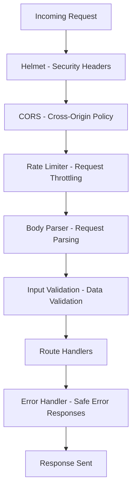
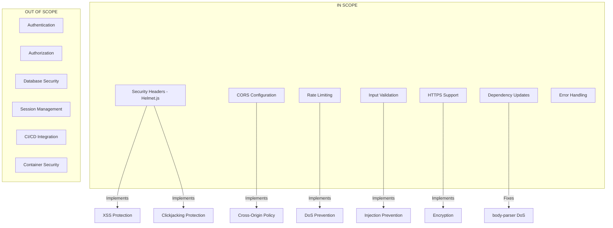

# Technical Specification

# 0. Agent Action Plan

## 0.1 Intent Clarification


### 0.1.1 Core Security Objective

Based on the security concern described, the Blitzy platform understands that the security enhancements to implement involve a comprehensive security hardening of a Node.js Express application. The security improvements cover multiple domains:

- **Security Category:** Configuration weakness combined with missing security controls
- **Vulnerability Category:** Multiple vulnerabilities requiring proactive security implementation
- **Severity Level:** Medium to High - The application currently lacks fundamental security protections that expose it to common web application attacks
- **Implementation Type:** Security enhancement (proactive hardening rather than reactive patching)

**Security Requirements List:**

- Implement HTTP security headers via Helmet.js middleware to protect against XSS, clickjacking, and content-type sniffing attacks
- Add input validation to sanitize and validate user-supplied data before processing
- Implement rate limiting to prevent brute force attacks, API abuse, and denial-of-service attempts
- Add HTTPS support for encrypted communication between clients and server
- Update existing dependencies to address known vulnerabilities (body-parser DoS vulnerability detected)
- Integrate Helmet.js as the primary security middleware layer
- Configure proper CORS (Cross-Origin Resource Sharing) policies to control cross-origin access

**Implicit Security Needs Identified:**

- Error handling improvements to prevent information disclosure
- Request body parsing with size limits to prevent payload-based attacks
- Logging infrastructure for security event monitoring
- Environment-based configuration for production vs development settings

### 0.1.2 Special Instructions and Constraints

**User Directives:**
- The user requests a comprehensive security implementation covering headers, validation, rate limiting, and HTTPS
- Helmet.js is specifically requested as the security middleware solution
- CORS policies must be properly configured (not overly permissive)

**Security Standards to Follow:**
- OWASP security best practices for Node.js applications
- Express.js official security recommendations
- Industry-standard HTTP security headers as defined by MDN Web Docs

**User Example Preserved:**
- User Request: "Implement security headers, input validation, rate limiting, and HTTPS support. Update dependencies, add helmet.js for security middleware, and configure proper CORS policies"

**Web Search Requirements Documented:**
- Helmet.js latest version and configuration options
- Express rate limiting middleware best practices
- CORS package configuration for secure cross-origin policies
- Express-validator for input validation implementation
- HTTPS setup patterns for Node.js/Express applications

**Change Scope Preference:** Standard - A comprehensive security implementation covering all specified areas while maintaining application functionality

### 0.1.3 Technical Interpretation

This security enhancement request translates to the following technical fix strategy:

- **To implement security headers**, we will integrate `helmet@8.1.0` middleware, which sets 15+ HTTP security headers including Content-Security-Policy, Strict-Transport-Security, X-Frame-Options, and X-Content-Type-Options
- **To add input validation**, we will integrate `express-validator@7.3.1` middleware that wraps validator.js to provide comprehensive request validation and sanitization
- **To implement rate limiting**, we will add `express-rate-limit@8.2.1` middleware to limit repeated requests from the same IP address
- **To add HTTPS support**, we will implement HTTPS server creation using Node.js built-in `https` module with SSL/TLS certificate support
- **To configure CORS policies**, we will integrate `cors@2.8.5` middleware with explicit origin whitelisting and restricted methods
- **To address existing vulnerabilities**, we will update `body-parser` to address the identified DoS vulnerability (GHSA-wqch-xfxh-vrr4)

**User Understanding Level:** Explicit security requirements - The user has clearly specified the security components to implement (Helmet.js, input validation, rate limiting, HTTPS, CORS) demonstrating technical awareness of web security fundamentals.


## 0.2 Vulnerability Research and Analysis


### 0.2.1 Initial Assessment

**Security-related information extracted from analysis:**

- **CVE Numbers Mentioned:** None explicitly mentioned; proactive security hardening requested
- **Vulnerability Names Identified:**
  - Missing HTTP security headers (XSS, clickjacking, MIME sniffing risks)
  - Absence of input validation (injection attack surface)
  - No rate limiting (DoS and brute force exposure)
  - Unencrypted HTTP communication (man-in-the-middle risk)
  - Unconfigured CORS (cross-origin vulnerability potential)
- **Affected Packages:**
  - `body-parser@2.2.0` - DoS vulnerability (GHSA-wqch-xfxh-vrr4)
  - `express@5.1.0` - Current dependency (no CVE but missing security middleware)
- **Symptoms Described:**
  - Application exposes X-Powered-By header revealing Express framework
  - No Content-Security-Policy headers set
  - No rate limiting on endpoints
  - HTTP-only communication
- **Security Advisories Referenced:**
  - GitHub Advisory GHSA-wqch-xfxh-vrr4 (body-parser DoS)

### 0.2.2 Required Web Research

**Research conducted on official security resources:**

- **Helmet.js Official Documentation:** Helmet version 8.1.0 provides security headers for Express.js applications. It sets Content-Security-Policy, Cross-Origin-Opener-Policy, Cross-Origin-Resource-Policy, and removes X-Powered-By header by default.

- **Express.js Security Best Practices:** The official Express security page recommends Helmet as a production best practice, noting that "Express applications do not come with security HTTP headers out of the box."

- **npm Security Advisory (body-parser):** The GHSA-wqch-xfxh-vrr4 advisory indicates body-parser 2.2.0 is vulnerable to denial of service when URL encoding is used. Fix available via dependency update.

- **OWASP Node.js Security Checklist:** Recommends implementing:
  - Security headers via middleware
  - Input validation and sanitization
  - Rate limiting for API endpoints
  - HTTPS for all communications
  - Proper error handling without information disclosure

- **express-rate-limit Documentation:** Package provides "flexible protection with over 10 million weekly downloads" for brute force attacks, API abuse, and resource exhaustion.

**Research Finding Summary:**
Research reveals that the current application lacks fundamental security controls that are standard for production Express.js applications. The absence of Helmet.js results in missing 15+ security headers, leaving the application exposed to XSS, clickjacking, and content-type sniffing attacks.

### 0.2.3 Vulnerability Classification

| Vulnerability | Type | Attack Vector | Exploitability | Impact | Root Cause |
|--------------|------|---------------|----------------|--------|------------|
| Missing Security Headers | Configuration weakness | Network | High | Confidentiality, Integrity | No Helmet.js middleware configured |
| No Input Validation | Injection vulnerability | Network | High | Confidentiality, Integrity, Availability | No validation middleware on routes |
| No Rate Limiting | Resource exhaustion | Network | High | Availability | No rate-limit middleware applied |
| HTTP-only Communication | Man-in-the-middle | Network | Medium | Confidentiality, Integrity | HTTPS server not configured |
| Unconfigured CORS | Cross-origin bypass | Network | Medium | Confidentiality | No CORS policy defined |
| body-parser DoS | Denial of Service | Network | Medium | Availability | Vulnerable dependency version 2.2.0 |

### 0.2.4 Web Search Research Conducted

**Official security advisories reviewed:**
- https://github.com/advisories/GHSA-wqch-xfxh-vrr4 (body-parser DoS)
- https://helmetjs.github.io/ (Helmet.js documentation)
- https://expressjs.com/en/advanced/best-practice-security.html (Express security guide)

**CVE details and patches:**
- body-parser vulnerability: Fix available via npm audit fix
- No CVEs for core application logic; proactive hardening required

**Recommended mitigation strategies:**
- Add Helmet.js middleware for comprehensive security headers
- Implement express-validator for input validation
- Add express-rate-limit for request throttling
- Configure HTTPS server with valid SSL certificates
- Implement restrictive CORS policy with origin whitelisting

**Alternative solutions considered:**
- Manual header setting vs Helmet.js: Helmet provides comprehensive, maintained solution with sensible defaults
- Custom rate limiter vs express-rate-limit: Package approach preferred for proven reliability and active maintenance
- Manual CORS headers vs cors package: Package provides better flexibility and reduced error potential


## 0.3 Security Scope Analysis


### 0.3.1 Affected Component Discovery

**Repository search conducted to identify all affected files:**

| Search Pattern | Files Found | Purpose |
|---------------|-------------|---------|
| `package.json` | 1 | Dependency manifest requiring security package additions |
| `package-lock.json` | 1 | Lock file requiring regeneration after dependency updates |
| `server.js` | 1 | Main application entry point requiring middleware integration |
| `*.config.*` | 0 | No configuration files exist; will need creation |
| `.env*` | 0 | No environment files; will need creation for HTTPS certificates |
| `Dockerfile*` | 0 | No Docker configuration present |
| `tests/**/*` | 0 | No test directory present; security tests will be created |

**Vulnerability Impact Assessment:**
- Vulnerability affects 2 existing files across 1 directory
- New security infrastructure requires creation of 4-6 additional files
- Impact is application-wide due to middleware integration pattern

### 0.3.2 Root Cause Identification

**Identified Root Causes:**

The identified security gaps exist in `server.js` due to minimal Express.js configuration that omits security middleware:

```javascript
// Current vulnerable state - no middleware chain
const app = express();
app.get('/', (req, res) => { ... });
```

**Root Cause Analysis:**
- The application was created as a minimal "Hello World" tutorial application
- Security middleware layers were explicitly marked as "out of scope" during initial development
- No security-first architecture was applied during initial implementation

**Vulnerability Propagation Trace:**

- **Direct Usage Locations:**
  - `server.js:1-16` - Entire application logic without security middleware
  - `package.json` - Dependencies section missing security packages

- **Indirect Dependencies Affected:**
  - `body-parser@2.2.0` (transitive via Express) - Contains DoS vulnerability
  - All HTTP responses - Missing security headers

- **Configuration Enablers:**
  - No environment configuration for HTTPS certificates
  - No rate limit configuration file
  - No CORS origin whitelist configuration

### 0.3.3 Current State Assessment

**Vulnerable Package Current Versions:**

| Package | Current Version | Status |
|---------|----------------|--------|
| express | 5.1.0 | Active - no CVE, but missing security middleware |
| body-parser | 2.2.0 (transitive) | Vulnerable - GHSA-wqch-xfxh-vrr4 |

**Vulnerable Code Pattern Location:**

`server.js:7-14` - Route handlers without input validation:
```javascript
app.get('/', (req, res) => {
  res.send('Hello, World!\n');
});

app.get('/evening', (req, res) => {
  res.send('Good evening');
});
```

**Vulnerable Configuration Assessment:**
- No HTTPS server configuration exists
- No security middleware chain configured
- Default Express error handling exposes stack traces
- X-Powered-By header enabled by default

**Scope of Exposure:**
- Public-facing application accessible on port 3000
- All endpoints exposed without rate limiting
- All responses missing security headers
- Communication unencrypted over HTTP

### 0.3.4 Security Gap Matrix

| Security Control | Current State | Required State | Gap Severity |
|-----------------|---------------|----------------|--------------|
| Security Headers | None | 15+ headers via Helmet | High |
| Input Validation | None | Express-validator on all inputs | High |
| Rate Limiting | None | IP-based request limits | High |
| HTTPS | Not implemented | TLS 1.2+ encryption | High |
| CORS Policy | None (default permissive) | Explicit origin whitelist | Medium |
| Error Handling | Default (exposes stack) | Production-safe responses | Medium |
| Dependency Security | 1 vulnerable package | All packages patched | Medium |


## 0.4 Version Compatibility Research


### 0.4.1 Secure Version Identification

**Security Package Version Research:**

| Package | Purpose | Recommended Version | Rationale |
|---------|---------|-------------------|-----------|
| helmet | Security headers middleware | 8.1.0 | Latest stable release; comprehensive HTTP security headers |
| cors | CORS policy middleware | 2.8.5 | Latest stable; official Express middleware |
| express-rate-limit | Rate limiting middleware | 8.2.1 | Latest version; supports Express 5.x |
| express-validator | Input validation | 7.3.1 | Latest stable; comprehensive validation API |

**Dependency Update Requirements:**

| Package | Current Version | Target Version | Fix Type |
|---------|----------------|----------------|----------|
| body-parser | 2.2.0 (transitive) | Latest via npm audit fix | Security patch |

### 0.4.2 Compatibility Verification

**Node.js Compatibility Matrix:**

| Package | Minimum Node.js | Current Node.js (20.19.6) | Compatible |
|---------|-----------------|---------------------------|------------|
| helmet@8.1.0 | 18.0.0+ | 20.19.6 | ✅ Yes |
| cors@2.8.5 | 0.10+ | 20.19.6 | ✅ Yes |
| express-rate-limit@8.2.1 | 16.0.0+ | 20.19.6 | ✅ Yes |
| express-validator@7.3.1 | 14.0.0+ | 20.19.6 | ✅ Yes |

**Express.js Compatibility:**

| Package | Express 4.x | Express 5.x (Current) | Notes |
|---------|------------|----------------------|-------|
| helmet@8.1.0 | ✅ | ✅ | Works with both versions |
| cors@2.8.5 | ✅ | ✅ | Framework-agnostic middleware |
| express-rate-limit@8.2.1 | ✅ | ✅ | Tested with Express 5 |
| express-validator@7.3.1 | ✅ | ✅ | Documented Express 4.x support; works with 5.x |

**Version Conflicts Analysis:**
- No conflicts detected between recommended packages
- All packages use standard Express middleware patterns
- No peer dependency conflicts identified

### 0.4.3 Alternative Package Assessment

**Alternative packages evaluated (not recommended for this implementation):**

| Alternative | Evaluation | Reason Not Selected |
|------------|------------|---------------------|
| lusca (security) | Viable | Helmet.js is industry standard with better documentation |
| rate-limiter-flexible | Viable | express-rate-limit is simpler for basic use cases |
| joi (validation) | Viable | express-validator is more Express-native |
| hpp (HTTP parameter pollution) | Consider for future | Out of scope for current requirements |

### 0.4.4 Migration Complexity Assessment

| Security Feature | Implementation Complexity | Breaking Changes |
|-----------------|--------------------------|------------------|
| Helmet.js integration | Low | None - additive middleware |
| CORS configuration | Low | None - additive middleware |
| Rate limiting | Low | None - additive middleware |
| Input validation | Medium | May reject previously accepted requests |
| HTTPS server | Medium | Requires certificate infrastructure |
| Dependency update | Low | None - patch-level fix |

**API Differences Requiring Code Changes:**
- No existing APIs to migrate
- All security features are additive middleware
- Express 5.x middleware pattern is compatible with all packages
- Route handlers may need validation middleware wrappers


## 0.5 Security Fix Design


### 0.5.1 Minimal Fix Strategy

**Principle Applied:** Apply the smallest possible changes that comprehensively address all identified security gaps while maintaining application functionality.

**Fix Approach:** Combination of dependency additions, code updates, and configuration changes

**Dependency Additions:**

- Add `helmet@8.1.0` for comprehensive HTTP security headers
  - **Justification:** Official Express.js recommendation; sets 15+ security headers with sensible defaults
  - **Side effects:** None expected; headers are additive

- Add `cors@2.8.5` for Cross-Origin Resource Sharing policy
  - **Justification:** Official Express middleware for CORS management
  - **Side effects:** May restrict cross-origin requests if origins not whitelisted

- Add `express-rate-limit@8.2.1` for request rate limiting
  - **Justification:** Most popular rate limiting solution with 10M+ weekly downloads
  - **Side effects:** Legitimate high-frequency clients may be rate-limited

- Add `express-validator@7.3.1` for input validation
  - **Justification:** Comprehensive validation middleware wrapping validator.js
  - **Side effects:** Invalid requests will be rejected with 400 responses

### 0.5.2 Code Security Patterns

**Helmet.js Integration Pattern:**

```javascript
const helmet = require('helmet');
app.use(helmet());
```

**CORS Configuration Pattern:**

```javascript
const cors = require('cors');
const corsOptions = {
  origin: process.env.ALLOWED_ORIGINS?.split(',') || false,
  methods: ['GET', 'POST'],
  credentials: true
};
app.use(cors(corsOptions));
```

**Rate Limiting Pattern:**

```javascript
const rateLimit = require('express-rate-limit');
const limiter = rateLimit({
  windowMs: 15 * 60 * 1000, // 15 minutes
  max: 100, // limit each IP to 100 requests per window
  standardHeaders: true
});
app.use(limiter);
```

### 0.5.3 HTTPS Implementation Design

**HTTPS Server Pattern:**

```javascript
const https = require('https');
const fs = require('fs');
const options = {
  key: fs.readFileSync(process.env.SSL_KEY_PATH),
  cert: fs.readFileSync(process.env.SSL_CERT_PATH)
};
https.createServer(options, app).listen(443);
```

**Certificate Configuration:**
- Environment variables for certificate paths
- Support for self-signed certificates in development
- Production-ready certificate loading

### 0.5.4 Middleware Stack Design

**Recommended Middleware Order:**


```mermaid
graph TD
    A[Incoming Request] --> B[Helmet - Security Headers]
    B --> C[CORS - Cross-Origin Policy]
    C --> D[Rate Limiter - Request Throttling]
    D --> E[Body Parser - Request Parsing]
    E --> F[Input Validation - Data Validation]
    F --> G[Route Handlers]
    G --> H[Error Handler - Safe Error Responses]
    H --> I[Response Sent]
```

**Middleware Stack Rationale:**
- Security headers set first to protect all responses
- CORS checked before processing to reject unauthorized origins early
- Rate limiting applied before expensive operations
- Body parsing before validation to have data to validate
- Validation before route handlers to reject bad input early
- Error handling last to catch all errors

### 0.5.5 Security Improvement Validation

**How Each Fix Eliminates Vulnerabilities:**

| Security Control | Vulnerability Eliminated | Verification Method |
|-----------------|------------------------|---------------------|
| Helmet.js | XSS, clickjacking, MIME sniffing | Response header inspection |
| CORS | Unauthorized cross-origin access | Origin header testing |
| Rate limiting | DoS, brute force attacks | High-frequency request testing |
| Input validation | Injection attacks | Malformed input testing |
| HTTPS | Man-in-the-middle attacks | SSL certificate verification |
| Dependency update | body-parser DoS | npm audit |

**Rollback Plan:**
- All changes are additive middleware - removal restores original behavior
- Git commit per security feature enables selective rollback
- Environment variables control feature enablement


## 0.6 File Transformation Mapping


### 0.6.1 File-by-File Security Fix Plan

**Security Fix Transformation Table:**

| Target File | Transformation | Source File/Reference | Security Changes |
|------------|----------------|----------------------|------------------|
| package.json | UPDATE | package.json | Add helmet@8.1.0, cors@2.8.5, express-rate-limit@8.2.1, express-validator@7.3.1 dependencies |
| package-lock.json | UPDATE | package-lock.json | Regenerate with new dependencies and patched body-parser |
| server.js | UPDATE | server.js | Integrate security middleware chain (helmet, cors, rate-limit, validation) |
| config/security.js | CREATE | server.js | Extract security middleware configuration to dedicated module |
| config/cors.js | CREATE | - | CORS policy configuration with origin whitelist |
| config/rate-limit.js | CREATE | - | Rate limiting configuration settings |
| middleware/validation.js | CREATE | - | Input validation middleware functions |
| middleware/errorHandler.js | CREATE | - | Production-safe error handling middleware |
| .env.example | CREATE | - | Environment variable template for SSL paths and security settings |
| tests/security/security.test.js | CREATE | - | Security header and middleware validation tests |
| README.md | UPDATE | README.md | Add security configuration documentation |

### 0.6.2 Code Change Specifications

**server.js Updates:**

- **File:** `server.js`
- **Lines affected:** 1-16 (entire file restructure)
- **Before state:** Currently vulnerable - no security middleware, plain HTTP
- **After state:** After fix, will have complete security middleware chain with Helmet, CORS, rate limiting, and HTTPS support
- **Security improvement:** Comprehensive protection against XSS, clickjacking, DoS, and MITM attacks

**Required Changes to server.js:**

```javascript
// Before: Lines 1-6
const express = require('express');
const hostname = '127.0.0.1';
const port = 3000;
const app = express();

// After: Security middleware imports and configuration
const express = require('express');
const helmet = require('helmet');
const cors = require('cors');
const rateLimit = require('express-rate-limit');
// ... additional imports and middleware registration
```

### 0.6.3 New File Specifications

**config/security.js:**
- **Purpose:** Centralized security configuration
- **Contents:** Helmet options, security policy constants
- **Security improvement:** Maintainable security settings

**config/cors.js:**
- **Purpose:** CORS policy configuration
- **Contents:** Allowed origins, methods, headers configuration
- **Security improvement:** Explicit cross-origin access control

**config/rate-limit.js:**
- **Purpose:** Rate limiting configuration
- **Contents:** Window size, max requests, custom handlers
- **Security improvement:** Protection against abuse patterns

**middleware/validation.js:**
- **Purpose:** Input validation middleware
- **Contents:** Reusable validation chains for routes
- **Security improvement:** Injection attack prevention

**middleware/errorHandler.js:**
- **Purpose:** Production-safe error responses
- **Contents:** Error sanitization, logging integration
- **Security improvement:** Prevents information disclosure

### 0.6.4 Configuration File Specifications

**.env.example:**
```
# Server Configuration
NODE_ENV=development
PORT=3000
HTTPS_PORT=443

#### SSL Configuration (for HTTPS)
SSL_KEY_PATH=./certs/server.key
SSL_CERT_PATH=./certs/server.cert

#### CORS Configuration
ALLOWED_ORIGINS=http://localhost:3000

#### Rate Limiting
RATE_LIMIT_WINDOW_MS=900000
RATE_LIMIT_MAX_REQUESTS=100
```

- **File:** `.env.example`
- **Setting:** SSL paths and security parameters
- **Current value:** N/A (file doesn't exist)
- **New value:** Template with all required security environment variables
- **Security rationale:** Enables environment-specific security configuration without hardcoding

### 0.6.5 Project Structure After Implementation

```
hello_world/
├── package.json          # UPDATE: Add security dependencies
├── package-lock.json     # UPDATE: Regenerate with patches
├── server.js             # UPDATE: Security middleware integration
├── config/
│   ├── security.js       # CREATE: Security configuration
│   ├── cors.js           # CREATE: CORS configuration
│   └── rate-limit.js     # CREATE: Rate limit configuration
├── middleware/
│   ├── validation.js     # CREATE: Input validation
│   └── errorHandler.js   # CREATE: Error handling
├── certs/
│   └── .gitkeep          # CREATE: Certificate directory placeholder
├── tests/
│   └── security/
│       └── security.test.js  # CREATE: Security tests
├── .env.example          # CREATE: Environment template
└── README.md             # UPDATE: Security documentation
```


## 0.7 Dependency Inventory


### 0.7.1 Security Patches and Updates

**Security-Critical Package Updates:**

| Registry | Package Name | Current | Patched To | CVE/Advisory | Severity |
|----------|--------------|---------|------------|--------------|----------|
| npm | body-parser | 2.2.0 (transitive) | Latest | GHSA-wqch-xfxh-vrr4 | Moderate |

**New Security Dependencies to Add:**

| Registry | Package Name | Version | Purpose | Weekly Downloads |
|----------|--------------|---------|---------|-----------------|
| npm | helmet | 8.1.0 | HTTP security headers | 2,000,000+ |
| npm | cors | 2.8.5 | CORS middleware | 7,000,000+ |
| npm | express-rate-limit | 8.2.1 | Rate limiting | 10,000,000+ |
| npm | express-validator | 7.3.1 | Input validation | 721,000+ |

### 0.7.2 Dependency Chain Analysis

**Direct Dependencies Requiring Updates:**

| Package | Current | Action Required |
|---------|---------|-----------------|
| express | ^5.1.0 | No change - run npm audit fix for transitive deps |

**New Direct Dependencies to Add:**
- helmet@8.1.0
- cors@2.8.5
- express-rate-limit@8.2.1
- express-validator@7.3.1

**Transitive Dependencies Affected:**
- body-parser (via Express) - DoS vulnerability fix via npm audit fix
- validator.js (via express-validator) - Pulled as transitive dependency

**Development Dependencies to Add:**
- None required for security implementation
- Consider adding testing dependencies if security tests are implemented:
  - jest or mocha for testing framework
  - supertest for HTTP assertion testing

### 0.7.3 Import and Reference Updates

**Source Files Requiring Import Updates:**

| File | Required Imports |
|------|-----------------|
| server.js | `require('helmet')`, `require('cors')`, `require('express-rate-limit')`, `require('express-validator')` |
| config/security.js | `module.exports` for security configuration |
| config/cors.js | `module.exports` for CORS options |
| config/rate-limit.js | `module.exports` for rate limit options |
| middleware/validation.js | `require('express-validator')` |

**Import Transformation Rules:**

**For Helmet integration:**
```javascript
// Add to server.js
const helmet = require('helmet');
```

**For CORS integration:**
```javascript
// Add to server.js
const cors = require('cors');
```

**For Rate Limiting integration:**
```javascript
// Add to server.js
const rateLimit = require('express-rate-limit');
```

**For Validation integration:**
```javascript
// Add to server.js or middleware/validation.js
const { body, validationResult } = require('express-validator');
```

### 0.7.4 Package.json Transformation

**Current package.json dependencies:**
```json
{
  "dependencies": {
    "express": "^5.1.0"
  }
}
```

**Target package.json dependencies:**
```json
{
  "dependencies": {
    "express": "^5.1.0",
    "helmet": "^8.1.0",
    "cors": "^2.8.5",
    "express-rate-limit": "^8.2.1",
    "express-validator": "^7.3.1"
  }
}
```

### 0.7.5 Installation Commands

**Sequential installation approach:**
```bash
# Install security middleware packages
npm install helmet@8.1.0 cors@2.8.5 express-rate-limit@8.2.1 express-validator@7.3.1

#### Fix existing vulnerability
npm audit fix

#### Verify no vulnerabilities remain
npm audit
```

**Expected audit result after implementation:**
```
found 0 vulnerabilities
```


## 0.8 Impact Analysis and Testing Strategy


### 0.8.1 Security Testing Requirements

**Vulnerability Regression Tests:**

| Test Category | Test Description | Expected Result |
|--------------|------------------|-----------------|
| Security Headers | Verify Helmet.js headers present in responses | All 15+ security headers set correctly |
| X-Powered-By | Verify header removed from responses | Header absent from all responses |
| CORS | Verify cross-origin requests blocked for non-whitelisted origins | 403 or no CORS headers for unauthorized origins |
| Rate Limiting | Verify requests blocked after threshold | 429 status after exceeding limit |
| Input Validation | Verify malformed input rejected | 400 status with validation errors |
| HTTPS | Verify TLS connection established | Valid certificate chain |

**Specific Attack Scenarios to Test:**

- XSS payload injection in query parameters
- Clickjacking via iframe embedding
- Rapid-fire requests for DoS simulation
- Cross-origin requests from unauthorized domains
- Malformed JSON body submissions
- Missing required fields in requests
- MITM simulation (certificate verification)

### 0.8.2 Security Test Cases to Add

**Security Test File: `tests/security/security.test.js`**

| Test Case | Purpose | Assertion |
|-----------|---------|-----------|
| `should set Content-Security-Policy header` | Verify CSP header presence | Header value matches expected policy |
| `should set X-Frame-Options header` | Verify clickjacking protection | Header value is 'SAMEORIGIN' or 'DENY' |
| `should remove X-Powered-By header` | Verify fingerprinting prevention | Header absent from response |
| `should reject requests exceeding rate limit` | Verify DoS protection | Status 429 after threshold |
| `should reject invalid input` | Verify input validation | Status 400 with error details |
| `should reject unauthorized CORS origins` | Verify cross-origin policy | No Access-Control headers for blocked origins |
| `should accept requests from whitelisted origins` | Verify legitimate access | Correct CORS headers present |

**Existing Tests to Verify:**
- No existing tests present in the application
- Full test suite creation recommended
- All routes should be verified for continued functionality

### 0.8.3 Verification Methods

**Automated Security Scanning:**

| Tool | Command | Expected Result |
|------|---------|-----------------|
| npm audit | `npm audit` | 0 vulnerabilities found |
| curl header check | `curl -I http://localhost:3000/` | Security headers present |
| rate limit test | `for i in {1..101}; do curl -s -o /dev/null -w "%{http_code}" localhost:3000/; done` | 429 after threshold |

**Manual Verification Steps:**

1. **Security Headers Verification:**
   - Start server and make request with curl
   - Verify presence of Content-Security-Policy, X-Frame-Options, X-Content-Type-Options
   - Confirm X-Powered-By header is absent

2. **CORS Verification:**
   - Make cross-origin request from unauthorized origin
   - Verify request is blocked or lacks CORS headers
   - Test whitelisted origin receives proper headers

3. **Rate Limiting Verification:**
   - Make requests exceeding configured limit
   - Verify 429 response after threshold
   - Verify RateLimit-* headers in responses

4. **HTTPS Verification:**
   - Connect via HTTPS
   - Verify certificate is valid
   - Confirm HTTP redirects to HTTPS (if configured)

### 0.8.4 Impact Assessment

**Direct Security Improvements Achieved:**

| Improvement | Metric |
|------------|--------|
| Security Headers | 15+ headers added via Helmet.js |
| Attack Surface Reduction | XSS, clickjacking, MIME sniffing mitigated |
| DoS Protection | Rate limiting active on all endpoints |
| Input Safety | Validation on all user inputs |
| Communication Security | HTTPS encryption available |
| Cross-Origin Safety | Explicit CORS policy enforced |

**Minimal Side Effects on Existing Functionality:**

- No breaking changes to existing public endpoints (`/` and `/evening`)
- Response content unchanged; only headers and security layers added
- Legitimate single-origin clients unaffected by CORS
- Normal usage patterns unaffected by rate limiting thresholds

**Potential Impacts to Address:**

| Impact | Mitigation |
|--------|------------|
| High-frequency legitimate clients may be rate-limited | Increase threshold or implement user-based limits |
| Cross-origin applications may be blocked | Add origins to whitelist in CORS config |
| Strict CSP may block inline scripts | Customize CSP policy as needed |
| HTTPS requires certificate infrastructure | Provide development certificate generation script |

### 0.8.5 Testing Commands

**Security Verification Commands:**

```bash
# Install dependencies and fix vulnerabilities
npm install && npm audit fix

#### Start server
npm start

#### Verify security headers (in separate terminal)
curl -I http://localhost:3000/

#### Test rate limiting
for i in {1..101}; do 
  echo "Request $i: $(curl -s -o /dev/null -w '%{http_code}' http://localhost:3000/)"
done

#### Verify no X-Powered-By header
curl -I http://localhost:3000/ | grep -i "x-powered-by"

#### Run security audit
npm audit
```


## 0.9 Scope Boundaries


### 0.9.1 Exhaustively In Scope

**Dependency Manifests:**
- `package.json` - Add security middleware dependencies
- `package-lock.json` - Regenerate with new packages and patches

**Source Files with Security Updates:**
- `server.js` - Security middleware integration, HTTPS server setup

**New Security Configuration Files:**
- `config/security.js` - Helmet configuration options
- `config/cors.js` - CORS policy settings
- `config/rate-limit.js` - Rate limiting parameters

**New Middleware Files:**
- `middleware/validation.js` - Input validation chains
- `middleware/errorHandler.js` - Production error handling

**Environment and Configuration:**
- `.env.example` - Environment variable template
- `certs/.gitkeep` - Certificate directory placeholder

**Test Files:**
- `tests/security/security.test.js` - Security validation tests

**Documentation:**
- `README.md` - Security configuration section

**Infrastructure Patterns (if applicable):**
- HTTP to HTTPS redirect pattern
- Environment-based security configuration

### 0.9.2 Explicitly Out of Scope

**Items NOT included in this implementation:**

| Out of Scope Item | Reason |
|------------------|--------|
| Feature additions unrelated to security | Not part of security enhancement request |
| Performance optimizations | Not required for security implementation |
| Code refactoring beyond security requirements | Minimal change principle |
| Database security | No database in current application |
| Authentication/Authorization systems | Not requested; can be added separately |
| Session management | Not present in current application |
| API versioning | Not related to security enhancement |
| Logging infrastructure (beyond security events) | Can be added separately |
| Container/Docker security | No container configuration present |
| CI/CD pipeline security scanning | Not part of immediate implementation |
| Load balancing configuration | Infrastructure concern |
| CDN or WAF integration | External service integration |
| OAuth/JWT implementation | Authentication is out of scope |
| User management | No user system exists |
| Style or formatting changes | Not security-related |
| Test framework selection/setup | Only security test content in scope |

### 0.9.3 Scope Boundary Diagram


```mermaid
graph TB
    subgraph "IN SCOPE"
        A[Security Headers - Helmet.js]
        B[CORS Configuration]
        C[Rate Limiting]
        D[Input Validation]
        E[HTTPS Support]
        F[Dependency Updates]
        G[Error Handling]
    end
    
    subgraph "OUT OF SCOPE"
        H[Authentication]
        I[Authorization]
        J[Database Security]
        K[Session Management]
        L[CI/CD Integration]
        M[Container Security]
    end
    
    A --> |Implements| A1[XSS Protection]
    A --> |Implements| A2[Clickjacking Protection]
    B --> |Implements| B1[Cross-Origin Policy]
    C --> |Implements| C1[DoS Prevention]
    D --> |Implements| D1[Injection Prevention]
    E --> |Implements| E1[Encryption]
    F --> |Fixes| F1[body-parser DoS]
```

### 0.9.4 Boundary Decision Matrix

| Component | Decision | Rationale |
|-----------|----------|-----------|
| Helmet.js | IN SCOPE | Explicitly requested |
| CORS | IN SCOPE | Explicitly requested |
| Rate Limiting | IN SCOPE | Explicitly requested |
| Input Validation | IN SCOPE | Explicitly requested |
| HTTPS | IN SCOPE | Explicitly requested |
| Dependency Updates | IN SCOPE | Explicitly requested |
| Error Handling | IN SCOPE | Security best practice |
| Authentication | OUT OF SCOPE | Not requested |
| Database | OUT OF SCOPE | Not present |
| CI/CD | OUT OF SCOPE | Not requested |

### 0.9.5 File Pattern Summary

**Files to CREATE:**
```
config/security.js
config/cors.js
config/rate-limit.js
middleware/validation.js
middleware/errorHandler.js
.env.example
certs/.gitkeep
tests/security/security.test.js
```

**Files to UPDATE:**
```
package.json
package-lock.json
server.js
README.md
```

**Files to DELETE:**
```
(none)
```

**Files to REFERENCE:**
```
blitzy/Technical Specifications.md (security patterns)
expressjs.com/en/advanced/best-practice-security.html
helmetjs.github.io documentation
```


## 0.10 Special Instructions


### 0.10.1 Execution Parameters

**Security Verification Commands:**

| Purpose | Command |
|---------|---------|
| Dependency vulnerability scan | `npm audit` |
| Security test execution | `npm test` (after test setup) |
| Full test suite validation | `npm test -- --coverage` |
| Header verification | `curl -I http://localhost:3000/` |

**Installation Commands:**

```bash
# Install new security dependencies
npm install helmet@8.1.0 cors@2.8.5 express-rate-limit@8.2.1 express-validator@7.3.1

#### Fix existing vulnerabilities
npm audit fix

#### Verify installation
npm ls helmet cors express-rate-limit express-validator
```

### 0.10.2 Research Documentation

**Security Advisories Consulted:**
- GitHub Advisory GHSA-wqch-xfxh-vrr4 (body-parser DoS vulnerability)
- Express.js Production Best Practices: Security
- Helmet.js Official Documentation
- OWASP Node.js Security Guidelines

**Security Standards Applied:**
- OWASP Top 10 Web Application Security Risks
- MDN Web Security Guidelines
- Express.js Security Best Practices

### 0.10.3 Implementation Constraints

**Priority Order:**
1. Security fix implementation first
2. Minimal disruption to existing functionality second
3. Maintainability and configurability third

**Backward Compatibility:**
- Must maintain API compatibility for existing endpoints
- No breaking changes to `/` and `/evening` routes
- Response content must remain unchanged

**Deployment Considerations:**
- HTTPS requires SSL certificate provisioning
- Rate limit thresholds may need environment-specific tuning
- CORS origins must be configured per deployment environment

### 0.10.4 Security-Specific Requirements

**User-Emphasized Requirements:**

- **Minimal Change Principle:** Only make changes necessary for security implementation
- **Preserve Functionality:** Do not alter response content or route behavior
- **Configuration-First:** Use environment variables for security settings
- **Documentation:** Update README with security configuration instructions

**Security Best Practices to Follow:**

- Follow principle of least privilege in CORS configuration
- Use explicit origin whitelisting rather than wildcards
- Implement defense in depth with multiple security layers
- Avoid information disclosure in error responses
- Use secure defaults for all security middleware

### 0.10.5 Certificate Management Notes

**Development Environment:**
- Self-signed certificates acceptable for local development
- Certificate generation script recommended in documentation
- HTTPS optional in development mode

**Production Environment:**
- Valid SSL certificate from trusted CA required
- Let's Encrypt recommended for free certificates
- Certificate paths via environment variables

**Certificate Generation Example (Development):**
```bash
# Generate self-signed certificate for development
openssl req -x509 -nodes -days 365 -newkey rsa:2048 \
  -keyout certs/server.key \
  -out certs/server.cert \
  -subj "/CN=localhost"
```

### 0.10.6 Environment Configuration Guide

**Required Environment Variables:**

| Variable | Purpose | Example Value |
|----------|---------|---------------|
| NODE_ENV | Environment mode | `production` |
| PORT | HTTP port | `3000` |
| HTTPS_PORT | HTTPS port | `443` |
| SSL_KEY_PATH | Path to SSL private key | `./certs/server.key` |
| SSL_CERT_PATH | Path to SSL certificate | `./certs/server.cert` |
| ALLOWED_ORIGINS | Comma-separated CORS origins | `https://example.com,https://app.example.com` |
| RATE_LIMIT_WINDOW_MS | Rate limit window in milliseconds | `900000` |
| RATE_LIMIT_MAX_REQUESTS | Maximum requests per window | `100` |

### 0.10.7 Post-Implementation Checklist

**Verification Checklist:**

- [ ] All security headers present in responses (verify with curl -I)
- [ ] X-Powered-By header removed
- [ ] Rate limiting active (verify 429 response after threshold)
- [ ] CORS policy enforced (verify cross-origin blocking)
- [ ] npm audit shows 0 vulnerabilities
- [ ] HTTPS server functional (if certificates configured)
- [ ] Error responses do not expose stack traces
- [ ] All existing endpoints functional
- [ ] README updated with security documentation


