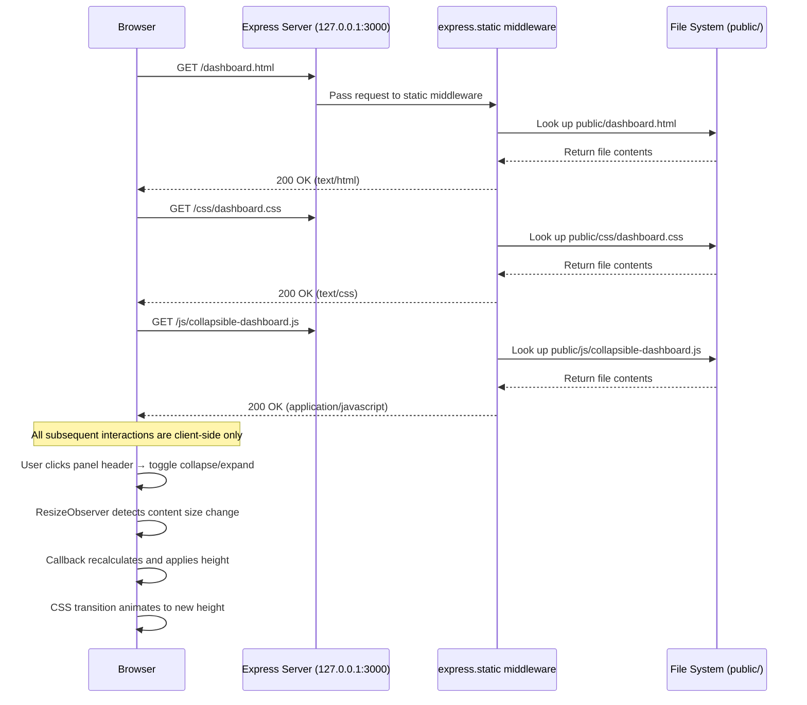

# Technical Specification

# 0. Agent Action Plan

## 0.1 Intent Clarification


### 0.1.1 Core Feature Objective

Based on the prompt, the Blitzy platform understands that the new feature requirement is to **add a collapsible dashboard UI powered by the ResizeObserver Web API** to the existing minimal Node.js/Express hello_world server. The ResizeObserver will automatically recalculate panel heights whenever dashboard content changes, implementing the modern pattern for collapsible dashboards.

**Interpreted Feature Requirements:**

- **ResizeObserver Integration**: Implement the native browser `ResizeObserver` API to monitor DOM element size changes in real time, enabling automatic height recalculation for collapsible dashboard panels without relying on viewport-level `window.onresize` events or manual polling
- **Collapsible Dashboard Panels**: Create a dashboard UI consisting of multiple collapsible/expandable panels (sections) that smoothly animate between expanded and collapsed states
- **Dynamic Height Recalculation**: When content inside a dashboard panel changes (e.g., data loads, elements are added or removed), the ResizeObserver callback automatically recalculates and applies the correct height, ensuring smooth transitions and no layout breakage
- **Client-Side Infrastructure**: Since the existing repository is a pure backend-only Express server with zero client-side code, an entirely new front-end infrastructure must be created from scratch, including HTML, CSS, and JavaScript assets served via Express static file middleware

**Implicit Requirements Detected:**

- **Static File Serving**: Express must be configured with `express.static('public')` middleware to serve the new dashboard HTML, CSS, and JavaScript assets — the current server has no static file serving capability
- **Dashboard Route**: A new route (e.g., `/dashboard`) must be added or the dashboard must be accessible through the static file server to deliver the collapsible dashboard page
- **Observer Lifecycle Management**: ResizeObserver instances must be properly created, attached, and disconnected to prevent memory leaks — this is a critical best practice for the ResizeObserver API
- **CSS Transition Coordination**: Height animations from `0` to a dynamically measured value require JavaScript-driven height assignment since CSS cannot natively transition to `height: auto`; the ResizeObserver provides the measured value that enables smooth CSS transitions
- **Backward Compatibility**: The existing GET `/` and GET `/evening` endpoints must remain untouched and fully functional — the new dashboard feature is purely additive

### 0.1.2 Special Instructions and Constraints

- **Modern Pattern Mandate**: The user explicitly specifies that ResizeObserver is the "modern pattern for collapsible dashboards," indicating a preference for native browser APIs over third-party libraries or legacy approaches such as `window.onresize` polling or `max-height` CSS hacks
- **Existing Endpoint Preservation**: The current `server.js` endpoints (`GET /` returning `"Hello, World!\n"` and `GET /evening` returning `"Good evening"`) must remain byte-identical per the technical specification's behavioral preservation requirements
- **README.md Freeze Policy**: Per the technical specification (`Technical Specifications.md`), the README.md file must not be modified — documentation for the new feature should reside in separate files
- **No Additional Framework Dependencies**: The repository follows a minimalist philosophy with Express.js as the single direct dependency; the ResizeObserver is a native browser API requiring no npm package installation on the server side
- **Localhost-Only Binding**: The server's 127.0.0.1:3000 binding must be preserved; the dashboard will be accessible at `http://127.0.0.1:3000/dashboard.html` or equivalent

### 0.1.3 Technical Interpretation

These feature requirements translate to the following technical implementation strategy:

- To **enable static asset delivery**, we will modify `server.js` to add `express.static('public')` middleware, allowing the Express server to serve HTML, CSS, and JavaScript files from a new `public/` directory
- To **implement the collapsible dashboard page**, we will create `public/dashboard.html` containing the dashboard layout with multiple collapsible panels, each with a header toggle button and a content area
- To **style the dashboard and animations**, we will create `public/css/dashboard.css` with dashboard layout styles, panel expand/collapse transitions, and responsive design considerations
- To **power the dynamic height recalculation**, we will create `public/js/collapsible-dashboard.js` containing the ResizeObserver-based logic that observes each panel's content, measures its `blockSize` (or `contentRect.height`), and applies that measurement as an explicit pixel height to the panel wrapper, enabling smooth CSS transitions between collapsed (height: 0) and expanded (height: measured) states
- To **demonstrate dynamic content changes**, the dashboard JavaScript will include functionality to add/remove content within panels, showcasing the ResizeObserver's ability to detect and respond to content-driven size changes in real time


## 0.2 Repository Scope Discovery


### 0.2.1 Comprehensive File Analysis

**Current Repository Structure (Exhaustive):**

| File / Folder | Type | Size / Details | Relevance to Feature |
|---|---|---|---|
| `server.js` | File | 19 lines — Express app entry point, two GET routes, `127.0.0.1:3000` binding | **MODIFY** — Add `express.static('public')` middleware |
| `package.json` | File | hello_world v1.0.0, single dependency `express: ^5.1.0`, MIT license | **MODIFY** — Add new npm scripts if needed |
| `package-lock.json` | File | Lockfile v3, pins Express 5.1.0 with transitive deps | No modification needed |
| `.gitignore` | File | Standard Node.js ignores (node_modules/, .env, logs/) | No modification needed |
| `README.md` | File | Brief description: "test project for backprop integration. Do not touch!" | **OUT OF SCOPE** — freeze policy |
| `blitzy/` | Folder | Documentation artifacts | No modification needed |
| `blitzy/documentation/` | Folder | Contains Project Guide.md and Technical Specifications.md | Reference only |

**Existing Files Requiring Modification:**

| File | Current State | Required Changes | Impact |
|---|---|---|---|
| `server.js` | 19-line Express app with two GET routes, no static file serving | Add `const path = require('path')` import, add `app.use(express.static(path.join(__dirname, 'public')))` middleware before route definitions, optionally add a `/dashboard` redirect route | Low risk — additive change, existing routes unaffected |
| `package.json` | Single `start` script: `"node server.js"`, no test script | Optionally add helper scripts for development | Minimal risk — scripts section only |

**Integration Point Discovery:**

- **API Endpoints connecting to the feature**: None currently — the dashboard is a standalone static page served by Express. The existing `GET /` and `GET /evening` routes do not interact with the dashboard
- **Database models/migrations**: Not applicable — the system is stateless with zero persistence
- **Service classes requiring updates**: Not applicable — the monolithic single-file architecture has no service layer
- **Middleware impacted**: The `express.static` middleware must be added as the first middleware in the chain so that static files are resolved before the existing route handlers

### 0.2.2 New File Requirements

**New Source Files to Create:**

| File Path | Purpose | Estimated Size |
|---|---|---|
| `public/dashboard.html` | Main dashboard page with collapsible panel markup, semantic HTML structure, toggle buttons, and content areas | ~80-120 lines |
| `public/css/dashboard.css` | Dashboard layout styles, collapsible panel transitions (height, opacity), responsive grid, panel header/content styling | ~100-150 lines |
| `public/js/collapsible-dashboard.js` | Core ResizeObserver logic — observer initialization, height measurement, collapse/expand toggle handlers, observer cleanup, dynamic content demonstration | ~100-150 lines |

**New Test Files to Create:**

| File Path | Purpose |
|---|---|
| `tests/dashboard.test.js` | Integration tests verifying dashboard static file serving, HTTP 200 responses for `/dashboard.html`, `/css/dashboard.css`, `/js/collapsible-dashboard.js` |
| `tests/resize-observer.test.html` | Browser-based test page validating ResizeObserver behavior with collapsible panels (manual or headless browser testing) |

**New Directory Structure:**

```
public/
├── dashboard.html
├── css/
│   └── dashboard.css
└── js/
    └── collapsible-dashboard.js
tests/
├── dashboard.test.js
└── resize-observer.test.html
```

### 0.2.3 Web Search Research Conducted

The following research was conducted to inform the implementation strategy:

- **ResizeObserver API best practices** — MDN documentation confirms the ResizeObserver interface reports changes to an Element's content or border box dimensions. The API is well-established and has been available across all major browsers since July 2020. Key properties include `contentBoxSize`, `borderBoxSize`, and `contentRect` (legacy). Proper observer disconnection is critical to prevent memory leaks
- **Collapsible panel height animation patterns** — CSS cannot natively transition between `height: 0` and `height: auto`. The modern pattern uses ResizeObserver to measure the content's actual height, then applies that measurement as an explicit pixel value, enabling smooth CSS transitions. This approach avoids the timing and easing problems of the legacy `max-height` hack
- **Browser compatibility** — ResizeObserver is fully supported in Chrome 64+, Firefox 69+, Safari 13.1+, and Edge 79+. No polyfill is required for modern browser targets. For legacy browser support, the `@juggle/resize-observer` polyfill is available as an optional fallback
- **Express static file serving** — Express provides the built-in `express.static()` middleware to serve static files from a specified directory. Standard pattern: `app.use(express.static('public'))`. Using `path.join(__dirname, 'public')` ensures correct resolution regardless of the working directory
- **Infinite loop prevention** — ResizeObserver has built-in protection against infinite resize loops; if an element's observed size changes again within the same loop, the observation is skipped and an error event is dispatched. Wrapping DOM mutations in `requestAnimationFrame()` is a recommended safety measure


## 0.3 Dependency Inventory


### 0.3.1 Private and Public Packages

**Current Dependency Manifest (`package.json`):**

| Registry | Package | Version | Purpose | Status |
|---|---|---|---|---|
| npm | `express` | `^5.1.0` (locked at `5.1.0`) | HTTP server framework, routing, middleware | Existing — no change |

**New Packages Required for Feature:**

| Registry | Package | Version | Purpose | Required? |
|---|---|---|---|---|
| Native Browser API | `ResizeObserver` | Built-in (Web API) | Monitors element dimension changes | No npm install needed — native browser API available since July 2020 |
| npm (optional) | `@juggle/resize-observer` | `^3.4.0` | Polyfill for ResizeObserver in legacy browsers (IE, old Edge 12-18) | Optional — only if legacy browser support is required |

**Key Insight**: The ResizeObserver is a **native Web API** implemented in all modern browsers. It requires zero server-side npm packages. The collapsible dashboard feature is implemented entirely with vanilla HTML, CSS, and JavaScript delivered as static files. The only server-side change is enabling Express's built-in `express.static()` middleware, which is already part of the Express package.

**Complete Transitive Dependency Summary:**

The current `package-lock.json` pins Express 5.1.0 with 69 transitive packages (including `accepts@2.0.0`, `body-parser@2.2.0`, `content-disposition@1.0.0`, etc.). The `express.static` middleware relies on the `serve-static` package, which is already included as a transitive dependency of Express — no additional installation is required.

### 0.3.2 Dependency Updates

**Import Updates:**

- `server.js` — Add one new import for the `path` built-in Node.js module:
  - New: `const path = require('path')`
  - This is a Node.js core module and requires no npm installation

**No External Reference Updates Required:**

- No changes to `.gitignore` — the `public/` directory should be committed to version control
- No changes to `package-lock.json` — no new npm packages are being added
- No changes to CI/CD configurations — none exist in the repository
- No `.env` changes required — no new environment variables are introduced

### 0.3.3 Client-Side Dependencies

All client-side code uses native browser APIs with zero external library dependencies:

| API / Feature | Browser Support | Fallback Strategy |
|---|---|---|
| `ResizeObserver` | Chrome 64+, Firefox 69+, Safari 13.1+, Edge 79+ | Optional: `@juggle/resize-observer` polyfill loaded conditionally |
| `CSS Transitions` | All modern browsers | Graceful degradation — panels snap open/closed without animation |
| `requestAnimationFrame` | All modern browsers | N/A — universally supported |
| `classList` API | All modern browsers | N/A — universally supported |
| `data-*` attributes | All modern browsers (HTML5) | N/A — universally supported |


## 0.4 Integration Analysis


### 0.4.1 Existing Code Touchpoints

**Direct Modifications Required:**

| File | Location | Change Description | Risk Level |
|---|---|---|---|
| `server.js` | Line 1 (imports) | Add `const path = require('path')` after existing `const express = require('express')` import | Minimal — additive import of Node.js core module |
| `server.js` | After `const app = express()` (line 3) | Add `app.use(express.static(path.join(__dirname, 'public')))` middleware registration | Low — middleware inserted before existing route handlers; Express processes middleware in registration order |
| `server.js` | After existing routes (after line 14) | Optionally add `GET /dashboard` route that serves `public/dashboard.html` via `res.sendFile()` for a clean URL | Low — purely additive route, no interference with existing routes |

**Detailed `server.js` Integration Points:**

The current `server.js` structure (19 lines) is:
```javascript
const express = require('express')
// ... hostname, port, app setup
// ... GET '/' and GET '/evening' route handlers
// ... app.listen()
```

The static middleware must be inserted **before** the existing route handlers so that requests for static assets (`.html`, `.css`, `.js`) are intercepted and served from the `public/` directory before falling through to the API routes.

**Dependency Injections:**

- Not applicable — the single-file Express application has no dependency injection container, service registry, or inversion-of-control framework. All additions are direct code insertions into `server.js`

**Database / Schema Updates:**

- Not applicable — the system is fully stateless with zero data persistence. The collapsible dashboard does not require any server-side data storage; all dashboard state (expand/collapse) is maintained entirely in the browser's JavaScript runtime

### 0.4.2 Client-Server Communication Flow

The collapsible dashboard operates as a purely static client-side application with no server-side API communication beyond the initial asset delivery:


```mermaid
sequenceDiagram
    participant Browser
    participant Express as Express Server (127.0.0.1:3000)
    participant Static as express.static middleware
    participant FS as File System (public/)

    Browser->>Express: GET /dashboard.html
    Express->>Static: Pass request to static middleware
    Static->>FS: Look up public/dashboard.html
    FS-->>Static: Return file contents
    Static-->>Browser: 200 OK (text/html)

    Browser->>Express: GET /css/dashboard.css
    Static->>FS: Look up public/css/dashboard.css
    FS-->>Static: Return file contents
    Static-->>Browser: 200 OK (text/css)

    Browser->>Express: GET /js/collapsible-dashboard.js
    Static->>FS: Look up public/js/collapsible-dashboard.js
    FS-->>Static: Return file contents
    Static-->>Browser: 200 OK (application/javascript)

    Note over Browser: All subsequent interactions are client-side only
    Browser->>Browser: User clicks panel header → toggle collapse/expand
    Browser->>Browser: ResizeObserver detects content size change
    Browser->>Browser: Callback recalculates and applies height
    Browser->>Browser: CSS transition animates to new height
```

### 0.4.3 Impact on Existing Endpoints

| Endpoint | Current Behavior | Post-Integration Behavior | Impact |
|---|---|---|---|
| `GET /` | Returns `"Hello, World!\n"` (text/plain) | **Unchanged** — route handler registered after static middleware, but no `public/index.html` conflicts with this route | Zero impact |
| `GET /evening` | Returns `"Good evening"` (text/plain) | **Unchanged** — no static file conflicts with this path | Zero impact |
| `GET /dashboard.html` | 404 (Cannot GET) | Returns `public/dashboard.html` via `express.static` | New functionality |
| `GET /css/dashboard.css` | 404 (Cannot GET) | Returns `public/css/dashboard.css` via `express.static` | New functionality |
| `GET /js/collapsible-dashboard.js` | 404 (Cannot GET) | Returns `public/js/collapsible-dashboard.js` via `express.static` | New functionality |

**Critical Consideration**: The `express.static` middleware must **not** include a `public/index.html` file, as that would intercept the `GET /` route and break the existing `"Hello, World!\n"` response. The dashboard is deliberately served at `/dashboard.html` (not `/`) to avoid any conflict with the root endpoint.


## 0.5 Technical Implementation


### 0.5.1 File-by-File Execution Plan

**Group 1 — Server-Side Integration (Express Static Middleware):**

| Action | File | Description |
|---|---|---|
| MODIFY | `server.js` | Add `const path = require('path')` import at line 1. Insert `app.use(express.static(path.join(__dirname, 'public')))` after `const app = express()` and before existing route handlers. Optionally add `GET /dashboard` route using `res.sendFile()` for clean URL access |

**Group 2 — Core Dashboard Feature Files (New):**

| Action | File | Description |
|---|---|---|
| CREATE | `public/dashboard.html` | Dashboard page with semantic HTML structure: a header bar with title, a container holding multiple collapsible panels (3-4 demo panels), each panel consisting of a clickable header (`<button>` for accessibility) and a content wrapper `<div>` with `overflow: hidden` and transition-ready styling. Links to `css/dashboard.css` and `js/collapsible-dashboard.js` |
| CREATE | `public/css/dashboard.css` | Styles for dashboard layout (centered container, responsive widths), panel appearance (border, border-radius, shadow), panel header (cursor: pointer, flex layout with chevron icon), panel content wrapper (overflow: hidden, transition: height 300ms ease), collapsed state (height: 0), and utility classes for the dynamic content demo |
| CREATE | `public/js/collapsible-dashboard.js` | Core JavaScript module implementing: (1) `initCollapsiblePanels()` — queries all panel elements, attaches click handlers to headers, creates and attaches a `ResizeObserver` to each panel's inner content element; (2) ResizeObserver callback — reads `entry.contentBoxSize[0].blockSize` (or fallback `entry.contentRect.height`), applies measured height as an explicit pixel value to the panel wrapper; (3) `togglePanel(panel)` — toggles collapsed/expanded state, sets wrapper height to 0 or to the measured content height; (4) observer cleanup on page unload; (5) optional dynamic content demo buttons that add/remove content to demonstrate live height recalculation |

**Group 3 — Test Files (New):**

| Action | File | Description |
|---|---|---|
| CREATE | `tests/dashboard.test.js` | Node.js test file (using Node's built-in `assert` or optional test runner) that starts the Express server, issues HTTP requests to `/dashboard.html`, `/css/dashboard.css`, and `/js/collapsible-dashboard.js`, and verifies 200 status codes and correct content types |
| CREATE | `tests/resize-observer.test.html` | Browser-based test page that programmatically creates collapsible panels, triggers content changes, and asserts that the ResizeObserver callback fires and height values update correctly |

### 0.5.2 Implementation Approach per File

**Step 1 — Establish Server-Side Static File Serving:**

Modify `server.js` to enable the Express static file middleware. The `path` module ensures reliable path resolution regardless of the process's working directory. The middleware is placed before route handlers so that static file requests are resolved first:

```javascript
const path = require('path')
app.use(express.static(path.join(__dirname, 'public')))
```

**Step 2 — Create Dashboard HTML Structure:**

Build `public/dashboard.html` with a clean, accessible markup pattern. Each collapsible panel follows this structure:

```html
<div class="panel" data-collapsed="true">
  <button class="panel-header" aria-expanded="false">Panel Title</button>
  <div class="panel-content-wrapper" style="height: 0">
    <div class="panel-content"><!-- Dynamic content here --></div>
  </div>
</div>
```

**Step 3 — Implement ResizeObserver-Powered Collapsible Logic:**

The core `collapsible-dashboard.js` file implements the modern collapsible pattern:

```javascript
const ro = new ResizeObserver(entries => {
  for (const entry of entries) {
    const height = entry.contentBoxSize?.[0]?.blockSize ?? entry.contentRect.height;
    entry.target.parentElement.style.height = `${height}px`;
  }
});
```

The ResizeObserver monitors the inner `.panel-content` element. When its dimensions change (due to content being added, removed, or reflowed), the callback reads the new block size and applies it as an explicit pixel height to the `.panel-content-wrapper`, which has `transition: height 300ms ease` — resulting in a smooth animated resize.

**Step 4 — Style Collapsible Panels with CSS Transitions:**

The CSS coordinates with the JavaScript-driven height values:

```css
.panel-content-wrapper {
  overflow: hidden;
  transition: height 300ms ease;
}
```

When collapsed, the wrapper's `height` is set to `0px`. When expanded, it is set to the measured pixel height from ResizeObserver. The CSS `transition` property handles the smooth animation between these explicit values.

**Step 5 — Validate with Tests:**

Server integration tests verify static file serving returns correct HTTP status and content types. Browser-based tests confirm the ResizeObserver fires on content changes and the panel height updates accordingly.

### 0.5.3 User Interface Design

Since the existing repository has **zero frontend infrastructure** (confirmed by tech spec Section 7.1: "No user interface required"), this feature builds the entire client-side layer from scratch. The dashboard UI design follows these principles:

- **Layout**: A centered, responsive container with vertically stacked collapsible panels. Each panel has a clickable header and an animated content area
- **Interaction Model**: Clicking a panel header toggles the panel between collapsed (height: 0, content hidden) and expanded (height: auto-measured, content visible) states. Multiple panels can be independently expanded
- **Visual Feedback**: A chevron icon (CSS-only, using `::after` pseudo-element with `transform: rotate()`) rotates to indicate the panel's current state. Background color transitions on hover provide affordance
- **Accessibility**: Panel headers use `<button>` elements with `aria-expanded` attributes. Content wrappers use `aria-hidden` when collapsed. Keyboard navigation (Enter/Space to toggle) is supported natively via the button element
- **Dynamic Content Demonstration**: Each panel includes an "Add Content" button that injects new paragraph elements, demonstrating the ResizeObserver's automatic height recalculation without any manual intervention
- **Responsive Behavior**: The dashboard container uses `max-width` with percentage-based responsive widths, ensuring correct rendering from mobile to desktop viewports


## 0.6 Scope Boundaries


### 0.6.1 Exhaustively In Scope

**Server-Side Modifications:**

| Pattern / File | Purpose |
|---|---|
| `server.js` | Add `path` import, `express.static()` middleware, optional `/dashboard` redirect route |
| `package.json` | Minor updates to scripts section if needed |

**New Feature Source Files:**

| Pattern / File | Purpose |
|---|---|
| `public/dashboard.html` | Dashboard HTML page with collapsible panel markup |
| `public/css/dashboard.css` | Dashboard layout, panel styles, transition animations |
| `public/js/collapsible-dashboard.js` | ResizeObserver logic, panel toggle handlers, observer lifecycle |
| `public/css/**/*.css` | All dashboard-related stylesheets |
| `public/js/**/*.js` | All dashboard-related client-side scripts |

**Test Files:**

| Pattern / File | Purpose |
|---|---|
| `tests/dashboard.test.js` | Server-side integration tests for static file serving |
| `tests/resize-observer.test.html` | Browser-based validation of ResizeObserver behavior |
| `tests/**/*dashboard*` | All dashboard-related test files |

**Configuration and Infrastructure:**

| Pattern / File | Purpose |
|---|---|
| `public/` | New static assets directory (must be committed to version control) |
| `public/css/` | CSS subdirectory within public assets |
| `public/js/` | JavaScript subdirectory within public assets |

### 0.6.2 Explicitly Out of Scope

| Item | Reason |
|---|---|
| `README.md` modifications | Freeze policy per technical specification — must not be modified |
| `blitzy/` directory and its contents | Documentation artifacts — reference only, no modifications |
| `package-lock.json` manual edits | Auto-generated by npm — no manual intervention |
| Python/Flask migration work | Unrelated to this feature — the tech spec documents a future migration that is separate from this additive feature |
| Server-side dashboard data APIs | The dashboard is a static client-side demonstration; no backend data endpoints are being created |
| Third-party UI framework integration | No React, Vue, Angular, or other framework is being added; implementation uses vanilla HTML/CSS/JS |
| WebSocket or real-time data push | The dashboard does not require live server-to-client communication; content changes are client-side driven |
| Authentication or authorization | The dashboard is a publicly accessible static page consistent with the server's existing open-access model |
| Database or persistence layer | The system remains fully stateless per its architectural design |
| Performance optimization of existing routes | The GET `/` and GET `/evening` routes are not being modified or optimized |
| Node.js to Python migration | Documented in the tech spec but unrelated to the ResizeObserver dashboard feature |
| Automated CI/CD pipeline | No CI/CD configuration exists in the repository; adding one is outside this feature's scope |
| Legacy browser polyfill bundling | Optional polyfill for ResizeObserver (`@juggle/resize-observer`) may be documented but is not a core requirement |
| `public/index.html` | Must NOT be created — would conflict with the existing `GET /` route returning `"Hello, World!\n"` |


## 0.7 Rules for Feature Addition


### 0.7.1 Feature-Specific Rules and Requirements

**ResizeObserver API Usage Rules:**

- **Use native `ResizeObserver` exclusively** — do not use `window.onresize`, `MutationObserver` for size tracking, or polling-based approaches. The user explicitly mandates ResizeObserver as the modern pattern
- **Observe `contentBoxSize`** as the primary measurement property, with `contentRect.height` as a fallback for older browser implementations that do not support `contentBoxSize`
- **Wrap DOM mutations** triggered inside the ResizeObserver callback within `requestAnimationFrame()` to prevent infinite resize loops, as recommended by the MDN specification documentation
- **Disconnect observers** on page unload or when panels are permanently removed to prevent memory leaks — implement a cleanup function bound to the `beforeunload` event or equivalent lifecycle hook

**Existing Endpoint Preservation Rules:**

- The `GET /` endpoint must continue to return exactly `"Hello, World!\n"` (including the trailing newline character) — this is a byte-perfect requirement documented in the tech spec Feature Catalog (F-002)
- The `GET /evening` endpoint must continue to return exactly `"Good evening"` (without a trailing newline) — documented in F-003
- The server must continue to bind to `127.0.0.1:3000` — no changes to hostname or port binding
- The `express.static` middleware must be registered in a way that does not intercept or shadow these existing routes (i.e., no `public/index.html` that would override `GET /`)

**Minimalist Architecture Compliance:**

- No new npm dependencies on the server side — the feature relies entirely on Express's built-in `express.static` and the native browser `ResizeObserver` API
- The client-side implementation must use vanilla JavaScript (ES6+), HTML5, and CSS3 only — no build tools (Webpack, Vite, Babel), no preprocessors (SASS, LESS, TypeScript), and no framework libraries
- The total new file count must remain minimal (3 client-side files + 2 test files) to preserve the repository's minimalist philosophy documented in the technical specification

**Accessibility Requirements:**

- Panel headers must be `<button>` elements (not `<div>` or `<span>`) to ensure native keyboard interactivity and screen reader compatibility
- `aria-expanded="true|false"` attributes must be toggled on panel headers in sync with the panel's visual state
- `aria-hidden="true"` should be applied to collapsed panel content wrappers to prevent screen readers from announcing hidden content
- Panel content should support the `prefers-reduced-motion` media query — when enabled, transitions should be instantaneous (duration: 0ms) while still applying correct heights

### 0.7.2 User-Specified Implementation Rules

The following implementation rules were explicitly specified by the user for this project:

| Rule Name | Content |
|---|---|
| Test 27-02 | (No specific content provided) |
| test rule 09-03 | 1. rsr |

These rules are documented as-is. Since no substantive constraints were provided in the rule content, the standard feature implementation rules outlined in Section 0.7.1 govern the implementation approach.


## 0.8 References


### 0.8.1 Repository Files and Folders Searched

The following files and folders were exhaustively inspected during the analysis:

**Root-Level Files Retrieved and Analyzed:**

| File Path | Method | Key Findings |
|---|---|---|
| `server.js` | `read_file` | 19-line Express app; `const express = require('express')`, hostname `127.0.0.1`, port `3000`, two routes: `GET /` → `"Hello, World!\n"`, `GET /evening` → `"Good evening"`, `app.listen()` binding |
| `package.json` | `read_file` | Name: `hello_world`, version: `1.0.0`, main: `server.js`, scripts: `start` → `node server.js`, dependency: `express: ^5.1.0`, author: `hxu`, license: MIT |
| `package-lock.json` | `bash` (head -30) | Lockfile version 3, pins Express 5.1.0, transitive deps include `accepts@2.0.0`, `body-parser@2.2.0`, `serve-static` (already included) |
| `.gitignore` | `read_file` | Standard Node.js ignores: `node_modules/`, `.env`, `logs/`, OS files, IDE folders |
| `README.md` | `read_file` | Content: "# hao-backprop-test" — test project for backprop integration with freeze policy |

**Folders Explored:**

| Folder Path | Method | Contents |
|---|---|---|
| (root) | `get_source_folder_contents` | 5 files + 1 folder: `.gitignore`, `README.md`, `package-lock.json`, `package.json`, `server.js`, `blitzy/` |
| `blitzy/` | `get_source_folder_contents` | 1 subfolder: `documentation/` |
| `blitzy/documentation/` | `get_source_folder_contents` | 2 files: `Project Guide.md`, `Technical Specifications.md` |

### 0.8.2 Technical Specification Sections Retrieved

| Section Heading | Key Information Extracted |
|---|---|
| 1.1 EXECUTIVE SUMMARY | Migration context (Node.js Express → Python Flask), hello_world server purpose, stakeholder identification |
| 1.2 SYSTEM OVERVIEW | Standalone localhost-only service, passive test fixture, stateless, <100ms response time SLA |
| 2.2 Feature Catalog | Six features (F-001 through F-006): HTTP Server Foundation, Root Endpoint, Evening Endpoint, 404 Handling, Server Lifecycle, Dependency Management |
| 3.1 Current Technology Stack | JavaScript ES6+/CommonJS, Node.js v20 LTS, Express 5.1.0, 69 total packages, MIT license |
| 5.1 HIGH-LEVEL ARCHITECTURE | Single-file monolithic architecture, five principles (statelessness, predictability, network isolation, minimalism, synchronous execution) |
| 5.2 COMPONENT DETAILS | Application entry point, Express framework layer, route handler specs (byte-perfect responses), HTTP protocol server component |
| 6.1 Core Services Architecture | Not applicable — monolithic single-process, no service boundaries, no distributed patterns |
| 7.1 UI REQUIREMENTS ANALYSIS | **No user interface required** — backend-only HTTP API server, no frontend frameworks, no templates, no static assets |

### 0.8.3 External Research Sources

| Topic | Source | Key Takeaway |
|---|---|---|
| ResizeObserver API Reference | MDN Web Docs (`developer.mozilla.org/en-US/docs/Web/API/ResizeObserver`) | Well-established API since July 2020; reports changes to content box, border box, or SVG bounding box |
| ResizeObserver Browser Compatibility | Can I Use / TestMu AI / LambdaTest | Fully supported: Chrome 64+, Firefox 69+, Safari 13.1+, Edge 79+; not supported: IE any version, Edge 12-18 |
| ResizeObserver Polyfill | GitHub `@juggle/resize-observer` | Optional polyfill with conditional loading pattern for legacy browser support |
| Collapsible Height Animation Patterns | LogRocket Blog, Medium (Uri Seroussi), CSS-Tricks | Modern pattern: ResizeObserver measures actual content height, applies as explicit pixel value, CSS transitions handle animation |
| Express Static File Serving | Express.js official docs (`expressjs.com/en/starter/static-files.html`) | Built-in `express.static()` middleware; standard pattern: `app.use(express.static('public'))` |
| ResizeObserver Entry Properties | MDN Web Docs (`developer.mozilla.org/en-US/docs/Web/API/ResizeObserverEntry`) | Primary: `contentBoxSize[0].blockSize`; Legacy fallback: `contentRect.height`; Target: `entry.target` |
| Infinite Loop Prevention | MDN ResizeObserver docs | Built-in loop protection; use `requestAnimationFrame()` for DOM mutations inside callbacks |

### 0.8.4 Attachments and User-Provided Metadata

- **Figma Screens**: None provided
- **File Attachments**: None provided
- **Environment Files**: No files found in `/tmp/environments_files/`
- **Environment Variables**: None specified
- **Secrets**: None specified
- **User-Specified Rules**: Two rules provided ("Test 27-02" with no content, "test rule 09-03" with content "1. rsr")


