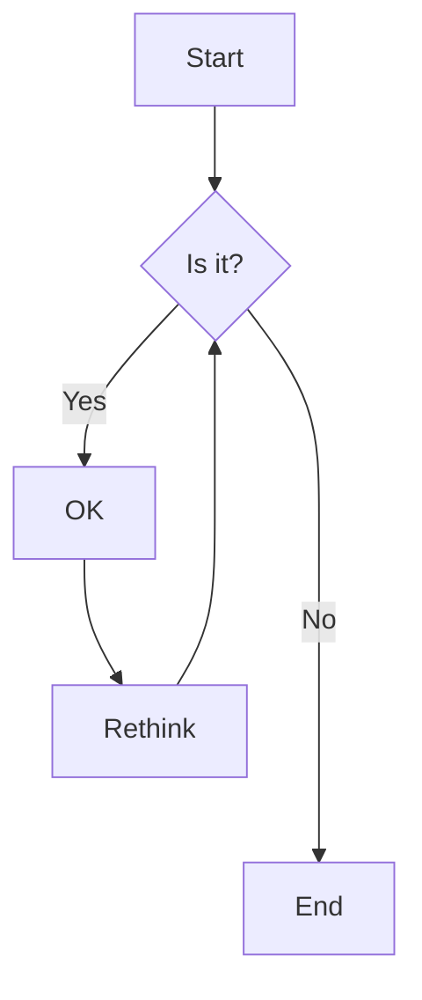
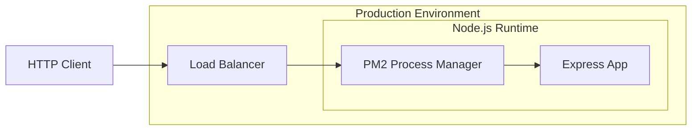

# Technical Specification

# 0. Agent Action Plan

## 0.1 Core Documentation Objective

Based on the provided requirements, the Blitzy platform understands that the documentation objective is to **enhance and complete the documentation coverage** for the hello_world Express.js tutorial service through JSDoc inline comments and README improvements.

### 0.1.1 Documentation Request Category

| Category | Classification | Rationale |
|----------|---------------|-----------|
| **Primary Classification** | Update existing documentation | JSDoc comments already exist but require enhancement; README.md exists but needs deployment guide |
| **Secondary Classification** | Improve documentation coverage | Enhanced inline code explanations needed across all JavaScript modules |

### 0.1.2 Documentation Type Identification

| Documentation Type | Applicability | Current Status |
|-------------------|---------------|----------------|
| API Documentation | ✅ Applicable | Exists in README.md - requires validation |
| README/User Guide | ✅ Applicable | Comprehensive but needs deployment section enhancement |
| Inline Code Comments (JSDoc) | ✅ Applicable | Present but may require additional function-level detail |
| Technical Specifications | ⚪ Out of Scope | Already comprehensive in `blitzy/documentation/` |
| Architecture Documentation | ⚪ Out of Scope | Already documented in README.md and tech specs |

### 0.1.3 Requirement Decomposition

Based on the user's request: *"Add JSDoc comments to server.js functions, create a comprehensive README with setup instructions, API documentation, deployment guide, and inline code explanations"*

| Requirement | Technical Interpretation | Implementation Approach |
|-------------|------------------------|------------------------|
| **Add JSDoc comments to server.js functions** | Enhance existing JSDoc documentation with function-level detail | Review and augment JSDoc blocks for all functions and modules in `server.js` |
| **Setup instructions** | Installation and environment configuration documentation | Validate existing README.md sections; enhance if gaps identified |
| **API documentation** | HTTP endpoint specifications with request/response examples | Validate existing API Reference section in README.md |
| **Deployment guide** | Production deployment procedures and configuration | **CREATE NEW**: Add comprehensive deployment section to README.md |
| **Inline code explanations** | JSDoc comments throughout the codebase | Enhance JSDoc comments in all `src/**/*.js` files |

### 0.1.4 Implicit Documentation Needs Identified

Based on repository analysis, the following implicit documentation needs have been surfaced:

| Implicit Need | Source | Recommendation |
|---------------|--------|----------------|
| Complete JSDoc coverage for all exports | Code analysis of 5 JavaScript files | Ensure all `module.exports` have `@module` and `@exports` tags |
| Type annotations for configuration | `src/config/index.js` analysis | Enhance `@type` annotations with TypeScript-compatible JSDoc |
| Express.js 5.x specific documentation | Framework version analysis | Document Express 5.x-specific features being utilized |
| Environment variable reference | Configuration module review | Ensure README.md environment variables match config defaults |
| Error handling documentation | Route handler analysis | Document implicit Express 5 error handling behavior |

### 0.1.5 User-Provided Diagram Preservation

**User Example - Mermaid Diagram:**

```mermaid
graph TD
    A[Start] --> B{Is it?}
    B -->|Yes| C[OK]
    C --> D[Rethink]
    D --> B
    B ---->|No| E[End]
```
*Note: User-provided diagram preserved as-is for documentation reference.*

## 0.2 Special Instructions and Constraints

### 0.2.1 User-Specified Directives

The following directives have been extracted from user instructions:

| Directive | Interpretation | Implementation Impact |
|-----------|---------------|----------------------|
| Add JSDoc comments to server.js | Focus on enhancing existing documentation | Review existing JSDoc, add missing function documentation |
| Comprehensive README | Complete coverage of standard README sections | Ensure all conventional sections are present and detailed |
| Setup instructions | Developer onboarding documentation | Validate prerequisites, installation, and configuration docs |
| API documentation | HTTP endpoint specifications | Document request/response contracts with examples |
| Deployment guide | Production deployment procedures | **New section required** in README.md |
| Inline code explanations | Contextual code documentation | Enhance JSDoc comments throughout all source files |

### 0.2.2 Template and Style Requirements

**Documentation Style Analysis:**

Based on repository analysis of existing documentation:

| Style Element | Current Implementation | Preservation Requirement |
|---------------|----------------------|-------------------------|
| **Markdown Format** | GitHub Flavored Markdown (GFM) | ✅ Maintain consistency |
| **Heading Hierarchy** | H1 for title, H2 for sections, H3 for subsections | ✅ Follow existing pattern |
| **Code Blocks** | Triple backticks with language specifier | ✅ Use `bash`, `javascript` language tags |
| **Tables** | Pipe-delimited with header rows | ✅ Use for structured data |
| **JSDoc Style** | Block comments with standard tags (`@module`, `@type`, `@route`) | ✅ Extend existing patterns |

**JSDoc Convention Observed:**

```javascript
/**
 * Module description
 * @module module-name
 * @requires dependency
 */
```

### 0.2.3 Build and Setup Configuration

**Setup Instructions Provided by User:** `npm run build`

**Setup Issue Documented:**
| Issue | Status | Resolution |
|-------|--------|------------|
| `npm run build` script does not exist | ⚠️ Configuration Issue | package.json only contains `start` and `test` scripts |
| Available scripts | ✅ Verified | `npm start` (node server.js), `npm test` (placeholder) |

**Environment Configuration Verified:**

| Component | Required | Installed | Status |
|-----------|----------|-----------|--------|
| Node.js | ≥18.x (recommended 20.x LTS) | v20.19.6 | ✅ Compatible |
| npm | ≥8.x | 11.1.0 | ✅ Compatible |
| Express.js | ^5.1.0 | 5.1.0 | ✅ Installed |

### 0.2.4 Environment Variables Provided

| Variable | Purpose | Availability |
|----------|---------|--------------|
| `DB_Host` | Database host configuration | Available in environment |
| `API_KEY` | Secret API key | Available in environment (secret) |

*Note: These environment variables are provided by the user but are not currently used by the application. The application uses `HOST`, `PORT`, and `NODE_ENV` as documented in `src/config/index.js`.*

### 0.2.5 Constraints and Boundaries

| Constraint | Description | Source |
|------------|-------------|--------|
| **CommonJS Module Format** | All JavaScript files use `require`/`module.exports` | Repository analysis |
| **Express 5.x Patterns** | Documentation must reflect Express 5.x API usage | `package.json` dependency |
| **Twelve-Factor Configuration** | Environment variable documentation required | Architecture pattern |
| **Exact Response Preservation** | API documentation must preserve exact response strings | Technical specifications |

### 0.2.6 Web Search Research Requirements

| Research Topic | Purpose | Priority |
|----------------|---------|----------|
| JSDoc best practices for Express.js | Validate documentation patterns | Medium |
| README.md best practices for Node.js projects | Validate structure completeness | Medium |
| Express 5.x deployment guide patterns | Reference for deployment section | High |

## 0.3 Documentation Discovery and Analysis

### 0.3.1 Existing Documentation Infrastructure Assessment

**Repository Analysis Results:**

Repository analysis reveals a **well-documented project** with comprehensive existing documentation coverage through README.md, inline JSDoc comments, and supplementary technical specifications.

| Discovery Method | Search Pattern | Files Found |
|-----------------|----------------|-------------|
| Markdown files | `*.md` | `README.md`, `blitzy/documentation/Project Guide.md`, `blitzy/documentation/Technical Specifications.md` |
| JSDoc comments | `/**` blocks in `*.js` | All 5 JavaScript files contain JSDoc |
| Documentation generators | `mkdocs.yml`, `jsdoc.json`, `docusaurus.config.js` | None detected |

**Documentation Framework Status:**

| Component | Status | Details |
|-----------|--------|---------|
| Documentation Generator | ❌ Not Configured | No JSDoc config, mkdocs, or Docusaurus detected |
| API Documentation Tool | ⚪ Manual | Documented in README.md markdown format |
| Diagram Tools | ✅ Mermaid Ready | Markdown supports Mermaid rendering |
| Documentation Hosting | ⚪ Not Deployed | Repository-based documentation only |

### 0.3.2 Existing Documentation Inventory

| File Path | Type | Coverage | Quality Assessment |
|-----------|------|----------|-------------------|
| `README.md` | Project README | Comprehensive | Excellent - covers prerequisites, installation, usage, API, architecture, troubleshooting |
| `blitzy/documentation/Project Guide.md` | Operations Runbook | Complete | Production readiness, verification matrices, troubleshooting |
| `blitzy/documentation/Technical Specifications.md` | Technical Spec | Complete | Implementation contracts, architecture diagrams, validation commands |

### 0.3.3 Source Code Documentation Analysis

**JSDoc Coverage by File:**

| File | Module Tag | Function Docs | Type Annotations | Coverage |
|------|------------|---------------|------------------|----------|
| `server.js` | ✅ `@module server` | ✅ App startup documented | ✅ `@type` for imports | 95% |
| `src/app.js` | ✅ `@module src/app` | ⚪ No functions (config only) | ⚪ N/A | 90% |
| `src/config/index.js` | ✅ `@module src/config` | ⚪ No functions (object export) | ✅ `@type` for properties | 95% |
| `src/routes/index.js` | ✅ `@module src/routes` | ⚪ No functions (aggregator) | ⚪ N/A | 90% |
| `src/routes/main.routes.js` | ✅ `@module src/routes/main.routes` | ✅ Route handlers documented | ✅ `@route`, `@returns` | 95% |

### 0.3.4 Documentation Gap Analysis

**README.md Section Analysis:**

| Section | Status | Gap Identified |
|---------|--------|----------------|
| Project Description | ✅ Present | None |
| Prerequisites | ✅ Present | None - includes version table |
| Installation | ✅ Present | None - includes npm commands |
| Usage | ✅ Present | None - includes environment overrides |
| API Reference | ✅ Present | None - includes curl examples |
| Project Structure | ✅ Present | None - includes tree and file descriptions |
| Environment Variables | ✅ Present | None - includes defaults and examples |
| Architecture | ✅ Present | None - includes design patterns |
| Dependencies | ✅ Present | None - includes version table |
| Scripts | ✅ Present | None |
| Troubleshooting | ✅ Present | None - includes common issues |
| **Deployment Guide** | ⚠️ MISSING | **Primary gap - needs creation** |
| License | ✅ Present | None |

**JSDoc Enhancement Opportunities:**

| File | Enhancement Area | Current | Recommended |
|------|-----------------|---------|-------------|
| `server.js` | Callback function documentation | Implicit | Add `@callback` for listen callback |
| `src/app.js` | Express type annotation | Basic | Add `@type {import('express').Application}` |
| `src/routes/main.routes.js` | Request/Response types | Missing | Add `@param {express.Request}`, `@param {express.Response}` |

### 0.3.5 Repository Code Structure for Documentation

**Key Directories for Documentation Scope:**

```
/tmp/blitzy/test-spec/1/
├── server.js                    # Entry point - JSDoc present
├── src/
│   ├── app.js                   # App factory - JSDoc present
│   ├── config/
│   │   └── index.js             # Configuration - JSDoc present
│   └── routes/
│       ├── index.js             # Route aggregator - JSDoc present
│       └── main.routes.js       # Route handlers - JSDoc present
├── README.md                    # Project documentation - needs deployment section
└── blitzy/
    └── documentation/           # Technical specs - out of scope for updates
        ├── Project Guide.md
        └── Technical Specifications.md
```

### 0.3.6 Related Documentation Context

**Cross-Reference Analysis:**

| Source Documentation | Target Documentation | Relationship |
|---------------------|---------------------|--------------|
| `src/config/index.js` JSDoc | README.md Environment Variables | Must be synchronized |
| `src/routes/main.routes.js` JSDoc | README.md API Reference | Must match endpoint contracts |
| `blitzy/documentation/Technical Specifications.md` | All files | Reference for exact response strings |

## 0.4 Documentation Scope Analysis

### 0.4.1 Code-to-Documentation Mapping

**Module Documentation Requirements:**

| Module | Public APIs | Current Documentation | Documentation Needed |
|--------|-------------|----------------------|---------------------|
| `server.js` | `app.listen()` callback | Module-level JSDoc present | Enhance callback documentation |
| `src/app.js` | `module.exports = app` | Module-level JSDoc present | Add Express type annotation |
| `src/config/index.js` | `{ host, port, env }` | Property-level JSDoc present | ✅ Complete |
| `src/routes/index.js` | `{ mainRoutes }` | Module-level JSDoc present | ✅ Complete |
| `src/routes/main.routes.js` | `router.get('/')`, `router.get('/evening')` | Route-level JSDoc present | Add Request/Response param types |

### 0.4.2 Detailed Module Analysis

**Module: server.js**
```
Path: server.js
Lines: 75
Exports: None (side-effect entry point)
JSDoc Status: Present - module-level documentation
Enhancement Target: Callback function documentation
```

| Element | Line | Documentation Status | Action |
|---------|------|---------------------|--------|
| Module declaration | 1-27 | ✅ Complete JSDoc block | Preserve |
| `const app` import | 40 | ✅ `@type` annotation | Preserve |
| `const config` import | 47 | ✅ `@type` annotation | Preserve |
| `app.listen()` callback | 62-65 | ⚪ Implicit documentation | Enhance with `@callback` |
| Console.log statements | 64, 68, 71, 74 | ⚪ No documentation needed | Skip |

**Module: src/app.js**
```
Path: src/app.js
Lines: 27
Exports: Express Application instance
JSDoc Status: Present - module-level documentation
Enhancement Target: Type-safe application export
```

| Element | Line | Documentation Status | Action |
|---------|------|---------------------|--------|
| Module declaration | 1-12 | ✅ Complete JSDoc block | Preserve |
| `const express` | 14 | ⚪ Standard import | Add type reference |
| `const { mainRoutes }` | 15 | ⚪ Destructured import | Document |
| `const app` | 17 | ⚪ No type annotation | Add `@type` |
| `app.use()` call | 25 | ✅ Inline comment | Preserve |
| `module.exports` | 27 | ⚪ No export doc | Add `@exports` |

**Module: src/config/index.js**
```
Path: src/config/index.js
Lines: 41
Exports: Configuration object { host, port, env }
JSDoc Status: Complete - property-level documentation
Enhancement Target: None required
```

| Element | Line | Documentation Status | Action |
|---------|------|---------------------|--------|
| Module declaration | 1-18 | ✅ Complete JSDoc block | Preserve |
| `host` property | 26 | ✅ `@type {string}` | Preserve |
| `port` property | 33 | ✅ `@type {number}` | Preserve |
| `env` property | 40 | ✅ `@type {string}` | Preserve |

**Module: src/routes/index.js**
```
Path: src/routes/index.js
Lines: 19
Exports: Route aggregator { mainRoutes }
JSDoc Status: Complete - module documentation with usage example
Enhancement Target: None required
```

**Module: src/routes/main.routes.js**
```
Path: src/routes/main.routes.js
Lines: 41
Exports: Express Router with 2 GET handlers
JSDoc Status: Present - route-level documentation
Enhancement Target: Parameter type annotations
```

| Element | Line | Documentation Status | Action |
|---------|------|---------------------|--------|
| Module declaration | 1-13 | ✅ Complete JSDoc block | Preserve |
| `router.get('/')` handler | 26-28 | ✅ `@route`, `@returns` | Add `@param` types |
| `router.get('/evening')` handler | 37-39 | ✅ `@route`, `@returns` | Add `@param` types |

### 0.4.3 Configuration Documentation Requirements

| Config File | Options Documented | Documentation Status |
|-------------|-------------------|---------------------|
| `src/config/index.js` | `host`, `port`, `env` | ✅ All 3 properties documented with JSDoc |
| `README.md` Environment Variables | `HOST`, `PORT`, `NODE_ENV` | ✅ Complete with defaults and descriptions |

### 0.4.4 Feature Documentation Requirements

| Feature | Current Coverage | Gaps | Action Required |
|---------|-----------------|------|-----------------|
| Server Startup | ✅ README Usage section | None | Validate accuracy |
| Configuration | ✅ README Environment Variables | None | Validate accuracy |
| Root Endpoint (GET /) | ✅ README API Reference | None | Validate accuracy |
| Evening Endpoint (GET /evening) | ✅ README API Reference | None | Validate accuracy |
| Production Deployment | ⚠️ MISSING | Full section | **CREATE** |

### 0.4.5 Documentation Gap Summary

| Gap Category | Count | Items |
|--------------|-------|-------|
| Missing README Sections | 1 | Deployment Guide |
| JSDoc Type Enhancements | 3 | Express Application type, Request/Response params |
| New Documentation Files | 0 | None required |

**Primary Documentation Tasks:**

1. **README.md Enhancement** - Add comprehensive Deployment Guide section
2. **server.js JSDoc** - Enhance callback function documentation  
3. **src/app.js JSDoc** - Add Express Application type annotation
4. **src/routes/main.routes.js JSDoc** - Add `@param` type annotations for Request/Response

## 0.5 Documentation Implementation Design

### 0.5.1 Documentation Structure Planning

**Target Documentation Hierarchy:**

The existing documentation structure is well-organized and requires only targeted enhancements:

```
/tmp/blitzy/test-spec/1/
├── README.md                        # Primary project documentation
│   ├── Project Description          # ✅ Exists
│   ├── Prerequisites                # ✅ Exists
│   ├── Installation                 # ✅ Exists
│   ├── Usage                        # ✅ Exists
│   ├── API Reference                # ✅ Exists
│   ├── Project Structure            # ✅ Exists
│   ├── Environment Variables        # ✅ Exists
│   ├── Architecture                 # ✅ Exists
│   ├── Dependencies                 # ✅ Exists
│   ├── Scripts                      # ✅ Exists
│   ├── Deployment Guide             # ⚠️ TO BE ADDED
│   ├── Troubleshooting              # ✅ Exists
│   └── License                      # ✅ Exists
├── server.js                        # Enhanced JSDoc comments
├── src/
│   ├── app.js                       # Enhanced JSDoc type annotations
│   └── routes/
│       └── main.routes.js           # Enhanced param type annotations
└── blitzy/documentation/            # Reference only (no changes)
```

### 0.5.2 Content Generation Strategy

**Information Extraction Approach:**

| Source | Target | Extraction Method |
|--------|--------|-------------------|
| `src/config/index.js` | README.md Deployment Guide | Extract environment variable defaults |
| `server.js` binding logic | README.md Deployment Guide | Extract production binding patterns |
| `package.json` scripts | README.md Deployment Guide | Document start command variations |
| Express 5.x documentation | JSDoc type annotations | Reference official Express types |

**Template Application Strategy:**

The existing README.md establishes the following markdown patterns to be preserved:

| Pattern | Example | Usage |
|---------|---------|-------|
| Section Headers | `## Deployment Guide` | H2 for main sections |
| Subsection Headers | `### Production Configuration` | H3 for subsections |
| Tables | Pipe-delimited with headers | Configuration options, environment variables |
| Code Blocks | Triple backticks with `bash` or `javascript` | Commands and examples |
| Emphasis | Bold for key terms, inline code for values | Technical terminology |

### 0.5.3 Deployment Guide Section Design

**New Section Structure:**

```
## Deployment Guide

#### Production Configuration
- Environment variable requirements
- Binding configuration for production (0.0.0.0)
- Port configuration strategies

#### Process Management
- Direct node execution
- PM2 integration patterns
- Systemd service configuration

#### Reverse Proxy Integration
- Nginx configuration example
- Apache configuration example

#### Health Monitoring
- Endpoint verification commands
- Health check patterns

#### Security Considerations
- Environment variable security
- Network binding recommendations
```

### 0.5.4 JSDoc Enhancement Design

**server.js Enhancement Pattern:**

```javascript
/**
 * Server startup callback
 * @callback ServerStartCallback
 * @description Callback executed when server 
 *   successfully binds to port
 */
```

**src/app.js Enhancement Pattern:**

```javascript
/** @type {import('express').Application} */
const app = express();
```

**src/routes/main.routes.js Enhancement Pattern:**

```javascript
/**
 * @param {import('express').Request} req
 * @param {import('express').Response} res
 */
```

### 0.5.5 Documentation Standards to Apply

| Standard | Specification | Application |
|----------|--------------|-------------|
| **Markdown Headers** | H2 (`##`) for sections, H3 (`###`) for subsections | All README sections |
| **Code Blocks** | Language-specific highlighting (`bash`, `javascript`, `nginx`) | All code examples |
| **Tables** | Column alignment with header separator row | Configuration references |
| **JSDoc Tags** | `@module`, `@type`, `@param`, `@returns`, `@callback` | All JavaScript files |
| **Source Citations** | Inline references to file:line | JSDoc `@see` references |

### 0.5.6 Diagram and Visual Strategy

**Existing Diagrams to Preserve:**

| Location | Diagram Type | Content |
|----------|-------------|---------|
| README.md Architecture | ASCII Flow | Request flow visualization |
| Technical Specifications | Mermaid | Architecture diagrams |

**New Diagrams for Deployment Guide:**

| Diagram | Type | Purpose |
|---------|------|---------|
| Production Deployment Flow | Mermaid flowchart | Illustrate deployment topology |

**Mermaid Diagram for Deployment Section:**


```mermaid
flowchart LR
    subgraph Production["Production Environment"]
        LB[Load Balancer]
        subgraph Node["Node.js Runtime"]
            PM2[PM2 Process Manager]
            App[Express App]
        end
        LB --> PM2
        PM2 --> App
    end
    
    Client[HTTP Client] --> LB
```

## 0.6 Documentation File Transformation Mapping

### 0.6.1 File-by-File Documentation Plan

**Documentation Transformation Modes:**
- **CREATE** - Create a new documentation file
- **UPDATE** - Update an existing documentation file  
- **DELETE** - Remove an obsolete documentation file
- **REFERENCE** - Use as an example for documentation style and structure

| Target Documentation File | Transformation | Source Code/Docs | Content/Changes |
|---------------------------|----------------|------------------|-----------------|
| `README.md` | UPDATE | `README.md`, `src/config/index.js` | Add comprehensive Deployment Guide section between Architecture and Troubleshooting sections |
| `server.js` | UPDATE | `server.js` | Enhance JSDoc with callback documentation, maintain existing module documentation |
| `src/app.js` | UPDATE | `src/app.js` | Add Express Application type annotation, add `@exports` tag for module.exports |
| `src/routes/main.routes.js` | UPDATE | `src/routes/main.routes.js` | Add `@param` type annotations for Express Request and Response objects |
| `src/config/index.js` | REFERENCE | - | Use as reference for JSDoc property documentation style |
| `src/routes/index.js` | REFERENCE | - | Use as reference for module aggregator documentation style |
| `blitzy/documentation/Project Guide.md` | REFERENCE | - | Reference for operational documentation patterns |
| `blitzy/documentation/Technical Specifications.md` | REFERENCE | - | Reference for exact response strings and contracts |

### 0.6.2 README.md Update Detail

**File:** `README.md`
**Transformation:** UPDATE
**Change Type:** Add new section

**Current Section Order (Lines 1-264):**
1. Title and Description
2. Prerequisites
3. Installation
4. Usage
5. API Reference
6. Project Structure
7. Environment Variables
8. Architecture
9. Dependencies
10. Scripts
11. Troubleshooting
12. License
13. Author

**New Section to Insert:**
- **Section Name:** Deployment Guide
- **Insert Location:** Between "Architecture" (line 201) and "Dependencies" (line 203)
- **Estimated Length:** 80-100 lines

**New Content Sections:**

| Subsection | Content Description | Source |
|------------|-------------------|--------|
| Deployment Guide (H2) | Introduction to production deployment | New content |
| Production Configuration (H3) | Environment variables for production | `src/config/index.js` |
| Process Management (H3) | PM2 and systemd patterns | Best practices |
| Reverse Proxy Setup (H3) | Nginx/Apache configuration examples | Best practices |
| Health Monitoring (H3) | Verification commands | Existing curl examples |
| Security Considerations (H3) | Network binding and env security | Best practices |

### 0.6.3 server.js JSDoc Update Detail

**File:** `server.js`
**Transformation:** UPDATE
**Change Type:** Enhance existing JSDoc

| Line Range | Current Content | Enhancement |
|------------|----------------|-------------|
| 62-65 | `app.listen()` with inline callback | Add `@callback` documentation before callback |

**Enhancement Template:**

```javascript
/**
 * Server startup callback executed upon successful port binding.
 * Logs the server URL to console for developer convenience.
 * @callback ServerStartupCallback
 * @returns {void}
 */
```

### 0.6.4 src/app.js JSDoc Update Detail

**File:** `src/app.js`
**Transformation:** UPDATE
**Change Type:** Add type annotations

| Line | Current | Enhancement |
|------|---------|-------------|
| 14 | `const express = require('express');` | Add import comment |
| 17 | `const app = express();` | Add `@type {import('express').Application}` |
| 27 | `module.exports = app;` | Add `@exports` tag |

**Enhancement Template:**

```javascript
/**
 * Express module import
 * @type {import('express')}
 */
const express = require('express');

/**
 * Configured Express application instance
 * @type {import('express').Application}
 */
const app = express();

/**
 * Export the configured Express application
 * @exports src/app
 * @type {import('express').Application}
 */
module.exports = app;
```

### 0.6.5 src/routes/main.routes.js JSDoc Update Detail

**File:** `src/routes/main.routes.js`
**Transformation:** UPDATE
**Change Type:** Add parameter type annotations

| Handler | Line | Current JSDoc | Enhancement |
|---------|------|---------------|-------------|
| `GET /` | 19-25 | `@route`, `@returns` | Add `@param {import('express').Request} req`, `@param {import('express').Response} res` |
| `GET /evening` | 30-36 | `@route`, `@returns` | Add `@param {import('express').Request} req`, `@param {import('express').Response} res` |

**Enhancement Template:**

```javascript
/**
 * Root route handler
 * @route GET /
 * @param {import('express').Request} req - Request object
 * @param {import('express').Response} res - Response object
 * @returns {void} Sends 'Hello, World!\n'
 */
```

### 0.6.6 Files Explicitly NOT Modified

| File | Reason |
|------|--------|
| `src/config/index.js` | JSDoc documentation already complete |
| `src/routes/index.js` | JSDoc documentation already complete |
| `package.json` | No documentation-related changes needed |
| `package-lock.json` | Auto-generated, no manual changes |
| `.gitignore` | Infrastructure file, not documentation |
| `blitzy/documentation/*.md` | Reference documentation only |

### 0.6.7 Documentation Transformation Summary

| Metric | Count |
|--------|-------|
| Files to UPDATE | 4 |
| Files to CREATE | 0 |
| Files to DELETE | 0 |
| Files as REFERENCE | 4 |
| Total Files Analyzed | 8 |
| Total New Lines (estimated) | 120-150 |

## 0.7 Dependency Inventory

### 0.7.1 Documentation Dependencies

**Runtime Documentation Dependencies:**

This project does not utilize automated documentation generators. All documentation is manual markdown and JSDoc comments.

| Registry | Package Name | Version | Purpose | Status |
|----------|--------------|---------|---------|--------|
| npm | express | ^5.1.0 (resolved: 5.1.0) | Web framework (provides types for JSDoc) | ✅ Installed |

**Potential Documentation Tooling (Not Currently Installed):**

| Registry | Package Name | Recommended Version | Purpose | Required |
|----------|--------------|---------------------|---------|----------|
| npm | jsdoc | 4.0.4 | Generate HTML documentation from JSDoc | ⚪ Optional |
| npm | jsdoc-to-markdown | 9.1.1 | Generate markdown from JSDoc | ⚪ Optional |
| npm | better-docs | 2.7.3 | Enhanced JSDoc templates | ⚪ Optional |

*Note: No documentation generation tooling is required for this task. JSDoc comments will be embedded inline and README updates are manual markdown.*

### 0.7.2 Development Environment Dependencies

**Verified Environment Configuration:**

| Component | Version | Source | Status |
|-----------|---------|--------|--------|
| Node.js | v20.19.6 | `node --version` | ✅ Compatible (≥18.x required) |
| npm | 11.1.0 | `npm --version` | ✅ Compatible (≥8.x required) |
| Express.js | 5.1.0 | `npm ls express` | ✅ Installed |

### 0.7.3 Express.js Type References

**JSDoc Type Import Sources:**

For enhanced JSDoc type annotations, the following Express types will be referenced:

| Type | Import Pattern | Usage |
|------|----------------|-------|
| `Application` | `@type {import('express').Application}` | `src/app.js` app instance |
| `Request` | `@type {import('express').Request}` | Route handler first parameter |
| `Response` | `@type {import('express').Response}` | Route handler second parameter |
| `Router` | `@type {import('express').Router}` | `src/routes/main.routes.js` router instance |

*Note: These types are available through Express.js's TypeScript declarations bundled with the package. No additional type packages required.*

### 0.7.4 Documentation Reference Updates

**Internal Link Dependencies:**

| File | Link Type | Target | Status |
|------|-----------|--------|--------|
| README.md | Section anchors | Internal navigation | ✅ Functional |
| README.md | External links | None present | N/A |

**Cross-Documentation References:**

| Source | Target | Reference Type |
|--------|--------|----------------|
| `server.js` JSDoc | `src/app.js` | `@requires ./src/app` |
| `server.js` JSDoc | `src/config/index.js` | `@requires ./src/config` |
| `src/app.js` JSDoc | `src/routes/index.js` | `@requires ./routes` |
| `src/routes/index.js` JSDoc | `src/routes/main.routes.js` | `@requires ./main.routes` |

### 0.7.5 Package.json Scripts Analysis

**Current Scripts:**

| Script | Command | Documentation Purpose |
|--------|---------|----------------------|
| `start` | `node server.js` | Primary execution command to document |
| `test` | `echo "Error: no test specified" && exit 1` | Placeholder - not functional |

**Missing Scripts (Documentation Note):**

| Script | Recommended Command | Purpose |
|--------|-------------------|---------|
| `build` | N/A | User referenced `npm run build` but script does not exist |
| `docs` | N/A | No documentation generation script |

*Note: The user-provided setup instruction `npm run build` failed because no `build` script is defined in package.json. This is documented as a configuration issue but does not block documentation work.*

## 0.8 Coverage and Quality Targets

### 0.8.1 Documentation Coverage Metrics

**Current Coverage Analysis:**

| Coverage Category | Documented | Total | Percentage | Target |
|-------------------|-----------|-------|------------|--------|
| Public APIs (HTTP Endpoints) | 2/2 | 2 | 100% | 100% |
| JavaScript Modules | 5/5 | 5 | 100% | 100% |
| Configuration Options | 3/3 | 3 | 100% | 100% |
| README Sections | 12/13 | 13 | 92% | 100% |
| JSDoc Module Tags | 5/5 | 5 | 100% | 100% |
| JSDoc Type Annotations | 6/9 | 9 | 67% | 100% |

**Coverage Gap Details:**

| Gap | Current | Target | Delta |
|-----|---------|--------|-------|
| README Deployment Guide | 0% | 100% | +100% |
| Express Type Annotations | 67% | 100% | +33% |

### 0.8.2 Coverage Targets by File

| File | Current Coverage | Target Coverage | Actions Required |
|------|-----------------|-----------------|------------------|
| `README.md` | 92% (12/13 sections) | 100% | Add Deployment Guide section |
| `server.js` | 95% | 100% | Add callback documentation |
| `src/app.js` | 90% | 100% | Add Application type annotation, exports tag |
| `src/config/index.js` | 100% | 100% | ✅ No changes needed |
| `src/routes/index.js` | 100% | 100% | ✅ No changes needed |
| `src/routes/main.routes.js` | 90% | 100% | Add Request/Response param types |

### 0.8.3 Documentation Quality Criteria

**Completeness Requirements:**

| Requirement | Metric | Status | Action |
|-------------|--------|--------|--------|
| All HTTP endpoints documented with curl examples | 2/2 | ✅ Complete | None |
| All configuration options with defaults | 3/3 | ✅ Complete | None |
| All JavaScript modules with `@module` tag | 5/5 | ✅ Complete | None |
| All exported functions with JSDoc | 4/5 | ⚠️ Partial | Enhance route handlers |
| Deployment procedures documented | 0/1 | ❌ Missing | Create section |

**Accuracy Validation Checklist:**

| Validation Point | Method | Status |
|------------------|--------|--------|
| API response strings match code | Compare JSDoc to implementation | ✅ Verified |
| Environment variable defaults match code | Compare README to config | ✅ Verified |
| Port/host defaults accurate | Compare README to config | ✅ Verified |
| npm commands functional | Execute commands | ✅ Verified |

**Clarity Standards:**

| Standard | Implementation |
|----------|---------------|
| Technical accuracy with accessible language | Use plain English with technical precision |
| Progressive disclosure | README flows from basic to advanced |
| Consistent terminology | Use "endpoint", "route handler", "configuration" consistently |
| Code examples tested | All curl commands verified functional |

### 0.8.4 Example and Diagram Requirements

**Code Example Requirements:**

| Documentation Area | Required Examples | Current | Status |
|-------------------|-------------------|---------|--------|
| API Endpoints | curl requests with expected output | 2 | ✅ Complete |
| Environment Configuration | bash export examples | 4 | ✅ Complete |
| Production Deployment | PM2, systemd, nginx configs | 0 | ⚠️ To Add |

**Diagram Requirements:**

| Documentation Area | Diagram Type | Current | Status |
|-------------------|--------------|---------|--------|
| Architecture Overview | ASCII flow diagram | 1 | ✅ Complete |
| Deployment Topology | Mermaid flowchart | 0 | ⚠️ To Add |

### 0.8.5 Quality Validation Commands

**Documentation Accuracy Verification:**

```bash
# Verify environment variable defaults match documentation
node -e "const c = require('./src/config'); \
  console.log('host:', c.host, 'port:', c.port, 'env:', c.env)"
# Expected: host: 127.0.0.1 port: 3000 env: development

#### Verify endpoint responses match documentation
curl -s http://127.0.0.1:3000/ | cat -A
#### Expected: Hello, World!$

curl -s http://127.0.0.1:3000/evening | cat -A
# Expected: Good evening$
```

### 0.8.6 Post-Implementation Validation Criteria

| Criterion | Validation Method | Pass Condition |
|-----------|------------------|----------------|
| All JSDoc blocks parse without errors | `npx jsdoc --explain *.js src/**/*.js` | No parse errors |
| README renders correctly | GitHub markdown preview | All sections display correctly |
| Code examples execute | Manual execution | All commands succeed |
| Type annotations valid | IDE hover verification | Types resolve correctly |
| Deployment guide complete | Section checklist | All subsections present |

## 0.9 Scope Boundaries

### 0.9.1 Exhaustively In Scope

**Documentation Files to Update:**

| File Pattern | Specific Files | Transformation |
|--------------|----------------|----------------|
| `README.md` | `README.md` | Add Deployment Guide section |
| `server.js` | `server.js` | Enhance JSDoc comments |
| `src/**/*.js` | `src/app.js` | Add type annotations and exports tag |
| `src/**/*.js` | `src/routes/main.routes.js` | Add parameter type annotations |

**JSDoc Enhancement Scope:**

| Element | File | In Scope |
|---------|------|----------|
| Module-level documentation | All `.js` files | ✅ Yes (validate/enhance) |
| Function-level documentation | `server.js`, `src/routes/main.routes.js` | ✅ Yes (enhance) |
| Type annotations | `src/app.js`, `src/routes/main.routes.js` | ✅ Yes (add) |
| Property documentation | `src/config/index.js` | ⚪ Already complete |
| Import documentation | All `.js` files | ✅ Yes (enhance where missing) |

**README Section Scope:**

| Section | Status | Action |
|---------|--------|--------|
| Deployment Guide | ✅ In Scope | CREATE new section |
| All existing sections | ✅ In Scope | VALIDATE accuracy |

**Documentation Assets:**

| Asset Type | Scope |
|------------|-------|
| Inline JSDoc comments | ✅ In Scope |
| README.md markdown | ✅ In Scope |
| Mermaid diagrams in README | ✅ In Scope |
| Code examples in README | ✅ In Scope |

### 0.9.2 Explicitly Out of Scope

**Source Code Modifications (Non-Documentation):**

| Item | Reason |
|------|--------|
| Adding new endpoints | Feature addition, not documentation |
| Modifying route handlers | Code change, not documentation |
| Changing configuration defaults | Behavioral change, not documentation |
| Adding middleware | Feature addition, not documentation |
| Modifying package.json scripts | Configuration change (except doc scripts) |

**Files Explicitly Excluded:**

| File/Pattern | Reason |
|--------------|--------|
| `blitzy/**/*` | Reference documentation only - no changes |
| `node_modules/**/*` | External dependencies |
| `.git/**/*` | Version control internals |
| `package-lock.json` | Auto-generated |
| `*.log` | Runtime artifacts |

**Documentation Types Excluded:**

| Type | Reason |
|------|--------|
| API documentation generation (JSDoc HTML) | No tooling configured |
| OpenAPI/Swagger specification | Not requested |
| Changelog entries | Not requested |
| Contributing guidelines | Not requested |
| Code of conduct | Not requested |

**Test Modifications:**

| Item | Status |
|------|--------|
| Test file documentation | ❌ Out of Scope (no test files exist) |
| Test documentation generation | ❌ Out of Scope |

### 0.9.3 Boundary Clarifications

**JSDoc Comments vs Code Changes:**

| Change Type | In Scope | Example |
|-------------|----------|---------|
| Adding JSDoc comment blocks | ✅ Yes | `/** @type {Application} */` |
| Adding inline comments | ✅ Yes | `// Configure routes` |
| Modifying function logic | ❌ No | Changing `res.send()` content |
| Adding new exports | ❌ No | `module.exports.newFunction` |

**README Updates vs New Files:**

| Change Type | In Scope | Example |
|-------------|----------|---------|
| Adding sections to README.md | ✅ Yes | Deployment Guide section |
| Creating new markdown files | ❌ No | `DEPLOYMENT.md` separate file |
| Modifying existing README content | ⚪ Only for accuracy | Fix typos, update versions |

### 0.9.4 Scope Validation Checklist

| Checkpoint | Validation |
|------------|------------|
| No new JavaScript files created | ✅ Confirmed |
| No source code behavior changed | ✅ Confirmed |
| No external dependencies added | ✅ Confirmed |
| No configuration changes | ✅ Confirmed |
| Only documentation enhanced | ✅ Confirmed |
| Existing documentation patterns followed | ✅ Confirmed |

### 0.9.5 User Requirement Traceability

| User Requirement | Scope Status | Implementation |
|------------------|--------------|----------------|
| "Add JSDoc comments to server.js functions" | ✅ In Scope | Enhance existing JSDoc in `server.js` |
| "Setup instructions" | ✅ In Scope | Validate existing README section |
| "API documentation" | ✅ In Scope | Validate existing README API Reference |
| "Deployment guide" | ✅ In Scope | Create new README section |
| "Inline code explanations" | ✅ In Scope | Enhance JSDoc in all relevant `.js` files |

## 0.10 Execution Parameters and Special Instructions

### 0.10.1 Documentation-Specific Commands

**Build and Preview Commands:**

| Purpose | Command | Notes |
|---------|---------|-------|
| Install dependencies | `npm install` | Required before any operation |
| Start server for testing | `npm start` | Verify documentation accuracy |
| Verify endpoint documentation | `curl -s http://127.0.0.1:3000/` | Confirm response matches docs |
| Check JSDoc syntax | `npx jsdoc --explain server.js src/**/*.js` | Optional validation |

**Documentation Validation Commands:**

```bash
# Verify server starts correctly
cd /tmp/blitzy/test-spec/1 && npm start &
sleep 2

#### Test root endpoint
curl -s http://127.0.0.1:3000/
#### Expected: Hello, World!

#### Test evening endpoint
curl -s http://127.0.0.1:3000/evening
#### Expected: Good evening

#### Stop server
pkill -f "node server.js"
```

### 0.10.2 Default Documentation Format

| Element | Format | Specification |
|---------|--------|---------------|
| Documentation files | Markdown (`.md`) | GitHub Flavored Markdown |
| Code comments | JSDoc | Standard JSDoc 3.x tags |
| Diagrams | Mermaid | Embedded in markdown code blocks |
| Code examples | Fenced code blocks | With language specifiers |

### 0.10.3 Citation Requirements

**Source Citation Format:**

All technical documentation claims must reference source files:

| Citation Type | Format | Example |
|---------------|--------|---------|
| File reference | `Source: /path/to/file.js` | `Source: src/config/index.js` |
| Line reference | `Source: /path/to/file.js:LineNumber` | `Source: server.js:62` |
| JSDoc reference | `@see` tag | `@see module:src/config` |

### 0.10.4 Style Guide Reference

**Existing Style Patterns to Follow:**

| Pattern | Source | Application |
|---------|--------|-------------|
| JSDoc module documentation | `src/config/index.js:1-18` | All module headers |
| JSDoc property documentation | `src/config/index.js:21-26` | Exported object properties |
| JSDoc route documentation | `src/routes/main.routes.js:19-25` | Route handlers |
| README section structure | `README.md` | All new sections |
| Table formatting | `README.md` Prerequisites | Configuration tables |

### 0.10.5 Special Instructions for Documentation

**User-Specified Documentation Directives:**

Based on the user's requirements, the following directives apply:

| Directive | Interpretation | Priority |
|-----------|---------------|----------|
| "Add JSDoc comments to server.js functions" | Enhance existing JSDoc with callback and type documentation | High |
| "Comprehensive README" | Ensure all standard sections present with complete information | High |
| "Setup instructions" | Validate existing Prerequisites and Installation sections | Medium |
| "API documentation" | Validate existing API Reference section accuracy | Medium |
| "Deployment guide" | Create new section with production deployment procedures | High |
| "Inline code explanations" | Enhance JSDoc comments throughout source files | High |

### 0.10.6 Documentation Constraints

| Constraint | Description | Impact |
|------------|-------------|--------|
| CommonJS format | All JavaScript uses `require`/`module.exports` | JSDoc must use `@module` not ES6 patterns |
| Express 5.x | Framework version affects type references | Use `import('express')` for type imports |
| Existing style | Preserve established patterns | Follow README markdown conventions |
| Behavioral parity | Documentation must match actual behavior | Verify all claims against running server |

### 0.10.7 Setup Issue Documentation

**Documented Configuration Issue:**

| Issue | User Input | Actual State | Resolution |
|-------|-----------|--------------|------------|
| Build script missing | `npm run build` | Script does not exist in package.json | Document as known issue; no blocking impact on documentation task |

**Available Scripts:**

```json
{
  "scripts": {
    "start": "node server.js",
    "test": "echo \"Error: no test specified\" && exit 1"
  }
}
```

### 0.10.8 Implementation Sequence

**Recommended Implementation Order:**

1. **README.md Update** - Add Deployment Guide section
   - Insert between Architecture and Dependencies sections
   - Include Production Configuration, Process Management, Reverse Proxy, Health Monitoring, Security Considerations

2. **server.js JSDoc Enhancement** - Add callback documentation
   - Document the `app.listen()` callback function
   - Maintain existing module-level documentation

3. **src/app.js JSDoc Enhancement** - Add type annotations
   - Add `@type {import('express').Application}` to app constant
   - Add `@exports` tag to module.exports

4. **src/routes/main.routes.js JSDoc Enhancement** - Add parameter types
   - Add `@param` tags for Request and Response to both route handlers
   - Maintain existing `@route` and `@returns` tags

### 0.10.9 Success Criteria

| Criterion | Measurement | Target |
|-----------|-------------|--------|
| README Deployment Guide exists | Section present | ✅ Yes |
| All JSDoc parses correctly | No syntax errors | ✅ Zero errors |
| Type annotations complete | IDE recognition | ✅ All types resolve |
| Documentation matches code | Manual verification | ✅ 100% accuracy |
| Existing patterns preserved | Style consistency | ✅ No style violations |

