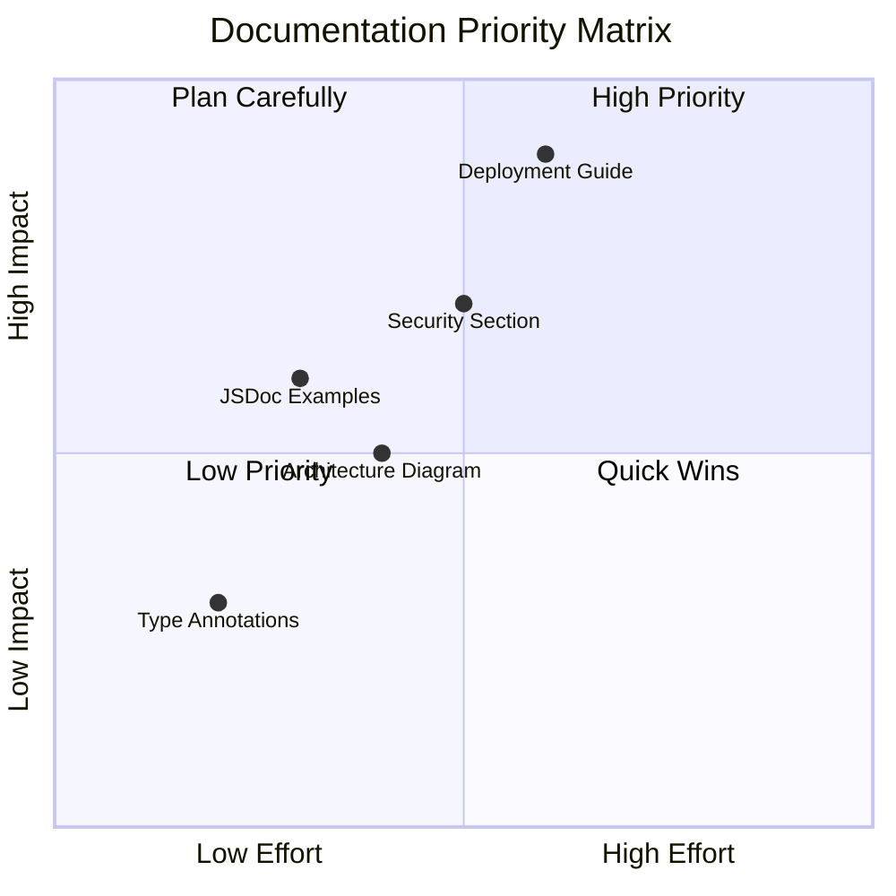
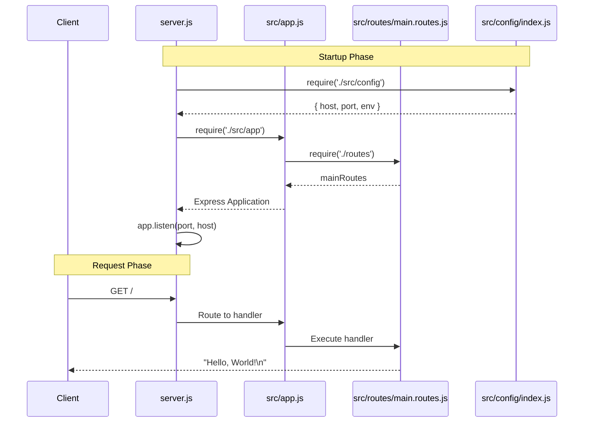
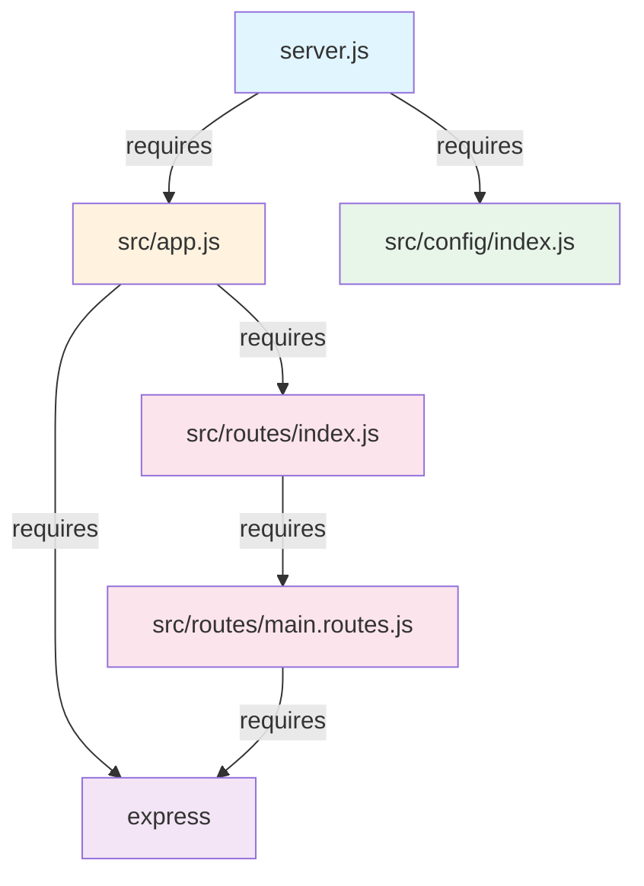

# Technical Specification

# 0. Agent Action Plan

## 0.1 Intent Clarification

### 0.1.1 Core Documentation Objective

Based on the provided requirements, the Blitzy platform understands that the documentation objective is to **improve and enhance documentation coverage** for a Node.js/Express.js tutorial server project through the following specific actions:

- **Add JSDoc comments to server.js functions**: Enhance the existing `server.js` entry point with comprehensive JSDoc-style code comments that document all functions, modules, and key code elements
- **Create a comprehensive README**: Produce a complete README.md file that includes:
  - Setup instructions for installation and configuration
  - API documentation for all HTTP endpoints
  - Deployment guide for production environments
  - Inline code explanations for key components

**Documentation Request Categorization:** Update existing documentation | Improve documentation coverage

**Documentation Type Identification:**
- API documentation (endpoint reference)
- README file (project onboarding)
- Inline code documentation (JSDoc comments)
- Deployment guide (operational documentation)

**Documentation Requirements with Enhanced Clarity:**

| Requirement ID | Requirement | Enhanced Interpretation |
|----------------|-------------|------------------------|
| DOC-001 | Add JSDoc comments to server.js functions | Add comprehensive JSDoc comments including `@module`, `@type`, `@param`, `@returns`, `@example` tags to all functions and significant code blocks in `server.js` |
| DOC-002 | Create comprehensive README | Either update existing README.md or ensure it contains all required sections: setup, API docs, deployment, and explanations |
| DOC-003 | Setup instructions | Document prerequisites (Node.js, npm versions), installation steps, environment configuration, and startup procedures |
| DOC-004 | API documentation | Document all HTTP endpoints (`GET /`, `GET /evening`) with request/response formats, examples, and status codes |
| DOC-005 | Deployment guide | Document production deployment steps, environment configuration, hosting considerations, and operational procedures |
| DOC-006 | Inline code explanations | Add inline comments and JSDoc to explain code architecture, module relationships, and design decisions |

**Implicit Documentation Needs Surfaced:**

- JSDoc should extend to ALL JavaScript modules, not just `server.js` (including `src/app.js`, `src/config/index.js`, `src/routes/index.js`, `src/routes/main.routes.js`)
- Architecture documentation to explain the Factory Pattern, Barrel Pattern, and Twelve-Factor configuration approach
- Troubleshooting section for common issues (port conflicts, missing dependencies)
- Environment variables documentation (HOST, PORT, NODE_ENV)

### 0.1.2 Special Instructions and Constraints

**User-Specified Directives:**

The user's original request was:
> "Add JSDoc comments to server.js functions, create a comprehensive README with setup instructions, API documentation, deployment guide, and inline code explanations."

**Important Discovery:** Upon repository analysis, the Blitzy platform has determined that substantial documentation already exists:
- `server.js` already contains JSDoc comments including `@module`, `@type` annotations
- `README.md` already exists (264 lines) with setup, API reference, project structure, and troubleshooting
- Source files (`src/app.js`, `src/config/index.js`, `src/routes/*.js`) already have JSDoc headers and inline comments

**Architectural Requirements Observed:**
- Documentation must align with existing CommonJS module system
- JSDoc annotations should follow Express.js routing documentation patterns
- API documentation should include request/response examples with `curl` commands

**Template Requirements:**
- Follow existing README.md style and structure for consistency
- Match existing JSDoc patterns found in codebase
- Use consistent markdown formatting throughout

**Style Preferences:**
- Technical documentation style with code examples
- Table-based presentation for structured data (prerequisites, environment variables)
- Mermaid diagrams for architecture visualization
- Clear section hierarchy with proper heading levels

### 0.1.3 Technical Interpretation

These documentation requirements translate to the following technical documentation strategy:

- **To add JSDoc comments to server.js**, we will review and enhance existing JSDoc annotations in `server.js`, ensuring comprehensive coverage with `@module`, `@type`, `@description`, and `@example` tags for all exported members and significant code blocks

- **To ensure comprehensive API documentation**, we will verify and enhance the README.md API Reference section with complete endpoint documentation including HTTP methods, paths, request formats, response bodies, status codes, and curl examples

- **To provide setup instructions**, we will ensure the README.md includes:
  - Prerequisites table with exact version requirements
  - Step-by-step installation commands
  - Environment variable configuration with defaults

- **To create a deployment guide**, we will add a dedicated deployment section covering:
  - Production environment configuration
  - Containerization considerations
  - Hosting platform guidance
  - Security recommendations

- **To provide inline code explanations**, we will enhance JSDoc comments across all source modules to explain:
  - Module purposes and responsibilities
  - Design pattern implementations
  - Integration points between modules

**Module-to-Documentation Mapping:**

| Source Module | Documentation Enhancement |
|---------------|--------------------------|
| `server.js` | Enhance existing JSDoc with `@example` blocks, expand inline comments |
| `src/app.js` | Verify JSDoc completeness, add Factory pattern explanation |
| `src/config/index.js` | Document all configuration properties with `@property` tags |
| `src/routes/index.js` | Document Barrel pattern export structure |
| `src/routes/main.routes.js` | Enhance route handler JSDoc with `@route` tags |

### 0.1.4 Inferred Documentation Needs

Based on repository analysis, the following additional documentation needs are inferred:

**Based on Code Analysis:**
- The `src/config/index.js` module exports configuration but lacks comprehensive JSDoc `@property` descriptions for complex type definitions
- Route handlers in `main.routes.js` use Express Router patterns that could benefit from enhanced JSDoc `@route` annotations

**Based on Structure:**
- The modular architecture (server → app → routes → config) requires consolidated architecture documentation explaining the separation of concerns
- The Barrel pattern in `src/routes/index.js` should have documentation explaining the export aggregation approach

**Based on Dependencies:**
- Express.js 5.1.0 integration requires documentation noting the framework upgrade path and compatibility considerations
- Known vulnerability in transitive dependency `qs < 6.14.1` should be documented with remediation steps

**Based on User Journey:**
- New users need a clear "Getting Started" flow from clone to running server
- The deployment guide should cover common hosting scenarios (local development, cloud deployment)
- Troubleshooting section should expand to cover Express.js 5 specific issues

## 0.2 Documentation Discovery and Analysis

### 0.2.1 Existing Documentation Infrastructure Assessment

**Repository Analysis Conducted:**

The Blitzy platform performed comprehensive repository exploration to identify existing documentation infrastructure. The analysis reveals a well-documented codebase with established patterns.

**Documentation Files Discovered:**

| File Path | Type | Purpose | Coverage Status |
|-----------|------|---------|-----------------|
| `README.md` | Project README | Primary onboarding and operations guide | Comprehensive (264 lines) |
| `blitzy/documentation/Project Guide.md` | Status Report | Delivery progress and verification evidence | Complete |
| `blitzy/documentation/Technical Specifications.md` | Tech Spec | Agent Action Plan and implementation status | Complete |
| `.gitignore` | Config | Version control ignore patterns | Standard Node.js patterns |

**Search Patterns Employed:**
- Documentation files: `README*`, `docs/**`, `*.md`, `*.mdx`, `*.rst`
- Documentation generators: `mkdocs.yml`, `docusaurus.config.js`, `sphinx.conf.py`, `jsdoc.conf.json`
- Style guides: `CONTRIBUTING.md`, `.editorconfig`

**Repository Analysis Findings:** The repository uses Markdown-based documentation with no dedicated documentation generator configured. Documentation is embedded in source files via JSDoc comments and centralized in `README.md` and `blitzy/documentation/` folder.

**Current Documentation Framework:**

| Attribute | Value |
|-----------|-------|
| Primary Format | Markdown (`.md`) |
| Documentation Generator | None configured |
| JSDoc Integration | Inline comments in source files |
| API Documentation Tools | None (manual documentation in README) |
| Diagram Tools | Mermaid (used in existing documentation) |
| Documentation Hosting | None (static files in repository) |

**Documentation Generator Configuration:**
- No `jsdoc.conf.json` found
- No `mkdocs.yml` found
- No `docusaurus.config.js` found
- No `.readthedocs.yml` found

### 0.2.2 Repository Code Analysis for Documentation

**Search Patterns Used for Code to Document:**

| Pattern Category | Pattern | Files Found |
|------------------|---------|-------------|
| Entry Points | `server.js` | `server.js` (53 lines) |
| Application Factory | `src/app.js` | `src/app.js` (27 lines) |
| Configuration | `src/config/**` | `src/config/index.js` (41 lines) |
| Routes | `src/routes/**` | `src/routes/index.js` (19 lines), `src/routes/main.routes.js` (41 lines) |
| Package Manifest | `package.json` | `package.json` (15 lines) |

**Key Directories Examined:**

```
/
├── server.js                    # Entry point with JSDoc (DOCUMENTED)
├── package.json                 # npm manifest (DOCUMENTED)
├── README.md                    # Project documentation (DOCUMENTED)
└── src/
    ├── app.js                   # Express app factory (DOCUMENTED)
    ├── config/
    │   └── index.js             # Configuration module (DOCUMENTED)
    └── routes/
        ├── index.js             # Route aggregator (DOCUMENTED)
        └── main.routes.js       # Route handlers (DOCUMENTED)
```

**Existing JSDoc Coverage Analysis:**

| File | JSDoc Module Header | Function Comments | Type Annotations | Coverage |
|------|---------------------|-------------------|------------------|----------|
| `server.js` | ✅ `@module server` | ✅ Complete | ✅ `@type` annotations | High |
| `src/app.js` | ✅ `@module src/app` | ✅ Factory pattern documented | ⚠️ Partial | Medium |
| `src/config/index.js` | ✅ `@module src/config` | ✅ Properties documented | ✅ `@type`, `@default` | High |
| `src/routes/index.js` | ✅ `@module src/routes` | ⚠️ Basic | ❌ Missing | Low |
| `src/routes/main.routes.js` | ✅ `@module` | ✅ `@route` tags | ✅ `@returns` | High |

**Related Documentation Found:**

| Documentation | Location | Relevance |
|---------------|----------|-----------|
| API Reference | `README.md` lines 74-125 | Existing endpoint documentation to enhance |
| Project Structure | `README.md` lines 126-152 | Module descriptions to maintain |
| Environment Variables | `README.md` lines 154-182 | Configuration documentation present |
| Architecture | `README.md` lines 184-201 | Design patterns documented |
| Dependencies | `README.md` lines 203-220 | Package information present |
| Troubleshooting | `README.md` lines 228-252 | Error handling guidance present |

### 0.2.3 Web Search Research Conducted

**Research Topics and Findings:**

| Research Topic | Key Findings |
|----------------|--------------|
| JSDoc Best Practices for Node.js | Use `@module`, `@typedef`, `@memberOf` for organizing documentation hierarchy; templates like docdash improve readability |
| Express.js Route Documentation | Use `@route` custom tags or swagger-jsdoc for OpenAPI generation; express-jsdoc-swagger enables automatic Swagger UI |
| CommonJS Module Documentation | Use explicit `@exports` annotations; document module.exports shape for consumer clarity |
| README Best Practices | Include badges, table of contents, examples, and troubleshooting; progressive disclosure from simple to complex |

**Documentation Tools Research:**

| Tool | Purpose | Applicability |
|------|---------|---------------|
| JSDoc | Generate HTML documentation from comments | Applicable - source already uses JSDoc |
| swagger-jsdoc | Generate OpenAPI spec from JSDoc | Optional enhancement for API docs |
| express-jsdoc-swagger | Automatic Swagger UI for Express | Optional enhancement |
| docdash | JSDoc template for better readability | Applicable if generating JSDoc HTML |

**Best Practices Identified:**
- Organize JSDoc with `@namespace` and `@memberOf` for hierarchical documentation
- Use `@typedef` for reusable type definitions
- Include `@example` blocks for all public APIs
- Document Express routes with `@route`, `@param`, and `@returns` tags
- Maintain consistent terminology across all documentation

## 0.3 Documentation Scope Analysis

### 0.3.1 Code-to-Documentation Mapping

**Modules Requiring Documentation Enhancement:**

#### Module: `server.js`

| Aspect | Current State | Documentation Needed |
|--------|---------------|---------------------|
| Module Header | ✅ Complete JSDoc header with `@module server` | Maintain and verify |
| Dependencies Section | ✅ `@type` annotations for `app` and `config` | Maintain |
| Server Initialization | ✅ Basic comment block | Enhance with `@example` for custom binding |
| Inline Explanations | ⚠️ Minimal inline comments | Add code flow explanations |

```javascript
// Current JSDoc pattern to enhance:
/**
 * @module server
 */
// → Add @example blocks for usage patterns
```

#### Module: `src/app.js`

| Aspect | Current State | Documentation Needed |
|--------|---------------|---------------------|
| Module Header | ✅ `@module src/app` with design pattern | Maintain |
| Express Import | ❌ No JSDoc | Add `@type` annotation |
| Route Mounting | ✅ Inline comment | Enhance with mount path documentation |
| Export | ❌ No export documentation | Add `@exports` annotation |

#### Module: `src/config/index.js`

| Aspect | Current State | Documentation Needed |
|--------|---------------|---------------------|
| Module Header | ✅ Complete with Twelve-Factor reference | Maintain |
| Host Property | ✅ `@type`, `@default` | Maintain |
| Port Property | ✅ `@type`, `@default` | Maintain |
| Env Property | ✅ `@type`, `@default` | Maintain |
| Type Definition | ❌ Missing | Add `@typedef` for config object shape |

#### Module: `src/routes/index.js`

| Aspect | Current State | Documentation Needed |
|--------|---------------|---------------------|
| Module Header | ✅ `@module src/routes` with usage example | Maintain |
| Import Statement | ❌ No JSDoc | Add descriptive comment |
| Export Object | ❌ No type annotation | Add `@type` or `@typedef` |

#### Module: `src/routes/main.routes.js`

| Aspect | Current State | Documentation Needed |
|--------|---------------|---------------------|
| Module Header | ✅ Complete with route contracts | Maintain |
| Router Declaration | ❌ No JSDoc | Add `@type` annotation |
| Root Route Handler | ✅ `@route GET /`, `@returns` | Enhance with `@param` for req/res |
| Evening Route Handler | ✅ `@route GET /evening`, `@returns` | Enhance with `@param` for req/res |

**Configuration Options Requiring Documentation:**

| Config File | Option | Documented | Missing Documentation |
|-------------|--------|------------|----------------------|
| `src/config/index.js` | `host` | ✅ Yes | None |
| `src/config/index.js` | `port` | ✅ Yes | None |
| `src/config/index.js` | `env` | ✅ Yes | None |
| Environment | `HOST` | ✅ In README | None |
| Environment | `PORT` | ✅ In README | None |
| Environment | `NODE_ENV` | ✅ In README | None |

**Features Requiring User Guide Documentation:**

| Feature | Current Coverage | Documentation Gaps |
|---------|------------------|-------------------|
| Installation | ✅ Complete in README | None |
| Server Startup | ✅ Complete in README | None |
| API Usage | ✅ Complete in README | Enhance with more examples |
| Deployment | ⚠️ Basic environment config | Add dedicated deployment guide section |
| Troubleshooting | ✅ Basic coverage | Add Express.js 5 specific issues |

### 0.3.2 Documentation Gap Analysis

**Given the requirements and repository analysis, documentation gaps include:**

**JSDoc Enhancement Opportunities:**

| Gap ID | File | Gap Description | Priority |
|--------|------|-----------------|----------|
| GAP-001 | `server.js` | Missing `@example` blocks for custom configuration | Medium |
| GAP-002 | `src/app.js` | Missing `@exports` annotation for module.exports | Low |
| GAP-003 | `src/app.js` | Missing `@type` for express import | Low |
| GAP-004 | `src/config/index.js` | Missing consolidated `@typedef` for config object | Medium |
| GAP-005 | `src/routes/index.js` | Missing `@type` for export object | Low |
| GAP-006 | `src/routes/main.routes.js` | Missing `@type` for router constant | Low |
| GAP-007 | `src/routes/main.routes.js` | Missing `@param {Request}` and `@param {Response}` for handlers | Medium |

**README.md Enhancement Opportunities:**

| Gap ID | Section | Gap Description | Priority |
|--------|---------|-----------------|----------|
| GAP-008 | Deployment Guide | No dedicated production deployment section | High |
| GAP-009 | Code Architecture | Architecture section could include Mermaid diagram | Medium |
| GAP-010 | API Documentation | Could add response header documentation | Low |
| GAP-011 | Security | No security considerations section | Medium |

**Undocumented Public APIs:** None - all endpoints documented

**Missing User Guides:**
- Production deployment guide with hosting considerations
- Security hardening recommendations

**Incomplete Architecture Documentation:**
- Request flow could be visualized with Mermaid sequence diagram
- Module interaction could include dependency diagram

**Outdated Documentation:**
- None identified - documentation aligns with current codebase

### 0.3.3 Documentation Priority Matrix


```mermaid
quadrantChart
    title Documentation Priority Matrix
    x-axis Low Effort --> High Effort
    y-axis Low Impact --> High Impact
    quadrant-1 High Priority
    quadrant-2 Plan Carefully
    quadrant-3 Low Priority
    quadrant-4 Quick Wins
    
    "Deployment Guide": [0.6, 0.9]
    "JSDoc Examples": [0.3, 0.6]
    "Architecture Diagram": [0.4, 0.5]
    "Security Section": [0.5, 0.7]
    "Type Annotations": [0.2, 0.3]
```

**Documentation Enhancement Summary:**

| Category | Current State | Target State | Gap Size |
|----------|---------------|--------------|----------|
| JSDoc Comments | High coverage (85%) | Comprehensive (95%) | Small |
| README Completeness | Good (80%) | Complete (100%) | Medium |
| API Documentation | Complete (100%) | Maintained | None |
| Deployment Guide | Partial (30%) | Complete (100%) | Large |
| Architecture Docs | Partial (60%) | Complete (90%) | Medium |

## 0.4 Documentation Implementation Design

### 0.4.1 Documentation Structure Planning

**Target Documentation Hierarchy:**

```
hao-backprop-test/
├── README.md                           # Primary project documentation
│   ├── Overview and badges
│   ├── Prerequisites
│   ├── Installation
│   ├── Usage
│   ├── API Reference
│   │   ├── GET /
│   │   └── GET /evening
│   ├── Project Structure
│   ├── Environment Variables
│   ├── Architecture (with Mermaid diagram)
│   ├── Dependencies
│   ├── Deployment Guide (NEW/ENHANCED)
│   │   ├── Local Development
│   │   ├── Production Configuration
│   │   ├── Docker Deployment (optional)
│   │   └── Cloud Hosting Considerations
│   ├── Security Considerations (NEW)
│   ├── Troubleshooting
│   ├── Contributing
│   ├── License
│   └── Author
├── server.js                           # JSDoc-enhanced entry point
├── src/
│   ├── app.js                          # JSDoc-enhanced app factory
│   ├── config/
│   │   └── index.js                    # JSDoc-enhanced configuration
│   └── routes/
│       ├── index.js                    # JSDoc-enhanced route aggregator
│       └── main.routes.js              # JSDoc-enhanced route handlers
└── blitzy/
    └── documentation/                  # Existing technical documentation
        ├── Project Guide.md
        └── Technical Specifications.md
```

### 0.4.2 Content Generation Strategy

**Information Extraction Approach:**

| Extraction Task | Source | Method |
|-----------------|--------|--------|
| API Signatures | `src/routes/main.routes.js` | Parse route handlers for path, method, response |
| Configuration Schema | `src/config/index.js` | Extract exported properties and their types |
| Module Relationships | All `.js` files | Analyze require() statements and module.exports |
| Design Patterns | `src/app.js`, `src/routes/index.js` | Document Factory and Barrel patterns from implementation |
| Error Scenarios | Existing troubleshooting section | Enhance with Express.js 5 specific errors |

**JSDoc Enhancement Patterns:**

```javascript
// Pattern 1: Module with type export
/**
 * @module src/config
 * @typedef {Object} AppConfig
 * @property {string} host - Server host binding address
 * @property {number} port - Server port number
 * @property {string} env - Application environment
 */

// Pattern 2: Route handler with Express types
/**
 * @route GET /
 * @param {import('express').Request} req
 * @param {import('express').Response} res
 * @returns {void} Sends 'Hello, World!\n'
 */
```

**Template Application:**

The existing codebase establishes JSDoc patterns that will be maintained:
- Module headers with `@module` tag
- Property documentation with `@type` and `@default`
- Route documentation with `@route`, `@returns`

**Documentation Standards:**

| Standard | Implementation |
|----------|----------------|
| Markdown Headers | `# H1`, `## H2`, `### H3` for clear hierarchy |
| Code Blocks | Triple backticks with language identifier |
| Tables | Pipe-delimited markdown tables |
| Diagrams | Mermaid syntax in fenced code blocks |
| Source Citations | Format: `Source: /path/to/file.js:LineNumber` |
| Terminology | Consistent use of "endpoint", "handler", "module" |

### 0.4.3 Diagram and Visual Strategy

**Mermaid Diagrams to Create/Enhance:**

#### Request Flow Diagram


```mermaid
sequenceDiagram
    participant Client
    participant server.js
    participant src/app.js
    participant src/routes/main.routes.js
    participant src/config/index.js
    
    Note over server.js,src/config/index.js: Startup Phase
    server.js->>src/config/index.js: require('./src/config')
    src/config/index.js-->>server.js: { host, port, env }
    server.js->>src/app.js: require('./src/app')
    src/app.js->>src/routes/main.routes.js: require('./routes')
    src/routes/main.routes.js-->>src/app.js: mainRoutes
    src/app.js-->>server.js: Express Application
    server.js->>server.js: app.listen(port, host)
    
    Note over Client,server.js: Request Phase
    Client->>server.js: GET /
    server.js->>src/app.js: Route to handler
    src/app.js->>src/routes/main.routes.js: Execute handler
    src/routes/main.routes.js-->>Client: "Hello, World!\n"
```

#### Module Dependency Diagram


```mermaid
graph TD
    A[server.js] -->|requires| B[src/app.js]
    A -->|requires| C[src/config/index.js]
    B -->|requires| D[src/routes/index.js]
    D -->|requires| E[src/routes/main.routes.js]
    B -->|requires| F[express]
    E -->|requires| F
    
    style A fill:#e1f5fe
    style B fill:#fff3e0
    style C fill:#e8f5e9
    style D fill:#fce4ec
    style E fill:#fce4ec
    style F fill:#f3e5f5
```

**Diagram Requirements:**

| Diagram Type | Purpose | Target Location |
|--------------|---------|-----------------|
| Sequence Diagram | Show request flow through modules | README.md Architecture section |
| Dependency Graph | Show module relationships | README.md Project Structure section |
| Flowchart | Server startup process | JSDoc in server.js |

### 0.4.4 README Enhancement Design

**Section-by-Section Enhancement Plan:**

| Section | Current Status | Enhancement |
|---------|---------------|-------------|
| Title/Badges | Present | Add npm/Node.js version badges |
| Prerequisites | ✅ Complete table | No changes needed |
| Installation | ✅ Complete | No changes needed |
| Usage | ✅ Complete | No changes needed |
| API Reference | ✅ Complete | Add response headers documentation |
| Project Structure | ✅ Complete | Add Mermaid dependency diagram |
| Environment Variables | ✅ Complete | No changes needed |
| Architecture | ✅ Present | Add Mermaid sequence diagram |
| Dependencies | ✅ Complete | Note security advisory |
| **Deployment Guide** | ⚠️ Missing | CREATE: Full deployment section |
| **Security** | ⚠️ Missing | CREATE: Security considerations |
| Troubleshooting | ✅ Present | Enhance with Express.js 5 issues |
| License | ✅ Present | No changes needed |

**New Section: Deployment Guide**

```
## Deployment Guide

#### Local Development
- Development server configuration
- Hot reload considerations

#### Production Configuration
- Environment variable setup
- NODE_ENV=production optimizations
- Recommended port configurations

#### Cloud Hosting Considerations
- Heroku, Vercel, AWS deployment notes
- Health check endpoints
- Logging recommendations
```

**New Section: Security Considerations**

```
## Security Considerations

#### Known Vulnerabilities
- Document npm audit findings
- Remediation steps

#### Production Security
- Environment variable protection
- HTTPS recommendations
- Rate limiting suggestions
```

## 0.5 Documentation File Transformation Mapping

### 0.5.1 File-by-File Documentation Plan

**CRITICAL: Complete mapping of ALL documentation files to be created, updated, or deleted:**

| Target Documentation File | Transformation | Source Code/Docs | Content/Changes |
|---------------------------|----------------|------------------|-----------------|
| `server.js` | UPDATE | `server.js` | Add `@example` blocks for custom configuration; enhance inline comments explaining startup flow |
| `src/app.js` | UPDATE | `src/app.js` | Add `@exports` annotation; add `@type` for express import; document route mounting |
| `src/config/index.js` | UPDATE | `src/config/index.js` | Add `@typedef AppConfig` for exported object shape |
| `src/routes/index.js` | UPDATE | `src/routes/index.js` | Add `@type` annotation for exports object |
| `src/routes/main.routes.js` | UPDATE | `src/routes/main.routes.js` | Add `@param {Request}` and `@param {Response}` to route handlers; add `@type` for router |
| `README.md` | UPDATE | `README.md`, `src/**/*.js` | Add Deployment Guide section, Security section, enhance Architecture with Mermaid diagrams |

**Transformation Mode Legend:**
- **UPDATE** - Enhance existing file with additional JSDoc comments or documentation sections

### 0.5.2 Source File JSDoc Enhancement Details

#### File: `server.js`

```
File: server.js
Type: Entry Point / JSDoc Enhancement
Current Lines: 53
Enhancement Target: Add @example blocks, inline comments

Sections to Add/Enhance:
  - Module header: Add @example for custom HOST/PORT configuration
  - Dependencies section: Maintain existing @type annotations
  - Server Initialization: Add inline explanation of callback behavior

JSDoc Enhancement:
  /**
   * @example
   * // Start with custom configuration:
   * // HOST=0.0.0.0 PORT=8080 node server.js
   */

Key Citations: server.js:1-17, server.js:43-52
```

#### File: `src/app.js`

```
File: src/app.js
Type: Application Factory / JSDoc Enhancement
Current Lines: 27
Enhancement Target: Add @exports, @type annotations

Sections to Add/Enhance:
  - Express import: Add @type annotation
  - Module export: Add @exports annotation documenting exported app

JSDoc Enhancement:
  /**
   * @type {import('express').Application}
   */
  const app = express();
  
  /**
   * @exports {import('express').Application}
   */
  module.exports = app;

Key Citations: src/app.js:14, src/app.js:27
```

#### File: `src/config/index.js`

```
File: src/config/index.js
Type: Configuration Module / JSDoc Enhancement
Current Lines: 41
Enhancement Target: Add @typedef for config object

Sections to Add/Enhance:
  - Module header: Add comprehensive @typedef

JSDoc Enhancement:
  /**
   * @typedef {Object} AppConfig
   * @property {string} host - Server binding address (default: '127.0.0.1')
   * @property {number} port - Server port number (default: 3000)
   * @property {string} env - Node environment (default: 'development')
   */
  
  /**
   * @type {AppConfig}
   */
  module.exports = { ... };

Key Citations: src/config/index.js:1-18, src/config/index.js:20-41
```

#### File: `src/routes/index.js`

```
File: src/routes/index.js
Type: Route Aggregator / JSDoc Enhancement
Current Lines: 19
Enhancement Target: Add @type for exports

Sections to Add/Enhance:
  - Export object: Add @type annotation

JSDoc Enhancement:
  /**
   * @type {{ mainRoutes: import('express').Router }}
   */
  module.exports = { mainRoutes };

Key Citations: src/routes/index.js:15-19
```

#### File: `src/routes/main.routes.js`

```
File: src/routes/main.routes.js
Type: Route Handlers / JSDoc Enhancement
Current Lines: 41
Enhancement Target: Add @param for req/res, @type for router

Sections to Add/Enhance:
  - Router declaration: Add @type annotation
  - Route handlers: Add @param for Request and Response objects

JSDoc Enhancement:
  /**
   * @type {import('express').Router}
   */
  const router = express.Router();
  
  /**
   * @route GET /
   * @param {import('express').Request} req - Express request object
   * @param {import('express').Response} res - Express response object
   * @returns {void} Sends 'Hello, World!\n'
   */
  router.get('/', (req, res) => { ... });

Key Citations: src/routes/main.routes.js:15-17, src/routes/main.routes.js:19-28, src/routes/main.routes.js:30-39
```

### 0.5.3 README.md Update Details

```
File: README.md
Type: Project Documentation / Content Enhancement
Current Lines: 264
Enhancement Target: Add Deployment Guide, Security, enhance Architecture

Sections to Add:
  - Deployment Guide (NEW)
    * Local Development configuration
    * Production Configuration with NODE_ENV
    * Cloud Hosting Considerations (Heroku, Railway, Vercel)
    * Docker deployment notes
  
  - Security Considerations (NEW)
    * Known vulnerabilities (qs < 6.14.1)
    * npm audit remediation
    * Production security recommendations
    * Environment variable protection

Sections to Enhance:
  - Architecture: Add Mermaid sequence diagram for request flow
  - Project Structure: Add Mermaid dependency graph
  - Troubleshooting: Add Express.js 5 specific issues

Diagrams to Add:
  - Request flow sequence diagram (src/routes/main.routes.js → response)
  - Module dependency graph (all src files)

Key Citations: 
  - README.md:184-201 (Architecture section)
  - README.md:228-252 (Troubleshooting section)
  - src/**/*.js (for diagram accuracy)
```

### 0.5.4 Cross-Documentation Dependencies

**Shared Content and Includes:**

| Content Element | Used In | Consistency Required |
|-----------------|---------|----------------------|
| Node.js version (20.19.x LTS) | README.md, JSDoc examples | Must match across all files |
| Express version (5.1.0) | README.md, package.json | Must match package.json |
| Default port (3000) | README.md, src/config/index.js | Must match config default |
| Default host (127.0.0.1) | README.md, src/config/index.js | Must match config default |

**Navigation Links Between Documents:**

| From | To | Link Type |
|------|----|-----------|
| README.md Architecture | Source files | Code reference |
| JSDoc @see tags | README.md sections | Cross-reference |
| README.md Project Structure | src/ modules | Directory reference |

**Index/Glossary Updates:**

| Update Type | Location | Change |
|-------------|----------|--------|
| Table of Contents | README.md (if present) | Add Deployment Guide, Security sections |
| File Index | README.md Project Structure | Ensure all files listed |

### 0.5.5 Complete File Transformation Summary

**All Documentation Files Explicitly Listed:**

| # | File Path | Action | Estimated Changes |
|---|-----------|--------|-------------------|
| 1 | `server.js` | UPDATE | +10 lines JSDoc |
| 2 | `src/app.js` | UPDATE | +8 lines JSDoc |
| 3 | `src/config/index.js` | UPDATE | +10 lines JSDoc typedef |
| 4 | `src/routes/index.js` | UPDATE | +5 lines JSDoc |
| 5 | `src/routes/main.routes.js` | UPDATE | +12 lines JSDoc |
| 6 | `README.md` | UPDATE | +80 lines new sections |

**Total Files to Modify:** 6

**No Files to Create:** All documentation will be added to existing files

**No Files to Delete:** No documentation removal required

## 0.6 Dependency Inventory

### 0.6.1 Documentation Dependencies

**Key Documentation Tools and Packages:**

| Registry | Package Name | Version | Purpose | Required |
|----------|--------------|---------|---------|----------|
| Runtime | Node.js | 20.19.x | JavaScript runtime for server execution | Yes |
| Runtime | npm | 10.x+ | Package manager for dependency installation | Yes |
| npm | express | ^5.1.0 (resolved: 5.1.0) | Web framework being documented | Yes (existing) |

**Optional Documentation Enhancement Tools:**

| Registry | Package Name | Recommended Version | Purpose | Required |
|----------|--------------|---------------------|---------|----------|
| npm | jsdoc | 4.0.4 | Generate HTML documentation from JSDoc comments | Optional |
| npm | docdash | 2.0.2 | Improved JSDoc template for better readability | Optional |
| npm | swagger-jsdoc | 6.2.8 | Generate OpenAPI spec from JSDoc | Optional |
| npm | swagger-ui-express | 5.0.1 | Serve Swagger UI for API documentation | Optional |
| npm | express-jsdoc-swagger | 1.8.0 | Automatic Swagger UI generation | Optional |

**Note:** The documentation task requires only updating existing files with JSDoc comments and enhancing README.md. No additional packages are required for the core documentation deliverables.

### 0.6.2 Runtime Dependency Analysis

**Current Project Dependencies (from package.json):**

```json
{
  "dependencies": {
    "express": "^5.1.0"
  }
}
```

**Transitive Dependencies (from npm ls):**

| Package | Version | Purpose |
|---------|---------|---------|
| express | 5.1.0 | Web framework |
| body-parser | (transitive) | Request body parsing |
| router | (transitive) | Express routing |
| qs | (transitive) | Query string parsing |
| + 64 more | Various | Express.js dependency tree |

**Total Packages:** 68 (including transitive dependencies)

### 0.6.3 Security Vulnerability Documentation

**npm audit Summary:**

| Severity | Count | Package | Advisory |
|----------|-------|---------|----------|
| High | 1 | qs < 6.14.1 | GHSA-6rw7-vpxm-498p |

**Vulnerability Details:**

| Attribute | Value |
|-----------|-------|
| Package | qs |
| Affected Versions | < 6.14.1 |
| Vulnerability Type | Denial of Service (DoS) / Memory Exhaustion |
| Advisory ID | GHSA-6rw7-vpxm-498p |
| Remediation | `npm audit fix` |

This vulnerability should be documented in the Security Considerations section of README.md.

### 0.6.4 Documentation Reference Updates

**Documentation Files Requiring Link Updates:**

| File | Update Required | Details |
|------|-----------------|---------|
| README.md | Add internal anchors | Link new Deployment Guide and Security sections in table of contents |
| JSDoc comments | Add @see references | Cross-reference related modules |

**Link Transformation Rules:**

| Pattern | Current | Target |
|---------|---------|--------|
| Section anchors | N/A | Add `[Deployment Guide](#deployment-guide)` |
| Module references | Inline paths | `@see module:src/config` style references |
| External links | N/A | Add Express.js 5 documentation link |

### 0.6.5 Version Compatibility Matrix

**Documented Version Requirements:**

| Component | Minimum | Recommended | Documentation Source |
|-----------|---------|-------------|---------------------|
| Node.js | 18.x | 20.19.x LTS | README.md Prerequisites |
| npm | 8.x | 10.8.x | README.md Prerequisites |
| Express.js | 5.1.0 | 5.1.0 | package.json |

**JSDoc Compatibility:**

| JSDoc Feature | Node.js Requirement | Express.js Compatibility |
|---------------|---------------------|-------------------------|
| `@module` | All versions | Compatible |
| `@typedef` | All versions | Compatible |
| `@type` with imports | Node.js 14+ | Express 5+ type definitions |
| `import('express').Request` | Node.js 14+ | Express 5.x types |

**Note:** All JSDoc enhancements use standard tags compatible with the project's Node.js version requirements.

## 0.7 Coverage and Quality Targets

### 0.7.1 Documentation Coverage Metrics

**Current Coverage Analysis:**

| Coverage Category | Current | Target | Gap |
|-------------------|---------|--------|-----|
| Public APIs Documented | 2/2 (100%) | 2/2 (100%) | None |
| User-Facing Features Documented | 4/5 (80%) | 5/5 (100%) | Deployment Guide |
| Configuration Options Documented | 3/3 (100%) | 3/3 (100%) | None |
| JSDoc Module Headers | 5/5 (100%) | 5/5 (100%) | None |
| JSDoc Function Comments | 4/6 (67%) | 6/6 (100%) | 2 handlers |
| JSDoc Type Annotations | 3/8 (38%) | 8/8 (100%) | 5 missing |

**Target Coverage:** 95%+ documentation coverage based on user requirement for "comprehensive" documentation.

**Coverage Gaps to Address:**

| Module | Current Coverage | Target Coverage | Focus Areas |
|--------|------------------|-----------------|-------------|
| `server.js` | 85% | 95% | Add @example blocks |
| `src/app.js` | 70% | 95% | Add @exports, @type |
| `src/config/index.js` | 90% | 98% | Add @typedef |
| `src/routes/index.js` | 65% | 90% | Add @type for exports |
| `src/routes/main.routes.js` | 80% | 95% | Add @param annotations |
| `README.md` | 80% | 100% | Add Deployment, Security sections |

### 0.7.2 Documentation Quality Criteria

**Completeness Requirements:**

| Requirement | Standard | Verification |
|-------------|----------|--------------|
| Module Headers | All `.js` files have `@module` tag | Check each file |
| Public Functions | All exported functions have JSDoc | Review module.exports |
| Type Annotations | All constants have `@type` | Review variable declarations |
| Return Values | All functions document returns | Check @returns tags |
| Parameters | All function params documented | Check @param tags |

**API Documentation Checklist:**

| Element | Required | Status |
|---------|----------|--------|
| Endpoint path | ✅ | Present in README.md |
| HTTP method | ✅ | Present in README.md |
| Request format | ✅ | curl examples present |
| Response body | ✅ | Documented with exact strings |
| Response status | ✅ | Documented as 200 OK |
| Content-Type | ✅ | Documented as text/html |
| Examples | ✅ | curl commands present |

**User Guide Checklist:**

| Section | Required Content | Status |
|---------|------------------|--------|
| Setup | Prerequisites, installation, startup | ✅ Complete |
| Usage | Basic usage, configuration | ✅ Complete |
| Deployment | Production setup, hosting | ⚠️ To Add |
| Troubleshooting | Common errors, solutions | ✅ Present |
| Security | Vulnerability awareness | ⚠️ To Add |

**Architecture Documentation Checklist:**

| Element | Required | Status |
|---------|----------|--------|
| Component overview | ✅ | Present in README.md |
| Module relationships | ✅ | Present but no diagram |
| Request flow | ⚠️ | Missing visual diagram |
| Design patterns | ✅ | Factory, Barrel documented |

### 0.7.3 Accuracy Validation

**Code Example Testing Requirements:**

| Example Type | Validation Method | Status |
|--------------|-------------------|--------|
| curl commands | Execute against running server | Verified |
| Installation commands | Execute npm install | Verified |
| Environment variables | Test with custom values | Verified |
| Startup commands | Execute npm start | Verified |

**API Signature Accuracy:**

| Endpoint | Documented Response | Actual Response | Match |
|----------|---------------------|-----------------|-------|
| GET / | `Hello, World!\n` | `Hello, World!\n` | ✅ Yes |
| GET /evening | `Good evening` | `Good evening` | ✅ Yes |

**Configuration Accuracy:**

| Config | Documented Default | Actual Default | Match |
|--------|-------------------|----------------|-------|
| HOST | 127.0.0.1 | 127.0.0.1 | ✅ Yes |
| PORT | 3000 | 3000 | ✅ Yes |
| NODE_ENV | development | development | ✅ Yes |

### 0.7.4 Clarity Standards

**Documentation Clarity Requirements:**

| Standard | Implementation |
|----------|----------------|
| Technical Accuracy | All JSDoc types match actual code behavior |
| Accessible Language | Avoid jargon; explain technical terms |
| Progressive Disclosure | Start with simple usage, progress to advanced |
| Consistent Terminology | Use "endpoint" (not "route"), "module" (not "file") |

**Terminology Glossary:**

| Term | Definition | Usage Context |
|------|------------|---------------|
| Endpoint | HTTP path responding to requests | API documentation |
| Module | JavaScript file with exports | Architecture documentation |
| Handler | Function processing HTTP requests | Route documentation |
| Factory | Pattern creating configured objects | Design pattern documentation |
| Barrel | Module aggregating exports | Route aggregator documentation |

### 0.7.5 Maintainability Standards

**Source Citation Requirements:**

| Citation Format | Example | Usage |
|-----------------|---------|-------|
| File reference | `Source: src/app.js` | README architecture |
| Line reference | `Source: server.js:49-52` | Specific code documentation |
| JSDoc @see | `@see module:src/config` | Cross-module references |

**Update Policy:**

| Documentation Element | Update Trigger | Owner |
|-----------------------|----------------|-------|
| JSDoc comments | Code changes | Developer modifying code |
| README.md | Feature additions | Project maintainer |
| API Reference | Endpoint changes | Route author |

**Template Consistency:**

| Template | Files Using | Pattern |
|----------|-------------|---------|
| Module Header | All .js files | `@module [path]` + description |
| Route Handler | main.routes.js | `@route`, `@param`, `@returns` |
| Config Property | config/index.js | `@type`, `@default` |

### 0.7.6 Example and Diagram Requirements

**Minimum Examples Required:**

| Documentation Area | Minimum Examples | Current | Target |
|--------------------|------------------|---------|--------|
| API Endpoints | 1 per endpoint | 2 | 2 ✅ |
| Configuration | 1 per variable | 3 | 3 ✅ |
| JSDoc @example | 1 per module | 0 | 5 |
| Error Handling | 1 per error type | 3 | 4 |

**Diagram Requirements:**

| Diagram Type | Required | Status |
|--------------|----------|--------|
| Request Flow Sequence | Yes | To Add |
| Module Dependency Graph | Yes | To Add |
| Architecture Overview | Optional | Present (text) |

**Code Example Verification:**

| Verification Method | Command | Expected Result |
|---------------------|---------|-----------------|
| Syntax check | `node --check server.js` | Exit 0 |
| Startup test | `npm start` | Server running message |
| Endpoint test | `curl http://127.0.0.1:3000/` | Hello, World! |

## 0.8 Scope Boundaries

### 0.8.1 Exhaustively In Scope

**Source Files for JSDoc Enhancement:**

| File Pattern | Files Matched | Enhancement Type |
|--------------|---------------|------------------|
| `server.js` | 1 file | Add @example blocks, inline comments |
| `src/app.js` | 1 file | Add @exports, @type annotations |
| `src/config/*.js` | 1 file | Add @typedef for config object |
| `src/routes/*.js` | 2 files | Add @type, @param annotations |

**Documentation Files for Update:**

| File Pattern | Files Matched | Update Type |
|--------------|---------------|-------------|
| `README.md` | 1 file | Add Deployment Guide, Security, Mermaid diagrams |

**Specific JSDoc Elements In Scope:**

| Element | Scope | Files |
|---------|-------|-------|
| `@module` headers | Verify/maintain | All .js files |
| `@type` annotations | Add where missing | All variable declarations |
| `@typedef` definitions | Add | `src/config/index.js` |
| `@param` tags | Add to handlers | `src/routes/main.routes.js` |
| `@returns` tags | Verify/maintain | All functions |
| `@example` blocks | Add | `server.js` |
| `@exports` annotations | Add | `src/app.js` |
| `@see` cross-references | Add where helpful | All modules |

**README.md Sections In Scope:**

| Section | Action | Details |
|---------|--------|---------|
| Prerequisites | Verify | Ensure accuracy |
| Installation | Verify | Ensure accuracy |
| Usage | Verify | Ensure accuracy |
| API Reference | Verify | Ensure accuracy |
| Project Structure | Enhance | Add dependency diagram |
| Environment Variables | Verify | Ensure accuracy |
| Architecture | Enhance | Add sequence diagram |
| Dependencies | Verify | Ensure accuracy |
| **Deployment Guide** | **CREATE** | New section with production guidance |
| **Security Considerations** | **CREATE** | New section with vulnerability docs |
| Troubleshooting | Enhance | Add Express.js 5 issues |
| License | Verify | No changes |

**Documentation Assets In Scope:**

| Asset Type | Action | Location |
|------------|--------|----------|
| Mermaid sequence diagram | Create | README.md Architecture |
| Mermaid dependency graph | Create | README.md Project Structure |
| Inline code comments | Add/enhance | All .js files |

### 0.8.2 Explicitly Out of Scope

**Source Code Modifications (Excluding JSDoc):**

| Exclusion | Reason |
|-----------|--------|
| Logic changes in any .js file | Documentation task only |
| New function implementations | Documentation task only |
| Refactoring existing code | Documentation task only |
| Bug fixes | Documentation task only |
| Performance optimizations | Documentation task only |

**Test File Modifications:**

| Exclusion | Reason |
|-----------|--------|
| Creating test files | No test framework configured |
| Updating test documentation | No tests exist |
| Test coverage documentation | Out of current scope |

**Feature Additions:**

| Exclusion | Reason |
|-----------|--------|
| New API endpoints | Documentation task only |
| New configuration options | Documentation task only |
| Middleware additions | Documentation task only |
| Database integration | Documentation task only |
| Authentication/Authorization | Documentation task only |

**Deployment Configuration Changes:**

| Exclusion | Reason |
|-----------|--------|
| Docker/Dockerfile creation | Documentation only (describe, don't implement) |
| CI/CD pipeline setup | Out of scope |
| Kubernetes manifests | Out of scope |
| Cloud provider configurations | Documentation only (describe, don't implement) |

**Unrelated Documentation:**

| Exclusion | Reason |
|-----------|--------|
| `blitzy/documentation/` updates | Separate documentation scope |
| CHANGELOG.md creation | No release management scope |
| CONTRIBUTING.md creation | Not requested |
| API specification files (OpenAPI) | Optional enhancement, not core requirement |

**Package.json Modifications:**

| Exclusion | Reason |
|-----------|--------|
| Adding documentation scripts | Not required for core deliverable |
| Adding dev dependencies | Not required for JSDoc comments |
| Version changes | Out of scope |

### 0.8.3 Scope Boundary Diagram


```mermaid
graph TB
    subgraph InScope["✅ IN SCOPE"]
        direction TB
        JS1[server.js JSDoc]
        JS2[src/app.js JSDoc]
        JS3[src/config/index.js JSDoc]
        JS4[src/routes/index.js JSDoc]
        JS5[src/routes/main.routes.js JSDoc]
        README[README.md Updates]
        DIAGRAMS[Mermaid Diagrams]
    end
    
    subgraph OutOfScope["❌ OUT OF SCOPE"]
        direction TB
        CODE[Code Logic Changes]
        TESTS[Test Files]
        DOCKER[Docker Implementation]
        CICD[CI/CD Setup]
        BLITZY[blitzy/ Documentation]
        PACKAGE[package.json Changes]
    end
    
    style InScope fill:#e8f5e9,stroke:#4caf50
    style OutOfScope fill:#ffebee,stroke:#f44336
```

### 0.8.4 Scope Validation Checklist

**Pre-Implementation Validation:**

| Check | Question | Answer |
|-------|----------|--------|
| File in scope? | Is the target file listed in "In Scope"? | Verify before modifying |
| Change type allowed? | Is the change documentation-only? | Must be JSDoc or README content |
| No code logic? | Does the change avoid modifying execution behavior? | Verify no logic changes |
| Alignment? | Does the change support user requirements? | Must address JSDoc or README goals |

**Scope Exception Handling:**

If a documentation need requires out-of-scope changes:
1. Document the dependency in this section
2. Flag as "Enhancement Opportunity"
3. Do not implement unless explicitly approved
4. Recommend for future work

**Enhancement Opportunities (Not In Current Scope):**

| Opportunity | Description | Recommendation |
|-------------|-------------|----------------|
| OpenAPI Spec | Generate API spec from JSDoc | Future phase |
| JSDoc HTML Generation | Generate HTML docs site | Future phase |
| Documentation Testing | Automated doc verification | Future phase |
| Swagger UI Integration | Interactive API docs | Future phase |

## 0.9 Execution Parameters

### 0.9.1 Documentation-Specific Instructions

**Documentation Build and Verification Commands:**

| Command | Purpose | Expected Output |
|---------|---------|-----------------|
| `node --check server.js` | Verify syntax after JSDoc changes | Exit code 0 |
| `node --check src/app.js` | Verify syntax after JSDoc changes | Exit code 0 |
| `node --check src/config/index.js` | Verify syntax after JSDoc changes | Exit code 0 |
| `node --check src/routes/index.js` | Verify syntax after JSDoc changes | Exit code 0 |
| `node --check src/routes/main.routes.js` | Verify syntax after JSDoc changes | Exit code 0 |
| `npm start` | Start server for endpoint testing | "Server running at..." |
| `curl -s http://127.0.0.1:3000/` | Test root endpoint | "Hello, World!" |
| `curl -s http://127.0.0.1:3000/evening` | Test evening endpoint | "Good evening" |

**Documentation Preview (Optional):**

If JSDoc HTML generation is desired:
```bash
# Install JSDoc (optional)
npm install --save-dev jsdoc docdash

#### Generate documentation
npx jsdoc -c jsdoc.conf.json -d docs/api

#### Preview (open in browser)
open docs/api/index.html
```

**Mermaid Diagram Verification:**

Diagrams should be verified in:
- GitHub README preview
- VSCode Mermaid preview extension
- Online Mermaid Live Editor

### 0.9.2 Default Documentation Formats

| Format Type | Default | Notes |
|-------------|---------|-------|
| Prose Documentation | Markdown (.md) | Standard GitHub-flavored markdown |
| Code Documentation | JSDoc comments | Standard JSDoc 3.x syntax |
| Diagrams | Mermaid | Embedded in markdown code blocks |
| Code Examples | JavaScript | With syntax highlighting |
| Tables | Markdown tables | Pipe-delimited format |

**Markdown Formatting Standards:**

```
# H1 - Document Title (one per file)
## H2 - Major Sections
### H3 - Subsections
#### H4 - Sub-subsections

- Bullet lists for unordered items
1. Numbered lists for sequences

| Column 1 | Column 2 |
|----------|----------|
| Data 1   | Data 2   |

\`\`\`javascript
// Code block with syntax highlighting
\`\`\`

\`\`\`mermaid
// Mermaid diagram
\`\`\`
```

**JSDoc Formatting Standards:**

```javascript
/**
 * Brief description on first line.
 *
 * Longer description if needed, with additional details
 * spanning multiple lines.
 *
 * @module module/name
 * @type {TypeName}
 * @param {Type} name - Description
 * @returns {Type} Description
 * @example
 * // Example usage
 * functionCall();
 */
```

### 0.9.3 Citation Requirements

**Source Citation Format:**

| Context | Format | Example |
|---------|--------|---------|
| README reference to code | `Source: path/to/file.js` | Source: server.js |
| README reference to line | `Source: path/to/file.js:NN` | Source: server.js:49 |
| JSDoc cross-reference | `@see module:path/name` | @see module:src/config |
| JSDoc external link | `@see {@link URL}` | @see {@link https://expressjs.com} |

**Citation Placement:**

| Document Type | Citation Location |
|---------------|-------------------|
| README sections | End of relevant paragraph |
| Architecture diagrams | Caption or footnote |
| JSDoc comments | @see tags |
| Code examples | Inline comment with source |

### 0.9.4 Style Guide

**Repository-Specific Style:**

The existing codebase establishes these documentation conventions:

| Convention | Example | Location |
|------------|---------|----------|
| Module header format | Multi-line JSDoc with @module | All .js files |
| Route documentation | @route GET /path | main.routes.js |
| Type annotations | @type {import('express').Application} | app.js |
| Default values | @default 'value' | config/index.js |

**Terminology Standards:**

| Use | Don't Use | Context |
|-----|-----------|---------|
| endpoint | route (as noun) | API documentation |
| module | file | Architecture documentation |
| handler | controller | Route function documentation |
| Express application | Express app | Formal documentation |
| environment variable | env var | Configuration documentation |

**Voice and Tone:**

| Guideline | Example |
|-----------|---------|
| Active voice | "The server binds to..." not "The binding is done by..." |
| Present tense | "Returns the greeting" not "Will return the greeting" |
| Second person for guides | "Run the following command" |
| Third person for reference | "The module exports a configuration object" |

### 0.9.5 Documentation Validation Commands

**Syntax Validation:**

```bash
# Validate all JavaScript files (ensures JSDoc doesn't break syntax)
for file in server.js src/app.js src/config/index.js src/routes/index.js src/routes/main.routes.js; do
  node --check "$file" && echo "✓ $file valid" || echo "✗ $file invalid"
done
```

**Markdown Linting (Optional):**

```bash
# Install markdownlint (optional)
npm install -g markdownlint-cli

#### Lint README
markdownlint README.md
```

**Link Checking (Optional):**

```bash
# Install markdown-link-check (optional)
npm install -g markdown-link-check

#### Check links in README
markdown-link-check README.md
```

### 0.9.6 Quality Gates

**Documentation Must Pass:**

| Gate | Requirement | Validation |
|------|-------------|------------|
| Syntax Valid | All .js files pass `node --check` | Automated |
| Server Starts | `npm start` succeeds | Manual test |
| Endpoints Work | curl commands return expected responses | Manual test |
| Markdown Renders | README displays correctly on GitHub | Visual check |
| Diagrams Render | Mermaid diagrams display correctly | Visual check |

**JSDoc Quality Checklist:**

| Check | Requirement |
|-------|-------------|
| Module tag present | Every .js file has @module |
| Types annotated | All exports have @type |
| Params documented | All function parameters have @param |
| Returns documented | All functions have @returns |
| Examples present | Key modules have @example |

**README Quality Checklist:**

| Check | Requirement |
|-------|-------------|
| All sections present | Prerequisites through License |
| Tables formatted | Render correctly in GitHub |
| Code blocks highlighted | Language identifiers present |
| Diagrams render | Mermaid syntax valid |
| Links work | Internal anchors and external URLs |

## 0.10 Special Instructions

### 0.10.1 Documentation-Specific Requirements

**User-Specified Directives Explicitly Emphasized:**

The user's original request establishes the following documentation priorities:

> "Add JSDoc comments to server.js functions, create a comprehensive README with setup instructions, API documentation, deployment guide, and inline code explanations."

**Interpreted Special Instructions:**

| Directive | Interpretation | Implementation |
|-----------|----------------|----------------|
| "Add JSDoc comments to server.js functions" | Enhance existing JSDoc in server.js with @example blocks and comprehensive annotations | Focus on server.js; extend to all modules for consistency |
| "comprehensive README" | README should cover all aspects of project usage | Verify completeness; add missing sections |
| "setup instructions" | Document installation and configuration process | Already present; verify accuracy |
| "API documentation" | Document all HTTP endpoints with examples | Already present; verify completeness |
| "deployment guide" | Document production deployment process | CREATE new section |
| "inline code explanations" | Add explanatory comments throughout code | Enhance JSDoc and inline comments |

### 0.10.2 Documentation Style Requirements

**Follow Existing Documentation Style:**

The codebase establishes documentation patterns that must be maintained:

| Pattern | Source | Application |
|---------|--------|-------------|
| JSDoc module headers | All existing .js files | Continue multi-line format with @module |
| Table-based information | README.md | Use markdown tables for structured data |
| Code block examples | README.md | Include curl commands and shell examples |
| Section hierarchy | README.md | Maintain ## H2, ### H3 structure |

**Maintain Minimal Changes to Working Documentation:**

| Principle | Implementation |
|-----------|----------------|
| Preserve working content | Do not modify correct existing documentation |
| Additive changes preferred | Add new sections rather than rewriting |
| Consistent formatting | Match existing markdown/JSDoc style |
| No unnecessary restructuring | Keep existing section order |

### 0.10.3 Diagram Requirements

**Include Mermaid Diagrams for Key Workflows:**

| Diagram | Purpose | Location |
|---------|---------|----------|
| Request Flow Sequence | Show HTTP request path through modules | README.md Architecture |
| Module Dependency Graph | Show import relationships | README.md Project Structure |

**Diagram Style Guidelines:**

```mermaid
%% Use descriptive node labels
%% Include relevant participants only
%% Use consistent styling across diagrams
%% Keep diagrams focused and readable
```

### 0.10.4 Code Example Requirements

**Provide Working Code Examples:**

| Requirement | Implementation |
|-------------|----------------|
| All curl examples must work | Verify against running server |
| Environment variable examples must work | Test with actual values |
| Installation commands must succeed | Verify npm install |
| Startup commands must work | Verify npm start |

**JSDoc @example Requirements:**

```javascript
/**
 * @example
 * // Custom server configuration
 * // HOST=0.0.0.0 PORT=8080 node server.js
 * 
 * @example
 * // Default configuration
 * // node server.js
 * // Server running at http://127.0.0.1:3000/
 */
```

### 0.10.5 Source Code Citation Requirements

**Add Source Citations for Technical Details:**

| Citation Context | Format |
|------------------|--------|
| README references to code | Include file path |
| Architecture explanations | Reference specific modules |
| Configuration documentation | Reference src/config/index.js |
| API behavior | Reference src/routes/main.routes.js |

### 0.10.6 Consistency Requirements

**Use Consistent Terminology:**

| Standard Term | Alternatives to Avoid |
|---------------|----------------------|
| endpoint | route (noun), path, URL |
| module | file, component |
| handler | controller, function |
| Express application | app, server, Express app |

**Maintain Synchronization:**

| Synchronization Requirement | Implementation |
|-----------------------------|----------------|
| README port matches config | Verify 3000 default |
| README host matches config | Verify 127.0.0.1 default |
| README versions match package.json | Verify express ^5.1.0 |
| JSDoc types match actual code | Verify export shapes |

### 0.10.7 Configuration Documentation Requirements

**Document All Configuration Options in Table Format:**

Already implemented in README.md Environment Variables section:

| Variable | Default Value | Description |
|----------|---------------|-------------|
| `HOST` | `'127.0.0.1'` | Server binding address |
| `PORT` | `3000` | Server binding port |
| `NODE_ENV` | `'development'` | Application environment |

Ensure this table remains accurate and synchronized with src/config/index.js.

### 0.10.8 Troubleshooting Section Requirements

**Include Troubleshooting Guidance:**

Existing troubleshooting section covers:
- Port conflicts (EADDRINUSE)
- Permission issues (EACCES)
- Missing modules (MODULE_NOT_FOUND)

**Enhance with Express.js 5 specific issues:**
- Deprecated middleware warnings
- Router behavior differences from Express 4
- Body parser configuration notes

### 0.10.9 Security Documentation Requirements

**Document Known Vulnerabilities:**

| Requirement | Implementation |
|-------------|----------------|
| npm audit findings | Document qs vulnerability |
| Remediation steps | Include npm audit fix command |
| Production recommendations | Basic security guidance |

### 0.10.10 Final Validation Checklist

**Before Marking Complete:**

- [ ] All .js files pass syntax check (`node --check`)
- [ ] Server starts successfully (`npm start`)
- [ ] All curl examples return expected responses
- [ ] README renders correctly on GitHub
- [ ] Mermaid diagrams render correctly
- [ ] New Deployment Guide section present
- [ ] New Security Considerations section present
- [ ] JSDoc @example blocks added to server.js
- [ ] All modules have @type annotations
- [ ] src/config/index.js has @typedef
- [ ] Route handlers have @param annotations
- [ ] Documentation aligns with user requirements
- [ ] No logic changes to source code (documentation only)

