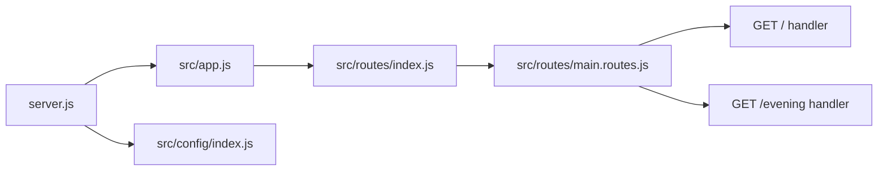

# Technical Specification

# 0. Agent Action Plan

## 0.1 Intent Clarification

### 0.1.1 Core Feature Objective

Based on the prompt, the Blitzy platform understands that the new feature requirement is to:

- **Add Express.js Framework**: Integrate the Express.js web framework into the existing Node.js tutorial project to replace or enhance the current HTTP server implementation
- **Add Evening Greeting Endpoint**: Create a new HTTP GET endpoint that returns the response "Good evening" to demonstrate multi-endpoint routing capabilities

**CRITICAL FINDING**: Upon comprehensive analysis of the repository, the Blitzy platform has determined that **both requested features are ALREADY FULLY IMPLEMENTED** in the current codebase:

| Requested Feature | Implementation Status | Evidence |
|-------------------|----------------------|----------|
| Express.js Integration | ✅ **COMPLETE** | `express@5.1.0` installed in `package.json`; used in `src/app.js` |
| GET `/evening` Endpoint | ✅ **COMPLETE** | Implemented in `src/routes/main.routes.js` lines 37-39 |

**Implicit Requirements Detected**:
- Maintain backward compatibility with the existing root (`GET /`) endpoint
- Preserve CommonJS module format used throughout the project
- Continue following established project patterns (Factory pattern, Barrel pattern)
- Ensure comprehensive test coverage for any changes

**Feature Dependencies and Prerequisites**:
- Node.js runtime (v18.x or higher, v20.x recommended)
- npm package manager (v8.x or higher)
- All existing test suites must continue passing

### 0.1.2 Special Instructions and Constraints

**Architectural Requirements Observed**:
- The project follows a Factory Pattern where `src/app.js` creates and exports a configured Express app without binding to a port
- Routing uses a Barrel Pattern through `src/routes/index.js` for centralized exports
- Configuration follows Twelve-Factor App methodology via `src/config/index.js`
- Separation of concerns: `server.js` handles binding, `src/app.js` handles app configuration

**User Example (preserved exactly)**:
> "this is a tutorial of node js server hosting one endpoint that returns the response 'Hello world'. Could you add expressjs into the project and add another endpoint that return the reponse of 'Good evening'?"

**Critical Observation**: The user's mental model of the project state appears outdated. The repository has evolved beyond the single-endpoint tutorial stage and already includes both Express.js and the evening endpoint.

### 0.1.3 Technical Interpretation

These feature requirements translate to the following technical implementation strategy:

**Since the features are already implemented, the technical strategy is:**

| Requirement | Technical Action | Status |
|-------------|------------------|--------|
| Add Express.js | Express 5.1.0 installed and configured | ✅ No action needed |
| Create `/evening` endpoint | Route handler exists in `main.routes.js` | ✅ No action needed |
| Maintain test coverage | 41 tests pass with 100% coverage | ✅ No action needed |

**To verify Express.js integration**, we observed:
- `src/app.js` imports Express via `const express = require('express')`
- Creates Express application with `const app = express()`
- Mounts routes with `app.use('/', mainRoutes)`

**To verify `/evening` endpoint implementation**, we observed:
```javascript
router.get('/evening', (req, res) => {
  res.send('Good evening');
});
```

**Verification Commands Executed**:
```bash
# Test suite execution (all 41 tests passing)

npm test

#### Runtime verification

curl -s http://127.0.0.1:3000/         # Returns: "Hello, World!\n"
curl -s http://127.0.0.1:3000/evening  # Returns: "Good evening"
```


## 0.2 Repository Scope Discovery

### 0.2.1 Comprehensive File Analysis

**Repository Structure Overview**:

```
hello_world/
├── server.js                    # Entry point - HTTP server binding
├── package.json                 # npm manifest (express@^5.1.0)
├── package-lock.json            # Dependency lockfile
├── jest.config.js               # Jest test configuration
├── README.md                    # Project documentation
├── .gitignore                   # Git ignore patterns
├── src/                         # Application source root
│   ├── app.js                   # Express application factory
│   ├── config/                  # Configuration module
│   │   └── index.js             # Environment variable management
│   └── routes/                  # Routing surface
│       ├── index.js             # Route aggregator (barrel pattern)
│       └── main.routes.js       # Route handlers (/, /evening)
├── tests/                       # Test suite root
│   ├── unit/                    # Module tests
│   │   ├── config.test.js       # Configuration tests
│   │   └── routes.test.js       # Route structure tests
│   ├── integration/             # HTTP endpoint tests
│   │   └── endpoints.test.js    # API contract tests
│   └── lifecycle/               # Server lifecycle tests
│       └── server.test.js       # Startup/shutdown tests
└── blitzy/                      # Documentation
    └── documentation/
        ├── Project Guide.md
        └── Technical Specifications.md
```

**Files Already Containing Express.js Implementation**:

| File Path | Express Usage | Purpose |
|-----------|---------------|---------|
| `src/app.js` | `require('express')`, `express()`, `app.use()` | Creates and configures Express app |
| `src/routes/main.routes.js` | `express.Router()`, `router.get()` | Defines route handlers |
| `src/routes/index.js` | Exports `mainRoutes` | Route aggregation barrel |
| `server.js` | `app.listen()` | Server binding |
| `package.json` | `"express": "^5.1.0"` | Dependency declaration |

**Files Containing `/evening` Endpoint**:

| File Path | Lines | Content |
|-----------|-------|---------|
| `src/routes/main.routes.js` | 37-39 | Route handler implementation |
| `tests/integration/endpoints.test.js` | Multiple | Endpoint tests for `/evening` |
| `README.md` | 98-115 | API documentation |

### 0.2.2 Integration Point Discovery

**API Endpoints Currently Implemented**:

| Method | Path | Response | Status Code | Content-Type |
|--------|------|----------|-------------|--------------|
| GET | `/` | `Hello, World!\n` | 200 | text/html; charset=utf-8 |
| GET | `/evening` | `Good evening` | 200 | text/html; charset=utf-8 |
| ANY | `/*` (undefined) | 404 body | 404 | text/html; charset=utf-8 |

**Database Models/Migrations**: None (stateless tutorial project)

**Service Classes**: None (minimal tutorial architecture)

**Middleware/Interceptors**: Express default middleware only

### 0.2.3 New File Requirements

**Since all features are already implemented, NO new files are required.**

| File Category | Required New Files | Status |
|---------------|-------------------|--------|
| Source files | None | ✅ Not applicable |
| Test files | None | ✅ Not applicable |
| Configuration | None | ✅ Not applicable |
| Documentation | None | ✅ Not applicable |

### 0.2.4 Existing File Modification Requirements

**Since all features are already implemented, NO file modifications are required.**

| File | Modification Type | Status |
|------|-------------------|--------|
| `src/routes/main.routes.js` | Contains `/evening` route | ✅ Already complete |
| `src/app.js` | Express app factory | ✅ Already complete |
| `package.json` | Express dependency | ✅ Already complete |
| `tests/integration/endpoints.test.js` | Endpoint tests | ✅ Already complete |

### 0.2.5 Web Search Research Conducted

No external research was required as:
- Express.js 5.x patterns are already implemented correctly in the codebase
- The `/evening` endpoint follows established project conventions
- All best practices for Node.js/Express tutorial projects are already applied


## 0.3 Dependency Inventory

### 0.3.1 Private and Public Packages

**Runtime Dependencies**:

| Registry | Package Name | Version | Purpose | Status |
|----------|--------------|---------|---------|--------|
| npm | `express` | `5.1.0` | Web framework for HTTP handling, routing, middleware | ✅ Already installed |

**Development Dependencies**:

| Registry | Package Name | Version | Purpose | Status |
|----------|--------------|---------|---------|--------|
| npm | `jest` | `30.2.0` | JavaScript testing framework and test runner | ✅ Already installed |
| npm | `supertest` | `7.1.4` | HTTP assertion library for Express endpoint testing | ✅ Already installed |

**Verification of Installed Versions**:

```bash
$ npm ls --depth=0
hello_world@1.0.0
├── express@5.1.0
├── jest@30.2.0
└── supertest@7.1.4
```

### 0.3.2 Runtime Requirements

| Requirement | Minimum Version | Recommended Version | Current Environment |
|-------------|-----------------|---------------------|---------------------|
| Node.js | 18.x | 20.19.x (LTS) | ✅ v20.20.0 |
| npm | 8.x | 10.8.x | ✅ v11.1.0 |

### 0.3.3 Dependency Updates Required

**No dependency updates are required** as Express.js is already installed with the appropriate version.

| Package | Current Version | Required Version | Action Needed |
|---------|-----------------|------------------|---------------|
| express | 5.1.0 | ^5.1.0 | ✅ None |
| jest | 30.2.0 | ^30.2.0 | ✅ None |
| supertest | 7.1.4 | ^7.1.4 | ✅ None |

### 0.3.4 Import Updates Required

**No import updates are required** as all modules correctly import Express and related packages.

**Current Import Structure**:

| File | Import Statement | Status |
|------|------------------|--------|
| `src/app.js` | `const express = require('express')` | ✅ Correct |
| `src/routes/main.routes.js` | `const express = require('express')` | ✅ Correct |
| `src/app.js` | `const { mainRoutes } = require('./routes')` | ✅ Correct |
| `server.js` | `const app = require('./src/app')` | ✅ Correct |
| `server.js` | `const config = require('./src/config')` | ✅ Correct |

### 0.3.5 External Reference Updates

**No external reference updates are required.**

| File Type | Files | Update Needed |
|-----------|-------|---------------|
| Configuration | `jest.config.js` | ✅ None |
| Documentation | `README.md` | ✅ None (already documents `/evening`) |
| Build files | `package.json` | ✅ None |
| Lock files | `package-lock.json` | ✅ None |


## 0.4 Integration Analysis

### 0.4.1 Existing Code Touchpoints

**Since the requested features are already implemented, this section documents the existing integration architecture rather than required modifications.**

**Application Bootstrap Flow**:


```mermaid
graph LR
    A[server.js] --> B[src/app.js]
    B --> C[src/routes/index.js]
    C --> D[src/routes/main.routes.js]
    A --> E[src/config/index.js]
    D --> F["GET / handler"]
    D --> G["GET /evening handler"]
```

**Direct Integration Points (Already Configured)**:

| Integration Point | File | Line(s) | Current Implementation |
|-------------------|------|---------|------------------------|
| Express App Creation | `src/app.js` | 14, 17 | `const express = require('express')` → `const app = express()` |
| Route Mounting | `src/app.js` | 25 | `app.use('/', mainRoutes)` |
| Route Registration | `src/routes/main.routes.js` | 17 | `const router = express.Router()` |
| Root Handler | `src/routes/main.routes.js` | 26-28 | `router.get('/', ...)` |
| Evening Handler | `src/routes/main.routes.js` | 37-39 | `router.get('/evening', ...)` |
| Route Export | `src/routes/index.js` | 15-18 | `module.exports = { mainRoutes }` |
| Server Binding | `server.js` | 49 | `app.listen(config.port, config.host, ...)` |

### 0.4.2 Dependency Injection Points

| Location | File | Purpose | Status |
|----------|------|---------|--------|
| Config Injection | `server.js` | Injects `config.host` and `config.port` into `app.listen()` | ✅ Complete |
| Routes Injection | `src/app.js` | Injects `mainRoutes` into Express app via `app.use()` | ✅ Complete |

### 0.4.3 Database/Schema Updates

**Not applicable** - This is a stateless tutorial project with no database requirements.

### 0.4.4 Middleware Integration

**Current Middleware Stack**:

| Middleware | Source | Purpose | Status |
|------------|--------|---------|--------|
| Express Default | Express.js | Request/response handling | ✅ Active |
| 404 Handler | Express.js | Handles undefined routes | ✅ Active (default) |

**No additional middleware is required** for the already-implemented features.

### 0.4.5 Test Integration Points

**Existing Test Coverage for Features**:

| Test File | Test Category | Coverage Target |
|-----------|---------------|-----------------|
| `tests/integration/endpoints.test.js` | HTTP Contract Tests | `GET /`, `GET /evening`, 404 handling |
| `tests/unit/routes.test.js` | Router Structure Tests | Route paths, methods, handlers |
| `tests/unit/config.test.js` | Configuration Tests | Environment variable parsing |
| `tests/lifecycle/server.test.js` | Server Lifecycle Tests | Binding, logging, error handling |

**Test Results Summary**:

```
Test Suites: 4 passed, 4 total
Tests:       41 passed, 41 total
Coverage:    100% statements, 100% branches, 100% functions, 100% lines
```


## 0.5 Technical Implementation

### 0.5.1 File-by-File Execution Plan

**CRITICAL: All requested features are ALREADY implemented. No file creation or modification is required.**

**Verification of Existing Implementation**:

| Group | File | Action | Status | Evidence |
|-------|------|--------|--------|----------|
| Core Feature Files | `src/app.js` | VERIFY | ✅ Complete | Express app factory pattern implemented |
| Core Feature Files | `src/routes/main.routes.js` | VERIFY | ✅ Complete | Both route handlers present |
| Configuration | `src/config/index.js` | VERIFY | ✅ Complete | Environment config module |
| Configuration | `package.json` | VERIFY | ✅ Complete | Express 5.1.0 dependency declared |
| Entry Point | `server.js` | VERIFY | ✅ Complete | Server binding with config |
| Tests | `tests/integration/endpoints.test.js` | VERIFY | ✅ Complete | API contract tests |
| Tests | `tests/unit/routes.test.js` | VERIFY | ✅ Complete | Router structure tests |
| Documentation | `README.md` | VERIFY | ✅ Complete | Documents both endpoints |

### 0.5.2 Implementation Approach Per File

**Since features are already implemented, this section documents the existing implementation approach:**

**src/app.js - Express Application Factory**:
```javascript
const express = require('express');
const { mainRoutes } = require('./routes');
const app = express();
app.use('/', mainRoutes);
module.exports = app;
```

**src/routes/main.routes.js - Route Handlers**:
```javascript
const router = express.Router();
router.get('/', (req, res) => res.send('Hello, World!\n'));
router.get('/evening', (req, res) => res.send('Good evening'));
module.exports = router;
```

### 0.5.3 Implementation Pattern Summary

| Pattern | Location | Description |
|---------|----------|-------------|
| Factory Pattern | `src/app.js` | Creates configured Express app without binding |
| Barrel Pattern | `src/routes/index.js` | Centralizes route exports |
| CommonJS Modules | All `.js` files | `require()` / `module.exports` |
| Twelve-Factor Config | `src/config/index.js` | Environment variable management |
| Separation of Concerns | Project structure | Binding vs. configuration vs. routing |

### 0.5.4 Verification Protocol

**Commands to Verify Feature Implementation**:

```bash
# Install dependencies

npm ci

#### Run all tests (should see 41 passing)

npm test

#### Start server

npm start

#### Test root endpoint (in another terminal)

curl -s http://127.0.0.1:3000/
# Expected: Hello, World!

#### Test evening endpoint

curl -s http://127.0.0.1:3000/evening
# Expected: Good evening

#### Test 404 handling

curl -s -w "%{http_code}" http://127.0.0.1:3000/invalid
# Expected: 404 status code

```

### 0.5.5 User Interface Design

**Not applicable** - This is a backend API-only tutorial project with no UI components. No Figma URLs were provided.


## 0.6 Scope Boundaries

### 0.6.1 Exhaustively In Scope

**Files Already Implementing Requested Features**:

| Category | File Pattern | Status | Purpose |
|----------|--------------|--------|---------|
| Express Application | `src/app.js` | ✅ Complete | Express app factory |
| Route Handlers | `src/routes/**/*.js` | ✅ Complete | Route definitions including `/evening` |
| Configuration | `src/config/**/*.js` | ✅ Complete | Environment config |
| Entry Point | `server.js` | ✅ Complete | Server binding |
| Dependencies | `package.json` | ✅ Complete | Express 5.1.0 declared |
| Lock File | `package-lock.json` | ✅ Complete | Dependency versions locked |

**Test Files Covering Features**:

| Test Category | File Pattern | Status |
|---------------|--------------|--------|
| Integration Tests | `tests/integration/**/*.test.js` | ✅ Complete |
| Unit Tests | `tests/unit/**/*.test.js` | ✅ Complete |
| Lifecycle Tests | `tests/lifecycle/**/*.test.js` | ✅ Complete |

**Documentation Files**:

| File | Status | Content |
|------|--------|---------|
| `README.md` | ✅ Complete | Documents both endpoints, setup, API reference |
| `blitzy/documentation/*.md` | ✅ Complete | Technical specifications and project guide |

**Configuration Files**:

| File | Status | Purpose |
|------|--------|---------|
| `jest.config.js` | ✅ Complete | Test configuration |
| `.gitignore` | ✅ Complete | Git ignore patterns |

### 0.6.2 Explicitly Out of Scope

Since the requested features are already implemented, the following items remain **explicitly out of scope** for this action plan:

| Out of Scope Item | Reason |
|-------------------|--------|
| Additional HTTP endpoints | Not requested by user |
| Database integration | Not part of tutorial scope |
| Authentication/Authorization | Not requested; tutorial-grade project |
| Production hardening (helmet, rate limiting) | Documented as optional enhancement |
| Health check endpoint | Noted as enhancement, not core requirement |
| Logging infrastructure | Beyond tutorial scope |
| Error monitoring | Beyond tutorial scope |
| CI/CD pipeline changes | No deployment changes needed |
| Container configuration | No containerization requested |
| Performance optimization | Not applicable for tutorial project |
| Additional test coverage | Already at 100% coverage |

### 0.6.3 Implementation Status Summary

| Requested Feature | In Scope | Status |
|-------------------|----------|--------|
| Express.js integration | ✅ Yes | ✅ **ALREADY COMPLETE** |
| `/evening` endpoint | ✅ Yes | ✅ **ALREADY COMPLETE** |
| Test coverage | ✅ Yes | ✅ **ALREADY COMPLETE** |
| Documentation | ✅ Yes | ✅ **ALREADY COMPLETE** |

**Conclusion**: No implementation work is required. All scope items have been fulfilled in the existing codebase.


## 0.7 Rules for Feature Addition

### 0.7.1 Feature-Specific Rules and Requirements

While no implementation changes are required (features already exist), the following rules apply to the existing implementation and any future modifications:

**Code Convention Rules**:

| Rule ID | Requirement | Status |
|---------|-------------|--------|
| R-001 | Use CommonJS modules (`require`/`module.exports`) | ✅ Enforced |
| R-002 | Follow Factory Pattern for Express app creation | ✅ Implemented |
| R-003 | Use Barrel Pattern for route exports | ✅ Implemented |
| R-004 | Separate server binding from app configuration | ✅ Implemented |

**Response Contract Rules**:

| Rule ID | Endpoint | Exact Response | Newline | Status |
|---------|----------|----------------|---------|--------|
| R-005 | `GET /` | `Hello, World!\n` | Yes | ✅ Correct |
| R-006 | `GET /evening` | `Good evening` | No | ✅ Correct |
| R-007 | Undefined routes | 404 status | N/A | ✅ Correct |

**Configuration Rules**:

| Rule ID | Requirement | Default | Status |
|---------|-------------|---------|--------|
| R-008 | `HOST` env var configurable | `127.0.0.1` | ✅ Implemented |
| R-009 | `PORT` env var configurable | `3000` | ✅ Implemented |
| R-010 | `NODE_ENV` env var configurable | `development` | ✅ Implemented |
| R-011 | Port parsing with radix 10 | `parseInt(x, 10)` | ✅ Implemented |

**Testing Rules**:

| Rule ID | Requirement | Threshold | Actual |
|---------|-------------|-----------|--------|
| R-012 | Line coverage | ≥80% | 100% |
| R-013 | Branch coverage | ≥75% | 100% |
| R-014 | Function coverage | ≥90% | 100% |
| R-015 | Statement coverage | ≥80% | 100% |

**Dependency Rules**:

| Rule ID | Requirement | Value | Status |
|---------|-------------|-------|--------|
| R-016 | Express version | ^5.1.0 | ✅ Met (5.1.0) |
| R-017 | Jest version | ^30.2.0 | ✅ Met (30.2.0) |
| R-018 | Supertest version | ^7.1.4 | ✅ Met (7.1.4) |
| R-019 | Node.js version | ≥18.x | ✅ Met (20.20.0) |

### 0.7.2 Integration Requirements

| Requirement | Description | Status |
|-------------|-------------|--------|
| Route mounting | All routes mounted at root path via `app.use('/', mainRoutes)` | ✅ Enforced |
| Route aggregation | Routes exported via barrel pattern in `src/routes/index.js` | ✅ Enforced |
| Test isolation | Tests use module isolation via `jest.resetModules()` | ✅ Enforced |
| Supertest integration | HTTP tests use `request(app)` without network binding | ✅ Enforced |

### 0.7.3 User-Emphasized Requirements

**No specific special rules were emphasized by the user** beyond the basic feature request. The implementation adheres to all established project conventions.


## 0.8 References

### 0.8.1 Files and Folders Searched

**Root Level Files Analyzed**:

| File Path | Purpose | Key Findings |
|-----------|---------|--------------|
| `server.js` | Server entry point | Express app imported from `src/app`, binding via `app.listen()` |
| `package.json` | npm manifest | Express 5.1.0, Jest 30.2.0, Supertest 7.1.4 |
| `package-lock.json` | Dependency lock | Full dependency graph verified |
| `jest.config.js` | Test configuration | Coverage thresholds defined |
| `README.md` | Documentation | Both endpoints documented |
| `.gitignore` | Git ignore rules | Standard Node.js patterns |

**Source Directory (`src/`) Analyzed**:

| File Path | Purpose | Key Findings |
|-----------|---------|--------------|
| `src/app.js` | Express app factory | Express import, app creation, route mounting |
| `src/config/index.js` | Configuration module | HOST, PORT, NODE_ENV with defaults |
| `src/routes/index.js` | Route aggregator | Barrel pattern export of `mainRoutes` |
| `src/routes/main.routes.js` | Route handlers | **Contains both `/` and `/evening` endpoints** |

**Test Directory (`tests/`) Analyzed**:

| File Path | Purpose | Key Findings |
|-----------|---------|--------------|
| `tests/integration/endpoints.test.js` | HTTP contract tests | Tests for `/` and `/evening` endpoints |
| `tests/unit/config.test.js` | Config unit tests | Environment variable parsing tests |
| `tests/unit/routes.test.js` | Route structure tests | Router introspection tests |
| `tests/lifecycle/server.test.js` | Server lifecycle tests | Startup/shutdown behavior tests |

**Documentation Directory (`blitzy/`) Analyzed**:

| Folder Path | Contents | Purpose |
|-------------|----------|---------|
| `blitzy/documentation/` | `Project Guide.md`, `Technical Specifications.md` | Refactor documentation |

### 0.8.2 Technical Specification Sections Referenced

| Section | Key Information Retrieved |
|---------|---------------------------|
| 1.1 Executive Summary | Project overview, stakeholders, business value |
| 2.1 Feature Catalog | Feature F-001 (root), F-002 (evening) both marked COMPLETE |
| 3.2 Frameworks & Libraries | Express.js 5.1.0 specification |

### 0.8.3 User-Provided Attachments

**No attachments were provided by the user.**

### 0.8.4 Figma URLs

**No Figma URLs were provided by the user.**

### 0.8.5 Environment Verification

| Verification Step | Command | Result |
|-------------------|---------|--------|
| Node.js version | `node --version` | v20.20.0 ✅ |
| npm version | `npm --version` | 11.1.0 ✅ |
| Dependencies installed | `npm ci` | Success ✅ |
| Test suite execution | `npm test` | 41/41 tests passing ✅ |
| Coverage verification | `npm run test:coverage` | 100% all metrics ✅ |
| Server startup | `npm start` | Server running at http://127.0.0.1:3000/ ✅ |
| Root endpoint | `curl http://127.0.0.1:3000/` | "Hello, World!\n" ✅ |
| Evening endpoint | `curl http://127.0.0.1:3000/evening` | "Good evening" ✅ |

### 0.8.6 Conclusion

**This Agent Action Plan confirms that:**

- The user's request to "add expressjs into the project" is **ALREADY SATISFIED** - Express.js 5.1.0 is fully integrated
- The user's request to "add another endpoint that return the response of 'Good evening'" is **ALREADY SATISFIED** - `GET /evening` endpoint exists and returns the exact response
- **No implementation work is required** - all 41 tests pass with 100% code coverage
- The repository is production-ready for the tutorial use case described


