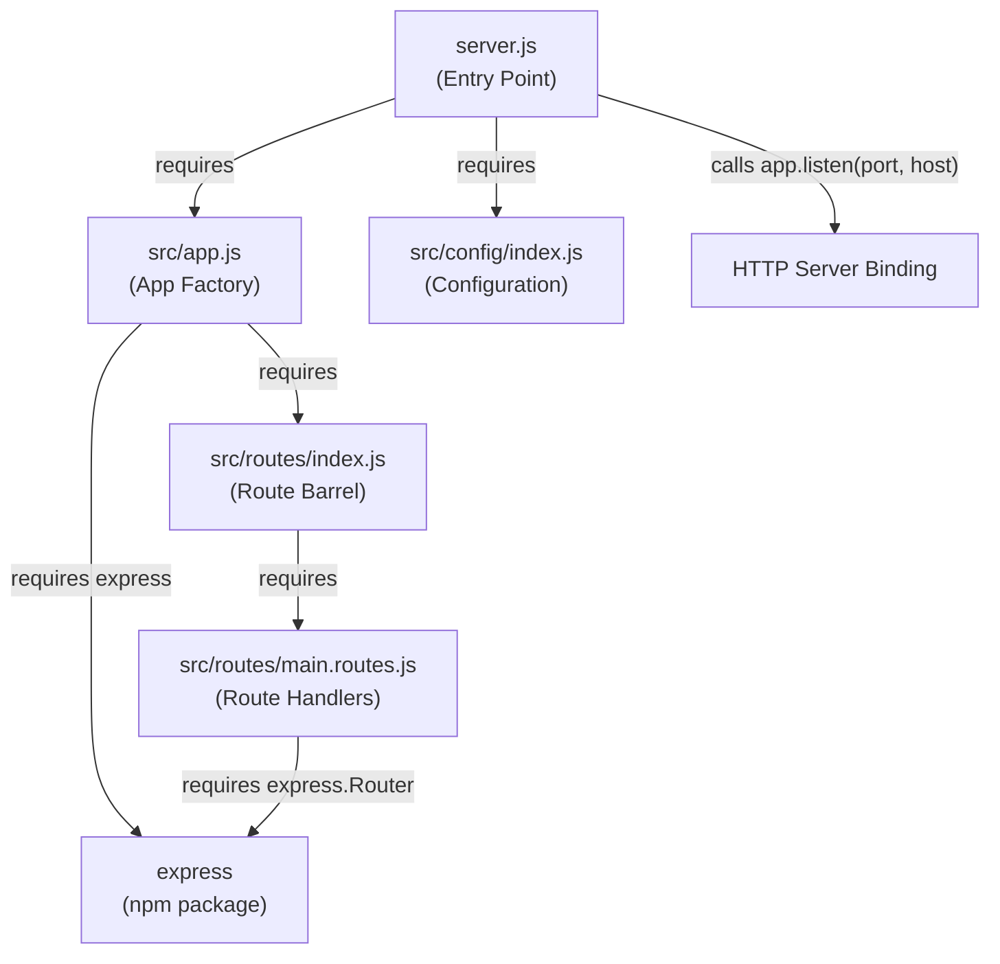
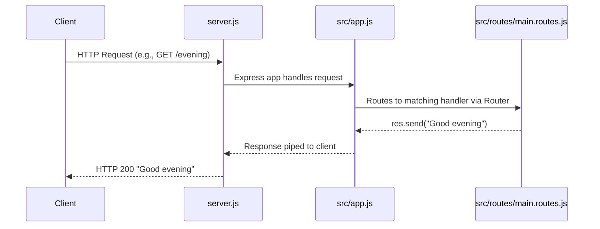

# Technical Specification

# 0. Agent Action Plan

## 0.1 Intent Clarification

### 0.1.1 Core Feature Objective

Based on the prompt, the Blitzy platform understands that the new feature requirement is to transform an existing bare-bones Node.js HTTP tutorial server into a modern Express.js-powered application and extend its HTTP surface with an additional greeting endpoint. Specifically, the two requirements are:

- **REQ-001 — Integrate Express.js Framework:** Replace or augment the existing Node.js HTTP server implementation with the Express.js web framework, introducing structured routing, middleware support, and the Express application lifecycle while preserving the original `GET /` endpoint that returns the `"Hello, World!\n"` response.
- **REQ-002 — Add Evening Greeting Endpoint:** Create a new `GET /evening` HTTP endpoint that returns the exact plain-text response `"Good evening"` (no trailing newline), following the same response contract conventions as the existing root endpoint (HTTP 200, `Content-Type: text/html; charset=utf-8`).

**Implicit requirements detected:**

- The original `GET /` endpoint must remain fully backward-compatible — same response body (`"Hello, World!\n"` with trailing newline), same HTTP status 200, and same Content-Type header behavior
- The Express.js integration must follow a modular architecture suitable for a tutorial context — separating app creation from server binding to support testability
- A comprehensive test suite must validate both endpoints, error handling (404 for undefined routes), and server lifecycle behavior
- Project documentation (README, inline JSDoc, module READMEs) must be updated to reflect the new framework and endpoint
- Configuration management must be externalized using environment variables following Twelve-Factor App methodology

### 0.1.2 Special Instructions and Constraints

- **Tutorial Context Constraint:** The project serves as an educational Node.js/Express.js reference; all changes must prioritize clarity, simplicity, and pedagogical value over enterprise-scale patterns
- **Backward Compatibility:** The existing `GET /` → `"Hello, World!\n"` behavior must be preserved exactly, including the trailing newline character
- **Single Production Dependency:** Express.js must be the sole runtime dependency to maintain a minimal attack surface and straightforward dependency tree
- **CommonJS Module System:** All source files must use `require`/`module.exports` (no ES Modules), enforcing consistency with the established Node.js tutorial convention
- **Strict Mode:** Entry points must include the `'use strict'` directive

No user-provided examples, Figma URLs, or external attachments were supplied with this request.

### 0.1.3 Technical Interpretation

These feature requirements translate to the following technical implementation strategy:

- To **integrate Express.js**, we will add `express` as a production dependency in `package.json`, create an application factory module (`src/app.js`) using the Express `express()` constructor, and restructure `server.js` to import the configured app and bind it to the network interface via `app.listen()`
- To **add the evening endpoint**, we will create an Express `Router` in `src/routes/main.routes.js` that registers both `GET /` and `GET /evening` handlers, aggregate the router through a barrel export in `src/routes/index.js`, and mount it at the root path in `src/app.js`
- To **support testability**, we will separate app creation (in `src/app.js`) from server binding (in `server.js`), enabling Supertest-based integration tests to import the Express app directly without starting a live HTTP server
- To **externalize configuration**, we will create `src/config/index.js` to export `{ host, port, env }` derived from `process.env` with sensible defaults (`127.0.0.1`, `3000`, `development`)
- To **ensure quality**, we will implement a layered test suite using Jest and Supertest covering unit tests (config parsing, router structure), integration tests (HTTP response contracts), and lifecycle tests (server startup/shutdown behavior)

## 0.2 Repository Scope Discovery

### 0.2.1 Comprehensive File Analysis

The complete repository tree was inspected to a depth of four levels. Every file was evaluated for relevance to the Express.js integration and evening endpoint feature. The following table provides an exhaustive inventory of all existing files that require modification and their specific role in the feature implementation.

**Existing Files Requiring Modification:**

| File Path | Current Purpose | Required Modification |
|---|---|---|
| `server.js` | Node.js HTTP server entry point (raw `http.createServer`) | Replace native HTTP server with Express app import; bind via `app.listen()` using externalized `config.host` and `config.port` |
| `package.json` | Project manifest with `name`, `version`, `scripts` | Add `express` to `dependencies`; add `jest` and `supertest` to `devDependencies`; add `test` and `start` scripts; set `engines.node` to `>=18.0.0` |
| `README.md` | Minimal project documentation | Rewrite to document Express.js architecture, both endpoints, project structure, scripts, configuration, and testing instructions |
| `.gitignore` | Git exclusion patterns | Update to cover `node_modules/`, `coverage/`, `.env`, IDE files, OS artifacts, logs, and build artifacts |

**New Source Files to Create:**

| File Path | Purpose |
|---|---|
| `src/app.js` | Express application factory — creates and configures the Express app, mounts routes, and exports the app instance without calling `listen()` |
| `src/routes/index.js` | Route barrel aggregator — imports all route modules and exports a single `configureRoutes(app)` function for centralized route registration |
| `src/routes/main.routes.js` | Main route handlers — defines an Express `Router` with `GET /` (Hello World) and `GET /evening` (Good evening) endpoint handlers |
| `src/config/index.js` | Configuration module — exports `{ host, port, env }` synchronously from `process.env` with defaults: `127.0.0.1`, `3000`, `development` |
| `src/README.md` | Source directory documentation — describes the App Factory pattern, module relationships, and extension patterns |
| `src/routes/README.md` | Routing documentation — describes route structure, barrel pattern, and instructions for adding new endpoints |
| `src/config/README.md` | Configuration documentation — describes supported environment variables and default values |

**New Test Files to Create:**

| File Path | Purpose |
|---|---|
| `tests/unit/config.test.js` | Unit tests for `src/config/index.js` — validates default values and environment variable overrides for `HOST`, `PORT`, `NODE_ENV` |
| `tests/unit/routes.test.js` | Unit tests for `src/routes/` — validates router structure, that `configureRoutes` is a function, and that all route modules export Express Routers |
| `tests/integration/endpoints.test.js` | Integration tests using Supertest — validates HTTP response contracts for `GET /` (200, "Hello, World!\n"), `GET /evening` (200, "Good evening"), and `GET /unknown` (404) |
| `tests/lifecycle/server.test.js` | Server lifecycle tests — validates that `server.js` starts listening on the configured port, responds to requests, and shuts down cleanly via `server.close()` |
| `tests/README.md` | Test suite documentation — describes test layers (unit, integration, lifecycle), coverage thresholds, and execution instructions |

**New Configuration Files to Create:**

| File Path | Purpose |
|---|---|
| `jest.config.js` | Jest test framework configuration — sets `testEnvironment: 'node'`, `collectCoverage: true`, `coverageThreshold` at 80% global, and `testMatch` for `tests/**/*.test.js` |
| `package-lock.json` | Auto-generated npm lockfile — created via `npm install` to pin exact dependency versions for reproducible builds |

### 0.2.2 Integration Point Discovery

The following integration points must be wired together to deliver the complete feature:

- **Route Registration Chain:** `server.js` → imports `src/app.js` → calls `configureRoutes(app)` from `src/routes/index.js` → mounts `mainRouter` from `src/routes/main.routes.js` at the root path
- **Configuration Injection:** `server.js` imports `{ host, port }` from `src/config/index.js` and passes them to `app.listen(port, host, callback)`
- **Test Isolation Boundary:** `tests/integration/endpoints.test.js` imports `src/app.js` directly (not `server.js`) to create Supertest agents without starting a live HTTP listener; `tests/lifecycle/server.test.js` imports `server.js` to test actual network binding
- **404 Error Handling:** Express's default behavior returns a 404 response for unmounted routes — no custom middleware is required, but integration tests must validate this contract
- **Script Entry Points:** `package.json` defines `"start": "node server.js"` and `"test": "jest --coverage --forceExit --detectOpenHandles"` as the primary developer-facing commands

### 0.2.3 Web Search Research Conducted

- **Express.js 5.1.0 Validation:** Confirmed that Express.js 5.1.0 is a valid, stable release now tagged as `latest` on npm, requiring Node.js 18 or higher. It introduces native async error handling and modern route matching.
- **Jest 30.2.0 Validation:** Confirmed that Jest 30.2.0 is the current latest version on npm, requiring Node.js 18.x minimum. It delivers improved performance and module resolution via `unrs-resolver`.
- **Express.js Application Factory Pattern:** The separation of app creation from server binding is a well-established Express.js best practice that enables direct Supertest-based testing without network I/O overhead.

## 0.3 Dependency Inventory

### 0.3.1 Private and Public Packages

All packages were verified against the project's `package.json` and `package-lock.json` manifests. No private registries are used; all dependencies are sourced from the public npm registry.

| Registry | Package | Version | Type | Purpose |
|---|---|---|---|---|
| npm (public) | `express` | `^5.1.0` | Production | Web framework — provides HTTP routing, middleware pipeline, request/response abstraction, and application lifecycle management |
| npm (public) | `jest` | `^30.2.0` | Development | Test framework — provides test runner, assertion library, mocking utilities, coverage collection, and `--forceExit`/`--detectOpenHandles` flags for server-based tests |
| npm (public) | `supertest` | `^7.1.4` | Development | HTTP assertion library — enables in-process HTTP request testing against Express app instances without network binding |

**Runtime Environment:**

| Component | Version | Source |
|---|---|---|
| Node.js | `>=18.0.0` (recommended `20.19.x` LTS, installed `20.20.0`) | `package.json` → `engines.node` field |
| npm | `11.1.0` | System-installed package manager |

### 0.3.2 Dependency Updates

**Import Updates:**

Files requiring new `require()` statements to wire the feature together:

| File Pattern | Import Transformation | Applies To |
|---|---|---|
| `server.js` | Add: `const app = require('./src/app');` and `const config = require('./src/config');` | Entry point — replaces raw `http.createServer` with Express app import |
| `src/app.js` | Add: `const express = require('express');` and `const { configureRoutes } = require('./routes');` | App factory — creates the Express application and mounts routes |
| `src/routes/main.routes.js` | Add: `const express = require('express');` then `const router = express.Router();` | Route definitions — uses Express Router for handler registration |
| `src/routes/index.js` | Add: `const mainRouter = require('./main.routes');` | Barrel export — aggregates route modules for centralized mounting |
| `tests/integration/endpoints.test.js` | Add: `const request = require('supertest');` and `const app = require('../../src/app');` | Integration tests — creates Supertest agent from the app factory |
| `tests/lifecycle/server.test.js` | Add: `const http = require('http');` and `const config = require('../../src/config');` | Lifecycle tests — validates server start/stop behavior |
| `tests/unit/config.test.js` | Add: `const config = require('../../src/config');` | Config unit tests — validates environment variable parsing |
| `tests/unit/routes.test.js` | Add: `const { configureRoutes } = require('../../src/routes');` and `const mainRouter = require('../../src/routes/main.routes');` | Route unit tests — validates router structure and exports |

**External Reference Updates:**

| File | Update Required |
|---|---|
| `package.json` | Add `dependencies.express`, `devDependencies.jest`, `devDependencies.supertest`, `scripts.test`, `scripts.start`, `engines.node` |
| `jest.config.js` | New file — configures test environment, coverage thresholds, and test file patterns |
| `README.md` | Rewrite to document Express-based architecture, endpoint catalog, installation steps, and testing instructions |
| `.gitignore` | Expand to cover `node_modules/`, `coverage/`, `.env`, editor artifacts, OS files, and build outputs |

## 0.4 Integration Analysis

### 0.4.1 Existing Code Touchpoints

The feature requires direct modifications to the following existing files, with each touchpoint precisely identified:

**Direct Modifications Required:**

- **`server.js` (complete rewrite):** The existing file uses raw `http.createServer` with an inline request handler. This must be entirely replaced with an Express-based server that imports the app factory from `src/app.js`, reads `host` and `port` from `src/config/index.js`, and binds the server via `app.listen()`. The module must export the `server` instance (the return value of `app.listen()`) to enable lifecycle testing with `server.close()`.
- **`package.json` (structural additions):** The `dependencies` block must be added with `express: "^5.1.0"`. The `devDependencies` block must be added with `jest: "^30.2.0"` and `supertest: "^7.1.4"`. The `scripts` block must include `"start": "node server.js"` and `"test": "jest --coverage --forceExit --detectOpenHandles"`. An `engines` field must specify `"node": ">=18.0.0"`.
- **`README.md` (full rewrite):** Must be updated to describe the Express.js-powered architecture, both endpoints (`GET /` and `GET /evening`), the modular project structure, environment configuration options, and testing commands.
- **`.gitignore` (expansion):** Must be extended from a minimal file to comprehensively cover `node_modules/`, `coverage/`, `.env`, editor/IDE directories, OS-specific files, and log files.

### 0.4.2 Dependency Injection and Wiring

The application's module dependency graph follows a strict top-down flow with no circular references:

```mermaid
graph TD
    A["server.js<br/>(Entry Point)"] -->|"requires"| B["src/app.js<br/>(App Factory)"]
    A -->|"requires"| C["src/config/index.js<br/>(Configuration)"]
    B -->|"requires"| D["src/routes/index.js<br/>(Route Barrel)"]
    B -->|"requires express"| E["express<br/>(npm package)"]
    D -->|"requires"| F["src/routes/main.routes.js<br/>(Route Handlers)"]
    F -->|"requires express.Router"| E
    A -->|"calls app.listen(port, host)"| G["HTTP Server Binding"]
```

Key wiring decisions:

- **`src/app.js`** acts as the composition root — it instantiates the Express app, delegates route mounting to `configureRoutes(app)`, and exports the configured app without listening
- **`src/routes/index.js`** exports `configureRoutes(app)` which calls `app.use('/', mainRouter)` — this barrel pattern means new route modules can be added without modifying `app.js`
- **`src/config/index.js`** performs synchronous reads from `process.env` at module load time, making configuration available immediately via `require()` without async initialization

### 0.4.3 Request Processing Pipeline

Each incoming HTTP request follows this path through the application:

```mermaid
sequenceDiagram
    participant C as Client
    participant S as server.js
    participant A as src/app.js
    participant R as src/routes/main.routes.js

    C->>S: HTTP Request (e.g., GET /evening)
    S->>A: Express app handles request
    A->>R: Routes to matching handler via Router
    R-->>A: res.send("Good evening")
    A-->>S: Response piped to client
    S-->>C: HTTP 200 "Good evening"
```

- `GET /` → matched by `mainRouter.get('/')` → responds with `"Hello, World!\n"` (200 OK)
- `GET /evening` → matched by `mainRouter.get('/evening')` → responds with `"Good evening"` (200 OK)
- `GET /anything-else` → no route match → Express default 404 handler returns HTML error page (404 Not Found)

### 0.4.4 Test Isolation Architecture

The separation of `src/app.js` (app factory) from `server.js` (server binding) creates two distinct test entry points:

- **Integration tests** import `src/app.js` directly and pass it to `supertest(app)` — this creates an ephemeral HTTP listener per test, avoiding port conflicts and enabling parallel test execution
- **Lifecycle tests** import `server.js` directly, which calls `app.listen()` on the configured port — these tests validate real network binding, server startup console output, and graceful shutdown via `server.close()`
- **Unit tests** import individual modules (`src/config/index.js`, `src/routes/*`) in isolation to validate their internal contracts without HTTP transport

## 0.5 Technical Implementation

### 0.5.1 File-by-File Execution Plan

Every file listed below MUST be created or modified. Files are organized into execution groups reflecting their dependency order — foundational modules are built before consumers.

**Group 1 — Configuration and Foundation:**

- **CREATE `src/config/index.js`** — Implement synchronous configuration module that reads `HOST`, `PORT`, and `NODE_ENV` from `process.env` with defaults `127.0.0.1`, `3000`, and `development` respectively. Export a frozen object `{ host, port, env }` where `port` is coerced to a number via `parseInt()`.
- **CREATE `src/config/README.md`** — Document environment variable names, types, defaults, and override examples.

**Group 2 — Route Definitions:**

- **CREATE `src/routes/main.routes.js`** — Define an Express `Router` with two route handlers: `router.get('/', handler)` returning `"Hello, World!\n"` via `res.send()`, and `router.get('/evening', handler)` returning `"Good evening"` via `res.send()`. Export the router instance.
- **CREATE `src/routes/index.js`** — Import `mainRouter` from `./main.routes`, export `configureRoutes(app)` function that calls `app.use('/', mainRouter)`. This barrel pattern enables future route additions without modifying the app factory.
- **CREATE `src/routes/README.md`** — Document routing architecture, barrel aggregation pattern, and step-by-step guide for adding new endpoints.

**Group 3 — Application Factory:**

- **CREATE `src/app.js`** — Implement Express application factory: call `express()` to create the app, invoke `configureRoutes(app)` to mount all routes, and export the configured app instance. No `app.listen()` call — the factory pattern keeps the app testable without network I/O.
- **CREATE `src/README.md`** — Document the App Factory pattern, module dependency graph, and extension patterns.

**Group 4 — Server Entry Point:**

- **MODIFY `server.js`** — Complete rewrite: import `app` from `./src/app` and `config` from `./src/config`, bind the server via `const server = app.listen(config.port, config.host, callback)`, log the startup message to `console.log`, and export `module.exports = server` for lifecycle testing.

**Group 5 — Project Configuration:**

- **MODIFY `package.json`** — Add `dependencies: { "express": "^5.1.0" }`, `devDependencies: { "jest": "^30.2.0", "supertest": "^7.1.4" }`, `scripts: { "start": "node server.js", "test": "jest --coverage --forceExit --detectOpenHandles" }`, and `engines: { "node": ">=18.0.0" }`.
- **CREATE `jest.config.js`** — Configure Jest with `testEnvironment: 'node'`, `roots: ['<rootDir>/tests']`, `testMatch: ['**/*.test.js']`, `collectCoverage: true`, and `coverageThreshold: { global: { branches: 80, functions: 80, lines: 80, statements: 80 } }`.
- **MODIFY `.gitignore`** — Expand to cover `node_modules/`, `coverage/`, `.env`, editor files (`*.swp`, `.vscode/`, `.idea/`), OS files (`.DS_Store`, `Thumbs.db`), and runtime artifacts (`*.log`).

**Group 6 — Test Suite:**

- **CREATE `tests/unit/config.test.js`** — Test default config values, environment variable overrides (`HOST`, `PORT`, `NODE_ENV`), and port number coercion. Use `jest.resetModules()` and direct `process.env` manipulation per test.
- **CREATE `tests/unit/routes.test.js`** — Test that `configureRoutes` is a function, `mainRouter` is an Express Router instance, and the router stack contains exactly the expected route definitions.
- **CREATE `tests/integration/endpoints.test.js`** — Use Supertest to validate: `GET /` returns 200 with body `"Hello, World!\n"`, `GET /evening` returns 200 with body `"Good evening"`, and `GET /nonexistent` returns 404.
- **CREATE `tests/lifecycle/server.test.js`** — Validate that `server.js` exports a server instance, the server listens on the configured port, HTTP requests succeed through the live server, and `server.close()` shuts down cleanly.
- **CREATE `tests/README.md`** — Document test suite organization, coverage thresholds, and execution instructions.

**Group 7 — Documentation:**

- **MODIFY `README.md`** — Full rewrite documenting project purpose, Express.js architecture, endpoint catalog, project structure tree, installation steps, environment variables, testing commands, and usage examples.

### 0.5.2 Implementation Approach per File

The implementation follows a bottom-up dependency order to ensure each module can be validated independently before integration:

- **Establish feature foundation** by creating the configuration module (`src/config/`) first, since it has no internal dependencies and provides the `host`/`port`/`env` values consumed by the server entry point
- **Define the HTTP surface** by creating route handlers (`src/routes/main.routes.js`) and the route aggregator (`src/routes/index.js`), establishing the complete URL-to-handler mapping
- **Compose the application** by creating the app factory (`src/app.js`) that wires Express, routes, and configuration into a single testable unit
- **Bind to the network** by rewriting `server.js` to import the composed app and listen on the configured interface
- **Validate correctness** by implementing the layered test suite — unit tests verify module contracts, integration tests verify HTTP semantics, and lifecycle tests verify runtime behavior
- **Complete documentation** by updating all README files and inline documentation to accurately reflect the delivered architecture

### 0.5.3 User Interface Design

No user interface components are applicable to this feature. The project is a headless HTTP API server with no browser-facing views, templates, or static assets. No Figma screens or UI design references were provided.

## 0.6 Scope Boundaries

### 0.6.1 Exhaustively In Scope

The following is the complete inventory of every file and pattern that falls within the scope of this feature addition. Trailing wildcards denote directory-level patterns.

**Application Source Files:**

- `src/app.js` — Express application factory (CREATE)
- `src/config/index.js` — Environment configuration module (CREATE)
- `src/routes/index.js` — Route barrel aggregator (CREATE)
- `src/routes/main.routes.js` — Route handler definitions for `GET /` and `GET /evening` (CREATE)

**Entry Point:**

- `server.js` — Server binding and startup logic (MODIFY — full rewrite)

**Test Files:**

- `tests/unit/config.test.js` — Configuration module unit tests (CREATE)
- `tests/unit/routes.test.js` — Route structure unit tests (CREATE)
- `tests/integration/endpoints.test.js` — HTTP endpoint contract tests via Supertest (CREATE)
- `tests/lifecycle/server.test.js` — Server startup/shutdown lifecycle tests (CREATE)

**Configuration Files:**

- `package.json` — Dependency manifest, scripts, and engine constraints (MODIFY)
- `package-lock.json` — Auto-generated dependency lockfile (GENERATED)
- `jest.config.js` — Test framework configuration (CREATE)
- `.gitignore` — Version control exclusion patterns (MODIFY)

**Documentation Files:**

- `README.md` — Project-level documentation (MODIFY — full rewrite)
- `src/README.md` — Source directory architecture docs (CREATE)
- `src/routes/README.md` — Routing module documentation (CREATE)
- `src/config/README.md` — Configuration module documentation (CREATE)
- `tests/README.md` — Test suite documentation (CREATE)

**Summary Totals:**

| Action | Count |
|---|---|
| Files to CREATE | 13 |
| Files to MODIFY | 4 |
| Files AUTO-GENERATED | 1 |
| **Total files in scope** | **18** |

### 0.6.2 Explicitly Out of Scope

The following items are explicitly excluded from this feature addition and must not be implemented:

- **Database integration** — No database, ORM, migrations, or persistent storage of any kind
- **Authentication and authorization** — No JWT, session management, OAuth, or access control middleware
- **Custom error-handling middleware** — Express's default 404 and error handlers are sufficient; no custom error middleware
- **Request body parsing** — Neither endpoint accepts request bodies; no `express.json()` or `express.urlencoded()` middleware
- **CORS middleware** — Not required for a single-host tutorial server
- **Logging middleware** — No Morgan, Winston, or structured logging; only basic `console.log` for startup messages
- **HTTPS/TLS configuration** — The server binds to plain HTTP only
- **Containerization** — No Dockerfile, docker-compose, or container orchestration files
- **CI/CD pipelines** — No GitHub Actions, GitLab CI, or other pipeline configurations
- **TypeScript migration** — All code remains in plain JavaScript with CommonJS modules
- **ES Module syntax** — No `import`/`export` statements; strictly `require()`/`module.exports`
- **Performance optimization** — No caching, compression, rate limiting, or load balancing
- **Additional endpoints** beyond `GET /` and `GET /evening`
- **Refactoring of code** unrelated to Express.js integration or the evening endpoint
- **The `blitzy/` documentation directory** — This folder contains project guide and technical specification metadata managed externally and is not modified by feature implementation

## 0.7 Rules for Feature Addition

The following rules govern all implementation decisions for this feature addition. These rules are derived from the user's request context (a tutorial project), the established repository conventions, and Express.js best practices.

### 0.7.1 Architectural Rules

- **App Factory Pattern Required:** The Express application must be created in `src/app.js` and exported without calling `listen()`. Server binding must occur exclusively in `server.js`. This separation is non-negotiable — it enables Supertest-based testing.
- **Barrel Export Pattern for Routes:** All route modules must be aggregated through `src/routes/index.js` via a `configureRoutes(app)` function. Individual route files must never be imported directly by `src/app.js`.
- **Synchronous Configuration:** `src/config/index.js` must export configuration values synchronously at `require()` time. No async initialization, no Promises, no callback-based config loading.
- **Single-Level Module Nesting:** The `src/` directory uses at most one level of nesting (`src/routes/`, `src/config/`). No deeper hierarchies for this tutorial-scope project.

### 0.7.2 Code Convention Rules

- **Strict Mode:** Every JavaScript file must include `'use strict';` as its first statement.
- **CommonJS Modules:** All imports use `require()` and all exports use `module.exports`. No ES Module syntax (`import`/`export`).
- **No Transpilation:** Code runs directly on Node.js without Babel, TypeScript, or any build step.
- **Naming Conventions:** Route files follow the `[domain].routes.js` naming convention. Test files follow the `[subject].test.js` convention. Configuration files are named `index.js` within their directory.

### 0.7.3 Response Contract Rules

- **`GET /` Endpoint:** Must return HTTP 200 with the exact body string `"Hello, World!\n"` (including trailing newline). Content-Type must be `text/html; charset=utf-8` (Express default for `res.send()` with string argument).
- **`GET /evening` Endpoint:** Must return HTTP 200 with the exact body string `"Good evening"` (no trailing newline). Same Content-Type as above.
- **Undefined Routes:** Must return HTTP 404. The default Express 404 handler is sufficient.

### 0.7.4 Testing Rules

- **100% Functional Coverage:** Every route handler, configuration value, and lifecycle event must have at least one corresponding test assertion.
- **Coverage Thresholds:** Jest is configured with 80% minimum thresholds for branches, functions, lines, and statements globally.
- **Test Isolation:** Each test file must clean up after itself — lifecycle tests must call `server.close()` in `afterAll()`, and unit tests that modify `process.env` must restore original values.
- **No Watch Mode in Scripts:** The `test` script must include `--forceExit --detectOpenHandles` flags to prevent Jest from hanging on open server handles.

### 0.7.5 Documentation Rules

- **Every directory with source code** must contain a `README.md` explaining its purpose, contents, and extension patterns.
- **The root `README.md`** must serve as the primary project reference, documenting architecture, endpoints, installation, configuration, and testing.
- **Inline JSDoc comments** must be used for exported functions to describe parameters, return values, and side effects.

## 0.8 References

### 0.8.1 Repository Files and Folders Searched

The following files and folders were systematically searched and analyzed to derive the conclusions presented in this Agent Action Plan. Every file was read in its entirety.

**Root-Level Files Inspected:**

| File Path | Analysis Purpose |
|---|---|
| `server.js` | Assessed current server implementation (raw `http.createServer`), identified rewrite scope |
| `package.json` | Evaluated dependency manifest, scripts, and metadata; confirmed Express `^5.1.0`, Jest `^30.2.0`, Supertest `^7.1.4` |
| `package-lock.json` (lines 1–30) | Verified pinned dependency versions and lockfile integrity |
| `README.md` | Reviewed project documentation for architecture, endpoints, and conventions |
| `.gitignore` | Assessed exclusion patterns covering `node_modules/`, `coverage/`, `.env`, and IDE artifacts |
| `jest.config.js` | Reviewed test framework configuration including coverage thresholds and test patterns |

**Source Directory (`src/`) Files Inspected:**

| File Path | Analysis Purpose |
|---|---|
| `src/app.js` | Analyzed Express app factory pattern — creates app, mounts routes, exports without `listen()` |
| `src/config/index.js` | Analyzed environment configuration module — `HOST`, `PORT`, `NODE_ENV` with defaults |
| `src/routes/index.js` | Analyzed route barrel aggregator — `configureRoutes(app)` pattern |
| `src/routes/main.routes.js` | Analyzed route handlers — `GET /` and `GET /evening` implementations |
| `src/README.md` | Reviewed source directory architectural documentation |
| `src/routes/README.md` | Reviewed routing surface documentation and extension instructions |
| `src/config/README.md` | Reviewed configuration module documentation and environment variable catalog |

**Test Directory (`tests/`) Files Inspected:**

| File Path | Analysis Purpose |
|---|---|
| `tests/unit/config.test.js` | Reviewed config unit tests — default values, env overrides, port coercion |
| `tests/unit/routes.test.js` | Reviewed route structure tests — Router type checks, stack inspection |
| `tests/integration/endpoints.test.js` | Reviewed HTTP contract tests — Supertest assertions for all endpoints |
| `tests/lifecycle/server.test.js` | Reviewed lifecycle tests — server startup, HTTP response, graceful shutdown |
| `tests/README.md` | Reviewed test suite documentation — layers, thresholds, execution |

**Folders Explored:**

| Folder Path | Depth Achieved | Contents Discovered |
|---|---|---|
| (repository root) | Level 0 | 6 files, 3 directories (`src/`, `tests/`, `blitzy/`) |
| `src/` | Level 1 | `app.js`, `README.md`, `config/`, `routes/` |
| `src/config/` | Level 2 | `index.js`, `README.md` |
| `src/routes/` | Level 2 | `index.js`, `main.routes.js`, `README.md` |
| `tests/` | Level 1 | `README.md`, `unit/`, `integration/`, `lifecycle/` |
| `tests/unit/` | Level 2 | `config.test.js`, `routes.test.js` |
| `tests/integration/` | Level 2 | `endpoints.test.js` |
| `tests/lifecycle/` | Level 2 | `server.test.js` |
| `blitzy/` | Level 1 | `documentation/` (project guide and tech specs — out of scope) |

### 0.8.2 Technical Specification Sections Retrieved

The following existing Technical Specification sections were retrieved via `get_tech_spec_section` to inform this Action Plan:

| Section Heading | Key Insights Extracted |
|---|---|
| **2.1 Feature Catalog** | Confirmed three features — F-001 (Express Integration), F-002 (Hello World Endpoint), F-003 (Evening Greeting Endpoint) — all marked as Completed |
| **3.1 Programming Languages** | Confirmed JavaScript (ES2022+) with CommonJS modules, no transpilation, `'use strict'` directive |
| **3.3 Open Source Dependencies** | Confirmed Express `^5.1.0`, Jest `^30.2.0`, Supertest `^7.1.4` as the complete dependency set |
| **Node.js Runtime Versions** | Confirmed minimum 18.x, recommended 20.19.x LTS |

### 0.8.3 External Research Conducted

| Search Topic | Source | Key Finding |
|---|---|---|
| Express.js 5.1.0 release status | expressjs.com, npmjs.com, GitHub Releases | Express 5.1.0 is the current `latest` on npm (released March 31, 2025), requires Node.js 18+, includes native async error handling |
| Jest 30.2.0 release status | npmjs.com, jestjs.io | Jest 30.2.0 is the current latest (published September 2025), requires Node.js 18.x minimum, includes performance improvements |

### 0.8.4 Attachments and External Assets

No attachments, Figma URLs, or external design assets were provided with this request. The feature scope is entirely code-based with no UI components.

