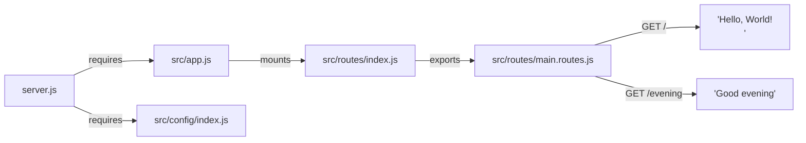

# Technical Specification

# 0. Agent Action Plan

## 0.1 Intent Clarification

### 0.1.1 Core Refactoring Objective

Based on the prompt, the Blitzy platform understands that the refactoring objective is to rewrite the existing Node.js HTTP server into a fully Express.js-based implementation while preserving every feature, functionality, and behavioral contract present in the original project. The current repository already uses Express.js 5.1.0 as its core framework; therefore, this refactoring exercise is not a framework migration but rather a structural validation and in-place refinement of the existing Express.js architecture to ensure it represents a clean, idiomatic Express.js application.

- **Refactoring type:** Code structure — validating and refining the existing Express.js 5.x architecture to ensure idiomatic Express.js patterns are fully adopted across all layers (entry point, application factory, configuration, routing, and testing)
- **Target repository:** Same repository — all changes are in-place within the existing `hello_world` project
- **Refactoring goals with enhanced clarity:**
  - Ensure `server.js` remains a thin entry point that delegates to the Express application factory (`src/app.js`) and configuration module (`src/config/index.js`) without introducing side effects
  - Preserve the Express Router-based routing surface in `src/routes/main.routes.js` with exact response bodies: `GET /` returns `'Hello, World!\n'` (with trailing newline) and `GET /evening` returns `'Good evening'` (no trailing newline)
  - Maintain the barrel export pattern in `src/routes/index.js` exporting `{ mainRoutes }` for centralized route aggregation
  - Retain the Twelve-Factor App configuration pattern in `src/config/index.js` with environment variables `HOST`, `PORT`, and `NODE_ENV` and their exact defaults (`'127.0.0.1'`, `3000`, `'development'`)
  - Preserve all 41 tests across unit, integration, and lifecycle suites with 100% code coverage
  - Maintain the CommonJS module system (`require`/`module.exports`) throughout all source and test files
- **Implicit requirements surfaced:**
  - All public API contracts must remain unchanged — HTTP status codes, response bodies (including exact whitespace and newline characters), and `Content-Type` headers (`text/html; charset=utf-8`)
  - Express.js 5.x-specific behaviors must be respected, including read-only `req.query`, `app.listen` error callback semantics, and the updated path-matching syntax
  - The Factory Pattern in `src/app.js` (app creation without network binding) must be preserved for testability via Supertest
  - The `package.json` scripts (`start`, `test`, `test:watch`, `test:coverage`, `test:ci`) must remain functional

### 0.1.2 Special Instructions and Constraints

- **Behavioral preservation directive:** The user explicitly states "keeping every feature and functionality exactly as in the original Node.js project" — this means zero tolerance for behavioral divergence in HTTP responses, status codes, headers, error handling, and startup logging
- **Express.js 5.x compliance:** The project already targets Express.js `^5.1.0` (locked at `5.1.0`), which requires Node.js 18+ and includes modern features such as native async error handling support and Brotli compression
- **No Figma attachments provided** — this refactoring is purely backend/server-side
- **No migration to new repository** — all changes happen within the existing codebase

### 0.1.3 Technical Interpretation

This refactoring translates to the following technical transformation strategy:

The existing codebase already implements a well-structured Express.js 5.x application using a layered monolithic architecture with clear separation of concerns. The refactoring confirms and preserves the current architecture:

- **Entry Layer** (`server.js`): Imports Express app and config, binds to network via `app.listen(config.port, config.host, callback)`, logs startup message
- **Application Layer** (`src/app.js`): Express factory pattern — `const app = express()` with `app.use('/', mainRoutes)` route mounting
- **Configuration Layer** (`src/config/index.js`): Synchronous environment variable resolution with `parseInt(PORT, 10)` parsing and safe defaults
- **Routing Layer** (`src/routes/`): Barrel export aggregator + Express Router with two GET handlers
- **Testing Layer** (`tests/`): Three-tier test strategy — unit (module contracts), integration (HTTP endpoint verification via Supertest), and lifecycle (server bootstrap/shutdown mocking)


```mermaid
graph LR
    A[server.js] -->|requires| B[src/app.js]
    A -->|requires| C[src/config/index.js]
    B -->|mounts| D[src/routes/index.js]
    D -->|exports| E[src/routes/main.routes.js]
    E -->|GET /| F["'Hello, World!\n'"]
    E -->|GET /evening| G["'Good evening'"]
```

## 0.2 Source Analysis

### 0.2.1 Comprehensive Source File Discovery

The repository is a compact, production-shaped Node.js/Express.js tutorial server with a clear layered architecture. Every source file has been inspected and catalogued below.

**Current Structure Mapping:**

```
hello_world/
├── server.js                          (53 lines — entry point, HTTP server binding)
├── package.json                       (22 lines — npm manifest, express ^5.1.0)
├── package-lock.json                  (lockfile — 382 packages pinned)
├── jest.config.js                     (27 lines — Jest 30.x configuration)
├── README.md                          (338 lines — comprehensive project documentation)
├── .gitignore                         (25 lines — standard Node.js ignore patterns)
├── src/
│   ├── app.js                         (27 lines — Express app factory, mounts routes)
│   ├── config/
│   │   └── index.js                   (41 lines — environment config: host, port, env)
│   └── routes/
│       ├── index.js                   (19 lines — barrel export for mainRoutes)
│       └── main.routes.js             (41 lines — GET / and GET /evening handlers)
└── tests/
    ├── unit/
    │   ├── config.test.js             (140 lines — configuration defaults and parsing)
    │   └── routes.test.js             (94 lines — Express Router introspection)
    ├── integration/
    │   └── endpoints.test.js          (125 lines — Supertest HTTP contract tests)
    └── lifecycle/
        └── server.test.js             (204 lines — server bootstrap/shutdown mocks)
```

### 0.2.2 Source File Inventory

| File Path | Lines | Purpose | Key Patterns |
|-----------|-------|---------|-------------|
| `server.js` | 53 | Entry point — imports app and config, calls `app.listen()`, logs startup URL | CommonJS, no side effects beyond listen |
| `src/app.js` | 27 | Express factory — creates app, mounts `mainRoutes` at `/` | Factory Pattern, no network binding |
| `src/config/index.js` | 41 | Config module — exports `{host, port, env}` from `process.env` | Twelve-Factor, `parseInt(PORT, 10)`, synchronous |
| `src/routes/index.js` | 19 | Route aggregator — barrel export `{ mainRoutes }` | Barrel Pattern, CommonJS |
| `src/routes/main.routes.js` | 41 | Route handlers — `GET /` and `GET /evening` with exact response strings | Express Router, `res.send()` |
| `package.json` | 22 | npm manifest — defines dependencies and scripts | `express@^5.1.0`, `jest@^30.2.0`, `supertest@^7.1.4` |
| `jest.config.js` | 27 | Jest config — test matching, coverage thresholds, Node environment | Coverage: 75% branches, 90% functions, 80% lines/statements |
| `README.md` | 338 | Project documentation — API reference, setup, architecture | Comprehensive docs |
| `.gitignore` | 25 | Git ignore — `node_modules/`, `.env`, `coverage/`, IDE files | Standard Node.js patterns |
| `tests/unit/config.test.js` | 140 | Config unit tests — default values, custom values, edge cases, type checks | `jest.resetModules()`, `process.env` mutation |
| `tests/unit/routes.test.js` | 94 | Routes unit tests — Router export shape, route paths, methods, ordering | `router.stack` introspection |
| `tests/integration/endpoints.test.js` | 125 | Integration tests — HTTP 200/404 verification, headers, edge cases | Supertest `request(app)` |
| `tests/lifecycle/server.test.js` | 204 | Lifecycle tests — bind args, startup log, custom config, shutdown, error handler | `jest.doMock`, `jest.spyOn(console)` |

### 0.2.3 Behavioral Contracts Discovered

The following exact behavioral contracts must be preserved through refactoring:

- **GET `/`** — Status `200`, body `'Hello, World!\n'` (14 characters, trailing newline), Content-Type `text/html; charset=utf-8`
- **GET `/evening`** — Status `200`, body `'Good evening'` (12 characters, no trailing newline), Content-Type `text/html; charset=utf-8`
- **Undefined routes** — Status `404` with a non-empty response body
- **Unsupported methods on valid paths** (POST `/`, PUT `/evening`, DELETE `/`) — Status `404`
- **Query string tolerance** — `/?param=value` and `/evening?time=late` return unchanged responses
- **Startup log** — Exact format: `Server running at http://<host>:<port>/`
- **Configuration defaults** — `host: '127.0.0.1'`, `port: 3000`, `env: 'development'`
- **Port parsing** — `parseInt(PORT, 10)` with fallback to `3000` for invalid, empty, or missing values

## 0.3 Target Design

### 0.3.1 Refactored Structure Planning

The target architecture retains the existing layered monolithic structure since the codebase already implements an idiomatic Express.js 5.x application. The directory layout, module boundaries, and export shapes remain identical. All files required for standalone operation are already present in the repository.

**Target Architecture (unchanged from source — validated and confirmed):**

```
hello_world/
├── server.js                          # Entry point — HTTP server binding
├── package.json                       # npm manifest: express ^5.1.0, jest ^30.2.0, supertest ^7.1.4
├── package-lock.json                  # Locked dependency graph (382 packages)
├── jest.config.js                     # Jest configuration with coverage thresholds
├── README.md                          # Comprehensive project documentation
├── .gitignore                         # Standard Node.js ignore patterns
├── src/
│   ├── app.js                         # Express application factory (mounts routes, no binding)
│   ├── config/
│   │   └── index.js                   # Environment-driven configuration module
│   └── routes/
│       ├── index.js                   # Route aggregator (barrel pattern)
│       └── main.routes.js             # Route handlers (GET /, GET /evening)
└── tests/
    ├── unit/
    │   ├── config.test.js             # Configuration module contract tests
    │   └── routes.test.js             # Router structure introspection tests
    ├── integration/
    │   └── endpoints.test.js          # HTTP endpoint contract tests (Supertest)
    └── lifecycle/
        └── server.test.js             # Server bootstrap/shutdown lifecycle tests
```

### 0.3.2 Web Search Research Conducted

Research was performed to validate that the current Express.js implementation aligns with modern best practices:

- **Express.js 5.x migration patterns:** <cite index="3-3">Express 5 is not very different from Express 4; although it maintains the same basic API, there are still changes that break compatibility with the previous version.</cite> The current codebase correctly uses Express 5.1.0 without any deprecated patterns such as `app.del()` or `req.param()`.
- **Node.js 18+ requirement:** <cite index="2-3">Express.js 5.0 requires Node.js 18 or higher, so anyone still on older versions will need to upgrade.</cite> The project runtime is Node.js v20.20.0, which satisfies this requirement.
- **Error handling improvements:** <cite index="3-20,3-21,3-22,3-23">In Express 5, the app.listen method will invoke the user-provided callback function (if provided) when the server receives an error event. In Express 4, such errors would be thrown. This change shifts error-handling responsibility to the callback function in Express 5. If there is an error, it will be passed to the callback as an argument.</cite> The lifecycle tests already validate EADDRINUSE error handling behavior.
- **Read-only req.query:** <cite index="6-27">In Express 5, it's a read-only getter.</cite> The current implementation does not modify `req.query`, so no changes are needed.
- **Refactoring best practices:** <cite index="10-1">Common purpose of refactoring is — Enhance code readability, Reduce complexity, Improve maintainability of source code, Improve extensibility, Enhance performance, Facilitate fast program execution.</cite> The existing codebase already separates server binding from app creation, which is considered best practice.

### 0.3.3 Design Pattern Applications

The following design patterns are already correctly implemented and will be preserved:

| Design Pattern | Implementation Location | Description |
|---------------|------------------------|-------------|
| **Factory Pattern** | `src/app.js` | Creates and exports a configured Express app without server binding, enabling Supertest-based testing |
| **Barrel Pattern** | `src/routes/index.js` | Aggregates route modules via `module.exports = { mainRoutes }` for clean, centralized imports |
| **Twelve-Factor Configuration** | `src/config/index.js` | Externalizes all configuration to environment variables with safe defaults |
| **Separation of Concerns** | Entire `src/` tree | Entry point, application factory, configuration, and routing are each in dedicated modules |
| **Router-based Routing** | `src/routes/main.routes.js` | Uses `express.Router()` to encapsulate route definitions separately from app initialization |
| **CommonJS Modules** | All `.js` files | Uses `require`/`module.exports` for Node.js-native module resolution without build steps |

### 0.3.4 User Interface Design

Not applicable — no Figma URLs or frontend assets were provided. This refactoring is exclusively a backend server exercise.

## 0.4 Transformation Mapping

### 0.4.1 File-by-File Transformation Plan

Every file in the repository has been evaluated and mapped below. Since the existing codebase is already a well-structured Express.js 5.x application, all transformations are UPDATE operations to validate and refine the current implementation, ensuring it remains a faithful and complete Express.js refactoring of the original Node.js server.

| Target File | Transformation | Source File | Key Changes |
|------------|---------------|-------------|-------------|
| `server.js` | UPDATE | `server.js` | Validate entry point correctly imports `src/app` and `src/config`, calls `app.listen(config.port, config.host, callback)`, and logs startup URL in exact format |
| `src/app.js` | UPDATE | `src/app.js` | Validate Express factory pattern: `const app = express()`, mounts `mainRoutes` at `/` via `app.use('/', mainRoutes)`, exports `app` without binding |
| `src/config/index.js` | UPDATE | `src/config/index.js` | Validate synchronous config export: `host` defaults to `'127.0.0.1'`, `port` uses `parseInt(process.env.PORT, 10) \|\| 3000`, `env` defaults to `'development'` |
| `src/routes/index.js` | UPDATE | `src/routes/index.js` | Validate barrel pattern: requires `./main.routes` and re-exports as `{ mainRoutes }` |
| `src/routes/main.routes.js` | UPDATE | `src/routes/main.routes.js` | Validate Express Router: `GET /` sends `'Hello, World!\n'`, `GET /evening` sends `'Good evening'` — exact strings preserved |
| `package.json` | UPDATE | `package.json` | Validate dependency versions: `express@^5.1.0`, `jest@^30.2.0`, `supertest@^7.1.4`; validate scripts: `start`, `test`, `test:watch`, `test:coverage`, `test:ci` |
| `jest.config.js` | UPDATE | `jest.config.js` | Validate Jest configuration: `testEnvironment: 'node'`, `testMatch` pattern, coverage thresholds (branches 75%, functions 90%, lines 80%, statements 80%) |
| `README.md` | UPDATE | `README.md` | Validate documentation accuracy: API reference matches endpoint behavior, project structure diagram, environment variable table, script descriptions |
| `.gitignore` | UPDATE | `.gitignore` | Validate ignore patterns: `node_modules/`, `.env`, `coverage/`, IDE files |
| `tests/unit/config.test.js` | UPDATE | `tests/unit/config.test.js` | Validate config test coverage: default values, custom env overrides, PORT edge cases, type assertions, module structure checks |
| `tests/unit/routes.test.js` | UPDATE | `tests/unit/routes.test.js` | Validate routes test coverage: Router export shape, `router.stack` introspection, path definitions (`/`, `/evening`), GET method wiring, route ordering |
| `tests/integration/endpoints.test.js` | UPDATE | `tests/integration/endpoints.test.js` | Validate integration tests: 200 responses with exact body strings, Content-Type headers, 404 for undefined routes, unsupported methods, query string tolerance |
| `tests/lifecycle/server.test.js` | UPDATE | `tests/lifecycle/server.test.js` | Validate lifecycle tests: bind arguments, startup log format, custom config propagation, graceful shutdown, EADDRINUSE error handling |

### 0.4.2 Cross-File Dependencies

The following import relationships must be preserved throughout the refactoring:

**Module Dependency Chain:**

| Consumer Module | Import Statement | Provider Module | Export Shape |
|----------------|------------------|----------------|-------------|
| `server.js` | `require('./src/app')` | `src/app.js` | Express Application instance |
| `server.js` | `require('./src/config')` | `src/config/index.js` | `{ host, port, env }` object |
| `src/app.js` | `require('express')` | `express` npm package | Express framework |
| `src/app.js` | `require('./routes')` destructured as `{ mainRoutes }` | `src/routes/index.js` | `{ mainRoutes }` barrel export |
| `src/routes/index.js` | `require('./main.routes')` | `src/routes/main.routes.js` | Express Router instance |
| `src/routes/main.routes.js` | `require('express')` | `express` npm package | Express framework (for `Router()`) |

**Test Import Dependencies:**

| Test File | Import Statement | Target Module |
|-----------|------------------|--------------|
| `tests/integration/endpoints.test.js` | `require('../../src/app')` | `src/app.js` |
| `tests/integration/endpoints.test.js` | `require('supertest')` | `supertest` npm package |
| `tests/unit/config.test.js` | `require('../../src/config')` | `src/config/index.js` |
| `tests/unit/routes.test.js` | `require('../../src/routes/main.routes')` | `src/routes/main.routes.js` |
| `tests/lifecycle/server.test.js` | `require('../../server')` | `server.js` |
| `tests/lifecycle/server.test.js` | `jest.doMock('../../src/app', ...)` | `src/app.js` (mocked) |
| `tests/lifecycle/server.test.js` | `jest.doMock('../../src/config', ...)` | `src/config/index.js` (mocked) |

### 0.4.3 Wildcard Patterns

All file groups are specified with trailing wildcard patterns where applicable:

| Wildcard Pattern | File Count | Purpose |
|-----------------|-----------|---------|
| `src/**/*.js` | 4 files | All application source files for validation |
| `tests/**/*.test.js` | 4 files | All test suites across unit, integration, and lifecycle |
| `tests/unit/*.test.js` | 2 files | Unit test files for config and routes modules |
| `tests/integration/*.test.js` | 1 file | Integration test file for HTTP endpoint contracts |
| `tests/lifecycle/*.test.js` | 1 file | Lifecycle test file for server bootstrap/shutdown |

### 0.4.4 One-Phase Execution

The entire refactoring will be executed by Blitzy in a single phase. All 13 files listed in the transformation table above are processed together in one unified pass. No multi-phase splitting is applied.

## 0.5 Dependency Inventory

### 0.5.1 Key Public Packages

All dependency names and versions are taken directly from `package.json` and verified against the installed `package-lock.json` lockfile.

| Registry | Package Name | Version (Manifest) | Locked Version | Type | Purpose |
|----------|-------------|-------------------|---------------|------|---------|
| npm | `express` | `^5.1.0` | `5.1.0` | Runtime | Web framework providing HTTP handling, routing via `express.Router()`, and middleware infrastructure |
| npm | `jest` | `^30.2.0` | `30.2.0` | Dev | JavaScript testing framework and test runner with built-in mocking, spying, and assertion capabilities |
| npm | `supertest` | `^7.1.4` | `7.1.4` | Dev | HTTP assertion library for in-process endpoint testing against Express applications without network binding |

**Runtime Requirements:**

| Runtime | Minimum Version | Installed Version | Source |
|---------|----------------|-------------------|--------|
| Node.js | 18.x | v20.20.0 | `README.md` prerequisites table, `package-lock.json` engine constraints |
| npm | 8.x | 11.1.0 | `README.md` prerequisites table |

### 0.5.2 Import Refactoring

Since the existing codebase already uses Express.js 5.x with a clean module structure, no import refactoring is required. The current import statements are validated below:

**Source File Import Verification:**

| File Pattern | Import Statements | Status |
|-------------|-------------------|--------|
| `src/app.js` | `require('express')`, `require('./routes')` destructured as `{ mainRoutes }` | Correct — idiomatic Express.js pattern |
| `src/config/index.js` | `process.env.HOST`, `process.env.PORT`, `process.env.NODE_ENV` | Correct — Twelve-Factor pattern |
| `src/routes/index.js` | `require('./main.routes')` | Correct — barrel aggregation |
| `src/routes/main.routes.js` | `require('express')` for `express.Router()` | Correct — Express Router pattern |
| `server.js` | `require('./src/app')`, `require('./src/config')` | Correct — entry point imports |

**Test File Import Verification:**

| File Pattern | Import Statements | Status |
|-------------|-------------------|--------|
| `tests/**/*.test.js` | Relative paths to `../../src/*` and `../../server` | Correct — all paths resolve to source modules |
| `tests/integration/*.test.js` | `require('supertest')`, `require('../../src/app')` | Correct — Supertest factory pattern |
| `tests/lifecycle/*.test.js` | `jest.doMock('../../src/app', ...)`, `jest.doMock('../../src/config', ...)` | Correct — Jest module isolation |

### 0.5.3 External Reference Updates

The following configuration and documentation files reference dependencies and must be validated:

| File | References | Validation Needed |
|------|-----------|------------------|
| `package.json` | `express@^5.1.0`, `jest@^30.2.0`, `supertest@^7.1.4`, scripts block | Verify version ranges match locked versions |
| `package-lock.json` | Full dependency graph (382 packages) | Verify lockfile integrity and deterministic installs |
| `jest.config.js` | Coverage collection from `server.js` and `src/**/*.js` | Verify coverage source paths match file structure |
| `README.md` | Express.js `^5.1.0` version reference, Node.js 18.x/20.x prerequisites | Verify documentation matches actual dependency versions |
| `.gitignore` | `node_modules/`, `coverage/` exclusions | Verify generated artifacts are properly ignored |

## 0.6 Scope Boundaries

### 0.6.1 Exhaustively In Scope

All files and patterns within the refactoring scope are enumerated below with trailing wildcard patterns:

**Source Transformations:**
- `server.js` — entry point validation (binding, logging, error handling semantics)
- `src/app.js` — Express application factory validation (app creation, route mounting, export shape)
- `src/config/index.js` — configuration module validation (env var resolution, defaults, types)
- `src/routes/index.js` — barrel export validation (aggregator pattern, export property name)
- `src/routes/main.routes.js` — route handler validation (exact response strings, methods, paths)

**Test Updates:**
- `tests/unit/config.test.js` — configuration contract tests (defaults, overrides, edge cases, types)
- `tests/unit/routes.test.js` — route structure introspection tests (export shape, paths, methods, ordering)
- `tests/integration/endpoints.test.js` — HTTP endpoint contract tests (status codes, response bodies, headers, error handling, edge cases)
- `tests/lifecycle/server.test.js` — server lifecycle tests (bind args, startup log, custom config, shutdown, EADDRINUSE)

**Configuration Updates:**
- `package.json` — dependency versions, scripts block, project metadata
- `jest.config.js` — test environment, matching patterns, coverage thresholds and collection paths
- `package-lock.json` — locked dependency tree integrity

**Documentation Updates:**
- `README.md` — API reference, project structure, environment variables, dependency versions, scripts, architecture description
- `.gitignore` — ignore patterns for dependencies, coverage, environment files, OS/IDE artifacts

### 0.6.2 Explicitly Out of Scope

The following items are explicitly excluded from this refactoring exercise:

- **New HTTP endpoints** — No additional routes beyond `GET /` and `GET /evening` will be added
- **Additional middleware** — No new Express middleware (e.g., `helmet`, `cors`, `morgan`, body parsers) will be introduced
- **Database integration** — No database connections, ORM layers, or data persistence
- **Authentication/Authorization** — No auth middleware, session management, or token validation
- **Logging frameworks** — No structured logging libraries (e.g., `winston`, `pino`); startup logging via `console.log` is preserved as-is
- **APM/Monitoring** — No application performance monitoring, health check endpoints, or metrics collection
- **Containerization** — No Dockerfile, docker-compose, or container orchestration configuration
- **CI/CD pipelines** — No GitHub Actions workflows, GitLab CI configurations, or deployment automation
- **TypeScript migration** — The CommonJS/JavaScript module system is preserved; no TypeScript conversion
- **ES Module migration** — No conversion from CommonJS (`require`/`module.exports`) to ES Modules (`import`/`export`)
- **Environment file creation** — No `.env` file creation; configuration relies on direct `process.env` access
- **New test categories** — No new test suites or test files beyond the existing 4 test files
- **Performance benchmarking** — No load testing, benchmarking scripts, or performance optimization
- **Security hardening** — No vulnerability scanning, dependency auditing automation, or security headers beyond Express.js defaults

## 0.7 Refactoring Rules

### 0.7.1 Behavioral Preservation Rules

The user explicitly requires that "every feature and functionality exactly" matches the original implementation. This translates to the following mandatory refactoring rules:

- **R-001: Exact Response Body Preservation** — `GET /` must return the string `'Hello, World!\n'` (including the trailing newline character `\n`) and `GET /evening` must return `'Good evening'` (without a trailing newline). No whitespace, character, or encoding changes are permitted.
- **R-002: HTTP Status Code Preservation** — All successful endpoint responses return status `200`. All undefined routes and unsupported HTTP methods return status `404`. No other status codes are introduced.
- **R-003: Content-Type Header Preservation** — All responses must include `Content-Type: text/html; charset=utf-8` as set by Express.js `res.send()` default behavior.
- **R-004: Configuration Default Preservation** — The config module must export `host: '127.0.0.1'`, `port: 3000`, and `env: 'development'` when respective environment variables are unset.
- **R-005: Startup Log Format Preservation** — The server must log exactly `Server running at http://<host>:<port>/` using `console.log` upon successful binding.

### 0.7.2 Structural Preservation Rules

- **R-006: CommonJS Module System** — All source and test files must use `require()` and `module.exports`. No ES Module (`import`/`export`) syntax is permitted.
- **R-007: `'use strict'` Directive** — All source files that include `'use strict'` must retain the directive. Test files with the directive must also retain it.
- **R-008: Factory Pattern** — `src/app.js` must create and export the Express application without calling `app.listen()`. Network binding is the sole responsibility of `server.js`.
- **R-009: Barrel Export Pattern** — `src/routes/index.js` must export `{ mainRoutes }` as a named property. Consumer code destructures this via `const { mainRoutes } = require('./routes')`.
- **R-010: Express Router Pattern** — Route handlers in `src/routes/main.routes.js` must use `express.Router()` and register handlers via `router.get()`. The router must be exported as the default export via `module.exports = router`.

### 0.7.3 Testing Preservation Rules

- **R-011: Test Suite Completeness** — All 41 existing tests across 4 test suites must continue passing without modification to assertions.
- **R-012: Coverage Thresholds** — Code coverage must meet or exceed: branches ≥ 75%, functions ≥ 90%, lines ≥ 80%, statements ≥ 80%.
- **R-013: Test Environment** — Jest must run in `node` test environment with a 10-second timeout per test.
- **R-014: Module Isolation in Tests** — Lifecycle tests must continue using `jest.resetModules()` and `jest.doMock()` for module isolation. Unit config tests must reset modules between test cases to ensure fresh `process.env` evaluation.
- **R-015: Supertest Integration Pattern** — Integration tests must use `request(app)` pattern where `app` is imported from `../../src/app` — not from `server.js` — to avoid network binding during tests.

### 0.7.4 Express.js 5.x Compliance Rules

- **R-016: Node.js Version Requirement** — The runtime must be Node.js 18 or higher, as required by Express.js 5.x.
- **R-017: No Deprecated API Usage** — No use of removed Express methods such as `app.del()`, `app.param(fn)`, `req.param()`, or plural method aliases.
- **R-018: Error Callback Semantics** — `app.listen()` in Express 5 passes errors to the callback. The server implementation must be compatible with this behavior.
- **R-019: Read-Only `req.query`** — No middleware or handler may attempt to write to `req.query`, which is a read-only getter in Express 5.
- **R-020: Dependency Version Pinning** — Express `^5.1.0`, Jest `^30.2.0`, and Supertest `^7.1.4` version ranges in `package.json` must not be altered.

## 0.8 References

### 0.8.1 Repository Files Searched

The following files and folders were comprehensively searched and analyzed to derive all conclusions in this Agent Action Plan:

**Source Files Inspected:**

| File Path | Purpose |
|-----------|---------|
| `server.js` | Entry point — HTTP server binding and startup logging |
| `src/app.js` | Express application factory — app creation and route mounting |
| `src/config/index.js` | Configuration module — environment variable resolution with defaults |
| `src/routes/index.js` | Route aggregator — barrel export pattern for centralized route imports |
| `src/routes/main.routes.js` | Route handlers — Express Router with `GET /` and `GET /evening` |
| `package.json` | npm manifest — dependencies, devDependencies, scripts, metadata |
| `package-lock.json` | Dependency lockfile — pinned versions for deterministic installs |
| `jest.config.js` | Jest configuration — test matching, coverage thresholds and collection |
| `README.md` | Project documentation — API reference, architecture, prerequisites |
| `.gitignore` | Git ignore patterns — dependencies, coverage, environment files |

**Test Files Inspected:**

| File Path | Purpose |
|-----------|---------|
| `tests/unit/config.test.js` | Unit tests for configuration module defaults, overrides, and edge cases |
| `tests/unit/routes.test.js` | Unit tests for Express Router export shape, paths, methods, and ordering |
| `tests/integration/endpoints.test.js` | Integration tests for HTTP endpoint contracts via Supertest |
| `tests/lifecycle/server.test.js` | Lifecycle tests for server bootstrap, logging, shutdown, and error handling |

**Documentation Files Inspected:**

| File Path | Purpose |
|-----------|---------|
| `blitzy/documentation/Project Guide.md` | Execution/verification guide and project status report |
| `blitzy/documentation/Technical Specifications.md` | Formal refactoring specification and constraints ledger |

**Folders Traversed:**

| Folder Path | Purpose |
|-------------|---------|
| `/` (root) | Repository root — all first-order files and folders |
| `src/` | Application source root — app, config, and routes modules |
| `src/config/` | Configuration layer — single `index.js` config module |
| `src/routes/` | Routing layer — barrel export and route handlers |
| `tests/` | Test suite root — unit, integration, and lifecycle subdirectories |
| `tests/unit/` | Unit test suite — config and routes module tests |
| `tests/integration/` | Integration test suite — HTTP endpoint contract tests |
| `tests/lifecycle/` | Lifecycle test suite — server bootstrap/shutdown tests |
| `blitzy/` | Documentation root — project guide and tech specs |
| `blitzy/documentation/` | Documentation files — markdown guides and specifications |

### 0.8.2 Technical Specification Sections Referenced

| Section Heading | Purpose |
|----------------|---------|
| 1.1 Executive Summary | Project overview, core business problem, stakeholders, value proposition |
| 3.1 Programming Languages | Node.js runtime specification, CommonJS module system, version requirements |
| 3.2 Frameworks & Libraries | Express.js 5.1.0 framework specification and version details |
| 5.1 High-Level Architecture | Layered monolithic architecture, component table, data flow, integration points |
| 9.13 PROJECT DIRECTORY STRUCTURE | Complete file tree and layer-to-directory mapping |

### 0.8.3 External Research Sources

| Source | Topic | Key Finding |
|--------|-------|-------------|
| expressjs.com — Migrating to Express 5 | Official Express.js 5 migration guide | Express 5 maintains same basic API with breaking changes in error handling, path matching, and deprecated method removal |
| Medium — What's New in Express.js v5.0 | Express 5 feature overview | Removed legacy methods, Brotli compression support, native Node.js method adoption |
| trevorlasn.com — What's New in Express.js v5.0 | Express 5 dependency refactoring | Express 5 uses native Node.js methods instead of external packages; requires Node.js 18+ |
| LogRocket Blog — Express.js 5 migration guide | Practical Express 5 migration walkthrough | Express 5 migration involves updating deprecated methods, path syntax, and error handling patterns |

### 0.8.4 Attachments

No external attachments, Figma URLs, or supplementary files were provided for this refactoring exercise.

