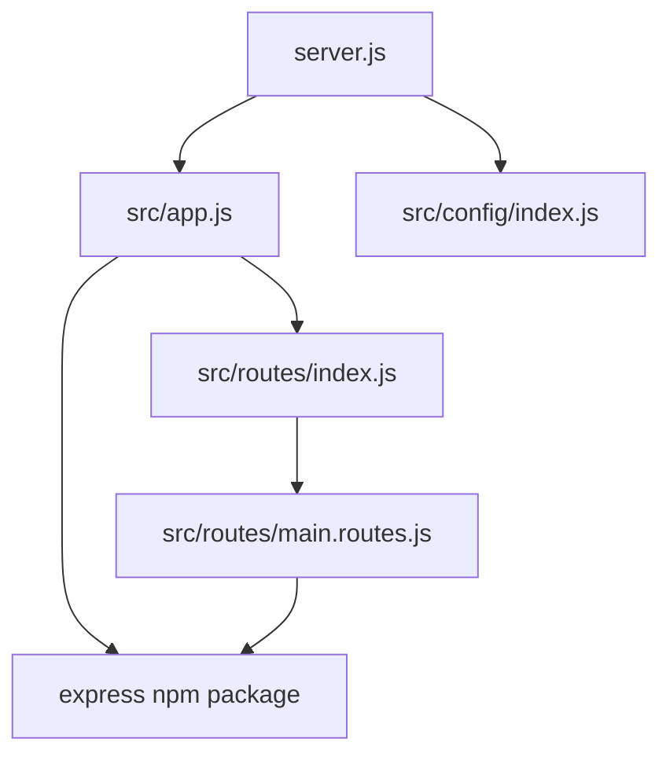
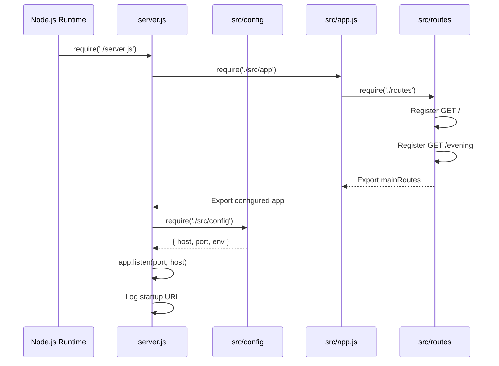

# Technical Specification

# 0. Agent Action Plan

## 0.1 Intent Clarification

This section captures and translates the user's feature request into precise technical requirements, surfacing implicit dependencies and establishing a clear implementation strategy.

### 0.1.1 Core Feature Objective

Based on the prompt, the Blitzy platform understands that the new feature requirement is to:

- **Integrate Express.js Framework**: Migrate the Node.js server from native `http.createServer()` to the Express.js web framework for improved routing capabilities, middleware support, and maintainability
- **Add Evening Greeting Endpoint**: Create a new HTTP GET endpoint at `/evening` that returns the response body `"Good evening"` (without trailing newline)
- **Preserve Existing Functionality**: Maintain the original `GET /` endpoint that returns `"Hello, World!\n"` (with trailing newline) ensuring backward compatibility

**Implicit Requirements Detected:**
- Express.js installation requires Node.js 18+ (Express 5.x requirement)
- The new endpoint must follow the same response pattern as the existing endpoint (using `res.send()`)
- Project structure should evolve from a monolithic server file to a modular architecture with separated concerns (routes, configuration, app factory)
- CommonJS module format must be maintained for Node.js compatibility
- Environment-driven configuration should be preserved for Twelve-Factor App compliance

**Feature Dependencies and Prerequisites:**
- Node.js runtime version 18.x or higher (recommended: 20.19.x LTS)
- npm package manager version 8.x or higher
- Express.js package (^5.1.0) as runtime dependency

### 0.1.2 Special Instructions and Constraints

**Architectural Requirements:**
- Follow the Factory Pattern: `src/app.js` must create and export the Express application without calling `app.listen()` to preserve testability
- Use Barrel Pattern: `src/routes/index.js` must aggregate route exports for clean imports
- Apply Twelve-Factor Configuration: All configuration values must be externalized to environment variables via `src/config/index.js`

**Integration Requirements:**
- The new `/evening` endpoint must be co-located with the existing `/` endpoint in the same router module
- Both endpoints must be mounted at the root path (`/`) in `app.use('/', mainRoutes)`
- Server binding logic must remain isolated in `server.js` entry point

**User-Provided Examples:**
- User Example (Original Endpoint): `GET /` → Response: `"Hello world"` (interpreted as `"Hello, World!\n"` with proper casing and newline)
- User Example (New Endpoint): `GET /evening` → Response: `"Good evening"` (no trailing newline)

### 0.1.3 Technical Interpretation

These feature requirements translate to the following technical implementation strategy:

- To **integrate Express.js**, we will install the `express` package (^5.1.0) as a runtime dependency and refactor the monolithic `server.js` into a modular Express application architecture with separated concerns
- To **add the evening greeting endpoint**, we will create a new route handler in `src/routes/main.routes.js` that handles `GET /evening` and responds with `res.send('Good evening')`
- To **preserve existing functionality**, we will extract the original `GET /` handler logic into the same routes module, ensuring the response body `'Hello, World!\n'` remains unchanged
- To **maintain testability**, we will separate HTTP server binding (`app.listen()`) from application configuration, allowing the Express app to be imported and tested without starting a server
- To **support environment overrides**, we will create a configuration module at `src/config/index.js` that reads `HOST`, `PORT`, and `NODE_ENV` from `process.env` with sensible defaults

## 0.2 Repository Scope Discovery

This section provides a comprehensive analysis of all repository files affected by the Express.js integration and evening endpoint feature addition.

### 0.2.1 Comprehensive File Analysis

**Existing Files Requiring Modification:**

| File Path | Current Purpose | Required Modification |
|-----------|-----------------|----------------------|
| `server.js` | Native HTTP server entry point | Refactor to import Express app from `src/app.js` and bind using `app.listen()` |
| `package.json` | npm manifest (no Express dependency) | Add `express: "^5.1.0"` to dependencies |
| `package-lock.json` | Dependency lockfile | Auto-regenerated after `npm install` with Express dependency tree |
| `README.md` | Project documentation | Update to document new `/evening` endpoint and Express architecture |

**New Source Files to Create:**

| File Path | Purpose |
|-----------|---------|
| `src/app.js` | Express application factory module - creates and exports configured Express app with mounted routes |
| `src/config/index.js` | Configuration management module - exports `{ host, port, env }` from environment variables |
| `src/routes/index.js` | Route aggregator (barrel pattern) - centralizes route module exports |
| `src/routes/main.routes.js` | Route handlers implementation - defines `GET /` and `GET /evening` endpoints |

**Test Files (Future Enhancement):**

| File Path | Purpose |
|-----------|---------|
| `tests/routes/main.routes.test.js` | Unit tests for route handlers using supertest |
| `tests/app.test.js` | Integration tests for Express application |

**Configuration Files:**

| File Path | Status | Notes |
|-----------|--------|-------|
| `.gitignore` | UNCHANGED | Already excludes `node_modules/`, `.env`, logs, and IDE files |
| `.env.example` | NEW (optional) | Document available environment variables |

### 0.2.2 Integration Point Discovery

**API Endpoints Connected to the Feature:**

| Method | Path | Handler Location | Response Body |
|--------|------|------------------|---------------|
| GET | `/` | `src/routes/main.routes.js:26-28` | `Hello, World!\n` |
| GET | `/evening` | `src/routes/main.routes.js:37-39` | `Good evening` |

**Service Classes and Modules:**

| Module | Export Shape | Consumers |
|--------|--------------|-----------|
| `src/app.js` | `module.exports = app` (Express Application) | `server.js` |
| `src/config/index.js` | `module.exports = { host, port, env }` | `server.js` |
| `src/routes/index.js` | `module.exports = { mainRoutes }` | `src/app.js` |
| `src/routes/main.routes.js` | `module.exports = router` (Express Router) | `src/routes/index.js` |

**Middleware and Interceptors:**
- No custom middleware required for this feature
- Express built-in middleware handles request/response processing

**Database/Schema Updates:**
- Not applicable - this feature does not require database changes

### 0.2.3 Repository Structure Overview

```
hao-backprop-test/
├── server.js                    # MODIFY: HTTP server binding entry point
├── package.json                 # MODIFY: Add Express dependency
├── package-lock.json            # AUTO: Regenerated on install
├── README.md                    # MODIFY: Document new endpoint
├── .gitignore                   # UNCHANGED: Existing ignore patterns
├── blitzy/                      # DOCUMENTATION: Spec files (unchanged)
│   └── documentation/
│       ├── Project Guide.md
│       └── Technical Specifications.md
└── src/                         # CREATE: Application source root
    ├── app.js                   # CREATE: Express app factory
    ├── config/
    │   └── index.js             # CREATE: Environment configuration
    └── routes/
        ├── index.js             # CREATE: Route aggregator barrel
        └── main.routes.js       # CREATE: Route handlers
```

### 0.2.4 File Pattern Analysis

**Source Files (CommonJS Modules):**
- Pattern: `src/**/*.js`
- Module Format: CommonJS (`require`/`module.exports`)
- Style: JSDoc documentation blocks, strict mode implicit

**Configuration Files:**
- Pattern: `*.json`, `src/config/**/*.js`
- Format: JSON (package manifests), JavaScript (runtime config)

**Documentation:**
- Pattern: `**/*.md`, `blitzy/documentation/**/*`
- Format: Markdown with Mermaid diagram support

## 0.3 Dependency Inventory

This section catalogs all public and private packages relevant to the Express.js integration and evening endpoint feature addition.

### 0.3.1 Runtime Dependencies

**Primary Package:**

| Registry | Package Name | Version | Purpose |
|----------|--------------|---------|---------|
| npm (public) | `express` | ^5.1.0 | Web application framework providing HTTP handling, routing, middleware pipeline, and response utilities |

**Transitive Dependencies (Auto-installed with Express 5.1.0):**

| Package | Version | Purpose |
|---------|---------|---------|
| `body-parser` | 2.2.1 | HTTP request body parsing middleware |
| `accepts` | 2.0.0 | Content negotiation for HTTP requests |
| `content-type` | 1.0.5 | Content-Type header parsing |
| `cookie` | 1.0.2 | Cookie parsing utilities |
| `debug` | 4.4.1 | Debugging utility for development |
| `encodeurl` | 2.0.0 | URL encoding utility |
| `escape-html` | 1.0.3 | HTML string escaping |
| `etag` | 1.8.1 | ETag generation for HTTP caching |
| `finalhandler` | 2.1.1 | Final HTTP response handler |
| `fresh` | 2.0.0 | HTTP cache freshness checking |
| `http-errors` | 2.0.0 | HTTP error creation utility |
| `merge-descriptors` | 2.0.0 | Object descriptor merging |
| `mime-types` | 3.0.1 | MIME type detection |
| `on-finished` | 2.4.1 | Request/response finish detection |
| `parseurl` | 1.3.3 | URL parsing utility |
| `qs` | 6.14.0 | Query string parsing |
| `raw-body` | 3.0.1 | Raw request body reading |
| `router` | 2.2.0 | Express routing engine |
| `send` | 1.2.0 | Static file sending |
| `serve-static` | 2.2.0 | Static file serving middleware |
| `type-is` | 2.0.1 | Content-Type inference |

### 0.3.2 Development Dependencies

| Registry | Package Name | Version | Purpose |
|----------|--------------|---------|---------|
| npm (public) | None specified | - | No dev dependencies in current manifest |

**Recommended Future Additions:**

| Package | Suggested Version | Purpose |
|---------|-------------------|---------|
| `jest` | ^29.x | Unit and integration testing framework |
| `supertest` | ^6.x | HTTP assertions for Express app testing |
| `eslint` | ^8.x | JavaScript linting and code quality |

### 0.3.3 Node.js Runtime Requirements

| Requirement | Minimum | Recommended | Source |
|-------------|---------|-------------|--------|
| Node.js | 18.x | 20.19.x LTS | README.md, Express 5.x requirements |
| npm | 8.x | 10.8.x | README.md |

### 0.3.4 Import Configuration

**Module Import Updates Required:**

| File | Old Import Pattern | New Import Pattern |
|------|-------------------|-------------------|
| `server.js` | `require('http')` | `require('./src/app')`, `require('./src/config')` |
| `src/app.js` | N/A (new file) | `require('express')`, `require('./routes')` |
| `src/routes/main.routes.js` | N/A (new file) | `require('express')` |
| `src/routes/index.js` | N/A (new file) | `require('./main.routes')` |
| `src/config/index.js` | N/A (new file) | (uses `process.env` only) |

**Import Transformation Rules:**

```javascript
// BEFORE: Native HTTP server
const http = require('http');

// AFTER: Express.js application
const app = require('./src/app');
const config = require('./src/config');
```

### 0.3.5 Package Manifest Configuration

**Updated `package.json` Dependencies Block:**

```json
{
  "dependencies": {
    "express": "^5.1.0"
  }
}
```

**Package Installation Command:**

```bash
npm install express@^5.1.0
```

**Verification Command:**

```bash
npm ls express
# Expected output: express@5.1.0
```

### 0.3.6 Security Audit Status

**Current Audit Results:**

```
found 0 vulnerabilities
```

- **Critical:** 0
- **High:** 0
- **Moderate:** 0
- **Low:** 0

All Express 5.1.0 transitive dependencies pass npm security audit with no known vulnerabilities.

## 0.4 Integration Analysis

This section maps all existing code touchpoints and defines the integration points required for the Express.js feature addition.

### 0.4.1 Existing Code Touchpoints

**Direct Modifications Required:**

| File | Modification | Approximate Location |
|------|--------------|---------------------|
| `server.js` | Replace native HTTP server with Express app import and binding | Lines 1-75 (full refactor) |
| `package.json` | Add Express dependency to dependencies object | Line 12-14 |
| `README.md` | Document new `/evening` endpoint and architecture | Lines 74-125 (API Reference section) |

**Module Dependency Graph:**


```mermaid
graph TD
    A[server.js] --> B[src/app.js]
    A --> C[src/config/index.js]
    B --> D[src/routes/index.js]
    D --> E[src/routes/main.routes.js]
    B --> F[express npm package]
    E --> F
```

### 0.4.2 Application Bootstrap Flow

**Startup Sequence:**


```mermaid
sequenceDiagram
    participant Node as Node.js Runtime
    participant Server as server.js
    participant Config as src/config
    participant App as src/app.js
    participant Routes as src/routes
    
    Node->>Server: require('./server.js')
    Server->>App: require('./src/app')
    App->>Routes: require('./routes')
    Routes->>Routes: Register GET /
    Routes->>Routes: Register GET /evening
    Routes-->>App: Export mainRoutes
    App-->>Server: Export configured app
    Server->>Config: require('./src/config')
    Config-->>Server: { host, port, env }
    Server->>Server: app.listen(port, host)
    Server->>Server: Log startup URL
```

### 0.4.3 Route Registration Analysis

**Route Handler Integration:**

| Route | HTTP Method | Handler Function | Mount Path | Response |
|-------|-------------|------------------|------------|----------|
| `/` | GET | Anonymous arrow function | `app.use('/', mainRoutes)` | `Hello, World!\n` |
| `/evening` | GET | Anonymous arrow function | `app.use('/', mainRoutes)` | `Good evening` |

**Router Configuration in `src/routes/main.routes.js`:**

```javascript
router.get('/', (req, res) => {
  res.send('Hello, World!\n');
});

router.get('/evening', (req, res) => {
  res.send('Good evening');
});
```

### 0.4.4 Configuration Integration

**Environment Variable Mapping:**

| Variable | Config Property | Default Value | Consumer |
|----------|-----------------|---------------|----------|
| `HOST` | `config.host` | `'127.0.0.1'` | `server.js` → `app.listen()` |
| `PORT` | `config.port` | `3000` | `server.js` → `app.listen()` |
| `NODE_ENV` | `config.env` | `'development'` | Runtime environment branching |

**Configuration Usage in `server.js`:**

```javascript
app.listen(config.port, config.host, () => {
  console.log(`Server running at http://${config.host}:${config.port}/`);
});
```

### 0.4.5 Module Export Contracts

**Critical Export Shapes:**

| Module | Export Type | Export Shape | Consumers |
|--------|-------------|--------------|-----------|
| `src/app.js` | Default | `Express.Application` | `server.js` |
| `src/config/index.js` | Default | `{ host: string, port: number, env: string }` | `server.js` |
| `src/routes/index.js` | Named | `{ mainRoutes: Express.Router }` | `src/app.js` |
| `src/routes/main.routes.js` | Default | `Express.Router` | `src/routes/index.js` |

**Export Verification Commands:**

```bash
# Verify app.js exports Express application
node -e "const app = require('./src/app'); console.log(typeof app.listen)"
# Expected: function

#### Verify config exports object with required properties
node -e "const cfg = require('./src/config'); console.log(Object.keys(cfg))"
#### Expected: [ 'host', 'port', 'env' ]

#### Verify routes barrel exports mainRoutes
node -e "const routes = require('./src/routes'); console.log('mainRoutes' in routes)"
#### Expected: true
```

### 0.4.6 Request Flow Integration

**HTTP Request Processing Path:**

```
Client Request
    ↓
server.js (HTTP binding via app.listen)
    ↓
Express Application (src/app.js)
    ↓
Router Middleware (app.use('/', mainRoutes))
    ↓
Route Handler (src/routes/main.routes.js)
    ↓
Response (res.send())
    ↓
Client Response
```

**Integration Points Summary:**
- **Entry Point:** `server.js` binds the Express app to configured host/port
- **App Factory:** `src/app.js` creates Express instance and mounts routes
- **Route Registration:** Routes are registered at module evaluation time (synchronous)
- **Configuration:** Environment variables read once at startup, cached by Node module system

## 0.5 Technical Implementation

This section provides the file-by-file execution plan for implementing the Express.js integration and evening endpoint feature.

### 0.5.1 File-by-File Execution Plan

**Group 1 - Core Feature Files:**

| Action | File Path | Implementation Details |
|--------|-----------|----------------------|
| MODIFY | `package.json` | Add `"express": "^5.1.0"` to dependencies block |
| CREATE | `src/routes/main.routes.js` | Implement Express Router with `GET /` and `GET /evening` handlers |
| CREATE | `src/routes/index.js` | Create barrel module exporting `{ mainRoutes }` |
| CREATE | `src/app.js` | Create Express application factory, mount routes at root path |

**Group 2 - Supporting Infrastructure:**

| Action | File Path | Implementation Details |
|--------|-----------|----------------------|
| CREATE | `src/config/index.js` | Implement environment configuration with `host`, `port`, `env` exports |
| MODIFY | `server.js` | Refactor to import Express app and config, bind with `app.listen()` |

**Group 3 - Documentation:**

| Action | File Path | Implementation Details |
|--------|-----------|----------------------|
| MODIFY | `README.md` | Document `/evening` endpoint, update architecture section, add API reference |

### 0.5.2 Implementation Details by File

**`src/routes/main.routes.js` - Route Handlers:**

```javascript
const router = require('express').Router();

router.get('/', (req, res) => {
  res.send('Hello, World!\n');
});

router.get('/evening', (req, res) => {
  res.send('Good evening');
});

module.exports = router;
```

**`src/routes/index.js` - Route Aggregator:**

```javascript
const mainRoutes = require('./main.routes');
module.exports = { mainRoutes };
```

**`src/app.js` - Express Application Factory:**

```javascript
const express = require('express');
const { mainRoutes } = require('./routes');

const app = express();
app.use('/', mainRoutes);

module.exports = app;
```

**`src/config/index.js` - Configuration Module:**

```javascript
module.exports = {
  host: process.env.HOST || '127.0.0.1',
  port: parseInt(process.env.PORT, 10) || 3000,
  env: process.env.NODE_ENV || 'development'
};
```

**`server.js` - Entry Point (Refactored):**

```javascript
const app = require('./src/app');
const config = require('./src/config');

app.listen(config.port, config.host, () => {
  console.log(`Server running at http://${config.host}:${config.port}/`);
});
```

### 0.5.3 Implementation Sequence

**Phase 1 - Dependency Installation:**
1. Update `package.json` with Express dependency
2. Run `npm install` to install Express and transitive dependencies
3. Verify installation with `npm ls express`

**Phase 2 - Module Creation:**
1. Create `src/` directory structure
2. Implement `src/config/index.js` (no dependencies on other new files)
3. Implement `src/routes/main.routes.js` (depends only on Express)
4. Implement `src/routes/index.js` (aggregates main.routes)
5. Implement `src/app.js` (imports routes, creates Express app)

**Phase 3 - Entry Point Refactoring:**
1. Refactor `server.js` to import new modules
2. Remove native HTTP server code
3. Implement Express `app.listen()` binding

**Phase 4 - Documentation:**
1. Update README.md with new endpoint documentation
2. Update architecture diagrams and file descriptions

### 0.5.4 Validation Commands

**Endpoint Verification:**

```bash
# Start server
npm start

#### Test root endpoint (in separate terminal)
curl -s http://127.0.0.1:3000/
#### Expected: Hello, World!

#### Test evening endpoint
curl -s http://127.0.0.1:3000/evening
#### Expected: Good evening
```

**Response Body Verification:**

```bash
# Verify exact response with byte count
curl -s http://127.0.0.1:3000/ | wc -c
# Expected: 14

curl -s http://127.0.0.1:3000/evening | wc -c
# Expected: 12
```

**Module Export Verification:**

```bash
# Verify all modules load without error
node -e "require('./src/app'); require('./src/config'); require('./src/routes'); console.log('All modules OK')"
```

### 0.5.5 Transformation Rules Applied

| Original Pattern | Express Pattern | Applied In |
|-----------------|-----------------|------------|
| `http.createServer()` | `express()` | `src/app.js` |
| `response.end('text')` | `res.send('text')` | `src/routes/main.routes.js` |
| Hardcoded `host`/`port` | `process.env` with defaults | `src/config/index.js` |
| Monolithic `server.js` | Modular `src/` structure | All new files |
| Inline route handlers | Express Router | `src/routes/main.routes.js` |

## 0.6 Scope Boundaries

This section defines the exhaustive boundaries of what is included in and excluded from this feature implementation.

### 0.6.1 Exhaustively In Scope

**Source Files (Feature Implementation):**

| Pattern/Path | Description |
|--------------|-------------|
| `src/app.js` | Express application factory module |
| `src/config/index.js` | Environment configuration module |
| `src/config/**/*.js` | All configuration-related modules |
| `src/routes/index.js` | Route aggregator barrel |
| `src/routes/main.routes.js` | Route handler implementations |
| `src/routes/**/*.js` | All route modules |

**Entry Point:**

| Path | Description |
|------|-------------|
| `server.js` | HTTP server binding and startup (refactored) |

**Package Manifests:**

| Path | Description |
|------|-------------|
| `package.json` | npm manifest with Express dependency |
| `package-lock.json` | Dependency lockfile (auto-generated) |

**Documentation:**

| Pattern/Path | Description |
|--------------|-------------|
| `README.md` | Project documentation with API reference |
| `blitzy/documentation/*.md` | Technical specifications and project guides |

**Endpoints:**

| Method | Path | Status |
|--------|------|--------|
| GET | `/` | Existing (preserved) |
| GET | `/evening` | New (added) |

**Environment Variables:**

| Variable | Status |
|----------|--------|
| `HOST` | Supported (existing) |
| `PORT` | Supported (existing) |
| `NODE_ENV` | Supported (existing) |

### 0.6.2 File Inventory Summary

**Files to CREATE:**

| File Path | Lines (Est.) | Purpose |
|-----------|--------------|---------|
| `src/app.js` | ~28 | Express application factory |
| `src/config/index.js` | ~42 | Configuration management |
| `src/routes/index.js` | ~20 | Route barrel/aggregator |
| `src/routes/main.routes.js` | ~42 | Route handlers |

**Files to MODIFY:**

| File Path | Change Type | Scope |
|-----------|-------------|-------|
| `server.js` | Refactor | Full file (remove HTTP, add Express import) |
| `package.json` | Add dependency | Lines 12-14 (dependencies block) |
| `README.md` | Documentation | API Reference, Architecture sections |

**Files UNCHANGED:**

| File Path | Reason |
|-----------|--------|
| `.gitignore` | Existing patterns sufficient for Express project |
| `blitzy/documentation/Project Guide.md` | Existing documentation (reference only) |
| `blitzy/documentation/Technical Specifications.md` | Existing documentation (reference only) |

### 0.6.3 Explicitly Out of Scope

**Features NOT Included:**

| Item | Reason |
|------|--------|
| Additional HTTP endpoints beyond `/evening` | Not requested in user requirements |
| POST, PUT, DELETE, PATCH methods | Feature only requires GET endpoints |
| Request body parsing middleware | Not needed for simple GET endpoints |
| Authentication/Authorization | Not specified in requirements |
| Database integration | Not specified in requirements |
| Session management | Not specified in requirements |
| CORS middleware | Not specified in requirements |
| Rate limiting | Not specified in requirements |
| Request logging middleware | Not specified (console.log only) |

**Infrastructure NOT Included:**

| Item | Reason |
|------|--------|
| Docker containerization | Not specified in requirements |
| CI/CD pipeline configuration | Not specified in requirements |
| Kubernetes manifests | Not specified in requirements |
| Cloud deployment configs | Not specified in requirements |

**Testing NOT Included:**

| Item | Reason |
|------|--------|
| Unit test framework setup | Placeholder test script exists, no dev dependencies added |
| Integration test suite | Not specified in requirements |
| E2E test configuration | Not specified in requirements |

**Code Quality NOT Included:**

| Item | Reason |
|------|--------|
| ESLint configuration | Not specified in requirements |
| Prettier configuration | Not specified in requirements |
| TypeScript migration | Project uses CommonJS JavaScript |
| Code coverage setup | Not specified in requirements |

### 0.6.4 Boundary Clarifications

**Express Version Boundary:**
- IN SCOPE: Express 5.1.0 (current latest stable)
- OUT OF SCOPE: Express 4.x compatibility layer, future Express 6.x

**Node.js Version Boundary:**
- IN SCOPE: Node.js 18.x and 20.x (LTS)
- OUT OF SCOPE: Node.js 16.x or earlier (not supported by Express 5.x)

**Module System Boundary:**
- IN SCOPE: CommonJS (`require`/`module.exports`)
- OUT OF SCOPE: ES Modules (`import`/`export`) migration

**Response Format Boundary:**
- IN SCOPE: Plain text responses via `res.send()`
- OUT OF SCOPE: JSON responses, HTML templates, static file serving

## 0.7 Special Instructions for Feature Addition

This section documents feature-specific requirements, conventions, and critical implementation constraints emphasized by the user and inferred from the existing codebase.

### 0.7.1 Response Fidelity Requirements

**Critical Response Contracts:**

| Endpoint | Response Body | Trailing Newline | Byte Length |
|----------|---------------|------------------|-------------|
| `GET /` | `Hello, World!\n` | YES | 14 bytes |
| `GET /evening` | `Good evening` | NO | 12 bytes |

**Verification Commands:**

```bash
# Verify trailing newline on root endpoint
curl -s http://127.0.0.1:3000/ | od -c | tail -1
# Should show: n at end

#### Verify no trailing newline on evening endpoint
curl -s http://127.0.0.1:3000/evening | od -c | tail -1
#### Should NOT show: n at end
```

### 0.7.2 Architectural Conventions

**Factory Pattern Requirement:**
- `src/app.js` MUST export the Express application instance without calling `app.listen()`
- This separation enables unit testing the Express app without starting an HTTP server
- Server binding MUST remain isolated in `server.js`

**Barrel Pattern Requirement:**
- `src/routes/index.js` MUST aggregate route exports using named exports
- Import pattern: `const { mainRoutes } = require('./routes')`
- This enables future route modules to be added without modifying `app.js`

**Twelve-Factor Configuration Requirement:**
- All configuration values MUST be sourced from environment variables
- Default values MUST be provided for development convenience
- Configuration module MUST export synchronously (no async/await)

### 0.7.3 Code Style Conventions

**Module Format:**
- Use CommonJS (`require`/`module.exports`)
- Include `'use strict';` directive in entry point
- JSDoc comments for all exported modules and functions

**Naming Conventions:**

| Type | Convention | Example |
|------|------------|---------|
| Files | lowercase with dots | `main.routes.js` |
| Modules | camelCase exports | `mainRoutes` |
| Config properties | lowercase | `host`, `port`, `env` |
| Route paths | lowercase with slashes | `/`, `/evening` |

**Code Structure:**
- One export per module file
- Barrel files for aggregation only (no logic)
- Configuration at top of modules, handlers below

### 0.7.4 Express 5.x Specific Requirements

**Router API Usage:**
- Use `express.Router()` for route grouping
- Mount routers using `app.use(path, router)`
- Use `res.send()` for response output (not `res.end()`)

**Middleware Considerations:**
- Express 5.x automatically handles `Content-Type` for `res.send()`
- No explicit `Content-Type` header setting required for text responses
- Status code defaults to 200 for successful `res.send()` calls

### 0.7.5 Testing Compatibility Requirements

**Testability Constraints:**
- Express app MUST be importable without side effects
- No `app.listen()` calls at module evaluation time
- Configuration MUST support override via environment variables

**Recommended Test Pattern:**

```javascript
const request = require('supertest');
const app = require('./src/app');

describe('GET /', () => {
  it('returns Hello, World!', async () => {
    const res = await request(app).get('/');
    expect(res.text).toBe('Hello, World!\n');
  });
});
```

### 0.7.6 Backward Compatibility Requirements

**Preserved Behaviors:**
- `GET /` response MUST remain `Hello, World!\n` (exact match)
- Default binding MUST remain `127.0.0.1:3000`
- Environment variable names MUST remain `HOST`, `PORT`, `NODE_ENV`
- `npm start` command MUST continue to work without modification

**Migration Safety:**
- No breaking changes to existing endpoint behavior
- No changes to environment variable semantics
- No changes to startup logging format (URL display)

### 0.7.7 Security Considerations

**Current Security Posture:**
- No authentication required for endpoints (public access)
- No sensitive data in responses
- No user input processing (static responses only)
- Express 5.1.0 has 0 known vulnerabilities (npm audit clean)

**Production Recommendations (Out of Scope):**
- Add helmet.js for security headers
- Implement rate limiting for production deployment
- Configure CORS if cross-origin access needed
- Use HTTPS termination at load balancer level

### 0.7.8 Validation Checklist

**Pre-Deployment Verification:**

- [ ] `npm install` completes without errors
- [ ] `npm audit` shows 0 vulnerabilities
- [ ] `npm start` binds to configured host:port
- [ ] `curl http://127.0.0.1:3000/` returns `Hello, World!` with newline
- [ ] `curl http://127.0.0.1:3000/evening` returns `Good evening` without newline
- [ ] Environment variable overrides work correctly
- [ ] All module exports match expected shapes

**Module Export Verification:**

```bash
node -e "const a=require('./src/app'); console.log(typeof a.listen === 'function')"
# Expected: true

node -e "const c=require('./src/config'); console.log(c.host, c.port, c.env)"
# Expected: 127.0.0.1 3000 development

node -e "const r=require('./src/routes'); console.log('mainRoutes' in r)"
# Expected: true
```

