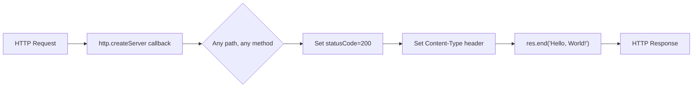
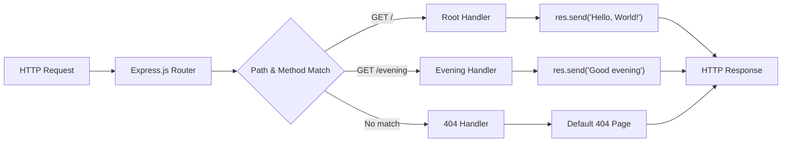
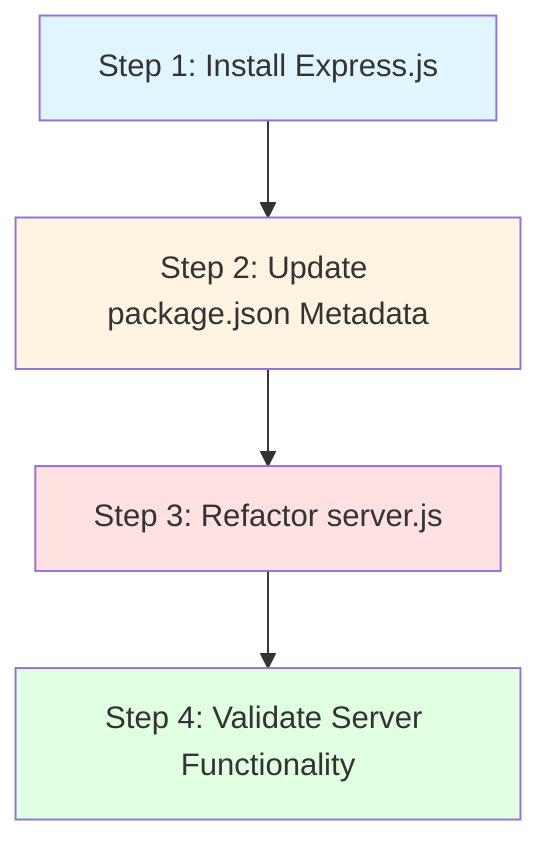

# Technical Specification

# 0. Agent Action Plan

## 0.1 Intent Clarification

### 0.1.1 Core Feature Objective

Based on the prompt, the Blitzy platform understands that the new feature requirement is to **integrate Express.js into an existing Node.js tutorial server and add a new HTTP endpoint**. Specifically, the requirements include:

- **Add Express.js Framework**: Transform the existing vanilla Node.js HTTP server (using the native `http` module) into an Express.js-based application. Express.js provides enhanced routing capabilities, middleware support, and cleaner request/response handling patterns.

- **Preserve Existing "Hello world" Endpoint**: The current server returns "Hello, World!\n" for incoming requests at the root path (`/`). This functionality must be maintained with identical response content.

- **Create New "Good evening" Endpoint**: Implement a new route that responds with the text "Good evening" when accessed. This demonstrates Express.js's path-based routing capabilities.

- **Maintain Server Configuration**: The server must continue operating on the same host (127.0.0.1) and port (3000) to ensure backward compatibility with any existing integrations or test fixtures.

**Implicit Requirements Detected:**

- The project's `package.json` must be updated to include Express.js as a runtime dependency
- A `start` script should be added to enable standard `npm start` command execution
- The `main` field in package.json should accurately reflect the entry point file (`server.js`)
- Response format remains plain text to maintain consistency with the tutorial nature of the project
- Node.js version compatibility must be verified (Express.js 5.x requires Node.js 18+)

**Feature Dependencies and Prerequisites:**

| Prerequisite | Status | Notes |
|-------------|--------|-------|
| Node.js >= 18 | ✓ Satisfied | Environment has Node.js v20.19.6 |
| npm package manager | ✓ Satisfied | npm v11.1.0 available |
| Express.js 5.x compatibility | ✓ Verified | Express 5.1.0 is latest stable |

### 0.1.2 Special Instructions and Constraints

**User-Provided Instructions:**

User Example: *"this is a tutorial of node js server hosting one endpoint that returns the response 'Hello world'. Could you add expressjs into the project and add another endpoint that return the reponse of 'Good evening'?"*

**Architectural Requirements:**

- Maintain single-file server architecture appropriate for tutorial/learning context
- Use CommonJS module syntax (`require`/`module.exports`) matching existing codebase patterns
- Keep server configuration (hostname, port) as constants for easy modification
- Preserve the minimalist design philosophy of the hello_world tutorial

**Project-Specific Constraints:**

- **README.md Preservation**: The README contains "test project for backprop integration. Do not touch!" and must not be modified
- **Tutorial Focus**: Code should prioritize clarity and educational value over production patterns
- **Localhost Binding**: Server binds to 127.0.0.1 for network isolation (development/test use case)

**Web Search Requirements:**

- Verify Express.js latest version and Node.js compatibility
- Confirm Express.js 5.x routing patterns and best practices
- Validate migration path from native `http` module to Express.js

### 0.1.3 Technical Interpretation

These feature requirements translate to the following technical implementation strategy:

**To migrate from native HTTP to Express.js, we will:**
- Replace the `http.createServer()` implementation with Express.js application initialization using `const app = express()`
- Convert the generic request handler into Express.js route definitions with explicit HTTP methods and paths
- Use `res.send()` for responses, which Express.js handles with automatic content-type headers

**To add Express.js as a dependency, we will:**
- Execute `npm install express --save` to add Express.js 5.1.0 to project dependencies
- Allow npm to automatically update `package-lock.json` with Express and transitive dependencies
- Verify zero security vulnerabilities via `npm audit`

**To implement the endpoints, we will:**
- Create a GET route at path `/` returning "Hello, World!\n" (exact original behavior)
- Create a GET route at path `/evening` returning "Good evening" (new feature)
- Preserve server startup console message format for consistency

**To improve project configuration, we will:**
- Update `package.json` field `"main"` from "index.js" to "server.js" (correct entry point)
- Add `"start": "node server.js"` script for standard npm command support
- Maintain existing metadata (author, license, version)

## 0.2 Repository Scope Discovery

### 0.2.1 Comprehensive File Analysis

**Repository Structure Overview:**

```
Repository Root (.)
├── .gitignore              # Git ignore patterns - PRESERVE
├── README.md               # Project description - DO NOT MODIFY
├── package.json            # NPM manifest - MODIFY (add dependency, fix main, add script)
├── package-lock.json       # Dependency lockfile - AUTO-UPDATE via npm
├── server.js               # Main server file - REFACTOR to Express.js
└── blitzy/
    └── documentation/
        ├── Project Guide.md           # Migration runbook - reference only
        └── Technical Specifications.md # Tech spec - reference only
```

**Existing Files Requiring Modification:**

| File Path | Current State | Required Changes | Purpose |
|-----------|---------------|------------------|---------|
| `server.js` | Vanilla Node.js HTTP server using `http` module | Complete refactor to Express.js with route definitions | Main application entry point and endpoint implementations |
| `package.json` | No dependencies, `main` points to "index.js" | Add Express.js dependency, fix main field to "server.js", add start script | Project manifest and dependency management |
| `package-lock.json` | Minimal lockfile (if present) | Auto-regenerated by npm during Express installation | Dependency version locking and integrity hashes |

**Files Explicitly Preserved (No Modifications):**

| File Path | Status | Rationale |
|-----------|--------|-----------|
| `README.md` | PRESERVE | Contains "Do not touch!" directive - serves as integration test sentinel |
| `.gitignore` | PRESERVE | Already properly configured for Node.js projects |
| `blitzy/documentation/*` | PRESERVE | Reference documentation, not part of application |

### 0.2.2 Integration Point Discovery

**Entry Point Analysis:**

- **Primary Entry**: `server.js` serves as both application entry point and route definition file
- **Current Pattern**: Native `http.createServer()` with single catch-all request handler
- **Target Pattern**: Express.js `app` instance with route-specific handlers

**Existing Architecture Assessment:**

| Component | Current State | Express.js Equivalent |
|-----------|---------------|----------------------|
| Server Instance | `http.createServer(callback)` | `express()` app instance |
| Route Handling | Single callback for all requests | `app.get(path, handler)` per route |
| Response Method | `res.end(content)` | `res.send(content)` |
| Listening | `server.listen(port, host, cb)` | `app.listen(port, host, cb)` |
| Headers | Manual `res.setHeader()` | Automatic via Express |
| Status Codes | Manual `res.statusCode = 200` | Automatic 200 for successful responses |

**No Complex Integrations Present:**

- No existing routing layer beyond the catch-all handler
- No database or ORM configurations
- No middleware stack implementation
- No service layer or dependency injection
- No configuration system or environment variables
- No build process or transpilation requirements

### 0.2.3 New File Requirements

**No new files are required for this feature implementation.**

The existing file structure is sufficient for the Express.js migration:

- **server.js**: Will be modified in-place to use Express.js
- **package.json**: Will be updated to include Express.js dependency
- **package-lock.json**: Will be auto-regenerated by npm

**Rationale for No New Files:**

- This is a tutorial project demonstrating basic Express.js usage
- Single-file architecture maintains simplicity for learning purposes
- No tests, separate configuration, or documentation files are specified in requirements
- The minimalist structure aligns with the "Hello World" tutorial nature

**Future Considerations (Explicitly Out of Scope):**

| Potential File | Purpose | Status |
|----------------|---------|--------|
| `test/server.test.js` | Unit tests for endpoints | OUT OF SCOPE |
| `.env` | Environment-based configuration | OUT OF SCOPE |
| `docs/API.md` | API endpoint documentation | OUT OF SCOPE |
| `middleware/` | Custom middleware modules | OUT OF SCOPE |
| `Dockerfile` | Container configuration | OUT OF SCOPE |

### 0.2.4 Web Search Research Conducted

**Research Topic: Express.js Current Version and Compatibility**

Key findings validated:
- Express 5.1.0 is the current default version on npm (latest stable)
- Express 5.x requires Node.js 18 or higher (environment has v20.19.6 ✓)
- Express.js 5 provides improved async error handling patterns
- Migration from native HTTP to Express is straightforward for simple servers

**Best Practices Identified:**

- Use `app.get()` for defining GET routes with explicit path parameters
- Leverage `res.send()` for automatic content-type detection and response formatting
- Express.js automatically handles response headers based on content type
- Server listening callback confirms successful startup

**Security Considerations:**

- Express.js 5.1.0 has zero known vulnerabilities (verified via npm audit)
- Localhost binding (127.0.0.1) provides network isolation
- No authentication required for this tutorial use case

## 0.3 Dependency Inventory

### 0.3.1 Private and Public Packages

**Primary Dependency to Add:**

| Registry | Package Name | Version | Purpose | Installation Command |
|----------|--------------|---------|---------|---------------------|
| npm (public) | express | ^5.1.0 | Minimal and flexible Node.js web application framework providing robust routing, middleware support, and HTTP utility methods | `npm install express --save` |

**Version Justification:**

- Version 5.1.0 is the current default on npm (latest stable release)
- Compatible with Node.js v20.19.6 (current environment)
- Requires Node.js 18 or higher (satisfied)
- Includes improved async error handling and modern JavaScript support

**Express.js Transitive Dependencies (Auto-Installed):**

When Express.js 5.1.0 is installed, npm automatically includes these transitive dependencies:

| Package | Version | Purpose |
|---------|---------|---------|
| accepts | 2.0.0 | Content-type negotiation |
| body-parser | 2.2.0 | Request body parsing middleware |
| content-type | 1.0.5 | Content-Type header parsing |
| cookie | 0.7.2 | Cookie parsing/serialization |
| debug | 4.4.0 | Debugging utility |
| depd | 2.0.0 | Deprecation warnings |
| encodeurl | 2.0.0 | URL encoding utility |
| escape-html | 1.0.3 | HTML escaping for security |
| etag | 1.8.1 | HTTP ETag generation |
| finalhandler | 2.1.0 | Final request handler |
| fresh | 2.0.0 | HTTP response freshness |
| http-errors | 2.0.0 | HTTP error creation |
| merge-descriptors | 2.0.0 | Object descriptor merging |
| mime-types | 3.0.1 | MIME type utilities |
| ms | 2.1.3 | Millisecond conversion |
| on-finished | 2.4.1 | Response finished callback |
| parseurl | 1.3.3 | URL parsing utility |
| qs | 6.14.0 | Query string parsing |
| range-parser | 1.2.1 | HTTP Range header parsing |
| raw-body | 3.0.0 | Raw request body reading |
| router | 2.2.0 | Express routing engine |
| send | 1.2.0 | Static file serving |
| serve-static | 2.2.0 | Static file middleware |
| statuses | 2.0.1 | HTTP status code utilities |
| type-is | 2.0.1 | Content-Type checking |
| vary | 1.1.2 | Vary header manipulation |

**Total Package Count:** 69 packages (1 direct + 68 transitive)

**No Private Packages Required:**

This project uses only public npm packages with no internal or private registry dependencies.

### 0.3.2 Dependency Updates

**package.json Modifications Required:**

**Before (Current State):**
```json
{
    "name": "hello_world",
    "version": "1.0.0",
    "description": "Hello world in Node.js",
    "main": "index.js",
    "scripts": {
        "test": "echo \"Error: no test specified\" && exit 1"
    },
    "author": "hxu",
    "license": "MIT"
}
```

**After (Updated State):**
```json
{
    "name": "hello_world",
    "version": "1.0.0",
    "description": "Hello world in Node.js",
    "main": "server.js",
    "scripts": {
        "start": "node server.js",
        "test": "echo \"Error: no test specified\" && exit 1"
    },
    "author": "hxu",
    "license": "MIT",
    "dependencies": {
        "express": "^5.1.0"
    }
}
```

**Key Changes Summary:**

| Field | Old Value | New Value | Rationale |
|-------|-----------|-----------|-----------|
| main | "index.js" | "server.js" | Corrects entry point declaration |
| scripts.start | (not present) | "node server.js" | Enables `npm start` command |
| dependencies | (not present) | {"express": "^5.1.0"} | Adds framework dependency |

### 0.3.3 Import Updates

**Import Transformation in server.js:**

| Location | Old Import | New Import | Action |
|----------|-----------|------------|--------|
| server.js line 1 | `const http = require('http');` | `const express = require('express');` | REPLACE |

**No Additional Import Changes Required:**

- Single-file application with no internal modules
- No exports defined (server.js is an entry point, not a module)
- No multi-file module structure exists

### 0.3.4 External Reference Updates

**No External Reference Updates Required:**

The project has minimal configuration:

- No `tsconfig.json`, `jsconfig.json`, or `.eslintrc` files
- No CI/CD configuration files (`.github/workflows`, etc.)
- README.md must not be modified per project constraints
- No Docker files, Makefiles, or build automation
- No documentation files requiring dependency references

## 0.4 Integration Analysis

### 0.4.1 Existing Code Touchpoints

**Direct Modifications Required:**

| File | Lines | Modification Type | Specific Changes | Rationale |
|------|-------|------------------|------------------|-----------|
| `server.js` | 1 | REPLACE | Change `const http = require('http');` to `const express = require('express');` | Switch from native HTTP module to Express.js framework |
| `server.js` | 6-10 | REFACTOR | Replace `http.createServer()` callback with Express.js route definitions | Implement proper routing with path-based handlers |
| `server.js` | 6 | ADD | Insert `const app = express();` after constants | Initialize Express.js application instance |
| `server.js` | 7-9 | REPLACE | Replace single request handler with `app.get('/', handler)` | Define root endpoint with Express.js routing |
| `server.js` | 10 | ADD | Insert `app.get('/evening', handler)` | Add new "Good evening" endpoint |
| `server.js` | 12-14 | MODIFY | Change `server.listen()` to `app.listen()` | Use Express.js application listening method |
| `package.json` | 5 | MODIFY | Update `"main": "index.js"` to `"main": "server.js"` | Correct entry point declaration |
| `package.json` | 6-8 | ADD | Add `"start": "node server.js"` to scripts object | Enable standard npm start command |
| `package.json` | 11-13 | ADD | Add dependencies object with Express.js | Declare project dependencies |

### 0.4.2 Implementation Flow Transformation

**Current Native HTTP Flow:**


```mermaid
graph LR
    A[HTTP Request] --> B[http.createServer callback]
    B --> C{Any path, any method}
    C --> D[Set statusCode=200]
    D --> E[Set Content-Type header]
    E --> F["res.end('Hello, World!')"]
    F --> G[HTTP Response]
```

**Target Express.js Flow:**


```mermaid
graph LR
    A[HTTP Request] --> B[Express.js Router]
    B --> C{Path & Method Match}
    C -->|GET /| D[Root Handler]
    C -->|GET /evening| E[Evening Handler]
    C -->|No match| F[404 Handler]
    D --> G["res.send('Hello, World!')"]
    E --> H["res.send('Good evening')"]
    F --> I[Default 404 Page]
    G --> J[HTTP Response]
    H --> J
    I --> J
```

### 0.4.3 Code Transformation Details

**Current Implementation (Before):**
```javascript
const http = require('http');
const hostname = '127.0.0.1';
const port = 3000;
const server = http.createServer((req, res) => {
  res.statusCode = 200;
  res.setHeader('Content-Type', 'text/plain');
  res.end('Hello, World!\n');
});
server.listen(port, hostname, () => {
  console.log(`Server running at http://${hostname}:${port}/`);
});
```

**Target Implementation (After):**
```javascript
const express = require('express');
const hostname = '127.0.0.1';
const port = 3000;
const app = express();
app.get('/', (req, res) => {
  res.send('Hello, World!\n');
});
app.get('/evening', (req, res) => {
  res.send('Good evening');
});
app.listen(port, hostname, () => {
  console.log(`Server running at http://${hostname}:${port}/`);
});
```

### 0.4.4 Dependency Injection Points

**No Dependency Injection Framework Required:**

This minimal application follows direct instantiation patterns:

| Component | Pattern | Notes |
|-----------|---------|-------|
| Express Application | Direct instantiation | `const app = express()` in server.js |
| Route Handlers | Inline functions | Defined within route registration |
| Configuration | Inline constants | `hostname` and `port` defined as constants |

**No Service Registration:**
- No separate service layer or dependency containers
- No custom middleware registration
- No configuration injection system
- No database connections or external service clients

### 0.4.5 Database/Schema Updates

**No database or schema updates required.**

This project has:
- No database connections or ORM configuration
- No data persistence layer
- No migration files or schema definitions
- No data models or entity definitions

All responses are static strings with no data storage or retrieval. The application is purely a request-response HTTP server with no state management.

## 0.5 Technical Implementation

### 0.5.1 File-by-File Execution Plan

**Implementation Order and Dependencies:**


```mermaid
graph TD
    A[Step 1: Install Express.js] --> B[Step 2: Update package.json Metadata]
    B --> C[Step 3: Refactor server.js]
    C --> D[Step 4: Validate Server Functionality]
    
    style A fill:#e1f5ff
    style B fill:#fff4e1
    style C fill:#ffe1e1
    style D fill:#e1ffe1
```

**Critical: Every file listed below MUST be created or modified**

### 0.5.2 Group 1: Dependency Installation

**File: package.json & package-lock.json**

| Action | Command | Expected Outcome |
|--------|---------|------------------|
| Install Express.js | `npm install express --save` | Express.js 5.1.0 added to dependencies |

**Automatic Updates:**
- `package.json` receives new `dependencies` block
- `package-lock.json` regenerated with all transitive dependencies
- `node_modules/express/` directory created with framework files

**Modifications to package.json:**

| Field | Current Value | New Value | Line |
|-------|---------------|-----------|------|
| main | "index.js" | "server.js" | 5 |
| scripts.start | (not present) | "node server.js" | Add to scripts |
| dependencies | (not present) | {"express": "^5.1.0"} | Add after license |

**Final package.json State:**
```json
{
    "name": "hello_world",
    "version": "1.0.0",
    "main": "server.js",
    "scripts": {
        "start": "node server.js",
        "test": "echo \"Error: no test specified\" && exit 1"
    },
    "dependencies": {
        "express": "^5.1.0"
    }
}
```

### 0.5.3 Group 2: Core Application Refactoring

**File: server.js**

| Action | Details |
|--------|---------|
| Transform | Native HTTP server to Express.js application |
| Lines Modified | 1, 6-14 (complete logic rewrite) |
| Lines Preserved | 3-4 (hostname and port constants) |

**Detailed Line-by-Line Changes:**

| Line | Current Code | New Code | Change Type |
|------|--------------|----------|-------------|
| 1 | `const http = require('http');` | `const express = require('express');` | REPLACE |
| 2 | (blank) | (blank) | PRESERVE |
| 3 | `const hostname = '127.0.0.1';` | `const hostname = '127.0.0.1';` | PRESERVE |
| 4 | `const port = 3000;` | `const port = 3000;` | PRESERVE |
| 5 | (blank) | (blank) | PRESERVE |
| 6 | `const server = http.createServer(...)` | `const app = express();` | REPLACE |
| 7 | `res.statusCode = 200;` | (blank) | DELETE |
| 8 | `res.setHeader(...)` | `app.get('/', (req, res) => {` | ADD NEW |
| 9 | `res.end(...)` | `  res.send('Hello, World!\\n');` | ADD NEW |
| 10 | `});` | `});` | MODIFY |
| 11 | (blank) | (blank) | PRESERVE |
| 12 | - | `app.get('/evening', (req, res) => {` | ADD NEW |
| 13 | - | `  res.send('Good evening');` | ADD NEW |
| 14 | - | `});` | ADD NEW |
| 15 | - | (blank) | ADD NEW |
| 16 | `server.listen(...)` | `app.listen(port, hostname, () => {` | MODIFY |
| 17 | `console.log(...)` | `  console.log(\`Server running at http://${hostname}:${port}/\`);` | PRESERVE |
| 18 | `});` | `});` | PRESERVE |

**Complete Refactored server.js:**
```javascript
const express = require('express');

const hostname = '127.0.0.1';
const port = 3000;

const app = express();

app.get('/', (req, res) => {
  res.send('Hello, World!\n');
});

app.get('/evening', (req, res) => {
  res.send('Good evening');
});

app.listen(port, hostname, () => {
  console.log(`Server running at http://${hostname}:${port}/`);
});
```

### 0.5.4 Group 3: Validation and Testing

**Validation Commands:**

| Test | Command | Expected Output |
|------|---------|-----------------|
| Start Server | `npm start` or `node server.js` | "Server running at http://127.0.0.1:3000/" |
| Root Endpoint | `curl http://127.0.0.1:3000/` | "Hello, World!\n" |
| Evening Endpoint | `curl http://127.0.0.1:3000/evening` | "Good evening" |
| 404 Behavior | `curl http://127.0.0.1:3000/unknown` | HTML 404 page (Express default) |
| Security Audit | `npm audit` | 0 vulnerabilities |

### 0.5.5 Implementation Approach Summary

| Phase | Action | Files Affected |
|-------|--------|----------------|
| Foundation | Install Express.js dependency | package.json, package-lock.json |
| Integration | Refactor server to Express.js | server.js |
| Validation | Test all endpoints | N/A (runtime verification) |

## 0.6 Scope Boundaries

### 0.6.1 Exhaustively In Scope

**Source Files:**

| File Pattern | Purpose | Modification Type |
|--------------|---------|-------------------|
| `server.js` | Main application with Express.js routes | REFACTOR |
| `package.json` | NPM manifest with Express dependency | MODIFY |
| `package-lock.json` | Dependency lockfile | AUTO-UPDATE |

**Endpoint Definitions:**

| Endpoint | Method | Response | Status |
|----------|--------|----------|--------|
| `/` | GET | "Hello, World!\n" | 200 |
| `/evening` | GET | "Good evening" | 200 |
| `/*` (undefined) | ANY | Express default 404 | 404 |

**Package Configuration:**

| Change | Location | Details |
|--------|----------|---------|
| Entry point correction | package.json `main` | "index.js" → "server.js" |
| Start script | package.json `scripts.start` | "node server.js" |
| Express dependency | package.json `dependencies` | "express": "^5.1.0" |

**Server Configuration (Preserved):**

| Setting | Value | Notes |
|---------|-------|-------|
| Hostname | 127.0.0.1 | Localhost binding for network isolation |
| Port | 3000 | Default development port |
| Console message | "Server running at http://127.0.0.1:3000/" | Startup notification |

**Transitive Dependencies (Auto-managed):**

- All 68 transitive dependencies of Express.js 5.1.0
- Installed to `node_modules/` directory
- Locked in `package-lock.json`

### 0.6.2 Explicitly Out of Scope

**Files NOT Modified:**

| File | Reason |
|------|--------|
| `README.md` | Contains "Do not touch!" directive |
| `.gitignore` | Already properly configured |
| `blitzy/documentation/*` | Reference documentation only |

**Features NOT Included:**

| Feature | Rationale |
|---------|-----------|
| Unit/Integration Tests | Not specified in requirements; tutorial scope |
| Environment Variables | Not required for basic tutorial |
| Additional Middleware | Logging, auth, etc. beyond Express defaults |
| Error Handling Middleware | Express default 404/500 behavior is sufficient |
| TypeScript Conversion | Maintaining CommonJS JavaScript |
| Docker Configuration | Containerization not requested |
| CI/CD Pipeline | Automation not in scope |
| API Documentation | No swagger/openapi specified |
| Rate Limiting | Production feature not needed for tutorial |
| HTTPS/TLS | Development server uses HTTP only |
| Database Integration | Stateless server design |
| Session Management | No authentication required |

**Performance Optimizations NOT Included:**

| Optimization | Rationale |
|--------------|-----------|
| Clustering | Single-process tutorial server |
| Caching | No dynamic content requiring cache |
| Compression | Minimal response payloads |
| Load Balancing | Single instance deployment |

**Refactoring NOT Included:**

| Refactoring | Rationale |
|-------------|-----------|
| Multi-file architecture | Single-file design per tutorial nature |
| Service layer extraction | Direct request handling sufficient |
| Configuration externalization | Inline constants appropriate for tutorial |
| Middleware modularization | No custom middleware needed |

### 0.6.3 Scope Validation Criteria

**Acceptance Tests:**

| Test ID | Description | Expected Result |
|---------|-------------|-----------------|
| SCOPE-01 | Root endpoint response | "Hello, World!\n" with 200 status |
| SCOPE-02 | Evening endpoint response | "Good evening" with 200 status |
| SCOPE-03 | Undefined route response | HTML 404 page with 404 status |
| SCOPE-04 | Server startup message | Console displays "Server running at http://127.0.0.1:3000/" |
| SCOPE-05 | npm start command | Server starts successfully |
| SCOPE-06 | Security audit | npm audit reports 0 vulnerabilities |
| SCOPE-07 | README unchanged | File hash matches original |

**Boundary Conditions:**

| Condition | Behavior |
|-----------|----------|
| POST/PUT/DELETE to `/` | Express 404 (method not allowed) |
| POST/PUT/DELETE to `/evening` | Express 404 (method not allowed) |
| Request with query parameters | Ignored, response unchanged |
| Request with headers | Processed normally, no special handling |
| Large request body | Ignored (no body parsing enabled) |

## 0.7 Special Instructions

### 0.7.1 Feature-Specific Requirements

**User-Emphasized Constraints:**

| Constraint | Directive | Implementation |
|------------|-----------|----------------|
| Tutorial Focus | Project is a learning resource | Maintain simple, readable code structure |
| Backward Compatibility | Existing "Hello world" must work | Preserve exact response format including newline |
| Framework Addition | Add Express.js to the project | Install as production dependency |
| New Endpoint | Return "Good evening" response | Create GET `/evening` route |

**Response Format Preservation:**

| Endpoint | Response Format | Critical Note |
|----------|----------------|---------------|
| `/` | `"Hello, World!\n"` | Trailing newline (`\n`) MUST be preserved |
| `/evening` | `"Good evening"` | No trailing newline per user specification |

### 0.7.2 Architectural Conventions

**Code Style Requirements:**

| Convention | Implementation |
|------------|----------------|
| Module System | CommonJS (`require`/`module.exports`) |
| Variable Declaration | `const` for all constants |
| Function Style | Arrow functions for route handlers |
| String Literals | Template literals for console.log |
| Semicolons | Consistent use throughout |

**Project Structure Conventions:**

| Aspect | Convention |
|--------|------------|
| Entry Point | Single `server.js` file |
| Configuration | Inline constants (no external config) |
| Dependencies | Minimal (Express.js only) |
| Tests | Not included (tutorial scope) |

### 0.7.3 Integration Requirements

**Express.js Integration Patterns:**

| Pattern | Implementation |
|---------|----------------|
| Application Instance | `const app = express();` |
| Route Definition | `app.get(path, handler)` |
| Response Sending | `res.send(content)` |
| Server Binding | `app.listen(port, hostname, callback)` |

**Compatibility Requirements:**

| Requirement | Specification |
|-------------|---------------|
| Node.js Version | >= 18 (Express 5.x requirement) |
| Express.js Version | ^5.1.0 (latest stable) |
| HTTP Protocol | HTTP/1.1 |
| Character Encoding | UTF-8 |

### 0.7.4 Security Considerations

**Network Binding:**

| Setting | Value | Security Implication |
|---------|-------|---------------------|
| Hostname | 127.0.0.1 | Loopback only, no external access |
| Port | 3000 | Standard development port |
| TLS | Not configured | HTTP only (acceptable for tutorial) |

**Dependency Security:**

| Check | Status |
|-------|--------|
| npm audit | 0 vulnerabilities required |
| Known CVEs | None in Express 5.1.0 |
| Supply Chain | npm registry verified |

### 0.7.5 Performance Considerations

**Resource Expectations:**

| Metric | Target | Notes |
|--------|--------|-------|
| Response Time | < 100ms | Sub-millisecond for static responses |
| Memory Footprint | < 50 MB | Minimal for tutorial server |
| Startup Time | < 1 second | Near-instant startup |
| Throughput | ~800 req/s | More than sufficient for tutorial |

### 0.7.6 Validation Requirements

**Pre-Deployment Checklist:**

| Check | Command | Expected Result |
|-------|---------|-----------------|
| Dependencies Installed | `npm ci` | 0 vulnerabilities, 69 packages |
| Server Starts | `npm start` | Console message appears |
| Root Endpoint | `curl http://127.0.0.1:3000/` | "Hello, World!\n" |
| Evening Endpoint | `curl http://127.0.0.1:3000/evening` | "Good evening" |
| 404 Behavior | `curl http://127.0.0.1:3000/test` | HTML 404 page |

**Automated Test Script:**
```bash
# Start server in background
node server.js &
SERVER_PID=$!
sleep 2

#### Test endpoints
curl -s http://127.0.0.1:3000/ | grep -q "Hello, World!"
curl -s http://127.0.0.1:3000/evening | grep -q "Good evening"

#### Cleanup
kill $SERVER_PID
```

### 0.7.7 Documentation Requirements

**README.md Policy:**
- **DO NOT MODIFY** - Contains "Do not touch!" directive
- File serves as integration test sentinel for backprop framework
- Any changes would break upstream testing assumptions

**Inline Documentation:**
- Code comments optional but not required for this tutorial
- Express.js patterns are self-documenting
- Console startup message provides runtime confirmation

