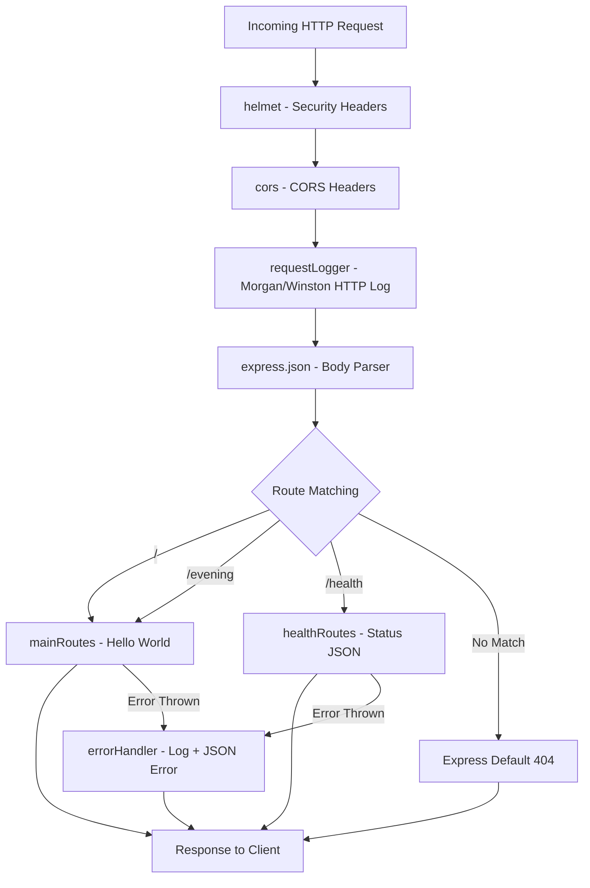

# Technical Specification

# 0. Agent Action Plan

## 0.1 Intent Clarification

### 0.1.1 Core Objective

Based on the provided requirements, the Blitzy platform understands that the objective is to transform the existing minimalist "hello_world" Node.js HTTP server into a production-grade Express.js application by introducing a comprehensive middleware pipeline, structured logging, environment-driven configuration, enhanced routing, and PM2-based process management for production deployment.

Specifically, the platform interprets the following requirements:

- **Express.js Framework Enhancement**: Evolve the existing Express 5.1.0 application from a bare-bones two-endpoint server into a fully-featured Express application with a layered middleware pipeline including security headers, CORS support, request logging, JSON body parsing, and centralized error handling — all integrated into the existing Factory Pattern architecture in `src/app.js`.
- **Routing Expansion**: Extend the current route structure (`/` and `/evening` endpoints) with a health check endpoint (`/health`) for PM2 monitoring and production readiness probing, while preserving the existing Barrel Pattern in `src/routes/index.js`.
- **Middleware Integration**: Introduce application-level middleware in a deliberate execution order — security hardening (Helmet), CORS policy enforcement, HTTP request logging (Morgan piped through Winston), JSON body parsing, and a catch-all error handler — to establish the middleware pipeline that the current `src/app.js` lacks entirely.
- **Environment Configuration**: Enhance the existing Twelve-Factor configuration module in `src/config/index.js` with dotenv-based `.env` file loading, and expand the configuration surface to include logging levels, CORS origins, and the `NODE_ENV` environment identifier — while preserving the existing default-fallback pattern for `HOST` and `PORT`.
- **Structured Logging**: Replace the current `console.log`-based startup logging in `server.js` with a Winston-based structured logging system that supports JSON-formatted output, configurable log levels, console and file transports, and integration with Morgan for HTTP access logging.
- **PM2 Production Deployment**: Prepare the application for production process management by creating a PM2 ecosystem configuration file (`ecosystem.config.js`), enhancing `server.js` with graceful shutdown signal handling (`SIGINT`, `SIGTERM`), and adding PM2-specific npm scripts to `package.json`.

These requirements translate to a cross-cutting change that touches every layer of the existing four-layer architecture (Entry, Application, Routing, Configuration) while introducing two new cross-cutting concerns (Logging and Middleware).

### 0.1.2 Task Categorization

- **Primary task type**: Mixed (Feature Enhancement + Configuration + Production Readiness)
- **Secondary aspects**: Security hardening, Observability improvement, DevOps tooling
- **Scope classification**: Cross-cutting change — modifications span all four architectural layers and introduce new horizontal concerns

### 0.1.3 Special Instructions and Constraints

- The existing Factory Pattern (ADR-002) in `src/app.js` must be preserved: the Express app must continue to be exported without calling `listen()`, ensuring Supertest-based integration tests remain functional without port allocation.
- The existing Barrel Pattern in `src/routes/index.js` must be extended rather than replaced when adding new route modules.
- CommonJS module format (`require`/`module.exports`) must be maintained throughout all new and modified files, consistent with ADR-003.
- The `'use strict'` directive must be present at the top of all new JavaScript files.
- All existing 41 tests must continue to pass after modifications; new tests must be added for all new modules and endpoints.
- Coverage thresholds (branches ≥ 75%, functions ≥ 90%, lines ≥ 80%, statements ≥ 80%) defined in `jest.config.js` must continue to be met.
- The hardcoded response values (`"Hello, World!\n"` and `"Good evening"`) must not be altered.
- Node.js >= 18.x runtime compatibility must be maintained; recommended runtime is 20.19.x LTS.

### 0.1.4 Technical Interpretation

These requirements translate to the following technical implementation strategy:

- To **enhance the Express.js framework**, we will modify `src/app.js` to mount Helmet, CORS, Morgan, and `express.json()` middleware before route registration, and add a centralized error-handling middleware after routes.
- To **add routing**, we will create `src/routes/health.routes.js` with a `GET /health` endpoint returning a JSON status payload, export it via the Barrel Pattern in `src/routes/index.js`, and mount it in `src/app.js`.
- To **integrate middleware**, we will create a `src/middleware/` directory containing `errorHandler.js` and `requestLogger.js` modules, each exported via an `index.js` barrel file, and register them in the `src/app.js` middleware pipeline.
- To **implement environment configuration**, we will add `dotenv` as a production dependency, call `require('dotenv').config()` at the earliest point in the application entry (`server.js`), and extend `src/config/index.js` with new properties for `logLevel`, `corsOrigin`, and `nodeEnv`.
- To **implement structured logging**, we will create `src/config/logger.js` as a Winston logger factory that configures Console and File transports with JSON formatting, and integrate it with Morgan via a custom write stream in `src/middleware/requestLogger.js`.
- To **prepare for PM2 deployment**, we will create `ecosystem.config.js` at the repository root with cluster mode configuration, add `SIGINT`/`SIGTERM` signal handlers to `server.js` for graceful shutdown, and add `pm2:start`, `pm2:stop`, and `pm2:restart` npm scripts to `package.json`.

## 0.2 Repository Scope Discovery

### 0.2.1 Comprehensive File Analysis

The following is an exhaustive inventory of all files and directories present in the repository, with their relevance to this enhancement initiative classified as **Direct** (will be modified), **Indirect** (affected by changes), or **Reference** (used as patterns/context).

**Entry and Application Layer:**

| File | Relevance | Analysis |
|------|-----------|----------|
| `server.js` | Direct | Entry point that binds the Express app. Must be enhanced with `dotenv` initialization, Winston logging for startup messages, and `SIGINT`/`SIGTERM` signal handlers for graceful shutdown. Currently uses `console.log` for startup logging. |
| `src/app.js` | Direct | Express app factory. Currently only mounts `mainRoutes` at `/`. Must be expanded with the full middleware pipeline (Helmet, CORS, Morgan, JSON parser, error handler) and new route mounts (health). |

**Configuration Layer:**

| File | Relevance | Analysis |
|------|-----------|----------|
| `src/config/index.js` | Direct | Configuration module with `host`, `port`, `env` properties using `process.env` with defaults. Must be extended with `logLevel`, `corsOrigin`, and `nodeEnv` properties. |

**Routing Layer:**

| File | Relevance | Analysis |
|------|-----------|----------|
| `src/routes/index.js` | Direct | Barrel file exporting `{ mainRoutes }`. Must be extended to also export `{ healthRoutes }` from the new health route module. |
| `src/routes/main.routes.js` | Indirect | Defines `GET /` and `GET /evening` routes. No modifications required, but the responses it emits will now pass through the new middleware pipeline. |
| `src/routes/README.md` | Indirect | Documentation for routes directory. Should be updated to reflect the new health route. |

**Test Infrastructure:**

| File | Relevance | Analysis |
|------|-----------|----------|
| `tests/unit/config.test.js` | Direct | 15 tests for config module. Must be extended to cover new `logLevel`, `corsOrigin`, and `nodeEnv` config properties using the existing `jest.resetModules()` cache-clearing pattern. |
| `tests/unit/routes.test.js` | Direct | 7 tests inspecting `router.stack`. Must be extended with tests for the new health route's stack structure. |
| `tests/integration/endpoints.test.js` | Direct | 14 Supertest-based endpoint tests. Must be extended with tests for `GET /health` and middleware behavior verification (CORS headers, security headers). |
| `tests/lifecycle/server.test.js` | Direct | 5 lifecycle tests with mocked app/config. Must be extended with graceful shutdown signal handling tests. |
| `jest.config.js` | Direct | Jest configuration with coverage thresholds and test patterns. May need `testPathIgnorePatterns` updates and coverage collection adjustments for new `src/middleware/` and `src/config/logger.js` modules. |

**Project Configuration:**

| File | Relevance | Analysis |
|------|-----------|----------|
| `package.json` | Direct | Project manifest. Must be updated with new production dependencies (`cors`, `helmet`, `morgan`, `winston`, `dotenv`, `pm2`), new scripts (`pm2:start`, `pm2:stop`, `pm2:restart`), and potentially an `engines` field. |
| `.gitignore` | Direct | Standard Node.js gitignore. Must be updated to include `logs/` directory, `.env` file patterns, and PM2-specific log paths. |
| `README.md` | Direct | Project documentation. Must be updated with new middleware documentation, environment variable reference, PM2 usage instructions, and updated architecture overview. |

**New Directories and Files to be Created:**

| Path | Purpose |
|------|---------|
| `src/middleware/` | New directory for middleware modules |
| `src/middleware/index.js` | Barrel export for middleware modules |
| `src/middleware/errorHandler.js` | Centralized Express error-handling middleware |
| `src/middleware/requestLogger.js` | Morgan middleware configured with Winston stream |
| `src/config/logger.js` | Winston logger factory with Console and File transports |
| `src/routes/health.routes.js` | Health check endpoint for PM2 and production probes |
| `ecosystem.config.js` | PM2 ecosystem deployment configuration |
| `.env.example` | Template for required environment variables |
| `tests/unit/logger.test.js` | Unit tests for Winston logger configuration |
| `tests/unit/middleware.test.js` | Unit tests for error handler and request logger middleware |
| `tests/unit/health.routes.test.js` | Unit tests for health route stack |
| `tests/integration/middleware.test.js` | Integration tests for middleware pipeline behavior |

### 0.2.2 Web Search Research Conducted

The following research was conducted to inform implementation decisions:

- **PM2 Production Deployment**: PM2 6.0.14 is the latest stable version for Node.js process management, supporting cluster mode, auto-restart, log management, and health checks. The `ecosystem.config.js` file format is the standard approach for configuring PM2 applications.
- **Express Security Best Practices**: The official Express security documentation recommends Helmet for HTTP header hardening, advising `app.use(helmet())` to set 13 security headers by default including `Content-Security-Policy`, `Strict-Transport-Security`, and removal of `X-Powered-By`.
- **CORS Middleware**: The `cors` npm package (v2.8.6) is the official Express/Connect CORS middleware maintained under the `expressjs` GitHub organization, providing configurable origin whitelisting, preflight handling, and method restrictions.
- **Helmet Security Headers**: Helmet v8.1.0 is the current stable version, setting 13 HTTP response headers for security hardening including CSP, HSTS, and X-Content-Type-Options.
- **Winston Logging**: Winston 3.19.0 provides structured JSON logging with pluggable transports (Console, File, HTTP) and configurable log levels aligned with npm logging conventions.
- **Morgan HTTP Logging**: Morgan 1.10.1 is the standard Express HTTP request logger supporting predefined formats (`combined`, `dev`) and custom stream output integration.
- **Dotenv Configuration**: Dotenv 16.4.7 is the latest stable release in the well-tested 16.x line, providing `.env` file parsing and `process.env` population.

### 0.2.3 Existing Infrastructure Assessment

- **Project Structure**: Four-layer architecture (Entry → Application → Routing → Configuration) organized in `server.js`, `src/app.js`, `src/routes/`, and `src/config/`.
- **Design Patterns**: Factory Pattern for app creation (ADR-002), Barrel Pattern for module aggregation, CommonJS modules with strict mode (ADR-003).
- **Build Configuration**: No build step required — raw Node.js execution via `node server.js`. No transpilation, bundling, or TypeScript.
- **Testing Infrastructure**: Jest 30.2.0 with Supertest 7.1.4. Three-tier test strategy (unit, integration, lifecycle). Coverage thresholds enforced via `jest.config.js`. Factory Pattern enables portless integration testing.
- **Documentation**: `README.md` with prerequisites, installation, API reference, project structure, and architecture sections.
- **Version Control**: Standard `.gitignore` for Node.js projects (node_modules, coverage, logs, .env, IDE files). No CI/CD pipeline configuration files present.
- **Process Management**: No existing process manager. Server runs directly via `node server.js`. No graceful shutdown handlers. `EADDRINUSE` error is absorbed without crashing.
- **Logging**: Console-only logging via `console.log` in `server.js` startup. No structured logging, no log files, no HTTP access logging.
- **Middleware**: Zero application middleware registered. Express default 404 handler is the only error path. No security headers, CORS, or request parsing configured.

## 0.3 File Transformation Mapping

### 0.3.1 File-by-File Execution Plan

The table below maps every file to be created, updated, deleted, or referenced, with the target file listed first.

| Target File | Transformation | Source File/Reference | Purpose/Changes |
|---|---|---|---|
| `src/app.js` | UPDATE | `src/app.js` | Mount Helmet, CORS, Morgan, express.json() middleware before routes; register health routes; add centralized error-handling middleware after routes |
| `src/config/index.js` | UPDATE | `src/config/index.js` | Extend config object with `logLevel`, `corsOrigin`, `nodeEnv` properties from process.env with sensible defaults |
| `src/config/logger.js` | CREATE | `src/config/index.js` | Create Winston logger factory with Console and File transports, JSON formatting, and configurable log level |
| `src/middleware/index.js` | CREATE | `src/routes/index.js` | Create barrel export for middleware modules following existing Barrel Pattern |
| `src/middleware/errorHandler.js` | CREATE | — | Create Express 4-argument error-handling middleware with structured error responses and Winston logging |
| `src/middleware/requestLogger.js` | CREATE | — | Create Morgan middleware instance configured with `combined` format and Winston write stream |
| `src/routes/health.routes.js` | CREATE | `src/routes/main.routes.js` | Create health check router with GET /health endpoint returning JSON status, uptime, and timestamp |
| `src/routes/index.js` | UPDATE | `src/routes/index.js` | Add `healthRoutes` export alongside existing `mainRoutes` export |
| `server.js` | UPDATE | `server.js` | Add dotenv initialization at top; replace console.log with Winston; add SIGINT/SIGTERM graceful shutdown handlers |
| `package.json` | UPDATE | `package.json` | Add cors, helmet, morgan, winston, dotenv as production dependencies; add pm2 as dev dependency; add pm2:start, pm2:stop, pm2:restart scripts |
| `ecosystem.config.js` | CREATE | — | Create PM2 ecosystem config with app name, entry script, cluster mode instances, env vars, log paths |
| `.env.example` | CREATE | `src/config/index.js` | Create template documenting all supported environment variables with descriptions and example values |
| `.gitignore` | UPDATE | `.gitignore` | Add logs/ directory pattern and ensure .env is covered; add pm2-specific patterns |
| `README.md` | UPDATE | `README.md` | Update with middleware documentation, environment variable reference table, PM2 usage, updated architecture diagram |
| `jest.config.js` | UPDATE | `jest.config.js` | Add new source paths to collectCoverageFrom if needed; ensure new test directories are matched |
| `tests/unit/config.test.js` | UPDATE | `tests/unit/config.test.js` | Add test cases for logLevel, corsOrigin, nodeEnv config properties using existing jest.resetModules pattern |
| `tests/unit/routes.test.js` | UPDATE | `tests/unit/routes.test.js` | Add stack inspection tests for the new health route module |
| `tests/unit/logger.test.js` | CREATE | `tests/unit/config.test.js` | Create unit tests for Winston logger factory: transport configuration, log level defaults, format verification |
| `tests/unit/middleware.test.js` | CREATE | `tests/unit/routes.test.js` | Create unit tests for errorHandler (4-arg signature, error response format) and requestLogger (stream config) |
| `tests/unit/health.routes.test.js` | CREATE | `tests/unit/routes.test.js` | Create stack inspection tests for health route GET /health definition |
| `tests/integration/endpoints.test.js` | UPDATE | `tests/integration/endpoints.test.js` | Add GET /health response tests; add middleware header verification (Helmet security headers, CORS headers) |
| `tests/integration/middleware.test.js` | CREATE | `tests/integration/endpoints.test.js` | Create integration tests for full middleware pipeline: security headers, CORS, error handling, JSON parsing |
| `tests/lifecycle/server.test.js` | UPDATE | `tests/lifecycle/server.test.js` | Add tests for graceful shutdown behavior (SIGTERM/SIGINT signal handling, server.close invocation) |
| `src/routes/main.routes.js` | REFERENCE | — | Use as pattern reference for health.routes.js route structure |
| `tests/integration/endpoints.test.js` | REFERENCE | — | Use as pattern reference for new integration test structure |
| `tests/lifecycle/server.test.js` | REFERENCE | — | Use as pattern reference for signal handling lifecycle tests |

### 0.3.2 New Files Detail

- **`src/config/logger.js`** — Winston logger factory
  - Content type: source
  - Based on: Configuration module pattern from `src/config/index.js`
  - Key exports: Singleton logger instance with `info`, `warn`, `error`, `debug` methods
  - Transports: Console (colorized in development, JSON in production), File (`logs/error.log` for error level, `logs/combined.log` for all levels)

- **`src/middleware/index.js`** — Middleware barrel export
  - Content type: source
  - Based on: Barrel Pattern in `src/routes/index.js`
  - Key exports: `{ errorHandler, requestLogger }`

- **`src/middleware/errorHandler.js`** — Error-handling middleware
  - Content type: source
  - Based on: Express error-handling convention (4-argument signature)
  - Key function: `(err, req, res, next)` middleware that logs errors via Winston and returns structured JSON error response with appropriate status codes

- **`src/middleware/requestLogger.js`** — HTTP request logging middleware
  - Content type: source
  - Based on: Morgan + Winston integration pattern
  - Key export: Configured Morgan middleware instance using `combined` format with a custom `stream.write` piped through Winston's `info` level

- **`src/routes/health.routes.js`** — Health check endpoint
  - Content type: source
  - Based on: Route structure pattern from `src/routes/main.routes.js`
  - Key route: `GET /health` returning `{ status: 'ok', uptime: process.uptime(), timestamp: Date.now() }`

- **`ecosystem.config.js`** — PM2 configuration
  - Content type: config
  - Based on: PM2 ecosystem file specification
  - Key sections: `apps` array with `name`, `script`, `instances`, `exec_mode`, `env`, `env_production`

- **`.env.example`** — Environment variable template
  - Content type: config
  - Based on: Properties defined in `src/config/index.js`
  - Key variables: `HOST`, `PORT`, `NODE_ENV`, `LOG_LEVEL`, `CORS_ORIGIN`

- **`tests/unit/logger.test.js`** — Logger unit tests
  - Content type: test
  - Based on: Test patterns from `tests/unit/config.test.js`
  - Key test cases: Default log level, transport count, format verification, environment-aware configuration

- **`tests/unit/middleware.test.js`** — Middleware unit tests
  - Content type: test
  - Based on: Test patterns from `tests/unit/routes.test.js`
  - Key test cases: Error handler function signature, response format, status code mapping; request logger stream configuration

- **`tests/unit/health.routes.test.js`** — Health route unit tests
  - Content type: test
  - Based on: Stack inspection pattern from `tests/unit/routes.test.js`
  - Key test cases: Router stack includes GET /health, route handler returns JSON with expected keys

- **`tests/integration/middleware.test.js`** — Middleware integration tests
  - Content type: test
  - Based on: Supertest patterns from `tests/integration/endpoints.test.js`
  - Key test cases: Security headers present on responses, CORS headers on cross-origin requests, error handler catches thrown errors, JSON body parsing works

### 0.3.3 Files to Modify Detail

- **`src/app.js`** — Middleware pipeline integration
  - Current state: Imports Express and `mainRoutes`, mounts routes at `/`, exports app
  - Sections to update: After `const app = express()` line, before route mounting
  - New content to add: Import and mount Helmet, CORS, request logger (Morgan), `express.json()` middleware; import and mount `healthRoutes` at `/`; add error handler middleware after all routes
  - Content to remove: None — additive changes only

- **`src/config/index.js`** — Extended configuration properties
  - Current state: Exports `{ host, port, env }` with `process.env` fallback to defaults
  - Sections to update: The exported configuration object
  - New content to add: Three new properties: `logLevel` (default `'info'`), `corsOrigin` (default `'*'`), `nodeEnv` (default `'development'`)
  - Content to remove: None

- **`src/routes/index.js`** — Extended barrel exports
  - Current state: `module.exports = { mainRoutes }` from `./main.routes`
  - New content to add: Import and re-export `healthRoutes` from `./health.routes`

- **`server.js`** — Production-ready entry point
  - Current state: Requires app and config, calls `app.listen()`, logs with `console.log`
  - New content to add: `require('dotenv').config()` at top (before config import); replace `console.log` with Winston logger; add `SIGTERM`/`SIGINT` process signal handlers that invoke `server.close()` and `process.exit()`
  - Refactoring needed: Store `app.listen()` return value in `server` variable (currently not stored) to enable graceful shutdown via `server.close()`

- **`package.json`** — Dependencies and scripts
  - Dependencies to add: `cors`, `dotenv`, `helmet`, `morgan`, `winston` (production); `pm2` (dev)
  - Scripts to add: `"pm2:start"`, `"pm2:stop"`, `"pm2:restart"`

- **`.gitignore`** — Additional ignore patterns
  - New content to add: `logs/` directory, PM2 log patterns (`*.pm2.log`)

- **`README.md`** — Documentation overhaul
  - Sections to update: Prerequisites, Installation, Usage, API Reference, Project Structure, Architecture
  - New content to add: Environment variables table, middleware documentation, PM2 deployment section, updated project structure tree

- **`jest.config.js`** — Test configuration expansion
  - Sections to update: `collectCoverageFrom` array if it exists, or verify new files are auto-detected by existing patterns

### 0.3.4 Configuration and Documentation Updates

- **Configuration changes:**
  - `src/config/index.js`: Add `logLevel`, `corsOrigin`, `nodeEnv` properties. Impact: All modules consuming config gain access to logging and CORS settings.
  - `ecosystem.config.js`: New PM2 config enabling `cluster` mode with `max` instances. Impact: Production deployments will use all available CPU cores.
  - `.env.example`: Template for `HOST`, `PORT`, `NODE_ENV`, `LOG_LEVEL`, `CORS_ORIGIN`. Impact: Developers gain self-documented environment setup.

- **Documentation updates:**
  - `README.md`: Add Environment Variables section, Middleware section, PM2 Deployment section, updated Architecture diagram
  - `src/routes/README.md`: Update with health route documentation
  - Cross-references to update: Project structure tree in `README.md` must reflect new `src/middleware/`, `src/config/logger.js`, and `ecosystem.config.js`

### 0.3.5 Cross-File Dependencies

- **Import/reference updates required:**
  - `src/app.js` must import from: `src/middleware/index.js`, `src/config/logger.js`, `src/routes/index.js` (updated), `helmet`, `cors`
  - `src/middleware/requestLogger.js` must import from: `morgan`, `src/config/logger.js`
  - `src/middleware/errorHandler.js` must import from: `src/config/logger.js`
  - `server.js` must import from: `dotenv`, `src/config/logger.js`

- **Configuration sync requirements:**
  - `.env.example` must stay synchronized with all properties in `src/config/index.js`
  - `ecosystem.config.js` env variables must align with `src/config/index.js` defaults
  - `README.md` environment variables table must mirror `.env.example`

- **Documentation consistency needs:**
  - API reference in `README.md` must include new `GET /health` endpoint
  - Architecture section must reflect the new Middleware layer
  - Project structure tree must include all new files and directories

## 0.4 Dependency Inventory

### 0.4.1 Key Private and Public Packages

The following table documents all packages relevant to this enhancement, including existing dependencies that form the foundation and new dependencies required by the implementation.

**Existing Dependencies (No Changes):**

| Registry | Package Name | Version | Purpose |
|----------|-------------|---------|---------|
| npm | express | ^5.1.0 | Core web framework — HTTP server, routing, middleware pipeline |
| npm | jest | ^30.2.0 | Test runner and assertion library (devDependency) |
| npm | supertest | ^7.1.4 | HTTP integration testing against Express apps (devDependency) |

**New Production Dependencies:**

| Registry | Package Name | Version | Purpose |
|----------|-------------|---------|---------|
| npm | cors | ^2.8.6 | CORS middleware — sets Access-Control-Allow-Origin and related response headers for cross-origin requests |
| npm | helmet | ^8.1.0 | Security middleware — sets 13 HTTP security headers including CSP, HSTS, and X-Content-Type-Options |
| npm | morgan | ^1.10.1 | HTTP request logger — logs incoming request method, URL, status, and response time in configurable formats |
| npm | winston | ^3.19.0 | Structured logging library — provides JSON formatting, multiple transports (Console, File), and configurable log levels |
| npm | dotenv | ^16.4.7 | Environment configuration — parses `.env` files and populates `process.env` at application startup |

**New Development Dependencies:**

| Registry | Package Name | Version | Purpose |
|----------|-------------|---------|---------|
| npm | pm2 | ^6.0.14 | Process manager — enables cluster mode, auto-restart, log management, and health monitoring for production Node.js deployments |

### 0.4.2 Dependency Updates

- **New production dependencies to add:**
  - `cors`: ^2.8.6 — Required for cross-origin resource sharing policy enforcement on all endpoints
  - `helmet`: ^8.1.0 — Required for production security header hardening per Express.js official best practices
  - `morgan`: ^1.10.1 — Required for HTTP access logging, integrated with Winston via custom stream
  - `winston`: ^3.19.0 — Required for structured application logging replacing `console.log`
  - `dotenv`: ^16.4.7 — Required for `.env` file loading to externalize configuration per Twelve-Factor methodology

- **New development dependencies to add:**
  - `pm2`: ^6.0.14 — Required for production process management, cluster mode, and graceful restarts. Installed as devDependency because production servers install PM2 globally.

- **Dependencies to update:** None — all existing dependencies remain at their current versions.

- **Dependencies to remove:** None.

### 0.4.3 Import/Reference Updates

- **Files requiring new imports:**
  - `server.js` — Add `require('dotenv').config()` at entry; add `const logger = require('./src/config/logger')`
  - `src/app.js` — Add `require('cors')`, `require('helmet')`, `require('./middleware')`, `require('./config/logger')`
  - `src/middleware/requestLogger.js` — Add `require('morgan')`, `require('../config/logger')`
  - `src/middleware/errorHandler.js` — Add `require('../config/logger')`
  - `src/config/logger.js` — Add `require('winston')`, `require('./index')`

- **Import transformation rules:**
  - Old (`server.js`): `console.log(\`Server running...\`)`
  - New (`server.js`): `logger.info('Server running', { host, port })`
  - Apply to: `server.js` — all `console.log` calls replaced with Winston logger methods

## 0.5 Implementation Design

### 0.5.1 Technical Approach

**Primary objectives with implementation approach:**

- Achieve **middleware integration** by modifying `src/app.js` to register Helmet, CORS, Morgan, and `express.json()` middleware in a deliberate execution order before route mounting, and adding a centralized error-handling middleware after all routes — establishing a production-grade request processing pipeline.
- Achieve **structured logging** by creating `src/config/logger.js` as a Winston logger factory that reads the log level from `src/config/index.js` and configures Console transport (colorized in development, JSON in production) and File transports (`logs/error.log` for errors, `logs/combined.log` for all), then integrating it across `server.js`, `src/middleware/errorHandler.js`, and `src/middleware/requestLogger.js`.
- Achieve **environment-driven configuration** by adding `dotenv` initialization at the earliest point in `server.js` (before any config imports), and extending `src/config/index.js` with new properties (`logLevel`, `corsOrigin`, `nodeEnv`) so all modules consume environment-specific settings through the existing centralized config pattern.
- Achieve **production deployment readiness** by creating `ecosystem.config.js` for PM2 cluster-mode process management, adding `SIGINT`/`SIGTERM` handlers in `server.js` for graceful shutdown, and introducing PM2-specific npm scripts in `package.json`.

**Logical implementation flow:**

- First, establish the **configuration foundation** by adding `dotenv` initialization to `server.js` and extending `src/config/index.js` with new environment properties, ensuring all subsequent modules can read the expanded configuration.
- Next, create the **logging infrastructure** by building `src/config/logger.js` as a Winston singleton, so that all modules created afterward can import and use structured logging immediately.
- Then, build the **middleware modules** by creating `src/middleware/errorHandler.js` (which depends on the logger) and `src/middleware/requestLogger.js` (which depends on both Morgan and the logger), exported via `src/middleware/index.js`.
- Then, create the **health check route** in `src/routes/health.routes.js` and export it through `src/routes/index.js`, following the established Barrel Pattern.
- Next, integrate **all new components into `src/app.js`** by importing middleware and routes, then mounting them in the correct order: security middleware → CORS → request logging → body parsing → routes → error handler.
- Then, enhance **`server.js`** with Winston-based startup logging and graceful shutdown signal handlers that close the HTTP server before exiting the process.
- Finally, create the **PM2 ecosystem configuration** and update `package.json`, `.gitignore`, and `README.md` to complete the production readiness package.

### 0.5.2 Component Impact Analysis

**Direct modifications required:**

- `src/app.js`: Transform from a bare route-mounting factory into a fully-featured Express application with a six-stage middleware pipeline. The existing `mainRoutes` mount is preserved but surrounded by new middleware registrations.
- `src/config/index.js`: Extend the exported configuration object from 3 to 6 properties, maintaining the same `process.env` → parse → default resolution pattern.
- `src/routes/index.js`: Expand the barrel export from one route module to two, adding `healthRoutes` alongside `mainRoutes`.
- `server.js`: Restructure to: (1) load dotenv first, (2) use Winston for logging, (3) store the server reference, and (4) handle shutdown signals — while preserving the existing `app.listen()` binding behavior.
- `package.json`: Add 5 production dependencies, 1 dev dependency, and 3 new scripts.
- `jest.config.js`: Verify/update coverage collection paths to include new source modules.

**Indirect impacts and dependencies:**

- `src/routes/main.routes.js`: Unchanged, but its responses will now transit through Helmet (security headers added), CORS (access-control headers added), and Morgan (requests logged). Integration tests must verify this pipeline effect.
- All existing tests: The middleware pipeline in `src/app.js` means Supertest-based integration tests will now receive additional HTTP headers (Helmet, CORS) in responses. Existing assertions on `res.headers` must not break — they should pass since they test for specific headers rather than exact header sets.
- `tests/lifecycle/server.test.js`: The mock structure for `server.js` must be updated because `server.js` will now import `dotenv` and `logger` in addition to `app` and `config`.

**New components introduction:**

- `src/config/logger.js`: Winston logger singleton — provides the logging backbone consumed by `server.js`, `errorHandler.js`, and `requestLogger.js`. Rationale: Centralizes logging configuration, avoids scattered `console.log`, enables JSON-formatted logs for production log aggregation.
- `src/middleware/errorHandler.js`: Express error-handling middleware — catches unhandled errors from route handlers, logs them via Winston, and returns a standardized JSON error response. Rationale: The current application has no error handling beyond Express's default 404; production applications must not leak stack traces.
- `src/middleware/requestLogger.js`: Morgan middleware configured with Winston stream — logs every HTTP request with method, URL, status, and response time. Rationale: HTTP access logs are essential for production debugging and monitoring.
- `src/routes/health.routes.js`: Health check endpoint — returns application status, uptime, and timestamp at `GET /health`. Rationale: PM2 and load balancers require a health endpoint to determine instance availability.
- `ecosystem.config.js`: PM2 ecosystem configuration — defines application name, entry script, cluster mode, instance count, and environment-specific variables. Rationale: PM2 ecosystem files are the standard declarative approach for PM2 deployments.

### 0.5.3 Middleware Pipeline Architecture

The following diagram illustrates the request processing flow through the enhanced middleware pipeline in `src/app.js`:

```mermaid
graph TD
    A[Incoming HTTP Request] --> B[helmet - Security Headers]
    B --> C[cors - CORS Headers]
    C --> D[requestLogger - Morgan/Winston HTTP Log]
    D --> E[express.json - Body Parser]
    E --> F{Route Matching}
    F -->|"/"| G[mainRoutes - Hello World]
    F -->|"/evening"| G
    F -->|"/health"| H[healthRoutes - Status JSON]
    F -->|No Match| I[Express Default 404]
    G --> J[Response to Client]
    H --> J
    I --> J
    G -->|Error Thrown| K[errorHandler - Log + JSON Error]
    H -->|Error Thrown| K
    K --> J
```

### 0.5.4 Critical Implementation Details

**Design patterns to be employed:**

- **Factory Pattern** (preserved): `src/app.js` continues to create and export the Express app without binding to a port, enabling both direct execution via `server.js` and portless integration testing via Supertest.
- **Barrel Pattern** (extended): `src/routes/index.js` and the new `src/middleware/index.js` aggregate module exports, maintaining a single-import interface for consumers.
- **Singleton Pattern** (new): `src/config/logger.js` exports a single configured Winston logger instance reused across all modules, avoiding duplicate transport creation.
- **Middleware Chain Pattern** (new): Express middleware registered in `src/app.js` executes in registration order, forming a pipeline where each middleware transforms the request/response before passing control via `next()`.

**Key algorithms and approaches:**

- **Graceful shutdown sequence**: On receiving `SIGTERM` or `SIGINT`, invoke `server.close()` to stop accepting new connections, wait for in-flight requests to complete, log the shutdown event via Winston, then call `process.exit(0)`. This prevents abrupt connection drops during PM2 restarts or deployments.
- **Morgan-Winston stream bridge**: Create a `stream` object with a `write(message)` method that calls `logger.info(message.trim())`, then pass this stream as Morgan's `stream` option. This pipes HTTP access logs through Winston's transport system rather than stdout.

**Error handling and edge case considerations:**

- The error handler middleware must be registered as the **last** middleware in `src/app.js` (Express requirement for error middleware).
- The error handler must check `NODE_ENV` to conditionally include stack traces: include in `development`, omit in `production`.
- The health endpoint must remain functional even if other middleware experiences issues — it should be a lightweight status check.
- If `logs/` directory does not exist when Winston attempts to write, Winston's File transport should create it (using the `dirname` option or mkdir before initialization).

**Performance and security considerations:**

- Helmet is registered first in the pipeline to ensure security headers are set on all responses, including error responses and 404s.
- CORS middleware is registered before route handlers to handle preflight `OPTIONS` requests efficiently.
- Morgan is set to `combined` format for production (full Apache-style access logs) and `dev` format for development (concise colorized output).
- The `express.json()` middleware includes a default body size limit of 100kb, which is appropriate for this application's scope.
- PM2 cluster mode enables multi-core utilization; the stateless nature of this application (no sessions, no database) makes it ideal for horizontal scaling.

## 0.6 Scope Boundaries

### 0.6.1 Exhaustively In Scope

**Source code changes:**
- `src/app.js` — Middleware pipeline integration and health route mounting
- `src/config/index.js` — Extended configuration properties
- `src/config/logger.js` — New Winston logger factory module
- `src/middleware/index.js` — New middleware barrel export
- `src/middleware/errorHandler.js` — New error-handling middleware
- `src/middleware/requestLogger.js` — New Morgan/Winston request logger
- `src/routes/index.js` — Extended barrel with health route export
- `src/routes/health.routes.js` — New health check endpoint
- `server.js` — Dotenv initialization, Winston logging, graceful shutdown

**Configuration updates:**
- `package.json` — New dependencies (`cors`, `helmet`, `morgan`, `winston`, `dotenv`, `pm2`) and PM2 scripts
- `ecosystem.config.js` — New PM2 ecosystem deployment configuration
- `.env.example` — New environment variable template
- `.gitignore` — Extended ignore patterns for `logs/` and PM2 artifacts
- `jest.config.js` — Coverage path verification for new modules

**Documentation updates:**
- `README.md` — Full documentation overhaul: middleware, environment variables, PM2 deployment, architecture
- `src/routes/README.md` — Health route documentation addition

**Test updates:**
- `tests/unit/config.test.js` — New config property tests
- `tests/unit/routes.test.js` — Health route stack inspection tests
- `tests/unit/logger.test.js` — New logger factory tests
- `tests/unit/middleware.test.js` — New middleware module tests
- `tests/unit/health.routes.test.js` — New health route unit tests
- `tests/integration/endpoints.test.js` — Health endpoint and middleware header tests
- `tests/integration/middleware.test.js` — New middleware pipeline integration tests
- `tests/lifecycle/server.test.js` — Graceful shutdown signal handling tests

### 0.6.2 Explicitly Out of Scope

- **Database integration**: No database, ORM, or data persistence layer will be introduced. The application remains stateless.
- **Authentication and authorization**: No auth middleware, JWT handling, session management, or user identity features.
- **Rate limiting**: No `express-rate-limit` or similar throttling middleware. While mentioned as a best practice, it is not in the user's requirements.
- **API versioning**: No `/api/v1/` path prefixing or version negotiation mechanism.
- **HTTPS/TLS termination**: No SSL certificate management or HTTPS server creation. TLS is expected to be handled by a reverse proxy in production.
- **Docker containerization**: No Dockerfile, docker-compose, or container image creation despite PM2 being configured.
- **CI/CD pipeline**: No GitHub Actions, GitLab CI, or other pipeline configurations.
- **Static file serving**: No `express.static()` middleware or public asset directory.
- **WebSocket support**: No real-time communication, Socket.io, or WebSocket upgrades.
- **Request validation**: No `joi`, `zod`, `express-validator`, or body/query schema validation.
- **OpenAPI/Swagger documentation**: No auto-generated API documentation or specification files.
- **Performance testing**: No load testing, benchmarking, or performance profiling tooling.
- **Monitoring/APM**: No application performance monitoring integration (e.g., New Relic, Datadog) beyond PM2's built-in metrics.
- **Modification of existing route responses**: The `"Hello, World!\n"` and `"Good evening"` response bodies remain unchanged.
- **TypeScript migration**: The project remains in CommonJS JavaScript without type definitions.
- **Linting/formatting**: No ESLint, Prettier, or other code quality tooling additions.

## 0.7 Execution Parameters

### 0.7.1 Special Execution Instructions

- **Process management**: PM2 is introduced as a development dependency for local testing and as the prescribed production process manager. The `ecosystem.config.js` file must be the single source of truth for PM2 configuration — no command-line overrides.
- **Testing requirements**: All 41 existing tests must continue to pass after modifications. New tests must be created for every new module and endpoint. The Jest coverage thresholds (branches ≥ 75%, functions ≥ 90%, lines ≥ 80%, statements ≥ 80%) must be maintained. Tests must use the existing three-tier structure: `tests/unit/`, `tests/integration/`, `tests/lifecycle/`.
- **Module format**: All new files must use CommonJS (`require`/`module.exports`) with the `'use strict'` directive at the top, consistent with the existing codebase convention (ADR-003).
- **Factory Pattern preservation**: The `src/app.js` module must continue to export the Express application without calling `listen()`. This is critical for Supertest integration testing, which creates an in-memory server against the app object. Any change that introduces port binding in `src/app.js` will break the integration test suite.
- **Environment variable precedence**: The `dotenv` module must be loaded at the top of `server.js` (the single entry point) before any config module is imported. The configuration module in `src/config/index.js` must continue to read from `process.env` — dotenv simply populates `process.env` from the `.env` file without overriding existing system environment variables.
- **Log output**: In development mode, console logs should be colorized and human-readable. In production mode, all logs (including HTTP access logs) must be JSON-formatted for machine parsing by log aggregation systems.

### 0.7.2 Constraints and Boundaries

- **Runtime constraint**: Node.js >= 18.x required; 20.19.x LTS recommended. All new code must avoid Node.js APIs not available in v18.
- **Express version constraint**: Express 5.1.0 is the pinned major version. All middleware must be compatible with Express 5.x. Note that Express 5 removed some legacy APIs; middleware must use the Express 5 compatible interfaces.
- **Backward compatibility**: Existing `GET /` and `GET /evening` endpoints must return identical response bodies and status codes. The only permitted change to their HTTP responses is the addition of new headers (via Helmet, CORS).
- **No breaking changes to test infrastructure**: `jest.config.js` patterns, coverage thresholds, and test directory conventions must be preserved. New test files must match existing `testMatch` patterns.
- **File system considerations**: The `logs/` directory must be gitignored but created automatically by Winston's File transport configuration or by an explicit directory creation check in the logger module.
- **No interactive commands**: All npm scripts, PM2 commands, and build steps must run non-interactively. PM2 commands should use `--no-daemon` flag for foreground execution where appropriate.
- **Dependency version pinning**: All new dependencies use caret (`^`) version ranges in `package.json` to allow compatible patch/minor updates, consistent with the existing `express ^5.1.0` pattern.

## 0.8 Rules

### 0.8.1 Architectural Rules

- **Preserve the Factory Pattern** in `src/app.js`: The Express app must be created and exported without calling `listen()`. The `server.js` entry point is the only module permitted to bind to a port. This separation is foundational to the test strategy and must not be violated.
- **Extend the Barrel Pattern** when adding new modules: New route files must be exported through `src/routes/index.js` and new middleware through `src/middleware/index.js`. Direct imports bypassing barrel files are prohibited in consuming modules (`src/app.js`, `server.js`).
- **Maintain the four-layer architecture** (Entry → Application → Routing → Configuration): New modules must be placed in the correct layer. The new `src/middleware/` directory represents a legitimate fifth concern but integrates through the Application layer (`src/app.js`).

### 0.8.2 Code Style Rules

- **Use CommonJS modules** (`require`/`module.exports`) in all files. No ES Module syntax (`import`/`export`).
- **Include `'use strict'` directive** at the top of every new JavaScript file.
- **Follow existing naming conventions**: Route files use `*.routes.js` suffix. Config files reside in `src/config/`. Test files use `*.test.js` suffix in the appropriate tier directory.
- **Match existing code formatting**: Consistent indentation, string quoting, and semicolon usage as observed in existing files like `src/app.js` and `src/routes/main.routes.js`.

### 0.8.3 Testing Rules

- **All 41 existing tests must pass** after all modifications. Zero tolerance for regressions.
- **Coverage thresholds must be maintained**: Branches ≥ 75%, Functions ≥ 90%, Lines ≥ 80%, Statements ≥ 80%.
- **New modules require corresponding tests** in the appropriate test tier:
  - New source modules → unit tests in `tests/unit/`
  - New endpoints → integration tests in `tests/integration/`
  - New lifecycle behaviors → lifecycle tests in `tests/lifecycle/`
- **Follow established test patterns**: Use `jest.resetModules()` for config tests, `router.stack` inspection for route unit tests, and Supertest `request(app)` for integration tests.

### 0.8.4 Configuration Rules

- **No hardcoded configuration values** in source modules. All environment-specific values must flow through `src/config/index.js`.
- **Every environment variable must have a default** in `src/config/index.js`, ensuring the application starts without any `.env` file present.
- **The `.env.example` file must be kept in sync** with the properties exported by `src/config/index.js`. Every config property must have a corresponding documented variable in `.env.example`.

### 0.8.5 Dependency Rules

- **Do not modify existing dependency versions**: `express ^5.1.0`, `jest ^30.2.0`, and `supertest ^7.1.4` must remain at their current version specifications.
- **Use caret (`^`) version ranges** for all new dependencies, consistent with the existing dependency specification pattern.
- **PM2 is a devDependency**: It is installed globally on production servers and used locally only for testing the ecosystem configuration.

### 0.8.6 Response Integrity Rules

- **Do not alter existing endpoint responses**: `GET /` must continue to return `"Hello, World!\n"` with status 200. `GET /evening` must continue to return `"Good evening"` with status 200. The only permitted additions to responses are new HTTP headers introduced by middleware.
- **The health endpoint must return JSON**: `GET /health` must return `Content-Type: application/json` with a body containing `status`, `uptime`, and `timestamp` fields.

## 0.9 References

### 0.9.1 Repository Files Searched

The following files and folders were comprehensively searched and analyzed to derive the conclusions in this Agent Action Plan:

**Root-Level Files:**
- `package.json` — Project manifest with dependencies, scripts, and metadata
- `server.js` — Application entry point with Express app binding and startup logging
- `.gitignore` — Version control ignore patterns for Node.js projects
- `README.md` — Project documentation with prerequisites, usage, API reference, and architecture
- `jest.config.js` — Jest test runner configuration with coverage thresholds and test patterns

**Source Directory (`src/`):**
- `src/app.js` — Express application factory implementing the Factory Pattern
- `src/config/index.js` — Centralized configuration module with environment variable resolution
- `src/routes/index.js` — Barrel export file aggregating route modules
- `src/routes/main.routes.js` — Main router defining GET / and GET /evening endpoints
- `src/routes/README.md` — Routes directory documentation

**Test Directory (`tests/`):**
- `tests/unit/config.test.js` — 15 unit tests for configuration module behavior
- `tests/unit/routes.test.js` — 7 unit tests for router stack inspection
- `tests/integration/endpoints.test.js` — 14 integration tests for HTTP endpoint responses
- `tests/lifecycle/server.test.js` — 5 lifecycle tests for server startup and binding behavior

**Folders Explored:**
- Root (`""`) — Repository root structure
- `src/` — Application source code directory
- `src/routes/` — Route module directory
- `src/config/` — Configuration module directory
- `tests/` — Test root directory
- `tests/unit/` — Unit test directory
- `tests/integration/` — Integration test directory
- `tests/lifecycle/` — Lifecycle test directory

### 0.9.2 Technical Specification Sections Retrieved

- **1.1 Executive Summary** — Project overview, Blitzy refactoring context, REQ-001 (Express) and REQ-002 (New endpoint)
- **3.1 Programming Languages** — JavaScript/ECMAScript on Node.js, CommonJS modules, strict mode
- **Node.js Runtime Versions** — Minimum >= 18.x, Recommended 20.19.x LTS
- **3.2 Frameworks & Libraries** — Express.js framework header
- **Express.js 5.1.0** — Express 5.1.0 as sole production dependency
- **3.3 Open Source Dependencies** — express (prod), jest and supertest (dev), package-lock.json v3
- **5.1 High-Level Architecture** — Four-layer architecture (Entry, Application, Routing, Configuration)
- **4.2 Server Startup Process** — Synchronous module loading, async server binding, config resolution flow
- **4.4 Error Handling Flows** — Express default 404 handler, EADDRINUSE absorption, no retry mechanisms
- **6.6 Testing Strategy** — Jest 30.2.0 + Supertest 7.1.4, three-tier testing, 100% coverage, exclusions

### 0.9.3 External Research Sources

- **npm registry: cors** — Version 2.8.6 confirmed as latest. Official Express/Connect CORS middleware under the expressjs GitHub organization.
- **npm registry: helmet** — Version 8.1.0 confirmed as latest stable. Sets 13 HTTP security headers for Express applications.
- **Express.js Security Best Practices** — Official Express documentation recommending Helmet, dependency auditing, and TLS for production deployments (expressjs.com/en/advanced/best-practice-security.html).

### 0.9.4 Attachments and External Metadata

- No attachments were provided for this project.
- No Figma URLs or design files were referenced.
- No environment files were found in `/tmp/environments_files`.
- No `.blitzyignore` files were found in the repository.
- No user-specified setup instructions were provided.

