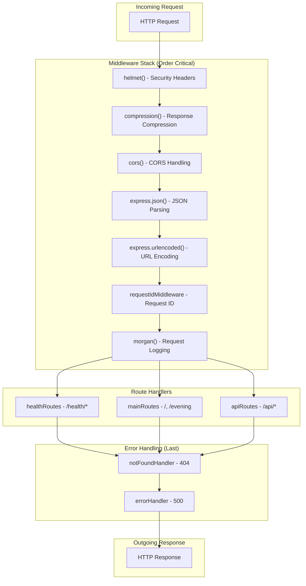
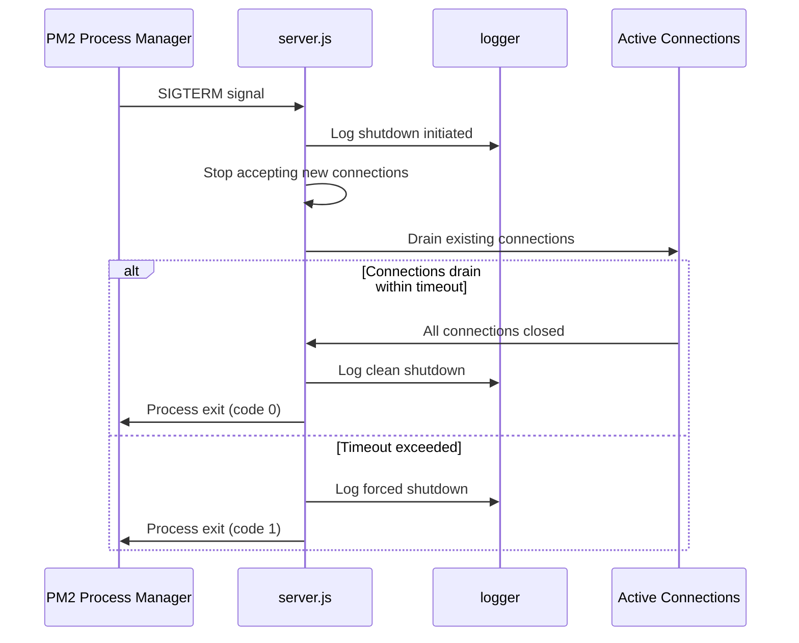
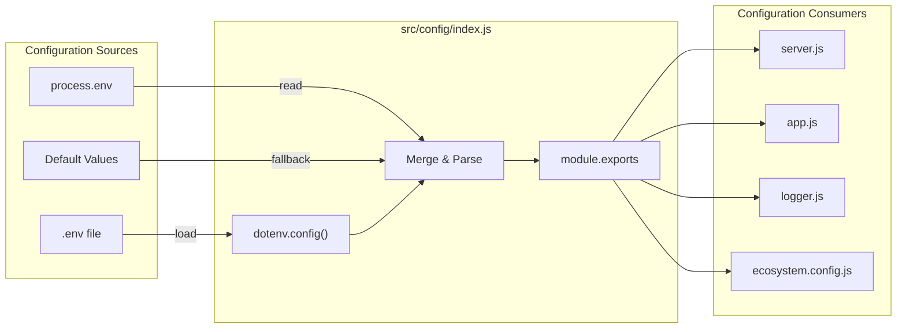

# Technical Specification

# 0. Agent Action Plan

## 0.1 Intent Clarification

### 0.1.1 Core Objective

Based on the provided requirements, the Blitzy platform understands that the objective is to **enhance a basic Node.js/Express.js HTTP server** with production-ready capabilities. The current implementation is a minimal tutorial-grade "Hello World" service that must be evolved into a fully operational, deployment-ready application with enterprise-grade features.

**Explicit Requirements Identified:**

| # | Requirement | Enhanced Clarity |
|---|-------------|------------------|
| 1 | Add routing | Expand existing Express Router implementation with organized route modules, API versioning support, and health check endpoints |
| 2 | Add middleware | Implement a comprehensive middleware stack including body parsing, security headers (helmet), compression, CORS, and error handling |
| 3 | Add environment config | Extend `src/config` to support `.env` file loading via dotenv, add production-specific configuration variables for logging levels, rate limiting, and PM2 integration |
| 4 | Add logging | Implement structured application logging with winston/pino for operational logs and morgan for HTTP request logging |
| 5 | Prepare for PM2 deployment | Create PM2 ecosystem configuration for cluster mode, graceful shutdown handling, environment-specific deployments, and process management |

**Implicit Requirements Detected:**

- Graceful shutdown handling for SIGTERM/SIGINT signals to support zero-downtime deployments
- Health check endpoint (`/health` or `/healthz`) for load balancer and PM2 monitoring integration
- Request ID propagation for distributed tracing support
- Error handling middleware with environment-aware error responses (detailed in development, sanitized in production)
- Readiness for containerized deployments (Docker-compatible configuration)
- Log rotation and log file management for PM2 deployments

**Dependencies and Prerequisites:**

- Node.js ≥18.x (currently using Node.js 20.19.x LTS) - Confirmed compatible
- Express.js ^5.1.0 - Currently installed and operational
- npm ^10.x - Currently available (11.1.0)
- Existing test suite with 100% coverage - Must be maintained

### 0.1.2 Task Categorization

**Primary Task Type:** Mixed (Feature Enhancement + Infrastructure Configuration)

**Secondary Aspects:**
- Configuration management enhancement
- Security hardening
- Logging infrastructure
- Production deployment preparation
- Process management integration

**Scope Classification:** Cross-cutting change - Modifications affect server entry point, application configuration, middleware stack, routing layer, and introduce new infrastructure files.

### 0.1.3 Special Instructions and Constraints

**Directives Captured:**
- Maintain backward compatibility with existing HTTP endpoint contracts (`GET /` returns `Hello, World!\n`, `GET /evening` returns `Good evening`)
- Preserve existing test suite functionality - all 41 tests must continue passing
- Follow established CommonJS module patterns as evidenced throughout the codebase
- Adhere to Twelve-Factor App methodology already established in `src/config/index.js`

**Methodological Requirements:**
- Follow existing patterns in `src/app.js` for middleware mounting
- Use barrel pattern in `src/routes/index.js` for route aggregation
- Maintain separation of concerns (server binding vs. app configuration)
- Preserve JSDoc documentation style used across source files

**Environment Variables Provided by User:**
- `DB_HOST`, `DB_HOST1`, `DB_Host`, `DB_Host1`, `DB_Host2` (database connection variables - available for future database integration)

**Secrets Provided by User:**
- `API_KEY`, `API_Key`, `abc`, `abcd` (API keys - available for authenticated service integration)

### 0.1.4 Technical Interpretation

These requirements translate to the following technical implementation strategy:

**Routing Enhancement:**
- To achieve organized API routing, we will create modular route files under `src/routes/` with dedicated modules for API endpoints (`api.routes.js`) and health checks (`health.routes.js`)
- To enable API versioning, we will implement version-prefixed route mounting (`/api/v1/*`)
- To support operational monitoring, we will create health check endpoints at `/health` and `/health/ready`

**Middleware Implementation:**
- To achieve request parsing, we will configure Express.js built-in middleware (`express.json()`, `express.urlencoded()`)
- To enable security hardening, we will integrate `helmet` middleware for secure HTTP headers
- To optimize response delivery, we will add `compression` middleware for gzip/deflate encoding
- To support cross-origin requests, we will implement `cors` middleware with environment-configurable origins
- To enable HTTP request logging, we will integrate `morgan` middleware with production-appropriate format
- To provide centralized error handling, we will create an error middleware at `src/middleware/error.middleware.js`

**Environment Configuration:**
- To enable file-based configuration, we will add `dotenv` package and enhance `src/config/index.js` to load `.env` files
- To support production deployment, we will add configuration variables for `LOG_LEVEL`, `LOG_FORMAT`, `CORS_ORIGIN`, and PM2-related settings
- To document configuration, we will create `.env.example` template file

**Logging Implementation:**
- To achieve structured application logging, we will create `src/utils/logger.js` using `winston` with JSON and pretty-print transports
- To integrate request logging, we will configure `morgan` to pipe through the winston logger
- To support log management, we will configure file-based logging with rotation for PM2 deployments

**PM2 Production Deployment:**
- To enable process management, we will create `ecosystem.config.js` with cluster mode configuration
- To support graceful shutdown, we will enhance `server.js` with SIGTERM/SIGINT handlers
- To enable environment-specific deployments, we will define development, staging, and production app configurations in the ecosystem file
- To facilitate deployment operations, we will add PM2 lifecycle scripts to `package.json`


## 0.2 Repository Scope Discovery

### 0.2.1 Comprehensive File Analysis

**Repository Structure Analyzed:**

```
hao-backprop-test/
├── server.js                    # Entry point - REQUIRES MODIFICATION
├── package.json                 # Dependencies - REQUIRES MODIFICATION
├── package-lock.json            # Lockfile - AUTO-UPDATED
├── README.md                    # Documentation - REQUIRES UPDATE
├── .gitignore                   # Git patterns - REQUIRES UPDATE
├── jest.config.js               # Test config - MAY REQUIRE UPDATE
├── src/
│   ├── app.js                   # Express app factory - REQUIRES MODIFICATION
│   ├── config/
│   │   └── index.js             # Configuration - REQUIRES MODIFICATION
│   └── routes/
│       ├── index.js             # Route aggregator - REQUIRES MODIFICATION
│       └── main.routes.js       # Main routes - NO CHANGE (preserve contracts)
├── tests/
│   ├── unit/
│   │   ├── config.test.js       # Config tests - REQUIRES UPDATE
│   │   └── routes.test.js       # Route tests - REQUIRES UPDATE
│   ├── integration/
│   │   └── endpoints.test.js    # Endpoint tests - REQUIRES UPDATE
│   └── lifecycle/
│       └── server.test.js       # Lifecycle tests - REQUIRES UPDATE
└── blitzy/
    └── documentation/           # Documentation artifacts
```

**Source Code Files Impacted:**

| File Path | Current Purpose | Required Changes |
|-----------|-----------------|------------------|
| `server.js` | HTTP server binding | Add graceful shutdown handlers, PM2 integration signals |
| `src/app.js` | Express app factory | Add middleware stack configuration, error handler mounting |
| `src/config/index.js` | Environment config | Add dotenv loading, expand configuration properties |
| `src/routes/index.js` | Route aggregator | Export new route modules (health, api) |
| `src/routes/main.routes.js` | Main routes | **NO CHANGE** - Preserve existing endpoint contracts |

**Configuration Files Impacted:**

| File Path | Current Purpose | Required Changes |
|-----------|-----------------|------------------|
| `package.json` | npm manifest | Add new dependencies, PM2 scripts |
| `.gitignore` | Git ignore patterns | Add log directory patterns |
| `jest.config.js` | Test configuration | Add coverage for new source files |

**New Files Required:**

| File Path | Purpose | Content Type |
|-----------|---------|--------------|
| `src/middleware/index.js` | Middleware barrel export | source |
| `src/middleware/error.middleware.js` | Centralized error handling | source |
| `src/middleware/request-id.middleware.js` | Request ID generation | source |
| `src/routes/health.routes.js` | Health check endpoints | source |
| `src/routes/api.routes.js` | API versioned routes | source |
| `src/utils/logger.js` | Winston logger configuration | source |
| `ecosystem.config.js` | PM2 process configuration | config |
| `.env.example` | Environment variable template | config |

**Test Files Requiring Updates:**

| File Path | Required Updates |
|-----------|------------------|
| `tests/unit/config.test.js` | Add tests for new configuration properties |
| `tests/unit/routes.test.js` | Add tests for new route modules |
| `tests/integration/endpoints.test.js` | Add tests for health check endpoints |
| `tests/lifecycle/server.test.js` | Add tests for graceful shutdown |
| `tests/unit/middleware.test.js` | **NEW** - Tests for middleware modules |
| `tests/unit/logger.test.js` | **NEW** - Tests for logger utility |

### 0.2.2 Existing Infrastructure Assessment

**Current Project Structure:**
- Modular Express.js architecture with separation of concerns
- Factory pattern for application creation (`src/app.js`)
- Barrel pattern for route aggregation (`src/routes/index.js`)
- Twelve-Factor App configuration (`src/config/index.js`)
- CommonJS module system throughout

**Existing Patterns to Follow:**

| Pattern | Location | How to Apply |
|---------|----------|--------------|
| Factory Pattern | `src/app.js` | Create middleware modules as configurable factories |
| Barrel Pattern | `src/routes/index.js` | Add new routes to barrel exports |
| JSDoc Documentation | All source files | Document all new functions and modules |
| Config Defaults | `src/config/index.js` | Provide sensible defaults for all new config vars |
| Test Organization | `tests/` structure | Place new tests in appropriate unit/integration/lifecycle folders |

**Build and Deployment Configurations:**
- No build step currently (runtime JavaScript)
- npm scripts for start, test, and coverage
- Jest for testing with coverage thresholds (80% statements, 75% branches, 90% functions)
- No CI/CD pipeline configured (optional future item)

**Testing Infrastructure:**
- Jest 30.2.0 with node environment
- Supertest 7.1.4 for HTTP endpoint testing
- 100% code coverage currently achieved
- Test categories: unit, integration, lifecycle

**Documentation System:**
- README.md with comprehensive usage documentation
- JSDoc comments in source files
- `blitzy/documentation/` for specification artifacts

### 0.2.3 Dependency Analysis

**Current Runtime Dependencies:**

| Package | Version | Purpose | Status |
|---------|---------|---------|--------|
| express | ^5.1.0 | Web framework | Installed |

**Current Dev Dependencies:**

| Package | Version | Purpose | Status |
|---------|---------|---------|--------|
| jest | ^30.2.0 | Test framework | Installed |
| supertest | ^7.1.4 | HTTP testing | Installed |

**New Runtime Dependencies Required:**

| Package | Recommended Version | Purpose | Justification |
|---------|---------------------|---------|---------------|
| dotenv | ^16.4.x | Environment file loading | Standard for .env support |
| winston | ^3.17.x | Application logging | Production-grade structured logging |
| morgan | ^1.10.x | HTTP request logging | Express ecosystem standard |
| helmet | ^8.0.x | Security headers | Express.js 5 compatible security |
| compression | ^1.7.x | Response compression | Performance optimization |
| cors | ^2.8.x | CORS handling | Cross-origin request support |
| uuid | ^11.x | Request ID generation | Unique identifier generation |

**New Dev Dependencies Required:**

| Package | Recommended Version | Purpose |
|---------|---------------------|---------|
| pm2 | ^5.4.x | Process manager (dev/global install) |

### 0.2.4 Affected Files Discovery Summary

**Files by Transformation Type:**

| Transformation | Count | Files |
|----------------|-------|-------|
| CREATE | 8 | middleware/*, utils/logger.js, routes/health.routes.js, routes/api.routes.js, ecosystem.config.js, .env.example, tests/unit/middleware.test.js, tests/unit/logger.test.js |
| UPDATE | 11 | server.js, src/app.js, src/config/index.js, src/routes/index.js, package.json, .gitignore, jest.config.js, tests/unit/config.test.js, tests/unit/routes.test.js, tests/integration/endpoints.test.js, tests/lifecycle/server.test.js, README.md |
| DELETE | 0 | None |
| REFERENCE | 3 | src/routes/main.routes.js, existing test patterns, existing config patterns |


## 0.3 File Transformation Mapping

### 0.3.1 File-by-File Execution Plan

| Target File | Transformation | Source File/Reference | Purpose/Changes |
|-------------|----------------|----------------------|-----------------|
| `ecosystem.config.js` | CREATE | PM2 documentation patterns | PM2 process configuration with cluster mode, env configs |
| `.env.example` | CREATE | `src/config/index.js` | Template documenting all environment variables |
| `src/middleware/index.js` | CREATE | `src/routes/index.js` | Barrel export for middleware modules |
| `src/middleware/error.middleware.js` | CREATE | Express.js error handling patterns | Centralized error handling middleware |
| `src/middleware/request-id.middleware.js` | CREATE | Best practices | Request ID generation and propagation |
| `src/utils/logger.js` | CREATE | winston documentation | Structured logging with winston |
| `src/routes/health.routes.js` | CREATE | `src/routes/main.routes.js` | Health check and readiness endpoints |
| `src/routes/api.routes.js` | CREATE | `src/routes/main.routes.js` | Versioned API route structure |
| `tests/unit/middleware.test.js` | CREATE | `tests/unit/routes.test.js` | Unit tests for middleware modules |
| `tests/unit/logger.test.js` | CREATE | `tests/unit/config.test.js` | Unit tests for logger utility |
| `server.js` | UPDATE | `server.js` | Add graceful shutdown handlers, PM2 signal handling |
| `src/app.js` | UPDATE | `src/app.js` | Add middleware stack, mount error handler |
| `src/config/index.js` | UPDATE | `src/config/index.js` | Add dotenv loading, new config properties |
| `src/routes/index.js` | UPDATE | `src/routes/index.js` | Export health and api routes |
| `package.json` | UPDATE | `package.json` | Add dependencies, PM2 scripts |
| `.gitignore` | UPDATE | `.gitignore` | Add logs directory, PM2 files |
| `jest.config.js` | UPDATE | `jest.config.js` | Add coverage for new source files |
| `README.md` | UPDATE | `README.md` | Document new features, PM2 deployment |
| `tests/unit/config.test.js` | UPDATE | `tests/unit/config.test.js` | Test new configuration properties |
| `tests/unit/routes.test.js` | UPDATE | `tests/unit/routes.test.js` | Test new route exports |
| `tests/integration/endpoints.test.js` | UPDATE | `tests/integration/endpoints.test.js` | Test health check endpoints |
| `tests/lifecycle/server.test.js` | UPDATE | `tests/lifecycle/server.test.js` | Test graceful shutdown |
| `src/routes/main.routes.js` | REFERENCE | N/A | Preserve existing patterns and contracts |

### 0.3.2 New Files Detail

**`ecosystem.config.js`** - PM2 Process Configuration
- Content type: configuration
- Based on: PM2 ecosystem file specification
- Key sections:
  - `apps` array with application definitions
  - Development, staging, and production environment configurations
  - Cluster mode settings with `instances: 'max'` for production
  - Log file paths and rotation settings
  - Environment variables per deployment target

**`src/middleware/index.js`** - Middleware Barrel Export
- Content type: source
- Based on: `src/routes/index.js` barrel pattern
- Key exports:
  - `errorMiddleware` - Error handling middleware
  - `requestIdMiddleware` - Request ID generation
  - Configuration functions for security and logging middleware

**`src/middleware/error.middleware.js`** - Error Handling Middleware
- Content type: source
- Based on: Express.js error middleware pattern
- Key functions:
  - `notFoundHandler(req, res, next)` - 404 handling
  - `errorHandler(err, req, res, next)` - Global error handler
  - Environment-aware error responses (stack traces in dev only)

**`src/middleware/request-id.middleware.js`** - Request ID Middleware
- Content type: source
- Based on: Distributed tracing patterns
- Key functions:
  - `requestIdMiddleware(req, res, next)` - Generates UUID, attaches to request and response headers

**`src/utils/logger.js`** - Winston Logger Configuration
- Content type: source
- Based on: winston documentation
- Key exports:
  - `logger` - Configured winston instance
  - `stream` - Morgan-compatible stream for HTTP logging
- Features:
  - JSON format for production, colorized console for development
  - Log levels from environment variable
  - File transport for PM2 deployments

**`src/routes/health.routes.js`** - Health Check Routes
- Content type: source
- Based on: `src/routes/main.routes.js`
- Key routes:
  - `GET /health` - Basic liveness check
  - `GET /health/ready` - Readiness check with dependencies status
  - `GET /health/live` - Kubernetes-compatible liveness probe

**`src/routes/api.routes.js`** - API Versioned Routes
- Content type: source
- Based on: `src/routes/main.routes.js`
- Key routes:
  - Version-prefixed route mounting structure
  - JSON response format for API endpoints
  - Placeholder for future API expansion

**`.env.example`** - Environment Variable Template
- Content type: configuration
- Based on: `src/config/index.js`
- Key sections:
  - Server configuration (HOST, PORT, NODE_ENV)
  - Logging configuration (LOG_LEVEL, LOG_FORMAT)
  - Security configuration (CORS_ORIGIN)
  - PM2 configuration (PM2_INSTANCES)

### 0.3.3 Files to Modify Detail

**`server.js`** - Server Entry Point Modifications
- Sections to update: Dependencies block, Server Initialization section
- New content to add:
  - Import logger from `src/utils/logger.js`
  - SIGTERM/SIGINT signal handlers for graceful shutdown
  - `server` variable capture from `app.listen()` return value
  - Shutdown function that closes server and exits cleanly
- Refactoring needed: Replace `console.log` with logger calls

**`src/app.js`** - Express App Factory Modifications
- Sections to update: Dependencies, middleware configuration
- New content to add:
  - Import middleware modules
  - `app.use(express.json())` - JSON body parsing
  - `app.use(express.urlencoded({ extended: true }))` - URL-encoded parsing
  - `app.use(helmet())` - Security headers
  - `app.use(compression())` - Response compression
  - `app.use(cors())` - CORS handling
  - `app.use(requestIdMiddleware)` - Request ID
  - `app.use(morgan(...))` - HTTP request logging
  - `app.use(errorMiddleware.notFoundHandler)` - 404 handler (after routes)
  - `app.use(errorMiddleware.errorHandler)` - Error handler (last)
- Content preserved: Existing route mounting for backward compatibility

**`src/config/index.js`** - Configuration Module Modifications
- Sections to update: Module header, exports object
- New content to add:
  - `require('dotenv').config()` at top for .env loading
  - `logLevel` - Log level configuration (`process.env.LOG_LEVEL || 'info'`)
  - `logFormat` - Log format configuration (`process.env.LOG_FORMAT || 'combined'`)
  - `corsOrigin` - CORS origin configuration (`process.env.CORS_ORIGIN || '*'`)
  - `pm2Instances` - PM2 instance count (`parseInt(process.env.PM2_INSTANCES, 10) || 0`)

**`src/routes/index.js`** - Route Aggregator Modifications
- Sections to update: Imports, exports object
- New content to add:
  - `const healthRoutes = require('./health.routes')`
  - `const apiRoutes = require('./api.routes')`
  - Add to exports: `{ mainRoutes, healthRoutes, apiRoutes }`

**`package.json`** - Package Manifest Modifications
- Sections to update: scripts, dependencies, devDependencies
- New content to add:
  - Scripts: `"start:dev"`, `"start:prod"`, `"pm2:start"`, `"pm2:stop"`, `"pm2:restart"`, `"pm2:logs"`
  - Dependencies: dotenv, winston, morgan, helmet, compression, cors, uuid
  - DevDependencies: pm2 (if installing locally)

**`.gitignore`** - Git Ignore Patterns Modifications
- New content to add:
  - `logs/` directory
  - `*.pid` files
  - PM2 specific patterns

**`jest.config.js`** - Jest Configuration Modifications
- Sections to update: collectCoverageFrom array
- New content to add:
  - `'src/middleware/**/*.js'`
  - `'src/utils/**/*.js'`

### 0.3.4 Configuration and Documentation Updates

**Configuration Changes:**

| Config File | Specific Settings | Impact |
|-------------|-------------------|--------|
| `src/config/index.js` | Add `logLevel`, `logFormat`, `corsOrigin`, `pm2Instances` | Application behavior changes based on environment |
| `ecosystem.config.js` | Define `apps[0]` with name, script, instances, env variants | PM2 deployment capability |
| `.env.example` | Document all env vars with descriptions | Developer onboarding |
| `package.json` | Add 6 new dependencies, 6 new scripts | Build and runtime changes |

**Documentation Updates:**

| Doc File | Sections to Add/Update |
|----------|------------------------|
| `README.md` | Add "Middleware Stack" section, "Logging" section, "PM2 Deployment" section, update Environment Variables table |

### 0.3.5 Cross-File Dependencies

**Import/Reference Updates Required:**

| From File | To File | Update Type |
|-----------|---------|-------------|
| `server.js` | `src/utils/logger.js` | Add import |
| `src/app.js` | `src/middleware/index.js` | Add import |
| `src/app.js` | `src/utils/logger.js` | Add import |
| `src/app.js` | `src/routes/index.js` | Update destructuring |
| `src/config/index.js` | `dotenv` | Add require at top |
| `src/middleware/error.middleware.js` | `src/utils/logger.js` | Add import |
| `src/middleware/error.middleware.js` | `src/config/index.js` | Add import |

**Configuration Sync Requirements:**

| Configuration Source | Dependent Files |
|----------------------|-----------------|
| `src/config/index.js` | `server.js`, `src/app.js`, `src/utils/logger.js`, `ecosystem.config.js` |
| `.env` / `.env.example` | `src/config/index.js` |
| `ecosystem.config.js` | PM2 runtime |

**Documentation Consistency Needs:**

| Source of Truth | Dependent Documentation |
|-----------------|------------------------|
| `src/config/index.js` | `README.md` Environment Variables section |
| `package.json` scripts | `README.md` Scripts section |
| `ecosystem.config.js` | `README.md` PM2 Deployment section |


## 0.4 Dependency Inventory

### 0.4.1 Key Private and Public Packages

**Current Dependencies (Verified from package.json):**

| Registry | Package Name | Version | Purpose |
|----------|--------------|---------|---------|
| npm | express | ^5.1.0 | Web framework providing HTTP handling, routing, and middleware |
| npm | jest | ^30.2.0 | JavaScript testing framework (dev) |
| npm | supertest | ^7.1.4 | HTTP assertion library for endpoint testing (dev) |

**New Runtime Dependencies to Add:**

| Registry | Package Name | Version | Purpose |
|----------|--------------|---------|---------|
| npm | dotenv | ^16.4.7 | Load environment variables from .env files |
| npm | winston | ^3.17.0 | Structured logging with multiple transports |
| npm | morgan | ^1.10.0 | HTTP request logging middleware for Express |
| npm | helmet | ^8.0.0 | Security middleware setting various HTTP headers |
| npm | compression | ^1.7.5 | Response compression middleware (gzip/deflate) |
| npm | cors | ^2.8.5 | Cross-Origin Resource Sharing middleware |
| npm | uuid | ^11.0.3 | RFC4122 UUID generation for request IDs |

**New Development Dependencies to Add:**

| Registry | Package Name | Version | Purpose |
|----------|--------------|---------|---------|
| npm | pm2 | ^5.4.3 | Process manager for production Node.js (optional local install) |

### 0.4.2 Dependency Updates

**New Dependencies to Add:**

- `dotenv@^16.4.7` - Required for `.env` file support per Twelve-Factor App methodology. Loads environment variables from `.env` files into `process.env`.

- `winston@^3.17.0` - Production-grade logging library with JSON formatting, multiple transports (console, file), log levels, and timestamps. Essential for operational monitoring.

- `morgan@^1.10.0` - HTTP request logger middleware. Integrates with winston via stream interface for unified logging.

- `helmet@^8.0.0` - Express.js 5.x compatible security middleware. Sets Content-Security-Policy, X-Content-Type-Options, X-Frame-Options, and other security headers.

- `compression@^1.7.5` - Response compression middleware supporting gzip and deflate. Improves response transfer times.

- `cors@^2.8.5` - CORS middleware with configurable origin, methods, and headers support.

- `uuid@^11.0.3` - UUID v4 generation for unique request identifiers supporting distributed tracing.

**Dependencies Version Justification:**

| Package | Selected Version | Rationale |
|---------|------------------|-----------|
| dotenv | ^16.4.7 | Latest stable, full .env support, zero dependencies |
| winston | ^3.17.0 | Latest 3.x series, stable API, wide ecosystem support |
| morgan | ^1.10.0 | Latest stable, Express.js 5.x compatible |
| helmet | ^8.0.0 | Express.js 5.x support, latest security features |
| compression | ^1.7.5 | Latest stable, battle-tested |
| cors | ^2.8.5 | Latest stable, comprehensive CORS implementation |
| uuid | ^11.0.3 | Latest with native crypto support, ESM-compatible |

**No Dependencies to Remove** - All existing dependencies remain required.

### 0.4.3 Import/Reference Updates

**Files Requiring Import Updates:**

| File Pattern | Update Description |
|--------------|-------------------|
| `src/config/index.js` | Add `require('dotenv').config()` at module start |
| `src/app.js` | Add imports for helmet, compression, cors, morgan |
| `src/app.js` | Add imports from `./middleware` and `./utils/logger` |
| `server.js` | Add import for `./src/utils/logger` |
| `src/middleware/error.middleware.js` | Add imports for config and logger |
| `src/middleware/request-id.middleware.js` | Add import for uuid |

**Import Transformation Rules:**

```javascript
// In src/config/index.js - Add at top (before module.exports)
require('dotenv').config();

// In src/app.js - Add to dependencies section
const helmet = require('helmet');
const compression = require('compression');
const cors = require('cors');
const morgan = require('morgan');
const { errorMiddleware, requestIdMiddleware } = require('./middleware');
const { logger } = require('./utils/logger');
const config = require('./config');

// In server.js - Add to dependencies section  
const { logger } = require('./src/utils/logger');

// In src/middleware/request-id.middleware.js
const { v4: uuidv4 } = require('uuid');

// In src/middleware/error.middleware.js
const config = require('../config');
const { logger } = require('../utils/logger');
```

### 0.4.4 Package.json Script Additions

**New Scripts to Add:**

| Script Name | Command | Purpose |
|-------------|---------|---------|
| `start:dev` | `NODE_ENV=development node server.js` | Development mode with debug logging |
| `start:prod` | `NODE_ENV=production node server.js` | Production mode single instance |
| `pm2:start` | `pm2 start ecosystem.config.js` | Start application via PM2 |
| `pm2:stop` | `pm2 stop ecosystem.config.js` | Stop PM2 managed processes |
| `pm2:restart` | `pm2 restart ecosystem.config.js` | Restart PM2 managed processes |
| `pm2:reload` | `pm2 reload ecosystem.config.js` | Zero-downtime reload |
| `pm2:logs` | `pm2 logs` | View PM2 process logs |
| `pm2:monit` | `pm2 monit` | PM2 monitoring dashboard |
| `lint` | `eslint .` | Code linting (future enhancement) |

### 0.4.5 Dependency Compatibility Matrix

| Package | Node.js 18.x | Node.js 20.x | Express 5.x |
|---------|--------------|--------------|-------------|
| dotenv@^16.4.7 | ✅ | ✅ | N/A |
| winston@^3.17.0 | ✅ | ✅ | N/A |
| morgan@^1.10.0 | ✅ | ✅ | ✅ |
| helmet@^8.0.0 | ✅ | ✅ | ✅ |
| compression@^1.7.5 | ✅ | ✅ | ✅ |
| cors@^2.8.5 | ✅ | ✅ | ✅ |
| uuid@^11.0.3 | ✅ | ✅ | N/A |
| pm2@^5.4.3 | ✅ | ✅ | N/A |


## 0.5 Implementation Design

### 0.5.1 Technical Approach

**Primary Objectives with Implementation Approach:**

| Objective | Implementation Strategy | Target Components |
|-----------|------------------------|-------------------|
| Achieve structured logging | Create winston logger factory in `src/utils/logger.js` with environment-aware transports | logger.js, server.js, app.js |
| Enable production middleware | Configure Express middleware stack in `src/app.js` with helmet, compression, cors, morgan | app.js, middleware/*.js |
| Support environment configuration | Integrate dotenv in `src/config/index.js`, expand configuration exports | config/index.js, .env.example |
| Prepare PM2 deployment | Create ecosystem.config.js with cluster mode and multi-environment support | ecosystem.config.js, server.js |
| Implement graceful shutdown | Add signal handlers in server.js for SIGTERM/SIGINT with connection draining | server.js |
| Add health monitoring | Create health check routes with liveness and readiness probes | routes/health.routes.js |

**Logical Implementation Flow:**

1. **First, establish the foundation** by enhancing `src/config/index.js` to load dotenv and export expanded configuration properties. This enables all subsequent modules to access configuration consistently.

2. **Next, create the logging infrastructure** by implementing `src/utils/logger.js` with winston. Configure environment-aware transports (console for development, JSON file for production) and export a morgan-compatible stream.

3. **Then, implement the middleware layer** by creating `src/middleware/` modules for error handling and request ID generation. These modules follow the factory pattern established in the codebase.

4. **Subsequently, integrate middleware into the application** by updating `src/app.js` to mount the middleware stack in the correct order: security first (helmet), then compression, CORS, body parsing, request logging, request ID, routes, and finally error handlers.

5. **Next, enhance the routing structure** by creating `src/routes/health.routes.js` for operational health checks and `src/routes/api.routes.js` for future API expansion, following existing route patterns.

6. **Then, prepare for production deployment** by creating `ecosystem.config.js` with PM2 cluster mode configuration, environment-specific settings, and log management.

7. **Finally, ensure graceful operations** by updating `server.js` to capture the server instance, register SIGTERM/SIGINT handlers, and implement a shutdown function that drains connections before exit.

### 0.5.2 Component Impact Analysis

**Direct Modifications Required:**

| Component | Modification | Capability Enabled |
|-----------|--------------|-------------------|
| `server.js` | Add signal handlers, capture server instance | Graceful shutdown for PM2 reload |
| `src/app.js` | Mount middleware stack | Security headers, compression, logging |
| `src/config/index.js` | Add dotenv, expand exports | File-based configuration, new settings |
| `src/routes/index.js` | Add new route exports | Health check and API routing |

**Indirect Impacts and Dependencies:**

| Component | Required Update | Reason |
|-----------|-----------------|--------|
| `jest.config.js` | Expand coverage paths | New source files need test coverage |
| `tests/unit/config.test.js` | Add new config tests | Validate expanded configuration |
| `tests/lifecycle/server.test.js` | Add shutdown tests | Verify graceful shutdown behavior |
| `README.md` | Update documentation | Document new features |

**New Components Introduction:**

| Component | Type | Responsibility | Rationale |
|-----------|------|----------------|-----------|
| `src/utils/logger.js` | Utility module | Centralized logging | Single source of truth for logging config |
| `src/middleware/error.middleware.js` | Middleware | Error handling | Centralized, environment-aware error responses |
| `src/middleware/request-id.middleware.js` | Middleware | Request tracking | Enable distributed tracing |
| `src/routes/health.routes.js` | Router | Health endpoints | Enable monitoring and load balancer health checks |
| `ecosystem.config.js` | Configuration | PM2 process config | Enable production process management |

### 0.5.3 Middleware Stack Architecture


```mermaid
flowchart TB
    subgraph Request["Incoming Request"]
        REQ["HTTP Request"]
    end
    
    subgraph MiddlewareStack["Middleware Stack (Order Critical)"]
        direction TB
        HELMET["helmet() - Security Headers"]
        COMPRESS["compression() - Response Compression"]
        CORS["cors() - CORS Handling"]
        JSON["express.json() - JSON Parsing"]
        URL["express.urlencoded() - URL Encoding"]
        REQID["requestIdMiddleware - Request ID"]
        MORGAN["morgan() - Request Logging"]
    end
    
    subgraph Routes["Route Handlers"]
        HEALTH["healthRoutes - /health/*"]
        MAIN["mainRoutes - /, /evening"]
        API["apiRoutes - /api/*"]
    end
    
    subgraph ErrorHandling["Error Handling (Last)"]
        NOT_FOUND["notFoundHandler - 404"]
        ERROR["errorHandler - 500"]
    end
    
    subgraph Response["Outgoing Response"]
        RES["HTTP Response"]
    end
    
    REQ --> HELMET
    HELMET --> COMPRESS
    COMPRESS --> CORS
    CORS --> JSON
    JSON --> URL
    URL --> REQID
    REQID --> MORGAN
    MORGAN --> HEALTH
    MORGAN --> MAIN
    MORGAN --> API
    HEALTH --> NOT_FOUND
    MAIN --> NOT_FOUND
    API --> NOT_FOUND
    NOT_FOUND --> ERROR
    ERROR --> RES
```

### 0.5.4 Graceful Shutdown Flow


```mermaid
sequenceDiagram
    participant PM2 as PM2 Process Manager
    participant Server as server.js
    participant Logger as logger
    participant Connections as Active Connections
    
    PM2->>Server: SIGTERM signal
    Server->>Logger: Log shutdown initiated
    Server->>Server: Stop accepting new connections
    Server->>Connections: Drain existing connections
    
    alt Connections drain within timeout
        Connections->>Server: All connections closed
        Server->>Logger: Log clean shutdown
        Server->>PM2: Process exit (code 0)
    else Timeout exceeded
        Server->>Logger: Log forced shutdown
        Server->>PM2: Process exit (code 1)
    end
```

### 0.5.5 Configuration Architecture


```mermaid
flowchart LR
    subgraph Sources["Configuration Sources"]
        ENV[".env file"]
        PROCESS["process.env"]
        DEFAULTS["Default Values"]
    end
    
    subgraph ConfigModule["src/config/index.js"]
        DOTENV["dotenv.config()"]
        MERGE["Merge & Parse"]
        EXPORT["module.exports"]
    end
    
    subgraph Consumers["Configuration Consumers"]
        SERVER["server.js"]
        APP["app.js"]
        LOGGER["logger.js"]
        ECOSYSTEM["ecosystem.config.js"]
    end
    
    ENV -->|load| DOTENV
    PROCESS -->|read| MERGE
    DEFAULTS -->|fallback| MERGE
    DOTENV --> MERGE
    MERGE --> EXPORT
    EXPORT --> SERVER
    EXPORT --> APP
    EXPORT --> LOGGER
    EXPORT --> ECOSYSTEM
```

### 0.5.6 Critical Implementation Details

**Design Patterns Employed:**

| Pattern | Location | Implementation |
|---------|----------|----------------|
| Factory Pattern | `src/app.js` | Express application factory with middleware configuration |
| Barrel Pattern | `src/middleware/index.js`, `src/routes/index.js` | Centralized module exports |
| Singleton Pattern | `src/utils/logger.js` | Single logger instance shared across application |
| Middleware Pattern | `src/middleware/*.js` | Express middleware chain |
| Module Pattern | All `*.js` files | CommonJS module encapsulation |

**Key Algorithms and Approaches:**

- **Request ID Generation**: UUID v4 algorithm via `uuid` package - provides 122 bits of randomness
- **Log Rotation**: PM2-managed log rotation in production; winston `maxsize` and `maxFiles` for file transport
- **Graceful Shutdown**: 30-second timeout for connection draining before forced exit
- **Health Check Logic**: Simple liveness returns 200; readiness can be extended for dependency checks

**Integration Strategies:**

| Integration Point | Strategy |
|-------------------|----------|
| Morgan ↔ Winston | Morgan uses winston stream as write target |
| Request ID ↔ Logger | Request ID attached to `req` object, available to logger context |
| PM2 ↔ Server | PM2 sends SIGTERM for graceful reload; server handles and drains |
| Helmet ↔ Express | Helmet middleware sets headers before response sent |

**Error Handling and Edge Cases:**

| Scenario | Handling Strategy |
|----------|-------------------|
| Invalid JSON body | Express.json() returns 400 with error message |
| Unhandled route | notFoundHandler returns 404 |
| Uncaught exception | errorHandler logs and returns 500 (no stack in production) |
| Port in use (EADDRINUSE) | Log error and exit with code 1 |
| Shutdown timeout | Force exit after 30 seconds with exit code 1 |

**Performance Considerations:**

| Area | Optimization |
|------|--------------|
| Response compression | gzip/deflate via compression middleware |
| JSON parsing | Only parse Content-Type: application/json |
| Logging I/O | Asynchronous file writing in winston |
| PM2 clustering | Multiple worker processes share port via cluster module |

**Security Considerations:**

| Security Control | Implementation |
|------------------|----------------|
| Security headers | Helmet middleware (CSP, X-Frame-Options, etc.) |
| CORS | Configurable origin whitelist |
| Error disclosure | Stack traces hidden in production |
| Request limits | JSON body size limit (100kb default) |


## 0.6 Scope Boundaries

### 0.6.1 Exhaustively In Scope

**Source Code Changes:**

| Pattern | Files Included | Purpose |
|---------|----------------|---------|
| `server.js` | Server entry point | Add graceful shutdown, logger integration |
| `src/app.js` | Express app factory | Mount middleware stack |
| `src/config/index.js` | Configuration module | Add dotenv, expand config properties |
| `src/routes/index.js` | Route aggregator | Export new routes |
| `src/routes/health.routes.js` | **NEW** Health check routes | Liveness and readiness probes |
| `src/routes/api.routes.js` | **NEW** API routes | Versioned API structure |
| `src/middleware/index.js` | **NEW** Middleware barrel | Aggregate middleware exports |
| `src/middleware/error.middleware.js` | **NEW** Error middleware | 404 and error handling |
| `src/middleware/request-id.middleware.js` | **NEW** Request ID middleware | UUID generation |
| `src/utils/logger.js` | **NEW** Logger utility | Winston configuration |

**Configuration Updates:**

| Pattern | Files Included | Purpose |
|---------|----------------|---------|
| `package.json` | Package manifest | Dependencies and scripts |
| `package-lock.json` | Lockfile | Auto-updated with npm install |
| `ecosystem.config.js` | **NEW** PM2 config | Process management |
| `.env.example` | **NEW** Env template | Document environment variables |
| `.gitignore` | Git patterns | Add logs and PM2 files |
| `jest.config.js` | Test config | Add coverage for new files |

**Documentation Updates:**

| Pattern | Files Included | Purpose |
|---------|----------------|---------|
| `README.md` | Project documentation | Document new features |

**Test Updates:**

| Pattern | Files Included | Purpose |
|---------|----------------|---------|
| `tests/unit/config.test.js` | Config unit tests | Test new config properties |
| `tests/unit/routes.test.js` | Route unit tests | Test new route exports |
| `tests/unit/middleware.test.js` | **NEW** Middleware tests | Test middleware modules |
| `tests/unit/logger.test.js` | **NEW** Logger tests | Test logger configuration |
| `tests/integration/endpoints.test.js` | Endpoint tests | Test health check endpoints |
| `tests/lifecycle/server.test.js` | Lifecycle tests | Test graceful shutdown |

### 0.6.2 Explicitly Out of Scope

**Related Features Not Specified:**

| Feature | Rationale for Exclusion |
|---------|------------------------|
| Database integration | User provided DB_HOST env vars but no database requirement specified |
| Authentication/Authorization | No auth requirement in user request |
| Rate limiting | Not explicitly requested; can be added as future enhancement |
| WebSocket support | Not requested; current scope is HTTP only |
| GraphQL API | Not requested; REST endpoints only |
| API documentation (Swagger/OpenAPI) | Not explicitly requested |

**Performance Optimizations Beyond Requirements:**

| Optimization | Rationale for Exclusion |
|--------------|------------------------|
| Redis caching layer | No caching requirement specified |
| CDN configuration | Not specified in requirements |
| Database connection pooling | No database in current scope |
| Load balancer configuration | PM2 cluster handles internal load balancing |

**Refactoring Unrelated to Core Objectives:**

| Item | Rationale for Exclusion |
|------|------------------------|
| ESM migration | Current CommonJS pattern works; not requested |
| TypeScript conversion | Project uses JavaScript; not requested |
| Route handler refactoring | `main.routes.js` must remain unchanged to preserve contracts |
| Test framework migration | Jest 30.x is current; working as expected |

**Additional Tooling Not Mentioned:**

| Tool | Rationale for Exclusion |
|------|------------------------|
| ESLint/Prettier configuration | Not explicitly requested |
| Husky pre-commit hooks | Not explicitly requested |
| Docker containerization | Not in current request (PM2 deployment focus) |
| CI/CD pipeline (GitHub Actions) | Listed as future item in existing spec |

**Future Enhancements Not Part of Current Request:**

| Enhancement | Status |
|-------------|--------|
| Kubernetes deployment manifests | Future consideration |
| Prometheus metrics endpoint | Future consideration |
| OpenTelemetry tracing | Future consideration |
| Multi-region deployment | Future consideration |

### 0.6.3 Preserved Contracts

**HTTP Endpoint Contracts (MUST NOT CHANGE):**

| Endpoint | Method | Expected Response | Status |
|----------|--------|-------------------|--------|
| `/` | GET | `Hello, World!\n` (14 chars, with newline) | PRESERVED |
| `/evening` | GET | `Good evening` (12 chars, no newline) | PRESERVED |
| Invalid routes | Any | 404 HTML error | PRESERVED |
| Valid routes | POST/PUT/DELETE | 404 HTML error | PRESERVED |

**Configuration Defaults (MUST NOT CHANGE):**

| Property | Default | Status |
|----------|---------|--------|
| `host` | `'127.0.0.1'` | PRESERVED |
| `port` | `3000` | PRESERVED |
| `env` | `'development'` | PRESERVED |

**Test Suite Requirements (MUST PASS):**

| Metric | Required Threshold | Status |
|--------|-------------------|--------|
| All 41 existing tests | Pass | MUST PASS |
| Line coverage | ≥80% | MUST MAINTAIN |
| Branch coverage | ≥75% | MUST MAINTAIN |
| Function coverage | ≥90% | MUST MAINTAIN |
| Statement coverage | ≥80% | MUST MAINTAIN |

### 0.6.4 Scope Validation Checklist

| Requirement | In Scope | Files Affected |
|-------------|----------|----------------|
| Add routing | ✅ | `routes/health.routes.js`, `routes/api.routes.js`, `routes/index.js` |
| Add middleware | ✅ | `middleware/*.js`, `app.js` |
| Add environment config | ✅ | `config/index.js`, `.env.example` |
| Add logging | ✅ | `utils/logger.js`, `server.js`, `app.js` |
| PM2 production deployment | ✅ | `ecosystem.config.js`, `server.js`, `package.json` |
| Preserve existing endpoints | ✅ | `routes/main.routes.js` (NO CHANGE) |
| Maintain test coverage | ✅ | `tests/**/*.test.js` |


## 0.7 Execution Parameters

### 0.7.1 Special Execution Instructions

**Process-Specific Requirements:**

| Requirement | Implementation |
|-------------|----------------|
| Maintain backward compatibility | Existing endpoints must return exact same responses |
| No breaking changes | All 41 existing tests must pass |
| CommonJS module format | Continue using `require/module.exports` pattern |
| JSDoc documentation | Document all new functions and modules |
| Follow existing patterns | Use factory pattern, barrel pattern as established |

**Tools and Platforms:**

| Category | Specified | Excluded |
|----------|-----------|----------|
| Package Manager | npm | yarn, pnpm |
| Runtime | Node.js 18.x-20.x | Older Node versions |
| Process Manager | PM2 | systemd, forever |
| Test Framework | Jest | Mocha, Vitest |
| Logging Library | winston | pino, bunyan |

**Quality and Style Requirements:**

| Aspect | Requirement |
|--------|-------------|
| Code style | Match existing codebase conventions |
| Documentation | JSDoc for all exported functions |
| Test coverage | Maintain ≥80% statement, ≥75% branch, ≥90% function coverage |
| Error handling | Environment-aware (detailed dev, sanitized prod) |

**Deployment Considerations:**

| Consideration | Implementation |
|---------------|----------------|
| Zero-downtime deployment | PM2 reload with graceful shutdown |
| Cluster mode | PM2 cluster with `instances: 'max'` |
| Log management | PM2 log rotation, winston file transport |
| Health monitoring | `/health` endpoint for PM2 and load balancers |

### 0.7.2 Constraints and Boundaries

**Technical Constraints:**

| Constraint | Description |
|------------|-------------|
| Node.js version | Must support Node.js 18.x and 20.x |
| Express.js version | Must work with Express.js 5.x (^5.1.0) |
| Module system | CommonJS only (no ESM conversion) |
| Existing tests | All 41 tests must continue passing |

**Process Constraints:**

| Constraint | Description |
|------------|-------------|
| No source modification of main.routes.js | Endpoint contracts are frozen |
| No removal of existing functionality | Additive changes only |
| Test coverage thresholds | Cannot drop below current thresholds |
| Configuration defaults | Existing defaults must be preserved |

**Output Constraints:**

| Constraint | Description |
|------------|-------------|
| No TypeScript | JavaScript only |
| No build step required | Runtime JavaScript execution |
| Single entry point | `server.js` remains the entry point |
| PM2 compatibility | Must work with PM2 process manager |

**Compatibility Requirements:**

| Component | Compatibility Target |
|-----------|---------------------|
| Node.js | ≥18.x (LTS recommended) |
| Express.js | ^5.1.0 |
| PM2 | ^5.x |
| npm | ≥8.x |
| Operating System | Linux, macOS, Windows |

### 0.7.3 Environment-Specific Configurations

**Development Environment:**

| Setting | Value | Purpose |
|---------|-------|---------|
| `NODE_ENV` | `development` | Enable verbose logging |
| `LOG_LEVEL` | `debug` | Detailed log output |
| `LOG_FORMAT` | `dev` | Colorized console output |
| `CORS_ORIGIN` | `*` | Allow all origins for testing |

**Production Environment:**

| Setting | Value | Purpose |
|---------|-------|---------|
| `NODE_ENV` | `production` | Enable production optimizations |
| `LOG_LEVEL` | `info` | Standard operational logging |
| `LOG_FORMAT` | `combined` | Structured log format |
| `CORS_ORIGIN` | Specific domain | Restrict to allowed origins |
| `HOST` | `0.0.0.0` | Accept external connections |

**Test Environment:**

| Setting | Value | Purpose |
|---------|-------|---------|
| `NODE_ENV` | `test` | Disable console logging |
| `LOG_LEVEL` | `error` | Minimal log noise |

### 0.7.4 PM2 Deployment Specifications

**Ecosystem Configuration Parameters:**

| Parameter | Development | Staging | Production |
|-----------|-------------|---------|------------|
| `instances` | 1 | 2 | `'max'` |
| `exec_mode` | `'fork'` | `'cluster'` | `'cluster'` |
| `max_memory_restart` | `'200M'` | `'500M'` | `'1G'` |
| `env.NODE_ENV` | `'development'` | `'staging'` | `'production'` |
| `env.LOG_LEVEL` | `'debug'` | `'info'` | `'info'` |

**PM2 Lifecycle Commands:**

| Command | Purpose |
|---------|---------|
| `pm2 start ecosystem.config.js` | Start application |
| `pm2 stop ecosystem.config.js` | Stop application |
| `pm2 restart ecosystem.config.js` | Hard restart |
| `pm2 reload ecosystem.config.js` | Zero-downtime reload |
| `pm2 delete ecosystem.config.js` | Remove from PM2 |
| `pm2 logs` | View application logs |
| `pm2 monit` | Real-time monitoring |

**Graceful Shutdown Parameters:**

| Parameter | Value | Purpose |
|-----------|-------|---------|
| Shutdown timeout | 30 seconds | Maximum time for connection draining |
| PM2 kill timeout | 3000ms | PM2 wait before SIGKILL |
| Listen timeout | 3000ms | PM2 wait for ready signal |


## 0.8 Rules

### 0.8.1 Mandatory Implementation Rules

**Pattern Adherence Rules:**

| Rule | Description | Enforcement |
|------|-------------|-------------|
| R-001 | Follow factory pattern in `src/app.js` | App factory exports configured Express instance without binding |
| R-002 | Use barrel pattern for module exports | All `index.js` files aggregate exports from their directories |
| R-003 | Implement Twelve-Factor App configuration | All config from environment variables with sensible defaults |
| R-004 | Maintain CommonJS module format | Use `require/module.exports`, not ESM `import/export` |
| R-005 | Add JSDoc documentation | All exported functions must have JSDoc comments |

**Backward Compatibility Rules:**

| Rule | Description | Verification |
|------|-------------|--------------|
| R-010 | Preserve `GET /` response | Response must be exactly `Hello, World!\n` |
| R-011 | Preserve `GET /evening` response | Response must be exactly `Good evening` |
| R-012 | Maintain configuration defaults | `host: '127.0.0.1'`, `port: 3000`, `env: 'development'` |
| R-013 | Pass all existing tests | All 41 tests must pass without modification |
| R-014 | Maintain coverage thresholds | ≥80% statements, ≥75% branches, ≥90% functions, ≥80% lines |

**Code Quality Rules:**

| Rule | Description | Standard |
|------|-------------|----------|
| R-020 | Match existing code style | Consistent with `server.js`, `src/app.js` formatting |
| R-021 | Use strict mode | `'use strict';` at top of each file |
| R-022 | Error handling | All async operations must handle errors |
| R-023 | No console.log in production | Replace with logger calls |
| R-024 | Environment-aware responses | No stack traces in production error responses |

### 0.8.2 Middleware Stack Rules

**Middleware Order Rules (Critical):**

| Order | Middleware | Rule |
|-------|------------|------|
| 1 | `helmet()` | Security headers MUST be set first |
| 2 | `compression()` | Compression MUST come before body parsing |
| 3 | `cors()` | CORS MUST come before route handlers |
| 4 | `express.json()` | JSON parsing MUST come before routes |
| 5 | `express.urlencoded()` | URL encoding MUST come before routes |
| 6 | `requestIdMiddleware` | Request ID MUST be set before logging |
| 7 | `morgan()` | Request logging MUST come before routes |
| 8 | Route handlers | Routes come after all pre-processing middleware |
| 9 | `notFoundHandler` | 404 handler MUST come after all routes |
| 10 | `errorHandler` | Error handler MUST be last middleware |

**Error Handling Rules:**

| Rule | Description |
|------|-------------|
| R-030 | 404 handler must use `next()` to pass to error handler if needed |
| R-031 | Error handler must have signature `(err, req, res, next)` |
| R-032 | Production errors must not expose stack traces |
| R-033 | Development errors should include full error details |
| R-034 | All errors must be logged before response |

### 0.8.3 Logging Rules

**Log Level Rules:**

| Level | Usage |
|-------|-------|
| `error` | Application errors, exceptions, failures |
| `warn` | Warning conditions, deprecation notices |
| `info` | Normal operational messages, startup/shutdown |
| `http` | HTTP request/response logging |
| `debug` | Detailed debugging information |

**Log Format Rules:**

| Environment | Format | Output |
|-------------|--------|--------|
| Development | `dev` | Colorized, human-readable console |
| Production | `json` | Structured JSON for log aggregation |
| Test | Minimal | Suppress or minimal output |

**Log Content Rules:**

| Rule | Description |
|------|-------------|
| R-040 | Include timestamp in all logs |
| R-041 | Include request ID in HTTP logs |
| R-042 | Never log sensitive data (passwords, tokens) |
| R-043 | Log startup and shutdown events at `info` level |
| R-044 | Log errors with stack traces at `error` level |

### 0.8.4 PM2 Deployment Rules

**Process Management Rules:**

| Rule | Description |
|------|-------------|
| R-050 | Use cluster mode in production for multi-core utilization |
| R-051 | Configure graceful shutdown with `kill_timeout` |
| R-052 | Set `listen_timeout` for health check wait |
| R-053 | Configure `max_memory_restart` for memory leak protection |
| R-054 | Use `wait_ready: true` for health check integration |

**Environment Configuration Rules:**

| Rule | Description |
|------|-------------|
| R-060 | Define separate environments (development, staging, production) |
| R-061 | Use environment-specific instance counts |
| R-062 | Configure environment-specific log levels |
| R-063 | Never commit `.env` files with secrets |

### 0.8.5 Testing Rules

**New Test Requirements:**

| Rule | Description |
|------|-------------|
| R-070 | All new modules must have unit tests |
| R-071 | Health check endpoints must have integration tests |
| R-072 | Graceful shutdown must have lifecycle tests |
| R-073 | Middleware must be tested in isolation |
| R-074 | Logger configuration must be tested |

**Test Isolation Rules:**

| Rule | Description |
|------|-------------|
| R-080 | Reset module cache between tests (`jest.resetModules()`) |
| R-081 | Mock external dependencies (process.env, logger) |
| R-082 | Restore mocks after each test (`jest.restoreAllMocks()`) |
| R-083 | Use consistent test configuration defaults |


## 0.9 References

### 0.9.1 Repository Files Searched

**Root Directory Files:**

| File Path | Purpose | Key Findings |
|-----------|---------|--------------|
| `server.js` | HTTP server entry point | Express app binding, startup logging, config consumption |
| `package.json` | npm manifest | Express ^5.1.0, Jest ^30.2.0, Supertest ^7.1.4 |
| `package-lock.json` | Dependency lockfile | Full dependency graph for reproducible installs |
| `README.md` | Project documentation | Node.js 18.x/20.x, npm 8.x/10.x, endpoint contracts |
| `.gitignore` | Git ignore patterns | node_modules, coverage, .env files, logs |
| `jest.config.js` | Jest configuration | Coverage thresholds, test patterns |

**Source Directory Files:**

| File Path | Purpose | Key Findings |
|-----------|---------|--------------|
| `src/app.js` | Express app factory | Factory pattern, route mounting, middleware setup |
| `src/config/index.js` | Configuration module | Twelve-Factor App, HOST/PORT/NODE_ENV |
| `src/routes/index.js` | Route aggregator | Barrel pattern, exports mainRoutes |
| `src/routes/main.routes.js` | Route handlers | GET `/` and GET `/evening` contracts |

**Test Directory Files:**

| File Path | Purpose | Key Findings |
|-----------|---------|--------------|
| `tests/unit/config.test.js` | Config tests | Environment variable parsing, defaults |
| `tests/unit/routes.test.js` | Route tests | Router structure validation |
| `tests/integration/endpoints.test.js` | Endpoint tests | HTTP contract verification |
| `tests/lifecycle/server.test.js` | Lifecycle tests | Server binding, shutdown, error handling |

**Documentation Files:**

| File Path | Purpose | Key Findings |
|-----------|---------|--------------|
| `blitzy/documentation/Project Guide.md` | Implementation guide | 41 tests, 100% coverage achieved |
| `blitzy/documentation/Technical Specifications.md` | Tech spec | Test architecture, constraints |

### 0.9.2 Folders Searched

| Folder Path | Contents | Summary |
|-------------|----------|---------|
| `/` (root) | Project root | server.js, package.json, configuration files |
| `src/` | Application source | app.js, config/, routes/ |
| `src/config/` | Configuration | index.js - env var management |
| `src/routes/` | Routing | index.js, main.routes.js |
| `tests/` | Test suites | unit/, integration/, lifecycle/ |
| `tests/unit/` | Unit tests | config.test.js, routes.test.js |
| `tests/integration/` | Integration tests | endpoints.test.js |
| `tests/lifecycle/` | Lifecycle tests | server.test.js |
| `blitzy/` | Documentation | documentation/ |
| `blitzy/documentation/` | Project docs | Project Guide.md, Technical Specifications.md |

### 0.9.3 Technical Specification Sections Referenced

| Section | Content Retrieved | Relevance |
|---------|-------------------|-----------|
| 3.3 FRAMEWORKS & LIBRARIES | Express.js ^5.1.0 core framework | Dependency validation |
| Express.js 5.x Feature Utilization | Express APIs used, version justification | Implementation patterns |
| 3.8 ARCHITECTURAL PATTERNS | Factory, Barrel, Twelve-Factor patterns | Code organization |
| 3.9 SECURITY CONSIDERATIONS | Default binding, dependency security | Security requirements |
| 1.3 Scope | In-scope/out-of-scope definitions | Boundary validation |
| 5.2 COMPONENT DETAILS | Component responsibilities, interfaces | Architecture understanding |
| 8.3 ENVIRONMENT CONFIGURATION | Env var configuration, .env support | Config design |
| 8.11 DEPLOYMENT ARCHITECTURE SUMMARY | Current vs future state | PM2 integration context |

### 0.9.4 External Resources (Knowledge-Based)

| Resource | Topic | Application |
|----------|-------|-------------|
| Express.js 5.x Documentation | Middleware, routing, error handling | Implementation patterns |
| Winston Documentation | Logger configuration, transports | Logging implementation |
| PM2 Documentation | Ecosystem file, cluster mode | Deployment configuration |
| Twelve-Factor App Methodology | Configuration externalization | Config module design |
| Helmet.js Documentation | Security middleware | Security implementation |

### 0.9.5 User-Provided Context

**Environment Variables Provided:**
- `DB_HOST`, `DB_HOST1`, `DB_Host`, `DB_Host1`, `DB_Host2` - Database connection (available for future use)

**Secrets Provided:**
- `API_KEY`, `API_Key`, `abc`, `abcd` - API authentication keys (available for future use)

**Setup Instructions:**
- `npm run build` - Specified but no build script exists (not blocking)

**No Attachments Provided.**

**No Figma URLs Provided.**

### 0.9.6 Search Tracking Summary

| Search # | Tool | Target | Purpose |
|----------|------|--------|---------|
| 1 | bash | `.blitzyignore` | Check for ignore patterns |
| 2 | get_source_folder_contents | `/` (root) | Repository structure |
| 3 | get_source_folder_contents | `src` | Source directory structure |
| 4 | read_file | `server.js` | Server implementation |
| 5 | read_file | `src/app.js` | App factory implementation |
| 6 | get_source_folder_contents | `src/config` | Config module structure |
| 7 | read_file | `src/config/index.js` | Config implementation |
| 8 | get_source_folder_contents | `src/routes` | Routes structure |
| 9 | read_file | `src/routes/index.js` | Route aggregator |
| 10 | read_file | `src/routes/main.routes.js` | Route handlers |
| 11 | read_file | `package.json` | Dependencies and scripts |
| 12 | read_file | `README.md` | Documentation |
| 13 | get_source_folder_contents | `tests` | Test structure |
| 14 | read_file | `tests/integration/endpoints.test.js` | Test patterns |
| 15 | read_file | `tests/lifecycle/server.test.js` | Lifecycle test patterns |
| 16 | read_file | `jest.config.js` | Test configuration |
| 17 | read_file | `.gitignore` | Ignore patterns |
| 18 | get_source_folder_contents | `blitzy` | Documentation folder |
| 19-25 | get_tech_spec_section | Various sections | Technical context |

**Total Files Retrieved:** 14
**Total Folders Explored:** 10
**Tech Spec Sections Retrieved:** 8


