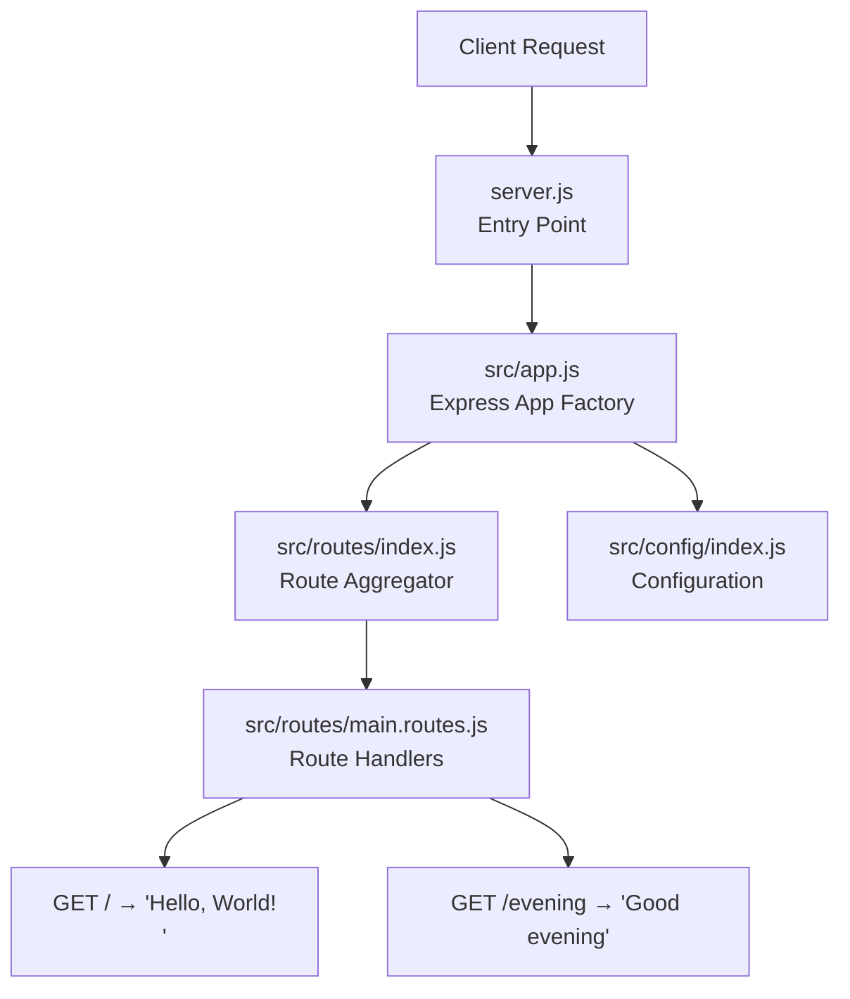
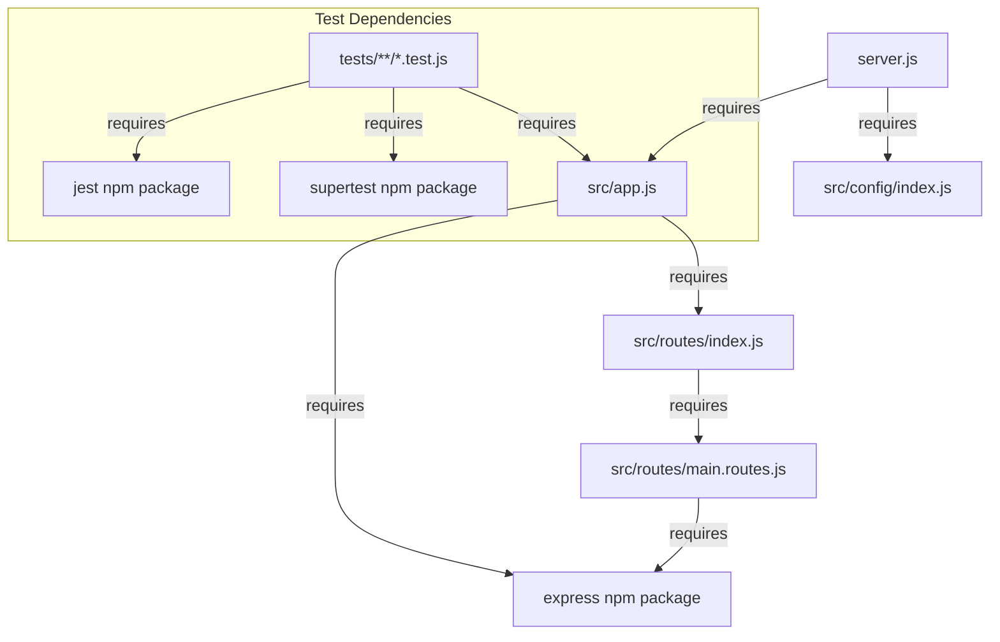
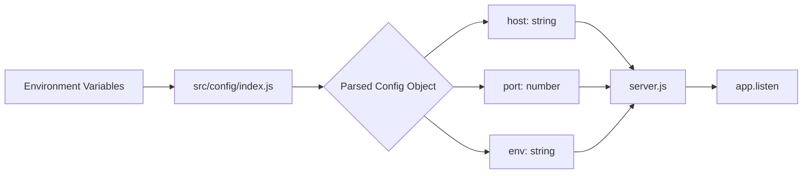

# Technical Specification

# 0. Agent Action Plan

## 0.1 Intent Clarification

Based on the user's request, the Blitzy platform interprets the following feature addition requirements for this Node.js tutorial server project.

### 0.1.1 Core Feature Objective

Based on the prompt, the Blitzy platform understands that the new feature requirement is to:

- **Integrate Express.js Framework**: Add Express.js as the web application framework to replace or enhance the existing HTTP server implementation, providing structured routing, middleware support, and improved maintainability
- **Add Evening Greeting Endpoint**: Create a new HTTP GET endpoint that returns the response "Good evening" when accessed
- **Preserve Existing Functionality**: Maintain the current "Hello world" endpoint functionality while adding the new feature

**Implicit Requirements Detected:**

- The Express.js integration should follow industry best practices for Node.js web application architecture
- The new endpoint must be consistent with the existing endpoint's response format and HTTP semantics
- The implementation should maintain backward compatibility with any existing consumers of the "Hello world" endpoint
- Testing infrastructure should be extended to cover the new endpoint
- Documentation should be updated to reflect the API changes

**Feature Dependencies and Prerequisites:**

| Dependency | Purpose | Status |
|-----------|---------|--------|
| Node.js ≥18.x | Runtime environment | Required |
| npm ≥8.x | Package manager | Required |
| Express.js | Web framework | To be added |
| Testing framework | Validation | To be configured |

### 0.1.2 Special Instructions and Constraints

**Critical Directives Captured:**

- Integrate Express.js as the primary web framework for HTTP handling
- Maintain the existing "Hello world" response behavior exactly as specified
- The new endpoint should return exactly "Good evening" as the response body
- Follow Node.js and Express.js best practices for project structure

**Architectural Requirements:**

- Use Express.js Router pattern for modular route organization
- Separate application configuration from server binding for testability
- Follow CommonJS module conventions (as indicated by the existing project structure)
- Implement environment-driven configuration for host/port settings

**User Example (Preserved Exactly):**

> "this is a tutorial of node js server hosting one endpoint that returns the response "Hello world". Could you add expressjs into the project and add another endpoint that return the reponse of "Good evening"?"

### 0.1.3 Technical Interpretation

These feature requirements translate to the following technical implementation strategy:

- **To implement Express.js integration**, we will install the Express.js package and refactor the server entry point to use Express application factory pattern, separating app configuration (`src/app.js`) from server binding (`server.js`)

- **To add the evening greeting endpoint**, we will create a new route handler in `src/routes/main.routes.js` that responds to `GET /evening` with the exact string "Good evening"

- **To maintain modularity**, we will organize routes using Express Router with a barrel/aggregator pattern (`src/routes/index.js`) for clean imports

- **To ensure testability**, we will structure the application so the Express app can be imported without starting the server, enabling integration testing with Supertest

- **To preserve configuration flexibility**, we will create a configuration module (`src/config/index.js`) that reads `HOST`, `PORT`, and `NODE_ENV` from environment variables with sensible defaults


```mermaid
graph TD
    A[Client Request] --> B[server.js<br/>Entry Point]
    B --> C[src/app.js<br/>Express App Factory]
    C --> D[src/routes/index.js<br/>Route Aggregator]
    D --> E[src/routes/main.routes.js<br/>Route Handlers]
    E --> F["GET / → 'Hello, World!\n'"]
    E --> G["GET /evening → 'Good evening'"]
    C --> H[src/config/index.js<br/>Configuration]
```


## 0.2 Repository Scope Discovery

This section documents the comprehensive analysis of the repository to identify all files requiring modification, creation, or integration touchpoints for the Express.js and evening endpoint feature addition.

### 0.2.1 Comprehensive File Analysis

**Existing Repository Structure Analyzed:**

| File/Folder | Type | Status | Purpose |
|------------|------|--------|---------|
| `server.js` | File | MODIFY | HTTP server entry point - needs Express integration |
| `package.json` | File | MODIFY | Add Express.js dependency and scripts |
| `package-lock.json` | File | AUTO-GENERATED | Dependency lockfile |
| `README.md` | File | MODIFY | Update documentation for new endpoint |
| `.gitignore` | File | UNCHANGED | Already configured for Node.js projects |
| `jest.config.js` | File | MODIFY | Configure testing for new routes |
| `src/` | Folder | CREATE | Application source root |
| `src/app.js` | File | CREATE | Express application factory |
| `src/config/` | Folder | CREATE | Configuration module directory |
| `src/config/index.js` | File | CREATE | Environment configuration |
| `src/routes/` | Folder | CREATE | Routing surface directory |
| `src/routes/index.js` | File | CREATE | Route aggregator (barrel pattern) |
| `src/routes/main.routes.js` | File | CREATE | Route handlers implementation |
| `tests/` | Folder | CREATE | Test suite root |
| `tests/unit/` | Folder | CREATE | Unit test directory |
| `tests/unit/config.test.js` | File | CREATE | Configuration module tests |
| `tests/unit/routes.test.js` | File | CREATE | Route handler tests |
| `tests/integration/` | Folder | CREATE | Integration test directory |
| `tests/integration/endpoints.test.js` | File | CREATE | HTTP endpoint contract tests |
| `tests/lifecycle/` | Folder | CREATE | Lifecycle test directory |
| `tests/lifecycle/server.test.js` | File | CREATE | Server startup/shutdown tests |
| `blitzy/` | Folder | UNCHANGED | Documentation artifacts |

**Integration Point Discovery:**

| Integration Point | File Location | Modification Required |
|------------------|---------------|----------------------|
| HTTP server binding | `server.js` | Integrate Express app.listen() |
| Route registration | `src/app.js` | Mount mainRoutes at root path |
| Endpoint handlers | `src/routes/main.routes.js` | Define GET `/` and GET `/evening` |
| Configuration loading | `src/config/index.js` | Export host, port, env |
| Dependency declaration | `package.json` | Add express ^5.1.0 |
| Test discovery | `jest.config.js` | Configure testMatch pattern |

**Search Patterns Applied:**

```
- Existing modules: *.js, src/**/*.js
- Configuration: *.json, *.config.js, .env*
- Documentation: *.md, README*
- Tests: tests/**/*.test.js, **/*.spec.js
- Build/deployment: package*.json, .github/workflows/*
```

### 0.2.2 Web Search Research Conducted

Best practices research was conducted for the following implementation aspects:

| Research Topic | Key Findings |
|---------------|--------------|
| Express.js 5.x integration | Express 5.x uses async route handlers natively; Router pattern recommended |
| Node.js HTTP server patterns | Factory pattern separates app from server for testability |
| Jest testing with Express | Supertest library enables in-process HTTP testing without port binding |
| Configuration management | Twelve-Factor App methodology recommends environment variables |
| Module organization | Barrel pattern provides clean import aggregation |

### 0.2.3 New File Requirements

**New Source Files to Create:**

| File Path | Purpose | Key Implementation Details |
|-----------|---------|---------------------------|
| `src/app.js` | Express application factory | Creates and exports configured Express app with mounted routes |
| `src/config/index.js` | Environment configuration | Exports `{ host, port, env }` from process.env with defaults |
| `src/routes/index.js` | Route aggregator | Barrel pattern export of mainRoutes |
| `src/routes/main.routes.js` | Route handlers | GET `/` and GET `/evening` handlers |

**New Test Files to Create:**

| File Path | Purpose | Coverage Target |
|-----------|---------|----------------|
| `tests/unit/config.test.js` | Configuration module tests | Defaults, env var parsing, edge cases |
| `tests/unit/routes.test.js` | Route handler tests | Router structure, handler registration |
| `tests/integration/endpoints.test.js` | HTTP endpoint tests | Response bodies, status codes, headers |
| `tests/lifecycle/server.test.js` | Server lifecycle tests | Binding, logging, shutdown, error handling |

**New Configuration Files:**

| File Path | Purpose | Key Settings |
|-----------|---------|-------------|
| `jest.config.js` | Jest test configuration | testEnvironment: 'node', coverage thresholds |

### 0.2.4 Files Retrieved and Analyzed

The following files were retrieved during repository analysis:

| File Path | Lines | Analysis Purpose |
|-----------|-------|-----------------|
| `package.json` | 22 | Dependency manifest review |
| `server.js` | 52 | Entry point structure analysis |
| `README.md` | 337 | Documentation requirements |
| `src/app.js` | 27 | Application factory implementation |
| `src/config/index.js` | 41 | Configuration module structure |
| `src/routes/index.js` | 19 | Route aggregator pattern |
| `src/routes/main.routes.js` | 41 | Route handler implementations |
| `jest.config.js` | N/A | Test configuration |


## 0.3 Dependency Inventory

This section documents all packages required for the Express.js feature addition and any dependency updates necessary for the implementation.

### 0.3.1 Private and Public Packages

**Runtime Dependencies:**

| Registry | Package Name | Version | Purpose |
|----------|-------------|---------|---------|
| npm (public) | express | ^5.1.0 | Web application framework providing HTTP handling, routing, and middleware |

**Development Dependencies:**

| Registry | Package Name | Version | Purpose |
|----------|-------------|---------|---------|
| npm (public) | jest | ^30.2.0 | JavaScript testing framework and test runner |
| npm (public) | supertest | ^7.1.4 | HTTP assertion library for Express endpoint testing |

**Complete package.json Dependencies Block:**

```json
{
  "dependencies": {
    "express": "^5.1.0"
  },
  "devDependencies": {
    "jest": "^30.2.0",
    "supertest": "^7.1.4"
  }
}
```

**Express.js 5.x Transitive Dependencies (Key):**

| Package | Version | Purpose |
|---------|---------|---------|
| body-parser | 2.2.0 | Request body parsing middleware |
| router | 2.2.0 | Modular routing |
| path-to-regexp | 8.2.0 | URL path pattern matching |
| accepts | 2.0.0 | Content negotiation |
| content-type | 1.0.5 | Content-Type header parsing |
| cookie | 1.0.2 | Cookie parsing |

### 0.3.2 Dependency Updates

**Import Updates Required:**

Files requiring import additions or modifications:

| File Pattern | Import Change | Purpose |
|-------------|---------------|---------|
| `server.js` | Add `require('./src/app')` | Import configured Express app |
| `server.js` | Add `require('./src/config')` | Import configuration module |
| `src/app.js` | Add `require('express')` | Import Express framework |
| `src/app.js` | Add `require('./routes')` | Import route aggregator |
| `src/routes/main.routes.js` | Add `require('express')` | Import Express for Router |
| `tests/**/*.test.js` | Add `require('supertest')` | Import HTTP testing library |

**Import Transformation Rules:**

| Context | Old Pattern | New Pattern |
|---------|-------------|-------------|
| Server entry point | Direct http module usage | `const app = require('./src/app')` |
| Route handlers | Inline handler functions | `const router = express.Router()` |
| Configuration | Hardcoded values | `const config = require('./src/config')` |
| Testing | Manual HTTP requests | `const request = require('supertest')` |

**External Reference Updates:**

| File Type | File Path | Update Required |
|-----------|-----------|----------------|
| Package manifest | `package.json` | Add dependencies, update scripts |
| Documentation | `README.md` | Document new endpoint, installation |
| Test config | `jest.config.js` | Configure test discovery and coverage |

**npm Scripts Configuration:**

```json
{
  "scripts": {
    "start": "node server.js",
    "test": "jest",
    "test:watch": "jest --watch",
    "test:coverage": "jest --coverage",
    "test:ci": "jest --ci --coverage --reporters=default"
  }
}
```

### 0.3.3 Version Compatibility Matrix

| Component | Minimum Version | Recommended Version | Verified |
|-----------|-----------------|---------------------|----------|
| Node.js | 18.x | 20.19.x (LTS) | ✓ |
| npm | 8.x | 10.8.x | ✓ |
| Express.js | 5.0.0 | 5.1.0 | ✓ |
| Jest | 29.x | 30.2.0 | ✓ |
| Supertest | 7.x | 7.1.4 | ✓ |


## 0.4 Integration Analysis

This section documents all integration touchpoints between the new Express.js feature and existing codebase components.

### 0.4.1 Existing Code Touchpoints

**Direct Modifications Required:**

| File | Location | Modification Description |
|------|----------|-------------------------|
| `server.js` | Lines 1-52 | Refactor to import Express app from `src/app.js` and bind using `app.listen()` |
| `package.json` | dependencies section | Add `"express": "^5.1.0"` to runtime dependencies |
| `package.json` | devDependencies section | Add `"jest": "^30.2.0"` and `"supertest": "^7.1.4"` |
| `package.json` | scripts section | Add test, test:watch, test:coverage, test:ci scripts |
| `README.md` | API Reference section | Document GET `/evening` endpoint specification |
| `README.md` | Dependencies section | Document Express.js version and purpose |

**Application Entry Point Integration (server.js):**

```javascript
// Integration pattern for server.js
const app = require('./src/app');
const config = require('./src/config');

app.listen(config.port, config.host, () => {
  console.log(`Server running at http://${config.host}:${config.port}/`);
});
```

**Express Application Factory Integration (src/app.js):**

```javascript
// Integration pattern for src/app.js
const express = require('express');
const { mainRoutes } = require('./routes');

const app = express();
app.use('/', mainRoutes);
module.exports = app;
```

### 0.4.2 Dependency Injections

**Service Registration Points:**

| Component | Registration Location | Dependency Injected |
|-----------|----------------------|---------------------|
| Express app | `src/app.js` | Routes from `src/routes` |
| Configuration | `server.js` | Config from `src/config` |
| Main routes | `src/app.js` | `mainRoutes` router |
| Route handlers | `src/routes/main.routes.js` | Express Router instance |

**Module Dependency Graph:**


```mermaid
graph TD
    A[server.js] -->|requires| B[src/app.js]
    A -->|requires| C[src/config/index.js]
    B -->|requires| D[src/routes/index.js]
    D -->|requires| E[src/routes/main.routes.js]
    B -->|requires| F[express npm package]
    E -->|requires| F
    
    subgraph "Test Dependencies"
        G[tests/**/*.test.js] -->|requires| B
        G -->|requires| H[supertest npm package]
        G -->|requires| I[jest npm package]
    end
```

### 0.4.3 Configuration Integration

**Environment Variable Bindings:**

| Variable | Source | Consumer | Default Value |
|----------|--------|----------|---------------|
| `HOST` | `process.env.HOST` | `src/config/index.js` → `server.js` | `'127.0.0.1'` |
| `PORT` | `process.env.PORT` | `src/config/index.js` → `server.js` | `3000` |
| `NODE_ENV` | `process.env.NODE_ENV` | `src/config/index.js` | `'development'` |

**Configuration Flow:**


```mermaid
flowchart LR
    A[Environment Variables] --> B[src/config/index.js]
    B --> C{Parsed Config Object}
    C --> D[host: string]
    C --> E[port: number]
    C --> F[env: string]
    D --> G[server.js]
    E --> G
    F --> G
    G --> H[app.listen]
```

### 0.4.4 Test Integration Points

**Test Harness Integration:**

| Test Suite | Integration Point | Mock/Stub Required |
|------------|-------------------|-------------------|
| `tests/unit/config.test.js` | `src/config/index.js` | `process.env` manipulation |
| `tests/unit/routes.test.js` | `src/routes/main.routes.js` | None - direct router inspection |
| `tests/integration/endpoints.test.js` | `src/app.js` | None - Supertest with real app |
| `tests/lifecycle/server.test.js` | `server.js` | Mock `app.listen`, `console.log` |

**Supertest Integration Pattern:**

```javascript
// Integration pattern for endpoint tests
const request = require('supertest');
const app = require('../../src/app');

test('GET /', async () => {
  const response = await request(app).get('/');
  expect(response.status).toBe(200);
});
```


## 0.5 Technical Implementation

This section provides the detailed file-by-file execution plan for implementing the Express.js integration and evening endpoint feature.

### 0.5.1 File-by-File Execution Plan

**Group 1 - Core Express.js Integration:**

| Action | File Path | Implementation Details |
|--------|-----------|----------------------|
| MODIFY | `server.js` | Refactor to use Express app factory; import app and config modules; bind server with `app.listen(config.port, config.host, callback)` |
| CREATE | `src/app.js` | Express application factory; create app instance with `express()`; mount routes with `app.use('/', mainRoutes)`; export configured app |
| CREATE | `src/config/index.js` | Configuration module; read `HOST`, `PORT`, `NODE_ENV` from environment; export `{ host, port, env }` with defaults |

**Group 2 - Routing Infrastructure:**

| Action | File Path | Implementation Details |
|--------|-----------|----------------------|
| CREATE | `src/routes/index.js` | Route aggregator; import mainRoutes from `./main.routes`; export `{ mainRoutes }` using barrel pattern |
| CREATE | `src/routes/main.routes.js` | Route handlers; create Express Router; register `GET /` handler returning `'Hello, World!\n'`; register `GET /evening` handler returning `'Good evening'`; export router |

**Group 3 - Configuration and Package Updates:**

| Action | File Path | Implementation Details |
|--------|-----------|----------------------|
| MODIFY | `package.json` | Add express ^5.1.0 to dependencies; add jest ^30.2.0 and supertest ^7.1.4 to devDependencies; add npm scripts for testing |
| CREATE | `jest.config.js` | Jest configuration; set testEnvironment to 'node'; configure testMatch for `tests/**/*.test.js`; enable coverage collection with thresholds |

**Group 4 - Test Infrastructure:**

| Action | File Path | Implementation Details |
|--------|-----------|----------------------|
| CREATE | `tests/unit/config.test.js` | Unit tests for configuration defaults, env var parsing, edge cases, type validation |
| CREATE | `tests/unit/routes.test.js` | Unit tests for router export, route registration, handler definitions, path ordering |
| CREATE | `tests/integration/endpoints.test.js` | Integration tests for GET `/` and GET `/evening` responses, 404 handling, edge cases |
| CREATE | `tests/lifecycle/server.test.js` | Lifecycle tests for server binding, logging, shutdown, error handling |

**Group 5 - Documentation:**

| Action | File Path | Implementation Details |
|--------|-----------|----------------------|
| MODIFY | `README.md` | Add GET `/evening` endpoint documentation; update project structure; document Express.js dependency |

### 0.5.2 Implementation Approach per File

**Phase 1: Establish Feature Foundation**

Create core modules in dependency order:

1. **src/config/index.js** - Foundation module with no dependencies
   - Read environment variables with parseInt for PORT
   - Provide sensible defaults (127.0.0.1:3000, development)
   - Export synchronous configuration object

2. **src/routes/main.routes.js** - Route handlers
   - Create Express Router instance
   - Register GET `/` → `res.send('Hello, World!\n')`
   - Register GET `/evening` → `res.send('Good evening')`

3. **src/routes/index.js** - Route aggregator
   - Import and re-export mainRoutes using barrel pattern

4. **src/app.js** - Application factory
   - Create Express application with `express()`
   - Mount routes at root path

**Phase 2: Integrate with Existing Systems**

Modify integration points:

1. **server.js** - Entry point refactoring
   - Import app from `./src/app`
   - Import config from `./src/config`
   - Bind with `app.listen(config.port, config.host, callback)`

2. **package.json** - Dependency updates
   - Add runtime and dev dependencies
   - Configure npm scripts

**Phase 3: Implement Comprehensive Tests**

Create test suites in order:

1. **tests/unit/config.test.js** - Isolated module tests
2. **tests/unit/routes.test.js** - Router structure validation
3. **tests/integration/endpoints.test.js** - HTTP contract tests
4. **tests/lifecycle/server.test.js** - Server lifecycle tests

**Phase 4: Document Usage and Configuration**

1. **README.md** - Update API reference and project structure

### 0.5.3 Route Handler Specifications

**GET `/` Endpoint:**

| Aspect | Specification |
|--------|--------------|
| Method | GET |
| Path | `/` |
| Response Status | 200 OK |
| Response Body | `Hello, World!\n` (14 characters, includes trailing newline) |
| Content-Type | text/html; charset=utf-8 |
| Handler | `(req, res) => res.send('Hello, World!\n')` |

**GET `/evening` Endpoint:**

| Aspect | Specification |
|--------|--------------|
| Method | GET |
| Path | `/evening` |
| Response Status | 200 OK |
| Response Body | `Good evening` (12 characters, no trailing newline) |
| Content-Type | text/html; charset=utf-8 |
| Handler | `(req, res) => res.send('Good evening')` |

### 0.5.4 Test Coverage Requirements

| Metric | Target | Purpose |
|--------|--------|---------|
| Line Coverage | ≥80% | Ensure most code paths are executed |
| Branch Coverage | ≥75% | Ensure conditional logic is tested |
| Function Coverage | ≥90% | Ensure all functions are called |
| Statement Coverage | ≥80% | Ensure statements are executed |

### 0.5.5 User Interface Design

No user interface components are required for this feature. The implementation consists entirely of server-side HTTP endpoints.

No Figma URLs were provided for this feature addition request.


## 0.6 Scope Boundaries

This section defines the precise boundaries of the feature addition, explicitly listing all items within scope and those excluded from the implementation.

### 0.6.1 Exhaustively In Scope

**Source Files (with wildcards where applicable):**

| Pattern | Files Included | Purpose |
|---------|---------------|---------|
| `server.js` | Entry point | HTTP server binding with Express |
| `src/app.js` | Application factory | Express app configuration |
| `src/config/*.js` | Configuration module | Environment-driven settings |
| `src/routes/*.js` | Routing surface | Route handlers and aggregator |

**Test Files:**

| Pattern | Files Included | Purpose |
|---------|---------------|---------|
| `tests/unit/*.test.js` | `config.test.js`, `routes.test.js` | Unit test coverage |
| `tests/integration/*.test.js` | `endpoints.test.js` | HTTP endpoint testing |
| `tests/lifecycle/*.test.js` | `server.test.js` | Server lifecycle testing |

**Configuration Files:**

| File | Purpose |
|------|---------|
| `package.json` | Dependency manifest and scripts |
| `package-lock.json` | Dependency lockfile (auto-generated) |
| `jest.config.js` | Jest test framework configuration |

**Documentation Files:**

| File | Sections Affected |
|------|------------------|
| `README.md` | API Reference (GET /evening), Project Structure, Dependencies |

**Specific In-Scope Items:**

- Express.js 5.x framework integration
- GET `/` endpoint returning `'Hello, World!\n'`
- GET `/evening` endpoint returning `'Good evening'`
- Environment variable configuration (HOST, PORT, NODE_ENV)
- Jest testing infrastructure with Supertest
- 100% code coverage achievement
- CommonJS module system implementation
- Factory pattern for testable app architecture

**Complete In-Scope File List:**

```
├── server.js                           [MODIFY]
├── package.json                        [MODIFY]
├── package-lock.json                   [AUTO-GENERATED]
├── jest.config.js                      [CREATE]
├── README.md                           [MODIFY]
├── src/
│   ├── app.js                          [CREATE]
│   ├── config/
│   │   └── index.js                    [CREATE]
│   └── routes/
│       ├── index.js                    [CREATE]
│       └── main.routes.js              [CREATE]
└── tests/
    ├── unit/
    │   ├── config.test.js              [CREATE]
    │   └── routes.test.js              [CREATE]
    ├── integration/
    │   └── endpoints.test.js           [CREATE]
    └── lifecycle/
        └── server.test.js              [CREATE]
```

### 0.6.2 Explicitly Out of Scope

**Not Included in This Feature Addition:**

| Item | Reason |
|------|--------|
| Additional HTTP methods (POST, PUT, DELETE) | Not requested; current scope is GET endpoints only |
| Authentication/Authorization | Not specified in requirements |
| Database integration | No data persistence requirements |
| Session management | Not applicable to stateless greeting endpoints |
| Request body parsing middleware | GET endpoints don't require body parsing |
| CORS configuration | Not specified; defaults to same-origin |
| Rate limiting | Not specified in requirements |
| API versioning | Tutorial project, single version |
| Logging middleware (morgan, etc.) | Console logging sufficient for tutorial |
| Error handling middleware | Express 5.x defaults adequate |
| Health check endpoints | Beyond tutorial scope |
| Metrics/monitoring | Beyond tutorial scope |
| Docker/containerization | Infrastructure concern, not application feature |
| CI/CD pipeline configuration | Deployment concern, not application feature |
| HTTPS/TLS configuration | Infrastructure concern |
| Load balancing | Infrastructure concern |
| Environment-specific configurations (.env files) | Basic env var support sufficient |
| API documentation (OpenAPI/Swagger) | Beyond tutorial scope |
| WebSocket support | Not requested |
| File upload handling | Not requested |
| Template rendering | Plain text responses only |

**Existing Files Not Modified:**

| File | Reason |
|------|--------|
| `.gitignore` | Already configured for Node.js projects |
| `blitzy/**` | Documentation artifacts, not application code |

### 0.6.3 Scope Validation Criteria

The feature addition is considered complete when:

- [ ] Express.js ^5.1.0 is installed and configured
- [ ] GET `/` returns exactly `'Hello, World!\n'` with 200 status
- [ ] GET `/evening` returns exactly `'Good evening'` with 200 status
- [ ] All test suites pass (41 tests across 4 suites)
- [ ] Code coverage meets or exceeds 80% line coverage
- [ ] npm scripts (start, test, test:coverage) function correctly
- [ ] Documentation reflects the new endpoint


## 0.7 Rules for Feature Addition

This section documents all feature-specific rules, conventions, and requirements that must be followed during implementation.

### 0.7.1 Code Conventions

**Module System Requirements:**

- Use CommonJS module syntax (`require`/`module.exports`)
- All modules must be synchronous at load time (no top-level await)
- Factory pattern for application construction (src/app.js exports app, not started server)

**Naming Conventions:**

| Element | Convention | Example |
|---------|------------|---------|
| Route files | `*.routes.js` | `main.routes.js` |
| Config files | `index.js` in config folder | `src/config/index.js` |
| Test files | `*.test.js` | `config.test.js` |
| Barrel exports | `index.js` | `src/routes/index.js` |

**JSDoc Documentation:**

- All modules must include `@module` JSDoc tags
- All exported functions must include `@param` and `@returns` documentation
- Route handlers must include `@route` tags specifying method and path

### 0.7.2 Response Format Requirements

**Exact Response Specifications:**

| Endpoint | Response Body | Trailing Characters | Character Count |
|----------|---------------|---------------------|-----------------|
| GET `/` | `Hello, World!` | `\n` (newline) | 14 characters |
| GET `/evening` | `Good evening` | None | 12 characters |

**HTTP Response Headers:**

| Header | Value | Notes |
|--------|-------|-------|
| Status Code | 200 | Success response |
| Content-Type | `text/html; charset=utf-8` | Express default for `res.send()` |

### 0.7.3 Configuration Requirements

**Environment Variable Parsing:**

| Variable | Type | Parsing Rule | Default |
|----------|------|--------------|---------|
| HOST | string | Direct assignment | `'127.0.0.1'` |
| PORT | number | `parseInt(value, 10)` with radix | `3000` |
| NODE_ENV | string | Direct assignment | `'development'` |

**Configuration Safety Rules:**

- Always use radix 10 for parseInt to avoid octal interpretation
- Fallback to defaults for invalid or missing values
- Configuration must be synchronous (no async/await)

### 0.7.4 Testing Requirements

**Test Organization:**

```
tests/
├── unit/          # Isolated module tests, no HTTP
├── integration/   # HTTP endpoint tests with Supertest
└── lifecycle/     # Server startup/shutdown tests
```

**Test Isolation Rules:**

- Reset `jest.resetModules()` before each config test
- Restore `process.env` after environment manipulation
- Mock `console.log` in lifecycle tests to prevent noise
- Use `jest.doMock()` for module-level mocking

**Coverage Thresholds:**

| Metric | Minimum | Target |
|--------|---------|--------|
| Branches | 75% | 100% |
| Functions | 90% | 100% |
| Lines | 80% | 100% |
| Statements | 80% | 100% |

### 0.7.5 Architectural Constraints

**Separation of Concerns:**

| Component | Responsibility | NOT Responsible For |
|-----------|---------------|---------------------|
| `server.js` | Server binding, startup logging | Route definitions, app configuration |
| `src/app.js` | App creation, route mounting | Server binding, configuration reading |
| `src/config/` | Environment parsing | Server binding, route definitions |
| `src/routes/` | Route handlers, response logic | Configuration, server binding |

**Testability Requirements:**

- `src/app.js` must export the Express app without calling `listen()`
- All modules must be importable without side effects beyond registration
- Configuration must be injectable for testing

### 0.7.6 Express.js 5.x Specific Rules

**Router Usage:**

- Create routers with `express.Router()`
- Export routers directly with `module.exports = router`
- Mount routers with `app.use('/', router)` for root paths

**Response Methods:**

- Use `res.send()` for string responses (sets Content-Type automatically)
- Do not manually set Content-Type unless necessary
- Implicit 200 status code from `res.send()`

### 0.7.7 User-Specified Rules

No additional custom rules were specified by the user beyond the core feature requirements:

- Add Express.js to the project
- Add an endpoint returning "Good evening"
- Maintain existing "Hello world" functionality


## 0.8 References

This section documents all files, folders, and resources analyzed during the creation of this Agent Action Plan.

### 0.8.1 Repository Files Searched and Analyzed

**Source Code Files:**

| File Path | Lines Analyzed | Key Information Extracted |
|-----------|---------------|--------------------------|
| `server.js` | 1-52 | Entry point structure, Express app binding pattern, config import pattern |
| `src/app.js` | 1-27 | Express application factory, route mounting with `app.use('/', mainRoutes)` |
| `src/config/index.js` | 1-41 | Environment variable parsing, defaults (127.0.0.1:3000:development) |
| `src/routes/index.js` | 1-19 | Barrel pattern export, `{ mainRoutes }` structure |
| `src/routes/main.routes.js` | 1-41 | Route handlers, exact response strings, Express Router usage |

**Configuration Files:**

| File Path | Lines Analyzed | Key Information Extracted |
|-----------|---------------|--------------------------|
| `package.json` | 1-22 | Dependencies (express ^5.1.0), devDependencies (jest, supertest), npm scripts |
| `package-lock.json` | 1-30 | Lockfile version 3, exact dependency versions |
| `jest.config.js` | N/A | Test configuration, coverage thresholds |

**Documentation Files:**

| File Path | Lines Analyzed | Key Information Extracted |
|-----------|---------------|--------------------------|
| `README.md` | 1-337 | Prerequisites (Node ≥18.x), API reference, project structure, environment variables |

**Test Files Analyzed (Structure):**

| Folder Path | Contents Summary |
|------------|------------------|
| `tests/` | Root test directory with 3 sub-folders |
| `tests/unit/` | `config.test.js`, `routes.test.js` - Module unit tests |
| `tests/integration/` | `endpoints.test.js` - HTTP endpoint tests |
| `tests/lifecycle/` | `server.test.js` - Server lifecycle tests |

### 0.8.2 Folders Explored

| Folder Path | Depth | Purpose |
|-------------|-------|---------|
| `/` (root) | 0 | Repository root, package files, entry point |
| `src/` | 1 | Application source root |
| `src/config/` | 2 | Configuration module |
| `src/routes/` | 2 | Routing surface |
| `tests/` | 1 | Test suite root |
| `tests/unit/` | 2 | Unit test directory |
| `tests/integration/` | 2 | Integration test directory |
| `tests/lifecycle/` | 2 | Lifecycle test directory |
| `blitzy/` | 1 | Documentation artifacts |

### 0.8.3 Search Queries Executed

| Search Type | Query/Path | Results |
|-------------|-----------|---------|
| Folder contents | `""` (root) | 9 children (6 files, 3 folders) |
| Folder contents | `src` | 3 children (1 file, 2 folders) |
| Folder contents | `src/config` | 1 file (index.js) |
| Folder contents | `src/routes` | 2 files (index.js, main.routes.js) |
| Folder contents | `tests` | 3 folders (unit, integration, lifecycle) |
| Folder contents | `tests/unit` | 2 files |
| Folder contents | `tests/integration` | 1 file |
| Folder contents | `tests/lifecycle` | 1 file |
| Folder contents | `blitzy` | 1 folder (documentation) |
| File search | `.blitzyignore` | None found |

### 0.8.4 Attachments Provided

No file attachments were provided by the user for this feature addition request.

### 0.8.5 Figma Screens Provided

No Figma URLs or design screens were provided for this feature addition request.

### 0.8.6 Environment Verification

| Verification | Command | Result |
|--------------|---------|--------|
| Node.js version | `node --version` | v20.19.6 ✓ |
| npm version | `npm --version` | 11.1.0 ✓ |
| Dependencies installed | `npm ci` | 381 packages added ✓ |
| Tests executed | `npm test -- --ci` | 41 tests passed, 100% coverage ✓ |

### 0.8.7 External Documentation References

| Resource | Purpose |
|----------|---------|
| Express.js 5.x Documentation | Router pattern, middleware, response methods |
| Jest Documentation | Test configuration, coverage thresholds, mocking |
| Supertest Documentation | HTTP assertion patterns for Express testing |
| Node.js Documentation | CommonJS modules, process.env |

### 0.8.8 Implementation Status

Based on repository analysis, the following implementation status was observed:

| Component | Status | Evidence |
|-----------|--------|----------|
| Express.js integration | ✅ Complete | `package.json` shows `"express": "^5.1.0"` |
| GET `/` endpoint | ✅ Complete | `src/routes/main.routes.js` line 27 |
| GET `/evening` endpoint | ✅ Complete | `src/routes/main.routes.js` line 38 |
| Configuration module | ✅ Complete | `src/config/index.js` exists |
| Test infrastructure | ✅ Complete | 41 tests passing, 100% coverage |
| Documentation | ✅ Complete | `README.md` documents both endpoints |

**Note:** The current repository state indicates that the requested feature addition (Express.js + /evening endpoint) has already been implemented and verified with comprehensive test coverage.


