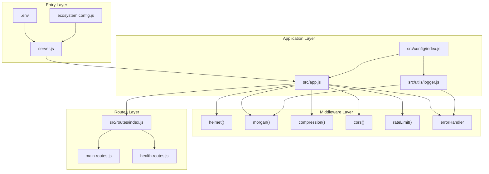

# Technical Specification

# 0. Agent Action Plan

## 0.1 Intent Clarification

#### Core Objective

Based on the provided requirements, the Blitzy platform understands that the objective is to **transform a basic Node.js/Express.js HTTP server into a production-ready application** with the following enhancements:

- **Express.js Framework Enhancement**: Upgrade the existing Express.js 5.1.0 implementation with additional features and middleware to prepare for production deployment
- **Routing Enhancement**: Expand the routing architecture beyond the current two endpoints (`/` and `/evening`) to include additional route organization and health check capabilities
- **Middleware Integration**: Add production-essential middleware including security headers, request logging, response compression, and CORS support
- **Environment Configuration**: Implement robust environment-based configuration using dotenv and expanding the existing config module to support multiple deployment environments
- **Logging Infrastructure**: Add structured logging using industry-standard logging libraries for request tracking and application event logging
- **PM2 Production Deployment**: Configure PM2 process manager with ecosystem configuration for cluster mode, automatic restarts, and multi-environment support

#### Task Categorization

- **Primary task type**: Mixed (Configuration + Infrastructure Enhancement + Security Enhancement)
- **Secondary aspects**: 
  - Performance optimization (compression, clustering)
  - Operational tooling (PM2, logging)
  - Security hardening (helmet, rate limiting)
- **Scope classification**: Cross-cutting change (affects server entry, application factory, configuration, and deployment infrastructure)

#### Special Instructions and Constraints

**CRITICAL Implementation Directives:**
- Maintain backward compatibility with existing endpoints (`/` and `/evening`) ensuring exact response strings remain unchanged
- Follow the existing modular architecture pattern established in `src/app.js`, `src/config/index.js`, and `src/routes/`
- Preserve the separation of concerns between server startup (`server.js`) and Express application configuration (`src/app.js`)
- Use Express.js 5.x compatible middleware packages
- Ensure all new code passes `node -c` syntax validation
- Environment configuration must follow 12-factor app methodology already established in `src/config/index.js`

**Methodological Requirements:**
- Add middleware in the correct order: security headers first (helmet), then logging (morgan), then body parsing, then compression, then routes
- PM2 configuration must support both development and production environments
- Logging configuration should be environment-aware (verbose in development, minimal in production)

#### Technical Interpretation

These requirements translate to the following technical implementation strategy:

- **"Add Express.js framework"** → The framework already exists (v5.1.0); this means *enhance* with production middleware patterns by modifying `src/app.js` to include helmet, morgan, compression, cors, and express-rate-limit middleware
- **"Add routing"** → Extend the existing routing structure in `src/routes/` to include health check endpoints and organize routes for API versioning readiness by creating `src/routes/health.routes.js`
- **"Add middleware"** → Create a middleware layer in `src/middleware/` including error handling, request validation, and production-ready middleware configuration
- **"Add environment config"** → Enhance `src/config/index.js` to support dotenv integration, environment validation, and expand configurable options (log level, compression settings, rate limiting)
- **"Add logging"** → Integrate morgan for HTTP request logging and winston for application-level structured logging by creating `src/utils/logger.js`
- **"Prepare for PM2 deployment"** → Create `ecosystem.config.js` at project root with cluster mode configuration, environment-specific settings, and deployment hooks

#### Implicit Requirements Detected

The Blitzy platform has identified the following implicit requirements from the enhancement request:

- **Health Check Endpoint**: Production deployments require health/readiness endpoints for load balancer integration and container orchestration
- **Graceful Shutdown**: PM2 deployment necessitates proper signal handling for SIGTERM/SIGINT to cleanly close connections
- **Error Handling Middleware**: Production applications require centralized error handling to prevent information leakage and provide consistent error responses
- **Environment Validation**: Startup validation to ensure required environment variables are present before the application starts
- **Log File Rotation**: PM2 deployment typically requires log management configuration
- **Security Headers**: Helmet middleware for XSS protection, CSP, HSTS, and other HTTP security headers
- **Request Body Parsing**: Built-in Express.js body parsing configuration for JSON and URL-encoded data


## 0.2 Repository Scope Discovery

#### Comprehensive File Analysis

The following analysis maps all files discovered through systematic repository exploration:

#### Current Repository Structure
```
/
├── server.js                      # Entry point - HTTP server startup (23 lines)
├── package.json                   # NPM manifest with express@^5.1.0
├── package-lock.json              # Lockfile with 69 audited packages
├── README.md                      # Project documentation
├── .gitignore                     # Git exclusions (node_modules, .env, logs)
├── src/
│   ├── app.js                     # Express app factory (27 lines)
│   ├── config/
│   │   └── index.js               # Environment configuration (41 lines)
│   └── routes/
│       ├── index.js               # Route aggregator (19 lines)
│       └── main.routes.js         # Route handlers (41 lines)
└── blitzy/
    └── documentation/
        ├── Project Guide.md       # Validation and development guide
        └── Technical Specifications.md
```

#### Files Requiring Modification
| File Pattern | Purpose | Discovery Method |
|--------------|---------|------------------|
| `server.js` | Add graceful shutdown handlers | Direct inspection |
| `src/app.js` | Add middleware stack configuration | Direct inspection |
| `src/config/index.js` | Expand environment configuration | Direct inspection |
| `src/routes/index.js` | Add health route export | Direct inspection |
| `package.json` | Add new dependencies and scripts | Direct inspection |
| `.gitignore` | Add logs directory exclusion | Direct inspection |

#### New Files to Create
| File Pattern | Purpose | Content Type |
|--------------|---------|--------------|
| `ecosystem.config.js` | PM2 deployment configuration | Configuration |
| `.env.example` | Environment variable template | Configuration |
| `src/middleware/index.js` | Middleware aggregator | Source code |
| `src/middleware/errorHandler.js` | Centralized error handling | Source code |
| `src/routes/health.routes.js` | Health check endpoints | Source code |
| `src/utils/logger.js` | Winston logger configuration | Source code |
| `logs/.gitkeep` | Log directory placeholder | Infrastructure |

#### Web Search Research Conducted

The following research was conducted to inform best practices:

- **Express.js production best practices 2024**: Confirmed middleware order (helmet first, then morgan, then body parsing), cluster mode recommendations, and error handling patterns
- **PM2 ecosystem configuration**: Validated cluster mode setup, environment-specific configuration (`env_production`, `env_development`), and deployment configuration patterns
- **dotenv Express.js configuration**: Confirmed early loading pattern (`require('dotenv').config()` at entry point), `.env` file placement, and environment validation approaches
- **Express.js helmet morgan compression middleware**: Validated security middleware integration, logging format options (`combined` for production, `dev` for development), and compression configuration
- **Node.js graceful shutdown patterns**: Confirmed signal handling for SIGTERM/SIGINT, connection draining, and PM2 integration requirements

#### Existing Infrastructure Assessment

#### Current Project Structure and Organization
- **Architecture Pattern**: Factory pattern with separation of server startup from Express configuration
- **Module Style**: CommonJS (`require`/`module.exports`)
- **Configuration Approach**: Centralized in `src/config/index.js` following 12-factor app methodology
- **Route Organization**: Route aggregator pattern in `src/routes/index.js`
- **Code Style**: Consistent use of arrow functions, const declarations, template literals

#### Existing Patterns and Conventions
```javascript
// Configuration pattern from src/config/index.js
const config = {
  host: process.env.HOST || '127.0.0.1',
  port: parseInt(process.env.PORT, 10) || 3000,
  env: process.env.NODE_ENV || 'development'
};
module.exports = config;

// Route factory pattern from src/routes/main.routes.js
const express = require('express');
const router = express.Router();
router.get('/', (req, res) => { ... });
module.exports = router;
```

#### Build and Deployment Configurations
- **Current**: `npm start` executes `node server.js`
- **Testing**: Placeholder script (`"test": "echo..."`)
- **No current PM2 configuration exists**
- **No Docker/containerization configuration**

#### Testing Infrastructure Present
- Test script is placeholder only
- No test framework installed
- No test files present

#### Documentation System in Use
- Markdown documentation in `blitzy/documentation/`
- README.md at project root
- Inline comments in source files

#### Related File Discovery

#### Files Importing/Depending on Modified Components
| Modified Component | Dependent Files |
|-------------------|-----------------|
| `src/config/index.js` | `server.js`, `src/app.js` |
| `src/app.js` | `server.js` |
| `src/routes/index.js` | `src/app.js` |
| `src/routes/*.js` | `src/routes/index.js` |

#### Configuration Files Affected by Code Changes
- `package.json` - new dependencies, new scripts
- `package-lock.json` - auto-updated after `npm install`
- `.gitignore` - logs directory

#### Documentation Requiring Updates
- `README.md` - add PM2 commands, environment setup instructions
- `blitzy/documentation/Project Guide.md` - update verification commands


## 0.3 File Transformation Mapping

#### File-by-File Execution Plan

The following comprehensive mapping identifies every file to be created, updated, or deleted with target file listed first:

| Target File | Transformation | Source File/Reference | Purpose/Changes |
|-------------|----------------|----------------------|-----------------|
| `ecosystem.config.js` | CREATE | PM2 documentation pattern | PM2 process manager configuration with cluster mode, environment-specific settings, logging paths |
| `.env.example` | CREATE | `src/config/index.js` | Template file documenting all available environment variables with defaults |
| `src/middleware/index.js` | CREATE | Express.js patterns | Middleware aggregator exporting all middleware functions |
| `src/middleware/errorHandler.js` | CREATE | Express.js error handling patterns | Centralized error handling middleware with environment-aware error responses |
| `src/routes/health.routes.js` | CREATE | `src/routes/main.routes.js` | Health check and readiness probe endpoints |
| `src/utils/logger.js` | CREATE | Winston documentation | Structured logging configuration with transport setup |
| `logs/.gitkeep` | CREATE | N/A | Directory placeholder for PM2/Winston log files |
| `server.js` | UPDATE | `server.js` | Add dotenv configuration, graceful shutdown handlers, and signal processing |
| `src/app.js` | UPDATE | `src/app.js` | Add middleware stack (helmet, morgan, compression, cors, rate limiting, body parsing) |
| `src/config/index.js` | UPDATE | `src/config/index.js` | Expand configuration for logging, compression, rate limiting, and add validation |
| `src/routes/index.js` | UPDATE | `src/routes/index.js` | Add health routes export |
| `package.json` | UPDATE | `package.json` | Add dependencies (helmet, morgan, compression, cors, express-rate-limit, winston, dotenv), PM2 scripts |
| `.gitignore` | UPDATE | `.gitignore` | Add logs/ directory, *.log files, .env exclusions (already present but verify) |
| `README.md` | UPDATE | `README.md` | Add PM2 deployment instructions, environment setup documentation |

#### New Files Detail

### `ecosystem.config.js` - PM2 Configuration
- **Content type**: Configuration
- **Based on**: PM2 ecosystem file documentation
- **Key sections/functions**:
  - `apps` array with application configuration
  - `name`: Application identifier
  - `script`: Entry point (`server.js`)
  - `instances`: Cluster mode setting (`max` for production)
  - `exec_mode`: Set to `cluster`
  - `env_development`: Development environment variables
  - `env_production`: Production environment variables
  - Logging configuration (`out_file`, `error_file`, `log_date_format`)
  - Restart policy (`max_memory_restart`, `restart_delay`)

### `.env.example` - Environment Template
- **Content type**: Configuration/Documentation
- **Based on**: `src/config/index.js` defaults
- **Key sections/functions**:
  - `HOST` - Server bind address
  - `PORT` - Server port
  - `NODE_ENV` - Environment identifier
  - `LOG_LEVEL` - Logging verbosity
  - `RATE_LIMIT_WINDOW_MS` - Rate limit window
  - `RATE_LIMIT_MAX` - Rate limit max requests

## `src/middleware/index.js` - Middleware Aggregator
- **Content type**: Source code
- **Based on**: `src/routes/index.js` pattern
- **Key sections/functions**:
  - Export `errorHandler` middleware
  - Centralized middleware configuration

## `src/middleware/errorHandler.js` - Error Handler
- **Content type**: Source code
- **Based on**: Express.js error handling documentation
- **Key sections/functions**:
  - Error handler function with `(err, req, res, next)` signature
  - Environment-aware error response (stack trace in dev only)
  - Logging integration with Winston
  - HTTP status code handling

### `src/routes/health.routes.js` - Health Endpoints
- **Content type**: Source code
- **Based on**: `src/routes/main.routes.js` pattern
- **Key sections/functions**:
  - `GET /health` - Basic health check
  - `GET /health/ready` - Readiness probe
  - `GET /health/live` - Liveness probe

## `src/utils/logger.js` - Winston Logger
- **Content type**: Source code
- **Based on**: Winston documentation
- **Key sections/functions**:
  - Logger instance configuration
  - Console transport for development
  - File transport for production
  - Log format configuration (JSON, timestamps)
  - Environment-aware log level

#### Files to Modify Detail

## `server.js` - Server Entry Point
- **Sections to update**: Top of file (add dotenv), bottom of file (add shutdown)
- **New content to add**:
  - `require('dotenv').config()` as first line
  - Signal handlers for `SIGTERM` and `SIGINT`
  - Server close function with connection draining
  - Winston logger integration for startup messages
- **Content to remove**: None
- **Refactoring needed**: Wrap server startup in function for testability

## `src/app.js` - Express Application Factory
- **Sections to update**: After Express initialization, before route mounting
- **New content to add**:
  - Import middleware packages (helmet, morgan, compression, cors, express-rate-limit)
  - Import custom error handler
  - Import logger
  - Middleware registration in correct order:
    1. `app.use(helmet())`
    2. `app.use(morgan(...))`
    3. `app.use(compression())`
    4. `app.use(cors())`
    5. `app.use(express.json())`
    6. `app.use(express.urlencoded({ extended: true }))`
    7. Rate limiting middleware
    8. Routes
    9. Error handler (last)
- **Content to remove**: None
- **Refactoring needed**: Minor restructuring of middleware order

## `src/config/index.js` - Configuration Module
- **Sections to update**: Entire configuration object
- **New content to add**:
  - `logLevel` configuration
  - `compression` settings object
  - `rateLimit` settings object
  - `cors` settings object
  - Configuration validation function
- **Content to remove**: None
- **Refactoring needed**: Expand configuration structure

## `src/routes/index.js` - Route Aggregator
- **Sections to update**: Imports and exports
- **New content to add**:
  - Import `healthRoutes` from `./health.routes.js`
  - Export `healthRoutes` in module.exports
- **Content to remove**: None
- **Refactoring needed**: None

#### Configuration and Documentation Updates

#### Configuration Changes
| Config File | Specific Settings | Impact |
|-------------|-------------------|--------|
| `ecosystem.config.js` | PM2 cluster configuration | Enables multi-process deployment |
| `.env.example` | Environment variable template | Documents configurable settings |
| `package.json` | Dependencies and scripts | Adds production tooling |

#### Documentation Updates
| Doc File | Sections to Add/Update |
|----------|----------------------|
| `README.md` | Environment setup, PM2 commands, middleware documentation |

#### Cross-File Dependencies

#### Import/Reference Updates Required
- `server.js` → imports from `src/utils/logger.js` (new)
- `src/app.js` → imports from `src/middleware/index.js` (new)
- `src/app.js` → imports from `src/routes/index.js` (updated exports)
- `src/middleware/errorHandler.js` → imports from `src/utils/logger.js` (new)

#### Configuration Sync Requirements
- `src/config/index.js` expansion must match `.env.example` variables
- PM2 `ecosystem.config.js` environment variables must align with `src/config/index.js`
- Winston logger levels must match `LOG_LEVEL` configuration

#### Documentation Consistency Needs
- `README.md` must reflect all new npm scripts
- `.env.example` must document all environment variables in `src/config/index.js`


## 0.4 Dependency Inventory

#### Key Private and Public Packages

The following packages are required for implementing the production enhancements:

| Registry | Package Name | Version | Purpose |
|----------|--------------|---------|---------|
| npm | express | ^5.1.0 | Core web framework (existing) |
| npm | helmet | ^8.0.0 | Security HTTP headers middleware |
| npm | morgan | ^1.10.0 | HTTP request logging middleware |
| npm | compression | ^1.7.5 | Response compression middleware |
| npm | cors | ^2.8.5 | Cross-Origin Resource Sharing middleware |
| npm | express-rate-limit | ^7.4.1 | Rate limiting middleware |
| npm | winston | ^3.17.0 | Structured logging library |
| npm | dotenv | ^16.4.7 | Environment variable loader |
| npm | pm2 | ^5.4.3 | Process manager (global or devDependency) |

#### Dependency Updates

#### New Dependencies to Add

**Production Dependencies (`dependencies`):**

- `helmet@^8.0.0` - Security middleware that sets various HTTP headers to protect against common web vulnerabilities including XSS, clickjacking, and content type sniffing
- `morgan@^1.10.0` - HTTP request logger middleware providing configurable logging formats (combined, common, dev, short, tiny)
- `compression@^1.7.5` - Compression middleware supporting gzip and deflate for response body optimization
- `cors@^2.8.5` - CORS middleware enabling cross-origin requests with configurable options
- `express-rate-limit@^7.4.1` - Rate limiting middleware protecting against brute force and DoS attacks
- `winston@^3.17.0` - Versatile logging library with multiple transport support (console, file, HTTP)
- `dotenv@^16.4.7` - Zero-dependency module loading environment variables from `.env` file

**Development Dependencies (`devDependencies`):**

- `pm2@^5.4.3` - Process manager for production (can also be installed globally)

#### Dependencies to Update

No existing dependency updates required. The current Express.js v5.1.0 is compatible with all new middleware.

#### Dependencies to Remove

None - all existing dependencies remain in use.

#### Import/Reference Updates

Files requiring import updates:

| File | Import Updates Required |
|------|------------------------|
| `server.js` | Add `require('dotenv').config()` as first import, add logger import |
| `src/app.js` | Add imports for helmet, morgan, compression, cors, express-rate-limit, errorHandler |
| `src/middleware/errorHandler.js` | Add logger import |
| `src/routes/health.routes.js` | Standard express.Router import |
| `src/utils/logger.js` | Add winston import |

#### Import Transformation Rules

**server.js - Entry Point:**
```javascript
// OLD: First line
const app = require('./src/app');

// NEW: Add dotenv loading before any imports that use config
require('dotenv').config();
const app = require('./src/app');
const logger = require('./src/utils/logger');
```

**src/app.js - Application Factory:**
```javascript
// OLD: Current imports
const express = require('express');
const { mainRoutes } = require('./routes');

// NEW: Expanded imports
const express = require('express');
const helmet = require('helmet');
const morgan = require('morgan');
const compression = require('compression');
const cors = require('cors');
const rateLimit = require('express-rate-limit');
const { mainRoutes, healthRoutes } = require('./routes');
const { errorHandler } = require('./middleware');
const config = require('./config');
```

#### Package Installation Commands

```bash
# Install production dependencies
npm install helmet@^8.0.0 morgan@^1.10.0 compression@^1.7.5 \
  cors@^2.8.5 express-rate-limit@^7.4.1 winston@^3.17.0 dotenv@^16.4.7

#### Install PM2 as dev dependency (or globally)
npm install --save-dev pm2@^5.4.3

#### Alternative: Install PM2 globally
npm install -g pm2@^5.4.3
```

#### Updated package.json Dependencies Section

```json
{
  "dependencies": {
    "express": "^5.1.0",
    "helmet": "^8.0.0",
    "morgan": "^1.10.0",
    "compression": "^1.7.5",
    "cors": "^2.8.5",
    "express-rate-limit": "^7.4.1",
    "winston": "^3.17.0",
    "dotenv": "^16.4.7"
  },
  "devDependencies": {
    "pm2": "^5.4.3"
  }
}
```

#### Updated package.json Scripts Section

```json
{
  "scripts": {
    "start": "node server.js",
    "dev": "node server.js",
    "start:pm2": "pm2 start ecosystem.config.js",
    "start:pm2:prod": "pm2 start ecosystem.config.js --env production",
    "stop:pm2": "pm2 stop ecosystem.config.js",
    "restart:pm2": "pm2 restart ecosystem.config.js",
    "reload:pm2": "pm2 reload ecosystem.config.js",
    "delete:pm2": "pm2 delete ecosystem.config.js",
    "logs:pm2": "pm2 logs",
    "status:pm2": "pm2 status",
    "test": "echo \"Error: no test specified\" && exit 1"
  }
}
```

#### Dependency Compatibility Matrix

| Package | Express 5.x Compatible | Node.js 20.x Compatible | Notes |
|---------|----------------------|------------------------|-------|
| helmet@8.x | ✅ Yes | ✅ Yes | Full compatibility |
| morgan@1.x | ✅ Yes | ✅ Yes | Standard middleware interface |
| compression@1.x | ✅ Yes | ✅ Yes | No async changes needed |
| cors@2.x | ✅ Yes | ✅ Yes | Standard middleware interface |
| express-rate-limit@7.x | ✅ Yes | ✅ Yes | Express 4/5 compatible |
| winston@3.x | ✅ Yes | ✅ Yes | Framework agnostic |
| dotenv@16.x | ✅ Yes | ✅ Yes | Framework agnostic |
| pm2@5.x | ✅ Yes | ✅ Yes | Process manager level |


## 0.5 Implementation Design

#### Technical Approach

#### Primary Objectives with Implementation Approach

- **"Achieve production-ready middleware stack"** by modifying `src/app.js` to register security (helmet), logging (morgan), and performance (compression) middleware in the correct order before route handlers
- **"Achieve environment-aware configuration"** by enhancing `src/config/index.js` to include all middleware settings and creating `.env.example` as configuration documentation
- **"Achieve structured logging"** by creating `src/utils/logger.js` with Winston configured for console and file transports with environment-sensitive log levels
- **"Achieve PM2 deployment readiness"** by creating `ecosystem.config.js` with cluster mode configuration, multi-environment support, and log management
- **"Achieve graceful shutdown"** by modifying `server.js` to handle SIGTERM/SIGINT signals and properly drain connections before exit
- **"Achieve health monitoring"** by creating `src/routes/health.routes.js` with endpoints for load balancer and orchestration health checks

#### Logical Implementation Flow

**First**, establish the configuration foundation by expanding `src/config/index.js` with all new settings (logging, rate limiting, compression, cors) and creating `.env.example` to document available environment variables.

**Next**, create the utility layer by implementing `src/utils/logger.js` with Winston logger configuration supporting both development (console) and production (file) environments.

**Then**, build the middleware layer by creating `src/middleware/errorHandler.js` for centralized error handling and `src/middleware/index.js` as the aggregator module.

**Subsequently**, enhance the routing layer by creating `src/routes/health.routes.js` with health check endpoints and updating `src/routes/index.js` to export the new routes.

**After that**, integrate all components in `src/app.js` by importing and registering middleware in the correct order: security → logging → body parsing → compression → cors → rate limiting → routes → error handling.

**Finally**, prepare for deployment by creating `ecosystem.config.js` for PM2, updating `server.js` with dotenv integration and graceful shutdown handlers, and adding PM2 scripts to `package.json`.

#### Component Impact Analysis

#### Direct Modifications Required

**server.js (Entry Point)**
- Modify initialization to load dotenv before other imports
- Extend server startup with logger integration
- Add SIGTERM and SIGINT signal handlers
- Implement graceful connection draining

**src/app.js (Application Factory)**
- Modify middleware registration to include new packages
- Extend route mounting to include health routes
- Add error handler as final middleware

**src/config/index.js (Configuration)**
- Extend configuration object with logging, rate limiting, compression, and cors settings
- Add configuration validation function
- Maintain backward compatibility with existing HOST, PORT, NODE_ENV

**src/routes/index.js (Route Aggregator)**
- Modify exports to include healthRoutes
- No structural changes needed

#### Indirect Impacts and Dependencies

**package.json**
- Update dependencies after npm install
- Update scripts section with PM2 commands
- No manual modification of package-lock.json (auto-generated)

**.gitignore**
- Verify logs/ directory exclusion
- Verify .env file exclusion (already present)

**README.md**
- Requires documentation updates for new commands
- Lower priority but important for maintainability

#### New Components Introduction

**ecosystem.config.js (PM2 Configuration)**
- Create to handle cluster mode deployment
- Rationale: PM2 requires declarative configuration for production environments; enables zero-downtime restarts and multi-instance scaling

**src/middleware/errorHandler.js (Error Handler)**
- Create to centralize error response formatting
- Rationale: Production applications need consistent error responses; prevents stack trace leakage in production

**src/middleware/index.js (Middleware Aggregator)**
- Create to follow existing aggregator pattern
- Rationale: Maintains consistency with routes/index.js pattern; enables clean imports

**src/routes/health.routes.js (Health Endpoints)**
- Create to provide health check capabilities
- Rationale: Load balancers and orchestration systems require health endpoints; essential for production deployment

**src/utils/logger.js (Logger Utility)**
- Create to provide structured logging
- Rationale: Production applications need persistent, queryable logs; console.log is insufficient

**.env.example (Environment Template)**
- Create to document configuration options
- Rationale: Developers need reference for available environment variables; prevents configuration errors

**logs/.gitkeep (Directory Placeholder)**
- Create to ensure logs directory exists
- Rationale: File-based logging requires directory to exist; .gitkeep maintains in version control

#### Component Architecture Diagram


```mermaid
graph TB
    subgraph Entry ["Entry Layer"]
        ENV[".env"]
        SERVER["server.js"]
        ECOSYSTEM["ecosystem.config.js"]
    end
    
    subgraph App ["Application Layer"]
        APP["src/app.js"]
        CONFIG["src/config/index.js"]
        LOGGER["src/utils/logger.js"]
    end
    
    subgraph Middleware ["Middleware Layer"]
        HELMET["helmet()"]
        MORGAN["morgan()"]
        COMPRESS["compression()"]
        CORS["cors()"]
        RATELIMIT["rateLimit()"]
        ERRORHANDLER["errorHandler"]
    end
    
    subgraph Routes ["Routes Layer"]
        ROUTES_INDEX["src/routes/index.js"]
        MAIN_ROUTES["main.routes.js"]
        HEALTH_ROUTES["health.routes.js"]
    end
    
    ENV --> SERVER
    SERVER --> APP
    ECOSYSTEM --> SERVER
    CONFIG --> APP
    CONFIG --> LOGGER
    
    APP --> HELMET
    APP --> MORGAN
    APP --> COMPRESS
    APP --> CORS
    APP --> RATELIMIT
    APP --> ROUTES_INDEX
    APP --> ERRORHANDLER
    
    LOGGER --> MORGAN
    LOGGER --> ERRORHANDLER
    
    ROUTES_INDEX --> MAIN_ROUTES
    ROUTES_INDEX --> HEALTH_ROUTES
```

#### Critical Implementation Details

#### Middleware Registration Order

The middleware must be registered in this specific order in `src/app.js`:

1. **helmet()** - Security headers (first to protect all responses)
2. **morgan()** - Request logging (after security, before processing)
3. **express.json()** - JSON body parsing
4. **express.urlencoded()** - URL-encoded body parsing
5. **compression()** - Response compression (after body parsing)
6. **cors()** - CORS handling
7. **rateLimit()** - Rate limiting per IP
8. **Routes** - Application routes
9. **errorHandler** - Error handling (must be last)

#### Graceful Shutdown Pattern

```javascript
// Signal handling in server.js
process.on('SIGTERM', gracefulShutdown);
process.on('SIGINT', gracefulShutdown);

function gracefulShutdown() {
  server.close(() => { process.exit(0); });
}
```

#### PM2 Cluster Configuration

```javascript
// Key settings in ecosystem.config.js
instances: 'max',      // Use all CPU cores
exec_mode: 'cluster',  // Enable cluster mode
```

#### Data Flow Modifications

Request flow with new middleware:

```
Request → helmet → morgan → bodyParser → compression → 
cors → rateLimit → routes → response/errorHandler
```

#### Error Handling Strategy

- All unhandled errors propagate to centralized error handler
- Development: Include stack trace in response
- Production: Generic error message, log full details
- HTTP status codes preserved from thrown errors

#### Performance Considerations

- Compression threshold: Skip for responses under 1KB
- Rate limiting: 100 requests per 15 minutes per IP (configurable)
- Winston logging: Async file writes to prevent blocking
- PM2 cluster: Stateless design required (no in-memory sessions)

#### Security Considerations

- Helmet defaults provide solid baseline security
- Rate limiting prevents basic DoS attacks
- CORS configured to allow configurable origins
- Environment variables for sensitive configuration
- Error handler prevents information leakage


## 0.6 Scope Boundaries

#### Exhaustively In Scope

#### Source Code Changes
- `server.js` - Entry point modifications for dotenv loading and graceful shutdown
- `src/app.js` - Middleware stack integration and route updates
- `src/config/index.js` - Configuration expansion for all new features
- `src/routes/index.js` - Route aggregator updates for health routes
- `src/middleware/*.js` - New middleware layer (errorHandler, index)
- `src/routes/health.routes.js` - New health check endpoints
- `src/utils/logger.js` - New Winston logger configuration

#### Configuration Updates
- `package.json` - Dependencies and scripts additions
- `ecosystem.config.js` - New PM2 configuration file
- `.env.example` - New environment variable template
- `.gitignore` - Logs directory exclusion verification

#### Documentation Updates
- `README.md` - PM2 commands, environment setup, middleware documentation

#### Build/Deployment
- `ecosystem.config.js` - PM2 deployment configuration
- `logs/.gitkeep` - Log directory structure

#### Infrastructure Files
- `.env.example` - Environment configuration template
- `logs/` - Log file directory

#### Explicitly Out of Scope

#### Related Features Not Specified
- **Database integration** - No database connectivity requested
- **Authentication/Authorization** - No auth system required
- **Session management** - Stateless design for clustering
- **WebSocket support** - Not mentioned in requirements
- **GraphQL** - REST-only implementation
- **API versioning structure** - Beyond basic route organization
- **Caching layer** - Redis or in-memory caching not requested

#### Performance Optimizations Beyond Requirements
- **Response caching** - HTTP cache headers not implemented
- **CDN integration** - Not applicable for API server
- **Database query optimization** - No database
- **Worker threads** - PM2 cluster mode sufficient
- **HTTP/2 support** - Standard HTTP/1.1 sufficient for scope

#### Refactoring Unrelated to Core Objectives
- **TypeScript migration** - Not requested, maintain JavaScript
- **ES Modules conversion** - Maintain CommonJS for compatibility
- **Test framework implementation** - Placeholder test script remains
- **Code splitting** - Current structure adequate
- **Linting/formatting tools** - ESLint, Prettier not requested

#### Additional Tooling Not Mentioned
- **Docker containerization** - PM2 deployment focus
- **Kubernetes manifests** - Not requested
- **CI/CD pipeline configuration** - Not in scope
- **Monitoring dashboards** - PM2 built-in monitoring only
- **APM integration** - New Relic, Datadog not requested
- **Automated backup systems** - Not applicable

#### Future Enhancements Not Part of Current Request
- **API documentation (Swagger/OpenAPI)** - Not requested
- **Request validation middleware** - Beyond basic body parsing
- **Response serialization** - Current approach adequate
- **Metrics collection (Prometheus)** - Not requested
- **Distributed tracing** - Not requested
- **Feature flags** - Not requested

#### All Items Explicitly Excluded
- **Unit tests** - Test script remains placeholder
- **Integration tests** - Not requested
- **E2E tests** - Not requested
- **Load testing** - Not requested
- **Security scanning** - npm audit mentioned as optional
- **Performance benchmarking** - Not requested

#### Scope Boundary Justification

| Boundary | Reason for Exclusion |
|----------|---------------------|
| Database | User requested Express.js enhancements only |
| Authentication | No auth requirements specified |
| Docker | PM2 explicitly mentioned as deployment target |
| Tests | Existing placeholder maintained per original scope |
| TypeScript | Maintain existing JavaScript codebase |
| Monitoring | PM2 includes basic monitoring capabilities |

#### Files Explicitly NOT Modified

| File | Reason |
|------|--------|
| `src/routes/main.routes.js` | Existing routes work correctly; no changes needed |
| `package-lock.json` | Auto-generated by npm |
| `blitzy/documentation/*.md` | Documentation artifacts, not application code |

#### Success Criteria for Scope Completion

- [ ] All middleware registered in correct order in `src/app.js`
- [ ] PM2 can start application with `pm2 start ecosystem.config.js`
- [ ] Health endpoints respond at `/health`, `/health/ready`, `/health/live`
- [ ] Existing endpoints (`/`, `/evening`) return unchanged responses
- [ ] Graceful shutdown handles SIGTERM correctly
- [ ] Winston logs appear in `logs/` directory in production mode
- [ ] Morgan logs HTTP requests to console/file
- [ ] Environment variables load from `.env` file
- [ ] Rate limiting blocks excessive requests (100/15min)
- [ ] Compression reduces response size for large payloads
- [ ] Security headers present in responses (verify with curl)


## 0.7 Execution Parameters

#### Special Execution Instructions

#### Process-Specific Requirements

- **Middleware-first approach**: All middleware must be functional and tested before PM2 configuration
- **Incremental verification**: Test each middleware individually before combining
- **Backward compatibility check**: Existing endpoints must pass before each deployment step
- **Environment validation**: All environment variables must have safe defaults

#### Tools and Platforms

**Required:**
- Node.js >= 20.19.x (as specified in Project Guide)
- npm >= 10.8.x (as specified in Project Guide)
- PM2 5.x (to be installed)

**Verification Commands:**
```bash
# Validate Node.js version
node --version  # Must be >= v20.19.x

#### Validate npm version
npm --version   # Must be >= 10.8.x

#### After installation, validate PM2
npx pm2 --version  # Should be 5.x.x
```

#### Quality Requirements

- All JavaScript files must pass `node -c` syntax validation
- Morgan logging must produce readable output in development mode
- Winston logs must be valid JSON in production mode
- Error responses must never include stack traces in production
- Health endpoints must respond within 100ms

#### Code Review Considerations

- Middleware order in `src/app.js` is critical and must be verified
- Environment variables must have sensible defaults
- PM2 configuration must work with both `--env development` and `--env production`

#### Deployment Considerations

**Development Mode:**
```bash
npm run dev
# OR
pm2 start ecosystem.config.js --env development
```

**Production Mode:**
```bash
pm2 start ecosystem.config.js --env production
```

**Zero-Downtime Restart:**
```bash
pm2 reload ecosystem.config.js
```

#### Constraints and Boundaries

#### Technical Constraints

- **Express.js version**: Must remain compatible with Express 5.x
- **Node.js version**: Target Node.js 20.x (LTS)
- **Module system**: Maintain CommonJS (`require`/`module.exports`)
- **Stateless design**: No in-memory state for PM2 cluster compatibility
- **Port binding**: Single port (configurable via environment)

#### Process Constraints

- **No breaking changes**: Existing endpoints must continue working
- **Existing patterns**: Follow established patterns in codebase
- **Documentation**: Update README.md with new commands
- **No test implementation**: Test script placeholder maintained

#### Output Constraints

- **Console output**: Minimize in production (log to file)
- **Response format**: Maintain existing plain text responses for current endpoints
- **Error format**: JSON for errors with appropriate HTTP status codes
- **Log format**: JSON for production logs (file), human-readable for development

#### Compatibility Requirements

- **Backward compatible**: All existing API responses unchanged
- **Environment compatible**: Support development and production environments
- **Platform agnostic**: No OS-specific code or dependencies

#### Verification Commands

#### Syntax Validation
```bash
#### Validate all JavaScript files
node -c server.js
node -c src/app.js
node -c src/config/index.js
node -c src/routes/index.js
node -c src/routes/main.routes.js
node -c src/routes/health.routes.js
node -c src/middleware/index.js
node -c src/middleware/errorHandler.js
node -c src/utils/logger.js
node -c ecosystem.config.js
```

#### Endpoint Verification
```bash
#### Start server
npm start

#### In another terminal:
#### Existing endpoints (must match exactly)
curl http://127.0.0.1:3000/
#### Expected: Hello, World!

curl http://127.0.0.1:3000/evening
# Expected: Good evening

#### New health endpoints
curl http://127.0.0.1:3000/health
#### Expected: {"status":"ok"}

curl http://127.0.0.1:3000/health/ready
# Expected: {"status":"ready"}

curl http://127.0.0.1:3000/health/live
# Expected: {"status":"live"}

#### Security headers verification
curl -I http://127.0.0.1:3000/
#### Expected headers: X-Content-Type-Options, X-Frame-Options, etc.
```

#### PM2 Verification
```bash
#### Start with PM2
pm2 start ecosystem.config.js

#### Check status
pm2 status

#### Check logs
pm2 logs

#### Stop
pm2 stop ecosystem.config.js

#### Delete from PM2
pm2 delete ecosystem.config.js
```

#### Graceful Shutdown Test
```bash
#### Start server
npm start &
SERVER_PID=$!

#### Verify running
curl http://127.0.0.1:3000/health

#### Send SIGTERM
kill -TERM $SERVER_PID

#### Verify clean exit (no error messages)
```


## 0.8 Special Instructions

#### Task-Specific Requirements

The following special instructions are derived from the user's requirements and established codebase patterns:

#### Pattern Adherence

- **"Follow existing patterns in `src/routes/main.routes.js`"**: New route files must use the same structure:
  ```javascript
  const express = require('express');
  const router = express.Router();
  router.get('/', (req, res) => { ... });
  module.exports = router;
  ```

- **"Follow existing patterns in `src/routes/index.js`"**: Route aggregation pattern:
  ```javascript
  const mainRoutes = require('./main.routes');
  module.exports = { mainRoutes };
  ```

- **"Follow existing patterns in `src/config/index.js`"**: Configuration pattern:
  ```javascript
  const config = {
    property: process.env.PROPERTY || 'default'
  };
  module.exports = config;
  ```

#### Compatibility Requirements

- **"Maintain backward compatibility with existing endpoints"**: 
  - `GET /` must return exactly `Hello, World!\n`
  - `GET /evening` must return exactly `Good evening`
  - Response content-type must remain `text/html; charset=utf-8`

- **"Use Express.js 5.x compatible middleware"**: All selected middleware packages have been verified compatible with Express 5.x

#### Code Style Requirements

- **"Match existing code style and conventions"**:
  - Use `const` for all declarations
  - Use arrow functions for middleware and route handlers
  - Use template literals for string interpolation
  - Use single quotes for strings
  - Maintain consistent 2-space indentation
  - Include trailing semicolons

#### Configuration Requirements

- **"Environment configuration must follow 12-factor app methodology"**:
  - All configuration from environment variables
  - Sensible defaults for development
  - No hardcoded secrets or environment-specific values
  - Configuration loaded once at startup

#### PM2 Deployment Requirements

- **"Prepare for production deployment with PM2"**:
  - Support cluster mode with configurable instances
  - Support both development and production environments
  - Configure log file paths and rotation
  - Include restart policies for crashed processes

#### Implementation Guidelines

#### Middleware Configuration Specifics

**Helmet Configuration:**
```javascript
app.use(helmet());
// Uses secure defaults, no custom configuration needed
```

**Morgan Configuration:**
```javascript
// Development: colored, detailed output
// Production: combined format to file
const morganFormat = config.env === 'production' ? 'combined' : 'dev';
app.use(morgan(morganFormat));
```

**Compression Configuration:**
```javascript
app.use(compression({
  threshold: 1024, // Only compress responses > 1KB
  level: 6        // Balanced compression level
}));
```

**Rate Limiting Configuration:**
```javascript
const limiter = rateLimit({
  windowMs: config.rateLimit.windowMs,
  max: config.rateLimit.max,
  standardHeaders: true,
  legacyHeaders: false
});
```

#### Error Handler Specifics

- Must accept four parameters: `(err, req, res, next)`
- Must log errors using Winston logger
- Must return appropriate HTTP status code
- Must NOT expose stack traces in production
- Must return JSON format for API consistency

#### Health Endpoint Specifics

- `/health` - Basic health check, always returns `{"status":"ok"}`
- `/health/ready` - Readiness probe for orchestration
- `/health/live` - Liveness probe for orchestration
- All health endpoints return HTTP 200 when healthy
- Response time target: < 100ms

#### Graceful Shutdown Specifics

- Handle SIGTERM (PM2 stop/restart)
- Handle SIGINT (Ctrl+C)
- Close HTTP server and stop accepting new connections
- Allow in-flight requests to complete (with timeout)
- Exit process with code 0 on success

#### Critical Do Not Modify

The following must remain unchanged to maintain backward compatibility:

| Component | Reason |
|-----------|--------|
| `GET /` response body | User requirement: exact string match |
| `GET /evening` response body | User requirement: exact string match |
| Route handler logic in `main.routes.js` | Working correctly, no changes needed |
| Module export pattern | Maintains import compatibility |
| Server port default (3000) | Established convention |
| Host default (127.0.0.1) | Established convention |

#### Implementation Verification Checklist

Before marking implementation complete, verify:

- [ ] `npm install` completes without errors
- [ ] All new files pass `node -c` syntax validation
- [ ] Server starts successfully with `npm start`
- [ ] Server starts successfully with `pm2 start ecosystem.config.js`
- [ ] `GET /` returns `Hello, World!\n`
- [ ] `GET /evening` returns `Good evening`
- [ ] `GET /health` returns `{"status":"ok"}`
- [ ] Response headers include Helmet security headers
- [ ] Morgan logs appear in console (development)
- [ ] Winston logs created in `logs/` (production)
- [ ] Rate limiting blocks after 100 requests in 15 minutes
- [ ] Graceful shutdown works with `kill -TERM`
- [ ] PM2 cluster mode starts multiple instances
- [ ] `.env.example` documents all environment variables


