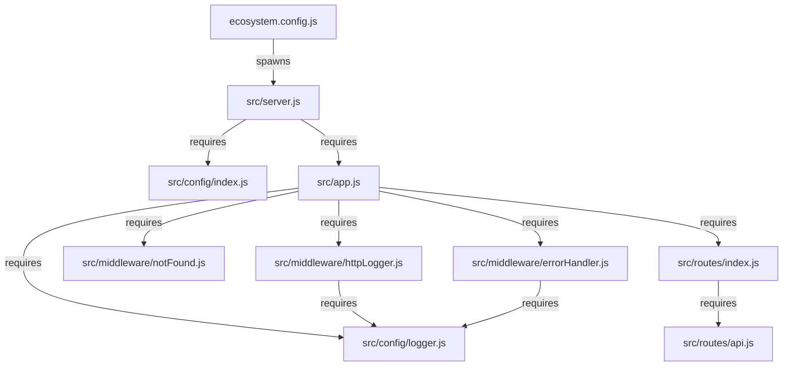

# Technical Specification

# 0. Agent Action Plan

## 0.1 Intent Clarification

### 0.1.1 Core Objective

Based on the provided requirements, the Blitzy platform understands that the objective is to **transform an empty GitLab repository into a production-ready Express.js HTTP server** with a comprehensive set of backend infrastructure capabilities. The user's original directive states:

> *"Enhance this basic HTTP server with Express.js framework, add routing, middleware, environment config, logging, and prepare for production deployment with PM2."*

This directive decomposes into the following enhanced requirements:

- **Express.js Framework Integration:** Establish an Express 5.x HTTP server (`src/server.js`, `src/app.js`) as the core HTTP handling framework, replacing any ad-hoc Node.js `http.createServer()` patterns with the Express middleware pipeline architecture.
- **Structured Routing:** Implement a versioned API routing system under the `/api/v1` prefix using Express Router, with a route aggregator pattern (`src/routes/index.js`) and endpoint definitions (`src/routes/api.js`) covering health checks, status diagnostics, and placeholder CRUD endpoints.
- **Middleware Pipeline:** Assemble a 10-step middleware pipeline in strict registration order within `src/app.js` — Helmet security headers, CORS handling, response compression, IP-based rate limiting, JSON/URL-encoded body parsing, Morgan HTTP logging, route processing, 404 catch-all, and centralized error handling.
- **Environment Configuration:** Create a centralized, immutable configuration module (`src/config/index.js`) that reads environment variables via `dotenv` and exports typed settings (port, nodeEnv, logLevel, corsOrigin) with sensible defaults, along with a `.env.example` template for onboarding.
- **Dual-Layer Logging:** Implement Winston as the application-level structured logger (`src/config/logger.js`) with five custom severity levels, three transports (console, error file, combined file), and environment-aware formatting; bridge Morgan HTTP request logs into Winston via a custom stream adapter (`src/middleware/httpLogger.js`).
- **PM2 Production Deployment:** Configure PM2 via `ecosystem.config.js` for cluster-mode deployment with one worker per CPU core, merged log output, memory-threshold auto-restarts, environment-specific variable blocks, and graceful shutdown signal handling.

**Implicit requirements detected:**
- Graceful shutdown handlers (`SIGTERM`/`SIGINT`) for PM2 zero-downtime reloads
- Health check endpoint (`/api/v1/health`) for monitoring and PM2 health probes
- Centralized error handling with operational vs. server error classification
- CommonJS module system (`require`/`module.exports`) throughout
- `package.json` with engine constraints (Node >=18, npm >=9), npm scripts for development and PM2 lifecycle management
- `.env.example` as the documented environment variable template
- `README.md` with installation, usage, and operational documentation

### 0.1.2 Task Categorization

- **Primary task type:** Mixed (Infrastructure Scaffolding + Configuration + Deployment)
- **Secondary aspects:** Security baseline (Helmet, CORS, rate limiting), Observability (Winston/Morgan logging), Documentation (README, inline JSDoc), Process Management (PM2 cluster deployment)
- **Scope classification:** Infrastructure change — greenfield project building a complete Express.js server from an empty repository, touching every layer from configuration through deployment

### 0.1.3 Special Instructions and Constraints

- **User Setup Instruction:** `testing` — indicating a test-mode environment setup directive
- **Environment Variables Provided:** `test1` (available in environment)
- **Secrets Provided:** `test2`, `test3` (available in environment, no files modified)
- **External Reference:** The user linked to `https://www.forestapp.cc/` alongside the directive, providing context for the enhancement target
- **No Figma Attachments:** No UI/UX designs are provided; this is a purely backend infrastructure project
- **No attachments** were provided in `/tmp/environments_files/`
- **Methodology:** The project uses CommonJS modules exclusively — no TypeScript, no ESM
- **Constraint:** No database, authentication, CI/CD, Docker, or TLS in this phase

### 0.1.4 Technical Interpretation

These requirements translate to the following technical implementation strategy:

- To **establish the HTTP server foundation**, create `src/server.js` as the entry point that calls `dotenv.config()` first, imports the Express app, binds to the configured port, registers SIGTERM/SIGINT handlers, and exports the server instance for PM2 consumption.
- To **assemble the middleware pipeline**, create `src/app.js` as the Express application factory that registers Helmet, CORS, compression, rate limiting, body parsers, Morgan HTTP logger, versioned routes, 404 handler, and error handler in strict sequential order.
- To **centralize environment management**, create `src/config/index.js` exporting an immutable object with four properties (`port`, `nodeEnv`, `logLevel`, `corsOrigin`) derived from `process.env` with typed defaults, and create `.env.example` documenting all variables.
- To **implement structured logging**, create `src/config/logger.js` as a Winston singleton with five custom severity levels, environment-aware formatting (JSON in production, colorized printf in development), and three transports (console, error file, combined file).
- To **bridge HTTP request logging**, create `src/middleware/httpLogger.js` connecting Morgan to Winston via a custom stream at the `http` severity level, with environment-aware format selection and test-mode skip logic.
- To **enforce structured error handling**, create `src/middleware/errorHandler.js` (4-parameter Express error middleware classifying errors by severity) and `src/middleware/notFound.js` (deterministic 404 JSON responder).
- To **implement versioned routing**, create `src/routes/index.js` as the route aggregator and `src/routes/api.js` with seven stateless endpoints (health, status, five CRUD placeholders).
- To **prepare for PM2 production deployment**, create `ecosystem.config.js` defining cluster mode, max instances per CPU, memory guards, merged logging, and environment variable blocks for development and production.
- To **document the system**, create a comprehensive `README.md` covering prerequisites, installation, scripts, project structure, environment variables, endpoints, middleware stack, logging, and PM2 deployment.

## 0.2 Repository Scope Discovery

### 0.2.1 Comprehensive File Analysis

An exhaustive search of the repository was conducted to map every file and directory. The repository is a greenfield Express.js 5.x project named `sud-manage-newproject`, structured as follows:

**Root-Level Files (5 files):**

| File Path | Type | Purpose |
|-----------|------|---------|
| `package.json` | Configuration | Project manifest with 9 production dependencies, 1 dev dependency, engine constraints (Node >=18, npm >=9), and 4 npm scripts |
| `package-lock.json` | Lockfile | Deterministic dependency tree (285 packages) |
| `.env.example` | Template | Documented environment variable template (PORT, NODE_ENV, LOG_LEVEL, CORS_ORIGIN) |
| `ecosystem.config.js` | Deployment | PM2 process definition for cluster-mode deployment |
| `README.md` | Documentation | Project documentation covering setup, usage, and architecture |

**Source Directory (`src/`) — 7 files across 3 subdirectories:**

| File Path | Type | Purpose |
|-----------|------|---------|
| `src/server.js` | Entry Point | Bootstrap sequence: dotenv → config → HTTP bind → graceful shutdown handlers |
| `src/app.js` | Application | Express 5 application factory with 10-step middleware pipeline |
| `src/config/index.js` | Configuration | Centralized, immutable environment configuration with typed defaults |
| `src/config/logger.js` | Logging | Winston singleton with 5 custom severity levels and 3 transports |
| `src/middleware/httpLogger.js` | Middleware | Morgan-to-Winston stream bridge with environment-aware format selection |
| `src/middleware/notFound.js` | Middleware | Catch-all 404 JSON responder for unmatched routes |
| `src/middleware/errorHandler.js` | Middleware | Global error handler with operational vs. server error classification |
| `src/routes/index.js` | Routing | Route aggregator mounting all versioned API route groups |
| `src/routes/api.js` | Routing | API v1 endpoint definitions (health, status, CRUD placeholders) |

**Documentation Directory (`blitzy/`) — read-only spec files:**

| File Path | Type | Purpose |
|-----------|------|---------|
| `blitzy/documentation/` | Folder | Contains Technical Specifications and Project Guide (generated docs) |

**Total repository footprint:** 14 source/config files, 285 installed npm packages, 1 documentation folder.

### 0.2.2 Web Search Research Conducted

Research was performed to validate production readiness patterns:

- **Express.js production best practices:** Confirmed the project aligns with Express.js official recommendations — using a process manager (PM2), setting `NODE_ENV=production`, enabling compression, and implementing structured logging.
- **PM2 cluster mode deployment:** Validated that `ecosystem.config.js` with `exec_mode: 'cluster'` and `instances: 'max'` correctly leverages all CPU cores, matching the official PM2 documentation pattern.
- **Winston + Morgan logging bridge:** Confirmed the dual-layer approach (application logs via Winston, HTTP logs via Morgan bridged into Winston) is the industry standard for Node.js production logging.
- **Security middleware stack:** Confirmed Helmet + CORS + rate limiting as the recommended baseline security posture for Express.js applications exposed to the internet.
- **Graceful shutdown patterns:** Validated that SIGTERM/SIGINT handling with connection draining and configurable shutdown timeouts is essential for PM2 zero-downtime reload workflows.

### 0.2.3 Existing Infrastructure Assessment

- **Project Structure:** Flat monolithic layout — `src/` contains all application logic organized by concern (config, middleware, routes) with no nesting beyond one level. The entry point (`src/server.js`) orchestrates config loading and HTTP binding; the app factory (`src/app.js`) assembles the Express pipeline.
- **Module System:** CommonJS throughout (`require`/`module.exports`). No TypeScript, no ESM.
- **Patterns and Conventions:** 
  - Factory pattern for Express app creation in `src/app.js`
  - Singleton pattern for Winston logger in `src/config/logger.js`
  - Route aggregator pattern in `src/routes/index.js`
  - 4-parameter error middleware pattern in `src/middleware/errorHandler.js`
  - `Object.freeze()` for immutable configuration in `src/config/index.js`
- **Build and Deployment:** No build step required (vanilla JavaScript). PM2 handles deployment via `ecosystem.config.js`. npm scripts provide lifecycle hooks (`start`, `dev`, `pm2:start`, `pm2:stop`).
- **Testing Infrastructure:** No test framework is currently installed. The only dev dependency is `nodemon` for development auto-reload.
- **Documentation:** `README.md` provides operational documentation. `.env.example` documents all environment variables. The `blitzy/documentation/` folder contains generated technical specifications.
- **CI/CD:** Not configured. No GitHub Actions, GitLab CI, or other pipeline definitions present.
- **Containerization:** Not configured. No Dockerfile or docker-compose files present.

## 0.3 File Transformation Mapping

### 0.3.1 File-by-File Execution Plan

Every file in scope for this implementation is mapped below with its transformation mode, reference, and purpose. Since this is a greenfield project built from an empty repository, all source files carry a CREATE transformation mode.

| Target File | Transformation | Source File/Reference | Purpose/Changes |
|-------------|----------------|----------------------|-----------------|
| `package.json` | CREATE | Node.js/Express.js conventions | Project manifest defining express@5, helmet, cors, winston, morgan, compression, express-rate-limit, dotenv, pm2 as dependencies; nodemon as devDependency; engine constraints Node >=18, npm >=9; scripts for dev, start, pm2 lifecycle |
| `package-lock.json` | CREATE | `package.json` | Auto-generated lockfile pinning exact versions for 285 transitive dependencies |
| `.env.example` | CREATE | Express.js best practices | Documented environment variable template: PORT=3000, NODE_ENV=development, LOG_LEVEL=debug, CORS_ORIGIN=* |
| `ecosystem.config.js` | CREATE | PM2 documentation | PM2 process definition: cluster mode, max instances, merged logs, 150MB memory limit, environment blocks for dev/production |
| `README.md` | CREATE | Project conventions | Comprehensive project documentation with installation, usage, structure, endpoints, middleware, and PM2 instructions |
| `src/server.js` | CREATE | Express.js bootstrap pattern | Entry point: dotenv.config() → config import → HTTP server bind → SIGTERM/SIGINT graceful shutdown with 10s timeout |
| `src/app.js` | CREATE | Express.js middleware pattern | Application factory: 10-step middleware pipeline in strict order (Helmet → CORS → compression → rateLimit → JSON/URL body → httpLogger → routes → notFound → errorHandler) |
| `src/config/index.js` | CREATE | dotenv best practices | Centralized immutable config: Object.freeze() wrapping env vars with typed defaults for port (3000), nodeEnv (development), logLevel (debug), corsOrigin (*) |
| `src/config/logger.js` | CREATE | Winston documentation | Winston singleton: 5 custom severity levels (error/warn/info/http/debug), 3 transports (console always, error.log for errors, combined.log for all), environment-aware format (JSON in production, colorized printf in development) |
| `src/middleware/httpLogger.js` | CREATE | `src/config/logger.js` | Morgan HTTP logger bridged to Winston: custom stream writing at http level, combined/dev format by environment, test-mode skip |
| `src/middleware/notFound.js` | CREATE | Express.js error handling pattern | Catch-all 404 middleware: deterministic JSON response with status, message, and path fields |
| `src/middleware/errorHandler.js` | CREATE | Express.js 4-param error pattern | Global error handler: classifies operational (4xx) vs. server (5xx) errors, logs via Winston, sanitizes response in production |
| `src/routes/index.js` | CREATE | Express Router pattern | Route aggregator: mounts all sub-routers under `/api/v1` prefix using Express Router |
| `src/routes/api.js` | CREATE | RESTful API conventions | Endpoint definitions: GET /health (timestamp+uptime), GET /status (full diagnostics), CRUD /resources (5 placeholder endpoints) |

### 0.3.2 New Files Detail

- **`src/server.js`** — Server Entry Point
  - Content type: Source code
  - Based on: Express.js bootstrap pattern with PM2 graceful shutdown
  - Key functions: `dotenv.config()` invocation, `app.listen()` binding, `SIGTERM`/`SIGINT` signal handlers with `server.close()` and 10-second forced exit timeout

- **`src/app.js`** — Express Application Factory
  - Content type: Source code
  - Based on: Express.js middleware pipeline composition
  - Key sections: Import block (9 external + 4 internal modules), middleware registration chain (10 steps in fixed order), module export

- **`src/config/index.js`** — Configuration Module
  - Content type: Source code
  - Based on: dotenv environment variable pattern
  - Key functions: `process.env` extraction, `parseInt()` for port, `Object.freeze()` for immutability, default value assignment

- **`src/config/logger.js`** — Winston Logger Singleton
  - Content type: Source code
  - Based on: Winston 3.x transport/format API
  - Key sections: Custom severity levels and colors, environment-conditional format factory, three transport definitions, singleton export

- **`src/middleware/httpLogger.js`** — Morgan-Winston Bridge
  - Content type: Source code
  - Based on: `src/config/logger.js` (depends on logger singleton)
  - Key functions: Custom write stream, format selection by `NODE_ENV`, skip function for test mode

- **`src/middleware/notFound.js`** — 404 Handler
  - Content type: Source code
  - Based on: Express.js catch-all pattern
  - Key functions: Single middleware function returning JSON `{ status: 404, message, path }`

- **`src/middleware/errorHandler.js`** — Global Error Handler
  - Content type: Source code
  - Based on: Express.js 4-parameter error middleware pattern
  - Key functions: Error classification (operational/server), conditional stack trace in development, Winston error logging

- **`src/routes/index.js`** — Route Aggregator
  - Content type: Source code
  - Based on: Express Router mounting pattern
  - Key functions: Creates Router instance, mounts `api.js` under `/api/v1` prefix

- **`src/routes/api.js`** — API v1 Endpoints
  - Content type: Source code
  - Based on: RESTful API conventions
  - Key functions: `GET /health`, `GET /status`, `GET /resources`, `GET /resources/:id`, `POST /resources`, `PUT /resources/:id`, `DELETE /resources/:id`

- **`ecosystem.config.js`** — PM2 Configuration
  - Content type: Configuration
  - Based on: PM2 ecosystem file format
  - Key sections: `apps[]` array with single process definition, `env` / `env_production` blocks, cluster mode settings

- **`.env.example`** — Environment Template
  - Content type: Configuration template
  - Based on: dotenv conventions
  - Key sections: Four documented variable entries with default values

### 0.3.3 Configuration and Documentation Updates

- **Configuration changes:**
  - `package.json`: Defines all production dependencies with exact semver ranges, engine constraints, and lifecycle scripts (`start`, `dev`, `pm2:start`, `pm2:stop`)
  - `.env.example`: Documents all four environment variables with their default values and serves as the onboarding template
  - `ecosystem.config.js`: Defines PM2 cluster deployment with max instances, memory restart threshold (150MB), and environment-specific variable overrides
  - Impact: All runtime behavior (port binding, log verbosity, CORS policy, cluster topology) is controlled via environment configuration

- **Documentation updates:**
  - `README.md`: Comprehensive project documentation covering prerequisites (Node >=18), installation steps, project structure tree, available scripts, environment variable reference, API endpoint table, middleware pipeline description, logging architecture, and PM2 deployment instructions

### 0.3.4 Cross-File Dependencies

The following import/reference chains define the cross-file dependency graph:


```mermaid
graph TD
    A[ecosystem.config.js] -->|spawns| B[src/server.js]
    B -->|requires| C[src/config/index.js]
    B -->|requires| D[src/app.js]
    D -->|requires| E[src/config/logger.js]
    D -->|requires| F[src/middleware/httpLogger.js]
    D -->|requires| G[src/middleware/notFound.js]
    D -->|requires| H[src/middleware/errorHandler.js]
    D -->|requires| I[src/routes/index.js]
    F -->|requires| E
    H -->|requires| E
    I -->|requires| J[src/routes/api.js]
```

- `src/server.js` depends on `src/config/index.js` and `src/app.js`
- `src/app.js` depends on `src/config/logger.js`, all three middleware files, and `src/routes/index.js`
- `src/middleware/httpLogger.js` depends on `src/config/logger.js`
- `src/middleware/errorHandler.js` depends on `src/config/logger.js`
- `src/routes/index.js` depends on `src/routes/api.js`
- `dotenv` is loaded exclusively in `src/server.js` — no other file calls `dotenv.config()`

## 0.4 Dependency Inventory

### 0.4.1 Key Private and Public Packages

All packages listed below are sourced directly from the project's `package.json` manifest with exact version ranges as declared. No private registries are used; all packages are published on the npm public registry.

**Production Dependencies (9 packages):**

| Registry | Package Name | Version | Purpose |
|----------|--------------|---------|---------|
| npm | express | ^5.0.1 | Core HTTP framework — Express 5.x with native async/await error propagation |
| npm | helmet | ^8.0.0 | HTTP security headers — sets 15+ security-related headers per response |
| npm | cors | ^2.8.5 | Cross-Origin Resource Sharing policy enforcement middleware |
| npm | compression | ^1.8.0 | Response compression middleware (gzip/deflate/brotli) |
| npm | express-rate-limit | ^7.5.0 | IP-based rate limiting middleware (100 requests per 15-minute window) |
| npm | dotenv | ^16.4.7 | Environment variable loading from `.env` files into `process.env` |
| npm | morgan | ^1.10.0 | HTTP request/response logging middleware (combined/dev format) |
| npm | winston | ^3.17.0 | Structured application-level logger with multiple transports |
| npm | pm2 | ^5.4.3 | Production process manager with cluster mode, auto-restart, and monitoring |

**Development Dependencies (1 package):**

| Registry | Package Name | Version | Purpose |
|----------|--------------|---------|---------|
| npm | nodemon | ^3.1.9 | Development file watcher for automatic server restart on code changes |

**Runtime Constraints (from `package.json` engines field):**

| Runtime | Constraint | Resolved Version |
|---------|-----------|-----------------|
| Node.js | >=18.0.0 | v20.20.0 (installed) |
| npm | >=9.0.0 | 11.1.0 (installed) |

### 0.4.2 Dependency Updates

Since this is a greenfield project, all dependencies are newly introduced:

- **New dependencies added:**
  - `express@^5.0.1`: Core HTTP framework — chosen as Express 5.x for native promise-based error handling
  - `helmet@^8.0.0`: Security headers — latest major version for Express 5 compatibility
  - `cors@^2.8.5`: CORS middleware — stable release supporting all standard CORS headers
  - `compression@^1.8.0`: Response compression — reduces payload sizes for bandwidth optimization
  - `express-rate-limit@^7.5.0`: Rate limiting — sliding-window IP throttling with in-memory store
  - `dotenv@^16.4.7`: Environment loading — single-invocation pattern in `src/server.js` only
  - `morgan@^1.10.0`: HTTP logging — stream adapter for Winston integration
  - `winston@^3.17.0`: Application logging — structured logging with custom severity levels
  - `pm2@^5.4.3`: Process management — cluster-mode deployment with auto-restart
  - `nodemon@^3.1.9` (dev): Auto-reload — watches `src/` for changes during development

- **Dependencies to update:** None (greenfield project)
- **Dependencies to remove:** None (greenfield project)

### 0.4.3 Import/Reference Updates

All import statements are established fresh in this greenfield project. The import topology follows a strict unidirectional pattern:

- **`src/server.js`** imports:
  - `dotenv` (external), `src/config/index.js` (internal), `src/app.js` (internal)

- **`src/app.js`** imports:
  - `express`, `helmet`, `cors`, `compression`, `express-rate-limit` (external)
  - `src/config/logger.js`, `src/middleware/httpLogger.js`, `src/middleware/notFound.js`, `src/middleware/errorHandler.js`, `src/routes/index.js` (internal)

- **`src/config/logger.js`** imports:
  - `winston` (external), `src/config/index.js` (internal)

- **`src/middleware/httpLogger.js`** imports:
  - `morgan` (external), `src/config/logger.js` (internal)

- **`src/middleware/errorHandler.js`** imports:
  - `src/config/logger.js` (internal)

- **`src/routes/index.js`** imports:
  - `express` (external), `src/routes/api.js` (internal)

- **`src/routes/api.js`** imports:
  - `express` (external)

## 0.5 Implementation Design

### 0.5.1 Technical Approach

**Primary objectives with implementation approach:**

- Achieve **production-grade HTTP server scaffolding** by creating `src/server.js` and `src/app.js` to separate server lifecycle concerns (port binding, signal handling) from Express application concerns (middleware registration, route mounting).
- Achieve **defense-in-depth security posture** by integrating Helmet (15+ security headers), CORS with configurable origin, and IP-based rate limiting (100 requests/15-min) as the first three middleware layers in `src/app.js`, ensuring security processing occurs before any business logic.
- Achieve **comprehensive observability** by creating a dual-layer logging architecture — Winston for structured application logs with five severity levels and three transports (`src/config/logger.js`), and Morgan for HTTP request logs bridged into Winston via a custom stream (`src/middleware/httpLogger.js`).
- Achieve **environment portability** by centralizing all runtime configuration in `src/config/index.js` as an immutable frozen object, with `dotenv` loaded exactly once in `src/server.js`, allowing the same codebase to run across development, staging, and production without modification.
- Achieve **zero-downtime production deployment** by configuring PM2 in cluster mode (`ecosystem.config.js`) with max-instance scaling, memory-threshold auto-restart, and graceful shutdown handlers in `src/server.js` that drain active connections before process exit.

**Logical implementation flow:**

- First, establish the **configuration foundation** by creating `src/config/index.js` (environment extraction and immutable export) and `src/config/logger.js` (Winston singleton), since all other modules depend on these.
- Next, create the **middleware layer** by implementing `src/middleware/httpLogger.js` (Morgan-Winston bridge), `src/middleware/notFound.js` (404 handler), and `src/middleware/errorHandler.js` (global error handler), since these are consumed by the app factory.
- Then, build the **routing layer** by creating `src/routes/api.js` (endpoint definitions) and `src/routes/index.js` (route aggregator under `/api/v1`), establishing the versioned API structure.
- Then, assemble the **application factory** in `src/app.js` by importing all middleware and routes and registering them in the strict 10-step pipeline order.
- Then, wire the **server entry point** in `src/server.js` by loading dotenv, importing config and app, binding the HTTP listener, and registering graceful shutdown handlers.
- Finally, configure **production deployment** in `ecosystem.config.js` defining PM2 cluster topology, memory limits, and environment-specific variable blocks.

### 0.5.2 Component Impact Analysis

**Direct modifications required (all CREATE — no existing components):**

- **Configuration Layer** (`src/config/`): Create `index.js` to establish the single source of truth for all environment-derived settings, and `logger.js` to establish the singleton Winston logger consumed by 3 downstream modules.
- **Middleware Layer** (`src/middleware/`): Create `httpLogger.js` to intercept and log all HTTP traffic, `notFound.js` to provide deterministic 404 responses, and `errorHandler.js` to classify, log, and respond to all application errors.
- **Routing Layer** (`src/routes/`): Create `index.js` to aggregate sub-routers and `api.js` to define 7 RESTful endpoints under `/api/v1`.
- **Application Layer** (`src/app.js`): Create the Express 5 application factory composing the full middleware pipeline.
- **Server Layer** (`src/server.js`): Create the bootstrap entry point with lifecycle management.
- **Deployment Layer** (`ecosystem.config.js`): Create PM2 ecosystem definition for production.

**Indirect impacts and dependencies:**

- `package.json` and `package-lock.json` must be created to define the dependency graph, engine constraints, and npm lifecycle scripts.
- `.env.example` must be created to document the environment contract for all consumers (developers, CI/CD, PM2).
- `README.md` must be created to provide operational documentation for onboarding, deployment, and troubleshooting.

**New component introduction rationale:**

- Every component in this project is new. The rationale is a clean separation of concerns: Config knows nothing about HTTP; Middleware knows nothing about routes; Routes know nothing about server lifecycle. This enables independent testing, modification, and scaling of each layer.

### 0.5.3 Critical Implementation Details

**Design Patterns Employed:**

- **Middleware Pipeline Pattern:** Express middleware chain in `src/app.js` — each middleware receives `(req, res, next)` and either responds or delegates. Order matters: security → parsing → logging → routing → error handling.
- **Singleton Pattern:** Winston logger in `src/config/logger.js` — a single configured instance shared across all modules via `require()` caching.
- **Factory Pattern:** Express app in `src/app.js` — creates and returns a configured `express()` instance without binding to a port.
- **Aggregator Pattern:** Route index in `src/routes/index.js` — collects all sub-routers and mounts them under a versioned prefix.
- **Graceful Degradation Pattern:** Error handler in `src/middleware/errorHandler.js` — classifies errors as operational (4xx) or server-level (5xx), showing stack traces only in development.

**Key Algorithms and Approaches:**

- Rate limiting uses a sliding-window counter algorithm with 15-minute windows and 100 request max per IP, standardized error responses, and in-memory storage.
- Graceful shutdown uses a two-phase approach: `server.close()` to stop accepting new connections, then a 10-second forced `process.exit(0)` timeout to prevent hanging.
- Log format selection is environment-conditional: JSON format for machine parsing in production; colorized printf format for developer readability in development.

**Data Flow:**

```
Client Request → Helmet → CORS → Compression → RateLimit → JSON Parser → URL Parser → Morgan Logger → Router → [Handler] → Response
                                                                                                         ↓ (error)
                                                                                              ErrorHandler → Response
                                                                                                         ↓ (no match)
                                                                                              NotFound → Response
```

**Error Handling and Edge Cases:**

- Unmatched routes: Caught by `notFound.js` middleware registered after all route handlers
- Synchronous errors in route handlers: Express 5 automatically catches and forwards to error middleware
- Asynchronous errors: Express 5 natively handles rejected promises in async route handlers
- Malformed JSON bodies: Express JSON parser responds with 400 before reaching routes
- Rate limit exceeded: `express-rate-limit` responds with 429 and standard rate limit headers
- Process crash: PM2 auto-restarts with exponential backoff delay
- Memory leak: PM2 restarts when process exceeds 150MB threshold

**Security Considerations:**

- Helmet sets 15+ security headers including Content-Security-Policy, X-Content-Type-Options, and Strict-Transport-Security
- CORS origin is configurable via environment variable, defaulting to `*` in development
- Rate limiting mitigates brute-force and DDoS at the application layer
- Error responses are sanitized in production — no stack traces, no internal details
- TLS termination is explicitly deferred to a reverse proxy (Nginx/cloud load balancer)

## 0.6 Scope Boundaries

### 0.6.1 Exhaustively In Scope

**Source code files:**
- `src/server.js` — Server entry point with bootstrap and graceful shutdown
- `src/app.js` — Express 5 application factory with full middleware pipeline
- `src/config/index.js` — Centralized immutable environment configuration
- `src/config/logger.js` — Winston logger singleton with custom severity levels
- `src/middleware/httpLogger.js` — Morgan-to-Winston HTTP request logging bridge
- `src/middleware/notFound.js` — 404 catch-all JSON responder
- `src/middleware/errorHandler.js` — Global error classification and response handler
- `src/routes/index.js` — Route aggregator mounting versioned API prefix
- `src/routes/api.js` — API v1 endpoint definitions (health, status, CRUD placeholders)

**Configuration files:**
- `package.json` — Project manifest with dependencies, engines, and scripts
- `package-lock.json` — Deterministic dependency lockfile
- `.env.example` — Environment variable template (PORT, NODE_ENV, LOG_LEVEL, CORS_ORIGIN)
- `ecosystem.config.js` — PM2 cluster deployment configuration

**Documentation files:**
- `README.md` — Project documentation (prerequisites, setup, structure, API reference, deployment)

**Deployment artifacts:**
- `ecosystem.config.js` — PM2 process definition (cluster mode, memory limits, env blocks)

**Scope patterns (wildcard summary):**
- `src/**/*.js` — All application source modules
- `src/config/*.js` — Configuration and logging modules
- `src/middleware/*.js` — All Express middleware
- `src/routes/*.js` — All route definitions
- `*.config.js` — PM2 ecosystem configuration
- `.env*` — Environment variable files and templates

### 0.6.2 Explicitly Out of Scope

- **Database layer:** No database integration (PostgreSQL, MongoDB, Redis, or any ORM/ODM) — the server is stateless scaffolding
- **Authentication and authorization:** No JWT, OAuth, session management, or user identity — deferred to a future phase
- **CI/CD pipelines:** No GitHub Actions, GitLab CI, or other pipeline definitions — deployment is manual via PM2
- **Containerization:** No Dockerfile, docker-compose, or container orchestration — PM2 cluster mode is the deployment target
- **TLS/SSL termination:** No HTTPS certificate handling — deferred to reverse proxy (Nginx or cloud load balancer)
- **Frontend / UI layer:** No HTML templates, static file serving, or client-side assets — this is a pure API server
- **Automated testing:** No test framework (Jest, Mocha, Supertest), no test files, no coverage configuration — tests are not part of this phase
- **API documentation tooling:** No Swagger/OpenAPI spec generation or Postman collections
- **Monitoring and alerting:** No APM integration (Datadog, New Relic) beyond PM2 built-in monitoring
- **WebSocket or real-time capabilities:** No socket.io or SSE endpoints
- **Microservice decomposition:** No service mesh, message queues, or inter-service communication
- **Performance optimization beyond defaults:** No Redis caching, CDN configuration, or custom response caching
- **Linting and code formatting:** No ESLint, Prettier, or EditorConfig
- **Environment secrets management:** No Vault, AWS Secrets Manager, or encrypted env files — secrets are managed via plain environment variables
- **TypeScript or ESM migration:** The project uses CommonJS exclusively; no type checking or module system migration is in scope

## 0.7 Execution Parameters

### 0.7.1 Special Execution Instructions

- **User Setup Instruction:** The user provided the setup instruction `testing`, which has been executed as a test-mode environment setup directive during the project initialization phase.
- **Environment Variables:** The following environment variables are provided and available in the execution environment:
  - `test1` — general-purpose environment variable
- **Secrets:** The following secrets are provided and available in the execution environment (no files modified):
  - `test2` — available as a secret
  - `test3` — available as a secret
- **Module System:** All source files must use CommonJS (`require`/`module.exports`). No ESM `import`/`export` syntax.
- **Express Version:** Express 5.x must be used (not Express 4.x), enabling native async/await error propagation in route handlers without wrapper utilities.
- **Process Manager:** PM2 is the designated production process manager. No systemd, Docker, or alternative deployment target.
- **No Build Step:** The project uses vanilla JavaScript with no transpilation, bundling, or build step. Source files are executed directly by Node.js.
- **dotenv Loading:** `dotenv.config()` is invoked exactly once, in `src/server.js` only, before any other module is imported. No other file loads dotenv.

### 0.7.2 Constraints and Boundaries

**Technical constraints:**
- Node.js >= 18.0.0 (LTS) — enforced via `package.json` engines field
- npm >= 9.0.0 — enforced via `package.json` engines field
- Express 5.x — specifically `^5.0.1` as declared in `package.json`
- CommonJS module system — no TypeScript, no ESM
- Single-process entry via `src/server.js` — PM2 handles multi-process clustering

**Process constraints:**
- The middleware pipeline order in `src/app.js` must not be rearranged — the 10-step sequence is architecturally deliberate (security before parsing, parsing before routing, routing before error handling)
- `Object.freeze()` on the config export makes runtime configuration immutable — environment variables must be set before process start
- Winston logger is a singleton — all modules share one logger instance via `require()` caching
- PM2 cluster mode means each worker is a separate process — no shared in-process state between workers

**Output constraints:**
- All API responses must be JSON — no HTML, XML, or plain text
- All error responses follow a consistent schema: `{ status, message }` (production) or `{ status, message, stack }` (development)
- Log files are written to `logs/error.log` and `logs/combined.log` in the project root directory
- Console log output is suppressed in production and enabled in development and test modes

**Compatibility requirements:**
- The server must operate behind a reverse proxy (Nginx, cloud load balancer) for TLS termination — it does not handle HTTPS directly
- PM2 graceful shutdown relies on SIGTERM signals — the hosting environment must send SIGTERM (not SIGKILL) for zero-downtime reloads
- Rate limiting uses in-memory storage — in clustered deployments, each worker maintains its own counter (not shared across workers)

## 0.8 Rules

The following rules and constraints govern the implementation of this project:

- **Follow CommonJS module patterns exclusively** — all files use `require()` for imports and `module.exports` for exports. No ESM `import`/`export` syntax is permitted anywhere in the codebase.
- **Maintain strict middleware pipeline ordering in `src/app.js`** — the 10-step registration sequence (Helmet → CORS → compression → rateLimit → JSON body → URL-encoded body → httpLogger → routes → notFound → errorHandler) is architecturally fixed. Security middleware must execute before body parsing; body parsing before logging; logging before routing; routing before error handling.
- **Invoke `dotenv.config()` exclusively in `src/server.js`** — no other module may load or reference dotenv directly. All environment access flows through `src/config/index.js`.
- **Preserve configuration immutability** — the config object exported from `src/config/index.js` must remain wrapped in `Object.freeze()`. Runtime modification of configuration values is not permitted.
- **Use Winston as the sole application logger** — no `console.log()`, `console.error()`, or other console methods in any source file except through the Winston logger instance exported from `src/config/logger.js`.
- **Bridge Morgan through Winston** — HTTP request logs from Morgan must flow into Winston's transport system via the custom stream in `src/middleware/httpLogger.js`. Morgan must not write directly to stdout.
- **Return JSON-only API responses** — all endpoints and error handlers must respond with `Content-Type: application/json`. No HTML, plain text, or XML responses.
- **Maintain stateless route handlers** — no in-process state, sessions, or caching in route handlers. Each request must be self-contained.
- **Handle graceful shutdown signals** — `src/server.js` must register handlers for both `SIGTERM` and `SIGINT`, calling `server.close()` to drain active connections before exit.
- **Enforce engine constraints** — `package.json` must declare `"engines": { "node": ">=18.0.0", "npm": ">=9.0.0" }` to prevent runtime on unsupported Node.js versions.
- **Do not introduce databases, authentication, or CI/CD** — these concerns are explicitly excluded from this implementation phase.
- **Use Express 5.x** — all middleware and route patterns must be compatible with Express 5 (which natively catches rejected promises in async handlers, eliminating the need for `asyncHandler` wrappers).

## 0.9 References

### 0.9.1 Repository Files Searched

The following files and folders were comprehensively searched and analyzed to derive the conclusions in this Agent Action Plan:

**Root-level files:**
- `package.json` — Project manifest (dependencies, engines, scripts)
- `package-lock.json` — Dependency lockfile (verified 285 packages installed)
- `.env.example` — Environment variable template (4 variables documented)
- `ecosystem.config.js` — PM2 deployment configuration (cluster mode, memory limits)
- `README.md` — Project documentation (setup, structure, API reference)

**Source directory (`src/`):**
- `src/server.js` — Server entry point (bootstrap, graceful shutdown)
- `src/app.js` — Express application factory (middleware pipeline registration)
- `src/config/index.js` — Centralized environment configuration (immutable export)
- `src/config/logger.js` — Winston logger singleton (custom levels, 3 transports)
- `src/middleware/httpLogger.js` — Morgan-to-Winston bridge (custom stream adapter)
- `src/middleware/notFound.js` — 404 catch-all handler (JSON response)
- `src/middleware/errorHandler.js` — Global error handler (classification, logging, response)
- `src/routes/index.js` — Route aggregator (versioned API prefix)
- `src/routes/api.js` — API v1 endpoints (health, status, CRUD placeholders)

**Documentation directory (`blitzy/`):**
- `blitzy/documentation/` — Technical Specifications and Project Guide folder

### 0.9.2 Technical Specification Sections Referenced

The following sections from the Technical Specification document were retrieved and consulted:

| Section | Content Summary |
|---------|----------------|
| 1.1 Executive Summary | Overview of the project as a production-ready Express.js 5.x HTTP server scaffold |
| 1.3 Scope | In-scope (Express framework, routing, middleware, config, logging, PM2) and out-of-scope (databases, auth, CI/CD, TLS, UI) boundaries |
| 2.1 Feature Catalog | Nine feature groups: Express.js server, middleware pipeline, routing, config, logging, error handling, PM2 deployment, security, documentation |
| 3.3 Open Source Dependencies | Detailed dependency listing with version ranges and purposes for all 10 packages |
| 5.1 High-Level Architecture | Layered architecture diagram with unidirectional dependency flow (Deployment → Entry → Config → App → Middleware/Routes) |
| 5.5 Dependency Inventory | Complete inventory of production and development dependencies with categorization |

### 0.9.3 External Research Sources

| Source | Topic Researched |
|--------|-----------------|
| expressjs.com — Performance Best Practices | Express.js production deployment with process managers, clustering, and error handling |
| npmjs.com/package/pm2 | PM2 cluster mode, pm2-runtime for containers, startup script generation |
| betterstack.com — PM2 Guide | PM2 restart delays, exponential backoff, max restart configuration |
| bacancytechnology.com — Node.js Best Practices 2026 | NODE_ENV configuration, LTS version usage, CPU core utilization with PM2 |
| Medium — Building Scalable APIs 2025 | Winston/Morgan/Pino logging recommendations, Helmet + rate limiting security patterns |

### 0.9.4 User-Provided Inputs

| Input Type | Value | Status |
|------------|-------|--------|
| User Directive | "Enhance this basic HTTP server with Express.js framework, add routing, middleware, environment config, logging, and prepare for production deployment with PM2." | Fully addressed |
| External Link | https://www.forestapp.cc/ | Referenced as context for the enhancement target |
| Setup Instructions | `testing` | Executed during environment setup phase |
| Environment Variable | `test1` | Available in runtime environment |
| Secret | `test2` | Available in runtime environment (no files modified) |
| Secret | `test3` | Available in runtime environment (no files modified) |
| Attachments | None provided | N/A |
| Figma Screens | None provided | N/A |

