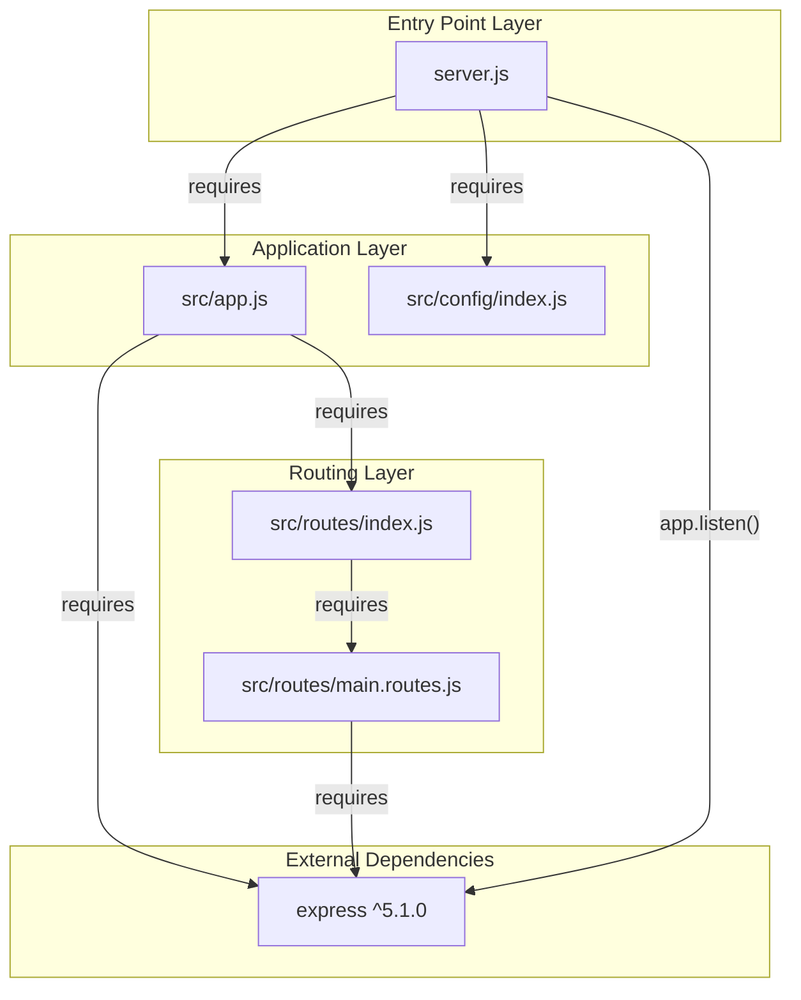
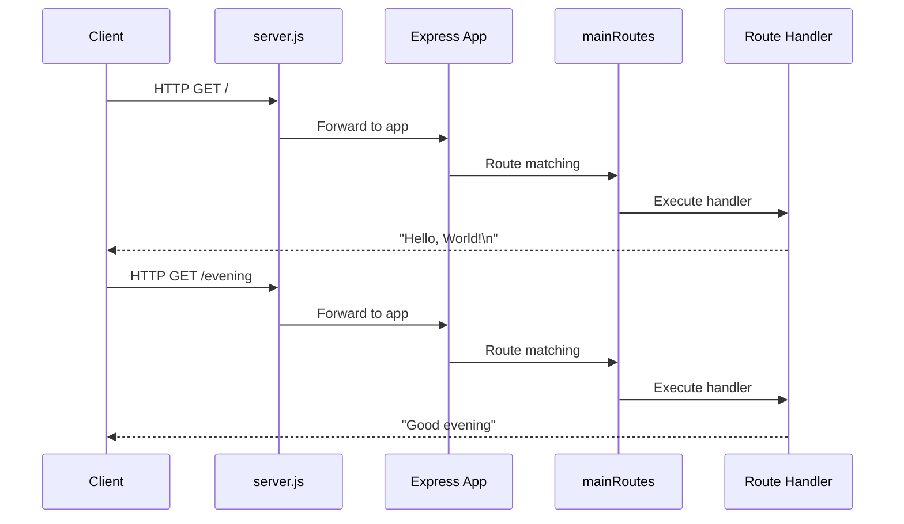

# Technical Specification

# 0. Agent Action Plan

## 0.1 Intent Clarification

This section captures and translates the user's requirements into precise technical specifications, surfacing implicit dependencies and establishing clear technical objectives for the Express.js integration and endpoint addition.

### 0.1.1 Core Feature Objective

Based on the prompt, the Blitzy platform understands that the new feature requirement is to:

1. **Integrate Express.js Framework**: Add Express.js as the web framework to the existing Node.js tutorial server project, replacing any native HTTP handling with Express.js patterns
2. **Add Evening Greeting Endpoint**: Create a new HTTP GET endpoint at path `/evening` that responds with the exact string `"Good evening"`
3. **Maintain Existing Functionality**: Preserve the current "Hello world" endpoint behavior while adding the new capability

**Implicit Requirements Detected:**

- The existing Node.js server structure must be refactored to follow Express.js best practices
- Route organization should support multiple endpoints in a maintainable pattern
- Configuration management should follow the Twelve-Factor App methodology for environment externalization
- The application architecture should support testability through separation of concerns (app factory pattern)
- Response strings must be preserved exactly as specified for validation purposes

**Feature Dependencies and Prerequisites:**

| Dependency | Type | Requirement |
|------------|------|-------------|
| Node.js Runtime | System | >= 20.19.x (current LTS) |
| npm Package Manager | System | >= 10.8.x |
| Express.js | External Package | ^5.1.0 |
| Existing server.js | Codebase | Must be refactored, not deleted |

### 0.1.2 Special Instructions and Constraints

**Architectural Requirements:**

- **Use Express.js Router Pattern**: Implement routes using `express.Router()` for modularity
- **Implement Factory Pattern**: Create the Express application in a separate module for testability
- **Follow CommonJS Module System**: Maintain compatibility with existing Node.js patterns using `require`/`module.exports`
- **Preserve Response Strings**: The root endpoint must return `'Hello, World!\n'` (with trailing newline) and the evening endpoint must return `'Good evening'` (without trailing newline)

**Integration Requirements:**

- Server binding logic must remain in a dedicated entry point file
- Configuration values (host, port) should be externalized to environment variables
- Route handlers should be isolated in a dedicated routes module

**User Example (Preserved):**
> "this is a tutorial of node js server hosting one endpoint that returns the response 'Hello world'. Could you add expressjs into the project and add another endpoint that return the response of 'Good evening'?"

### 0.1.3 Technical Interpretation

These feature requirements translate to the following technical implementation strategy:

| Requirement | Technical Action | Target Component |
|-------------|------------------|------------------|
| Add Express.js | Install `express` package and import in application | `package.json`, `src/app.js` |
| Create modular structure | Reorganize into `src/` directory with app, config, routes modules | `src/app.js`, `src/config/`, `src/routes/` |
| Add /evening endpoint | Create new route handler in routes module | `src/routes/main.routes.js` |
| Maintain /  endpoint | Migrate existing handler to Express route format | `src/routes/main.routes.js` |
| Enable configuration | Create config module reading environment variables | `src/config/index.js` |
| Preserve entry point | Update server.js to use Express app factory | `server.js` |

**Implementation Strategy Summary:**

- To **integrate Express.js**, we will install the express package (^5.1.0) and create an application factory in `src/app.js` using `express()`
- To **add the evening endpoint**, we will create a route handler using `express.Router()` with `router.get('/evening', handler)` returning `'Good evening'`
- To **maintain existing functionality**, we will migrate the root endpoint handler to the Express router pattern while preserving the exact response string `'Hello, World!\n'`
- To **enable testability**, we will separate server binding (`server.js`) from application configuration (`src/app.js`), allowing tests to import the app without starting the HTTP server

## 0.2 Repository Scope Discovery

This section documents the comprehensive analysis of all repository files that require creation or modification to implement the Express.js integration and evening endpoint feature.

### 0.2.1 Comprehensive File Analysis

**Repository Structure Analysis:**

The repository follows a modular Node.js application pattern with clear separation of concerns:

```
/
├── server.js                    # Entry point - HTTP server binding
├── package.json                 # npm manifest and dependencies
├── package-lock.json            # Dependency lockfile (68 packages)
├── README.md                    # Project documentation
├── .gitignore                   # Git ignore patterns
├── src/                         # Application source root
│   ├── app.js                   # Express application factory
│   ├── config/                  # Configuration module
│   │   └── index.js            # Environment variable management
│   └── routes/                  # Routing surface
│       ├── index.js            # Route aggregator (barrel)
│       └── main.routes.js      # Route handlers implementation
└── blitzy/                      # Documentation artifacts
    └── documentation/          # Technical specifications
```

**Existing Files Requiring Modification:**

| File Path | Current Purpose | Modification Required |
|-----------|-----------------|----------------------|
| `server.js` | Entry point with binding logic | UPDATE: Import from `src/app` and `src/config`, use app factory pattern |
| `package.json` | npm manifest | UPDATE: Express dependency already added (^5.1.0) |
| `README.md` | Basic project description | UPDATE: Document new endpoint and architecture |

**Integration Point Discovery:**

| Integration Point | Location | Purpose |
|-------------------|----------|---------|
| Express App Factory | `src/app.js` | Central application configuration and route mounting |
| Route Registration | `src/app.js` line 25 | `app.use('/', mainRoutes)` mounts all routes |
| Route Aggregator | `src/routes/index.js` | Exports `mainRoutes` for consumption by app.js |
| Endpoint Handlers | `src/routes/main.routes.js` | Contains GET `/` and GET `/evening` handlers |
| Configuration | `src/config/index.js` | Provides `host`, `port`, `env` values |
| Server Binding | `server.js` lines 21-23 | `app.listen()` call with config values |

### 0.2.2 New File Requirements

**New Source Files Created:**

| File Path | Purpose | Key Implementation |
|-----------|---------|-------------------|
| `src/app.js` | Express application factory module | Creates and exports configured Express app with mounted routes |
| `src/config/index.js` | Configuration management module | Exports `{ host, port, env }` from environment variables |
| `src/routes/index.js` | Route aggregator (barrel pattern) | Centralizes route exports: `module.exports = { mainRoutes }` |
| `src/routes/main.routes.js` | Route handler definitions | Implements GET `/` and GET `/evening` endpoints |

**New Test Files (Recommended):**

| File Path | Purpose | Test Coverage |
|-----------|---------|---------------|
| `tests/routes.test.js` | Unit tests for route handlers | Validate GET `/` returns `'Hello, World!\n'`, GET `/evening` returns `'Good evening'` |
| `tests/app.test.js` | Integration tests for Express app | Validate route mounting and middleware configuration |
| `tests/config.test.js` | Unit tests for configuration | Validate default values and environment variable parsing |

**New Documentation Files:**

| File Path | Purpose |
|-----------|---------|
| `docs/api.md` | API endpoint documentation |
| `docs/architecture.md` | Architecture overview with diagrams |

### 0.2.3 File Inventory Summary

**Complete File Inventory for Feature Implementation:**

| Category | Files | Status |
|----------|-------|--------|
| Entry Point | `server.js` | MODIFY - Update to use app factory |
| Application Core | `src/app.js` | CREATE - Express application factory |
| Configuration | `src/config/index.js` | CREATE - Environment variable management |
| Routes | `src/routes/index.js`, `src/routes/main.routes.js` | CREATE - Route handlers and aggregator |
| Package Management | `package.json`, `package-lock.json` | MODIFY - Add Express dependency |
| Documentation | `README.md` | MODIFY - Update with new endpoint info |
| Git Configuration | `.gitignore` | UNCHANGED - Already excludes node_modules |

**Files Explicitly NOT Modified:**

| File Path | Reason |
|-----------|--------|
| `blitzy/**/*` | Documentation-only artifacts, not runtime code |
| `.git/**/*` | Git internal files |

## 0.3 Dependency Inventory

This section provides a comprehensive inventory of all packages and dependencies required for the Express.js integration feature, including version specifications and their purposes.

### 0.3.1 Private and Public Packages

**Runtime Dependencies:**

| Package Registry | Package Name | Version | Purpose | Source |
|------------------|--------------|---------|---------|--------|
| npm (npmjs.com) | `express` | ^5.1.0 | Web framework providing HTTP handling, routing, and middleware | `package.json` |

**Express.js Transitive Dependencies (68 packages total):**

| Package | Version | Purpose |
|---------|---------|---------|
| `accepts` | 2.0.0 | Content negotiation |
| `body-parser` | 2.2.0 | Request body parsing middleware |
| `content-disposition` | 1.0.0 | Content-Disposition header handling |
| `content-type` | 1.0.5 | Content-Type header parsing |
| `cookie` | 0.7.2 | Cookie parsing and serialization |
| `cookie-signature` | 1.2.2 | Cookie signing utilities |
| `debug` | 4.4.0 | Debug logging utility |
| `encodeurl` | 2.0.0 | URL encoding |
| `escape-html` | 1.0.3 | HTML escaping |
| `etag` | 1.8.1 | ETag generation |
| `finalhandler` | 2.1.0 | Final HTTP responder |
| `fresh` | 2.0.0 | HTTP response freshness testing |
| `merge-descriptors` | 2.0.0 | Object property merging |
| `mime-types` | 3.0.1 | MIME type database |
| `on-finished` | 2.4.1 | HTTP request/response finished listener |
| `parseurl` | 1.3.3 | URL parsing |
| `qs` | 6.14.0 | Query string parsing |
| `range-parser` | 1.2.1 | Range header parsing |
| `raw-body` | 3.0.0 | Raw request body parsing |
| `router` | 2.2.0 | HTTP routing |
| `send` | 1.2.0 | Static file serving |
| `serve-static` | 2.2.0 | Static file middleware |
| `statuses` | 2.0.1 | HTTP status utilities |
| `type-is` | 2.0.1 | Content-Type checking |
| `vary` | 1.1.2 | Vary header management |

**Development Dependencies (Recommended):**

| Package Registry | Package Name | Version | Purpose |
|------------------|--------------|---------|---------|
| npm | `jest` | ^29.x | Testing framework |
| npm | `supertest` | ^6.x | HTTP assertion library |
| npm | `jsdoc` | ^4.x | Documentation generation |
| npm | `markdownlint-cli` | ^0.x | Markdown linting |

### 0.3.2 Dependency Updates

**Import Updates:**

Files requiring import updates to use Express:

| File Pattern | Import Transformation |
|--------------|----------------------|
| `server.js` | Add: `const app = require('./src/app');` and `const config = require('./src/config');` |
| `src/app.js` | Add: `const express = require('express');` and `const { mainRoutes } = require('./routes');` |
| `src/routes/main.routes.js` | Add: `const express = require('express');` |
| `src/routes/index.js` | Add: `const mainRoutes = require('./main.routes');` |

**Import Transformation Rules:**

```javascript
// OLD (Native HTTP): 
const http = require('http');
http.createServer((req, res) => {...});

// NEW (Express.js):
const express = require('express');
const app = express();
app.get('/', (req, res) => res.send('...'));
```

### 0.3.3 External Reference Updates

**Configuration Files:**

| File | Update Required |
|------|-----------------|
| `package.json` | Add `"express": "^5.1.0"` to dependencies |
| `package-lock.json` | Auto-generated via `npm install` |

**Package.json Updates:**

```json
{
  "dependencies": {
    "express": "^5.1.0"
  }
}
```

**Build Files:**

| File | Status |
|------|--------|
| `package.json` (scripts) | UNCHANGED - `"start": "node server.js"` remains valid |

**CI/CD Files (if present):**

| File Pattern | Update Required |
|--------------|-----------------|
| `.github/workflows/*.yml` | Ensure Node.js 20.x is specified |
| `Dockerfile*` | Ensure `npm install` runs before `npm start` |

### 0.3.4 Version Compatibility Matrix

| Component | Minimum Version | Recommended Version | Rationale |
|-----------|-----------------|---------------------|-----------|
| Node.js | 18.x | 20.19.x | Express 5.x requires Node.js 18+; LTS 20.x recommended |
| npm | 8.x | 10.8.x | Lockfile v3 support |
| Express.js | 5.0.0 | 5.1.0 | Latest stable with security patches |

**Security Advisory:**

The dependency audit reveals 1 moderate severity vulnerability in the `body-parser` package. Run `npm audit fix` to resolve:

```bash
npm audit fix
```

## 0.4 Integration Analysis

This section documents all integration touchpoints within the existing codebase that require modification or coordination for the Express.js feature implementation.

### 0.4.1 Existing Code Touchpoints

**Direct Modifications Required:**

| File | Line Numbers | Modification Description |
|------|--------------|-------------------------|
| `server.js` | Lines 1-23 | Refactor to import Express app from `src/app.js` and config from `src/config`; use `app.listen(config.port, config.host, callback)` |
| `package.json` | Line 12-14 | Add Express dependency: `"express": "^5.1.0"` in dependencies block |
| `README.md` | All | Update to document Express.js architecture and both endpoints |

**Dependency Injection Points:**

| File | Purpose | Implementation |
|------|---------|----------------|
| `server.js` lines 18-19 | Import application and configuration | `const app = require('./src/app');` and `const config = require('./src/config');` |
| `src/app.js` line 15 | Import route aggregator | `const { mainRoutes } = require('./routes');` |
| `src/app.js` line 25 | Mount routes on Express app | `app.use('/', mainRoutes);` |

### 0.4.2 Module Dependency Graph

**Application Module Flow:**


```mermaid
graph TB
    subgraph EntryPoint["Entry Point Layer"]
        SERVER["server.js"]
    end
    
    subgraph ApplicationLayer["Application Layer"]
        APP["src/app.js"]
        CONFIG["src/config/index.js"]
    end
    
    subgraph RoutingLayer["Routing Layer"]
        ROUTES_IDX["src/routes/index.js"]
        ROUTES_MAIN["src/routes/main.routes.js"]
    end
    
    subgraph ExternalDeps["External Dependencies"]
        EXPRESS["express ^5.1.0"]
    end
    
    SERVER -->|"requires"| APP
    SERVER -->|"requires"| CONFIG
    APP -->|"requires"| EXPRESS
    APP -->|"requires"| ROUTES_IDX
    ROUTES_IDX -->|"requires"| ROUTES_MAIN
    ROUTES_MAIN -->|"requires"| EXPRESS
    
    SERVER -->|"app.listen()"| EXPRESS
```

### 0.4.3 Request Flow Integration

**HTTP Request Processing Path:**


```mermaid
sequenceDiagram
    participant Client
    participant Server as server.js
    participant Express as Express App
    participant Router as mainRoutes
    participant Handler as Route Handler
    
    Client->>Server: HTTP GET /
    Server->>Express: Forward to app
    Express->>Router: Route matching
    Router->>Handler: Execute handler
    Handler-->>Client: "Hello, World!\n"
    
    Client->>Server: HTTP GET /evening
    Server->>Express: Forward to app
    Express->>Router: Route matching
    Router->>Handler: Execute handler
    Handler-->>Client: "Good evening"
```

### 0.4.4 Configuration Integration

**Environment Variable Flow:**

| Variable | Default | Consumer | Purpose |
|----------|---------|----------|---------|
| `HOST` | `'127.0.0.1'` | `server.js` via `config.host` | Server binding address |
| `PORT` | `3000` | `server.js` via `config.port` | Server binding port |
| `NODE_ENV` | `'development'` | Application modules | Environment mode |

**Configuration Module Contract:**

```javascript
// src/config/index.js exports:
module.exports = {
  host: process.env.HOST || '127.0.0.1',
  port: parseInt(process.env.PORT, 10) || 3000,
  env: process.env.NODE_ENV || 'development'
};
```

### 0.4.5 Route Integration Contract

**Route Aggregator Pattern:**

| Component | File | Export Shape |
|-----------|------|--------------|
| Route Aggregator | `src/routes/index.js` | `{ mainRoutes: Router }` |
| Route Handlers | `src/routes/main.routes.js` | `Router` instance |

**Route Registration Contract:**

| Method | Path | Handler | Response |
|--------|------|---------|----------|
| GET | `/` | Anonymous function | `'Hello, World!\n'` |
| GET | `/evening` | Anonymous function | `'Good evening'` |

### 0.4.6 Testing Integration Points

**Testable Module Boundaries:**

| Module | Test Strategy | Isolation Method |
|--------|---------------|------------------|
| `src/app.js` | Import app without starting server | Factory pattern separation |
| `src/routes/main.routes.js` | Mount on test app instance | Router isolation |
| `src/config/index.js` | Test with mocked `process.env` | Environment injection |

**Integration Test Entry Points:**

```javascript
// Test example using supertest
const request = require('supertest');
const app = require('./src/app');

request(app).get('/').expect(200);
request(app).get('/evening').expect(200);
```

## 0.5 Technical Implementation

This section provides a detailed file-by-file execution plan for implementing the Express.js integration and evening endpoint feature.

### 0.5.1 File-by-File Execution Plan

**CRITICAL**: Every file listed below MUST be created or modified as specified to complete the feature implementation.

**Group 1 - Core Application Files:**

| Action | File | Implementation Details |
|--------|------|----------------------|
| CREATE | `src/app.js` | Express application factory - creates and exports configured Express app with mounted routes |
| CREATE | `src/config/index.js` | Configuration module - exports `{ host, port, env }` from environment variables |
| MODIFY | `server.js` | Update to import from `src/app` and `src/config`, delegate to app factory |

**Group 2 - Routing Infrastructure:**

| Action | File | Implementation Details |
|--------|------|----------------------|
| CREATE | `src/routes/index.js` | Route aggregator - barrel pattern exporting `{ mainRoutes }` |
| CREATE | `src/routes/main.routes.js` | Route handlers - implement GET `/` and GET `/evening` endpoints |

**Group 3 - Package Configuration:**

| Action | File | Implementation Details |
|--------|------|----------------------|
| MODIFY | `package.json` | Add Express dependency: `"express": "^5.1.0"` |
| REGENERATE | `package-lock.json` | Auto-generated via `npm install` |

**Group 4 - Documentation:**

| Action | File | Implementation Details |
|--------|------|----------------------|
| MODIFY | `README.md` | Update with Express.js architecture, new endpoint documentation |

### 0.5.2 Implementation Approach per File

**server.js - Entry Point Refactoring:**

```javascript
// Key implementation: Import from src modules
const app = require('./src/app');
const config = require('./src/config');

app.listen(config.port, config.host, () => {
  console.log(`Server running at http://${config.host}:${config.port}/`);
});
```

Purpose: Isolate HTTP server binding from application configuration, enabling testability.

**src/app.js - Application Factory:**

```javascript
// Key implementation: Express factory pattern
const express = require('express');
const { mainRoutes } = require('./routes');

const app = express();
app.use('/', mainRoutes);

module.exports = app;
```

Purpose: Create configured Express app without starting server, allowing test imports.

**src/config/index.js - Configuration Management:**

```javascript
// Key implementation: Environment with defaults
module.exports = {
  host: process.env.HOST || '127.0.0.1',
  port: parseInt(process.env.PORT, 10) || 3000,
  env: process.env.NODE_ENV || 'development'
};
```

Purpose: Centralize configuration with Twelve-Factor App compliance.

**src/routes/main.routes.js - Route Handlers:**

```javascript
// Key implementation: Express Router with endpoints
const express = require('express');
const router = express.Router();

router.get('/', (req, res) => res.send('Hello, World!\n'));
router.get('/evening', (req, res) => res.send('Good evening'));

module.exports = router;
```

Purpose: Define endpoint handlers with exact response strings.

**src/routes/index.js - Route Aggregator:**

```javascript
// Key implementation: Barrel pattern export
const mainRoutes = require('./main.routes');
module.exports = { mainRoutes };
```

Purpose: Centralize route exports for clean imports.

### 0.5.3 Implementation Sequence

**Step-by-Step Execution Order:**

| Step | Action | File | Dependency |
|------|--------|------|------------|
| 1 | Add dependency | `package.json` | None |
| 2 | Install packages | Run `npm install` | Step 1 |
| 3 | Create config | `src/config/index.js` | None |
| 4 | Create route handlers | `src/routes/main.routes.js` | Step 2 |
| 5 | Create route aggregator | `src/routes/index.js` | Step 4 |
| 6 | Create app factory | `src/app.js` | Steps 3, 5 |
| 7 | Update entry point | `server.js` | Step 6 |
| 8 | Update documentation | `README.md` | Step 7 |
| 9 | Verify implementation | Run `npm start` and test | Step 8 |

### 0.5.4 Verification Commands

**Runtime Verification:**

```bash
# Start the server
npm start
# Expected output: Server running at http://127.0.0.1:3000/

#### Test root endpoint
curl -s http://127.0.0.1:3000/
#### Expected output: Hello, World!

#### Test evening endpoint
curl -s http://127.0.0.1:3000/evening
#### Expected output: Good evening
```

**Static Verification Checklist:**

| Check | Command | Expected Result |
|-------|---------|-----------------|
| Dependencies installed | `npm ls express` | `express@5.1.0` |
| Module exports correct | `node -e "console.log(require('./src/app'))"` | `[Function: app]` |
| Config exports correct | `node -e "console.log(require('./src/config'))"` | `{ host: '127.0.0.1', port: 3000, env: 'development' }` |

## 0.6 Scope Boundaries

This section defines explicit boundaries for what is included and excluded from the Express.js integration feature implementation.

### 0.6.1 Exhaustively In Scope

**Source Files (with wildcards where applicable):**

| Pattern | Description | Action |
|---------|-------------|--------|
| `src/app.js` | Express application factory module | CREATE |
| `src/config/*.js` | Configuration modules | CREATE |
| `src/routes/*.js` | Route handlers and aggregators | CREATE |
| `server.js` | Entry point refactoring | MODIFY |

**Package Management Files:**

| File | Description | Action |
|------|-------------|--------|
| `package.json` | npm manifest with Express dependency | MODIFY |
| `package-lock.json` | Dependency lockfile | REGENERATE |

**Configuration Touchpoints:**

| File | Lines/Section | Purpose |
|------|---------------|---------|
| `src/config/index.js` | All | New environment variable management |
| `.env.example` | New file (optional) | Document available environment variables |

**Documentation Files:**

| Pattern | Description | Action |
|---------|-------------|--------|
| `README.md` | Project documentation | MODIFY |
| `docs/api/*.md` | API endpoint documentation (optional) | CREATE |
| `blitzy/documentation/*.md` | Technical specifications | REFERENCE ONLY |

**Integration Points:**

| Component | Location | Modification |
|-----------|----------|--------------|
| Route registration | `src/app.js` line 25 | `app.use('/', mainRoutes)` |
| Service exports | `src/routes/index.js` | `module.exports = { mainRoutes }` |
| Model exports | N/A | Not applicable for this feature |

**Test Files (Recommended):**

| Pattern | Description |
|---------|-------------|
| `tests/**/*test*.js` | Unit and integration tests |
| `tests/**/*spec*.js` | Alternative test naming |

### 0.6.2 Explicitly Out of Scope

**Features and Functionality NOT Included:**

| Item | Reason |
|------|--------|
| Additional HTTP methods (POST, PUT, DELETE) | Not specified in requirements |
| Database integration | Not required for greeting endpoints |
| Authentication/Authorization | Not specified in requirements |
| Middleware (error handling, logging) | Enhancement for future iteration |
| WebSocket support | Not specified in requirements |
| Static file serving | Not required for API endpoints |
| Template rendering | Plain text responses only |

**Performance Optimizations NOT Included:**

| Item | Reason |
|------|--------|
| Response caching | Simple greeting responses don't require caching |
| Compression middleware | Not needed for small text responses |
| Clustering/load balancing | Out of scope for tutorial project |
| Rate limiting | Enhancement for future iteration |

**Refactoring NOT Included:**

| Item | Reason |
|------|--------|
| ES Modules migration | CommonJS specified for compatibility |
| TypeScript conversion | JavaScript specified |
| Restructuring existing tests | No existing tests present |
| Third-party logging integration | Enhancement for future iteration |

**Files Explicitly Excluded:**

| Pattern | Reason |
|---------|--------|
| `blitzy/**/*` | Documentation artifacts only, not runtime code |
| `.git/**/*` | Git internal files |
| `node_modules/**/*` | External dependencies (managed by npm) |
| `*.log` | Log files |
| `.env` | Environment-specific secrets |

### 0.6.3 Scope Boundary Matrix

**Feature Scope Summary:**

| Category | In Scope | Out of Scope |
|----------|----------|--------------|
| **Endpoints** | GET `/`, GET `/evening` | All other HTTP methods/paths |
| **Response Format** | Plain text | JSON, HTML, XML |
| **Configuration** | HOST, PORT, NODE_ENV | Database, API keys, secrets |
| **Architecture** | Modular Express.js | Microservices, serverless |
| **Testing** | Basic endpoint verification | Comprehensive test suite |
| **Documentation** | README updates | Full API documentation |
| **Security** | None | Helmet, CORS, rate limiting |
| **Monitoring** | Console logging | Structured logging, metrics |

### 0.6.4 Boundary Enforcement

**Validation Criteria for Scope Compliance:**

| Criterion | Validation Method | Expected Result |
|-----------|-------------------|-----------------|
| Only specified endpoints exist | `curl` all routes | Only `/` and `/evening` respond |
| Response strings exact | Byte comparison | `'Hello, World!\n'` and `'Good evening'` |
| No extra dependencies | `npm ls --depth=0` | Only `express` as direct dependency |
| CommonJS modules | `grep -r "import "` | No ES module imports |
| No authentication | Check route handlers | No auth middleware |

**Scope Change Request Process:**

Any requirements beyond this scope boundary must be documented as a separate feature request with:

- Clear business justification
- Impact analysis on existing implementation
- Updated technical specification

## 0.7 Special Instructions

This section documents feature-specific requirements, constraints, and special considerations that must be observed during implementation.

### 0.7.1 Feature-Specific Requirements

**Pattern and Convention Requirements:**

| Requirement | Implementation | Rationale |
|-------------|----------------|-----------|
| Factory Pattern | `src/app.js` exports configured Express app | Enables testing without HTTP binding |
| Barrel Pattern | `src/routes/index.js` aggregates routes | Clean import surface for route modules |
| CommonJS Modules | Use `require`/`module.exports` | Node.js compatibility, project standard |
| JSDoc Comments | Add `@module`, `@route`, `@returns` tags | Documentation and IDE support |

**Response String Preservation (CRITICAL):**

| Endpoint | Exact Response | Character Count | Trailing Newline |
|----------|----------------|-----------------|------------------|
| GET `/` | `'Hello, World!\n'` | 14 characters | YES |
| GET `/evening` | `'Good evening'` | 12 characters | NO |

⚠️ **WARNING**: Response strings must match exactly, including whitespace and newline characters. Validation tests depend on byte-exact matching.

### 0.7.2 Integration Requirements with Existing Features

**Module Import Contract:**

```javascript
// server.js MUST import exactly:
const app = require('./src/app');     // Express Application instance
const config = require('./src/config'); // { host, port, env }

// src/app.js MUST import exactly:
const express = require('express');
const { mainRoutes } = require('./routes'); // Destructured import
```

**Export Shape Requirements:**

| Module | Required Export Shape |
|--------|----------------------|
| `src/app.js` | `module.exports = app` (Express Application) |
| `src/config/index.js` | `module.exports = { host, port, env }` |
| `src/routes/index.js` | `module.exports = { mainRoutes }` |
| `src/routes/main.routes.js` | `module.exports = router` (Express Router) |

### 0.7.3 Performance and Scalability Considerations

**Design Decisions for Scalability:**

| Decision | Implementation | Benefit |
|----------|----------------|---------|
| Side-effect-free modules | No I/O at module load time | Predictable startup, testable |
| Synchronous configuration | `process.env` reads at load | No async init complexity |
| Stateless handlers | No shared mutable state | Horizontal scaling ready |

**Performance Baseline:**

| Metric | Target | Measurement |
|--------|--------|-------------|
| Response time | < 10ms | Local `curl` timing |
| Memory footprint | < 50MB | Node.js process size |
| Startup time | < 1s | Time to "Server running" log |

### 0.7.4 Security Requirements

**Security Constraints for Tutorial Scope:**

| Aspect | Current Implementation | Future Enhancement |
|--------|------------------------|-------------------|
| Input validation | None (no input accepted) | Add validation middleware |
| CORS | Default (same-origin) | Configure express-cors |
| Headers | Express defaults | Add helmet.js |
| Rate limiting | None | Add express-rate-limit |

**Security Notes:**

- Current implementation binds to `127.0.0.1` by default (localhost only)
- Production deployments should override HOST via environment variable
- No sensitive data is processed or stored
- No authentication is required for greeting endpoints

### 0.7.5 Operational Instructions

**Startup Command:**

```bash
# Standard startup
npm start

#### Custom configuration
HOST=0.0.0.0 PORT=8080 npm start
```

**Expected Console Output:**

```
Server running at http://127.0.0.1:3000/
```

**Health Check Verification:**

```bash
# Verify both endpoints are operational
curl -s http://127.0.0.1:3000/ && echo "Root OK"
curl -s http://127.0.0.1:3000/evening && echo "Evening OK"
```

### 0.7.6 Quality Gates

**Pre-Merge Validation Checklist:**

| Gate | Command | Expected Result |
|------|---------|-----------------|
| Dependency audit | `npm audit` | No high/critical vulnerabilities |
| Package installation | `npm ci` | Clean install, no warnings |
| Server startup | `npm start` | "Server running at..." message |
| Root endpoint | `curl http://127.0.0.1:3000/` | `Hello, World!` with newline |
| Evening endpoint | `curl http://127.0.0.1:3000/evening` | `Good evening` without newline |
| Module exports | `node -e "require('./src/app')"` | No errors |

### 0.7.7 Documentation Requirements

**Mandatory Documentation Updates:**

| Document | Section | Content Required |
|----------|---------|------------------|
| `README.md` | Prerequisites | Node.js >= 20.x, npm >= 10.x |
| `README.md` | Installation | `npm install` instructions |
| `README.md` | Usage | `npm start` and endpoint examples |
| `README.md` | API Reference | GET `/` and GET `/evening` documentation |
| `README.md` | Project Structure | File/folder hierarchy description |

**JSDoc Requirements per File:**

| File | Required Tags |
|------|---------------|
| `server.js` | `@module`, `@requires` |
| `src/app.js` | `@module`, `@requires`, `@exports` |
| `src/config/index.js` | `@module`, `@type` for each config |
| `src/routes/main.routes.js` | `@module`, `@route`, `@returns` |
| `src/routes/index.js` | `@module`, `@exports` |

