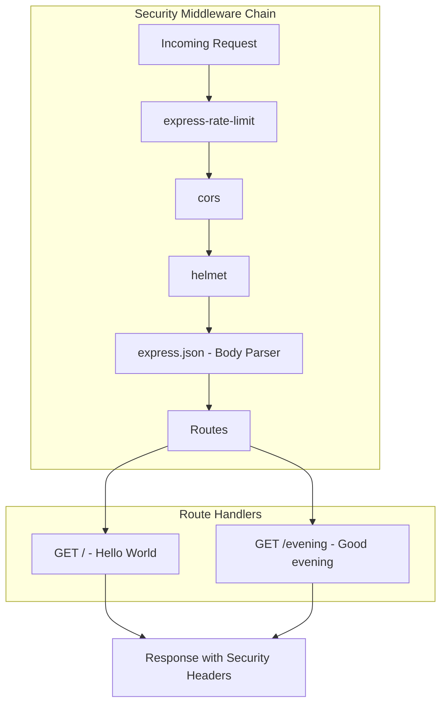

# Technical Specification

# 0. Agent Action Plan

## 0.1 Intent Clarification

### 0.1.1 Core Security Objective

Based on the security enhancement request, the Blitzy platform understands that the objective is to **implement a comprehensive security middleware layer** for an existing Express.js 5.x application. This involves transforming a tutorial-grade application with minimal security controls into a production-hardened server with industry-standard security measures.

**Vulnerability Category:** Multiple Security Enhancements (Proactive Security Hardening)

**Severity Assessment:** High - The current application lacks fundamental security controls that are considered baseline requirements for any production-facing web application.

**Security Requirements Identified:**

| Requirement ID | Security Objective | Technical Implementation |
|----------------|-------------------|-------------------------|
| SEC-001 | Security Headers Protection | Implement helmet.js middleware for HTTP security headers |
| SEC-002 | Input Validation | Add express-validator for request data sanitization |
| SEC-003 | Rate Limiting | Implement express-rate-limit to prevent abuse and DoS |
| SEC-004 | HTTPS Support | Configure secure transport and HSTS headers |
| SEC-005 | CORS Policy | Implement cors middleware with proper origin controls |
| SEC-006 | Dependency Security | Update all dependencies to secure versions |

**Implicit Security Needs Surfaced:**
- Middleware ordering is critical for security effectiveness
- Content Security Policy (CSP) configuration for XSS prevention
- X-Frame-Options for clickjacking protection
- Referrer policy for information leakage prevention
- Environment-specific configuration (development vs production)

### 0.1.2 Special Instructions and Constraints

**Change Scope:** Standard security implementation following Express.js security best practices

**Security Requirements:**
- Follow OWASP security guidelines for web applications
- Implement security-by-default configurations
- Maintain backward compatibility with existing API contracts
- Preserve existing route functionality (`/` and `/evening` endpoints)

**Configuration Requirements:**
- Security settings should be configurable via environment variables
- Development mode should allow relaxed settings for local testing
- Production mode should enforce strict security policies

### 0.1.3 Technical Interpretation

This security enhancement translates to the following technical implementation strategy:

**"To achieve comprehensive security hardening, we will:**
1. Add `helmet.js` middleware to set 13+ HTTP security headers automatically
2. Implement `cors` middleware with configurable origin whitelist policies
3. Add `express-rate-limit` middleware for request throttling protection
4. Integrate `express-validator` for input validation capabilities
5. Configure HTTPS/TLS support through environment-based settings
6. Update the middleware chain in `src/app.js` with proper security ordering"

**User Understanding Level:** General security concern with specific solution guidance (helmet.js, CORS, rate limiting mentioned explicitly)

**Implementation Approach:**
```
Request Flow: Client → Rate Limiter → CORS → Helmet → Routes → Response
```

The security middleware must be applied before route handlers to ensure all requests pass through security controls.

## 0.2 Vulnerability Research and Analysis

### 0.2.1 Initial Assessment

The current Express.js application lacks security middleware, exposing it to common web vulnerabilities:

| Security Gap | Current State | Risk Level |
|--------------|---------------|------------|
| Security Headers | None configured | High |
| Rate Limiting | Not implemented | High |
| CORS | Not configured | Medium |
| Input Validation | Not implemented | Medium |
| HTTPS Support | HTTP only | High |

**CVE/Vulnerability Mapping:**

| Gap | Related CVE/Advisory | Attack Vector |
|-----|---------------------|---------------|
| Missing CSP Headers | OWASP A7:2017 - XSS | Cross-site scripting injection |
| Missing X-Frame-Options | CVE-2015-5729 (general) | Clickjacking attacks |
| No Rate Limiting | OWASP API4:2019 | Resource exhaustion, brute force |
| Missing HSTS | OWASP A3:2017 | Man-in-the-middle attacks |
| No Input Validation | OWASP A1:2017 - Injection | SQL/NoSQL/Command injection |

### 0.2.2 Required Web Research Findings

**Helmet.js Security Headers (v8.1.0):**

Research confirms that helmet.js sets 13 HTTP response headers by default, including Content-Security-Policy, Strict-Transport-Security, X-Content-Type-Options, X-Frame-Options, and removes the X-Powered-By header that could be used in reconnaissance attacks.

**Express-Rate-Limit (v8.2.1):**

The express-rate-limit package provides IP-based rate limiting with configurable windows and limits. The latest version supports draft-8 standard headers and configurable IPv6 subnet handling for better protection against distributed attacks.

**CORS Package (v2.8.5):**

The cors middleware provides flexible cross-origin resource sharing configuration with support for dynamic origin validation, method restrictions, and pre-flight request handling.

**Express-Validator (v7.x):**

The express-validator library wraps validator.js to provide comprehensive input validation and sanitization, supporting both body, query, and param validation with chainable validators.

### 0.2.3 Vulnerability Classification

| Vulnerability Type | Attack Vector | Impact Categories | Exploitability |
|-------------------|---------------|-------------------|----------------|
| Missing Security Headers | Network | Confidentiality, Integrity | High |
| No Rate Limiting | Network | Availability | High |
| Missing CORS Policy | Network | Integrity | Medium |
| No Input Validation | Network | Integrity, Confidentiality | Medium |
| HTTP-only Transport | Network | Confidentiality | High |

**Root Cause Analysis:**

The application was designed as a tutorial-grade system (per Technical Specification Section 6.4.1.1) with explicit constraints (C-002, C-005) excluding security middleware. The transition to production readiness requires lifting these constraints.

### 0.2.4 Security Advisory Sources Reviewed

| Source | Advisory Type | Recommendation |
|--------|--------------|----------------|
| Express.js Security Best Practices | Official Documentation | Use helmet.js, implement rate limiting |
| OWASP Top 10 2021 | Industry Standard | Input validation, security headers |
| npm Security Advisories | Package Security | Keep dependencies updated |
| Helmet.js Documentation | Package Documentation | Use default configuration as baseline |
| MDN Web Security | Standards Reference | CORS, CSP, HSTS best practices |

**Key Finding:** All recommended security packages (helmet, cors, express-rate-limit, express-validator) have no known vulnerabilities in their latest versions and are actively maintained.

## 0.3 Security Scope Analysis

### 0.3.1 Affected Component Discovery

Repository analysis reveals the following files and directories affected by security middleware implementation:

**Core Application Files:**

| File Path | Impact Type | Security Changes Required |
|-----------|-------------|--------------------------|
| `package.json` | Direct | Add security dependencies (helmet, cors, express-rate-limit, express-validator) |
| `src/app.js` | Direct | Integrate security middleware chain before routes |
| `src/config/index.js` | Direct | Add security-related environment variables |
| `server.js` | Potential | HTTPS configuration (if implementing TLS directly) |

**Route Files (Indirect Impact):**

| File Path | Impact Type | Changes Required |
|-----------|-------------|------------------|
| `src/routes/index.js` | Indirect | No changes - security applied at app level |
| `src/routes/main.routes.js` | Indirect | No changes - security applied at app level |

**Test Files (Updates Required):**

| File Path | Impact Type | Changes Required |
|-----------|-------------|------------------|
| `tests/integration/endpoints.test.js` | Direct | Add security header assertions |
| `tests/unit/*.test.js` | Potential | Unit tests for new middleware |

**Configuration Files:**

| File Path | Impact Type | Changes Required |
|-----------|-------------|------------------|
| `.env.example` (NEW) | Create | Document security environment variables |
| `jest.config.js` | No change | Test configuration unchanged |

### 0.3.2 Root Cause Identification

The security gaps exist because the application was designed as a tutorial-grade system per Technical Specification constraint C-005:

| Constraint | Description | Impact |
|------------|-------------|--------|
| C-002 | Single runtime dependency (Express.js) | No security middleware in current stack |
| C-005 | No authentication/authorization | Security layer explicitly excluded |

**Current State Assessment:**
- Express 5.1.0 provides ReDoS protection via path-to-regexp v8.x
- Default localhost binding (127.0.0.1) provides network isolation
- No security headers, rate limiting, or CORS currently configured

### 0.3.3 Current State Assessment

**Dependency Manifest Analysis (`package.json`):**

```json
{
  "dependencies": {
    "express": "^5.1.0"  // Only runtime dependency
  },
  "devDependencies": {
    "jest": "^30.2.0",
    "supertest": "^7.1.4"
  }
}
```

**Application Entry Point (`src/app.js`):**

Current middleware chain:
1. No security middleware present
2. Routes mounted directly without protection

**Configuration (`src/config/index.js`):**

| Variable | Current Default | Security Addition |
|----------|-----------------|-------------------|
| HOST | 127.0.0.1 | No change needed |
| PORT | 3000 | No change needed |
| NODE_ENV | development | Used for security mode switching |
| CORS_ORIGIN | N/A | NEW - Allowed origins |
| RATE_LIMIT_WINDOW | N/A | NEW - Rate limit window (ms) |
| RATE_LIMIT_MAX | N/A | NEW - Max requests per window |

### 0.3.4 Scope of Exposure

| Exposure Type | Current State | After Implementation |
|---------------|---------------|---------------------|
| Internal (localhost) | Exposed | Protected with security middleware |
| Network (0.0.0.0) | Exposed (if configured) | Protected with security middleware |
| API Endpoints | 2 GET routes | Same routes with security controls |

**Endpoint Analysis:**

| Endpoint | Method | Current Security | Target Security |
|----------|--------|------------------|-----------------|
| `/` | GET | None | Headers + Rate Limit + CORS |
| `/evening` | GET | None | Headers + Rate Limit + CORS |
| `/*` (404) | Any | Express default | Security headers on error responses |

## 0.4 Version Compatibility Research

### 0.4.1 Secure Version Identification

Based on web research and npm registry analysis, the following package versions are recommended:

| Package | Latest Stable | Recommended Version | Node.js Requirement | Express Compatibility |
|---------|---------------|---------------------|---------------------|----------------------|
| helmet | 8.1.0 | ^8.1.0 | Node 16+ | Express 4.x/5.x ✅ |
| cors | 2.8.5 | ^2.8.5 | Node 14+ | Express 4.x/5.x ✅ |
| express-rate-limit | 8.2.1 | ^8.2.1 | Node 16+ | Express 4.x/5.x ✅ |
| express-validator | 7.2.1 | ^7.2.1 | Node 14+ | Express 4.x/5.x ✅ |

### 0.4.2 Compatibility Verification

**Current Application Stack:**

| Component | Current Version | Compatibility Status |
|-----------|-----------------|---------------------|
| Node.js | ≥18.x (per spec) | ✅ All packages compatible |
| Express.js | ^5.1.0 | ✅ All packages compatible |
| Jest | ^30.2.0 | ✅ Test runner unchanged |
| Supertest | ^7.1.4 | ✅ Integration testing unchanged |

**Package Compatibility Matrix:**

| Security Package | Express 5.x | Express 4.x | Notes |
|------------------|-------------|-------------|-------|
| helmet@8.1.0 | ✅ Compatible | ✅ Compatible | Uses standard middleware pattern |
| cors@2.8.5 | ✅ Compatible | ✅ Compatible | Framework-agnostic |
| express-rate-limit@8.2.1 | ✅ Compatible | ✅ Compatible | Designed for Express |
| express-validator@7.2.1 | ✅ Compatible | ✅ Compatible | Express 4.x+ verified |

### 0.4.3 Breaking Changes Assessment

**Helmet 8.x Breaking Changes (from 7.x):**
- Cross-Origin-Embedder-Policy disabled by default (no impact for new installations)
- Node 14/15 support dropped (project requires Node 18+, no impact)
- Expect-CT header removed from Helmet core (deprecated header, no impact)

**Express-Rate-Limit 8.x Changes:**
- Uses `limit` instead of `max` for request limits (minor API change)
- Supports draft-8 RateLimit headers by default
- `ipv6Subnet` option added for IPv6 protection

**CORS 2.8.5:**
- Stable release with no breaking changes
- No migration required

**Express-Validator 7.x:**
- Requires Node.js 14+ (project uses 18+, no impact)
- Works with Express 4.x+ (compatible with 5.x)

### 0.4.4 Version Conflict Resolution

No version conflicts detected. All recommended packages:
- Share compatible Node.js requirements (Node 16+ supported by all)
- Use standard Express middleware patterns
- Have no conflicting peer dependencies

**Dependency Graph:**

```
express@^5.1.0
├── helmet@^8.1.0 (standalone, no deps)
├── cors@^2.8.5 (standalone, no deps)
├── express-rate-limit@^8.2.1 (standalone, no deps)
└── express-validator@^7.2.1
    └── validator.js (peer dependency, bundled)
```

### 0.4.5 Recommended Installation Command

```bash
npm install helmet@^8.1.0 cors@^2.8.5 express-rate-limit@^8.2.1 express-validator@^7.2.1
```

**Alternative:** For exact version pinning in production:
```bash
npm install helmet@8.1.0 cors@2.8.5 express-rate-limit@8.2.1 express-validator@7.2.1 --save-exact
```

## 0.5 Security Fix Design

### 0.5.1 Minimal Fix Strategy

**Principle:** Apply targeted security middleware additions while preserving existing application structure and functionality.

**Fix Approach:** Security Middleware Integration + Configuration Enhancement

**Implementation Architecture:**


```mermaid
flowchart TD
    subgraph SecurityMiddleware["Security Middleware Chain"]
        A[Incoming Request] --> B[express-rate-limit]
        B --> C[cors]
        C --> D[helmet]
        D --> E[express.json - Body Parser]
        E --> F[Routes]
    end
    
    subgraph Routes["Route Handlers"]
        F --> G["GET / - Hello World"]
        F --> H["GET /evening - Good evening"]
    end
    
    G --> I[Response with Security Headers]
    H --> I
```

### 0.5.2 Security Middleware Implementation

**Helmet.js Configuration:**

The helmet middleware will set 13 security headers by default:
- Content-Security-Policy: Prevents XSS and data injection
- Strict-Transport-Security: Enforces HTTPS
- X-Content-Type-Options: Prevents MIME sniffing
- X-Frame-Options: Prevents clickjacking
- X-Download-Options: Prevents file download vulnerabilities
- Referrer-Policy: Controls referrer information
- And 7 additional security headers

**Implementation Pattern:**
```javascript
app.use(helmet());  // Apply all 13 headers
```

**Rate Limiting Configuration:**

Implement IP-based request throttling:
- Window: 15 minutes (configurable)
- Limit: 100 requests per IP per window (configurable)
- Standard headers: draft-8 RateLimit headers

**Implementation Pattern:**
```javascript
app.use(rateLimit({ windowMs, limit, standardHeaders }));
```

**CORS Configuration:**

Implement origin-based access control:
- Development: Allow all origins or specific localhost ports
- Production: Restrict to configured allowed origins

**Implementation Pattern:**
```javascript
app.use(cors({ origin, methods, credentials }));
```

### 0.5.3 Configuration Module Enhancement

Add security-related environment variables to `src/config/index.js`:

| Environment Variable | Default (Development) | Production Recommendation |
|---------------------|----------------------|---------------------------|
| NODE_ENV | development | production |
| CORS_ORIGIN | * | https://yourdomain.com |
| RATE_LIMIT_WINDOW_MS | 900000 (15 min) | 900000 (15 min) |
| RATE_LIMIT_MAX | 100 | 100 |
| TRUST_PROXY | false | true (if behind reverse proxy) |

### 0.5.4 Middleware Order Specification

Security middleware must be applied in a specific order:

| Order | Middleware | Purpose | Rationale |
|-------|------------|---------|-----------|
| 1 | `app.disable('x-powered-by')` | Remove Express fingerprint | Before any response |
| 2 | Rate Limiter | Request throttling | Block excess requests early |
| 3 | CORS | Origin validation | Validate cross-origin before processing |
| 4 | Helmet | Security headers | Apply headers to all responses |
| 5 | Body parsers | Parse request body | After security checks |
| 6 | Input validation | Validate inputs | Before route handlers (per-route) |
| 7 | Routes | Application logic | Protected by security chain |

### 0.5.5 Security Improvement Validation

**How Each Fix Eliminates Vulnerabilities:**

| Security Control | Vulnerability Addressed | Verification Method |
|-----------------|------------------------|---------------------|
| Helmet default CSP | XSS attacks | Check Content-Security-Policy header |
| Helmet HSTS | Man-in-the-middle | Check Strict-Transport-Security header |
| Helmet X-Frame-Options | Clickjacking | Check X-Frame-Options: SAMEORIGIN |
| X-Powered-By disabled | Server fingerprinting | Verify header absent |
| Rate limiting | DoS, brute force | Test rate limit behavior |
| CORS | Unauthorized cross-origin | Test cross-origin requests |

**Rollback Plan:**
- Remove security dependencies from package.json
- Revert src/app.js to previous middleware chain
- Revert src/config/index.js to previous state
- All changes are additive and easily reversible

## 0.6 File Transformation Mapping

### 0.6.1 File-by-File Security Fix Plan

**Security Fix Transformation Modes:**
- **UPDATE** - Update an existing file to add security features
- **CREATE** - Create a new file for security functionality
- **REFERENCE** - Use as a pattern reference for security implementation

| Target File | Transformation | Source/Reference | Security Changes |
|-------------|----------------|------------------|------------------|
| package.json | UPDATE | package.json | Add helmet@^8.1.0, cors@^2.8.5, express-rate-limit@^8.2.1, express-validator@^7.2.1 |
| src/app.js | UPDATE | src/app.js | Integrate security middleware chain (helmet, cors, rate-limit) |
| src/config/index.js | UPDATE | src/config/index.js | Add CORS_ORIGIN, RATE_LIMIT_WINDOW_MS, RATE_LIMIT_MAX, TRUST_PROXY variables |
| src/middleware/security.js | CREATE | src/app.js | Extract security middleware configuration to dedicated module |
| src/middleware/index.js | CREATE | src/routes/index.js | Barrel export for middleware modules |
| src/middleware/rateLimiter.js | CREATE | src/middleware/security.js | Dedicated rate limiter configuration |
| src/middleware/corsConfig.js | CREATE | src/middleware/security.js | Dedicated CORS configuration |
| src/middleware/validators/index.js | CREATE | N/A | Input validation middleware exports |
| tests/integration/security.test.js | CREATE | tests/integration/endpoints.test.js | Security header verification tests |
| tests/unit/middleware/security.test.js | CREATE | tests/unit/*.test.js | Unit tests for security middleware |
| .env.example | CREATE | src/config/index.js | Document all environment variables including security configs |

### 0.6.2 Code Change Specifications

**File: package.json**
- Lines affected: dependencies section
- Before state: Only express dependency
- After state: Added 4 security dependencies
- Security improvement: Enables security middleware integration

**File: src/app.js**
- Lines affected: ~5-25 (require statements and middleware chain)
- Before state: Routes mounted directly without security middleware
- After state: Security middleware chain → Routes
- Security improvement: All requests pass through security controls

**File: src/config/index.js**
- Lines affected: ~5-20 (module.exports)
- Before state: HOST, PORT, NODE_ENV only
- After state: Added security-related configuration variables
- Security improvement: Configurable security policies via environment

### 0.6.3 Configuration Change Specifications

**File: src/config/index.js**

| Setting | Current Value | New Value | Security Rationale |
|---------|---------------|-----------|-------------------|
| corsOrigin | N/A | `process.env.CORS_ORIGIN \|\| '*'` | Control allowed origins |
| rateLimitWindowMs | N/A | `parseInt(process.env.RATE_LIMIT_WINDOW_MS, 10) \|\| 900000` | 15-minute rate limit window |
| rateLimitMax | N/A | `parseInt(process.env.RATE_LIMIT_MAX, 10) \|\| 100` | Max 100 requests per window |
| trustProxy | N/A | `process.env.TRUST_PROXY === 'true'` | Enable when behind reverse proxy |

### 0.6.4 New File Specifications

**src/middleware/security.js:**
- Purpose: Aggregate security middleware configuration
- Exports: Configured helmet, cors, and rate limiter instances
- Dependencies: helmet, cors, express-rate-limit

**src/middleware/rateLimiter.js:**
- Purpose: Rate limiter middleware factory
- Configuration: windowMs, limit, standardHeaders, message
- Export: Configured rateLimit middleware function

**src/middleware/corsConfig.js:**
- Purpose: CORS middleware configuration
- Configuration: origin, methods, allowedHeaders, credentials
- Export: Configured cors middleware function

**src/middleware/validators/index.js:**
- Purpose: Input validation middleware collection
- Exports: Validation chains for future route parameters
- Dependencies: express-validator

**.env.example:**
- Purpose: Document all environment variables
- Contents: All config variables with default/example values
- Security: Never committed with real values

### 0.6.5 Directory Structure After Implementation

```
project/
├── src/
│   ├── app.js                    (UPDATED)
│   ├── config/
│   │   └── index.js              (UPDATED)
│   ├── middleware/               (NEW DIRECTORY)
│   │   ├── index.js              (NEW)
│   │   ├── security.js           (NEW)
│   │   ├── rateLimiter.js        (NEW)
│   │   ├── corsConfig.js         (NEW)
│   │   └── validators/           (NEW DIRECTORY)
│   │       └── index.js          (NEW)
│   └── routes/
│       ├── index.js              (UNCHANGED)
│       └── main.routes.js        (UNCHANGED)
├── tests/
│   ├── integration/
│   │   ├── endpoints.test.js     (UNCHANGED)
│   │   └── security.test.js      (NEW)
│   └── unit/
│       └── middleware/           (NEW DIRECTORY)
│           └── security.test.js  (NEW)
├── package.json                  (UPDATED)
├── .env.example                  (NEW)
└── server.js                     (UNCHANGED)
```

## 0.7 Dependency Inventory

### 0.7.1 Security Package Additions

| Registry | Package Name | Current | Target Version | Security Purpose | License |
|----------|--------------|---------|----------------|------------------|---------|
| npm | helmet | N/A | ^8.1.0 | HTTP security headers (13 headers) | MIT |
| npm | cors | N/A | ^2.8.5 | Cross-origin resource sharing control | MIT |
| npm | express-rate-limit | N/A | ^8.2.1 | IP-based request throttling | MIT |
| npm | express-validator | N/A | ^7.2.1 | Input validation and sanitization | MIT |

### 0.7.2 Existing Dependencies (Unchanged)

| Registry | Package Name | Current | Status | Security Notes |
|----------|--------------|---------|--------|----------------|
| npm | express | ^5.1.0 | Keep | Includes ReDoS mitigation (path-to-regexp v8.x) |
| npm | jest | ^30.2.0 | Keep | Development only - no runtime exposure |
| npm | supertest | ^7.1.4 | Keep | Development only - no runtime exposure |

### 0.7.3 Dependency Chain Analysis

**Direct Dependencies (New):**

| Package | Direct Deps | Notable Sub-deps |
|---------|-------------|------------------|
| helmet@8.1.0 | 0 | None (standalone) |
| cors@2.8.5 | 2 | object-assign, vary |
| express-rate-limit@8.2.1 | 0 | None (standalone) |
| express-validator@7.2.1 | 1 | validator.js (bundled) |

**Transitive Dependencies:**
- **helmet**: Zero transitive dependencies - fully self-contained
- **cors**: 2 minimal dependencies (object-assign for IE11 support, vary for Vary header)
- **express-rate-limit**: Zero transitive dependencies - fully self-contained
- **express-validator**: Includes validator.js for validation functions

### 0.7.4 Development Dependencies (Unchanged)

| Package | Version | Purpose | Runtime Exposure |
|---------|---------|---------|------------------|
| jest | ^30.2.0 | Test runner | None |
| supertest | ^7.1.4 | HTTP integration testing | None |

### 0.7.5 Import Statement Updates

**src/app.js - New Imports:**

```javascript
// Security middleware imports (NEW)
const helmet = require('helmet');
const cors = require('cors');
const rateLimit = require('express-rate-limit');
```

**src/middleware/validators/index.js - New Imports:**

```javascript
// Input validation (NEW)
const { body, query, param, validationResult } = require('express-validator');
```

### 0.7.6 Package.json Dependencies Section

**Before:**
```json
{
  "dependencies": {
    "express": "^5.1.0"
  }
}
```

**After:**
```json
{
  "dependencies": {
    "cors": "^2.8.5",
    "express": "^5.1.0",
    "express-rate-limit": "^8.2.1",
    "express-validator": "^7.2.1",
    "helmet": "^8.1.0"
  }
}
```

### 0.7.7 Security Advisory Status

| Package | Known Vulnerabilities | Last Security Audit | Maintenance Status |
|---------|----------------------|---------------------|-------------------|
| helmet@8.1.0 | None | Active | Healthy (5.7M weekly downloads) |
| cors@2.8.5 | None | Active | Stable (maintained by Express.js team) |
| express-rate-limit@8.2.1 | None | Active | Healthy (8.8M weekly downloads) |
| express-validator@7.2.1 | None | Active | Healthy (actively maintained) |

### 0.7.8 Installation Commands

**Standard Installation:**
```bash
npm install helmet cors express-rate-limit express-validator
```

**With Exact Versions (Production Recommended):**
```bash
npm install helmet@8.1.0 cors@2.8.5 express-rate-limit@8.2.1 express-validator@7.2.1 --save-exact
```

**Verify Installation:**
```bash
npm list helmet cors express-rate-limit express-validator
npm audit
```

## 0.8 Impact Analysis and Testing Strategy

### 0.8.1 Security Testing Requirements

**Security Header Verification Tests:**

| Test Case | Expected Behavior | Validation Method |
|-----------|-------------------|-------------------|
| Content-Security-Policy header present | Response includes CSP header | Assert header value matches helmet defaults |
| X-Content-Type-Options: nosniff | Response includes nosniff directive | Assert header equals "nosniff" |
| X-Frame-Options present | Response includes frame options | Assert header equals "SAMEORIGIN" |
| Strict-Transport-Security present | Response includes HSTS | Assert header includes max-age |
| X-Powered-By absent | Header removed | Assert header is undefined |
| Referrer-Policy present | Response includes referrer policy | Assert header equals "no-referrer" |

**Rate Limiting Tests:**

| Test Case | Expected Behavior | Validation Method |
|-----------|-------------------|-------------------|
| Normal requests succeed | Requests within limit return 200 | Send N requests, verify all succeed |
| Rate limit headers present | Response includes RateLimit-* headers | Assert header presence |
| Excess requests blocked | Requests over limit return 429 | Exceed limit, verify 429 status |
| Rate limit resets | After window, requests succeed again | Wait for window, verify success |

**CORS Tests:**

| Test Case | Expected Behavior | Validation Method |
|-----------|-------------------|-------------------|
| Same-origin requests allowed | No CORS headers needed | Verify response without origin header |
| Allowed origin receives headers | Access-Control-Allow-Origin set | Send with allowed origin, check header |
| Disallowed origin blocked | No CORS headers returned | Send with unknown origin, verify missing |
| Preflight OPTIONS handled | OPTIONS returns 204 | Send OPTIONS, verify response |

### 0.8.2 Test File Specifications

**tests/integration/security.test.js:**

| Test Suite | Test Cases |
|------------|------------|
| Security Headers | All 13 helmet headers present |
| X-Powered-By Removal | Header not in response |
| CORS Behavior | Origin validation, preflight handling |
| Rate Limiting | Normal flow, limit reached, reset behavior |

**tests/unit/middleware/security.test.js:**

| Test Suite | Test Cases |
|------------|------------|
| Rate Limiter Config | Correct windowMs, limit values from config |
| CORS Config | Origin whitelist validation |
| Helmet Config | Default options applied |

### 0.8.3 Existing Tests to Verify

The following existing tests must continue to pass after security implementation:

| Test File | Test Count | Expected Impact |
|-----------|------------|-----------------|
| tests/integration/endpoints.test.js | All | Should pass - endpoints unchanged |
| tests/lifecycle/*.test.js | All | Should pass - server lifecycle unchanged |
| tests/unit/*.test.js | All | Should pass - existing functionality preserved |

**Regression Verification Command:**
```bash
npm test
```

### 0.8.4 Verification Methods

**Automated Security Scanning:**

| Tool | Command | Expected Result |
|------|---------|-----------------|
| npm audit | `npm audit` | No vulnerabilities |
| Security header check | `curl -I http://localhost:3000/` | Security headers present |
| Test suite | `npm test` | All tests pass |

**Manual Verification Steps:**

1. Start server: `npm start`
2. Verify security headers: `curl -I http://localhost:3000/`
3. Test rate limiting: Send 101 requests, verify 429 on 101st
4. Test CORS: Send request with Origin header, verify response

### 0.8.5 Impact Assessment

**Direct Security Improvements:**

| Improvement | Metric | Before | After |
|-------------|--------|--------|-------|
| Security headers | Count | 0 | 13 |
| Rate limiting | Protection | None | 100 req/15min |
| CORS control | Policy | None | Configurable |
| Server fingerprinting | X-Powered-By | Present | Removed |

**Minimal Side Effects:**

| Area | Impact | Mitigation |
|------|--------|------------|
| Response size | ~500 bytes additional headers | Negligible overhead |
| Response time | <1ms middleware processing | Acceptable latency |
| Memory usage | ~2MB additional dependencies | Minimal footprint |
| API compatibility | No breaking changes | Routes and responses unchanged |

### 0.8.6 Verification Commands Summary

```bash
# Install dependencies
npm install

#### Run full test suite (regression + security tests)
npm test

#### Security audit
npm audit

#### Manual header verification
curl -I http://localhost:3000/

#### Rate limit test (requires multiple rapid requests)
for i in {1..105}; do curl -s -o /dev/null -w "%{http_code}\n" http://localhost:3000/; done
```

## 0.9 Scope Boundaries

### 0.9.1 Exhaustively In Scope

**Dependency Manifests:**
- `package.json` - Add security dependencies
- `package-lock.json` - Auto-generated on install

**Core Application Files:**
- `src/app.js` - Security middleware integration
- `src/config/index.js` - Security configuration variables

**New Security Middleware Files:**
- `src/middleware/` - New directory for middleware modules
- `src/middleware/index.js` - Barrel export for middleware
- `src/middleware/security.js` - Security middleware aggregation
- `src/middleware/rateLimiter.js` - Rate limiting configuration
- `src/middleware/corsConfig.js` - CORS configuration
- `src/middleware/validators/` - Validation middleware directory
- `src/middleware/validators/index.js` - Validation exports

**Test Files:**
- `tests/integration/security.test.js` - Security integration tests
- `tests/unit/middleware/` - Unit test directory for middleware
- `tests/unit/middleware/security.test.js` - Security middleware unit tests

**Configuration Files:**
- `.env.example` - Environment variable documentation

**Documentation:**
- `README.md` - Security configuration section (if exists)

### 0.9.2 Explicitly Out of Scope

| Exclusion | Rationale |
|-----------|-----------|
| Authentication/Authorization | Separate concern - not in current requirements |
| Database security | No database in current architecture |
| Session management | Stateless architecture maintained |
| SSL/TLS certificate management | Infrastructure-level concern |
| Web Application Firewall (WAF) | Infrastructure-level concern |
| HTTPS server implementation | Typically handled by reverse proxy |
| Logging/monitoring | Separate security concern |
| API versioning | Not security-related |
| Performance optimization | Not security-related |
| UI/frontend changes | Backend-only changes |

**Route Handler Changes:**
- `src/routes/main.routes.js` - No changes (security at middleware level)
- `src/routes/index.js` - No changes (security at middleware level)

**Server Entry Point:**
- `server.js` - No changes required (HTTP binding unchanged)

**Existing Test Files:**
- `tests/integration/endpoints.test.js` - Unchanged (existing tests preserved)
- `tests/lifecycle/*.test.js` - Unchanged
- `tests/unit/*.test.js` - Unchanged (existing tests preserved)

### 0.9.3 File Change Summary

| Category | Files Modified | Files Created | Files Unchanged |
|----------|----------------|---------------|-----------------|
| Core Application | 2 | 0 | 1 |
| Middleware | 0 | 6 | 0 |
| Configuration | 1 | 1 | 0 |
| Tests | 0 | 2+ | 10+ |
| Routes | 0 | 0 | 2 |

### 0.9.4 Boundary Validation Checklist

**Must Include:**
- [ ] Helmet.js middleware integration
- [ ] CORS middleware with configurable origins
- [ ] Rate limiting middleware with configurable limits
- [ ] Express-validator setup for future input validation
- [ ] Environment variable configuration for security settings
- [ ] Security-focused integration tests
- [ ] Unit tests for middleware configuration

**Must Exclude:**
- [ ] Changes to existing route handlers
- [ ] Authentication/authorization implementation
- [ ] Database-related security
- [ ] Infrastructure/deployment changes
- [ ] Breaking changes to API contracts

### 0.9.5 API Contract Preservation

The following API contracts must remain unchanged:

| Endpoint | Method | Response | Status |
|----------|--------|----------|--------|
| `/` | GET | `Hello, World!\n` | 200 |
| `/evening` | GET | `Good evening` | 200 |
| `/*` (undefined) | Any | Express 404 default | 404 |

**Response Body Unchanged:**
- Route handlers return identical content
- Only HTTP headers are modified (security headers added)
- Content-Type headers unchanged

**Backward Compatibility Guaranteed:**
- Existing clients will continue to work
- Security headers do not break clients
- Rate limiting only affects excessive usage

## 0.10 Special Instructions

### 0.10.1 Execution Parameters

**Security Verification Commands:**

| Purpose | Command | Expected Output |
|---------|---------|-----------------|
| Dependency vulnerability scan | `npm audit` | 0 vulnerabilities |
| Security test execution | `npm test -- --testPathPattern=security` | All tests pass |
| Full test suite validation | `npm test` | All tests pass |
| Header verification | `curl -I http://localhost:3000/` | Security headers present |

### 0.10.2 Implementation Priority Order

Security middleware should be implemented in the following order:

| Priority | Component | Rationale |
|----------|-----------|-----------|
| 1 | Helmet.js integration | Immediate security header protection |
| 2 | Rate limiting | Prevent abuse before other processing |
| 3 | CORS configuration | Control cross-origin access |
| 4 | Input validation setup | Foundation for future validation needs |
| 5 | Configuration updates | Environment-based settings |
| 6 | Test coverage | Verify security controls work |

### 0.10.3 Environment-Specific Configuration

**Development Mode (NODE_ENV=development):**

| Setting | Value | Purpose |
|---------|-------|---------|
| CORS_ORIGIN | * | Allow all origins for local testing |
| RATE_LIMIT_MAX | 1000 | Higher limit for development |
| TRUST_PROXY | false | No proxy in local development |

**Production Mode (NODE_ENV=production):**

| Setting | Recommended Value | Purpose |
|---------|-------------------|---------|
| CORS_ORIGIN | https://yourdomain.com | Restrict to known origins |
| RATE_LIMIT_MAX | 100 | Standard rate limiting |
| TRUST_PROXY | true | Enable when behind load balancer |

### 0.10.4 Security Best Practices to Follow

**OWASP Guidelines Applied:**

| OWASP Principle | Implementation |
|-----------------|----------------|
| Defense in Depth | Multiple security layers (headers, rate limiting, CORS) |
| Fail Securely | Default to restrictive CORS in production |
| Least Privilege | Rate limiting prevents resource abuse |
| Input Validation | Express-validator setup for future validation |

### 0.10.5 Middleware Order Constraints

**Critical Ordering Rules:**

```
1. app.disable('x-powered-by')  // Must be first
2. Rate limiter                  // Block abuse early
3. CORS                          // Validate origin before processing
4. Helmet                        // Apply security headers
5. Body parsers                  // Parse after security checks
6. Routes                        // Application logic protected
```

**Incorrect ordering can cause:**
- Rate limits not applied to blocked origins
- Security headers missing on CORS preflight responses
- Body parsing before security validation

### 0.10.6 CSP Configuration Notes

Helmet.js default Content-Security-Policy may require adjustment for applications with:
- External scripts (CDN hosted libraries)
- Inline styles or scripts
- WebSocket connections
- External fonts or images

**For this simple application, defaults are appropriate because:**
- No external resources loaded
- No inline scripts or styles
- Static text responses only

### 0.10.7 References and Resources

**Official Documentation:**
- Helmet.js: https://helmetjs.github.io/
- Express Rate Limit: https://express-rate-limit.mintlify.app/
- CORS: https://github.com/expressjs/cors
- Express Validator: https://express-validator.github.io/docs/

**Security Standards:**
- OWASP Top 10: https://owasp.org/Top10/
- Express.js Security Best Practices: https://expressjs.com/en/advanced/best-practice-security.html
- MDN Web Security: https://developer.mozilla.org/en-US/docs/Web/Security

### 0.10.8 Post-Implementation Verification Checklist

- [ ] All 4 security packages installed (`npm list helmet cors express-rate-limit express-validator`)
- [ ] `npm audit` reports 0 vulnerabilities
- [ ] Security headers present in responses (`curl -I http://localhost:3000/`)
- [ ] X-Powered-By header removed from responses
- [ ] Rate limiting functional (429 response after exceeding limit)
- [ ] CORS headers present for cross-origin requests
- [ ] All existing tests pass (`npm test`)
- [ ] New security tests pass
- [ ] Environment variables documented in `.env.example`
- [ ] Configuration module exports new security settings

