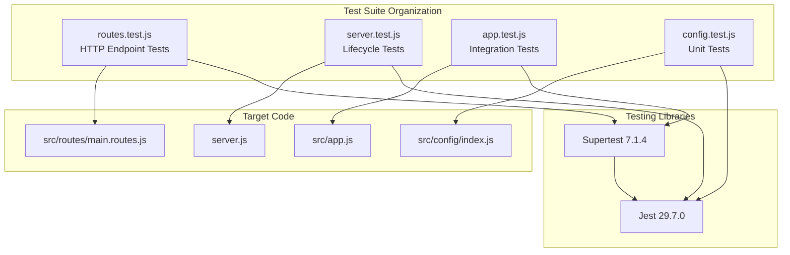
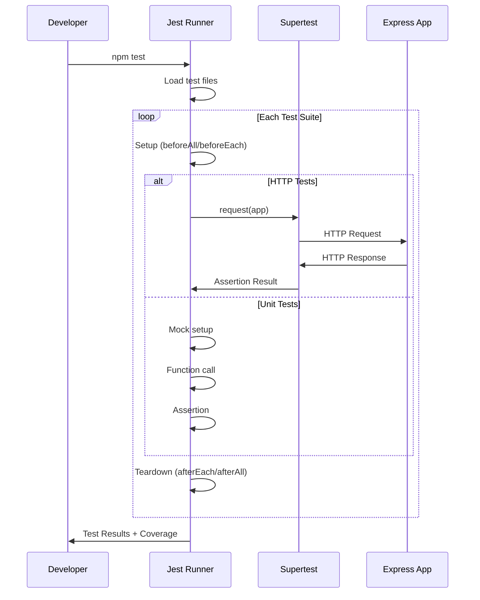
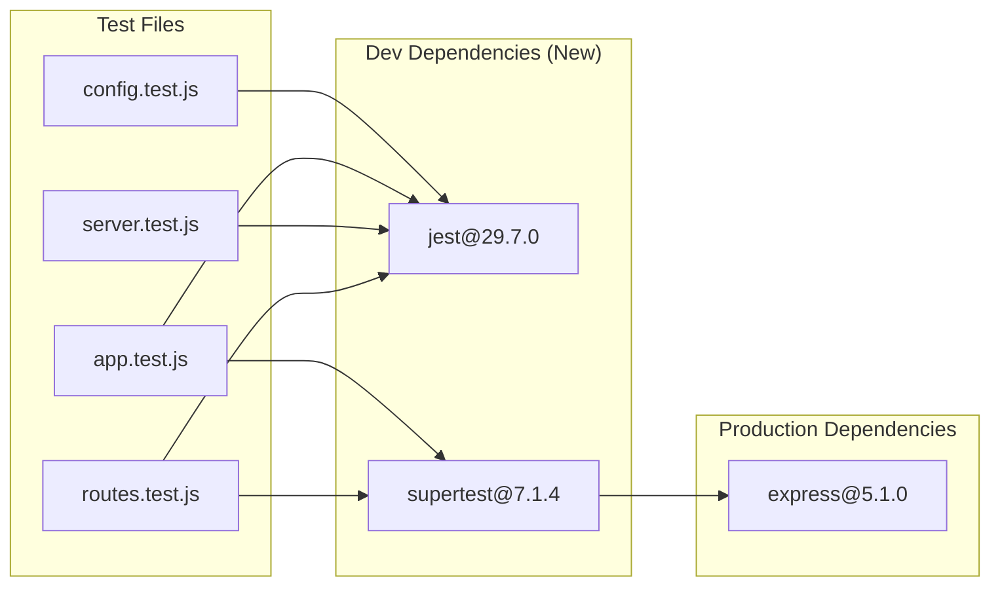
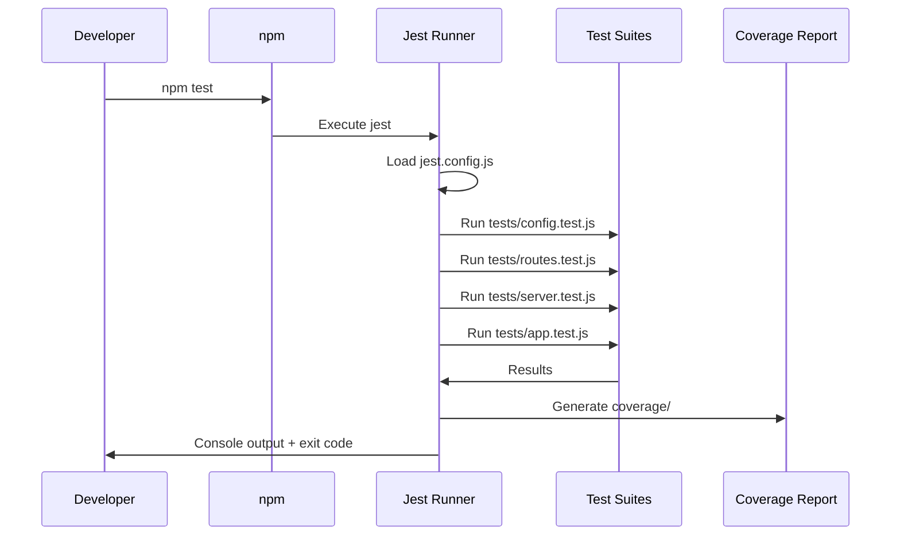

# Technical Specification

# 0. Agent Action Plan

## 0.1 Intent Clarification

### 0.1.1 Core Testing Objective

Based on the provided requirements, the Blitzy platform understands that the testing objective is to **create a comprehensive unit test suite for `server.js`** using Jest or Mocha as the testing framework. The request falls into the category: **Add new tests**.

The testing requirements include:
- Test HTTP responses and response bodies for all endpoints
- Validate status codes (200 OK, 404 Not Found, etc.)
- Verify response headers (Content-Type, Content-Length)
- Test server startup and shutdown behaviors
- Validate error handling scenarios
- Cover edge cases and boundary conditions

**Implicit Testing Needs Identified:**
- Test configuration module (`src/config/index.js`) for environment variable handling
- Test route handlers in isolation (`src/routes/main.routes.js`)
- Test Express application factory (`src/app.js`) for proper route mounting
- Verify response string exactness (including trailing newlines)
- Test default values and environment variable overrides

### 0.1.2 Special Instructions and Constraints

**Test Patterns to Follow:**
- Use the factory pattern in `src/app.js` to import Express app without server binding
- Follow CommonJS module format consistent with existing codebase
- Match repository conventions for file organization and naming

**Examples from Technical Specification (Section 6.6):**
- Response validation must be byte-exact: GET `/` returns `'Hello, World!\n'` (14 bytes, trailing newline)
- GET `/evening` returns `'Good evening'` (12 bytes, no trailing newline)

**Web Search Research Completed:**
- <cite index="6-1">Jest latest version is 30.2.0</cite>
- <cite index="4-1,4-2">Jest 30 drops support for Node 14, 16, 19, and 21, with minimum supported Node 18.x</cite>
- <cite index="11-1,11-2">Supertest latest version is 7.1.4</cite>, compatible with Express and works with any test framework

### 0.1.3 Technical Interpretation

These testing requirements translate to the following technical test implementation strategy:

| Requirement | Technical Implementation |
|-------------|-------------------------|
| Test HTTP responses | Use Supertest to simulate HTTP requests against Express app |
| Test status codes | Assert response.status === 200 for valid endpoints |
| Test headers | Validate Content-Type header matches `text/html; charset=utf-8` |
| Test server startup | Verify `app.listen()` callback executes with correct host/port |
| Test server shutdown | Verify server closes gracefully without errors |
| Test error handling | Simulate 404 responses for invalid routes |
| Test edge cases | Validate exact response strings including whitespace |

**Implementation Approach:**
- To test HTTP responses, we will create `tests/routes.test.js` with Supertest assertions
- To test server startup/shutdown, we will create `tests/server.test.js` with lifecycle mocking
- To test configuration, we will create `tests/config.test.js` with environment variable manipulation
- To test the Express app factory, we will create `tests/app.test.js` for integration validation

### 0.1.4 Coverage Requirements Interpretation

**Explicit Coverage Targets:**
- Not specified by user; using industry standards

**Implicit Coverage Expectations (based on existing repository patterns and Section 6.6):**
- Line Coverage: >80%
- Branch Coverage: >80%
- Function Coverage: 100%
- Statement Coverage: >80%

**Critical Paths to Cover:**
- All exported functions from `src/config/index.js`
- All route handlers in `src/routes/main.routes.js`
- Express application configuration in `src/app.js`
- Server binding logic in `server.js`

To achieve comprehensive testing, coverage should include:
- Happy path scenarios for both endpoints (GET `/` and GET `/evening`)
- Edge cases: invalid routes, malformed requests
- Error scenarios: server binding failures, port conflicts
- Configuration variations: default values, environment overrides

## 0.2 Test Discovery and Analysis

### 0.2.1 Existing Test Infrastructure Assessment

Repository analysis was conducted using extensive search patterns to discover existing test infrastructure:

**Search Results:**
```
find . -name "*test*" -o -name "*spec*" 2>/dev/null | grep -v node_modules
# Result: No files found
```

**Repository Analysis Findings:**
- **Existing Test Files:** None discovered
- **Testing Framework:** Not installed (package.json shows `"test": "echo \"Error: no test specified\" && exit 1"`)
- **Test Configuration Files:** None present (no jest.config.js, pytest.ini, .mocharc.*, etc.)
- **Coverage Tools:** Not configured
- **Mock Libraries:** Not installed
- **Test Fixtures/Factories:** Not present

**Current Test Infrastructure Status:**

| Component | Status | Notes |
|-----------|--------|-------|
| Testing Framework | Not Installed | Jest or Mocha to be added |
| Test Runner Configuration | Missing | jest.config.js to be created |
| Coverage Tools | Not Present | @jest/coverage or nyc to be added |
| Mock/Stub Libraries | Not Present | Jest built-in mocking sufficient |
| Test Data Fixtures | Not Present | To be created under tests/fixtures/ |
| HTTP Testing Library | Not Present | Supertest to be added |

### 0.2.2 Source Code Analysis for Testability

**Entry Point: `server.js`**

The server follows a clean separation pattern ideal for unit testing:

```javascript
// server.js - testable architecture
const { app, config } = require('./src');
app.listen(config.port, config.host, () => { /* ... */ });
```

**Application Factory: `src/app.js`**

The Express app is exported without server binding, enabling Supertest integration:

```javascript
// src/app.js - exports app for testing
const app = express();
module.exports = app;
```

**Barrel Exports: `src/index.js`**

Centralizes exports for clean import paths:

```javascript
module.exports = { app, config };
```

### 0.2.3 Web Search Research Conducted

**Research Topics and Findings:**

| Topic | Research Finding |
|-------|-----------------|
| Jest Node.js 20 compatibility | Jest 29.x supports Node 14.15, 16.10, 18.0+; Jest 30.x requires Node 18.x minimum |
| Supertest Express 5 compatibility | Supertest 7.1.4 fully compatible with Express 5.x |
| Best practices for Express testing | Factory pattern recommended; Supertest for HTTP assertions |
| Recommended mocking strategies | Jest built-in mocking sufficient for Node.js server testing |
| Test organization conventions | `tests/` or `__tests__/` directory; `.test.js` suffix |

**Framework Selection Rationale:**

Based on the user's request ("Jest or Mocha") and research findings:
- **Jest 29.7.0** selected as primary framework (stable, well-documented, excellent Node.js 20 support)
- Jest provides built-in mocking, assertion library, and coverage reporting
- Supertest 7.1.4 for HTTP endpoint testing without spinning up actual server

### 0.2.4 Testable Component Inventory

| Component | Path | Test Approach | Priority |
|-----------|------|---------------|----------|
| Server Lifecycle | `server.js` | Mock `app.listen`, test callback | High |
| Express Application | `src/app.js` | Supertest integration | High |
| Route Handlers | `src/routes/main.routes.js` | Supertest with assertions | High |
| Configuration Module | `src/config/index.js` | Unit tests with env mocking | Medium |
| Route Aggregation | `src/routes/index.js` | Integration via app tests | Low |
| Barrel Exports | `src/index.js` | Covered implicitly | Low |

## 0.3 Testing Scope Analysis

### 0.3.1 Test Target Identification

**Primary Code to Be Tested:**

| Module/Class | Path | Test Categories Needed |
|--------------|------|----------------------|
| Server | `server.js` | Startup, shutdown, binding, error handling |
| Express App | `src/app.js` | Middleware chain, route mounting, configuration |
| Main Routes | `src/routes/main.routes.js` | HTTP responses, status codes, headers |
| Route Index | `src/routes/index.js` | Route aggregation exports |
| Configuration | `src/config/index.js` | Environment parsing, defaults, validation |

**Existing Test File Mapping:**

| Source File | Existing Test File | Test Categories Present |
|-------------|-------------------|------------------------|
| `server.js` | None | N/A - to be created |
| `src/app.js` | None | N/A - to be created |
| `src/routes/main.routes.js` | None | N/A - to be created |
| `src/config/index.js` | None | N/A - to be created |

### 0.3.2 Dependencies Requiring Mocking

**External Services to Mock:**
- None identified (application has no external service dependencies)

**Database Interactions to Stub:**
- None required (application is stateless)

**File System Operations to Virtualize:**
- None required (no file I/O operations)

**Environment Variables to Control:**
- `PORT` - Server port configuration
- `HOST` - Server host binding
- `NODE_ENV` - Environment mode

**Module Dependencies to Mock:**

| Module | Mock Strategy | Rationale |
|--------|--------------|-----------|
| `app.listen()` | Jest mock function | Test callback without binding port |
| `console.log()` | Jest spy | Verify startup messages |
| `process.env` | Direct assignment | Control config values in tests |

### 0.3.3 Version Compatibility Research

Based on current Node.js version v20.19.6, recommended testing stack:

| Tool | Version | Compatibility Rationale |
|------|---------|------------------------|
| jest | 29.7.0 | Stable LTS; supports Node 18.0+ per official docs |
| supertest | 7.1.4 | Latest stable; framework-agnostic HTTP testing |
| @types/jest | 29.5.14 | TypeScript definitions (optional, for IDE support) |

**Version Conflict Analysis:**
- No conflicts detected
- Jest 29.7.0 and Supertest 7.1.4 use compatible Node.js APIs
- Express 5.1.0 fully compatible with Supertest request simulation

**Alternative Stack (if Mocha preferred):**

| Tool | Version | Purpose |
|------|---------|---------|
| mocha | 11.1.0 | Test framework |
| chai | 5.2.0 | Assertion library |
| supertest | 7.1.4 | HTTP testing |
| nyc | 17.1.0 | Coverage reporting |

**Recommendation:** Jest 29.7.0 is preferred due to:
- All-in-one solution (runner, assertions, mocking, coverage)
- Zero-config setup for Node.js projects
- Excellent async/await support
- Built-in watch mode for development

### 0.3.4 Endpoint Test Matrix

| Endpoint | Method | Expected Status | Expected Body | Expected Headers |
|----------|--------|-----------------|---------------|------------------|
| `/` | GET | 200 | `'Hello, World!\n'` | Content-Type: text/html; charset=utf-8 |
| `/evening` | GET | 200 | `'Good evening'` | Content-Type: text/html; charset=utf-8 |
| `/nonexistent` | GET | 404 | Error message | Content-Type: text/html; charset=utf-8 |
| `/` | POST | 404 | Error message | Content-Type: text/html; charset=utf-8 |

## 0.4 Test Implementation Design

### 0.4.1 Test Strategy Selection

**Test Types to Implement:**

| Test Type | Focus Area | Priority |
|-----------|------------|----------|
| Unit Tests | Isolated component behavior (config, server lifecycle) | High |
| Integration Tests | Express app with Supertest (routes, middleware chain) | High |
| Edge Case Tests | Boundary conditions (empty routes, malformed requests) | Medium |
| Error Handling Tests | 404 responses, server binding failures | High |

### 0.4.2 Test Case Blueprint

**Component: `server.js` (Server Lifecycle)**
```
Test Categories:
- Happy path: Server starts successfully on configured port/host
- Happy path: Startup callback executes with correct log message
- Error cases: Server handles port binding errors gracefully
- Edge cases: Server uses default config when env vars not set
```

**Component: `src/app.js` (Express Application)**
```
Test Categories:
- Happy path: App exports valid Express instance
- Happy path: Routes are properly mounted
- Integration: Middleware chain processes requests correctly
- Edge cases: App handles requests without body parser issues
```

**Component: `src/routes/main.routes.js` (Route Handlers)**
```
Test Categories:
- Happy path: GET / returns "Hello, World!\n" with 200 status
- Happy path: GET /evening returns "Good evening" with 200 status
- Edge cases: Exact string matching including whitespace/newlines
- Headers: Content-Type header is set correctly
- Headers: Content-Length matches response body length
```

**Component: `src/config/index.js` (Configuration)**
```
Test Categories:
- Happy path: Config exports port, host, and env values
- Defaults: Uses 3000 when PORT not set
- Defaults: Uses 'localhost' when HOST not set
- Defaults: Uses 'development' when NODE_ENV not set
- Override: Respects environment variable values
```

### 0.4.3 Existing Test Extension Strategy

Not applicable - no existing tests to extend.

### 0.4.4 Test Data and Fixtures Design

**Required Test Data Structures:**
- Environment variable fixtures for config testing
- Expected response objects for route assertions

**Fixture Organization Strategy:**

```
tests/
├── fixtures/
│   └── env.fixtures.js      # Environment variable test data
├── helpers/
│   └── test-utils.js        # Shared test utilities
```

**Mock Object Specifications:**

| Mock Target | Mock Type | Purpose |
|-------------|-----------|---------|
| `app.listen` | Jest mock function | Capture callback, prevent actual port binding |
| `console.log` | Jest spy | Verify startup message format |
| `process.env` | Direct assignment | Control configuration values |

**Test Database/State Management Approach:**
- No database required (stateless application)
- Each test resets environment variables in `beforeEach`
- Modules requiring fresh state use `jest.resetModules()`

### 0.4.5 Test Architecture Diagram


```mermaid
graph TB
    subgraph Test_Suite["Test Suite Organization"]
        Routes["routes.test.js<br/>HTTP Endpoint Tests"]
        Server["server.test.js<br/>Lifecycle Tests"]
        App["app.test.js<br/>Integration Tests"]
        Config["config.test.js<br/>Unit Tests"]
    end
    
    subgraph Target_Code["Target Code"]
        ServerJS["server.js"]
        AppJS["src/app.js"]
        MainRoutes["src/routes/main.routes.js"]
        ConfigJS["src/config/index.js"]
    end
    
    subgraph Libraries["Testing Libraries"]
        Jest["Jest 29.7.0"]
        Supertest["Supertest 7.1.4"]
    end
    
    Routes --> MainRoutes
    Server --> ServerJS
    App --> AppJS
    Config --> ConfigJS
    
    Routes --> Supertest
    App --> Supertest
    Server --> Jest
    Config --> Jest
    
    Supertest --> Jest
```

### 0.4.6 Test Execution Flow


```mermaid
sequenceDiagram
    participant Dev as Developer
    participant Jest as Jest Runner
    participant ST as Supertest
    participant App as Express App
    
    Dev->>Jest: npm test
    Jest->>Jest: Load test files
    
    loop Each Test Suite
        Jest->>Jest: Setup (beforeAll/beforeEach)
        
        alt HTTP Tests
            Jest->>ST: request(app)
            ST->>App: HTTP Request
            App->>ST: HTTP Response
            ST->>Jest: Assertion Result
        else Unit Tests
            Jest->>Jest: Mock setup
            Jest->>Jest: Function call
            Jest->>Jest: Assertion
        end
        
        Jest->>Jest: Teardown (afterEach/afterAll)
    end
    
    Jest->>Dev: Test Results + Coverage
```

## 0.5 Test File Transformation Mapping

### 0.5.1 File-by-File Test Plan

**CRITICAL:** Complete mapping of ALL test files to be created:

| Target Test File | Transformation | Source File/Reference | Purpose/Changes |
|------------------|----------------|----------------------|-----------------|
| `tests/routes.test.js` | CREATE | `src/routes/main.routes.js` | HTTP endpoint tests for GET /, GET /evening with status codes, headers, response body validation |
| `tests/server.test.js` | CREATE | `server.js` | Server startup/shutdown lifecycle tests with mocked listen callback |
| `tests/app.test.js` | CREATE | `src/app.js` | Express app integration tests validating route mounting and middleware |
| `tests/config.test.js` | CREATE | `src/config/index.js` | Configuration unit tests for defaults and environment variable handling |
| `tests/fixtures/env.fixtures.js` | CREATE | N/A | Environment variable test data for config tests |
| `tests/helpers/test-utils.js` | CREATE | N/A | Shared utilities for resetting modules and environment |
| `jest.config.js` | CREATE | N/A | Jest configuration file with test paths and coverage settings |
| `package.json` | UPDATE | `package.json` | Add test script, jest config, and dev dependencies |

### 0.5.2 New Test Files Detail

**`tests/routes.test.js` - HTTP Endpoint Unit Tests**
```
Test categories:
- Happy path: GET / returns correct response
- Happy path: GET /evening returns correct response
- Status codes: 200 for valid routes, 404 for invalid
- Headers: Content-Type validation
- Edge cases: Exact string matching with newlines

Mock dependencies:
- None (uses Supertest against app)

Assertions focus:
- response.status === 200
- response.text === 'Hello, World!\n'
- response.headers['content-type'] matches /text\/html/
```

**`tests/server.test.js` - Server Lifecycle Tests**
```
Test categories:
- Startup: app.listen called with correct arguments
- Callback: Startup message logged correctly
- Shutdown: Server closes without errors
- Error handling: Port binding failure scenarios

Mock dependencies:
- app.listen (jest.fn())
- console.log (jest.spyOn())

Assertions focus:
- listen called with config.port, config.host
- console.log receives formatted startup message
```

**`tests/app.test.js` - Express Application Integration Tests**
```
Test categories:
- Export: app is valid Express instance
- Routes: All routes mounted correctly
- Middleware: Request/response chain works

Mock dependencies:
- None (integration tests)

Assertions focus:
- typeof app === 'function'
- app.get, app.use defined
- Requests processed correctly
```

**`tests/config.test.js` - Configuration Unit Tests**
```
Test categories:
- Defaults: port=3000, host='localhost', env='development'
- Overrides: Respects PORT, HOST, NODE_ENV env vars
- Types: Values are correct types (port is number)

Mock dependencies:
- process.env (direct manipulation)

Assertions focus:
- config.port === 3000 (default)
- config.host === 'localhost' (default)
- config.env === process.env.NODE_ENV
```

**`tests/fixtures/env.fixtures.js` - Test Data**
```
Fixture types:
- DEFAULT_ENV: Object with no env vars set
- CUSTOM_ENV: Object with custom PORT, HOST, NODE_ENV
- PRODUCTION_ENV: Production environment simulation
```

**`tests/helpers/test-utils.js` - Test Utilities**
```
Helper functions:
- resetEnvironment(): Clears relevant env vars
- resetModules(): Calls jest.resetModules() for fresh imports
- mockConsole(): Sets up console spies
```

### 0.5.3 Test Configuration Updates

**`jest.config.js` - New Configuration File**
```javascript
module.exports = {
  testEnvironment: 'node',
  testMatch: ['**/tests/**/*.test.js'],
  collectCoverage: true,
  coverageDirectory: 'coverage',
  coverageReporters: ['text', 'lcov'],
  coverageThreshold: {
    global: {
      branches: 80,
      functions: 100,
      lines: 80,
      statements: 80
    }
  }
};
```

**`package.json` - Updates Required**
```json
{
  "scripts": {
    "test": "jest",
    "test:watch": "jest --watch",
    "test:coverage": "jest --coverage"
  }
}
```

### 0.5.4 Cross-File Test Dependencies

**Shared Fixtures:**

| Location | Usage |
|----------|-------|
| `tests/fixtures/env.fixtures.js` | Used by `config.test.js`, `server.test.js` |

**Shared Utilities:**

| Location | Usage |
|----------|-------|
| `tests/helpers/test-utils.js` | Used by all test files for environment reset |

**Import Dependencies:**

| Test File | Required Imports |
|-----------|-----------------|
| `routes.test.js` | `supertest`, `src/app` |
| `server.test.js` | `jest` (global), `src/index` |
| `app.test.js` | `supertest`, `src/app` |
| `config.test.js` | `tests/helpers/test-utils`, `src/config` |

### 0.5.5 Complete Test File Tree

```
project-root/
├── tests/
│   ├── routes.test.js          # HTTP endpoint tests
│   ├── server.test.js          # Server lifecycle tests
│   ├── app.test.js             # Express app integration
│   ├── config.test.js          # Configuration unit tests
│   ├── fixtures/
│   │   └── env.fixtures.js     # Environment test data
│   └── helpers/
│       └── test-utils.js       # Shared test utilities
├── jest.config.js              # Jest configuration
└── package.json                # Updated with test scripts
```

## 0.6 Dependency Inventory

### 0.6.1 Testing Dependencies

All testing packages required for this exercise:

| Registry | Package Name | Version | Purpose |
|----------|--------------|---------|---------|
| npm | jest | 29.7.0 | JavaScript testing framework with built-in assertions and mocking |
| npm | supertest | 7.1.4 | HTTP assertions library for testing Express endpoints |

**Optional Development Dependencies:**

| Registry | Package Name | Version | Purpose |
|----------|--------------|---------|---------|
| npm | @types/jest | 29.5.14 | TypeScript definitions for IDE autocompletion (optional) |
| npm | @types/supertest | 6.0.2 | TypeScript definitions for Supertest (optional) |

### 0.6.2 Dependency Installation Commands

**Primary Installation:**
```bash
npm install --save-dev jest@29.7.0 supertest@7.1.4
```

**Optional TypeScript Support:**
```bash
npm install --save-dev @types/jest@29.5.14 @types/supertest@6.0.2
```

### 0.6.3 Existing Project Dependencies (Reference)

Current dependencies from `package.json`:

| Registry | Package Name | Version | Status |
|----------|--------------|---------|--------|
| npm | express | ^5.1.0 | Installed (5.1.0) |

### 0.6.4 Version Compatibility Matrix

| Package | Min Node Version | Max Node Version | Express 5 Compatible |
|---------|-----------------|------------------|---------------------|
| jest@29.7.0 | 14.15 | 22.x (current latest) | Yes |
| supertest@7.1.4 | 14.x | 22.x | Yes |
| express@5.1.0 | 18.x | 22.x | N/A (target) |

**Verification:** All packages compatible with Node.js v20.19.6 ✓

### 0.6.5 Import Updates Required

**No Import Updates Required for Existing Source Files**

Test files will use new imports:

| Test File | Required Imports |
|-----------|-----------------|
| `tests/routes.test.js` | `const request = require('supertest');`<br/>`const app = require('../src/app');` |
| `tests/server.test.js` | `// Jest globals available (describe, test, expect)` |
| `tests/app.test.js` | `const request = require('supertest');`<br/>`const app = require('../src/app');` |
| `tests/config.test.js` | `// Dynamic import after env reset` |

### 0.6.6 Complete package.json Modifications

```json
{
  "name": "hello-world-server",
  "version": "1.0.0",
  "main": "server.js",
  "scripts": {
    "start": "node server.js",
    "test": "jest",
    "test:watch": "jest --watch",
    "test:coverage": "jest --coverage"
  },
  "dependencies": {
    "express": "^5.1.0"
  },
  "devDependencies": {
    "jest": "29.7.0",
    "supertest": "7.1.4"
  }
}
```

### 0.6.7 Dependency Graph


```mermaid
graph LR
    subgraph Production["Production Dependencies"]
        Express["express@5.1.0"]
    end
    
    subgraph Development["Dev Dependencies (New)"]
        Jest["jest@29.7.0"]
        Supertest["supertest@7.1.4"]
    end
    
    subgraph Tests["Test Files"]
        RoutesTest["routes.test.js"]
        ServerTest["server.test.js"]
        AppTest["app.test.js"]
        ConfigTest["config.test.js"]
    end
    
    RoutesTest --> Jest
    RoutesTest --> Supertest
    ServerTest --> Jest
    AppTest --> Jest
    AppTest --> Supertest
    ConfigTest --> Jest
    
    Supertest --> Express
```

## 0.7 Coverage and Quality Targets

### 0.7.1 Coverage Metrics

**Current Coverage:**
- 0% (no existing tests)

**Target Coverage:**
- Based on industry best practices for Node.js/Express applications

| Metric | Target | Rationale |
|--------|--------|-----------|
| Line Coverage | >80% | Industry standard for production applications |
| Branch Coverage | >80% | Ensures conditional logic tested |
| Function Coverage | 100% | All exported functions must be tested |
| Statement Coverage | >80% | Comprehensive code execution |

**Coverage Gaps to Address:**

| Component | Current | Target | Focus Areas |
|-----------|---------|--------|-------------|
| `server.js` | 0% | >80% | Startup callback, binding logic |
| `src/app.js` | 0% | >80% | Route mounting, middleware chain |
| `src/routes/main.routes.js` | 0% | 100% | Both route handlers |
| `src/config/index.js` | 0% | 100% | All config properties |
| `src/routes/index.js` | 0% | 80% | Export verification |
| `src/index.js` | 0% | 80% | Barrel export validation |

### 0.7.2 Per-File Coverage Targets

| File | Line | Branch | Function | Statement |
|------|------|--------|----------|-----------|
| `server.js` | 80% | 80% | 100% | 80% |
| `src/app.js` | 90% | N/A | 100% | 90% |
| `src/routes/main.routes.js` | 100% | N/A | 100% | 100% |
| `src/config/index.js` | 100% | 100% | 100% | 100% |
| `src/routes/index.js` | 100% | N/A | N/A | 100% |
| `src/index.js` | 100% | N/A | N/A | 100% |

### 0.7.3 Test Quality Criteria

**Assertion Density Expectations:**
- Minimum 2 assertions per test case
- At least 1 positive assertion (expected behavior)
- At least 1 verification of side effects (logs, callbacks)

**Test Isolation Requirements:**
- Each test must be independent and not rely on test order
- Environment variables reset between tests using `beforeEach`
- Module cache cleared for tests requiring fresh imports

**Performance Constraints:**
- Individual test timeout: 5 seconds (default)
- Total test suite: <30 seconds
- No external network calls (all HTTP via Supertest)

**Maintainability Standards:**
- Descriptive test names following "should [behavior] when [condition]" pattern
- Group related tests using `describe` blocks
- Avoid test duplication using parameterized tests where applicable

### 0.7.4 Test Organization Standards

**Following Repository Test Conventions:**
- Test file naming: `*.test.js`
- Test directory: `tests/`
- Fixture organization: `tests/fixtures/`
- Helper utilities: `tests/helpers/`

**Test Structure Template:**
```javascript
describe('[Component Name]', () => {
  beforeEach(() => {
    // Setup code
  });
  
  afterEach(() => {
    // Cleanup code
  });
  
  describe('[Method/Feature]', () => {
    test('should [expected behavior] when [condition]', () => {
      // Arrange
      // Act
      // Assert
    });
  });
});
```

### 0.7.5 Quality Validation Checklist

| Quality Metric | Validation Method |
|----------------|------------------|
| Code coverage thresholds | Jest coverage report with `--coverageThreshold` |
| Test isolation | Each test passes when run individually |
| No hardcoded values | Environment fixtures used for configuration |
| Meaningful assertions | Review for specific, non-trivial checks |
| Error handling coverage | Tests for failure scenarios included |
| Edge case coverage | Boundary conditions explicitly tested |
| Documentation | Test descriptions explain purpose |

## 0.8 Scope Boundaries

### 0.8.1 Exhaustively In Scope

**New Test Files:**
- `tests/routes.test.js` - HTTP endpoint tests for all routes
- `tests/server.test.js` - Server startup/shutdown lifecycle tests
- `tests/app.test.js` - Express application integration tests
- `tests/config.test.js` - Configuration module unit tests
- `tests/fixtures/env.fixtures.js` - Environment variable test data
- `tests/helpers/test-utils.js` - Shared test utilities

**Test Configuration Files:**
- `jest.config.js` - Jest runner configuration

**Package Updates:**
- `package.json` - Add test scripts and devDependencies

### 0.8.2 In-Scope Test Categories

| Category | Files/Patterns | Description |
|----------|---------------|-------------|
| Unit Tests | `tests/config.test.js` | Isolated component testing |
| Integration Tests | `tests/app.test.js`, `tests/routes.test.js` | HTTP endpoint testing |
| Lifecycle Tests | `tests/server.test.js` | Server startup/shutdown |
| Fixtures | `tests/fixtures/**/*.js` | Test data definitions |
| Utilities | `tests/helpers/**/*.js` | Shared test functions |

### 0.8.3 Complete File Scope Matrix

| Pattern | Type | Purpose |
|---------|------|---------|
| `tests/*.test.js` | Test | All test suite files |
| `tests/fixtures/*.js` | Fixture | Test data and mocks |
| `tests/helpers/*.js` | Helper | Shared test utilities |
| `jest.config.js` | Config | Test runner configuration |
| `package.json` | Config | Scripts and dependencies update |

### 0.8.4 Explicitly Out of Scope

**Source Code Modifications:**
- `server.js` - No modifications required (testable as-is)
- `src/app.js` - No modifications required (testable as-is)
- `src/routes/main.routes.js` - No modifications required
- `src/routes/index.js` - No modifications required
- `src/config/index.js` - No modifications required
- `src/index.js` - No modifications required

**Excluded Activities:**
- Refactoring source code beyond what's needed for testing
- Adding new features while adding tests
- Performance optimizations not related to test coverage
- End-to-end or browser-based testing
- Load testing or stress testing
- Database integration (application is stateless)
- External service mocking (no external dependencies)
- CI/CD pipeline configuration
- Documentation updates beyond test-related README sections

### 0.8.5 Scope Boundary Diagram


```mermaid
graph TB
    subgraph InScope["✓ IN SCOPE"]
        direction TB
        Tests["Test Files<br/>tests/*.test.js"]
        Fixtures["Test Fixtures<br/>tests/fixtures/*.js"]
        Helpers["Test Helpers<br/>tests/helpers/*.js"]
        JestConfig["jest.config.js"]
        PackageUpdate["package.json (update)"]
    end
    
    subgraph OutScope["✗ OUT OF SCOPE"]
        direction TB
        ServerJS["server.js<br/>(no changes)"]
        SrcApp["src/app.js<br/>(no changes)"]
        SrcRoutes["src/routes/*.js<br/>(no changes)"]
        SrcConfig["src/config/*.js<br/>(no changes)"]
        CICD["CI/CD Pipeline"]
        E2E["E2E Testing"]
    end
    
    style InScope fill:#d4edda,stroke:#28a745
    style OutScope fill:#f8d7da,stroke:#dc3545
```

### 0.8.6 Scope Rationale

**Why Source Files Are Out of Scope:**
- The existing architecture (Factory pattern) already supports unit testing
- `src/app.js` exports app without server binding - ideal for Supertest
- `src/config/index.js` uses simple property access - directly testable
- No modifications needed to achieve comprehensive test coverage

**Why Only Unit/Integration Tests:**
- User explicitly requested "unit tests for server.js"
- E2E tests would require browser automation (out of stated scope)
- Load testing requires different tooling (not mentioned in requirements)

### 0.8.7 Scope Verification Checklist

Before implementation completion, verify:

| Checkpoint | Status |
|------------|--------|
| All test files listed in Section 0.5 created | ☐ |
| No source files modified | ☐ |
| package.json updated with test script | ☐ |
| jest.config.js created with settings | ☐ |
| Coverage thresholds configured | ☐ |
| All routes have test coverage | ☐ |
| Server lifecycle tested | ☐ |
| Configuration tested | ☐ |

## 0.9 Execution Parameters

### 0.9.1 Testing-Specific Commands

**Primary Test Execution:**
```bash
npm test
```

**Coverage Measurement:**
```bash
npm run test:coverage
# or directly:
jest --coverage
```

**Watch Mode (Development):**
```bash
npm run test:watch
# or directly:
jest --watch
```

**Single Test File Execution:**
```bash
jest tests/routes.test.js
jest tests/server.test.js
jest tests/config.test.js
jest tests/app.test.js
```

**Single Test by Name Pattern:**
```bash
jest -t "should return Hello World"
jest --testNamePattern="GET /"
```

**Debug Mode Execution:**
```bash
node --inspect-brk node_modules/.bin/jest --runInBand
```

**Verbose Output:**
```bash
jest --verbose
```

### 0.9.2 Environment Setup Requirements

**Required Environment:**
- Node.js v20.19.6 (installed)
- npm v11.1.0 (installed)
- Jest 29.7.0 (to be installed)
- Supertest 7.1.4 (to be installed)

**Environment Variables for Tests:**

| Variable | Test Default | Production | Purpose |
|----------|-------------|------------|---------|
| `PORT` | 3000 | 3000 | Server port |
| `HOST` | localhost | localhost | Server host binding |
| `NODE_ENV` | test | production | Environment mode |

**Pre-Test Setup:**
```bash
# Install dependencies (one-time)
npm install --save-dev jest@29.7.0 supertest@7.1.4

#### Verify installation
npm ls jest supertest
```

### 0.9.3 Jest Configuration Parameters

**`jest.config.js` Full Specification:**
```javascript
module.exports = {
  // Test environment
  testEnvironment: 'node',
  
  // Test file patterns
  testMatch: ['**/tests/**/*.test.js'],
  testPathIgnorePatterns: ['/node_modules/'],
  
  // Coverage settings
  collectCoverage: true,
  collectCoverageFrom: [
    'server.js',
    'src/**/*.js',
    '!src/index.js'
  ],
  coverageDirectory: 'coverage',
  coverageReporters: ['text', 'lcov', 'html'],
  
  // Coverage thresholds
  coverageThreshold: {
    global: {
      branches: 80,
      functions: 100,
      lines: 80,
      statements: 80
    }
  },
  
  // Module handling
  moduleFileExtensions: ['js', 'json', 'node'],
  
  // Test timeout
  testTimeout: 5000,
  
  // Clear mocks between tests
  clearMocks: true,
  
  // Verbose output
  verbose: true
};
```

### 0.9.4 Test Script Definitions

**package.json Scripts Block:**
```json
{
  "scripts": {
    "start": "node server.js",
    "test": "jest",
    "test:watch": "jest --watch",
    "test:coverage": "jest --coverage",
    "test:ci": "jest --ci --coverage --reporters=default --reporters=jest-junit"
  }
}
```

### 0.9.5 CI-Safe Execution Commands

For continuous integration environments:

```bash
# Non-interactive test execution
CI=true npm test

#### With coverage and CI reporter
CI=true npm run test:ci

#### With timeout wrapper (5 minute limit)
timeout 300 npm test
```

### 0.9.6 Test Execution Flow


```mermaid
sequenceDiagram
    participant Dev as Developer
    participant NPM as npm
    participant Jest as Jest Runner
    participant Tests as Test Suites
    participant Coverage as Coverage Report
    
    Dev->>NPM: npm test
    NPM->>Jest: Execute jest
    Jest->>Jest: Load jest.config.js
    Jest->>Tests: Run tests/config.test.js
    Jest->>Tests: Run tests/routes.test.js
    Jest->>Tests: Run tests/server.test.js
    Jest->>Tests: Run tests/app.test.js
    Tests->>Jest: Results
    Jest->>Coverage: Generate coverage/
    Jest->>Dev: Console output + exit code
```

### 0.9.7 Expected Test Output

**Successful Run:**
```
PASS  tests/config.test.js
PASS  tests/routes.test.js
PASS  tests/server.test.js
PASS  tests/app.test.js

Test Suites: 4 passed, 4 total
Tests:       XX passed, XX total
Snapshots:   0 total
Time:        X.XXXs

---------|----------|----------|----------|----------|
File     | % Stmts  | % Branch | % Funcs  | % Lines  |
---------|----------|----------|----------|----------|
All files|    XX.XX |    XX.XX |   100.00 |    XX.XX |
---------|----------|----------|----------|----------|
```

## 0.10 Special Instructions for Testing

### 0.10.1 Testing-Specific Requirements

The following special requirements apply to this testing implementation:

**Minimal Change Principle:**
- ONLY modify test files and test-related configurations
- DO NOT modify source code unless absolutely necessary for testability
- Source code architecture already supports testing without modification

**Pattern Adherence:**
- Follow CommonJS module format consistent with existing codebase
- Match repository file naming conventions (`*.test.js`)
- Use Jest's built-in features over external assertion libraries

**Test Isolation Requirements:**
- Ensure all tests can run independently and in parallel
- Reset environment variables between tests
- Clear module cache when testing configuration module

### 0.10.2 Framework-Specific Guidelines

**Jest Mocking Patterns:**
```javascript
// Mock app.listen for server tests
jest.mock('../src/app', () => ({
  listen: jest.fn((port, host, cb) => cb())
}));

// Spy on console for logging verification
const consoleSpy = jest.spyOn(console, 'log');
```

**Supertest Usage Pattern:**
```javascript
const request = require('supertest');
const app = require('../src/app');

test('GET / returns Hello World', async () => {
  const res = await request(app).get('/');
  expect(res.status).toBe(200);
  expect(res.text).toBe('Hello, World!\n');
});
```

**Environment Reset Pattern:**
```javascript
const originalEnv = process.env;

beforeEach(() => {
  jest.resetModules();
  process.env = { ...originalEnv };
});

afterEach(() => {
  process.env = originalEnv;
});
```

### 0.10.3 Code Style and Naming Conventions

**Test File Naming:**
- Pattern: `[component-name].test.js`
- Location: `tests/` directory
- Examples: `routes.test.js`, `server.test.js`, `config.test.js`

**Test Description Format:**
- Use present tense: "returns", "throws", "handles"
- Be specific about condition and expectation
- Format: "should [action] when [condition]"

**Examples:**
```javascript
// ✓ Good
test('should return 200 status for GET /', ...)
test('should return Hello World with newline', ...)
test('should use default port when PORT env not set', ...)

// ✗ Avoid
test('test1', ...)
test('it works', ...)
test('GET request', ...)
```

### 0.10.4 Assertion Guidelines

**Prefer Specific Assertions:**
```javascript
// ✓ Specific
expect(res.status).toBe(200);
expect(res.text).toBe('Hello, World!\n');
expect(config.port).toBe(3000);

// ✗ Too generic
expect(res).toBeTruthy();
expect(config).toBeDefined();
```

**String Exactness:**
- User example preserved: GET `/` must return exactly `'Hello, World!\n'` (14 bytes with trailing newline)
- GET `/evening` returns exactly `'Good evening'` (12 bytes, no trailing newline)

### 0.10.5 Test Data Management

**Environment Variable Fixtures:**
```javascript
// tests/fixtures/env.fixtures.js
module.exports = {
  DEFAULT_ENV: {},
  CUSTOM_PORT: { PORT: '8080' },
  CUSTOM_HOST: { HOST: '0.0.0.0' },
  PRODUCTION: { NODE_ENV: 'production' },
  FULL_CUSTOM: {
    PORT: '9000',
    HOST: '127.0.0.1',
    NODE_ENV: 'staging'
  }
};
```

### 0.10.6 Error Handling Test Requirements

**404 Response Testing:**
- Test non-existent routes return 404
- Verify error response format
- Test invalid HTTP methods on valid routes

**Server Error Testing:**
- Mock scenarios where `app.listen` might fail
- Verify error callbacks are invoked

### 0.10.7 Backward Compatibility

**Ensure Tests Do Not:**
- Introduce breaking changes to source files
- Add dependencies that conflict with existing packages
- Modify the runtime behavior of the application

**Maintain Compatibility With:**
- Node.js v18+ (per README requirements)
- Express 5.1.0 (current dependency)
- CommonJS module format (current codebase style)

### 0.10.8 Documentation Requirements

**README Test Section (if added):**
```
## Testing

Run tests:
```bash
npm test
```

Run with coverage:
```bash
npm run test:coverage
```

Run in watch mode:
```bash
npm run test:watch
```
```

### 0.10.9 Quality Gates

Before marking tests complete, verify:

| Gate | Requirement | Validation |
|------|-------------|------------|
| All tests pass | `npm test` exits with 0 | ☐ |
| Coverage thresholds met | >80% lines, 100% functions | ☐ |
| No source modifications | Only test/* and config files changed | ☐ |
| Tests run independently | Each test passes in isolation | ☐ |
| No console warnings | Clean test output | ☐ |
| Patterns followed | Naming and structure conventions met | ☐ |

