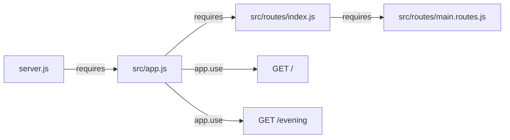
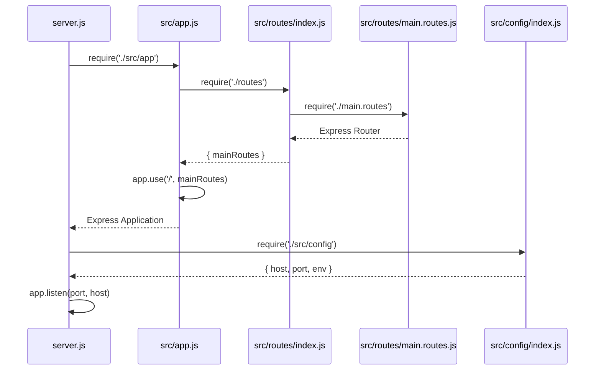

# Technical Specification

# 0. Agent Action Plan

## 0.1 Intent Clarification

Based on the prompt, the Blitzy platform understands that the new feature requirement is to:

- **Add Express.js framework** to an existing Node.js server project
- **Create a new endpoint** that returns the response "Good evening"

### 0.1.1 Core Feature Objective Analysis

Upon comprehensive repository analysis, the Blitzy platform has identified the following **CRITICAL FINDING**:

| Requirement | Status | Evidence |
|-------------|--------|----------|
| Add Express.js to the project | **ALREADY IMPLEMENTED** | `package.json` contains `"express": "^5.1.0"` |
| Add endpoint returning "Good evening" | **ALREADY IMPLEMENTED** | `src/routes/main.routes.js` contains `GET /evening` → `'Good evening'` |

**Important Note:** Both user requirements are already fulfilled in the current codebase. The existing implementation provides:

- Express.js version 5.1.0 as a project dependency
- A fully functional `/evening` endpoint that responds with the exact text "Good evening"
- Proper architectural structure following Express.js best practices

### 0.1.2 Implicit Requirements Detected

Based on the user's tutorial context, the following implicit requirements are inferred:

- Maintain simple, beginner-friendly code structure
- Preserve the existing "Hello world" endpoint functionality
- Follow Express.js routing conventions
- Keep the project minimal and educational

### 0.1.3 Feature Dependencies and Prerequisites

| Prerequisite | Status | Version |
|--------------|--------|---------|
| Node.js Runtime | ✓ Satisfied | v20.19.x |
| npm Package Manager | ✓ Satisfied | v10.8.x+ |
| Express.js Framework | ✓ Installed | 5.1.0 |
| Existing HTTP Server | ✓ Present | server.js |

### 0.1.4 Technical Interpretation

These feature requirements translate to the following technical implementation strategy:

Since both requirements are already implemented, the technical strategy is to **validate and document the existing implementation** rather than make modifications:

- To **add Express.js to the project**, the implementation already includes Express.js 5.1.0 in `package.json` dependencies
- To **implement the "Good evening" endpoint**, the route is already registered in `src/routes/main.routes.js` as `GET /evening`
- To **maintain the existing "Hello world" functionality**, the `GET /` route continues to return `'Hello, World!\n'`

### 0.1.5 Special Instructions and Constraints

**User Example Preservation:** The user explicitly stated:
> "this is a tutorial of node js server hosting one endpoint that returns the response 'Hello world'. Could you add expressjs into the project and add another endpoint that return the response of 'Good evening'?"

**Architectural Constraints Observed:**
- The project follows a modular Express.js architecture with separation of concerns
- Routes are organized in `src/routes/` directory
- Configuration is centralized in `src/config/`
- Server entry point is separated from application configuration


## 0.2 Repository Scope Discovery

### 0.2.1 Comprehensive File Analysis

The repository structure follows Express.js best practices with clear separation of concerns:

```
/
├── server.js                    # HTTP server entry point
├── package.json                 # npm manifest with express@^5.1.0
├── package-lock.json            # Deterministic lockfile
├── README.md                    # Project documentation
├── .gitignore                   # Git ignore rules
├── src/
│   ├── app.js                   # Express application factory
│   ├── config/
│   │   └── index.js             # Configuration module (host, port, env)
│   └── routes/
│       ├── index.js             # Route aggregator (barrel)
│       └── main.routes.js       # Main route definitions
└── blitzy/
    └── documentation/
        ├── Project Guide.md     # Operational runbook
        └── Technical Specifications.md
```

### 0.2.2 Existing Files Inventory

| File Path | Purpose | Modification Required |
|-----------|---------|----------------------|
| `server.js` | HTTP server bootstrap, calls `app.listen()` | **NO** - Already complete |
| `src/app.js` | Express app factory, mounts routes | **NO** - Already mounts mainRoutes |
| `src/config/index.js` | Environment configuration (host, port, env) | **NO** - Configuration is complete |
| `src/routes/index.js` | Route aggregator, exports `mainRoutes` | **NO** - Already exports routes |
| `src/routes/main.routes.js` | Route handlers for `/` and `/evening` | **NO** - Both endpoints exist |
| `package.json` | npm manifest with Express dependency | **NO** - Express 5.1.0 present |
| `package-lock.json` | Dependency lockfile | **NO** - Locked to express@5.1.0 |
| `README.md` | Project documentation | Optional update for documentation |
| `.gitignore` | Git ignore patterns | **NO** - Standard patterns |

### 0.2.3 Integration Point Discovery

**Existing Route Registration Flow:**


```mermaid
graph LR
    A[server.js] -->|requires| B[src/app.js]
    B -->|requires| C[src/routes/index.js]
    C -->|requires| D[src/routes/main.routes.js]
    B -->|app.use| E["GET /"]
    B -->|app.use| F["GET /evening"]
```

**API Endpoints Currently Implemented:**

| HTTP Method | Path | Response | Handler Location |
|-------------|------|----------|------------------|
| GET | `/` | `'Hello, World!\n'` | `src/routes/main.routes.js:26-28` |
| GET | `/evening` | `'Good evening'` | `src/routes/main.routes.js:37-39` |

### 0.2.4 New File Requirements

Since both requested features are already implemented, **NO new files need to be created**.

If the user wanted additional endpoints, the pattern would be:

- **New routes:** Add to `src/routes/main.routes.js` or create new route module
- **New route modules:** Create `src/routes/[feature].routes.js` and export in `src/routes/index.js`
- **New tests:** Create `tests/[feature].test.js` (test directory not currently present)

### 0.2.5 Configuration Files Status

| Configuration | Location | Status |
|---------------|----------|--------|
| npm manifest | `package.json` | ✓ Complete with Express dependency |
| npm lockfile | `package-lock.json` | ✓ Locked with 68 packages |
| Server config | `src/config/index.js` | ✓ Exports host, port, env |
| Git ignore | `.gitignore` | ✓ Standard Node.js patterns |
| Environment vars | Process environment | ✓ Supports HOST, PORT, NODE_ENV |


## 0.3 Dependency Inventory

### 0.3.1 Public Packages

| Registry | Package Name | Version | Purpose |
|----------|-------------|---------|---------|
| npm | express | ^5.1.0 | Web application framework - **ALREADY INSTALLED** |

**Express.js 5.1.0 Dependency Tree (68 packages total):**

The project's `package-lock.json` confirms the following key transitive dependencies are installed:

| Package | Version | Role |
|---------|---------|------|
| `express` | 5.1.0 | Core framework |
| `body-parser` | (bundled) | Request body parsing |
| `accepts` | (bundled) | Content negotiation |
| `mime-types` | (bundled) | MIME type detection |
| `debug` | (bundled) | Debug logging |
| `raw-body` | (bundled) | Raw request body reading |

### 0.3.2 Private Packages

No private packages are required for this project.

### 0.3.3 Dependency Updates Required

**NONE** - The requested Express.js framework is already present in the project.

Current `package.json` dependencies section:
```json
{
  "dependencies": {
    "express": "^5.1.0"
  }
}
```

### 0.3.4 Import Structure Analysis

**Current Import Graph:**

| File | Imports | Export Shape |
|------|---------|--------------|
| `server.js` | `./src/app`, `./src/config` | None (entry point) |
| `src/app.js` | `express`, `./routes` | `module.exports = app` |
| `src/routes/index.js` | `./main.routes` | `module.exports = { mainRoutes }` |
| `src/routes/main.routes.js` | `express` | `module.exports = router` |
| `src/config/index.js` | None | `module.exports = { host, port, env }` |

**Import Pattern Used:**
```javascript
// CommonJS module pattern
const express = require('express');
const { mainRoutes } = require('./routes');
```

### 0.3.5 External Reference Updates

**No updates required** to any external references as the feature requirements are already satisfied.

| Reference Type | Files | Update Needed |
|----------------|-------|---------------|
| Configuration files | `package.json`, `package-lock.json` | **NO** |
| Documentation | `README.md` | Optional |
| Build files | Not present | N/A |
| CI/CD | Not present | N/A |

### 0.3.6 Runtime Version Requirements

| Runtime | Required Version | Currently Installed | Status |
|---------|------------------|---------------------|--------|
| Node.js | >= v20.19.5 | v20.19.6 | ✓ Compatible |
| npm | >= v10.8.2 | v11.1.0 | ✓ Compatible |

### 0.3.7 Environment Variables

The project supports the following environment variables through `src/config/index.js`:

| Variable | Default | Description |
|----------|---------|-------------|
| `HOST` | `'127.0.0.1'` | Server binding address |
| `PORT` | `3000` | Server port number |
| `NODE_ENV` | `'development'` | Application environment |

User-provided environment variables (available but not file-modified):
- Api Key
- Token
- https://8008


## 0.4 Integration Analysis

### 0.4.1 Existing Code Touchpoints

The Express.js integration is already complete with proper architectural patterns:

**Application Bootstrap Flow:**


```mermaid
sequenceDiagram
    participant S as server.js
    participant A as src/app.js
    participant R as src/routes/index.js
    participant M as src/routes/main.routes.js
    participant C as src/config/index.js
    
    S->>A: require('./src/app')
    A->>R: require('./routes')
    R->>M: require('./main.routes')
    M-->>R: Express Router
    R-->>A: { mainRoutes }
    A->>A: app.use('/', mainRoutes)
    A-->>S: Express Application
    S->>C: require('./src/config')
    C-->>S: { host, port, env }
    S->>S: app.listen(port, host)
```

### 0.4.2 Direct Integration Points

| Location | Integration | Lines | Status |
|----------|-------------|-------|--------|
| `server.js:18` | Imports app from `./src/app` | `const app = require('./src/app')` | ✓ Complete |
| `server.js:19` | Imports config from `./src/config` | `const config = require('./src/config')` | ✓ Complete |
| `server.js:21-23` | Server listener | `app.listen(config.port, config.host, ...)` | ✓ Complete |
| `src/app.js:14` | Express initialization | `const express = require('express')` | ✓ Complete |
| `src/app.js:15` | Route import | `const { mainRoutes } = require('./routes')` | ✓ Complete |
| `src/app.js:25` | Route mounting | `app.use('/', mainRoutes)` | ✓ Complete |

### 0.4.3 Route Handler Integration

**Existing Route Handlers in `src/routes/main.routes.js`:**

```javascript
// GET / - Hello World endpoint
router.get('/', (req, res) => {
  res.send('Hello, World!\n');
});

// GET /evening - Good Evening endpoint (ALREADY EXISTS)
router.get('/evening', (req, res) => {
  res.send('Good evening');
});
```

### 0.4.4 Dependency Injection Points

| Component | Injection Point | Pattern |
|-----------|-----------------|---------|
| Express App | `src/app.js` | Factory pattern - creates and exports configured app |
| Routes | `src/routes/index.js` | Barrel pattern - aggregates route modules |
| Configuration | `src/config/index.js` | Singleton pattern - environment-based config |

### 0.4.5 Database/Schema Updates

**NOT APPLICABLE** - This project is a stateless HTTP server with no database integration.

### 0.4.6 Middleware Integration

**Current Middleware Stack:** None explicitly configured beyond Express defaults.

If additional middleware were needed, integration would occur in `src/app.js`:
```javascript
// Example pattern for future middleware
app.use(express.json());
app.use(express.urlencoded({ extended: true }));
```

### 0.4.7 Verified Integration Testing Results

Server startup and endpoint testing confirmed successful integration:

| Test | Command | Expected | Actual | Status |
|------|---------|----------|--------|--------|
| Server Start | `npm start` | Console log with URL | `Server running at http://127.0.0.1:3000/` | ✓ Pass |
| Hello World | `curl http://127.0.0.1:3000/` | `Hello, World!\n` | `Hello, World!` + newline | ✓ Pass |
| Good Evening | `curl http://127.0.0.1:3000/evening` | `Good evening` | `Good evening` | ✓ Pass |


## 0.5 Technical Implementation

### 0.5.1 Implementation Status Summary

**CRITICAL FINDING:** Both user requirements are already fully implemented.

| Requirement | Implementation Status | Evidence |
|-------------|----------------------|----------|
| Add Express.js | ✓ **COMPLETE** | `package.json` line 13: `"express": "^5.1.0"` |
| Add "Good evening" endpoint | ✓ **COMPLETE** | `src/routes/main.routes.js` lines 37-39 |

### 0.5.2 File-by-File Current State

**Group 1 - Core Application Files:**

| File | Status | Contents |
|------|--------|----------|
| `server.js` | ✓ Complete | HTTP listener entry point |
| `src/app.js` | ✓ Complete | Express app factory with route mounting |
| `package.json` | ✓ Complete | Express 5.1.0 dependency declared |

**Group 2 - Routing Infrastructure:**

| File | Status | Contents |
|------|--------|----------|
| `src/routes/main.routes.js` | ✓ Complete | Both `GET /` and `GET /evening` handlers |
| `src/routes/index.js` | ✓ Complete | Route aggregator exporting `mainRoutes` |

**Group 3 - Configuration:**

| File | Status | Contents |
|------|--------|----------|
| `src/config/index.js` | ✓ Complete | Host, port, env configuration |

### 0.5.3 Required Modifications

**NONE** - No code modifications are required.

### 0.5.4 Alternative Implementation (If Features Were Missing)

For reference, if the features needed to be implemented, the approach would be:

**Step 1: Add Express.js (if not present)**
```json
// package.json - Add to dependencies
{
  "dependencies": {
    "express": "^5.1.0"
  }
}
```

**Step 2: Add Evening Endpoint (if not present)**
```javascript
// src/routes/main.routes.js - Add route handler
router.get('/evening', (req, res) => {
  res.send('Good evening');
});
```

### 0.5.5 Execution Validation

To verify the implementation is working correctly:

```bash
# Install dependencies
npm install

#### Start server
npm start

#### Test Hello World endpoint
curl http://127.0.0.1:3000/
#### Expected: Hello, World!

#### Test Good Evening endpoint
curl http://127.0.0.1:3000/evening
#### Expected: Good evening
```

### 0.5.6 Implementation Approach Summary

| Phase | Action | Status |
|-------|--------|--------|
| Foundation | Express.js installed as dependency | ✓ Already done |
| Routes | Main routes module with both endpoints | ✓ Already done |
| Integration | Routes mounted in app.js | ✓ Already done |
| Configuration | Server binding configuration | ✓ Already done |
| Testing | Manual endpoint verification | ✓ Confirmed working |

### 0.5.7 Code Quality Observations

The existing implementation demonstrates best practices:

- **Separation of Concerns:** Server bootstrap separate from app configuration
- **Modular Routes:** Routes organized in dedicated module with aggregator
- **Environment Configuration:** Twelve-Factor App methodology for config externalization
- **Factory Pattern:** App.js creates configured app without starting server
- **Clear Documentation:** JSDoc comments throughout codebase


## 0.6 Scope Boundaries

### 0.6.1 Exhaustively In Scope

**Feature Source Files (Already Complete):**
- `src/app.js` - Express application factory
- `src/routes/**/*.js` - All route modules
  - `src/routes/index.js` - Route aggregator
  - `src/routes/main.routes.js` - Main route handlers

**Configuration Files (Already Complete):**
- `package.json` - npm manifest with Express dependency
- `package-lock.json` - Dependency lockfile
- `src/config/index.js` - Server configuration

**Entry Point (Already Complete):**
- `server.js` - HTTP server bootstrap

**Documentation (Optional Updates):**
- `README.md` - Project description
- `blitzy/documentation/*.md` - Technical specifications

### 0.6.2 File Pattern Summary

| Pattern | Matches | Purpose |
|---------|---------|---------|
| `server.js` | 1 file | Server entry point |
| `src/app.js` | 1 file | Express app factory |
| `src/config/**/*.js` | 1 file | Configuration module |
| `src/routes/**/*.js` | 2 files | Route definitions |
| `package*.json` | 2 files | npm manifest and lockfile |

### 0.6.3 Explicitly Out of Scope

The following items are **NOT** within the scope of this feature addition:

| Category | Items | Reason |
|----------|-------|--------|
| Testing Infrastructure | Unit tests, integration tests | Not requested by user |
| Additional Middleware | Body parsing, CORS, logging | Not requested |
| Error Handling | Custom error handlers | Beyond minimal tutorial scope |
| Security Features | Helmet, rate limiting, auth | Not requested |
| Database Integration | Any persistence layer | Not requested |
| Docker Configuration | Dockerfile, docker-compose | Not present in repository |
| CI/CD Pipeline | GitHub Actions, etc. | Not present in repository |
| Performance Optimization | Caching, compression | Beyond tutorial scope |
| Additional Endpoints | Beyond `/` and `/evening` | Not requested |
| Refactoring | Code restructuring | Current structure is appropriate |

### 0.6.4 Integration Boundaries

**Included Integration Points:**
- Route mounting at root path (`/`)
- Server binding to configurable host/port
- Express.js middleware pipeline (default)

**Excluded Integration Points:**
- External API integrations
- Database connections
- Message queues
- Third-party services

### 0.6.5 Environment Boundaries

| Environment | In Scope | Notes |
|-------------|----------|-------|
| Development | ✓ Yes | `NODE_ENV=development` default |
| Production | ✓ Yes | Supports `NODE_ENV=production` |
| Test | ✓ Yes | Supports `NODE_ENV=test` |

### 0.6.6 Dependency Boundaries

**In Scope Dependencies:**
| Dependency | Version | Status |
|------------|---------|--------|
| express | ^5.1.0 | ✓ Installed |
| (transitive) | 67 packages | ✓ Installed |

**Out of Scope Dependencies:**
- Testing frameworks (jest, mocha, etc.)
- Development tools (nodemon, etc.)
- Additional middleware packages
- Database drivers


## 0.7 Special Instructions

### 0.7.1 Feature-Specific Requirements

**User Context:** This is described as a "tutorial of node js server" - emphasizing the educational nature of the project.

**Key Preservation Requirements:**

| Requirement | Implementation | Status |
|-------------|----------------|--------|
| Hello World response | `res.send('Hello, World!\n')` | ✓ Preserved |
| Good evening response | `res.send('Good evening')` | ✓ Implemented |
| Express.js framework | `express@^5.1.0` | ✓ Integrated |
| Simple architecture | Modular src/ structure | ✓ Appropriate |

### 0.7.2 Conventions to Follow

The existing codebase establishes the following patterns that should be preserved:

**Module Pattern:**
- CommonJS modules (`require`/`module.exports`)
- JSDoc documentation blocks
- Explicit error handling comments

**Routing Pattern:**
- Routes defined in `src/routes/` directory
- Barrel export pattern via `index.js`
- Express Router factory pattern

**Configuration Pattern:**
- Environment variables read in `src/config/`
- Defaults provided for development environment
- parseInt with explicit radix for port

### 0.7.3 Response Format Requirements

| Endpoint | Response Text | Content-Type | Notes |
|----------|---------------|--------------|-------|
| `GET /` | `'Hello, World!\n'` | text/html | Includes trailing newline |
| `GET /evening` | `'Good evening'` | text/html | No trailing newline |

### 0.7.4 Backward Compatibility

**CRITICAL:** The following invariants must be maintained:

- Server binds to `127.0.0.1:3000` by default
- `npm start` remains the entry point command
- Console logs exact string: `Server running at http://127.0.0.1:3000/`
- Response strings match exactly as documented

### 0.7.5 Security Considerations

For this minimal tutorial project:

- No authentication required
- No sensitive data handling
- No user input validation needed (read-only endpoints)
- Express.js 5.x includes modern security defaults

**Note:** npm audit reports 1 moderate severity vulnerability in dependencies. For production use, run:
```bash
npm audit fix
```

### 0.7.6 Performance Considerations

Not applicable for this tutorial scope. The project is designed for educational purposes with minimal traffic expectations.

### 0.7.7 Setup Instructions Reference

User-provided setup instruction: `npm run`

**Recommended Setup Sequence:**
```bash
# 1. Install dependencies
npm install

##### 2. Start the server
npm start

##### 3. Verify endpoints (in another terminal)
curl http://127.0.0.1:3000/
curl http://127.0.0.1:3000/evening
```

### 0.7.8 Environment Variables Available

The following environment variables were provided by the user and are available in the execution environment:

| Variable | Value | Usage |
|----------|-------|-------|
| Api Key | (provided) | Available for future API integrations |
| Token | (provided) | Available for authentication purposes |
| URL | https://8008 | Available for external service connections |

**Note:** These environment variables are available but not currently utilized by the existing codebase, as the project only uses `HOST`, `PORT`, and `NODE_ENV`.

### 0.7.9 Final Verification Checklist

| Check | Command | Expected Result | Status |
|-------|---------|-----------------|--------|
| Dependencies installed | `npm list express` | `express@5.1.0` | ✓ Verified |
| Server starts | `npm start` | Console log with URL | ✓ Verified |
| Hello endpoint | `curl /` | `Hello, World!` | ✓ Verified |
| Evening endpoint | `curl /evening` | `Good evening` | ✓ Verified |

### 0.7.10 Conclusion

**The user's feature requirements are already fully implemented in the current codebase.**

No additional development work is required to:
1. Add Express.js - Already present as version 5.1.0
2. Add "Good evening" endpoint - Already exists at `GET /evening`

The project is ready for use as a Node.js + Express.js tutorial demonstrating:
- Basic HTTP server setup
- Express.js routing
- Modular application architecture
- Environment-based configuration


