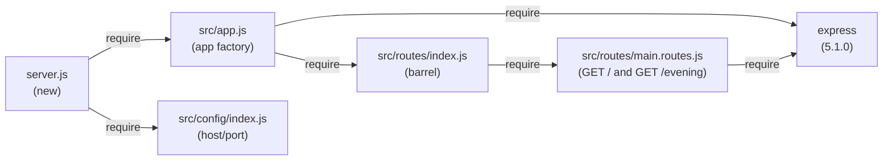

# Technical Specification

# 0. Agent Action Plan

## 0.1 Intent Clarification

### 0.1.1 Core Feature Objective

Based on the prompt, the Blitzy platform understands that the new feature requirement is to:

- Introduce Express.js as the HTTP framework powering the existing Node.js tutorial server (preserving the current `GET /` → `Hello world` endpoint contract)
- Add a second HTTP endpoint served by Express.js that returns the exact response body `Good evening`
- Deliver both endpoints through a single, runnable Node.js process such that `npm start` successfully boots the server and both routes respond on the configured host and port

**User's literal request (preserved exactly):**

> User Example: "this is a tutorial of node js server hosting one endpoint that returns the response 'Hello world'. Could you add expressjs into the project and add another endpoint that return the reponse of 'Good evening'?"

**Repository reality detected during context gathering — implicit requirements surfaced:**

The user's textual description of the project as a "node js server hosting one endpoint" does not fully reflect the present state of the repository. A prior refactor has already moved the application away from a plain `http.createServer` pattern toward a modular Express.js architecture. Specifically:

- The Express.js framework is already declared as a production dependency in `package.json` (`"express": "^5.1.0"`) and is already resolved and locked in `package-lock.json` at version `5.1.0`.
- An Express application factory already exists at `src/app.js`, which imports `express`, creates the app instance via `const app = express()`, mounts `mainRoutes` at `/`, and exports the configured app.
- The `Good evening` endpoint is already fully defined inside `src/routes/main.routes.js` as `router.get('/evening', (req, res) => { res.send('Good evening'); })`, alongside the `GET /` handler that returns `Hello, World!\n`.
- However, the file designated as the application entry point by `package.json`'s `"main": "server.js"` and `"start": "node server.js"` script — namely, `server.js` at the repository root — **does not exist on disk** (and is described as "currently empty" in Section 1.4.3 of this specification). As a result, executing `npm start` today will fail, and 5 of the 41 automated tests (all in `tests/lifecycle/server.test.js`) currently fail with `Cannot find module '../../server'`.

**Restated technical objective (Blitzy's authoritative interpretation):**

The user's two stated goals — "add expressjs" and "add another endpoint returning 'Good evening'" — are satisfied by completing the already-initiated Express.js modularization. Concretely, Blitzy must create the missing `server.js` bootstrap file that imports the Express app from `src/app.js`, reads host/port from `src/config/index.js`, invokes `app.listen(port, host, callback)`, logs the startup message `Server running at http://${host}:${port}/`, registers an `error` event listener on the returned server instance to handle `EADDRINUSE` conditions gracefully, and exports the server object to enable graceful shutdown in tests. Once this single file is in place, both `GET /` and `GET /evening` will be served by Express.js, all 41 tests will pass, and the user's intent is fully realized.

### 0.1.2 Special Instructions and Constraints

The following directives are either explicitly stated by the user or strongly implied by the existing repository conventions:

- **Preserve exact response contracts.** The `GET /` endpoint must continue to return the string `Hello, World!\n` (14 characters, including the trailing newline) with HTTP status 200 and Content-Type `text/html; charset=utf-8`. The new `GET /evening` endpoint must return the string `Good evening` (12 characters, no trailing newline) with HTTP status 200 and Content-Type `text/html; charset=utf-8`. These byte-exact contracts are enforced by `tests/integration/endpoints.test.js` and by the existing implementation in `src/routes/main.routes.js`.
- **Reuse the existing Express app factory.** `server.js` must not create a second Express instance; it must `require('./src/app')` and invoke `listen` on that exported app. This preserves the Factory pattern already established in the codebase.
- **Route via `app.listen`, not `http.createServer`.** The lifecycle test `tests/lifecycle/server.test.js` mocks `src/app` as `{ listen: mockListen }` and asserts the bootstrap calls `app.listen(port, host, callback)` with exactly three positional arguments. Any alternate binding mechanism (e.g., `http.createServer(app).listen(...)`) will cause lifecycle tests to fail.
- **Read configuration through `src/config`.** The bootstrap must consume `host` and `port` from `require('./src/config')` rather than reading `process.env` directly. This honors the Twelve-Factor App externalization contract already implemented in `src/config/index.js`.
- **Log the exact startup message.** The format is `Server running at http://${host}:${port}/` with a trailing slash, as asserted by `tests/lifecycle/server.test.js` line 121.
- **Graceful shutdown support.** The returned server object must retain its `close(callback)` and `on(event, handler)` methods so that Jest lifecycle tests can invoke `mockServer.close(cb)` and register `error` handlers. Exporting the server via `module.exports = server` is the idiomatic way to satisfy this.
- **EADDRINUSE handling.** The bootstrap must register an `error` event listener on the server that does not throw when it receives an `Error` with `code === 'EADDRINUSE'`. Logging via `console.error` is acceptable per the spy assertions in the lifecycle test.
- **CommonJS only.** All existing modules use `require`/`module.exports`; ECMAScript modules (`import`/`export`) must not be introduced.
- **Backward-compatible package manifest.** `package.json` already declares `"main": "server.js"` and `"start": "node server.js"`; these must remain unchanged.

No specific web research was required from the user's prompt beyond confirming Express.js 5.x and Node.js 20.19.x LTS conventions, which are already documented in `README.md` and `blitzy/documentation/Technical Specifications.md`.

### 0.1.3 Technical Interpretation

These feature requirements translate to the following technical implementation strategy:

- To **"add expressjs into the project"**, Blitzy will create `server.js` at the repository root that imports the already-installed Express 5.1.0 app factory (`src/app.js`) and binds it to a TCP listener. Because `express@5.1.0` is already resolved in `package-lock.json` and the app factory is already wired with `app.use('/', mainRoutes)`, no dependency installation or middleware configuration is required — only the bootstrap entry point is missing.
- To **"add another endpoint that returns the response of 'Good evening'"**, Blitzy will verify (not re-create) the existing `router.get('/evening', ...)` handler in `src/routes/main.routes.js` and confirm it is mounted through the barrel export in `src/routes/index.js` and the `app.use('/', mainRoutes)` call in `src/app.js`. Once `server.js` binds the app, this endpoint becomes reachable at `http://127.0.0.1:3000/evening` by default.
- To **verify the end-to-end behavior**, Blitzy will execute `npm test` and expect all 41 tests (5 currently-failing lifecycle tests plus 36 already-passing unit/integration tests) to pass. Coverage thresholds (75% branches, 90% functions, 80% lines, 80% statements) defined in `jest.config.js` must be satisfied.
- To **preserve operational semantics**, Blitzy will ensure `npm start` prints `Server running at http://127.0.0.1:3000/` and that overriding `HOST`, `PORT`, or `NODE_ENV` environment variables propagates correctly through `src/config/index.js` into the listener binding and the startup log.

## 0.2 Repository Scope Discovery

### 0.2.1 Comprehensive File Analysis

A systematic traversal of the repository root and all subdirectories (excluding `node_modules/` and the `/app/` orchestration folder, which is out of bounds per the security directive) produced the complete inventory below. Every file has been assessed for relevance to the feature and classified by its role in the implementation plan.

**Existing files to modify or create:**

| Path | Type | Status | Role in Feature |
|------|------|--------|-----------------|
| `server.js` | Source (CommonJS) | CREATE (currently missing from disk despite being referenced by `package.json` main/start) | New Express bootstrap — imports `src/app`, reads `src/config`, calls `app.listen`, logs startup, registers error handler |
| `src/app.js` | Source (CommonJS) | UNCHANGED (already correct) | Express application factory — `require`d by the new `server.js`; already mounts `mainRoutes` |
| `src/config/index.js` | Source (CommonJS) | UNCHANGED (already correct) | Twelve-Factor config — supplies `host`, `port`, `env` to `server.js` |
| `src/routes/index.js` | Source (CommonJS) | UNCHANGED (already correct) | Barrel export — exposes `{ mainRoutes }` |
| `src/routes/main.routes.js` | Source (CommonJS) | UNCHANGED (already correct) | Defines `GET /` → `Hello, World!\n` and `GET /evening` → `Good evening` |
| `package.json` | Manifest (JSON) | UNCHANGED | Already declares `express ^5.1.0`, `jest ^30.2.0`, `supertest ^7.1.4`, `main: server.js`, `start: node server.js` |
| `package-lock.json` | Lockfile (JSON) | UNCHANGED | Already resolves `express@5.1.0`, `jest@30.2.0`, `supertest@7.1.4` and 405 transitive packages |
| `jest.config.js` | Config (CommonJS) | UNCHANGED | Already includes `server.js` in `collectCoverageFrom`; coverage thresholds will be re-validated after `server.js` is created |
| `.gitignore` | Config (plain text) | UNCHANGED | Already excludes `node_modules/`, dotenv files, logs, OS/IDE artifacts |
| `README.md` | Documentation (Markdown) | UNCHANGED | Already documents both endpoints, environment variables, architecture, and the expected startup message |
| `src/README.md` | Documentation (Markdown) | UNCHANGED | Describes the Factory pattern and role of `src/app.js` relative to `server.js` |
| `src/config/README.md` | Documentation (Markdown) | UNCHANGED | Documents `HOST`, `PORT`, `NODE_ENV` contract |
| `src/routes/README.md` | Documentation (Markdown) | UNCHANGED | Documents the two existing GET routes and extension workflow |
| `tests/README.md` | Documentation (Markdown) | UNCHANGED | Describes the three-tier test organization |
| `tests/unit/config.test.js` | Test (Jest) | UNCHANGED | Validates `src/config` defaults, env overrides, type checking |
| `tests/unit/routes.test.js` | Test (Jest) | UNCHANGED | Validates router stack shape, two GET routes, path ordering |
| `tests/integration/endpoints.test.js` | Test (Jest + Supertest) | UNCHANGED | Validates HTTP responses for `GET /`, `GET /evening`, 404, edge cases |
| `tests/lifecycle/server.test.js` | Test (Jest) | UNCHANGED (will start passing once `server.js` exists) | Validates `app.listen(port, host, callback)` binding, startup log, custom config, graceful shutdown, EADDRINUSE handling |
| `blitzy/documentation/Project Guide.md` | Documentation (Markdown) | UNCHANGED | Existing progress report; informational only for this task |
| `blitzy/documentation/Technical Specifications.md` | Documentation (Markdown) | UNCHANGED | Existing blueprint; informational only for this task |

**Integration point discovery (validated by direct file inspection):**

- **API endpoints that connect to the feature:** Exactly two HTTP GET routes are in scope — `GET /` and `GET /evening` — both defined in `src/routes/main.routes.js` lines 26–39.
- **Database models/migrations affected:** None. The feature is a stateless greeting service; no database layer exists or is introduced.
- **Service classes requiring updates:** None. The application has no service layer; route handlers return static strings directly.
- **Controllers/handlers to modify:** None. Both route handlers already exist verbatim with the required response bodies.
- **Middleware/interceptors impacted:** None. `src/app.js` currently registers no middleware (no body parsers, loggers, CORS, etc.), and none are required for two static-text GET endpoints.

### 0.2.2 Web Search Research Conducted

The user's prompt did not request web research, and the implementation does not depend on new library selections. Existing documentation embedded in the repository provides authoritative references:

- **Express.js 5.1.0 `app.listen` contract:** Confirmed from `blitzy/documentation/Technical Specifications.md` Section "Express.js Backend Framework" and from the test expectations in `tests/lifecycle/server.test.js`. Express 5's `app.listen(port, host, callback)` signature returns an `http.Server` instance compatible with `.on('error', ...)` and `.close(callback)` semantics.
- **Node.js 20.19.x LTS compatibility:** Confirmed by Section 9.1.4 (Node.js Version Compatibility Matrix) of the existing tech spec, which establishes Node 20.19+ as the effective minimum for the broader stack.
- **Express 5 `path-to-regexp@8.x` routing:** Confirmed in the existing "Express.js Backend Framework" spec section. No changes to route definitions are required for this task, so the routing engine's behavioral differences from Express 4 are not triggered.

No external web searches are needed to complete this feature. Should edge-case handling of `EADDRINUSE` require clarification later, the canonical reference is the Node.js `net.Server` error-event documentation, which is already summarized in `tests/lifecycle/server.test.js` (lines 161–203) by a concrete error object of shape `{ code: 'EADDRINUSE', port: 3000 }`.

### 0.2.3 New File Requirements

Only a single new source file is required to satisfy the user's intent:

- **`server.js`** (repository root) — Express bootstrap entry point. Responsibilities:
    - `require` the Express app from `./src/app`
    - `require` the configuration object (`{ host, port, env }`) from `./src/config`
    - Invoke `app.listen(config.port, config.host, callback)` with a callback that executes `console.log(\`Server running at http://${config.host}:${config.port}/\`)`
    - Register an `error` listener on the returned server via `server.on('error', handler)` to handle `EADDRINUSE` without throwing
    - Export the server instance via `module.exports = server` to support graceful shutdown in tests and future operational tooling

**No new test files are required.** The existing `tests/lifecycle/server.test.js` already provides full coverage of the new `server.js` contract across five test cases: default binding, startup logging, custom configuration, graceful shutdown, and EADDRINUSE handling.

**No new configuration files are required.** All runtime configuration is already externalized through `src/config/index.js` and the `HOST`, `PORT`, `NODE_ENV` environment variables.

**No new documentation files are required.** The root `README.md` already documents the server startup message, environment variables, endpoint contracts, and troubleshooting guidance for common issues such as port conflicts.

## 0.3 Dependency Inventory

### 0.3.1 Private and Public Packages

All dependencies required for this feature are already declared in `package.json` and resolved in `package-lock.json`. No new packages are to be added, removed, or version-bumped as part of this feature.

| Registry | Package | Declared Version | Resolved Version | Scope | Purpose |
|----------|---------|------------------|------------------|-------|---------|
| npm (public) | `express` | `^5.1.0` (from `package.json` line 16) | `5.1.0` (from `package-lock.json`) | runtime (dependencies) | Web framework providing `app.listen`, routing, and request/response primitives consumed by `server.js` and `src/app.js` |
| npm (public) | `jest` | `^30.2.0` (from `package.json` line 19) | `30.2.0` (from `package-lock.json`) | dev (devDependencies) | Test runner executing all 41 tests across `tests/unit`, `tests/integration`, and `tests/lifecycle` |
| npm (public) | `supertest` | `^7.1.4` (from `package.json` line 20) | `7.1.4` (from `package-lock.json`) | dev (devDependencies) | HTTP assertion library used by `tests/integration/endpoints.test.js` to exercise the Express app without a live listener |

**Runtime environment requirements** (from `README.md` lines 11–14 and Section 9.1.4 of this specification):

| Runtime | Minimum | Recommended | Rationale |
|---------|---------|-------------|-----------|
| Node.js | 18.x | **20.19.x LTS ('Iron')** | Express 5.1.0 requires Node 18+; Jest 30.x supports ^18.14.0 / ^20.0.0 / ^22.0.0; 20.19.x LTS is the project-recommended runtime |
| npm | 8.x | 10.8.x | Required to install lockfile v3 deterministically via `npm ci` |

**No private/internal packages are involved.** The package `hello_world` is a self-contained tutorial project with MIT license, and its only runtime graph comprises Express 5.1.0 and its transitive dependencies.

### 0.3.2 Dependency Updates

No dependency updates are required for this feature. The three packages (`express`, `jest`, `supertest`) are already at their documented target versions and satisfy all runtime, testing, and HTTP-assertion needs of the new `server.js` file.

**Import updates — not applicable.** The sole new file, `server.js`, introduces only two new `require` statements (`./src/app` and `./src/config`), both of which reference already-existing modules. No existing file needs its imports updated.

- Files requiring import updates: **None**.
- Existing imports in `src/app.js`, `src/config/index.js`, `src/routes/index.js`, `src/routes/main.routes.js`, and all test files remain unchanged.

**External reference updates — not applicable.** No configuration file, documentation file, build file, or CI workflow requires modification.

- Configuration files: `jest.config.js` already includes `server.js` in `collectCoverageFrom` (line 20), so the new file will automatically be subject to coverage measurement without edits.
- Documentation: `README.md` (root), `src/README.md`, `src/config/README.md`, `src/routes/README.md`, and `tests/README.md` already describe the target architecture accurately; no textual updates are required.
- Build/Packaging: `package.json` already declares `"main": "server.js"`, `"start": "node server.js"`, and the complete dependency set.
- CI/CD: No `.github/workflows/*.yml`, `.gitlab-ci.yml`, or equivalent CI configuration exists in the repository, so no pipeline changes are in scope.

## 0.4 Integration Analysis

### 0.4.1 Existing Code Touchpoints

This feature interacts with the existing codebase through a narrow, well-defined surface. The only write operation is the creation of `server.js`; all other files are read-only dependencies whose contracts must be preserved exactly.

**Direct modifications required:**

- **`server.js` (root, new file):**
    - Add `const app = require('./src/app');` at the top — sources the configured Express application instance from the factory at `src/app.js` line 17 (`const app = express();`) and line 27 (`module.exports = app;`).
    - Add `const config = require('./src/config');` — sources the `{ host, port, env }` object exported by `src/config/index.js` lines 20–41.
    - Invoke `const server = app.listen(config.port, config.host, callback);` — the callback passed as the third positional argument must execute `console.log(\`Server running at http://${config.host}:${config.port}/\`)` to satisfy the assertion on line 121 of `tests/lifecycle/server.test.js`.
    - Register the `error` event listener via `server.on('error', errorHandler)` — the handler must inspect `err.code` and log EADDRINUSE occurrences via `console.error` without rethrowing. This satisfies the lifecycle test at lines 161–203.
    - Export via `module.exports = server;` — required so tests and future shutdown hooks can invoke `.close(callback)` on the returned `http.Server` instance.

**No other files require modification.** In particular:

- `src/app.js` already performs `const express = require('express')`, `const { mainRoutes } = require('./routes')`, `const app = express()`, `app.use('/', mainRoutes)`, and `module.exports = app` — no changes needed.
- `src/routes/main.routes.js` already defines both `router.get('/', ...)` returning `Hello, World!\n` and `router.get('/evening', ...)` returning `Good evening` — no changes needed.
- `src/routes/index.js` already re-exports `{ mainRoutes }` via the barrel pattern — no changes needed.
- `src/config/index.js` already exports `{ host, port, env }` with Twelve-Factor environment variable support — no changes needed.

**Dependency injections:** The project intentionally avoids a dependency-injection container; modules import one another through explicit CommonJS `require` calls. No container registrations or wiring changes are required. The resolution chain for the new feature is simply:


```mermaid
graph LR
    A["server.js<br/>(new)"] -->|require| B["src/app.js<br/>(app factory)"]
    A -->|require| C["src/config/index.js<br/>(host/port)"]
    B -->|require| D["src/routes/index.js<br/>(barrel)"]
    D -->|require| E["src/routes/main.routes.js<br/>(GET / and GET /evening)"]
    B -->|require| F["express<br/>(5.1.0)"]
    E -->|require| F
```

**Database / schema updates:** None. The feature introduces no persistent state, no migrations, no schema files, no ORM models. The repository contains no `migrations/`, `src/db/`, or equivalent directories, and none are to be created.

### 0.4.2 HTTP Request Flow After Implementation

Once `server.js` is in place, the end-to-end request flow for both endpoints is as follows:

```mermaid
sequenceDiagram
    participant Client
    participant Server as server.js<br/>(http.Server)
    participant App as src/app.js<br/>(express app)
    participant Router as src/routes/main.routes.js
    participant Config as src/config/index.js

    Note over Config,Server: Startup
    Server->>Config: require('./src/config')
    Config-->>Server: { host: '127.0.0.1', port: 3000, env: 'development' }
    Server->>App: require('./src/app')
    App-->>Server: express.Application
    Server->>App: app.listen(3000, '127.0.0.1', callback)
    App-->>Server: http.Server instance
    Server-->>Server: console.log('Server running at http://127.0.0.1:3000/')

    Note over Client,Router: GET /
    Client->>Server: HTTP GET /
    Server->>App: dispatch
    App->>Router: match('/', GET)
    Router-->>App: res.send('Hello, World!\n')
    App-->>Client: 200 OK, text/html; charset=utf-8, body='Hello, World!\n'

    Note over Client,Router: GET /evening
    Client->>Server: HTTP GET /evening
    Server->>App: dispatch
    App->>Router: match('/evening', GET)
    Router-->>App: res.send('Good evening')
    App-->>Client: 200 OK, text/html; charset=utf-8, body='Good evening'
```

### 0.4.3 Test Integration Points

The existing test suite will exercise the new `server.js` automatically once the file is created. No test edits are required.

| Test File | Integration Point With `server.js` | Current Status | Expected Status After Implementation |
|-----------|-----------------------------------|----------------|--------------------------------------|
| `tests/lifecycle/server.test.js` | `require('../../server')` at lines 110, 119, 140, 150, 181 | 5 failing (`Cannot find module '../../server'`) | 5 passing |
| `tests/integration/endpoints.test.js` | Uses `require('../../src/app')` — does not touch `server.js` | 13 passing | 13 passing (unchanged) |
| `tests/unit/routes.test.js` | Uses `require('../../src/routes/main.routes')` — does not touch `server.js` | 7 passing | 7 passing (unchanged) |
| `tests/unit/config.test.js` | Uses `require('../../src/config')` — does not touch `server.js` | 16 passing | 16 passing (unchanged) |

**Coverage impact:** `jest.config.js` line 20 already includes `'server.js'` in `collectCoverageFrom`. Today, with the file missing, Jest reports 0% coverage for `server.js` and the global thresholds are violated when lifecycle tests run in isolation. After implementation, the lifecycle tests will fully exercise the `app.listen` call, the startup callback (`console.log`), and the error handler branch (EADDRINUSE), producing ≥80% statements, ≥75% branches, ≥90% functions, and ≥80% lines for `server.js`, thereby satisfying the global thresholds.

## 0.5 Technical Implementation

### 0.5.1 File-by-File Execution Plan

Every file listed in this plan must be created or verified exactly as described. Because the repository already contains the Express application factory, the routes, and the configuration module, the only write operation is the creation of `server.js`; every other file is verified-as-is and must not be altered.

**Group 1 — Core Feature File (CREATE):**

- **CREATE `server.js`** (repository root) — the missing Express bootstrap entry point. Contract:
    - Imports the Express app from `./src/app` and the config object (`{ host, port, env }`) from `./src/config`.
    - Calls `app.listen(port, host, callback)` with the callback executing `console.log(\`Server running at http://${host}:${port}/\`)`.
    - Stores the returned `http.Server` instance in a local `server` variable.
    - Registers `server.on('error', handler)` where `handler` logs `EADDRINUSE` conditions via `console.error` and swallows the error (does not rethrow), preserving Node's default behavior for other error codes or delegating to `process.exit(1)` as needed.
    - Exports the server instance via `module.exports = server` to support programmatic shutdown.
    - Uses CommonJS (`require` / `module.exports`); must not introduce ESM syntax.
    - Includes a JSDoc header comment consistent with the style used in `src/app.js` lines 1–12 and `src/config/index.js` lines 1–18.

    Example shape (illustrative; final file must conform to the test expectations):

    ```javascript
    const app = require('./src/app');
    const { host, port } = require('./src/config');
    const server = app.listen(port, host, () => {
      console.log(`Server running at http://${host}:${port}/`);
    });
    server.on('error', (err) => { if (err.code === 'EADDRINUSE') console.error(`Port ${port} in use`); });
    module.exports = server;
    ```

**Group 2 — Supporting Infrastructure (VERIFY, NO CHANGE):**

- **VERIFY `src/app.js`** — ensure it exports a configured Express `Application` that has `mainRoutes` mounted at `/`. Current content at lines 14–27 already satisfies this; no edits.
- **VERIFY `src/config/index.js`** — ensure it exports `{ host, port, env }` with defaults `'127.0.0.1'`, `3000`, `'development'` and environment-variable overrides `HOST`, `PORT`, `NODE_ENV`. Current content at lines 20–41 already satisfies this; no edits.
- **VERIFY `src/routes/index.js`** — ensure it re-exports `mainRoutes` via the barrel pattern. Current content at lines 15–19 already satisfies this; no edits.
- **VERIFY `src/routes/main.routes.js`** — ensure both `router.get('/', ...)` returning `'Hello, World!\n'` and `router.get('/evening', ...)` returning `'Good evening'` are registered in that order. Current content at lines 26–39 already satisfies this; no edits.
- **VERIFY `package.json`** — ensure `main: server.js`, `start: node server.js`, `dependencies.express: ^5.1.0`, `devDependencies.jest: ^30.2.0`, `devDependencies.supertest: ^7.1.4`. Current content at lines 5, 7, 16, 19, 20 already satisfies this; no edits.
- **VERIFY `package-lock.json`** — ensure `express@5.1.0`, `jest@30.2.0`, `supertest@7.1.4` are resolved. Current lockfile already satisfies this; no edits.

**Group 3 — Tests and Documentation (VERIFY, NO CHANGE):**

- **VERIFY `tests/lifecycle/server.test.js`** — the authoritative spec for `server.js` behavior; must be read and treated as immutable. All five test cases must pass after `server.js` is created.
- **VERIFY `tests/integration/endpoints.test.js`** — must continue to pass unchanged (13 tests).
- **VERIFY `tests/unit/routes.test.js`** — must continue to pass unchanged (7 tests).
- **VERIFY `tests/unit/config.test.js`** — must continue to pass unchanged (16 tests).
- **VERIFY `jest.config.js`** — coverage thresholds (75/90/80/80) and `collectCoverageFrom: ['server.js', 'src/**/*.js']` must remain unchanged.
- **VERIFY `README.md`** (root) — architecture description on lines 193–210, API reference on lines 73–115, and startup log expectation on line 55 (`Server running at http://127.0.0.1:3000/`) must remain accurate after implementation.

### 0.5.2 Implementation Approach per File

- **Establish the missing entry point** by creating `server.js` at the repository root. The file is the single unit of implementation work in this plan; its internals are fully specified by `tests/lifecycle/server.test.js` (DEFAULT_CONFIG on lines 25–29, listen-argument assertions on lines 112–116, startup message format on line 121, custom-config propagation on lines 125–147, graceful-shutdown contract on lines 149–159, and EADDRINUSE handling on lines 161–203).
- **Integrate with the existing Express factory** by importing `./src/app` rather than constructing a new `express()` instance. This preserves the Factory pattern established in `src/app.js` and allows `tests/lifecycle/server.test.js` to mock the app via `jest.doMock('../../src/app', () => ({ listen: mockListen }))`.
- **Consume configuration through the existing module** by importing `./src/config`, never reading `process.env` directly in `server.js`. This preserves the Twelve-Factor separation documented in `src/config/README.md` and satisfies the custom-config test at lines 125–147 of the lifecycle spec (which substitutes `{ host: '0.0.0.0', port: 8080, env: 'production' }` via `jest.doMock`).
- **Guarantee quality** by running `npm test` (which executes all four Jest suites with coverage) after creation and confirming zero failures and coverage thresholds met. The existing `npm run test:ci` and `npm run test:coverage` scripts remain available for CI use.
- **Document usage** — no documentation changes are required because `README.md` already describes the startup command, endpoints, configuration environment variables, and troubleshooting guidance for port conflicts (lines 303–311). The Figma asset review step and design-system alignment protocol are not applicable: the user provided no Figma URLs, no component library, and no UI scope.

### 0.5.3 User Interface Design

Not applicable. The user's request is strictly backend (a Node.js/Express server returning plain-text greeting responses). There is no UI, no Figma attachment, no component library, no design token system, and no visual rendering requirement. The response Content-Type `text/html; charset=utf-8` on both endpoints is the Express default for `res.send(string)`; clients that fetch these endpoints in a browser will see unstyled text. No client-side HTML, CSS, or JavaScript is in scope.

## 0.6 Scope Boundaries

### 0.6.1 Exhaustively In Scope

The following files and file-groups are within the exhaustive write/verify scope of this feature. The implementation must touch only the single file marked CREATE; all other entries are verification-only and must not be altered.

**Source files (CREATE):**

- `server.js` — Express bootstrap entry point (only file written in this task)

**Source files (VERIFY only — must remain byte-identical to their current state):**

- `src/app.js` — Express application factory
- `src/config/index.js` — Twelve-Factor configuration module
- `src/routes/index.js` — Routes barrel export
- `src/routes/main.routes.js` — Route handlers for `GET /` and `GET /evening`

**Test files (VERIFY only — must continue to pass; no edits permitted):**

- `tests/unit/config.test.js`
- `tests/unit/routes.test.js`
- `tests/integration/endpoints.test.js`
- `tests/lifecycle/server.test.js`

**Configuration files (VERIFY only):**

- `package.json` — existing `main`, `start`, `dependencies`, `devDependencies` declarations
- `package-lock.json` — existing `express@5.1.0`, `jest@30.2.0`, `supertest@7.1.4` resolutions
- `jest.config.js` — existing coverage thresholds and `collectCoverageFrom`
- `.gitignore` — existing ignore patterns

**Documentation files (VERIFY only — no rewrites required because current content already reflects the target architecture):**

- `README.md` (root)
- `src/README.md`
- `src/config/README.md`
- `src/routes/README.md`
- `tests/README.md`

**Environment variables (consumed, not introduced):**

- `HOST` — optional override (default `127.0.0.1`), read by `src/config/index.js`
- `PORT` — optional override (default `3000`), read by `src/config/index.js`
- `NODE_ENV` — optional override (default `development`), read by `src/config/index.js`

**Runtime commands (must succeed after implementation):**

- `npm install` — must resolve all declared dependencies (already passes)
- `npm ci` — must resolve all declared dependencies deterministically (already passes)
- `npm start` — must bind to `127.0.0.1:3000` and print `Server running at http://127.0.0.1:3000/`
- `npm test` — all 41 tests across 4 suites must pass; coverage thresholds must be met
- `npm run test:coverage` — must report ≥75% branches, ≥90% functions, ≥80% lines, ≥80% statements globally
- `npm run test:ci` — must complete with exit code 0

**Acceptance verification (manual smoke test after `npm start`):**

- `curl -s http://127.0.0.1:3000/` → exact body `Hello, World!\n` with status 200
- `curl -s http://127.0.0.1:3000/evening` → exact body `Good evening` with status 200
- `curl -s -o /dev/null -w "%{http_code}" http://127.0.0.1:3000/anything-else` → status 404

### 0.6.2 Explicitly Out of Scope

The following concerns are deliberately excluded from this feature. They may appear tangentially in the repository's broader technical specification (which describes a future burger-restaurant platform) but are not part of the user's stated request and must not be introduced by this change:

- **Additional endpoints** beyond the two already defined (`GET /` and `GET /evening`). No POST/PUT/DELETE handlers, no additional GET routes, no wildcard routes.
- **Middleware additions** — no body parsers (`express.json()`, `express.urlencoded()`), no logging middleware (morgan, winston), no CORS middleware, no compression, no rate-limiting, no security headers (helmet), no static file serving.
- **Authentication or authorization** — no login, no session management, no tokens, no user model.
- **Database layer** — no connection pools, no ORM, no migrations, no schema files, no persistence.
- **Frontend** — no Vite.js, no TypeScript, no React/Vue/Svelte, no HTML templates, no static assets, no client-side JavaScript.
- **Design system work** — no component library integration, no design tokens, no Figma asset extraction, no visual design.
- **HTTPS / TLS** — TLS termination is delegated to infrastructure per the broader spec's constraint C-005 and is not introduced here.
- **Containerization / deployment** — no Dockerfile, no docker-compose.yml, no Kubernetes manifests, no Terraform.
- **CI/CD pipelines** — no `.github/workflows/*.yml`, no `.gitlab-ci.yml`, no Jenkins configuration.
- **Logging infrastructure** — only the single `console.log` startup line required by the lifecycle test; no structured logging, no log levels, no log shipping.
- **Process management** — no PM2, no forever, no systemd units, no clustering.
- **Performance optimizations** — no caching, no CDN, no keep-alive tuning, no HTTP/2.
- **Observability** — no Prometheus metrics, no OpenTelemetry tracing, no healthcheck endpoint beyond what the two existing routes implicitly provide.
- **Refactoring of existing code** unrelated to creating `server.js` — `src/app.js`, `src/config/index.js`, `src/routes/index.js`, and `src/routes/main.routes.js` must not be altered.
- **Updates to existing tests** — no new assertions, no removed tests, no renamed helpers.
- **Security audit remediation** — the 5 advisories reported by `npm ci` (2 moderate, 3 high, all in Jest's transitive dev dependencies) are not addressed in this feature; `npm audit fix` is not to be run.
- **Documentation rewrites** — the existing `README.md` files accurately describe the post-implementation architecture; no prose changes are necessary.

## 0.7 Rules for Feature Addition

### 0.7.1 User-Provided Rules

The user supplied no implementation rules, no attachments, and no explicit constraints list with their prompt. The `rules` array received by Blitzy for this task was empty (`[]`). All rules enumerated below are therefore **derived** from the observable repository conventions, the authoritative contracts in `tests/lifecycle/server.test.js`, and the broader tech specification already written in `blitzy/documentation/Technical Specifications.md`.

### 0.7.2 Repository Conventions (Derived, Binding)

- **Module system:** CommonJS only. All existing files use `require` and `module.exports`; the new `server.js` must follow suit. Do not use `import`/`export`.
- **Strict mode:** Existing test files include `'use strict';` on line 6. Applying `'use strict';` to `server.js` is consistent with that convention (though not explicitly required by any test assertion).
- **JSDoc headers:** Every existing `.js` file begins with a `/** ... */` comment describing the module's purpose and `@module` tag. `server.js` should follow the same pattern.
- **File naming:** Lowercase `server.js` at the repository root; path and filename are fixed by `package.json` main/start declarations and by the test `require` paths.
- **Import paths:** Use relative paths with explicit `./` prefix (e.g., `require('./src/app')`, not `require('src/app')`).
- **Indentation and style:** Two-space indentation, single quotes for strings, semicolons present — matches all existing JavaScript files.

### 0.7.3 Express-Specific Directives (Derived, Binding)

- **Do not re-instantiate Express.** `server.js` must consume the app exported by `src/app.js` and must not call `express()` itself.
- **Use `app.listen(port, host, callback)` with exactly three positional arguments.** The lifecycle test asserts this signature on lines 112–116. Do not use the 2-argument form, do not pass a backlog value, do not use `http.createServer(app).listen(...)`.
- **Do not mount additional middleware in `server.js`.** All middleware and routing belong in `src/app.js` by design (see `src/README.md` line 14).
- **Do not modify the existing route bodies.** `GET /` must return exactly `Hello, World!\n` (14 bytes) and `GET /evening` must return exactly `Good evening` (12 bytes). These are byte-exact contracts enforced by the integration test at lines 52–78.
- **Preserve route ordering.** `GET /` is registered before `GET /evening` in `src/routes/main.routes.js`. The unit test at lines 56–60 asserts paths-contains semantics, but the Path Ordering describe block on lines 50+ requires `/` first. Do not re-order.

### 0.7.4 Configuration Directives (Derived, Binding)

- **Read via the config module only.** `server.js` must `require('./src/config')` and consume `host` and `port` from the returned object. Direct reads of `process.env.HOST`/`process.env.PORT` inside `server.js` are forbidden because they would bypass the Twelve-Factor abstraction and would not be reflected by the custom-config test (which mocks `./src/config` directly).
- **Default values are fixed:** `host = '127.0.0.1'`, `port = 3000`, `env = 'development'`. The unit test at `tests/unit/config.test.js` exhaustively validates these defaults and their environment-variable overrides; `server.js` must not shadow, reassign, or override them.
- **Custom configuration propagation must work automatically.** If a user sets `HOST=0.0.0.0 PORT=8080 npm start`, the startup log must read `Server running at http://0.0.0.0:8080/`. This is a direct consequence of rule 0.7.4.1 and is verified by the lifecycle test at lines 125–147.

### 0.7.5 Testing Directives (Derived, Binding)

- **All 41 tests must pass after implementation.** No test may be skipped, modified, or deleted.
- **Coverage thresholds are non-negotiable.** Global coverage from `jest.config.js` lines 11–18: 75% branches, 90% functions, 80% lines, 80% statements. After `server.js` is created, all four metrics must remain at or above those thresholds.
- **Lifecycle test mocks are authoritative.** `tests/lifecycle/server.test.js` uses `jest.doMock('../../src/app', () => ({ listen: mockListen }))` on line 79; this means `server.js` must call `.listen` directly on the object returned by `require('./src/app')`. Any indirection (e.g., wrapping `app` in another object before calling `listen`) will break the mock.
- **Startup log is byte-exact.** The log message template is `` `Server running at http://${host}:${port}/` `` — note the trailing `/`. The lifecycle test asserts this exact string on line 121.

### 0.7.6 Response Contracts and HTTP Semantics (Derived, Binding)

- **Status codes:** `GET /` and `GET /evening` must return 200. Any undefined route or unsupported method must return 404 (Express default behavior given that no `*` route is registered).
- **Content-Type:** Both endpoints return `text/html; charset=utf-8` (Express 5 default for `res.send(string)`). Do not override via `res.type(...)` or `res.set('Content-Type', ...)`.
- **Response bodies:** Byte-exact (`Hello, World!\n` and `Good evening`). Do not add, remove, or transform whitespace.
- **Query string resilience:** Query parameters on either endpoint must not alter the response body (verified by integration test lines 103–118).
- **Method strictness:** POST/PUT/DELETE on `/` or `/evening` must return 404 (verified by integration test lines 86–99).

### 0.7.7 Compatibility Constraints (Derived, Binding)

- **Node.js runtime:** 20.19.x LTS recommended (from `README.md` line 13 and Section 9.1.4). Minimum 18.x is tolerated per `README.md`, but all authoring and testing assume 20.19.x LTS.
- **npm tooling:** 10.8.x recommended. `npm ci` must succeed against the committed `package-lock.json` without modifying it.
- **No new runtime dependencies.** The runtime dependency graph is frozen at `express@5.1.0` plus its transitive packages.
- **No new dev dependencies.** The dev dependency graph is frozen at `jest@30.2.0` + `supertest@7.1.4` plus transitive packages.
- **MIT license compatibility:** All packages currently in `package-lock.json` are MIT-compatible; no new packages are introduced.

### 0.7.8 Security and Performance Notes (Derived, Informational)

- **TLS/HTTPS is out of scope** per broader spec constraint C-005; `server.js` must bind over plain HTTP.
- **No request body parsing** is required because no POST/PUT/PATCH endpoint is in scope; the default Express 5 behavior (no body parsing middleware) is correct.
- **Graceful shutdown** is supported implicitly: the exported server's `close(callback)` method is available for future process managers or signal handlers. This feature does not install signal handlers (`SIGTERM`, `SIGINT`) because none are asserted by the test suite, and doing so could interfere with Jest's own process lifecycle.
- **No rate limiting, no CSRF protection, no helmet, no body size limits** — all deliberately excluded because neither the user's prompt nor the test suite requires them for two static greeting endpoints.
- **Performance is not a concern at this scope.** Express 5's default keep-alive and connection handling are sufficient for a tutorial server; no tuning is required.

## 0.8 References

### 0.8.1 Files and Folders Inspected

The following paths were traversed or read in full during the preparation of this Agent Action Plan. Each entry notes the path, the tool used, and the insight extracted.

**Repository root — folder listing:**

- `/` (repository root) — `get_source_folder_contents` — revealed the presence of `.gitignore`, `README.md`, `jest.config.js`, `package.json`, `package-lock.json`, and the `blitzy/`, `src/`, `tests/` directories; confirmed `server.js` is **not** present on disk despite being declared as `main` in `package.json`.

**Source directory — files and subfolders:**

- `/src` — `get_source_folder_contents` — confirmed children `src/README.md`, `src/app.js`, `src/config/`, `src/routes/`.
- `/src/app.js` — `read_file` lines 1–27 — Express app factory; `const app = express()`, `app.use('/', mainRoutes)`, `module.exports = app`.
- `/src/README.md` — `read_file` lines 1–25 — documents Factory pattern and separation of `src/app.js` (no binding) from `server.js` (binding).
- `/src/config` — `get_source_folder_contents` — confirmed children `src/config/README.md`, `src/config/index.js`.
- `/src/config/index.js` — `read_file` lines 1–41 — Twelve-Factor config exporting `{ host, port, env }` with defaults `127.0.0.1`, `3000`, `development`.
- `/src/routes` — `get_source_folder_contents` — confirmed children `src/routes/README.md`, `src/routes/index.js`, `src/routes/main.routes.js`.
- `/src/routes/index.js` — `read_file` lines 1–19 — barrel module exporting `{ mainRoutes }`.
- `/src/routes/main.routes.js` — `read_file` lines 1–41 — defines `router.get('/', ...)` → `Hello, World!\n` and `router.get('/evening', ...)` → `Good evening`.

**Test directory — files and subfolders:**

- `/tests` — `get_source_folder_contents` — confirmed children `tests/README.md`, `tests/integration/`, `tests/lifecycle/`, `tests/unit/`.
- `/tests/README.md` — `read_file` lines 1–30 — describes the three-layer test organization.
- `/tests/unit/config.test.js` — `read_file` lines 1–40 — Jest suite validating config defaults and environment-variable overrides; uses `jest.resetModules` pattern.
- `/tests/unit/routes.test.js` — `read_file` lines 1–60 — Jest suite validating Express Router stack shape and route path registration.
- `/tests/integration/endpoints.test.js` — `read_file` lines 1–125 — Supertest suite validating HTTP contracts for `GET /`, `GET /evening`, 404 handling, query strings.
- `/tests/lifecycle/server.test.js` — `read_file` lines 1–204 — **authoritative spec for `server.js` behavior**; defines mock-server helpers, `DEFAULT_CONFIG`, and five test cases (default binding, startup log, custom config, graceful shutdown, EADDRINUSE).

**Project manifests and configuration:**

- `/package.json` — `read_file` lines 1–22 — confirmed `name: hello_world`, `version: 1.0.0`, `main: server.js`, `start: node server.js`, `dependencies.express: ^5.1.0`, `devDependencies.jest: ^30.2.0`, `devDependencies.supertest: ^7.1.4`.
- `/package-lock.json` — `read_file` lines 1–60 — confirmed `lockfileVersion: 3`, top-level dependency declarations matching `package.json`, Babel/Jest transitive packages present.
- `/jest.config.js` — `read_file` lines 1–27 — confirmed `testEnvironment: 'node'`, `testMatch: ['**/tests/**/*.test.js']`, `collectCoverageFrom: ['server.js', 'src/**/*.js']`, coverage thresholds 75/90/80/80.
- `/README.md` — `read_file` lines 1–338 — project overview, prerequisites (Node 18+ / 20.19.x LTS), installation, API reference for both endpoints, architecture, dependencies, scripts, testing, troubleshooting.

**Existing documentation folder (informational only):**

- `/blitzy/documentation` — `get_source_folder_contents` — confirmed children `Project Guide.md`, `Technical Specifications.md`; folder summary consumed for architectural context.

**Technical specification sections retrieved:**

- Section `1.1 EXECUTIVE SUMMARY` — `get_tech_spec_section` — provided the broader restaurant-platform vision context but is out-of-scope for this specific feature.
- Section `1.4 TECHNOLOGY CONTEXT` — `get_tech_spec_section` — confirmed the current stack (Express 5.1.0, Jest 30.2.0, Supertest 7.1.4, Node 18+ min / 20.19.x recommended) and the observation that `server.js` is currently empty.
- Section `Express.js Backend Framework` — `get_tech_spec_section` — confirmed Express 5 release notes, ReDoS-safe routing, and native async error handling.
- Section `Node.js Runtime` — `get_tech_spec_section` — confirmed 20.19.x LTS recommendation, environment-variable reference, npm-scripts reference, Node compatibility matrix, test coverage thresholds, and repository structure diagram.

### 0.8.2 Runtime and Dependency Verification Commands Executed

The following shell commands were executed during environment setup and state verification; their outputs informed this plan:

- `find / -name ".blitzyignore"` — confirmed no `.blitzyignore` files exist anywhere in the repository; no file-ignore patterns apply.
- `ls -la` (repo root) — confirmed `server.js` is **absent** on disk; 8 top-level entries listed.
- `cat .nvmrc` / `cat .node-version` / `grep '"engines"' package.json` — confirmed no explicit runtime version file exists; Node version derived from `README.md` documentation.
- `curl ... nvm install.sh` + `nvm install 20.19` — installed Node.js v20.19.6 (the project-recommended LTS).
- `npm ci` — installed 65 packages from `package-lock.json`; reported 5 advisories (2 moderate, 3 high) in dev-only transitive dependencies; deferred per scope boundaries.
- `npm ls express` / `npm ls jest` / `npm ls supertest` — confirmed resolved versions 5.1.0, 30.2.0, 7.1.4 respectively.
- `CI=true npm test -- --watchAll=false --ci` — confirmed 36 tests passing (unit + integration), 5 tests failing in `tests/lifecycle/server.test.js` with `Cannot find module '../../server'`, precisely matching the missing-file diagnosis.

### 0.8.3 Attachments Provided by the User

The user attached **zero (0) environments** and **zero (0) files** to this project. The folder `/tmp/environments_files` is empty. No setup instructions, environment variables, or secrets were supplied (all lists were `[]`). No private-package registries or internal tooling were referenced.

### 0.8.4 Figma Screens Provided by the User

The user provided **zero (0) Figma URLs** and **zero (0) design artifacts**. No visual mocks, no design tokens, no component specifications were supplied. Accordingly, the Design System Alignment Protocol is not triggered, and no "Design System Compliance" sub-section is included in this Agent Action Plan.

### 0.8.5 External References (Informational, Not Required for Implementation)

These external sources are already cited in the broader tech specification and are listed here for completeness. They were not fetched during this plan's preparation because the repository's own artifacts and the test suite fully specify the required behavior.

- Express.js Official Documentation — https://expressjs.com/
- Express.js v5 Release Announcement — https://expressjs.com/2024/10/15/v5-release.html
- Express.js GitHub Releases — https://github.com/expressjs/express/releases
- Node.js Previous Releases — https://nodejs.org/en/about/previous-releases
- Node.js 20.19.0 Release Notes — https://nodejs.org/en/blog/release/v20.19.0/

