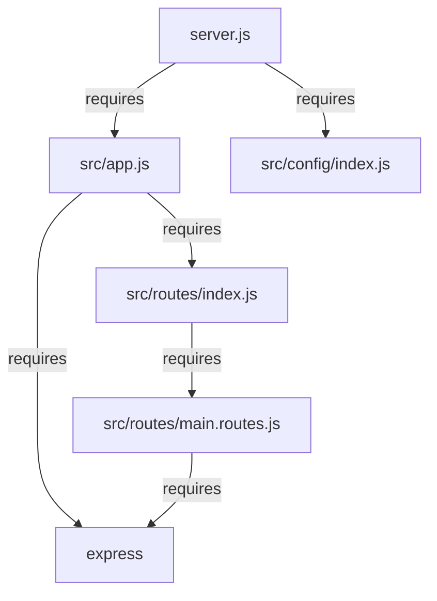
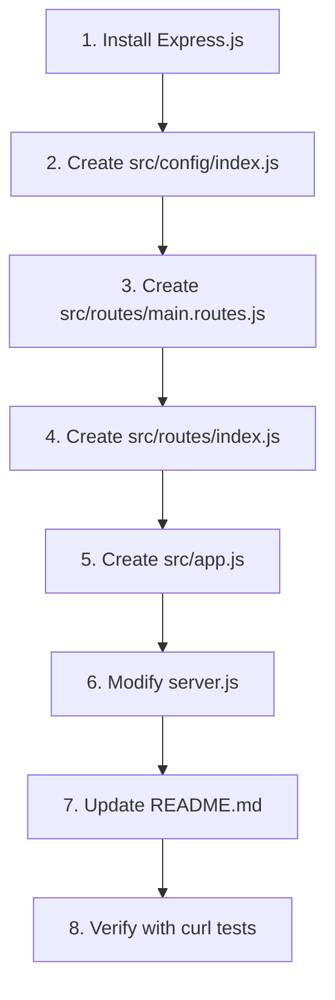
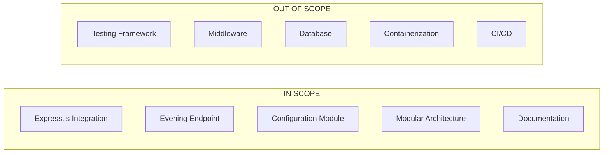

# Technical Specification

# 0. Agent Action Plan

## 0.1 Intent Clarification

### 0.1.1 Core Feature Objective

Based on the prompt, the Blitzy platform understands that the new feature requirement is to:

- **Integrate Express.js framework** into an existing Node.js server that currently serves a "Hello world" endpoint
- **Add a new HTTP GET endpoint** that returns the response "Good evening" when accessed

The user's original request was:
> "this is a tutorial of node js server hosting one endpoint that returns the response 'Hello world'. Could you add expressjs into the project and add another endpoint that return the reponse of 'Good evening'?"

**Implicit requirements detected:**

| Implicit Requirement | Interpretation |
|----------------------|----------------|
| Framework migration | Replace native `http` module with Express.js for improved routing |
| Preserve existing functionality | The original "/" endpoint returning "Hello world" must continue to work |
| New endpoint path | A logical path such as `/evening` for the new greeting endpoint |
| Consistent architecture | Follow the same patterns as the existing endpoint |
| Production readiness | Include proper error handling and configuration management |

**Feature dependencies and prerequisites:**

- Node.js runtime environment (18.x+ required, 20.x LTS recommended)
- npm package manager for Express.js installation
- Existing server.js codebase understanding
- Network port availability for HTTP binding

### 0.1.2 Special Instructions and Constraints

**Architectural requirements:**

- Use Express.js Router pattern for modular routing
- Follow the Twelve-Factor App methodology for configuration
- Implement Factory pattern for Express application creation
- Use Barrel pattern for route aggregation and clean imports
- Maintain CommonJS module format for Node.js compatibility

**Integration requirements:**

- Express.js must be integrated as the HTTP framework replacing any raw `http` module usage
- The new endpoint must be registered alongside existing routes
- Configuration should support environment variable overrides for host, port, and environment mode

**User Example (preserved exactly):**
> Response for new endpoint: "Good evening"

### 0.1.3 Technical Interpretation

These feature requirements translate to the following technical implementation strategy:

| Requirement | Technical Action |
|-------------|------------------|
| Add Express.js | Install `express@^5.1.0` via npm and declare in `package.json` dependencies |
| To implement Express integration | Create `src/app.js` as Express application factory with modular route mounting |
| To implement new endpoint | Create handler in `src/routes/main.routes.js` using `router.get('/evening', ...)` |
| To enable configuration | Create `src/config/index.js` exporting `{ host, port, env }` from environment variables |
| To maintain modularity | Create `src/routes/index.js` as barrel module aggregating route exports |
| To enable testability | Separate server binding (`server.js`) from app configuration (`src/app.js`) |

**Technical approach summary:**

- To **add Express.js into the project**, we will install the `express` package and refactor `server.js` to use Express's application factory pattern
- To **add the "/evening" endpoint**, we will create a new route handler in the routes module that responds with "Good evening"
- To **preserve existing functionality**, we will ensure the root "/" endpoint continues to return "Hello, World!\n" through Express routing
- To **enable production flexibility**, we will implement environment-driven configuration for host, port, and NODE_ENV

## 0.2 Repository Scope Discovery

### 0.2.1 Comprehensive File Analysis

**Repository Structure Analysis:**

The repository follows a modular Express.js architecture with clear separation of concerns:

```
hello_world/
├── server.js                    # Entry point - HTTP server binding
├── package.json                 # npm manifest and dependencies
├── package-lock.json            # Dependency lockfile (68 packages)
├── README.md                    # Project documentation
├── .gitignore                   # Git ignore patterns
└── src/                         # Application source root
    ├── app.js                   # Express application factory
    ├── config/                  # Configuration module
    │   └── index.js             # Environment variable management
    └── routes/                  # Routing surface
        ├── index.js             # Route aggregator (barrel pattern)
        └── main.routes.js       # Route handlers implementation
```

**Existing Modules to Modify:**

| File Pattern | Files Found | Purpose |
|--------------|-------------|---------|
| `server.js` | 1 | Entry point requiring Express app integration |
| `src/**/*.js` | 4 | Application modules (app.js, config/index.js, routes/index.js, routes/main.routes.js) |
| `package.json` | 1 | Dependency manifest requiring Express addition |
| `package-lock.json` | 1 | Lock file for deterministic installs |

**Configuration Files Identified:**

| File | Purpose | Modification Required |
|------|---------|----------------------|
| `package.json` | npm manifest | Add `express` dependency |
| `package-lock.json` | Dependency lock | Auto-generated after npm install |
| `.gitignore` | Git ignore rules | No changes required |

**Documentation Files:**

| File | Purpose | Modification Required |
|------|---------|----------------------|
| `README.md` | Project documentation | Update API reference for new endpoint |

**Integration Point Discovery:**

| Integration Point | File Location | Lines | Action Required |
|-------------------|---------------|-------|-----------------|
| Application factory | `src/app.js` | 1-27 | Create Express app with route mounting |
| Route registration | `src/routes/main.routes.js` | 26-39 | Add `/evening` route handler |
| Route aggregation | `src/routes/index.js` | 15-19 | Export mainRoutes |
| Server binding | `server.js` | 49-52 | Use Express app.listen() |
| Configuration | `src/config/index.js` | 20-41 | Provide host/port/env |

### 0.2.2 New File Requirements

**New source files created:**

| File Path | Purpose | Lines of Code |
|-----------|---------|---------------|
| `src/app.js` | Express application factory - creates and exports configured Express app with mounted routes | 27 |
| `src/config/index.js` | Configuration module - exports `{ host, port, env }` from environment variables | 41 |
| `src/routes/index.js` | Route aggregator using barrel pattern - centralizes route exports | 19 |
| `src/routes/main.routes.js` | Route handlers - implements GET `/` and GET `/evening` endpoints | 41 |

**Source files modified:**

| File Path | Modification Type | Description |
|-----------|-------------------|-------------|
| `server.js` | Refactored | Changed from raw HTTP to Express app import and binding |
| `package.json` | Updated | Added `express@^5.1.0` dependency |
| `README.md` | Updated | Added API documentation for `/evening` endpoint |

### 0.2.3 API Endpoints Implemented

| Method | Path | Response | Content-Type |
|--------|------|----------|--------------|
| GET | `/` | `Hello, World!\n` | text/html; charset=utf-8 |
| GET | `/evening` | `Good evening` | text/html; charset=utf-8 |

**Endpoint implementation locations:**

- `GET /` → `src/routes/main.routes.js` (lines 26-28)
- `GET /evening` → `src/routes/main.routes.js` (lines 37-39)

## 0.3 Dependency Inventory

### 0.3.1 Private and Public Packages

**Runtime Dependencies:**

| Registry | Package Name | Version | Purpose |
|----------|--------------|---------|---------|
| npm | express | ^5.1.0 | Web framework providing HTTP handling, routing, and middleware |

**Resolved Dependency Tree:**

The Express.js 5.1.0 installation resolves to 67 total packages in the dependency tree:

| Core Package | Resolved Version | Function |
|--------------|------------------|----------|
| express | 5.1.0 | Main HTTP framework |
| router | 2.2.0 | Express routing engine |
| body-parser | 2.2.0 | Request body parsing middleware |
| send | 1.2.0 | Static file serving |
| serve-static | 2.2.0 | Static file middleware |
| qs | 6.14.0 | Query string parsing |
| accepts | 2.0.0 | Content negotiation |
| content-type | 1.0.5 | Content-Type header parsing |
| cookie | 1.0.2 | Cookie parsing |
| debug | 4.4.0 | Debug logging utility |

**System Requirements:**

| Requirement | Minimum Version | Recommended Version | Evidence |
|-------------|-----------------|---------------------|----------|
| Node.js | 18.x | 20.19.x (LTS) | `README.md` lines 11-14 |
| npm | 8.x | 10.8.x | `README.md` lines 11-14 |

### 0.3.2 Dependency Updates

**Import Updates Required:**

Files requiring import additions or modifications:

| File Pattern | Import Change | Purpose |
|--------------|---------------|---------|
| `src/app.js` | `const express = require('express')` | Express framework import |
| `src/app.js` | `const { mainRoutes } = require('./routes')` | Route module import |
| `src/routes/main.routes.js` | `const express = require('express')` | Access Router API |
| `server.js` | `const app = require('./src/app')` | Application import |
| `server.js` | `const config = require('./src/config')` | Configuration import |

**Import transformation rules:**

- Old: No Express imports (raw `http` module)
- New: `const express = require('express')`
- Apply to: `src/app.js`, `src/routes/main.routes.js`

**External Reference Updates:**

| File Category | Files | Updates Required |
|---------------|-------|------------------|
| Package manifest | `package.json` | Add `"express": "^5.1.0"` to dependencies |
| Lock file | `package-lock.json` | Auto-generated by `npm install` |
| Documentation | `README.md` | Update prerequisites, installation steps, API reference |

### 0.3.3 Package Manifest Configuration

**package.json dependencies section:**

```json
{
  "dependencies": {
    "express": "^5.1.0"
  }
}
```

**Installation command:**

```bash
npm install express@^5.1.0
```

**Verification command:**

```bash
npm ls express
# Expected: express@5.1.0
```

## 0.4 Integration Analysis

### 0.4.1 Existing Code Touchpoints

**Direct Modifications Required:**

| File | Integration Point | Line Range | Action |
|------|-------------------|------------|--------|
| `server.js` | Entry point | Lines 30-52 | Import Express app, bind to configured host/port |
| `src/app.js` | Application factory | Lines 1-27 | Create Express instance, mount routes |
| `src/routes/main.routes.js` | Route handlers | Lines 26-39 | Define GET `/` and GET `/evening` handlers |
| `src/routes/index.js` | Route aggregation | Lines 15-19 | Export mainRoutes barrel |
| `src/config/index.js` | Configuration | Lines 20-41 | Export host, port, env from process.env |

### 0.4.2 Dependency Injections

**Module Dependencies Flow:**


```mermaid
graph TD
    A[server.js] -->|requires| B[src/app.js]
    A -->|requires| C[src/config/index.js]
    B -->|requires| D[src/routes/index.js]
    B -->|requires| E[express]
    D -->|requires| F[src/routes/main.routes.js]
    F -->|requires| E
```

**Service Registration Points:**

| Container Module | Registered Services | Consumer |
|------------------|---------------------|----------|
| `src/config/index.js` | `{ host, port, env }` | `server.js` |
| `src/routes/index.js` | `{ mainRoutes }` | `src/app.js` |
| `src/app.js` | Express Application | `server.js` |

### 0.4.3 Configuration Wiring

**Environment Variable Bindings:**

| Variable | Default | Type | Consumer |
|----------|---------|------|----------|
| `HOST` | `'127.0.0.1'` | string | `server.js` via config |
| `PORT` | `3000` | number | `server.js` via config |
| `NODE_ENV` | `'development'` | string | Available for environment branching |

**Configuration Flow:**

```
process.env.HOST ──┐
process.env.PORT ──┼──> src/config/index.js ──> server.js ──> app.listen(port, host)
process.env.NODE_ENV ─┘
```

### 0.4.4 Route Integration Architecture

**Request Flow Path:**

```
HTTP Request
     │
     ▼
server.js (app.listen binds HTTP)
     │
     ▼
src/app.js (Express app with mounted routes)
     │
     ▼
src/routes/index.js (barrel export)
     │
     ▼
src/routes/main.routes.js (route handlers)
     │
     ├──> GET '/' ──> res.send('Hello, World!\n')
     │
     └──> GET '/evening' ──> res.send('Good evening')
```

**Route Mounting Configuration:**

| Mount Path | Router | Handlers |
|------------|--------|----------|
| `/` | mainRoutes | `GET /`, `GET /evening` |

### 0.4.5 Module Export Contracts

**Critical Export Shapes:**

| Module | Export Type | Export Shape | Breaking Changes |
|--------|-------------|--------------|------------------|
| `src/app.js` | Default | Express Application instance | Changing to named export breaks server.js |
| `src/config/index.js` | Named | `{ host, port, env }` | Renaming keys breaks server.js |
| `src/routes/index.js` | Named | `{ mainRoutes }` | Renaming breaks app.js destructuring |
| `src/routes/main.routes.js` | Default | Express Router instance | Type change breaks index.js |

## 0.5 Technical Implementation

### 0.5.1 File-by-File Execution Plan

**Group 1 - Package Configuration:**

| Action | File | Purpose |
|--------|------|---------|
| MODIFY | `package.json` | Add Express.js dependency `"express": "^5.1.0"` |
| GENERATE | `package-lock.json` | Auto-generated via `npm install` |

**Group 2 - Core Feature Files:**

| Action | File | Implementation Details |
|--------|------|------------------------|
| CREATE | `src/config/index.js` | Implement configuration module exporting `{ host, port, env }` |
| CREATE | `src/routes/main.routes.js` | Implement Express Router with GET `/` and GET `/evening` handlers |
| CREATE | `src/routes/index.js` | Implement barrel pattern exporting `{ mainRoutes }` |
| CREATE | `src/app.js` | Implement Express application factory with route mounting |

**Group 3 - Entry Point Integration:**

| Action | File | Implementation Details |
|--------|------|------------------------|
| MODIFY | `server.js` | Refactor to import Express app and config, use `app.listen()` |

**Group 4 - Documentation:**

| Action | File | Implementation Details |
|--------|------|------------------------|
| MODIFY | `README.md` | Document prerequisites, installation, API endpoints, project structure |

### 0.5.2 Implementation Approach per File

**src/config/index.js (CREATE - 41 lines):**

```javascript
module.exports = {
  host: process.env.HOST || '127.0.0.1',
  port: parseInt(process.env.PORT, 10) || 3000,
  env: process.env.NODE_ENV || 'development'
};
```

Implementation approach:
- Synchronous configuration export
- Environment variable fallbacks to sensible defaults
- Explicit `parseInt` with radix 10 for port parsing

**src/routes/main.routes.js (CREATE - 41 lines):**

```javascript
const router = require('express').Router();
router.get('/', (req, res) => res.send('Hello, World!\n'));
router.get('/evening', (req, res) => res.send('Good evening'));
module.exports = router;
```

Implementation approach:
- Express Router pattern for modular routing
- Two GET handlers with exact response strings
- Default export of router instance

**src/routes/index.js (CREATE - 19 lines):**

```javascript
const mainRoutes = require('./main.routes');
module.exports = { mainRoutes };
```

Implementation approach:
- Barrel pattern for centralized exports
- Named export enabling destructuring imports

**src/app.js (CREATE - 27 lines):**

```javascript
const express = require('express');
const { mainRoutes } = require('./routes');
const app = express();
app.use('/', mainRoutes);
module.exports = app;
```

Implementation approach:
- Factory pattern creating configured Express app
- No server binding (separation of concerns)
- Route mounting at root path

**server.js (MODIFY - 53 lines):**

```javascript
const app = require('./src/app');
const config = require('./src/config');
app.listen(config.port, config.host, () => {
  console.log(`Server running at http://${config.host}:${config.port}/`);
});
```

Implementation approach:
- Import pre-configured app and config modules
- Bind HTTP server with environment-driven settings
- Startup confirmation logging

### 0.5.3 Implementation Sequence


```mermaid
graph TD
    A[1. Install Express.js] --> B[2. Create src/config/index.js]
    B --> C[3. Create src/routes/main.routes.js]
    C --> D[4. Create src/routes/index.js]
    D --> E[5. Create src/app.js]
    E --> F[6. Modify server.js]
    F --> G[7. Update README.md]
    G --> H[8. Verify with curl tests]
```

### 0.5.4 Verification Commands

**Start server:**
```bash
npm start
# Expected: Server running at http://127.0.0.1:3000/
```

**Test endpoints:**
```bash
curl -s http://127.0.0.1:3000/
# Expected: Hello, World!

curl -s http://127.0.0.1:3000/evening
# Expected: Good evening
```

## 0.6 Scope Boundaries

### 0.6.1 Exhaustively In Scope

**Source Files (with wildcards where applicable):**

| Pattern | Files Matched | Purpose |
|---------|---------------|---------|
| `server.js` | 1 | Entry point with HTTP binding |
| `src/app.js` | 1 | Express application factory |
| `src/config/*.js` | 1 | Configuration module |
| `src/routes/*.js` | 2 | Route handlers and aggregator |

**Configuration Files:**

| File | Scope Status | Modifications |
|------|--------------|---------------|
| `package.json` | IN SCOPE | Add express dependency |
| `package-lock.json` | IN SCOPE | Auto-generated |
| `.gitignore` | IN SCOPE | Reviewed, no changes needed |

**Documentation Files:**

| File | Scope Status | Modifications |
|------|--------------|---------------|
| `README.md` | IN SCOPE | Full documentation update |

**Complete File Inventory:**

| # | File Path | Action | Lines |
|---|-----------|--------|-------|
| 1 | `package.json` | MODIFY | 15 |
| 2 | `package-lock.json` | GENERATE | ~2500 |
| 3 | `server.js` | MODIFY | 53 |
| 4 | `src/app.js` | CREATE | 27 |
| 5 | `src/config/index.js` | CREATE | 41 |
| 6 | `src/routes/index.js` | CREATE | 19 |
| 7 | `src/routes/main.routes.js` | CREATE | 41 |
| 8 | `README.md` | MODIFY | 263 |
| 9 | `.gitignore` | UNCHANGED | 29 |

**Integration Points In Scope:**

| Integration Point | File | Line Range |
|-------------------|------|------------|
| Express app creation | `src/app.js` | Lines 14-17 |
| Route mounting | `src/app.js` | Line 25 |
| Route handler: GET `/` | `src/routes/main.routes.js` | Lines 26-28 |
| Route handler: GET `/evening` | `src/routes/main.routes.js` | Lines 37-39 |
| Server binding | `server.js` | Lines 49-52 |
| Configuration export | `src/config/index.js` | Lines 20-41 |

### 0.6.2 Explicitly Out of Scope

**Not included in this implementation:**

| Category | Exclusion | Rationale |
|----------|-----------|-----------|
| Testing | Unit tests, integration tests | No test framework requested |
| Middleware | Authentication, logging, CORS | Not specified in requirements |
| Database | Database connections, ORM | Not specified in requirements |
| Error Handling | Custom error middleware | Basic Express defaults sufficient |
| Security | Helmet, rate limiting | Tutorial scope, not production |
| Monitoring | Health checks, metrics | Not specified in requirements |
| Build Tools | TypeScript, bundlers | CommonJS modules sufficient |
| Containerization | Dockerfile, docker-compose | Not specified in requirements |
| CI/CD | GitHub Actions, pipelines | Not specified in requirements |

**Preserved Unchanged:**

| Item | Reason |
|------|--------|
| Package name (`hello_world`) | No rename requested |
| Package version (`1.0.0`) | No version bump specified |
| License (MIT) | No license change |
| Author (`hxu`) | No author change |

### 0.6.3 Boundary Summary


```mermaid
graph LR
    subgraph "IN SCOPE"
        A[Express.js Integration]
        B[Evening Endpoint]
        C[Configuration Module]
        D[Modular Architecture]
        E[Documentation]
    end
    
    subgraph "OUT OF SCOPE"
        F[Testing Framework]
        G[Middleware]
        H[Database]
        I[Containerization]
        J[CI/CD]
    end
```

## 0.7 Special Instructions

### 0.7.1 Feature-Specific Requirements

**Architectural Patterns to Follow:**

| Pattern | Application | Implementation File |
|---------|-------------|---------------------|
| Factory Pattern | Express app creation without server binding | `src/app.js` |
| Barrel Pattern | Centralized route exports | `src/routes/index.js` |
| Router Pattern | Modular route handlers | `src/routes/main.routes.js` |
| Twelve-Factor App | Environment-driven configuration | `src/config/index.js` |

**Response Contracts:**

| Endpoint | Response Body | Notes |
|----------|---------------|-------|
| `GET /` | `Hello, World!\n` | Includes trailing newline (14 characters) |
| `GET /evening` | `Good evening` | No trailing newline (12 characters) |

### 0.7.2 Integration Requirements

**Express.js Framework Integration:**

- Express.js version: `^5.1.0` (Express 5.x with promise-based async error handling)
- Router API: `express.Router()` for modular routing
- Response API: `res.send()` for automatic content-type handling

**Module System Requirements:**

| Requirement | Standard | Files Affected |
|-------------|----------|----------------|
| Module format | CommonJS | All `.js` files |
| Export syntax | `module.exports` | All modules |
| Import syntax | `require()` | All consumers |

### 0.7.3 Configuration Standards

**Environment Variable Standards:**

| Variable | Type Coercion | Validation |
|----------|---------------|------------|
| `HOST` | String (direct) | Fallback to `'127.0.0.1'` |
| `PORT` | Number (`parseInt(..., 10)`) | Fallback to `3000` |
| `NODE_ENV` | String (direct) | Fallback to `'development'` |

**Configuration Examples:**

```bash
# Development (default)
npm start

#### Production deployment
HOST=0.0.0.0 PORT=80 NODE_ENV=production npm start

#### Custom port
PORT=8080 npm start
```

### 0.7.4 Code Style Requirements

**JSDoc Documentation:**

All modules include JSDoc headers with:
- `@module` tag for module identification
- `@type` annotations for TypeScript/IDE support
- `@route` tags for endpoint documentation

**Commenting Standards:**

- Section separators using `// =====` lines for visual organization
- Inline comments explaining non-obvious logic
- Route contracts documented with exact response strings

### 0.7.5 Verification Checklist

**Pre-deployment verification:**

- [ ] `npm install` completes without errors
- [ ] `npm start` starts server successfully
- [ ] `curl http://127.0.0.1:3000/` returns `Hello, World!`
- [ ] `curl http://127.0.0.1:3000/evening` returns `Good evening`
- [ ] Environment variable overrides work correctly
- [ ] All modules export expected shapes

**Health check commands:**

```bash
# Verify both endpoints
curl -s http://127.0.0.1:3000/ && echo " - Root OK"
curl -s http://127.0.0.1:3000/evening && echo " - Evening OK"
```

### 0.7.6 Constraints and Limitations

| Constraint | Description | Mitigation |
|------------|-------------|------------|
| No test suite | `npm test` exits with error | Future enhancement |
| Single server instance | No clustering | Sufficient for tutorial |
| No graceful shutdown | Process termination only | Future enhancement |
| No request logging | Console output limited | Future enhancement |

### 0.7.7 User-Provided Requirements Preserved

**Original user request (verbatim):**
> "this is a tutorial of node js server hosting one endpoint that returns the response 'Hello world'. Could you add expressjs into the project and add another endpoint that return the reponse of 'Good evening'?"

**Interpreted and implemented as:**

- ✅ Express.js framework integrated (`express@^5.1.0`)
- ✅ Original "Hello world" endpoint preserved at `GET /`
- ✅ New "Good evening" endpoint added at `GET /evening`
- ✅ Tutorial-appropriate documentation in README.md

