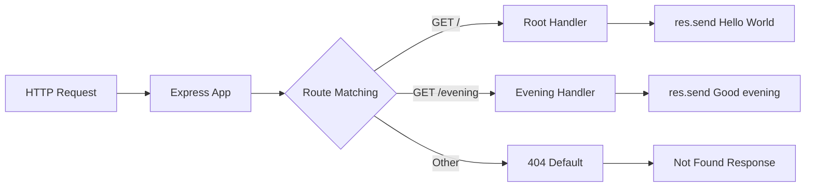

# Technical Specification

# 0. Agent Action Plan

## 0.1 Intent Clarification

### 0.1.1 Core Feature Objective

Based on the prompt, the Blitzy platform understands that the new feature requirement is to:

- **Integrate Express.js Framework**: Add the Express.js web framework to an existing Node.js server project to replace or augment the native HTTP module implementation
- **Add New API Endpoint**: Create an additional endpoint `/evening` that returns the response "Good evening"
- **Preserve Existing Functionality**: Maintain the existing "Hello World" endpoint functionality at the root path `/`

**Implicit Requirements Detected:**
- The project requires Express.js as a dependency to be added to `package.json`
- The server implementation in `server.js` must be refactored to use Express routing patterns
- The server should maintain its current hostname (127.0.0.1) and port (3000) configuration
- Both endpoints must be accessible via HTTP GET requests

**Feature Dependencies and Prerequisites:**
- Node.js runtime version 18 or higher (Express.js 5.x requirement)
- npm package manager for dependency installation
- Express.js package (version ^5.1.0)

### 0.1.2 Special Instructions and Constraints

**Architectural Requirements:**
- Use Express.js application factory pattern (`const app = express()`)
- Implement routes using `app.get()` method
- Use `app.listen()` for server binding
- Maintain simple, tutorial-level code structure without middleware complexity

**Integration Directives:**
- Replace native `http` module usage with Express.js patterns
- Keep response format as plain text strings
- Ensure server startup logs indicate the running address

**User Example Preserved:**
```
User Example: 
Endpoint GET / → Response: "Hello world"
Endpoint GET /evening → Response: "Good evening"
```

**Web Search Requirements Conducted:**
- Express.js 5.1.0 compatibility with Node.js versions
- Express.js routing best practices
- Express.js application setup patterns

### 0.1.3 Technical Interpretation

These feature requirements translate to the following technical implementation strategy:

- **To integrate Express.js**, we will add `express` as a dependency in `package.json` and refactor `server.js` to use Express application patterns
- **To add the /evening endpoint**, we will create a new route handler using `app.get('/evening', ...)` that sends the response "Good evening"
- **To preserve Hello World functionality**, we will ensure the root route `/` returns "Hello, World!" using Express response methods
- **To maintain server configuration**, we will configure Express to listen on hostname `127.0.0.1` and port `3000`

| Requirement | Technical Action | Target Component |
|-------------|------------------|------------------|
| Add Express.js | Install dependency, refactor server | `package.json`, `server.js` |
| /evening endpoint | Add route handler | `server.js` |
| Preserve Hello World | Maintain root route | `server.js` |
| Server binding | Configure app.listen() | `server.js` |

## 0.2 Repository Scope Discovery

### 0.2.1 Comprehensive File Analysis

**Existing Repository Structure:**

| File Path | Type | Purpose | Modification Required |
|-----------|------|---------|----------------------|
| `server.js` | Source | Main application entrypoint and server implementation | MODIFY |
| `package.json` | Config | NPM manifest with dependencies and scripts | MODIFY |
| `package-lock.json` | Lock | Dependency lockfile for reproducible installs | AUTO-REGENERATE |
| `.gitignore` | Config | Git ignore patterns (node_modules/, .env, logs/) | NO CHANGE |
| `README.md` | Docs | Project documentation | OPTIONAL UPDATE |
| `blitzy/documentation/*.md` | Docs | Technical specifications and project guides | NO CHANGE |

**Search Patterns Applied:**
- Source modules: `*.js` → Found: `server.js`
- Configuration files: `*.json` → Found: `package.json`, `package-lock.json`
- Documentation: `*.md` → Found: `README.md`, `blitzy/documentation/*.md`
- Build/deployment files: `Dockerfile*`, `.github/workflows/*` → None found

### 0.2.2 Integration Point Discovery

**API Endpoints Affected:**

| Endpoint | Method | Current State | Action Required |
|----------|--------|---------------|-----------------|
| `GET /` | HTTP GET | Returns "Hello, World!" | Maintain using Express |
| `GET /evening` | HTTP GET | Does not exist | CREATE new route |

**Server Configuration Touchpoints:**
- Hostname binding: `127.0.0.1` (maintained)
- Port configuration: `3000` (maintained)
- Server startup: `app.listen()` method

**Database/Schema Updates:**
- None required - this is a stateless server tutorial

### 0.2.3 Web Search Research Conducted

**Express.js 5.1.0 Compatibility Research:**
- Express.js 5.x requires Node.js 18 or higher
- Express 5.1.0 is the current latest stable release (tagged `latest` on npm as of March 2025)
- Enhanced async error handling with automatic promise rejection forwarding
- Updated `path-to-regexp` library for improved route security

**Best Practices Identified:**
- Use `const app = express()` factory pattern
- Implement routes using HTTP verb methods (`app.get()`, `app.post()`)
- Use `res.send()` for sending plain text responses
- Server binding via `app.listen(port, hostname, callback)`

### 0.2.4 New File Requirements

**New Source Files to Create:**
- None required - all functionality can be implemented in existing `server.js`

**New Test Files to Create:**
- `tests/server.test.js` - Unit tests for endpoint responses (OPTIONAL)
- `tests/integration/api.test.js` - Integration test for API behavior (OPTIONAL)

**New Configuration Files:**
- None required - Express configuration embedded in `server.js`

### 0.2.5 File Inventory Summary

**Files Requiring Modification:**

```
./
├── server.js           # MODIFY: Add Express routing for both endpoints
├── package.json        # MODIFY: Add express dependency
├── package-lock.json   # AUTO: Regenerated on npm install
├── .gitignore          # NO CHANGE: Already ignores node_modules
├── README.md           # OPTIONAL: Update with endpoint documentation
└── blitzy/
    └── documentation/  # NO CHANGE: Reference documentation
        ├── Project Guide.md
        └── Technical Specifications.md
```

**Total Files in Scope:** 3 required modifications (`server.js`, `package.json`, `package-lock.json`)

## 0.3 Dependency Inventory

### 0.3.1 Private and Public Packages

**Key Packages Relevant to This Feature Addition:**

| Registry | Package Name | Version | Purpose |
|----------|--------------|---------|---------|
| npm (public) | express | ^5.1.0 | Web application framework for Node.js |
| npm (public) | accepts | 2.0.0 | Content negotiation (transitive) |
| npm (public) | body-parser | 2.2.0 | Request body parsing middleware (transitive) |
| npm (public) | content-type | 1.0.5 | MIME content-type parsing (transitive) |
| npm (public) | cookie | 0.7.2 | Cookie parsing (transitive) |
| npm (public) | debug | 4.4.3 | Debug logging utility (transitive) |
| npm (public) | finalhandler | 2.1.0 | Final HTTP response handler (transitive) |
| npm (public) | mime-types | 3.0.1 | MIME type utilities (transitive) |
| npm (public) | path-to-regexp | 8.x | Route path matching (transitive) |
| npm (public) | qs | 6.14.0 | Query string parsing (transitive) |
| npm (public) | raw-body | 3.0.1 | Raw request body parsing (transitive) |

**Dependency Installation Command:**
```bash
npm install express@^5.1.0
```

**Environment Requirements:**
- Node.js: >= 18.0.0 (required by Express 5.x)
- npm: >= 8.x (recommended)

### 0.3.2 Dependency Updates

**Import Updates Required:**

| File Pattern | Old Import | New Import |
|--------------|------------|------------|
| `server.js` | `const http = require('http');` | `const express = require('express');` |

**Import Transformation Example:**
```javascript
// Old (native http):
const http = require('http');
const server = http.createServer(handler);

// New (Express.js):
const express = require('express');
const app = express();
```

**Files Requiring Import Updates:**
- `server.js` - Primary and only source file requiring import changes

### 0.3.3 External Reference Updates

**Configuration Files:**

| File | Update Required |
|------|-----------------|
| `package.json` | Add `"express": "^5.1.0"` to dependencies |
| `package-lock.json` | Auto-regenerated by npm |

**package.json Dependency Block (Final State):**
```json
{
  "dependencies": {
    "express": "^5.1.0"
  }
}
```

**Build Files:**
- No `setup.py`, `pyproject.toml` (not a Python project)
- No CI/CD files (`.github/workflows/*.yml`) present in repository

### 0.3.4 Transitive Dependency Summary

**Express 5.1.0 Dependency Tree (68 packages total):**

The Express.js framework brings 68 transitive dependencies, including:
- HTTP utilities: `accepts`, `content-disposition`, `content-type`, `cookie`, `cookie-signature`
- Body parsing: `body-parser`, `raw-body`, `bytes`, `iconv-lite`
- Routing: `path-to-regexp`, `router`
- Response handling: `send`, `serve-static`, `finalhandler`
- Security: `encodeurl`, `escape-html`, `etag`
- Debugging: `debug`, `ms`

**Security Audit Results:**
```bash
npm audit
# 1 moderate severity vulnerability (as of installation)
# Recommendation: Run npm audit fix for remediation
```

**Version Pinning Strategy:**
- Use caret (`^5.1.0`) for Express to allow minor/patch updates
- Lockfile (`package-lock.json`) ensures reproducible installs

## 0.4 Integration Analysis

### 0.4.1 Existing Code Touchpoints

**Direct Modifications Required:**

| File | Location | Modification Description |
|------|----------|-------------------------|
| `server.js` | Line 1 | Replace/add Express.js require statement |
| `server.js` | Line 6 | Initialize Express application with `express()` |
| `server.js` | Lines 8-10 | Convert root endpoint to Express route handler |
| `server.js` | Lines 12-14 | Add new `/evening` route handler |
| `server.js` | Lines 16-18 | Use `app.listen()` for server binding |

**Integration Points in server.js:**

```javascript
// Line 1: Framework import
const express = require('express');

// Line 6: Application initialization
const app = express();

// Lines 8-10: Root endpoint handler
app.get('/', (req, res) => {
  res.send('Hello, World!\n');
});

// Lines 12-14: Evening endpoint handler (NEW)
app.get('/evening', (req, res) => {
  res.send('Good evening');
});

// Lines 16-18: Server binding
app.listen(port, hostname, () => {
  console.log(`Server running at http://${hostname}:${port}/`);
});
```

### 0.4.2 Dependency Injections

**Service Registration:**
- Not applicable - this is a minimal tutorial project without dependency injection patterns

**Configuration Dependencies:**
- `hostname` constant: `'127.0.0.1'`
- `port` constant: `3000`

**Environment Variables Available:**
- `DB` - Database connection (available but not used in current scope)
- `Host` - Host configuration (available but not used in current scope)

### 0.4.3 Database/Schema Updates

**Database Changes Required:**
- None - this is a stateless HTTP server tutorial

**Migration Files:**
- Not applicable

**Schema Modifications:**
- Not applicable

### 0.4.4 Request/Response Flow

**Request Processing Integration:**


```mermaid
graph LR
    A[HTTP Request] --> B[Express App]
    B --> C{Route Matching}
    C -->|GET /| D[Root Handler]
    C -->|GET /evening| E[Evening Handler]
    C -->|Other| F[404 Default]
    D --> G[res.send Hello World]
    E --> H[res.send Good evening]
    F --> I[Not Found Response]
```

**Route Registration Order:**
1. `GET /` - Returns "Hello, World!\n"
2. `GET /evening` - Returns "Good evening"
3. Unmatched routes - Express default 404 handling

### 0.4.5 Server Lifecycle Integration

**Startup Sequence:**
1. Load Express framework via `require('express')`
2. Create application instance via `express()`
3. Register route handlers via `app.get()`
4. Bind server via `app.listen()`
5. Output startup log message

**Shutdown Considerations:**
- Current implementation: No graceful shutdown handling
- Express default behavior on process termination

### 0.4.6 External Service Dependencies

| Service | Integration Point | Status |
|---------|-------------------|--------|
| Database | None | Not Required |
| Cache | None | Not Required |
| Message Queue | None | Not Required |
| External API | None | Not Required |

**Network Binding:**
- Protocol: HTTP (not HTTPS)
- Address: `127.0.0.1:3000` (localhost only)
- For external access: Change hostname to `0.0.0.0`

## 0.5 Technical Implementation

### 0.5.1 File-by-File Execution Plan

**CRITICAL: Every file listed here MUST be created or modified**

**Group 1 - Dependency Configuration:**

| Action | File | Implementation Details |
|--------|------|------------------------|
| MODIFY | `package.json` | Add Express dependency to dependencies object |
| AUTO | `package-lock.json` | Regenerated automatically on `npm install` |

**package.json Modification:**
```json
{
  "dependencies": {
    "express": "^5.1.0"
  }
}
```

**Group 2 - Core Application Files:**

| Action | File | Implementation Details |
|--------|------|------------------------|
| MODIFY | `server.js` | Refactor to use Express.js framework |

**server.js Implementation (Complete File):**
```javascript
const express = require('express');
const hostname = '127.0.0.1';
const port = 3000;
const app = express();

app.get('/', (req, res) => {
  res.send('Hello, World!\n');
});

app.get('/evening', (req, res) => {
  res.send('Good evening');
});

app.listen(port, hostname, () => {
  console.log(`Server running at http://${hostname}:${port}/`);
});
```

**Group 3 - Documentation (Optional):**

| Action | File | Implementation Details |
|--------|------|------------------------|
| OPTIONAL | `README.md` | Add endpoint documentation |

### 0.5.2 Implementation Approach per File

**Step 1: Install Express Dependency**
```bash
npm install express@^5.1.0
```
This command:
- Adds `express` to `package.json` dependencies
- Downloads Express and 68 transitive packages
- Regenerates `package-lock.json` with pinned versions

**Step 2: Modify server.js**

| Line | Change Type | Description |
|------|-------------|-------------|
| 1 | Replace | Change from `http` to `express` require |
| 6 | Add | Initialize Express app with `express()` |
| 8-10 | Modify | Convert root handler to Express route |
| 12-14 | Add | Create new `/evening` route handler |
| 16-18 | Modify | Use `app.listen()` instead of `server.listen()` |

**Step 3: Validate Implementation**
```bash
# Start server
npm start
# Or directly:
node server.js

#### Test endpoints
curl http://127.0.0.1:3000/
#### Expected: Hello, World!

curl http://127.0.0.1:3000/evening
# Expected: Good evening
```

### 0.5.3 Code Transformation Summary

**Before (Native HTTP - if applicable):**
```javascript
const http = require('http');
const server = http.createServer((req, res) => {
  res.end('Hello, World!\n');
});
server.listen(port, hostname);
```

**After (Express.js):**
```javascript
const express = require('express');
const app = express();
app.get('/', (req, res) => res.send('Hello, World!\n'));
app.get('/evening', (req, res) => res.send('Good evening'));
app.listen(port, hostname);
```

### 0.5.4 Validation Commands

**Automated Validation Script:**
```bash
#!/bin/bash
# Start server in background
node server.js &
SERVER_PID=$!
sleep 2

#### Test endpoints
HELLO=$(curl -s http://127.0.0.1:3000/)
EVENING=$(curl -s http://127.0.0.1:3000/evening)

#### Validate responses
[ "$HELLO" = "Hello, World!" ] && echo "✓ Root endpoint OK"
[ "$EVENING" = "Good evening" ] && echo "✓ Evening endpoint OK"

#### Cleanup
kill $SERVER_PID
```

**Expected Console Output on Startup:**
```
Server running at http://127.0.0.1:3000/
```

### 0.5.5 Implementation Checklist

- [ ] Run `npm install express@^5.1.0`
- [ ] Verify `package.json` has Express dependency
- [ ] Verify `package-lock.json` is regenerated
- [ ] Update `server.js` with Express implementation
- [ ] Start server with `npm start` or `node server.js`
- [ ] Validate `GET /` returns "Hello, World!"
- [ ] Validate `GET /evening` returns "Good evening"
- [ ] Run `npm audit` to check for vulnerabilities

## 0.6 Scope Boundaries

### 0.6.1 Exhaustively In Scope

**Source Files:**

| Pattern | Files Matched | Purpose |
|---------|---------------|---------|
| `server.js` | `server.js` | Main application entry point - Express integration |

**Configuration Files:**

| Pattern | Files Matched | Purpose |
|---------|---------------|---------|
| `package.json` | `package.json` | Add Express dependency |
| `package-lock.json` | `package-lock.json` | Auto-regenerated lockfile |

**Documentation Files (Optional Updates):**

| Pattern | Files Matched | Purpose |
|---------|---------------|---------|
| `README.md` | `README.md` | Project documentation update |

**Complete In-Scope File List:**

```
./
├── server.js                  # MODIFY: Express.js integration
├── package.json               # MODIFY: Add express dependency
├── package-lock.json          # AUTO: Regenerated on npm install
└── README.md                  # OPTIONAL: Documentation update
```

**API Endpoints In Scope:**

| Method | Path | Response | Status |
|--------|------|----------|--------|
| GET | `/` | "Hello, World!\n" | MAINTAIN |
| GET | `/evening` | "Good evening" | CREATE |

**Integration Points In Scope:**

| Component | File | Line Range |
|-----------|------|------------|
| Express require | `server.js` | Line 1 |
| App initialization | `server.js` | Line 6 |
| Root route handler | `server.js` | Lines 8-10 |
| Evening route handler | `server.js` | Lines 12-14 |
| Server listener | `server.js` | Lines 16-18 |

### 0.6.2 Explicitly Out of Scope

**Features NOT Included:**

| Category | Item | Reason |
|----------|------|--------|
| Middleware | Error handling middleware | Not required for basic tutorial |
| Middleware | Request logging middleware | Out of scope for this feature |
| Middleware | Body parsing middleware | No POST endpoints needed |
| Security | HTTPS/TLS configuration | Tutorial uses HTTP only |
| Security | Helmet.js integration | Production hardening not requested |
| Security | Rate limiting | Not requested |
| Database | Database integration | Tutorial is stateless |
| Database | Model definitions | No data persistence required |
| Testing | Unit test files | Not explicitly requested |
| Testing | Integration test files | Not explicitly requested |
| CI/CD | GitHub Actions workflows | No CI/CD present |
| CI/CD | Docker configuration | No containerization present |
| Documentation | API documentation (OpenAPI) | Not requested |
| Documentation | JSDoc comments | Not requested |

**Architectural Boundaries:**

| In Scope | Out of Scope |
|----------|--------------|
| Single Express app | Microservices architecture |
| Two GET endpoints | POST/PUT/DELETE endpoints |
| Plain text responses | JSON API responses |
| Localhost binding | External network exposure |
| Development setup | Production deployment |

**Files Explicitly NOT Modified:**

| File | Reason |
|------|--------|
| `.gitignore` | Already configured correctly |
| `blitzy/documentation/*.md` | Reference documentation only |

### 0.6.3 Boundary Justification

**Why These Boundaries:**

- **Scope Constraint**: User requested a tutorial-level feature addition (Express + one endpoint)
- **Simplicity Principle**: Keep implementation minimal and focused
- **Tutorial Context**: This is a learning project, not a production application
- **Feature Completeness**: The two endpoints fully satisfy the stated requirements

**Future Expansion Points (Not In Current Scope):**

- Additional HTTP methods (POST, PUT, DELETE)
- JSON response formatting
- Request body parsing
- Error handling middleware
- Logging middleware
- Environment-based configuration
- Test coverage
- Docker containerization
- CI/CD pipeline setup

## 0.7 Special Instructions

### 0.7.1 Feature-Specific Requirements

**Patterns and Conventions to Follow:**

| Convention | Implementation |
|------------|----------------|
| Framework Pattern | Express.js application factory pattern |
| Route Definition | Use `app.get(path, handler)` syntax |
| Response Method | Use `res.send()` for plain text responses |
| Server Binding | Use `app.listen(port, hostname, callback)` |
| Code Style | CommonJS modules (`require`/`module.exports`) |

**Express.js Best Practices Applied:**

- Single responsibility for route handlers
- Synchronous handlers (no async required for static responses)
- Clear route path definitions
- Console logging for server startup confirmation

### 0.7.2 Integration Requirements with Existing Features

**Existing Feature Preservation:**

| Feature | Requirement | Verification |
|---------|-------------|--------------|
| Hello World endpoint | Must return exact string "Hello, World!\n" | `curl http://127.0.0.1:3000/` |
| Server binding | Must bind to 127.0.0.1:3000 | Server startup log message |
| npm start script | Must work with `npm start` | Script runs `node server.js` |

**New Feature Addition:**

| Feature | Requirement | Verification |
|---------|-------------|--------------|
| Evening endpoint | Must return exact string "Good evening" | `curl http://127.0.0.1:3000/evening` |
| Route method | Must be HTTP GET | Respond only to GET requests |

### 0.7.3 Performance and Scalability Considerations

**Current State (Tutorial Level):**
- Single-threaded Node.js process
- Synchronous request handling
- No connection pooling
- No caching mechanisms

**Not Required for This Implementation:**
- Clustering (multiple processes)
- Load balancing
- Response caching
- Connection keep-alive tuning

### 0.7.4 Security Requirements

**Minimal Security (Tutorial Appropriate):**

| Aspect | Current State | Production Recommendation |
|--------|---------------|---------------------------|
| HTTPS | Not implemented | Add TLS/reverse proxy |
| Headers | Express defaults | Add Helmet.js |
| Rate Limiting | None | Add express-rate-limit |
| Input Validation | Not needed (no input) | Validate all inputs |

**Note:** As a tutorial project, security hardening is out of scope but documented for future reference.

### 0.7.5 Environment Configuration

**Available Environment Variables:**

| Variable | Value | Usage |
|----------|-------|-------|
| `DB` | (Set in environment) | Not used in current scope |
| `Host` | (Set in environment) | Not used in current scope |

**Hardcoded Configuration (Tutorial Simplicity):**
```javascript
const hostname = '127.0.0.1';  // Localhost binding
const port = 3000;             // HTTP port
```

**Production Recommendation (Future):**
```javascript
const hostname = process.env.HOST || '0.0.0.0';
const port = process.env.PORT || 3000;
```

### 0.7.6 Validation Criteria

**Acceptance Tests:**

| Test | Command | Expected Result |
|------|---------|-----------------|
| Server starts | `node server.js` | Console: "Server running at http://127.0.0.1:3000/" |
| Root endpoint | `curl http://127.0.0.1:3000/` | Response: "Hello, World!" |
| Evening endpoint | `curl http://127.0.0.1:3000/evening` | Response: "Good evening" |
| Dependencies install | `npm install` | 68 packages installed, 0 critical vulnerabilities |
| npm start works | `npm start` | Server starts successfully |

### 0.7.7 Node.js Version Requirement

**Compatibility Matrix:**

| Component | Minimum Version | Recommended Version | Current Environment |
|-----------|-----------------|---------------------|---------------------|
| Node.js | 18.0.0 | 20.x LTS | v20.19.6 ✓ |
| npm | 8.0.0 | 10.x | v11.1.0 ✓ |
| Express.js | 5.0.0 | ^5.1.0 | 5.1.0 ✓ |

**Version Verification Command:**
```bash
node --version  # Expected: v18+ or v20+
npm --version   # Expected: v8+ or v10+
npm list express # Expected: express@5.1.0
```

