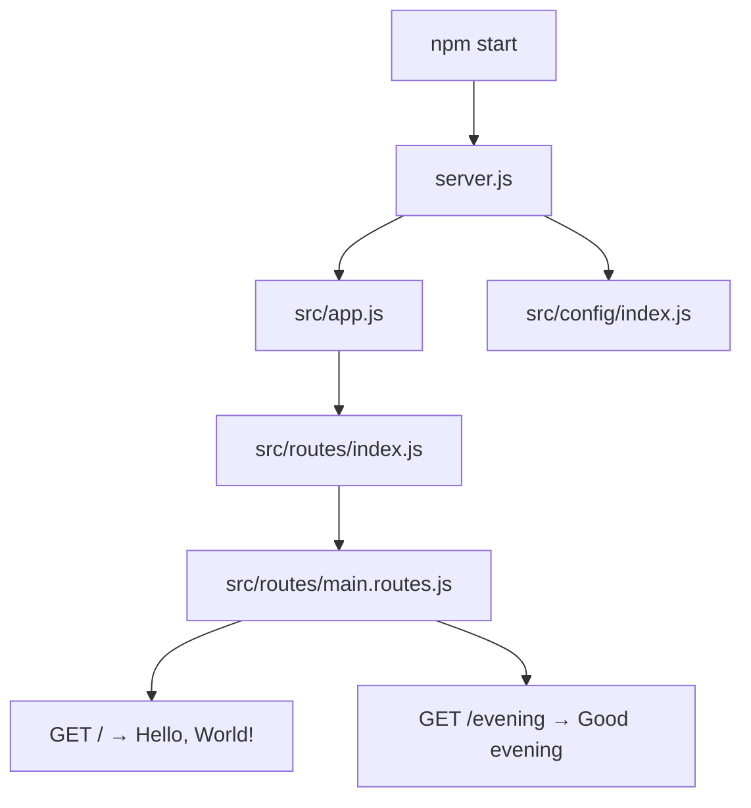
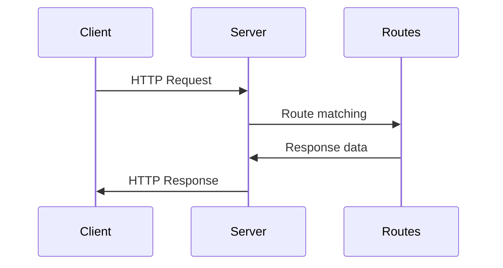

# Agent Action Plan

# 0. Agent Action Plan
## 0.1 Intent Clarification

Based on the provided requirements, the Blitzy platform understands that the documentation objective is to **enhance code documentation and create comprehensive project documentation** for a minimal Node.js + Express.js tutorial server.

### 0.1.1 Core Documentation Objective Analysis

**Documentation Category:** Create new documentation + Update existing documentation

**Documentation Types Required:**

- JSDoc comments (inline code documentation)
- README file (comprehensive project documentation)
- API documentation
- Setup/installation guide
- Deployment guide
- Code explanations (inline comments)

| Requirement | Interpretation | Action |
| --- | --- | --- |
| Add JSDoc comments to server.js functions | Enhance existing JSDoc comments with comprehensive function-level documentation for all modules | UPDATE existing JSDoc |
| Create comprehensive README | Replace minimal [README.md](http://README.md) with full project documentation | CREATE new [README.md](http://README.md) |
| Setup instructions | Document installation, configuration, and startup procedures | CREATE in [README.md](http://README.md) |
| API documentation | Document all HTTP endpoints with request/response examples | CREATE in [README.md](http://README.md) |
| Deployment guide | Document production deployment considerations | CREATE in [README.md](http://README.md) |
| Inline code explanations | Add contextual comments explaining code logic | UPDATE source files |

### 0.1.2 Technical Interpretation

These documentation requirements translate to the following technical documentation strategy:

- To **document server.js functions**, we will enhance JSDoc comments in `server.js` to include `@function`, `@param`, `@returns`, `@example`, and `@fires` annotations where applicable
- To **document the Express app factory**, we will enhance JSDoc in `src/app.js` with module-level and middleware documentation
- To **document routes**, we will enhance JSDoc in `src/routes/main.routes.js` with route annotations including HTTP method, path, request/response types
- To **document configuration**, we will enhance JSDoc in `src/config/index.js` with environment variable documentation
- To **create comprehensive README**, we will replace `README.md` with structured documentation following best practices

### 0.1.3 Inferred Documentation Needs

Based on code analysis and documentation best practices:

- **Module documentation gaps:** While modules have JSDoc headers, they lack:

  - `@example` tags showing usage patterns
  - `@see` tags linking related modules
  - `@requires` tags documenting dependencies

- **Route documentation gaps:** Route handlers need:

  - HTTP method and path annotations
  - Response content-type documentation
  - Example curl commands

- **Configuration documentation needs:**

  - Environment variable table
  - Default value documentation
  - Production vs development settings

- **README must include:**

  - Project overview and purpose
  - Prerequisites (Node.js &gt;= 20.19.x, npm &gt;= 10.8.x)
  - Installation steps
  - Environment configuration
  - Running the server
  - API endpoint reference
  - Deployment guide for production
  - Contributing guidelines
  - License information

### 0.1.4 Special Instructions and Constraints

**User Requirements (Exact):**

> "Add JSDoc comments to server.js functions, create a comprehensive README with setup instructions, API documentation, deployment guide, and inline code explanations."

**Constraints Identified:**

- Maintain existing modular architecture
- Preserve exact route response strings (`'Hello, World!\n'` and `'Good evening'`)
- Follow existing JSDoc style patterns already present in codebase
- Keep tutorial-friendly, beginner-accessible documentation
- Use Markdown format for [README.md](http://README.md)

**Style Preferences:**

- Use JSDoc 3 syntax for JavaScript documentation
- Follow Express.js documentation conventions
- Include practical examples and curl commands
- Maintain consistent voice and technical depth

## 0.2 Documentation Discovery and Analysis

### 0.2.1 Existing Documentation Infrastructure Assessment

Repository analysis reveals a **minimal documentation structure** with existing JSDoc patterns in source files but insufficient user-facing documentation.

**Search Patterns Employed:**

- README\*, docs/\*\*, \*.md, \*.mdx - Found: `README.md`, `blitzy/documentation/*.md`
- Documentation generators (mkdocs.yml, docusaurus.config.js) - None found
- Existing JSDoc comments - Found in all 5 JavaScript source files
- Style guides and templates - None found

**Documentation Discovery Results:**

| File/Location | Type | Status | Content |
| --- | --- | --- | --- |
| `README.md` | Project README | Minimal | 2 lines - placeholder text only |
| `blitzy/documentation/Project Guide.md` | Project guide | Complete | Comprehensive validation and setup |
| `blitzy/documentation/Technical Specifications.md` | Tech spec | Complete | Technical implementation details |
| `server.js` | JSDoc | Partial | Module header present, no function-level docs |
| `src/app.js` | JSDoc | Partial | Module header and route mounting comment |
| `src/config/index.js` | JSDoc | Good | Module header + property-level docs |
| `src/routes/index.js` | JSDoc | Partial | Module header only |
| `src/routes/main.routes.js` | JSDoc | Good | Module header + route handler docs |

**Documentation Infrastructure:**

- Current documentation framework: None (raw Markdown only)
- API documentation tools: JSDoc comments in source files
- Diagram tools: Mermaid (used in blitzy/documentation/)
- Documentation hosting: None configured

### 0.2.2 Repository Code Analysis for Documentation

**Source Files Requiring Documentation Enhancement:**

| File | Lines | Public APIs | Current JSDoc | Documentation Needed |
| --- | --- | --- | --- | --- |
| `server.js` | 23 | `app.listen()` callback | Module header only | Add `@example`, enhance callback docs |
| `src/app.js` | 27 | Express app export | Module header | Add `@exports`, `@requires`, `@example` |
| `src/config/index.js` | 41 | `host`, `port`, `env` exports | Complete | Add `@example` usage |
| `src/routes/index.js` | 19 | `mainRoutes` export | Module header | Add `@exports`, barrel pattern docs |
| `src/routes/main.routes.js` | 41 | `GET /`, `GET /evening` | Good | Enhance with `@example`, response docs |

**Key Directories Examined:**

- `/` - Root directory with entry point and package files
- `src/` - Application source with modular architecture
- `src/config/` - Environment configuration module
- `src/routes/` - Express routing surface
- `blitzy/documentation/` - Existing specification documents

### 0.2.3 Web Search Research Conducted

**JSDoc Best Practices for Node.js/Express:**

- JSDoc comments should be placed immediately before the code being documented
- Each comment must start with `/**` sequence to be recognized by the parser
- Use `@module` tag for CommonJS modules
- Use `@param {express.Request}`, `@param {express.Response}` for Express handlers
- Include `@example` tags for practical usage demonstrations
- Document routes with `@route` or custom tags showing HTTP method and path

**README Best Practices:**

- Include badges (license, version, build status)
- Start with clear project description
- Provide quick start section
- Document all prerequisites
- Include API reference with examples
- Add deployment/production guide
- Include contributing guidelines

### 0.2.4 Current README Content

**File:** `README.md`

```plaintext
# hao-backprop-test
test project for backprop integration. Do not touch!
```

**Assessment:** This README is a placeholder that does not serve documentation purposes. It requires complete replacement with comprehensive documentation covering:

- Project identity and purpose
- Installation and setup
- Configuration options
- API documentation
- Deployment guidance
- License and contribution information

## 0.3 Documentation Scope Analysis

### 0.3.1 Code-to-Documentation Mapping

**Modules Requiring Documentation:**

**Module:** `server.js` **(HTTP Server Entry Point)**

- Public APIs: `app.listen()` invocation with callback
- Current documentation: Module-level JSDoc header (lines 1-16)
- Documentation needed:
  - Enhanced `@example` showing how to start the server
  - Server startup flow explanation
  - Environment variable usage for `HOST` and `PORT`
  - Callback function documentation

**Module:** `src/app.js` **(Express Application Factory)**

- Public APIs: Exported `app` Express instance
- Current documentation: Module-level JSDoc (lines 1-12), route mounting comment (lines 19-24)
- Documentation needed:
  - `@exports` tag documenting the Express app export
  - `@requires` tags for express and routes dependencies
  - `@example` showing how to import and use the app
  - Middleware chain documentation

**Module:** `src/config/index.js` **(Configuration Module)**

- Public APIs: `host`, `port`, `env` exports
- Current documentation: Good - has module header and property-level JSDoc
- Documentation needed:
  - `@example` showing configuration usage
  - Environment variable cross-reference
  - Default value behavior explanation

**Module:** `src/routes/index.js` **(Route Aggregator)**

- Public APIs: `mainRoutes` export
- Current documentation: Module-level JSDoc (lines 1-13)
- Documentation needed:
  - `@exports` tag for named export pattern
  - `@example` showing consumption in app.js
  - Barrel pattern explanation

**Module:** `src/routes/main.routes.js` **(Route Handlers)**

- Endpoints:
  - `GET /` - Returns `'Hello, World!\n'`
  - `GET /evening` - Returns `'Good evening'`
- Current documentation: Good - has module header and route handler docs
- Documentation needed:
  - `@example` with curl commands
  - Response Content-Type documentation
  - Status code documentation

### 0.3.2 Configuration Documentation Requirements

**Configuration File:** `src/config/index.js`

| Option | Environment Variable | Type | Default | Documented |
| --- | --- | --- | --- | --- |
| `host` | `HOST` | string | `'127.0.0.1'` | ✅ Yes |
| `port` | `PORT` | number | `3000` | ✅ Yes |
| `env` | `NODE_ENV` | string | `'development'` | ✅ Yes |

**Missing Documentation:**

- Production configuration recommendations
- Docker/container environment considerations
- Security implications of binding to `0.0.0.0` vs `127.0.0.1`

### 0.3.3 Features Requiring User Guides

| Feature | Current Coverage | Gaps |
| --- | --- | --- |
| Server Startup | Basic in code comments | No README section, no troubleshooting |
| API Endpoints | Route handler JSDoc | No user-facing API reference |
| Configuration | JSDoc in config module | No README section, no examples |
| Deployment | None | No deployment guide exists |

### 0.3.4 Documentation Gap Analysis

Given the requirements and repository analysis, documentation gaps include:

**Critical Gaps (Must Address):**

- `README.md` - Completely inadequate, needs full rewrite
- API endpoint documentation for end users
- Setup and installation instructions
- Deployment guide

**JSDoc Enhancement Gaps:**

- Missing `@example` tags in all modules
- Missing `@requires` and `@see` cross-references
- No inline code explanations for complex logic
- Missing response type documentation for routes

**Structural Gaps:**

- No table of contents in any documentation
- No quick-start section
- No troubleshooting guide
- No contribution guidelines

## 0.4 Documentation Implementation Design

### 0.4.1 Documentation Structure Planning

**Target [README.md](http://README.md) Structure:**

```plaintext
README.md
├── Title and Badges
├── Description
├── Table of Contents
├── Prerequisites
├── Installation
│   ├── Clone Repository
│   ├── Install Dependencies
│   └── Verify Installation
├── Configuration
│   ├── Environment Variables
│   └── Default Values
├── Usage
│   ├── Start Server
│   └── Test Endpoints
├── API Reference
│   ├── GET /
│   └── GET /evening
├── Project Structure
├── Deployment Guide
│   ├── Production Configuration
│   ├── Docker Deployment
│   └── Process Management
├── Contributing
├── License
└── Acknowledgments
```

**JSDoc Enhancement Structure Per Module:**

```javascript
/**
 * @module module-name
 * @description Module purpose and responsibility
 * @requires dependency-list
 * @see related-modules
 * @example
 * // Usage example
 */
```

### 0.4.2 Content Generation Strategy

**Information Extraction Approach:**

- Extract API signatures from `src/routes/main.routes.js` using code parsing
- Extract configuration options from `src/config/index.js`
- Generate examples by analyzing existing verification in `blitzy/documentation/`
- Create diagrams by mapping component relationships in `src/`

**Documentation Standards:**

- Markdown formatting with proper headers (`#`, `##`, `###`)
- Code examples using triple backticks with language identifiers
- Tables for configuration options and API parameters
- Source citations as inline references: `Source: /path/to/file.js:LineNumber`
- Consistent terminology following existing codebase patterns

### 0.4.3 JSDoc Enhancement Patterns

**For Server Entry Point (**`server.js`**):**

```javascript
/**
 * @module server
 * @requires ./src/app
 * @requires ./src/config
 * @example
 * // Start the server
 * npm start
 * // Server running at http://127.0.0.1:3000/
 */
```

**For Express Route Handlers:**

```javascript
/**
 * @route GET /
 * @description Returns Hello World greeting
 * @param {express.Request} req - Express request
 * @param {express.Response} res - Express response
 * @returns {void} Sends 'Hello, World!\n'
 * @example
 * curl http://127.0.0.1:3000/
 * // Response: Hello, World!
 */
```

**For Configuration Properties:**

```javascript
/**
 * @type {number}
 * @default 3000
 * @example
 * // Override port via environment
 * PORT=8080 npm start
 */
```

### 0.4.4 Diagram and Visual Strategy

**Mermaid Diagrams to Create:**

**Application Architecture Diagram (for README):**


```mermaid
graph TD
    A[npm start] --> B[server.js]
    B --> C[src/app.js]
    C --> D[src/routes/index.js]
    D --> E[src/routes/main.routes.js]
    B --> F[src/config/index.js]
    E --> G["GET / → Hello, World!"]
    E --> H["GET /evening → Good evening"]
```

**Request Flow Diagram (for API documentation):**


```mermaid
sequenceDiagram
    participant Client
    participant Server
    participant Routes
    Client->>Server: HTTP Request
    Server->>Routes: Route matching
    Routes->>Server: Response data
    Server->>Client: HTTP Response
```

### 0.4.5 README Content Sections

| Section | Content Source | Format |
| --- | --- | --- |
| Title/Badges | package.json | Markdown shields |
| Description | package.json description | Prose |
| Prerequisites | blitzy/documentation | Table |
| Installation | blitzy/documentation | Numbered steps + code blocks |
| Configuration | src/config/index.js | Table + code examples |
| Usage | Verification commands | Code blocks |
| API Reference | src/routes/main.routes.js | Table + curl examples |
| Project Structure | Directory tree | Code block |
| Deployment | Best practices research | Prose + code |
| License | package.json | Badge + text |

## 0.5 Documentation File Transformation Mapping

### 0.5.1 File-by-File Documentation Plan

**Documentation Transformation Modes:**

- **CREATE** - Create a new documentation file
- **UPDATE** - Update an existing documentation file
- **DELETE** - Remove an obsolete documentation file
- **REFERENCE** - Use as an example for documentation style and structure

| Target Documentation File | Transformation | Source Code/Docs | Content/Changes |
| --- | --- | --- | --- |
| `README.md` | UPDATE | `README.md`, `blitzy/documentation/Project Guide.md` | Complete rewrite with comprehensive documentation including setup, API reference, deployment guide |
| `server.js` | UPDATE | `server.js` | Enhance JSDoc with `@requires`, `@example`, `@fires` tags and inline code explanations |
| `src/app.js` | UPDATE | `src/app.js` | Enhance JSDoc with `@exports`, `@requires`, `@example` tags and middleware documentation |
| `src/config/index.js` | UPDATE | `src/config/index.js` | Add `@example` tags for each property, enhance usage documentation |
| `src/routes/index.js` | UPDATE | `src/routes/index.js` | Add `@exports` tag, barrel pattern documentation, cross-references |
| `src/routes/main.routes.js` | UPDATE | `src/routes/main.routes.js` | Enhance route handlers with `@example` curl commands, response documentation |
| `blitzy/documentation/Project Guide.md` | REFERENCE | N/A | Use as style reference for README structure and content |
| `blitzy/documentation/Technical Specifications.md` | REFERENCE | N/A | Use as technical reference for accurate documentation |

### 0.5.2 New Documentation Files Detail

No new documentation files need to be created. All documentation will be added to existing files or enhance existing content.

### 0.5.3 Documentation Files to Update - Detail

**File:** `README.md` **- Complete Rewrite**

```plaintext
Type: Project README
Source References: 
  - blitzy/documentation/Project Guide.md (structure template)
  - package.json (project metadata)
  - src/config/index.js (configuration docs)
  - src/routes/main.routes.js (API endpoints)
  
Sections:
  - Header with project name, badges (License: MIT)
  - Description: "Hello world in Node.js" Express.js tutorial server
  - Table of Contents with anchor links
  - Prerequisites: Node.js >= 20.19.x, npm >= 10.8.x
  - Installation: Clone, npm install, verify
  - Configuration: HOST, PORT, NODE_ENV environment variables
  - Usage: npm start, curl commands
  - API Reference: GET /, GET /evening with examples
  - Project Structure: Directory tree diagram
  - Deployment Guide: Production considerations, PM2, Docker
  - Contributing: Basic guidelines
  - License: MIT
  
Diagrams:
  - Application architecture (Mermaid flowchart)
  
Key Citations:
  - package.json:1-15 (metadata)
  - src/config/index.js:20-41 (configuration)
  - src/routes/main.routes.js:26-39 (routes)
```

**File:** `server.js` **- JSDoc Enhancement**

```plaintext
Type: JSDoc Enhancement
Current Lines: 23
Target Additions:
  - Line 1-16: Enhance @module with @requires tags
  - Line 18-19: Add @constant tags for imports
  - Line 21-23: Add @fires and @example for listen callback
  - Add inline comments explaining server binding

Example Enhancement:
  /**
   * @module server
   * @requires module:src/app
   * @requires module:src/config
   * @example
   * // Start the server from command line
   * npm start
   * // Output: Server running at http://127.0.0.1:3000/
   */
```

**File:** `src/app.js` **- JSDoc Enhancement**

```plaintext
Type: JSDoc Enhancement
Current Lines: 27
Target Additions:
  - Line 1-12: Add @requires and @exports tags
  - Line 14-15: Add @constant tags for express import
  - Line 17: Add comment explaining app initialization
  - Line 25: Add @middleware documentation

Example Enhancement:
  /**
   * @exports ExpressApplication
   * @requires express
   * @requires module:src/routes
   */
```

**File:** `src/config/index.js` **- JSDoc Enhancement**

```plaintext
Type: JSDoc Enhancement
Current Lines: 41
Target Additions:
  - Lines 26, 33, 40: Add @example tags to each property
  
Example Enhancement:
  /**
   * @example
   * // Override default port
   * process.env.PORT = '8080';
   * const config = require('./src/config');
   * console.log(config.port); // 8080
   */
```

**File:** `src/routes/index.js` **- JSDoc Enhancement**

```plaintext
Type: JSDoc Enhancement
Current Lines: 19
Target Additions:
  - Line 1-13: Add @exports tag documenting barrel export
  - Line 15: Add @see reference to main.routes
  
Example Enhancement:
  /**
   * @exports {Object} routes
   * @property {express.Router} mainRoutes - Main application routes
   * @see module:src/routes/main.routes
   */
```

**File:** `src/routes/main.routes.js` **- JSDoc Enhancement**

```plaintext
Type: JSDoc Enhancement
Current Lines: 41
Target Additions:
  - Lines 19-28: Enhance GET / handler with @example curl
  - Lines 30-39: Enhance GET /evening handler with @example curl
  
Example Enhancement:
  /**
   * @example
   * // Test with curl
   * curl -i http://127.0.0.1:3000/
   * // HTTP/1.1 200 OK
   * // Content-Type: text/html; charset=utf-8
   * // Hello, World!
   */
```

### 0.5.4 Documentation Configuration Updates

No documentation configuration files need to be created or updated as the project uses raw Markdown without a documentation generator.

### 0.5.5 Cross-Documentation Dependencies

| Documentation Element | References | Updates Needed |
| --- | --- | --- |
| [README.md](http://README.md) prerequisites | package.json engines | Verify Node.js version |
| [README.md](http://README.md) API Reference | src/routes/main.routes.js | Keep in sync with routes |
| [README.md](http://README.md) Configuration | src/config/index.js | Mirror environment variables |
| JSDoc @requires tags | Actual require statements | Match import paths |
| JSDoc @example tags | Verification commands | Use tested commands |

## 0.6 Dependency Inventory

### 0.6.1 Documentation Dependencies

This documentation task requires only the existing project dependencies. No additional documentation tools are needed since the project uses:

- Raw Markdown for [README.md](http://README.md)
- JSDoc comments embedded in source files (no JSDoc generator configured)

**Runtime Dependencies (from package.json):**

| Registry | Package Name | Version | Purpose |
| --- | --- | --- | --- |
| npm | express | ^5.1.0 | Web framework - primary subject of documentation |

**Development Environment Requirements:**

| Requirement | Version | Purpose |
| --- | --- | --- |
| Node.js | &gt;= 20.19.x | JavaScript runtime |
| npm | &gt;= 10.8.x | Package manager |
| Git | Any | Version control |
| curl | Any | API endpoint testing (documentation examples) |

**Optional Documentation Tools (Not Required but Recommended for Future):**

| Registry | Package Name | Version | Purpose |
| --- | --- | --- | --- |
| npm | jsdoc | \~4.0.2 | Generate HTML docs from JSDoc comments |
| npm | docdash | \~2.0.2 | JSDoc template for better readability |
| npm | swagger-jsdoc | \~6.2.8 | OpenAPI spec generation from comments |
| npm | swagger-ui-express | \~5.0.0 | Swagger UI for API documentation |

### 0.6.2 Documentation Reference Updates

**Files Requiring Internal Link Updates:**

Since this is a minimal project with no existing internal documentation links, no link transformations are required.

**New Cross-References to Add:**

| File | Cross-Reference | Target |
| --- | --- | --- |
| `server.js` | `@see module:src/app` | Links to app module docs |
| `server.js` | `@see module:src/config` | Links to config module docs |
| `src/app.js` | `@see module:src/routes` | Links to routes module docs |
| `src/routes/index.js` | `@see module:src/routes/main.routes` | Links to main routes docs |
| `README.md` | `[Configuration](#configuration)` | Internal anchor link |
| `README.md` | `[API Reference](#api-reference)` | Internal anchor link |

### 0.6.3 Verified Package Versions

All package versions verified against `package.json` and `package-lock.json`:

```json
{
  "name": "hello_world",
  "version": "1.0.0",
  "dependencies": {
    "express": "^5.1.0"
  }
}
```

**Transitive Dependencies:** 68 packages (per npm audit)

**Known Issues:**

- body-parser@2.2.0 has a moderate DoS vulnerability (documented in blitzy/documentation/)
- Recommendation: Run `npm audit fix` before production deployment

## 0.7 Coverage and Quality Targets

### 0.7.1 Documentation Coverage Metrics

**Current Coverage Analysis:**

| Category | Items | Documented | Coverage | Target |
| --- | --- | --- | --- | --- |
| JavaScript Modules | 5 | 5 | 100% | 100% |
| Module-level JSDoc | 5 | 5 | 100% | 100% |
| Function/Route JSDoc | 3 | 2 | 67% | 100% |
| @example Tags | 5 modules | 0 | 0% | 100% |
| @requires Tags | 4 modules | 0 | 0% | 100% |
| API Endpoints | 2 | 0 (in README) | 0% | 100% |
| Configuration Options | 3 | 0 (in README) | 0% | 100% |
| README Sections | 12 target | 1 | 8% | 100% |

**Coverage Gaps to Address:**

| Module | Current | Target | Focus Areas |
| --- | --- | --- | --- |
| `server.js` | 60% | 100% | Add @example, @requires, inline comments |
| `src/app.js` | 70% | 100% | Add @exports, @requires, @example |
| `src/config/index.js` | 85% | 100% | Add @example for each property |
| `src/routes/index.js` | 65% | 100% | Add @exports, @see cross-references |
| `src/routes/main.routes.js` | 80% | 100% | Add @example curl commands |
| `README.md` | 8% | 100% | Complete rewrite required |

### 0.7.2 Documentation Quality Criteria

**Completeness Requirements:**

| Element | Requirement | Validation |
| --- | --- | --- |
| All modules | Have @module tag | Check first JSDoc block |
| All modules | Have @description | Check JSDoc block content |
| All public exports | Have @exports or documented | Check module.exports |
| All route handlers | Have @route annotation | Check router.get/post calls |
| All config options | Have @type and @default | Check config properties |
| README | Has all 12 sections | Check headers |
| API endpoints | Have request/response examples | Check curl commands |

**Accuracy Validation:**

| Check | Method | Expected Result |
| --- | --- | --- |
| API examples | Execute curl commands | Match documented responses |
| Config defaults | Compare with code | `host='127.0.0.1'`, `port=3000`, `env='development'` |
| Version numbers | Compare with package.json | Node.js &gt;= 20.19.x, npm &gt;= 10.8.x |
| Response strings | Compare with route handlers | `'Hello, World!\n'`, `'Good evening'` |

**Clarity Standards:**

- Technical accuracy with accessible language for tutorial audience
- Progressive disclosure: Quick start → Detailed reference
- Consistent terminology: Use "endpoint" not "route" in user-facing docs
- Code examples must be copy-paste ready
- All commands must include expected output

**Maintainability:**

- Source citations for all technical claims
- Version-specific information clearly marked
- Environment-specific notes (development vs production)
- Update dates in README header

### 0.7.3 Example and Diagram Requirements

**Minimum Examples Per Element:**

| Element | Minimum Examples |
| --- | --- |
| Each API endpoint | 1 curl command + response |
| Each config option | 1 usage example |
| Server startup | 1 npm start example |
| Installation | Step-by-step commands |

**Required Diagrams:**

| Diagram | Type | Purpose |
| --- | --- | --- |
| Application Architecture | Mermaid flowchart | Show module relationships |
| Request Flow | Mermaid sequence | Show HTTP request handling |

**Example Testing Strategy:**

- All curl commands must be verified against running server
- All npm commands must be verified in clean environment
- Response strings must exactly match source code

### 0.7.4 Quality Checklist

- [ ] All JSDoc blocks start with `/**`

- [ ] All @module tags match file paths

- [ ] All @requires tags match actual require statements

- [ ] All @example tags contain tested code

- [ ] README has valid Markdown syntax

- [ ] README anchor links work correctly

- [ ] All code blocks have language identifiers

- [ ] All tables have consistent column widths

- [ ] No broken internal references

- [ ] Response strings exactly match source code

## 0.8 Scope Boundaries

### 0.8.1 Exhaustively In Scope

**Documentation File Updates:**

| File Pattern | Type | Changes |
| --- | --- | --- |
| `README.md` | Project README | Complete rewrite with comprehensive documentation |
| `server.js` | Source file | JSDoc enhancement + inline comments |
| `src/app.js` | Source file | JSDoc enhancement + inline comments |
| `src/config/index.js` | Source file | JSDoc enhancement with @example tags |
| `src/routes/index.js` | Source file | JSDoc enhancement + barrel docs |
| `src/routes/main.routes.js` | Source file | JSDoc enhancement + curl examples |

**Documentation Content Additions:**

- Project title and description
- Table of contents with anchor links
- Prerequisites documentation (Node.js, npm versions)
- Installation instructions (clone, npm install, verify)
- Configuration documentation (environment variables table)
- Usage instructions (start server, test endpoints)
- API reference (GET /, GET /evening with examples)
- Project structure diagram
- Deployment guide (production, Docker, PM2)
- Contributing guidelines
- License information

**JSDoc Enhancements:**

- `@module` tag verification and enhancement
- `@requires` tags for all dependencies
- `@exports` tags for all module exports
- `@example` tags with practical usage
- `@see` tags for cross-references
- `@param` tags for function parameters
- `@returns` tags for return values
- Inline code explanations

**Reference Files (Read-Only):**

| File | Purpose |
| --- | --- |
| `blitzy/documentation/Project Guide.md` | Style and content reference |
| `blitzy/documentation/Technical Specifications.md` | Technical accuracy reference |
| `package.json` | Metadata source |
| `package-lock.json` | Dependency verification |

### 0.8.2 Explicitly Out of Scope

**Source Code Modifications (Logic Changes):**

- ❌ Adding new endpoints or routes
- ❌ Modifying existing route response strings
- ❌ Changing server configuration logic
- ❌ Adding middleware or error handlers
- ❌ Modifying package.json dependencies
- ❌ Changing application architecture

**Test File Modifications:**

- ❌ Creating or modifying test files
- ❌ Setting up test frameworks (Jest, Mocha)
- ❌ Adding test scripts to package.json

**Documentation Generator Setup:**

- ❌ Installing JSDoc generator
- ❌ Creating jsdoc.json configuration
- ❌ Setting up documentation hosting

**External Documentation:**

- ❌ Creating separate API documentation site
- ❌ Creating wiki pages
- ❌ Creating changelog entries

**Existing Blitzy Documentation:**

- ❌ Modifying `blitzy/documentation/Project Guide.md`
- ❌ Modifying `blitzy/documentation/Technical Specifications.md`

**Infrastructure Changes:**

- ❌ Adding CI/CD documentation pipelines
- ❌ Creating Dockerfile
- ❌ Setting up documentation deployment

### 0.8.3 Scope Clarifications

| Item | Status | Rationale |
| --- | --- | --- |
| JSDoc in source files | ✅ IN SCOPE | User explicitly requested JSDoc comments |
| Inline code comments | ✅ IN SCOPE | User requested "inline code explanations" |
| [README.md](http://README.md) | ✅ IN SCOPE | User requested "comprehensive README" |
| API documentation | ✅ IN SCOPE | User explicitly requested |
| Deployment guide | ✅ IN SCOPE | User explicitly requested |
| Setup instructions | ✅ IN SCOPE | User explicitly requested |
| Code logic changes | ❌ OUT OF SCOPE | Documentation-only task |
| New features | ❌ OUT OF SCOPE | Documentation-only task |
| Test framework | ❌ OUT OF SCOPE | Not requested, tutorial scope |

### 0.8.4 Documentation-Only Constraint

This task is strictly documentation-focused:

**Allowed Changes:**

- Adding/modifying JSDoc comment blocks
- Adding/modifying inline code comments
- Rewriting [README.md](http://README.md) content
- Adding Markdown diagrams

**Prohibited Changes:**

- Executable JavaScript code
- Module exports or imports
- Package dependencies
- Configuration values
- Route handlers or responses

## 0.9 Execution Parameters

### 0.9.1 Documentation-Specific Instructions

**Documentation Build Command:**

```bash
# No build required - raw Markdown files
# To preview README.md locally:
cat README.md
# Or use a Markdown viewer
```

**Documentation Preview Command:**

```bash
# Preview README in terminal (with markdown rendering if available)
npx marked README.md
# Or view in browser
# Open README.md in VS Code and use Markdown Preview (Ctrl+Shift+V)
```

**Diagram Generation:**

```bash
# Mermaid diagrams render automatically on GitHub
# For local preview, use mermaid-cli:
npx @mermaid-js/mermaid-cli -i README.md -o preview.md
```

**Documentation Validation:**

```bash
# Validate Markdown syntax
npx markdownlint README.md

#### Check for broken links (if links added)
npx markdown-link-check README.md
```

### 0.9.2 JSDoc Comment Format

**Standard JSDoc Block Structure:**

```javascript
/**
 * Brief description of the element.
 * 
 * Longer description with additional context
 * spanning multiple lines if needed.
 * 
 * @module module-name
 * @requires dependency
 * @exports ExportedItem
 * @see module:related-module
 * 
 * @example
 * // Example usage
 * const result = myFunction();
 */
```

**Route Handler JSDoc Format:**

```javascript
/**
 * Brief description of the endpoint.
 * 
 * @route {METHOD} /path
 * @param {express.Request} req - Request object
 * @param {express.Response} res - Response object
 * @returns {void} Sends response
 * 
 * @example
 * curl http://127.0.0.1:3000/path
 * // Response: Expected output
 */
```

### 0.9.3 README Format Standards

**Document Structure:**

- Use ATX-style headers (`#`, `##`, `###`)
- Maximum heading depth: 3 levels
- One blank line before and after headers
- One blank line before and after code blocks

**Code Block Format:**

```plaintext
    ```language
    code here
    ```
```

**Table Format:**

```plaintext
| Column 1 | Column 2 |
|----------|----------|
| Data 1   | Data 2   |
```

**Badge Format:**

```plaintext

```

### 0.9.4 Verification Commands

**Server Startup Verification:**

```bash
cd /tmp/blitzy/test-spec/blitzy0c2547c18
npm start &
sleep 2
```

**Endpoint Testing (for documentation examples):**

```bash
# Test root endpoint
curl -s http://127.0.0.1:3000/
# Expected: Hello, World!

#### Test evening endpoint
curl -s http://127.0.0.1:3000/evening
#### Expected: Good evening

#### Test with headers
curl -i http://127.0.0.1:3000/
#### Shows HTTP headers + response
```

**Stop Server:**

```bash
# Kill background server
pkill -f "node server.js"
```

### 0.9.5 Style Guide Reference

**JSDoc Style:**

- Use present tense for descriptions ("Returns", not "Will return")
- Start descriptions with capital letter
- End descriptions without period (unless multi-sentence)
- Use `@example` for all executable code snippets
- Include expected output in examples as comments

**README Style:**

- Use imperative mood for instructions ("Run", not "You should run")
- Include expected output for all commands
- Use consistent capitalization for headings
- Link to external resources where helpful

**Code Examples:**

- Must be copy-paste ready
- Must include comments showing expected output
- Must work with default configuration
- Should demonstrate common use cases

## 0.10 Special Instructions

### 0.10.1 User-Specified Documentation Requirements

**User's Exact Request:**

> "Add JSDoc comments to server.js functions, create a comprehensive README with setup instructions, API documentation, deployment guide, and inline code explanations."

**Interpreted Directives:**

| Directive | Implementation |
| --- | --- |
| "Add JSDoc comments to server.js functions" | Enhance existing JSDoc in all source files with @example, @requires, and function-level documentation |
| "comprehensive README" | Complete rewrite of [README.md](http://README.md) with 12+ sections |
| "setup instructions" | Include Prerequisites, Installation, Configuration sections |
| "API documentation" | Include API Reference section with all endpoints, methods, examples |
| "deployment guide" | Include Deployment section covering production, Docker, PM2 |
| "inline code explanations" | Add contextual comments explaining code logic within source files |

### 0.10.2 Documentation-Specific Constraints

**Preserve Existing Behavior:**

- Do not modify route response strings (`'Hello, World!\n'`, `'Good evening'`)
- Do not change configuration defaults (`127.0.0.1`, `3000`, `development`)
- Do not alter module export patterns
- Do not change server startup behavior

**Follow Existing Patterns:**

- Match existing JSDoc style already in codebase
- Use consistent Mermaid diagram syntax as in blitzy/documentation/
- Maintain modular architecture documentation

**Tutorial Audience Focus:**

- Use beginner-friendly language
- Explain concepts before using them
- Include expected output for all commands
- Provide troubleshooting hints where relevant

### 0.10.3 JSDoc Enhancement Guidelines

**For Each Source File:**

1. **Verify @module tag** matches file path
2. **Add @requires tags** for all require() statements
3. **Add @exports tag** for module.exports
4. **Add @example tag** with practical usage
5. **Add @see tags** for cross-references
6. **Add inline comments** explaining complex logic

**Specific Enhancements by File:**

| File | Required Enhancements |
| --- | --- |
| `server.js` | Add @requires for app and config; add @example for npm start; explain listen callback |
| `src/app.js` | Add @exports for app; add @requires for express and routes; explain middleware mounting |
| `src/config/index.js` | Add @example for each property showing env override |
| `src/routes/index.js` | Add @exports for mainRoutes; explain barrel pattern |
| `src/routes/main.routes.js` | Add @example curl commands for each route |

### 0.10.4 README Content Requirements

**Mandatory Sections:**

 1. **Title and Badges** - Project name, license badge, Node.js version badge
 2. **Description** - One-paragraph project overview
 3. **Table of Contents** - Links to all sections
 4. **Prerequisites** - Node.js &gt;= 20.19.x, npm &gt;= 10.8.x
 5. **Installation** - Clone, cd, npm install
 6. **Configuration** - Environment variables table
 7. **Usage** - npm start, endpoint testing
 8. **API Reference** - All endpoints with curl examples
 9. **Project Structure** - Directory tree
10. **Deployment Guide** - Production considerations
11. **Contributing** - Basic guidelines
12. **License** - MIT with link

### 0.10.5 Quality Assurance Checklist

Before marking documentation complete:

- [ ] All JSDoc blocks have valid syntax (start with `/**`)

- [ ] All @module tags match file paths

- [ ] All @requires tags match actual require statements

- [ ] All @example tags contain tested, working code

- [ ] [README.md](http://README.md) renders correctly on GitHub

- [ ] All curl commands produce documented output

- [ ] All Mermaid diagrams render correctly

- [ ] No broken anchor links in README

- [ ] Consistent terminology throughout

- [ ] Version numbers match package.json/blitzy docs

- [ ] Response strings exactly match source code
