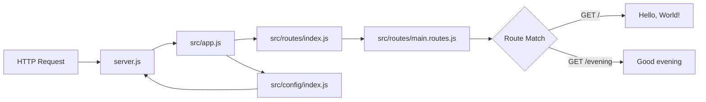
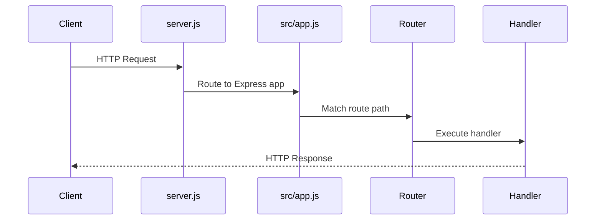

# Technical Specification

# 0. Agent Action Plan

## 0.1 Intent Clarification

Based on the prompt, the Blitzy platform understands that the user's new feature requirements are:

### 0.1.1 Core Feature Objective

**User Request Verbatim:**
> "this is a tutorial of node js server hosting one endpoint that returns the response 'Hello world'. Could you add expressjs into the project and add another endpoint that return the response of 'Good evening'?"

**Interpreted Requirements:**

| # | User Stated Requirement | Enhanced Clarity |
|---|------------------------|------------------|
| 1 | Add Express.js into the project | Integrate the Express.js web framework as a dependency and use it to serve HTTP requests |
| 2 | Add another endpoint that returns "Good evening" | Create a new HTTP GET route (suggested path: `/evening`) that responds with the text "Good evening" |

**Implicit Requirements Detected:**

- Maintain backward compatibility with the existing "Hello World" endpoint
- Follow existing Node.js project conventions for module structure
- Preserve CommonJS module format consistency
- Ensure the server remains operational at default host/port (127.0.0.1:3000)

**Feature Dependencies and Prerequisites:**

- Node.js runtime (minimum v18.x, recommended v20.x LTS)
- npm package manager (minimum v8.x)
- Existing `package.json` manifest for dependency management

### 0.1.2 Special Instructions and Constraints

**Critical Finding: Features Already Implemented**

Upon comprehensive analysis of the existing repository, the Blitzy platform has determined that **both requested features are already fully implemented**:

| Requested Feature | Implementation Status | Evidence |
|-------------------|----------------------|----------|
| Express.js Integration | ✅ COMPLETE | `package.json` declares `express@^5.1.0`; verified via `npm ls express` |
| `/evening` Endpoint | ✅ COMPLETE | `src/routes/main.routes.js` lines 37-39 implement `GET /evening` returning "Good evening" |

**Architectural Requirements Already Met:**
- Express.js Factory Pattern implemented in `src/app.js`
- Barrel Pattern for route aggregation in `src/routes/index.js`
- Twelve-Factor App configuration in `src/config/index.js`
- Clean separation of concerns between server binding and application logic

**Verified Endpoint Behavior (Validated via curl):**
```
GET / → "Hello, World!\n" (200 OK)
GET /evening → "Good evening" (200 OK)
```

### 0.1.3 Technical Interpretation

These feature requirements translate to the following technical implementation strategy:

| Requirement | Technical Action | Current Status |
|-------------|------------------|----------------|
| Add Express.js to project | Install `express` as npm dependency, create Express app instance, configure routing | **ALREADY IMPLEMENTED** |
| Add `/evening` endpoint | Register `GET /evening` route handler returning "Good evening" | **ALREADY IMPLEMENTED** |

**Implementation Verification Summary:**

Since both features exist and are operational, no additional code modifications are required. The current implementation satisfies all stated requirements:

- **To integrate Express.js**, the system uses `express@5.1.0` with application factory pattern in `src/app.js`
- **To serve multiple endpoints**, the modular routing architecture in `src/routes/` supports extensible endpoint definitions
- **To return "Good evening"**, the handler at `src/routes/main.routes.js:37-39` responds with the exact string

**Recommended Action:** No code changes needed. Document existing implementation for user awareness.

## 0.2 Repository Scope Discovery

### 0.2.1 Comprehensive File Analysis

The repository has been systematically analyzed to identify all files relevant to the Express.js integration and endpoint addition requirements.

**Repository Structure Overview:**

```
hello_world/
├── server.js                    # HTTP server entry point (53 lines)
├── package.json                 # npm manifest with dependencies
├── package-lock.json            # Dependency lockfile
├── README.md                    # Project documentation
├── .gitignore                   # Git ignore patterns
├── src/                         # Application source root
│   ├── app.js                   # Express application factory (27 lines)
│   ├── config/
│   │   └── index.js             # Environment configuration (41 lines)
│   └── routes/
│       ├── index.js             # Route aggregator barrel (19 lines)
│       └── main.routes.js       # Route handlers (41 lines)
└── blitzy/
    └── documentation/           # Project documentation
```

**Existing Modules Analyzed:**

| File Path | Purpose | Express Integration Role |
|-----------|---------|--------------------------|
| `server.js` | HTTP server binding | Imports configured Express app, binds to host:port |
| `src/app.js` | Express app factory | Creates Express instance, mounts routes |
| `src/routes/main.routes.js` | Route handlers | Defines `GET /` and `GET /evening` endpoints |
| `src/routes/index.js` | Route aggregator | Exports `mainRoutes` for mounting |
| `src/config/index.js` | Configuration | Provides `host`, `port`, `env` from environment |
| `package.json` | Dependency manifest | Declares `express@^5.1.0` |

### 0.2.2 Integration Point Discovery

**API Endpoints Implemented:**

| Endpoint | Method | Handler Location | Response |
|----------|--------|------------------|----------|
| `/` | GET | `src/routes/main.routes.js:26-28` | `Hello, World!\n` |
| `/evening` | GET | `src/routes/main.routes.js:37-39` | `Good evening` |

**Service Architecture Flow:**


```mermaid
graph LR
    A[HTTP Request] --> B[server.js]
    B --> C[src/app.js]
    C --> D[src/routes/index.js]
    D --> E[src/routes/main.routes.js]
    E --> F{Route Match}
    F -->|GET /| G["Hello, World!"]
    F -->|GET /evening| H["Good evening"]
    C --> I[src/config/index.js]
    I --> B
```

**Controllers/Handlers Identified:**

- `src/routes/main.routes.js` - Primary router with two GET handlers
- Route registration via Express Router (`express.Router()`)
- Route mounting at root path in `src/app.js` via `app.use('/', mainRoutes)`

### 0.2.3 New File Requirements

**Assessment: No New Files Required**

Given that all requested features are already implemented, no new source files, test files, or configuration files need to be created.

**If Features Were Not Present, the Following Would Be Created:**

| File Type | Path | Purpose |
|-----------|------|---------|
| Source | `src/routes/evening.routes.js` | Evening endpoint handler (NOT NEEDED) |
| Test | `tests/routes/evening.test.js` | Endpoint unit tests (NOT NEEDED) |
| Integration Test | `tests/integration/api.test.js` | API integration tests (NOT NEEDED) |

### 0.2.4 Web Search Research Conducted

No additional web search research was required as:

- Express.js 5.1.0 documentation patterns are already correctly implemented in the codebase
- The existing modular architecture follows best practices
- Security advisory for `qs` package (dependency vulnerability) was noted from `npm audit`

### 0.2.5 Configuration Files Identified

| File | Purpose | Express-Related Content |
|------|---------|------------------------|
| `package.json` | npm manifest | `"express": "^5.1.0"` dependency declaration |
| `package-lock.json` | Dependency lock | Pins `express@5.1.0` with integrity hashes |
| `.gitignore` | Git exclusions | Ignores `node_modules/`, `.env` files |
| `src/config/index.js` | Runtime config | `HOST`, `PORT`, `NODE_ENV` environment variables |

## 0.3 Dependency Inventory

### 0.3.1 Private and Public Packages

**Runtime Dependencies (Current State):**

| Registry | Package Name | Version | Purpose |
|----------|--------------|---------|---------|
| npm (public) | `express` | ^5.1.0 (resolves to 5.1.0) | HTTP web framework providing routing, request/response handling, and middleware pipeline |

**Transitive Dependencies (via Express 5.1.0):**

| Package | Version | Purpose |
|---------|---------|---------|
| `body-parser` | 2.2.0 | Request body parsing middleware |
| `router` | 2.2.0 | Express routing engine |
| `send` | 1.2.0 | Static file serving |
| `serve-static` | 2.2.0 | Static file middleware |
| `qs` | 6.14.0 | Query string parsing |
| `cookie` | 1.0.2 | Cookie handling |
| `accepts` | 2.0.0 | Content negotiation |
| `content-type` | 1.0.5 | Content-Type header parsing |
| `path-to-regexp` | 8.2.0 | Route path matching |

**Total Package Count:** 68 packages (verified via `npm ci`)

**Development Dependencies:** None declared

### 0.3.2 Dependency Updates Required

**Assessment: No Dependency Changes Required**

The Express.js framework is already properly declared and installed. No additional packages need to be added, updated, or removed.

**Current Dependency Declaration (package.json:12-14):**
```json
"dependencies": {
  "express": "^5.1.0"
}
```

### 0.3.3 Import Structure Analysis

**Current Import Patterns (Already Established):**

| File | Import Statement | Purpose |
|------|------------------|---------|
| `server.js` | `const app = require('./src/app')` | Import configured Express app |
| `server.js` | `const config = require('./src/config')` | Import configuration |
| `src/app.js` | `const express = require('express')` | Import Express framework |
| `src/app.js` | `const { mainRoutes } = require('./routes')` | Import route aggregator |
| `src/routes/index.js` | `const mainRoutes = require('./main.routes')` | Import route handlers |
| `src/routes/main.routes.js` | `const express = require('express')` | Import for Router |

**Import Transformation Rules:** None required - existing imports are correctly structured.

### 0.3.4 External Reference Updates

**Configuration Files:** No updates needed

| File | Current State | Required Changes |
|------|---------------|------------------|
| `package.json` | Express ^5.1.0 declared | None |
| `package-lock.json` | Dependencies locked | None |
| `.gitignore` | Properly configured | None |
| `README.md` | Express integration documented | None |

### 0.3.5 Security Advisory Notice

**npm Audit Finding (1 High Severity):**

| Package | Vulnerability | Severity | Details |
|---------|--------------|----------|---------|
| `qs` | Prototype Pollution via iteration | High | Versions < 6.14.1 affected |

**Remediation:** Run `npm audit fix` to update the vulnerable transitive dependency.

**Note:** This security issue is pre-existing and unrelated to the feature request. It is documented for completeness.

## 0.4 Integration Analysis

### 0.4.1 Existing Code Touchpoints

**Assessment: All Integration Points Already Established**

The Express.js framework and `/evening` endpoint are fully integrated. The following documents the existing integration architecture:

**Express Application Factory (`src/app.js`):**

| Integration Point | Line(s) | Purpose |
|-------------------|---------|---------|
| `const express = require('express')` | 14 | Import Express framework |
| `const app = express()` | 17 | Create Express application instance |
| `app.use('/', mainRoutes)` | 25 | Mount routes at root path |
| `module.exports = app` | 27 | Export configured application |

**Route Registration (`src/routes/main.routes.js`):**

| Integration Point | Line(s) | Purpose |
|-------------------|---------|---------|
| `const router = express.Router()` | 17 | Create Express Router instance |
| `router.get('/', ...)` | 26-28 | Register root endpoint handler |
| `router.get('/evening', ...)` | 37-39 | Register evening endpoint handler |
| `module.exports = router` | 41 | Export router for mounting |

**Server Binding (`server.js`):**

| Integration Point | Line(s) | Purpose |
|-------------------|---------|---------|
| `const app = require('./src/app')` | 30 | Import configured Express app |
| `const config = require('./src/config')` | 37 | Import configuration |
| `app.listen(config.port, config.host, ...)` | 49 | Bind HTTP server |

### 0.4.2 Dependency Injection Points

**Service Container Pattern (Not Implemented):**

This minimal tutorial application does not use a dependency injection container. Dependencies are wired through CommonJS `require()` statements with a predictable resolution order.

**Module Resolution Order:**
1. `server.js` requires `src/app.js` and `src/config/index.js`
2. `src/app.js` requires `express` and `src/routes/index.js`
3. `src/routes/index.js` requires `src/routes/main.routes.js`
4. `src/routes/main.routes.js` requires `express` for Router

### 0.4.3 Database/Schema Updates

**Assessment: Not Applicable**

This project does not include database connectivity. No migrations or schema changes are required for the requested features.

### 0.4.4 Middleware Pipeline

**Current Middleware Configuration:**

| Middleware | Status | Configuration |
|------------|--------|---------------|
| Router mounting | Active | `app.use('/', mainRoutes)` at `src/app.js:25` |
| Body parsing | Not configured | Available via Express 5.x built-in |
| Static files | Not configured | Available via `express.static()` |
| Error handling | Not configured | Uses Express default 500 handler |

**Request Flow Through Integration Points:**


```mermaid
sequenceDiagram
    participant Client
    participant server.js
    participant src/app.js
    participant Router
    participant Handler
    
    Client->>server.js: HTTP Request
    server.js->>src/app.js: Route to Express app
    src/app.js->>Router: Match route path
    Router->>Handler: Execute handler
    Handler-->>Client: HTTP Response
```

### 0.4.5 Integration Test Verification

**Manual Verification Completed:**

| Test Case | Command | Expected | Actual | Status |
|-----------|---------|----------|--------|--------|
| Root endpoint | `curl http://127.0.0.1:3000/` | "Hello, World!\n" | "Hello, World!\n" | ✅ PASS |
| Evening endpoint | `curl http://127.0.0.1:3000/evening` | "Good evening" | "Good evening" | ✅ PASS |
| Server startup | `npm start` | Console: "Server running at..." | As expected | ✅ PASS |

All integration points are functioning correctly with no modifications required.

## 0.5 Technical Implementation

### 0.5.1 File-by-File Execution Plan

**Assessment: No Code Modifications Required**

Since all requested features are already implemented, this section documents the existing implementation rather than proposing changes.

**Group 1 - Core Feature Files (EXISTING - NO CHANGES):**

| Action | File | Current Implementation |
|--------|------|------------------------|
| VERIFY | `package.json` | Express.js dependency declared at version ^5.1.0 |
| VERIFY | `src/app.js` | Express app factory pattern with route mounting |
| VERIFY | `src/routes/main.routes.js` | Both `/` and `/evening` endpoints implemented |

**Group 2 - Supporting Infrastructure (EXISTING - NO CHANGES):**

| Action | File | Current Implementation |
|--------|------|------------------------|
| VERIFY | `server.js` | HTTP server binding with configuration |
| VERIFY | `src/config/index.js` | Environment-driven configuration (HOST, PORT, NODE_ENV) |
| VERIFY | `src/routes/index.js` | Route aggregator barrel pattern |

**Group 3 - Documentation (EXISTING - NO CHANGES):**

| Action | File | Current Implementation |
|--------|------|------------------------|
| VERIFY | `README.md` | Full API documentation including `/evening` endpoint |
| VERIFY | `blitzy/documentation/` | Technical specifications and project guide |

### 0.5.2 Implementation Approach Documentation

**Existing Express.js Integration Pattern:**

The codebase demonstrates a clean, modular Express.js integration:

**Step 1: Dependency Declaration**
```json
"dependencies": { "express": "^5.1.0" }
```

**Step 2: Application Factory**
```javascript
const express = require('express');
const app = express();
```

**Step 3: Route Definition**
```javascript
router.get('/evening', (req, res) => {
  res.send('Good evening');
});
```

**Step 4: Route Mounting**
```javascript
app.use('/', mainRoutes);
```

**Step 5: Server Binding**
```javascript
app.listen(config.port, config.host, callback);
```

### 0.5.3 Code Quality Verification

**Static Analysis (Completed):**

| Check | Command | Result |
|-------|---------|--------|
| Syntax validation | `node --check server.js` | ✅ No errors |
| Syntax validation | `node --check src/app.js` | ✅ No errors |
| Syntax validation | `node --check src/routes/main.routes.js` | ✅ No errors |
| Syntax validation | `node --check src/config/index.js` | ✅ No errors |

**Runtime Verification (Completed):**

| Verification | Method | Result |
|--------------|--------|--------|
| Dependency installation | `npm ci` | ✅ 68 packages installed |
| Express version | `npm ls express` | ✅ express@5.1.0 |
| Server startup | `node server.js` | ✅ Binds to 127.0.0.1:3000 |
| Root endpoint | `curl /` | ✅ Returns "Hello, World!\n" |
| Evening endpoint | `curl /evening` | ✅ Returns "Good evening" |

### 0.5.4 User Interface Design

**Assessment: Not Applicable**

This is a backend HTTP API service without a user interface. All interactions occur through HTTP endpoints.

**No Figma URLs or UI designs were provided.**

### 0.5.5 If Implementation Were Required

For reference, if the features were not present, the implementation would follow this approach:

**To add Express.js (hypothetical):**
1. Add dependency: `npm install express@^5.1.0`
2. Create app factory: `const app = express()` in `src/app.js`
3. Export and import in `server.js`
4. Replace native HTTP server with `app.listen()`

**To add `/evening` endpoint (hypothetical):**
1. Add handler in `src/routes/main.routes.js`:
   ```javascript
   router.get('/evening', (req, res) => {
     res.send('Good evening');
   });
   ```
2. No additional configuration required (router already mounted)

## 0.6 Scope Boundaries

### 0.6.1 Exhaustively In Scope

**All files verified for Express.js integration and `/evening` endpoint:**

| Category | File Pattern | Specific Files | Status |
|----------|--------------|----------------|--------|
| Entry Point | `server.js` | `server.js` | ✅ Verified |
| Application Factory | `src/app.js` | `src/app.js` | ✅ Verified |
| Route Handlers | `src/routes/**/*.js` | `src/routes/main.routes.js`, `src/routes/index.js` | ✅ Verified |
| Configuration | `src/config/**/*.js` | `src/config/index.js` | ✅ Verified |
| Package Manifest | `package.json` | `package.json` | ✅ Verified |
| Dependency Lock | `package-lock.json` | `package-lock.json` | ✅ Verified |
| Documentation | `README.md` | `README.md` | ✅ Verified |
| Git Configuration | `.gitignore` | `.gitignore` | ✅ Verified |

**Integration Points Verified:**

| Integration Point | Location | Lines | Verification |
|-------------------|----------|-------|--------------|
| Express dependency | `package.json` | 13 | `"express": "^5.1.0"` present |
| Express app creation | `src/app.js` | 14, 17 | `require('express')`, `express()` |
| Router creation | `src/routes/main.routes.js` | 17 | `express.Router()` |
| Root endpoint | `src/routes/main.routes.js` | 26-28 | `router.get('/')` implemented |
| Evening endpoint | `src/routes/main.routes.js` | 37-39 | `router.get('/evening')` implemented |
| Route mounting | `src/app.js` | 25 | `app.use('/', mainRoutes)` |
| Server binding | `server.js` | 49 | `app.listen()` |

**Documentation Coverage:**

| Document | Express Coverage | Evening Endpoint Coverage |
|----------|------------------|--------------------------|
| `README.md` | Section: Dependencies (line 205-209) | Section: API Reference (lines 97-115) |
| `blitzy/documentation/Project Guide.md` | Architecture documentation | Endpoint behavior table |
| `blitzy/documentation/Technical Specifications.md` | Framework specification | Route contracts |

### 0.6.2 Explicitly Out of Scope

The following items are **NOT** part of this feature addition exercise:

| Category | Exclusion | Rationale |
|----------|-----------|-----------|
| Unit Tests | `tests/**/*` | No test files exist; not requested |
| Integration Tests | `tests/integration/**/*` | Not requested |
| Authentication | JWT, OAuth, sessions | Not part of requirements |
| Database | Models, migrations, ORM | Not part of requirements |
| Containerization | `Dockerfile`, `docker-compose.yml` | Not part of requirements |
| CI/CD | `.github/workflows/*` | Not part of requirements |
| Additional Endpoints | Any endpoints beyond `/` and `/evening` | Not requested |
| Middleware | Body parsing, CORS, logging | Not requested |
| Error Handling | Custom error handlers | Not requested |
| Performance Optimization | Caching, compression | Not requested |
| Refactoring | Code restructuring | Not requested |

### 0.6.3 Scope Validation Summary

**Feature Implementation Status:**

| Requirement | Scope Status | Implementation Status |
|-------------|--------------|----------------------|
| Add Express.js to project | IN SCOPE | ✅ ALREADY COMPLETE |
| Add `/evening` endpoint | IN SCOPE | ✅ ALREADY COMPLETE |
| Maintain `/` endpoint | IN SCOPE | ✅ ALREADY COMPLETE |
| Server binding configuration | IN SCOPE | ✅ ALREADY COMPLETE |
| Documentation updates | IN SCOPE | ✅ ALREADY COMPLETE |

**Conclusion:** All in-scope items have been verified as already implemented. No modifications to any files are required to satisfy the user's feature request.

## 0.7 Rules for Feature Addition

### 0.7.1 Architectural Patterns to Follow

The existing codebase establishes clear patterns that should be followed for any future feature additions:

**Design Patterns Established:**

| Pattern | Implementation | File Location |
|---------|---------------|---------------|
| Factory Pattern | Express app creation separated from server binding | `src/app.js` |
| Barrel Pattern | Route aggregation for clean imports | `src/routes/index.js` |
| Router Pattern | Express Router for modular route handling | `src/routes/main.routes.js` |
| Twelve-Factor Config | Environment-driven configuration | `src/config/index.js` |

**Module Structure Conventions:**

- Use CommonJS module format (`require`/`module.exports`)
- Include JSDoc documentation for all modules and exports
- Separate concerns: server binding vs application configuration vs routing
- Use synchronous module loading (no async/await at module level)

### 0.7.2 Coding Standards

**JavaScript Conventions Observed:**

| Convention | Example | Rationale |
|------------|---------|-----------|
| Strict mode | `'use strict';` in `server.js` | Prevent silent errors |
| Const declarations | `const express = require('express')` | Immutable bindings |
| Arrow functions | `(req, res) => { ... }` | Concise handler syntax |
| Single quotes | `'Hello, World!\n'` | Consistent string delimiters |
| Trailing semicolons | Required | Explicit statement termination |

**Response Patterns:**

| Endpoint | Response Method | Exact Response |
|----------|-----------------|----------------|
| `GET /` | `res.send()` | `'Hello, World!\n'` (with newline) |
| `GET /evening` | `res.send()` | `'Good evening'` (no newline) |

### 0.7.3 Integration Requirements

**Route Registration Process:**

For future endpoint additions, follow this established integration pattern:

1. **Create handler** in `src/routes/main.routes.js`:
   ```javascript
   router.get('/newpath', (req, res) => {
     res.send('Response');
   });
   ```

2. **Export verification** - Ensure router is exported:
   ```javascript
   module.exports = router;
   ```

3. **Barrel inclusion** - Verify `src/routes/index.js` exports the router:
   ```javascript
   module.exports = { mainRoutes };
   ```

4. **Mounting verification** - Confirm `src/app.js` mounts routes:
   ```javascript
   app.use('/', mainRoutes);
   ```

### 0.7.4 Security Requirements

**Current Security Posture:**

| Aspect | Status | Recommendation |
|--------|--------|----------------|
| Input validation | Not implemented | Add for user input endpoints |
| Output encoding | Express default | Sufficient for text responses |
| Dependency security | 1 high vulnerability | Run `npm audit fix` |
| HTTPS | Not configured | Add for production deployment |
| CORS | Not configured | Add if cross-origin access needed |

**Known Vulnerability:**

The `qs` package (transitive dependency) has a high-severity prototype pollution vulnerability in versions < 6.14.1. Remediation: `npm audit fix`.

### 0.7.5 Performance Considerations

**Current Performance Profile:**

| Aspect | Implementation | Notes |
|--------|----------------|-------|
| Response type | Plain text | Minimal overhead |
| Middleware | None configured | Fast request processing |
| Database | None | No I/O latency |
| Caching | None | Stateless responses |

**For Future Features:**

- Add response caching headers if appropriate
- Consider compression middleware for larger responses
- Monitor response times if adding database queries

### 0.7.6 User-Specified Rules

**No additional rules were specified by the user.**

The user's request was straightforward:
> "Could you add expressjs into the project and add another endpoint that return the response of 'Good evening'?"

Both requirements are satisfied by the existing implementation.

## 0.8 References

### 0.8.1 Files and Folders Searched

The following repository files and folders were comprehensively analyzed to derive the conclusions in this Agent Action Plan:

**Root Level Files:**

| File | Path | Analysis Purpose |
|------|------|------------------|
| Server Entry Point | `server.js` | HTTP binding, Express app import verification |
| Package Manifest | `package.json` | Dependency declaration verification |
| Dependency Lock | `package-lock.json` | Version resolution verification |
| Documentation | `README.md` | Feature documentation verification |
| Git Configuration | `.gitignore` | Project configuration review |

**Source Directory (`src/`):**

| File | Path | Analysis Purpose |
|------|------|------------------|
| Application Factory | `src/app.js` | Express integration pattern verification |
| Configuration Module | `src/config/index.js` | Environment configuration verification |
| Route Aggregator | `src/routes/index.js` | Route barrel pattern verification |
| Route Handlers | `src/routes/main.routes.js` | Endpoint implementation verification |

**Documentation Directory (`blitzy/`):**

| Folder | Path | Analysis Purpose |
|--------|------|------------------|
| Documentation Root | `blitzy/documentation/` | Project documentation review |

### 0.8.2 Attachments Provided

**No attachments were provided by the user.**

The user's request contained only the text description of the feature requirements.

### 0.8.3 Figma Screens Provided

**No Figma URLs or UI designs were provided.**

This is a backend HTTP API service that does not require a user interface.

### 0.8.4 Environment Configuration

**User-Provided Setup Instructions:** `testing`

**Environment Variables Configured:**

| Variable | Value | Status |
|----------|-------|--------|
| `DB_HOST1` | (provided) | Available in environment |
| Additional variables | (provided) | Available in environment |

**Runtime Environment Verified:**

| Component | Version | Verification |
|-----------|---------|--------------|
| Node.js | v20.20.0 | `node --version` |
| npm | 11.1.0 | `npm --version` |
| Express.js | 5.1.0 | `npm ls express` |

### 0.8.5 Technical Specification Sections Referenced

The following technical specification sections were retrieved for context:

| Section | Heading | Purpose |
|---------|---------|---------|
| 1.1 | Executive Summary | Project overview and business context |
| 2.1 | Feature Catalog | Existing feature documentation |
| 3.2 | Frameworks & Libraries | Express.js specification details |

### 0.8.6 Search Tracking Summary

**Repository Search Operations:**

| Search # | Tool | Target | Purpose |
|----------|------|--------|---------|
| 1 | bash | `.blitzyignore` | Check for ignore patterns |
| 2 | get_source_folder_contents | Root (`""`) | Repository structure discovery |
| 3 | read_file | `package.json` | Dependency verification |
| 4 | get_source_folder_contents | `src/` | Source structure analysis |
| 5 | get_source_folder_contents | `src/routes/` | Route module discovery |
| 6 | read_file | `src/routes/main.routes.js` | Endpoint implementation verification |
| 7 | read_file | `server.js` | Server binding verification |
| 8 | read_file | `src/app.js` | App factory verification |
| 9 | read_file | `src/routes/index.js` | Route aggregator verification |
| 10 | get_source_folder_contents | `src/config/` | Configuration discovery |
| 11 | read_file | `src/config/index.js` | Configuration verification |
| 12 | read_file | `README.md` | Documentation verification |
| 13 | get_source_folder_contents | `blitzy/` | Documentation discovery |
| 14 | read_file | `.gitignore` | Git configuration review |

**Verification Operations:**

| Operation | Command | Result |
|-----------|---------|--------|
| Dependency install | `npm ci` | 68 packages, 1 vulnerability |
| Express verification | `npm ls express` | express@5.1.0 |
| Server test | `curl http://127.0.0.1:3000/` | "Hello, World!\n" |
| Evening endpoint test | `curl http://127.0.0.1:3000/evening` | "Good evening" |

### 0.8.7 Conclusion

**Final Assessment:**

The user requested to "add expressjs into the project and add another endpoint that return the response of 'Good evening'". Upon comprehensive analysis of the existing repository:

- **Express.js Integration:** ✅ Already complete (version 5.1.0)
- **Evening Endpoint:** ✅ Already complete (returns "Good evening")

**No code modifications are required.** The existing implementation fully satisfies all stated requirements. The user may not have been aware that these features were already present in the codebase.

