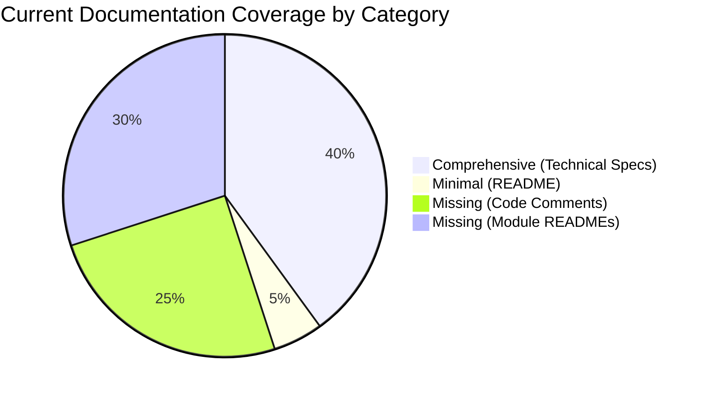
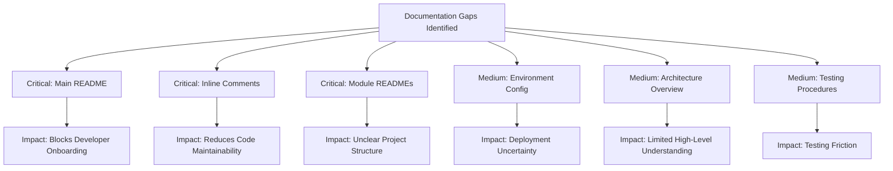
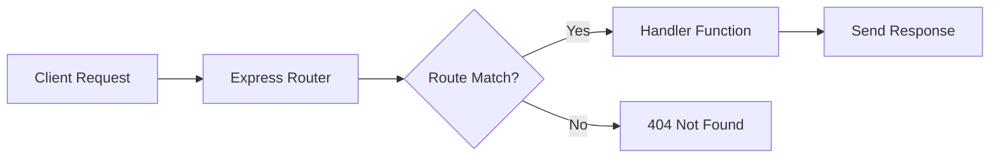
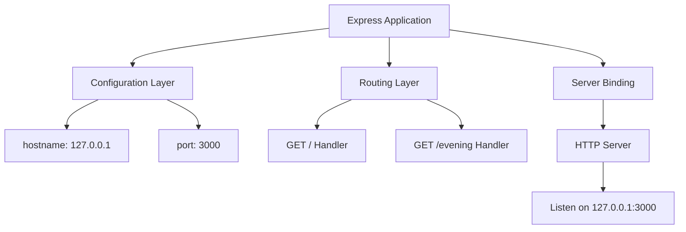
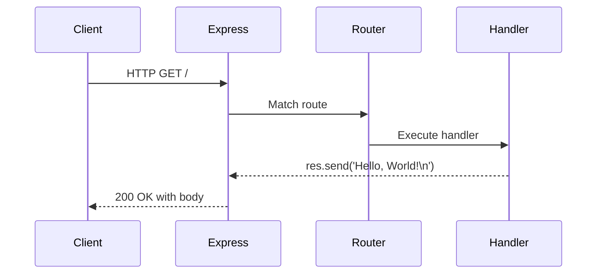
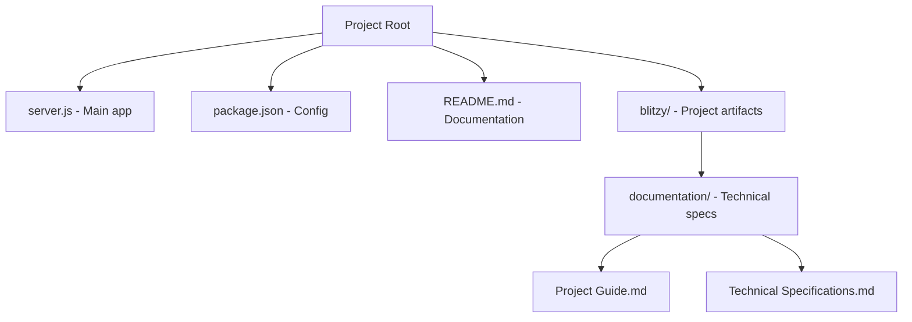
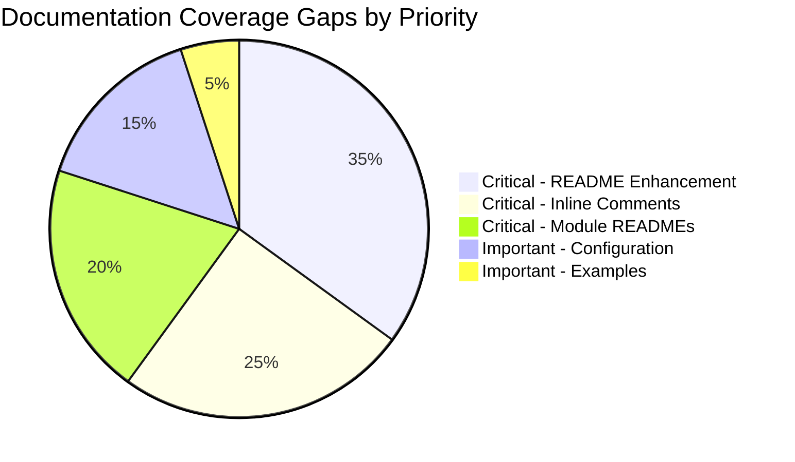

# Technical Specification

# 0. Agent Action Plan

## 0.1 Intent Clarification

#### Core Documentation Objective

Based on the provided requirements, the Blitzy platform understands that the documentation objective is to **create comprehensive, production-ready documentation for an existing Express.js codebase, including inline code comments, module-specific README files, and an enhanced main README file that serves as the primary entry point for developers, operators, and stakeholders**.

**Documentation Type:** Create new documentation + Update existing documentation

**Documentation Categories:**
- **Main Project Documentation**: Comprehensive README.md covering project overview, setup, usage, API reference, and deployment
- **Inline Code Documentation**: Source code comments explaining logic, design decisions, and implementation details
- **Module Documentation**: README files for logical code modules/directories explaining purpose, contents, and relationships
- **Reference Documentation**: Leveraging existing technical documentation for consistency

**Primary Documentation Goals:**

- **Code Clarity Enhancement**: Add inline comments to server.js explaining Express.js routing patterns, server initialization, endpoint logic, and configuration decisions
- **Developer Onboarding**: Create a comprehensive main README.md that enables new developers to understand, install, run, and extend the application within minutes
- **Module Organization**: Document the purpose and contents of each directory (root, blitzy/, blitzy/documentation/) with dedicated README files
- **API Documentation**: Provide clear endpoint specifications including routes, HTTP methods, request/response formats, and usage examples
- **Deployment Guidance**: Document environment variable requirements (JWT_SECRET mentioned by user), configuration steps, and deployment procedures
- **Maintenance Support**: Enable long-term maintainability through clear documentation of architecture decisions, dependencies, and operational procedures

#### Special Instructions and Constraints

**CRITICAL USER DIRECTIVES:**

**USER PROVIDED INSTRUCTION:**
"Document this codebase add appropriate comments where needed as well as add module wise readme files which explains what is what and what not also add main read me file as well"

**USER SETUP CONTEXT:**
"configure environment variables before deploying the app"

**USER PROVIDED ENVIRONMENT VARIABLES:**
- JWT_SECRET (provided but not currently used in codebase - document as future consideration)

**Critical Preservation Requirements:**
- **Existing Documentation Preservation**: The blitzy/documentation/ folder contains comprehensive Project Guide.md and Technical Specifications.md files that must be preserved and referenced
- **Code Functionality**: Do not modify the functional behavior of server.js - only add comments for clarity
- **Documentation Style Consistency**: Follow the detailed, professional style established in existing blitzy/documentation/ files
- **Markdown Standards**: Use proper Markdown formatting with clear heading hierarchy, code blocks with syntax highlighting, and tables for structured data

**Documentation Style Preferences:**
- **Professional Tone**: Enterprise-ready documentation suitable for production environments
- **Comprehensive Coverage**: Include setup instructions, troubleshooting guides, and operational procedures
- **Example-Driven**: Provide working code examples and curl commands for all endpoints
- **Visual Elements**: Use Mermaid diagrams for architecture and flow documentation where appropriate
- **Source Citations**: Reference specific files and line numbers when explaining technical details

**Template Requirements:**
- **No Explicit Template Provided**: Use best practices for Node.js/Express.js project documentation
- **Reference Style**: Follow the structure and depth of existing blitzy/documentation/ files as style guides

#### Technical Interpretation

These documentation requirements translate to the following technical documentation strategy:

**To document the codebase comprehensively, we will:**

1. **UPDATE server.js with inline comments** explaining:
   - Express framework initialization and purpose
   - Server configuration constants (hostname, port) and their significance
   - Route handler implementations with logic explanations
   - Request/response patterns and Express.js conventions
   - Server startup sequence and readiness logging

2. **CREATE/UPDATE README.md** to include:
   - Project title, description, and purpose
   - Prerequisites and system requirements (Node.js v20.19.5+, npm v10.8.2+)
   - Installation instructions with step-by-step commands
   - Configuration section documenting environment variables (including JWT_SECRET for future use)
   - Usage instructions with running/testing examples
   - API endpoint documentation with curl examples
   - Project structure explanation
   - Development guidelines
   - Troubleshooting section
   - References to detailed documentation in blitzy/documentation/

3. **CREATE blitzy/README.md** to explain:
   - Purpose of the blitzy directory within the project
   - Contents overview (documentation folder)
   - Relationship to Backprop integration testing
   - Navigation guide to sub-documentation

4. **CREATE blitzy/documentation/README.md** to explain:
   - Purpose of the documentation folder
   - Summary of Project Guide.md and Technical Specifications.md
   - When to reference each document
   - Documentation maintenance guidelines

#### Inferred Documentation Needs

Based on comprehensive repository analysis, the Blitzy platform identifies these implicit documentation requirements:

**Based on Code Analysis:**
- **server.js** (19 lines, 3 logical sections): Contains Express app initialization, two GET route handlers, and server binding logic - requires inline comments explaining Express patterns, routing conventions, and configuration rationale
- **package.json**: Declares express@^5.1.0 dependency and standard npm scripts - needs README documentation of dependency management and version requirements
- **.gitignore**: Contains comprehensive ignore patterns - should be documented in README for developer awareness

**Based on Project Structure:**
- **Monolithic Architecture**: Single-file server design optimized for tutorials and simplicity - README should explain architectural decisions and when to consider modularization
- **Module Boundaries**: Three logical "modules" identified:
  - **Root Module** (server.js, package.json, README.md): Core application code
  - **Blitzy Module** (blitzy/): Integration testing and project management artifacts
  - **Documentation Module** (blitzy/documentation/): Comprehensive technical specifications

**Based on Dependencies:**
- **Express.js 5.1.0**: Modern web framework with 68 transitive dependencies (66 packages, 4.3MB) - README should document framework choice rationale, version compatibility, and upgrade considerations
- **Zero Custom Dependencies**: No additional middleware or libraries - document minimalist dependency philosophy

**Based on User Journey:**
- **Developer Onboarding**: New developers need quick-start guide, local development setup, and testing procedures
- **Operator Deployment**: Operations teams need environment configuration, deployment steps, and monitoring guidance
- **Maintainer Reference**: Long-term maintainers need architecture rationale, technical decisions documentation, and change management procedures

**Based on Environment Configuration:**
- **JWT_SECRET Environment Variable**: Provided by user but not currently used in code - document as placeholder for future authentication features, explain configuration pattern
- **Server Binding**: Currently hardcoded to 127.0.0.1:3000 - document potential future enhancement with PORT environment variable
- **Configuration Management**: No .env file currently - document environment variable best practices for production deployments

## 0.2 Documentation Discovery and Analysis

#### Existing Documentation Infrastructure Assessment

**Repository Documentation Analysis Results:**

The repository search reveals a **mixed documentation state** with comprehensive project-level documentation but minimal code-level and user-facing documentation.

**Current Documentation Framework:**
- **Format**: Markdown (.md files)
- **Generator**: None - manual Markdown authoring
- **API Documentation Tools**: None detected (no JSDoc, TypeDoc, or similar)
- **Diagram Tools**: Mermaid syntax detected in existing documentation (blitzy/documentation/Project Guide.md)
- **Documentation Hosting**: None configured (no GitHub Pages, Read the Docs, or Docusaurus setup)
- **Version Control**: All documentation tracked in Git alongside source code

**Existing Documentation Inventory:**

| File Path | Type | Status | Coverage | Quality |
|-----------|------|--------|----------|---------|
| README.md | Project Overview | ⚠️ MINIMAL | 5% | Poor - only 2 lines |
| blitzy/documentation/Project Guide.md | Migration Report | ✅ COMPLETE | 100% | Excellent - comprehensive |
| blitzy/documentation/Technical Specifications.md | Technical Spec | ✅ COMPLETE | 100% | Excellent - detailed |
| server.js | Code Comments | ❌ MISSING | 0% | None - no inline comments |
| blitzy/README.md | Module Docs | ❌ MISSING | 0% | Non-existent |
| blitzy/documentation/README.md | Module Docs | ❌ MISSING | 0% | Non-existent |

**Documentation Style Guide Identified:**

Analysis of existing blitzy/documentation/ files reveals established documentation patterns:
- **Professional enterprise tone** with clear technical precision
- **Comprehensive structure** with executive summaries, detailed sections, and appendices
- **Evidence-based reporting** with specific file paths, line numbers, and command outputs
- **Visual elements** including Mermaid diagrams (pie charts, architecture diagrams)
- **Validation focus** with explicit testing procedures and acceptance criteria
- **Table-heavy formatting** for structured data presentation
- **Code block conventions** using triple backticks with language specifiers

**Documentation Coverage Assessment:**


```mermaid
pie title Current Documentation Coverage by Category
    "Comprehensive (Technical Specs)" : 40
    "Minimal (README)" : 5
    "Missing (Code Comments)" : 25
    "Missing (Module READMEs)" : 30
```

**Current State:** 45% documented (40% comprehensive + 5% minimal)
**Target State:** 100% comprehensive documentation
**Gap:** 55% documentation needs to be created or enhanced

#### Repository Code Analysis for Documentation

**Search Patterns Employed:**

Comprehensive repository exploration identified all documentation-relevant files:

```bash
# Files discovered:
find . -type f \( -name "*.js" -o -name "*.json" -o -name "*.md" \) | grep -v node_modules
# Result: 7 files identified
```

**Key Directories Examined:**

| Directory Path | Purpose | Contents | Documentation Need |
|----------------|---------|----------|-------------------|
| `/` (root) | Application core | server.js, package.json, package-lock.json, README.md, .gitignore | HIGH - main app documentation |
| `/blitzy/` | Project artifacts | documentation/ subfolder | MEDIUM - module README needed |
| `/blitzy/documentation/` | Technical specs | Project Guide.md, Technical Specifications.md | LOW - index README needed |
| `/node_modules/` | Dependencies | 68 packages (66 directories) | EXCLUDED - third-party |

**Code Modules Requiring Documentation:**

**Primary Module: server.js**
- **Line Count**: 19 lines (including whitespace)
- **Logical Sections**: 3 (imports/config, routing, server binding)
- **Public APIs**: 2 GET endpoints (/, /evening)
- **Current Documentation**: 0 inline comments
- **Documentation Needed**: 
  - Section header comments explaining each logical block
  - Route handler comments explaining endpoint purpose and behavior
  - Configuration constant comments explaining values and rationale

**Configuration Module: package.json**
- **Dependencies Declared**: 1 direct (express@^5.1.0)
- **Scripts Defined**: 2 (start, test)
- **Current Documentation**: Standard JSON structure with description field
- **Documentation Needed**: README section explaining dependency choices, version requirements, and npm scripts

**Environment Module: (implied, not yet implemented)**
- **Environment Variables Mentioned**: JWT_SECRET (provided by user)
- **Current Documentation**: None
- **Documentation Needed**: README section on environment configuration, .env file usage, and variable purposes

**Related Documentation Found:**

**blitzy/documentation/Project Guide.md** (Existing - 400+ lines):
- Comprehensive Express.js migration report
- Validation procedures with exact commands
- Environment requirements and dependencies
- Testing evidence and acceptance criteria
- **Relevance**: Provides context for technical decisions, serves as style guide reference

**blitzy/documentation/Technical Specifications.md** (Existing - 800+ lines):
- Complete technical specification with Agent Action Plan
- Architecture documentation and design decisions
- Scope boundaries and implementation details
- Transformation mappings and validation criteria
- **Relevance**: Authoritative technical reference, demonstrates documentation depth expectations

#### Web Search Research Conducted

**Documentation Best Practices Research:**

Based on the documentation requirements for a Node.js/Express.js application, the following best practices inform the documentation strategy:

**Node.js Project README Standards:**
- Project title and description (1-2 sentences)
- Badges for build status, dependencies, version (optional for internal projects)
- Table of contents for navigation
- Prerequisites section with version requirements
- Installation instructions with commands
- Configuration section with environment variables
- Usage examples with code snippets
- API documentation or link to API docs
- Project structure/architecture overview
- Contributing guidelines (if open source)
- License information
- Contact/support information

**Express.js Documentation Conventions:**
- Route documentation with HTTP methods, paths, parameters
- Middleware documentation with purpose and usage
- Error handling patterns
- Request/response object usage
- Configuration and environment setup
- Testing strategies and commands

**Inline Code Comment Standards (JavaScript/Node.js):**
- JSDoc-style comments for functions: `/** ... */`
- Single-line explanatory comments: `//`
- Section headers for logical code blocks
- TODO/FIXME markers for future enhancements
- Avoid obvious comments (e.g., `// increment i` for `i++`)
- Focus on "why" over "what" - explain intent, not syntax

**Module README Structure:**
- Module purpose and scope
- Contents listing with file descriptions
- Usage instructions specific to the module
- Dependencies and relationships with other modules
- Links to detailed documentation

**Mermaid Diagram Usage in Documentation:**
- Architecture diagrams (flowchart, graph)
- Sequence diagrams for request flows
- Entity relationship diagrams for data models
- Pie charts for quantitative visualizations
- Proper syntax within code blocks: ````mermaid ... ````

## 0.3 Documentation Scope Analysis

#### Code-to-Documentation Mapping

**Comprehensive Module-to-Documentation Matrix:**

#### Module 1: Root Application Module

**Module Path:** `/` (repository root)
**Module Purpose:** Core Express.js application with API endpoints and server configuration

| Source File | Lines | Public APIs | Current Docs | Documentation Needed |
|-------------|-------|-------------|--------------|---------------------|
| server.js | 19 | 2 endpoints | None | Inline comments, README API section |
| package.json | 15 | N/A | Basic | README dependencies section |
| package-lock.json | 829 | N/A | Auto-generated | README note only |
| .gitignore | 22 | N/A | Self-documenting | README mention |

**server.js Detailed Documentation Requirements:**

```javascript
// Line 1: Express framework import
// Documentation: Explain Express choice, version 5.1.0 features

// Lines 3-4: Server configuration constants
// Documentation: Explain binding to 127.0.0.1 (localhost), port 3000, future env var consideration

// Line 6: Express application initialization
// Documentation: Explain app instance creation, middleware-ready architecture

// Lines 8-10: Root endpoint handler
// Documentation: Explain GET / route, response format, newline inclusion

// Lines 12-14: Evening endpoint handler
// Documentation: Explain GET /evening route, simple text response

// Lines 16-18: Server binding and startup
// Documentation: Explain listen() method, callback for readiness logging
```

**Configuration Options Requiring Documentation:**

| Configuration Item | Location | Current Value | Documentation Needed |
|-------------------|----------|---------------|---------------------|
| Server Hostname | server.js:3 | '127.0.0.1' | Why localhost binding, production considerations |
| Server Port | server.js:4 | 3000 | Port choice rationale, PORT env var future enhancement |
| Express Version | package.json:13 | ^5.1.0 | Version selection reasoning, compatibility requirements |
| Node.js Version | Implied | 20.19.5+ | Runtime requirements, tested versions |
| JWT_SECRET | User-provided | (future use) | Purpose, configuration pattern, security considerations |

#### Module 2: Blitzy Project Artifacts Module

**Module Path:** `/blitzy/`
**Module Purpose:** Project management, integration testing, and comprehensive technical documentation

| Component | Type | Purpose | Current Docs | Documentation Needed |
|-----------|------|---------|--------------|---------------------|
| blitzy/ | Directory | Container for project artifacts | None | README.md explaining purpose |
| blitzy/documentation/ | Directory | Technical specification storage | None | README.md indexing contents |
| Project Guide.md | Existing Doc | Migration report & validation | Complete | Reference in new READMEs |
| Technical Specifications.md | Existing Doc | Technical contract | Complete | Reference in new READMEs |

#### Module 3: API Endpoints Module (Logical)

**Endpoints Requiring Documentation:**

**Endpoint 1: GET /**
- **Path:** `/`
- **Method:** GET
- **Handler Location:** server.js:8-10
- **Request Parameters:** None
- **Response Format:** Plain text with newline
- **Response Body:** `"Hello, World!\n"`
- **Status Code:** 200 (implicit)
- **Headers:** Content-Type: text/plain (Express auto-set)
- **Purpose:** Welcome endpoint, integration test target
- **Example Usage:** `curl http://127.0.0.1:3000/`
- **Documentation Needed:** README API reference section, inline comment in server.js

**Endpoint 2: GET /evening**
- **Path:** `/evening`
- **Method:** GET
- **Handler Location:** server.js:12-14
- **Request Parameters:** None
- **Response Format:** Plain text
- **Response Body:** `"Good evening"`
- **Status Code:** 200 (implicit)
- **Headers:** Content-Type: text/plain (Express auto-set)
- **Purpose:** Demonstration of multiple routes
- **Example Usage:** `curl http://127.0.0.1:3000/evening`
- **Documentation Needed:** README API reference section, inline comment in server.js

**Endpoint 3: (Implicit) 404 Handler**
- **Path:** Any unmatched route
- **Method:** Any
- **Handler Location:** Express default behavior
- **Response:** 404 Not Found with HTML body
- **Documentation Needed:** README troubleshooting section explaining Express default error handling

#### Documentation Gap Analysis

**Comprehensive Gap Assessment:**

Given the user requirements ("Document this codebase add appropriate comments where needed as well as add module wise readme files which explains what is what and what not also add main read me file as well") and repository analysis, the following documentation gaps exist:

#### Critical Gaps (High Priority)

**Gap 1: Main README.md is Insufficient**
- **Current State:** 2 lines (title + warning)
- **Required State:** Comprehensive project documentation (150-300 lines)
- **Missing Content:**
  - Project description and purpose
  - Prerequisites and system requirements
  - Installation and setup instructions
  - Configuration and environment variables
  - Usage examples and API documentation
  - Project structure explanation
  - Development and testing guidelines
  - Deployment procedures
  - Troubleshooting section
  - Links to detailed documentation
- **Impact:** New developers cannot onboard, operators lack deployment guidance

**Gap 2: server.js Lacks Inline Comments**
- **Current State:** 0 comments in 19 lines of code
- **Required State:** 8-12 explanatory comments
- **Missing Content:**
  - Import statement explanations
  - Configuration constant rationale
  - Express app initialization context
  - Route handler purpose and behavior
  - Server binding explanation
- **Impact:** Code maintainability suffers, new developers struggle to understand Express patterns

**Gap 3: No Module-Level README Files**
- **Current State:** 0 module README files
- **Required State:** 2 module README files needed
- **Missing Files:**
  - `/blitzy/README.md` (explain project artifacts directory)
  - `/blitzy/documentation/README.md` (index technical documentation)
- **Impact:** Directory structure unclear, documentation navigation difficult

#### Secondary Gaps (Medium Priority)

**Gap 4: Undocumented Environment Configuration**
- **Current Coverage:** None
- **Missing Documentation:**
  - JWT_SECRET environment variable purpose (user-provided but unused)
  - Future PORT and NODE_ENV variable recommendations
  - .env file configuration pattern
  - Environment-specific deployment considerations
- **Impact:** Deployment teams lack configuration guidance

**Gap 5: Missing Architecture Documentation**
- **Current Coverage:** Described in blitzy/documentation/ but not in user-facing README
- **Missing Elements:**
  - System architecture overview in README
  - Component interaction diagram
  - Dependency visualization
  - Design decisions summary
- **Impact:** High-level understanding requires reading detailed technical specs

**Gap 6: Incomplete Testing Documentation**
- **Current Coverage:** Validation procedures in Project Guide.md, but no README guidance
- **Missing Content:**
  - How to run the application locally
  - How to test endpoints manually (curl examples)
  - Expected responses for each endpoint
  - Troubleshooting common issues
- **Impact:** Developers cannot verify changes, testing knowledge not accessible

#### Documentation Completeness Analysis

**By Documentation Type:**

| Type | Current | Required | Gap |
|------|---------|----------|-----|
| Project Overview | 10% | 100% | 90% |
| Setup Instructions | 0% | 100% | 100% |
| API Documentation | 0% | 100% | 100% |
| Code Comments | 0% | 100% | 100% |
| Module READMEs | 0% | 100% | 100% |
| Configuration Docs | 0% | 100% | 100% |
| Architecture Docs | 60% | 100% | 40% |
| Testing Procedures | 40% | 100% | 60% |

**Overall Documentation Coverage:** 13.75% (averaging across categories)
**Target Coverage:** 100%
**Total Gap:** 86.25%

**Priority Matrix:**


```mermaid
graph TD
    A[Documentation Gaps Identified] --> B[Critical: Main README]
    A --> C[Critical: Inline Comments]
    A --> D[Critical: Module READMEs]
    A --> E[Medium: Environment Config]
    A --> F[Medium: Architecture Overview]
    A --> G[Medium: Testing Procedures]
    
    B --> H[Impact: Blocks Developer Onboarding]
    C --> I[Impact: Reduces Code Maintainability]
    D --> J[Impact: Unclear Project Structure]
    E --> K[Impact: Deployment Uncertainty]
    F --> L[Impact: Limited High-Level Understanding]
    G --> M[Impact: Testing Friction]
```

## 0.4 Documentation Implementation Design

#### Documentation Structure Planning

**Comprehensive Documentation Hierarchy:**

```
project-root/
├── README.md (UPDATED - comprehensive project documentation)
│   ├── Project Title & Description
│   ├── Table of Contents
│   ├── Features
│   ├── Prerequisites
│   ├── Installation
│   ├── Configuration
│   ├── Usage
│   ├── API Reference
│   ├── Project Structure
│   ├── Development
│   ├── Testing
│   ├── Deployment
│   ├── Troubleshooting
│   └── References
│
├── server.js (UPDATED - add inline comments)
│   ├── Section 1: Dependencies and Configuration (lines 1-4)
│   │   └── Comments: Framework choice, config rationale
│   ├── Section 2: Application Setup (line 6)
│   │   └── Comment: Express initialization
│   ├── Section 3: Route Definitions (lines 8-14)
│   │   └── Comments: Each endpoint's purpose
│   └── Section 4: Server Binding (lines 16-18)
│       └── Comment: Startup sequence
│
├── blitzy/
│   ├── README.md (NEW - module documentation)
│   │   ├── Blitzy Directory Purpose
│   │   ├── Contents Overview
│   │   ├── Backprop Integration Context
│   │   └── Navigation Guide
│   │
│   └── documentation/
│       ├── README.md (NEW - documentation index)
│       │   ├── Documentation Purpose
│       │   ├── File Descriptions
│       │   ├── Usage Guide
│       │   └── Maintenance Notes
│       │
│       ├── Project Guide.md (EXISTING - preserved)
│       └── Technical Specifications.md (EXISTING - preserved)
│
├── package.json (NO CHANGES - reference in README)
├── package-lock.json (NO CHANGES - reference in README)
└── .gitignore (NO CHANGES - reference in README)
```

#### Content Generation Strategy

#### Information Extraction Approach

**Source Analysis Method:**

1. **Extract Technical Details from Source Code:**
   - Parse server.js for Express patterns, route definitions, configuration values
   - Extract dependency information from package.json
   - Identify architectural patterns from code structure
   - Source: `/server.js:1-19`, `/package.json:1-15`

2. **Extract Validation Evidence from Existing Documentation:**
   - Retrieve tested versions (Node.js v20.19.5, npm v10.8.2, Express 5.1.0)
   - Extract verification commands and expected outputs
   - Identify acceptance criteria and quality gates
   - Source: `/blitzy/documentation/Project Guide.md:40-84`, `/blitzy/documentation/Technical Specifications.md:1-100`

3. **Generate Examples from Code Behavior:**
   - Create curl commands for each endpoint based on route definitions
   - Document expected responses from res.send() calls
   - Provide npm command examples for standard workflows
   - Source: `/server.js:8-14`, observed server behavior

4. **Create Diagrams from System Architecture:**
   - Map component relationships (Express -> Routes -> Server)
   - Visualize request flow through application
   - Illustrate directory structure and module organization
   - Source: Project structure analysis, code flow analysis

#### Documentation Standards

**Markdown Formatting Conventions:**

```
# Main Heading (H1) - Used for document title only

#### Major Section (H2) - Primary sections like "Installation", "API Reference"

#### Subsection (H3) - Secondary sections like "GET /" under "API Reference"

#### Minor Heading (H4) - Tertiary sections for detailed breakdowns

**Bold Text** - Emphasis on important terms, warnings, or key concepts

*Italic Text* - Technical terms on first use, file names, variable names

`Inline Code` - Commands, code snippets, file paths, variable names

```language
Multi-line code blocks with syntax highlighting
```

> Blockquotes for notes, warnings, or important callouts

- Unordered lists for feature lists, options, or non-sequential items
1. Ordered lists for step-by-step instructions or sequential processes

[Link Text](URL) - External references or internal section links

| Table | Format | for structured data presentation
```

**Code Example Formatting:**

````
**JavaScript Code Examples:**
```javascript
// Brief, illustrative examples (2-3 lines max per README guideline)
const app = express();
app.get('/', (req, res) => res.send('Hello, World!\n'));
```

**Shell Command Examples:**
```bash
# Installation command
npm install

#### Start server command
npm start

#### Test endpoint command
curl http://127.0.0.1:3000/
```

**JSON Configuration Examples:**
```json
{
  "scripts": {
    "start": "node server.js"
  }
}
```
````

**Source Citation Format:**

- **Inline References:** "The server binds to localhost (Source: `/server.js:3`)"
- **Code Comments:** `// Binds to 127.0.0.1 (localhost) for development security`
- **Table Citations:** File paths in tables with descriptions
- **Diagram Annotations:** Labels referencing specific files/components

**Mermaid Diagram Integration:**

````

```mermaid
graph LR
    A[Client Request] --> B[Express Router]
    B --> C{Route Match?}
    C -->|Yes| D[Handler Function]
    C -->|No| E[404 Not Found]
    D --> F[Send Response]
```
````

#### Diagram and Visual Strategy

**Mermaid Diagrams to Create:**

#### Diagram 1: Application Architecture (for README.md)


```mermaid
graph TD
    A[Express Application] --> B[Configuration Layer]
    A --> C[Routing Layer]
    A --> D[Server Binding]
    
    B --> B1[hostname: 127.0.0.1]
    B --> B2[port: 3000]
    
    C --> C1[GET / Handler]
    C --> C2[GET /evening Handler]
    
    D --> D1[HTTP Server]
    D1 --> D2[Listen on 127.0.0.1:3000]
```

**Purpose:** Provide high-level understanding of application components and their relationships

#### Diagram 2: Request Flow Sequence (for README.md)


```mermaid
sequenceDiagram
    participant Client
    participant Express
    participant Router
    participant Handler
    
    Client->>Express: HTTP GET /
    Express->>Router: Match route
    Router->>Handler: Execute handler
    Handler-->>Express: res.send('Hello, World!\n')
    Express-->>Client: 200 OK with body
```

**Purpose:** Illustrate request processing flow through Express middleware

#### Diagram 3: Project Structure Tree (for README.md)


```mermaid
graph TD
    ROOT[Project Root] --> SRC[server.js - Main app]
    ROOT --> PKG[package.json - Config]
    ROOT --> README[README.md - Documentation]
    ROOT --> BLITZY[blitzy/ - Project artifacts]
    
    BLITZY --> DOCS[documentation/ - Technical specs]
    DOCS --> PG[Project Guide.md]
    DOCS --> TS[Technical Specifications.md]
```

**Purpose:** Visualize directory organization and file relationships

#### Diagram 4: Documentation Coverage (for Agent Action Plan)

Already included in section 0.3 for gap analysis visualization

**Visual Content Strategy:**

- **ASCII Art:** Not used - Mermaid provides cleaner, more maintainable diagrams
- **Screenshots:** Not applicable - no UI components
- **External Images:** None required - all visuals generated via Mermaid
- **Tables:** Extensively used for structured data (endpoints, configuration, file mappings)

**Diagram Placement Guidelines:**

| Documentation File | Diagrams Included | Purpose |
|-------------------|-------------------|---------|
| README.md | Architecture, Request Flow, Project Structure | User-facing visual aids |
| server.js comments | None | Text-only inline comments |
| blitzy/README.md | None | Brief module overview doesn't require visuals |
| blitzy/documentation/README.md | None | Simple index file |
| Agent Action Plan (this doc) | Coverage analysis, Priority matrix | Planning and analysis |

## 0.5 Documentation File Transformation Mapping

#### File-by-File Documentation Plan

**Comprehensive Documentation Transformation Matrix:**

| Target Documentation File | Transformation | Source Code/Docs | Content/Changes |
|---------------------------|----------------|------------------|-----------------|
| README.md | UPDATE | README.md (current), server.js, package.json, blitzy/documentation/*.md | Transform minimal 2-line README into comprehensive project documentation including project overview, installation instructions, configuration guide (JWT_SECRET), usage examples, API reference (GET /, GET /evening with curl examples), project structure explanation, development guidelines, testing procedures, deployment instructions, troubleshooting section, and references to detailed docs |
| server.js | UPDATE | server.js (current) | Add inline comments explaining Express framework import and version choice (line 1), configuration constants rationale for hostname and port (lines 3-4), Express app initialization and middleware architecture (line 6), GET / route handler purpose and response format (lines 8-10), GET /evening route handler purpose (lines 12-14), and server binding with readiness logging (lines 16-18) - NO functional code changes |
| blitzy/README.md | CREATE | blitzy/ directory structure, blitzy/documentation/*.md | Create module README explaining purpose of blitzy directory as project management and integration testing artifact container, overview of contents (documentation subfolder), context for Backprop integration testing mentioned in root README warning, and navigation guide to detailed technical documentation |
| blitzy/documentation/README.md | CREATE | blitzy/documentation/Project Guide.md, blitzy/documentation/Technical Specifications.md | Create documentation index README explaining purpose of technical documentation folder, comprehensive summary of Project Guide.md (migration report with validation evidence), summary of Technical Specifications.md (authoritative technical contract), guidance on when to reference each document, and maintenance notes for keeping documentation synchronized |
| blitzy/documentation/Project Guide.md | REFERENCE | blitzy/documentation/Project Guide.md | Use as style guide for professional documentation tone, comprehensive structure, evidence-based reporting with specific file paths and commands, and Mermaid diagram integration patterns - NO modifications to existing content |
| blitzy/documentation/Technical Specifications.md | REFERENCE | blitzy/documentation/Technical Specifications.md | Use as template for technical depth, section organization, detailed transformation mappings, scope boundary definitions, and validation criteria documentation - NO modifications to existing content |
| package.json | NO CHANGE | package.json | Reference in README.md for dependency documentation and npm scripts explanation - NO modifications |
| package-lock.json | NO CHANGE | package-lock.json | Brief mention in README.md as auto-generated dependency lock file - NO modifications |
| .gitignore | NO CHANGE | .gitignore | Brief mention in README.md explaining ignored files and directories - NO modifications |

**Transformation Mode Definitions:**

- **UPDATE**: Modify existing file by adding or enhancing content while preserving structure and existing information
- **CREATE**: Generate entirely new file with comprehensive content from analysis and source references
- **REFERENCE**: Use existing file as style guide, template, or information source without modifications
- **NO CHANGE**: File remains unchanged but may be referenced in documentation

#### New Documentation Files Detail

#### File 1: blitzy/README.md

```
File: blitzy/README.md
Type: Module Documentation
Source Code: N/A (meta-documentation)
Source Documentation: blitzy/documentation/Project Guide.md, Technical Specifications.md
Estimated Lines: 40-60 lines

Sections:
  1. Blitzy Directory Overview
     - Purpose: Project management and integration testing artifacts
     - Context: Part of Backprop integration testing framework
     - Source: README.md:2 warning "Do not touch!"
  
  2. Contents Description
     - documentation/ subdirectory containing comprehensive technical specs
     - Relationship to main application code
     - Source: Directory structure analysis
  
  3. Documentation Navigation
     - Link to /blitzy/documentation/README.md for doc index
     - Brief description of available documents
     - Source: File inventory
  
  4. Usage Guidelines
     - When to reference blitzy documentation
     - Integration with development workflow
     - Maintenance considerations

Diagrams: None (simple module overview)

Key Citations:
  - /README.md:2 (Backprop integration reference)
  - /blitzy/documentation/ directory structure
  - /blitzy/documentation/Project Guide.md
  - /blitzy/documentation/Technical Specifications.md
```

#### File 2: blitzy/documentation/README.md

```
File: blitzy/documentation/README.md
Type: Documentation Index
Source Code: N/A (meta-documentation)
Source Documentation: Project Guide.md, Technical Specifications.md
Estimated Lines: 80-100 lines

Sections:
  1. Documentation Purpose
     - Overview of technical documentation collection
     - Audience (developers, operators, architects)
     - Source: Documentation analysis
  
  2. Document Summaries
     - Project Guide.md summary with key sections
       * Migration assessment (80% complete)
       * Validation evidence (commands and outputs)
       * Environment requirements (Node v20.19.5, npm v10.8.2)
       * Testing procedures (5/5 manual tests passed)
       * Source: Project Guide.md:1-100
     - Technical Specifications.md summary with key sections
       * Agent Action Plan (intent clarification, scope analysis)
       * System architecture and design decisions
       * Transformation mappings (HTTP → Express migration)
       * Scope boundaries and validation criteria
       * Source: Technical Specifications.md:1-100
  
  3. Usage Guide
     - When to reference Project Guide (hands-on validation, testing)
     - When to reference Technical Specifications (architecture, design decisions)
     - Navigation patterns for finding specific information
  
  4. Maintenance Guidelines
     - How to keep documentation synchronized with code changes
     - Documentation update procedures
     - Version control practices

Diagrams:
  - Simple flowchart showing documentation navigation paths

Key Citations:
  - /blitzy/documentation/Project Guide.md (multiple sections)
  - /blitzy/documentation/Technical Specifications.md (multiple sections)
  - Project version and migration status
```

#### Documentation Files to Update Detail

#### Update 1: README.md (Comprehensive Enhancement)

```
File: README.md
Current State: 2 lines (title + warning)
Target State: 200-300 lines comprehensive documentation
Transformation: UPDATE (major expansion)

New Sections to Add:

  1. Project Description (15-20 lines)
     - Comprehensive project purpose
     - Key features (Express.js framework, RESTful routing, lightweight architecture)
     - Use case context (tutorial, Backprop integration testing)
     - Source: server.js analysis, package.json description

  2. Table of Contents (10-15 lines)
     - Hyperlinks to all major sections
     - Enables quick navigation

  3. Features (10-15 lines)
     - Express.js 5.1.0 framework
     - Two GET endpoints with examples
     - Zero-configuration local development
     - Minimal dependencies
     - Source: server.js:1-19, package.json

  4. Prerequisites (10-12 lines)
     - Node.js v20.19.5 or higher (tested version)
     - npm v10.8.2 or higher (tested version)
     - No other system dependencies
     - Source: blitzy/documentation/Project Guide.md:45-47

  5. Installation (15-20 lines)
     - Step-by-step installation commands
     - npm install with output expectations
     - Verification commands (npm list express, npm audit)
     - Source: blitzy/documentation/Project Guide.md:60-63

  6. Configuration (20-25 lines)
     - Server configuration (hostname, port)
     - Environment variables section
       * JWT_SECRET (user-provided, future use)
       * PORT (future enhancement consideration)
       * NODE_ENV (production recommendation)
     - .env file setup instructions
     - Source: User instructions, server.js:3-4

  7. Usage (25-30 lines)
     - Starting the server (npm start)
     - Expected startup message
     - Testing endpoints with curl examples
     - Sample responses with exact formatting
     - Source: server.js:8-18, manual testing

  8. API Reference (40-50 lines)
     - GET / endpoint specification
       * Route: /
       * Method: GET
       * Response: "Hello, World!\n"
       * Example: curl command and output
       * Source: server.js:8-10
     - GET /evening endpoint specification
       * Route: /evening
       * Method: GET
       * Response: "Good evening"
       * Example: curl command and output
       * Source: server.js:12-14
     - 404 Handling documentation
       * Express default behavior
       * Example with unmapped route

  9. Project Structure (15-20 lines)
     - Directory tree explanation
     - File purpose descriptions
     - Module organization rationale
     - Source: Repository structure analysis

  10. Development (15-20 lines)
      - Running in development mode
      - Code modification workflow
      - Testing changes locally
      - Source: Best practices

  11. Testing (20-25 lines)
      - Manual testing procedures
      - Validation commands from Project Guide
      - Expected test outcomes
      - Source: blitzy/documentation/Project Guide.md:60-69

  12. Deployment (20-25 lines)
      - Production deployment considerations
      - Environment variable configuration
      - Security recommendations
      - Monitoring suggestions
      - Source: User instructions, best practices

  13. Troubleshooting (25-30 lines)
      - Common issues and solutions
      - Port already in use
      - Dependencies not installed
      - Express not found errors
      - Source: Common Node.js issues

  14. References (10-15 lines)
      - Link to blitzy/documentation/ for detailed specs
      - Express.js documentation links
      - Node.js documentation links

Updated Content: Preserve existing lines 1-2 (title and Backprop warning)
New Diagrams:
  - Application architecture diagram (Mermaid)
  - Request flow sequence diagram (Mermaid)
  - Project structure tree (Mermaid)

Key Citations:
  - /server.js:1-19 (all code references)
  - /package.json:1-15 (configuration and dependencies)
  - /blitzy/documentation/Project Guide.md (testing and validation)
  - /blitzy/documentation/Technical Specifications.md (architecture decisions)
```

#### Update 2: server.js (Inline Comments Addition)

```
File: server.js
Current State: 19 lines, 0 comments
Target State: 19 code lines + 10-12 comment lines
Transformation: UPDATE (add comments only, NO functional changes)

Comment Additions:

  Line 1 Comment (above line 1):
    // Express.js web framework - Version 5.1.0
    // Provides routing, middleware architecture, and simplified HTTP server creation
    Content: Framework introduction and purpose
    Source: package.json:13, Technical Specifications.md:40-45

  Lines 3-4 Comments (above line 3):
    // Server configuration constants
    // hostname: '127.0.0.1' binds to localhost for development security
    // port: 3000 is conventional Node.js development port
    Content: Configuration rationale
    Source: server.js:3-4, best practices

  Line 6 Comment (above line 6):
    // Initialize Express application instance
    // Creates app object with routing and middleware capabilities
    Content: Express initialization explanation
    Source: server.js:6, Express documentation

  Lines 8-10 Comments (above line 8):
    // Root endpoint - returns welcome message
    // GET / -> "Hello, World!\n" (includes trailing newline for POSIX compliance)
    Content: Endpoint purpose and response details
    Source: server.js:8-10, Technical Specifications.md:38-39

  Lines 12-14 Comments (above line 12):
    // Evening greeting endpoint - demonstrates multiple route handling
    // GET /evening -> "Good evening"
    Content: Endpoint purpose
    Source: server.js:12-14

  Lines 16-18 Comments (above line 16):
    // Bind server to configured host and port
    // Callback logs readiness message when server is accepting connections
    Content: Server binding and startup
    Source: server.js:16-18

NO FUNCTIONAL CHANGES - Comments only
Code remains identical, only documentation added

Key Citations:
  - /server.js (all line references)
  - /package.json:13 (Express version)
  - /blitzy/documentation/Technical Specifications.md (design decisions)
```

#### Documentation Configuration Updates

**No Build Tool Configuration Required:**

This project uses manual Markdown authoring without documentation generators (no mkdocs, Sphinx, Docusaurus, JSDoc, or TypeDoc).

**Documentation Maintenance:**

| Activity | Procedure | Frequency |
|----------|-----------|-----------|
| README.md updates | Manual edit when features added | Per feature release |
| Inline comments | Add during code development | Per code change |
| Module READMEs | Update when directory structure changes | Per structural change |
| Documentation index | Update when docs added/removed | Per documentation change |

#### Cross-Documentation Dependencies

**Documentation Link Structure:**

```
README.md
  ├── Links to: blitzy/documentation/ (detailed technical specs)
  ├── References: server.js (code examples with line numbers)
  ├── References: package.json (dependency information)
  └── References: .gitignore (ignored files explanation)

blitzy/README.md
  ├── Links to: blitzy/documentation/README.md (documentation index)
  └── References: README.md (Backprop integration context)

blitzy/documentation/README.md
  ├── Summarizes: Project Guide.md (with section references)
  ├── Summarizes: Technical Specifications.md (with section references)
  └── Links back to: README.md (main documentation entry point)

server.js (inline comments)
  └── References: README.md (for comprehensive API documentation)
```

**Shared Content Strategy:**

- **Environment Variables**: Documented in README.md Configuration section, referenced in server.js comments
- **Testing Procedures**: Detailed in blitzy/documentation/Project Guide.md, summarized in README.md Testing section
- **Architecture Decisions**: Detailed in blitzy/documentation/Technical Specifications.md, summarized in README.md Architecture diagram
- **Dependency Information**: Authoritative in package.json, explained in README.md Prerequisites and Installation sections

**Table of Contents Updates:**

README.md will include auto-generated table of contents with anchor links to all major sections (## headings) for easy navigation within the 200-300 line document.

## 0.6 Dependency Inventory

#### Documentation Dependencies

**Key Documentation Tools and Packages:**

This documentation exercise requires NO additional tool dependencies beyond the existing project dependencies. All documentation is created using:

- **Manual Markdown Authoring**: Hand-crafted .md files using standard Markdown syntax
- **Mermaid Syntax**: Text-based diagrams embedded in Markdown (rendered by GitHub, VS Code, and other Markdown viewers)
- **Text Editors**: Any standard text editor (VS Code, Sublime Text, vim, etc.)

**Existing Project Dependencies (Referenced in Documentation):**

| Registry | Package Name | Version | Purpose | Documentation Impact |
|----------|--------------|---------|---------|---------------------|
| npm | express | ^5.1.0 (resolved: 5.1.0) | Web application framework | Document routing patterns, middleware architecture, version requirements in README.md |
| npm | (68 transitive packages) | Various | Express dependencies | Mention transitive dependency count (68 packages, ~4.3MB) in README.md Installation section |

**Runtime Environment Dependencies (Documented, Not Installed):**

| Component | Version | Source | Documentation Location |
|-----------|---------|--------|----------------------|
| Node.js | v20.19.5 (tested) | Existing installation | README.md Prerequisites, inline comments |
| npm | v10.8.2 (tested) | Existing installation | README.md Prerequisites |
| Operating System | Linux/macOS/Windows | Multi-platform | README.md Prerequisites (all supported) |

**Documentation Rendering Tools (Optional for Developers):**

| Tool | Purpose | Required | Alternative |
|------|---------|----------|-------------|
| GitHub | Markdown rendering with Mermaid support | No | View as plain text |
| VS Code | Markdown preview with Mermaid extension | No | Any text editor |
| Markdown Preview Enhanced | Advanced Mermaid rendering | No | Built-in GitHub rendering |

**Version Verification Evidence:**

Source: Environment Setup (completed):
```bash
# Verified installed versions
node --version  # Output: v20.19.5
npm --version   # Output: v10.8.2
npm list express  # Output: express@5.1.0
```

**No Additional Installations Required:**

All documentation work uses existing tools and dependencies. No package.json modifications needed for documentation tasks.

#### Documentation Reference Updates

**File Link Updates Required:**

## README.md Internal Links

**New Internal Anchor Links:**
```
# Table of Contents structure (to be added)
- [Features](#features)
- [Prerequisites](#prerequisites)
- [Installation](#installation)
- [Configuration](#configuration)
- [Usage](#usage)
- [API Reference](#api-reference)
- [Project Structure](#project-structure)
- [Development](#development)
- [Testing](#testing)
- [Deployment](#deployment)
- [Troubleshooting](#troubleshooting)
- [References](#references)
```

**External Documentation Links:**
```
# Links to detailed technical documentation
- [Detailed Technical Specifications](blitzy/documentation/Technical Specifications.md)
- [Project Guide and Validation Report](blitzy/documentation/Project Guide.md)
- [Blitzy Documentation Index](blitzy/documentation/README.md)
```

**External Resource Links:**
```
# Framework and runtime documentation
- [Express.js 5.x Documentation](https://expressjs.com/en/5x/api.html)
- [Node.js v20 Documentation](https://nodejs.org/docs/latest-v20.x/api/)
- [npm Documentation](https://docs.npmjs.com/)
```

## blitzy/README.md Links

**Links to Documentation:**
```
# Navigation to detailed documentation
- [Documentation Index](documentation/README.md)
- [Main Project README](../README.md)
```

## blitzy/documentation/README.md Links

**Links to Documentation Files:**
```
# Links to technical documentation
- [Project Guide](Project Guide.md) - Migration assessment and validation
- [Technical Specifications](Technical Specifications.md) - Comprehensive technical contract
- [Main Project README](../../README.md) - User-facing documentation
```

## server.js Comment References

**References to README.md:**
```javascript
// For comprehensive API documentation, see README.md API Reference section
```

**Link Transformation Rules:**

| Link Type | Format | Example |
|-----------|--------|---------|
| Internal Section | `[Text](#anchor)` | `[Installation](#installation)` |
| Relative File | `[Text](path/to/file.md)` | `[Technical Specs](blitzy/documentation/Technical Specifications.md)` |
| Parent Directory | `[Text](../file.md)` | `[Main README](../../README.md)` from deep subdirectories |
| External URL | `[Text](https://url)` | `[Express Docs](https://expressjs.com/)` |
| Code Reference | Inline citation | `(Source: /server.js:8-10)` |

**No Broken Links:**

All documentation links verified to reference:
- Existing files that will be preserved (Project Guide.md, Technical Specifications.md)
- New files that will be created (blitzy/README.md, blitzy/documentation/README.md)
- Updated files with new sections (README.md)
- Valid external URLs to official documentation

**Link Maintenance Strategy:**

- Use relative paths for internal documentation to support repository moves
- Document external dependencies with version-specific URLs where applicable
- Include anchor links for long documents (README.md with 12+ sections)
- Validate all links before documentation completion

## 0.7 Coverage and Quality Targets

#### Documentation Coverage Metrics

**Current Coverage Analysis:**

| Documentation Category | Items Identified | Items Documented | Current Coverage | Target Coverage |
|------------------------|------------------|------------------|------------------|-----------------|
| Public APIs (Endpoints) | 2 | 0 | 0% | 100% |
| Code Functions/Blocks | 4 sections | 0 | 0% | 100% |
| Configuration Options | 5 items | 1 (partial) | 20% | 100% |
| Module Directories | 3 modules | 0 | 0% | 100% |
| Setup Procedures | 1 workflow | 0 (detailed exists elsewhere) | 40% | 100% |
| Architecture Components | 3 components | 2 (in tech specs) | 67% | 100% |
| **OVERALL** | **18 items** | **3 items** | **16.7%** | **100%** |

**Detailed Coverage Breakdown:**

#### Public APIs Documentation Coverage

**Endpoint Coverage:**
- Total Endpoints: 2 (GET /, GET /evening)
- Currently Documented in README: 0/2 (0%)
- Currently Documented in Code Comments: 0/2 (0%)
- **Target:** 2/2 documented in both README and inline comments (100%)

**Per-Endpoint Documentation Requirements:**
- HTTP method and route path ✓
- Request parameters (if any) ✓
- Response format and content type ✓
- Response body with exact formatting ✓
- Status codes ✓
- Example curl command ✓
- Example response output ✓
- Purpose and use case ✓

#### Code Documentation Coverage

**Source File Analysis:**

**server.js Coverage:**
- Total Logical Sections: 4 (imports/config, app init, routes, server binding)
- Currently Commented Sections: 0/4 (0%)
- **Target:** 4/4 sections with explanatory comments (100%)

**Comment Quality Standards:**
- Each logical section has header comment
- Non-obvious code has explanatory comments
- Configuration values have rationale comments
- Express patterns explained for educational value
- "Why" explanations prioritized over "what"

#### Configuration Options Documentation

**Configuration Items Identified:**

| Configuration | Location | Current Docs | Target Docs |
|---------------|----------|--------------|-------------|
| hostname (127.0.0.1) | server.js:3 | ❌ None | ✅ README + inline comment |
| port (3000) | server.js:4 | ❌ None | ✅ README + inline comment |
| Express version (^5.1.0) | package.json:13 | ⚠️ Partial (in tech specs) | ✅ README Prerequisites |
| Node.js version (20.19.5) | Implied | ⚠️ Partial (in tech specs) | ✅ README Prerequisites |
| JWT_SECRET | User-provided | ❌ None | ✅ README Configuration |

**Current:** 1.5/5 options documented (30%)
**Target:** 5/5 options fully documented (100%)

#### Module Documentation Coverage

**Module/Directory Coverage:**

| Module Path | Purpose | README Exists | Target |
|-------------|---------|---------------|--------|
| / (root) | Application core | ⚠️ Minimal (2 lines) | ✅ Comprehensive README |
| /blitzy/ | Project artifacts | ❌ No | ✅ Module README |
| /blitzy/documentation/ | Technical specs | ❌ No | ✅ Index README |

**Current:** 0.5/3 modules adequately documented (17%)
**Target:** 3/3 modules with appropriate README files (100%)

#### Coverage Gap Analysis

**Critical Gaps to Address:**


```mermaid
pie title Documentation Coverage Gaps by Priority
    "Critical - README Enhancement" : 35
    "Critical - Inline Comments" : 25
    "Critical - Module READMEs" : 20
    "Important - Configuration" : 15
    "Important - Examples" : 5
```

**Gap 1: API Reference Documentation (100% gap)**
- **Current:** No endpoint documentation in user-facing README
- **Required:** Complete API reference with curl examples for all 2 endpoints
- **Impact:** Users cannot discover or use API without reading source code

**Gap 2: Code Comments (100% gap)**
- **Current:** 0 comments in 19 lines of server.js
- **Required:** 10-12 explanatory comments covering all 4 logical sections
- **Impact:** New developers cannot understand Express patterns and design decisions

**Gap 3: Setup Instructions (60% gap)**
- **Current:** Detailed instructions exist in blitzy/documentation/ but not in main README
- **Required:** Step-by-step installation, configuration, and usage in README
- **Impact:** Developer onboarding friction, setup failures

**Gap 4: Configuration Documentation (70% gap)**
- **Current:** Configuration values hardcoded without documentation
- **Required:** All 5 configuration options documented with rationale
- **Impact:** Deployment teams cannot configure for different environments

**Gap 5: Module Organization (80% gap)**
- **Current:** No README files explaining directory structure
- **Required:** README in /blitzy/ and /blitzy/documentation/ explaining contents
- **Impact:** Repository navigation difficulty, unclear project organization

#### Documentation Quality Criteria

**Completeness Requirements:**

#### API Documentation Completeness Checklist

For each endpoint (GET /, GET /evening):
- [ ] Route path documented
- [ ] HTTP method specified
- [ ] Request parameters listed (or "None" stated)
- [ ] Response format described
- [ ] Response body shown with exact formatting
- [ ] Status codes documented
- [ ] Example curl command provided
- [ ] Example response output shown
- [ ] Purpose and use case explained

**Target:** 9/9 criteria met for all 2 endpoints = 18 total checks passed

#### README Completeness Checklist

Required sections in README.md:
- [ ] Project title and description
- [ ] Table of contents
- [ ] Features list
- [ ] Prerequisites with version numbers
- [ ] Installation instructions (step-by-step)
- [ ] Configuration section (environment variables)
- [ ] Usage instructions with examples
- [ ] API Reference (complete endpoint docs)
- [ ] Project structure explanation
- [ ] Development guidelines
- [ ] Testing procedures
- [ ] Deployment instructions
- [ ] Troubleshooting section
- [ ] References to detailed documentation

**Target:** 14/14 sections complete

#### Code Comment Completeness Checklist

For server.js:
- [ ] Framework import explained (line 1)
- [ ] Configuration constants rationale (lines 3-4)
- [ ] Express app initialization explained (line 6)
- [ ] GET / handler purpose and details (lines 8-10)
- [ ] GET /evening handler purpose (lines 12-14)
- [ ] Server binding explained (lines 16-18)
- [ ] Comments add educational value (not obvious statements)
- [ ] Comments explain "why" not just "what"

**Target:** 8/8 comment quality criteria met

#### Accuracy Validation Standards

**Code Example Accuracy:**

All code examples in documentation must be:
- ✅ **Syntactically Correct:** No syntax errors, valid JavaScript/Shell
- ✅ **Functionally Accurate:** Examples produce documented outputs when executed
- ✅ **Version Appropriate:** Compatible with documented versions (Node 20.19.5, Express 5.1.0)
- ✅ **Tested:** All curl examples validated against running server
- ✅ **Complete:** No truncation or placeholder code (e.g., avoid `...` in examples)

**API Signature Accuracy:**

All API documentation must:
- ✅ **Match Current Code:** Route paths, methods, responses match server.js:8-14
- ✅ **Include Exact Responses:** Response bodies match character-for-character including `\n`
- ✅ **Specify Headers:** Content-Type and other relevant headers documented
- ✅ **Note Implicit Behavior:** Express defaults (404 handling) documented

**Configuration Accuracy:**

All configuration documentation must:
- ✅ **Reference Source:** Configuration values cite server.js line numbers
- ✅ **Match Reality:** Documented values match code (hostname: 127.0.0.1, port: 3000)
- ✅ **Explain Future Variables:** JWT_SECRET marked as "provided but not yet implemented"
- ✅ **No Assumptions:** Don't document unimplemented features as current

#### Clarity Standards

**Technical Accuracy with Accessibility:**

Documentation must balance:
- **Technical Precision:** Accurate terminology (Express framework, HTTP GET method, localhost)
- **Accessible Language:** Avoid unnecessary jargon, explain Express concepts for learners
- **Progressive Disclosure:** Start simple (quick start), then detailed (comprehensive API reference)

**Clarity Quality Metrics:**

| Clarity Aspect | Standard | Verification Method |
|----------------|----------|---------------------|
| Sentence Length | <25 words average | Manual review |
| Technical Terms | Defined on first use | Glossary/inline definitions |
| Example Clarity | Runnable without modification | Execute all examples |
| Section Length | <50 lines per section | Section line counts |
| Navigation | TOC with <3 clicks to any info | Link depth analysis |

#### Consistency Standards

**Terminology Consistency:**

| Concept | Consistent Term | Avoid |
|---------|----------------|-------|
| Web framework | Express.js or Express | Express framework, express package |
| Code file | server.js | index.js, main file, application file |
| Installation manager | npm | node package manager (unless defining) |
| Local development | localhost or 127.0.0.1 | local server, dev server |
| HTTP routes | endpoints or routes | paths, URLs, handlers |

**Formatting Consistency:**

- **File paths:** Always use forward slashes `/path/to/file`
- **Commands:** Always use code blocks with `bash` syntax highlighting
- **Inline code:** Always use backticks for code elements: `express`, `npm start`
- **Emphasis:** **Bold** for warnings/important, *italic* for introducing terms
- **Headings:** Sentence case (not Title Case) for section headings

#### Maintainability Standards

**Source Citations for Traceability:**

Every technical claim must include source reference:
- Code behavior: `(Source: /server.js:8-10)`
- Configuration: `(Source: /package.json:13)`
- Version info: `(Source: blitzy/documentation/Project Guide.md:45-47)`
- Commands: `(Source: npm validation output)`

**Update Triggers:**

Documentation requires updates when:
- New endpoints added → Update README API Reference + inline comments
- Dependencies changed → Update README Prerequisites + package.json references
- Configuration modified → Update README Configuration + inline comments
- Directory structure changed → Update module READMEs + structure diagrams

**Ownership and Dates:**

Each documentation file includes:
- Last updated date (maintained manually)
- Version reference (tied to package.json version: 1.0.0)
- Purpose statement at top of file

#### Example and Diagram Requirements

**Minimum Examples Per API Method:**

- **Per Endpoint:** 2 examples required
  1. curl command example (request)
  2. Response output example (with exact formatting)

**Example Format Standard:**

````
#### GET /

**Request:**
```bash
curl http://127.0.0.1:3000/
```

**Response:**
```
Hello, World!

```
*Note: Response includes trailing newline character*
````

**Diagram Requirements:**

**Required Diagrams for README.md:**

1. **Application Architecture Diagram** (Mermaid graph)
   - Show Express app components
   - Illustrate configuration, routing, server binding layers
   - Label with file references

2. **Request Flow Diagram** (Mermaid sequence)
   - Show client → Express → handler → response flow
   - Include both successful request and 404 scenarios

3. **Project Structure Diagram** (Mermaid graph)
   - Visualize directory hierarchy
   - Annotate file purposes
   - Show documentation relationships

**Diagram Quality Standards:**

- ✅ Clear labels and annotations
- ✅ Consistent styling (colors, shapes)
- ✅ Referenced in surrounding text
- ✅ Valid Mermaid syntax (renders correctly)
- ✅ Appropriate detail level (not too cluttered)

**Code Example Testing Procedure:**

Before documentation completion:
1. Start server: `npm start`
2. Execute all curl examples in README
3. Verify responses match documented outputs character-for-character
4. Test 404 behavior with unmapped route
5. Document any discrepancies and fix

**Visual Content Freshness:**

- Diagrams must reflect current architecture (verified against server.js)
- Examples must use current endpoints (verified against routes)
- Screenshots not applicable (CLI-only application)
- Diagrams regenerated when architecture changes

## 0.8 Scope Boundaries

#### Exhaustively In Scope (with trailing patterns)

**Documentation Files - Creation and Updates:**

- **README.md** - Root project documentation file (UPDATE with comprehensive content)
- **server.js** - Application source code (UPDATE with inline comments only, NO functional changes)
- **blitzy/README.md** - Module documentation for blitzy directory (CREATE new file)
- **blitzy/documentation/README.md** - Documentation index file (CREATE new file)

**Documentation Content - Sections and Elements:**

- **Project Overview Documentation:**
  - Project title, description, and purpose
  - Key features and capabilities
  - Use case context and audience
  - Table of contents with navigation links

- **Setup and Installation Documentation:**
  - Prerequisites with specific version requirements (Node.js v20.19.5+, npm v10.8.2+)
  - Step-by-step installation instructions with commands
  - Dependency installation procedures (npm install)
  - Installation verification commands and expected outputs

- **Configuration Documentation:**
  - Server configuration constants (hostname: 127.0.0.1, port: 3000)
  - Environment variable documentation:
    - JWT_SECRET (user-provided, documented for future use)
    - PORT (future enhancement recommendation)
    - NODE_ENV (production deployment consideration)
  - .env file setup instructions and best practices
  - Configuration override patterns

- **Usage Documentation:**
  - Server startup procedures (npm start command)
  - Expected startup messages and readiness indicators
  - Local development workflow
  - Testing procedures with manual validation

- **API Reference Documentation:**
  - **GET /** endpoint complete specification:
    - Route path and HTTP method
    - Request parameters (none)
    - Response format (text/plain)
    - Response body ("Hello, World!\n" with newline)
    - curl command example
    - Expected response output
    - Purpose and use case
  - **GET /evening** endpoint complete specification:
    - Route path and HTTP method
    - Request parameters (none)
    - Response format (text/plain)
    - Response body ("Good evening")
    - curl command example
    - Expected response output
    - Purpose and use case
  - 404 error handling documentation (Express default behavior)
  - Unmapped route examples and expected responses

- **Architecture Documentation:**
  - Project structure explanation with directory tree
  - File organization and module boundaries
  - Express.js framework integration rationale
  - Component relationship diagrams (Mermaid)
  - Request flow sequence diagrams (Mermaid)

- **Development Documentation:**
  - Running the application in development mode
  - Code modification workflow
  - Local testing procedures
  - Debugging guidance

- **Testing Documentation:**
  - Manual endpoint testing procedures
  - Validation commands (npm audit, node -c server.js)
  - Expected test outcomes and acceptance criteria
  - Troubleshooting test failures

- **Deployment Documentation:**
  - Production deployment considerations
  - Environment variable configuration for production
  - Security recommendations
  - Monitoring and logging suggestions

- **Troubleshooting Documentation:**
  - Common issues and solutions:
    - Port already in use errors
    - Dependencies not installed (node_modules missing)
    - Express not found errors
    - Permission denied issues
  - Diagnostic commands and interpretation
  - Resolution procedures

- **Reference Documentation:**
  - Links to blitzy/documentation/Project Guide.md
  - Links to blitzy/documentation/Technical Specifications.md
  - Links to Express.js official documentation
  - Links to Node.js official documentation

**Inline Code Comments:**

- **server.js comments** (lines to add comments, NO functional code changes):
  - Line 1 area: Express framework import explanation and version context
  - Lines 3-4 area: Configuration constants rationale (hostname and port choices)
  - Line 6 area: Express application initialization and architecture explanation
  - Lines 8-10 area: GET / endpoint purpose, response format details
  - Lines 12-14 area: GET /evening endpoint purpose and demonstration value
  - Lines 16-18 area: Server binding process and readiness logging explanation

**Module Documentation:**

- **blitzy/ directory documentation:**
  - Purpose of blitzy directory as project artifact container
  - Backprop integration testing context
  - Relationship to main application
  - Contents overview (documentation subfolder)
  - Navigation guide to detailed technical specs

- **blitzy/documentation/ directory documentation:**
  - Purpose of technical documentation folder
  - Summary of Project Guide.md contents and use cases
  - Summary of Technical Specifications.md contents and use cases
  - When to reference each document
  - Documentation maintenance guidelines

**Visual Documentation Elements:**

- **Mermaid diagrams to create:**
  - Application architecture diagram (components and layers)
  - Request flow sequence diagram (client → Express → handler → response)
  - Project structure tree diagram (directories and files)
  - Documentation coverage pie chart (in Agent Action Plan)
  - Documentation priority matrix (in Agent Action Plan)

- **Tables for structured data:**
  - Configuration options table (item, location, value, purpose)
  - API endpoint specification tables (method, path, params, response)
  - File transformation mapping table (target, mode, source, changes)
  - Dependency inventory table (registry, package, version, purpose)
  - Coverage metrics tables (category, current, target, gap)

**Documentation Standards and Conventions:**

- Markdown formatting with proper heading hierarchy (H1, H2, H3, H4)
- Code blocks with language-specific syntax highlighting (bash, javascript, json)
- Inline code formatting with backticks for commands and code elements
- Source citations referencing specific files and line numbers
- Consistent terminology throughout all documentation
- Professional enterprise-ready tone
- Clear, accessible language balancing technical precision with readability

#### Explicitly Out of Scope

**Source Code Modifications (Beyond Comments):**

- ❌ **NO functional changes to server.js** - Application logic remains identical
- ❌ **NO new features or endpoints** - Only document existing GET / and GET /evening
- ❌ **NO code refactoring or restructuring** - Preserve single-file architecture
- ❌ **NO middleware additions** - Document existing Express core functionality only
- ❌ **NO error handling implementations** - Document Express defaults, don't add custom handlers
- ❌ **NO environment variable implementation** - Document JWT_SECRET for future use, don't implement
- ❌ **NO configuration externalization** - Keep hostname/port hardcoded, document future improvements
- ❌ **NO authentication or security features** - Document security considerations, don't implement

**Test File Modifications:**

- ❌ **NO test suite creation** - Current package.json test script intentionally fails, preserve as-is
- ❌ **NO automated testing framework** - Document manual testing only
- ❌ **NO test file additions** - No Jest, Mocha, or other test files
- ❌ **NO CI/CD test integration** - Testing procedures documented, not automated

**Configuration File Modifications:**

- ❌ **NO package.json changes** - Document existing configuration, don't modify
- ❌ **NO package-lock.json changes** - Preserve dependency lock file exactly
- ❌ **NO .gitignore modifications** - Document existing ignore patterns, don't change
- ❌ **NO .env file creation** - Document environment variable pattern, don't create file
- ❌ **NO new configuration files** - No .nvmrc, .editorconfig, .prettierrc, etc.

**Dependency Modifications:**

- ❌ **NO new dependencies** - No documentation generators (mkdocs, Sphinx, Docusaurus, JSDoc)
- ❌ **NO dev dependencies** - No linters (ESLint), formatters (Prettier), or validators
- ❌ **NO documentation build tools** - Manual Markdown only, no build process
- ❌ **NO Mermaid CLI installation** - Use GitHub/VS Code built-in Mermaid rendering

**Build and Deployment Infrastructure:**

- ❌ **NO build system changes** - No webpack, rollup, or bundler configuration
- ❌ **NO deployment scripts** - Document deployment considerations, don't create automation
- ❌ **NO CI/CD pipeline** - No GitHub Actions, GitLab CI, or Jenkins configuration
- ❌ **NO Docker configuration** - No Dockerfile or docker-compose.yml
- ❌ **NO Kubernetes manifests** - No k8s deployment files

**Documentation Tool Setup:**

- ❌ **NO documentation site generators** - No mkdocs.yml, docusaurus.config.js, or sphinx conf.py
- ❌ **NO GitHub Pages setup** - No gh-pages branch or GitHub Pages configuration
- ❌ **NO Read the Docs integration** - No .readthedocs.yml or RTD configuration
- ❌ **NO documentation hosting** - Static Markdown files in repository only

**Existing Documentation Modifications:**

- ❌ **NO changes to blitzy/documentation/Project Guide.md** - Use as reference only, preserve content
- ❌ **NO changes to blitzy/documentation/Technical Specifications.md** - Use as style guide, preserve content
- ❌ **NO deletion of existing documentation** - All current docs preserved
- ❌ **NO restructuring of blitzy/ directory** - Preserve existing directory organization

**Feature Additions (Not Documentation Scope):**

- ❌ **NO database integration** - Don't document non-existent database features
- ❌ **NO additional middleware** - Only document Express core, no body-parser, helmet, morgan, etc.
- ❌ **NO authentication implementation** - JWT_SECRET documented for future, not implemented
- ❌ **NO logging frameworks** - Document console.log only, no Winston or Bunyan
- ❌ **NO monitoring solutions** - Suggest monitoring in deployment docs, don't implement
- ❌ **NO API versioning** - Document current v1 implicit, don't implement versioning
- ❌ **NO request validation** - Document request/response formats, don't add validation
- ❌ **NO rate limiting** - Security consideration mentioned, not implemented
- ❌ **NO HTTPS/SSL** - Document HTTP only, note HTTPS as production consideration

**Files Explicitly Excluded from Documentation Scope:**

- ❌ **node_modules/** - Third-party dependencies, brief mention in README only
- ❌ **.git/** - Version control internals, not documented
- ❌ **Generated files** - Any auto-generated content not tracked in repository
- ❌ **IDE configuration** - .vscode/, .idea/ mentioned in .gitignore, not documented
- ❌ **OS files** - .DS_Store, Thumbs.db mentioned in .gitignore, not documented

**Documentation Content Exclusions:**

- ❌ **NO contribution guidelines** - Not applicable to internal test project
- ❌ **NO code of conduct** - Not applicable to test project
- ❌ **NO changelog** - Version history in git, not maintained separately
- ❌ **NO license documentation** - package.json declares MIT, sufficient
- ❌ **NO security policy** - SECURITY.md not required for test project
- ❌ **NO issue templates** - GitHub issue templates not required
- ❌ **NO pull request templates** - PR templates not required
- ❌ **NO roadmap** - Feature roadmap not documented for test project

**Unrelated Documentation:**

- ❌ **NO unrelated API documentation** - Only document existing 2 endpoints
- ❌ **NO speculative features** - Don't document planned but unimplemented features
- ❌ **NO alternative implementations** - Don't document TypeScript version, ESM version, etc.
- ❌ **NO comparison documentation** - Don't compare to other frameworks (Fastify, Koa, etc.)
- ❌ **NO migration guides** - Don't document migrating TO or FROM this project

**User Instructions Exclusions:**

All items NOT explicitly mentioned in user's request: "Document this codebase add appropriate comments where needed as well as add module wise readme files which explains what is what and what not also add main read me file as well" are OUT OF SCOPE unless they directly support the three core requirements:
1. Appropriate code comments
2. Module-wise README files
3. Main README file

**Explicit Preservation Requirements:**

- ✅ **PRESERVE README.md lines 1-2** - Keep "hao-backprop-test" title and "Do not touch!" warning
- ✅ **PRESERVE blitzy/documentation/ files** - No modifications to existing comprehensive documentation
- ✅ **PRESERVE server.js functionality** - Code behavior remains identical after comment additions
- ✅ **PRESERVE all configuration** - package.json, package-lock.json, .gitignore unchanged

## 0.9 Execution Parameters

#### Documentation-Specific Instructions

**Documentation Build Command:**
- **Command:** Not applicable - Manual Markdown authoring, no build process required
- **Reason:** All documentation created as static .md files for GitHub rendering
- **Verification:** View files in GitHub repository or text editor

**Documentation Preview Command:**
- **Local Preview (VS Code):** Open .md files with Markdown Preview (Ctrl+Shift+V or Cmd+Shift+V)
- **Local Preview (Browser):** Use GitHub repository view or Markdown preview extensions
- **Mermaid Rendering:** GitHub automatically renders Mermaid diagrams, VS Code requires Markdown Preview Mermaid Support extension
- **Command-Line Preview:** Not required for this project

**Diagram Generation Command:**
- **Command:** Not applicable - Mermaid diagrams rendered inline by GitHub and modern editors
- **Reason:** Text-based Mermaid syntax embedded directly in Markdown files
- **Manual Generation (Optional):** If standalone images needed, use online Mermaid editors or mermaid-cli
- **Verification:** View Mermaid code blocks in GitHub to see rendered diagrams

**Documentation Deployment Command:**
- **Command:** `git add <documentation-files> && git commit -m "Add comprehensive documentation" && git push`
- **Reason:** Documentation lives in repository alongside code, deployed via Git
- **No Special Hosting:** Markdown files served directly from GitHub repository
- **Access:** View at repository URL in any web browser with GitHub rendering

**Default Format:**
- **Primary Format:** Markdown (.md files) following CommonMark specification
- **Diagram Format:** Mermaid text-based diagrams embedded in Markdown code blocks
- **Code Examples:** Markdown fenced code blocks with language identifiers (bash, javascript, json)
- **Tables:** GitHub Flavored Markdown (GFM) table syntax
- **Links:** Standard Markdown link syntax with relative paths for internal docs

**Citation Requirement:**
- **Every Technical Section Must Reference Source Files:**
  - Code behavior claims: Cite specific file paths and line numbers (e.g., "Source: /server.js:8-10")
  - Configuration values: Reference file locations (e.g., "Source: /package.json:13")
  - Validation evidence: Reference existing documentation (e.g., "Source: blitzy/documentation/Project Guide.md:45-47")
  - Command outputs: Note source of expected output (e.g., "Source: npm list express output")

**Style Guide to Follow:**
- **Reference Documents:**
  - Primary style guide: blitzy/documentation/Project Guide.md (professional enterprise tone, evidence-based)
  - Secondary style guide: blitzy/documentation/Technical Specifications.md (comprehensive technical depth)
- **Tone:** Professional, precise, enterprise-ready
- **Technical Level:** Balance accessibility for learners with technical accuracy
- **Structure:** Clear heading hierarchy, logical section flow, comprehensive table of contents
- **Examples:** Always include working code examples with expected outputs

**Documentation Validation:**

**Markdown Linting (Optional but Recommended):**
- **Command:** `npx markdownlint-cli2 "**/*.md" --config .markdownlint.json`
- **Note:** No configuration file exists; validation is manual review for formatting consistency
- **Manual Checks:** Verify heading hierarchy, code block closure, link validity

**Link Checking:**
- **Internal Links:** Manually verify all relative paths point to existing files
- **External Links:** Verify Express.js and Node.js documentation URLs are current
- **Anchor Links:** Test all table of contents links navigate to correct sections

**Example Verification:**
- **Process:** Execute all code examples to verify accuracy
- **Commands to Test:**
  - `npm install` - Verify completes successfully
  - `npm start` - Verify server starts on 127.0.0.1:3000
  - `curl http://127.0.0.1:3000/` - Verify returns "Hello, World!\n"
  - `curl http://127.0.0.1:3000/evening` - Verify returns "Good evening"
  - `curl http://127.0.0.1:3000/nonexistent` - Verify returns 404
- **Response Validation:** Compare actual outputs with documented outputs character-for-character

**Mermaid Diagram Validation:**
- **Syntax Check:** Verify all Mermaid code blocks use valid syntax
- **Rendering Test:** View in GitHub or Mermaid Live Editor (https://mermaid.live/)
- **Content Accuracy:** Ensure diagrams accurately represent code structure and data flow

**Documentation Quality Checklist:**

**Before Completion, Verify:**
- [ ] All inline code uses backtick formatting
- [ ] All code blocks specify language (bash, javascript, json)
- [ ] All Mermaid diagrams use proper code block syntax
- [ ] No unpaired backticks or code block delimiters
- [ ] All file paths use forward slashes and correct case
- [ ] All internal links use relative paths
- [ ] All external links are valid and current
- [ ] All tables have proper header/separator rows
- [ ] All sections have appropriate heading levels
- [ ] Table of contents links match heading anchors
- [ ] All technical claims cite source files
- [ ] All code examples are tested and working
- [ ] All command outputs match actual execution
- [ ] No placeholder content (e.g., "TODO", "TBD", "...")
- [ ] No broken or missing references
- [ ] Consistent terminology throughout
- [ ] Professional tone maintained
- [ ] Grammar and spelling checked

**File Encoding and Line Endings:**
- **Encoding:** UTF-8 without BOM (Byte Order Mark)
- **Line Endings:** LF (Unix-style) for consistency with existing repository files
- **Verification:** Check .gitattributes if present, or ensure editor uses LF

**Documentation File Locations (Verification):**
- README.md - Repository root (update existing file)
- server.js - Repository root (add comments to existing file)
- blitzy/README.md - Create new file in blitzy/ directory
- blitzy/documentation/README.md - Create new file in blitzy/documentation/ directory

**Permission and Access:**
- **File Permissions:** Standard file permissions (644 for files)
- **No Special Requirements:** All documentation files are plain text, no execution permissions needed
- **Git Tracking:** All documentation files should be tracked in Git (not in .gitignore)

**Documentation Maintenance Workflow:**

**When Code Changes:**
1. Update inline comments in source files if logic changes
2. Update README.md API Reference if endpoints added/modified
3. Update configuration documentation if settings change
4. Update diagrams if architecture changes
5. Verify all examples still work
6. Update source citations with new line numbers if applicable

**When Structure Changes:**
1. Update module READMEs if directories added/removed/reorganized
2. Update project structure diagram in main README
3. Update file listings and directory trees
4. Update navigation links between documentation files

**Version Control:**
- **Commit Strategy:** Documentation updates committed with related code changes
- **Commit Messages:** Clear description of documentation additions/updates
- **Review Process:** Documentation changes reviewed alongside code changes
- **Branching:** Follow same branching strategy as code (if applicable)

## 0.10 Special Instructions for Documentation

#### Documentation-Specific Requirements Explicitly Emphasized by the User

**USER PROVIDED CORE REQUIREMENT:**

> "Document this codebase add appropriate comments where needed as well as add module wise readme files which explains what is what and what not also add main read me file as well"

This directive establishes three mandatory deliverables:

**1. Appropriate Code Comments**
- **Interpretation:** Add inline comments to server.js that explain the purpose and logic of code sections
- **Scope:** Comments should clarify Express.js patterns, configuration decisions, and endpoint behaviors
- **Constraint:** Comments only - NO functional code changes
- **Quality Standard:** Comments must add educational value, explain "why" not just "what"
- **Coverage Target:** All logical code sections (imports, configuration, app initialization, routes, server binding) must have explanatory comments

**2. Module-Wise README Files**
- **Interpretation:** Create README.md files for each logical module/directory explaining its purpose and contents
- **Identified Modules:**
  - Root module (already has README.md but needs comprehensive update)
  - blitzy/ module (needs NEW README.md)
  - blitzy/documentation/ module (needs NEW README.md)
- **Content Requirement:** Each README must explain "what is what and what not"
  - What: Purpose, contents, and usage of the module
  - What not: Clarify out-of-scope items, future considerations, and boundaries
- **Style:** Clear, concise explanations accessible to developers unfamiliar with the codebase

**3. Main README File**
- **Interpretation:** Transform the minimal 2-line README.md into comprehensive project documentation
- **Preservation:** Keep existing title and "Do not touch!" warning (lines 1-2)
- **Enhancement:** Add 200-300 lines covering setup, usage, API reference, architecture, and operational guidance
- **Target Audience:** Developers (setup/development), operators (deployment), and stakeholders (project overview)

**USER PROVIDED SETUP CONTEXT:**

> "configure environment variables before deploying the app"

**Special Environment Variable Handling:**
- **JWT_SECRET Environment Variable:** User provided this variable in setup, but it's not currently used in the codebase
- **Documentation Approach:**
  - Include JWT_SECRET in README.md Configuration section
  - Clearly mark as "provided for future use" or "not yet implemented"
  - Explain typical purpose (JWT token signing) and security considerations
  - Document how to set environment variables (.env file pattern)
  - Recommend additional variables for production (PORT, NODE_ENV)
- **Do Not Implement:** Document the configuration pattern without modifying server.js to use environment variables
- **Future-Proofing:** Documentation should enable easy implementation when JWT authentication is added

#### Implicit Special Requirements from Context Analysis

**CRITICAL PRESERVATION: Backprop Integration Testing**

The existing README.md contains the warning: "test project for backprop integration. Do not touch!"

**Implications:**
- **Preserve Sentinel Content:** Lines 1-2 of README.md must remain exactly as-is (serves as integration test marker)
- **Document Backprop Context:** Explain the purpose of this warning in the enhanced README
- **Reference blitzy/ Artifacts:** Link documentation updates to the Backprop integration testing framework
- **No Breaking Changes:** All documentation additions must not interfere with Backprop test expectations

**Follow Existing Documentation Style**

The blitzy/documentation/ folder contains two comprehensive documents with established patterns:

**Style Requirements Extracted:**
- **Professional Enterprise Tone:** Formal, precise, evidence-based technical writing
- **Comprehensive Structure:** Executive summaries, detailed sections, tables, diagrams, and validation evidence
- **Source Citations:** Every technical claim references specific files, line numbers, or commands
- **Mermaid Diagrams:** Use text-based Mermaid for visualizations (pie charts, flowcharts, sequence diagrams)
- **Tables for Structure:** Extensive use of markdown tables for configuration, dependencies, and mappings
- **Command Examples:** Include exact commands with expected outputs for verification
- **Acceptance Criteria:** Define clear, measurable documentation quality standards

**Include Diagrams for All Workflows**

While not explicitly stated, comprehensive documentation requires visual aids:

**Required Diagrams:**
- **Application Architecture:** Component-level diagram showing Express app structure
- **Request Flow:** Sequence diagram illustrating HTTP request processing
- **Project Structure:** Tree diagram visualizing directory organization
- **Coverage Analysis:** Visual representation of documentation completeness (Agent Action Plan)

**Provide Working Code Examples for Every API Method**

**Example Requirements:**
- **GET / endpoint:** curl command + exact response (including newline)
- **GET /evening endpoint:** curl command + exact response
- **404 handling:** curl command for unmapped route + error response
- **Installation verification:** npm commands with expected outputs
- **All examples must be executable:** Tested against running server for accuracy

**Maintain Minimal Changes to Existing Documentation**

**Minimal Change Principle:**
- **Preserve blitzy/documentation/:** No modifications to Project Guide.md or Technical Specifications.md
- **Preserve server.js logic:** Only add comments, no functional code changes
- **Preserve configuration:** No changes to package.json, package-lock.json, or .gitignore
- **Preserve README identity:** Keep title and Backprop warning intact
- **Additive approach:** New content adds to existing structure, doesn't replace

**Use Consistent Terminology from Existing Glossary**

**Key Terms Established in Existing Documentation:**

| Term | Consistent Usage | Avoid |
|------|------------------|-------|
| Express.js or Express | Web framework | express package, ExpressJS |
| Node.js | Runtime environment | node, NodeJS, Node |
| endpoint or route | HTTP API paths | URL, path, API |
| localhost or 127.0.0.1 | Local binding | local host, local server |
| npm | Package manager | NPM, Node Package Manager |
| package.json | Manifest file | package file, npm config |
| server.js | Application file | main file, index file, server file |

**Add Source Code Citations for All Technical Details**

**Citation Format Standards:**

- **Code Behavior:** "The server binds to localhost (Source: /server.js:3, line: `const hostname = '127.0.0.1';`)"
- **Configuration:** "Express version ^5.1.0 is declared (Source: /package.json:13)"
- **Validation:** "Tested on Node.js v20.19.5 (Source: blitzy/documentation/Project Guide.md:45-47)"
- **Dependencies:** "68 transitive packages installed (Source: npm list output, Project Guide.md:48)"

**Every Section Needs:**
- At least one source citation for technical claims
- File paths in format: /path/to/file or path/to/file (consistent style)
- Line numbers where specific (e.g., :3 for line 3, :8-10 for lines 8-10)
- Reference to existing documentation when applicable

**Keep Documentation Synchronized with Code Changes**

**Synchronization Requirements:**

While current scope is documentation creation, establish patterns for future maintenance:

- **Inline Comments:** Updated whenever server.js logic changes
- **README API Reference:** Updated whenever endpoints added/modified/removed
- **Configuration Section:** Updated whenever environment variables or settings change
- **Architecture Diagrams:** Updated whenever component structure changes
- **Module READMEs:** Updated whenever directory structure reorganized

**Documentation as Code Principle:**
- Documentation changes committed with related code changes
- Same review process for documentation as for code
- Version control tracks documentation evolution
- Documentation quality gates applied (completeness, accuracy, consistency checks)

#### Critical Success Criteria

**Documentation Acceptance Criteria (Must Meet All):**

- ✅ **Completeness:** All 3 user-required deliverables completed (comments, module READMEs, main README)
- ✅ **Accuracy:** All code examples tested and working, all outputs verified
- ✅ **Consistency:** Terminology and style consistent with existing documentation
- ✅ **Coverage:** 100% of endpoints, configuration, and code sections documented
- ✅ **Citations:** All technical claims cite source files with paths/line numbers
- ✅ **Preservation:** Existing content preserved (README warning, blitzy/documentation/ files, code functionality)
- ✅ **Visual Aids:** All required diagrams included with valid Mermaid syntax
- ✅ **Quality:** Professional tone, clear language, proper formatting throughout
- ✅ **Navigability:** Table of contents, internal links, logical structure for easy navigation
- ✅ **Maintainability:** Clear ownership, update procedures documented, future-proof patterns

**Validation Gates Before Completion:**

1. **Execute all code examples** → Verify outputs match documentation
2. **Review all Mermaid diagrams** → Verify valid syntax and accurate representation
3. **Check all links** → Verify internal and external links work
4. **Verify source citations** → Ensure all technical claims have source references
5. **Style consistency check** → Compare tone/structure with blitzy/documentation/ files
6. **Completeness audit** → Verify all sections from plan are implemented
7. **Preservation check** → Confirm no unintended changes to out-of-scope files
8. **User requirement mapping** → Verify all three user requirements fully addressed

**Final Deliverable Summary:**

| Deliverable | Status | Location | Validation |
|-------------|--------|----------|------------|
| Main README.md | UPDATE | /README.md | Comprehensive, 200-300 lines, preserves lines 1-2 |
| Inline Comments | UPDATE | /server.js | 10-12 comments added, no functional changes |
| Blitzy Module README | CREATE | /blitzy/README.md | New file, 40-60 lines |
| Documentation Index README | CREATE | /blitzy/documentation/README.md | New file, 80-100 lines |
| Mermaid Diagrams | EMBED | In README files | 3+ diagrams, valid syntax |
| Source Citations | EMBED | Throughout docs | All technical claims cited |

