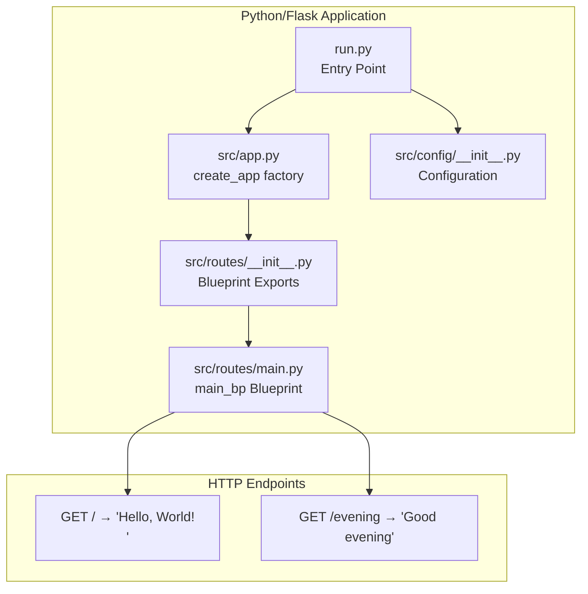
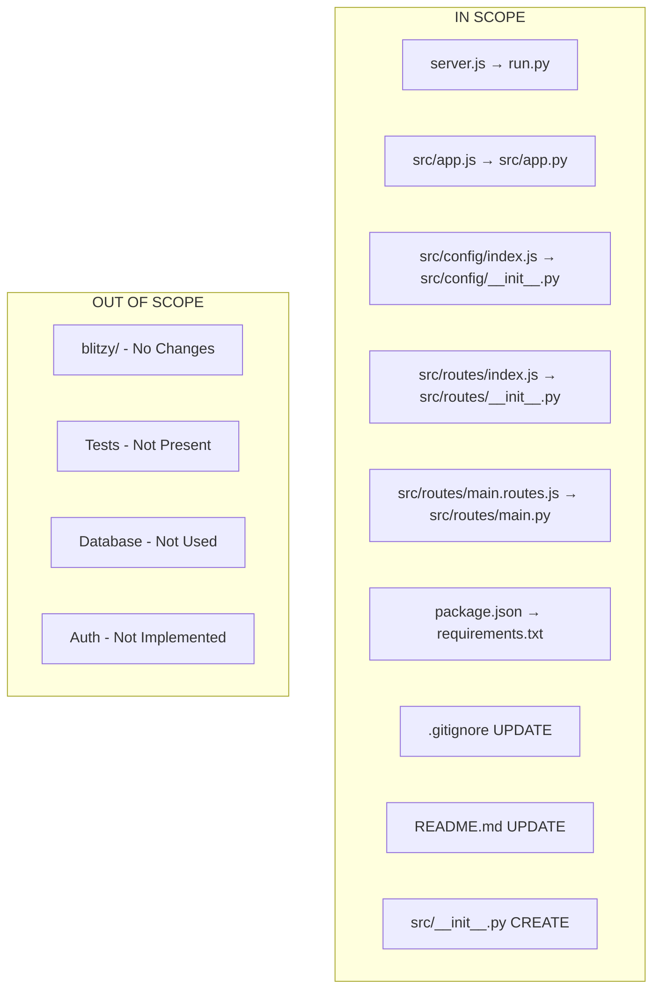

# Technical Specification

# 0. Agent Action Plan

## 0.1 Intent Clarification

Based on the prompt, the Blitzy platform understands that the refactoring objective is to **completely rewrite an existing Node.js/Express.js web server application into a Python 3 Flask application**, preserving 100% feature parity with the original implementation.

### 0.1.1 Core Refactoring Objective

- **Refactoring Type:** Tech stack migration (Node.js/Express → Python 3/Flask)
- **Target Repository:** Same repository (complete replacement of Node.js codebase with Python/Flask equivalent)
- **Migration Scope:** Full application rewrite maintaining identical HTTP API behavior

**Refactoring Goals:**

- Migrate server entry point from `server.js` (Node.js) to `run.py` (Python/Flask)
- Convert Express.js application factory pattern to Flask application factory pattern
- Translate CommonJS module system to Python package structure
- Preserve exact HTTP endpoint behavior including response bodies and status codes
- Maintain configuration management through environment variables
- Replicate the modular architecture: separate config, routes, and app initialization

### 0.1.2 Implicit Requirements

The following implicit technical requirements are derived from the source analysis:

- **API Compatibility:** All HTTP endpoints must return identical response bodies
  - `GET /` must return exactly `Hello, World!\n` (including trailing newline)
  - `GET /evening` must return exactly `Good evening` (no trailing newline)
- **Configuration Preservation:** Environment variable names and defaults must be maintained
  - `HOST` → default `127.0.0.1`
  - `PORT` → default `3000`
  - `NODE_ENV` → `FLASK_ENV` (renamed per Flask convention, default `development`)
- **Startup Behavior:** Console output format preserved: `Server running at http://{host}:{port}/`
- **Testability:** Application factory pattern must allow importing app without starting server

### 0.1.3 Technical Interpretation

This refactoring translates to the following technical transformation strategy:

```
Node.js/Express Architecture    →    Python/Flask Architecture
─────────────────────────────────────────────────────────────────
server.js (entry point)         →    run.py (entry point)
src/app.js (Express factory)    →    src/app.py (Flask factory)
src/config/index.js             →    src/config/__init__.py
src/routes/index.js             →    src/routes/__init__.py
src/routes/main.routes.js       →    src/routes/main.py
package.json                    →    requirements.txt
.gitignore                      →    .gitignore (updated for Python)
README.md                       →    README.md (updated for Flask)
```

### 0.1.4 Framework Mapping

| Express.js Concept | Flask Equivalent | Notes |
|-------------------|------------------|-------|
| `require('express')` | `from flask import Flask` | Framework import |
| `express.Router()` | `Blueprint` | Route grouping mechanism |
| `app.use('/', router)` | `app.register_blueprint(bp)` | Route mounting |
| `app.listen(port, host, callback)` | `app.run(host, port)` | Server binding |
| `res.send(text)` | `return text` | Response handling |
| `module.exports` | Python module/package exports | Module system |
| `process.env.VAR` | `os.environ.get('VAR')` | Environment variables |

### 0.1.5 Special Constraints

- **Exact Response Preservation:** Response strings must match character-for-character including whitespace
- **Default Port:** Flask default is 5000, but must be changed to 3000 for compatibility
- **Synchronous Design:** Flask's synchronous nature matches the original Express implementation
- **No Async Required:** Original Node.js code uses synchronous handlers only

## 0.2 Source Analysis

### 0.2.1 Comprehensive Source File Discovery

The complete Node.js source repository contains the following files requiring analysis and refactoring:

**Repository Root Structure:**
```
/
├── .gitignore                 # Git ignore patterns for Node.js
├── README.md                  # Project documentation  
├── package.json               # Node.js dependency manifest
├── package-lock.json          # Dependency lock file
├── server.js                  # Application entry point
├── src/
│   ├── app.js                 # Express application factory
│   ├── config/
│   │   └── index.js           # Configuration module
│   └── routes/
│       ├── index.js           # Route aggregator
│       └── main.routes.js     # Main route handlers
└── blitzy/
    ├── Project Guide.md       # Generated project guide
    └── Technical Specifications.md  # Technical specifications
```

### 0.2.2 Source File Analysis

**Entry Point: `server.js`**

Responsibilities:
- Imports Express application factory from `src/app.js`
- Imports configuration from `src/config`
- Starts HTTP server with `app.listen()`
- Outputs startup message to console

Key Implementation:
```javascript
const app = require('./src/app');
const config = require('./src/config');
app.listen(config.port, config.host, () => {
    console.log(`Server running at http://${config.host}:${config.port}/`);
});
```

**Application Factory: `src/app.js`**

Responsibilities:
- Creates Express application instance
- Mounts route middleware from `src/routes`
- Exports configured application

Key Implementation:
```javascript
const express = require('express');
const routes = require('./routes');
const app = express();
app.use('/', routes);
module.exports = app;
```

**Configuration Module: `src/config/index.js`**

Responsibilities:
- Reads environment variables with defaults
- Exports configuration object

Key Configuration Values:
| Variable | Default | Purpose |
|----------|---------|---------|
| `HOST` | `127.0.0.1` | Server bind address |
| `PORT` | `3000` | Server bind port |
| `NODE_ENV` | `development` | Runtime environment |

**Route Aggregator: `src/routes/index.js`**

Responsibilities:
- Creates Express Router instance
- Imports and mounts route modules
- Exports combined router

**Route Handlers: `src/routes/main.routes.js`**

Responsibilities:
- Defines HTTP endpoint handlers
- Exports router with registered routes

Endpoints Defined:
| Method | Path | Response | Content-Type |
|--------|------|----------|--------------|
| `GET` | `/` | `Hello, World!\n` | `text/html; charset=utf-8` |
| `GET` | `/evening` | `Good evening` | `text/html; charset=utf-8` |

### 0.2.3 Dependency Analysis

**package.json Dependencies:**
```json
{
  "dependencies": {
    "express": "^5.1.0"
  }
}
```

- **express ^5.1.0:** Web framework - translates to Flask 3.1.0
- **Node.js >=20.x:** Runtime requirement from `package-lock.json`

### 0.2.4 Non-Transferable Files

The following files will be replaced (not converted):

| Source File | Reason | Target Replacement |
|-------------|--------|-------------------|
| `package.json` | Node.js specific | `requirements.txt` |
| `package-lock.json` | npm lock file | Not needed (pip freeze) |
| `.gitignore` | Contains Node.js patterns | Updated for Python |

### 0.2.5 Documentation Files

| File | Action Required |
|------|-----------------|
| `README.md` | UPDATE - Reflect Flask installation and usage |
| `blitzy/*.md` | NO CHANGE - Auto-generated documentation |

## 0.3 Target Design

### 0.3.1 Refactored Structure Planning

The target Flask application structure maintains architectural parity with the source while following Python and Flask conventions:

**Target Architecture:**
```
/
├── .gitignore                 # Updated for Python/Flask
├── README.md                  # Updated for Flask usage
├── requirements.txt           # Python dependencies
├── run.py                     # Application entry point
├── src/
│   ├── __init__.py            # Package initialization
│   ├── app.py                 # Flask application factory
│   ├── config/
│   │   └── __init__.py        # Configuration module
│   └── routes/
│       ├── __init__.py        # Route aggregator (Blueprint registration)
│       └── main.py            # Main route handlers (Blueprint)
└── blitzy/
    ├── Project Guide.md       # Unchanged
    └── Technical Specifications.md  # Unchanged
```

### 0.3.2 Web Search Research Conducted

Research was conducted on the following topics to inform the target design:

- **Node.js Express to Flask migration best practices:** Key findings include maintaining route structure, using Flask Blueprints to replace Express Router, and preserving the application factory pattern
- **Flask application factory pattern conventions:** Use of `create_app()` function that returns a configured Flask instance, allowing testability and multiple configurations
- **Python package structure best practices:** Use of `__init__.py` files for package recognition, modular organization mirroring the source structure

### 0.3.3 Design Pattern Applications

**Application Factory Pattern:**
- Flask's `create_app()` function mirrors Express's module export pattern
- Enables configuration injection for testing
- Supports multiple application instances

**Blueprint Pattern:**
- Flask Blueprints directly map to Express Router instances
- Enable route modularization and grouping
- Support URL prefix mounting (using `/` root prefix)

**Configuration Object Pattern:**
- Python module with configuration class or dictionary
- Environment variable loading via `os.environ`
- Default value fallback mechanism

### 0.3.4 Target File Specifications

**Entry Point: `run.py`**
```python
from src.app import create_app
from src.config import config
app = create_app()
if __name__ == '__main__':
    print(f"Server running at http://{config['host']}:{config['port']}/")
    app.run(host=config['host'], port=config['port'])
```

**Application Factory: `src/app.py`**
```python
from flask import Flask
def create_app():
    app = Flask(__name__)
    from src.routes import main_bp
    app.register_blueprint(main_bp)
    return app
```

**Configuration: `src/config/__init__.py`**
```python
import os
config = {
    'host': os.environ.get('HOST', '127.0.0.1'),
    'port': int(os.environ.get('PORT', 3000)),
    'env': os.environ.get('FLASK_ENV', 'development')
}
```

**Route Blueprint: `src/routes/main.py`**
```python
from flask import Blueprint
main_bp = Blueprint('main', __name__)
@main_bp.route('/')
def index():
    return 'Hello, World!\n'
@main_bp.route('/evening')
def evening():
    return 'Good evening'
```

**Route Aggregator: `src/routes/__init__.py`**
```python
from src.routes.main import main_bp
```

### 0.3.5 Architecture Diagram


```mermaid
graph TB
    subgraph "Python/Flask Application"
        RP[run.py<br/>Entry Point]
        APP[src/app.py<br/>create_app factory]
        CFG[src/config/__init__.py<br/>Configuration]
        RTI[src/routes/__init__.py<br/>Blueprint Exports]
        RTM[src/routes/main.py<br/>main_bp Blueprint]
    end
    
    RP --> APP
    RP --> CFG
    APP --> RTI
    RTI --> RTM
    
    subgraph "HTTP Endpoints"
        E1["GET / → 'Hello, World!\n'"]
        E2["GET /evening → 'Good evening'"]
    end
    
    RTM --> E1
    RTM --> E2
```

### 0.3.6 Package Initialization Files

Each `__init__.py` file serves a specific purpose:

| File | Purpose |
|------|---------|
| `src/__init__.py` | Marks `src` as a Python package |
| `src/config/__init__.py` | Contains configuration logic and exports |
| `src/routes/__init__.py` | Exports `main_bp` Blueprint for registration |

## 0.4 Transformation Mapping

### 0.4.1 File-by-File Transformation Plan

The following table maps every target file to its source equivalent with specific transformation instructions:

| Target File | Transformation | Source File | Key Changes |
|-------------|----------------|-------------|-------------|
| `run.py` | CREATE | `server.js` | Convert Node.js entry point to Python; use Flask app.run() |
| `requirements.txt` | CREATE | `package.json` | Extract Flask dependency; add python-dotenv if needed |
| `src/__init__.py` | CREATE | N/A | Create empty package marker file |
| `src/app.py` | CREATE | `src/app.js` | Convert Express app factory to Flask create_app() pattern |
| `src/config/__init__.py` | CREATE | `src/config/index.js` | Convert CommonJS config to Python module with os.environ |
| `src/routes/__init__.py` | CREATE | `src/routes/index.js` | Convert Express Router aggregation to Blueprint import/export |
| `src/routes/main.py` | CREATE | `src/routes/main.routes.js` | Convert Express routes to Flask Blueprint routes |
| `.gitignore` | UPDATE | `.gitignore` | Replace Node.js patterns with Python patterns |
| `README.md` | UPDATE | `README.md` | Update installation and usage instructions for Flask |

### 0.4.2 Detailed File Transformations

**Entry Point Transformation: `server.js` → `run.py`**

| Aspect | Node.js Source | Python Target |
|--------|---------------|---------------|
| Import app | `const app = require('./src/app')` | `from src.app import create_app` |
| Import config | `const config = require('./src/config')` | `from src.config import config` |
| Create instance | Implicit via require | `app = create_app()` |
| Start server | `app.listen(port, host, callback)` | `app.run(host=..., port=...)` |
| Console output | `console.log(...)` | `print(...)` |

**Application Factory Transformation: `src/app.js` → `src/app.py`**

| Aspect | Node.js Source | Python Target |
|--------|---------------|---------------|
| Framework import | `const express = require('express')` | `from flask import Flask` |
| Router import | `const routes = require('./routes')` | `from src.routes import main_bp` |
| App creation | `const app = express()` | `app = Flask(__name__)` |
| Route mounting | `app.use('/', routes)` | `app.register_blueprint(main_bp)` |
| Export | `module.exports = app` | `return app` from function |

**Configuration Transformation: `src/config/index.js` → `src/config/__init__.py`**

| Aspect | Node.js Source | Python Target |
|--------|---------------|---------------|
| Env access | `process.env.VAR` | `os.environ.get('VAR')` |
| Default value | `process.env.VAR \|\| 'default'` | `os.environ.get('VAR', 'default')` |
| Port type | String (implicit) | `int(...)` cast required |
| Export | `module.exports = { ... }` | `config = { ... }` module-level dict |

**Route Transformation: `src/routes/main.routes.js` → `src/routes/main.py`**

| Aspect | Node.js Source | Python Target |
|--------|---------------|---------------|
| Router creation | `const router = express.Router()` | `main_bp = Blueprint('main', __name__)` |
| Route definition | `router.get('/', handler)` | `@main_bp.route('/')` decorator |
| Handler function | `(req, res) => { res.send(...) }` | `def handler(): return ...` |
| Response | `res.send('text')` | `return 'text'` |
| Export | `module.exports = router` | Blueprint auto-available via import |

### 0.4.3 Import Statement Transformations

**Global Import Updates Required:**

| Original Pattern | Transformed Pattern | Files Affected |
|-----------------|---------------------|----------------|
| `require('express')` | `from flask import Flask` | `src/app.py` |
| `require('./routes')` | `from src.routes import main_bp` | `src/app.py` |
| `require('./src/app')` | `from src.app import create_app` | `run.py` |
| `require('./src/config')` | `from src.config import config` | `run.py` |
| `require('./main.routes')` | `from src.routes.main import main_bp` | `src/routes/__init__.py` |
| `express.Router()` | `Blueprint('name', __name__)` | `src/routes/main.py` |
| `process.env` | `os.environ` | `src/config/__init__.py` |

### 0.4.4 Response Behavior Preservation

Critical response preservation mapping:

| Endpoint | Original Response | Python Implementation | Verification |
|----------|-------------------|----------------------|--------------|
| `GET /` | `"Hello, World!\n"` | `return 'Hello, World!\n'` | Includes `\n` newline |
| `GET /evening` | `"Good evening"` | `return 'Good evening'` | No trailing newline |

### 0.4.5 Files to Delete (Node.js-Specific)

The following files should be removed as they are Node.js-specific:

| File to Delete | Reason |
|---------------|--------|
| `server.js` | Replaced by `run.py` |
| `package.json` | Replaced by `requirements.txt` |
| `package-lock.json` | Node.js lock file not needed |
| `src/app.js` | Replaced by `src/app.py` |
| `src/config/index.js` | Replaced by `src/config/__init__.py` |
| `src/routes/index.js` | Replaced by `src/routes/__init__.py` |
| `src/routes/main.routes.js` | Replaced by `src/routes/main.py` |

### 0.4.6 One-Phase Execution

The entire refactoring operation will be executed by Blitzy in **ONE phase**. All file transformations, deletions, and creations will occur atomically to ensure system integrity.

**Execution Order:**
1. Create all Python files (`run.py`, `requirements.txt`, `src/**/*.py`)
2. Update existing files (`.gitignore`, `README.md`)
3. Remove obsolete Node.js files (`server.js`, `package*.json`, `src/**/*.js`)

## 0.5 Dependency Inventory

### 0.5.1 Key Private and Public Packages

The following table documents all dependencies required for the Flask application:

| Registry | Package Name | Version | Purpose |
|----------|-------------|---------|---------|
| PyPI | `Flask` | `3.1.0` | Web application framework (replaces Express.js) |
| PyPI | `Werkzeug` | `>=3.1.0` | WSGI utilities (auto-installed with Flask) |
| PyPI | `Jinja2` | `>=3.1.0` | Template engine (auto-installed with Flask) |
| PyPI | `MarkupSafe` | `>=2.0` | Safe string handling (auto-installed) |
| PyPI | `ItsDangerous` | `>=2.2.0` | Data signing (auto-installed with Flask) |
| PyPI | `click` | `>=8.0` | CLI framework (auto-installed with Flask) |
| PyPI | `Blinker` | `>=1.9.0` | Signal support (auto-installed with Flask) |
| Runtime | `Python` | `>=3.9` | Python runtime (Flask 3.1.x requirement) |

### 0.5.2 Source to Target Dependency Mapping

| Source Dependency (Node.js) | Target Dependency (Python) | Notes |
|----------------------------|---------------------------|-------|
| `express@^5.1.0` | `Flask==3.1.0` | Primary web framework |
| `node@>=20.x` | `Python>=3.9` | Runtime environment |
| npm ecosystem | PyPI ecosystem | Package registry |

### 0.5.3 Requirements File Content

**Target: `requirements.txt`**
```
Flask==3.1.0
```

Flask 3.1.0 automatically installs all required sub-dependencies (Werkzeug, Jinja2, etc.).

### 0.5.4 Environment Variable Mapping

The following environment variables are preserved with updated naming conventions where appropriate:

| Source Variable | Target Variable | Default | Type | Description |
|----------------|-----------------|---------|------|-------------|
| `HOST` | `HOST` | `127.0.0.1` | string | Server bind address |
| `PORT` | `PORT` | `3000` | integer | Server bind port |
| `NODE_ENV` | `FLASK_ENV` | `development` | string | Runtime environment mode |

**User-Provided Environment Variables:**
The following environment variables were specified by the user and should be available:
- `Api Key`
- `Token`
- `https://8008`

### 0.5.5 Import Refactoring

**Files Requiring Import Updates:**

| File | Old Import Style | New Import Style |
|------|-----------------|------------------|
| `run.py` | N/A (new file) | `from src.app import create_app` |
| `run.py` | N/A (new file) | `from src.config import config` |
| `src/app.py` | N/A (new file) | `from flask import Flask` |
| `src/app.py` | N/A (new file) | `from src.routes import main_bp` |
| `src/config/__init__.py` | N/A (new file) | `import os` |
| `src/routes/__init__.py` | N/A (new file) | `from src.routes.main import main_bp` |
| `src/routes/main.py` | N/A (new file) | `from flask import Blueprint` |

### 0.5.6 Python Version Requirements

Based on Flask 3.1.0 requirements:

| Requirement | Specification | Verification |
|-------------|--------------|--------------|
| Minimum Python | 3.9 | Flask 3.1.x dropped Python 3.8 support |
| Recommended Python | 3.11 or 3.12 | Latest stable versions |
| Maximum Python | 3.13+ | Forward compatible |

### 0.5.7 Development vs Production Dependencies

| Dependency Type | Packages | Installation |
|----------------|----------|--------------|
| Production | `Flask==3.1.0` | `pip install -r requirements.txt` |
| Development (Optional) | `pytest`, `pytest-cov` | For testing if needed |
| Development (Optional) | `python-dotenv` | For .env file support |

### 0.5.8 External Reference Updates

The following configuration and documentation files require updates to reflect the new dependency structure:

| File Pattern | Update Required |
|--------------|-----------------|
| `README.md` | Installation instructions (npm → pip) |
| `.gitignore` | Python patterns (`__pycache__/`, `*.pyc`, `venv/`) |

## 0.6 Scope Boundaries

### 0.6.1 Exhaustively In Scope

**Source Files for Transformation:**
- `server.js` - Entry point transformation
- `src/app.js` - Application factory transformation
- `src/config/index.js` - Configuration module transformation
- `src/routes/index.js` - Route aggregator transformation
- `src/routes/main.routes.js` - Route handler transformation

**Target Files to Create:**
- `run.py` - New Python entry point
- `requirements.txt` - Python dependency manifest
- `src/__init__.py` - Package initialization
- `src/app.py` - Flask application factory
- `src/config/__init__.py` - Configuration module
- `src/routes/__init__.py` - Blueprint exports
- `src/routes/main.py` - Route Blueprint handlers

**Configuration Updates:**
- `.gitignore` - Update patterns for Python ecosystem
- `README.md` - Update documentation for Flask installation and usage

**Documentation Updates:**
- `README.md` - Comprehensive rewrite for Python/Flask usage
  - Installation instructions (Python, pip, virtualenv)
  - Running instructions (`python run.py` or `flask run`)
  - Environment variable documentation

### 0.6.2 Explicitly Out of Scope

**No Changes Required:**
- `blitzy/` directory - Auto-generated documentation files
  - `blitzy/Project Guide.md` - No modification
  - `blitzy/Technical Specifications.md` - No modification

**Not Applicable (No Test Files Present):**
- Test file updates - Source project contains no test files
- Test configuration - No test framework configuration exists

**Not Included:**
- Database migrations - Source uses no database
- Authentication/Authorization - Source implements no auth
- Static file serving - Source serves no static files
- Template rendering - Source returns plain text only
- CORS configuration - Source has no CORS setup
- Logging configuration - Source uses basic console.log only
- Error handling middleware - Source uses Express defaults

### 0.6.3 Scope Validation Matrix

| Component | Source Has | Target Needs | In Scope |
|-----------|-----------|--------------|----------|
| HTTP Server | ✓ | ✓ | ✓ |
| Route Handlers | ✓ | ✓ | ✓ |
| Configuration | ✓ | ✓ | ✓ |
| Dependency Manifest | ✓ | ✓ | ✓ |
| Git Ignore | ✓ | ✓ | ✓ |
| README | ✓ | ✓ | ✓ |
| Tests | ✗ | ✗ | ✗ |
| Database | ✗ | ✗ | ✗ |
| Authentication | ✗ | ✗ | ✗ |
| Static Files | ✗ | ✗ | ✗ |
| Templates | ✗ | ✗ | ✗ |

### 0.6.4 Feature Parity Checklist

All source features must be preserved in the target:

| Feature | Source Implementation | Target Implementation | Status |
|---------|----------------------|----------------------|--------|
| `GET /` endpoint | `res.send('Hello, World!\n')` | `return 'Hello, World!\n'` | Required |
| `GET /evening` endpoint | `res.send('Good evening')` | `return 'Good evening'` | Required |
| Environment config | `process.env` | `os.environ` | Required |
| Default HOST | `127.0.0.1` | `127.0.0.1` | Required |
| Default PORT | `3000` | `3000` | Required |
| Startup message | Console output | Print statement | Required |
| Factory pattern | Module export | `create_app()` | Required |
| Modular routes | Express Router | Flask Blueprint | Required |

### 0.6.5 Boundary Diagram


```mermaid
graph TB
    subgraph "IN SCOPE"
        S1[server.js → run.py]
        S2[src/app.js → src/app.py]
        S3[src/config/index.js → src/config/__init__.py]
        S4[src/routes/index.js → src/routes/__init__.py]
        S5[src/routes/main.routes.js → src/routes/main.py]
        S6[package.json → requirements.txt]
        S7[.gitignore UPDATE]
        S8[README.md UPDATE]
        S9[src/__init__.py CREATE]
    end
    
    subgraph "OUT OF SCOPE"
        O1[blitzy/ - No Changes]
        O2[Tests - Not Present]
        O3[Database - Not Used]
        O4[Auth - Not Implemented]
    end
```

### 0.6.6 Files Summary by Action

| Action | Files |
|--------|-------|
| CREATE | `run.py`, `requirements.txt`, `src/__init__.py`, `src/app.py`, `src/config/__init__.py`, `src/routes/__init__.py`, `src/routes/main.py` |
| UPDATE | `.gitignore`, `README.md` |
| DELETE | `server.js`, `package.json`, `package-lock.json`, `src/app.js`, `src/config/index.js`, `src/routes/index.js`, `src/routes/main.routes.js` |
| NO CHANGE | `blitzy/Project Guide.md`, `blitzy/Technical Specifications.md` |

## 0.7 Special Instructions for Refactoring

### 0.7.1 User-Specified Requirements

The user has explicitly emphasized the following critical requirements:

> **"Rewrite this Node.js server into a Python 3 Flask application, keeping every feature and functionality exactly as in the original Node.js project. Ensure the rewritten version fully matches the behavior and logic of the current implementation."**

This mandate translates to the following non-negotiable requirements:

- **100% Feature Parity:** Every endpoint must return identical responses
- **Exact Behavior Match:** Response bodies, status codes, and content types must be preserved
- **Logic Preservation:** Application flow and configuration handling must remain functionally identical
- **Complete Rewrite:** All Node.js code must be converted to Python/Flask equivalents

### 0.7.2 Response Preservation Requirements

**Critical Response Validation:**

| Endpoint | Exact Response | Character Count | Notes |
|----------|---------------|-----------------|-------|
| `GET /` | `Hello, World!\n` | 14 characters | MUST include trailing newline (`\n`) |
| `GET /evening` | `Good evening` | 12 characters | NO trailing whitespace |

**Response Headers:**
- Default Flask response type: `text/html; charset=utf-8`
- Matches Express default behavior

### 0.7.3 Configuration Preservation Requirements

**Environment Variables Must Be Honored:**
```python
HOST = os.environ.get('HOST', '127.0.0.1')
PORT = int(os.environ.get('PORT', 3000))
```

**Port Number Override:**
- Flask default port is 5000
- This application MUST use port 3000 to match Node.js behavior
- The `PORT` environment variable default MUST be `3000`, not `5000`

### 0.7.4 Startup Message Preservation

The console output on startup must match the original format:

**Original Node.js:**
```
Server running at http://127.0.0.1:3000/
```

**Required Flask Output:**
```
Server running at http://127.0.0.1:3000/
```

Implementation:
```python
print(f"Server running at http://{config['host']}:{config['port']}/")
```

### 0.7.5 Application Factory Pattern Requirements

The Flask application MUST use the factory pattern to enable:
- Importing the app without starting the server
- Potential future testing scenarios
- Configuration injection capability

**Required Pattern:**
```python
def create_app():
    app = Flask(__name__)
    # ... configure app
    return app
```

**NOT Acceptable:**
```python
app = Flask(__name__)  # Global instantiation
```

### 0.7.6 Package Structure Requirements

The `src/` directory must be a proper Python package:

| File | Requirement |
|------|-------------|
| `src/__init__.py` | MUST exist (can be empty) |
| `src/config/__init__.py` | MUST contain configuration code |
| `src/routes/__init__.py` | MUST export `main_bp` Blueprint |

### 0.7.7 Blueprint Naming Convention

| Blueprint | Variable Name | Registration |
|-----------|--------------|--------------|
| Main routes | `main_bp` | `app.register_blueprint(main_bp)` |

The Blueprint must be registered at the root URL prefix (no prefix modification).

### 0.7.8 User-Provided Setup Instructions

The user specified:
```
npm run
```

This is interpreted as the original project's run command. The equivalent Python command will be:
```bash
python run.py
```

Or using Flask CLI:
```bash
flask run --host=127.0.0.1 --port=3000
```

### 0.7.9 Environment Variables from User

The user has provided the following environment variables:
- `Api Key`
- `Token`
- `https://8008`

These should be available in the runtime environment but are not used by the current application logic. They remain available for potential future use.

### 0.7.10 Validation Criteria

The refactoring will be considered successful when:

| Criteria | Validation Method |
|----------|------------------|
| `GET /` returns correct response | `curl http://127.0.0.1:3000/` returns `Hello, World!\n` |
| `GET /evening` returns correct response | `curl http://127.0.0.1:3000/evening` returns `Good evening` |
| Server starts on correct port | Application binds to port 3000 |
| Configuration reads environment | Setting `PORT=8080` changes bind port |
| Factory pattern works | `from src.app import create_app` succeeds |
| All Python files valid | No syntax errors on import |
| Requirements installable | `pip install -r requirements.txt` succeeds |

### 0.7.11 Summary of Special Instructions

| Instruction | Priority | Status |
|-------------|----------|--------|
| Maintain all endpoint behaviors | CRITICAL | Required |
| Preserve exact response strings | CRITICAL | Required |
| Use Flask 3.1.0 | HIGH | Required |
| Use Python 3.9+ | HIGH | Required |
| Use Application Factory pattern | HIGH | Required |
| Use Blueprints for routes | HIGH | Required |
| Default PORT to 3000 | HIGH | Required |
| Preserve startup console message | MEDIUM | Required |
| Update README for Flask usage | MEDIUM | Required |
| Update .gitignore for Python | MEDIUM | Required |

