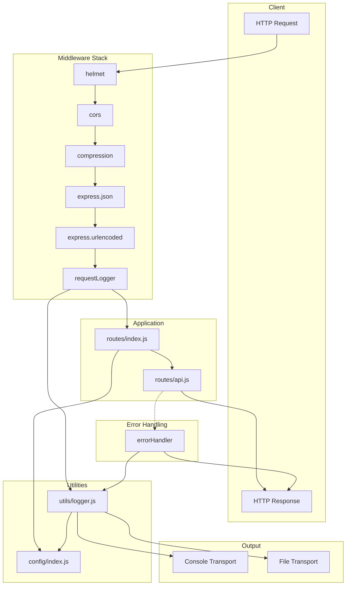

# Technical Specification

# 0. Agent Action Plan

## 0.1 Intent Clarification

### 0.1.1 Core Objective

Based on the provided requirements, the Blitzy platform understands that the objective is to **transform a basic Node.js HTTP server into a production-ready Express.js application** with enterprise-grade capabilities including:

- **Enhanced Routing Architecture**: Modularize the current monolithic route definitions into a scalable router-based structure that supports future API expansion
- **Middleware Integration**: Implement a comprehensive middleware stack including request parsing, security headers, logging, error handling, and CORS support
- **Environment Configuration**: Externalize all configuration values using the dotenv pattern, enabling environment-specific settings for development, staging, and production
- **Structured Logging**: Replace console.log statements with Winston logger integrated with Morgan for HTTP request logging, supporting multiple transports and log levels
- **Production Process Management**: Configure PM2 for process supervision, clustering, automatic restart, and zero-downtime deployments

The implicit requirements detected include:
- Separation of concerns through modular file organization
- Graceful error handling with proper HTTP status codes
- Security hardening through helmet middleware
- Request body parsing for JSON and URL-encoded payloads
- Startup scripts for different environments

### 0.1.2 Task Categorization

| Attribute | Classification |
|-----------|----------------|
| **Primary task type** | Feature Enhancement / Configuration |
| **Secondary aspects** | Infrastructure setup, Production readiness, Security hardening |
| **Scope classification** | Cross-cutting change (affects application structure, dependencies, and deployment) |

### 0.1.3 Special Instructions and Constraints

**Critical Directives Captured:**
- Maintain backward compatibility with existing `/` and `/evening` routes
- Use Express.js framework (already present as Express 5.1.0)
- Implement PM2 for production deployment (not Docker or containerization)
- Follow Node.js best practices for middleware ordering
- Keep configuration externalized for multi-environment support

**Methodological Requirements:**
- Apply the Single Responsibility Principle to middleware functions
- Use environment variables for all configurable values
- Structure logs in JSON format for production environments
- Implement cluster mode in PM2 for multi-core utilization

**Note on Documentation Conflict:** The existing `blitzy/documentation` folder contains specifications for a Python/Flask migration. This Agent Action Plan explicitly supersedes that migration path and focuses on enhancing the existing Node.js/Express stack as directed by the current user requirements.

### 0.1.4 Technical Interpretation

These requirements translate to the following technical implementation strategy:

- **To achieve modular routing**, we will create a dedicated `routes/` directory with `index.js` as the router aggregator and separate route files for different API domains
- **To implement middleware**, we will create a `middleware/` directory containing `errorHandler.js`, `requestLogger.js`, and configure built-in Express middleware in a specific order
- **To enable environment configuration**, we will create a `config/` directory with `index.js` exporting validated environment variables, supported by a `.env.example` template
- **To establish structured logging**, we will create a `utils/logger.js` module using Winston with console and file transports, integrated with Morgan middleware
- **To prepare for production deployment**, we will create `ecosystem.config.js` for PM2 configuration with cluster mode, environment-specific settings, and log management


## 0.2 Repository Scope Discovery

### 0.2.1 Comprehensive File Analysis

**Current Repository Structure:**

```
/
├── .git/                    # Git version control
├── .gitignore               # Standard Node.js ignore patterns
├── README.md                # Basic project documentation
├── blitzy/                  # Documentation folder (contains legacy migration specs)
│   └── documentation/
│       ├── Project Guide.md
│       └── Technical Specifications.md
├── package.json             # NPM manifest (express ^5.1.0)
├── package-lock.json        # Dependency lock file
└── server.js                # Main application entry point (19 lines)
```

**Analysis of Existing Files:**

| File | Purpose | Current State | Required Changes |
|------|---------|---------------|------------------|
| `server.js` | Application entry point | Basic Express app with hardcoded port 3000, two routes | Refactor to import modular routes, middleware, and config |
| `package.json` | NPM configuration | Minimal with only express dependency | Add new dependencies, update scripts |
| `.gitignore` | Git ignore patterns | Standard Node.js patterns (node_modules, .env, logs) | Already configured correctly |
| `README.md` | Documentation | Basic one-liner | Update with setup instructions and API documentation |

**Files to be Created:**

| File Path | Purpose |
|-----------|---------|
| `.env` | Local environment variables (development) |
| `.env.example` | Template for environment variables |
| `config/index.js` | Centralized configuration module |
| `routes/index.js` | Router aggregator |
| `routes/api.js` | API route definitions |
| `middleware/errorHandler.js` | Global error handling middleware |
| `middleware/requestLogger.js` | HTTP request logging middleware |
| `utils/logger.js` | Winston logger configuration |
| `ecosystem.config.js` | PM2 configuration file |
| `logs/.gitkeep` | Ensure logs directory exists in git |

### 0.2.2 Web Search Research Conducted

**Research Topics and Findings:**

| Topic | Key Findings |
|-------|--------------|
| Express.js middleware best practices | Order middleware correctly: built-in parsers first, then logging, then routes, then error handlers. Use `next()` consistently. Implement error-handling middleware with 4 parameters. |
| PM2 production deployment | Use `ecosystem.config.js` for configuration. Enable cluster mode with `instances: "max"`. Use `pm2 reload` for zero-downtime. Configure startup scripts with `pm2 startup`. |
| Winston logging setup | Create logger with multiple transports (Console, File). Use Morgan integration for HTTP logs. Set log level via environment variable. Use JSON format in production. |
| dotenv environment configuration | Load dotenv at application start. Validate required variables. Use `.env.example` for documentation. Never commit `.env` to version control. |

### 0.2.3 Existing Infrastructure Assessment

**Current Project Structure:**
- **Framework**: Express.js 5.1.0 (latest stable with native async/await error handling)
- **Node.js Version**: Compatible with Node.js 18+ (tested with v20.19.6)
- **Module System**: CommonJS (`require`/`module.exports`)
- **Build/Deploy**: None currently configured
- **Testing**: No tests defined (`npm test` exits with error)
- **Logging**: Basic `console.log` only

**Patterns to Follow:**
- Keep CommonJS module syntax for consistency
- Use async/await for asynchronous operations
- Apply Express 5.x automatic promise rejection handling

**Gaps Identified:**
- No structured configuration management
- No middleware beyond default Express behavior
- No production process manager
- No structured logging
- Hardcoded server configuration


## 0.3 File Transformation Mapping

### 0.3.1 File-by-File Execution Plan

| Target File | Transformation | Source File/Reference | Purpose/Changes |
|-------------|----------------|----------------------|-----------------|
| `server.js` | UPDATE | `server.js` | Refactor to use modular architecture: import config, middleware, routes, and logger; remove hardcoded values |
| `package.json` | UPDATE | `package.json` | Add dependencies (winston, morgan, helmet, cors, dotenv, compression), update scripts for dev/prod |
| `README.md` | UPDATE | `README.md` | Add comprehensive setup instructions, API documentation, and deployment guide |
| `.env` | CREATE | N/A | Development environment variables (PORT, NODE_ENV, LOG_LEVEL) |
| `.env.example` | CREATE | N/A | Template documenting all required environment variables |
| `config/index.js` | CREATE | N/A | Centralized configuration module exporting validated environment variables |
| `routes/index.js` | CREATE | `server.js` | Router aggregator combining all route modules |
| `routes/api.js` | CREATE | `server.js` | Migrate existing routes (/, /evening) and add health check endpoint |
| `middleware/errorHandler.js` | CREATE | N/A | Global error handling middleware with structured error responses |
| `middleware/requestLogger.js` | CREATE | N/A | Morgan middleware configured to stream to Winston logger |
| `utils/logger.js` | CREATE | N/A | Winston logger with console and file transports |
| `ecosystem.config.js` | CREATE | N/A | PM2 configuration for production deployment with cluster mode |
| `logs/.gitkeep` | CREATE | N/A | Empty file to ensure logs directory is tracked |
| `.gitignore` | UPDATE | `.gitignore` | Add ecosystem.config.js local overrides if needed |

### 0.3.2 New Files Detail

**`.env`** - Development environment variables
- Content type: Configuration
- Key variables: PORT, NODE_ENV, LOG_LEVEL, LOG_DIR

**`.env.example`** - Environment variable template
- Content type: Documentation/Configuration
- Key sections: Server settings, logging configuration, optional integrations

**`config/index.js`** - Configuration module
- Content type: Source code
- Based on: dotenv best practices
- Key exports: port, nodeEnv, logLevel, logDir with defaults and validation

**`routes/index.js`** - Router aggregator
- Content type: Source code
- Key functionality: Mount all route modules, export combined router

**`routes/api.js`** - API routes
- Content type: Source code
- Key endpoints: GET /, GET /evening, GET /health

**`middleware/errorHandler.js`** - Error handler
- Content type: Source code
- Key functionality: Catch-all error middleware, structured JSON responses, log errors

**`middleware/requestLogger.js`** - Request logger
- Content type: Source code
- Key functionality: Morgan middleware streaming to Winston

**`utils/logger.js`** - Winston logger
- Content type: Source code
- Key functionality: Multi-transport logging (Console, File), JSON format, log levels

**`ecosystem.config.js`** - PM2 configuration
- Content type: Configuration
- Key settings: Cluster mode, environment variables, log paths, restart policy

### 0.3.3 Files to Modify Detail

**`server.js`** - Main application entry point
- Sections to update: Entire file restructure
- New content to add:
  - Import statements for config, logger, middleware, routes
  - Middleware chain setup (json, urlencoded, helmet, cors, compression, requestLogger)
  - Route mounting
  - Error handler middleware (last in chain)
  - Graceful shutdown handler
- Content to remove:
  - Hardcoded hostname and port
  - Inline route definitions

**`package.json`** - NPM configuration
- Sections to update: dependencies, scripts, engines
- New content to add:
  - dependencies: winston, morgan, helmet, cors, dotenv, compression
  - devDependencies: nodemon (optional)
  - scripts: start, dev, prod
  - engines: node version constraint

**`README.md`** - Project documentation
- Sections to add:
  - Prerequisites
  - Installation steps
  - Environment configuration
  - Running in development
  - Production deployment with PM2
  - API endpoints documentation

### 0.3.4 Configuration and Documentation Updates

**Configuration Changes:**

| Config File | Settings to Update | Impact |
|-------------|-------------------|--------|
| `package.json` | Add `"engines": { "node": ">=18.0.0" }` | Enforces minimum Node.js version |
| `package.json` | Add `"start:dev": "node -r dotenv/config server.js"` | Development startup with dotenv |
| `package.json` | Add `"start:prod": "pm2 start ecosystem.config.js"` | Production startup with PM2 |
| `.gitignore` | Ensure `.env` and `logs/*.log` are ignored | Prevents sensitive data in repo |

**Documentation Updates:**

| Doc File | Sections to Add/Update |
|----------|----------------------|
| `README.md` | Installation, Configuration, Development, Production, API Reference |

### 0.3.5 Cross-File Dependencies

**Import/Reference Updates Required:**

```
server.js
├── imports config/index.js
├── imports utils/logger.js
├── imports middleware/requestLogger.js
├── imports middleware/errorHandler.js
└── imports routes/index.js

routes/index.js
└── imports routes/api.js

middleware/requestLogger.js
└── imports utils/logger.js

middleware/errorHandler.js
└── imports utils/logger.js
```

**Configuration Sync Requirements:**
- `.env` variables must match `config/index.js` expected keys
- `ecosystem.config.js` environment variables must align with `.env.example`
- PM2 log paths must match `LOG_DIR` configuration


## 0.4 Dependency Inventory

### 0.4.1 Key Private and Public Packages

| Registry | Package Name | Version | Purpose |
|----------|--------------|---------|---------|
| npm | express | ^5.1.0 | Web framework (existing dependency) |
| npm | winston | ^3.17.0 | Structured logging library |
| npm | morgan | ^1.10.0 | HTTP request logging middleware |
| npm | helmet | ^8.0.0 | Security headers middleware |
| npm | cors | ^2.8.5 | Cross-Origin Resource Sharing middleware |
| npm | dotenv | ^16.4.7 | Environment variable management |
| npm | compression | ^1.7.5 | Response compression middleware |

**Development Dependencies:**

| Registry | Package Name | Version | Purpose |
|----------|--------------|---------|---------|
| npm | nodemon | ^3.1.9 | Auto-restart during development |

**Global Tools (Production):**

| Tool | Version | Purpose |
|------|---------|---------|
| pm2 | ^6.0.0 | Production process manager |

### 0.4.2 Dependency Updates

**New Dependencies to Add:**

| Package | Version | Reason for Addition |
|---------|---------|---------------------|
| winston | ^3.17.0 | Required for structured logging with multiple transports |
| morgan | ^1.10.0 | Required for HTTP request logging, integrates with Winston |
| helmet | ^8.0.0 | Required for security headers (X-Frame-Options, CSP, etc.) |
| cors | ^2.8.5 | Required for handling cross-origin requests |
| dotenv | ^16.4.7 | Required for environment variable management from .env files |
| compression | ^1.7.5 | Required for gzip response compression in production |
| nodemon | ^3.1.9 | Recommended for development auto-restart (devDependency) |

**Dependencies to Update:**
- None - Express 5.1.0 is the latest stable version

**Dependencies to Remove:**
- None

### 0.4.3 Import/Reference Updates

**Files Requiring Import Updates:**

| File | Import Changes |
|------|----------------|
| `server.js` | Add imports for dotenv, helmet, cors, compression, custom modules |
| `middleware/requestLogger.js` | Add imports for morgan, utils/logger |
| `middleware/errorHandler.js` | Add imports for utils/logger |
| `utils/logger.js` | Add imports for winston |
| `config/index.js` | Add imports for dotenv |

**Import Transformation Examples:**

```javascript
// server.js - Before
const express = require('express');

// server.js - After  
require('dotenv').config();
const express = require('express');
const helmet = require('helmet');
const cors = require('cors');
const compression = require('compression');
const config = require('./config');
const logger = require('./utils/logger');
const routes = require('./routes');
```

### 0.4.4 Package.json Updates

**Target `package.json` Structure:**

```json
{
  "name": "hello_world",
  "version": "1.0.0",
  "description": "Production-ready Express.js server",
  "main": "server.js",
  "engines": {
    "node": ">=18.0.0"
  },
  "scripts": {
    "start": "node server.js",
    "dev": "nodemon server.js",
    "prod": "pm2 start ecosystem.config.js --env production",
    "test": "echo \"Error: no test specified\" && exit 1"
  },
  "dependencies": {
    "compression": "^1.7.5",
    "cors": "^2.8.5",
    "dotenv": "^16.4.7",
    "express": "^5.1.0",
    "helmet": "^8.0.0",
    "morgan": "^1.10.0",
    "winston": "^3.17.0"
  },
  "devDependencies": {
    "nodemon": "^3.1.9"
  }
}
```


## 0.5 Implementation Design

### 0.5.1 Technical Approach

**Primary Objectives with Implementation Approach:**

| Objective | Implementation Approach | Rationale |
|-----------|------------------------|-----------|
| Modular routing | Create `routes/` directory with Express Router modules | Enables scalable API organization and easier testing |
| Middleware stack | Configure middleware in `server.js` in proper order | Express processes middleware sequentially; order matters for security and logging |
| Environment config | Use dotenv + config module pattern | Separates configuration from code; enables multi-environment support |
| Structured logging | Winston with Morgan integration | Industry-standard logging with multiple output targets |
| Production deployment | PM2 with ecosystem.config.js | Enables clustering, monitoring, and zero-downtime deployments |

**Logical Implementation Flow:**

1. **First**, establish the configuration foundation by creating `config/index.js` and `.env` files to externalize all settings
2. **Second**, create the logging infrastructure in `utils/logger.js` to enable structured logging throughout the application
3. **Third**, implement middleware modules (`middleware/requestLogger.js`, `middleware/errorHandler.js`) that depend on the logger
4. **Fourth**, migrate routes to modular structure in `routes/` directory
5. **Fifth**, refactor `server.js` to compose all modules with proper middleware ordering
6. **Finally**, create `ecosystem.config.js` for PM2 production deployment configuration

### 0.5.2 Component Impact Analysis

**Direct Modifications Required:**

| Component | Modification | Effect |
|-----------|--------------|--------|
| `server.js` | Complete restructure | Transforms from monolithic to modular architecture |
| `package.json` | Add dependencies and scripts | Enables new functionality and deployment options |
| `.gitignore` | Verify patterns | Ensures sensitive files excluded |

**Indirect Impacts and Dependencies:**

| Component | Impact | Reason |
|-----------|--------|--------|
| Application startup | Requires dotenv configuration | Environment variables must load before app initialization |
| Error responses | Standardized JSON format | errorHandler middleware normalizes all error responses |
| Log files | New directory structure | Logs written to `logs/` directory |

**New Components Introduction:**

| Component | Type | Responsibility |
|-----------|------|----------------|
| `config/index.js` | Module | Centralize and validate environment configuration |
| `utils/logger.js` | Module | Provide consistent logging interface across application |
| `middleware/requestLogger.js` | Middleware | Log all HTTP requests with timing information |
| `middleware/errorHandler.js` | Middleware | Catch and format all unhandled errors |
| `routes/index.js` | Router | Aggregate and mount all route modules |
| `routes/api.js` | Router | Define API endpoints |
| `ecosystem.config.js` | Config | PM2 process management configuration |

### 0.5.3 Critical Implementation Details

**Middleware Order (Critical):**

```
1. helmet()           - Security headers (first for protection)
2. cors()             - CORS headers
3. compression()      - Response compression
4. express.json()     - Parse JSON bodies
5. express.urlencoded() - Parse URL-encoded bodies
6. requestLogger      - Log incoming requests
7. routes             - Application routes
8. errorHandler       - Error handling (must be last)
```

**Winston Logger Configuration:**

```javascript
// Key configuration elements
const logger = winston.createLogger({
  level: process.env.LOG_LEVEL || 'info',
  format: winston.format.combine(
    winston.format.timestamp(),
    winston.format.json()
  ),
  transports: [
    new winston.transports.Console(),
    new winston.transports.File({ 
      filename: 'logs/error.log', 
      level: 'error' 
    }),
    new winston.transports.File({ 
      filename: 'logs/combined.log' 
    })
  ]
});
```

**PM2 Cluster Configuration:**

```javascript
// Key ecosystem.config.js elements
module.exports = {
  apps: [{
    name: 'hello-world',
    script: './server.js',
    instances: 'max',       // Utilize all CPU cores
    exec_mode: 'cluster',   // Enable clustering
    env_production: {
      NODE_ENV: 'production',
      PORT: 3000
    }
  }]
};
```

**Error Handling Strategy:**
- Express 5.x automatically handles async/await errors
- All synchronous errors caught by try-catch in route handlers
- Global error handler provides consistent JSON error responses
- Errors logged with full stack trace to error.log

**Data Flow:**

```
Request → Helmet → CORS → Compression → JSON Parser → 
Request Logger → Routes → Response
                    ↓ (on error)
              Error Handler → Error Response
```

### 0.5.4 Architecture Diagram


```mermaid
graph TB
    subgraph "Client"
        REQ[HTTP Request]
        RES[HTTP Response]
    end
    
    subgraph "Middleware Stack"
        HELM[helmet]
        CORS[cors]
        COMP[compression]
        JSON[express.json]
        URL[express.urlencoded]
        RLOG[requestLogger]
    end
    
    subgraph "Application"
        ROUTES[routes/index.js]
        API[routes/api.js]
    end
    
    subgraph "Error Handling"
        ERR[errorHandler]
    end
    
    subgraph "Utilities"
        LOG[utils/logger.js]
        CONF[config/index.js]
    end
    
    subgraph "Output"
        CONSOLE[Console Transport]
        FILE[File Transport]
    end
    
    REQ --> HELM
    HELM --> CORS
    CORS --> COMP
    COMP --> JSON
    JSON --> URL
    URL --> RLOG
    RLOG --> ROUTES
    ROUTES --> API
    API --> RES
    API -.-> ERR
    ERR --> RES
    
    RLOG --> LOG
    ERR --> LOG
    LOG --> CONSOLE
    LOG --> FILE
    
    ROUTES --> CONF
    LOG --> CONF
```


## 0.6 Scope Boundaries

### 0.6.1 Exhaustively In Scope

**Source Code Changes:**
- `server.js` - Complete refactoring to modular architecture
- `config/index.js` - New configuration module
- `config/*.js` - All configuration files
- `routes/index.js` - Router aggregator
- `routes/api.js` - API route definitions
- `routes/*.js` - All route modules
- `middleware/errorHandler.js` - Error handling middleware
- `middleware/requestLogger.js` - Request logging middleware
- `middleware/*.js` - All custom middleware
- `utils/logger.js` - Winston logger module
- `utils/*.js` - All utility modules

**Configuration Updates:**
- `package.json` - Dependencies, scripts, engine constraints
- `.env` - Development environment variables
- `.env.example` - Environment variable template
- `ecosystem.config.js` - PM2 configuration
- `.gitignore` - Ensure proper patterns for new files

**Documentation Updates:**
- `README.md` - Complete rewrite with setup and deployment instructions

**Infrastructure Files:**
- `logs/.gitkeep` - Ensure logs directory is tracked

### 0.6.2 Explicitly Out of Scope

**Features Not Included:**
- Database integration (MongoDB, PostgreSQL, etc.)
- Authentication/Authorization (JWT, OAuth, sessions)
- API rate limiting beyond basic patterns
- WebSocket support
- GraphQL endpoints
- Automated testing setup (unit tests, integration tests)
- CI/CD pipeline configuration
- Docker/containerization (PM2 is the deployment target)
- SSL/TLS certificate configuration (handled by reverse proxy)
- Load balancer configuration (beyond PM2 clustering)

**Files Not Modified:**
- `blitzy/documentation/*` - Legacy documentation preserved
- `.git/*` - Version control unchanged
- `package-lock.json` - Auto-generated (will change with dependency updates)

**Related Enhancements Excluded:**
- TypeScript migration
- ESM (ES Modules) migration from CommonJS
- Microservices architecture
- API versioning beyond basic patterns
- Swagger/OpenAPI documentation generation
- Health check dashboards
- APM (Application Performance Monitoring) integration
- Secrets management (Vault, AWS Secrets Manager)

**Future Considerations (Not This Phase):**
- Horizontal scaling across multiple servers
- Blue-green deployment strategy
- Feature flags implementation
- A/B testing infrastructure
- Caching layer (Redis)

### 0.6.3 Boundary Clarifications

| Topic | In Scope | Out of Scope |
|-------|----------|--------------|
| Process Management | PM2 single-server deployment | Kubernetes, Docker Swarm |
| Logging | Winston file and console transports | Cloud logging services (CloudWatch, Stackdriver) |
| Security | Helmet headers, CORS | Full security audit, penetration testing |
| Configuration | dotenv local files | Secrets management services |
| Monitoring | PM2 built-in monitoring | Third-party APM tools |
| Error Handling | Global Express error handler | Error tracking services (Sentry, Bugsnag) |


## 0.7 Execution Parameters

### 0.7.1 Special Execution Instructions

**Process-Specific Requirements:**

| Requirement | Implementation |
|-------------|----------------|
| Environment variable loading | Load dotenv at application entry point before other modules |
| Middleware ordering | Strictly follow the documented middleware order for security |
| PM2 cluster mode | Enable cluster mode for multi-core CPU utilization |
| Graceful shutdown | Implement SIGTERM/SIGINT handlers for clean process termination |
| Log rotation | Configure PM2 log management or external logrotate |

**Development Mode:**

```bash
# Install dependencies
npm install

#### Start with auto-reload
npm run dev
```

**Production Mode:**

```bash
# Install PM2 globally
npm install -g pm2

#### Start with PM2
npm run prod

#### Or directly
pm2 start ecosystem.config.js --env production
```

**Required Environment Variables:**

| Variable | Required | Default | Description |
|----------|----------|---------|-------------|
| PORT | No | 3000 | Server port |
| NODE_ENV | No | development | Environment mode |
| LOG_LEVEL | No | info | Minimum log level |
| LOG_DIR | No | ./logs | Log file directory |

### 0.7.2 Constraints and Boundaries

**Technical Constraints:**
- Node.js >= 18.0.0 (required for Express 5.x and modern features)
- CommonJS module syntax (no ESM migration)
- Single-server deployment (PM2 clustering on one machine)
- File-based logging (no external log aggregation)

**Process Constraints:**
- Do not modify legacy documentation in `blitzy/` folder
- Maintain backward compatibility with existing route responses
- Keep all secrets out of version control
- Use PM2 for process management (not systemd, Docker, etc.)

**Output Constraints:**
- All log output in JSON format for production
- All error responses in consistent JSON structure
- HTTP status codes follow REST conventions

**Compatibility Requirements:**
- Existing clients expecting `Hello, World!\n` from `/` route
- Existing clients expecting `Good evening` from `/evening` route
- Express 5.x compatibility with async/await error handling

### 0.7.3 Deployment Checklist

**Pre-Deployment:**
- [ ] Create `.env` file from `.env.example`
- [ ] Verify all required environment variables
- [ ] Run `npm install` to install dependencies
- [ ] Ensure `logs/` directory exists with write permissions

**Deployment:**
- [ ] Install PM2 globally: `npm install -g pm2`
- [ ] Start application: `pm2 start ecosystem.config.js --env production`
- [ ] Save PM2 process list: `pm2 save`
- [ ] Configure PM2 startup: `pm2 startup`

**Post-Deployment:**
- [ ] Verify application health via `/health` endpoint
- [ ] Check logs for errors: `pm2 logs`
- [ ] Monitor processes: `pm2 monit`

### 0.7.4 Validation Criteria

**Functional Validation:**

| Test | Expected Result |
|------|-----------------|
| `curl http://localhost:3000/` | `Hello, World!` |
| `curl http://localhost:3000/evening` | `Good evening` |
| `curl http://localhost:3000/health` | `{"status":"ok","timestamp":"..."}` |
| Invalid route | `{"error":"Not Found","status":404}` |

**Non-Functional Validation:**

| Aspect | Criteria |
|--------|----------|
| Startup time | Application ready within 5 seconds |
| Logging | All requests logged to console and file |
| Error handling | All errors return JSON with appropriate status |
| PM2 status | Process shows as "online" in `pm2 status` |


## 0.8 Special Instructions

### 0.8.1 Task-Specific Requirements

**User-Emphasized Directives:**

- **Express.js Framework**: The application already uses Express 5.1.0. Enhancements should leverage Express-native patterns and avoid introducing alternative frameworks.

- **Routing Enhancement**: Current inline routes (`/` and `/evening`) must be preserved with identical response content. The modular routing structure is an organizational improvement, not a behavioral change.

- **Middleware Integration**: Follow Express.js best practices for middleware ordering. Security middleware (helmet) must be applied before other middleware.

- **Environment Configuration**: Use the dotenv pattern following The Twelve-Factor App methodology. All configuration must be externalizable via environment variables.

- **Logging**: Implement structured logging using Winston. The logging solution must support:
  - Multiple log levels (error, warn, info, http, debug)
  - Console output for development
  - File output for production
  - HTTP request logging via Morgan integration

- **PM2 Production Deployment**: PM2 is the specified production process manager. Configuration should enable:
  - Cluster mode for multi-core utilization
  - Automatic restart on failure
  - Environment-specific settings
  - Log management

### 0.8.2 Code Style and Conventions

**Follow Existing Patterns:**
- Use `const` for imports and immutable values
- Use `require()` for CommonJS imports (no ES modules)
- Use arrow functions for callbacks
- Use template literals for string interpolation

**Express.js Conventions:**
- Route handlers: `(req, res, next) => {}`
- Middleware: `(req, res, next) => { next(); }`
- Error middleware: `(err, req, res, next) => {}`

**File Naming:**
- Use lowercase with hyphens for filenames (e.g., `error-handler.js` or `errorHandler.js`)
- Index files for directory entry points (`index.js`)

### 0.8.3 Documentation Requirements

**README.md Must Include:**
- Project description
- Prerequisites (Node.js version, PM2)
- Installation instructions
- Environment configuration
- Running in development
- Production deployment with PM2
- API endpoint documentation
- Troubleshooting common issues

### 0.8.4 Security Considerations

**Implemented Security Measures:**
- Helmet middleware for HTTP security headers
- CORS configuration for cross-origin control
- No sensitive data in error responses (production mode)
- Environment variables for all secrets

**Excluded (Future Consideration):**
- Rate limiting
- Input validation/sanitization
- HTTPS (assumes reverse proxy handles TLS)
- Authentication/Authorization

### 0.8.5 Legacy Documentation Note

**Important**: The `blitzy/documentation/` folder contains specifications for a Python/Flask migration of this application. This Agent Action Plan explicitly **supersedes** that migration path. The current directive is to **enhance** the existing Node.js/Express stack, not migrate to a different technology.

The legacy documentation should be preserved but marked as deprecated. Future documentation updates should focus on the enhanced Node.js/Express implementation.

### 0.8.6 Success Criteria Summary

| Criterion | Measurement |
|-----------|-------------|
| Modular Architecture | Routes, middleware, and utilities in separate modules |
| Environment Configuration | All settings via environment variables |
| Structured Logging | Winston logging with file and console transports |
| HTTP Request Logging | Morgan middleware integrated with Winston |
| Security Headers | Helmet middleware applied to all requests |
| Production Ready | PM2 ecosystem.config.js with cluster mode |
| Backward Compatible | Existing routes return identical responses |
| Documentation | Updated README with setup and deployment instructions |


