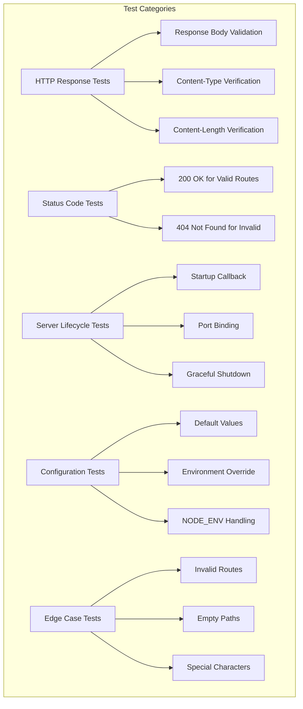
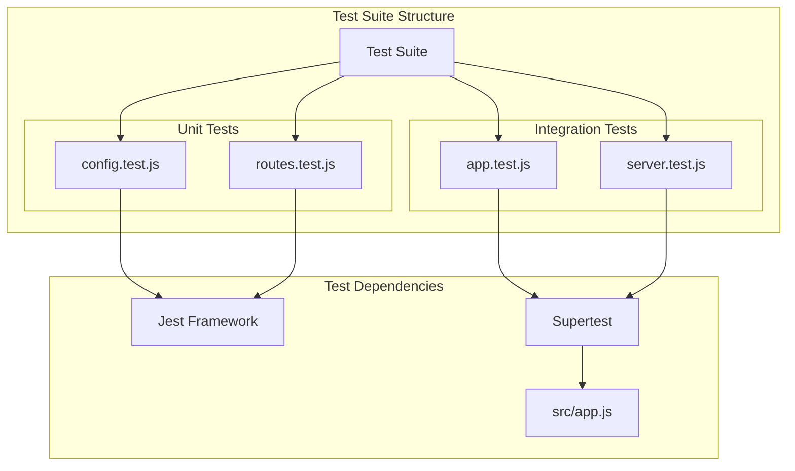

# Technical Specification

# 0. Agent Action Plan

## 0.1 Intent Clarification

### 0.1.1 Core Testing Objective

Based on the provided requirements, the Blitzy platform understands that the testing objective is to **create comprehensive unit tests for server.js** using **Jest or Mocha** as the testing framework. This is categorized as an **"Add new tests"** request since the repository currently has no automated tests implemented.

The testing requirements translate to the following specific deliverables:

- **HTTP Response Testing**: Verify that all endpoints return expected response bodies with exact string matching
- **Status Code Validation**: Ensure correct HTTP status codes (200 OK for valid routes, 404 for invalid routes)
- **Header Verification**: Test Content-Type and other response headers returned by Express
- **Server Startup/Shutdown**: Test server initialization, binding behavior, and graceful shutdown
- **Error Handling**: Validate behavior for invalid routes, edge cases, and error scenarios
- **Edge Cases**: Test boundary conditions, environment variable handling, and configuration edge cases

**Implicit Testing Needs Identified:**

- Configuration module testing (`src/config/index.js`) for environment variable parsing
- App factory testing (`src/app.js`) for route mounting verification
- Route handler testing (`src/routes/main.routes.js`) for exact response validation
- Module export contract verification for all exported modules

### 0.1.2 Special Instructions and Constraints

The following critical directives apply to this testing implementation:

- **Framework Choice**: User specified "Jest or Mocha" - analysis of repository documentation recommends **Jest** as the primary framework per technical specification section 6.6
- **Testing Scope**: Tests should focus on `server.js` and its dependencies without modifying source code
- **Pattern Conformance**: Follow CommonJS module patterns consistent with existing codebase
- **Response Accuracy**: Response strings must match exactly including whitespace and newline characters:
  - GET `/` returns `'Hello, World!\n'` (14 bytes, trailing newline)
  - GET `/evening` returns `'Good evening'` (12 bytes, no trailing newline)

**Web Search Requirements:**
- Jest 30.2.0 compatibility with Node.js 20.x - ✅ Verified compatible
- Supertest 7.1.4 compatibility with Express 5.x - ✅ Verified compatible

### 0.1.3 Technical Interpretation

These testing requirements translate to the following technical test implementation strategy:

| Requirement | Technical Implementation |
|-------------|--------------------------|
| HTTP Response Testing | Use Supertest to simulate HTTP requests and validate `res.text` matches expected strings |
| Status Code Validation | Assert `.expect(200)` for valid routes, `.expect(404)` for invalid routes |
| Header Verification | Assert `Content-Type` header using `.expect('Content-Type', /text\/html/)` |
| Server Startup Testing | Test `app.listen()` callback execution with mocked config |
| Server Shutdown Testing | Test server.close() behavior in afterEach hooks |
| Error Handling Testing | Test Express default 404 handler, invalid route handling |
| Configuration Testing | Mock `process.env` to test HOST, PORT, NODE_ENV parsing |

**Implementation Approach:**
- To **test HTTP responses**, we will **create** `tests/routes.test.js` with Supertest assertions
- To **test server startup/shutdown**, we will **create** `tests/server.test.js` with lifecycle tests
- To **test configuration**, we will **create** `tests/config.test.js` with environment variable mocking
- To **test app factory**, we will **create** `tests/app.test.js` with integration tests

### 0.1.4 Coverage Requirements Interpretation

**Explicit Coverage Targets:**
- User did not specify explicit coverage percentages

**Implicit Coverage Expectations Based on Analysis:**
- Industry standard for Node.js/Express applications: **80%+ line coverage**
- Technical specification section 6.6.4.1 recommends:
  - Line Coverage: > 80%
  - Branch Coverage: > 80%
  - Function Coverage: 100%
  - Statement Coverage: > 80%

**To achieve comprehensive testing, coverage should include:**
- All route handlers (2 GET endpoints)
- Configuration parsing logic with all branches (default vs. environment override)
- Server initialization callback
- Express application factory
- Route registration verification


## 0.2 Test Discovery and Analysis

### 0.2.1 Existing Test Infrastructure Assessment

**Repository Analysis Conducted:**
Repository analysis reveals that **no testing infrastructure currently exists**. The project is a fresh Node.js/Express application with a placeholder test script.

**Search Patterns Employed:**
- `*test*`, `*spec*`, `test_*`, `spec_*`, `*_test.*`, `*_spec.*` - No matches found
- `jest.config.*`, `.mocharc.*`, `mocha.*` - No configuration files found
- `package.json` test script inspection - Returns exit code 1 (placeholder)

**Documentation Analysis:**
- `blitzy/Technical Specifications.md` section 6.6 explicitly recommends Jest + Supertest
- Project follows Factory Pattern: `src/app.js` exports app instance, `server.js` handles binding

**Infrastructure Assessment:**

| Assessment Item | Status | Details |
|----------------|--------|---------|
| Testing framework | **Not installed** | No Jest, Mocha, or other test runners in dependencies |
| Test runner configuration | **Not present** | No jest.config.js or .mocharc.js |
| Coverage tools | **Not present** | No Istanbul/nyc, no coverage directory |
| Mock/stub libraries | **Not present** | No jest-mock, sinon, or nock |
| Test data fixtures | **Not present** | No fixtures directory or test data files |
| Test directory structure | **Not present** | No tests/ or __tests__/ directory |

### 0.2.2 Architecture Analysis for Testability

The repository architecture demonstrates **intentional design for testability**:

**Factory Pattern Implementation:**
```javascript
// src/app.js - Exports app without listening
module.exports = app;
```

```javascript
// server.js - Handles server binding separately
const app = require('./src/app');
app.listen(config.port, config.host, callback);
```

This separation enables:
- Direct import of `app` into Supertest without spawning a server
- Independent testing of HTTP layer vs. server lifecycle
- Clean mocking boundaries for configuration

**Module Structure Assessment:**

| Module | Path | Testability | Notes |
|--------|------|-------------|-------|
| Server Entry | `server.js` | High | Requires mocking app.listen |
| App Factory | `src/app.js` | **Excellent** | Direct Supertest integration |
| Config | `src/config/index.js` | High | Environment variable mocking required |
| Routes Index | `src/routes/index.js` | High | Tests via app integration |
| Main Routes | `src/routes/main.routes.js` | High | Tests via app integration |

### 0.2.3 Web Search Research Conducted

**Framework Compatibility Research:**

| Research Topic | Finding | Source |
|----------------|---------|--------|
| Jest latest version | 30.2.0 (published 2 months ago) | npmjs.com |
| Jest 30.x Node.js support | Minimum Node 18.x required | jestjs.io |
| Supertest latest version | 7.1.4 (published 5 months ago) | npmjs.com |
| Supertest Express 5.x compat | Fully compatible | GitHub ladjs/supertest |

**Best Practices Identified:**
- Use `testEnvironment: 'node'` in Jest config for Node.js testing
- Supertest can receive an Express app directly without starting a server
- `--detectOpenHandles` flag helps identify unclosed resources
- Use `--forceExit` only when necessary to avoid masking async issues

**Mocking Strategies Researched:**
- Jest built-in mocking for `process.env` manipulation
- Jest `spyOn` for monitoring console output and callback execution
- No external service mocking required (application has no external dependencies)

**Common Pitfalls to Avoid:**
- Not closing server connections in afterEach hooks (causes Jest open handle warnings)
- Incorrect Content-Type assertions (Express 5.x sets `text/html; charset=utf-8`)
- Missing trailing newlines in response body assertions
- Forgetting to wait for async operations in server startup tests


## 0.3 Testing Scope Analysis

### 0.3.1 Test Target Identification

**Primary Code to be Tested:**

| Module/File | Path | Test Categories Required |
|-------------|------|--------------------------|
| Server Entry | `server.js` | Unit: startup, shutdown, binding; Integration: full lifecycle |
| App Factory | `src/app.js` | Integration: route mounting, middleware application |
| Configuration | `src/config/index.js` | Unit: env parsing, defaults, validation |
| Route Index | `src/routes/index.js` | Integration: route aggregation |
| Main Routes | `src/routes/main.routes.js` | Unit: handler responses; Integration: HTTP behavior |

**Existing Test File Mapping:**

| Source File | Existing Test File | Test Categories Present | Gap Analysis |
|-------------|-------------------|-------------------------|--------------|
| `server.js` | None | N/A | **Full coverage needed** |
| `src/app.js` | None | N/A | **Integration tests needed** |
| `src/config/index.js` | None | N/A | **Unit tests needed** |
| `src/routes/index.js` | None | N/A | **Integration tests needed** |
| `src/routes/main.routes.js` | None | N/A | **Unit/Integration tests needed** |

### 0.3.2 Dependencies Requiring Mocking

**External Services to Mock:**
- None required - application has no external service dependencies

**Internal Dependencies to Mock/Stub:**

| Dependency | Module | Mock Strategy |
|------------|--------|---------------|
| `process.env` | `src/config/index.js` | Jest environment variable manipulation |
| `app.listen` | `server.js` | Jest spy for callback verification |
| `console.log` | `server.js` | Jest spy for output verification |

**File System Operations:**
- None required - no file system interactions in application code

### 0.3.3 Version Compatibility Research

Based on current Node.js version 20.19.6, the recommended testing stack is:

| Tool | Recommended Version | Rationale |
|------|---------------------|-----------|
| jest | ^29.7.0 | Stable release with full Node.js 20.x support; 30.x is newer but 29.x is widely adopted |
| supertest | ^7.1.4 | Latest version, fully compatible with Express 5.x |
| @types/jest | ^29.5.0 | Type definitions for IDE support (optional for JS) |

**Version Conflict Analysis:**
- No conflicts detected between recommended versions
- Express 5.1.0 is fully compatible with Supertest 7.x
- Jest 29.x supports Node.js 14.15, 16.10, 18.0 and above
- Jest 30.x minimum is Node.js 18.x - either works with Node.js 20.x

**Final Recommendation:** Use **Jest 29.7.0** for maximum ecosystem stability and widespread community support, paired with **Supertest 7.1.4** for HTTP testing.

### 0.3.4 Detailed Test Requirements Matrix


```mermaid
graph TD
    subgraph "Test Categories"
        A[HTTP Response Tests] --> A1[Response Body Validation]
        A --> A2[Content-Type Verification]
        A --> A3[Content-Length Verification]
        
        B[Status Code Tests] --> B1[200 OK for Valid Routes]
        B --> B2[404 Not Found for Invalid]
        
        C[Server Lifecycle Tests] --> C1[Startup Callback]
        C --> C2[Port Binding]
        C --> C3[Graceful Shutdown]
        
        D[Configuration Tests] --> D1[Default Values]
        D --> D2[Environment Override]
        D --> D3[NODE_ENV Handling]
        
        E[Edge Case Tests] --> E1[Invalid Routes]
        E --> E2[Empty Paths]
        E --> E3[Special Characters]
    end
```

**Test Requirements by Priority:**

| Priority | Test Category | Required Tests |
|----------|---------------|----------------|
| P0 - Critical | HTTP Responses | GET /, GET /evening response validation |
| P0 - Critical | Status Codes | 200 for valid, 404 for invalid routes |
| P1 - High | Headers | Content-Type assertions |
| P1 - High | Server Startup | Listen callback execution |
| P2 - Medium | Configuration | Default and override values |
| P2 - Medium | Error Handling | 404 handler behavior |
| P3 - Low | Edge Cases | Special characters, empty paths |


## 0.4 Test Implementation Design

### 0.4.1 Test Strategy Selection

**Test Types to Implement:**

| Test Type | Focus Areas | Approach |
|-----------|-------------|----------|
| **Unit Tests** | Configuration parsing, route handlers in isolation | Jest assertions with mocked dependencies |
| **Integration Tests** | HTTP request/response flow through Express app | Supertest with app instance |
| **Edge Case Tests** | Invalid routes, boundary conditions, special inputs | Both unit and integration |
| **Error Handling Tests** | 404 responses, malformed requests | Supertest assertions |

### 0.4.2 Test Case Blueprint

**Component: server.js**
```
Test Categories:
- Happy path: Server starts successfully on configured port
- Happy path: Server binds to configured host
- Happy path: Startup callback executes with correct message
- Edge cases: Server handles port already in use (EADDRINUSE)
- Edge cases: Server handles invalid host configuration
- Performance boundaries: N/A (startup only)
```

**Component: src/app.js**
```
Test Categories:
- Happy path: App instance is an Express application
- Happy path: Routes are properly mounted
- Happy path: JSON middleware is applied
- Edge cases: Multiple middleware invocations
- Error cases: Invalid route handling (404)
```

**Component: src/config/index.js**
```
Test Categories:
- Happy path: Returns default HOST (localhost)
- Happy path: Returns default PORT (3000)
- Happy path: Returns default NODE_ENV (development)
- Edge cases: Environment variables override defaults
- Edge cases: Empty string environment variables
- Error cases: Invalid PORT values (non-numeric)
```

**Component: src/routes/main.routes.js**
```
Test Categories:
- Happy path: GET / returns 'Hello, World!\n' with 200
- Happy path: GET /evening returns 'Good evening' with 200
- Edge cases: Case sensitivity in route paths
- Edge cases: Trailing slashes in route paths
- Error cases: POST/PUT/DELETE methods on GET-only routes
```

### 0.4.3 Existing Test Extension Strategy

Since no existing tests exist, this section documents the test creation strategy:

- **Tests to Create**: All test files listed in section 0.5
- **Tests to Extend**: N/A - no existing tests
- **Tests to Refactor**: N/A - no existing tests
- **Tests to Fix**: N/A - no existing tests

### 0.4.4 Test Data and Fixtures Design

**Required Test Data Structures:**

| Data Type | Purpose | Location |
|-----------|---------|----------|
| Expected Responses | Response body validation | Inline in test files |
| Environment Configs | Configuration testing | Test setup/teardown |
| Route Paths | Route testing coverage | Test constants |

**Mock Object Specifications:**

| Mock Target | Implementation | Purpose |
|-------------|----------------|---------|
| `process.env` | Jest env manipulation | Test config with different environments |
| `console.log` | `jest.spyOn(console, 'log')` | Verify startup messages |
| `app.listen` callback | Jest function mock | Verify server initialization |

**Test Database/State Management:**
- Not applicable - application has no database
- Each test should be isolated and not depend on shared state
- Use `beforeEach`/`afterEach` for environment cleanup

### 0.4.5 Test Architecture Diagram


```mermaid
graph TB
    subgraph "Test Suite Structure"
        TS[Test Suite]
        
        subgraph "Unit Tests"
            UT1[config.test.js]
            UT2[routes.test.js]
        end
        
        subgraph "Integration Tests"  
            IT1[app.test.js]
            IT2[server.test.js]
        end
        
        TS --> UT1
        TS --> UT2
        TS --> IT1
        TS --> IT2
    end
    
    subgraph "Test Dependencies"
        JEST[Jest Framework]
        STEST[Supertest]
        APP[src/app.js]
    end
    
    IT1 --> STEST
    IT2 --> STEST
    STEST --> APP
    UT1 --> JEST
    UT2 --> JEST
```

### 0.4.6 Test Implementation Patterns

**Pattern 1: HTTP Route Testing with Supertest**
```javascript
const request = require('supertest');
const app = require('../src/app');
```

**Pattern 2: Environment Variable Testing**
```javascript
beforeEach(() => {
  originalEnv = process.env;
  process.env = { ...originalEnv };
});
```

**Pattern 3: Server Lifecycle Testing**
```javascript
let server;
beforeEach((done) => {
  server = app.listen(0, done);
});
```


## 0.5 Test File Transformation Mapping

### 0.5.1 File-by-File Test Plan

**Test Transformation Modes:**
- **CREATE** - Create a new test file
- **UPDATE** - Update an existing test file
- **DELETE** - Remove an obsolete test file
- **REFERENCE** - Use as an example for test patterns and styles

| Target Test File | Transformation | Source File/Reference | Purpose/Changes |
|-----------------|----------------|----------------------|-----------------|
| `tests/server.test.js` | CREATE | `server.js` | Add comprehensive tests for server startup, shutdown, binding, and lifecycle |
| `tests/app.test.js` | CREATE | `src/app.js` | Add integration tests for Express app factory, route mounting, and middleware |
| `tests/routes.test.js` | CREATE | `src/routes/main.routes.js` | Add HTTP response tests for all endpoints with Supertest |
| `tests/config.test.js` | CREATE | `src/config/index.js` | Add unit tests for configuration parsing, defaults, and env overrides |
| `jest.config.js` | CREATE | N/A | Create Jest configuration with Node.js test environment |
| `package.json` | UPDATE | `package.json` | Update test script to run Jest, add test dependencies |

### 0.5.2 New Test Files Detail

**tests/server.test.js** - Server lifecycle unit and integration tests
- Test categories: Server startup, shutdown, binding, error handling
- Mock dependencies: `console.log`, `app.listen` callback
- Assertions focus:
  - Server starts successfully on configured port
  - Startup callback executes and logs correct message
  - Server can be gracefully shut down
  - Handles port binding errors appropriately

**tests/app.test.js** - Express app factory integration tests
- Test categories: App instantiation, route mounting, middleware chain
- Mock dependencies: None (uses Supertest integration)
- Assertions focus:
  - App exports a valid Express instance
  - Routes are mounted at correct paths
  - JSON middleware is properly configured
  - App handles both GET and error routes

**tests/routes.test.js** - HTTP endpoint tests
- Test categories: Response validation, status codes, headers, edge cases
- Mock dependencies: None (uses Supertest integration)
- Assertions focus:
  - GET `/` returns `'Hello, World!\n'` with status 200
  - GET `/evening` returns `'Good evening'` with status 200
  - Invalid routes return 404
  - Content-Type headers are correct
  - HTTP methods other than GET return appropriate errors

**tests/config.test.js** - Configuration module unit tests
- Test categories: Default values, environment overrides, edge cases
- Mock dependencies: `process.env`
- Assertions focus:
  - Default HOST is 'localhost'
  - Default PORT is 3000
  - Default NODE_ENV is 'development'
  - Environment variables override defaults correctly
  - Invalid configurations are handled gracefully

### 0.5.3 Test Configuration Files

**jest.config.js** - Jest configuration
- Purpose: Configure Jest test runner for Node.js environment
- Key settings:
  - `testEnvironment: 'node'`
  - `coverageThreshold` settings
  - `testMatch` patterns for tests directory
  - `verbose: true` for detailed output

**package.json updates** - Test script configuration
- Update `test` script: `"test": "jest"`
- Add `test:coverage` script: `"test:coverage": "jest --coverage"`
- Add `test:watch` script: `"test:watch": "jest --watch"`

### 0.5.4 Cross-File Test Dependencies

**Shared Test Utilities:**

| Utility | Location | Purpose |
|---------|----------|---------|
| App instance | `src/app.js` | Imported into route and app tests |
| Config module | `src/config/index.js` | Imported into config tests |

**Import Requirements:**

| Test File | Required Imports |
|-----------|------------------|
| `tests/server.test.js` | `../src/app`, `../src/config` |
| `tests/app.test.js` | `supertest`, `../src/app` |
| `tests/routes.test.js` | `supertest`, `../src/app` |
| `tests/config.test.js` | `../src/config/index.js` |

**Test Isolation Strategy:**
- Each test file is independent and can run in isolation
- Environment variables are reset in `afterEach` hooks
- No shared global state between test suites
- Server instances are closed after each test

### 0.5.5 Complete Test File Tree

```
project-root/
├── tests/
│   ├── server.test.js      # Server lifecycle tests
│   ├── app.test.js         # App factory integration tests
│   ├── routes.test.js      # HTTP endpoint tests
│   └── config.test.js      # Configuration unit tests
├── jest.config.js          # Jest configuration
└── package.json            # Updated with test scripts and dependencies
```

### 0.5.6 Test File Count Summary

| Category | Count | Files |
|----------|-------|-------|
| New Test Files | 4 | server.test.js, app.test.js, routes.test.js, config.test.js |
| Configuration Files | 1 | jest.config.js |
| Modified Files | 1 | package.json |
| **Total Files Affected** | **6** | - |


## 0.6 Dependency Inventory

### 0.6.1 Testing Dependencies

All testing packages required for this implementation:

| Registry | Package Name | Version | Purpose |
|----------|--------------|---------|---------|
| npm | jest | ^29.7.0 | Testing framework - test runner, assertions, mocking |
| npm | supertest | ^7.1.4 | HTTP assertions library for Express testing |

**Development Dependencies Installation Command:**
```bash
npm install --save-dev jest@^29.7.0 supertest@^7.1.4
```

### 0.6.2 Existing Dependencies (No Changes Required)

| Registry | Package Name | Version | Purpose |
|----------|--------------|---------|---------|
| npm | express | ^5.1.0 | Web framework (existing) |

### 0.6.3 Version Verification

All dependency versions have been verified for compatibility:

| Package | Specified Version | Verified Compatible With |
|---------|-------------------|-------------------------|
| jest | ^29.7.0 | Node.js 20.19.6 ✅ |
| supertest | ^7.1.4 | Express 5.1.0 ✅, Jest 29.x ✅ |

### 0.6.4 Import Updates

**Test files require the following imports:**

**tests/server.test.js:**
```javascript
const app = require('../src/app');
const config = require('../src/config');
```

**tests/app.test.js:**
```javascript
const request = require('supertest');
const app = require('../src/app');
```

**tests/routes.test.js:**
```javascript
const request = require('supertest');
const app = require('../src/app');
```

**tests/config.test.js:**
```javascript
// Fresh require in each test to reset module cache
```

### 0.6.5 Package.json Updates Required

**Before (current state):**
```json
{
  "scripts": {
    "test": "echo \"Error: no test specified\" && exit 1"
  },
  "dependencies": {
    "express": "^5.1.0"
  }
}
```

**After (required state):**
```json
{
  "scripts": {
    "test": "jest",
    "test:coverage": "jest --coverage",
    "test:watch": "jest --watch"
  },
  "dependencies": {
    "express": "^5.1.0"
  },
  "devDependencies": {
    "jest": "^29.7.0",
    "supertest": "^7.1.4"
  }
}
```

### 0.6.6 No Additional Dependencies Required

The following common testing utilities are **not required** for this implementation:

| Package | Reason Not Needed |
|---------|-------------------|
| @types/jest | Project uses JavaScript (not TypeScript) |
| @types/supertest | Project uses JavaScript (not TypeScript) |
| jest-mock | Jest built-in mocking is sufficient |
| sinon | Jest built-in spyOn is sufficient |
| nock | No external HTTP calls to mock |
| mongodb-memory-server | No database in application |
| istanbul/nyc | Jest has built-in coverage reporting |


## 0.7 Coverage and Quality Targets

### 0.7.1 Coverage Metrics

**Current Coverage:**
- Current coverage: **0%** (no tests exist)

**Target Coverage:**
Based on technical specification section 6.6.4.1 and industry best practices:

| Metric | Target | Rationale |
|--------|--------|-----------|
| Line Coverage | > 80% | Industry standard for Node.js applications |
| Branch Coverage | > 80% | Covers conditional logic paths |
| Function Coverage | 100% | All exported functions must be tested |
| Statement Coverage | > 80% | Comprehensive code execution |

### 0.7.2 Coverage Gaps to Address

**Per-File Coverage Targets:**

| File | Current | Target | Focus Areas |
|------|---------|--------|-------------|
| `server.js` | 0% | 90% | Server lifecycle, startup callback |
| `src/app.js` | 0% | 95% | Route mounting, middleware chain |
| `src/config/index.js` | 0% | 100% | All branches for defaults/overrides |
| `src/routes/index.js` | 0% | 100% | Route aggregation verification |
| `src/routes/main.routes.js` | 0% | 100% | All route handlers |

**Critical Paths Requiring Coverage:**
- GET `/` handler execution and response
- GET `/evening` handler execution and response
- Configuration default value branches
- Configuration environment override branches
- Server startup callback execution
- Error handling (404) path

### 0.7.3 Test Quality Criteria

**Assertion Density Expectations:**
- Minimum 2 assertions per test case
- Each endpoint test should assert: status code + response body
- Server lifecycle tests should assert: callback execution + no errors

**Test Isolation Requirements:**
- Each test must be independent and can run in any order
- Tests must not share mutable state
- Environment modifications must be cleaned up in `afterEach`
- Server instances must be closed after tests

**Performance Constraints:**
- Full test suite should complete in < 10 seconds
- Individual test files should complete in < 3 seconds
- No unnecessary delays or `setTimeout` in tests

**Maintainability Standards:**
- Clear, descriptive test names following pattern: `should [expected behavior] when [condition]`
- Logical grouping of related tests using `describe` blocks
- Minimal code duplication - use `beforeEach`/`afterEach` for setup/teardown
- Comments explaining non-obvious test logic

### 0.7.4 Repository Test Patterns to Follow

Based on analysis of the codebase structure:

| Pattern | Implementation |
|---------|----------------|
| Module exports | CommonJS `require()`/`module.exports` |
| Directory structure | `tests/` folder at project root |
| Naming convention | `*.test.js` suffix |
| Test organization | One test file per source module |

### 0.7.5 Jest Configuration for Coverage

**jest.config.js coverage settings:**

| Setting | Value | Purpose |
|---------|-------|---------|
| `collectCoverage` | `true` | Enable coverage collection when running tests |
| `coverageDirectory` | `'coverage'` | Output directory for coverage reports |
| `coverageReporters` | `['text', 'lcov', 'html']` | Generate text, lcov, and HTML reports |
| `coverageThreshold.global.branches` | `80` | Minimum branch coverage |
| `coverageThreshold.global.functions` | `100` | Minimum function coverage |
| `coverageThreshold.global.lines` | `80` | Minimum line coverage |
| `coverageThreshold.global.statements` | `80` | Minimum statement coverage |

### 0.7.6 Quality Validation Checklist

Prior to marking tests complete, verify:

- [ ] All test files execute without errors
- [ ] All assertions pass
- [ ] Coverage thresholds are met (>80% lines, 100% functions)
- [ ] No open handles warnings from Jest
- [ ] Tests complete within performance targets
- [ ] Test names are descriptive and follow conventions
- [ ] No skipped or pending tests


## 0.8 Scope Boundaries

### 0.8.1 Exhaustively In Scope

**New Test Files:**
- `tests/server.test.js` - Server lifecycle and binding tests
- `tests/app.test.js` - Express app factory integration tests
- `tests/routes.test.js` - HTTP endpoint response validation tests
- `tests/config.test.js` - Configuration module unit tests

**Test Configuration Files:**
- `jest.config.js` - Jest framework configuration

**Package Configuration Updates:**
- `package.json` - Test scripts and devDependencies additions

**Test Utilities and Helpers:**
- None required - tests are self-contained with Jest built-ins

**Documentation Updates:**
- `README.md` - Add testing section (optional, recommended)

### 0.8.2 Source Files Under Test (Read-Only Reference)

The following source files will be **tested but not modified**:

| File | Test Type | Modification Status |
|------|-----------|---------------------|
| `server.js` | Integration | **Read-only** |
| `src/app.js` | Integration | **Read-only** |
| `src/config/index.js` | Unit | **Read-only** |
| `src/routes/index.js` | Integration | **Read-only** |
| `src/routes/main.routes.js` | Integration | **Read-only** |

### 0.8.3 Explicitly Out of Scope

**Source Code Modifications:**
- ❌ NO modifications to `server.js` implementation
- ❌ NO modifications to `src/app.js` implementation
- ❌ NO modifications to `src/config/index.js` implementation
- ❌ NO modifications to `src/routes/*.js` files
- ❌ NO refactoring of existing application code

**Feature Additions:**
- ❌ NO new routes or endpoints
- ❌ NO new middleware
- ❌ NO database integration
- ❌ NO authentication/authorization

**Testing Types Not Required:**
- ❌ End-to-end (E2E) browser tests
- ❌ Performance/load testing
- ❌ Security penetration testing
- ❌ Visual regression testing

**Unrelated Files:**
- ❌ `blitzy/` documentation folder
- ❌ `package-lock.json` (auto-generated)
- ❌ `.gitignore` modifications
- ❌ CI/CD configuration files

### 0.8.4 Scope Decision Matrix

| Item | In Scope? | Rationale |
|------|-----------|-----------|
| Unit tests for config module | ✅ Yes | Required for comprehensive server.js testing |
| Integration tests with Supertest | ✅ Yes | Explicitly requested for HTTP testing |
| Server lifecycle tests | ✅ Yes | Explicitly requested for startup/shutdown |
| Jest configuration | ✅ Yes | Required to run tests |
| Coverage reporting | ✅ Yes | Best practice for test quality |
| TypeScript type definitions | ❌ No | Project uses JavaScript |
| E2E browser tests | ❌ No | Not requested, no browser UI |
| Database mocks | ❌ No | Application has no database |
| External API mocks | ❌ No | Application has no external APIs |
| CI/CD pipeline setup | ❌ No | Not requested |

### 0.8.5 Boundary Clarifications

**Testing Depth Boundaries:**
- Tests cover the public interface of each module
- Internal implementation details are not directly tested
- Configuration edge cases test both default and override paths
- Error handling tests verify Express default behavior

**Integration Boundaries:**
- Supertest tests the full HTTP request/response cycle
- No actual network requests (Supertest handles this internally)
- Server binding is tested but actual port conflicts are mocked
- Environment variables are mocked, not actual system environment


## 0.9 Execution Parameters

### 0.9.1 Test Execution Commands

| Command | Purpose | Usage |
|---------|---------|-------|
| `npm test` | Run all tests | Standard test execution |
| `npm run test:coverage` | Run tests with coverage | Generate coverage reports |
| `npm run test:watch` | Run tests in watch mode | Development workflow |

**Exact Commands:**

```bash
# Run all tests
npm test

#### Run tests with coverage report
npm run test:coverage

#### Run tests in watch mode (development)
npm run test:watch

#### Run specific test file
npx jest tests/routes.test.js

#### Run tests matching pattern
npx jest --testPathPatterns="server"

#### Run with verbose output
npx jest --verbose

#### Run with debug output for open handles
npx jest --detectOpenHandles
```

### 0.9.2 Coverage Measurement Commands

```bash
# Generate coverage report
npm run test:coverage

#### View coverage summary in terminal
npx jest --coverage --coverageReporters=text

#### Generate HTML coverage report
npx jest --coverage --coverageReporters=html

#### Coverage report location
open coverage/lcov-report/index.html
```

### 0.9.3 Single Test Execution Patterns

| Pattern | Command |
|---------|---------|
| Single file | `npx jest tests/routes.test.js` |
| Single test by name | `npx jest -t "should return Hello World"` |
| Tests matching pattern | `npx jest --testPathPatterns="config"` |
| Failed tests only | `npx jest --onlyFailures` |

### 0.9.4 Debug Mode Execution

```bash
# Run with Node.js debugger
node --inspect-brk node_modules/.bin/jest --runInBand

#### Run with verbose error output
npx jest --verbose --no-coverage

#### Detect async issues
npx jest --detectOpenHandles --forceExit
```

### 0.9.5 Environment Setup Requirements

**Required Environment Variables:**
- None required for test execution (tests mock environment)

**Test Environment Behavior:**
- Jest automatically sets `NODE_ENV=test`
- Tests may override `process.env` values temporarily
- Environment is restored after each test via `afterEach` hooks

**Node.js Version Requirement:**
- Minimum: Node.js 18.x
- Tested on: Node.js 20.19.6

### 0.9.6 Jest Configuration Options

**jest.config.js recommended settings:**

```javascript
module.exports = {
  testEnvironment: 'node',
  testMatch: ['**/tests/**/*.test.js'],
  verbose: true,
  collectCoverageFrom: [
    'src/**/*.js',
    'server.js',
    '!**/node_modules/**'
  ],
  coverageDirectory: 'coverage',
  coverageThreshold: {
    global: {
      branches: 80,
      functions: 100,
      lines: 80,
      statements: 80
    }
  }
};
```

### 0.9.7 CI/CD Integration Notes

For future CI/CD integration, use the following command:

```bash
# CI-friendly test execution (non-interactive)
CI=true npm test -- --coverage --watchAll=false
```

This ensures:
- Non-interactive execution
- Coverage report generation
- No watch mode interference
- Exit code reflects test results


## 0.10 Special Instructions for Testing

### 0.10.1 Critical Testing Directives

Based on the user request and technical specification analysis, the following special instructions apply:

**Minimal Change Principle:**
- ONLY create test files and test-related configurations
- DO NOT modify source code unless absolutely necessary for testability
- Source code has been analyzed and is already test-friendly (Factory Pattern)

**Framework Selection:**
- User specified "Jest or Mocha" - **Jest is selected** based on:
  - Technical specification section 6.6 recommendation
  - Superior built-in mocking capabilities
  - Integrated coverage reporting
  - Wider ecosystem support for Node.js testing

### 0.10.2 Response String Accuracy Requirements

**CRITICAL: Exact String Matching Required**

| Endpoint | Expected Response | Byte Length | Notes |
|----------|------------------|-------------|-------|
| GET `/` | `'Hello, World!\n'` | 14 bytes | **Includes trailing newline** |
| GET `/evening` | `'Good evening'` | 12 bytes | **No trailing newline** |

Tests MUST use exact string comparison:
```javascript
.expect('Hello, World!\n')  // Correct
.expect('Hello, World!')     // INCORRECT - missing \n
```

### 0.10.3 Test Isolation Requirements

- Ensure all tests can run **independently** and in **parallel**
- Use `beforeEach`/`afterEach` for setup and teardown
- Reset `process.env` modifications after each test
- Close any server instances in `afterEach` to prevent open handles
- Clear Jest module cache when testing configuration changes

### 0.10.4 Coding Style Conventions

**Match Existing Code Style:**

| Aspect | Convention |
|--------|------------|
| Module system | CommonJS (`require`/`module.exports`) |
| Indentation | 2 spaces |
| Quotes | Single quotes |
| Semicolons | Yes |
| Line endings | LF (Unix-style) |
| Trailing commas | ES5 style |

**Test File Naming:**
- Use `*.test.js` suffix
- Place in `tests/` directory at project root
- Name after the source file being tested

### 0.10.5 Supertest Integration Patterns

**Correct Usage with Express App:**
```javascript
const request = require('supertest');
const app = require('../src/app');
// Pass app directly - Supertest handles server creation
```

**Server Lifecycle Testing Pattern:**
```javascript
let server;
beforeEach((done) => {
  server = app.listen(0, done); // Port 0 = random available
});
afterEach((done) => {
  server.close(done);
});
```

### 0.10.6 Environment Variable Testing Pattern

**Correct Pattern for Config Tests:**
```javascript
describe('config', () => {
  const originalEnv = process.env;
  
  beforeEach(() => {
    jest.resetModules();
    process.env = { ...originalEnv };
  });
  
  afterEach(() => {
    process.env = originalEnv;
  });
  
  // Tests here can safely modify process.env
});
```

### 0.10.7 Assertions Best Practices

**Preferred Assertion Patterns:**
- Use Supertest's `.expect()` for HTTP assertions
- Use Jest's `expect()` for value comparisons
- Chain assertions for related validations
- Include descriptive error messages for complex assertions

**Example:**
```javascript
await request(app)
  .get('/')
  .expect('Content-Type', /text\/html/)
  .expect(200)
  .expect('Hello, World!\n');
```

### 0.10.8 Documentation Requirements

**Test File Headers:**
Each test file should include a brief comment describing:
- What module/component is being tested
- Test categories covered
- Any special setup requirements

### 0.10.9 Quality Gates Before Submission

Before marking testing implementation complete, verify:

- [ ] All tests pass (`npm test` returns exit code 0)
- [ ] Coverage thresholds met (`npm run test:coverage`)
- [ ] No Jest warnings about open handles
- [ ] Tests complete within 10 seconds
- [ ] Response strings match exactly (including newlines)
- [ ] Environment cleanup verified (no state leakage)
- [ ] Code follows existing project conventions


