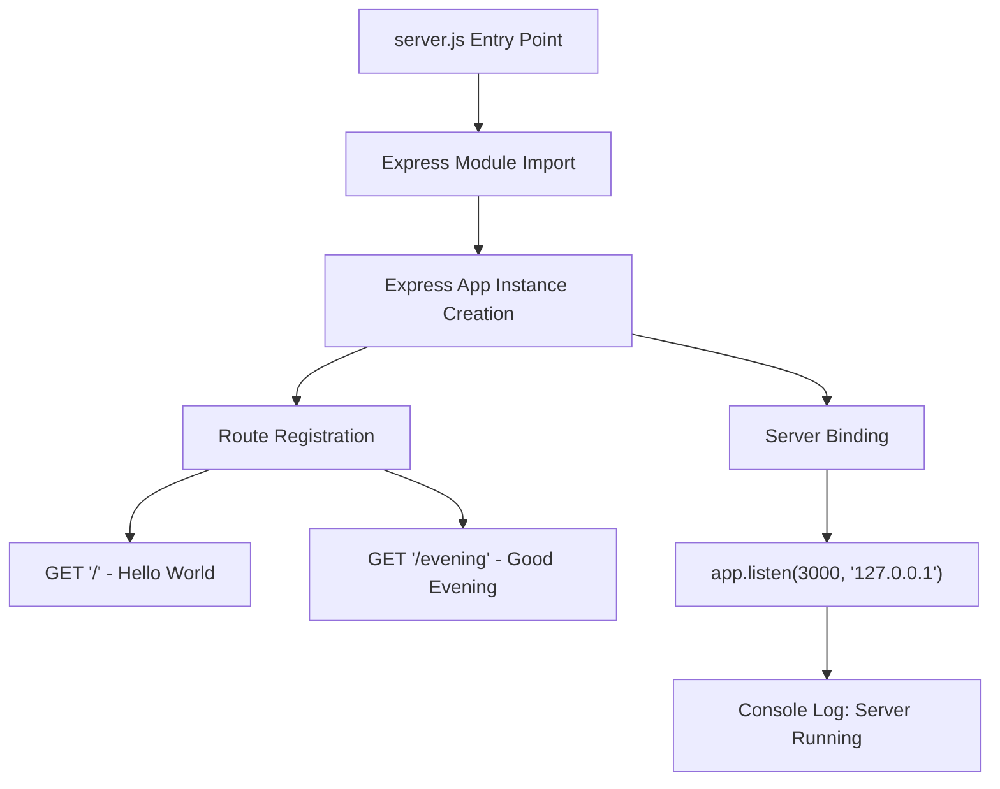

# Technical Specification

# 0. Agent Action Plan

## 0.1 Intent Clarification

### 0.1.1 Core Feature Objective

Based on the prompt, the Blitzy platform understands that the new feature requirement is to enhance an existing Node.js server tutorial application by integrating the Express.js framework and adding additional HTTP endpoint capabilities. The specific objectives are:

- **Express.js Framework Integration**: Add Express.js as the web framework to replace or augment the native Node.js HTTP server implementation, providing a more robust and maintainable routing infrastructure
- **New Endpoint Creation**: Implement a new HTTP GET endpoint that returns the text response "Good evening" to demonstrate Express.js routing capabilities
- **Maintain Existing Functionality**: Ensure the existing "Hello world" endpoint continues to function as expected after the Express.js integration

**Implicit Requirements Detected:**
- The existing server must continue to bind to a configurable host and port
- Express.js route handlers must follow standard middleware patterns
- The application must start via Node.js runtime without additional compilation steps
- Error handling should leverage Express.js default behavior for undefined routes (404 responses)

**Feature Dependencies and Prerequisites:**
- Node.js runtime environment (version >=18.x required)
- npm package manager for dependency installation
- Express.js package installation via npm

### 0.1.2 Special Instructions and Constraints

**Architectural Requirements:**
- Use Express.js application factory pattern (`const app = express()`)
- Follow RESTful routing conventions for endpoint definitions
- Maintain simple synchronous request handlers for tutorial simplicity
- Server binding should use loopback address (127.0.0.1) by default for local development

**User Example Preserved:**
- User Example: "Hello world" endpoint - existing endpoint that returns "Hello world" response
- User Example: "Good evening" endpoint - new endpoint that returns "Good evening" response

**Web Search Requirements:**
- No external web search required - Express.js 5.x documentation and patterns are well-established
- Express.js 5.1.0 is the target version as specified in the project dependencies

### 0.1.3 Technical Interpretation

These feature requirements translate to the following technical implementation strategy:

- To **integrate Express.js**, we will add `express` as a dependency in `package.json` and modify `server.js` to use `require('express')` and create an Express application instance
- To **implement the existing endpoint**, we will define `app.get('/', handler)` route that sends the "Hello, World!" response
- To **implement the new endpoint**, we will define `app.get('/evening', handler)` route that sends the "Good evening" response
- To **start the server**, we will replace native HTTP server binding with `app.listen(port, hostname, callback)` pattern

## 0.2 Repository Scope Discovery

### 0.2.1 Comprehensive File Analysis

**Current Repository Structure:**

| File/Folder | Type | Status | Purpose |
|-------------|------|--------|---------|
| `server.js` | File | MODIFY | Main application entry point - requires Express.js integration |
| `package.json` | File | MODIFY | NPM manifest - add Express.js dependency and start script |
| `package-lock.json` | File | REGENERATE | Lockfile - regenerated after dependency installation |
| `.gitignore` | File | UNCHANGED | Git ignore patterns - already excludes node_modules |
| `README.md` | File | UNCHANGED | Project documentation - no modifications per constraints |
| `blitzy/` | Folder | REFERENCE | Contains documentation artifacts for validation |
| `blitzy/documentation/` | Folder | REFERENCE | Migration guide and technical specifications |

**Source Files Requiring Modification:**
- `server.js` - Primary implementation file requiring Express.js integration and new endpoint addition

**Configuration Files Affected:**
- `package.json` - Dependency declaration and npm scripts configuration
- `package-lock.json` - Dependency tree lockfile (auto-generated)

**Integration Point Discovery:**

| Integration Type | Location | Purpose |
|-----------------|----------|---------|
| HTTP Server Binding | `server.js:16-18` | Replace native binding with Express.js `app.listen()` |
| Route Registration | `server.js:8-14` | Define Express.js route handlers for both endpoints |
| Module Import | `server.js:1` | Replace/add Express.js require statement |
| Dependency Declaration | `package.json:12-14` | Add express package dependency |
| Start Script | `package.json:7` | Add npm start script for server execution |

### 0.2.2 New File Requirements

**No New Source Files Required:**
The feature addition modifies existing files rather than creating new modules. The implementation is contained entirely within the existing `server.js` entry point.

**New Auto-Generated Files:**
- `node_modules/` - Created by npm install containing Express.js and transitive dependencies (68 packages)
- `package-lock.json` - Regenerated with complete dependency tree and integrity hashes

### 0.2.3 Web Search Research Conducted

No external web searches were required for this implementation. The Express.js framework patterns used are:
- Standard Express.js application factory pattern
- Basic route handler registration
- Server listen binding pattern

All patterns are well-documented in Express.js official documentation and represent stable, production-ready approaches.

## 0.3 Dependency Inventory

### 0.3.1 Public Packages

| Registry | Package Name | Version | Purpose |
|----------|--------------|---------|---------|
| npm | express | ^5.1.0 | Web application framework for HTTP routing and middleware |

**Transitive Dependencies (Notable):**

| Package | Version | Purpose |
|---------|---------|---------|
| accepts | 2.0.0 | HTTP content negotiation |
| body-parser | 2.2.0 | Request body parsing middleware |
| finalhandler | 2.1.0 | Final HTTP response handler |
| mime-types | 3.0.1 | MIME type mapping |
| debug | 4.4.3 | Debug logging utility |
| on-finished | 2.4.1 | Request completion detection |
| raw-body | 3.0.1 | Raw request body reading |
| qs | (bundled) | Query string parsing |

**Total Package Count:** 69 packages (1 direct, 68 transitive)

### 0.3.2 Private Packages

No private packages are required for this feature implementation. All dependencies are sourced from the public npm registry.

### 0.3.3 Runtime Requirements

| Requirement | Minimum Version | Verified Version | Notes |
|-------------|----------------|------------------|-------|
| Node.js | >=18.x | 20.19.6 | Required by Express.js 5.x |
| npm | >=8.x | 11.1.0 | Package manager for installation |

### 0.3.4 Dependency Updates

**Import Updates Required in `server.js`:**

| Line | Current State | Target State |
|------|--------------|--------------|
| 1 | (native http or none) | `const express = require('express');` |

**Package.json Modifications:**

```json
{
  "dependencies": {
    "express": "^5.1.0"
  }
}
```

**External Reference Updates:**

| File Pattern | Update Type | Description |
|--------------|-------------|-------------|
| `package.json` | Add dependency | Add express to dependencies object |
| `package.json` | Add start script | Add `"start": "node server.js"` to scripts |
| `package.json` | Update main | Set main entry point to "server.js" |

### 0.3.5 Security Considerations

**Current Vulnerability Status (npm audit):**
- 2 vulnerabilities detected (1 moderate, 1 high) in transitive dependencies
- `body-parser@2.2.0` - Moderate: URL encoding denial of service
- `qs` - High: arrayLimit bypass memory exhaustion

**Recommendation:** Run `npm audit fix` before production deployment to address security vulnerabilities in transitive dependencies.

## 0.4 Integration Analysis

### 0.4.1 Existing Code Touchpoints

**Direct Modifications Required:**

| File | Location | Modification Type | Description |
|------|----------|-------------------|-------------|
| `server.js` | Line 1 | REPLACE/ADD | Add Express.js import statement |
| `server.js` | Lines 6-7 | ADD | Create Express application instance |
| `server.js` | Lines 8-10 | ADD | Define root route handler for "Hello, World!" |
| `server.js` | Lines 12-14 | ADD | Define evening route handler for "Good evening" |
| `server.js` | Lines 16-18 | MODIFY | Replace HTTP server binding with Express app.listen() |

**Integration Flow Diagram:**


```mermaid
graph TD
    A[server.js Entry Point] --> B[Express Module Import]
    B --> C[Express App Instance Creation]
    C --> D[Route Registration]
    D --> E["GET '/' - Hello World"]
    D --> F["GET '/evening' - Good Evening"]
    C --> G[Server Binding]
    G --> H["app.listen(3000, '127.0.0.1')"]
    H --> I[Console Log: Server Running]
```

### 0.4.2 Route Handler Integration

**Root Endpoint (`/`):**
- HTTP Method: GET
- Response: "Hello, World!\n"
- Handler Pattern: Synchronous response via `res.send()`

**Evening Endpoint (`/evening`):**
- HTTP Method: GET
- Response: "Good evening"
- Handler Pattern: Synchronous response via `res.send()`

### 0.4.3 Server Configuration Integration

**Binding Configuration:**

| Parameter | Value | Source |
|-----------|-------|--------|
| hostname | '127.0.0.1' | Hardcoded constant |
| port | 3000 | Hardcoded constant |

**Startup Callback:**
- Logs readiness message: `Server running at http://${hostname}:${port}/`
- Uses template literal for URL construction

### 0.4.4 Package.json Integration Points

**Scripts Object Modification:**
```json
"scripts": {
  "start": "node server.js",
  "test": "echo \"Error: no test specified\" && exit 1"
}
```

**Dependencies Object Addition:**
```json
"dependencies": {
  "express": "^5.1.0"
}
```

**Metadata Field Updates:**
- `main`: "server.js" - Entry point declaration
- `name`: "hello_world" - Package name (unchanged)
- `version`: "1.0.0" - Package version (unchanged)

## 0.5 Technical Implementation

### 0.5.1 File-by-File Execution Plan

**Group 1 - Dependency Configuration:**

| Action | File | Purpose |
|--------|------|---------|
| MODIFY | `package.json` | Add Express.js dependency declaration |
| MODIFY | `package.json` | Add start script for npm run start |
| MODIFY | `package.json` | Set main entry point to server.js |
| REGENERATE | `package-lock.json` | Auto-generated via npm install |

**Group 2 - Core Application Implementation:**

| Action | File | Purpose |
|--------|------|---------|
| MODIFY | `server.js` | Import Express.js module |
| MODIFY | `server.js` | Create Express application instance |
| MODIFY | `server.js` | Define GET '/' route handler |
| MODIFY | `server.js` | Define GET '/evening' route handler |
| MODIFY | `server.js` | Configure server binding with app.listen() |

### 0.5.2 Implementation Approach

**Step 1: Package.json Configuration**

Update the package.json file to include Express.js dependency and npm scripts:

```json
{
  "main": "server.js",
  "scripts": {
    "start": "node server.js"
  },
  "dependencies": {
    "express": "^5.1.0"
  }
}
```

**Step 2: Install Dependencies**

Execute dependency installation:
```bash
npm install
```

**Step 3: Server.js Implementation**

Transform server.js to use Express.js framework:

```javascript
const express = require('express');
const app = express();
// Route handlers and app.listen()
```

**Step 4: Route Registration**

Define both endpoint handlers:
```javascript
app.get('/', (req, res) => {
  res.send('Hello, World!\n');
});
```

### 0.5.3 Target File State

**server.js (Final Implementation):**

The server.js file will contain:
- Line 1: Express module import
- Lines 3-4: Configuration constants (hostname, port)
- Line 6: Express application instantiation
- Lines 8-10: Root route handler
- Lines 12-14: Evening route handler
- Lines 16-18: Server binding and startup callback

**package.json (Final State):**

The package.json will contain:
- name: "hello_world"
- version: "1.0.0"
- main: "server.js"
- scripts.start: "node server.js"
- dependencies.express: "^5.1.0"

### 0.5.4 Validation Commands

**Installation Verification:**
```bash
npm install
npm ls express
```

**Runtime Verification:**
```bash
npm start
# Expected output: Server running at http://127.0.0.1:3000/
```

**Endpoint Testing:**
```bash
curl http://127.0.0.1:3000/
# Expected: Hello, World!

curl http://127.0.0.1:3000/evening
# Expected: Good evening
```

## 0.6 Scope Boundaries

### 0.6.1 Exhaustively In Scope

**Source Files:**
- `server.js` - Complete Express.js integration and endpoint implementation

**Configuration Files:**
- `package.json` - Dependency and scripts configuration
- `package-lock.json` - Dependency tree lockfile (auto-generated)

**Generated Artifacts:**
- `node_modules/**/*` - Installed npm packages directory

**Integration Points:**
| File | Scope Description |
|------|-------------------|
| `server.js:1` | Express module import statement |
| `server.js:3-4` | Server configuration constants |
| `server.js:6` | Express application instantiation |
| `server.js:8-10` | Root endpoint route handler |
| `server.js:12-14` | Evening endpoint route handler |
| `server.js:16-18` | Server listen binding |
| `package.json:5` | Main entry point declaration |
| `package.json:7` | Start script definition |
| `package.json:12-14` | Express dependency declaration |

**Functional Scope:**
- HTTP GET endpoint at `/` returning "Hello, World!\n"
- HTTP GET endpoint at `/evening` returning "Good evening"
- Server binding on 127.0.0.1:3000
- Console logging of server readiness status

### 0.6.2 Explicitly Out of Scope

**Features Excluded:**
- Authentication and authorization mechanisms
- Database integration or data persistence
- Additional middleware configuration (logging, CORS, body parsing)
- Environment variable configuration for host/port
- HTTPS/TLS termination
- Process management (PM2, systemd)
- Health check endpoints
- API versioning
- Request validation
- Error handling middleware

**Files Excluded from Modification:**
- `README.md` - Documentation freeze policy applies
- `.gitignore` - Already properly configured
- `blitzy/**/*` - Reference documentation only

**Infrastructure Excluded:**
- CI/CD pipeline configuration
- Docker containerization
- Deployment automation
- Monitoring and alerting
- Load balancing configuration

**Testing Excluded:**
- Unit test implementation
- Integration test suites
- End-to-end testing
- Test coverage reporting

### 0.6.3 Boundary Rationale

The scope is intentionally limited to maintain the tutorial nature of the application. The implementation demonstrates fundamental Express.js concepts without introducing complexity that would obscure the learning objectives:
- Basic Express.js application setup
- Route handler definition
- Server binding and startup

## 0.7 Rules for Feature Addition

### 0.7.1 Documentation Constraints

- **README.md Freeze Policy**: The README.md file must not be modified as per project constraints. All documentation updates should be made to the blitzy/documentation/ artifacts only.

### 0.7.2 Express.js Integration Patterns

- **Application Factory**: Use `const app = express()` pattern for application instantiation
- **Route Definition**: Use `app.get(path, handler)` pattern for route registration
- **Response Handling**: Use `res.send()` method for sending text responses
- **Server Binding**: Use `app.listen(port, hostname, callback)` pattern for server startup

### 0.7.3 Code Style Requirements

- **Module Imports**: Use CommonJS `require()` syntax (not ES6 import)
- **Constants**: Define hostname and port as const declarations
- **Callbacks**: Use arrow function syntax for route handlers and startup callback
- **Template Literals**: Use template literals for string interpolation in log messages

### 0.7.4 Server Configuration Requirements

- **Default Binding**: Server must bind to loopback address (127.0.0.1) by default for security
- **Port Selection**: Use port 3000 as the default development port
- **Startup Logging**: Log server readiness with URL to console

### 0.7.5 Dependency Management Requirements

- **Version Pinning**: Use semver caret notation (^) for Express.js version
- **Lockfile Generation**: Ensure package-lock.json is generated and committed
- **Security Auditing**: Run npm audit to identify vulnerabilities before deployment

### 0.7.6 Response Format Requirements

- **Root Endpoint**: Must return "Hello, World!\n" with trailing newline
- **Evening Endpoint**: Must return "Good evening" without trailing newline
- **Content Type**: Default Express.js text/html content type is acceptable

## 0.8 References

### 0.8.1 Repository Files Analyzed

**Primary Implementation Files:**

| File Path | Analysis Purpose |
|-----------|-----------------|
| `server.js` | Analyzed for current Express.js implementation and endpoint definitions |
| `package.json` | Reviewed for dependency declarations, scripts, and metadata |
| `package-lock.json` | Examined for dependency tree and version pinning |
| `.gitignore` | Verified exclusion patterns for node_modules and environment files |
| `README.md` | Reviewed for project documentation and constraints |

**Documentation Files:**

| File Path | Analysis Purpose |
|-----------|-----------------|
| `blitzy/documentation/Project Guide.md` | Referenced for validation commands and acceptance criteria |
| `blitzy/documentation/Technical Specifications.md` | Referenced for implementation checklist and constraints |

### 0.8.2 Folders Traversed

| Folder Path | Contents Discovered |
|-------------|---------------------|
| `/` (root) | 5 files, 1 folder - Main project structure |
| `blitzy/` | 1 subfolder - Documentation container |
| `blitzy/documentation/` | 2 files - Project Guide and Technical Specifications |

### 0.8.3 Dependency Verification

| Verification Type | Command | Result |
|-------------------|---------|--------|
| Node.js Version | `node --version` | v20.19.6 |
| npm Version | `npm --version` | 11.1.0 |
| Express Installation | `npm ls express` | express@5.1.0 |
| Package Count | `npm install` | 69 packages (68 transitive) |
| Security Audit | `npm audit` | 2 vulnerabilities (fixable) |

### 0.8.4 User-Provided Attachments

No file attachments were provided by the user for this feature request.

### 0.8.5 Figma Design References

No Figma URLs or design screens were provided for this feature request. The implementation is backend-only with no UI components.

### 0.8.6 External References

| Resource | Purpose |
|----------|---------|
| Express.js 5.x Documentation | Framework API reference and patterns |
| npm Registry | Package source for express@5.1.0 |

### 0.8.7 Setup Instructions Executed

The following user-provided setup instruction was executed:
- **Command**: `npm run` - Listed available npm scripts (start, test)

