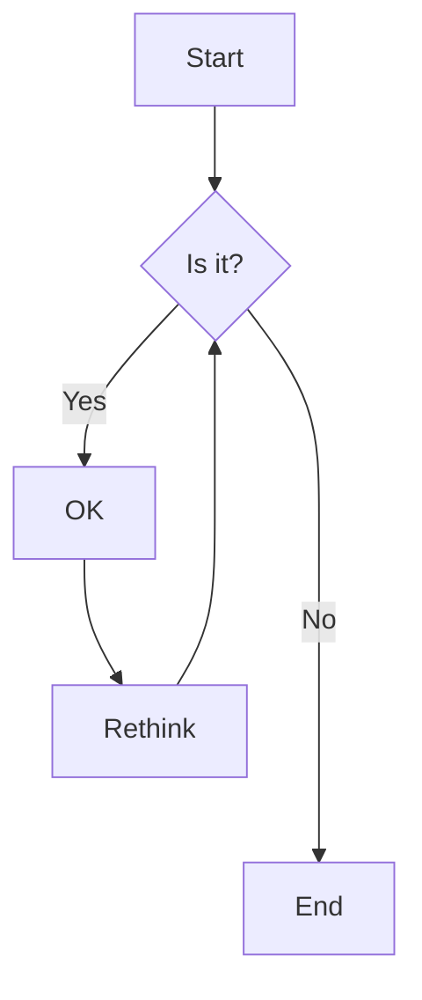
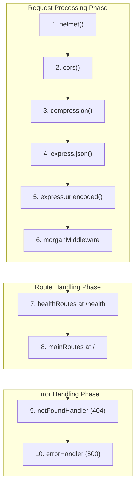
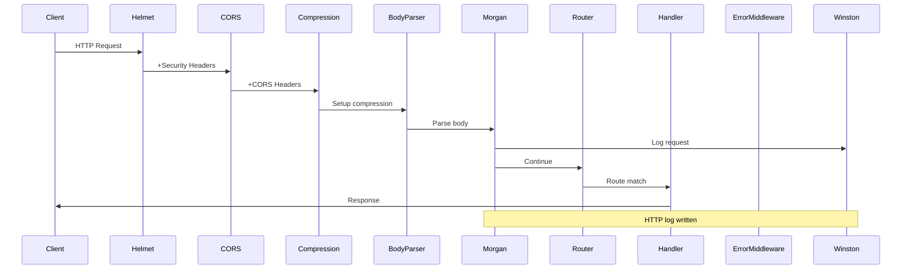
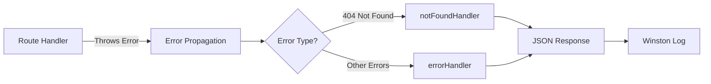
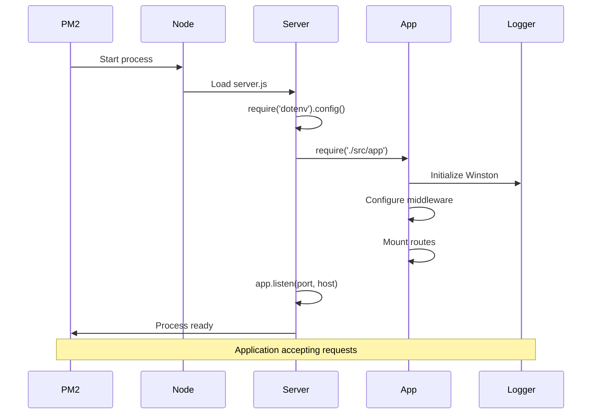
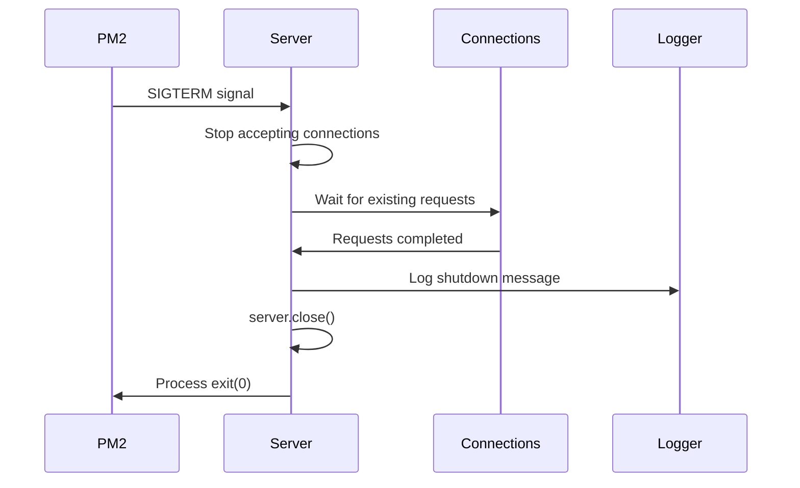

# Technical Specification

# 0. Agent Action Plan

## 0.1 Intent Clarification

Based on the provided requirements, the Blitzy platform understands that the objective is to transform a minimal Express.js HTTP server into a production-ready application with enterprise-grade features including enhanced routing, comprehensive middleware stack, environment configuration management, structured logging, and PM2 process management for production deployment.

### 0.1.1 Core Objective

The user's request to *"Enhance this basic HTTP server with Express.js framework, add routing, middleware, environment config, logging, and prepare for production deployment with PM2"* translates to the following technical implementation requirements:

| Requirement Area | User Intent | Technical Interpretation |
|------------------|-------------|-------------------------|
| **Express.js Framework** | Enhance the existing Express.js implementation | Extend the Express 5.1.0 foundation with production-grade middleware and enhanced routing patterns |
| **Routing** | Add routing capabilities | Implement additional route modules, API versioning structure, and health check endpoints |
| **Middleware** | Add middleware processing | Integrate security middleware (Helmet), CORS, compression, request body parsing, and error handling middleware |
| **Environment Config** | Add environment configuration | Implement dotenv for `.env` file support with environment-specific configurations and validation |
| **Logging** | Add structured logging | Integrate Winston for application logging and Morgan for HTTP request logging with file transport |
| **PM2 Production Deployment** | Prepare for production deployment with PM2 | Create ecosystem.config.js, cluster mode configuration, and production npm scripts |

### 0.1.2 Task Categorization

| Dimension | Classification | Rationale |
|-----------|----------------|-----------|
| **Primary Task Type** | Feature Enhancement | Adding new capabilities to existing Express.js application |
| **Secondary Aspects** | Configuration, Infrastructure, DevOps | Environment management and deployment automation |
| **Scope Classification** | Cross-cutting change | Affects middleware stack, configuration, logging across all components |
| **Complexity Level** | Medium | Requires integration of multiple npm packages with existing architecture |

### 0.1.3 Implicit Requirements Detected

Based on the user's explicit requirements, the following implicit requirements have been identified:

- **Security Middleware**: Production deployment requires security headers (Helmet), CORS configuration
- **Request Body Parsing**: Middleware for JSON and URL-encoded request body handling
- **Response Compression**: Gzip compression for optimized response sizes
- **Error Handling**: Centralized error handling middleware for consistent error responses
- **Graceful Shutdown**: PM2-compatible graceful shutdown handling for zero-downtime deployments
- **Health Check Endpoint**: Kubernetes/load-balancer compatible health check route
- **Log Rotation**: File-based logging with daily rotation for production environments
- **Environment Validation**: Validation of required environment variables at startup
- **Process Restart Strategy**: PM2 restart policies for automatic recovery from crashes

### 0.1.4 Technical Interpretation

These requirements translate to the following technical implementation strategy:

- **To achieve enhanced routing**, we will create additional route modules in `src/routes/` following the established Express Router pattern, add API versioning via path prefixes, and implement a dedicated health check endpoint at `/health`
- **To achieve middleware integration**, we will modify `src/app.js` to configure a comprehensive middleware stack including helmet, cors, compression, morgan, express.json(), and express.urlencoded() before route mounting
- **To achieve environment configuration**, we will install dotenv, create `.env` and `.env.example` template files, and extend `src/config/index.js` to support environment-specific configurations with validation
- **To achieve structured logging**, we will create `src/utils/logger.js` using Winston with console and file transports, create `src/middleware/morgan.middleware.js` for HTTP request logging, and ensure logs directory creation
- **To achieve PM2 production deployment**, we will create `ecosystem.config.js` with cluster mode configuration, add PM2-related scripts to `package.json`, and implement graceful shutdown handlers in `server.js`

### 0.1.5 Prerequisites and Dependencies

| Prerequisite | Status | Notes |
|--------------|--------|-------|
| Node.js ≥18.x | ✓ Satisfied | Node.js v20.19.6 available |
| Express.js 5.x | ✓ Satisfied | Express ^5.1.0 already installed |
| npm package manager | ✓ Satisfied | npm v11.1.0 available |
| Existing modular architecture | ✓ Satisfied | Factory pattern and Router pattern implemented |
| PM2 process manager | ⚠ Required | Needs global installation or dev dependency |

### 0.1.6 User-Provided Diagram Reference

The user provided the following workflow visualization as part of their requirements:


```mermaid
graph TD
    A[Start] --> B{Is it?}
    B -->|Yes| C[OK]
    C --> D[Rethink]
    D --> B
    B ---->|No| E[End]
```

This diagram represents a decision-making flow pattern that will be incorporated into the error handling and validation middleware implementations, where operations are validated, processed upon success, or gracefully terminated with appropriate error responses upon failure.


## 0.2 Repository Scope Discovery

### 0.2.1 Comprehensive File Analysis

A thorough repository analysis was conducted to identify all files and components affected by this enhancement. The current repository structure represents a minimal Express.js application following established patterns.

#### Current Repository Structure

```
hello_world/
├── .git/                     # Git version control
├── .gitignore                # Git ignore patterns
├── README.md                 # Project documentation
├── blitzy/                   # Technical documentation
│   └── documentation/        # Spec documents
├── package.json              # npm manifest
├── package-lock.json         # Dependency lock file
├── server.js                 # HTTP server entry point
└── src/
    ├── app.js               # Express application factory
    ├── config/
    │   └── index.js         # Configuration management
    └── routes/
        ├── index.js         # Route aggregator (barrel)
        └── main.routes.js   # Main route handlers
```

#### Existing Implementation Analysis

| File | Lines | Purpose | Impact from Enhancement |
|------|-------|---------|------------------------|
| `server.js` | 62 lines | Entry point, HTTP binding | HIGH - Add graceful shutdown, PM2 integration |
| `src/app.js` | 27 lines | Express factory, route mounting | HIGH - Add middleware stack configuration |
| `src/config/index.js` | 16 lines | Environment variables | HIGH - Extend with dotenv, add validation |
| `src/routes/index.js` | 7 lines | Route aggregator | MEDIUM - Export additional routes |
| `src/routes/main.routes.js` | 42 lines | Route handlers | LOW - Existing routes unchanged |
| `package.json` | 15 lines | npm configuration | HIGH - Add dependencies, scripts |
| `.gitignore` | 6 lines | Ignore patterns | MEDIUM - Add logs/, .env |
| `README.md` | ~150 lines | Documentation | HIGH - Update with new features |

### 0.2.2 Web Search Research Conducted

The following research was conducted to inform implementation best practices:

| Research Topic | Key Findings | Source |
|----------------|--------------|--------|
| Express.js PM2 Production Deployment | Cluster mode with `exec_mode: 'cluster'` and `instances: 'max'` recommended; ecosystem.config.js as standard configuration file | Official PM2 Documentation, Express.js Best Practices |
| Express.js Middleware Patterns | Morgan + Winston combination for comprehensive logging; place morgan middleware before routes, express-winston errorLogger after routes | Express.js Middleware Guide, Better Stack Community |
| dotenv Configuration Best Practices | Load dotenv at entry point before other imports; use `.env.example` for documentation; validate required variables | npm dotenv documentation |
| Node.js Logging Best Practices | Winston with multiple transports (Console + File); structured JSON format for production; log levels (error, warn, info, http, debug) | Winston GitHub, logging tutorials |

### 0.2.3 Existing Infrastructure Assessment

#### Current Project Structure and Organization

| Aspect | Current Implementation | Assessment |
|--------|----------------------|------------|
| **Module System** | CommonJS (`require`/`module.exports`) | Maintain consistency |
| **Architecture Pattern** | Factory Pattern (app.js exports app) | Extend, don't replace |
| **Route Pattern** | Express Router with Barrel Pattern | Add new route modules |
| **Configuration** | Environment variables via process.env | Enhance with dotenv |
| **Testing Infrastructure** | None (test script exits with error) | Out of scope for this enhancement |
| **Documentation System** | README.md + blitzy/ folder | Update README with new features |

#### Build and Deployment Configurations

| Configuration | Current State | Enhancement Required |
|--------------|---------------|---------------------|
| **npm scripts** | Only `start` and `test` defined | Add `start:dev`, `start:prod`, `pm2:start`, `pm2:stop` |
| **Process Management** | None (direct node execution) | Add PM2 ecosystem configuration |
| **Environment Handling** | Manual process.env access | Add dotenv support |
| **Logging** | Console.log only | Add Winston + Morgan |

#### Dependencies Analysis

| Category | Current Dependencies | Status |
|----------|---------------------|--------|
| **Runtime** | express@^5.1.0 | Installed |
| **Development** | None | Add PM2 as devDependency |
| **Security** | None | Add helmet, cors |
| **Logging** | None | Add winston, morgan |
| **Configuration** | None | Add dotenv |
| **Performance** | None | Add compression |

### 0.2.4 Files and Folders to be Created

| New Path | Type | Purpose |
|----------|------|---------|
| `.env` | File | Environment variables (gitignored) |
| `.env.example` | File | Environment template (committed) |
| `ecosystem.config.js` | File | PM2 configuration |
| `src/middleware/` | Folder | Middleware modules |
| `src/middleware/error.middleware.js` | File | Centralized error handling |
| `src/middleware/morgan.middleware.js` | File | HTTP request logging |
| `src/utils/` | Folder | Utility modules |
| `src/utils/logger.js` | File | Winston logger configuration |
| `src/routes/health.routes.js` | File | Health check endpoint |
| `logs/` | Folder | Log file storage (gitignored) |

### 0.2.5 Target Repository Structure

```
hello_world/
├── .env                          # Environment variables (NEW)
├── .env.example                  # Environment template (NEW)
├── .git/
├── .gitignore                    # UPDATED - add logs/, .env
├── ecosystem.config.js           # PM2 configuration (NEW)
├── README.md                     # UPDATED - new features
├── blitzy/
│   └── documentation/
├── logs/                         # Log files directory (NEW)
│   ├── error.log                 # Error logs
│   └── combined.log              # All logs
├── package.json                  # UPDATED - dependencies, scripts
├── package-lock.json             # AUTO-UPDATED
├── server.js                     # UPDATED - graceful shutdown
└── src/
    ├── app.js                    # UPDATED - middleware stack
    ├── config/
    │   └── index.js              # UPDATED - dotenv, validation
    ├── middleware/               # NEW FOLDER
    │   ├── error.middleware.js   # Error handling (NEW)
    │   └── morgan.middleware.js  # HTTP logging (NEW)
    ├── routes/
    │   ├── health.routes.js      # Health check (NEW)
    │   ├── index.js              # UPDATED - export health
    │   └── main.routes.js        # UNCHANGED
    └── utils/                    # NEW FOLDER
        └── logger.js             # Winston config (NEW)
```


## 0.3 File Transformation Mapping

### 0.3.1 File-by-File Execution Plan

The following table maps every file to be created, updated, or deleted with transformations and purposes:

| Target File | Transformation | Source/Reference | Purpose/Changes |
|-------------|----------------|------------------|-----------------|
| `package.json` | UPDATE | `package.json` | Add dependencies (dotenv, winston, morgan, helmet, cors, compression), add npm scripts for development and PM2 |
| `server.js` | UPDATE | `server.js` | Add dotenv loading at top, implement graceful shutdown handlers for SIGTERM/SIGINT signals, add PM2-compatible shutdown |
| `src/app.js` | UPDATE | `src/app.js` | Configure middleware stack (helmet, cors, compression, json parser, urlencoded, morgan), mount health routes |
| `src/config/index.js` | UPDATE | `src/config/index.js` | Integrate dotenv.config(), add environment validation, expand configuration options |
| `src/routes/index.js` | UPDATE | `src/routes/index.js` | Export healthRoutes in addition to mainRoutes |
| `.gitignore` | UPDATE | `.gitignore` | Add `logs/`, `.env`, `.env.local`, `.env.*.local` patterns |
| `README.md` | UPDATE | `README.md` | Document new features, middleware, logging, PM2 deployment |
| `.env` | CREATE | `.env.example` | Development environment variables (HOST, PORT, NODE_ENV, LOG_LEVEL) |
| `.env.example` | CREATE | N/A | Template for environment variables with documentation comments |
| `ecosystem.config.js` | CREATE | PM2 best practices | PM2 configuration with cluster mode, environment-specific settings |
| `src/utils/logger.js` | CREATE | Winston documentation | Winston logger with console and file transports, log levels |
| `src/middleware/morgan.middleware.js` | CREATE | `src/utils/logger.js` | Morgan middleware configured to stream to Winston |
| `src/middleware/error.middleware.js` | CREATE | Express error handling patterns | Centralized error handling with proper HTTP status codes |
| `src/routes/health.routes.js` | CREATE | `src/routes/main.routes.js` | Health check endpoint for load balancer/Kubernetes probes |
| `logs/.gitkeep` | CREATE | N/A | Placeholder to ensure logs directory exists in git |

### 0.3.2 New Files Detail

## `.env` - Environment Variables File

- **Content type**: Configuration
- **Based on**: `.env.example` template
- **Key sections**:
  - Server configuration (HOST, PORT)
  - Application environment (NODE_ENV)
  - Logging configuration (LOG_LEVEL)

### `.env.example` - Environment Template

- **Content type**: Documentation/Configuration
- **Based on**: Industry best practices
- **Key sections**:
  - Commented documentation for each variable
  - Default value suggestions
  - Security notes

### `ecosystem.config.js` - PM2 Configuration

- **Content type**: Configuration
- **Based on**: PM2 documentation, Express.js best practices
- **Key sections**:
  - Application definition with cluster mode
  - Environment-specific configurations (development, production)
  - Restart policies and instance management

## `src/utils/logger.js` - Winston Logger

- **Content type**: Source code (utility)
- **Based on**: Winston 3.x documentation
- **Key functions**:
  - Logger factory with configured transports
  - Console transport with colorized output
  - File transports (error.log, combined.log)
  - Log level management based on NODE_ENV

### `src/middleware/morgan.middleware.js` - HTTP Request Logger

- **Content type**: Source code (middleware)
- **Based on**: Morgan documentation, Winston integration
- **Key functions**:
  - Morgan middleware configured with combined format
  - Stream configuration to pipe to Winston logger
  - Environment-aware format selection

### `src/middleware/error.middleware.js` - Error Handler

- **Content type**: Source code (middleware)
- **Based on**: Express.js error handling patterns
- **Key functions**:
  - notFoundHandler for 404 responses
  - errorHandler for centralized error processing
  - Stack trace suppression in production

### `src/routes/health.routes.js` - Health Check Route

- **Content type**: Source code (route)
- **Based on**: `src/routes/main.routes.js` pattern
- **Key endpoints**:
  - `GET /health` - Basic health check returning JSON status

### 0.3.3 Files to Modify Detail

## `package.json` - npm Manifest

- **Sections to update**:
  - `dependencies`: Add dotenv, winston, morgan, helmet, cors, compression
  - `devDependencies`: Add pm2
  - `scripts`: Add start:dev, start:prod, pm2:start, pm2:stop, pm2:restart, pm2:logs

## `server.js` - Entry Point

- **Sections to update**:
  - Line 1: Add `require('dotenv').config()` before any other imports
  - After listen callback: Add graceful shutdown handlers
- **New content to add**:
  - SIGTERM handler for PM2 graceful reload
  - SIGINT handler for development Ctrl+C
  - Connection draining logic

## `src/app.js` - Express Application Factory

- **Sections to update**:
  - After express() initialization: Add middleware stack
  - Before route mounting: Configure security and logging middleware
  - After route mounting: Add error handling middleware
- **New imports to add**:
  - helmet, cors, compression
  - morganMiddleware from middleware
  - error handlers from middleware
  - healthRoutes from routes

## `src/config/index.js` - Configuration Manager

- **Sections to update**:
  - Top of file: Ensure dotenv is loaded (or rely on server.js)
  - Configuration object: Add LOG_LEVEL, additional environment variables
- **New content to add**:
  - Environment validation function
  - Expanded configuration options

## `src/routes/index.js` - Route Aggregator

- **Sections to update**:
  - Add require for healthRoutes
  - Add healthRoutes to exports object

## `.gitignore` - Git Ignore Rules

- **New content to add**:
  ```
#### Environment variables

  .env
  .env.local
  .env.*.local
  
#### Logs

  logs/
  *.log
  ```

### 0.3.4 Configuration and Documentation Updates

#### Configuration Changes

| Config File | Specific Settings | Impact |
|-------------|-------------------|--------|
| `package.json` | New dependencies and scripts | Enables all new features |
| `ecosystem.config.js` | PM2 cluster configuration | Production deployment capability |
| `.env` | Runtime configuration | Environment-specific behavior |
| `.gitignore` | New ignore patterns | Security and cleanliness |

#### Documentation Updates

| Doc File | Sections to Add/Update | Cross-references |
|----------|----------------------|------------------|
| `README.md` | Environment Variables section | Link to `.env.example` |
| `README.md` | Middleware Stack section | Reference to security features |
| `README.md` | Logging section | Log file locations |
| `README.md` | PM2 Deployment section | Link to ecosystem.config.js |
| `README.md` | API Reference update | Add /health endpoint |

### 0.3.5 Cross-File Dependencies

#### Import/Reference Updates Required

| Source File | Imports From | Change Type |
|-------------|--------------|-------------|
| `server.js` | `dotenv` | NEW import at line 1 |
| `src/app.js` | `helmet` | NEW import |
| `src/app.js` | `cors` | NEW import |
| `src/app.js` | `compression` | NEW import |
| `src/app.js` | `./middleware/morgan.middleware` | NEW import |
| `src/app.js` | `./middleware/error.middleware` | NEW import |
| `src/app.js` | `./routes` (healthRoutes) | UPDATED import |
| `src/middleware/morgan.middleware.js` | `../utils/logger` | NEW import |
| `src/middleware/morgan.middleware.js` | `morgan` | NEW import |
| `src/middleware/error.middleware.js` | `../utils/logger` | NEW import |
| `src/routes/index.js` | `./health.routes` | NEW import |

#### Configuration Sync Requirements

| Configuration | Files Requiring Sync |
|---------------|---------------------|
| `LOG_LEVEL` | `src/config/index.js`, `src/utils/logger.js` |
| `NODE_ENV` | `src/config/index.js`, `src/utils/logger.js`, `ecosystem.config.js` |
| `PORT` | `src/config/index.js`, `.env`, `ecosystem.config.js` |


## 0.4 Dependency Inventory

### 0.4.1 Key Private and Public Packages

#### Runtime Dependencies

| Registry | Package Name | Version | Purpose |
|----------|--------------|---------|---------|
| npm | express | ^5.1.0 | HTTP framework (existing) |
| npm | dotenv | ^16.4.7 | Environment variable loading from .env files |
| npm | winston | ^3.17.0 | Structured application logging with multiple transports |
| npm | morgan | ^1.10.0 | HTTP request logging middleware |
| npm | helmet | ^8.0.0 | Security headers middleware |
| npm | cors | ^2.8.5 | Cross-Origin Resource Sharing middleware |
| npm | compression | ^1.7.5 | Gzip/deflate response compression middleware |

#### Development Dependencies

| Registry | Package Name | Version | Purpose |
|----------|--------------|---------|---------|
| npm | pm2 | ^5.4.3 | Production process manager with cluster mode |

### 0.4.2 Dependency Version Rationale

| Package | Version Selected | Rationale |
|---------|-----------------|-----------|
| `dotenv@^16.4.7` | Latest stable 16.x | Most recent stable release with Node.js 20.x support, zero dependencies |
| `winston@^3.17.0` | Latest stable 3.x | Current stable major version with ES6 support, multiple transport options |
| `morgan@^1.10.0` | Latest 1.x | Stable release, Express.js official middleware, minimal footprint |
| `helmet@^8.0.0` | Latest major 8.x | Updated security headers, ESM/CJS dual support, Express 5 compatible |
| `cors@^2.8.5` | Latest 2.x | Stable CORS middleware, widely used, Express 5 compatible |
| `compression@^1.7.5` | Latest 1.x | Stable compression middleware, gzip/deflate support |
| `pm2@^5.4.3` | Latest stable 5.x | Production-grade process manager, cluster mode, graceful reload |

### 0.4.3 Dependency Updates

#### New Dependencies to Add

```json
{
  "dependencies": {
    "compression": "^1.7.5",
    "cors": "^2.8.5",
    "dotenv": "^16.4.7",
    "helmet": "^8.0.0",
    "morgan": "^1.10.0",
    "winston": "^3.17.0"
  },
  "devDependencies": {
    "pm2": "^5.4.3"
  }
}
```

#### Dependencies to Update

| Package | Current Version | New Version | Reason |
|---------|-----------------|-------------|--------|
| N/A | - | - | No existing dependencies require updates |

#### Dependencies to Remove

| Package | Version | Reason |
|---------|---------|--------|
| N/A | - | No dependencies to remove |

### 0.4.4 Import/Reference Updates

#### New Import Statements by File

**server.js** (Line 1, before all other imports):
```javascript
// Old: (no dotenv import)
// New:
require('dotenv').config();
```

**src/app.js** (Import section):
```javascript
// Old imports:
const express = require('express');
const { mainRoutes } = require('./routes');

// New imports (add after express):
const helmet = require('helmet');
const cors = require('cors');
const compression = require('compression');
const { mainRoutes, healthRoutes } = require('./routes');
const morganMiddleware = require('./middleware/morgan.middleware');
const { notFoundHandler, errorHandler } = require('./middleware/error.middleware');
```

**src/middleware/morgan.middleware.js** (New file):
```javascript
const morgan = require('morgan');
const logger = require('../utils/logger');
```

**src/middleware/error.middleware.js** (New file):
```javascript
const logger = require('../utils/logger');
```

**src/utils/logger.js** (New file):
```javascript
const winston = require('winston');
```

**src/routes/index.js** (Updated imports):
```javascript
// Old:
const mainRoutes = require('./main.routes');
module.exports = { mainRoutes };

// New:
const mainRoutes = require('./main.routes');
const healthRoutes = require('./health.routes');
module.exports = { mainRoutes, healthRoutes };
```

### 0.4.5 Package Installation Commands

```bash
# Install runtime dependencies

npm install dotenv@^16.4.7 winston@^3.17.0 morgan@^1.10.0 \
  helmet@^8.0.0 cors@^2.8.5 compression@^1.7.5

#### Install development dependencies

npm install --save-dev pm2@^5.4.3
```

### 0.4.6 Dependency Compatibility Matrix

| Package | Node.js 18+ | Node.js 20+ | Express 5.x | CommonJS |
|---------|-------------|-------------|-------------|----------|
| dotenv | ✓ | ✓ | ✓ | ✓ |
| winston | ✓ | ✓ | ✓ | ✓ |
| morgan | ✓ | ✓ | ✓ | ✓ |
| helmet | ✓ | ✓ | ✓ | ✓ |
| cors | ✓ | ✓ | ✓ | ✓ |
| compression | ✓ | ✓ | ✓ | ✓ |
| pm2 | ✓ | ✓ | N/A | ✓ |

### 0.4.7 Security Considerations

| Package | Security Notes |
|---------|---------------|
| `dotenv` | Ensure `.env` is in `.gitignore`; never commit secrets |
| `helmet` | Provides 11+ security headers by default; consider CSP customization |
| `cors` | Configure allowed origins explicitly in production |
| `winston` | Avoid logging sensitive data; use redaction if needed |
| `morgan` | May log IP addresses; ensure GDPR compliance |
| `pm2` | Keep updated for security patches; use ecosystem file for sensitive env vars |


## 0.5 Implementation Design

### 0.5.1 Technical Approach

#### Primary Objectives with Implementation Approach

| Objective | Implementation Approach | Rationale |
|-----------|------------------------|-----------|
| **Enhance routing** | Create `src/routes/health.routes.js` following existing Router pattern; export via barrel module | Maintains architectural consistency with factory/barrel patterns |
| **Add middleware stack** | Configure middleware in `src/app.js` in correct order: security → compression → parsing → logging → routes → errors | Ensures proper request/response processing flow |
| **Add environment config** | Install dotenv, load in `server.js` at entry, extend `src/config/index.js` with validation | Follows twelve-factor app methodology already established |
| **Add structured logging** | Create Winston logger in `src/utils/`, create Morgan middleware in `src/middleware/` | Separates concerns; enables both application and HTTP logging |
| **Prepare PM2 deployment** | Create `ecosystem.config.js`, add npm scripts, implement graceful shutdown | Enables cluster mode, zero-downtime deployments |

#### Logical Implementation Flow

The implementation follows this logical sequence (not a timeline):

1. **First, establish configuration foundation** by adding dotenv support in `server.js` and extending `src/config/index.js` to load and validate environment variables before any other modules initialize
2. **Second, create utility infrastructure** by implementing `src/utils/logger.js` with Winston configured for console and file transports, establishing the logging foundation
3. **Third, build middleware layer** by creating `src/middleware/morgan.middleware.js` that pipes HTTP logs to Winston, and `src/middleware/error.middleware.js` for centralized error handling
4. **Fourth, extend routing** by creating `src/routes/health.routes.js` and updating the route aggregator to export the new health routes
5. **Fifth, integrate middleware stack** by modifying `src/app.js` to configure helmet, cors, compression, body parsers, morgan, and error handlers in the correct order
6. **Sixth, implement graceful shutdown** by adding SIGTERM/SIGINT handlers in `server.js` for PM2 compatibility
7. **Finally, configure PM2** by creating `ecosystem.config.js` with cluster mode and environment-specific settings, and adding npm scripts

### 0.5.2 Component Impact Analysis

#### Direct Modifications Required

| Component | Modification | Purpose |
|-----------|--------------|---------|
| `server.js` | Add dotenv require at line 1; add graceful shutdown handlers | Environment loading and PM2 integration |
| `src/app.js` | Add 8 middleware configurations in sequence | Security, compression, parsing, logging, error handling |
| `src/config/index.js` | Add LOG_LEVEL export; add validation function | Extended configuration with startup validation |
| `src/routes/index.js` | Add healthRoutes export | Enable health check endpoint access |
| `package.json` | Add 6 runtime deps, 1 dev dep, 6 scripts | Enable new features and deployment commands |
| `.gitignore` | Add .env and logs/ patterns | Security and cleanliness |

#### Indirect Impacts and Dependencies

| Component | Impact Type | Required Update |
|-----------|-------------|-----------------|
| All route handlers | Logging available | Can use imported logger for application logs |
| Error responses | Standardized | Centralized error middleware handles all uncaught errors |
| HTTP responses | Headers enhanced | Helmet adds security headers to all responses |
| Response size | Optimized | Compression reduces payload sizes for text content |
| Process lifecycle | Managed | PM2 handles restarts, clustering, and monitoring |

#### New Components Introduction

| Component | Type | Responsibility |
|-----------|------|----------------|
| `src/utils/logger.js` | Utility | Winston logger factory with environment-aware configuration |
| `src/middleware/morgan.middleware.js` | Middleware | HTTP request logging piped to Winston |
| `src/middleware/error.middleware.js` | Middleware | 404 handler and centralized error handler |
| `src/routes/health.routes.js` | Route | Health check endpoint for probes |
| `ecosystem.config.js` | Configuration | PM2 process management settings |
| `.env` | Configuration | Runtime environment variables |
| `.env.example` | Documentation | Environment variable template |

### 0.5.3 Middleware Stack Order

The middleware stack must be configured in a specific order for correct behavior:


```mermaid
flowchart TB
    subgraph RequestPhase["Request Processing Phase"]
        R1["1. helmet()"] --> R2["2. cors()"]
        R2 --> R3["3. compression()"]
        R3 --> R4["4. express.json()"]
        R4 --> R5["5. express.urlencoded()"]
        R5 --> R6["6. morganMiddleware"]
    end
    
    subgraph RoutePhase["Route Handling Phase"]
        RH1["7. healthRoutes at /health"]
        RH2["8. mainRoutes at /"]
    end
    
    subgraph ErrorPhase["Error Handling Phase"]
        E1["9. notFoundHandler (404)"]
        E2["10. errorHandler (500)"]
    end
    
    R6 --> RH1
    RH1 --> RH2
    RH2 --> E1
    E1 --> E2
```

| Order | Middleware | Purpose |
|-------|------------|---------|
| 1 | `helmet()` | Set security HTTP headers first |
| 2 | `cors()` | Handle CORS preflight early |
| 3 | `compression()` | Compress responses before sending |
| 4 | `express.json()` | Parse JSON request bodies |
| 5 | `express.urlencoded()` | Parse URL-encoded request bodies |
| 6 | `morganMiddleware` | Log HTTP requests |
| 7 | `healthRoutes` | Mount health check routes |
| 8 | `mainRoutes` | Mount application routes |
| 9 | `notFoundHandler` | Catch unmatched routes |
| 10 | `errorHandler` | Handle all errors |

### 0.5.4 Critical Implementation Details

#### Winston Logger Configuration

```javascript
// Log levels hierarchy
const levels = {
  error: 0,   // Error conditions
  warn: 1,    // Warning conditions
  info: 2,    // Informational messages
  http: 3,    // HTTP request logs (Morgan)
  debug: 4    // Debug messages
};
```

**Transports Configuration**:
- Console: Colorized output, level based on NODE_ENV (debug in development, info in production)
- File (error.log): Only error level, daily rotation recommended for production
- File (combined.log): All levels, for comprehensive logging

#### Graceful Shutdown Pattern

```javascript
// Shutdown sequence
process.on('SIGTERM', gracefulShutdown);
process.on('SIGINT', gracefulShutdown);

function gracefulShutdown() {
  // 1. Stop accepting new connections
  // 2. Wait for existing requests to complete
  // 3. Close server
  // 4. Exit process
}
```

#### Environment Validation Pattern

```javascript
// Required variables validation
const required = ['NODE_ENV'];
const missing = required.filter(key => !process.env[key]);
if (missing.length > 0) {
  // Log warning but continue with defaults
}
```

### 0.5.5 Data Flow Modifications

#### Enhanced Request Flow


```mermaid
sequenceDiagram
    participant Client
    participant Helmet
    participant CORS
    participant Compression
    participant BodyParser
    participant Morgan
    participant Router
    participant Handler
    participant ErrorMiddleware
    participant Winston
    
    Client->>Helmet: HTTP Request
    Helmet->>CORS: +Security Headers
    CORS->>Compression: +CORS Headers
    Compression->>BodyParser: Setup compression
    BodyParser->>Morgan: Parse body
    Morgan->>Winston: Log request
    Morgan->>Router: Continue
    Router->>Handler: Route match
    Handler->>Client: Response
    Note over Morgan,Winston: HTTP log written
```

#### Error Handling Flow


```mermaid
flowchart LR
    A[Route Handler] -->|Throws Error| B[Error Propagation]
    B --> C{Error Type?}
    C -->|404 Not Found| D[notFoundHandler]
    C -->|Other Errors| E[errorHandler]
    D --> F[JSON Response]
    E --> F
    F --> G[Winston Log]
```

### 0.5.6 Performance Considerations

| Feature | Performance Impact | Mitigation |
|---------|-------------------|------------|
| Helmet | Minimal (header manipulation only) | None required |
| Compression | CPU overhead for compression | Threshold configuration (don't compress <1KB) |
| Winston File Transport | Disk I/O | Async writes, log rotation |
| Morgan Logging | String formatting overhead | Use 'combined' format for production |
| PM2 Cluster Mode | Memory per instance | Configure appropriate instance count |


## 0.6 Scope Boundaries

### 0.6.1 Exhaustively In Scope

#### Source Code Changes

| Pattern | Files Affected | Description |
|---------|---------------|-------------|
| `server.js` | 1 file | Add dotenv loading, graceful shutdown handlers |
| `src/app.js` | 1 file | Configure middleware stack, update route imports |
| `src/config/index.js` | 1 file | Extend configuration with LOG_LEVEL, validation |
| `src/routes/index.js` | 1 file | Export healthRoutes |
| `src/routes/health.routes.js` | 1 file | NEW - Health check endpoint |
| `src/middleware/*.js` | 2 files | NEW - Morgan and error middleware |
| `src/utils/*.js` | 1 file | NEW - Winston logger utility |

#### Configuration Updates

| Pattern | Files Affected | Description |
|---------|---------------|-------------|
| `package.json` | 1 file | Add dependencies, devDependencies, scripts |
| `package-lock.json` | 1 file | Auto-updated by npm install |
| `.gitignore` | 1 file | Add .env, logs/ patterns |
| `.env` | 1 file | NEW - Environment variables |
| `.env.example` | 1 file | NEW - Environment template |
| `ecosystem.config.js` | 1 file | NEW - PM2 configuration |

#### Documentation Updates

| Pattern | Files Affected | Description |
|---------|---------------|-------------|
| `README.md` | 1 file | Document new features, installation, deployment |

#### New Directory Structure

| Pattern | Directories Created | Description |
|---------|---------------------|-------------|
| `src/middleware/` | 1 directory | Middleware modules |
| `src/utils/` | 1 directory | Utility modules |
| `logs/` | 1 directory | Log file storage |

### 0.6.2 Complete File Inventory

| # | File Path | Action | Priority |
|---|-----------|--------|----------|
| 1 | `package.json` | UPDATE | Critical |
| 2 | `server.js` | UPDATE | Critical |
| 3 | `src/app.js` | UPDATE | Critical |
| 4 | `src/config/index.js` | UPDATE | Critical |
| 5 | `src/routes/index.js` | UPDATE | High |
| 6 | `.gitignore` | UPDATE | High |
| 7 | `README.md` | UPDATE | Medium |
| 8 | `.env` | CREATE | Critical |
| 9 | `.env.example` | CREATE | Critical |
| 10 | `ecosystem.config.js` | CREATE | Critical |
| 11 | `src/utils/logger.js` | CREATE | Critical |
| 12 | `src/middleware/morgan.middleware.js` | CREATE | Critical |
| 13 | `src/middleware/error.middleware.js` | CREATE | High |
| 14 | `src/routes/health.routes.js` | CREATE | High |
| 15 | `logs/.gitkeep` | CREATE | Low |

### 0.6.3 Explicitly Out of Scope

The following items are **NOT** included in this implementation:

| Category | Out of Scope Item | Rationale |
|----------|-------------------|-----------|
| **Testing** | Unit tests, integration tests | Not requested; test infrastructure does not exist |
| **Database** | Database connections, ORM integration | Not requested; application is stateless by design |
| **Authentication** | JWT, OAuth, session management | Not requested; no auth requirements specified |
| **API Documentation** | Swagger/OpenAPI specification | Not requested; minimal API surface |
| **Frontend** | Static file serving, view engines | Not requested; API-only application |
| **CI/CD** | GitHub Actions, Jenkins, deployment pipelines | Not requested; only PM2 local deployment |
| **Docker** | Dockerfile, docker-compose | Not requested; PM2 deployment specified |
| **TypeScript** | Type definitions, TypeScript migration | Not requested; CommonJS JavaScript maintained |
| **Rate Limiting** | express-rate-limit, throttling | Not requested; would require additional middleware |
| **Input Validation** | joi, express-validator | Not requested; minimal input endpoints |
| **API Versioning** | /api/v1 prefixing | Not explicitly requested |
| **Caching** | Redis, memory caching | Not requested; application is stateless |
| **Metrics** | Prometheus, StatsD integration | Not requested |
| **APM** | Application performance monitoring | Not requested |
| **Secrets Management** | HashiCorp Vault, AWS Secrets Manager | Not requested; dotenv is sufficient |
| **Log Aggregation** | ELK stack, CloudWatch | Not requested; file-based logging sufficient |
| **HTTPS** | TLS certificates, SSL termination | Typically handled at reverse proxy level |
| **WebSockets** | Socket.io, ws integration | Not requested |
| **Refactoring** | Code reorganization beyond requirements | Not requested |

### 0.6.4 Boundary Decisions

| Decision | Rationale |
|----------|-----------|
| Use CommonJS, not ESM | Maintain consistency with existing codebase |
| Keep existing routes unchanged | No modifications requested for existing functionality |
| Winston file logging only | Log aggregation services not specified |
| PM2 over systemd/Docker | Explicitly requested by user |
| helmet defaults only | Advanced CSP/security configuration not requested |
| CORS open by default | Specific origin restrictions not specified |
| No database layer | Stateless application design maintained |

### 0.6.5 Dependencies on User Decisions

| Decision Required | Impact | Default Assumption |
|-------------------|--------|-------------------|
| CORS allowed origins | Security configuration | Allow all origins (development default) |
| Log retention policy | Disk space management | No automatic rotation (manual or external) |
| PM2 instance count | Resource utilization | `max` (use all CPU cores) |
| Health check depth | Probe capabilities | Simple ping (no dependency checks) |
| Error response format | Client compatibility | JSON with message and status |

### 0.6.6 Risk Assessment

| Risk | Likelihood | Impact | Mitigation |
|------|------------|--------|------------|
| Breaking existing routes | Low | High | Only additive changes to src/app.js |
| PM2 cluster mode issues | Low | Medium | Stateless design already supports clustering |
| Log file disk exhaustion | Medium | Medium | Document log rotation requirements |
| Environment variable exposure | Low | High | .env in .gitignore; .env.example for docs |
| Performance degradation | Low | Low | Middleware overhead is minimal |


## 0.7 Execution Parameters

### 0.7.1 Special Execution Instructions

#### Process-Specific Requirements

| Requirement | Specification | Notes |
|-------------|---------------|-------|
| **Module System** | CommonJS | Use `require()`/`module.exports` throughout |
| **dotenv Loading** | Must be first require in server.js | Before any other modules access process.env |
| **Middleware Order** | Security → Compression → Parsing → Logging → Routes → Errors | Critical for correct behavior |
| **Graceful Shutdown** | Implement SIGTERM and SIGINT handlers | Required for PM2 zero-downtime reload |
| **Log Directory** | Create `logs/` directory if not exists | Winston file transport requires it |

#### Tools and Platform Requirements

| Tool | Requirement | Installation |
|------|-------------|--------------|
| Node.js | ≥18.x (LTS recommended) | Pre-installed |
| npm | ≥9.x | Bundled with Node.js |
| PM2 | Install as devDependency | `npm install --save-dev pm2` |

#### Quality and Style Requirements

| Aspect | Requirement |
|--------|-------------|
| **Code Style** | Match existing codebase conventions (CommonJS, 2-space indent) |
| **Error Handling** | All errors must propagate to centralized error handler |
| **Logging Format** | JSON format for file logs, colorized for console in development |
| **Configuration** | All hardcoded values must be externalized to config |

### 0.7.2 Constraints and Boundaries

#### Technical Constraints

| Constraint | Specification | Impact |
|------------|---------------|--------|
| Express Version | Must remain ^5.1.0 | Use Express 5.x compatible middleware only |
| Node.js Version | Minimum 18.x | Package selection must support Node 18+ |
| Module Format | CommonJS only | No ES modules migration |
| No Breaking Changes | Existing /  and /evening routes must work identically | Additive changes only |

#### Process Constraints

| Constraint | Specification |
|------------|---------------|
| **Do Not Modify** | `src/routes/main.routes.js` existing route handlers |
| **Do Not Add** | Database connections, authentication, or external API calls |
| **Do Not Remove** | Any existing functionality or exports |
| **Preserve** | Existing startup console message format |

#### Output Constraints

| Constraint | Specification |
|------------|---------------|
| **Response Format** | Existing routes maintain text/html; new routes use JSON |
| **Error Responses** | JSON format with `error` and `message` fields |
| **Health Check** | JSON response with `status` and `timestamp` fields |
| **Log Output** | Console: human-readable; File: JSON |

### 0.7.3 Compatibility Requirements

| System | Requirement | Verification |
|--------|-------------|--------------|
| Node.js 18.x | All packages must support | ✓ Verified in package documentation |
| Node.js 20.x | All packages must support | ✓ Verified in package documentation |
| Node.js 22.x | All packages should support | ⚠ Not explicitly verified |
| Linux/macOS/Windows | PM2 must work cross-platform | ✓ PM2 supports all platforms |

### 0.7.4 Environment Configuration Defaults

| Variable | Development Default | Production Recommendation |
|----------|--------------------|-----------------------------|
| `HOST` | `127.0.0.1` | `0.0.0.0` (bind all interfaces) |
| `PORT` | `3000` | From environment (container/platform) |
| `NODE_ENV` | `development` | `production` |
| `LOG_LEVEL` | `debug` | `info` or `warn` |

### 0.7.5 npm Script Definitions

| Script | Command | Purpose |
|--------|---------|---------|
| `start` | `node server.js` | Standard startup (existing) |
| `start:dev` | `NODE_ENV=development node server.js` | Development with verbose logging |
| `start:prod` | `NODE_ENV=production node server.js` | Production mode without PM2 |
| `pm2:start` | `pm2 start ecosystem.config.js` | Start with PM2 in cluster mode |
| `pm2:stop` | `pm2 stop ecosystem.config.js` | Stop PM2 managed processes |
| `pm2:restart` | `pm2 restart ecosystem.config.js` | Restart with zero-downtime reload |
| `pm2:logs` | `pm2 logs` | View PM2 process logs |

### 0.7.6 Deployment Considerations

#### PM2 Configuration Parameters

| Parameter | Development | Production |
|-----------|-------------|------------|
| `instances` | `1` | `'max'` or CPU count |
| `exec_mode` | `'fork'` | `'cluster'` |
| `watch` | `true` | `false` |
| `max_memory_restart` | N/A | `'500M'` (example) |
| `env.NODE_ENV` | `'development'` | `'production'` |

#### Startup Sequence


```mermaid
sequenceDiagram
    participant PM2
    participant Node
    participant Server
    participant App
    participant Logger
    
    PM2->>Node: Start process
    Node->>Server: Load server.js
    Server->>Server: require('dotenv').config()
    Server->>App: require('./src/app')
    App->>Logger: Initialize Winston
    App->>App: Configure middleware
    App->>App: Mount routes
    Server->>Server: app.listen(port, host)
    Server->>PM2: Process ready
    Note over PM2,Logger: Application accepting requests
```

#### Shutdown Sequence


```mermaid
sequenceDiagram
    participant PM2
    participant Server
    participant Connections
    participant Logger
    
    PM2->>Server: SIGTERM signal
    Server->>Server: Stop accepting connections
    Server->>Connections: Wait for existing requests
    Connections->>Server: Requests completed
    Server->>Logger: Log shutdown message
    Server->>Server: server.close()
    Server->>PM2: Process exit(0)
```

### 0.7.7 Verification Checklist

| Item | Verification Method |
|------|---------------------|
| Middleware stack loads | Server starts without errors |
| Health endpoint works | `curl http://localhost:3000/health` returns JSON |
| Existing routes unchanged | `curl http://localhost:3000/` returns "Hello, World!\n" |
| Logging works | Console output visible; log files created |
| PM2 cluster works | `pm2 start ecosystem.config.js` starts multiple instances |
| Graceful shutdown | SIGTERM stops accepting new connections |
| Environment config | Variables from .env are accessible |


## 0.8 Special Instructions

### 0.8.1 Task-Specific Requirements

#### Pattern Adherence

| Instruction | Details |
|-------------|---------|
| **Follow existing patterns in `src/routes/main.routes.js`** | New route modules must use identical Express Router pattern with module.exports |
| **Follow existing patterns in `src/config/index.js`** | Configuration exports must maintain same object structure with environment variable parsing |
| **Match existing code style** | 2-space indentation, single quotes, CommonJS modules, minimal comments |

#### Architecture Consistency

| Instruction | Details |
|-------------|---------|
| **Maintain Factory Pattern** | `src/app.js` must continue exporting configured app without calling listen() |
| **Maintain Barrel Pattern** | `src/routes/index.js` must aggregate all route exports |
| **Maintain Twelve-Factor Config** | All configuration via environment variables with sensible defaults |

### 0.8.2 Do Not Modify Directives

| Directive | Files Affected |
|-----------|---------------|
| **Do not modify existing route handler implementations** | `src/routes/main.routes.js` lines 22-42 |
| **Do not change response content of existing routes** | `/` must return "Hello, World!\n", `/evening` must return "Good evening" |
| **Do not modify the module export structure** | `module.exports = app` in app.js, `module.exports = router` in routes |
| **Do not convert to ES modules** | Keep CommonJS `require`/`module.exports` |

### 0.8.3 Quality Assurance Criteria

| Criteria | Requirement |
|----------|-------------|
| **Backward Compatibility** | All existing curl commands must produce identical output |
| **Error Handling** | No unhandled promise rejections or uncaught exceptions |
| **Graceful Degradation** | Application must start even if .env file is missing (use defaults) |
| **Clean Startup** | No deprecation warnings or security advisories on startup |
| **PM2 Compatibility** | Application must support cluster mode without code changes |

### 0.8.4 Code Examples to Follow

#### Route Module Pattern (Reference: main.routes.js)

```javascript
// Pattern from src/routes/main.routes.js
const express = require('express');
const router = express.Router();

router.get('/path', (req, res) => {
    res.send('Response');
});

module.exports = router;
```

#### Configuration Pattern (Reference: config/index.js)

```javascript
// Pattern from src/config/index.js
const host = process.env.HOST || '127.0.0.1';
const port = parseInt(process.env.PORT, 10) || 3000;

module.exports = { host, port };
```

### 0.8.5 Implementation Sequence Recommendations

| Step | Action | Verification |
|------|--------|--------------|
| 1 | Update `.gitignore` | Ensure .env will not be committed |
| 2 | Create `.env.example` | Document required variables |
| 3 | Create `.env` | Copy from .env.example |
| 4 | Update `package.json` dependencies | Run npm install |
| 5 | Create `src/utils/logger.js` | Test logger in isolation |
| 6 | Create `src/middleware/morgan.middleware.js` | Test with logger |
| 7 | Create `src/middleware/error.middleware.js` | Test error handling |
| 8 | Create `src/routes/health.routes.js` | Test health endpoint |
| 9 | Update `src/routes/index.js` | Export health routes |
| 10 | Update `src/config/index.js` | Add LOG_LEVEL |
| 11 | Update `src/app.js` | Add middleware stack |
| 12 | Update `server.js` | Add dotenv, graceful shutdown |
| 13 | Create `ecosystem.config.js` | Test PM2 deployment |
| 14 | Update `package.json` scripts | Test npm scripts |
| 15 | Update `README.md` | Document new features |

### 0.8.6 Research-Backed Best Practices Applied

| Best Practice | Source | Implementation |
|---------------|--------|----------------|
| Load dotenv before any other imports | dotenv npm documentation | First line of server.js |
| Use environment variables for all config | Twelve-Factor App methodology | Extended config module |
| PM2 cluster mode for multi-core | Express.js production best practices | ecosystem.config.js with instances: 'max' |
| Winston + Morgan combination | Better Stack logging guide | Separate winston logger and morgan middleware |
| Graceful shutdown handlers | PM2 documentation | SIGTERM/SIGINT handlers in server.js |
| Helmet for security headers | Express.js security best practices | First middleware in stack |
| Compression after security middleware | Express.js middleware ordering | Third in middleware stack |
| Error handler last in middleware chain | Express.js error handling guide | After route handlers |

### 0.8.7 Known Limitations and Workarounds

| Limitation | Impact | Workaround |
|------------|--------|------------|
| Express 5.x is relatively new | Some middleware may have compatibility issues | Use versions explicitly tested with Express 5 |
| Winston file transport requires existing directory | App fails if logs/ doesn't exist | Create logs/.gitkeep or mkdir in startup |
| PM2 cluster mode requires stateless design | Session state not shared between workers | Application already stateless |
| Morgan combined format logs IP addresses | GDPR considerations | Acceptable for development; consider masking in production |

### 0.8.8 Post-Implementation Verification Commands

```bash
# Verify dependencies installed

npm ls

#### Start in development mode

npm run start:dev

#### Test existing routes (must be unchanged)

curl http://localhost:3000/
#### Expected: Hello, World!

curl http://localhost:3000/evening
# Expected: Good evening

#### Test new health endpoint

curl http://localhost:3000/health
#### Expected: {"status":"ok","timestamp":"..."}

#### Test 404 handling

curl http://localhost:3000/nonexistent
#### Expected: {"error":"Not Found","message":"..."}

#### Verify log files created

ls -la logs/

#### Test PM2 deployment

npm run pm2:start
pm2 status
npm run pm2:stop

#### Verify graceful shutdown

npm start &
kill -SIGTERM $!
#### Should see graceful shutdown message

```


