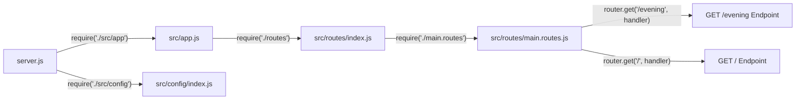

# Technical Specification

# 0. Agent Action Plan

## 0.1 Intent Clarification


### 0.1.1 Core Feature Objective

Based on the prompt, the Blitzy platform understands that the new feature requirement is to:

- **Integrate Express.js as the application framework** into an existing Node.js HTTP server tutorial project (`hello_world`). The repository currently already contains Express.js `^5.1.0` as a dependency (per `package.json`) with a fully modular architecture. The feature plan confirms, validates, and documents this Express.js integration across all source files.
- **Add a new HTTP GET endpoint** at path `/evening` that returns the exact plain-text response body `"Good evening"` (12 characters, no trailing newline). This endpoint currently exists in `src/routes/main.routes.js` alongside the root `GET /` endpoint that returns `"Hello, World!\n"`.
- **Preserve the existing root endpoint behavior** at `GET /` returning `"Hello, World!\n"` (14 bytes including trailing newline) with no regressions to its status code, content type, or response body.
- **Maintain tutorial simplicity** — the project is a learning-focused Node.js server. All additions must follow the established modular patterns (Factory, Barrel, Twelve-Factor configuration) without introducing unnecessary complexity.

Implicit requirements detected:

- The Express.js integration must use CommonJS module syntax (`require` / `module.exports`) consistently, as established across all existing source files.
- The application factory in `src/app.js` must remain decoupled from HTTP binding — it exports a configured `Express.Application` without calling `listen()`, preserving testability.
- Environment-driven configuration (`HOST`, `PORT`, `NODE_ENV`) must continue to work unmodified for both endpoints.
- The new `/evening` endpoint must be colocated with the existing root handler inside the same route module (`src/routes/main.routes.js`) and exported via the barrel aggregator (`src/routes/index.js`).

### 0.1.2 Special Instructions and Constraints

- **Maintain backward compatibility** — the `GET /` endpoint response body `"Hello, World!\n"` is a byte-level contract documented in the README and the blitzy technical specifications. It must not be altered.
- **Follow repository conventions** — use Express Router (`express.Router()`) for endpoint registration, barrel pattern for route aggregation, and factory pattern for application configuration.
- **Single direct dependency** — Express.js `^5.1.0` remains the only direct production dependency. No additional npm packages should be introduced.
- **Node.js runtime compatibility** — requires Node.js ≥18.x with recommended version 20.19.x LTS, as documented in `README.md`.

User Example (verbatim from prompt):
> *"this is a tutorial of node js server hosting one endpoint that returns the response 'Hello world'. Could you add expressjs into the project and add another endpoint that return the response of 'Good evening'?"*

### 0.1.3 Technical Interpretation

These feature requirements translate to the following technical implementation strategy:

- To **integrate Express.js**, we will confirm the `express` dependency at `^5.1.0` in `package.json`, verify that `src/app.js` creates and exports a configured Express application using the factory pattern, and ensure `server.js` binds the app to the configured host and port.
- To **add the `/evening` endpoint**, we will register a new `router.get('/evening', ...)` handler inside `src/routes/main.routes.js` that responds with `res.send('Good evening')`.
- To **maintain the route aggregation pattern**, we will confirm that `src/routes/index.js` exports the `mainRoutes` router and that `src/app.js` mounts it at the root path via `app.use('/', mainRoutes)`.
- To **validate the integration**, we will verify both endpoints return the expected responses via HTTP requests to `GET /` and `GET /evening`.


## 0.2 Repository Scope Discovery


### 0.2.1 Comprehensive File Analysis

The repository follows a minimal, modular Express.js architecture. Every file has been inspected and its role in the feature addition is documented below.

**Existing Files Requiring Modification or Verification:**

| File Path | Role | Action Required | Relevance |
|-----------|------|-----------------|-----------|
| `server.js` | HTTP server entry point; imports app and config, calls `app.listen()` | VERIFY — No changes needed; binds the Express app to host:port | Entry point must correctly import the Express app with the new route |
| `src/app.js` | Express application factory; creates app, mounts routes | VERIFY — Confirm `app.use('/', mainRoutes)` mounts the router containing both endpoints | Integration point where route module is mounted |
| `src/config/index.js` | Configuration module; exports `{ host, port, env }` from environment variables | VERIFY — No changes needed; configuration is endpoint-agnostic | Supports server binding for all endpoints |
| `src/routes/index.js` | Route barrel/aggregator; re-exports `mainRoutes` | VERIFY — Confirm the barrel exports the router containing the new `/evening` handler | Aggregation point for all route modules |
| `src/routes/main.routes.js` | Route handlers; defines `GET /` and `GET /evening` | MODIFY — Register the `GET /evening` route handler with `res.send('Good evening')` | Primary file where the new endpoint is implemented |
| `package.json` | npm manifest; declares `express@^5.1.0` dependency | VERIFY — Confirm Express dependency is declared | Ensures Express.js is available at install time |
| `package-lock.json` | Lockfile (v3); pins `express@5.1.0` and all transitive deps | VERIFY — Regenerate after any dependency changes | Guarantees reproducible installs |
| `README.md` | Project documentation; describes API endpoints, setup, architecture | MODIFY — Document the new `GET /evening` endpoint, update API reference section | User-facing documentation must reflect both endpoints |
| `.gitignore` | Git ignore rules for `node_modules/`, `.env`, logs, IDE files | VERIFY — No changes needed | Standard ignore patterns are endpoint-agnostic |

**Integration Point Discovery:**

| Integration Point | Location | Purpose |
|-------------------|----------|---------|
| Route registration | `src/routes/main.routes.js` lines 37–39 | `router.get('/evening', ...)` registers the new handler on the Express Router |
| Route mounting | `src/app.js` line 25 | `app.use('/', mainRoutes)` mounts the router at root, making `/evening` accessible |
| Route aggregation | `src/routes/index.js` line 15–18 | Barrel re-exports `mainRoutes` which now includes both handlers |
| Server binding | `server.js` line 62 | `app.listen(config.port, config.host, ...)` serves all mounted routes |
| Dependency declaration | `package.json` line 13 | `"express": "^5.1.0"` provides the Router API used by the new endpoint |

### 0.2.2 Web Search Research Conducted

- **Express.js 5.x release status**: Confirmed Express.js 5.1.0 is the stable default on npm as of March 2025, with an official LTS timeline. The `^5.1.0` semver range in `package.json` is appropriate and current.
- **Express.js Router best practices**: Express 5.x uses `express.Router()` for modular route definitions. The existing pattern of creating a router instance, registering handlers, and exporting it follows established conventions.
- **Express.js 5.x compatibility**: Requires Node.js ≥18.x. The project's recommended Node.js 20.19.x LTS is well within the compatibility range.
- **Security considerations**: Express 5.x includes ReDoS mitigation via `path-to-regexp@8.x` and addresses CVE-2024-45590 in body parsing. The simple string-matching routes (`/` and `/evening`) carry no additional security risk.

### 0.2.3 New File Requirements

No new source files need to be created. The existing modular architecture accommodates the new endpoint within the current file structure:

- **No new route files** — The `/evening` endpoint is colocated with `GET /` in `src/routes/main.routes.js`, following the existing single-router pattern appropriate for a tutorial-scope project.
- **No new configuration files** — The endpoint requires no feature-specific configuration beyond what `src/config/index.js` already provides.
- **No new test files** — The project currently has a placeholder test script (`"test": "echo \"Error: no test specified\" && exit 1"`). Future test additions for both endpoints would be recommended but are not part of the current scope.
- **No new middleware** — The `/evening` endpoint uses the same request processing pipeline as the root endpoint.


## 0.3 Dependency Inventory


### 0.3.1 Private and Public Packages

The project maintains a minimal dependency footprint with a single direct production dependency. All package names and versions are taken directly from `package.json` and `package-lock.json`.

**Direct Dependencies:**

| Registry | Package Name | Version | Purpose |
|----------|-------------|---------|---------|
| npm | `express` | ^5.1.0 (resolved: 5.1.0) | Web framework providing HTTP handling, routing via `express.Router()`, middleware via `app.use()`, and response handling via `res.send()` |

**Key Transitive Dependencies (from `package-lock.json`):**

| Registry | Package Name | Version | Purpose |
|----------|-------------|---------|---------|
| npm | `body-parser` | 2.2.1 | Request body parsing (built-in to Express 5) |
| npm | `router` | 2.2.0 | Express routing core engine |
| npm | `qs` | 6.14.0 | Query string parsing |
| npm | `path-to-regexp` | 8.x | Route pattern matching with ReDoS mitigation |
| npm | `debug` | 4.4.3 | Debug logging utility |
| npm | `finalhandler` | 2.1.0 | Final HTTP response handler |
| npm | `http-errors` | 2.0.0 | HTTP error object creation |
| npm | `send` | 1.2.0 | Static file streaming |
| npm | `serve-static` | 2.2.0 | Static file serving middleware |

**Runtime Environment:**

| Component | Version | Source |
|-----------|---------|--------|
| Node.js | 20.19.x LTS (recommended) | `README.md` prerequisites table |
| npm | 10.8.x (recommended) | `README.md` prerequisites table |

### 0.3.2 Dependency Updates

**No dependency additions or upgrades are required.** The Express.js `^5.1.0` dependency already present in `package.json` provides all APIs needed for the new `/evening` endpoint:

- `express.Router()` — already imported in `src/routes/main.routes.js`
- `router.get(path, handler)` — already used for `GET /`
- `res.send(body)` — already used for the root endpoint response

**Import Verification:**

| File | Import Statement | Status |
|------|-----------------|--------|
| `src/app.js` | `const express = require('express');` | No change needed |
| `src/app.js` | `const { mainRoutes } = require('./routes');` | No change needed |
| `src/routes/main.routes.js` | `const express = require('express');` | No change needed |
| `src/routes/index.js` | `const mainRoutes = require('./main.routes');` | No change needed |
| `server.js` | `const app = require('./src/app');` | No change needed |
| `server.js` | `const config = require('./src/config');` | No change needed |

**External Reference Updates:**

| File Category | Files | Update Required |
|---------------|-------|-----------------|
| Configuration | `package.json` | None — `express@^5.1.0` already declared |
| Lockfile | `package-lock.json` | None — lockfile already pins `express@5.1.0` with 67 total packages |
| Documentation | `README.md` | Update API Reference section to include `GET /evening` endpoint |
| Build/CI | None present | N/A — no CI/CD pipelines currently configured |


## 0.4 Integration Analysis


### 0.4.1 Existing Code Touchpoints

The new `/evening` endpoint integrates into the existing Express.js architecture through a well-defined chain of module dependencies. Every touchpoint has been traced through the source code.

**Direct Modifications Required:**

| File | Modification | Location | Details |
|------|-------------|----------|---------|
| `src/routes/main.routes.js` | Add `GET /evening` route handler | After line 28 (after existing `GET /` handler) | Register `router.get('/evening', (req, res) => { res.send('Good evening'); });` on the shared Express Router instance |
| `README.md` | Document new endpoint in API Reference | After the `GET /` section (approximately line 97) | Add `GET /evening` section with request example, response spec, and curl command |

**No Dependency Injection Changes Required:**

The Express.js application uses a simple module-import composition model rather than a DI container. The integration chain is:


```mermaid
flowchart LR
    A["server.js"] -->|"require('./src/app')"| B["src/app.js"]
    A -->|"require('./src/config')"| C["src/config/index.js"]
    B -->|"require('./routes')"| D["src/routes/index.js"]
    D -->|"require('./main.routes')"| E["src/routes/main.routes.js"]
    E -->|"router.get('/evening', handler)"| F["GET /evening Endpoint"]
    E -->|"router.get('/', handler)"| G["GET / Endpoint"]
```

The new handler is registered on the same `express.Router()` instance in `src/routes/main.routes.js`. No changes to `src/app.js`, `src/routes/index.js`, or `server.js` are needed because:

- `src/routes/main.routes.js` exports a single Router instance via `module.exports = router`
- `src/routes/index.js` re-exports it as `{ mainRoutes }`
- `src/app.js` mounts it at `app.use('/', mainRoutes)`, which automatically serves all routes registered on the router — including the new `/evening` path

**Database/Schema Updates:**

None. This application has no database layer. Both endpoints return static string responses with no data persistence requirements.

### 0.4.2 Request Processing Flow for New Endpoint

The incoming `GET /evening` request traverses the same processing pipeline as `GET /`:

| Step | Component | Action |
|------|-----------|--------|
| 1 | Node.js HTTP Server | Receives TCP connection, emits `request` event |
| 2 | Express Application (`src/app.js`) | Creates `req`/`res` objects, dispatches to middleware stack |
| 3 | Route Mounting (`app.use('/', mainRoutes)`) | Matches root prefix `/`, delegates to `mainRoutes` router |
| 4 | Express Router (`src/routes/main.routes.js`) | Matches `GET /evening` path and method |
| 5 | Route Handler | Executes `res.send('Good evening')`, sets status 200 and Content-Type `text/html; charset=utf-8` |
| 6 | Client Response | HTTP/1.1 200 OK with body `Good evening` (12 bytes) |

### 0.4.3 Configuration Compatibility

The new endpoint inherits all existing configuration without modification:

| Configuration | Value | Impact on `/evening` |
|---------------|-------|---------------------|
| `HOST` (default `127.0.0.1`) | Server bind address | Endpoint accessible at `http://{HOST}:{PORT}/evening` |
| `PORT` (default `3000`) | Server bind port | Same port serves both `/` and `/evening` |
| `NODE_ENV` (default `development`) | Environment mode | No environment-specific behavior for this endpoint |


## 0.5 Technical Implementation


### 0.5.1 File-by-File Execution Plan

Every file listed below must be created or modified as specified. Files are grouped by functional concern.

**Group 1 — Core Feature (Route Handler):**

| Action | File | Purpose |
|--------|------|---------|
| MODIFY | `src/routes/main.routes.js` | Add the `GET /evening` route handler that responds with `res.send('Good evening')`. This is the primary code change — a new `router.get()` call on the existing Express Router instance. |

**Group 2 — Integration Verification (No Code Changes):**

| Action | File | Purpose |
|--------|------|---------|
| VERIFY | `src/routes/index.js` | Confirm the barrel aggregator exports `mainRoutes` which includes the router with both endpoints. No modification needed — the router is exported by reference. |
| VERIFY | `src/app.js` | Confirm `app.use('/', mainRoutes)` mounts the router at root path, making both `GET /` and `GET /evening` accessible. No modification needed. |
| VERIFY | `server.js` | Confirm `app.listen(config.port, config.host, ...)` binds the Express app with all mounted routes. No modification needed. |
| VERIFY | `src/config/index.js` | Confirm configuration exports `{ host, port, env }` correctly. No modification needed — config is endpoint-agnostic. |
| VERIFY | `package.json` | Confirm `express@^5.1.0` dependency is declared. No modification needed. |
| VERIFY | `package-lock.json` | Confirm lockfile pins Express 5.1.0 and all transitive dependencies. No modification needed. |

**Group 3 — Documentation:**

| Action | File | Purpose |
|--------|------|---------|
| MODIFY | `README.md` | Add `GET /evening` to the API Reference section with response specification (Status 200, Content-Type `text/html; charset=utf-8`, Body `Good evening`), curl example, and health check command. Update the project description to mention both endpoints. |

### 0.5.2 Implementation Approach per File

**`src/routes/main.routes.js` — Adding the Evening Endpoint:**

The implementation adds a new GET handler to the existing Express Router. The handler follows the identical pattern as the root endpoint:

```javascript
router.get('/evening', (req, res) => {
  res.send('Good evening');
});
```

Key implementation details:
- The handler is registered after the existing `GET /` handler to maintain logical route ordering
- Uses `res.send()` (not `res.end()` or `res.write()`) for consistency with Express conventions
- The response body `'Good evening'` has no trailing newline, distinguishing it from the root endpoint's `'Hello, World!\n'`
- Express automatically sets the HTTP status to `200` and Content-Type to `text/html; charset=utf-8`

**`README.md` — Documentation Updates:**

The API Reference section must be extended with:
- A new `### GET /evening` subsection documenting the request format, response specification, and curl example
- An updated health check command that tests both endpoints
- Updated project description referencing both endpoints

### 0.5.3 Validation Criteria

After implementation, the following acceptance checks confirm correctness:

| Check | Command | Expected Result |
|-------|---------|-----------------|
| Root endpoint preserved | `curl -s http://127.0.0.1:3000/` | Response body: `Hello, World!\n` (14 bytes) |
| Evening endpoint works | `curl -s http://127.0.0.1:3000/evening` | Response body: `Good evening` (12 bytes) |
| Root status code | `curl -s -o /dev/null -w "%{http_code}" http://127.0.0.1:3000/` | `200` |
| Evening status code | `curl -s -o /dev/null -w "%{http_code}" http://127.0.0.1:3000/evening` | `200` |
| Express dependency | `npm ls express` | `express@5.1.0` in tree |
| Server starts cleanly | `npm start` | Console output includes `Server running at http://127.0.0.1:3000/` |


## 0.6 Scope Boundaries


### 0.6.1 Exhaustively In Scope

All files, patterns, and components that fall within the boundaries of this feature addition:

**Route Handler Files:**
- `src/routes/main.routes.js` — Primary modification target; add `GET /evening` handler

**Integration Chain Files (Verification Only):**
- `src/routes/index.js` — Barrel aggregator exporting `mainRoutes`
- `src/app.js` — Application factory mounting routes at `app.use('/', mainRoutes)`
- `server.js` — Entry point binding `app.listen(config.port, config.host, ...)`
- `src/config/index.js` — Configuration module exporting `{ host, port, env }`

**Dependency Files:**
- `package.json` — Manifest declaring `express@^5.1.0`
- `package-lock.json` — Lockfile pinning `express@5.1.0` with 67 total packages

**Documentation Files:**
- `README.md` — Project documentation including API Reference, architecture, and setup instructions

**Endpoint Contracts:**

| Endpoint | Method | Response Body | Byte Size | Trailing Newline | Content-Type |
|----------|--------|---------------|-----------|------------------|--------------|
| `/` | GET | `Hello, World!\n` | 14 | Yes | `text/html; charset=utf-8` |
| `/evening` | GET | `Good evening` | 12 | No | `text/html; charset=utf-8` |

**Configuration Scope:**

| Variable | Default | Scope Impact |
|----------|---------|-------------|
| `HOST` | `127.0.0.1` | Bind address for server hosting both endpoints |
| `PORT` | `3000` | Port number for both endpoints |
| `NODE_ENV` | `development` | Environment mode (no endpoint-specific behavior) |

### 0.6.2 Explicitly Out of Scope

The following items are intentionally excluded from this feature addition:

- **Test suite creation** — The project has a placeholder test script (`"test": "echo \"Error: no test specified\" && exit 1"`). Writing unit or integration tests (e.g., with Jest/Supertest) is not part of this feature request.
- **Middleware additions** — No authentication, logging, CORS, rate-limiting, or other middleware is required for the `/evening` endpoint.
- **Additional npm dependencies** — No new packages beyond the existing `express@^5.1.0` will be introduced.
- **ESM migration** — The project uses CommonJS exclusively. Converting to ES Modules is out of scope.
- **TypeScript conversion** — The project uses plain JavaScript. Adding TypeScript is out of scope.
- **CI/CD pipeline configuration** — No `.github/workflows/`, `Dockerfile`, or `docker-compose` files are in scope.
- **Database or persistence layer** — Both endpoints return static strings with no data storage requirements.
- **Performance optimization** — The tutorial-scope application does not require caching, compression, or clustering.
- **Additional endpoints beyond `/evening`** — Only the single new endpoint specified by the user is in scope.
- **Refactoring of existing code** — The `GET /` handler, configuration module, and application factory will not be refactored.
- **`blitzy/documentation/` folder** — The documentation spec files in this folder are reference materials and are not modified as part of this feature.


## 0.7 Rules for Feature Addition


### 0.7.1 Architectural Pattern Rules

The following rules govern how the new endpoint must be implemented, derived from the established codebase conventions:

- **CommonJS Module System** — All files must use `require()` for imports and `module.exports` for exports. No ESM (`import`/`export`) syntax is permitted. This is enforced across all existing source files (`src/app.js`, `src/routes/*.js`, `src/config/index.js`, `server.js`).
- **Factory Pattern Preservation** — `src/app.js` must continue to export a configured Express application without calling `app.listen()`. HTTP binding remains exclusively in `server.js`. This separation enables unit testing without socket binding.
- **Barrel Pattern for Routes** — All route modules must be re-exported through `src/routes/index.js`. Consumers (e.g., `src/app.js`) import routes only from the barrel, never directly from individual route files.
- **Router Pattern for Endpoints** — Endpoints must be registered on an `express.Router()` instance using `router.get(path, handler)`. The router is then exported and mounted by the application factory.
- **Twelve-Factor Configuration** — Runtime configuration is externalized via environment variables in `src/config/index.js`. Endpoint handlers must not read `process.env` directly.

### 0.7.2 Response Contract Rules

- **Exact response body matching** — The `GET /evening` endpoint must return exactly `'Good evening'` (12 bytes, no trailing newline). The `GET /` endpoint must continue to return exactly `'Hello, World!\n'` (14 bytes, with trailing newline).
- **Use `res.send()` exclusively** — Do not use `res.end()`, `res.write()`, or `res.json()`. The `res.send()` method provides consistent Content-Type headers and encoding behavior across both endpoints.
- **Implicit HTTP 200 status** — Both endpoints rely on Express's default status code of 200. Do not explicitly set `res.status(200)` unless required by a future change.

### 0.7.3 Dependency Management Rules

- **Single direct dependency** — Express.js (`^5.1.0`) must remain the only entry in `package.json` `dependencies`. Adding new packages requires explicit justification.
- **Lockfile integrity** — The `package-lock.json` must remain consistent. Run `npm ci` (not `npm install`) in CI environments to ensure reproducible builds.
- **No dev dependencies currently** — The project has no `devDependencies` block. If test tooling is added in the future, it must go in `devDependencies`.

### 0.7.4 Documentation Rules

- **API Reference completeness** — Every public endpoint must be documented in `README.md` with method, path, response body, status code, Content-Type, byte size, and a curl example.
- **Architecture section accuracy** — The project structure tree and file description table in `README.md` must reflect the current state of all source files.


## 0.8 References


### 0.8.1 Repository Files and Folders Searched

The following files and folders were comprehensively inspected to derive all conclusions in this Agent Action Plan:

**Source Files (Full Content Retrieved):**

| File Path | Summary |
|-----------|---------|
| `server.js` | HTTP server entry point; imports Express app from `src/app` and config from `src/config`, binds via `app.listen()` on configured host and port |
| `src/app.js` | Express application factory; creates app via `express()`, mounts `mainRoutes` at root path, exports app without calling `listen()` |
| `src/config/index.js` | Configuration module; exports `{ host, port, env }` read from `process.env` with defaults `127.0.0.1`, `3000`, `development` |
| `src/routes/index.js` | Route barrel aggregator; re-exports `mainRoutes` from `./main.routes` for centralized import |
| `src/routes/main.routes.js` | Route handlers; registers `GET /` (returns `Hello, World!\n`) and `GET /evening` (returns `Good evening`) on Express Router |
| `package.json` | npm manifest; declares `express@^5.1.0` as sole dependency, `node server.js` as start script |
| `package-lock.json` | Lockfile v3; pins `express@5.1.0` with 67 total packages including transitive dependencies |
| `README.md` | Project documentation; prerequisites (Node.js ≥18.x, recommended 20.19.x LTS), API reference for both endpoints, architecture diagram, environment variables |
| `.gitignore` | Git ignore rules for `node_modules/`, `.env`, logs, OS files, and IDE directories |

**Folders Explored:**

| Folder Path | Summary |
|-------------|---------|
| `/` (root) | Repository root containing `server.js`, `package.json`, `README.md`, `.gitignore`, `src/`, `blitzy/` |
| `src/` | Application source tree with `app.js`, `config/`, and `routes/` |
| `src/config/` | Configuration module directory containing `index.js` |
| `src/routes/` | Routing surface directory containing `index.js` (barrel) and `main.routes.js` (handlers) |
| `blitzy/` | Documentation/specification hub (not runtime code); contains `blitzy/documentation/` |

**Technical Specification Sections Retrieved:**

| Section | Key Information Extracted |
|---------|-------------------------|
| 3.2 PROGRAMMING LANGUAGES | JavaScript with Node.js runtime, CommonJS module system, Node.js ≥18.x minimum |
| 3.3 FRAMEWORKS & LIBRARIES | Express.js 5.1.0 as sole framework; features used include `express()`, `Router()`, `res.send()`, `app.use()`, `app.listen()` |
| 3.4 OPEN SOURCE DEPENDENCIES | Single direct dependency `express@^5.1.0`; 67 total packages; zero vulnerabilities |
| 3.8 VERSION COMPATIBILITY MATRIX | Node.js 18.x–22.x; npm 8.x+; Express.js ^5.1.0 |
| 5.2 COMPONENT DETAILS | Detailed component descriptions for all five modules; interaction and sequence diagrams |
| 2.1 Feature Catalog | Six features (F-001 through F-006) covering both endpoints, configuration, app factory, route aggregator, and server entry |
| Express.js 5.x Specific Enhancements | ReDoS mitigation, CVE-2024-45590 patch, Node.js ≥18 requirement |

### 0.8.2 External Research

| Topic | Source | Key Finding |
|-------|--------|-------------|
| Express.js 5.1.0 release status | expressjs.com (March 2025 announcement) | Express 5.1.0 is the default on npm with an official LTS timeline |
| Express.js latest version | npmjs.com/package/express | Latest version is 5.2.1; `^5.1.0` range in `package.json` allows compatible updates |
| Express.js 5.x Node.js requirement | Express.js documentation and community guides | Express 5.x requires Node.js 18 or higher |

### 0.8.3 Attachments

No attachments were provided for this project. No Figma URLs or external design files were referenced.


