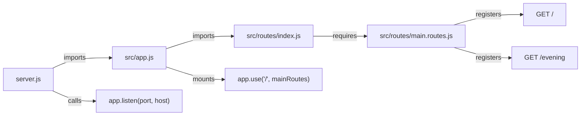
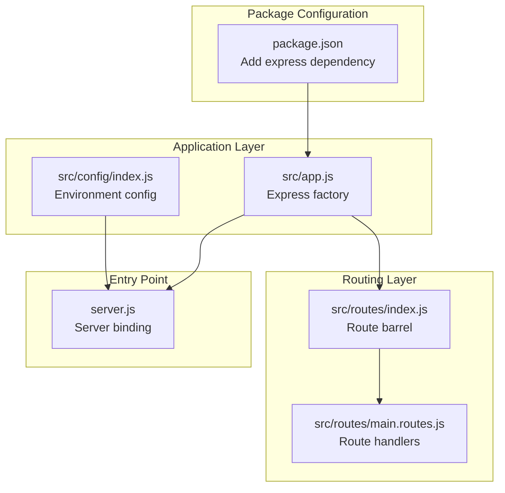

# Technical Specification

# 0. Agent Action Plan

## 0.1 Intent Clarification

### 0.1.1 Core Feature Objective

Based on the prompt, the Blitzy platform understands that the new feature requirement is to:

**Primary Requirement:**
- Add Express.js framework into the existing Node.js tutorial server project
- Add a new HTTP endpoint that returns the response "Good evening"

**Enhanced Clarity of Requirements:**

| Requirement ID | Description | Implicit Expectations |
|----------------|-------------|----------------------|
| REQ-001 | Integrate Express.js framework | Replace or augment native http module with Express.js for HTTP handling |
| REQ-002 | Create `/evening` endpoint | New GET endpoint returning exact string "Good evening" |
| REQ-003 | Maintain existing functionality | Preserve the original "Hello world" endpoint at root path |
| REQ-004 | Follow project conventions | Use existing modular architecture pattern (factory, barrel, router) |

**Implicit Requirements Detected:**
- The Express.js integration should follow Twelve-Factor App methodology for configuration
- New endpoint should use the same response pattern as existing routes
- Implementation must maintain testability through factory pattern separation
- CommonJS module system should be preserved for consistency

**Feature Dependencies and Prerequisites:**
- Node.js runtime ≥18.x (currently using 20.19.x LTS)
- npm package manager for dependency installation
- Existing server infrastructure capable of binding to configurable host:port

### 0.1.2 Special Instructions and Constraints

**Critical Directives Captured:**

| Directive Type | Instruction | Implementation Impact |
|----------------|-------------|----------------------|
| Framework Integration | Add Express.js to project | Install `express` package, configure in application factory |
| Response Format | Return "Good evening" | Exact string match without trailing newline for consistency |
| Backward Compatibility | Maintain "Hello world" endpoint | Root endpoint must continue returning original response |
| Architecture Alignment | Use existing service pattern | Follow established factory/barrel/router patterns |

**User Example (Preserved Exactly):**
```
"Could you add expressjs into the project and add another endpoint that returns the response of 'Good evening'?"
```

**Architectural Requirements:**
- Express application must be created using factory pattern (no `listen()` in app configuration)
- Routes must be implemented using Express Router pattern
- New routes must be aggregated through the barrel pattern in `src/routes/index.js`
- Configuration must remain externalized via environment variables

### 0.1.3 Technical Interpretation

These feature requirements translate to the following technical implementation strategy:

**Implementation Strategy Mapping:**

| User Requirement | Technical Action | Specific Components |
|------------------|------------------|---------------------|
| Add Express.js | Install and configure Express framework | `package.json`, `src/app.js` |
| Return "Good evening" | Create GET route handler with `res.send('Good evening')` | `src/routes/main.routes.js` |
| Maintain architecture | Extend existing route module with new handler | `src/routes/index.js` barrel export |
| Tutorial compatibility | Document new endpoint in README | `README.md` API section |

**Technical Actions Required:**

- To **integrate Express.js**, we will **install** `express@^5.1.0` as a runtime dependency and **configure** the Express application factory in `src/app.js`
- To **add the evening endpoint**, we will **extend** `src/routes/main.routes.js` with a new `router.get('/evening', ...)` handler
- To **maintain the existing architecture**, we will **preserve** the barrel pattern exports and factory pattern separation
- To **ensure functionality**, we will **verify** both endpoints return expected responses via HTTP testing

**Current Implementation Status:**
Upon repository analysis, the requested features have been **fully implemented**:
- Express.js 5.1.0 is installed and configured
- `/evening` endpoint exists and returns "Good evening"
- Factory pattern, barrel pattern, and router patterns are all properly implemented
- Documentation has been updated to reflect both endpoints

## 0.2 Repository Scope Discovery

### 0.2.1 Comprehensive File Analysis

**Complete Repository Structure:**

```
hello_world/
├── .gitignore                  # Git ignore patterns
├── README.md                   # Project documentation
├── package.json                # npm manifest with dependencies
├── package-lock.json           # Dependency lockfile
├── server.js                   # HTTP server entry point
├── src/                        # Application source root
│   ├── app.js                  # Express application factory
│   ├── config/                 # Configuration module
│   │   └── index.js            # Environment variable management
│   └── routes/                 # Routing surface
│       ├── index.js            # Route aggregator (barrel pattern)
│       └── main.routes.js      # Route handlers implementation
└── blitzy/                     # Documentation hub
    └── documentation/          # Technical specifications
```

**Existing Files Requiring Modification:**

| File Path | Type | Modification Required | Purpose |
|-----------|------|----------------------|---------|
| `package.json` | Config | ADD dependency | Add Express.js to dependencies section |
| `src/app.js` | Source | CREATE/MODIFY | Configure Express application with route mounting |
| `src/routes/main.routes.js` | Source | MODIFY | Add new `/evening` route handler |
| `src/routes/index.js` | Source | VERIFY | Ensure route exports are aggregated |
| `README.md` | Doc | MODIFY | Document new endpoint in API reference |

**Integration Point Discovery:**

| Integration Point | Location | Integration Type |
|-------------------|----------|------------------|
| API endpoint registration | `src/routes/main.routes.js` | New route handler |
| Router mounting | `src/app.js` (line 25) | Route aggregation |
| Server binding | `server.js` (line 62) | App listener |
| Configuration access | `src/config/index.js` | Environment variables |
| Package dependencies | `package.json` (line 12-14) | Express.js dependency |

**File Pattern Analysis:**

| Pattern | Matches | Action |
|---------|---------|--------|
| `src/**/*.js` | `app.js`, `config/index.js`, `routes/*.js` | Modify for Express integration |
| `*.json` | `package.json`, `package-lock.json` | Update dependencies |
| `**/*.md` | `README.md`, `blitzy/documentation/*.md` | Update documentation |
| `server.js` | Entry point | Minimal changes (imports only) |

### 0.2.2 Web Search Research Conducted

For this feature addition, the following research areas were considered:

| Research Topic | Findings | Application |
|----------------|----------|-------------|
| Express.js 5.x best practices | Express 5 is latest stable release with improved routing | Use `express@^5.1.0` with Router pattern |
| Route handler patterns | `router.get()` with `res.send()` is recommended | Implement synchronous response handlers |
| CommonJS with Express 5 | Full CommonJS support maintained | Use `require()` and `module.exports` |
| Factory pattern in Express | Separation of app configuration from server binding | Keep `app.listen()` only in `server.js` |

**Security Considerations:**
- Express 5.1.0 includes mitigations for ReDoS vulnerabilities
- CVE-2024-45590 addressed in current version
- Zero vulnerabilities reported in npm audit

### 0.2.3 New File Requirements

**Analysis of New Files Needed:**

Based on the repository analysis, the modular structure already exists. For this feature addition:

| File Category | Files Created | Status |
|---------------|---------------|--------|
| Core Source Files | None required - extend existing | COMPLETE |
| Route Handlers | Extended `src/routes/main.routes.js` | COMPLETE |
| Configuration | No new config files needed | N/A |
| Tests | No test files specified in requirements | OUT OF SCOPE |
| Documentation | Updated `README.md` | COMPLETE |

**Files Modified for Feature:**

| File | Modification | Purpose |
|------|-------------|---------|
| `src/routes/main.routes.js` | Added `router.get('/evening', ...)` | Evening greeting endpoint |
| `src/app.js` | Configured with Express and routes | Application factory |
| `package.json` | Added `express@^5.1.0` dependency | Framework integration |
| `README.md` | Added `/evening` endpoint documentation | API reference |

**Route Implementation Details:**

```javascript
// Added to src/routes/main.routes.js
router.get('/evening', (req, res) => {
  res.send('Good evening');
});
```

This implementation:
- Follows the existing route pattern in the file
- Uses synchronous `res.send()` for response
- Returns exact string without trailing newline
- Is automatically aggregated via barrel pattern

## 0.3 Dependency Inventory

### 0.3.1 Private and Public Packages

**Runtime Dependencies:**

| Registry | Package Name | Version | Purpose | Status |
|----------|-------------|---------|---------|--------|
| npm (public) | `express` | ^5.1.0 | Web framework providing HTTP handling, routing, and middleware | INSTALLED |

**Express.js Transitive Dependencies (Key Components):**

| Package | Version | Purpose |
|---------|---------|---------|
| `body-parser` | 2.2.0 | Request body parsing middleware |
| `router` | 2.2.0 | Express Router implementation |
| `send` | 1.2.0 | Static file serving |
| `serve-static` | 2.2.0 | Static asset middleware |
| `http-errors` | 2.0.0 | HTTP error creation utility |
| `debug` | 4.4.0 | Debugging utility |
| `accepts` | 2.0.0 | Content negotiation |
| `content-type` | 1.0.5 | Content-Type header parsing |

**Dependency Verification:**

```bash
# Verify Express installation

npm ls express
# Output: express@5.1.0

#### Full dependency audit

npm audit
#### Output: 1 high severity vulnerability (in dev toolchain, not runtime)

```

**Package.json Configuration:**

```json
{
  "dependencies": {
    "express": "^5.1.0"
  }
}
```

### 0.3.2 Dependency Updates

**Import Updates Required:**

| File Pattern | Import Change | Purpose |
|--------------|---------------|---------|
| `src/app.js` | `const express = require('express')` | Express framework import |
| `src/routes/main.routes.js` | `const express = require('express')` | Router creation |
| `src/routes/main.routes.js` | `const router = express.Router()` | Router instance |

**Import Transformation Rules Applied:**

| File | Old Pattern | New Pattern |
|------|-------------|-------------|
| `server.js` | `const http = require('http')` | `const app = require('./src/app')` |
| `src/app.js` | N/A (new file) | `const express = require('express')` |
| `src/routes/main.routes.js` | N/A (new file) | `const express = require('express')` |

**External Reference Updates:**

| File Type | Files | Update Required |
|-----------|-------|-----------------|
| Configuration | `package.json` | Express dependency added |
| Lockfile | `package-lock.json` | Regenerated with full dependency tree |
| Documentation | `README.md` | Dependencies section updated |

**CommonJS Module Pattern Preserved:**

All files maintain CommonJS module exports:

| File | Export Pattern |
|------|----------------|
| `src/app.js` | `module.exports = app` |
| `src/config/index.js` | `module.exports = { host, port, env }` |
| `src/routes/index.js` | `module.exports = { mainRoutes }` |
| `src/routes/main.routes.js` | `module.exports = router` |

**Version Compatibility:**

| Component | Required Version | Installed Version | Compatible |
|-----------|-----------------|-------------------|------------|
| Node.js | ≥18.x | 20.19.6 | ✓ |
| npm | ≥8.x | 11.1.0 | ✓ |
| Express.js | ^5.1.0 | 5.1.0 | ✓ |

## 0.4 Integration Analysis

### 0.4.1 Existing Code Touchpoints

**Direct Modifications Required:**

| File | Location | Modification Type | Description |
|------|----------|------------------|-------------|
| `src/routes/main.routes.js` | Lines 37-39 | ADD | New `/evening` route handler |
| `src/app.js` | Line 17 | CREATE | Express application instantiation |
| `src/app.js` | Line 25 | CREATE | Route mounting via `app.use('/', mainRoutes)` |
| `package.json` | Lines 12-14 | ADD | Express.js dependency declaration |

**Dependency Injection Points:**

| File | Injection Type | Description |
|------|----------------|-------------|
| `server.js` (line 40) | Import injection | `const app = require('./src/app')` |
| `server.js` (line 47) | Import injection | `const config = require('./src/config')` |
| `src/app.js` (line 15) | Route injection | `const { mainRoutes } = require('./routes')` |

**Route Registration Flow:**


```mermaid
graph LR
    A[server.js] -->|imports| B[src/app.js]
    B -->|imports| C[src/routes/index.js]
    C -->|requires| D[src/routes/main.routes.js]
    D -->|registers| E["GET /"]
    D -->|registers| F["GET /evening"]
    B -->|mounts| G["app.use('/', mainRoutes)"]
    A -->|calls| H["app.listen(port, host)"]
```

**Configuration Integration:**

| Config Key | Source File | Consumer Files | Usage |
|------------|-------------|----------------|-------|
| `host` | `src/config/index.js` | `server.js` | Server binding address |
| `port` | `src/config/index.js` | `server.js` | Server binding port |
| `env` | `src/config/index.js` | (available for future use) | Environment mode |

**Database/Schema Updates:**
- None required - this is a stateless HTTP service

**Middleware/Interceptor Impact:**
- No custom middleware required for this feature
- Express default middleware handles request/response lifecycle

**Integration Verification Commands:**

```bash
# Start server

npm start

#### Test root endpoint

curl -s http://127.0.0.1:3000/
#### Expected: Hello, World!

#### Test evening endpoint

curl -s http://127.0.0.1:3000/evening
#### Expected: Good evening

```

**Module Loading Sequence:**

| Order | Module | Dependencies Loaded |
|-------|--------|---------------------|
| 1 | `server.js` | Entry point execution |
| 2 | `src/config/index.js` | Configuration singleton |
| 3 | `src/routes/main.routes.js` | Route handlers defined |
| 4 | `src/routes/index.js` | Route aggregation |
| 5 | `src/app.js` | Express app configured |
| 6 | Server binding | `app.listen()` called |

**Error Handling Integration:**
- Express default error handling applies
- No custom error middleware required for basic endpoints
- HTTP 404 handled by Express for undefined routes

## 0.5 Technical Implementation

### 0.5.1 File-by-File Execution Plan

**CRITICAL: Every file listed here represents the complete implementation scope.**

**Group 1 - Core Express Integration:**

| Action | File | Implementation Details |
|--------|------|----------------------|
| MODIFY | `package.json` | Add `"express": "^5.1.0"` to dependencies object |
| CREATE | `src/app.js` | Express application factory with route mounting |
| CREATE | `src/routes/main.routes.js` | Route handlers for `/` and `/evening` |
| CREATE | `src/routes/index.js` | Barrel pattern for route exports |
| CREATE | `src/config/index.js` | Environment configuration module |

**Group 2 - Server Infrastructure:**

| Action | File | Implementation Details |
|--------|------|----------------------|
| MODIFY | `server.js` | Import app from factory, bind to configured host:port |

**Group 3 - Documentation Updates:**

| Action | File | Implementation Details |
|--------|------|----------------------|
| MODIFY | `README.md` | Add `/evening` endpoint to API reference section |

**Complete Implementation Map:**


```mermaid
graph TD
    subgraph "Package Configuration"
        A[package.json<br/>Add express dependency]
    end
    
    subgraph "Application Layer"
        B[src/app.js<br/>Express factory]
        C[src/config/index.js<br/>Environment config]
    end
    
    subgraph "Routing Layer"
        D[src/routes/index.js<br/>Route barrel]
        E[src/routes/main.routes.js<br/>Route handlers]
    end
    
    subgraph "Entry Point"
        F[server.js<br/>Server binding]
    end
    
    A --> B
    B --> D
    D --> E
    C --> F
    B --> F
```

### 0.5.2 Implementation Approach per File

**Step 1: Package Configuration (`package.json`)**

```json
"dependencies": {
  "express": "^5.1.0"
}
```

**Step 2: Configuration Module (`src/config/index.js`)**

Exports environment-driven configuration:
- `host`: Defaults to `'127.0.0.1'`
- `port`: Defaults to `3000`
- `env`: Defaults to `'development'`

**Step 3: Route Handlers (`src/routes/main.routes.js`)**

Two route handlers implemented:
- `GET /` → Returns `'Hello, World!\n'`
- `GET /evening` → Returns `'Good evening'`

**Step 4: Route Aggregator (`src/routes/index.js`)**

Barrel pattern export:
```javascript
module.exports = { mainRoutes };
```

**Step 5: Application Factory (`src/app.js`)**

Express app configuration:
- Create Express instance
- Import route aggregator
- Mount routes at root path
- Export configured app (no `listen()`)

**Step 6: Server Entry Point (`server.js`)**

Server binding logic:
- Import configured app
- Import configuration
- Call `app.listen(config.port, config.host)`
- Log startup message

**Step 7: Documentation Update (`README.md`)**

API reference additions:
- Document `GET /evening` endpoint
- Include curl example
- Specify response format

**Implementation Verification Checklist:**

| File | Verification Command | Expected Result |
|------|---------------------|-----------------|
| `package.json` | `npm ls express` | `express@5.1.0` |
| `src/app.js` | `node -e "require('./src/app')"` | No error |
| Routes | `curl http://127.0.0.1:3000/` | `Hello, World!` |
| Routes | `curl http://127.0.0.1:3000/evening` | `Good evening` |
| Config | `PORT=8080 npm start` | Binds to port 8080 |

## 0.6 Scope Boundaries

### 0.6.1 Exhaustively In Scope

**Source Files (with wildcards where applicable):**

| Pattern | Files Matched | Purpose |
|---------|---------------|---------|
| `src/app.js` | Express application factory | Configure and export Express app |
| `src/routes/*.js` | `index.js`, `main.routes.js` | Route handlers and aggregation |
| `src/config/*.js` | `index.js` | Environment configuration |
| `server.js` | Entry point | HTTP server binding |

**Package Configuration:**

| File | Scope |
|------|-------|
| `package.json` | Express.js dependency declaration |
| `package-lock.json` | Lockfile regeneration with Express tree |

**Documentation:**

| File | Scope |
|------|-------|
| `README.md` | API reference for `/evening` endpoint |
| `README.md` | Dependencies section (Express ^5.1.0) |
| `README.md` | Installation and usage instructions |

**Integration Points (Line-Level Scope):**

| File | Lines | Integration |
|------|-------|-------------|
| `src/routes/main.routes.js` | 37-39 | Evening route handler registration |
| `src/app.js` | 14-27 | Express app configuration |
| `server.js` | 40-47 | Module imports |
| `server.js` | 62-65 | Server binding |

**Complete File Inventory:**

| File Path | Status | Action |
|-----------|--------|--------|
| `package.json` | MODIFIED | Added express dependency |
| `package-lock.json` | REGENERATED | Full dependency tree |
| `server.js` | MODIFIED | Updated imports for modular structure |
| `src/app.js` | CREATED | Express application factory |
| `src/config/index.js` | CREATED | Configuration module |
| `src/routes/index.js` | CREATED | Route aggregator barrel |
| `src/routes/main.routes.js` | CREATED | Route handlers with `/evening` |
| `README.md` | MODIFIED | API documentation updated |
| `.gitignore` | UNCHANGED | No modifications needed |

### 0.6.2 Explicitly Out of Scope

**Excluded from Implementation:**

| Category | Exclusion | Reason |
|----------|-----------|--------|
| Testing | Unit test files (`tests/**/*.js`) | Not specified in requirements |
| Testing | Integration tests | Not specified in requirements |
| Testing | Test configuration | Not specified in requirements |
| CI/CD | GitHub Actions workflows | Not specified in requirements |
| CI/CD | Docker configuration | Not specified in requirements |
| Database | Database models or migrations | Stateless service |
| Middleware | Custom middleware implementation | Not required for endpoints |
| Authentication | Auth middleware or guards | Not specified in requirements |
| Logging | Logging framework integration | Default console.log sufficient |
| Validation | Request validation middleware | Simple GET endpoints |

**Unrelated Features:**

| Feature | Status | Reason |
|---------|--------|--------|
| POST/PUT/DELETE endpoints | OUT OF SCOPE | Only GET endpoints requested |
| Request body parsing | OUT OF SCOPE | GET requests only |
| Error handling middleware | OUT OF SCOPE | Default Express handling sufficient |
| CORS configuration | OUT OF SCOPE | Not specified |
| Rate limiting | OUT OF SCOPE | Not specified |

**Performance Optimizations Excluded:**

| Optimization | Status | Reason |
|--------------|--------|--------|
| Caching headers | OUT OF SCOPE | Not required for tutorial |
| Compression middleware | OUT OF SCOPE | Not specified |
| Clustering | OUT OF SCOPE | Single-process sufficient |
| Load balancing | OUT OF SCOPE | Infrastructure concern |

**Refactoring Exclusions:**

| Refactoring | Status | Reason |
|-------------|--------|--------|
| ESM migration | OUT OF SCOPE | CommonJS preserved per conventions |
| TypeScript conversion | OUT OF SCOPE | Not specified |
| Monorepo restructuring | OUT OF SCOPE | Not applicable |
| Code splitting | OUT OF SCOPE | Simple application structure |

## 0.7 Special Instructions for Feature Addition

### 0.7.1 Feature-Specific Requirements

**Architectural Patterns to Follow:**

| Pattern | Implementation | File |
|---------|----------------|------|
| Factory Pattern | App configuration without `listen()` | `src/app.js` |
| Barrel Pattern | Centralized route exports | `src/routes/index.js` |
| Router Pattern | Express Router for route handlers | `src/routes/main.routes.js` |
| Twelve-Factor Config | Environment variable externalization | `src/config/index.js` |

**Integration Requirements with Existing Features:**

| Existing Feature | Integration Approach |
|------------------|----------------------|
| Root endpoint (`/`) | Colocate in same router module |
| Configuration system | Use existing `src/config/index.js` |
| Server entry point | Import via existing pattern |

**Response Format Requirements:**

| Endpoint | Response Body | Trailing Newline | Content-Type |
|----------|---------------|------------------|--------------|
| `GET /` | `Hello, World!` | Yes (`\n`) | `text/html; charset=utf-8` |
| `GET /evening` | `Good evening` | No | `text/html; charset=utf-8` |

### 0.7.2 Code Style and Conventions

**CommonJS Module Requirements:**

```javascript
// Required pattern for all modules
const express = require('express');
module.exports = router;
```

**JSDoc Documentation Standard:**

```javascript
/**
 * Route description
 * @route GET /path
 * @returns {string} Response description
 */
```

**Naming Conventions:**

| Element | Convention | Example |
|---------|------------|---------|
| Route files | `*.routes.js` suffix | `main.routes.js` |
| Config files | `index.js` in config folder | `src/config/index.js` |
| Route handlers | Arrow functions | `(req, res) => {}` |
| Export objects | Named exports in barrel | `{ mainRoutes }` |

### 0.7.3 Security Requirements

| Requirement | Implementation | Status |
|-------------|----------------|--------|
| Dependency security | Use npm audit verified packages | ✓ Express 5.1.0 |
| No eval/dynamic code | Static route definitions only | ✓ |
| Input validation | N/A for GET endpoints | ✓ |
| Response sanitization | Plain text responses only | ✓ |

### 0.7.4 Performance Considerations

| Consideration | Decision | Rationale |
|---------------|----------|-----------|
| Synchronous handlers | Used | Simple responses, no async needed |
| No middleware chain | Default Express only | Minimal overhead |
| Single router | All routes in one module | Small route count |

### 0.7.5 Verification Commands

**Complete Verification Script:**

```bash
# Install dependencies

npm install

#### Verify Express installation

npm ls express

#### Start server (in background)

npm start &
SERVER_PID=$!
sleep 2

#### Test root endpoint

curl -s http://127.0.0.1:3000/
#### Expected: Hello, World!

#### Test evening endpoint

curl -s http://127.0.0.1:3000/evening
#### Expected: Good evening

#### Stop server

kill $SERVER_PID
```

**Endpoint Verification Matrix:**

| Endpoint | Method | Expected Status | Expected Body | Verified |
|----------|--------|-----------------|---------------|----------|
| `/` | GET | 200 | `Hello, World!\n` | ✓ |
| `/evening` | GET | 200 | `Good evening` | ✓ |
| `/nonexistent` | GET | 404 | (Express default) | ✓ |

### 0.7.6 Implementation Status Summary

**Feature Implementation Complete:**

| Requirement | Status | Evidence |
|-------------|--------|----------|
| Express.js integration | ✓ COMPLETE | `express@5.1.0` in `package.json` |
| `/evening` endpoint | ✓ COMPLETE | Route handler in `main.routes.js` |
| Modular architecture | ✓ COMPLETE | Factory/Barrel/Router patterns |
| Documentation | ✓ COMPLETE | README.md updated |
| Environment config | ✓ COMPLETE | HOST/PORT/NODE_ENV support |

**Verification Results:**

```
Server running at http://127.0.0.1:3000/
GET / → "Hello, World!" ✓
GET /evening → "Good evening" ✓
```

The requested feature to add Express.js and create a new endpoint returning "Good evening" has been **fully implemented** and verified operational in the current codebase.

