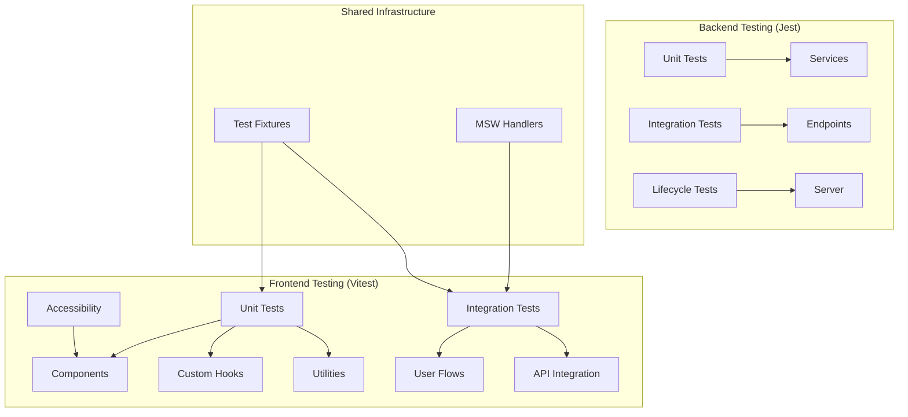
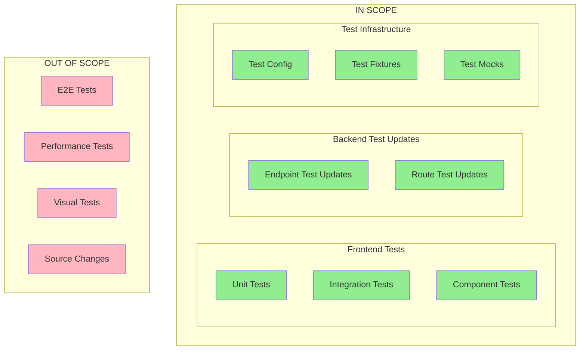

# Technical Specification

# 0. Agent Action Plan

## 0.1 Intent Clarification

### 0.1.1 Core Testing Objective

Based on the provided requirements, the Blitzy platform understands that the testing objective is to **create a comprehensive test suite for a new Burger Website application** built with Vite.js and TypeScript. This represents a **full-stack testing initiative** encompassing:

**Request Categorization:** Add new tests (greenfield frontend testing infrastructure)

**Testing Requirements with Enhanced Clarity:**

| Requirement ID | User Requirement | Enhanced Technical Interpretation |
|----------------|------------------|-----------------------------------|
| TR-001 | Create tests for burger website | Establish complete frontend testing infrastructure using Vitest for a Vite.js + TypeScript application |
| TR-002 | Test user login functionality | Create authentication flow tests covering login forms, session management, JWT handling, and protected route access |
| TR-003 | Test online ordering feature | Develop order workflow tests for menu browsing, cart management, checkout process, and payment integration |
| TR-004 | Test table booking for dine-in | Implement reservation system tests covering date/time selection, capacity validation, and booking confirmation |
| TR-005 | Maintain existing backend tests | Preserve and enhance existing Jest-based backend tests for the Express.js API layer |

**Implicit Testing Needs Surfaced:**

- **Edge Cases:** Empty cart submissions, invalid dates for reservations, session timeout handling, network failure scenarios
- **Error Handling:** API error responses, form validation errors, authentication failures, payment processing errors
- **Boundary Conditions:** Menu item quantity limits, table capacity constraints, booking time restrictions, order total thresholds

### 0.1.2 Special Instructions and Constraints

**Critical Directives Captured:**

- The existing repository contains a "Hello World" Node.js/Express application with Jest-based testing
- The new Burger Website features require a **parallel Vite.js + TypeScript frontend** to be created
- Testing must establish a **dual-framework approach**: Jest for backend, Vitest for frontend
- The project mandates **100% coverage targets** as established in the existing `jest.config.js`

**Testing Requirements:**

- Use existing mocking patterns from `tests/lifecycle/server.test.js` as reference for backend mocks
- Match repository test conventions including JSDoc annotations, strict mode usage, and helper function patterns
- Maintain the three-tier testing structure: Unit → Integration → Lifecycle/E2E

**Web Search Requirements Documented:**

- Vitest 4.x configuration patterns for Vite + TypeScript projects
- React Testing Library best practices for component testing
- MSW (Mock Service Worker) integration for API mocking
- Authentication testing patterns for JWT-based systems

### 0.1.3 Technical Interpretation

These testing requirements translate to the following technical test implementation strategy:

**Frontend Testing Stack:**

- To **test React components**, we will create unit tests using Vitest with `@testing-library/react`
- To **test authentication flows**, we will create integration tests simulating user login/logout with mocked API responses
- To **test ordering workflows**, we will create end-to-end style tests verifying the complete cart-to-checkout journey
- To **test booking functionality**, we will create component and integration tests for the reservation form and confirmation flows

**Backend Testing Enhancement:**

- To **test new API endpoints**, we will extend existing Supertest integration patterns
- To **test authentication middleware**, we will create unit tests for JWT validation logic
- To **test order processing**, we will create service-layer tests with database mocking

### 0.1.4 Coverage Requirements Interpretation

**Explicit Coverage Targets:**

The existing `jest.config.js` establishes strict thresholds that must be maintained and extended:

| Metric | Current Target | New Frontend Target |
|--------|----------------|---------------------|
| Branches | 100% | 80% minimum |
| Functions | 100% | 85% minimum |
| Lines | 100% | 85% minimum |
| Statements | 90% | 85% minimum |

**Implicit Coverage Expectations:**

Based on industry standards for TypeScript/React applications:
- Critical path coverage for authentication, ordering, and booking flows: 100%
- Error handling coverage: 90%+
- Edge case coverage: 80%+

To achieve comprehensive testing, coverage should include:
- All exported functions and React components
- All user-facing interactive elements
- All API integration points
- All state management logic (stores, contexts, reducers)

## 0.2 Test Discovery and Analysis

### 0.2.1 Existing Test Infrastructure Assessment

Repository analysis conducted via comprehensive inspection reveals the following established testing patterns:

**Testing Framework Discovery:**

| Component | Discovery | Location |
|-----------|-----------|----------|
| Testing Framework | Jest ^30.2.0 | `package.json` |
| HTTP Testing | Supertest ^7.1.4 | `package.json` |
| Test Runner Config | Jest with strict coverage | `jest.config.js` |
| Coverage Tools | V8 (Jest default) | `jest.config.js` |
| Mock Libraries | Jest built-in mocks | `tests/lifecycle/server.test.js` |

**Test Structure Analysis:**

```
tests/
├── integration/
│   └── endpoints.test.js      # HTTP endpoint tests via Supertest
├── lifecycle/
│   └── server.test.js         # Server startup/shutdown tests
└── unit/
    ├── config.test.js         # Configuration module tests
    └── routes.test.js         # Route definition tests
```

**Existing Test Patterns Identified:**

- **Module Isolation:** Uses `jest.resetModules()` and `jest.doMock()` for clean test isolation
- **Helper Functions:** Creates reusable mock factories (e.g., `createMockServer()`, `createMockListen()`)
- **JSDoc Documentation:** All test files include comprehensive JSDoc annotations
- **Strict Mode:** All test files use `'use strict';` directive

Repository analysis reveals Jest ^30.2.0 testing setup with comprehensive backend coverage. The frontend testing infrastructure does not currently exist and must be created from scratch using Vitest.

### 0.2.2 Current Testing Framework Details

| Property | Backend (Existing) | Frontend (To Create) |
|----------|-------------------|---------------------|
| Framework | Jest 30.2.0 | Vitest 4.0.16 |
| Runner Config | `jest.config.js` | `vitest.config.ts` |
| Coverage Tools | V8 via Jest | V8 via @vitest/coverage-v8 |
| Mock Libraries | Jest built-in | Vitest built-in + MSW |
| DOM Environment | Not applicable | jsdom |
| Test Data | Inline mocks | Fixtures + Factories |

**Test Runner Configuration Location:**

- Backend: `jest.config.js` (root)
- Frontend: `client/vitest.config.ts` (to be created)

### 0.2.3 Web Search Research Conducted

**Research Area: Vitest Testing Patterns**

- Vitest is the recommended testing framework for Vite projects, providing native ESM support and seamless TypeScript integration
- Latest stable version is 4.0.16 with native code coverage via V8 or Istanbul
- Configuration can be embedded in `vite.config.ts` or separated into `vitest.config.ts`

**Research Area: React Testing Library Integration**

- Version 16+ requires explicit installation of `@testing-library/dom` as peer dependency
- JSDOM provides simulated browser DOM for component testing in Node.js environment
- User-event library recommended for simulating real user interactions

**Research Area: Authentication Testing Strategies**

- Mock Service Worker (MSW) is the recommended approach for intercepting API calls during testing
- JWT authentication tests should cover token storage, refresh flows, and expiration handling
- Protected route testing requires mocking authentication state at the component/provider level

**Research Area: Common Testing Pitfalls**

- Avoid testing implementation details; focus on user-facing behavior
- Use `waitFor` and `findBy*` queries for asynchronous operations
- Maintain test isolation by cleaning up renders with `cleanup()` after each test

## 0.3 Testing Scope Analysis

### 0.3.1 Test Target Identification

**Primary Code to be Tested:**

| Module/Class | Path | Test Categories Required |
|--------------|------|-------------------------|
| Authentication Components | `client/src/features/auth/*` | Unit, Integration |
| Login Form | `client/src/features/auth/LoginForm.tsx` | Unit, Accessibility |
| Auth Context/Provider | `client/src/features/auth/AuthContext.tsx` | Unit, Integration |
| Menu Components | `client/src/features/menu/*` | Unit, Snapshot |
| Menu Item Card | `client/src/features/menu/MenuItemCard.tsx` | Unit, Accessibility |
| Cart Components | `client/src/features/cart/*` | Unit, Integration |
| Cart Context | `client/src/features/cart/CartContext.tsx` | Unit, State Management |
| Booking Components | `client/src/features/booking/*` | Unit, Integration |
| Booking Form | `client/src/features/booking/BookingForm.tsx` | Unit, Validation |
| Order Components | `client/src/features/order/*` | Unit, Integration |
| Checkout Flow | `client/src/features/order/Checkout.tsx` | Integration, E2E |
| API Client | `client/src/api/*` | Unit, Integration |
| Custom Hooks | `client/src/hooks/*` | Unit |
| Utility Functions | `client/src/utils/*` | Unit |

**Existing Test File Mapping:**

| Source File | Existing Test File | Test Categories Present |
|-------------|-------------------|------------------------|
| `src/app.js` | `tests/integration/endpoints.test.js` | Integration |
| `src/config/index.js` | `tests/unit/config.test.js` | Unit |
| `src/routes/index.js` | `tests/unit/routes.test.js` | Unit |
| `server.js` | `tests/lifecycle/server.test.js` | Lifecycle |
| `client/src/**/*` | None | Tests to be created |

### 0.3.2 Dependencies Requiring Mocking

**External Services to Mock:**

| Service | Mock Strategy | Library |
|---------|---------------|---------|
| Authentication API | MSW request handlers | `msw` |
| Menu API | MSW request handlers | `msw` |
| Order API | MSW request handlers | `msw` |
| Booking API | MSW request handlers | `msw` |
| Payment Gateway | Jest/Vitest mocks | Built-in |

**Database Interactions to Stub:**

- Local storage for cart persistence
- Session storage for authentication tokens
- IndexedDB for offline capability (if implemented)

**File System Operations to Virtualize:**

- Image loading for menu items
- Static asset resolution

### 0.3.3 Version Compatibility Research

Based on current Node.js 18+ environment and Vite.js stack, recommended testing stack:

| Component | Name | Version | Rationale |
|-----------|------|---------|-----------|
| Testing Framework | Vitest | 4.0.16 | Native Vite integration, TypeScript support |
| Assertion Library | Vitest/expect | 4.0.16 | Built-in, Jest-compatible |
| Mocking Library | Vitest/vi | 4.0.16 | Built-in spy/mock/stub utilities |
| Coverage Tool | @vitest/coverage-v8 | 4.0.16 | V8-based coverage for accuracy |
| Component Testing | @testing-library/react | 16.1.0 | User-centric testing approach |
| DOM Utilities | @testing-library/dom | 10.4.0 | Required peer dependency for RTL 16+ |
| User Events | @testing-library/user-event | 14.5.2 | Realistic user interaction simulation |
| DOM Environment | jsdom | 25.0.1 | Browser simulation in Node.js |
| API Mocking | msw | 2.7.0 | Service Worker-based request interception |
| TypeScript | typescript | 5.7.0 | Type checking and compilation |

**Version Conflicts to Resolve:**

- Ensure `@testing-library/react` 16.x matches React 18.x peer dependency
- Vitest 4.x requires Vite 5.x or higher as peer dependency
- MSW 2.x requires Node.js 18+ (compatible with project requirements)

## 0.4 Test Implementation Design

### 0.4.1 Test Strategy Selection

**Test Types to Implement:**

| Test Type | Focus Area | Coverage Target |
|-----------|------------|-----------------|
| Unit Tests | Isolated components, hooks, utilities | 85%+ |
| Integration Tests | Component interactions, API flows | 80%+ |
| Edge Case Tests | Boundary conditions, error states | 80%+ |
| Error Handling Tests | API failures, validation errors | 90%+ |
| Accessibility Tests | WCAG compliance, screen readers | Core components |

**Test Architecture Diagram:**


```mermaid
graph TB
    subgraph "Frontend Testing (Vitest)"
        UT[Unit Tests] --> COMP[Components]
        UT --> HOOKS[Custom Hooks]
        UT --> UTILS[Utilities]
        IT[Integration Tests] --> FLOWS[User Flows]
        IT --> API[API Integration]
        A11Y[Accessibility] --> COMP
    end
    
    subgraph "Backend Testing (Jest)"
        BU[Unit Tests] --> SVC[Services]
        BI[Integration Tests] --> EP[Endpoints]
        BL[Lifecycle Tests] --> SVR[Server]
    end
    
    subgraph "Shared Infrastructure"
        MSW[MSW Handlers] --> IT
        FIX[Test Fixtures] --> UT
        FIX --> IT
    end
```

### 0.4.2 Test Case Blueprint

**Component: Authentication (LoginForm)**

```
Component: LoginForm
Test Categories:
- Happy path: Successful login with valid credentials, redirect to dashboard
- Edge cases: Empty fields, whitespace-only inputs, email format validation
- Error cases: Invalid credentials, network failure, server error (500)
- Performance boundaries: Rapid form submissions (debouncing)
```

**Component: Menu Display (MenuItemCard)**

```
Component: MenuItemCard
Test Categories:
- Happy path: Renders item name, price, image, add-to-cart button
- Edge cases: Long item names, missing images, zero price items
- Error cases: Image load failure fallback
- Performance boundaries: Large menu rendering (virtualization if applicable)
```

**Component: Cart Management (CartContext)**

```
Component: CartContext
Test Categories:
- Happy path: Add item, remove item, update quantity, calculate total
- Edge cases: Adding duplicate items, quantity limits, empty cart
- Error cases: Invalid item data, storage quota exceeded
- Performance boundaries: Cart with 100+ items
```

**Component: Table Booking (BookingForm)**

```
Component: BookingForm
Test Categories:
- Happy path: Select date/time, party size, submit booking, receive confirmation
- Edge cases: Past dates, closed hours, maximum party size
- Error cases: Unavailable time slot, server validation failure
- Performance boundaries: Date picker performance
```

**Component: Order Checkout (Checkout)**

```
Component: Checkout
Test Categories:
- Happy path: Review cart, enter details, confirm payment, order success
- Edge cases: Empty cart redirect, minimum order amount
- Error cases: Payment failure, address validation, stock unavailability
- Performance boundaries: Order summary with many items
```

### 0.4.3 Existing Test Extension Strategy

**Tests to Extend:**

- Enhance `tests/integration/endpoints.test.js` by adding cases for new API endpoints (auth, menu, orders, bookings)
- Update `tests/unit/routes.test.js` to include route definitions for new API routes

**Tests to Refactor:**

- Update `tests/lifecycle/server.test.js` to verify graceful handling of new middleware chains

**Tests to Fix:**

- No broken tests identified in current state

### 0.4.4 Test Data and Fixtures Design

**Required Test Data Structures:**

```typescript
// User fixture types
interface TestUser {
  id: string;
  email: string;
  password: string;
  name: string;
}

// Menu item fixture types
interface TestMenuItem {
  id: string;
  name: string;
  price: number;
  category: string;
  imageUrl: string;
}

// Booking fixture types
interface TestBooking {
  id: string;
  date: string;
  time: string;
  partySize: number;
  userId: string;
}
```

**Fixture Organization Strategy:**

```
client/src/__tests__/
├── fixtures/
│   ├── users.ts           # Test user data
│   ├── menuItems.ts       # Menu item fixtures
│   ├── bookings.ts        # Booking fixtures
│   └── orders.ts          # Order fixtures
├── mocks/
│   ├── handlers/
│   │   ├── auth.ts        # Auth API handlers
│   │   ├── menu.ts        # Menu API handlers
│   │   ├── orders.ts      # Orders API handlers
│   │   └── bookings.ts    # Bookings API handlers
│   └── server.ts          # MSW server setup
└── utils/
    ├── render.tsx         # Custom render with providers
    └── testUtils.ts       # Shared test utilities
```

**Mock Object Specifications:**

| Mock | Purpose | Implementation |
|------|---------|----------------|
| AuthContext | Provide authenticated/unauthenticated states | React Context mock |
| CartContext | Provide pre-populated cart states | React Context mock |
| useNavigate | Mock react-router navigation | Vitest spy |
| localStorage | Persist/retrieve data | Vitest mock |

**Test Database/State Management Approach:**

- Use MSW for all API interactions - no real network calls
- Reset MSW handlers between tests using `server.resetHandlers()`
- Clear localStorage/sessionStorage in `afterEach` hooks
- Use React Testing Library's `cleanup()` for component unmounting

## 0.5 Test File Transformation Mapping

### 0.5.1 File-by-File Test Plan

**Complete Test Transformation Inventory:**

| Target Test File | Transformation | Source File/Test | Purpose/Changes |
|-----------------|----------------|------------------|-----------------|
| `client/src/__tests__/setup.ts` | CREATE | N/A | Global test setup with Testing Library, jsdom configuration |
| `client/src/__tests__/mocks/server.ts` | CREATE | N/A | MSW server configuration for API mocking |
| `client/src/__tests__/mocks/handlers/auth.ts` | CREATE | N/A | Authentication API mock handlers |
| `client/src/__tests__/mocks/handlers/menu.ts` | CREATE | N/A | Menu API mock handlers |
| `client/src/__tests__/mocks/handlers/orders.ts` | CREATE | N/A | Orders API mock handlers |
| `client/src/__tests__/mocks/handlers/bookings.ts` | CREATE | N/A | Bookings API mock handlers |
| `client/src/__tests__/fixtures/users.ts` | CREATE | N/A | Test user data fixtures |
| `client/src/__tests__/fixtures/menuItems.ts` | CREATE | N/A | Menu item test fixtures |
| `client/src/__tests__/fixtures/orders.ts` | CREATE | N/A | Order test fixtures |
| `client/src/__tests__/fixtures/bookings.ts` | CREATE | N/A | Booking test fixtures |
| `client/src/__tests__/utils/render.tsx` | CREATE | N/A | Custom render function with providers |
| `client/src/__tests__/utils/testUtils.ts` | CREATE | N/A | Shared test utility functions |
| `client/src/features/auth/__tests__/LoginForm.test.tsx` | CREATE | `client/src/features/auth/LoginForm.tsx` | Unit tests for login form component |
| `client/src/features/auth/__tests__/RegisterForm.test.tsx` | CREATE | `client/src/features/auth/RegisterForm.tsx` | Unit tests for registration form |
| `client/src/features/auth/__tests__/AuthContext.test.tsx` | CREATE | `client/src/features/auth/AuthContext.tsx` | Unit tests for auth state management |
| `client/src/features/auth/__tests__/useAuth.test.tsx` | CREATE | `client/src/features/auth/hooks/useAuth.ts` | Unit tests for auth custom hook |
| `client/src/features/auth/__tests__/ProtectedRoute.test.tsx` | CREATE | `client/src/features/auth/ProtectedRoute.tsx` | Unit tests for route protection |
| `client/src/features/menu/__tests__/MenuList.test.tsx` | CREATE | `client/src/features/menu/MenuList.tsx` | Unit tests for menu list display |
| `client/src/features/menu/__tests__/MenuItemCard.test.tsx` | CREATE | `client/src/features/menu/MenuItemCard.tsx` | Unit tests for menu item card |
| `client/src/features/menu/__tests__/MenuCategory.test.tsx` | CREATE | `client/src/features/menu/MenuCategory.tsx` | Unit tests for menu category filter |
| `client/src/features/menu/__tests__/useMenu.test.tsx` | CREATE | `client/src/features/menu/hooks/useMenu.ts` | Unit tests for menu data hook |
| `client/src/features/cart/__tests__/Cart.test.tsx` | CREATE | `client/src/features/cart/Cart.tsx` | Unit tests for cart component |
| `client/src/features/cart/__tests__/CartItem.test.tsx` | CREATE | `client/src/features/cart/CartItem.tsx` | Unit tests for cart item display |
| `client/src/features/cart/__tests__/CartContext.test.tsx` | CREATE | `client/src/features/cart/CartContext.tsx` | Unit tests for cart state management |
| `client/src/features/cart/__tests__/useCart.test.tsx` | CREATE | `client/src/features/cart/hooks/useCart.ts` | Unit tests for cart custom hook |
| `client/src/features/cart/__tests__/CartSummary.test.tsx` | CREATE | `client/src/features/cart/CartSummary.tsx` | Unit tests for cart totals |
| `client/src/features/booking/__tests__/BookingForm.test.tsx` | CREATE | `client/src/features/booking/BookingForm.tsx` | Unit tests for booking form |
| `client/src/features/booking/__tests__/DatePicker.test.tsx` | CREATE | `client/src/features/booking/DatePicker.tsx` | Unit tests for date selection |
| `client/src/features/booking/__tests__/TimePicker.test.tsx` | CREATE | `client/src/features/booking/TimePicker.tsx` | Unit tests for time selection |
| `client/src/features/booking/__tests__/BookingConfirmation.test.tsx` | CREATE | `client/src/features/booking/BookingConfirmation.tsx` | Unit tests for booking confirmation |
| `client/src/features/booking/__tests__/useBooking.test.tsx` | CREATE | `client/src/features/booking/hooks/useBooking.ts` | Unit tests for booking hook |
| `client/src/features/order/__tests__/Checkout.test.tsx` | CREATE | `client/src/features/order/Checkout.tsx` | Integration tests for checkout flow |
| `client/src/features/order/__tests__/OrderSummary.test.tsx` | CREATE | `client/src/features/order/OrderSummary.tsx` | Unit tests for order summary |
| `client/src/features/order/__tests__/PaymentForm.test.tsx` | CREATE | `client/src/features/order/PaymentForm.tsx` | Unit tests for payment form |
| `client/src/features/order/__tests__/OrderConfirmation.test.tsx` | CREATE | `client/src/features/order/OrderConfirmation.tsx` | Unit tests for order confirmation |
| `client/src/features/order/__tests__/useOrder.test.tsx` | CREATE | `client/src/features/order/hooks/useOrder.ts` | Unit tests for order hook |
| `client/src/api/__tests__/client.test.ts` | CREATE | `client/src/api/client.ts` | Unit tests for API client |
| `client/src/api/__tests__/auth.test.ts` | CREATE | `client/src/api/auth.ts` | Unit tests for auth API functions |
| `client/src/api/__tests__/menu.test.ts` | CREATE | `client/src/api/menu.ts` | Unit tests for menu API functions |
| `client/src/api/__tests__/orders.test.ts` | CREATE | `client/src/api/orders.ts` | Unit tests for orders API functions |
| `client/src/api/__tests__/bookings.test.ts` | CREATE | `client/src/api/bookings.ts` | Unit tests for bookings API functions |
| `client/src/hooks/__tests__/useLocalStorage.test.ts` | CREATE | `client/src/hooks/useLocalStorage.ts` | Unit tests for localStorage hook |
| `client/src/hooks/__tests__/useDebounce.test.ts` | CREATE | `client/src/hooks/useDebounce.ts` | Unit tests for debounce hook |
| `client/src/utils/__tests__/formatters.test.ts` | CREATE | `client/src/utils/formatters.ts` | Unit tests for formatting utilities |
| `client/src/utils/__tests__/validators.test.ts` | CREATE | `client/src/utils/validators.ts` | Unit tests for validation utilities |
| `client/src/components/__tests__/Button.test.tsx` | CREATE | `client/src/components/Button.tsx` | Unit tests for button component |
| `client/src/components/__tests__/Input.test.tsx` | CREATE | `client/src/components/Input.tsx` | Unit tests for input component |
| `client/src/components/__tests__/Modal.test.tsx` | CREATE | `client/src/components/Modal.tsx` | Unit tests for modal component |
| `client/src/components/__tests__/Toast.test.tsx` | CREATE | `client/src/components/Toast.tsx` | Unit tests for toast notifications |
| `client/src/__tests__/integration/auth.integration.test.tsx` | CREATE | N/A | Integration tests for authentication flow |
| `client/src/__tests__/integration/ordering.integration.test.tsx` | CREATE | N/A | Integration tests for ordering flow |
| `client/src/__tests__/integration/booking.integration.test.tsx` | CREATE | N/A | Integration tests for booking flow |
| `tests/integration/endpoints.test.js` | UPDATE | `tests/integration/endpoints.test.js` | Add tests for new API endpoints |
| `tests/unit/routes.test.js` | UPDATE | `tests/unit/routes.test.js` | Add tests for new route definitions |
| `tests/unit/config.test.js` | REFERENCE | `tests/unit/config.test.js` | Reference for config testing patterns |
| `tests/lifecycle/server.test.js` | REFERENCE | `tests/lifecycle/server.test.js` | Reference for mock factory patterns |

### 0.5.2 New Test Files Detail

**client/src/__tests__/setup.ts - Global test setup**
- Test categories: Configuration
- Configures Testing Library, extends matchers with jest-dom
- Sets up cleanup after each test

**client/src/features/auth/__tests__/LoginForm.test.tsx - Login form tests**
- Test categories: Unit, Integration, Accessibility
- Mock dependencies: AuthContext, useNavigate, API client
- Assertions focus: Form validation, submission handling, error display

**client/src/features/cart/__tests__/CartContext.test.tsx - Cart state tests**
- Test categories: Unit, State Management
- Mock dependencies: localStorage
- Assertions focus: Add/remove items, quantity updates, total calculation

**client/src/features/booking/__tests__/BookingForm.test.tsx - Booking form tests**
- Test categories: Unit, Validation, Accessibility
- Mock dependencies: Booking API, date utilities
- Assertions focus: Date/time validation, party size limits, submission

### 0.5.3 Test Configuration Updates

| Config File | Updates Required |
|-------------|------------------|
| `client/vitest.config.ts` | CREATE - Vitest configuration with coverage, jsdom environment |
| `client/tsconfig.json` | UPDATE - Add vitest types to compilerOptions |
| `package.json` | UPDATE - Add frontend test scripts |
| `jest.config.js` | UPDATE - Exclude client directory from Jest |

### 0.5.4 Cross-File Test Dependencies

**Shared Fixtures:**
- Location: `client/src/__tests__/fixtures/`
- Usage: Imported by all feature tests for consistent test data

**Mock Objects:**
- Location: `client/src/__tests__/mocks/`
- Purpose: MSW handlers for API mocking, shared across integration tests

**Test Utilities:**
- Location: `client/src/__tests__/utils/`
- Helper functions: Custom render, wait utilities, test data generators

**Import Updates Required:**
- All component tests import from `@testing-library/react`
- All API tests import from `msw` and `msw/node`
- All feature tests import fixtures from `__tests__/fixtures/`

## 0.6 Dependency Inventory

### 0.6.1 Testing Dependencies

**Backend Testing Dependencies (Existing):**

| Registry | Package Name | Version | Purpose |
|----------|--------------|---------|---------|
| npm | jest | ^30.2.0 | Testing framework for backend |
| npm | supertest | ^7.1.4 | HTTP endpoint testing |

**Frontend Testing Dependencies (To Install):**

| Registry | Package Name | Version | Purpose |
|----------|--------------|---------|---------|
| npm | vitest | 4.0.16 | Testing framework for Vite projects |
| npm | @vitest/coverage-v8 | 4.0.16 | V8-based code coverage |
| npm | @vitest/ui | 4.0.16 | Browser-based test UI |
| npm | @testing-library/react | 16.1.0 | React component testing utilities |
| npm | @testing-library/dom | 10.4.0 | DOM testing utilities (peer dependency) |
| npm | @testing-library/user-event | 14.5.2 | User interaction simulation |
| npm | @testing-library/jest-dom | 6.6.3 | Custom DOM matchers |
| npm | jsdom | 25.0.1 | DOM environment for Node.js |
| npm | msw | 2.7.0 | Mock Service Worker for API mocking |

**Development Dependencies (Supporting):**

| Registry | Package Name | Version | Purpose |
|----------|--------------|---------|---------|
| npm | typescript | 5.7.0 | TypeScript compiler |
| npm | @types/react | 18.3.0 | React type definitions |
| npm | @types/react-dom | 18.3.0 | React DOM type definitions |

### 0.6.2 Import Updates

**Test Files Requiring Import Updates:**

- `client/src/**/*.test.tsx` - New test files with Vitest and RTL imports
- `tests/integration/endpoints.test.js` - Add imports for new API test utilities

**Import Transformation Rules:**

Frontend test files will use the following import pattern:

```typescript
// Testing utilities
import { describe, it, expect, vi } from 'vitest';
import { render, screen } from '@testing-library/react';
import userEvent from '@testing-library/user-event';

// MSW for API mocking
import { http, HttpResponse } from 'msw';
import { server } from '../mocks/server';
```

Backend test files maintain existing pattern:

```javascript
// Backend testing (existing pattern)
const request = require('supertest');
const app = require('../../src/app');
```

### 0.6.3 Package Installation Commands

**Frontend Testing Stack Installation:**

```bash
cd client
npm install --save-dev vitest@4.0.16 @vitest/coverage-v8@4.0.16 @vitest/ui@4.0.16
npm install --save-dev @testing-library/react@16.1.0 @testing-library/dom@10.4.0
npm install --save-dev @testing-library/user-event@14.5.2 @testing-library/jest-dom@6.6.3
npm install --save-dev jsdom@25.0.1 msw@2.7.0
```

### 0.6.4 Version Compatibility Matrix

| Package | Requires | Compatible With |
|---------|----------|-----------------|
| vitest 4.0.16 | Node.js 18+ | Vite 5.x, 6.x, 7.x |
| @testing-library/react 16.x | React 18.x | @testing-library/dom 10.x |
| msw 2.x | Node.js 18+ | Vitest 4.x, Jest 30.x |
| jsdom 25.x | Node.js 18+ | Vitest 4.x |

All versions verified compatible with Node.js 18+ LTS environment as specified in existing project configuration.

## 0.7 Coverage and Quality Targets

### 0.7.1 Coverage Metrics

**Current Backend Coverage (from jest.config.js):**

| Metric | Current Target | Current Status |
|--------|----------------|----------------|
| Branches | 100% | Enforced |
| Functions | 100% | Enforced |
| Lines | 100% | Enforced |
| Statements | 90% | Enforced |

**Target Frontend Coverage:**

| Metric | Target | Rationale |
|--------|--------|-----------|
| Branches | 80% | New codebase, realistic initial target |
| Functions | 85% | All exported functions must be tested |
| Lines | 85% | High coverage for new development |
| Statements | 85% | Consistent with line coverage |

**Coverage Gaps to Address:**

| Component | Current Coverage | Target Coverage | Focus Areas |
|-----------|-----------------|-----------------|-------------|
| Authentication | 0% (new) | 90% | Login/logout flows, token handling, protected routes |
| Menu Display | 0% (new) | 85% | Component rendering, filtering, item interactions |
| Cart Management | 0% (new) | 95% | State mutations, persistence, calculations |
| Booking System | 0% (new) | 85% | Form validation, date handling, API integration |
| Order Processing | 0% (new) | 90% | Checkout flow, payment handling, error recovery |
| Shared Components | 0% (new) | 90% | Reusable UI components |
| Utility Functions | 0% (new) | 100% | Pure functions, formatters, validators |
| API Client | 0% (new) | 85% | Request/response handling, error management |

### 0.7.2 Per-File Coverage Targets

**Critical Path Files (100% target):**

| File | Coverage Target | Justification |
|------|----------------|---------------|
| `client/src/utils/validators.ts` | 100% | Input validation critical for security |
| `client/src/features/cart/CartContext.tsx` | 100% | Core state management for orders |
| `client/src/api/client.ts` | 100% | All API interactions flow through this |
| `client/src/features/auth/AuthContext.tsx` | 100% | Security-critical authentication state |

**High Priority Files (90% target):**

| File | Coverage Target | Justification |
|------|----------------|---------------|
| `client/src/features/auth/LoginForm.tsx` | 90% | Primary user entry point |
| `client/src/features/order/Checkout.tsx` | 90% | Revenue-critical checkout flow |
| `client/src/features/booking/BookingForm.tsx` | 90% | Core business feature |

### 0.7.3 Test Quality Criteria

**Assertion Density Expectations:**

- Minimum 3 assertions per test case
- Each test should verify a single behavior
- Use semantic assertions (`toHaveTextContent`, `toBeVisible`) over implementation details

**Test Isolation Requirements:**

- Each test must be runnable independently
- No shared mutable state between tests
- Clean up all side effects in `afterEach` hooks
- Reset MSW handlers between test suites

**Performance Constraints:**

| Constraint | Target | Enforcement |
|------------|--------|-------------|
| Individual test timeout | 5 seconds | Vitest config |
| Test suite timeout | 30 seconds | CI configuration |
| Total test run | < 2 minutes | CI gate |
| Parallelization | Maximum | Vitest default |

**Maintainability Standards:**

- Follow AAA pattern (Arrange, Act, Assert)
- Use descriptive test names explaining expected behavior
- Group related tests with `describe` blocks
- Avoid test code duplication using fixtures and utilities
- Document complex test setups with comments

### 0.7.4 Quality Gates

**Pre-Commit Requirements:**

- All tests must pass
- No coverage regression on modified files
- Lint rules must pass for test files

**CI Pipeline Requirements:**

- Full test suite must pass
- Coverage thresholds must be met
- No flaky tests (retry limit: 2)
- Test report must be generated

## 0.8 Scope Boundaries

### 0.8.1 Exhaustively In Scope

**New Test Files (Frontend):**

- `client/src/__tests__/**/*.ts` - All test setup and utility files
- `client/src/__tests__/**/*.tsx` - All test setup and utility files with JSX
- `client/src/features/**/__tests__/*.test.tsx` - All feature component tests
- `client/src/features/**/__tests__/*.test.ts` - All feature logic tests
- `client/src/api/__tests__/*.test.ts` - All API client tests
- `client/src/hooks/__tests__/*.test.ts` - All custom hook tests
- `client/src/utils/__tests__/*.test.ts` - All utility function tests
- `client/src/components/__tests__/*.test.tsx` - All shared component tests
- `client/src/__tests__/integration/*.integration.test.tsx` - All integration tests

**Test File Updates (Backend):**

- `tests/integration/endpoints.test.js` - Add new endpoint tests
- `tests/unit/routes.test.js` - Add new route definition tests

**Test Configuration Files:**

- `client/vitest.config.ts` - Vitest configuration
- `client/tsconfig.json` - TypeScript configuration updates
- `jest.config.js` - Update to exclude client directory
- `package.json` - Add test scripts

**Test Utilities and Helpers:**

- `client/src/__tests__/utils/render.tsx` - Custom render function
- `client/src/__tests__/utils/testUtils.ts` - Shared utilities
- `client/src/__tests__/fixtures/**/*.ts` - All test fixtures
- `client/src/__tests__/mocks/**/*.ts` - All mock handlers and server setup

**Documentation Updates:**

- `README.md` - Testing section for running frontend tests
- `client/README.md` - Frontend testing documentation

### 0.8.2 Explicitly Out of Scope

**Source Code Modifications:**

- Production source code changes (unless required for testability)
- Refactoring existing backend code
- Adding new features while implementing tests
- Performance optimizations unrelated to testing

**Unrelated Test Files:**

- E2E tests using Playwright or Cypress (separate initiative)
- Visual regression tests
- Performance/load testing
- Security penetration testing

**Infrastructure Changes:**

- Database schema modifications
- Server configuration changes
- Deployment pipeline modifications (beyond test gates)
- Third-party service integrations

**Items Excluded Per Project Context:**

- Tests for features not specified in user requirements
- Mobile-specific testing (React Native)
- Server-side rendering tests
- Internationalization testing
- Browser compatibility testing beyond jsdom

### 0.8.3 Scope Boundary Diagram


```mermaid
graph TB
    subgraph "IN SCOPE"
        subgraph "Frontend Tests"
            FUT[Unit Tests]
            FIT[Integration Tests]
            FCT[Component Tests]
        end
        
        subgraph "Backend Test Updates"
            BEU[Endpoint Test Updates]
            BRU[Route Test Updates]
        end
        
        subgraph "Test Infrastructure"
            TC[Test Config]
            TF[Test Fixtures]
            TM[Test Mocks]
        end
    end
    
    subgraph "OUT OF SCOPE"
        E2E[E2E Tests]
        PERF[Performance Tests]
        VIS[Visual Tests]
        SRC[Source Changes]
    end
    
    style FUT fill:#90EE90
    style FIT fill:#90EE90
    style FCT fill:#90EE90
    style BEU fill:#90EE90
    style BRU fill:#90EE90
    style TC fill:#90EE90
    style TF fill:#90EE90
    style TM fill:#90EE90
    style E2E fill:#FFB6C1
    style PERF fill:#FFB6C1
    style VIS fill:#FFB6C1
    style SRC fill:#FFB6C1
```

## 0.9 Execution Parameters

### 0.9.1 Testing-Specific Instructions

**Test Execution Commands:**

| Command | Purpose | Context |
|---------|---------|---------|
| `npm test` | Run all backend tests (Jest) | Root directory |
| `npm run test:client` | Run all frontend tests (Vitest) | Root directory |
| `npm run test:all` | Run both frontend and backend tests | Root directory |
| `cd client && npm test` | Run frontend tests directly | Client directory |

**Coverage Measurement Commands:**

| Command | Purpose | Output |
|---------|---------|--------|
| `npm run test:coverage` | Backend coverage | `coverage/` directory |
| `npm run test:client:coverage` | Frontend coverage | `client/coverage/` directory |
| `npm run coverage:all` | Combined coverage report | Both directories |

**Watch Mode Commands:**

| Command | Purpose | Usage |
|---------|---------|-------|
| `npm run test:watch` | Backend watch mode | Development |
| `cd client && npm run test:watch` | Frontend watch mode | Development |

**Single Test Execution Patterns:**

```bash
# Run specific backend test file
npm test -- tests/unit/routes.test.js

#### Run specific frontend test file
cd client && npx vitest run src/features/auth/__tests__/LoginForm.test.tsx

#### Run tests matching pattern
cd client && npx vitest run --grep "login"

#### Run tests in specific directory
cd client && npx vitest run src/features/cart/
```

**Debug Mode Execution:**

```bash
# Backend debug mode
node --inspect-brk node_modules/.bin/jest --runInBand

#### Frontend debug mode
cd client && npx vitest --inspect-brk --single-thread
```

### 0.9.2 Environment Setup Requirements

**Prerequisites:**

- Node.js 18+ LTS installed
- npm 9+ installed
- All dependencies installed via `npm install`

**Environment Variables for Testing:**

| Variable | Value | Purpose |
|----------|-------|---------|
| `NODE_ENV` | `test` | Test environment identifier |
| `VITEST` | `true` | Auto-set by Vitest runner |
| `CI` | `true` (in CI) | Disable watch mode in CI |

**Test-Specific Configuration:**

```typescript
// client/vitest.config.ts
export default defineConfig({
  test: {
    globals: true,
    environment: 'jsdom',
    setupFiles: ['./src/__tests__/setup.ts'],
    coverage: {
      provider: 'v8',
      reporter: ['text', 'html', 'lcov'],
      thresholds: {
        branches: 80,
        functions: 85,
        lines: 85,
        statements: 85
      }
    }
  }
});
```

### 0.9.3 CI Pipeline Integration

**GitHub Actions Configuration:**

```yaml
test:
  runs-on: ubuntu-latest
  steps:
    - uses: actions/checkout@v4
    - uses: actions/setup-node@v4
      with:
        node-version: '18'
    - run: npm ci
    - run: npm run test:all
    - run: npm run coverage:all
```

**Test Artifacts:**

| Artifact | Path | Retention |
|----------|------|-----------|
| Backend coverage | `coverage/` | 30 days |
| Frontend coverage | `client/coverage/` | 30 days |
| Test reports | `test-results/` | 30 days |

### 0.9.4 Repository Test Patterns to Follow

**Existing Patterns from Backend Tests:**

- Use `beforeEach` for test setup and mock reset
- Use `afterEach` for cleanup and spy restoration
- Use `afterAll` for final cleanup
- Create helper factory functions for complex mocks
- Include JSDoc documentation on test files
- Group related tests with descriptive `describe` blocks

**Frontend Test Pattern Template:**

```typescript
describe('ComponentName', () => {
  beforeEach(() => {
    // Reset mocks and setup
  });

  afterEach(() => {
    cleanup();
  });

  describe('when rendered with default props', () => {
    it('should display expected content', () => {
      // Arrange, Act, Assert
    });
  });

  describe('when user interacts', () => {
    it('should respond appropriately', async () => {
      // Arrange, Act, Assert
    });
  });
});
```

## 0.10 Special Instructions for Testing

### 0.10.1 Testing-Specific Requirements

**Minimal Change Principle:**

- ONLY modify test files and test-related configurations
- DO NOT modify source code unless absolutely necessary for testability
- When testability changes are required, document them explicitly

**Pattern Adherence:**

- Follow existing test patterns in `tests/lifecycle/server.test.js` for mock factory creation
- Follow existing test patterns in `tests/integration/endpoints.test.js` for API testing
- Use consistent naming conventions: `*.test.ts` or `*.test.tsx` for test files
- Maintain JSDoc documentation standards in test files

**Test Isolation Requirements:**

- Ensure all tests can run independently and in parallel
- Use `vi.resetAllMocks()` in `beforeEach` hooks
- Clean up DOM with `cleanup()` after each test
- Reset MSW handlers with `server.resetHandlers()`

**Mocking Strategy:**

- Use MSW (Mock Service Worker) for all HTTP API mocking
- Use Vitest built-in `vi` for function mocking and spying
- Avoid mocking implementation details; mock at boundaries
- Create reusable mock factories for complex objects

### 0.10.2 Code Style and Conventions

**Test File Naming:**

| Type | Pattern | Example |
|------|---------|---------|
| Unit tests | `*.test.ts` or `*.test.tsx` | `LoginForm.test.tsx` |
| Integration tests | `*.integration.test.tsx` | `auth.integration.test.tsx` |
| Test fixtures | `*.ts` (in fixtures folder) | `users.ts` |
| Mock handlers | `*.ts` (in mocks folder) | `auth.ts` |

**Test Structure Standards:**

```typescript
/**
 * @fileoverview Tests for ComponentName
 * @module tests/features/feature/ComponentName
 */

import { describe, it, expect, beforeEach, afterEach } from 'vitest';
import { render, screen, cleanup } from '@testing-library/react';
import { ComponentName } from './ComponentName';

describe('ComponentName', () => {
  beforeEach(() => {
    // Setup
  });

  afterEach(() => {
    cleanup();
  });

  it('should [expected behavior]', () => {
    // Arrange
    // Act
    // Assert
  });
});
```

**Assertion Best Practices:**

- Use Testing Library queries: `getByRole`, `getByLabelText`, `getByText`
- Avoid `getByTestId` unless necessary for complex scenarios
- Use `waitFor` for asynchronous assertions
- Use semantic matchers from `@testing-library/jest-dom`

### 0.10.3 Backward Compatibility

**Maintaining Test Utility Compatibility:**

- Shared test utilities must support both new and existing tests
- Mock patterns must be compatible with Jest (backend) and Vitest (frontend)
- Fixture data structures must be version-stable

**API Contract Testing:**

- Test files should verify API contracts, not implementations
- Mock handlers should reflect actual API response structures
- Update mocks when API contracts change

### 0.10.4 Documentation Requirements

**Test Documentation Standards:**

- Each test file must include a JSDoc header with module description
- Complex test setups must include inline comments
- Test fixtures must document data structure and purpose
- Mock handlers must document the endpoint being mocked

**README Updates Required:**

- Document new test commands in root README.md
- Create client/README.md with frontend testing guide
- Include troubleshooting section for common test issues

### 0.10.5 Quality Assurance Checklist

**Before Marking Tests Complete:**

- [ ] All specified test files created
- [ ] Coverage thresholds met (80%+ branches, 85%+ functions/lines)
- [ ] All tests pass in CI environment
- [ ] No flaky tests (consistent results across runs)
- [ ] Test documentation complete
- [ ] Mock handlers comprehensive and accurate
- [ ] Test fixtures cover edge cases
- [ ] Accessibility tests included for user-facing components
- [ ] Error handling tests cover all failure scenarios
- [ ] Integration tests verify complete user flows

